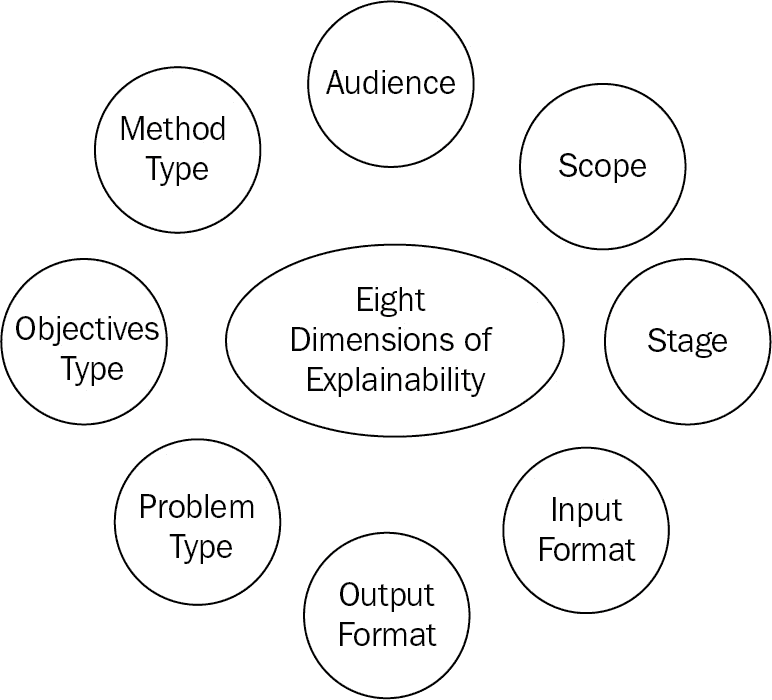
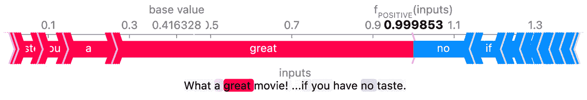
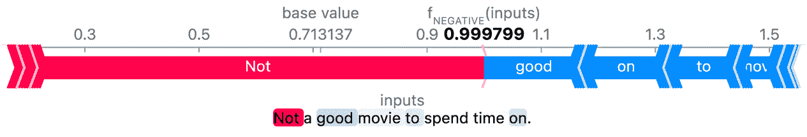
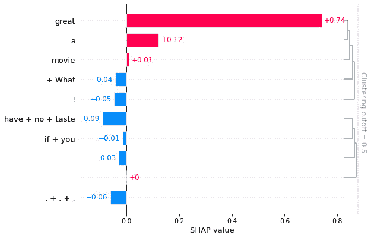
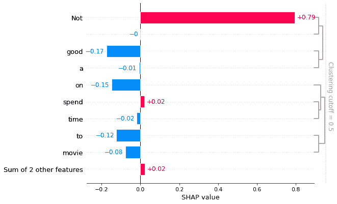
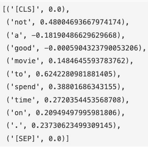
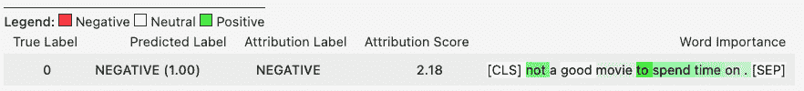

# 第九章：深度学习可解释性基础

可解释性是为自动化系统提供选择性人类可理解的决策解释。在本书的背景下，在**深度学习**（**DL**）开发的整个生命周期中，应将可解释性视为与数据、代码和模型这三大支柱一样重要的产物。这是因为不同的利益相关者和监管者、模型开发者以及模型输出的最终消费者可能对了解数据如何使用以及模型为何产生特定预测或分类有不同的需求。如果没有这样的理解，将难以赢得模型输出消费者的信任，或者在模型输出结果漂移时诊断可能出现的问题。这也意味着可解释性工具不仅应用于解释在生产中部署的模型的预测结果或离线实验期间的情况，还应用于理解离线模型训练中使用的数据特性和在线模型操作中遇到的数据集之间的差异。

此外，在许多高度受监管的行业，如自动驾驶、医疗诊断、银行业和金融业，还有法律法规要求任何个体都有权利获取算法输出的解释的要求。最后，最近的一项调查显示，超过 82%的 CEO 认为基于 AI 的决策必须是可解释的，以便作为企业加速其投资于开发和部署基于 AI 的倡议的信任基础（[`cloud.google.com/blog/topics/developers-practitioners/bigquery-explainable-ai-now-ga-help-you-interpret-your-machine-learning-models`](https://cloud.google.com/blog/topics/developers-practitioners/bigquery-explainable-ai-now-ga-help-you-interpret-your-machine-learning-models)）。因此，学习可解释性的基础知识和相关工具是很重要的，这样我们就知道在何时为何种观众使用何种工具来提供相关、准确和一致的解释。

通过本章结束时，您将能够自信地知道什么是良好的解释，以及存在哪些工具用于不同的可解释性目的，并且将获得使用两个解释性工具箱来解释深度学习情感分类模型的实际经验。

在本章中，我们将涵盖以下主要话题：

+   理解解释性的类别和受众

+   探索 SHAP 可解释性工具包

+   探索 Transformers Interpret 工具箱

# 技术要求

完成本章学习需要满足以下要求：

+   SHAP Python 库：[`github.com/slundberg/shap`](https://github.com/slundberg/shap)

+   Transformers 解释性 Python 库: [`github.com/cdpierse/transformers-interpret`](https://github.com/cdpierse/transformers-interpret)

+   Captum Python 库: [`github.com/pytorch/captum`](https://github.com/pytorch/captum)

+   本章 GitHub 仓库中的代码: [`github.com/PacktPublishing/Practical-Deep-Learning-at-Scale-with-MLFlow/tree/main/chapter09`](https://github.com/PacktPublishing/Practical-Deep-Learning-at-Scale-with-MLFlow/tree/main/chapter09)

# 理解可解释性的类别和受众

正如本章开头所述，深度学习系统的可解释性变得越来越重要，有时在一些高度监管的行业中，如金融、法律、政府和医疗领域，甚至是强制性的。一个因缺乏机器学习可解释性而导致的示例诉讼是**B2C2 诉 Quoine 案**([`www.scl.org/articles/12130-explainable-machine-learning-how-can-you-determine-what-a-party-knew-or-intended-when-a-decision-was-made-by-machine-learning`](https://www.scl.org/articles/12130-explainable-machine-learning-how-can-you-determine-what-a-party-knew-or-intended-when-a-decision-was-made-by-machine-learning))，其中自动化的 AI 交易算法错误地以市场价格的 250 倍下单购买比特币。深度学习模型在生产中的成功应用促进了对可解释性领域的积极研究和开发，因为我们需要理解深度学习模型是如何运作的。你可能听说过**可解释人工智能**（**XAI**）这个术语，它由**美国国防高级研究计划局**（**DARPA**）于 2015 年为其 XAI 计划提出，旨在帮助最终用户更好地理解、信任和有效管理 AI 系统([`onlinelibrary.wiley.com/doi/epdf/10.1002/ail2.61`](https://onlinelibrary.wiley.com/doi/epdf/10.1002/ail2.61))。然而，可解释性的概念早在 1980 年代或更早期的专家系统时代就已出现([`wires.onlinelibrary.wiley.com/doi/full/10.1002/widm.1391`](https://wires.onlinelibrary.wiley.com/doi/full/10.1002/widm.1391))，而近期对于可解释性话题的关注高潮，只是突显了它的重要性。

那么，什么是解释？事实证明，这仍然是机器学习（ML）、深度学习（DL）和人工智能（AI）领域的一个活跃研究课题。从实际应用的角度来看，解释的精确定义取决于谁在什么时间、出于什么目的，基于机器学习/深度学习/人工智能的生命周期需求进行解释（[`dl.acm.org/doi/abs/10.1145/3461778.3462131`](https://dl.acm.org/doi/abs/10.1145/3461778.3462131)）。因此，可解释性可以被定义为*为受众提供适当的、易于理解的解释，阐明模型为什么以及如何给出某些预测结果*的能力。这也可能包括数据可解释性的方面，涉及数据是如何通过溯源追踪被使用的，数据的特征是什么，或是数据是否由于意外事件而发生了变化。例如，由于突如其来的新冠疫情，销售和营销邮件发生了变化（[`www.validity.com/resource-center/disruption-in-email/`](https://www.validity.com/resource-center/disruption-in-email/)）。这种数据的变化将意外改变模型预测结果的分布。在解释模型漂移时，我们需要考虑到这种数据的变化。这意味着，解释的复杂性需要根据接收受众进行定制和选择，而不会提供过多的信息。例如，包含许多技术术语的复杂解释，如*激活*，可能不如使用商业友好的术语进行简单文本总结的效果好。这进一步表明，可解释性也是一个**人机界面/交互**（**HCI**）话题。

要全面了解可解释性类别及其对应的受众，我们考虑了*图 9.1*中展示的八个维度：



图 9.1 – 理解可解释性的八个维度

从*图 9.1*可以看出，可解释性的复杂性可以从八个维度进行理解。这不一定是一个详尽的分类，而是帮助理解来自 HCI、人工智能/机器学习/深度学习完整生命周期以及不同技术方法的不同视角的指南。在接下来的讨论中，我们将重点介绍与深度学习应用最相关的维度及其相互关系，因为本章的重点是深度学习的可解释性。

## 受众：谁需要知道

正如最近一项研究指出的（[`dl.acm.org/doi/abs/10.1145/3461778.3462131`](https://dl.acm.org/doi/abs/10.1145/3461778.3462131)），了解谁在什么阶段需要知道什么类型的解释是非常重要的，这将在整个 AI 项目生命周期中产生影响。这也将影响解释的输出格式。另一项早期研究（[`arxiv.org/pdf/1702.08608.pdf`](https://arxiv.org/pdf/1702.08608.pdf)）也指出，根据是否有领域专家参与实际应用任务（例如，诊断癌症的医学专家），验证一个解释的成本可能也很高，因为这需要一个实际的人类在实际工作环境中参与。

对于当前的实际深度学习项目，我们需要根据目标受众（如数据科学家、机器学习工程师、业务利益相关者、**用户体验（UX）**设计师或最终用户）定制解释方法和展示方式，因为没有一种通用的方法适用于所有情况。

## **阶段：在深度学习生命周期中何时提供解释**

**阶段**通常指的是在模型开发生命周期中可以提供解释的时机。对于像决策树这样的模型，由于它是一个白盒模型，我们说我们可以提供**事前**可解释性。然而，目前大多数深度学习（DL）模型通常被视为黑盒模型，尽管自解释的深度学习模型正在逐渐开发，且具有事前可解释性（[`arxiv.org/abs/2108.11761`](https://arxiv.org/abs/2108.11761)）。因此，对于当前的实际深度学习应用，需要**事后**可解释性。此外，当模型开发阶段处于训练、验证或生产时，解释的范围可以是全局的、群体的或局部的，即使使用相同的事后可解释性工具（[`towardsdatascience.com/a-look-into-global-cohort-and-local-model-explainability-973bd449969f`](https://towardsdatascience.com/a-look-into-global-cohort-and-local-model-explainability-973bd449969f)）。

## 范围：哪些预测需要解释

**范围**指的是我们是否能够为所有预测、部分预测或仅仅一个特定预测提供解释，即使我们为黑盒深度学习模型使用相同的事后工具。最常见的全局可解释性是描述**特征重要性**，并允许用户了解哪些特征对整体模型性能最有影响。局部可解释性则是关于特定预测实例的**特征归因**。特征归因与特征重要性的区别在于，特征归因不仅量化了特征影响的排名和大小，还量化了影响的方向（例如，一个特征是正向还是负向地影响了预测）。

许多后期工具对于深度学习模型在局部可解释性方面表现优秀。群体可解释性有助于识别一些特定群体（如年龄或种族群体）可能存在的模型偏差。对于深度学习模型，如果我们想要得到全局解释，通常需要使用替代模型（如决策树模型）来模拟深度学习模型的行为（[`towardsdatascience.com/explainable-ai-xai-methods-part-5-global-surrogate-models-9c228d27e13a`](https://towardsdatascience.com/explainable-ai-xai-methods-part-5-global-surrogate-models-9c228d27e13a)）。然而，这种方法并不总是奏效，因为很难判断替代模型是否足够准确地逼近原始黑箱模型的预测。因此，在实际操作中，深度学习模型通常使用局部可解释性工具，如**SHapley 加法解释**（**SHAP**），我们将在方法维度中对此进行解释。

## **输入数据格式：什么是输入数据的格式**

**输入数据格式**指的是在开发和使用模型时，我们处理的输入数据类型。一个简单的模型可能只关注单一类型的输入数据格式，例如文本，而许多复杂的模型可能需要结合结构化的表格数据和非结构化数据，如图像或文本。此外，还需要单独理解输入数据的潜在偏差（在模型训练和验证期间）或漂移（在生产环境中）。因此，这是一个相当复杂的话题。数据解释也可以用于监控生产环境中的数据异常和漂移。这适用于所有类型的机器学习/深度学习模型。

## **输出数据格式：什么是输出解释的格式**

**输出解释格式**指的是我们如何向目标受众呈现解释。通常，图像解释可能是一个条形图，显示特征的重要性及其得分，或者是一个显著性图，突出显示每个图像中某一特定类别的空间支持，适用于与图像相关的机器学习问题。对于文本输出，它可能是一个英语句子，解释为何某个信用申请因几个可理解的因素而被拒绝。**自然语言处理（NLP）**模型的可解释性也可以通过交互式探索实现，使用显著性图、注意力机制以及其他丰富的可视化手段（参见 Google 的**语言可解释性工具**（**LIT**）示例：[`ai.googleblog.com/2020/11/the-language-interpretability-tool-lit.html`](https://ai.googleblog.com/2020/11/the-language-interpretability-tool-lit.html)）。由于没有一劳永逸的解释方法适用于这些复杂的输出格式，因此，满足受众对解释的需求、经验和期望是至关重要的。

## **问题类型：什么是机器学习问题类型**

**问题类型**广泛地指代所有种类的机器学习/人工智能问题，但就实际应用而言，目前商业上成功的主要问题大多集中在分类、回归和聚类。强化学习和推荐系统在行业中的应用也越来越成功。深度学习模型现在常常应用于所有这些类型的问题，或者至少正在被评估作为潜在的候选模型。

## **目标类型：解释的动机或目标是什么**

**目标类型**指的是在人工智能/机器学习项目中使用可解释性的动机。人们认为，可解释性的首要目标是通过提供足够的理解来获得信任，揭示 AI 系统行为中的脆弱性、偏差和缺陷。另一个动机是从输入和输出预测中推断因果关系。其他目标包括通过更好地理解 AI/ML 系统的内部工作原理来提高模型的准确性，以及在可能涉及严重后果时，通过透明的解释来为模型行为和决策提供正当理由。甚至可能通过解释揭示基于解释的未知见解和规则（[`www.tandfonline.com/doi/full/10.1080/10580530.2020.1849465`](https://www.tandfonline.com/doi/full/10.1080/10580530.2020.1849465)）。总的来说，打破黑箱非常重要，以便在真实的生产系统中使用 AI/ML 模型和系统时，能够以信心进行使用。

## 方法类型：使用的具体后验解释方法是什么

**方法类型（后验分析）**指的是与深度学习模型密切相关的后验分析方法。后验分析方法主要分为两类：基于扰动的方法和基于梯度的方法。最近的研究开始尝试将这两种方法统一起来，尽管这种统一方法尚未广泛应用于实际中（[`teamcore.seas.harvard.edu/publications/towards-unification-and-robustness-perturbation-and-gradient-based`](https://teamcore.seas.harvard.edu/publications/towards-unification-and-robustness-perturbation-and-gradient-based)）。以下是对这两种方法的简要讨论：

+   基于扰动的方法利用对单个实例的扰动来构建可解释的局部近似模型，使用线性模型来解释预测结果。最受欢迎的基于扰动的方法包括**局部可解释模型无关解释方法**（**LIME**），([`arxiv.org/pdf/1602.04938.pdf`](https://arxiv.org/pdf/1602.04938.pdf))，SHAP，以及 LIME 和 SHAP 的变种，如 BayesLIME、BayesSHAP、TreeSHAP 等 ([`towardsdatascience.com/what-are-the-prevailing-explainability-methods-3bc1a44f94df`](https://towardsdatascience.com/what-are-the-prevailing-explainability-methods-3bc1a44f94df))。LIME 可以用于表格数据、图像和文本输入数据，并且是模型无关的。这意味着，LIME 可以用于任何类型的分类器（无论是基于树的模型还是深度学习模型），不受所使用算法的限制。SHAP 使用来自合作博弈论的原理，确定不同特征对预测的贡献，从而量化每个特征的影响。SHAP 生成所谓的 Shapley 值，它是所有可能的联盟或特征组合的边际贡献的平均值。它适用于多种类型的模型，包括深度学习模型，尽管对于基于树的模型，如 XGBoost 或 LightGBM，计算时间通常会更快 ([`github.com/slundberg/shap`](https://github.com/slundberg/shap))。

+   基于梯度的方法，如 SmoothGrad ([`arxiv.org/abs/1706.03825`](https://arxiv.org/abs/1706.03825)) 和集成梯度 ([`towardsdatascience.com/understanding-deep-learning-models-with-integrated-gradients-24ddce643dbf`](https://towardsdatascience.com/understanding-deep-learning-models-with-integrated-gradients-24ddce643dbf))，通过计算相对于输入维度的梯度来解释模型预测。它们可以应用于图像和文本输入数据，尽管有时文本输入可能会受到操控或对抗性攻击的影响 ([`towardsdatascience.com/limitations-of-integrated-gradients-for-feature-attribution-ca2a50e7d269`](https://towardsdatascience.com/limitations-of-integrated-gradients-for-feature-attribution-ca2a50e7d269))，这将不希望地改变特征重要性。

请注意，还有一些其他类型的方法，比如反事实方法 ([`christophm.github.io/interpretable-ml-book/counterfactual.html`](https://christophm.github.io/interpretable-ml-book/counterfactual.html)) 或基于原型的方法 ([`christophm.github.io/interpretable-ml-book/proto.html`](https://christophm.github.io/interpretable-ml-book/proto.html))，这些方法我们在本书中不会涉及。

在讨论了可解释性的多个维度后，重要的是要知道 XAI（可解释人工智能）仍然是一个新兴领域（[`fairlyaccountable.org/aaai-2021-tutorial/doc/AAAI_slides_final.pdf`](https://fairlyaccountable.org/aaai-2021-tutorial/doc/AAAI_slides_final.pdf)），有时甚至很难在应用到同一数据集或模型时找到不同可解释性方法之间的一致性（请参见关于可解释机器学习中的分歧问题的最新研究，站在从业者的角度：[`arxiv.org/abs/2202.01602`](https://arxiv.org/abs/2202.01602)）。最终，确实需要进行一些实验，才能找出哪些可解释性方法提供了经过人工验证的解释，并满足现实世界中某个特定预测任务的需求。

在本章的接下来的两个部分中，我们将重点介绍一些流行的、正在兴起的工具包，并通过一些实践实验来学习如何进行可解释性分析。

# 探索 SHAP 可解释性工具箱

为了我们的学习目的，让我们在实验一些示例时回顾一些流行的可解释性工具箱。根据 GitHub 的星标数量（截至 2022 年 4 月为 16,000 个，[`github.com/slundberg/shap`](https://github.com/slundberg/shap)），SHAP 是最广泛使用和集成的开源模型可解释性工具箱。它也是与 MLflow 集成的基础解释工具。在这里，我们将进行一个小实验，亲身体验这种工具是如何工作的。让我们使用一个情感分析 NLP 模型，探索 SHAP 如何用于解释模型的行为：

1.  在从 GitHub 检查本章的代码后，在本地环境中设置虚拟环境。运行以下命令将创建一个名为`dl-explain`的新虚拟环境：

    ```py
    conda env create -f conda.yaml
    ```

这将安装 SHAP 及其相关依赖项，例如`matplotlib`，并将它们添加到该虚拟环境中。创建此虚拟环境后，通过运行以下命令来激活该虚拟环境：

```py
conda activate dl-explain
```

现在，我们准备好使用 SHAP 进行实验了。

1.  您可以查看`shap_explain.ipynb`笔记本，跟随其中的实验。该笔记本的第一步是导入相关的 Python 库：

    ```py
    import transformers
    import shap
    from shap.plots import *
    ```

这些导入将允许我们使用 Hugging Face 的 transformers 管道 API，获取一个预训练的 NLP 模型并使用 SHAP 函数。

1.  然后，我们使用 transformers 管道 API 创建`dl_model`来进行`sentiment_analysis`。请注意，这是一个预训练的管道，因此我们可以在不进行额外微调的情况下使用它。该管道中使用的默认转换器模型是`distilbert-base-uncased-finetuned-sst-2-english`（https://huggingface.co/distilbert-base-uncased-finetuned-sst-2-english）：

    ```py
    dl_model = transformers.pipeline(
        'sentiment-analysis', return_all_scores=True)
    ```

这将生成一个准备好预测输入句子情感（正面或负面）的模型。

1.  尝试用两个输入句子测试这个`dl_model`，看看输出是否有意义：

    ```py
    dl_model(
        ["What a great movie! ...if you have no taste.", 
         "Not a good movie to spend time on."])
    ```

这将输出每句话的标签和概率分数，如下所示：

```py
[[{'label': 'NEGATIVE', 'score': 0.00014734962314832956}, {'label': 'POSITIVE', 'score': 0.9998526573181152}], [{'label': 'NEGATIVE', 'score': 0.9997993111610413}, {'label': 'POSITIVE', 'score': 0.00020068213052581996}]]
```

看起来第一句话被预测为`POSITIVE`的概率很高，而第二句话则被预测为`NEGATIVE`的概率很高。现在，如果我们仔细观察第一句话，我们可能会认为模型的预测是错误的，因为句子的后半部分（`no taste`）带有微妙的负面情绪。因此，我们想知道模型为何做出这样的预测。这就是模型可解释性发挥作用的地方。

1.  现在，让我们使用 SHAP API，`shap.Explainer`，获取我们感兴趣的两句话的 Shapley 值：

    ```py
    explainer = shap.Explainer(dl_model) 
    shap_values = explainer(["What a great movie! ...if you have no taste.", "Not a good movie to spend time on."])
    ```

1.  一旦我们有了`shap_values`，就可以使用不同的可视化技术来展示 Shapley 值。第一种方法是使用`shap.plot.text`来可视化第一句话的 Shapley 值，当预测标签为`POSITIVE`时：

    ```py
    shap.plots.text(shap_values[0, :, "POSITIVE"])
    ```

这将生成如下图表：



图 9.2 – 句子 1 的 SHAP 可视化，带有正向预测

如*图 9.2*所示，词语`great`的 SHAP 值非常大，主导了最终预测的影响，而词语`no`对最终预测的影响较小。这导致了最终的`POSITIVE`预测结果。那么，第二句话带有`NEGATIVE`预测的情况如何呢？运行以下命令将生成一个类似的图表：

```py
shap.plots.text(shap_values[1, :, "NEGATIVE"])
```

该命令将创建如下图表：



图 9.3 – 句子 2 的 SHAP 可视化，带有负向预测

如*图 9.3*所示，词语`Not`对最终预测有很强的影响，而词语`good`的影响非常小，导致最终预测为`NEGATIVE`情感。这是非常有道理的，对模型行为的解释很到位。

1.  我们还可以使用不同的图表来可视化`shap_values`。一种常见的方式是条形图，它显示特征对最终预测的贡献。运行以下命令将为第一句话生成一个图表：

    ```py
    bar(shap_values[0, :,'POSITIVE'])
    ```

这将生成如下的条形图：



图 9.4 – 句子 1 的 SHAP 条形图，带有正向预测

从*图 9.4*中可以看出，该图表按重要性对特征进行了从上到下的排名，其中对最终预测有正面影响的特征绘制在`x`轴的正侧，而负面贡献则绘制在`x`轴的负侧。`x`轴表示每个标记或单词的 SHAP 值，并带有符号（+ 或 -）。这清楚地表明，单词`great`是一个强正面因素，影响了最终预测，而`have no taste`有一定的负面影响，但不足以改变最终预测的方向。

类似地，我们可以为第二个句子绘制如下的条形图：

```py
bar(shap_values[1, :,'NEGATIVE'])
```

这将生成以下的条形图：



](img/B18120_09_005.jpg)

图 9.5 – 带有负面预测的第二个句子的 SHAP 条形图

从*图 9.5*中可以看出，单词`Not`对最终预测有很强的贡献，而单词`good`排在第二位。这两个词对最终预测的影响是相反的，但显然，单词`Not`的影响要强得多，SHAP 值也大得多。

如果你已经跟着这个例子走，并在你的笔记本中看到了 SHAP 图表，那么恭喜你！这意味着你已经成功地运行了 SHAP 可解释性工具，为 NLP 文本情感分析中的深度学习转换器模型提供了解释。

让我们进一步探索另一种流行的可解释性工具，看看它们如何提供不同的解释。

# 探索 Transformers Interpret 工具箱

如我们在本章的第一节中回顾的那样，有两种主要方法：基于扰动的和基于梯度的事后可解释性工具。SHAP 属于基于扰动的方法家族。现在，让我们来看一个基于梯度的工具箱，名为**Transformers Interpret**（[`github.com/cdpierse/transformers-interpret`](https://github.com/cdpierse/transformers-interpret)）。这是一个相对较新的工具，但它建立在一个名为**Captum**（[`github.com/pytorch/captum`](https://github.com/pytorch/captum)）的统一模型可解释性和理解库之上，该库为 PyTorch 提供了统一的 API，可以使用基于扰动或梯度的工具（[`arxiv.org/abs/2009.07896`](https://arxiv.org/abs/2009.07896)）。Transformers Interpret 进一步简化了 Captum 的 API，使我们能够快速探索基于梯度的可解释性方法，从而获得实践经验。

首先，请确保您已经根据前一节的描述，设置并激活了`dl-explain`虚拟环境。然后，我们可以使用相同的 Hugging Face 转换器情感分析模型，探索一些 NLP 情感分类示例。接下来，我们可以执行以下步骤，学习如何使用 Transformers Interpret 进行模型解释。您可能想查看`gradient_explain.ipynb`笔记本，以跟随说明操作：

1.  按如下方式将相关包导入笔记本：

    ```py
    from transformers import AutoModelForSequenceClassification, AutoTokenizer
    from transformers_interpret import SequenceClassificationExplainer
    ```

这将使用 Hugging Face 的 transformer 模型和分词器，以及来自`transformers_interpret`的可解释性功能。

1.  使用与前一节相同的预训练模型创建模型和分词器，该模型是`distilbert-base-uncased-finetuned-sst-2-english`模型：

    ```py
    model_name = "distilbert-base-uncased-finetuned-sst-2-english"
    model = AutoModelForSequenceClassification.from_pretrained(model_name)
    tokenizer = AutoTokenizer.from_pretrained(model_name)
    ```

现在我们已经有了模型和分词器，我们可以使用`SequenceClassificationExplainer` API 创建一个可解释性变量。

1.  创建一个解释器并给出示例句子，以获取来自解释器的`word`归因：

    ```py
    cls_explainer = SequenceClassificationExplainer(model, tokenizer)
    word_attributions = cls_explainer("Not a good movie to spend time on.")
    ```

1.  我们也可以在检查`word`归因之前，通过运行以下命令获取预测标签：

    ```py
    cls_explainer.predicted_class_name
    ```

这将产生`Negative`的结果，意味着预测为负面情绪。那么，让我们看看解释器是如何为这个预测提供解释的。

1.  我们可以仅显示`word_attributions`值，或者我们可以将其可视化。`word_attributions`的值如下：



图 9.6 – 使用分层集成梯度的词归因值，结果为负面预测

从*图 9.6*可以看出，使用分层集成梯度方法，这是当前解释器在 Transformers Interpret 库中实现的默认方法，`not`这个词对最终的预测结果产生了积极的影响，最终的预测是负面情绪。这是有道理的。请注意，其他一些词，如`to spend time on`，对最终预测也有较强的积极影响。考虑到交叉注意力机制，似乎模型正试图提取`not to spend time on`作为最终预测的主要归因。请注意，我们还可以像下面这样可视化这些`word`归因：

```py
cls_explainer.visualize("distilbert_viz.html")
```

这将产生以下图表：



图 9.7 – 使用分层集成梯度的词归因值，结果为负面预测

从*图 9.7*可以看出，它突出了`not to spend time on`这个词对最终负面预测结果的积极影响。

现在我们已经实验了基于扰动和梯度的可解释性方法，我们已成功完成了使用可解释性工具进行事后本地解释的动手探索。

接下来，我们将总结在本章中学到的内容。

# 总结

在本章中，我们通过八维分类回顾了 AI/ML 中的可解释性。虽然这不一定是一个全面或详尽的概述，但它为我们提供了一个大致的框架，包括谁需要解释、不同阶段和范围的解释、各种输入输出格式的解释、常见的 ML 问题和目标类型，以及最后的不同后验可解释性方法。接着，我们提供了两个具体的练习来探索 SHAP 和 Transformers 可解释工具箱，它们可以为 NLP 文本情感 DL 模型提供扰动和基于梯度的特征归因解释。

这为我们使用 DL 模型的可解释性工具奠定了坚实的基础。然而，考虑到 XAI 的积极发展，这仅仅是将 XAI 应用于 DL 模型的开始。其他可解释性工具箱，如 TruLens（[`github.com/truera/trulens`](https://github.com/truera/trulens)）、Alibi（[`github.com/SeldonIO/alibi`](https://github.com/SeldonIO/alibi)）、微软的负责任 AI 工具箱（[`github.com/microsoft/responsible-ai-toolbox`](https://github.com/microsoft/responsible-ai-toolbox)）和 IBM 的 AI 可解释性 360 工具包（[`github.com/Trusted-AI/AIX360`](https://github.com/Trusted-AI/AIX360)）都在积极开发中，值得进一步研究和学习。*深入阅读*部分还提供了额外的链接，帮助你继续学习这一主题。

现在我们已经了解了可解释性的基础知识，在下一章中，我们将学习如何在 MLflow 框架中实现可解释性，从而为在 MLflow 框架内提供统一的解释方式。

# 深入阅读

+   *可解释 AI 的新前沿*：[`towardsdatascience.com/new-frontiers-in-explainable-ai-af43bba18348`](https://towardsdatascience.com/new-frontiers-in-explainable-ai-af43bba18348)

+   *走向严谨的可解释机器学习科学*：[`arxiv.org/pdf/1702.08608.pdf`](https://arxiv.org/pdf/1702.08608.pdf)

+   *值得信赖的 AI 工具包方法*：[`opendatascience.com/the-toolkit-approach-to-trustworthy-ai/`](https://opendatascience.com/the-toolkit-approach-to-trustworthy-ai/)

+   *通过概念学习 Ante-hoc 可解释模型的框架*：[`arxiv.org/abs/2108.11761`](https://arxiv.org/abs/2108.11761)

+   *解密 ML 模型的后验可解释性*：[`spectra.mathpix.com/article/2021.09.00007/demystify-post-hoc-explainability`](https://spectra.mathpix.com/article/2021.09.00007/demystify-post-hoc-explainability)

+   *全球、群体和局部模型可解释性探讨*：[`towardsdatascience.com/a-look-into-global-cohort-and-local-model-explainability-973bd449969f`](https://towardsdatascience.com/a-look-into-global-cohort-and-local-model-explainability-973bd449969f)

+   *当前主流的可解释性方法是什么？* [`towardsdatascience.com/what-are-the-prevailing-explainability-methods-3bc1a44f94df`](https://towardsdatascience.com/what-are-the-prevailing-explainability-methods-3bc1a44f94df)

+   *可解释人工智能：目标、利益相关者与未来研究机会*：[`www.tandfonline.com/doi/full/10.1080/10580530.2020.1849465`](https://www.tandfonline.com/doi/full/10.1080/10580530.2020.1849465)
