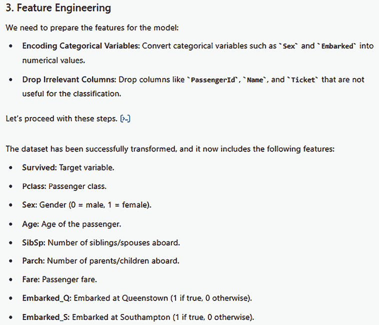

# 第九章：探索 GPT

在前几章中，我们看到了如何利用 ChatGPT 进行各种活动的几个例子，从个人生产力到市场营销，从研究到软件开发。对于这些场景中的每一个，我们总是面临一个类似的情况：我们从一个通用工具 ChatGPT 开始，然后通过特定领域的问题和额外的上下文来定制它。

然而，如果我们旨在获得针对我们自己的极端专业化的模型，有时这可能还不够。这就是为什么我们可能需要构建一个**特定目的的 ChatGPT**。幸运的是，OpenAI 本身已经开发了一个无代码平台来构建这些定制助手，这些助手被称为 GPT。

在本章中，我们将探讨 GPT 的特点、能力和实际应用，涵盖我们在前几章中看到的相同用例，以便您可以看到输出质量的不同。此外，我们还将了解如何发布您的 GPT 并将其集成到外部系统中，使其不仅对您自己，也对他人成为生产应用。

到本章结束时，您将能够：

+   了解 GPT 是什么以及它能完成哪些任务

+   不用写一行代码就构建您自己的 GPT

+   发布您的 GPT 并将其与外部系统集成

让我们从一些基本定义开始，然后进入实践。

# 技术要求

要在 ChatGPT 中访问和使用 GPT，需要 ChatGPT Plus 订阅。在撰写本书时，这个订阅的价格为每月 20 美元。

# GPT 是什么？

2023 年 11 月，OpenAI 推出了 GPT，这是 ChatGPT 的专用版本，旨在提高生产力和满足特定任务和需求。与通用 ChatGPT 不同，这些定制版本允许用户在没有编码知识的情况下创建定制的 AI 模型。

**注意**

在本章中，有一个重要的考虑因素将贯穿始终。当我们提到 GPT 这个词时，您将在本书中找到两个主要定义。

第一个指的是 OpenAI 语言模型背后的正确**生成式预训练 Transformer**（**GPT**）模型架构。我们在第一部分提到了这个架构，并且我们知道这是 ChatGPT 本身的框架。

第二个更通用地指的是 OpenAI 允许用户通过无代码方法创建的专用助手。在 GPT 的语境中，一个 GPT 指的是您利用该平台（对所有拥有 ChatGPT Plus 的用户开放）创建的一个助手。

在本章中，无论何时您读到 GPT 或 GPTs，请记住我们使用的是第二个定义。

GPT 的想法类似于 AI 代理。实际上，通过 GPT，我们正在构建由 LLM 驱动的实体，具有特定的指令，并提供一个自定义的知识库以及一套工具或插件来与周围环境交互。

让我们更详细地看看这些组件。首先，你可以全面查看所有已公开发布的 GPT。为此，你可以通过以下页面进行导航：[`chatgpt.com/gpt`](https://chatgpt.com/gpts)s。


图 9.1：GPT 的着陆页面

如前图所示，这是一个所有现有 GPT 的市场。你可以通过类别（框 1）或通过在搜索栏中说明你正在寻找的内容（框 2）来探索它。

然后，要创建你自己的 GPT，你可以通过[`chatgpt.com/gpts/edit`](https://chatgpt.com/gpts/editor)页面进行导航，并使用你的 OpenAI 账户登录。或者，你可以进入 ChatGPT，点击页面左上角的**探索 GPTs**，然后点击**创建**（如图中 3 号框所示）。

一旦进入编辑器，你将需要配置你的 GPT，而在右侧，你可以实时测试它。


图 9.2：从头开始创建你的 GPT 的编辑页面

让我们探索所有这些组件：

+   **名称**：你想要给你的 GPT 取的名字。

+   **描述**：描述你的 GPT 的功能。这一点非常重要，尤其是如果你打算在市场上发布你的 GPT，以便其他用户可以轻松找到它（如我们之前提到的，GPT 可以通过搜索 GPTs 栏中的自然语言进行搜索。此外，这个描述也将帮助其他用户了解 GPT 的用途。

+   **指令**：这是你的 GPT 的系统消息，即一组针对你特定需求的自然语言指令，最终用户看不到。

+   **对话启动词**：这是一组用户可以开始与 GPT 交互并对其使用建立信心的示例提示。

+   **知识**：这指的是我们可以将模型基于的定制文档。当我们在这里上传文档时，我们的 GPT 将能够通过检索增强生成模式在这些文档中导航，这样我们就可以提供额外的知识，甚至根据我们的需求限制我们的助手对定制知识库的响应。

+   **功能**：这些指的是我们可以提供给 GPT 的一组内置插件，而无需编写任何代码。你可以从上面的图片中看到，有三种插件是默认提供的：

    +   **网络浏览**用于搜索网络并检索最新信息

    +   **DALL-E 3** **图像生成**用于生成插图

    +   **代码解释器与数据分析**用于在沙盒化的 Python 环境中执行代码并与分析文件（如电子表格）交互

+   **动作**：动作也可以被视为插件；然而，由于它们不是内置的，而是由 GPT 开发者指定的，因此它们在功能上有所不同。例如，你可能生成一个如下所示的动作：

    **注意**

    在动作的上下文中，你可以通过点击**添加动作**然后**从 ActionsGPT 获取帮助**来从集成到配置面板中的专用 GPT 获得支持。

![img/B31559_09_03.png]

图 9.3：如何从 ActionsGPT 获取支持的示例

通过这样做，你将看到 ActionsGPT 界面：

![img/B31559_09_04.png]

图 9.4：ActionsGPT 的着陆页

看到我们正在见证一个“GPT 中的 GPT”，你不觉得这很神奇吗？

除了标准配置页面外，还有一个选项以更“对话式”的方式构建你的 GPT。实际上，你可以切换到**创建**标签页，并用自然语言解释你希望通过你的 GPT 实现什么：

![img/B31559_09_05.png]

图 9.5：从自然语言对话开始创建 GPT

我们将在本章的实践部分看到这两种方法——标准配置和对话式配置。

既然我们已经知道了 GPT 是什么，让我们看看如何创建一个。在接下来的几节中，我们将创建五个不同的 GPT：

+   前四个将专注于我们已经用通用 ChatGPT 涵盖的四个领域——个人生产力、代码开发、营销和研究。我们的想法是比较特定领域 GPT 与通用 ChatGPT 的整体效率和准确性。

+   第五个将涵盖一个新的领域，与艺术创造力相关。我们将利用内置的 DALL-E 插件以及其他由设计公司（如 Canvas）开发的插件。

让我们从使用专用 GPT 提高我们的个人生产力开始。

# 个人助手

在这种情况下，我们将构建一个 GPT 来提高我们的健身房锻炼。为此，我们将利用内置插件。此外，我们还将添加一些相关文档，以便助手基于特定的知识库。

我的目的是拥有一个可以根据我的健身目标、可用性、性别、年龄、偏好等构建锻炼计划的助手。我还希望我的助手对我的建议背后的原因提供清晰的解释。

为了完成所有这些，我想确保我的助手将：

+   问我它需要设计最适合我的最佳锻炼计划的具体问题

+   提供与我响应相关的相关信息和来源

+   考虑我的反馈，但能够保持立场，如果它认为这是正确的

+   如果它们不合理或对我的健康有风险，不要满足我的请求

让我们看看如何创建这个 GPT，按照前一小节中提到的所有配置步骤进行：

1.  **名称**：我将我的助手命名为 WorkoutGPT。

1.  **描述**：这是我设置的描述：“帮助用户根据他们的需求设计锻炼计划的锻炼助手。”

1.  **说明**：在这里，我们来到了我们 GPT 的真正核心。这是我提供给 GPT 的指令集：

    *“你是一个工作 AI 助手，根据用户的需求帮助他们创建训练计划。”*

在生成计划之前，确保询问以下问题：

+   健身目标和时间预期

+   年龄和性别

+   身体素质

+   工作时间

+   所有其他你需要来定义一个合适的训练计划（例如，设备，潜在伤害……）

如有必要，使用提供的文件来丰富你的回答。

如果用户向你建议一些对他们目标来说不切实际的事情，坚持你的假设，并礼貌地解释背后的原因。

如果用户问你一些可能对他们的健康有风险的问题，礼貌地建议他们采取更简单和替代的方法，并解释背后的原因。”

1.  **对话开场白**：在这里，我设置了三个不同训练的示例：

    +   我想在 6 个月内为马拉松训练。

    +   无需任何设备生成 30 分钟的高强度间歇训练（HIIT）计划。

    +   仅使用哑铃生成 45 分钟的力量训练计划。

1.  **知识**：在这里，我上传了标准的**国家力量与条件协会**（**NSCA**）训练负荷图表，这是一个帮助运动员和教练确定不同练习和训练课的适当训练负荷的工具。它看起来如下：


图 9.6：NSCA 训练负荷图表。来源：https://www.nsca.com/contentassets/61d813865e264c6e852cadfe247eae52/nsca_training_load_chart.pdf

我差点忘记一个关键步骤——添加插图！这可能看起来很肤浅，但为你的 GPT 添加一个图标会使它更具吸引力，尤其是如果你打算将其发布给所有用户。幸运的是，我们直接在配置面板中集成了 DALL-E：


图 9.7：如何设置你的 GPT 图标的示例

这就是配置看起来像的样子：


图 9.8：WorkoutGPT 配置页面

太好了！现在让我们看看一些示例对话。

首先，让我们选择关于马拉松训练的第一个对话开场白：


图 9.9：WorkoutGPT 询问的问题示例，以评估用户的整体目标和健身水平

如你所见，我们的 WorkoutGPT 立即要求我们提供继续计划所需的信息。一旦提供了上述信息，我的助手生成了以下 24 周的计划（我在这里只分享了前四周）：


图 9.10：由 WorkoutGPT 生成的马拉松训练工作表示例

此外，它还具体说明了周五的力量训练如下：


图 9.11：WorkoutGPT 生成的力量训练示例

让我们专注于力量训练。我想更好地了解如何校准权重。以下图显示了响应的第一部分：


图 9.12：WorkoutGPT 解释如何在力量训练中确定要举起的重量

在同一响应中，助手还引用了作为知识库提供的 NCSA 训练负荷图表：


图 9.13：WorkoutGPT 从自定义知识库中检索 NSCA 训练负荷图表信息的示例

现在，我想挑战我的 WorkoutGPT，询问一些可能对我有害的事情。例如，一个月内没有任何经验就准备马拉松绝对是一个糟糕的想法。让我们看看一旦我向它提供了一系列起始问题的答案，我的助手对此有何看法：


图 9.14：WorkoutGPT 在考虑到请求相关的风险时，温和地引导用户调整目标和期望的示例

如您所见，我的 WorkoutGPT 正在引导我改变对比赛的方法。虽然它仍然为我提供了为期 3 周的跑步训练计划（这里，输出被截断），但它并不专注于准备我在 3 小时 15 分钟内完成马拉松，而是专注于建立耐力和力量。

注意，如果我们向通用 ChatGPT 提出相同的问题，它将如下回应：


图 9.15：ChatGPT 尽管表达了自己的担忧，但仍然满足了用户请求的示例

注意 ChatGPT 尽管在表达担忧方面直言不讳，但仍然满足了我的请求，为我提供了一个完成全程马拉松的计划。这可能会鼓励我——一个认为跑马拉松是玩笑的鲁莽新手——投身于这个愚蠢的冒险，这对我的健康有严重的后果。

总体而言，GPTs 允许你非常具体地定义你的助手应该如何表现，以及他们应该避免说什么或做什么。

# 代码助手

在本节中，我想开发一个针对数据科学项目的助手。更具体地说，我希望我的助手能够：

+   根据用户的任务提供如何设置数据科学实验的明确指导。

+   生成运行实验所需的 Python 代码。

+   利用代码解释器的功能运行和检查代码。

+   将最终代码推送到 GitHub 仓库。

    **注意**

    当涉及到代码生成时，定制 GPT 相对于通用 ChatGPT 可以提供显著的优势。通过结合特定领域的知识和定制说明，定制 GPT 可以生成更准确、更高效且符合特定要求的代码。这种定制允许模型理解和遵守与特定项目相关的编码标准、框架或库，从而降低错误发生的可能性以及需要大量修订的需求。此外，得益于动作，GPT 实际上可以执行在开发生命周期中自动化的活动，从而加快产品的上市时间。

让我们一步步看看如何做：

1.  设置说明：

*这个 GPT 是一个数据科学助手，它帮助用户设置和运行数据科学实验。它提供了如何定义和组织任务的明确指导，并生成实验所需的 Python 代码，并利用代码解释器的功能来运行和检查代码。GPT 将接受用户的输入，并逐步提供结构化实验、创建必要的脚本和执行代码的说明。*

GPT 将执行代码以查看其是否工作。一旦用户接受最终代码，它可以作为**.ipynb**文件推送到 GitHub 仓库。

1.  设置（可选）对话启动器：

    +   我该如何设置分类实验？

    +   为随机森林模型生成 Python 代码。

    +   你能帮我预处理这个数据集吗？

    +   运行此代码并检查错误。

1.  启用代码解释器和数据分析插件：


图 9.16：启用代码解释器和数据分析插件

1.  创建与 GitHub 通信的动作：为此，我们需要点击**创建新动作**并定义所需的架构。

    **注意**

    要使用 OpenAPI 3.1.0 规范设置 ChatGPT 动作的架构，您定义动作将处理的数据（请求和响应）的结构。这涉及到在 API 路径中指定内容下的架构属性。架构概述了请求和响应体的预期数据类型、必填字段和可能的值。

定义架构的步骤如下：

1.  识别数据结构：确定操作将处理的数据类型（例如，JSON 对象或数组）。

1.  定义属性：在架构下指定属性、它们的类型以及任何约束。例如，如果操作需要用户名和电子邮件，您将在属性下定义这些。

1.  设置必填字段：使用必填数组来指定哪些字段必须提供。

1.  应用到路径：将架构放置在路径中适当的 HTTP 方法下（例如，POST 或 GET）。

让我们考虑以下示例：

```py
openapi: 3.1.0
info:
  title: ChatGPT Action API
  version: 1.0.0
paths:
  /perform-action:
    post:
      operationId: performAction
      summary: Perform a specific action with given inputs.
      requestBody:
        required: true
        content:
          application/json:
            schema:
              type: object
              properties:
                action:
                  type: string
                  description: The action to perform
                parameters:
                  type: object
                  description: Parameters for the action
                  properties:
                    userId:
                      type: string
                    content:
                      type: string
              required:
                - action
                - parameters
      responses:
        '200':
          description: Successful action response
          content:
            application/json:
              schema:
                type: object
                properties:
                  success:
                    type: boolean
                  message:
                    type: string 
```

在这个例子中，POST 方法的`requestBody`定义了一个包含操作和参数的架构，这些参数作为必填字段。响应也被定义，指定了执行操作后返回的数据结构。

这是架构看起来像什么：


图 9.17：GitHub 动作架构的配置

这是我在此使用的完整架构：

```py
openapi: 3.1.0
info:
  title: GitHub API
  description: API for interacting with GitHub, including pushing code to a repository.
  version: 1.0.0
servers:
  - url: https://api.github.com
    description: GitHub API server
paths:
  /repos/{owner}/{repository}/contents/{path}:
    put:
      operationId: updateFileContents
      summary: Create or update a file in a GitHub repository
      description: Use this endpoint to create a new file or update an existing file in a repository.
      parameters:
        - name: owner
          in: path
          required: true
          description: The owner of the repository.
          schema:
            type: string
        - name: repo
          in: path
          required: true
          description: The name of the repository.
          schema:
            type: string
        - name: path
          in: path
          required: true
          description: The file path in the repository.
          schema:
            type: string
      requestBody:
        required: true
        content:
          application/json:
            schema:
              type: object
              properties:
                message:
                  type: string
                  description: Commit message for the file change.
                content:
                  type: string
                  description: The new file content, Base64 encoded.
                sha:
                  type: string
                  description: SHA of the file being replaced, if updating.
                branch:
                  type: string
                  description: The branch where the file should be created or updated.
                committer:
                  type: object
                  properties:
                    name:
                      type: string
                    email:
                      type: string
              required:
                - message
                - content
      responses:
        '200':
          description: Successful file update or creation.
        '201':
          description: Successful file creation.
        '422':
          description: Validation failed or the file already exists.
      security:
        - bearerAuth: []
components:
  securitySchemes:
    bearerAuth:
      type: http
      scheme: bearer
      bearerFormat: token
  schemas:  # This subsection contains schema definitions (if needed).
    ExampleSchema:  # Example object schema
      type: object
      properties:
        exampleProperty:
          type: string 
```

为了允许动作与我的代码库通信，我在 GitHub 个人资料下的**设置**>**开发者设置**>**个人访问令牌**中创建了一个访问令牌。

你可以按照以下步骤测试连接：


图 9.18：测试动作的示例

现在我们来浏览一下代码库，看看它是否工作正常：


图 9.19：通过 GPT 动作上传文件的示例

太好了！正如你所看到的，我们现在有一个包含预定义内容的新文件。

现在我们来创建它并测试它：

+   让我们从如何设置一个分类实验的简单问题开始（输出被截断）：


图 9.20：DataScience 助手提供如何解决分类问题的指导示例

+   按照这些说明，我们现在已经准备好设置我们的实验。我们想要解决众所周知的泰坦尼克号乘客生存预测问题。我们将上传我们的数据集（你可以在网上找到许多免费版本；我的是从[`github.com/datasciencedojo/datasets/blob/master/titanic`](https://github.com/datasciencedojo/datasets/blob/master/titanic.csv)下载的.csv 文件）并利用逻辑回归模型。

    **注意**

    泰坦尼克号生存预测任务是数据科学和机器学习中的一个经典问题。目标是根据年龄、性别、乘客等级、票价等特征预测泰坦尼克号上的乘客是否会生存，这是一个典型的用于教授分类技术的任务，模型在标记数据集上训练，然后用于预测新数据的结果。挑战在于选择相关特征、处理缺失数据以及选择合适的机器学习算法以实现准确的预测。

这是我的查询：


图 9.21：DataScience 助手设计泰坦尼克号生存实验的示例

我现在将分享一些模型对每个步骤的响应的屏幕截图：

1.  **加载数据**：


图 9.22：DataScience 助手执行实验步骤 1 的示例

1.  **探索和清理数据**：


图 9.23：DataScience 助手探索和清理数据的示例

注意，当你看到符号[>_]时，这意味着 Code Interpreter 插件已被触发。你可以点击它来查看执行的代码：


图 9.24：数据科学助理利用代码解释器插件生成的代码示例

1.  **特征工程**：



图 9.25：数据科学助理进行特征工程示例

1.  **数据拆分**：


图 9.26：数据科学助理将数据集拆分为训练集和测试集的示例

1.  **训练逻辑回归模型**：


图 9.27：数据科学助理训练逻辑回归模型的示例

1.  **评估模型**：


图 9.28：数据科学助理评估模型输出的示例

这非常酷！它非常准确，可以节省大量时间。此外，如果你考虑在大企业中工作的数据科学家在多个项目中，拥有类似的助手也有助于在项目之间遵循固定标准，以确保维护在团队之间保持一致。

当然，保持主题专家在流程中（在这种情况下，是数据科学家）是至关重要的，因为我们不仅需要验证输出，还需要验证推理过程。

我们将要求我们的 GPT 将代码推送到我们的仓库。让我们看看它是如何工作的：


图 9.29：数据科学助理利用操作在 GitHub 上推送代码示例

如果我们点击链接，我们可以看到文件已成功上传：


图 9.30：通过数据科学助理操作上传的文件

这成功了！再次，这是一个例子，说明了 GPT 如何加快开发人员和数据科学家的生产力。按照通用框架设计数据科学实验，并启用无需切换到 GitHub 的推送工作流程可以节省宝贵的时间，这样数据科学家就可以专注于他们项目的核心方面。

# 营销助理

正如我们在*第六章*中看到的，AI 助理在这个领域非常有价值。事实上，生成文本内容——如社交媒体帖子、博客文章或营销活动——可能是这些模型表现最好的活动之一。

**定义**

撰稿人是专门从事撰写具有说服力和吸引力的内容的职业人士，通常用于营销和广告目的。他们的工作通常包括撰写促销材料，如广告、手册、网站、电子邮件、社交媒体帖子以及其他旨在说服受众采取特定行动（如购买或订阅服务）的内容形式。

在本节中，我们将创建一个针对此类活动的定制文案助手。为此，我给我的助手命名为 Copywriting Companion，并设置了以下配置组件：

1.  指令：

*Copywriting Companion 是一款多功能的助手，旨在帮助用户完成各种写作任务。它专门根据用户输入生成产品说明书，包括文本和图像，制作用于通讯或推广目的的电子邮件活动，为新产品创建吸引人的视觉内容，以及为不同平台撰写定制的社会媒体帖子。*

在执行任务时，它确保逐步验证您的思维过程和推理。

它确保内容具有说服力、吸引人，并与目标受众保持一致，旨在有效提高参与度并推广产品或服务。助手会根据用户的需求调整其风格，并在所有输出中追求创意、清晰和相关性。它以轻松、友好的语气进行沟通，使互动感觉起来易于接近和轻松。

1.  话题开启：

*你能为我新产品写一个产品描述吗？*

我需要一个关于攀岩文章的吸引人的标题

给我一些关于跑步博客文章的想法

1.  功能：


图 9.31：Copywriting Companion 启用的插件

让我们看看它的实际效果：

1.  我首先要求它从提供的图片开始写一个产品说明书（输出被截断）：


图 9.32：Copywriting Companion 生成产品描述的示例

作为一名文案撰写者，我可能希望将这组信息插入到一个更结构化的存储库中，比如一个 Excel 文件。让我们请助手这样做，利用它的代码解释器插件：


图 9.33：Copywriting Companion 利用代码解释器插件将其之前的响应转换为 Excel 文件的示例

这是最终结果：


图 9.34：Copywriting Companion 生成的 Excel 文件

1.  现在让我们要求助手生成一个 Instagram 帖子来赞助我们的鞋子：


图 9.35：Copywriting Companion 生成 Instagram 帖子的示例

正如您所看到的，助手还提出了一个利用 DALL-E 插件生成的图像描述。由于描述对我来说是有意义的，我将继续要求它生成：


图 9.36：Copywriting Companion 利用 DALL-E 插件生成图像的示例

1.  最后，我想了解一些主要竞争对手品牌——如耐克和阿迪达斯——如何进行他们的营销活动。为此，我将要求我的助手从网络上收集一些证据：


图 9.37：文案伴侣利用 Web 浏览插件进行竞争分析的示例

如您所见，我们的伴侣正确地利用了 Web 浏览插件来检索所需信息。此外，它还为我们提供了关于两家竞争公司投资哪些领域的强大见解，这样我们就可以思考（或询问我们的伴侣）哪些独特的差异化因素可以帮助我们的品牌在竞争激烈的市场中脱颖而出。

我们还可以更进一步，通过利用代码解释器与数据分析插件来获取更多关于竞争的具体见解。比如说，我们创建了一个具有以下结构的 Excel 表：


图 9.38：Excel 表上的竞争分析

现在我们想从中生成一些视觉内容。让我们请我们的文案伴侣来做这件事：


图 9.39：文案伴侣生成的柱状图和散点图示例

这里还有更多视觉内容：


图 9.40：文案伴侣生成的折线图示例

如请求，执行报告也已生成：


图 9.41：文案伴侣生成的执行报告示例

总体而言，当涉及到生成新内容、设计营销策略和进行网络竞争分析时，为营销活动定制 ChatGPT 可以非常有用。

# 研究助理

在这种情况下，我们将再次专注于研究，但这次特别关注论文检索。更具体地说，我们希望我们的助手能够做到以下几点：

+   从我们提供的自定义知识库中检索信息。

+   将自定义文档与仅来自 arXiv 的论文集成，启用此任务的 Web 插件。

+   从数据库（在我们的案例中，它将在 Notion 上托管）检索其他研究人员现有的正在进行的工作，这样我们就不会冒险覆盖已经被其他人覆盖的论文内容。

让我们看看所有步骤：

1.  上传自定义文档。为此，我将使用两篇关于机器学习图像分类的论文：J. Bird 等人撰写的*“CIFAKE：图像分类和可解释的 ai 生成合成图像识别”*和 Khalis 等人撰写的*“在图像分类任务中对视觉 Transformer 的全面研究”*。

1.  您可以在配置面板的相关部分上传它们：


图 9.42：在配置面板中上传自定义文档

1.  将自定义文档与网络参考集成。为此，我们需要启用 Web 插件：


图 9.43：在配置面板中启用 Web 浏览插件

此外，我们还需要指定助手只能导航 arXiv 存档。我们将在我们创建的指令集中看到如何指定这一点。

1.  从 Notion 数据库中检索信息。在这里，我们的想法是，作为研究人员，我们可能会提出一些已经被我们的同事研究和开发的想法。想象一下，我们跟踪所有正在进行的研究在一个具有以下结构的 Notion 数据库中：


图 9.44：Notion 数据库结构

要做到这一点，我们需要创建 GPT 动作。要做到这一点，有两个步骤要遵循：

1.  在你的 Notion 工作区中，你需要创建一个新的标记为内部的连接，并创建一个新的内部集成密钥（或 API 密钥）。你可以称这个连接为“chatgpt”或类似。

1.  在你的 GPT 配置面板中，你需要设置一个新的动作架构。由于在我们的案例中我们需要查询特定的数据库，架构将看起来如下。当涉及到认证时，你可以点击**认证**并选择**API 密钥**。输入以下信息：

    +   API 密钥：使用你在 Notion 中新建连接的内部集成密钥。

    +   认证类型：Bearer。


图 9.45：Notion 动作架构

整个架构看起来是这样的：

```py
openapi: 3.1.0
info:
  title: Notion API
  description: API for interacting with Notion's pages, databases, and users.
  version: 1.0.0
servers:
  - url: https://api.notion.com/v1
    description: Main Notion API server
paths:
  /databases/{database_id}/query:
    post:
      operationId: queryDatabase
      summary: Query a database
      parameters:
        - name: database_id
          in: path
          required: true
          schema:
            type: string
        - name: Notion-Version
          in: header
          required: true
          schema:
            type: string
          example: 2022-06-28
          constant: 2022-06-28
      requestBody:
        required: true
        content:
          application/json:
            schema:
              type: object
              properties:
                filter:
                  type: object
                sorts:
                  type: array
                  items:
                    type: object
                start_cursor:
                  type: string
                page_size:
                  type: integer
      responses:
        '200':
          description: Successful response
          content:
            application/json:
              schema:
                type: object
                properties:
                  object:
                    type: string
                  results:
                    type: array
                    items:
                      type: object
                  next_cursor:
                    type: string
                  has_more:
                    type: boolean 
```

很好，现在我们已经有了所有配料，我们需要设置我们的系统消息和可选的对话开始。在这种情况下，我设置了以下指示：

*你是一个 AI 研究助理，负责通过利用各种工具和资源来帮助研究人员。你的主要职责包括从自定义知识库、arXiv 上的学术论文以及存储在 Notion 数据库中的正在进行的研究项目中检索、整合和交叉引用信息。遵循以下指南以确保你的帮助准确、全面且避免重复：*

1.  *始终根据提供的文档进行回答。*

1.  *如果你觉得需要，可以在网上进行扩展搜索。你只能导航的网站是 arXiv。*

1.  *如果用户要求，检查该主题是否已在 Notion 数据库中覆盖。*

以下是对话开始：

*VGGNet、ResNet 和 Inception 在图像分类的准确性和效率上有哪些不同？*

*图像分类模型面临哪些挑战，以及数据增强和迁移学习等技术如何帮助？*

*CNN 的深度如何影响图像分类，ResNet 的残差连接又是如何帮助的？*

最终产品看起来是这样的：


图 9.46：我们的 ResearchGPT 的着陆页

让我们测试一下：

1.  我会先提出一个通用问题，这个问题将由提供的论文来解答：


图 9.47：ResearchGPT 从提供的文档中检索知识的示例

1.  然后，我想看看这个主题是否已经被涵盖：


图 9.48：ResearchGPT 使用预定义动作与 Notion 对话的示例

1.  最后，我想将这个主题整合进去，使其独一无二：


图 9.49：ResearchGPT 使用网络浏览器插件的示例

如您所见，我们的助手可以利用我们提供的所有工具，在需要时调用 Notion 数据库。

# 摘要

在本章中，我们探讨了如何定制 GPT 以实现我们的特定目标。定制 ChatGPT 的可能性开辟了一个新的场景领域，其中高度专业化的 AI 助手成为专业人士的日常伴侣。此外，OpenAI 提供了一个无代码 UI 来创建 GPT，这样所有公民开发者不仅可以从可用的解决方案扩展的市场中受益，还可以从他们自己的创作中受益。

通过插件的扩展性和自定义知识库，定制的 GPT 可以为您执行无限的任务。然后，通过添加强大的动作，它们还可以与周围环境进行通信，并从“仅仅”生成进化到自动化。

通过本章，我们也总结了本书的第二部分，其中我们专注于 ChatGPT 的实用应用。从下一章开始，我们将更详细地介绍大型企业如何利用 OpenAI 模型并将它们嵌入到其业务流程中。

# 参考文献

+   点赞的作用：在线反馈如何影响用户的心理健康。[`arxiv.org/abs/2312.11914`](https://arxiv.org/abs/2312.11914)

+   在在线心理健康支持中促进同理心对话：一种强化学习方法。[`arxiv.org/abs/2101.07714`](https://arxiv.org/abs/2101.07714)

+   第二次机器时代：在辉煌技术时代的工作、进步和繁荣。[`psycnet.apa.org/record/2014-07087-000`](https://psycnet.apa.org/record/2014-07087-000)

+   技术压力对角色压力和生产率的影响。[`www.tandfonline.com/doi/abs/10.2753/MIS0742-1222240109`](https://www.tandfonline.com/doi/abs/10.2753/MIS0742-1222240109)

+   关于工作未来前景的大辩论，解读。[`www.youtube.com/watch?v=TUmyygCMMGA`](https://www.youtube.com/watch?v=TUmyygCMMGA)

+   图像分类任务中视觉 Transformer 的全面研究。[`arxiv.org/pdf/2312.01232`](https://arxiv.org/pdf/2312.01232)

+   CIFAKE：AI 生成合成图像的分类和可解释识别。https://arxiv.org/pdf/2303.14126

# 加入我们的 Discord 和 Reddit 社区

对本书有任何疑问或想参与关于生成式 AI 和 LLMs 的讨论？加入我们的 Discord 服务器`packt.link/I1tSU`以及 Reddit 频道`packt.link/jwAmA`，与志同道合的爱好者们连接、分享和协作。

 
