# 第六章：用 ChatGPT 精通市场营销

在本章中，我们将关注营销人员如何利用 ChatGPT，探讨 ChatGPT 在这个领域的主要应用案例，以及营销人员如何将其作为有价值的助手来利用。

我们将学习 ChatGPT 如何在以下活动中提供帮助：

+   利用 ChatGPT 进行市场营销

+   新产品开发和市场推广策略

+   营销比较的 A/B 测试

+   通过搜索引擎优化（SEO）使网站和帖子更高效

+   文本数据的情感分析

到本章结束时，您将能够利用 ChatGPT 进行与营销相关的活动，并提高您的生产力。

# 技术要求

您需要 OpenAI 账户才能访问 ChatGPT。请参考*第二章*了解如何创建 ChatGPT 账户。您可以在本书附带的 GitHub 仓库中找到本章的完整代码：[`github.com/PacktPublishing/Practical-GenAI-with-ChatGPT-Second-Edition`](https://github.com/PacktPublishing/Practical-GenAI-with-ChatGPT-Second-Edition)。

# 利用 ChatGPT 进行市场营销

营销是那些 ChatGPT 和 OpenAI 模型的创造性力量可以以最纯粹形式得到利用的领域之一。

它们可以是支持新产品、营销活动、**搜索引擎优化**（**SEO**）等方面的创意发展的实用工具。总的来说，营销人员自动化和简化了许多工作方面，同时也提高了他们营销工作的质量和效果。

这里有一个例子。ChatGPT 在市场营销中最突出和最有前景的应用之一是个性化营销。例如，营销团队可以使用 ChatGPT 分析客户数据，并开发针对特定客户偏好和行为的定向电子邮件活动。这可以增加转换的可能性，并导致更高的客户满意度。通过提供客户情绪和行为洞察，生成个性化的营销信息，提供个性化的客户支持，以及生成内容，ChatGPT 可以帮助营销人员提供卓越的客户体验并推动业务增长。

这是 ChatGPT 在市场营销中应用的许多例子之一。在接下来的章节中，我们将探讨 ChatGPT 支持的端到端营销项目的具体实例。

注意，在某些部分，我会添加一个额外的*提示增强*部分，供您在自己的项目中尝试一些更高级的选项。

# 新产品开发和市场推广策略

您可以将 ChatGPT 引入营销活动的第一种方式可能是作为新产品开发和**市场推广**（**GTM**）策略的助手。

在本节中，我们将逐步介绍如何开发和推广新产品。我们已经有了一个名为 RunFast 的跑步服装品牌，到目前为止，我们只生产鞋子，因此我们希望通过新产品线来扩展我们的业务。我们将从头脑风暴想法开始，以创建一个 GTM 策略。当然，这一切都由 ChatGPT 支持：

+   **头脑风暴想法**：ChatGPT 可以支持我们的第一件事是头脑风暴和为新产品线起草选项。它还将提供每个建议背后的推理。所以，让我们问问我们应该关注哪种新产品线：

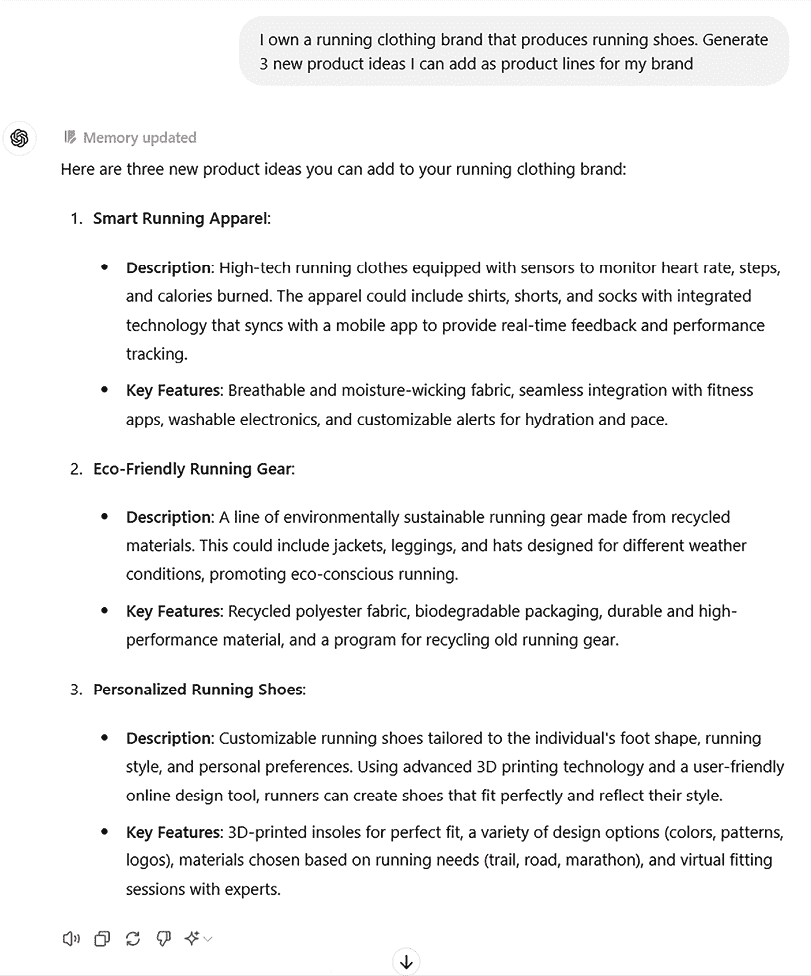

图 6.1：ChatGPT 生成的新想法示例

在三个建议中，我们将选择第二个，因为它可以带来积极的环境影响，同时也能提升我们的品牌声誉。更具体地说，我们将从环保跑步袜开始。

+   **产品名称**：现在我们已经确定了想法，我们需要为它想一个吸引人的名字。再次，我们将向 ChatGPT 寻求更多选项，以便我们可以从中选择我们最喜欢的一个：

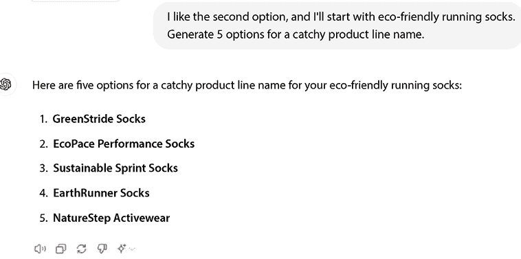

图 6.2：潜在产品名称列表

**GreenStride**对我来说听起来已经足够好了——我会继续使用这个名字。

+   **生成吸引人的标语**：除了产品名称之外，我们还想分享名字背后的意图和产品线的使命，以便我们的目标受众能够被它所吸引。我们希望激发客户的信任和忠诚，并让他们在我们的新产品线背后的使命中看到自己的影子。

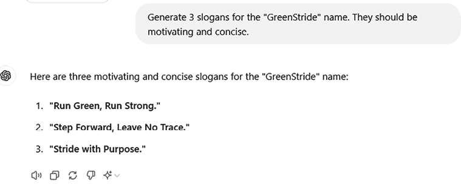

图 6.3：我们新产品名称的标语列表

太好了——现在我对将要用于创建独特社交媒体公告的产品名称和标语感到满意。在这样做之前，我想花更多的时间进行目标受众的市场研究。

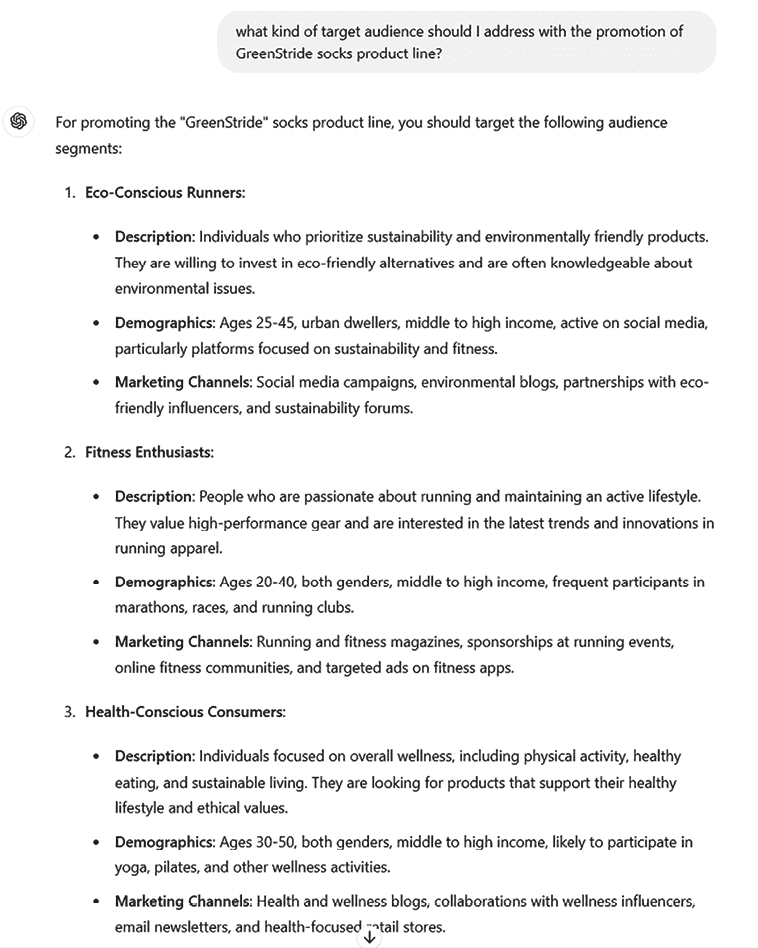

图 6.4：我新产品线要接触的目标人群群体列表

在你的受众中考虑不同的群体是很重要的，这样你就可以区分你想传达的信息。在我的情况下，我想确保我的产品线将针对不同的人群，例如竞技跑者、休闲跑者和健身爱好者。

+   **产品变体和销售渠道**：根据前面提到的潜在客户群体，我可以生成产品变体，以便它们更针对特定的受众：

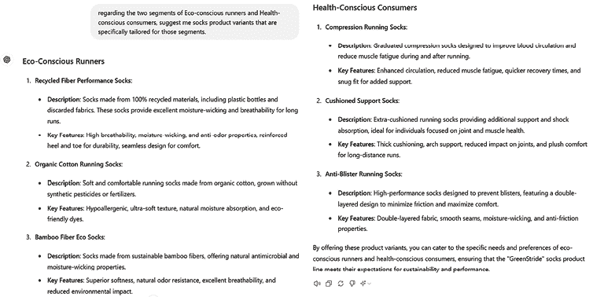

图 6.5：产品线变体示例

同样，我也可以让 ChatGPT 为前面提到的每个群体提出不同的销售渠道：

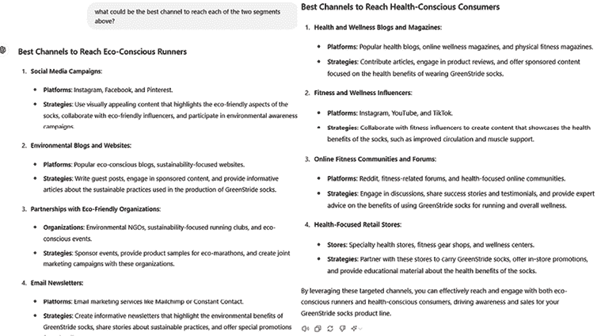

图 6.6：ChatGPT 对不同销售渠道的建议

+   **脱颖而出**：我希望我的产品线能够从竞争中脱颖而出，并在一个非常饱和的市场中崭露头角——我想让它独一无二。本着这个目的，我要求 ChatGPT 包括社会因素，如可持续性和包容性。让我们就这方面向 ChatGPT 寻求一些建议：

![图片 B31559_06_07.png]

图 6.7：ChatGPT 生成的突出功能示例

如你所见，它能够生成一些有趣的特点，可以使我的产品线独一无二。

+   **产品描述**：现在是我们开始构建我们的 GTM 计划的时候了。首先，我想为我的网站生成一个产品描述，包括所有之前独特的差异化因素。

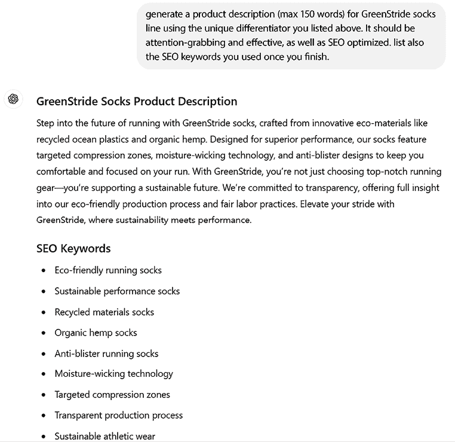

图 6.8：ChatGPT 生成的描述和 SEO 关键词示例

+   **公平价格**：另一个关键要素是为我们的产品确定一个公平的价格。由于我为不同受众（竞技跑者、休闲跑者和健身爱好者）区分了产品变体，我也希望有一个考虑这种聚类的价格范围。请注意，在以下示例中，ChatGPT 正在调用网络搜索插件来检索有关当前跑步袜市场定价的最新信息。

![图片 B31559_06_09.png]

图 6.9：产品变体的价格范围

我们几乎完成了。我们已经经历了许多新产品开发和 GTM 步骤，在每一个步骤中，ChatGPT 都扮演了一个伟大的支持工具。

最后，我们可以要求 ChatGPT 为我们新产品生成一条 Instagram 帖子，包括相关的标签和 SEO 关键词。然后我们可以生成 DALL-E 图像，它作为 ChatGPT Plus 中的一个嵌入式插件。

![图片 B31559_06_10.png]

图 6.10：ChatGPT 生成的社交媒体帖子

以及 DALL-E 的特殊贡献：

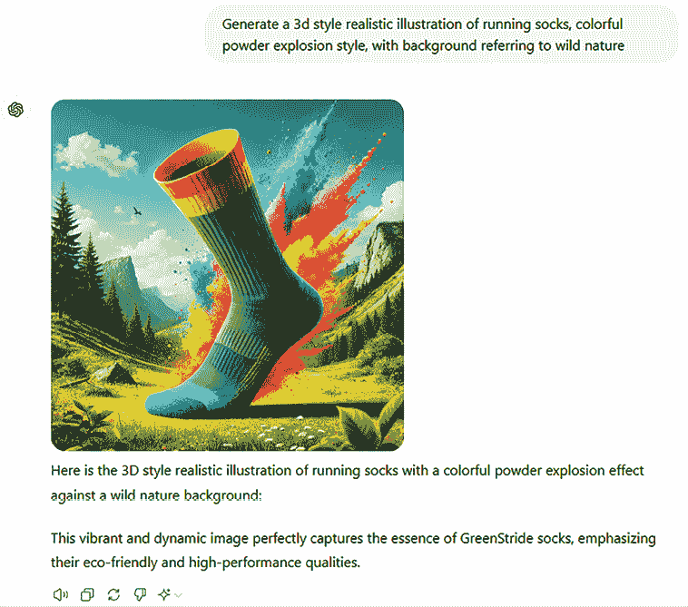

图 6.11：由 ChatGPT（由 DALL-E 3 驱动）生成的插图示例

这是最终结果：

![图片 B31559_06_12.png]

图 6.12：由 ChatGPT 和 DALL-E 3 完全生成的 Instagram 帖子

当然，这里还缺少许多元素，无法完成完整的产品开发和 GTM。然而，在 ChatGPT（以及 DALL-E 3 的特殊贡献）的支持下，我们成功地激发了一个新产品线及其变体、潜在客户和吸引人的口号，以及生成了一条相当不错的 Instagram 帖子来宣布 GreenStride 的上市！

## 奖励提示

当涉及到激发营销想法时，你可能想尝试的一个不错的提示模板是*游戏玩法*技术。

**提示**

让我们玩一个游戏来激发营销想法！

1. 游戏规则：

+   你将扮演[特定角色，例如，营销专家，创意消费者]。

+   为[特定产品或服务]提供营销理念。

+   遵循每轮提供的主题或限制。

2. 游戏回合：

+   第一轮：[初始挑战或主题，例如，社交媒体活动]。

+   第二轮：[引入新的限制，例如，环保重点]。

+   第三轮：[探索跳出思维定式的做法，例如，游击营销]。

3. 评分标准：

+   理念将根据创意、可行性和与商业目标的一致性进行评估。

让我们从第一轮开始：[描述产品/服务和目标受众]。你能想出什么想法？

使用游戏提示技巧进行头脑风暴使过程更具创意、吸引力和高效性。将头脑风暴视为游戏鼓励跳出思维定式。

游戏引入了限制和意外的角度，导致新的想法。它们还使头脑风暴更有趣、更难忘，并提高动力。

另一种有趣的提示技术，在目标受众识别方面，可以是“反转互动”方法。在这种方法中，ChatGPT 通过提问来引导对话，收集信息，旨在实现特定目标。

例如，指导模型说，“*我想提高我的公共演讲技巧；请问我问题以确定需要改进的领域*”可以让 ChatGPT 引导用户通过自我评估过程。以下是一个例子。

**提示**

我的目标是为我们新的环保产品线开发营销活动。请问我问题以确定我们的目标受众和关键信息策略。继续提问，直到你收集到足够的信息来提供全面的目标受众画像和信息计划。确保涵盖以下主题：

**角色属性：**

人口统计：你理想客户的可能年龄范围、收入水平、教育程度和居住地是什么？

心理统计：他们可能有什么价值观、兴趣或爱好？

行为：你预计他们如何购物、与品牌互动或做出购买决定？

**产品匹配：**

这个产品为每个角色解决了什么具体问题？

这个产品将如何使他们的生活变得更轻松或更好？

**验证：**

这些角色与真实世界的数据或现有客户相比如何？

我们是否应该探索其他细分市场？

让我们开始吧！

通过这种方法，你迫使 ChatGPT 提问，从而阐明意图（或在这种情况下，目标属性）。

# 市场营销比较的 A/B 测试

ChatGPT 还可以在 A/B 测试中协助营销人员。

**A/B 测试**在营销中是一种比较两个不同版本的市场活动、广告或网站以确定哪个表现更好的方法。在 A/B 测试中，创建了同一活动或元素的两种不同版本，两个版本之间只有一个变量不同。目标是查看哪个版本能产生更多的点击、转化或其他期望的结果。

A/B 测试允许营销人员优化他们的活动和元素，以实现最大效果，从而带来更好的结果和更高的投资回报率。

由于这种方法涉及生成相同内容的许多变体，ChatGPT 的生成能力肯定有助于此。

让我们考虑以下示例：

我正在推广我开发的一款新产品：一款专为速度攀登者设计的新款、轻便、薄型攀岩安全带。我已经进行了一些市场调研，并且了解我的目标受众。我还知道，对于这个受众群体来说，一个很好的沟通渠道是在在线攀岩博客上发布文章，其中大多数攀岩馆的会员都是读者。我的目标是创建一篇出色的博客文章来分享这款新安全带的发布，并且我想在两组中测试它的两个不同版本。

我即将发布并希望成为我的 A/B 测试对象的博客文章如下：

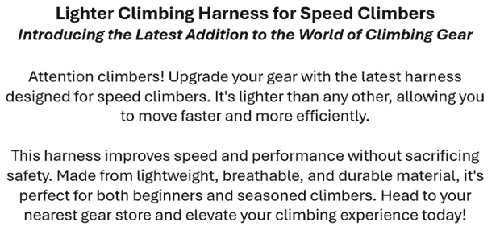

图 6.13：发布攀岩装备的博客文章示例

在这里，ChatGPT 可以在两个层面上帮助我们：

+   第一级是重新措辞文章，使用不同的关键词或不同的吸引注意力的口号。为此，一旦将这篇帖子作为上下文提供，我们就可以要求 ChatGPT 对文章进行工作并稍微改变一些元素：

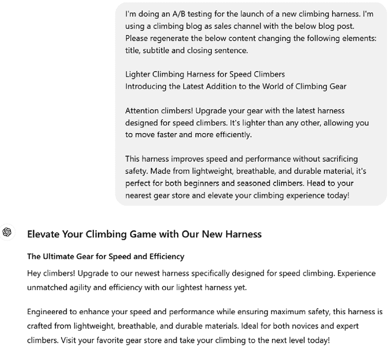

图 6.14：ChatGPT 生成的博客文章的新版本

根据我的要求，ChatGPT 能够仅重新生成我要求的内容（标题、副标题和结束语），这样我可以通过观察两个受众群体的反应来监控这些元素的有效性。

+   第二级是处理网页设计，即改变图像的搭配而不是按钮的位置。为此，我为在攀岩博客上发布的博客文章创建了一个简单的网页（你可以在本书的 GitHub 仓库中找到代码，网址为[`github.com/PacktPublishing/Practical-GenAI-with-ChatGPT-Second-Edition`](https://github.com/PacktPublishing/Practical-GenAI-with-ChatGPT-Second-Edition)）：

图 6.15：在攀岩博客上发布的示例博客文章

我们可以直接将 HTML 代码喂给 ChatGPT，并要求它更改一些布局元素，例如按钮的位置或它们的文字。例如，而不是“立即购买”，一个读者可能更会被“我要一个！”按钮吸引。

因此，让我们用 HTML 源代码来喂养 ChatGPT：

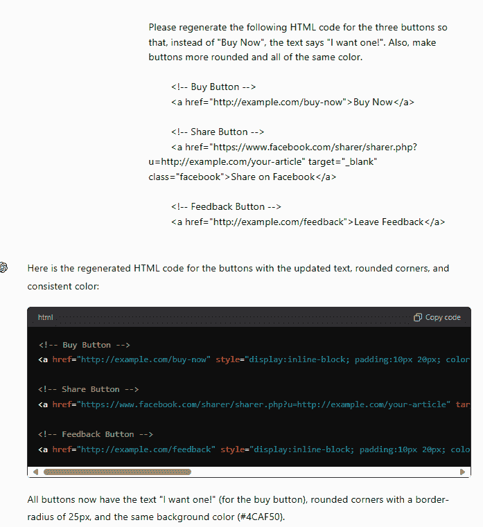

图 6.16：ChatGPT 更改 HTML 代码

让我们看看输出结果是什么样的（我也更改了标题、副标题和段落，使用 ChatGPT 生成的那些）：

图 6.17：网站的新版本

如您所见，ChatGPT 仅在按钮级别进行干预，略微改变了它们的布局、位置、颜色和措辞。

总之，ChatGPT 是营销 A/B 测试的有价值工具。它快速生成相同内容的多个版本的能力可以缩短新活动的上市时间。通过利用 ChatGPT 进行 A/B 测试，您可以优化您的营销策略，并最终为您的业务带来更好的结果。

## 奖励提示

在 A/B 测试的背景下，一种良好的提示工程方法被称为所谓的*替代方法模式*。在提示工程中，这种模式涉及指导语言模型为给定问题生成多个解决方案或观点。这种技术利用模型产生多样化响应的能力，增强创造性和提供更广泛的选择范围。例如，当寻求提高客户参与度的方法时，你可能会提示，“*你能提出各种提高客户参与度的策略吗？*”然后模型会提供多种方法，例如个性化营销、忠诚度计划或互动内容。

**提示**

你是一位创意内容策略师，负责为新产品登山绳索的发布生成 A/B 测试变体。你的目标是通过更改以下元素提供两个不同的博客内容版本：

1. 标题

2. 副标题

3. 结尾句子

### 指令：

1. 创建以[特定角度，例如，强调速度和效率]为重点的 A 变体。

2. 创建以[替代角度，例如，安全性和多功能性]为重点的 B 变体。

3. 确保两个变体都能吸引登山者，并针对博客内容进行优化。

### 可交付成果：

请按照以下格式提供你的回答：

<<<A 变体>>>

[插入 A 变体的内容]

<<<结束 A 变体>>>

<<<B 变体>>>

[插入 B 变体的内容]

<<<结束 B 变体>>>

这种方法在头脑风暴会议中特别有用，因为它鼓励探索不同的可能性，并减少固着于单一解决方案的可能性。

# 提升 SEO

ChatGPT 有望成为颠覆者的另一个有前景的领域是**SEO**。这是在搜索引擎如 Google 或 Bing 中排名的关键元素，它决定了您的网站是否对寻找您产品的用户可见。

**定义**

SEO 是一种用于提高网站在**搜索引擎结果页面（SERPs）**上可见性和排名的技术。这是通过优化网站或网页来增加来自搜索引擎的有机（未付费）流量数量和质量来实现的。SEO 的目的是通过针对特定的关键词或短语来优化网站，以吸引更多有针对性的访客。

想象你经营一家名为**帽子和手套**的电子商务公司，正如你可能猜到的，只卖帽子和大衣。你现在正在创建你的电子商务网站，并希望优化其排名。让我们要求 ChatGPT 列出一些相关的关键词，以便嵌入到我们的网站中：

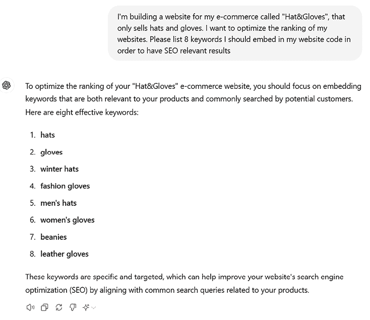

图 6.18：ChatGPT 生成的 SEO 关键词示例

正如你所见，ChatGPT 能够创建一个关键词列表。

SEO 的另一个关键要素是**搜索引擎意图**。搜索引擎意图，也称为**用户意图**，指的是用户在搜索引擎中进行的特定搜索查询的潜在目的或目标。理解搜索引擎意图很重要，因为它有助于企业和营销人员创建更针对性和有效的内 容和营销策略，这些策略与搜索者的需求和期望相一致。

通常有四种类型的搜索引擎意图：

+   **信息意图**：用户正在寻找特定主题或问题的信息，例如*“法国的首都是什么？”*或*“如何在家制作披萨。”*

+   **导航意图**：用户正在寻找特定的网站或网页，例如*Facebook 登录*或*Amazon.com*。

+   **商业意图**：用户正在寻找购买产品或服务，但可能尚未做出最终决定。具有商业意图的搜索示例包括*1000 美元以下的最佳笔记本电脑*或*在线折扣鞋*。

+   **交易意图**：用户有一个特定的目标来完成交易，这可能涉及实物购买或订阅服务。交易意图的示例可能包括*购买 iPhone 13*或*注册健身房会员*。

通过理解特定搜索查询背后的意图，企业和营销人员可以创建更针对性和有效的内 容，以满足目标受众的需求和期望。这可能导致更高的搜索引擎排名、更多的流量，最终，更多的转化和收入。

现在，问题是，ChatGPT 能否确定给定请求的意图？在回答之前，值得注意的是，推断给定提示的意图是**大型语言模型（LLMs）**，包括 GPT 的核心业务。所以，当然，ChatGPT 能够捕捉提示的意图。

此处的附加值在于，我们想看看 ChatGPT 是否能够在精确的领域和精确的分类法中确定意图——即营销领域。这就是为什么提示设计再次成为引导 ChatGPT 走向正确方向的关键。

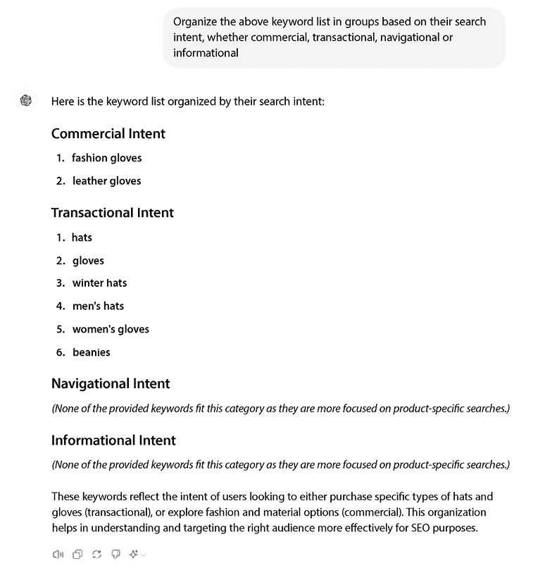

图 6.19：ChatGPT 按用户意图聚类的关键词示例

最后，我们还可以进一步利用我们已经在*第三章*中提到的“扮演…”技巧。确实很有趣，能够对我们的网站进行评估，了解它是否按照预期进行了优化。在营销中，这种分析被称为**SEO 审计**。SEO 审计是对网站 SEO 性能和潜在改进领域的评估。它通常由 SEO 专家、网站开发人员或营销人员执行，涉及对网站技术基础设施、内容和反向链接档案的全面分析。

在 SEO 审计过程中，审计员通常会使用一系列工具和技术来识别改进领域，例如关键词分析、网站速度分析、网站架构分析和内容分析。然后，审计员将生成一份报告，概述关键问题、改进机会和解决这些问题的建议行动。

让我们让 ChatGPT 扮演 SEO 专家的角色来进行这次审计。作为参考网站，我们将使用上面提到的登山博客。我会给 ChatGPT 代码，并给出以下指示：“扮演 SEO 专家的角色，对上述 HTML 代码生成一份简短的 SEO 审计（最多 300 字）。”这是它的回应：

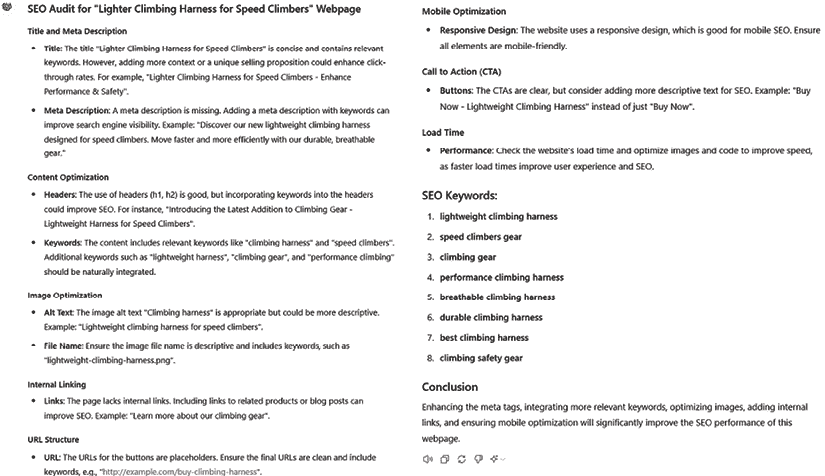

图 6.20：ChatGPT 对登山博客的 HTML 代码进行 SEO 审计

ChatGPT 能够生成相当准确的分析，包括相关的评论和建议。总的来说，ChatGPT 在 SEO 相关活动中具有有趣的潜力，无论是从头开始构建网站还是想要改进现有的网站，它都可以成为一个好工具。

# 质量与客户满意度情感分析

情感分析是营销中用于分析和解释客户对品牌、产品或服务的情绪和观点的技术。它涉及使用**自然语言处理**（NLP）和**机器学习**（ML）算法来识别和分类文本数据（如社交媒体帖子、客户评论和反馈调查）的情绪。

通过执行情感分析，营销人员可以深入了解客户对品牌的看法，识别改进领域，并基于数据驱动决策来优化他们的营销策略。例如，他们可以跟踪客户评论中的情绪，以确定哪些产品或服务获得了正面或负面的反馈，并相应地调整他们的营销信息。

总体而言，情感分析是营销人员了解客户情绪、衡量客户满意度以及开发与目标受众产生共鸣的有效营销活动的重要工具。

情感分析已经存在了一段时间，所以您可能想知道 ChatGPT 能带来哪些额外的价值。好吧，除了分析的准确性（它是目前市场上最强大的模型），ChatGPT 与其他情感分析工具的不同之处在于它由一个 LLM 驱动；因此，它是“通用”的而不是“专用”的。

这意味着当我们使用 ChatGPT 进行情感分析时，我们并不是使用其针对该任务的特定 API；ChatGPT 和 OpenAI 模型背后的核心思想是它们可以同时协助用户完成许多通用任务，与任务交互并根据用户请求改变分析的范畴。

因此，ChatGPT 当然能够捕捉给定文本的情感，例如 X/Twitter 帖子或产品评价。然而，ChatGPT 还可以更进一步，帮助识别对情感产生积极或消极影响的产品或品牌的特定方面。例如，如果客户持续以负面方式提及产品的某个特定功能，ChatGPT 可以将其突出显示为需要改进的领域。或者，ChatGPT 可能被要求对特别敏感的评价生成回应，同时考虑到评价的情感，并将其作为回应的上下文。再次，它可以生成报告，总结在评价或评论中找到的所有正面和负面元素，并将它们分类。

让我们考虑以下例子。一位客户最近从我的电子商务公司 RunFast 购买了一双鞋，并留下了以下评价：

*“我最近购买了 RunFast Prodigy 鞋，感觉复杂。它们非常舒适，有很好的缓震和支撑，在跑步时减少了脚部疲劳。设计也很吸引人，我收到了几个赞美。然而，耐用性令人失望；外底很快磨损，透气鞋面在几周后就有磨损迹象。鉴于高昂的价格，尽管舒适度和设计很好，我还是犹豫是否推荐。”*

让我们要求 ChatGPT 捕捉这条评价的情感：

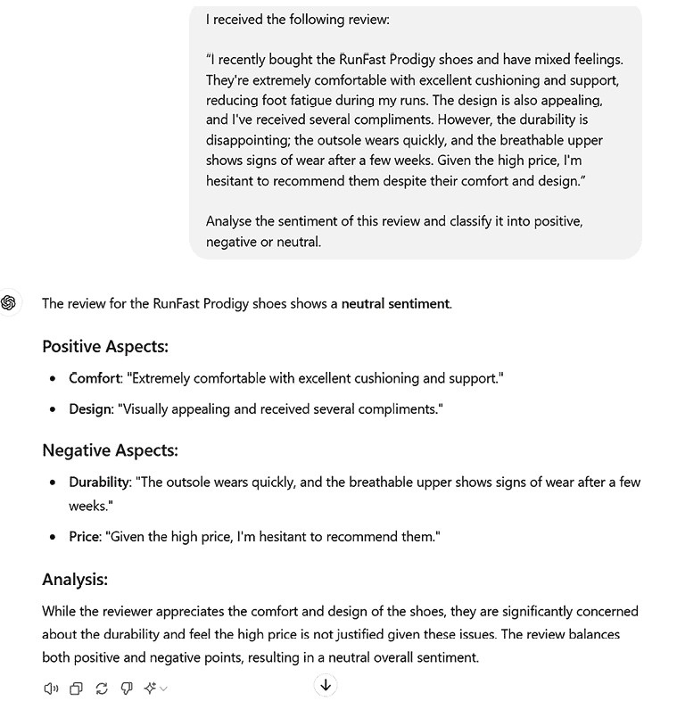

图 6.21：ChatGPT 分析客户评价

从前面的图中，我们可以看到 ChatGPT 并没有仅仅提供标签：它还解释了评价中表征的正面和负面元素，这个评价感觉混合，因此可以整体上被标记为中性。

**注意**

情感分析的细微差别往往很棘手。ChatGPT 在得到少量提示以帮助它理解情感时表现最佳，正如我们在第三章中探讨的那样。关于这个话题的进一步讨论，您可以参考以下初步研究：[`arxiv.org/abs/2304.04339`](https://arxiv.org/abs/2304.04339)。

让我们进一步探讨并就改进产品提出一些建议：

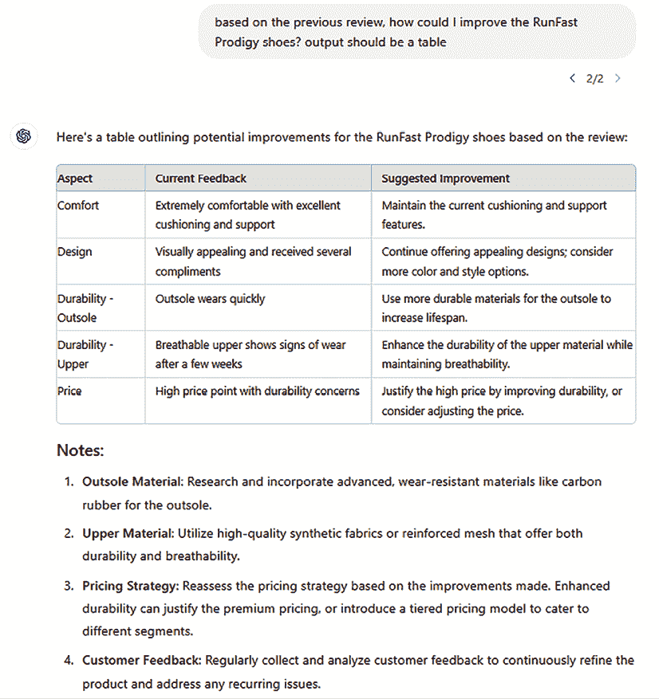

图 6.22：根据客户反馈提出的改进产品建议

最后，让我们生成一个响应给客户，表明我们作为一家公司确实关心客户的反馈，并希望改进我们的产品。

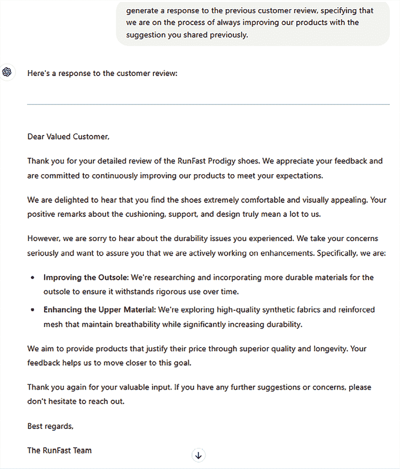

图 6.23：ChatGPT 生成的响应

我们看到的例子是一个非常简单的例子，只有一个评论。现在，想象一下我们有很多评论，以及多样化的销售渠道，我们在这里收到反馈。想象一下 ChatGPT 和 OpenAI 模型等工具的力量，它们能够分析和整合所有这些信息，识别产品的优点和缺点，以及捕捉客户趋势和购物习惯。此外，为了客户关怀和保留，我们还可以使用我们偏好的写作风格自动处理评论响应。事实上，通过调整聊天机器人的语言和语调以满足客户的特定需求和期望，您可以创造一个更具吸引力和有效性的客户体验。

这里有一些例子：

+   **同理心聊天机器人**：一种使用同理心语调和语言与可能遇到问题或需要帮助处理敏感问题的客户互动的聊天机器人

+   **专业式聊天机器人**：一种使用专业语调和语言与可能寻求特定信息或需要帮助解决技术问题的客户互动的聊天机器人

+   **对话式聊天机器人**：一种使用轻松友好语调与可能寻求个性化体验或具有更一般性咨询的客户互动的聊天机器人

+   **幽默式聊天机器人**：一种使用幽默和机智语言与可能寻求轻松体验或缓解紧张局势的客户互动的聊天机器人

+   **教育式聊天机器人**：一种使用教学风格进行沟通的聊天机器人，与可能希望了解更多关于产品或服务的客户互动

总结来说，ChatGPT 可以成为企业进行情感分析、提高质量并保留客户的强大工具。凭借其先进的 NLP 能力，ChatGPT 可以实时准确地分析客户反馈和评论，为企业提供有关客户情感和偏好的宝贵见解。通过将 ChatGPT 作为其客户体验策略的一部分，企业可以迅速识别可能对客户满意度产生负面影响的问题，并采取纠正措施。这不仅可以帮助企业提高质量，还可以增加客户忠诚度和保留率。

# 概述

在本章中，我们探讨了营销人员如何利用 ChatGPT 来增强他们的营销策略。我们了解到，ChatGPT 可以帮助开发新产品以及定义其 GTM 策略，设计 A/B 测试，增强 SEO 分析，并捕捉评论、社交媒体帖子和其他客户反馈的情感。

ChatGPT 对营销人员的重要性在于其有可能彻底改变公司与其客户互动的方式。通过利用自然语言处理（NLP）、机器学习（ML）和大数据的力量，ChatGPT 使公司能够创建更个性化和相关的营销信息，提高客户支持和满意度，最终推动销售和收入。

随着 ChatGPT 的持续发展和演变，我们可能会看到它在营销行业中的更多参与，尤其是在公司与其客户互动的方式上。事实上，过度依赖人工智能使公司能够更深入地了解客户行为和偏好。

对于营销人员来说，关键是要接受这些变化，适应由人工智能驱动的营销的新现实，以便在竞争中保持领先并满足客户的需求。

在下一章中，我们将探讨这本书中涵盖的 ChatGPT 应用的第三个也是最后一个领域——研究。

# 加入我们的 Discord 和 Reddit 社区

对这本书有疑问或想参与关于生成式 AI 和大型语言模型（LLMs）的讨论？加入我们的 Discord 服务器`packt.link/I1tSU`和 Reddit 频道`packt.link/jwAmA`，与志同道合的爱好者建立联系、分享和协作。

 
