# 第七章：使用 ChatGPT 重新发明研究

本章面向希望利用 ChatGPT 的研究者。本章将介绍 ChatGPT 可以解决的几个主要应用场景，以便您通过具体示例了解 ChatGPT 在研究中的应用。

到本章结束时，您将熟悉以多种方式使用 ChatGPT 作为研究助手，包括以下内容：

+   研究者对 ChatGPT 的需求

+   为您的研究头脑风暴文献

+   为您实验的设计和框架提供支持

+   生成和格式化参考文献，以便将其纳入您的研究中

+   生成研究展示

本章还将提供示例，并使您能够尝试在自己的研究上使用这些提示。

# 研究者对 ChatGPT 的需求

ChatGPT 可以成为跨多个领域的研究者极其宝贵的资源。作为一个在大量数据上训练的复杂语言模型，ChatGPT 可以快速准确地处理大量信息，并生成通过传统研究方法可能难以或耗时才能发现的见解。

此外，ChatGPT 还可以通过分析可能对人类研究者来说并不立即明显的变化模式和趋势，为研究者提供其领域的独特视角。例如，想象一位研究气候变化并希望了解公众对此问题看法的研究者。他们可能会要求 ChatGPT 分析与气候变化相关的社交媒体数据，并识别在线人们表达的最常见的主题和情感。然后，ChatGPT 可以为研究者提供一份全面的报告，详细说明与该主题相关的最常见词汇、短语和情感，以及任何可能有用的新兴趋势或模式。

通过与 ChatGPT 合作，研究者可以接触到尖端技术和见解，并保持在各自领域的最前沿。

让我们进一步深入探讨 ChatGPT 可以提升研究生产力的四个应用场景。

**注意**

本章中提出的多数示例都是基于最新信息的；实际上，你将经常看到 ChatGPT 利用网络搜索插件。

# 为您的研究头脑风暴文献

文献综述是对特定主题或问题现有已发表研究的批判性和系统性的审查过程。它包括搜索、审查和综合相关已发表的研究和其他来源，如书籍、会议记录和同行评审文献。文献综述的目的是在特定领域识别研究空白、不一致性和进一步研究的机遇。

文献综述过程通常包括以下步骤：

1.  **定义研究问题**：进行文献综述的第一步是定义感兴趣主题的研究问题。所以，假设我们正在进行关于社交媒体对心理健康影响的研究。现在，我们感兴趣的是头脑风暴一些可能的研究问题，以便将我们的研究集中在这些问题上，我们可以利用 ChatGPT 来完成这项工作：

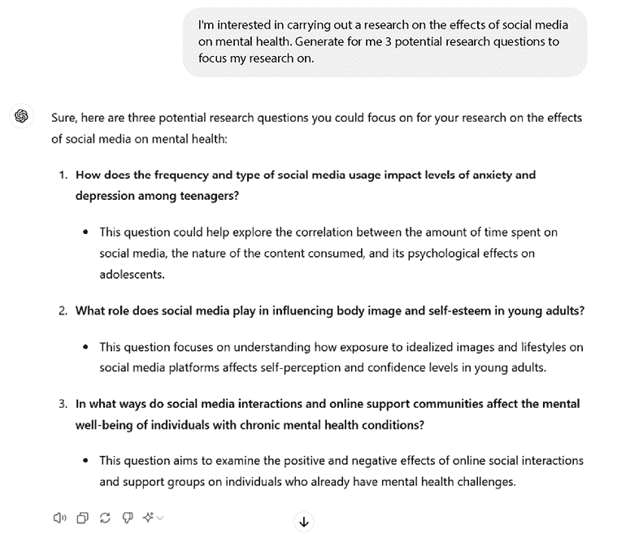

图 7.1：基于给定主题的研究问题示例

这些都是可以进一步研究的有意思的问题。由于我对第一个问题特别感兴趣——“社交媒体的使用频率和类型如何影响青少年的焦虑和抑郁水平？”——我将把它作为我们分析下一步的参考。

1.  **寻找文献**：既然我们已经有了研究问题，下一步就是使用各种数据库、搜索引擎和其他来源来寻找相关文献。研究者可以使用特定的关键词和搜索词来帮助识别相关研究。

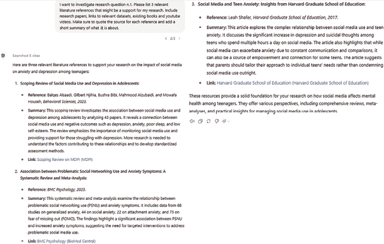

图 7.2：在 ChatGPT 支持下进行文献搜索

从 ChatGPT 的建议开始，我们可以开始深入研究这些参考文献。

1.  **筛选文献**：一旦确定了相关文献，下一步就是筛选这些研究，以确定它们是否符合综述的纳入标准。这通常涉及审查摘要，必要时审查全文。例如，如果我们想要深入研究《社交媒体与青少年焦虑：哈佛大学教育学院的研究》这篇论文，我们可以让 ChatGPT 为我们筛选：

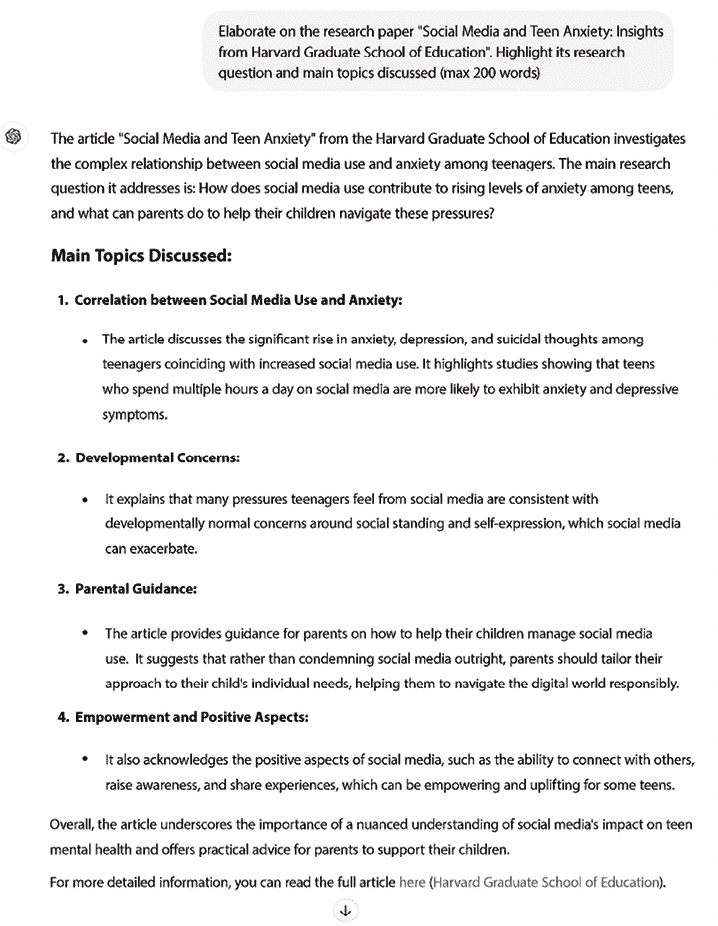

图 7.3：特定论文的文献筛选

ChatGPT 能够为我提供论文的概述。考虑到其研究问题和主要讨论主题，我认为这对我的研究将非常有用。

1.  **提取数据**：在确定相关研究后，研究者将需要从每项研究中提取数据，例如研究设计、样本量、数据收集方法和关键发现。例如，假设我们想要从 Hinduja 和 Patchin 于 2018 年发表的论文《数字自我伤害：流行率、动机和结果》中收集以下信息：

    +   论文中收集的数据来源和研究的主题

    +   研究者采用的数据收集方法

    +   数据样本量

    +   分析的主要局限性和缺点

    +   研究者采用的研究设计

下面是它的操作过程：

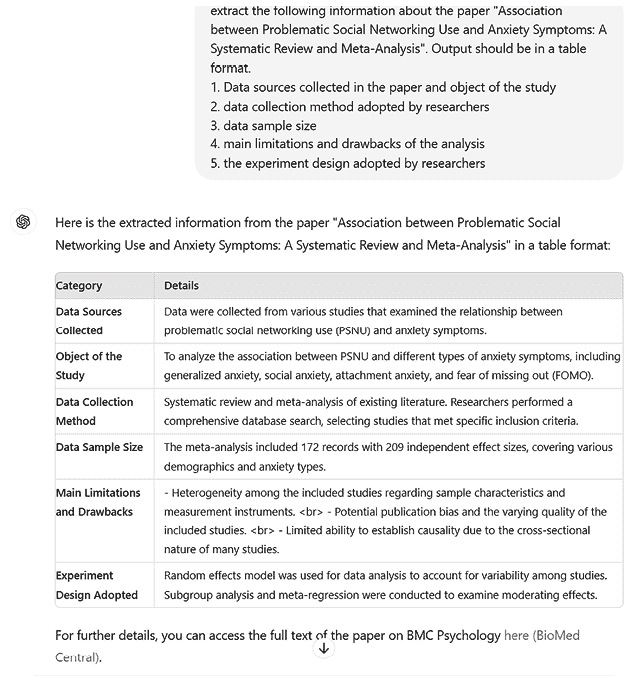

图 7.4：从给定论文中提取相关数据和框架

1.  **综合文献**：文献综述过程的最后一步是综合研究的结果，并就该领域的知识现状得出结论。这可能包括识别共同主题，突出文献中的差距或不一致性，以及确定未来研究的机会。

让我们设想，除了 ChatGPT 提出的论文外，我们还收集了其他我们想要综合的标题和论文。更具体地说，我们想要了解它们是否得出相同的结论，共同趋势是什么，以及哪种方法可能比其他方法更可靠。对于这种情况，我们将考虑三篇研究论文：

+   *社交媒体对心理健康的影响：一项拟议的研究*，由 Grant Sean Bossard 撰写([`digitalcommons.bard.edu/cgi/viewcontent.cgi?article=1028&context=senproj_f2020`](https://digitalcommons.bard.edu/cgi/viewcontent.cgi?article=1028&context=senproj_f2020))

+   *社交媒体对心理健康的影响*，由 Vardanush Palyan 撰写([`www.spotlightonresearch.com/mental-health-research/the-impact-of- social-media-on-mental-health`](https://www.spotlightonresearch.com/mental-health-research/the-impact-of-social-media-on-mental-health))

+   *社交媒体对心理健康的影响：服务提供者意识的多方法研究*，由 Sarah Nichole Koehler 和 Bobbie Rose Parrell 撰写([`scholarworks.lib.csusb.edu/cgi/viewcontent.cgi?article=2131&context=etd`](https://scholarworks.lib.csusb.edu/cgi/viewcontent.cgi?article=2131&context=etd))

结果如下：

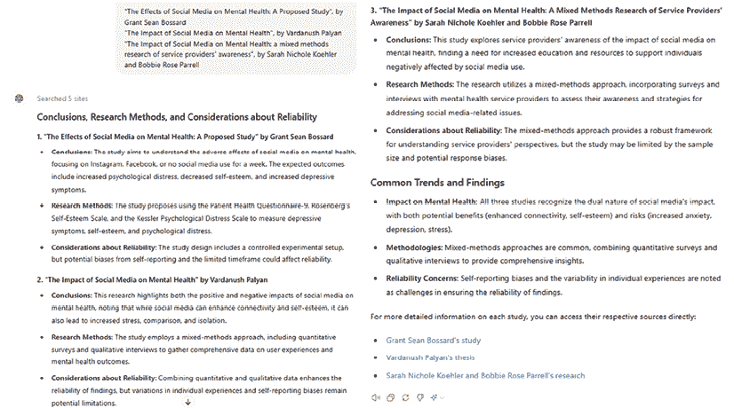

图 7.5：三篇研究论文的文献分析和基准测试

此外，在这种情况下，ChatGPT 能够对提供的三篇论文产生相关的总结和分析，包括方法之间的基准测试和可靠性考虑。

总体而言，ChatGPT 能够在文献综述领域执行许多活动，从研究问题头脑风暴到文献综合。正如往常一样，需要一个**主题专家**（**SME**）参与审查结果；然而，在 ChatGPT 的帮助下，许多活动可以更高效地完成。

**注意**

作为一项常见的最佳实践，建议在发布任何由 AI 工具（可能是 ChatGPT 或类似工具）开发（即使部分开发）的内容时，始终添加免责声明。这确保了与产品（研究论文、文章、书籍等）的最终用户保持透明度，并使他们处于更容易接受潜在偏见或幻觉的位置。

ChatGPT 还可以支持的一项活动是设计研究者想要进行的实验。我们将在下一节中探讨这一点。

## 奖励提示

当我们与 ChatGPT 互动，以构思可能的研究问题时，一种好的提示技术可能是**问题细化提示**。采用这种方法，LLM 会引导用户通过一系列迭代来最终确定一个问题。让我们来看一个例子：

**研究构思的迭代问题细化**

目标：通过与 ChatGPT 的迭代反馈和对话，共同细化有影响力的研究问题。

**步骤 1：初步构思**

提示：“我正在进行[插入领域/主题]领域的研究。我感兴趣的具体领域是[插入具体领域或主题]。请生成 5 个初步研究问题，探讨该领域的关键挑战、趋势或知识差距。”

**步骤 2：细化**

跟进提示：“感谢你的问题！以下是我的反馈：”

问题[插入编号]需要更多地关注[插入关注领域]。

问题[插入编号]过于宽泛。你能将其缩小范围，专注于[具体方面]吗？

问题[插入编号]很有吸引力，但可以通过解决[特定受众、结果或数据]来受益。

“基于这个反馈，将问题细化以更好地符合我的目标。”

**步骤 3：最终润色**

跟进提示：“我赞赏这些细化。现在：”

将问题[插入编号]的元素合并成一个连贯的问题。

确保语言清晰简洁。

建议任何最终调整，以使这些问题更具影响力。

采用这种方法，我们是在“鼓励”模型一步一步地工作，并逐步完善其输出。

另一种有趣的提示技术，这对于构建查询输出非常有用，是利用所谓的**提示模式**。由 Jules White 博士及其同事开发，提示模式是可重复使用的解决方案，旨在解决与 LLM 互动时遇到的常见挑战。它们的功能类似于软件设计模式，通过提供结构化方法在 LLM 互动中实现特定结果。这种方法在他们的论文《A Prompt Pattern Catalog to Enhance Prompt Engineering with ChatGPT》中有详细说明（原始目录可在[`arxiv.org/abs/2302.11382`](https://arxiv.org/abs/2302.11382)找到）。

例如，当从文档中提取相关信息（如本节所述）时，我们可能想要确保收集到具体元素，如研究问题或研究设计：

**提示**

我需要一个结构化的模板，以便高效地从研究论文中提取关键数据。该模板应包括以下部分：

论文详情（标题、作者、年份、期刊、DOI/URL）。

研究问题或目标。

研究设计（例如，实验性、观察性、荟萃分析）。

方法（样本大小、数据收集技术、使用的工具）。

关键发现或结果。

局限性和建议。

请将此模板格式化为表格或清单，以便研究人员在审阅论文时轻松填写。

使用这样的模板模式，您确保在从多个来源收集的数据中保持一致性。

类似地，当比较不同的研究论文或更普遍的文档时，可以使用相同的技巧。在本节中，我们提供了一个示例，其中我们利用网络搜索工具检索关于论文的信息并进行比较。然而，如果您想遵循更结构化和受控的方法，您可以上传您想要比较的两个或更多论文，并运行以下提示（取自怀特博士的目录。您可以在[`arxiv.org/abs/2302.11382`](https://arxiv.org/abs/2302.11382)找到原始目录）：

**提示**

我已经审查了几篇关于[插入主题，例如“社交媒体对心理健康的影响”]的研究论文，它们附在后面。我需要将它们的发现综合成一个连贯的摘要，突出以下内容：

论文中跨论文的常见主题或趋势。

+   关键差异或冲突结果。

+   文献中识别出的差距或局限性。

+   对未来研究或实际应用的启示。

请按照以下结构组织综合内容：

引言：对主题和已审查论文的范围进行简要概述。

常见主题：识别和总结共享发现或重复出现的模式。

对比结果：突出论文之间任何主要的不同或矛盾。

差距和机遇：讨论需要进一步研究的领域。

结论：提供总体总结和未来研究的潜在方向。

通过应用这些提示模式，用户可以系统地设计提示，引导 LLMs 生成更可靠和上下文相关的输出，从而提高人机协作的效率和效果。

# 为您实验的设计和框架提供支持。

实验设计是规划并执行科学实验或研究以回答研究问题的过程。它涉及对研究设计、要测量的变量、样本大小以及收集和分析数据的程序做出决定。

ChatGPT 可以通过建议您研究框架，如随机对照试验、准实验设计或相关性研究，并在实施该设计的过程中支持您，来帮助您进行研究的实验设计。

让我们考虑以下场景。我们想调查新教育项目对学生数学学习成果的影响。这个新项目包括**基于项目的学习**（**PBL**），意味着学生被要求在真实世界的项目中协作工作，使用数学概念和技能来解决问题和创造解决方案。

为此，我们定义了我们的研究问题如下：

新的 PBL 项目与传统教学方法相比，在提高学生表现方面有何不同？

这是 ChatGPT 如何帮助的：

+   **确定研究设计**：ChatGPT 可以帮助确定适合研究问题的适当研究设计，例如随机对照试验、准实验设计或相关研究。

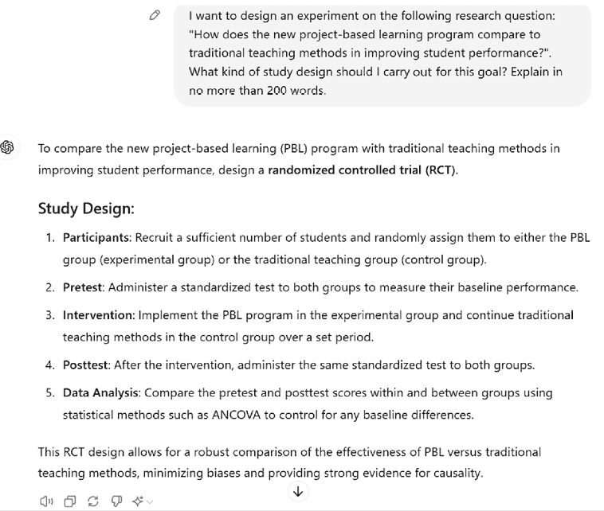

图 7.6：ChatGPT 建议适合你的实验的研究设计

ChatGPT 建议进行随机对照试验（RCT），并清楚地解释了这样做的原因。

**定义**

随机对照试验（RCT）是一种科学的研究设计，通过随机分配参与者到两个或多个组来衡量干预措施的有效性：

+   **实验组**：接受正在测试的干预或治疗

+   **对照组**：接受安慰剂、标准治疗或无干预措施

通过随机分配参与者，RCT 最小化了偏差，并确保结果差异是由于干预本身而不是外部因素造成的。它们被认为是临床和社会科学研究在建立干预措施及其效果之间因果关系时的黄金标准。

我认为采取这种方法是合理的：下一步将是确定实验中要考虑的结果衡量标准和变量。

+   **识别结果衡量标准**：ChatGPT 可以帮助你识别一些潜在的成果衡量标准，以确定测试结果。让我们为我们的研究请求一些建议：

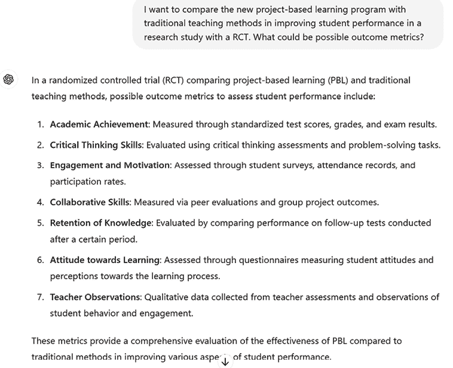

图 7.7：给定研究研究的成果

我认为选择考试成绩作为结果衡量标准是合理的。

+   **识别变量**：ChatGPT 可以帮助研究人员识别研究中的自变量和因变量：

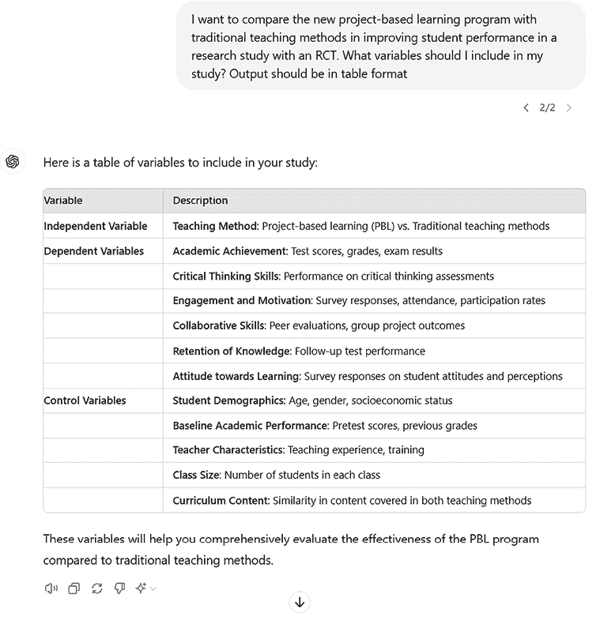

图 7.8：ChatGPT 为给定研究生成变量

注意，ChatGPT 还能够生成特定于我们考虑的研究设计（RCT）的类型变量，称为控制变量。

控制变量，也称为协变量，是在研究研究中保持恒定或控制的变量，以便隔离自变量（s）和因变量之间的关系。这些变量不是研究的重点，但包括在内是为了最小化混杂变量对结果的影响。通过控制这些变量，研究人员可以降低获得假阳性或假阴性结果的风险，并提高其研究的内部可靠性、有效性、透明度和可重复性。

在上述变量基础上，我们已准备好设置我们的实验。现在我们需要选择参与者，ChatGPT 可以帮助我们完成这项工作。

+   **抽样策略**：ChatGPT 可以为研究提出潜在的抽样策略：

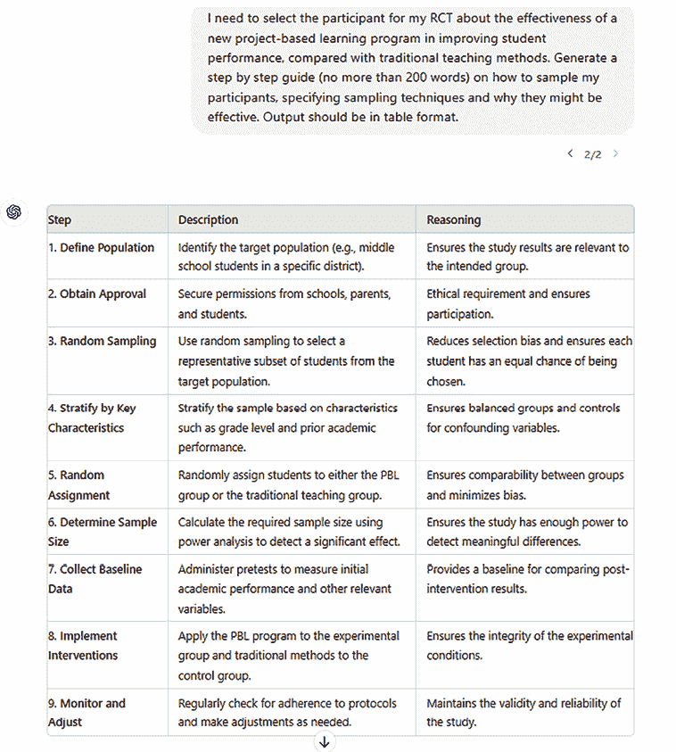

图 7.9：ChatGPT 建议的 RCT 抽样策略

注意，始终要求 AI 工具生成更多带有解释的选项，以便你可以做出合理的决定。对于这个例子，让我们继续使用 ChatGPT 向我们提出的建议，这些建议还包括关于目标人群和样本大小的建议。

+   **数据分析**：ChatGPT 可以帮助研究人员确定分析从研究中收集的数据的适当统计测试，例如 ANCOVA、t 检验或回归分析。

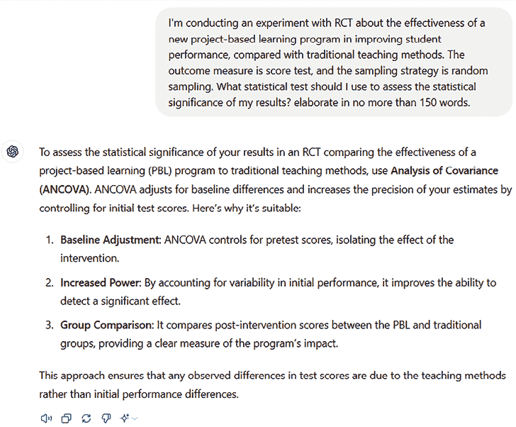

图 7.10：ChatGPT 为给定研究建议一个统计测试

ChatGPT 提出的所有建议都是连贯的，并在关于如何进行统计测试的论文中得到证实。它还能够识别我们可能是在谈论一个连续变量（即分数），这样我们知道所有前面的信息都是基于这个假设。如果我们想要有离散的分数，我们可能需要通过添加这个信息来调整提示，然后 ChatGPT 将建议不同的方法。

ChatGPT 指定假设并解释其推理是关键，可以基于其输入做出安全决策。

总之，ChatGPT 在设计实验时可以成为研究人员的一个宝贵工具。通过利用其**自然语言处理**（**NLP**）能力和庞大的知识库，ChatGPT 可以帮助研究人员选择适当的研究设计，确定抽样技术，识别变量和学习成果，甚至建议用于分析数据的统计测试。

在下一节中，我们将继续探讨 ChatGPT 如何支持研究人员，重点关注文献生成。

## 奖励提示

当你设计研究实验时，怀特博士的提示目录也非常有用。例如，让我们考虑**食谱模式**（来源：[`arxiv.org/pdf/2302.11382`](https://arxiv.org/pdf/2302.11382)）：

**提示**

对 AI 的说明：请提供一个设计针对此研究目标的稳健实验的逐步计划。确保响应包括以下组件：

参与者：如何选择和分配参与者。

预测试：测量参与者基线表现的步骤。

干预：概述 PBL 项目实施和控制组治疗方法。

后测试：评估干预后成果的方法。

数据分析：指定比较结果和确保有效性的统计方法。

输出格式：

+   清晰简洁地呈现每个步骤。

+   为每个步骤提供理由，以证明其包含的合理性。

+   总结为什么这种研究设计适合回答研究问题。

当用户对他们的目标有一般了解，并对一些必要步骤有所了解，但需要帮助将这些步骤组织成一个连贯且完整的序列时，这种模式确实特别有益。

你可能还想尝试以下另一个修订后的提示，用于你的实验设计：

**提示**

背景：您正在设计一个**随机对照试验**（RCT）来比较基于项目学习（PBL）项目与传统教学方法在提高学生表现方面的有效性。该研究需要定义具体的成果指标以评估项目成功。

指示：生成一个详细的结果指标列表，这些指标具体、可衡量，并与评估学生表现相关。包括学术、认知和行为领域的指标。

局限性：

+   避免过于笼统的指标（例如，“学生进步”）。

+   确保指标在 RCT 背景下是现实和可行的。

+   重点关注可以全面评估两种教学方法指标的指标。

输出：提供至少 5-7 个结果指标的结构化列表，每个指标都简要说明其如何有助于评估 PBL 项目的有效性。

在这种情况下，我们使用了清晰的分隔符和结构化输出模式，以确保 ChatGPT 遵循科学方法。此外，我们还纳入了局限性，这是一种有效且明确地减少幻觉的方法。

# 生成和格式化参考文献

ChatGPT 可以通过提供自动化的引用和参考工具来支持研究人员生成参考文献。这些工具可以为包括书籍、文章、网站等广泛来源生成准确的引用和参考。ChatGPT 了解多种引用风格，如 APA、MLA、芝加哥和哈佛，允许研究人员根据他们的工作选择合适的风格。此外，ChatGPT 还可以根据研究人员的输入建议相关来源，帮助简化研究过程并确保所有必要的来源都包含在参考文献中。通过利用这些工具，研究人员可以节省时间并确保他们的参考文献准确且全面。

让我们考虑以下示例。假设我们完成了一篇题为*技术对工作场所生产力的影响：一项实证研究*的研究论文。在研究和写作过程中，我们收集了以下参考文献，包括论文、网站、视频和其他需要包含在参考文献中的来源（按顺序，三篇研究论文、一个 YouTube 视频和一个网站）：

+   *第二次机器时代：在辉煌技术时代的工作、进步和繁荣*。Brynjolfsson, 2014。[`psycnet.apa.org/record/2014-07087-000`](https://psycnet.apa.org/record/2014-07087-000)

+   *技术压力对角色压力和生产率的影响*。Tarafdar, 2014。第 301-328 页。[`www.tandfonline.com/doi/abs/10.2753/MIS0742-1222240109`](https://www.tandfonline.com/doi/abs/10.2753/MIS0742-1222240109)

+   *关于工作未来前景的大辩论，解释说明*。Vox。[`www.youtube.com/watch?v=TUmyygCMMGA`](https://www.youtube.com/watch?v=TUmyygCMMGA)

显然，我们不可能在我们的研究论文中保留前面的列表；我们需要对其进行适当的格式化。为此，我们可以向 ChatGPT 提供参考文献的原始列表，并要求它以特定的格式重新生成它——例如，芝加哥风格，这是在教育、心理学和社会科学中常用作参考文献格式风格的。

让我们看看 ChatGPT 是如何处理这个问题的：

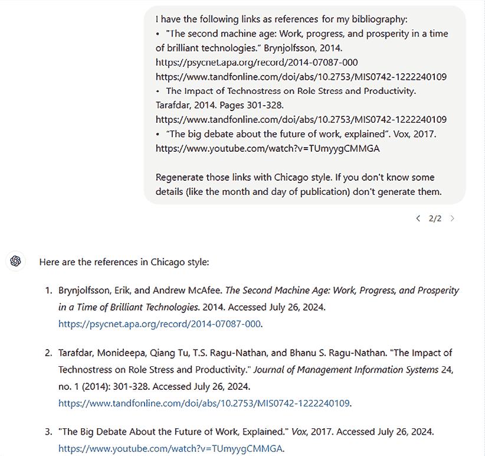

图 7.11：ChatGPT 生成的芝加哥格式参考文献列表

注意，我指定不要添加细节，以防 ChatGPT 不知道。事实上，我注意到有时 ChatGPT 会添加出版月份和日期，造成一些错误。

ChatGPT 还可以提供另一种有趣的辅助，即建议我们可能想要引用的潜在参考文献。我们已经在本章中看到，ChatGPT 在写作过程之前能够激发相关文献的灵感；然而，一旦论文完成，我们可能已经忘记了引用相关文献，甚至没有意识到引用了别人的作品。

ChatGPT 可以成为在构思可能遗漏的参考文献方面的大助手。让我们再次考虑我们的论文，它关注的研究问题是“社交媒体使用频率和类型如何影响青少年的焦虑和抑郁水平。”让我们假设我们设定了以下标题，它具有以下摘要：

**标题：**

社交媒体使用对青少年心理健康的影响：探讨频率、内容类型与焦虑和抑郁水平之间的关系

**摘要：**

社交媒体已经成为青少年生活的一个基本组成部分，然而它对心理健康的影响仍然是一个有争议的话题。本研究调查了社交媒体使用频率和类型与青少年焦虑和抑郁水平之间的关系。采用混合方法，我们分析了 13 至 18 岁青少年的调查数据，以评估他们的社交媒体习惯、内容偏好和自我报告的心理健康症状。研究发现，过度使用社交媒体，尤其是与负面情绪或高度编辑的内容互动，与更高的焦虑和抑郁水平相关。相反，积极的互动和支持性的在线社区可能减轻这些影响。该研究强调了理解社交媒体心理影响的必要性，并建议采取干预措施，以促进青少年更健康的数字习惯。

让我们要求 ChatGPT 列出所有可能与我们这种研究相关的参考文献：

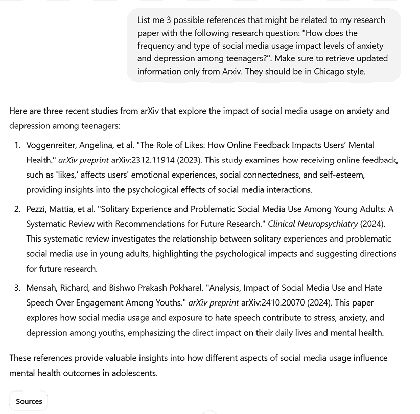

图 7.12：与提供的摘要相关的参考文献列表

你也可以用这个流程重复处理你论文的其他部分，以确保你没有遗漏任何需要包含在参考文献中的相关引用。

一旦你的研究准备就绪，你可能会需要用电梯演讲来展示它。在下一节中，我们将看到 ChatGPT 如何支持这项任务。

# 生成研究展示

研究的最后一步通常是向各种听众展示。这可能包括准备幻灯片、提案或网络研讨会，研究人员需要面对不同类型的听众。

例如，假设我们的研究现在题为《社交媒体使用对青少年心理健康的影响：探讨频率、内容类型与焦虑和抑郁水平之间的关系》，这是一篇硕士学位论文讨论。在这种情况下，我们可以要求 ChatGPT 生成一个持续 15 分钟并遵循科学方法的提案结构。让我们看看会产生什么样的结果（作为背景，我指的是之前给出的摘要）：

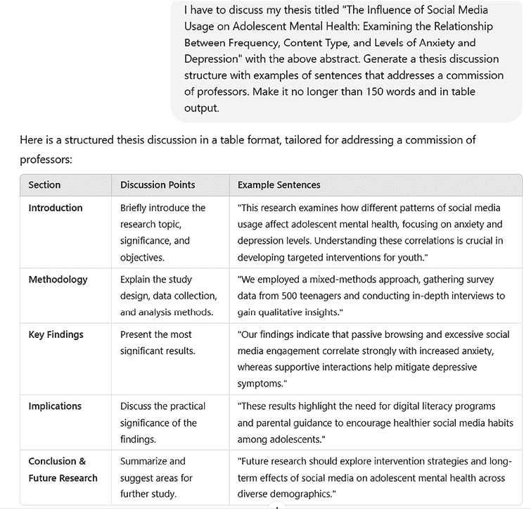

图 7.13：ChatGPT 生成的论文讨论

这非常令人印象深刻！在我大学时代，有一个这样的工具来帮助我设计讨论会很有用。

从这个结构开始，我们还可以要求 ChatGPT 生成一个用于论文讨论的视觉幻灯片。

让我们继续这个请求：

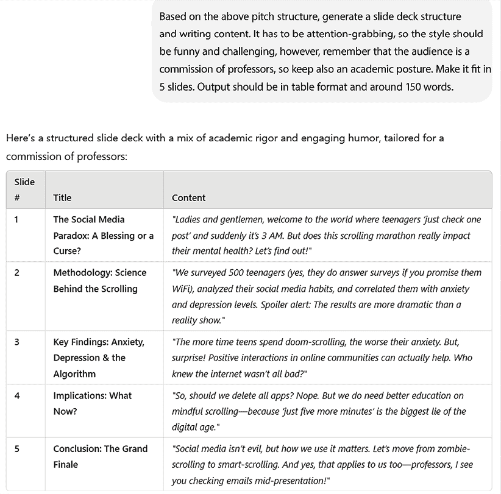

图 7.14：基于讨论提案的幻灯片结构

然后，你还可以要求 ChatGPT 生成一个可以下载的资产幻灯片：

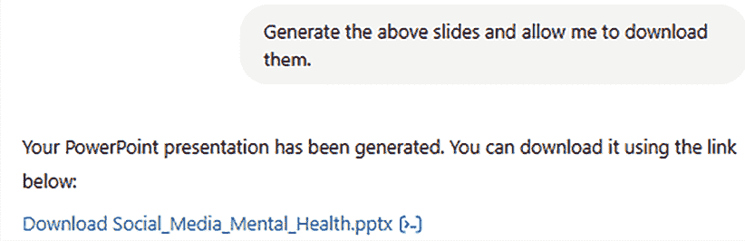

图 7.15：生成可下载的幻灯片资产

在后台发生的事情是，ChatGPT 生成 Python 代码来创建你的幻灯片：

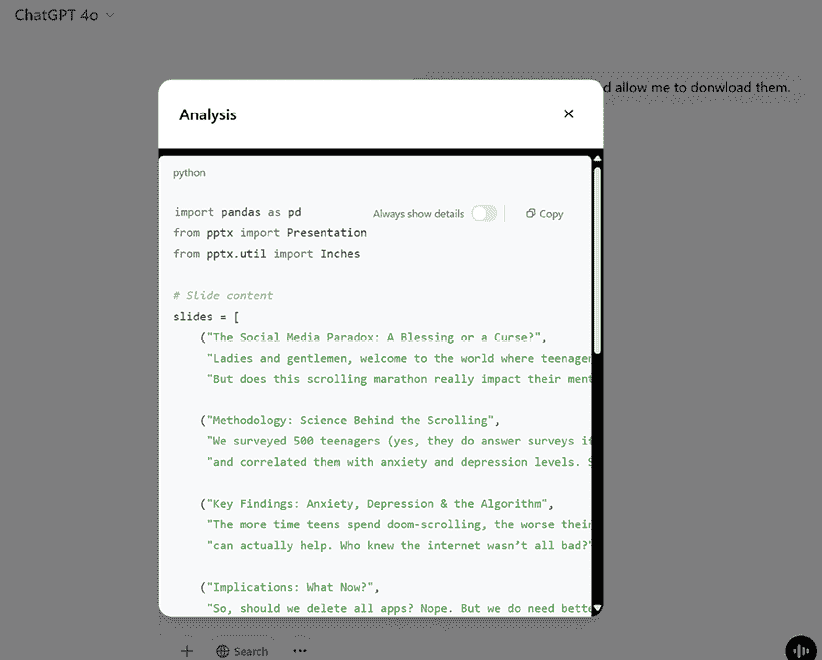

图 7.16：ChatGPT 在后台运行 Python 代码

如果你点击提供的链接，你将能够下载生成的幻灯片：

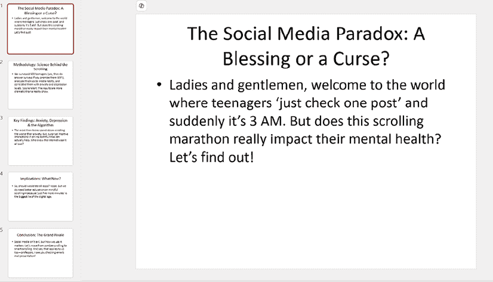

图 7.17：生成的幻灯片

如您所见，大纲已经根据我们的要求保留。

最后，让我们想象一下，我们的论文讨论非常出色，以至于它可能被选中获得研究资金，以便继续研究这个主题。现在我们需要一个电梯演讲来说服资助委员会。让我们向 ChatGPT 寻求一些支持：

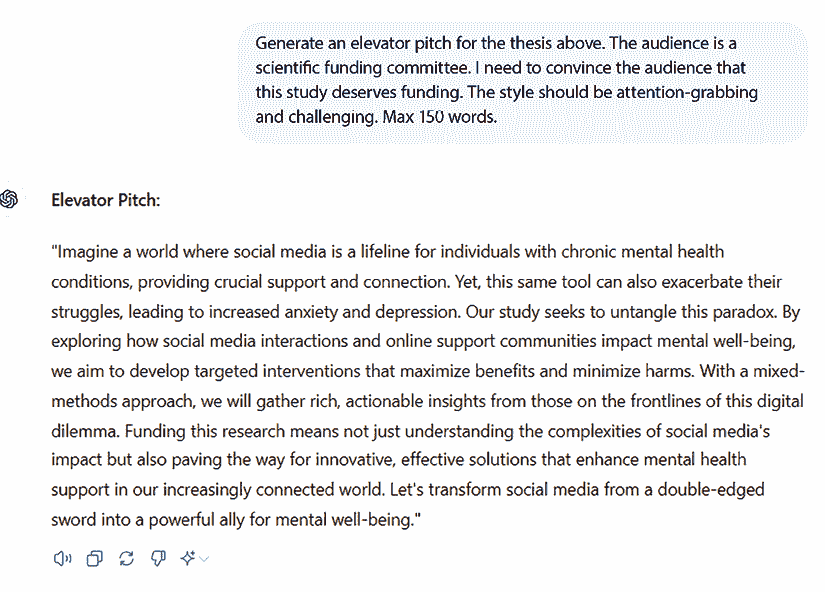

图 7.18：给定论文的电梯演讲

我们可以随时调整结果，使它们更符合我们的需求；然而，拥有现成的结构和框架可以节省大量时间，并让我们更多地关注我们想要带来的技术内容。

总体而言，ChatGPT 能够支持研究从文献收集和审查到研究最终提案的端到端旅程，我们已经展示了它如何成为研究人员的优秀 AI 助手。

此外，请注意，在研究领域，最近还开发了一些与 ChatGPT 不同但同样由 GPT 模型驱动的工具。一个例子是 Humata.ai，这是一个 AI 驱动的工具，允许您上传文档并对它们执行多项操作，包括总结、即时问答以及基于上传文件生成新论文。

这表明了 GPT 驱动的工具（包括 ChatGPT）正在为研究领域的多项创新铺平道路。

# 摘要

在本章中，我们探讨了 ChatGPT 作为研究人员宝贵工具的使用。通过文献综述、实验设计、参考文献生成和格式化以及演示文稿生成，ChatGPT 可以帮助研究人员加快那些低或零附加价值的活动，以便他们可以专注于相关活动。

注意，我们只关注了 ChatGPT 可以支持研究人员的一小部分活动。在研究领域的许多其他活动中，ChatGPT 的支持也可能带来益处，其中包括数据收集、研究参与者招募、研究网络建设、公众参与等。

将此工具融入其工作的研究人员可以从中受益于其多功能性和节省时间的特性，最终导致更具有影响力的研究成果。

然而，重要的是要记住，ChatGPT 只是一个工具，应该与专家知识和判断结合使用。与任何研究项目一样，仔细考虑研究问题和研究设计对于确保结果的效度和可靠性是必要的。

在下一章中，我们将开始看到一些多模态的例子，通过结合 ChatGPT 的图像理解和生成视觉能力。

# 参考文献

+   *点赞的作用：在线反馈如何影响用户的心理健康*：[`arxiv.org/abs/2312.11914`](https://arxiv.org/abs/2312.11914)

+   *促进在线心理健康支持中同理心对话的方法*：*一种强化学习方法*：[`arxiv.org/abs/2101.07714`](https://arxiv.org/abs/2101.07714)

+   *第二次机器时代：在辉煌技术时代的工作、进步和繁荣*：[`psycnet.apa.org/record/2014-07087-000`](https://psycnet.apa.org/record/2014-07087-000)

+   *技术压力对角色压力和生产率的影响*：[`www.tandfonline.com/doi/abs/10.2753/MIS0742-1222240109`](https://www.tandfonline.com/doi/abs/10.2753/MIS0742-1222240109)

+   *关于工作未来的大辩论，解释了*：[`www.youtube.com/watch?v=TUmyygCMMGA`](https://www.youtube.com/watch?v=TUmyygCMMGA)
