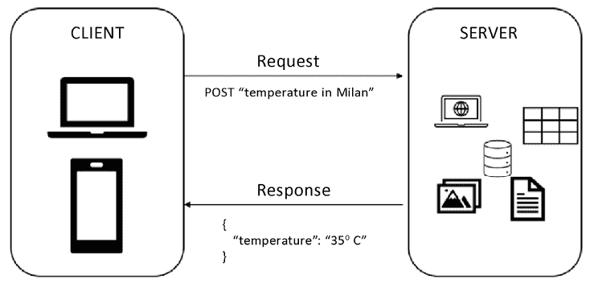
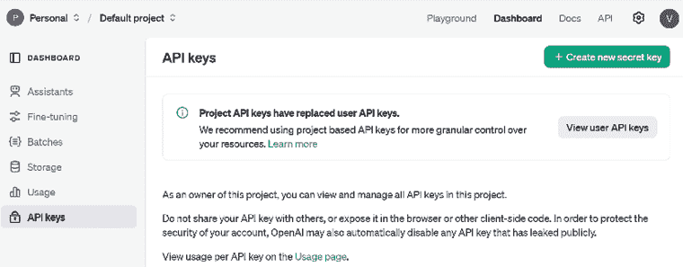
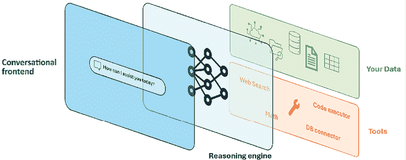
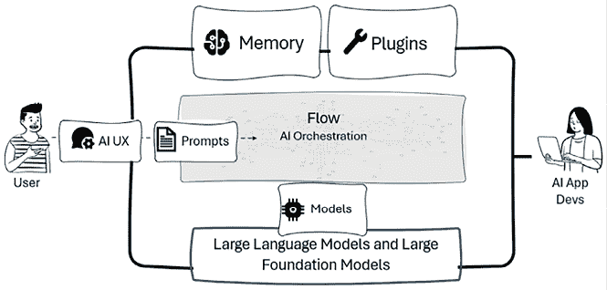
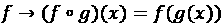
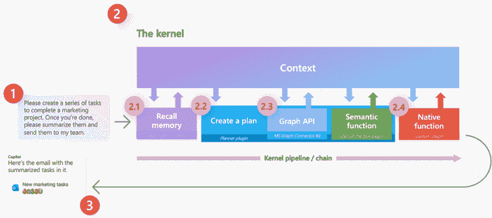
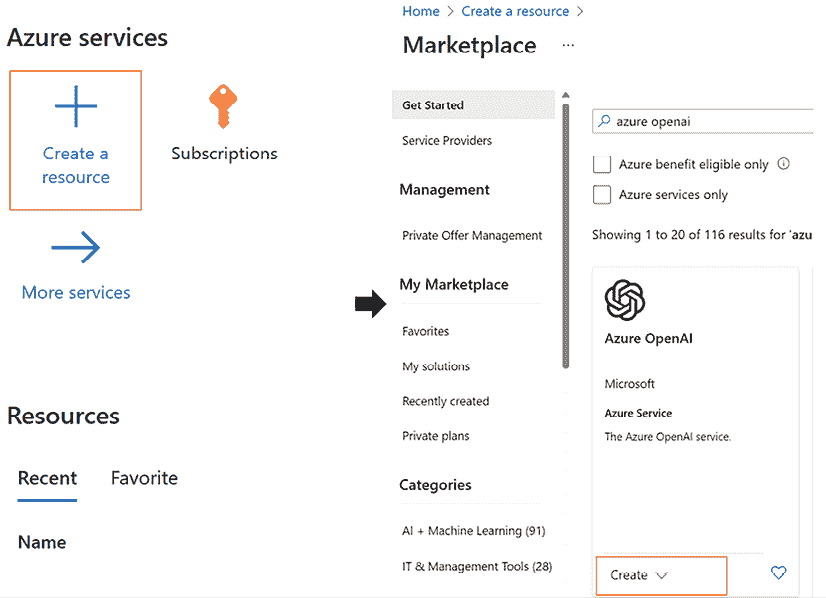
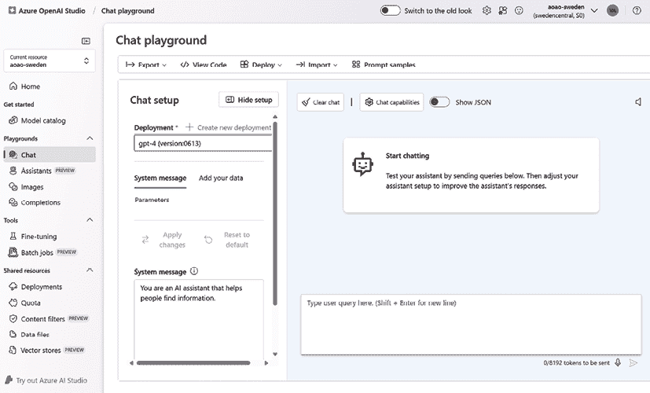
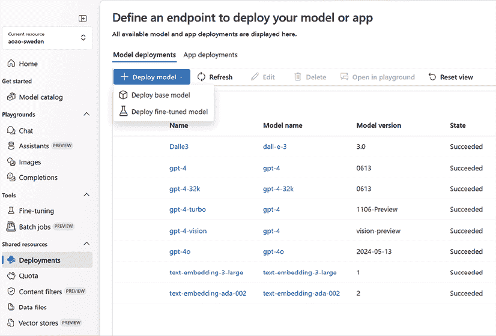
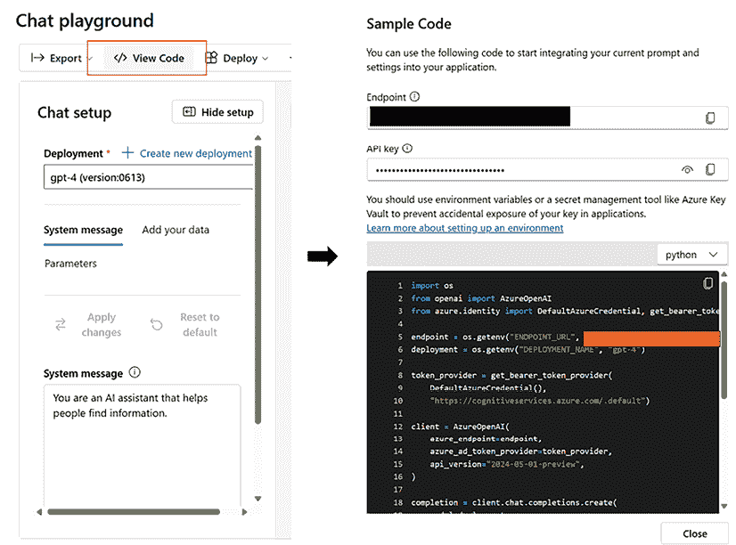

# 第十章：利用 OpenAI 的模型进行企业级应用

在本章中，我们将重点关注企业级应用 **生成式人工智能（GenAI**）以及更具体地说，OpenAI 的模型。我们将看到近年来不同行业如何受到 GenAI 的巨大影响，以及涌现出的哪些趋势模式和应用程序。

在本章中，我们将讨论以下主题：

+   各个行业（包括医疗保健、金融服务、零售等）的最新进展，这些进展是由强大的 LLM 的卓越能力驱动的，突出了最热门的应用案例

+   由 OpenAI 模型驱动的自定义应用程序背后的架构框架，揭示了模型 API 的多功能性和采用情况

+   Azure OpenAI 简介，这是微软基于云的服务，它反映了 OpenAI 的游乐场，并在 Azure 订阅范围内直接提供 OpenAI 的模型

到本章结束时，你将了解各个行业中主要的 GenAI 模式，以及如何在你的应用程序中利用 OpenAI 模型的 API。此外，你将更清楚地了解 Azure OpenAI 的云规模服务以及如何在开发基于 AI 的解决方案时考虑道德因素。

# 技术要求

以下是本章的技术要求：

+   OpenAI 账户、聊天模型和嵌入模型部署

+   [可选] Azure 订阅和 Azure OpenAI 实例，包括聊天模型和嵌入模型部署

+   Python 3.7.1 或更高版本

你可以参考以下存储库以获取 OpenAI Python SDK：https://github.com/openai/openai-python。

# 通用人工智能（GenAI）如何颠覆行业

LLMs 和 GenAI 在一般意义上通过引入前所未有的自动化、创造力和效率，正在革命性地改变各个行业。近年来，我们见证了不同行业创新浪潮的巨大浪潮，所有这些行业都认为，如果不抓住 GenAI 的机会，就会在竞争激烈的市场中落后。

让我们看看一些例子。

## 医疗保健

在医疗保健领域，GenAI 和 LLMs 正在增强诊断、个性化医疗和行政任务：

+   **诊断**：LLMs 如 GPT-4 正在被用于分析医学图像、预测疾病和提出治疗方案。例如，AI 驱动的工具现在可以以高精度分析放射学图像，识别癌症或心脏病等疾病的早期迹象，通常在速度和一致性方面优于人类放射科医生。计算机视觉领域的最新进展的绝佳例子可以在 Tyler J. Bradshaw 等人发表在 *《核医学杂志》*（你可以在 https://jnm.snmjournals.org/content/early/2025/01/16/jnumed.124.268072 找到）的文章中找到。

+   **个性化医疗**：通过分析患者数据，包括遗传信息，GenAI 正帮助开发个性化治疗方案。这导致了定制疗法，从而改善了治疗效果。

+   **行政效率**：LLMs 正在简化如患者记录管理和预约安排等行政任务。AI 聊天机器人可以处理患者查询，减轻医疗人员的工作负担。

### 案例研究

OpenAI 与 Summer Health 合作，Summer Health 是一家提供通过短信快速便捷获取儿科护理的健康服务。此次合作旨在通过整合 OpenAI 的高级语言模型来增强 Summer Health 平台的功能。这种集成使得对父母医疗咨询的响应更加高效和准确，为儿童健康问题提供快速、可靠的医疗建议。这导致了效率的提高和及时性的改善，同时保持数据匿名。AI 驱动的平台帮助简化了父母和医疗专业人员之间的沟通，提高了儿科护理的整体体验和可及性。

*来源:* https://openai.com/index/summer-health/.

## 金融

在金融领域，GenAI 和 LLMs 正在改变风险管理、客户服务和投资策略：

+   **索赔管理**：LLMs 被用于自动化索赔的总结、审查、分类和裁决。例如，慕尼黑再保险公司开发了一个由 LLM 驱动的索赔管理解决方案，该方案简化了索赔流程，减少了人工工作量，并提高了决策准确性（https://www.munichre.com/us-life/en/insights/future-of-risk/large-language-models-in-underwriting-and-claims.html）。

+   **客户服务**：在金融领域，AI 驱动的聊天机器人和虚拟助手现在很常见，负责处理客户咨询、处理交易和提供财务建议。ING 的 AI 助手是虚拟助手的典型例子，它通过提供见解、提醒和交易详情来帮助客户管理财务（https://www.mckinsey.com/industries/financial-services/how-we-help-clients/banking-on-innovation-how-ing-uses-generative-ai-to-put-people-first）。

+   **投资策略**：对冲基金和投资公司正在使用 GenAI 创建预测模型，以指导交易决策。AI 算法分析市场数据以识别模式并做出实时交易决策。BlackRock 的 Aladdin 平台就是这样一个例子，它利用 AI 来管理投资和评估市场风险（https://www.blackrock.com/aladdin/solutions/aladdin-copilot）。

### 案例研究

麦迪尔公司（Moody's Corporation），一家领先的全球信用评级、研究和风险分析提供商，已与微软合作开发由生成式人工智能（GenAI）驱动的增强风险数据分析和研究解决方案。这一合作将麦迪尔在金融风险和数据分析方面的广泛专业知识与微软先进的 AI 技术相结合。结果是提供实时洞察金融风险的工具，使金融机构和其他利益相关者能够做出更精确的决策并改善风险管理。

来源：https://news.microsoft.com/2023/06/29/moodys-and-microsoft-develop-enhanced-risk-data-analytics-research-and-collaboration-solutions-powered-by-generative-ai/?msockid=2dc01bb6f864693933ed0eb3f9a668dc.

## 零售和电子商务

在零售和电子商务领域，生成式人工智能（GenAI）和大型语言模型（LLMs）正在提升客户体验、库存管理和个性化营销：

+   **客户体验**：人工智能驱动的聊天机器人提供个性化的客户服务，帮助购物者找到产品、解决问题并完成购买。

+   **库存管理**：大型语言模型（LLMs）通过分析销售数据、季节性趋势和客户行为，帮助零售商预测需求并优化库存水平。

+   **个性化营销**：生成式人工智能（GenAI）正在实现高度个性化的营销活动。通过分析客户数据，AI 可以创建针对性的广告和产品推荐。

### 案例研究

可口可乐公司推出了一项创新计划，邀请数字艺术家使用与**谷歌云平台**（**GCP**）合作开发的新人工智能平台创作独特的艺术品。该平台允许艺术家通过结合可口可乐标志性的品牌元素和他们的创造力来生成数字内容。这一名为“创造真实魔法”的计划利用先进的 AI 工具激发和赋权艺术家，促进与可口可乐品牌理念产生共鸣的数字艺术创作。该项目突显了人工智能如何在零售和消费品行业中架起创造力和技术之间的桥梁。

来源：https://brandthechange.com/creativity/create-real-magic-inside-coca-colas-first-ai-powered-campaign/#:~:text=The%20Coca-Cola%20Company%20has%20partnered%20with%20OpenAI%20and%2Cusing%20iconic%20creative%20assets%20from%20the%20Coca-Cola%20archives.

## 制造业

在制造业中，生成式人工智能（GenAI）和大型语言模型（LLMs）正在推动自动化、质量控制和供应链优化：

+   **自动化**：由人工智能（AI）驱动的机器和系统正在自动化重复性任务，例如装配线工作和物料处理。

+   **质量控制**：大型语言模型（LLMs）用于实时监控生产过程，识别缺陷或低效。人工智能系统可以分析传感器和摄像头数据，以检测产品中的异常，确保更高的质量。

+   **供应链优化**：人工智能模型通过预测需求、管理库存和选择供应商，帮助制造商优化其供应链。

### 案例研究

Iveco 集团，作为全球领先的商用车制造商，已与微软合作，将 Azure OpenAI 服务整合到其业务流程中。客户开发了一个名为“Chat IVG”的内部智能聊天机器人，可用于问答以及从组织自己的数据和文档中提取信息。此外，正在开发和部署大量用例和自主项目，这些项目要么利用 Chat IVG 的特定定制，要么以它的架构为基础。Chat IVG 通过提升内部业务用户的使用体验、提高各个业务单元的生产力以及实现更快、更高效的[客户支持](https://www.microsoft.com/en/customers/story/1706380538888475836-iveco-group-azure-openai-service-manufacturing-italy)产生了重大影响。

来源：https://www.microsoft.com/en/customers/story/1706380538888475836-iveco-group-azure-openai-service-manufacturing-italy

## 媒体和娱乐

在媒体和娱乐领域，GenAI 和 LLMs 正在革命性地改变内容创作、受众参与和媒体分发：

+   **内容创作**：GenAI 正被用于生成内容，从撰写文章到创作音乐。例如，《华盛顿邮报》使用 AI 撰写简短的新闻文章和报道，从而让记者能够专注于更复杂的故事。在音乐领域，像 OpenAI 的 MuseNet 这样的 AI 平台可以创作各种风格的原声音乐曲目，帮助音乐家在创作过程中提高效率。

+   **受众参与**：LLMs 通过分析用户数据来提供个性化的内容推荐，保持受众的参与度。Netflix 使用 AI 根据观众的偏好推荐电影和电视剧，显著提高了观众的留存率。

+   **媒体分发**：AI 通过分析受众人口统计和消费模式，也在优化媒体分发。Spotify 使用 AI 来创建个性化的播放列表，确保用户发现符合他们口味的全新音乐。

### 案例研究

微软的 Xbox 部门宣布与 Inworld AI 签订多年合作协议，以开发用于游戏开发的先进 GenAI 工具。这次合作旨在通过整合 Inworld 在 GenAI 方面的专业知识与微软的 Azure OpenAI 服务和微软研究部门的见解，来提升角色对话和叙事创作的效果。目标是赋予游戏开发者创造更动态和沉浸式游戏体验的能力。

来源：https://developer.microsoft.com/en-us/games/articles/2023/11/xbox-and-inworld-ai-partnership-announcement/

## 法律服务

在法律行业，GenAI 和 LLMs 正在改变研究、合同分析和案例预测：

+   **法律研究**：人工智能工具通过分析大量法律文件、案例法和法规，加速了法律研究。例如，ROSS Intelligence 使用人工智能在几秒钟内为律师提供相关的案例法和法律先例，这通常需要手动查找数小时。

+   **合同分析**：大型语言模型（LLMs）被用于审查和分析合同，识别关键条款、风险和合规问题。这有助于加快谈判并确保合同无懈可击。Kira Systems 就是这样一个例子，它使用人工智能审查合同以进行尽职调查，识别条款和潜在风险。

+   **案例预测**：基于历史数据，人工智能正在被用于预测法律案件的结果。通过分析过往案例，人工智能可以为律师提供可能的判决见解，帮助他们更好地制定策略。例如，Lex Machina 就使用人工智能预测法官在知识产权纠纷中可能做出的裁决。

### 案例研究

铁甲，一家领先的数字合同平台，已与 OpenAI 合作，将其高级人工智能功能集成到其法律工作流程中。通过利用 OpenAI 的语言模型，Ironclad 提升了其平台自动化合同分析、生成和审查法律文件以及更高效地为法律团队提供见解的能力。

这种集成使得合同处理更快、更准确，减少了手动审查的时间，并使法律团队能够专注于更高价值的工作。这次合作强调了人工智能在通过提高合同管理中的准确性和生产力来转型法律行业中所日益增长的作用。

## 教育

在教育领域，通用人工智能（GenAI）和大型语言模型（LLMs）正在改变学习体验、个性化教育和行政任务：

+   **学习经验**：由人工智能驱动的平台正在根据学生的优势和劣势创建个性化的学习路径。例如，Coursera 等平台利用人工智能推荐适合每个学习者进度和偏好的课程和资源。

+   **个性化教育**：大型语言模型（LLMs）可以通过回答问题、解释概念和提供作业反馈来辅导学生。Khan Academy 的 AI 驱动辅导员就是一个例子，为在特定主题上遇到困难的学生提供个性化帮助。

+   **行政任务**：人工智能还被用于自动化诸如评分和排程等行政任务。例如，Turnitin 利用人工智能评分论文并检测剽窃，节省了教育者的时间并确保了学术诚信。

### 案例研究

可汗学院与 OpenAI 合作，将其先进的人工智能能力融入其教育平台。通过整合 OpenAI 的语言模型，可汗学院能够提供个性化的辅导、回答学生的问题，并以更互动和动态的方式协助学习。这次合作旨在通过提供实时帮助和定制支持来增强教育体验，使学习更加便捷和有效。AI 驱动的工具帮助学生掌握复杂的概念，提供即时反馈，并适应个人的学习风格，进一步通过技术民主化教育。[可汗学院与 OpenAI 合作](https://openai.com/index/khan-academy/)

[来源](https://openai.com/index/khan-academy/)

上述例子只是 GenAI 在各个行业中实现的可能性的一个子集。然而，所有这些例子中有一个共同点：在每个场景中，都构建了一个自定义应用程序，利用 LLM API。

# 理解 OpenAI 模型 API

在本书的 *第一章* 中，我们看到了 LLM 如何在 AI 领域中引入范式转变：与“ChatGPT 时代之前”以 AI 为特色的定制、高度专业化的模型不同，LLM 现在能够被泛化并根据用户的查询处理不同的任务。

此外，还有一个额外的元素将 LLM 与之前的模型区分开来：实际上，LLM 通常作为预训练对象提供，任何人——甚至没有 AI 领域的任何经验——都可以以最简单的方式使用：自然语言。

当然，没有人阻止你从头开始设计和训练你的 LLM，但请注意，这至少需要：

+   设计模型所需的技术知识

+   大量的训练数据

+   可以支持训练和推理阶段的专用基础设施

+   在项目中投入大量时间

如果上述元素在过去曾是许多 AI 开发者进入该领域的障碍，那么现在范式已经转变。实际上，新的焦点是如何高效地构建围绕 LLM 的所有内容，例如系统消息、**向量数据库**（**VectorDBs**）、插件等等。这就是为什么现在使用 LLM 的 API 已成为构建 GenAI 应用程序的验证模式。

## 模型 API 是什么？

在讨论 OpenAI 模型 API 之前，让我们首先回顾一下 API 的定义。

**应用程序编程接口**（**API**）是一套规则和工具，允许不同的软件应用相互通信。它就像一个翻译者，通过以标准化的方式共享数据和功能，帮助不同的程序或系统协同工作。例如，当你使用一个应用程序来查看天气时，该应用程序使用 API 从天气服务获取天气信息。



图 10.1：一个使用 API 收集信息的天气应用程序

现在，当谈到 LLMs 的 API 时，机制是相似的。更具体地说，LLMs 的 API 属于**表示状态转移**（**REST**）API 的范畴，这意味着它们：

+   使用标准的 HTTP 方法（POST 用于发送提示，GET 用于检索数据）。

+   通过 HTTP/HTTPS 进行通信。

+   以 JSON 格式返回响应。

+   遵循无状态模型，意味着每个请求都是独立的。

    **定义**

    **REST API**是一种基于 Web 的 API，遵循 REST 原则，使用 GET、POST、PUT 和 DELETE 等 HTTP 方法通过 URL 与资源进行交互。它是无状态的，意味着每个请求都是独立的，并且通常以 JSON 格式交换数据。其他类型的 API 包括**SOAP**，它依赖于 XML 进行结构化消息和严格的安全；**GraphQL**，它允许客户端请求特定数据以获得更多灵活性；**gRPC**，它使用 Protocol Buffers 进行高效的微服务通信；**WebSockets**，它实现了实时双向通信；以及**流式 API**，它提供连续的数据流，常用于 AI 响应和股市信息流。

让我们探讨您如何使用 OpenAI 模型的 API 来创建一个营销助手。这个助手帮助营销人员生成社交媒体帖子、电子邮件草稿、广告文案或博客文章想法。让我们分解整个过程：

1.  **发送请求**：

    +   使用您应用程序的营销人员可能会输入提示，例如：“创建一篇推广我们新环保产品线的社交媒体帖子。”

    +   您的营销助手将此提示作为请求的一部分发送到 OpenAI 模型的 API。请求包括提示和任何特定指令，包括要使用的模型——比如说，GPT-4o。

1.  **模型处理**：

    +   OpenAI API 接收请求并使用指定的模型（在我们的例子中是 GPT-4o）处理提示。

    +   模型通过分析输入并利用其广泛的知识库生成响应。它考虑因素如目标受众、常见营销用语和期望的语气，以创建相关内容。

1.  **接收响应**：

    +   API 将生成的内容作为响应发送回您的营销助手应用程序。

    +   例如，模型可能会生成类似以下内容：“兴奋地推出我们新的环保产品线！可持续、时尚，完美适合有意识的消费者。加入我们，共同创造积极影响——现在购物并拯救地球，一次一个产品！#环保友好 #可持续性。”

1.  **显示响应**：

    +   您的应用程序从 API 接收内容并将其显示给营销人员。

    +   营销人员可以随后根据需要审查、编辑和发布内容，从而在内容创作过程中节省时间和精力。

1.  **附加功能**：

    +   **定制**：营销人员可以进一步定制请求。例如，他们可能会要求一系列帖子或请求变化以测试不同的营销角度。

    +   **反馈循环**：应用程序还可能允许营销人员对生成的内容进行评分。这种反馈可以用于微调未来的请求，随着时间的推移提高内容的关联性和质量。

1.  **幕后**:

    +   **API 密钥和身份验证**：要使用 OpenAI API，您的应用程序需要一个 API 密钥（一个用于验证和识别向 API 发送请求的应用程序或项目的唯一字母数字字符串），这确保只有授权用户可以访问该服务。

    +   **处理多个请求**：OpenAI API 被设计为可以同时处理多个请求，这意味着它可以同时为许多营销人员提供服务而不会减慢速度。

    +   **速率限制和成本**：根据 API 使用情况，可能会有速率限制（例如，每分钟可以发送多少请求）以及与处理文本数量相关的成本。您的应用程序需要管理这些因素，可能通过优先处理某些请求或批量处理它们。

通过 API 消耗 OpenAI 模型为开发者提供了在定制围绕 LLM 的应用程序逻辑方面的巨大灵活性。在下一节中，我们将看到如何使用 Python 实际利用这些 API。

## 如何使用 Python SDK 与 OpenAI 模型的 API 交互

要在你的编程 IDE 中使用 OpenAI 模型的 API，你首先需要从你的 OpenAI 账户创建一个访问令牌。

**注意**

在消耗 OpenAI 的 API 时，您将产生与模型使用成比例的费用。更具体地说，OpenAI 的定价模型是 **按令牌计费**，其中令牌代表一段文本（英语中约为 4 个字符）。为了估计您的令牌消耗——因此您的成本——您可以参考这篇文章：[`help.openai.com/en/articles/4936856-what-are-tokens-and-how-to-count-them`](https://help.openai.com/en/articles/4936856-what-are-tokens-and-how-to-count-them)。

每个 API 请求都会根据输入（提示）和输出（响应）消耗令牌。价格因模型而异，**更强大的模型每令牌成本更高**。

您可以在 https://openai.com/api/pricing/ 找到 OpenAI 的定价模型。

要做到这一点，您可以按照以下步骤操作：

1.  导航至 [`platform.openai.com/api`](https://platform.openai.com/api-keys)-keys.

1.  点击 `+ 创建新的密钥`:



图 10.2：OpenAI API 平台

1.  这将创建一个新的 API 密钥，您可以将其保存在您选择的密钥库中。

创建 API 密钥后，您可以使用以下脚本使用它来消耗您的模型：

```py
from openai import OpenAI
client = OpenAI(api_key = "xxx")
response = client.chat.completions.create(
  model="gpt-4o",
  messages=[
    {"role": "system", "content": "You are a helpful assistant."},
    {"role": "user", "content": "What is the recipe for Margherita Pizza?"}
  ]
) 
```

上述示例使用了 Python SDK。然而，你也可以按照 OpenAI 文档中的说明使用 Node.js 或 curl 进行调用。

注意

您的客户端架构可能取决于您使用的模型以及您作为提示传递的数据格式。例如，如果您使用 gpt-4o-mini 进行图像处理，您的客户端将如下所示：

response = client.chat.completions.create(

model=”gpt-4o-mini”,

messages=[

{

“role”: “user”,

“content”: [

{“type”: “text”, “text”: prompt},

{

“type”: “image_url”，

“image_url”: {“url”: f”data:{img_type};base64,{img_b64_str}”},

},

],

}

],

)

您可以在以下 GitHub 仓库[`github.com/openai/openai`](https://github.com/openai/openai-python)找到 OpenAI Python 库。

让我们检查响应是如何构建的（我已截断响应的内容）：

```py
response.to_dict()
{'id': 'chatcmpl-9znQeWUbRyGmy3pWf7VfFWAppMCo7',
 'choices': [{'finish_reason': 'stop',
   'index': 0,
   'logprobs': None,
   'message': {'content': 'To make Margherita Pizza […]
    'role': 'assistant'},
   'content_filter_results': {'hate': {'filtered': False, 'severity': 'safe'},
    'self_harm': {'filtered': False, 'severity': 'safe'},
    'sexual': {'filtered': False, 'severity': 'safe'},
    'violence': {'filtered': False, 'severity': 'safe'}}}],
 'created': 1724515040,
 'model': 'gpt-4o-2024-05-13',
 'object': 'chat.completion',
 'system_fingerprint': 'fp_abc28019ad',
 'usage': {'completion_tokens': 193, 'prompt_tokens': 55, 'total_tokens': 248},
 'prompt_filter_results': [{'prompt_index': 0,
   'content_filter_results': {'hate': {'filtered': False, 'severity': 'safe'},
    'self_harm': {'filtered': False, 'severity': 'safe'},
    'sexual': {'filtered': False, 'severity': 'safe'},
    'violence': {'filtered': False, 'severity': 'safe'}}}]} 
```

如您所见，响应对象由许多组件组成：

+   `id`: 这是 API 调用的唯一标识符。在这种情况下，`chatcmpl-9znQeWUbRyGmy3pWf7VfFWAppMCo7` 是与特定聊天完成请求关联的特定 ID。

+   `choices`: 这是一个包含由模型生成的不同可能响应（选择）的数组。在这个响应中，只有一个选择（`index 0`），这对于大多数单响应完成来说是典型的：

    +   `index`: 表示此特定选择在选项列表中的位置（在这种情况下，`0`）。

    +   `finish_reason`: 表示模型停止生成标记的原因。**stop** 通常表示模型自然到达其响应的末尾，无需截断。

    +   `logprobs`: 如果启用，这将包含完成中每个标记的对数概率。这里为 `None`，表示您没有请求此信息。

    +   `message`: 包含响应的内容（`'content'`）和说话者的角色（`'role'`）：

        +   `content`: 辅助生成的实际文本，在这种情况下是关于支持客户管理密钥的 Azure AI 服务的响应

        +   `role`: 对话中说话者的角色，这里为‘assistant’，表示响应来自 AI 助手

    +   `content_filter_results`: 这包含对响应的内容过滤结果，检查是否存在任何有害内容，如仇恨、自残、性内容和暴力等类别。在这种情况下，所有类别都被标记为 `'safe'` 和 `'filtered': False`，表示未检测到任何问题内容。

+   `created`: 这是一个表示响应生成时间的戳记。数字 `1724515040` 是 UNIX 时间戳（自 1970 年 1 月 1 日起的秒数）。

+   `model`: 这表示生成响应的模型的版本。

+   `object`: 这表示返回的对象类型。在这种情况下，`'chat.completion'` 表示这是一个来自聊天 API 的完成。

+   `system_fingerprint`: 这是一个 OpenAI 用于跟踪或诊断处理请求的系统的内部标识符。`'fp_abc28019ad'` 是此交易的特定指纹。

+   `usage`: 此对象跟踪 API 调用的标记使用情况：

    +   `completion_tokens`: 在生成的响应中使用的标记数（193 个标记）

    +   `prompt_tokens`: 输入提示中使用的标记数（55 个标记）

    +   `total_tokens`: 请求中消耗的标记总数，这是提示和完成标记的总和（248 个标记）

+   `prompt_filter_results`：这个数组包含在生成响应之前应用于输入提示的内容过滤结果。它确保提示不包含有害内容。类似于选择部分中的`content_filter_results`，它包括对仇恨、自残、色情内容和暴力的检查。所有这些都被标记为`'safe'`和`'filtered': False`，表示没有发现任何问题。

在所有输出参数中，`content_filter_results`可能在管理可能有害的结果时特别相关。事实上，你可能希望对可能有害的内容采取更加保守的方法，无论是输入还是输出。如果是这种情况，你可以简单地实施一个确定性规则，防止模型进一步处理触发特定风险级别的任何请求。

这是一个有意义的例子，说明了如何利用 OpenAI 模型的 API，在围绕大型语言模型（LLM）构建应用程序逻辑时提供极大的灵活性。

# 使用模型 API 构建应用程序的架构模式

通用人工智能（GenAI）和大型语言模型（LLM）的兴起为软件开发领域的革命铺平了道路。事实上，从“现代应用”——指的是基于微服务架构和 CI/CD 的快速创新——我们现在谈论的是“智能应用”，这些应用被自然语言交互、数据驱动经验和适应新模型发布的速度所增强。

可以用以下插图来描述一个智能应用程序：



图 10.3：由 LLM 驱动的智能应用程序的解剖结构

在上述架构中，我们展示了具有以下特征的智能应用程序的解剖结构：

+   它具有自然语言界面（可能是基于文本或语音的）。

+   它由一个 LLM 驱动，作为应用程序的“大脑”。

+   它有一个模型可以查询的知识库，通常使用**检索增强生成**（**RAG**）技术。

+   它有一套可以用来与外部环境交互的工具或插件。

这种新的软件开发范式带来了一组典型的 AI 驱动应用程序的新应用程序组件。让我们更详细地探讨这些新组件。

## 新的应用程序组件

在人工智能开发方面的主要转变是指我们与模型合作的方式：从生产模型，现在的趋势是消费模型，正如我们多次提到的，这些模型不过是 API。

这种转变导致了一系列新的软件开发组件（或现有组件的调整）在开发领域的出现：

+   **模型**：模型就是我们决定嵌入到我们应用程序中的 LLM 类型。模型主要分为两大类：

    +   **专有大型语言模型（Proprietary LLMs）**：指由特定公司或组织拥有的模型。例如，由 OpenAI 开发的 GPT-4o 或由 Google 开发的 Gemini。由于它们的源代码和架构不可用，这些模型不能从零开始使用自定义数据进行重新训练，但在需要时可以进行微调。

    +   **开源（Open-source）**：具有代码和架构自由可用和分发的模型，因此它们也可以从零开始使用自定义数据进行训练。例如，由阿布扎比的**技术创新研究所（Technology Innovation Institute，简称 TII**）开发的 Falcon LLM 和由 Meta 开发的 Llama。

+   **系统消息（System message）**：这是我们提供给模型的一组指令，它影响我们 AI 应用的风格和行为。我们可以在元提示中直接塑造许多功能，包括：

    +   通过指定模型仅参考提供的知识库来减少幻觉（这个过程称为“扎根”）

    +   通过指定，例如，不响应恶意查询或不要生成可能有害的响应来实施负责任的 AI 实践

    +   指导模型在回答之前始终提出额外问题以巩固上下文

+   **记忆与向量数据库（Memory and VectorDB）**：当我们谈论 AI 应用程序中的记忆时，我们需要区分两种类型的记忆：

    +   **短期记忆（Short-term memory）**：这是应用程序保持用户与 LLM 之间交互在上下文窗口中的能力。这意味着每条消息都会为模型的现有元提示提供信息，而无需用户重复已经提到的内容。

    +   **长期记忆（Long-term memory）**：这种类型的记忆指的是我们通过嵌入提供给模型的外部知识库。在这种情况下，我们通常利用向量数据库，这是一种新型数据库（或现有数据库的新功能），用于存储提供的文档的数值表示。

        **定义（Definition）**

        向量数据库（VectorDB）是一种基于向量嵌入存储和检索信息的数据库，这些嵌入是捕获文本意义和上下文的数值表示。通过使用向量数据库，你可以根据意义的相似性而不是关键词进行语义搜索和检索。向量数据库的例子包括 Chroma、FAISS、Elasticsearch、Milvus、Pinecone、Qdrant 和 Weaviate。

+   **工具/插件（Tools/plugins）**：这些可以被视为可以集成到 LLM 中以扩展其功能或适应特定任务和应用的附加模块或组件。这些插件作为附加组件，增强了 LLM 在核心语言生成或理解能力之外的特性。

插件背后的理念是使 LLM 更加灵活和适应性强，允许开发者和用户根据他们的特定需求定制语言模型的行为。可以创建执行各种任务的插件，并且它们可以无缝地集成到 LLM 的架构中。

以下是一个由 LLM 驱动的应用程序的主要组件的说明：



图 10.4：LLM 驱动的应用程序的高级架构

如上图所示，高级架构的核心是 **AI 调度器**。通过 AI 调度器，我们指的是轻量级库，它使得在应用程序中嵌入和调度 LLM 变得更加容易。

## AI 调度器

由于 LLM 在 2022 年底走红，市场上已经出现了许多库。在接下来的几节中，我们将重点关注其中的三个：LangChain、Semantic Kernel 和 Haystack。

### LangChain

**LangChain** 是由 Harrison Chase 于 2022 年 10 月作为开源项目推出的。它可以在 Python 和 JS/TS 中使用。

LangChain 是一个用于开发由语言模型驱动的应用程序的框架，使它们具有数据感知性（具有基础）和代理性——意味着能够与外部环境交互。

LangChain 为与之前提到的语言模型组件（如提示、记忆和插件）一起工作提供了模块化抽象。除了这些组件，LangChain 还提供了预构建的 **链**，这些链是组件的结构化连接。这些链可以是针对特定用例预构建的，也可以是定制的。

总体而言，LangChain 具有以下核心模块：

+   **模型**：这些是将成为应用程序引擎的 LLM 或大型基础模型。LangChain 支持专有模型，如 OpenAI 和 Azure OpenAI 中可用的模型，以及可以从 **Hugging Face Hub** 消费的开源模型。

    **定义**

    Hugging Face 是一家公司和社区，它构建和分享自然语言处理（**NLP**）和其他机器学习领域的最先进模型和工具。它开发了 Hugging Face Hub，这是一个平台，人们可以在这里创建、发现和协作机器学习模型、LLM、数据集和演示。Hugging Face Hub 在各个领域和任务（如音频、视觉和语言）中托管了超过 120k 个模型、20k 个数据集和 50k 个演示。

除了模型之外，LangChain 还提供了许多与提示相关的组件，这使得管理提示流程变得更加容易。

+   **数据连接**：这些指的是获取我们希望提供给模型的额外非参数化知识的构建块。数据连接的例子包括文档加载器或文本嵌入模型。

+   **记忆**：它允许应用程序在短期和长期内保留对用户交互的引用。它通常基于存储在 VectorDB 中的矢量嵌入。

+   **链**: 这些是预定的一系列动作和对 LLMs 的调用，这使得构建需要将 LLMs 相互连接或与其他组件连接的复杂应用程序变得更容易。一个链的例子可能是：获取用户查询，将其分成更小的部分，嵌入这些部分，在向量数据库中搜索相似的嵌入，使用向量数据库中最相似的三个部分作为上下文来提供答案，生成答案。

+   **代理**: 代理是驱动 LLM 应用程序中决策的实体。它们可以访问一系列工具，并且可以根据用户输入和上下文决定调用哪个工具。代理是动态和自适应的，这意味着它们可以根据情况或目标改变或调整其行为。

### Haystack

**Haystack** 是由 *deepset* 开发的一个基于 Python 的框架，*deepset* 是一家成立于 2018 年的初创公司，由 Milos Rusic、Malte Pietsch 和 Timo Möller 在柏林创立。deepset 为开发者提供了构建基于 NLP 的应用程序的工具，并且随着 Haystack 的引入，他们将其提升到了新的水平。

Haystack 包含以下核心组件：

+   **节点**: 这些是执行特定任务或功能的组件，例如检索器、阅读器、生成器、摘要器等。节点可以是 LLMs 或其他与 LLMs 或其他资源交互的实用工具。在 LLMs 中，Haystack 支持专有模型，例如 OpenAI 和 Azure OpenAI 中可用的模型，以及可以从 Hugging Face Hub 获取的开源模型。

+   **管道**: 这些是调用执行自然语言任务或与其他资源交互的节点的序列。管道可以是查询管道或索引管道，具体取决于它们是否在文档集上执行搜索或为搜索准备文档。管道是预定的和硬编码的，这意味着它们不会根据用户输入或上下文进行更改或适应。

+   **代理**: 这是一个使用 LLMs 生成对复杂查询的准确响应的实体。代理可以访问一系列工具，这些工具可以是管道或节点，并且可以根据用户输入和上下文决定调用哪个工具。代理是动态和自适应的，这意味着它可以根据情况或目标改变或调整其行为。

+   **工具**: 代理可以调用的函数用于执行自然语言任务或与其他资源交互。工具可以是代理可用的管道或节点，并且可以分组为工具包，这些工具包是一组可以完成特定目标的工具。

+   **文档存储**: 这些是存储和检索用于搜索的文档的后端。文档存储可以基于不同的技术，包括向量数据库（例如 FAISS、Milvus 或 Elasticsearch）。

Haystack 以其简单性和易用性而闻名，具有模块化架构，允许开发者构建用于语义搜索和问答等任务的定制管道。这种设计使其特别适合于**RAG**应用，其中高效的数据检索至关重要。

### 语义内核

**语义内核**是我们将在本章中探索的第三个开源 SDK。它最初由微软开发，最初是用 C#编写的，现在也支持 Python。

这个框架的名字来源于“内核”的概念，通常来说，内核指的是系统的核心或本质。在这个框架的上下文中，内核的作用是作为引擎，通过将一系列组件链接和连接成管道来响应用户的输入，鼓励**函数组合**。

**定义**

在数学中，函数组合是将两个函数组合成一个新的函数的方法。其思想是使用一个函数的输出作为另一个函数的输入，形成一个函数链。两个函数 f 和 g 的组合表示为，其中函数首先应用，然后是函数。

计算机科学中的函数组合是一个强大的概念，它通过将较小的函数组合成较大的函数，从而创建更复杂和可重用的代码。它增强了模块化和代码组织，使程序更容易阅读和维护。

语义内核具有以下主要组件：

+   **模型**：这些是 LLM 或大型基础模型，它们将成为应用程序的引擎。语义内核支持专有模型，例如 OpenAI 和 Azure OpenAI 中可用的模型，以及可以从 Hugging Face Hub 消费的开源模型。

+   **记忆**：这允许应用程序在短期和长期内保留对用户交互的引用。在语义内核的框架内，记忆可以通过以下三种方式访问：

    +   **键值对**：这包括保存存储简单信息的环境变量，例如名称或日期。

    +   **本地存储**：这包括将信息保存到可以按其文件名检索的文件中，例如 CSV 或 JSON 文件。

    +   **语义记忆搜索**：这与 LangChain 和 Haystack 的记忆类似，因为它使用嵌入来表示和基于其意义搜索文本信息。

+   **函数**：函数可以被视为混合 LLM 提示和代码的技能，目的是使用户的请求可解释和可执行。有两种类型的函数：

    +   **语义函数**：这些基本上是一个模板化的提示，它是一个自然语言查询，指定了 LLM 的输入和输出格式，还结合了提示配置，它设置了 LLM 的参数。

    +   **原生函数**：这些指的是可以路由语义函数捕获的意图并执行相关任务的本地计算机代码。

以一个示例来说明，一个语义函数可能会要求 LLM 写一段关于人工智能的短段落，而一个原生函数实际上可以在社交媒体如领英上发布。

+   **插件**：这些是指向外部来源或系统的连接器，旨在提供额外信息或执行自主操作的能力。Semantic Kernel 提供了现成的插件，例如 Microsoft Graph 连接器套件，但您可以通过利用函数（本地和语义，或两者的组合）来构建自定义插件。

+   **规划者**：由于大型语言模型（LLMs）可以被视为推理引擎，因此它们也可以被利用来自动创建链或管道以解决新用户的需求。这个目标是通过一个规划者来实现的，它是一个函数，它接受用户的任务作为输入，并生成实现目标所需的一组动作、插件和函数。

下面是 Semantic Kernel 结构的示意图：



图 10.5：Semantic Kernel 的结构。来源：https://learn.microsoft.com/en-us/semantic-kernel/overview/

总体而言，这三个框架提供了更多或更少的类似核心组件，有时被称为不同的分类法，但涵盖了在协同系统概念中所示的所有块。因此，一个自然的问题可能是，“我应该使用哪一个来构建我的 LLM 驱动的应用程序？”

下面是一些您可能想要考虑的标准：

+   **您熟悉或更愿意使用的编程语言**。不同的框架可能支持不同的编程语言，或与它们具有不同的兼容性或集成水平。例如，Semantic Kernel 支持 C#、Python 和 Java，而 LangChain 和 Haystack 主要基于 Python（尽管 LangChain 也引入了 JS/TS 支持）。您可能希望选择一个与您的现有技能或偏好相匹配的框架，或者允许您使用最适合您的应用程序领域或环境的语言。

+   **您想要执行或支持的自然语言任务类型和复杂性**。不同的框架可能具有不同的能力或功能来处理各种自然语言任务，例如摘要、生成、翻译、推理等。例如，LangChain 和 Haystack 提供了编排和执行自然语言任务的实用工具和组件，而 Semantic Kernel 允许您使用自然语言语义函数来调用 LLM 和服务。您可能希望选择一个提供您所需或期望的功能和灵活性的框架，以适应您的应用程序目标或场景。

+   **您需要或希望对 LLMs 及其参数或选项进行定制和控制的程度**。不同的框架可能有不同的方式来访问、配置和微调 LLMs 及其参数或选项，例如模型选择、提示设计、推理速度、输出格式等。例如，Semantic Kernel 提供了连接器，使您能够轻松地将记忆和模型添加到您的 AI 应用中，而 LangChain 和 Haystack 允许您为 DocumentStore、检索器、阅读器、生成器、摘要器和评估器插入不同的组件。您可能希望选择一个框架，它能够提供您对 LLMs 及其参数或选项所需或希望达到的定制和控制水平。

+   **框架的文档、教程、示例和社区支持的可用性和质量**。不同的框架可能有不同水平的文档、教程、示例和社区支持，这些可以帮助您学习、使用和调试框架。例如，Semantic Kernel 有一个包含文档、教程、示例和 Discord 社区的网站；LangChain 有一个包含文档、示例和问题的 GitHub 仓库；Haystack 有一个包含文档、教程、演示、博客文章和 Slack 社区的网站。您可能希望选择一个具有可用性和质量的文档、教程、示例和社区支持的框架，这可以帮助您开始使用框架并解决相关问题。

好吧，没有正确或错误答案！上述所有三个编排器都非常有效。然而，某些功能可能更适合特定的用例或开发者的偏好。根据这一点做出您的选择。

# 介绍公共云：Azure OpenAI

在 2016 年，OpenAI 同意利用微软的 Azure 云基础设施来运行其 AI 实验，这导致了 2019 年科技巨头对萨姆·奥特曼的公司[的投资](https://news.microsoft.com/2019/07/22/openai-forms-exclusive-computing-partnership-with-microsoft-to-build-new-azure-ai-supercomputing-technologies/)，金额为 10 亿美元。

这标志着两家公司之间战略合作的开始，旨在开发对人类有益的 AI 模型和技术。该合作基于以下三个主要支柱：

+   微软和 OpenAI 将共同构建新的 Azure 超级计算基础设施来训练 AI 模型。

+   OpenAI 将使其模型和技术可通过 Azure 云进行消费。

+   微软将成为 OpenAI 在市场上商业化新 AI 解决方案的首选合作伙伴。

从那时起，两家公司一直持续投资和研究，最终，在 2023 年 1 月，OpenAI 模型作为托管服务在 Microsoft Azure 上提供：**Azure OpenAI 服务**（简称**AOAI**）。

随着 AOAI 服务的全面可用，一个新的里程碑已经达成，微软的人工智能产品组合已经扩展到 OpenAI 的强大 LLMs。

## AOAI 服务

AOAI 服务是微软的一个产品，它提供了一个游乐场和 API，用于与 OpenAI 的所有强大语言模型进行交互和消费。重要的是要强调，模型是完全相同的：唯一的区别是，如果您通过 AOAI 消费它们，您将利用自己的 Azure 订阅并自动继承所有典型的微软公共云的企业功能，包括安全、基于角色的访问控制、数据隐私等。

要创建您的 AOAI 资源，请按照以下说明操作：

+   导航到您的 Azure 门户 [在此处](https://ms.portal.azure.com/)：https://ms.portal.azure.com。

+   点击 **创建资源**。

+   输入 *azure openai* 并点击 **创建**。

+   填写所需信息并点击 **审查 + 创建**。

这在下面的屏幕截图中显示：



图 10.6：创建 AOAI 资源步骤

此过程可能需要几分钟。一旦准备就绪，您可以直接跳转到其用户友好的界面 AOAI Studio，在部署之前测试您的模型：



图 10.7：AOAI Studio 和聊天游乐场

要使用 AOAI 模型，您必须启动部署，这是一个可以附加到模型的 serverless 计算实例。



图 10.8：通过 Azure OpenAI 门户创建新的 AOAI 部署

最后，就像我们在上一节中为 OpenAI 模型的 API 所做的那样，从 AOAI Studio，您可以通过 API 消费您已部署的模型。为了快速入门，您可以导航到 **聊天游乐场** 并点击 **查看代码** 按钮。一个脚本将准备好复制粘贴到您喜欢的编程 IDE 中，以及访问资源所需的秘密密钥：



图 10.9：通过 API 消费已部署的模型

通过这样做，您可以将 Azure OpenAI 的 LLMs 无缝地集成到您自己的应用程序中。

# 摘要

在本章的开头，我们概述了 GenAI 如何颠覆行业，从提高内部流程的效率到通过个性化体验增强客户的旅程。许多这些应用可以通过高度的定制来实现，而预构建的面向消费者的应用程序，如 ChatGPT，可能不足以满足需求。

正因如此，我们引入了 OpenAI 模型的 API。通过模型 API，您可以在自己的应用程序中利用 ChatGPT 背后模型的力量，针对您自己的行业和场景进行定制。然而，开发 AI 驱动的应用程序需要一套新的组件，这也标志着软件开发的新范式。  

最后，我们看到从 2023 年开始，OpenAI 模型（无论是在 Playground 中还是在 API 中）已通过 Microsoft Azure 作为托管服务提供：Azure OpenAI。这为大型企业采用新的一波铺平了道路，这些企业可以从公共云中已有的所有安全和治理层中受益（按设计，企业级就绪）。

在下一章中，我们将回顾本书涵盖的所有内容，包括最新的公告和发布。我们还将关注在短短几个月内生成式人工智能技术的指数级增长以及未来可以期待的内容。

# 参考文献

+   OpenAI 与微软建立独家计算合作伙伴关系，共同构建新的 Azure AI 超级计算技术：[`news.microsoft.com/2019/07/22/openai-forms-exclusive-computing-partnership-with-microsoft-to-build-new-azure-ai-supercomputing-technologies/`](https://news.microsoft.com/2019/07/22/openai-forms-exclusive-computing-partnership-with-microsoft-to-build-new-azure-ai-supercomputing-technologies/)

+   Azure OpenAI 服务全面上市，扩展了对大型、高级 AI 模型的访问，并增加了企业级优势：[`azure.microsoft.com/en-us/blog/general-availability-of-azure-openai-service-expands-access-to-large-advanced-ai-models-with-added-enterprise-benefits/`](https://azure.microsoft.com/en-us/blog/general-availability-of-azure-openai-service-expands-access-to-large-advanced-ai-models-with-added-enterprise-benefits/)-with-added-enterprise-benefits/

+   微软首席执行官萨提亚·纳德拉：人类和人工智能可以共同努力解决社会的挑战：[`slate.com/technology/2016/06/microsoft-ceo-satya-nadella-humans-and-a-i-can-work-together-to-solve-societys-challenges.html`](https://slate.com/technology/2016/06/microsoft-ceo-satya-nadella-humans-and-a-i-can-work-together-to-solve-societys-challenges.html)

+   微软呼吁政府对面部识别技术进行监管：[`www.geekwire.com/2018/microsoft-calls-government-regulation-facial-recognition-technology/`](https://www.geekwire.com/2018/microsoft-calls-government-regulation-facial-recognition-technology/)

+   指导微软面部识别工作的六项原则：[`blogs.microsoft.com/on-the-issues/2018/12/17/six-principles-to-guide-microsofts-facial-recognition-work/`](https://blogs.microsoft.com/on-the-issues/2018/12/17/six-principles-to-guide-microsofts-facial-recognition-work/)

+   负责任的人工智能原则和方法：[`www.microsoft.com/en-us/ai/principles-and-approach`](https://www.microsoft.com/en-us/ai/principles-and-approach)

+   [Microsoft Responsible AI Toolbox:](https://responsibleaitoolbox.ai/) https://responsibleaitoolbox.ai/

+   CommonsenseQA 上的常识平等：通过外部注意力增强自注意力：[`www.microsoft.com/en-us/research/publication/human-parity-on-commonsenseqa-augmenting-self-attention-with-external-attention/`](https://www.microsoft.com/en-us/research/publication/human-parity-on-commonsenseqa-augmenting-self-attention-with-external-attention/)

+   使用 Azure OpenAI 服务定制模型：[`learn.microsoft.com/en-gb/azure/cognitive-services/openai/how-to/fine-tuning?pivots=programming-language-studio&openai-cli-data-preparation-tool`](https://learn.microsoft.com/en-gb/azure/cognitive-services/openai/how-to/fine-tuning?pivots=programming-language-studio&openai-cli-data-preparation-tool)

+   惠誉和微软开发由生成式 AI 驱动的增强风险、数据、分析、研究和协作解决方案：[`ir.moodys.com/press-releases/news-details/2023/Moodys-and-Microsoft-Develop-Enhanced-Risk-Data-Analytics-Research-and-Collaboration-Solutions-Powered-by-Generative-AI/default.aspx`](https://ir.moodys.com/press-releases/news-details/2023/Moodys-and-Microsoft-Develop-Enhanced-Risk-Data-Analytics-Research-and-Collaboration-Solutions-Powered-by-Generative-AI/default.aspx)

+   提高儿科就诊记录的准确性：[`openai.com/index/summer-health/`](https://openai.com/index/summer-health/)

+   可口可乐邀请数字艺术家使用新的 AI 平台“创造真实魔法”：[`www.coca-colacompany.com/media-center/coca-cola-invites-digital-artists-to-create-real-magic-using-new-ai-platform`](https://www.coca-colacompany.com/media-center/coca-cola-invites-digital-artists-to-create-real-magic-using-new-ai-platform)

+   IVECO 集团使用 Azure OpenAI 服务转型制造：[`customers.microsoft.com/en-us/story/1706380538888475836-iveco-group-azure-openai-service-manufacturing-italy`](https://customers.microsoft.com/en-us/story/1706380538888475836-iveco-group-azure-openai-service-manufacturing-italy)

+   Ironclad 和 OpenAI 合作：[`openai.com/index/ironclad/`](https://openai.com/index/ironclad/)

+   Inworld AI 和 OpenAI 合作：[`openai.com/index/inworld-ai/`](https://openai.com/index/inworld-ai/)

+   Khan Academy 和 OpenAI 合作：[`openai.com/index/khan-academy/`](https://openai.com/index/khan-academy/)

# 加入我们的 Discord 和 Reddit 社区

对这本书有疑问或想参与关于生成式 AI 和 LLMs 的讨论？加入我们的 Discord 服务器`packt.link/I1tSU`和 Reddit 频道`packt.link/jwAmA`，与志同道合的爱好者连接、分享和协作。

 
