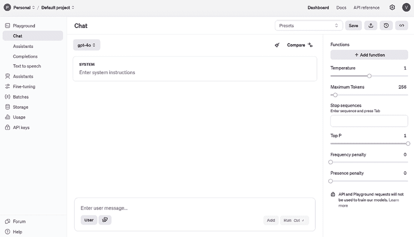
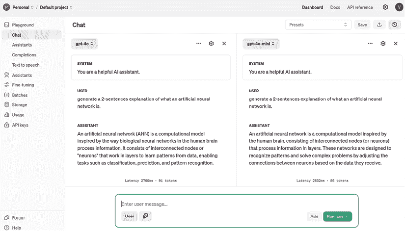
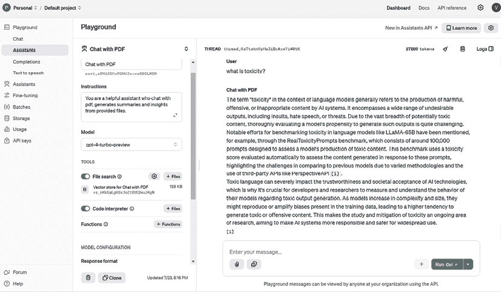
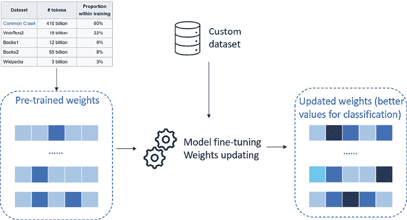

# 附录

在本书的主要章节中，我们通过 ChatGPT 的视角探讨了 OpenAI 模型的力量，深入其对话界面，并理解它如何改变我们与 AI 互动的方式。然而，OpenAI 的世界远不止 ChatGPT 熟悉的基于聊天的体验。为了充分利用这些模型的能力，了解 OpenAI 提供的更广泛工具和界面至关重要。

本附录致力于探索这样一个工具：**OpenAI 游乐场**。游乐场提供了一个灵活的环境，可以实验 OpenAI 的模型，赋予用户对参数、输出和行为更多的控制。无论你想要微调响应、测试不同的用例，还是简单地深入了解模型的能力，游乐场都是一个无价资源。

在本附录中，我们将：

+   漫步于游乐场界面及其关键特性。

+   展示如何直接从游乐场与 OpenAI 模型交互。

+   提供使用游乐场时最大化结果的技巧和最佳实践。

到本附录结束时，你将拥有使用 OpenAI 的游乐场及其模型的知识和信心，超越 ChatGPT。

# 在游乐场尝试 OpenAI 模型

要访问 OpenAI 游乐场，你需要创建一个 OpenAI 账户并导航到 [`platform.openai.com/playground`](https://platform.openai.com/playground)。这是着陆页的样貌：



图 1：OpenAI 游乐场，https://platform.openai.com/playground

如 *图 1* 所示，游乐场提供了一个用户可以开始与模型交互的 UI，你可以在聊天界面的顶部选择该模型。请注意，无论何时通过 OpenAI 游乐场消费模型，你都将根据交互量支付费用。你可以在 https://openai.com/api/pricing/ 找到定价页面。

在深入探讨游乐场的主要部分之前，让我们首先定义一下你将在本章中看到的术语：

+   **标记**：标记可以被认为是 API 用于处理输入提示的词片段或段。与完整单词不同，标记可能包含尾随空格甚至单词片段。一般来说，一个英文标记大约相当于四个字符，或三分之四个单词（你可以参考以下链接，了解在 OpenAI 模型背景下将单词转换为标记：https://platform.openai.com/tokenizer）。

+   **提示**：在自然语言处理（NLP）和生成式 AI 的背景下，提示是指作为输入提供给 AI 语言模型以生成响应或输出的文本片段。提示可以是问题、陈述或句子，它用于为语言模型提供上下文和方向。

+   **上下文**: 在 GPT 领域，上下文指的是用户提示之前出现的单词和句子。语言模型使用这些上下文，根据训练数据中发现的模式和关系，生成最可能的下一个单词或短语。

+   **模型置信度**: 模型置信度是指 AI 模型对特定预测或输出的确定性或概率水平。在 NLP 的上下文中，模型置信度通常用于表示 AI 模型对其生成的响应对给定输入提示的正确性或相关性的信心程度。

+   **工具**: 使用工具，我们为模型提供额外的技能，使其能够调用以完成用户的任务。函数将始终包含自然语言描述，以便模型知道何时调用它。

在 Playground 中，有四个主要部分可以与模型交互。让我们在下一节中探讨它们。

## 聊天

在这里，您可以测试今天可用的所有聊天模型，包括仅文本模型（如 GPT-3.5）和多模态模型（如 GPT-4o）。您可以提供系统消息——您提供给模型的指令集——全部使用自然语言。

**定义**

在 LLM 的上下文中，系统消息是在对话开始时提供的指令，用于确定模型的角色、行为和响应指南。此消息设定了总体上下文，指导模型与特定目标或约束保持一致。例如，系统消息可能指定模型应充当友好的旅行顾问或保持正式的语气。此配置可以在 AI 开发者层面设置，这样最终用户将无法访问它，因此无法“强迫”模型以不同的方式行为。

您还可以比较给定相同问题的两个不同模型的输出。以下是如何做到这一点的示例：



图 2：两个模型之间比较的示例

对于每个模型，您还可以调整一些您可以配置的参数。以下是一个列表：

+   **温度**（范围从 0 到 2）：这控制着模型响应的随机性。低温度使模型更确定，意味着它倾向于对相同的问题给出相同的输出。例如，如果我将温度设置为 0 多次询问我的模型“什么是 OpenAI？”的话，它大多数时候会给出相同的答案。另一方面，如果我用大于 0 的温度做同样的事情，它将尝试每次修改其答案，从措辞和风格上。

+   **最大标记数**: 这控制着模型对用户提示的响应长度（以标记数计）。

+   **停止序列**（用户输入）：这使响应在期望的点结束，例如句子的结尾或列表的结尾。

+   **最高概率**（范围从 0 到 1）：这控制了模型在生成响应时将考虑哪些标记。这意味着模型将从累积概率总和达到分布 90%的最小标记集中进行选择。

+   **频率惩罚**（范围从 0 到 1）：这控制了在生成的响应中相同标记的重复。惩罚越高，同一响应中看到相同标记超过一次的概率越低。惩罚会根据标记到目前为止在文本中出现的频率成比例地减少（这是与以下参数的关键区别）。

+   **存在惩罚**（范围从 0 到 2）：这与前面的参数类似，但更严格。它减少了重复任何到目前为止已出现在文本中的标记的概率。由于比频率惩罚更严格，存在惩罚也增加了在响应中引入新主题的可能性。

## 助手

**OpenAI 助手**可以被视为一种更快、更简单地开发 AI 代理的方法。事实上，助手可以被定义为由 LLM 驱动的实体，具有要遵循的指令和要使用的工具或插件集。

在 OpenAI 助手的例子中，它们附带三个预构建的工具：

+   **文件搜索**：这允许用户上传自定义文档，以便助手可以导航这些文档以完成用户的查询。它使用基于 RAG 的框架。

+   **函数调用**：这允许用户定义一组自定义函数，助手可以调用这些函数来完成特定任务。

+   **代码解释器**：这指的是助手运行代码的能力，无论是针对提供的文档（例如，在需要数学计算的电子表格或分析论文的情况下）还是简单地解决用户提供的复杂任务（例如，复杂的数学问题）。

在下面的截图中，您可以看到一个名为**Chat with PDF**的助手示例，该助手专门用于响应提供的文档（在我的情况下，我上传了 Hugo Touvron 等人撰写的论文《LLaMA：开放和高效的基座语言模型》）。



图 3：OpenAI 助手的示例

如前一个截图所示，助手能够回答我的问题，从提供的文档中检索知识。事实上，我的问题相当模糊，因为“毒性”一词可以指多个领域；尽管如此，助手知道要监督提供的文档作为主要信息来源。

## 完成项

本节涉及一类称为**基础模型**的模型，如 GPT-3。它们是所谓“助手模型”（或聊天模型，如我们之前所看到的）的基础。例如，聊天模型 GPT-3.5 Turbo（ChatGPT 背后的模型）是基础模型 GPT-3 的微调版本。

**定义**

完成任务（基础）模型旨在对提示生成单个响应，这使得它们适合文本生成和摘要等任务，而不需要在多次交互中保持上下文。另一方面，聊天（助手）模型针对交互式对话进行了优化，能够在多个回合中保持上下文，非常适合聊天机器人虚拟助手等应用。

下面你可以看到一个典型的 Playground 中的完成任务示例：


图 4：OpenAI Playground 中完成任务的示例

如您所见，使用我的话“今天我去了杂货店和”模型用最可能出现的词完成了句子。

今天，完成任务模型很少被使用，因为它们在性能上被聊天模型超越，但它们可以被进一步微调以适应特定的用例（我们将在本节后面讨论微调）。

## 文本到语音

除了*Whisper*这个语音转文本模型之外，OpenAI 还发布了一个**文本到语音**（**TTS**）模型，可以直接在 Playground 中测试。

让我们来看一个示例：


图 5：在 Playground 中使用 OpenAI 的 TTS 模型的示例

如上图所示，您可以选择声音、模型、速度和音频格式。

所有的先前模型都是预先构建的，从意义上讲，它们已经在庞大的知识库上进行了预训练。

然而，有一些方法可以使您的模型更加定制化，更适合您的用例。

## 自定义您的模型

为您的用例定制模型的第一个方法是嵌入在模型设计的方式中，这涉及到在少量样本学习方法中为您的模型提供上下文。

例如，您可以要求模型生成一篇文章，其模板和词汇库回忆起您已经写过的另一篇文章。为此，您可以提供模型生成文章的查询，以及前述文章作为参考或上下文，这样模型就能更好地准备您的请求。

这里有一个示例：


图 6：使用少量样本学习方法的 OpenAI Playground 内对话示例

在上一个示例中，我指示模型只输出推文的情感标签，并提供了三个如何做到这一点的示例。

自定义您模型的第二种方法是更复杂一些的，被称为**微调**。微调是将预训练模型适应新任务的过程。

在微调过程中，预训练模型的参数被调整，要么通过调整现有参数，要么通过添加新参数，以更好地适应新任务的数据。这是通过在一个针对新任务的小型标记数据集上训练模型来实现的。微调背后的关键思想是利用从预训练模型中学到的知识，并将其微调到新任务，而不是从头开始训练模型。看看下面的图：



图 7：模型微调

在前面的图中，你可以看到一个关于在 OpenAI 预建模型上微调工作原理的架构图。其理念是，你有一个带有通用权重或参数的预训练模型可用。然后，你用自定义数据来喂养你的模型，通常是*键值*提示和完成的表单，如下所示：

```py
{"prompt": "<prompt text>", "completion": "<ideal generated text>"}
{"prompt": "<prompt text>", "completion": "<ideal generated text>"}
{"prompt": "<prompt text>", "completion": "<ideal generated text>"} 
```

一旦训练完成，你将拥有一个针对特定任务表现特别出色的定制模型，例如，对你公司文档的分类。

微调的好处在于，你可以根据你的用例定制预建模型，而无需从头开始重新训练它们，同时利用较小的训练数据集，因此需要更少的训练时间和计算。同时，模型保留了通过原始训练学到的生成能力和准确性，这是在大量数据集上进行的。

# 摘要

OpenAI 游乐场提供了一个强大的工具，通过零样本或少量样本学习和微调技术来实验高级 AI 模型。游乐场允许用户直接与预训练模型互动，使其更容易为特定任务，如情感分析或文档分类，进行定制和增强。

对于希望构建利用 OpenAI API 的 AI 应用的开发者来说，掌握这些技术对于确定特定模型的配置是否满足特定应用的需求至关重要。

尽管这本书的重点主要在 ChatGPT 上，但在企业级场景（我们在第十章中讨论过）中，当涉及到 AI 用例时，需要更多定制的方法；这就是为什么熟悉游乐场和 OpenAI 模型 API 的概念对于拥抱这股新 AI 驱动应用开发浪潮非常有价值。

# 加入我们的 Discord 和 Reddit 社区

对这本书或想要参与关于生成 AI 和 LLMs 的讨论有疑问吗？加入我们的 Discord 服务器`packt.link/I1tSU`和 Reddit 频道`packt.link/jwAmA`，以连接、分享和与志同道合的爱好者合作。

 


[packt.com](http://packt.com)

订阅我们的在线数字图书馆，全面访问超过 7,000 本书和视频，以及领先的行业工具，帮助您规划个人发展并推进您的职业生涯。欲了解更多信息，请访问我们的网站。

# 为什么订阅？

+   使用来自 4,000 多位行业专业人士的实用电子书和视频，节省学习时间，更多时间编码

+   通过为您量身定制的技能计划来提高您的学习

+   每月免费获得一本电子书或视频

+   完全可搜索，便于轻松访问关键信息

+   复制粘贴、打印和收藏内容

在 [www.packt.com](http://www.packt.com)，您还可以阅读一系列免费技术文章，订阅各种免费通讯，并享受 Packt 书籍和电子书的独家折扣和优惠。

# 您可能还会喜欢的其他书籍

如果您喜欢这本书，您可能对 Packt 的以下其他书籍也感兴趣：


**使用 DALL-E 3 生成创意图像**

霍莉·皮卡诺

ISBN: 9781835087718

+   掌握 DALL-E 3 的架构和训练方法

+   以精确度创建精美的印刷品和其他 AI 生成的艺术作品

+   无缝地将 AI 与传统艺术融合

+   解决 AI 艺术中的伦理困境

+   探索数字创造力的未来

+   为您的艺术追求实施实用的优化技术


**使用 OpenAI API 构建 AI 应用程序**

马丁·亚内夫

ISBN: 9781835884003

+   在使用 OpenAI API 进行 NLP 任务方面打下坚实的基础

+   构建、部署并将支付集成到各种桌面和 SaaS AI 应用程序中

+   将 ChatGPT 集成到 Flask、Django 和 Microsoft Office API 等框架中

+   通过将 DALL-E API 集成到桌面应用程序中，释放您的创造力，生成令人惊叹的 AI 艺术

+   体验 Whisper API 的语音识别和文本到语音功能

+   了解如何针对您的特定用例微调 ChatGPT 模型

+   掌握 AI 嵌入技术以衡量文本字符串的相关性

# Packt 正在寻找像您这样的作者

如果您有兴趣成为 Packt 的作者，请访问 [authors.packtpub.com](http://authors.packtpub.com) 并今天申请。我们已与成千上万的开发人员和科技专业人士合作，就像您一样，帮助他们将见解分享给全球科技社区。您可以提交一般申请，申请我们正在招募作者的特定热门话题，或提交您自己的想法。

# 分享您的想法

您已完成《实用生成式 AI 与 ChatGPT 第二版》，我们非常乐意听到您的想法！如果您从亚马逊购买了本书，请[点击此处直接进入该书的亚马逊评论页面](https://packt.link/r/1836647859)并分享您的反馈或在该购买网站上留下评论。

您的评论对我们和科技社区都非常重要，并将帮助我们确保我们提供高质量的内容。
