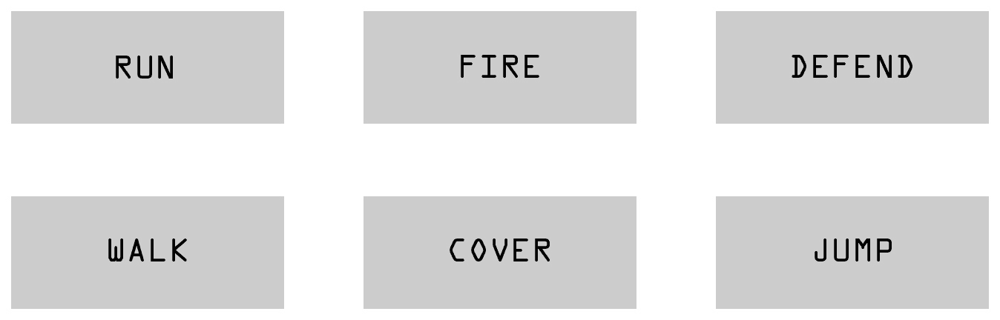
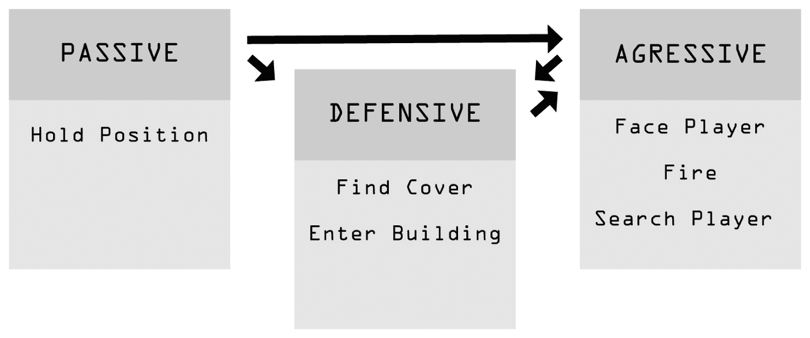
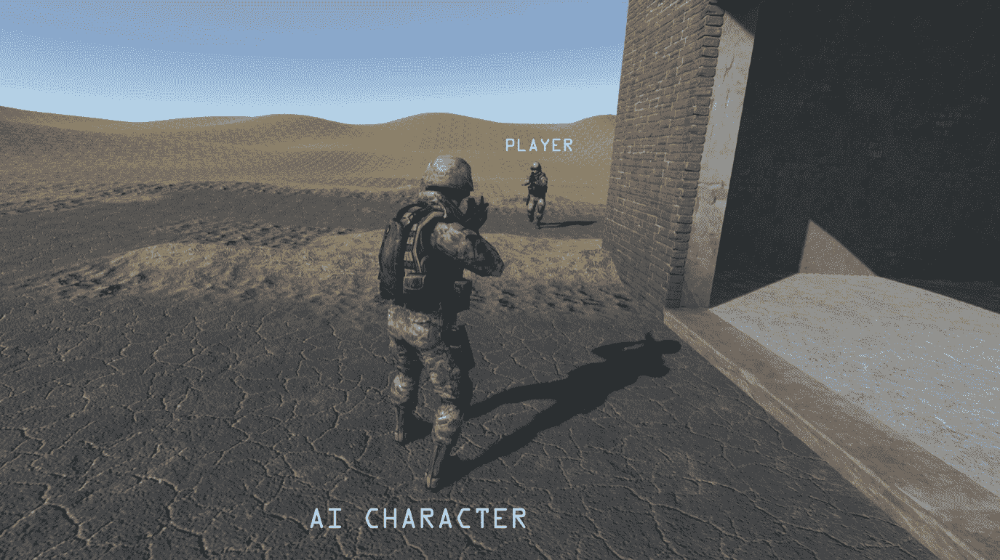

# 第二章：可能性和概率图

在本章中，我们将讨论可能性和概率图，了解它们如何以及在哪里被使用。我们还将学习创建能够对玩家做出反应并选择最佳选项的 AI 的最佳实践，因为我们致力于创建一个能够像人类一样做出决策的角色。

如我们之前所看到的，电子游戏过去一直依赖于预先确定 AI 在不同场景中的行为，这些场景要么是由游戏本身创建的，要么是由玩家的行为创建的。这种方法从第一天开始就存在，并且至今仍在使用，使其成为创建高质量 AI 角色的极其有价值的方法。在详细解释每张图的作用之前，在演示如何创建它们以开发良好的 AI 行为之前，了解可能性和概率图是什么以及它们在哪里或何时被应用，总是好的。

作为玩家，我们倾向于整体享受产品，以热情和专注的态度体验游戏的每一个部分，而忘记了游戏的技术方面。因此，我们有时会忘记，即使在玩游戏时发生的简单事情，也早已注定要以这种方式发生，并且在这背后有很多思考和规划。正如我们经常听到的，每件事都有其原因，这也适用于电子游戏。从你点击开始按钮开始游戏的那一刻起，到你所执行的最后一个令人惊叹的连招击败游戏中的最终 Boss，所有这一切都是计划好的，并且程序员需要在游戏中输入所有这些可能性。如果你点击了 A 按钮，你的角色跳了起来，那是因为它被设定成这样。对于游戏中的 AI 敌人或盟友也是如此；当它们做某事来击败或帮助你时，这种行为被编程是必要的，而为了做到这一点，我们使用状态。

# 游戏状态

要了解如何创建可能性或概率图，我们首先需要承认创建它们所需的原则性方面，这被称为游戏状态，或简称状态。我们将游戏状态称为在游戏的不同场合预先设定的动作，这些动作可以应用于玩家或敌人角色。一些例子可以是简单的行为，如跑、跳或攻击，这些状态可以进一步扩展，例如当角色在空中时无法攻击，或者当角色魔法能量低时无法进行魔法攻击。在这些情况下，角色从一个状态转换到另一个状态，或者如果它在做另一件事，就无法执行。



# 可能性图

现在，让我们更深入地看看我们在第一章的例子中遇到的那些可能性图，从棋盘游戏到《合金装备》电子游戏。正如我们所见，这是一种至今仍在使用的技巧，没有它几乎不可能创建游戏 AI。

如其名所示，可能性图允许程序员定义玩家或游戏中的 AI 角色可用的可能性。游戏内部所有可能的事情都需要被计划和编码，但当你允许角色做很多事情时，他们能同时做所有这些事情吗？如果在游戏的各个阶段进行，他们能在所有阶段都以相同的方式反应吗？为了允许和限制可能的行为，我们还需要考虑游戏中可能发生的情景，当你把这些都放在一起时，就称为可能性图。

# 如何使用可能性图

让我们看看一个常见的 FPS 游戏的简单例子，为此我们将使用前一张图片中展示的状态。

想象一下，我们是游戏中的敌人角色，我们的目标是仅使用行走、奔跑、掩护、跳跃、开火和防御这些状态来射击并杀死玩家。我们需要考虑玩家会尽力杀死我们，因此可能会出现很多可能的情景。让我们从基础开始，我们从一个点到另一个点行走，同时保护我们的空间，当玩家接近那个空间时，我们的目标从保护我们的空间转变为最终目标，即杀死玩家。接下来我们应该怎么做？开火？向玩家跑过去并近距离开火？掩护并等待玩家靠近？如果玩家先看到我们并准备向我们开火怎么办？很多事情都可能发生，而且只需要几个状态就可以做很多事情。所以，让我们绘制每一个可能的情景，并计划我们在每种具体情况中应该如何行动或反应。我会在我的游戏中选择的例子如下：

+   慢慢走到掩护位置，等待玩家，然后射击他

+   快速躲避并从那个位置开火

+   在跑向掩护位置的同时防御（远离子弹）

+   向玩家开火，向他跑过去，并持续开火

根据我们想要创建的游戏类型，我们可以使用相同的状态来将其塑造成不同的流派。我们还需要考虑我们正在编程的角色性格。如果它是一个机器人，它可能不会害怕对玩家持续开火，即使被摧毁的可能性是 99%。另一方面，如果它是一个没有经验的士兵，它可能会犹豫不决，并立即寻找掩护。仅通过改变角色的性格，就可以有无数的变化。


# 准备可能性图（FPS）

到目前为止，我们能够理解什么是可能性图以及它是如何被用来创建一个根据游戏中的不同情况做出相应行为的 AI 角色的。现在我们了解了如何使用可能性图，让我们创建一个实际例子，其中我们编写的 AI 角色成功地击败了玩家。对于这个例子，我将使用两个模型，一个代表我们正在编写的 AI 敌人，另一个代表玩家。

我们将创建一个常见例子，其中 AI 正在保护玩家需要进入以解除炸弹并完成关卡的建筑入口。让我们想象我们已经完全编写了玩家的代码，现在我们需要专注于我们的 AI 敌人，如下面的截图所示：


在编写任何代码行之前，我们需要考虑可能发生的情况以及我们的 AI 将如何对这些情况做出反应。首先，我们将通过将我们的阶段分解成一个简单的 2D 可视化来简化情况，这将作为确定距离和其他相关参数的参考。


在简化了情况之后，我们就可以开始规划可能性了。玩家被允许在建筑周围移动。请注意，这里只有一个入口，而且这个入口被我们的敌人 AI 保护。箭头表示角色面向的方向，这将是我们规划的一个重要方面。

# 创建可能性图（FPS）

我们将在稍后学习如何为 AI 角色创建意识行为，所以现在我们只是使用简单的布尔变量来确定玩家是否靠近我们的位置以及它面向哪个方向。考虑到这一点，让我们将我们的图像分解成触发区域，以定义我们的敌人 AI 何时应该做出反应。


YES 区域代表触发我们的 AI 从被动状态转变为攻击状态的区域。NO 区域代表对 AI 行为没有影响的区域。我将 YES 区域分为三个，因为我们希望我们的 AI 角色根据玩家的位置做出不同的反应。如果玩家从右侧（YES R）来，敌人有一堵可以作为掩护的墙；如果从左侧（YES L）来，我们就不能再使用那堵墙了，一旦玩家处于中间（YES M），AI 只能在建筑内向后移动。

让我们为敌人 AI 准备脚本。在这个例子中，我们将使用 C#语言，但你可以将脚本适应到你喜欢的任何编程语言，因为原则是相同的。我们现在将使用的变量是`Health`、`statePassive`、`stateAggressive`和`stateDefensive`：

```py
public class Enemy : MonoBehaviour { 
private int Health = 100; 
private bool statePassive; 
private bool stateAggressive; 
private bool stateDefensive; 
// Use this for initialisation  
void Start () {  
}  
// Update is called once per frame 
void Update () {  
}  
} 
```

现在我们已经知道了 AI 所需的基本信息，我们需要考虑这些状态将在何时使用以及 AI 将如何在这三个可用选项之间进行选择。为此，我们将使用可能性图。我们已经知道了触发我们角色的区域，并且已经选择了三个行为状态，因此现在是根据玩家的位置和行为规划转换和反应的时候。



我们的敌人 AI 可以从**被动**状态转换为**防御**状态或**攻击**状态，从**攻击**状态转换为**防御**状态，从**防御**状态转换为**攻击**状态，但一旦我们的 AI 知道玩家在附近，它将永远不会回到被动行为。

# 定义状态

让我们定义触发每个状态的条件以及 AI 在不同场景中如何选择正确的状态。被动状态将是默认状态，游戏将从这个位置开始，直到玩家遇到我们的角色。如果玩家从右侧来，并且已经与玩家交战且血量较低，将使用防御状态。最后，如果玩家从左侧来或已经到达中间区域，将激活攻击状态：

```py
public class Enemy : MonoBehaviour {
private int Health = 100;
private bool statePassive; 
private bool stateAggressive; 
private bool stateDefensive; 
private bool triggerL; 
private bool triggerR; 
private bool triggerM;
// Use this for initialisation 
void Start () { 
 statePassive = true; 
}
// Update is called once per frame 
void Update () {
 // The AI will remain passive until an interaction with the player occurs 
 if(Health == 100 && triggerL == false && triggerR == false && triggerM 
 == false) 
 { 
  statePassive = true; 
  stateAggressive = false; 
  stateDefensive = false; 
 }
 // The AI will shift to the defensive mode if player comes from the
 right side or if the AI is below 20 HP 
 if(Health<= 100 && triggerR == true || Health<= 20) 
 { 
  statePassive = false; 
  stateAggressive = false; 
  stateDefensive = true; 
 }
 // The AI will shift to the aggressive mode if player comes from the
 left side or it's on the middle and AI is above 20HP 
 if(Health> 20 && triggerL == true || Health> 20 && triggerM == true) 
 { 
  statePassive = false; 
  stateAggressive = true; 
  stateDefensive = false; 
  } 
 } 
}
```

我们添加了触发变量 `triggerL`、`trigger` 和 `triggerM`，并定义了 AI 何时应该从一个行为状态转换到另一个状态。此时，我们的敌人已经根据玩家的位置知道在游戏过程中可能出现的不同情况应该怎么做。

现在我们只需要确定每个状态会发生什么，因为这就是防御状态和攻击状态的区别。对于这个特定的敌人，他的主要功能是保护建筑入口，我们希望他始终待在原地，永远不要追击玩家。这是因为 AI 不知道只有一个人，如果有可能遇到几个敌人，它就不能冒险只追击一个士兵。这将有助于使敌人的行为更具现实感。我们还将使用防御行为状态，当敌人感觉到即将战败和死亡，或者当它利用建筑保护自己而玩家没有时。最后，当 AI 看到明显的优势可以杀死玩家或没有其他选择时，将使用攻击状态。

# 防御状态

因此，让我们从玩家从右侧来并且我们的敌人已经发现他的情况开始。我们希望我们的 AI 利用保护他的墙壁，使玩家难以接近，同时展现出类似人类的意图，而不是简单地开火。敌人将朝向墙壁移动并停留在那里，对角落进行射击，直到玩家到达那个位置。


敌人将从被动状态转变为防御状态，而不是进攻状态，仅仅是因为这样做能给他相对于玩家的略微优势。在第一次遭遇时采取防御姿态向 AI 展示了一些个性，这在使计算机角色的行为看起来可信时非常重要。在未来的章节中，我们将学习如何利用环境来深入定义我们的 AI 角色：

```py
Void Defensive () { 
if(playerPosition == "triggerR") 
{ 
// Check if player is currently  
located on the triggerR position 
transform.LookAt(playerSoldier); 
// Face the direction of the player   
if(cover == false) 
 { 
  transform.position = Vector3.MoveTowards(transform.position,  
  wallPosition.position, walk); 
 } 
if(cover == true) 
 { 
  coverFire();} 
 } 
} 
```

当玩家从右侧来临时，我们在我们的敌人 AI 中添加了想要实现的`防御`状态的核心。我们还添加了新的变量，例如`速度`、`掩护`、`playerSoldier`和`coverFire`。首先，我们需要检查玩家是否目前位于`triggerR`区域；如果结果是正面的，角色应该移动到掩护位置。一旦敌人 AI 到达掩护位置，他就可以开始向玩家开火（`coverFire`）。现在，如果玩家仍然存活，我们的敌人需要移动到另一个情况，否则它将被逼入死角，这对我们正在创建的角色来说不是一个好场景。让我们将这种情况添加到我们的脚本中。

我们希望我们的角色走回建筑物内，同时始终面向玩家并开火。我们可以使用另一种策略，或者决定更加激进并直接面对玩家，但现阶段让我们坚持简单的策略。我们可以在以后添加更复杂的行为：

```py
if (playerPosition == "triggerM") 
{  
 transform.LookAt(playerSoldier); // Face the direction of the player  
 transform.position = Vector3.MoveTowards(transform.position,  
 buildingPosition.position, walkBack);  
 backwardsFire(); } 
```


在这段代码中，我们添加了一个玩家从右侧来并且仍然存活，前往中间的情况，因此我们需要将之前的行为更改为新的行为。我们的 AI 角色从掩护位置移动到一个新的位置，这个位置在建筑物内，并且一直向玩家开火。在这个时候，敌人将继续撤退，直到两个角色中的任何一个死亡，无论是玩家还是 AI 角色。我们现在关闭玩家从右侧来的情况。现在我们已经完成了这一部分，我们需要完成场景，并添加最后一个情况，即玩家绕过建筑物并从左侧来。我们的 AI 需要适应这些情况并表现出不同的行为，所以让我们着手处理这部分并完成示例。

# 进攻状态

在我们开始编程之前，我们定义了我们需要为这个敌人 AI 多少个状态，我们选择了三个不同的状态：被动、防御和进攻。现在我们已经有了两个行为状态（被动和防御）就位，我们只需要一个状态来完成我们的敌人 AI，那就是保护建筑物。

我们之前决定，如果角色无法使用墙壁作为掩护，他才会直接面对玩家，而玩家从左侧出现，敌人对其出现感到惊讶的那一刻正是如此。



再次强调，我们首先需要检查玩家是否触发了左侧区域，因为这将激活我们的敌人 AI 从被动状态变为我们期望的攻击状态。然后，我们需要定义在这种情况下他应该做什么。让我们开始在脚本中编写它：

```py
Void Aggressive () {   
if(playerPosition == "triggerL" || playerPosition == "triggerM")  
{  
 transform.LookAt(playerSoldier); // Face the direction of the player  
 frontFire();  
}   
else {   
 transform.position = Vector3.MoveTowards(transform.position,
 triggerLPosition.position, walk);  
}   
}  
```

这次我们添加了两种可能的情况，当攻击从左侧来的玩家时；第一种情况是如果玩家从左侧来并继续向敌人前进，或者保持在同一位置。第二种可能发生的情况是如果玩家一看到敌人就立即撤退，在这种情况下，我们选择让敌人寻找玩家，朝向`triggerL`位置前进，这是玩家最初出现的位置。

这是完成后的脚本，使用了我们在本章中一直在工作的可能性图示例。让我们看一下完整的脚本：

```py
Private int Health = 100;  
Private bool statePassive;  
Private bool stateAggressive;  
Private bool stateDefensive;   
Private bool triggerL;  
Private bool triggerR;  
Private bool triggerM;   
public Transform wallPosition;  
public Transform buildingPosition;  
public Transform triggerLPosition; 
private bool cover;  
private float speed;  
private float speedBack;  
private float walk;  
private float walkBack; 
public Transform playerSoldier;  
staticstring playerPosition; 
```

在之前的代码块中，我们可以看到到目前为止在我们的脚本中已经使用过的所有变量。脚本的其他部分如下：

```py
// Use this for initialization 
Void Start () {        
statePassive = true;  
}  
// Update is called once per frame  
Void Update () {   
// The AI will remain passive until an interaction with the player occurs 
if(Health == 100 && triggerL == false && triggerR == false && triggerM == false) 
{  
 statePassive = true;  
 stateAggressive = false;  
 stateDefensive = false;  
}   
// The AI will shift to the defensive mode if player comes from the right side or if the AI is below 20 HP  
if(Health<= 100 && triggerR == true || Health<= 20){  
 statePassive = false;  
 stateAggressive = false;  
 stateDefensive = true;  
}   
// The AI will shift to the aggressive mode if player comes from the left side or it's on the middle and AI is above 20HP  
if(Health> 20 && triggerL == true || Health> 20 && triggerM == true){  
 statePassive = false;  
 stateAggressive = true;  
 stateDefensive = false;  
}   
walk = speed * Time.deltaTime;  
     = speedBack * Time.deltaTime;  
}   
Void Defensive () {   
     if (playerPosition == "triggerR")  
     {  
     // Check if player is currently located on the triggerR position  
     transform.LookAt(playerSoldier); // Face the direction of the
     player   
     if(cover == false)  
      {  
        transform.position = Vector3.MoveTowards(transform.position,  
        wallPosition.position, walk);         
       }   
     if(cover == true)  
     {  
      coverFire();  
     }  
     }   
    if(playerPosition == "triggerM") 
     {  
      transform.LookAt(playerSoldier); // Face the direction of the
      player  
      transform.position = Vector3.MoveTowards(transform.position,
      buildingPosition.position, walkBack);  
      backwardsFire();  
     }  
    }   
Void Aggressive () {   
if (playerPosition == "triggerL" || playerPosition == "triggerM")
 {  
  transform.LookAt(playerSoldier); // Face the direction of the player  
  frontFire();  
 }   
else {   
  transform.position = Vector3.MoveTowards(transform.position, 
  triggerLPosition.position, walk);  
 }   
}    
Void coverFire () {  
// Here we can write the necessary code that makes the enemy firing while in cover position.}   
Void backwardsFire () { 
// Here we can write the necessary code that makes the enemy firing while going back.}   
voidfrontFire() { 
}   
```

# 可能性图结论

我们终于完成了第一个可能性图示例。本章中分享的原则可以应用于广泛的游戏类型。事实上，几乎你计划在未来创建的任何游戏都可以从可能性图中获得很大的好处。正如我们所见，这项技术用于规划玩家可能创建的每一种情况，以及角色 AI 应该如何根据这些情况行动。通过精心规划，我们可以避免游戏中的许多问题，以及角色 AI 行为缺乏多样性。另一个值得注意的有趣点是，尝试为游戏中的不同角色创建不同的可能性图，因为并非所有人类都会以相同的方式反应。计算机 AI 应该遵循同样的规则。

# 概率图

概率图是可能性图的一个更复杂和详细的版本，因为它依赖于概率来改变角色的行为，而不是简单的开或关触发。它与可能性图的相似之处在于，它也用于提前规划我们角色的可能状态。然而，这一次，我们添加了一个百分比，AI 将根据这个百分比计算他将使用的行为。想象一下下一个例子，使用我们之前为可能性图创建的情况，我们的敌人 AI 在白天可能比在夜晚更具攻击性。为此，我们创建了一个说明，告诉我们的敌人如果现在是夜晚，看到玩家角色的机会较小，因此它将选择更防御性的策略而不是攻击性的策略。或者，简单地说，我们可以定义敌人根据两个角色之间的距离来计算杀死玩家的概率。如果玩家靠近敌人，AI 返回并生存的概率将小于如果他继续对玩家开火的情况，因此我们可以将这个方程添加到 AI 中。

让我们来看看人类行为，我们的选择；通常，我们会通过考虑过去的事件和我们之前所做的事情来做出决定。当我们感到饥饿并决定外出吃饭时，我们的朋友能猜到我们选择了哪家餐厅吗？我们的朋友可能会计算我们选择的概率，并通过考虑更高的百分比来给出他们的答案。这正是我们需要对我们的人工智能朋友所做的事情；我们需要为他选择分配一些概率，例如，AI 角色在白天和夜间保护建筑时入睡的概率是多少？如果敌人的生命值低，他逃跑的概率是多少？如果我们将概率应用于我们的 AI 角色，这有助于创建人类具有的不可预测行为，使游戏更加吸引人和自然。

# 如何使用概率地图

在这个例子中，我们将继续使用我们之前创建的相同场景，其中我们的 AI 守卫正在保护一个包含玩家需要关闭的原子弹的建筑。建筑唯一的入口被我们的 AI 角色所保护。

让我们想象一下，我们是守卫，并且我们接到命令要连续 16 小时待在那里，我们可能需要吃东西、喝水，并且稍微活动一下，以便能够保持活跃并保持警惕。因此，我们将这一点添加到我们的角色中，使玩家更加不可预测。如果 AI 决定吃东西或喝水，他将在建筑内，如果他决定稍微走动一下，他将在`triggerL`到`triggerR`位置巡逻。大多数时候，他只是站在他的守卫位置上。


这是一个概率地图，在这里我们定义了我们的角色存在于每个状态中的百分比。这意味着每次玩家看到敌人 AI 时，敌人可能正在做这些事情中的任何一件。当考虑到玩家决定出现的具体时间时，这会有很大的不同。如果玩家在早上到达，有**0.87**的概率在建筑前发现敌人处于守卫位置，有**0.10**的概率在建筑内发现他正在进食或饮水，最后有**0.03**的概率发现他正在从一个点到另一个点散步。如果玩家在下午到达，有**0.48**的概率在建筑前发现敌人处于守卫位置，有**0.32**的概率在建筑内发现他正在进食或饮水，最后有**0.2**的概率发现他正在从一个点到另一个点闲逛。在夜间，玩家有**0.35**的概率在守卫位置发现敌人，有**0.40**的概率在建筑内发现他正在进食或饮水，有**0.25**的概率发现敌人正在闲逛。


这将帮助我们的角色具有不可预测性，不会让他在每次玩关卡时都处于相同的位置。我们还可以大约每五分钟更新这个概率，以防玩家保持静止，等待我们的敌人改变位置。这种技术在很多游戏中都有使用，尤其是在潜行游戏中，观察是关键。这是因为玩家有机会待在一个安全的位置，观察敌人的行为，类似于他抢电影，演员在进入银行之前等待守卫换班。正因为这种我们在电影中习惯看到的行为，玩家喜欢在游戏中感受到同样的感觉，因此概率图改变了我们玩游戏的方式。

以下是如何在脚本中使用概率的一个例子。为此，我使用了 `Passive` 状态，并添加了我们之前决定使用的概率：

```py
Void Passive () {   
rndNumber = Random.Range(0,100);  
If(morningTime == true &&  13) 
{  
// We have 87% of chance  
goGuard(); 
}   
if(morningTime == true && rndNumber =< 13 && rndNumber< 3) 
{ 
// We have 10% of chance  
goDrink();  
}   
if(morningTime == true && rndNumber<= 3) 
{ 
// We have 3% of chance  
goWalk();  
}   
if(afternoonTime == true && rndNumber> 52) 
{ 
// We have 48% of chance  
goGuard();  
}   
if(afternoonTime == true && rndNumber =< 34 && rndNumber< 2) 
{  
// We have 32% of chance
goDrink();  
}   
if(afternoonTime == true && rndNumber<= 2) 
{  
// We have 2% of chance  
goWalk();  
}   
if(nightTime == true && rndNumber> 65) 
{  
// We have 35% of chance  
goGuard();  
}   
if(nightTime == true && rndNumber =< 65 && rndNumber< 25) 
{  
// We have 40% of chance  
goDrink();  
}   
if(nightTime == true && rndNumber<= 25) 
{  
// We have 25% of chance        
goWalk();  
}  
}  
```

要计算百分比，我们首先需要从 `0` 到 `100` 创建一个随机数，然后我们创建一个将使用该数字来检查它属于哪个陈述的语句。例如，在第一个陈述中，我们有 `87%` 的机会让 AI 保持在守卫位置，所以如果随机数高于 `13`，它就属于这个类别，角色将被设定为保持在守卫位置。一个高于 `3` 且等于或小于 `13` 的数字，给我们 `10%` 的机会，而一个等于或小于 `3` 的数字给我们 `3%` 的机会。

# 接下来该去哪里

现在我们已经了解了如何使用概率和可能性图，一个可能我们自己也会问的问题就是，我们能用这个做什么呢？嗯，我们看到了使用可能性图来定义角色的行为是多么重要，以及概率是如何帮助使这些行为不可预测的，但我们可以根据我们正在创建的游戏类型或我们想要的 AI 类型做更多的事情。记住，缺陷是我们作为人类的一部分，我们周围充满了概率，即使只是 `0`，*000001%* 的意外发生的概率存在，这就是为什么没有人是完美的，所以当创建 AI 角色时，给他们一些人类行为发生的概率，或者简单地做出好或坏的决策，这将为你在创建的电脑角色中构建一个个性，这是一个有趣的事实。

另一个我们可以用概率图做的特别之处，就是给 AI 提供自我学习的机会，每次玩家决定玩游戏时，都会让 AI 变得更聪明。玩家和敌方 AI 都会学习，挑战会根据玩家在游戏上花费的时间不断更新。如果玩家倾向于使用同一武器或从同一方向来，计算机应该更新那条信息，并在未来的事件中使用它。如果玩家与计算机对抗了*100*次，其中有*60%*的时间使用了手榴弹，AI 应该记住这一点，并根据那个概率做出反应。这将促使玩家思考其他策略，并且不会那么明显地探索击败敌人的其他方法。

# 摘要

本章介绍了可能性与概率图，我们学习了如何让 AI 根据玩家的行为自行做出决策。可能性和概率图是 AI 角色的基础，现在我们可以探索这项技术，为我们的游戏创造新的和独特的人工智能。在下一章中，我们将学习 AI 应该如何根据它在那一刻的不同选项来表现，而不是使用可能性图。我们希望角色能够分析情况，思考要做什么，同时考虑许多因素，如健康、距离、武器、子弹以及其他相关因素。
