# 第五章：动画行为

当我们想到人工智能时，通常我们会想象智能机器人，能够完美执行大量动作的机械物体，对于视频游戏人工智能也是如此。我们倾向于认为对手或盟友会行动、反应、思考或做出许多智能决策，这是正确的，但通常还有一个更重要的方面被忽略了，那就是动画。为了创建可信和逼真的 AI 角色，动画是最重要的方面之一。动画定义了视觉交互，即角色做某事时的样子。为了让角色看起来可信，动画和功能机制一样重要。在本章中，我们将探讨一些有用的技术和解决方案，用于使用、重用和创建与角色行为无缝匹配的动画。我们创建和使用动画的方式对玩家和 AI 角色都是一样的，但我们将重点关注如何将动画与我们已经学习过的技术相结合来创建 AI。

# 2D 动画与 3D 动画

视频游戏动画可以分为两种类型，2D 动画和 3D 动画。两者都有独特的特点，我们在开发游戏时需要考虑这一点，并利用它们的优势。让我们来看看这两种类型之间的一些主要区别。

# 2D 动画 - 图像精灵

一旦控制台和计算机允许开发者将动画集成到他们制作的视频游戏中，游戏变得更加丰富，依赖于美观的视觉效果来表现角色的动作。这也为创造新的游戏类型或更新旧的游戏类型打开了大门，使它们更具吸引力，从那时起，几乎每款游戏都开始实施动画。

在视频游戏中使用的 2D 动画过程与迪士尼过去用来制作电影的过程相似。他们会绘制和上色电影的每一帧，每秒大约有 12 帧。当时游戏不能使用现实生活中的绘画，但它们可以使用坐标来绘制游戏的每一部分，使其看起来像人或动物。其余的过程大致相同。他们需要这样做，以便创建动画的每一帧，但由于这是一个艰难且漫长的过程，他们有更少的细节和复杂性。现在他们有了所有必要的帧来动画化一个角色，这就需要编程机器以特定的顺序读取这些帧，只使用属于角色正在执行的动作的帧。


在前一个图中，我们可以看到一个 8 位时代的例子，展示了名为马里奥的*超级马里奥兄弟*角色的每一个动画。正如我们所见，有跑步动画、跳跃、游泳、死亡、停止和蹲下，其中一些只是单个帧。平滑过渡并没有立即出现，动画被结合到游戏玩法中。因此，如果我们想在游戏中包含更多动画，就需要创建更多帧。动画的复杂性也是如此；如果我们想让动画包含更多细节，就需要创建更多帧和过渡帧。这使得创建动画的过程非常漫长，但随着硬件能力的进化，这个过程开始变得实施起来所需的时间更少，而且结果也变得闻名。

2D 动画在视频游戏中的能力的一个例子是 1989 年发布的*波斯王子*（以下精灵表显示了*波斯王子*中角色的动画）。通过使用现实世界中人物进行游戏动作的参考，质量、细节和平滑过渡都令人惊叹，甚至为下一代游戏提高了标准。因此，在这个时候，游戏开发者开始担心过渡、平滑动画以及如何在不增加精灵表中的帧的情况下创建大量动作：

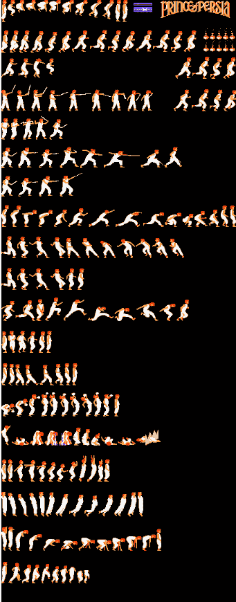

今天，我们仍然在 2D 游戏中使用相同的过程，我们有一个包含所有我们想要的动画的精灵表，然后我们编码在角色执行动作的同时使它们动画化。与使用骨骼结构的 3D 动画相比，使用精灵表的工作并不那么灵活，但有一些有用的技巧我们可以使用来创建平滑过渡，并将代码动画与游戏玩法代码分开。

# 3D 动画 - 骨骼结构

使用 3D 模型和 3D 动画来创建游戏是目前一个非常流行的选择，其中一个主要原因是与创建它们所需的时间有关。我们只需要创建一次 3D 模型，然后我们可以实现一个骨骼结构来按我们的意愿动画化它。我们还可以使用相同的骨骼结构，将其皮肤应用到另一个 3D 模型上，它将获得与之前相同的动画。使用 3D 动画对于大型项目来说显然很方便，可以节省数小时的工作，并允许我们更新角色而无需重新创建它。这是由于角色的骨骼结构，它帮助我们提高动画质量，节省时间和资源。正因为如此，我们可以决定只动画化一个特定的区域，而让身体的其余部分完全静止或执行其他动画。从一种动画平滑过渡到另一种动画，或者同时播放两个动画非常有用：

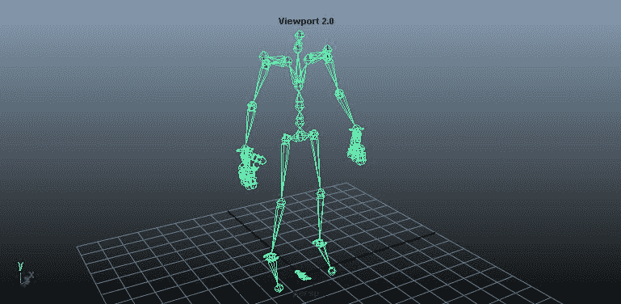

# 主要区别

图精灵与骨骼结构是两种动画类型之间的两个主要区别，这将改变我们将动画与游戏玩法集成的整合方式。使用图精灵，我们坚持使用我们拥有的图像数量，并且在代码中无法改变它们的外观，而使用骨骼结构，我们可以定义我们想要动画化的角色的哪一部分，并且我们可以使用物理来根据情况塑造动画。

最近，有一些新选项允许我们在 2D 模型中实现类似于骨骼结构的类似技术，但与我们在 3D 中能做的相比，这仍然是一个非常有限的选项。

# 动画状态机

我们已经讨论了行为状态，其中我们定义了角色的可能动作以及如何将它们链接起来。动画状态机是一个非常类似的过程，但我们不是定义动作，而是定义角色的动画。在开发角色和创建行为状态时，我们可以在动作代码中分配动画，定义角色何时开始奔跑，一旦发生，行走动画停止，奔跑动画开始播放。这种将动画与游戏玩法代码集成的做法看起来是一个更容易的方法来做这件事，但这并不是最好的方法，如果我们想要更新代码，它会变得复杂。

解决这个问题的方法是创建一个专门用于动画的独立状态机。这将使我们能够更好地控制动画，而不用担心更改我们的角色代码。这对于程序员和动画师之间的交互也是一个好方法，因为动画师可以在动画状态机中添加更多动画，而不会干扰代码：

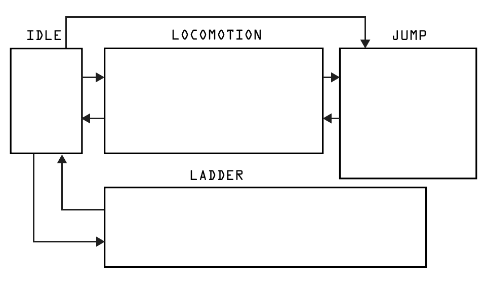

在前面的图中，我们可以看到一个行为状态机的简单示例，其中角色可以静止、移动、跳跃和使用梯子。一旦这部分完成，我们就可以开始设计和实现一个动画状态机，使其根据行为状态机的原则工作：

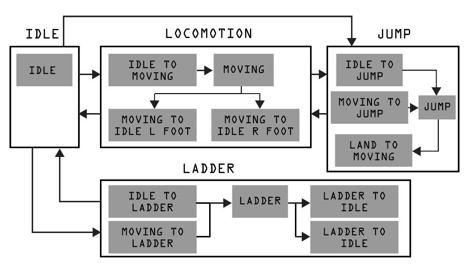

如我们所见，动画状态比行为状态要多，这就是为什么将动画集成到我们的角色中最好的方法是分离游戏玩法和动画。在开发我们的游戏时，我们使用语句和值，所以行走和奔跑之间的唯一区别是定义角色移动速度的数字。这就是为什么我们需要使用动画状态将此信息转换为视觉输出，其中角色根据游戏玩法状态进行动画。使用这种方法并不意味着我们不能使用动画来干扰游戏玩法，因为我们也可以通过简单地向我们的游戏玩法代码报告信息并更改游戏玩法来实现这一点。

这可以用于 2D 和 3D 动画。过程完全相同，并且可以与最流行的游戏引擎一起使用，例如 CryENGINE、Unity 和 Unreal Development Kit。为了使其工作，我们需要将所有动画导入到我们的游戏中，然后我们将动画分配到动画状态部分：

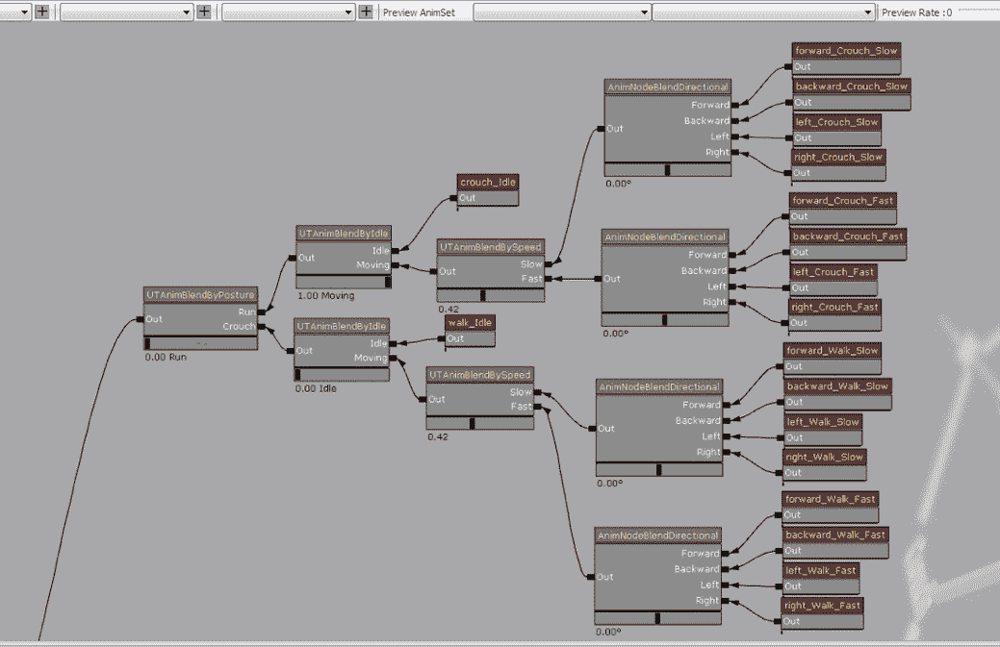

现在，我们已经将动画导入到动画状态部分，我们需要根据我们在代码中使用的值来配置动画播放的时间。我们可以使用的值或语句是整数、浮点数、布尔值和触发器。有了这些，我们可以定义每个动画何时播放。在链接动画时，我们将使用这些值来确定何时从一个动画状态切换到另一个状态：

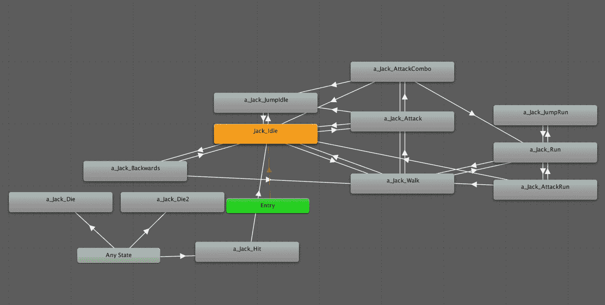

这是我们定义行走和奔跑之间差异的地方。如果我们的角色移动速度达到某个值，它将开始播放奔跑动画，一旦该值降低，它将再次播放行走动画。

我们可以拥有我们想要的任意数量的动画状态，无论游戏状态如何。让我们看看运动学示例。我们可以定义，如果角色移动非常缓慢，它会像潜行一样进行动画；稍微快一点，它就开始行走；更快的话，角色开始奔跑；最终，如果移动速度非常高，他可以长出一对翅膀，给人一种他在飞行的印象。正如我们所见，将动画与游戏玩法分开会更方便，因为这样我们可以更改动画，删除它们，或添加新的动画，而无需修改我们的代码。

现在让我们继续到示例部分。使用我们在前几章中探索的所有主题，我们将配置我们的角色根据游戏玩法行为和环境进行动画处理。我们首先将模型和所有动画导入到我们的游戏中。然后我们创建一个新的动画状态机；在这种情况下，它被称为**animator**。之后，我们只需将那个动画状态机分配给我们的角色：


我们导入到游戏中的模型理想状态下应该是中性的姿势，例如 T 姿势（如前一张截图所示）。然后我们导入动画并将它们添加到 Animator Controller 中。

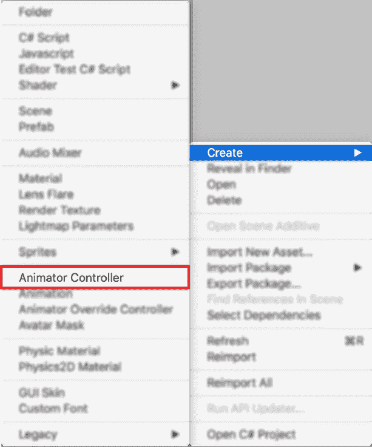

现在，如果我们点击角色并打开我们创建的动画状态机，它将是空的。这是正常的，因为我们需要手动添加我们想要使用的动画：

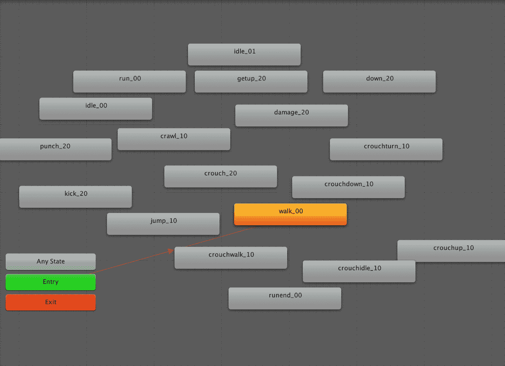

一旦我们完成这项工作，我们就需要组织好一切，以便轻松地链接动画：


因此，我们根据游戏状态（如**IDLE**、**ATTACK**、**JUMP**、**LOCOMOTION**和**DAMAGE**）将不同的动画分开，如图所示。对于**IDLE**状态，我们有两个不同的动画，对于**ATTACK**状态也有另外两个。我们希望它们以随机顺序播放，并且与游戏代码分开，这样我们就可以添加尽可能多的动画来增加多样性。在移动状态内部，我们有两组独立的动画，分别是**STRAIGHT**行走和**CROUCH**蹲下。我们选择将这两组动画都包含在移动状态中，因为它们将根据移动摇杆的位置进行动画处理。

现在，我们可以开始链接动画，在这个阶段，我们可以忘记动画是如何被激活的，而只关注播放顺序：

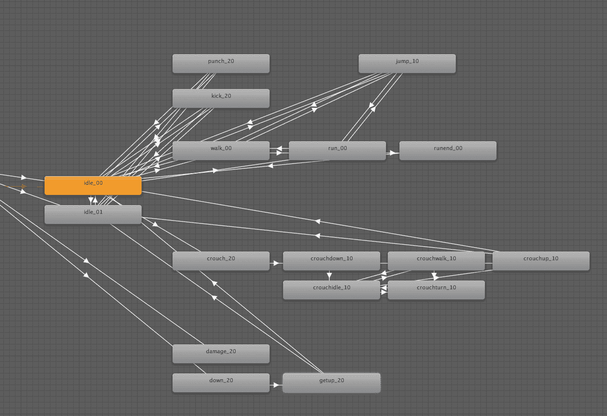

一旦我们将所有动画以所需的顺序链接起来，我们就可以开始定义它们将如何播放。在这个阶段，我们需要查看角色代码并使用变量来更改动画。在我们的代码中，我们有访问动画状态机的变量。在这种情况下，它们是`Animator`、`Health`和`Stamina`整数值，`movementSpeed`、`rotationSpeed`、`maxSpeed`、`jumpHeight`、`jumpSpeed`和`currentSpeed`浮点值，以及最后用于检查玩家是否存活的布尔变量：

```py
     public Animator characterAnimator;
     public int Health;
     public int Stamina;
     public float movementSpeed;
     public float rotationSpeed;
     public float maxSpeed;
     public float jumpHeight;
     public float jumpSpeed;

     private float currentSpeed;
     private bool Dead;

     void Start () {

     }

     void Update () {

         // USING XBOX CONTROLLER
         transform.Rotate(0,Time.deltaTime * (rotationSpeed *
         Input.GetAxis ("xboxlefth")), 0);

         if(Input.GetAxis ("xboxleft") > 0){
             transform.position += transform.forward * Time.deltaTime *
             currentSpeed;
             currentSpeed = Time.deltaTime * (Input.GetAxis
             ("xboxleft") * movementSpeed);
         }

         else{
             transform.position += transform.forward * Time.deltaTime *
             currentSpeed;
             currentSpeed = Time.deltaTime * (Input.GetAxis
             ("xboxleft") * movementSpeed/3);
         }

         if(Input.GetKeyDown("joystick button 18") && Dead == false)
         {

         }

         if(Input.GetKeyUp("joystick button 18") && Dead == false)
         {

         }

         if(Input.GetKeyDown("joystick button 16") && Dead == false)
         {

         }

         if(Input.GetKeyUp("joystick button 16") && Dead == false)
         {

         }

         if(Health <= 0){
             Dead = true;
         }
     } 
```

让我们开始将这些值传递到动画状态机中。角色的移动和`currentSpeed`值由左侧模拟摇杆控制，所以如果我们稍微推动摇杆，角色应该播放行走动画。如果我们完全推动它，它应该播放跑步动画。


在`Animator`部分，我们可以选择四个参数之一，对于角色的移动，我们选择了 Float。现在我们需要将这个值与代码中存在的`currentSpeed`变量链接起来。我们将在`Update`函数的开始处进行赋值：

```py
     public Animator characterAnimator;
     public int Health;
     public int Stamina;
     public float movementSpeed;
     public float rotationSpeed;
     public float maxSpeed;
     public float jumpHeight;
     public float jumpSpeed;

     private float currentSpeed;
     private bool Dead;

     void Start () {

     }

     void Update () {

         // Sets the movement speed of the animator, to change from 
        idle to walk and walk to run
         characterAnimator.SetFloat("currentSpeed",currentSpeed);

         // USING XBOX CONTROLLER
         transform.Rotate(0,Time.deltaTime * (rotationSpeed *
         Input.GetAxis ("xboxlefth")), 0);

         if(Input.GetAxis ("xboxleft") > 0){
             transform.position += transform.forward * Time.deltaTime *
             currentSpeed;
             currentSpeed = Time.deltaTime * (Input.GetAxis
             ("xboxleft") * movementSpeed);
         }

         else{
             transform.position += transform.forward * Time.deltaTime *
             currentSpeed;
             currentSpeed = Time.deltaTime * (Input.GetAxis
             ("xboxleft") * movementSpeed/3);
         }

         if(Input.GetKeyDown("joystick button 18") && Dead == false)
         {

         }

         if(Input.GetKeyUp("joystick button 18") && Dead == false)
         {

         }

         if(Input.GetKeyDown("joystick button 16") && Dead == false)
         {

         }

         if(Input.GetKeyUp("joystick button 16") && Dead == false)
         {

         }

         if(Health <= 0){
             Dead = true;
         }
     } 
```

我们已经连接了这两个参数。这样，动画状态机就可以使用代码中找到的`currentSpeed`的相同值。我们在`Animator`部分给它取的名字与代码中的完全一样。这不是必需的，但它使得理解它们代表什么值变得更容易。


因此，在这个阶段，我们可以开始定义连接角色移动动画的链接值。在这种情况下，我们可以点击链接，将打开一个新窗口，以便我们可以添加将动画从一个状态切换到另一个状态的值：

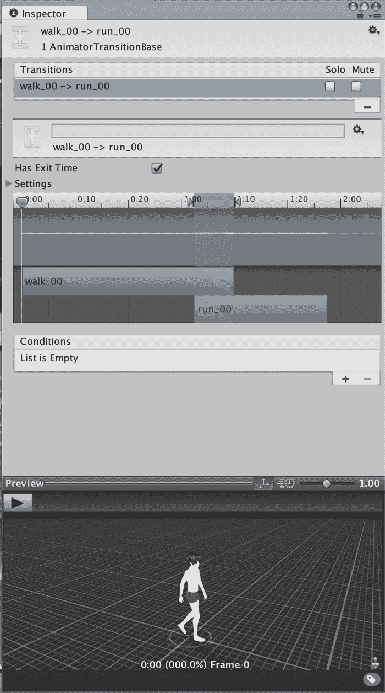

我们也可以点击我们想要配置的动画，例如闲置动画，然后会打开一个新窗口，显示与该动画连接的所有动画。我们可以选择允许播放下一个动画的链接。以下截图展示了这一过程：

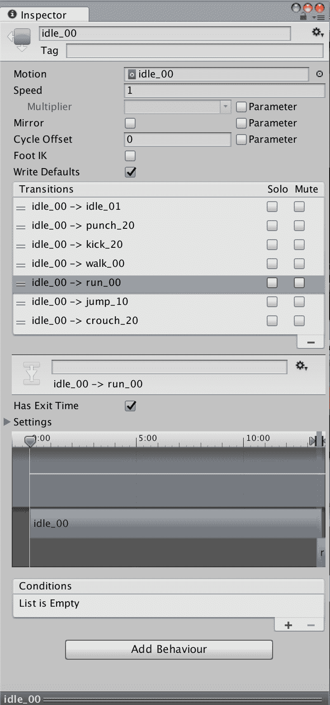

我们点击了闲置以行走，并添加了我们之前创建的条件，currentSpeed：


在这里，我们可以选择值是否需要大于或小于期望的值以开始播放下一个动画。对于这个例子，我们将值设置为大于 0.1，所以一旦角色开始移动，它就会停止闲置动画并播放行走动画。我们不需要在代码中写任何内容，因为动画状态机独立于代码工作：

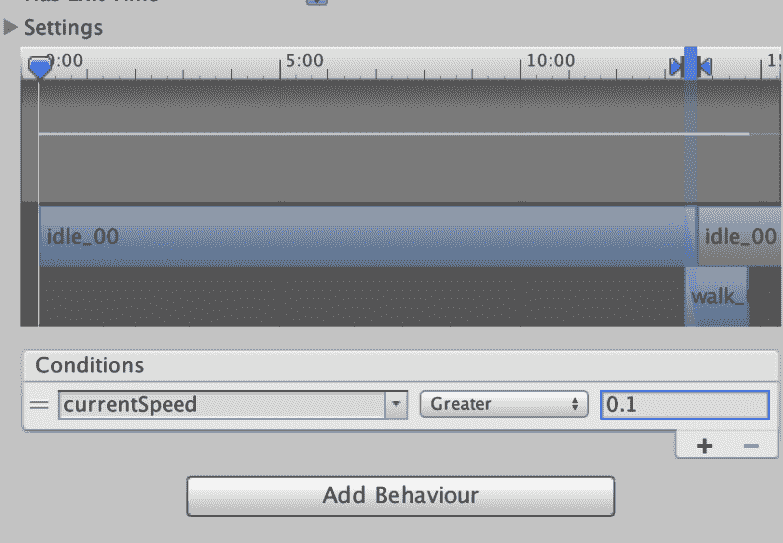

然而，因为我们还有另一个动画在行走动画之后播放，我们需要为行走动画设置一个限制值。在这种情况下，让我们假设当`currentSpeed`达到 5 时，我们的角色开始奔跑；这意味着我们的角色在 4.9 时停止行走。所以，我们在这里添加另一个条件，告诉角色一旦他的`currentSpeed`达到 4.9，他就停止行走：

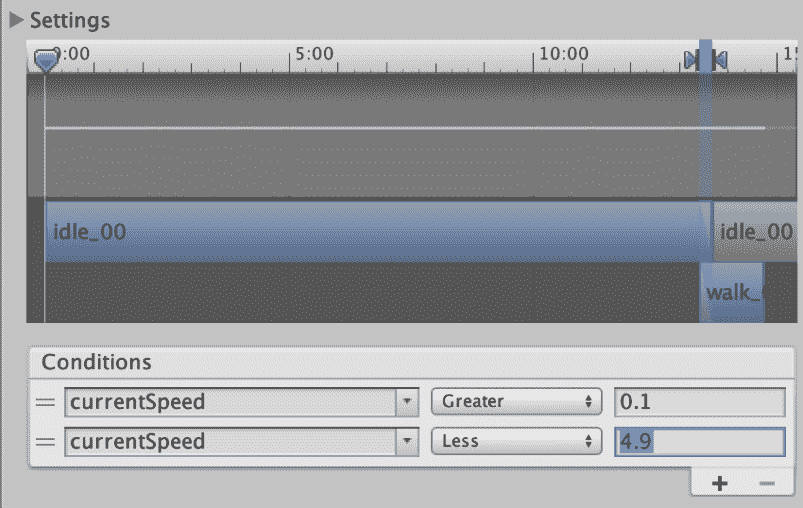

现在我们已经定义了角色何时开始行走，我们还需要做相反的操作，即定义何时停止行走并播放闲置动画。我们需要记住，这不会影响游戏玩法，这意味着如果我们从这个点开始游戏，角色将开始播放行走动画，因为我们已经设置了这一点。但即使我们没有，角色在没有动画的情况下也会在环境中移动。我们只是在代码中存储的值来连接动画状态，并需要定义在某个值时将播放哪个动画。如果我们忘记为所有动画设置该值，角色仍然会执行行为，但没有正确的动画。所以，我们还需要检查是否所有链接都分配了条件。

现在为了让角色在停止移动后回到闲置动画，我们点击从行走到闲置的链接，并添加一个新条件，表示如果当前速度小于 0.1，他就停止播放行走动画并开始播放闲置动画：

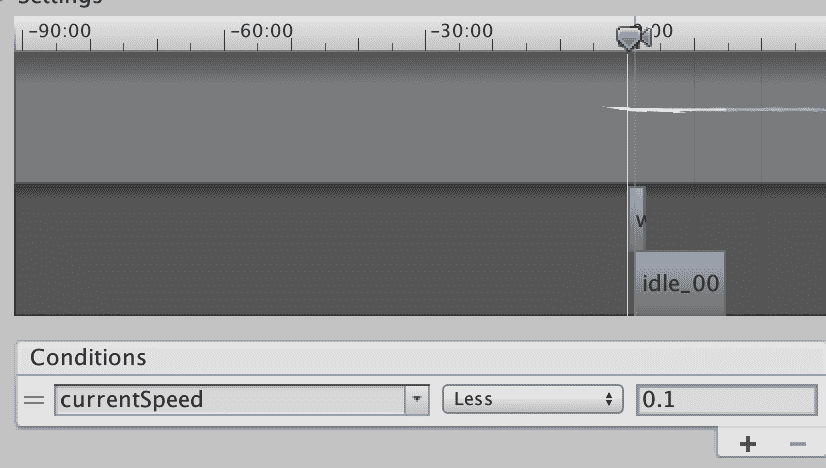

现在我们可以为使用`currentSpeed`值的其余动画完成`Locomotion`状态。一旦我们准备好了所有这些，我们就可以继续到蹲下动画。它们也使用`currentSpeed`值，但我们需要一个额外的值来使 WALK 动画无效并启用蹲下动画。有两种方法可以实现这一点：在向前移动的同时按下蹲下按钮，或者定义地图上的区域，使角色直接进入蹲下模式。对于这个例子，因为我们正在处理一个 AI 角色，我们将使用第二种选项，在地图上定义区域，使角色进入蹲下模式：


在这个例子中，让我们假设角色不应该在草地上行走，因此他试图通过蹲下来隐藏。我们也可以选择一个如果直立行走就不可能进入的小地点，因此角色会自动开始以蹲下的姿势行走。

因此，为了做到这一点，我们需要在地图上创建触发位置，根据角色当前的位置改变动画。在代码中，我们创建一个新的布尔变量，并将其命名为`steppingGrass`，在将`currentSpeed`值与动画状态机连接的行之后。我们将添加一个新行，将这个布尔值连接到我们将在动画状态机上创建的新参数。我们可以从创建新参数开始：


在我们的代码中，我们将添加碰撞检测，一旦我们的角色在草地上，就会打开这个值，一旦他离开这个区域，就会关闭它：

```py
     public Animator characterAnimator;
     public int Health;
     public int Stamina;
     public float movementSpeed;
     public float rotationSpeed;
     public float maxSpeed;
     public float jumpHeight;
     public float jumpSpeed;

     private float currentSpeed;
     private bool Dead;
     private bool steppingGrass;

     void Start () {

     }

     void Update () {

         // Sets the movement speed of the animator, to change from
         idle to walk and walk to run
         characterAnimator.SetFloat("currentSpeed",currentSpeed);

         // Sets the stepping grass Boolean to the animator value
         characterAnimator.SetBool("steppingGrass",steppingGrass);

         // USING XBOX CONTROLLER
         transform.Rotate(0,Time.deltaTime * (rotationSpeed *
         Input.GetAxis ("xboxlefth")), 0);

         if(Input.GetAxis ("xboxleft") > 0){
             transform.position += transform.forward * Time.deltaTime *
         currentSpeed;
             currentSpeed = Time.deltaTime * (Input.GetAxis
         ("xboxleft") * movementSpeed);
         }

         else{
             transform.position += transform.forward * Time.deltaTime *
             currentSpeed;
             currentSpeed = Time.deltaTime * (Input.GetAxis
             ("xboxleft") * movementSpeed/3);
         }

         if(Input.GetKeyDown("joystick button 18") && Dead == false)
         {

         }

         if(Input.GetKeyUp("joystick button 18") && Dead == false)
         {

         }

         if(Input.GetKeyDown("joystick button 16") && Dead == false)
         {

         }

         if(Input.GetKeyUp("joystick button 16") && Dead == false)
         {

         }

         if(Health <= 0){
             Dead = true;
         }
     }

     void OnTriggerEnter(Collider other) {

         if(other.gameObject.tag == "Grass")
         {   
             steppingGrass = true;
         }
     }

     void OnTriggerExit(Collider other) {

         if(other.gameObject.tag == "Grass")
         {   
             steppingGrass = false;
         }
     } 
```

现在，我们可以继续并添加这个新参数到蹲下动画。我们首先选择从 IDLE 到蹲下动画的链接，并设置`currentSpeed`值和新的`steppingGrass`参数。因为我们有一个蹲下空闲动画，即使角色没有移动，它也会播放这个动画而不是正常的 IDLE 动画：

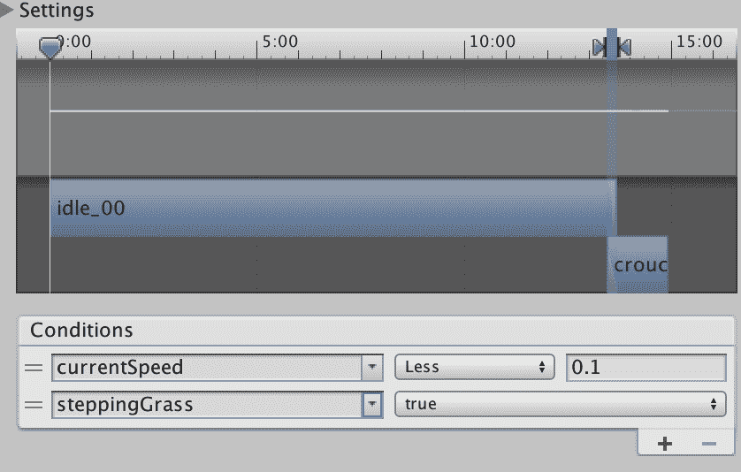

我们将`currentSpeed`设置为小于 0.1，这意味着角色没有移动，并将`steppingGrass`设置为 true，这停止了正常的 IDLE 动画并开始播放蹲下空闲动画。其余的蹲下动画遵循与 WALK 和 RUN 动画相同的原理。一旦角色开始移动，这代表`currentSpeed`值，蹲下空闲停止，蹲下行走开始。最后，我们将蹲下空闲链接到 IDLE，将蹲下行走链接到 WALK，确保如果角色离开草地，WALK 动画不会停止，角色会继续直立行走。

关于攻击，我们将使用整数在 1 到 10 之间随机生成一个数字，如果这个数字大于`5`，它将播放踢动画。如果数字小于`5`，它将播放拳动画。因此，当角色进入与对手的战斗模式时，它将播放不同的攻击。再次强调，使用这种方法允许我们在未来添加更多动画，从而增加攻击的多样性。

再次，我们创建一个新的参数，在这个例子中，我们将创建一个整数参数，并称之为`attackRandomNumber`：


在我们的代码中，我们将添加一个新的变量，并给它相同的名字（不需要用相同的名字创建它，但这确实使一切更有条理）。在之前连接变量与动画状态机参数的行之后，我们将创建一个新的变量，将其连接到`attackRandomNumber`值。然后我们创建一个函数，一旦角色进入战斗模式，就会随机生成一个数字：

```py
     public Animator characterAnimator;
     public int Health;
     public int Stamina;
     public float movementSpeed;
     public float rotationSpeed;
     public float maxSpeed;
     public float jumpHeight;
     public float jumpSpeed;

     private float currentSpeed;
     private bool Dead;
     private bool steppingGrass;
     private int attackRandomNumber;

     void Start () {

     }

     void Update () {

         // Sets the movement speed of the animator, to change from
         idle to walk and walk to run
         characterAnimator.SetFloat("currentSpeed",currentSpeed);

         // Sets the stepping grass Boolean to the animator value
         characterAnimator.SetBool("steppingGrass",steppingGrass);

         // Sets the attackrandomnumber to the animator value
         characterAnimator.SetInteger("attackRandomNumber",
            attackRandomNumber);

         // USING XBOX CONTROLLER
         transform.Rotate(0,Time.deltaTime * (rotationSpeed *
         Input.GetAxis ("xboxlefth")), 0);

         if(Input.GetAxis ("xboxleft") > 0){
             transform.position += transform.forward * Time.deltaTime *
         currentSpeed;
             currentSpeed = Time.deltaTime * (Input.GetAxis 
         ("xboxleft") * movementSpeed);
         }

         else{
             transform.position += transform.forward * Time.deltaTime *
         currentSpeed;
             currentSpeed = Time.deltaTime * (Input.GetAxis
         ("xboxleft") * movementSpeed/3);
         }

         if(Input.GetKeyDown("joystick button 18") && Dead == false)
         {
             fightMode();
         }

         if(Input.GetKeyUp("joystick button 18") && Dead == false)
         {

         }

         if(Input.GetKeyDown("joystick button 16") && Dead == false)
         {

         }

         if(Input.GetKeyUp("joystick button 16") && Dead == false)
         {

         }

         if(Health <= 0){
             Dead = true;
         }
     }

     void OnTriggerEnter(Collider other) {

         if(other.gameObject.tag == "Grass")
         {   
             steppingGrass = true;
         }
     }

     void OnTriggerExit(Collider other) {

         if(other.gameObject.tag == "Grass")
         {   
             steppingGrass = false;
         }
     }

     void fightMode ()
     {
         attackRandomNumber = (Random.Range(1, 10));
     } 
```

在完成这个步骤后，我们需要将值分配给动画。这个过程与之前的动画相同，只是这次我们使用了一个不同的值。如果`attackRandomNumber`大于 1，这意味着他在攻击，攻击动画应该开始播放。因为我们有两种不同的攻击，我们决定随机使用它们，但如果是一个玩家控制的角色，我们可以在代码内部手动分配数字，当玩家按下游戏手柄上的特定按钮时，角色就会出拳或踢腿。

# 平滑过渡

另一个值得注意的重要方面是动画之间的平滑过渡。保持动画的完整性非常重要，这样角色的每一个动作看起来都流畅，有助于玩家的虚拟沉浸感。

关于这个问题，2D 和 3D 动画有相当大的不同。如果我们使用 2D 精灵，我们需要绘制每个过渡所需的必要帧，并且每次我们想要角色从一个动画切换到另一个动画时，都会播放过渡动画。

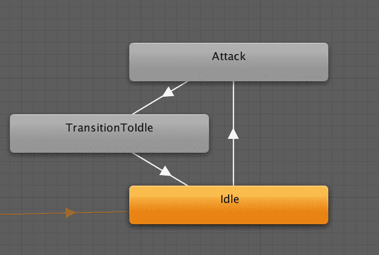

另一方面，对于 3D 角色，我们可以使用骨骼结构自动创建过渡，其中每个骨骼的坐标将从上一个动画移动到新的动画。即使我们选择使用骨骼结构来帮助创建过渡，有时可能有必要，或者这可能是更好的选择，手动创建新的动画作为过渡。如果角色在使用需要保存到下一个动画之前使用的对象或武器，这是一个常见的流程。


为了创建平滑的过渡，我们需要下一个动画的第一帧与当前动画的最后一帧相等。我们需要从当前动画的相同位置开始下一个动画。这是避免在过渡过程中注意到任何断裂的关键。然后我们可以利用游戏引擎的优势，使用过渡系统来处理动画。这将有助于创建更平滑的过渡。正如我们上图所看到的，我们可以调整过渡将持续多长时间，我们可以创建一个快速过渡或一个较长的过渡，始终尝试哪种方式对我们想要的结果看起来更好。

有时候，为了获得更好的游戏体验，我们需要牺牲更平滑的过渡。一个例子是在格斗游戏中，快速过渡比平滑过渡更重要，因此我们需要考虑角色从一个状态转换到另一个状态所需的时间。

# 摘要

本章介绍了如何使用二维或三维动画来补充角色的动作。动画在可信的 AI 角色开发中扮演着重要的角色，并且通过正确使用它们，角色可以向玩家传达一种角色是活生生的，并且能够自主反应的真实感觉。即使角色动作有限，我们也可以使用动画来模拟或隐藏其中的一些，给人一种角色这样反应是因为它在自己思考的印象。

在下一章中，我们将讨论导航行为和路径查找，即如何编程 AI 角色走向目标位置并选择最佳路线。
