# 第七章：高级路径查找

在本章中，我们将探讨可用于各种游戏的先进路径查找方法。本章的主要目标是学习如何创建一个能够分析地图并处理所有必要信息以决定最佳路径的先进 AI 元素的基础。在许多流行的游戏标题中，高级路径查找方法被用于使 AI 角色能够在实时中选择最佳路径，我们将分析一些最著名的例子以及我们如何复制相同的结果。

# 简单与高级路径查找

正如我们在上一章中发现的，路径查找被 AI 角色用来发现它们需要移动的方向以及如何正确地移动。根据我们正在开发的游戏，我们可以使用简单的路径查找系统或复杂的路径查找系统。两者都可以非常有用。在某些情况下，简单的路径查找系统足以完成我们寻找的任务，但在其他情况下，我们需要一种不同于我们之前介绍的方法的替代方案，以便实现我们 AI 角色所需的复杂性和真实性。

在讨论任何高级路径查找方法的系统之前，让我们先了解为什么我们需要使用它，以及在什么情况下需要更新我们的角色，使其更加智能和警觉。通过使用我们之前的例子，我们将探讨一个普通路径查找方法存在的局限性。了解简单路径查找系统的局限性将帮助我们认识到我们即将创建更复杂系统时所缺少的内容和面临的挑战。因此，首先学习我们如何设置一个简单的路径查找系统是一个很好的开始，然后我们可以继续研究更复杂的一个。由于游戏的发展速度与创造它们的技术的进步速度相同，我们的第一个例子将是一个较老的游戏，然后我们将看到这个游戏是如何演变的，特别是人工智能路径查找。

开放世界地图现在非常普遍，许多不同类型的游戏都使用它来创造丰富的体验，但并非总是如此。让我们以第一代**侠盗猎车手**（**GTA**）游戏为例。分析地图上行驶的汽车的模式，我们可以看到它们没有复杂的系统，驾驶员们被困在各自被分配的预定义路线或圈中。显然，在那个时代，这个 AI 路径查找系统非常先进，即使我们今天玩它，我们也不会因为 AI 角色而感到沮丧，因为它为那个游戏工作得非常好。

AI 驾驶员遵循他们的路径，每当玩家挡在他们面前时都会停下来。这表明他们每辆车前都有一个碰撞检测器，告诉他们是否有东西阻挡了路径。如果车前有东西，驾驶员会立即停车，直到路径畅通，他们才会再次驾驶。这是驾驶员拥有某种寻路系统的迹象，该系统无法解决他们无法继续以同一方向行驶的不同情况。因此，为了避免游戏中出现任何错误或漏洞，程序员选择让驾驶员在这种情况下停车。

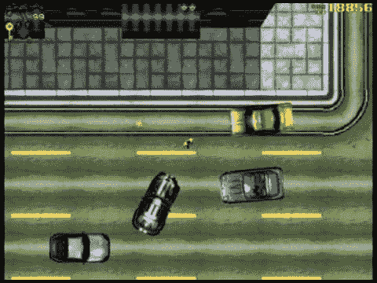

前面的案例场景，即驾驶员在无法继续前进时停车，成为他们未来游戏中最大的优势之一。在 GTA 游戏中，许多事物都发生了演变，AI 无疑是其中之一。他们已经改进了 AI 驾驶员，使他们意识到情况及其周围环境。让我们分析一下*GTA San Andreas*，这款游戏也适用于手机。在这款游戏中，如果我们把车停在 AI 驾驶员面前，结果会完全不同。根据 AI 驾驶员的性格，他们的反应会有所不同；例如，其中一些驾驶员可能会简单地按喇叭并稍作等待，如果玩家继续阻挡他们的道路，驾驶员会超过玩家。其他人可能会更加激进，下车与玩家进行身体对抗。

如果 AI 驾驶员通过听到枪声意识到环境变得危险，他们会加速并选择最快的路径逃离该情况。这种行为表明，AI 角色在结合可能性地图的情况下，拥有更复杂和精细的寻路系统，周围的环境将反映他们最终选择的路径。

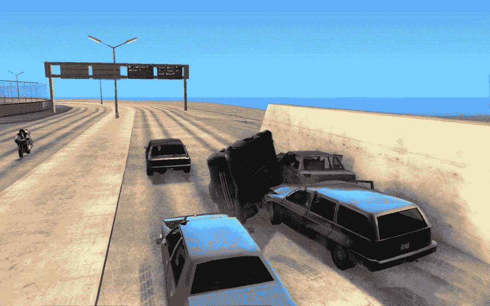

如我们所见，现在的驾驶员在游戏中的存在感比第一代游戏要明显得多。在前一章中，我们学习了如何创建一个简单的寻路系统，这与我们在第一代 GTA 游戏中分析的系统非常相似。现在，我们将深入探讨如何创建一个能够应对任何突发情况的 AI 角色。

这仍然是一些尚未完美解决的问题之一，许多开发者正在尝试新的方法来创建能够像被困在相同情况下的真人一样行为的 AI 角色。一些公司已经接近这一目标——一个很好的例子是 Rockstar Games 及其 GTA 系列，因此我们选择从他们的例子开始。

# A*搜索算法

不可预测的情况通常会导致大量时间用于编写角色可能性的广泛可能性。因此，有必要考虑一种新的方法来创建更好的寻路系统，其中角色可以自己实时分析周围环境并选择最佳路径。为此效果而变得非常流行的一种方法是使用**theta 算法**，它允许角色不断搜索最佳路径，而无需手动设置它们需要遵循的点。

Theta 搜索算法（A*）是一种广泛使用的搜索算法，可用于解决许多问题，寻路就是其中之一。使用此算法解决寻路问题非常常见，因为它结合了均匀成本搜索和启发式搜索。Theta 搜索算法检查地图的每个角落，以帮助角色确定是否可以使用该位置，同时试图达到目标地点。

# 它是如何工作的

在 theta 算法可以工作之前，游戏地图或场景需要准备或预先分析。包括地图所有资产的环境将被处理为一个图。这意味着地图将被分割成不同的点和位置，这些被称为节点。这些节点用于记录搜索的所有进度。在记住地图位置的同时，每个单独的节点都有其他属性，如适应性、目标和启发式，通常用字母 f、g 和 h 表示。适应性、目标和启发式属性的目的在于根据当前节点对路径的优劣进行排序。

节点之间的路径被分配不同的值。这些值通常表示节点之间的距离。节点之间的值不一定是距离。它也可以是时间；这有助于我们找到最快的路径而不是最短的路径，例如。Theta 算法使用两个列表，一个开放列表和一个关闭列表。开放列表包含已完全探索的节点。标记数组也可以用来确定某个状态是否在开放列表或关闭列表中。

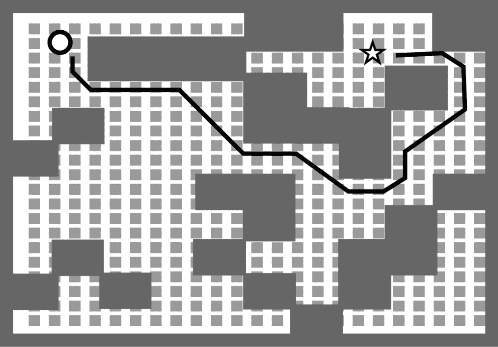

这意味着角色将不断搜索最佳节点以实现最快或最短的结果。正如我们在前面的截图中所见，地图已经预先分析过，可通行区域由小灰色方块表示，而大方块则代表被某些物体或环境资产阻挡的区域。由黑白圆圈表示的 AI 角色需要逐节点移动，直到到达星形物体。如果某个节点因某种原因被阻挡，角色将迅速切换到最近的节点，然后继续前进。

如我们所见，这种路径查找方法的原理与我们之前创建的非常相似，其中角色逐点跟随直到到达最终目的地。主要区别在于，使用 Theta 算法时，点是由 AI 自动生成的，这使得它成为开发大型或复杂场景时的最佳选择。

# 使用 A*的缺点

Theta 算法并不是一个可以在任何地方或任何游戏中使用的完美解决方案，我们应该牢记这一点。因为 AI 角色一直在寻找最佳路径，所以 CPU 的大量资源被专门用于这项任务。鉴于平板电脑和移动设备现在是流行的游戏平台，值得提到的是，为这些平台开发游戏需要特别注意 CPU 和 GPU 的使用，因此，A*路径查找在这里可能是一个缺点。

但硬件限制并不是唯一的缺点。当我们让 AI 承担所有工作而不进行任何人工控制时，bug 出现的可能性非常高。这也是为什么现代游戏更喜欢使用开放世界地图并遇到很多 bug 和奇怪的 AI 反应的原因之一，因为在庞大的游戏区域中很难缩小所有可能的结果。

"在最新的演示中，开放世界游戏中的 bug 是自然的"

最终幻想 XV 导演


最终幻想 XV 的导演对此问题进行了评论，表示在每一个开放世界游戏中都会出现 bug。这完美地总结了为什么在开发开放世界游戏时使用 theta 算法进行 AI 路径查找是一个流行且有效的方法，但它并不完美，bug 肯定会发生。

现在我们对 theta 算法及其优缺点有了基本的了解，让我们继续到实际部分。

# 直接从 A 到 B

我们将从一个非常简单的例子开始，一个点与另一个点之间没有任何障碍。这将帮助我们可视化算法如何找到最佳路径。然后我们将添加一个障碍物，并观察算法在同时绕过障碍物时如何选择最佳路径。

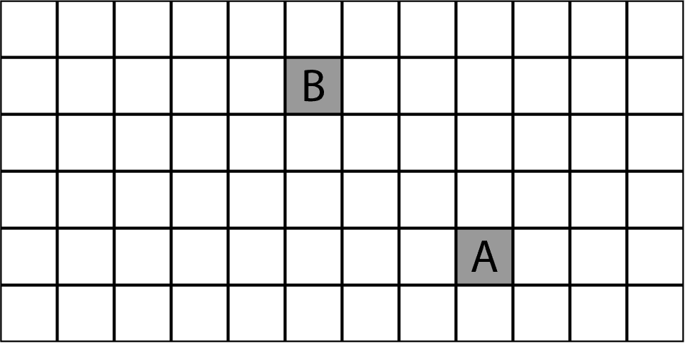

在这个网格上，我们有两个点，**A** 是起点，**B** 是终点。我们想要找到这两个点之间的最短路径。为了帮助我们解决这个问题，我们将使用 A* 算法，并看看它是如何找到最短路径的。

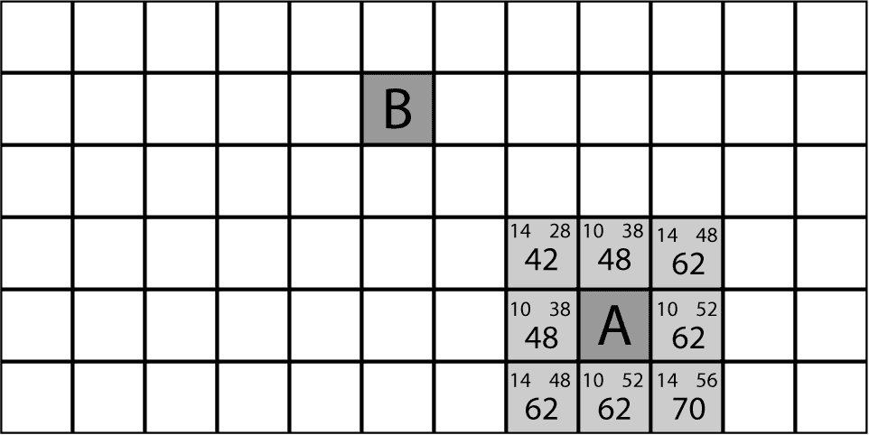

因此，算法计算每一步以找到最短路径。为了计算这个，算法使用了之前发现的两个节点，G 节点和 H 节点。G 代表从起点到距离，因此它计算从**A**位置有多远。H 代表从终点到距离，因此它计算从**B**位置有多远。如果我们把两个节点相加（*G + H = F*），我们得到 F 节点值，它代表最短路径。

在这种情况下，最短数字是**42**，因此我们可以移动到那个位置并再次计算所有可用的假设。

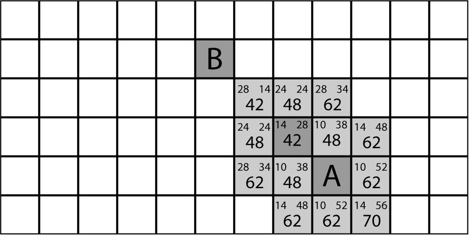

再次，算法计算从我们所在位置可用的最佳选项。我们接近 B 点，因此 H 节点的值正在变小，而 G 节点的值正在变大，这是完全正常的。在所有当前的可能性中，数字**42**再次是最低的，是最好的选择。所以自然的决定是朝着那个位置移动。


最后，我们到达了**B**点。一旦算法发现 H 节点值为零，这意味着它已经到达了目标位置，没有必要继续寻找更好的路径。

# 从点 A 到 B，途中存在障碍物

这正是 A*路径查找的工作方式；它从一个点到另一个点评估最佳选项，追求最短路径，直到达到最终目的地。之前的例子很简单，现在我们将使其更有趣，看看如果我们在地图上添加障碍物会发生什么。

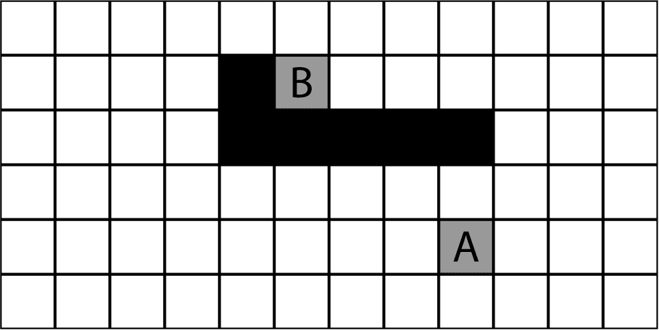

使用相同的地图，我们用黑色画了一些方格，表示这些位置不能使用。现在，这开始变得稍微有点意思，因为我们尝试猜测最佳路径时可能会出错。再次，让我们计算最佳选项如下：

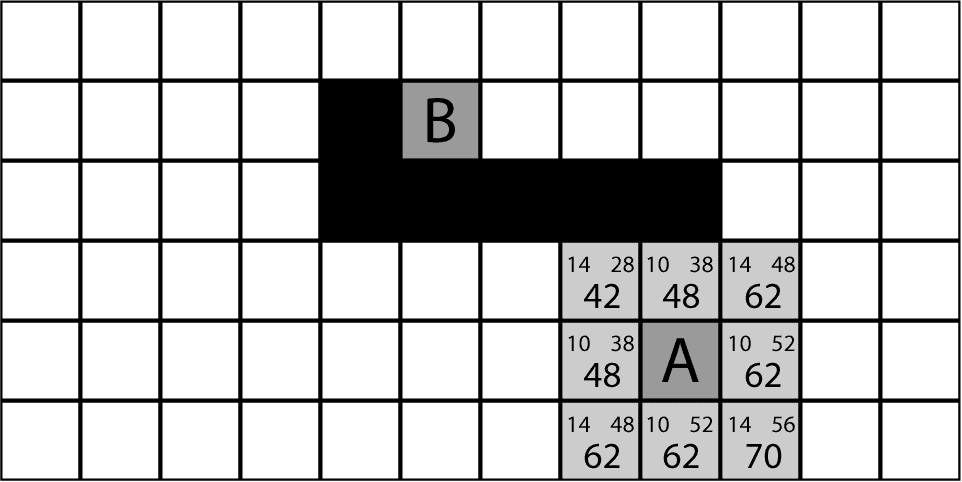

我们得到的结果与第一次测试完全相同，这是正常的，因为围绕**A**位置的所有点都没有位于黑格上。再次，我们可以朝着最低的数字**42**前进。

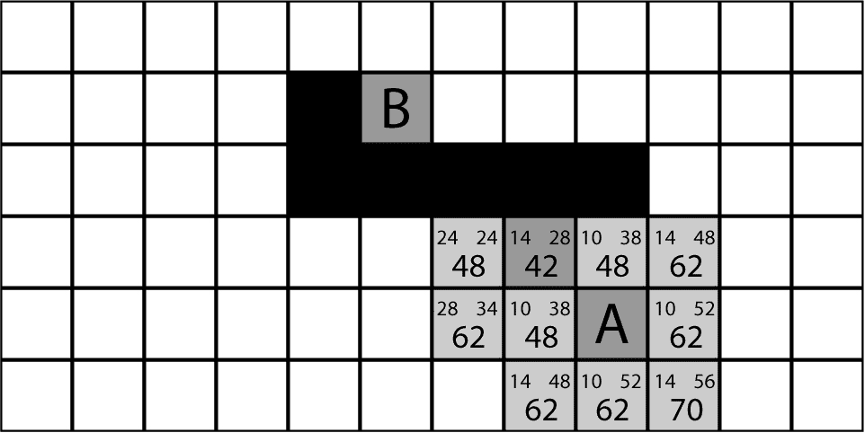

现在我们已经做出了第一步，并计算了从那个点可以采取的最佳选项，我们处于一个有趣的情况。在这个时候，我们有三个最低的数字，我们必须选择一个。我们需要找到通往**B**位置的最短路径，因为三个最低的数字相同，我们需要根据 H 节点来做出决定，它代表我们当前位置和**B**位置之间的距离。两个位置有**38**的 H 值，而只有一个位置的值为**24**，这使得它成为三个中最低的 H 值。所以让我们朝那个方向前进，这似乎更接近最终目的地。

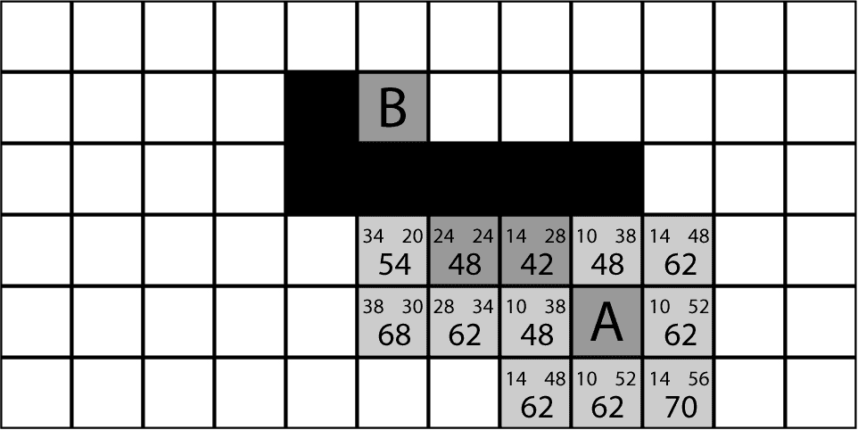

从现在开始，我们可以注意到 F 值正在增加，这代表最短路径值。这是由于我们在地图上添加的黑方块。因为它们，我们需要绕行，增加我们需要采取的路径长度。这就是 AI 将感知墙壁的方式；他们知道最终目的地很近，但为了到达那里，他们不能穿过墙壁，所以他们需要绕行，直到找到一扇开放的门或类似的东西。

现在，最低的值在另一个方向，这意味着我们需要返回以找到更好的路径。这是算法中的一个非常重要的方面，因为如果我们让角色在行走的同时搜索最佳路径，我们将得到更接近人类的结果。它看起来就像他在寻找正确的路径以达到目标地点，就像一个人不知道正确路径时一样。另一方面，角色可以被编程在开始移动之前完成所有计算，在这种情况下，我们会看到一个角色直接走向正确的路径，直到到达终点。这两种方法都是有效的，可以根据不同的目的和不同的游戏来使用。

在继续我们的寻路过程中，我们需要持续选择最小值，因此在这个点上，我们需要返回并在这两个最小值之间进行选择，**48**。它们都有相同的 G 和 H 值，所以找出最佳路径的唯一方法就是随机选择其中一个点，或者预先计算它们，看看哪一个会有最低的值。所以让我们随机选择一个点，看看会出现哪些值。

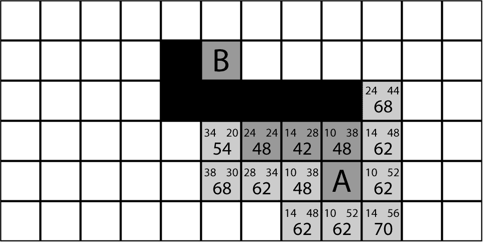

在选择了两种最短可能性之一后，我们发现数值正在增加，因此我们需要回过头来计算另一个值，看看在那之后是否还有更低的数值。因为我们已经可以看到地图，并且已经知道**B**点的位置，所以我们确信最低的数值实际上比刚才出现的**68**数值还要远。但如果我们不知道 B 点的位置，我们仍然需要检查那个**48**数值，看看目标点是否接近那个位置。这就是 AI 角色在游戏过程中会不断检查最低 F 值的原因。


在选择了新的位置之后，我们可以看到它并没有提供任何更好的机会，我们需要继续寻找更好的路径，在这种情况下，将是我们已经发现但尚未计算结果的点。再一次，我们有两个最低的 F 值，我们将选择最低的 H 值，即**20**。

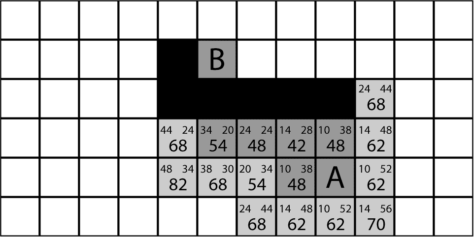

在计算新的可能性之后，我们注意到我们需要再次选择**54**，看看最终目的地是否更接近那个点。这正是当我们编程 AI 寻找到达最终目的地的最短路径时会发生的过程。计算需要在实时完成，并且正如我们开始注意到的那样，它们可以变得非常复杂。这就是为什么它消耗了大量的 CPU 功率，因为它是由硬件组件指定的这个功能（计算）。

现在，我们将选择数字**54**，因为它是地图上最低的数字。

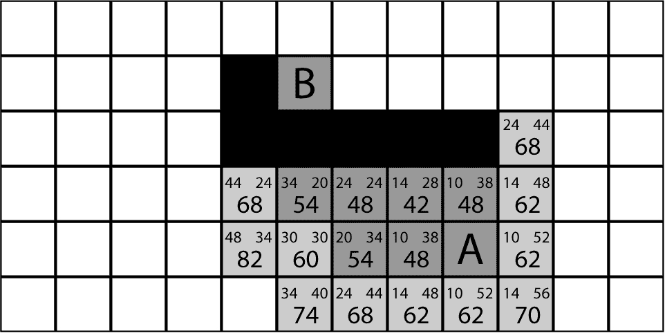

如果我们继续向下移动，数值将会增加，这意味着我们正在远离我们需要到达的地方。如果我们是 AI 并且不知道最终目的地在顶部，我们就需要检查**60**这个数字，因为它在目前是最有希望的。所以，让我们计算结果。

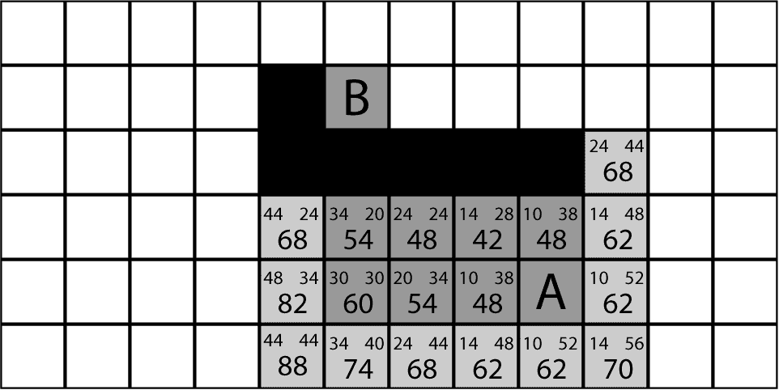

现在，我们可以看到有很多相同的最低数值，它们是**62**，所以我们需要探索它们所有，并继续计算，直到角色找到正确的路径。为了举例，我们将移动到地图上现在可以看到的所有最低数值。

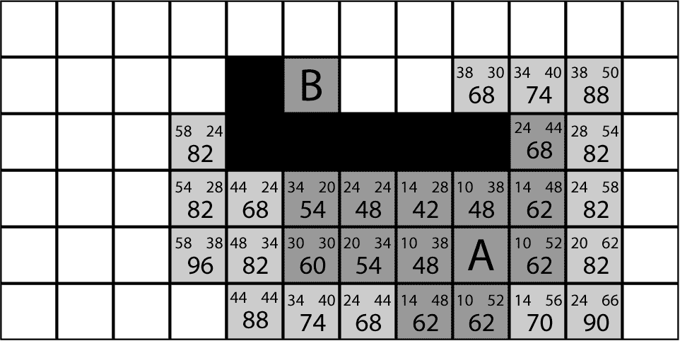

在探索了所有最低的可能性之后，我们可以看到我们正在接近最终目的地。在这个时候，可用的最低值是**68**，在那之后到达最终点将变得容易。

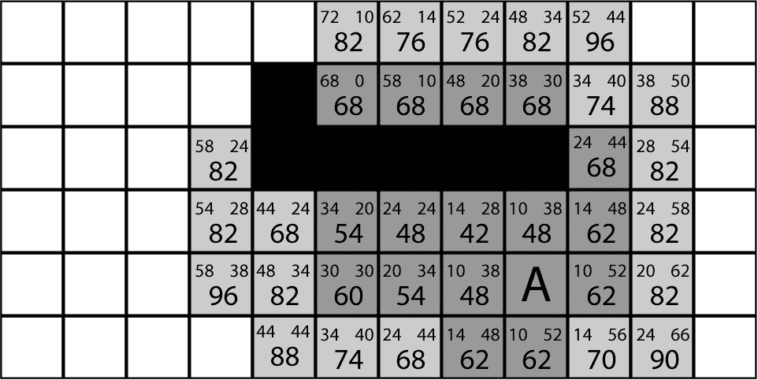

最后，我们到达了点**B**目的地。这是 A*算法的视觉方面，其中较深的灰色区域表示计算机已访问的位置，较浅的灰色区域表示我们已访问的区域的结果计算。

计算机可以实时计算最佳路径，或者开发者也可以选择在导出游戏之前让 AI 计算最佳选项。这样，AI 将自动知道游戏开始时需要遵循的路径，从而节省一些 CPU 功率。

为了解释如何在编程语言中实现这一点，我们将使用伪代码来演示这个示例。这样我们可以从头到尾理解我们如何在任何编程语言中创建搜索方法，以及我们如何自己适应它：

```py
OPEN // the set of nodes to be evaluated 
CLOSED // the set of nodes already evaluated 

Add the start node to OPEN 

loop 
   current = node in OPEN with the lowest f_cost 
   remove current from OPEN 
   add current to CLOSED 

   if current is the target node // path has been found 
         return 

   foreach neighbor of the current node 
         if neighbor is not traversable or neighbor is in CLOSED 
               skip to the next neighbor 

if new path to neighbor is shorter OR neighbor is not in OPEN 
   set f_cost of neighbor 
   set parent of neighbor to current 
   if neighbor is not in OPEN 
         add neighbor to OPEN 
```

让我们分析一下我们用来创建示例的每一行代码。我们将网格地图分为两个不同的类别：`OPEN`和`CLOSED`。`OPEN`的是我们已经探索的方块，在图像上由深灰色块表示。而`CLOSED`的是我们尚未探索的白色块。这将允许 AI 区分已探索和未探索的方块，从一点到另一点寻找最佳路径：

```py
Add the start node to OPEN 
```

然后，我们分配了第一个被认为是`OPEN`的方块；这将设置起点，并会自动从这个位置开始计算最佳选项：

```py
loop 
   current = node in OPEN with the lowest f_cost 
   remove current from OPEN 
   add current to CLOSED 
```

之后，我们需要创建一个循环，并在循环内部有一个名为`current`的临时变量；这等于`OPEN`列表中具有最低 F 成本的节点。然后它将从`OPEN`列表中移除并添加到`CLOSED`列表中：

```py
if current is the target node // path has been found 
         return 
```

然后，如果当前节点是目标节点，代码假设最终目的地已被探索，我们可以直接退出循环：

```py
foreach neighbor of the current node 
         if neighbor is not traversable or neighbor is in CLOSED 
               skip to the next neighbor 
```

否则，我们必须遍历当前节点的每个`neighbor`节点。如果它不可遍历，意味着我们无法通过该位置，或者如果它之前已被探索并且位于`CLOSED`列表中，代码可以跳到下一个邻居。这部分设置了可以移动的位置，并告诉 AI 不要考虑之前已探索的位置：

```py
if new path to neighbor is shorter OR neighbor is not in OPEN 
   set f_cost of neighbor 
   set parent of neighbor to current 
   if neighbor is not in OPEN 
         add neighbor to OPEN 
```

如果不是这种情况，那么我们可以继续前进并检查一些事情。如果新路径到`neighbor`比旧路径短，或者如果`neighbor`不在`OPEN`列表中，那么我们就通过计算`g_cost`和`h_cost`来设置`neighbor`的`f_cost`。我们看到新的可能方块有来自当前方块的孩子，因此我们可以追踪正在采取的步骤。最后，如果`neighbor`不在`OPEN`列表中，我们可以将其添加进去。

通过这种方式循环，代码将不断寻找最佳选项，并朝着最近的值移动，直到到达目标节点值。


我们刚刚学到的相同原理可以在 *GTA 5* 的行人中找到。显然，许多其他游戏也使用这种方法，但我们想用这个游戏作为大多数游戏中可以找到的两个寻路系统的例子。如果我们将这个系统应用于 AI 警察以搜索和找到玩家，我们就会得到在实际游戏玩法中可以看到的大致相同的结果。

除了搜索最终目的地之外，这只是一个最终代码的小部分，但我们将会看到 AI 角色逐步避开墙壁并接近玩家位置。除此之外，还需要向 AI 代码中添加更多内容，让角色知道在可能出现的多种情况下应该做什么，例如路径中间有水、楼梯、移动的汽车等等。

# 生成网格节点

现在我们将把到目前为止学到的知识应用到实际练习中。让我们首先创建或导入我们的场景到游戏编辑器中。


对于这个例子，我们将使用建筑物作为不可行走对象，但可以是任何我们选择的东西，然后我们需要将我们刚刚导入的对象与地面分开。为此，我们将它们分配到一个单独的层，并将其命名为**不可行走**。

然后，我们可以开始创建游戏的第一类，我们将从`节点`类开始：

```py
public bool walkable;
 public Vector3 worldPosition; public Node(bool _walkable, Vector3
         _worldPos, int _gridX, int _gridY) {
         walkable = _walkable;
         worldPosition = _worldPos; 
```

我们已经看到节点有两种不同的状态，要么是可行走的，要么是不可行走的，所以我们可以从创建一个名为`walkable`的布尔值开始。然后我们需要知道节点在世界中的哪个点表示，因此我们创建一个`Vector 3`用于`worldPosition`。现在，我们需要一种方法在创建节点时分配这些值，因此我们创建一个`Node`变量，它将包含有关节点的所有重要信息。

在创建这个类的必要部分之后，我们可以继续到`grid`类：

```py
 Node[,] grid;  
 public LayerMask unwalkableMask;
 public Vector2 gridWorldSize;
 publicfloatnodeRadius;
 void OnDrawGizmos() 
 {
         Gizmos.DrawWireCube(transform.position,new
    Vector3(gridWorldSize.x,1,gridWorldSize.y));  
 } 
```

首先，我们需要一个二维数组来表示我们的网格，所以让我们创建一个二维节点数组，我们可以称它为`grid`。然后我们可以创建一个`Vector2`来定义这个网格在世界坐标中覆盖的区域，并称它为`gridWorldSize`。我们还需要一个`float`变量来定义每个单独的节点覆盖的空间量，在这个类中称为`nodeRadius`。然后我们需要创建一个`LayerMask`来定义不可行走区域，并将其命名为`unwalkableMask`。

为了在我们的游戏编辑器中可视化我们刚刚创建的网格，我们决定使用`OnDrawGizmos`方法；使用这个方法是很有用的，但不是强制性的：

```py
     public LayerMask unwalkableMask;
     public Vector2 gridWorldSize;
     public float nodeRadius;
     Node[,] grid;

     float nodeDiameter;
     int gridSizeX, gridSizeY;

     void Start() {
         nodeDiameter = nodeRadius*2;
         gridSizeX = Mathf.RoundToInt(gridWorldSize.x/nodeDiameter);
         gridSizeY = Mathf.RoundToInt(gridWorldSize.y/nodeDiameter);
         CreateGrid();
     }

     void CreateGrid(){
         grid = new Node[gridSizeX,gridSizeY];
         Vector3 worldBottomLeft = transform.position - Vector3.right *
     gridWorldSize.x/2 - Vector3.forward * gridWorldSize.y/2;
     } 
```

让我们创建一个`Start`方法，我们将添加一些基本的计算。我们需要弄清楚的是，我们可以在我们的网格中放入多少个节点。我们首先创建一个新的`float`变量，称为`nodeDiameter`，以及新的`int`变量，称为`gridSizeX`和`gridSizeY`。然后，在我们的`Start`方法内部，我们将添加`nodeDiameter`的值，它等于`nodeRadius*2`。`gridSizeX`等于`gridWorldSize.x/nodeDiameter`，这将告诉我们`gridWorldSize.x`中可以放入多少个节点。然后我们将数字四舍五入以适应整数，因此我们将使用`Mathf.RoundToInt`来实现这一点。在创建`x`轴的计算之后，我们可以复制相同的代码并更改它以使其适用于`y`轴。为了最终完成我们的`Start`方法，我们创建一个新的函数，我们将称之为`CreateGrid()`：

```py
 public LayerMask unwalkableMask;
 public Vector2 gridWorldSize;
 public float nodeRadius;
 Node[,] grid;

 float nodeDiameter;
 int gridSizeX, gridSizeY;

 void Start(){
         nodeDiameter = nodeRadius*2;
         gridSizeX = Mathf.RoundToInt(gridWorldSize.x/nodeDiameter);
         gridSizeY = Mathf.RoundToInt(gridWorldSize.y/nodeDiameter);
         CreateGrid();
 } 

 void CreateGrid() 
 {
         grid = new Node[gridSizeX,gridSizeY];
         Vector3 worldBottomLeft = transform.position - Vector3.right *
         gridWorldSize.x/2 - Vector3.forward * gridWorldSize.y/2;

         for (int x = 0; x < gridSizeX; x ++) {
             for (int y = 0; y < gridSizeY; y ++) {
                 Vector3 worldPoint = worldBottomLeft + Vector3.right *
                 (x * nodeDiameter + nodeRadius) + Vector3.forward * (y
                 * nodeDiameter + nodeRadius);
                 bool walkable = !(Physics.CheckSphere(worldPoint,
                                   nodeRadius,unwalkableMask));
                 grid[x,y] = new Node(walkable,worldPoint);
             }
         } 
 }  
```

在这里，我们添加了`grid`变量的值，`grid = new Node[gridSizeX, gridSizeY];`。现在我们需要添加碰撞检测，这将确定地图的可通行和非通行区域。为此，我们创建了一个循环，这在之前展示的代码中可以看到。我们简单地添加了一个新的`Vector3`变量来获取地图的左下角，称为`worldBottomLeft`。然后我们分配了碰撞检测，它将通过使用`Physics.Check`来搜索任何与可通行区域发生碰撞的对象：

```py
 void OnDrawGizmos() {
         Gizmos.DrawWireCube(transform.position,new
         Vector3(gridWorldSize.x,1,gridWorldSize.y));

         if (grid != null) {
             foreach (Node n in grid) {
                 Gizmos.color = (n.walkable)?Color.white:Color.red;
                 Gizmos.DrawCube(n.worldPosition, Vector3.one *
                 (nodeDiameter-.1f));
             }
         }
 } 
```

在测试之前，我们需要更新我们的`OnDrawGizmos`函数，以便我们可以在地图上看到网格。为了使网格可见，我们使用`nodeDiameter`值来设置每个立方体的尺寸，并分配了红色和白色的颜色。如果一个节点是可通行的，颜色将被设置为白色；否则，它将被设置为红色。现在我们可以测试它了：

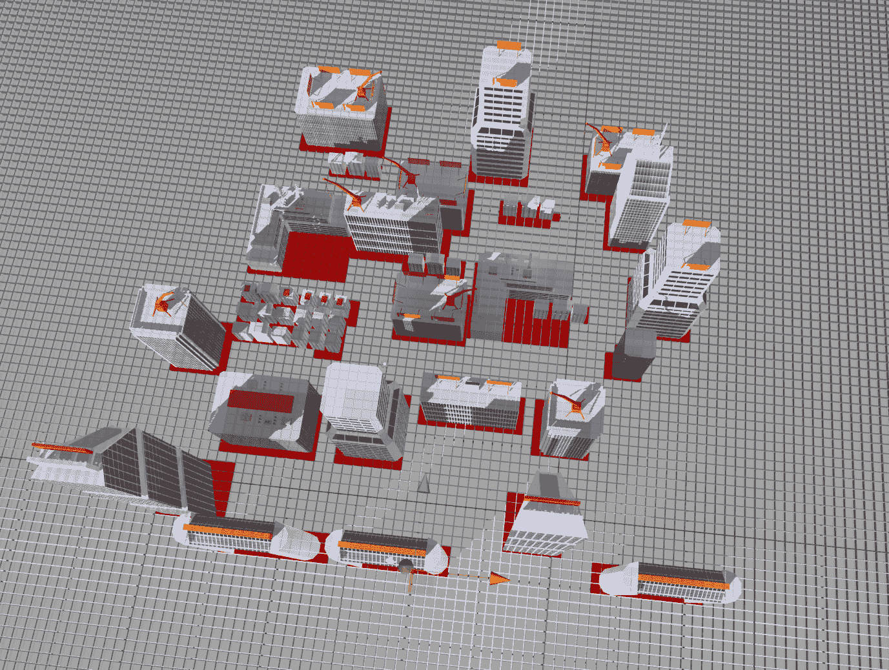

结果非常棒；现在我们有一个可以自动分析地图并指示可通行和非通行区域的网格。这部分完成后，其余部分将更容易实现。在继续下一部分之前，我们需要添加一个方法，告诉我们的角色它站在哪个节点上。在我们的代码中，我们将添加一个名为`NodeFromWorldPoint`的函数，使其成为可能：

```py
 public LayerMask unwalkableMask;
 public Vector2 gridWorldSize;
 public float nodeRadius;
 Node[,] grid;

 float nodeDiameter;
 int gridSizeX, gridSizeY;

 void Start(){
         nodeDiameter = nodeRadius*2;
         gridSizeX = Mathf.RoundToInt(gridWorldSize.x/nodeDiameter);
         gridSizeY = Mathf.RoundToInt(gridWorldSize.y/nodeDiameter);
         CreateGrid();
 } 

 void CreateGrid() 
 {
         grid = new Node[gridSizeX,gridSizeY];
         Vector3 worldBottomLeft = transform.position - Vector3.right *
               gridWorldSize.x/2 - Vector3.forward * gridWorldSize.y/2;

         for (int x = 0; x < gridSizeX; x ++) {
             for (int y = 0; y < gridSizeY; y ++) {
                 Vector3 worldPoint = worldBottomLeft + Vector3.right *
                 (x * nodeDiameter + nodeRadius) + Vector3.forward * (y
                 * nodeDiameter + nodeRadius);
                 bool walkable = !(Physics.CheckSphere(worldPoint,
                                   nodeRadius,unwalkableMask));
                 grid[x,y] = new Node(walkable,worldPoint);
             }
         } 
 }  
 public Node NodeFromWorldPoint(Vector3 worldPosition) {
         float percentX = (worldPosition.x + gridWorldSize.x/2) /
         gridWorldSize.x;
         float percentY = (worldPosition.z + gridWorldSize.y/2) /
         gridWorldSize.y;
         percentX = Mathf.Clamp01(percentX);
         percentY = Mathf.Clamp01(percentY);

         int x = Mathf.RoundToInt((gridSizeX-1) * percentX);
         int y = Mathf.RoundToInt((gridSizeY-1) * percentY);
         return grid[x,y];
     } void OnDrawGizmos() {
         Gizmos.DrawWireCube(transform.position,new
         Vector3(gridWorldSize.x,1,gridWorldSize.y));

         if (grid != null) {
             foreach (Node n in grid) {
                 Gizmos.color = (n.walkable)?Color.white:Color.red;
                 Gizmos.DrawCube(n.worldPosition, Vector3.one *
                (nodeDiameter-.1f));
             }
         }
     } 
```

我们终于完成了示例的第一部分。我们有一个可以在任何场景中工作的代码，我们只需要定义我们想要代码搜索可通行和非通行区域的地图比例，以及每个节点的尺寸，以防我们想要改变寻路的精度记住，如果我们增加地图上的节点数量，将需要更多的 CPU 功率来计算寻路系统）。

# 寻路实现

下一步是将角色设置为搜索我们想要的最终目的地。让我们先创建一个新的类，我们将称之为**pathfinding**。这个类将管理搜索最佳路径以到达最终目的地。它将实时计算角色需要遵循的最短路径，并且每秒更新一次，所以如果最终目的地在移动，它将保持跟随并重新计算最佳路径。


我们首先将 AI 角色添加到我们的游戏编辑器中，它最终将搜索游戏中的另一个角色。为了测试目的，我们将简单地为我们的人物添加一些基本功能，使他能够在地图上移动，但我们也可以使用一个简单的立方体来测试路径查找系统是否工作。

在将我们的角色导入到游戏中后，我们可以开始创建一个将被分配给它的类：

```py
Grid grid;

void Awake(){
      requestManager = GetComponent<PathRequestManager>();
      grid = GetComponent<Grid>();
 } 

void FindPath(Vector3 startPos, Vector3 targetPos) 
{ 
Node startNode = grid.NodeFromWorldPoint(startPos);
 Node targetNode = grid.NodeFromWorldPoint(targetPos);  
} 

```

我们首先创建一个名为`FindPath`的函数，该函数将存储计算起始位置和目标位置之间距离所需的所有必要值。然后我们添加一个`Grid`变量，它的值将与我们之前创建的`grid`相同。然后我们使用`Awake`函数来访问`grid`值：

```py
void FindPath(Vector3 startPos, Vector3 targetPos) 
{ 
Node startNode = grid.NodeFromWorldPoint(startPos); 
Node targetNode = grid.NodeFromWorldPoint(targetPos); 

List<Node> openSet = new List<Node>(); 
HashSet<Node> closedSet = new HashSet<Node>(); 
openSet.Add(startNode); 
} 
```

然后我们需要创建一个列表，将包含游戏中所有存在的节点，正如我们之前所演示的那样。一个列表包含所有`OPEN`节点，另一个将包含所有`CLOSED`节点：

```py
public bool walkable; 
public Vector3 worldPosition; 

public int gCost; 
public int hCost; 
public Node parent; 

public Node(bool _walkable, Vector3 _worldPos, int _gridX, int _gridY) 
{ 
         walkable = _walkable; 
         worldPosition = _worldPos; 
} 

public int fCost 
{ 
         get { 
               return gCost + hCost; 
         } 
} 
```

现在我们已经打开了`Node`类，并添加了名为`gCost`和`hCost`的新变量。这个类的想法是计算最短路径值，正如我们之前所看到的，为了得到代表最短路径的`fCost`，我们需要将`g`和`h`节点的值相加。

*f(n)=g(n)+h(n)*。

一旦编辑了`Node`类，我们就可以回到我们的路径查找类，继续实现那些将使我们的 AI 角色搜索最佳路径的代码行：

```py
Grid grid; 

void Awake() 
{ 
         grid = GetComponent<Grid> (); 
} 

void FindPath(Vector3 startPos, Vector3 targetPos) 
{ 
   Node startNode = grid.NodeFromWorldPoint(startPos); 
   Node targetNode = grid.NodeFromWorldPoint(targetPos); 

   List<Node> openSet = new List<Node>(); 
   HashSet<Node> closedSet = new HashSet<Node>(); 
   openSet.Add(startNode); 

   while (openSet.Count > 0) 
{ 
         Node node = openSet[0]; 
         for (int i = 1; i < openSet.Count; i ++) { 
         if (openSet[i].fCost < node.fCost || openSet[i].fCost ==
         node.fCost) { 
         if (openSet[i].hCost < node.hCost) 
         node = openSet[i]; 
   } 
} 
```

回到我们的路径查找类；我们需要定义角色所在的位置的当前节点。为了实现这一点，我们添加了`Node currentNode = openSet[0]`；这将 0 设置为默认节点。然后我们创建循环，比较可能节点的`fCost`以选择最佳选项，`openSet[i].fCost < node.fCost || openSet[i].fCost == node.fCost`。这是我们用来实现这个例子所需结果所使用的代码，但如果需要，它仍然可以进一步优化：

```py
Grid grid; 
void Awake() 
{ 
         grid = GetComponent<Grid> (); 
} 

void FindPath(Vector3 startPos, Vector3 targetPos) 
{ 
   Node startNode = grid.NodeFromWorldPoint(startPos); 
   Node targetNode = grid.NodeFromWorldPoint(targetPos); 

   List<Node> openSet = new List<Node>(); 
   HashSet<Node> closedSet = new HashSet<Node>(); 
   openSet.Add(startNode); 

   while (openSet.Count > 0) 
{ 
         Node node = openSet[0]; 
         for (int i = 1; i < openSet.Count; i ++) 
{ 
         if (openSet[i].fCost < node.fCost || openSet[i].fCost ==
         node.fCost){ 
               if (openSet[i].hCost < node.hCost) 
         node = openSet[i]; 
           } 
         } 

         openSet.Remove(node); 
         closedSet.Add(node); 

         if (node == targetNode) { 
               RetracePath(startNode,targetNode); 
               return; 
         } 
```

继续我们的循环，我们现在已经定义了当前节点被设置为`OPEN`或`CLOSED`的情况，并确定如果当前节点值等于目标节点值，这意味着角色已经到达了最终目的地`if (currentNode == targetNode)`：

```py
public List<Node> GetNeighbors(Node node) 
{ 
   List<Node> neighbors = new List<Node>(); 

   for (int x = -1; x <= 1; x++) { 
         for (int y = -1; y <= 1; y++) { 
               if (x == 0 && y == 0) 
                     continue; 

               int checkX = node.gridX + x; 
               int checkY = node.gridY + y; 

               if (checkX >= 0 && checkX < gridSizeX && checkY >= 0 &&
               checkY < gridSizeY) { 
                     neighbors.Add(grid[checkX,checkY]); 
                     } 
               } 
         } 
   } 
```

现在，我们需要遍历 `current node` 的每个 `neighbor` 节点。为了做到这一点，我们决定将其添加到我们的网格代码中，因此我们需要打开在示例开头创建的 `grid` 类，并添加之前演示的 `List` 函数。然后我们将添加必要的值到 `Node` 类（`gridX` 和 `gridY`）：

```py
public bool walkable; 
public Vector3 worldPosition; 
public int gridX; 
public int gridY; 

public int gCost; 
public int hCost; 
public Node parent; 

public Node(bool _walkable, Vector3 _worldPos, int _gridX, int _gridY) 
{ 
   walkable = _walkable; 
   worldPosition = _worldPos; 
   gridX = _gridX; 
   gridY = _gridY; 
} 

public int fCost 
{ 
   get 
{ 
         return gCost + hCost; 
   } 
} 

```

在这里，我们添加了 `Node` 类的最终内容，该类包含 `gridX` 和 `gridY` 值，这些值将被 `grid` 代码使用。这是对 `Node` 类的最终查看。现在，我们可以再次转向路径查找类：

```py
foreach (Node neighbor in grid.GetNeighbors(node)) { 
if (!neighbor.walkable || closedSet.Contains(neighbor)) 
{ 
               continue; 
} 
} 
```

在这里，我们添加了一个 `foreach` 循环，该循环将遍历邻居节点以检查它们是否可通行或不可通行。

为了更好地理解我们接下来要采取的步骤，我们将有一些示例图来展示我们想要实现的内容以完成路径查找系统：

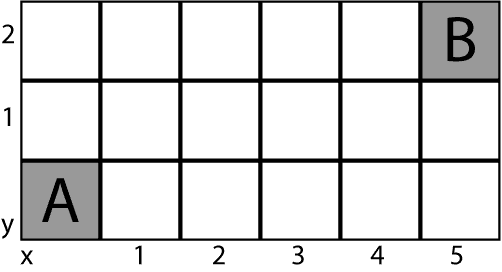

我们首先需要沿着 **X** 轴计数，以了解我们距离 **X** 轴上的最终位置有多少个节点，然后我们沿着 **Y** 轴计数，以找出我们距离 **Y** 轴上的最终位置有多少个节点：

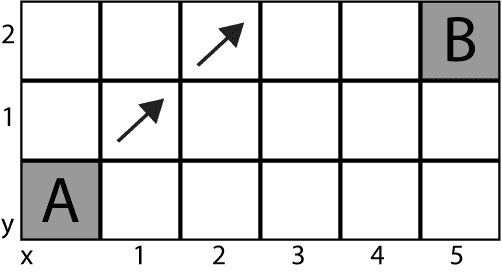

在这个例子中，我们可以看到，为了到达 **B** 位置，我们需要向上移动两个点。因为我们总是在寻找最短路径，所以在向上移动的同时，我们在 **X** 轴上移动：

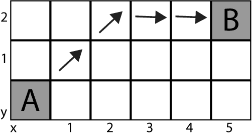

要计算到达 **B** 位置所需的垂直或水平移动次数，我们只需将较大的数字减去较小的数字。例如，在直线上到达 **B** 位置之前，我们需要计算 *5-2 = 3*，这告诉我们需要多少次水平移动才能到达最终目的地。

现在，我们可以回到路径查找代码，并添加我们刚刚学到的公式：

```py
int GetDistance(Node nodeA, Node nodeB) 
{ 
   int dstX = Mathf.Abs(nodeA.gridX - nodeB.gridX); 
   int dstY = Mathf.Abs(nodeA.gridY - nodeB.gridY); 

   if (dstX > dstY) 
         return 14*dstY + 10* (dstX-dstY); 
   return 14*dstX + 10 * (dstY-dstX); 
} 
```

在这里，我们只是添加了代码行，这些代码将告诉我们 AI 需要多少次水平和垂直步骤才能到达目标目的地。现在，如果我们回顾一下我们在本章开头创建的伪代码，以检查还需要创建什么，我们可以看到我们遵循了相同的结构，并且我们几乎完成了。伪代码如下：

```py
OPEN // the set of nodes to be evaluated 
CLOSED // the set of nodes already evaluated 

Add the start node to OPEN 

loop 
   current = node in OPEN with the lowest f_cost 
   remove current from OPEN 
   add current to CLOSED 

   if current is the target node // path has been found 
         return 

   foreach neighbor of the current node 
         if neighbor is not traversable or neighbor is in CLOSED 
               skip to the next neighbor 

if new path to neighbor is shorter OR neighbor is not in OPEN 
   set f_cost of neighbor 
   set parent of neighbor to current 
   if neighbor is not in OPEN 
         add neighbor to OPEN 
```

因此，让我们继续将更多重要内容添加到我们的代码中，并继续向路径查找类的结论迈进。

我们需要设置邻居的 `f_cost`，正如我们已知的那样，为了计算这个值，我们需要使用邻居节点的 `g_Cost` 和 `h_Cost`：

```py
foreach (Node neighbor in grid.GetNeighbors(node)) 
{ 
   if (!neighbor.walkable || closedSet.Contains(neighbor)) { 
         continue; 
   } 

   int newCostToNeighbor = node.gCost + GetDistance(node, neighbor); 
   if (newCostToNeighbor < neighbor.gCost ||
   !openSet.Contains(neighbor)) { 
         neighbor.gCost = newCostToNeighbor; 
         neighbor.hCost = GetDistance(neighbor, targetNode); 
         neighbor.parent = node; 
   } 
```

在路径查找类中，我们添加了以下代码，该代码将计算邻居节点以检查它们的 `f_cost`：

```py
void RetracePath(Node startNode, Node endNode) { 
         List<Node> path = new List<Node>(); 
         Node currentNode = endNode; 

         while (currentNode != startNode) { 
               path.Add(currentNode); 
               currentNode = currentNode.parent; 
         } 
         path.Reverse(); 

         grid.path = path; 
} 
```

在退出循环之前，我们将调用一个名为`RetracePath`的函数，并给它提供`startNode`和`targetNode`。然后我们必须创建一个具有相同名称的新函数，并分配一个已经探索的节点列表。为了可视化路径查找，看看它是否正常工作，我们还在`grid`类中创建了一个路径：

```py
public List<Node> path; 
void OnDrawGizmos() 
{ 
Gizmos.DrawWireCube(transform.position,new Vector3(gridWorldSize.x,1,gridWorldSize.y)); 

         if (grid != null) { 
               foreach (Node n in grid) { 
                     Gizmos.color = (n.walkable)?Color.white:Color.red; 
                     if (path != null) 
                           if (path.Contains(n)) 
                                 Gizmos.color = Color.black; 
                     Gizmos.DrawCube(n.worldPosition, Vector3.one * (nodeDiameter-.1f)); 
               } 
   } 
} 
```

`grid`类的这一部分已被更新，现在包含`List`、`path`以及一个新的小工具，它将在编辑器视图中显示 AI 位置和目标位置之间的路径：

```py
public Transform seeker, target; 

Grid grid; 

void Awake() 
{ 
   grid = GetComponent<Grid> (); 
} 

void Update() 
{ 
   FindPath (seeker.position, target.position); 
} 
```

最后，为了总结我们的例子，我们在路径查找类中添加了一个`void Update()`方法，这将使 AI 不断搜索目标位置。

现在，我们可以继续到我们的游戏编辑器，并将我们创建的路径查找代码分配给网格。然后我们简单地分配 AI 角色和我们想要的目标位置：


如果我们测试路径查找系统，我们可以看到它运行得非常完美。在上面的截图里，左上角是 AI 角色的位置，右下角是目标目的地。我们可以看到角色规划了最短路径，并且避开了与建筑的碰撞：

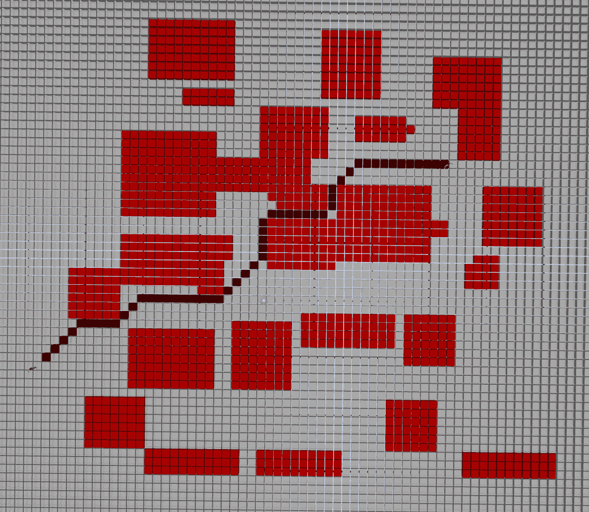

然后，我们禁用了建筑物的网格，以便更好地查看地图的可行走和不可行走区域。我们可以看到角色只选择可行走区域，并避开其路径上的任何障碍。用静态图像展示它很复杂，但如果我们在实时改变目标位置，我们可以看到路径查找正在调整角色需要采取的路线，并且它总是选择最短路径。


我们刚刚创建的高级路径查找系统可以在许多大家喜爱的流行游戏中找到。现在我们已经学会了如何创建复杂的路径查找系统，我们能够重新创建现代游戏中如 GTA 或刺客信条中最先进 AI 角色的某些部分。谈到刺客信条，它将是我们的下一款游戏，作为下一章的参考，因为其 AI 角色在 A*路径查找和现实人群交互之间完美连接，正如我们在上面的截图中所看到的。

# 摘要

在本章中，我们回顾了如何创建点对点移动，但不是使用简单的方法，而是研究了大型且成功的游戏工作室如何解决 AI 最复杂的功能之一，即路径查找。在这里，我们学习了如何使用 theta 算法来重现人类特征，这有助于我们在正确的方向上搜索和移动，以便到达期望的目的地。

在下一章中，我们将讨论现实中的群体互动，这是尝试使人工智能角色尽可能真实的一个重要方面。我们将研究不同类型游戏中使用的方法，同时我们还将探讨人类和动物在其环境中如何互动，以及我们如何将这一点应用到我们的 AI 代码中。
