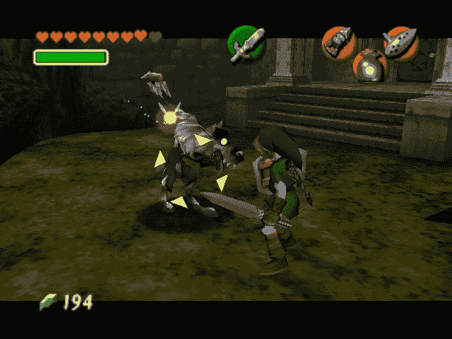
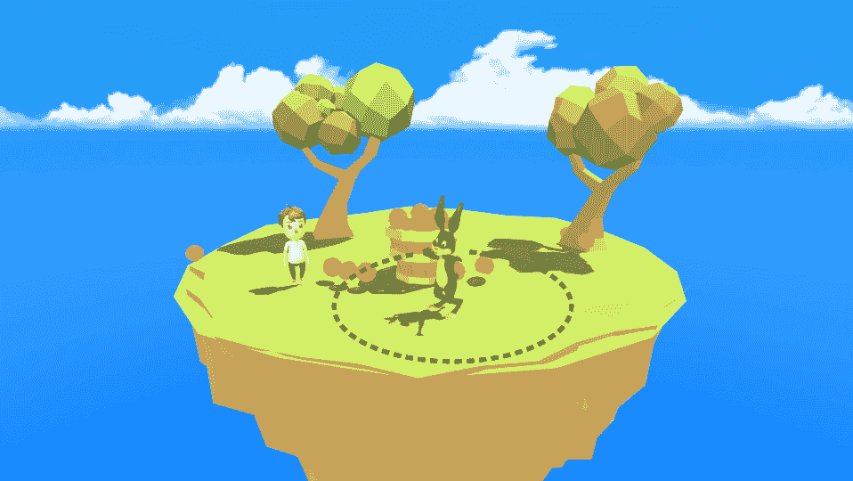
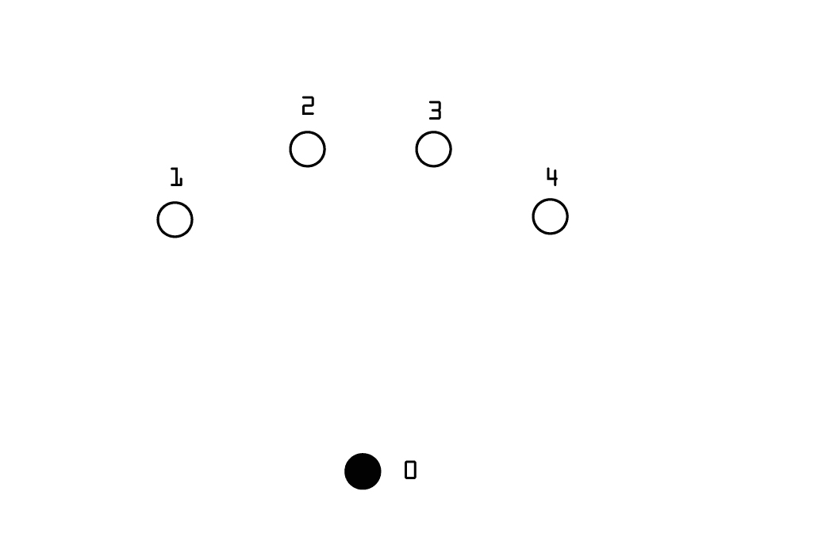

# 第十章：意识

在我们最后一章中，我们将探讨如何开发使用**战术**和意识来实现其目标的 AI 角色。在这里，我们将使用之前探索的一切，了解我们如何将所有这些结合起来，以创建可用于潜行游戏或也依赖战术或意识的游戏的 AI 角色。

# 潜行子类型

潜行游戏是一个非常受欢迎的子类型，其中玩家的主要目标是利用潜行元素，不被对手发现以完成主要目标。尽管这个子类型在军事游戏中非常流行，但几乎可以在任何游戏中看到它的应用。如果我们深入观察，任何游戏中如果敌人角色被玩家的噪音或视觉触发，就是在使用潜行元素。这意味着在某个时候，在我们的 AI 角色中实现意识甚至战术可能非常有用，无论我们正在开发的游戏类型是什么。

# 关于战术

战术是指角色或一组角色为了实现特定目标所采取的过程。这通常意味着角色可以使用他们所有的能力，根据情况选择最佳的能力来击败对手。在视频游戏中，战术的概念是赋予 AI 决策能力，使其在试图达到主要目标时表现得聪明。我们可以将此与士兵或警察在现实世界中用来抓捕坏蛋的战术进行比较。

他们拥有广泛的技术和人力资源来捕捉强盗，但为了成功完成这项任务，他们需要明智地选择他们将采取的行动，一步一步来。同样的原则也可以应用于我们的 AI 角色；我们可以让它们选择实现其目标的最佳选项。

为了创建这个，我们可以使用这本书中之前涵盖的每一个主题，并且通过这样，我们能够开发出一个能够选择最佳战术以击败玩家或实现其目标的 AI 角色。

# 关于意识

与战术相关的一个非常重要的方面是角色的意识。一些常见的因素可以构成 AI 角色的意识的一部分，例如音频、视觉和感知。这些因素受到了我们所有人共有的特征——视觉、音频、触觉和对周围发生的事情的感知——的启发。

因此，我们追求的是创建能够同时处理所有这些信息的人工智能角色，在它们做其他事情的同时，使它们对周围环境保持警觉，对在那个特定时刻应该做出的决策做出更好的判断。

# 实现视觉意识

在开始战术之前，我们将看看如何将意识系统实现到我们的角色中。

让我们从将视觉感知融入到我们的游戏角色中开始。这个想法是模拟人类的视觉，我们可以在近距离看得很清楚，而当某物真的很远时，我们看不清楚。许多游戏都采用了这个系统，它们都有所不同，有些系统更复杂，而有些则更简单。基本示例可以在像《塞尔达传说 - 时之笛》这样的更幼稚的冒险游戏中找到，例如，敌人只有在达到某个触发区域时才会出现或做出反应，如下面的截图所示：



例如，在这种情况下，如果玩家返回并退出敌人的触发区域，敌人将保持在空闲位置，即使他显然能看到玩家。这是一个基本的感知系统，我们可以将其包括在视觉部分。

同时，其他游戏已经围绕这个主题（视觉感知）开发了整个游戏玩法，其中视觉范围对游戏本身有极其重要的方面。几个例子之一是育碧的《细胞分裂》。


在这个游戏中使用了所有类型的感知系统，包括声音、视觉、触觉和感知。如果玩家在阴暗区域保持安静，被发现的机会比在明亮区域保持安静要小，声音也是如此。因此，在前面截图的例子中，玩家已经非常接近正在看向另一个方向的敌人。

为了让玩家接近到这种程度，必须非常安静地移动并在阴影中行动。如果玩家发出噪音或直接走进明亮区域，敌人就会注意到他。这比《塞尔达》游戏中的系统要复杂得多，但同样，这完全取决于我们正在创建的游戏以及哪个系统更适合我们寻找的游戏玩法。我们将演示基本示例，然后转向更高级的示例。

# 基本视觉检测

首先，我们开始在游戏中创建并添加一个场景，然后添加玩家。


我们将所有必要的代码分配给玩家，这样我们就可以移动并测试游戏。在这个例子中，我们迅速将一些基本的移动信息分配给我们的玩家，因为这是玩家和 AI 角色之间唯一会发生的交互。


现在，我们的角色可以在场景中自由移动，我们准备开始处理敌人角色。我们想要复制《塞尔达》游戏中那个特定的时刻，即当玩家从他的位置靠近时，敌人从地面出现，而当玩家远离时，敌人回到地面。


在截图中所看到的兔子是我们刚刚导入游戏的 AI 角色，现在我们需要定义围绕它的区域，这将作为它的感知区域。因此，如果玩家靠近兔子，它将检测到玩家，并最终从洞中出来。



假设我们想让兔子能够从它的洞中看到由虚线表示的区域。我们接下来该如何操作？在这里我们可以做两件事，一是将触发器`Collider`添加到洞对象中，它将检测到玩家并从洞的位置实例化兔子，二是将触发器`Collider`直接添加到兔子身上（假设它在洞内不可见）并在代码中有一个当兔子在洞内时的状态，以及当它在外面的状态。

在这个例子中，我们决定将洞作为兔子藏身的主要对象，以及玩家进入触发区域的那一刻，洞对象实例化 AI 角色。


我们将兔子转换成了一个预制体，这样我们就可以稍后实例化它，然后我们从场景中移除了它。然后我们在游戏中创建了一个立方体，并将其放置在洞的位置。由于在这个例子中我们不需要洞是可见的，我们将关闭这个对象的网格。

使用立方体而不是空对象，使我们能够在游戏编辑器中更好地可视化对象，以防我们需要更改某些内容或只是有一个关于这些对象的位置概念。

在这一点上，我们需要让这个对象检测到玩家，因此我们将添加一个具有我们之前计划使用的维度的触发器。


我们删除了当创建立方体时自动出现的默认立方体触发器，然后分配了一个新的球体触发器。为什么我们不使用立方体触发器？我们本可以使用立方体触发器，技术上它也会工作，但覆盖的区域将与我们计划的圆形区域完全不同，因此我们删除了默认触发器，并分配了一个适合我们目的的新触发器。

既然我们已经用球体触发器覆盖了我们想要覆盖的区域，我们就需要让它检测到玩家。为此，我们需要创建一个将被分配给立方体/洞的脚本：

```py
void OnTriggerEnter (Collider other) {

 if(other.gameObject.tag == "Player")
 {
 Debug.Log("Player Detected");
 } } 
```

在脚本内部，我们添加了这一行代码。这是一条简单的触发器检查，用于当对象进入触发区域时（我们曾用它来演示之前的例子）。目前我们只是让触发器检查是否检测到玩家，使用`Debug.Log("玩家被检测到");`。我们将这个脚本分配给立方体/洞对象，然后我们可以测试它。


如果我们将玩家移动到我们创建的触发区域内，我们可以看到“玩家被检测到”的消息。


好的，这是基本示例的第一部分；我们有玩家在地图上移动，洞能够检测到玩家靠近时的情况。

我们使用触发 Collider 来检测某种东西的方法并不直接与任何类型的意识相关联，因为这仅仅是技术部分，我们使用它的方式将决定这是否是我们 AI 角色的视野。

现在，我们可以开始处理兔子，我们的 AI 角色。我们已经有它创建并设置为预制体，准备在游戏中出现。所以下一步是让洞对象实例化兔子，将兔子看到玩家的感觉传递给玩家，因此兔子决定从洞中出来。在洞对象代码中，我们将`Player Detected`消息更新为`instantiate`：

```py
 public GameObject rabbit;
 public Transform startPosition;
 public bool isOut;

 void Start ()
 {
 isOut = false;
 }
 void OnTriggerEnter (Collider other)
 {

 if(other.gameObject.tag == "Player" && isOut == false)
 {
 isOut = true;
 Instantiate(rabbit, startPosition.position,
 startPosition.rotation);
 }
 }
```

所以我们做的是定义了将要实例化的对象，在这个例子中是 AI 角色“兔子”。然后我们添加了`startPosition`变量，它将设置我们希望角色出现的位置，作为替代，我们也可以使用洞对象的位置，这对于这个例子来说效果同样好。最后，我们添加了一个简单的布尔值`isOut`，以防止洞在同一时间创建多个兔子。

当玩家进入触发区域时，兔子就会被实例化并从洞中跳出来。


现在，我们有一个兔子，当它看到玩家时会从洞中跳出来。我们的下一步是也给兔子本身添加相同的视野，但这次我们希望兔子能够持续检查玩家是否在触发区域内，这表示它可以看到玩家，如果玩家离开它的视野，兔子就再也看不到他，并返回洞中。

对于 AI 角色，我们可以使用比洞更宽的区域。


所以，正如我们所看到的，那将是兔子可以看到玩家的区域，如果玩家离开那个区域，兔子就再也看不到玩家了。


再次，让我们给兔子添加一个球体`Collider`。

启用“是触发器”选项，以便将 Collider 转换为激活区域。否则它将不起作用。


这是我们目前所做的工作，球体`Collider`具有我们计划的尺寸，并准备好接收玩家位置信息，这将作为我们 AI 角色的视野。

现在，我们需要做的是将负责触发区域的代码部分添加到兔子脚本中：

```py
void OnTriggerStay (Collider other) {

 if(other.gameObject.tag == "Player")
 {
 Debug.Log("I can see the player");
 }
 } 
```

我们这里有一个触发检查，用来查看玩家是否继续在触发区域内，为此我们简单地使用`OnTriggerStay`，这对于我们正在创建的例子来说工作得非常好。

我们使用`Debug.Log("I can see the player");`只是为了测试这是否按预期工作。


我们测试了游戏，并注意到当玩家进入兔子区域时，我们收到了我们编写的控制台消息，这意味着它正在工作。

现在，让我们添加兔子视觉的第二部分，即玩家离开触发区域，兔子再也无法看到他。为此，我们需要添加另一个触发检查，用来检查玩家是否已经离开了该区域：

```py
void OnTriggerStay (Collider other) {

 if(other.gameObject.tag == "Player")
 {
 Debug.Log("I can see the player");
 }
 }

 void OnTriggerExit (Collider other){

 if(other.gameObject.tag == "Player")
 {
 Debug.Log("I've lost the player");
 }
 } 
```

下面是我们在 AI 角色代码中添加的`OnTriggerStay`，我们添加了一些新的代码行来检查玩家是否已经离开了触发区域。为此，我们使用了`OnTriggerExit`，它做的是名字所描述的事情，检查进入触发区域的对象的退出。但为了使这个功能正常工作，我们首先需要设置一个`OnTriggerEnter`，否则它不会计算玩家是否进入了区域，它只知道玩家是否在那里：

```py
void OnTriggerEnter (Collider other) {

 if(other.gameObject.tag == "Player")
 {
 Debug.Log("I can see the player");
 }
 }

 void OnTriggerStay (Collider other){

 if(other.gameObject.tag == "Player")
 {
 Debug.Log("I can see the player");
 }
 }

 void OnTriggerExit (Collider other){

 if(other.gameObject.tag == "Player")
 {
 Debug.Log("I've lost the player");
 }
 } 
```

现在，我们已经有了玩家进入区域、保持在区域内部以及离开该区域的触发计数。这代表了兔子开始看到玩家、持续看到他以及与玩家失去目光接触的时刻。


到目前为止，我们可以测试游戏，看看我们所做的是否工作正常。当我们开始游戏时，我们可以通过查看我们编写的控制台消息来确认一切是否按预期工作。


在`OnTriggerStay`函数上看到更高的数字是正常的，因为它会不断检查每一帧的玩家，所以正如我们在前面的截图中所见，我们的 AI 角色现在已经实现了基本的视觉检测。

# 高级视觉检测

现在我们已经了解了在许多动作/冒险游戏中可以找到的基本视觉检测是如何工作的，我们可以继续前进，看看潜行游戏中可以找到的高级视觉检测。让我们深入探讨一下《合金装备》游戏，看看 AI 角色的视觉是如何发展的。


如果我们看一下这张截图，我们会注意到敌人 AI 看不到玩家，但玩家就在敌人能够清晰看到的位置区域内。那么为什么 AI 角色不转向玩家并开始攻击他呢？简单来说，是因为触发区域只设置在敌人视线前方。

因此，如果玩家在敌人后面，敌人就不会注意到玩家。


如我们在第二张截图中所见，在较暗的区域中，敌人无法获取有关玩家存在的任何信息，而明亮区域则代表了角色的视野，在那里他可以看到所有发生的事情。现在我们将探讨如何将类似系统开发到我们的 AI 角色中。

让我们先创建一个测试场景。现在可以使用简单的立方体网格，稍后我们可以将它们改为外观更好的对象。


我们已经创建了一些立方体网格，并将它们随机放置在一个平面上（这将是地面）。下一步将是创建角色，我们将使用胶囊来表示角色。


我们可以将新创建的胶囊放置在地图上的任何位置。现在，我们需要创建一些目标，这些目标将被我们的 AI 角色发现。


我们还可以将目标对象放置在地图上的任何位置。现在，我们需要定义两个不同的图层，一个用于障碍物，另一个用于目标。


在 Unity 中，我们点击图层按钮下方的部分以展开更多选项，然后点击显示为“编辑图层....”的地方。


这列将展开，在这里我们可以写下我们需要创建的图层。正如我们所看到的，已经有我们需要的两个图层，一个称为障碍物，另一个称为目标。之后，我们需要将它们分配给对象。


要做到这一点，我们只需选择障碍物对象，然后点击图层按钮，选择障碍物图层。我们同样也为目标对象做同样的操作，选择目标图层。

接下来要做的事情是将必要的代码添加到我们的角色中。我们还需要为角色添加一个刚体，并冻结以下截图中所展示的所有旋转轴：


然后，我们可以为角色创建一个新的脚本：

```py
 public float moveSpeed = 6;

 Rigidbody myRigidbody;
 Camera viewCamera;
 Vector3 velocity;

 void Start ()
{
 myRigidbody = GetComponent<Rigidbody> ();
 viewCamera = Camera.main;
 }

 void Update ()
{
 Vector3 mousePos = viewCamera.ScreenToWorldPoint(new
     Vector3(Input.mousePosition.x, Input.mousePosition.y,
     viewCamera.transform.position.y));
 transform.LookAt (mousePos + Vector3.up * transform.position.y);
 velocity = new Vector3 (Input.GetAxisRaw ("Horizontal"), 0,
     Input.GetAxisRaw ("Vertical")).normalized * moveSpeed;
 }

 void FixedUpdate()
{
 myRigidbody.MovePosition (myRigidbody.position + velocity *
 Time.fixedDeltaTime);
}
```

这里展示的是我们角色的基本移动，因此我们可以通过控制角色移动到任何我们想要的地方来自行测试它。完成这些后，我们能够用角色在地图上移动，并且用鼠标可以模拟角色所看的方向。

现在，让我们来编写模拟我们角色视力的脚本：

```py
public float viewRadius;
 public float viewAngle; public Vector3 DirFromAngle(float 
    angleInDegrees) 
{
 } 
```

我们从两个公共浮点数开始，一个用于`viewRadius`，另一个用于`viewAngle`。然后我们创建一个名为`DirFromAngle`的公共`Vector3`，我们希望结果以度为单位，因此我们将使用三角学来解决这个问题。


上述图表表示默认的度数三角学值，它从右侧的零开始，值以逆时针方向增加。


由于我们在这个 Unity 示例中开发，我们需要记住三角学值的顺序是不同的，正如前面图表所示。在这里，零数字从顶部开始，值以顺时针方向增加。

在了解这些信息后，我们现在可以继续处理角色将查看的方向角度：

```py
 public float viewRadius;
 public float viewAngle; public Vector3 DirFromAngle(float
    angleInDegrees)
 { 
   return new Vector3(Mathf.Sin(angleInDegrees *
   Mathf.Deg2Rad), 0,
   Mathf.Cos(angleInDegrees * Mathf.Deg2Rad));
 } 
```

现在，我们的练习的基本基础已经完成，但为了在游戏编辑器上直观地看到它，我们需要创建一个新的脚本，以显示角色视野的半径：


要做到这一点，我们首先在项目部分创建一个新的文件夹：


为了让游戏引擎使用将在游戏编辑器中出现的这个内容，我们需要将文件夹命名为`Editor`。这个文件夹内的所有内容都可以在游戏编辑器中使用/查看，无需点击播放按钮，这在许多情况下都非常方便，就像我们正在创建的那样。

然后在刚刚创建的`Editor`文件夹内部，我们创建一个新的脚本，该脚本将负责角色视场的可视化：

```py
 using UnityEngine;
 using System.Collections;
 using UnityEditor; 
```

因为我们想在编辑模式下使用这个脚本，所以我们需要在脚本顶部指定这一点。为此，我们首先添加`using UnityEditor`。

然后，我们再添加一行，以便与之前创建的脚本连接，以便在编辑模式下使用：

```py
 using UnityEngine;
 using System.Collections;
 using UnityEditor;

 [CustomEditor (typeof (FieldOfView))] 
```

现在让我们来处理屏幕上将要出现的内容，以表示我们创建的视野：

```py
 using UnityEngine;
 using System.Collections;
 using UnityEditor;

 [CustomEditor (typeof (FieldOfView))]
 public class FieldOfViewEditor : Editor{

 void OnSceneGUI(){
 FieldOfView fow = (FieldOfView)target; } } 
```

我们创建了一个`void OnSceneGUI()`，这将包含我们希望在游戏编辑器上可见的所有信息。我们首先添加视野的目标；这将获取视野对象引用：

```py
 using UnityEngine;
 using System.Collections;
 using UnityEditor;

 [CustomEditor (typeof (FieldOfView))]
 public class FieldOfViewEditor : Editor{

 void OnSceneGUI(){
 FieldOfView fow = (FieldOfView)target; Handles.color = color.white; } } 
```

接下来，我们定义我们想要表示角色视野的颜色，为此我们添加了`Handles.color`，并选择了白色。这不会在我们游戏的导出版本中可见，因此我们可以选择在编辑器中更容易看到的颜色：

```py
 using UnityEngine;
 using System.Collections;
 using UnityEditor;

 [CustomEditor (typeof (FieldOfView))]
 public class FieldOfViewEditor : Editor{

 void OnSceneGUI(){
 FieldOfView fow = (FieldOfView)target; Handles.color = color.white;
 Handles.DrawWireArc (fow.transform.position, Vector3.up,
 Vector3.forward, 360, fow.viewRadius); } } 
```

我们现在所做的是给正在创建的可视化赋予一个形状。形状被设置为弓形，这就是为什么我们使用`DrawWireArc`。现在，让我们看看到目前为止我们做了什么：


在我们为角色创建并分配的脚本中，我们需要将视场半径的值更改为任何期望的值。


当增加这个值时，我们会注意到围绕角色生长的圆圈，这意味着我们的脚本到目前为止工作得很好。这个圆圈代表我们角色的视野，现在让我们做一些修改，使其看起来像我们用作参考的*《合金装备固体》*图像。

让我们再次打开`FieldOfView`脚本以添加新的修改：

```py
public float viewRadius;
[Range(0,360)]
public float viewAngle;
public Vector3 DirFromAngle(float angleInDegrees, bool angleIsGlobal)
 { 
  if(!angleIsGlobal)
 { 
  angleInDegrees += transform.eulerAngles.y;
 }
  return new Vector3(Mathf.Sin(angleInDegrees * Mathf.Deg2Rad), 0,
  Mathf.Cos(angleInDegrees * Mathf.Deg2Rad));
 } 
```

我们为`viewRadius`添加了一个范围，以确保圆圈不会超过`360`度的标记。然后我们添加了一个布尔参数到`public Vector3 DirFromAngle`，以检查角度值是否设置为全局，这样我们就可以控制角色面向的方向。

然后，我们再次打开 `FieldOfViewEditor` 脚本来添加 `viewAngle` 信息：

```py
 using UnityEngine;
 using System.Collections;
 using UnityEditor;

 [CustomEditor (typeof (FieldOfView))]
 public class FieldOfViewEditor : Editor
{
 void OnSceneGUI()
 {
  FieldOfView fow = (FieldOfView)target;
  Handles.color = color.white;
  Handles.DrawWireArc (fow.transform.position, Vector3.up,
  Vector3.forward, 360, fow.viewRadius);
  Vector3 viewAngleA =
  fow.DirFromAngle(-fow.viewAngle/2, false);
  Handles.DrawLine(fow.transform.position, fow.transform.position +
  viewAngleA * fow.viewRadius);
  Handles.DrawLine(fow.transform.position,
  fow.transform.position +
  viewAngleB * fow.viewRadius);
 }
 } 
```

现在，让我们再次测试以查看我们所做的新的修改：


在 `View Angle` 选项中，我们将值从零更改为任何其他值以查看它在做什么：


现在，如果我们观察围绕角色的圆圈，我们会注意到里面有一个三角形形状。该形状的大小可以通过 `View Angle` 选项精确控制，三角形形状代表角色的视野，因此此刻我们可以注意到角色略微朝向右下方看。


由于我们将角度值设置为全局角度，因此我们可以旋转角色，视图角度将跟随角色旋转。

现在，让我们处理视野射线投射，这部分负责检测角色正在注视的方向上存在什么。再次，我们将编辑我们为角色创建的 `FieldOfView` 脚本：

```py
public float viewRadius;
[Range(0,360)]
public float viewAngle;
public LayerMask targetMask;
public LayerMask obstacleMask;
public List<Transform> visibleTargets = new List<Transform>();
void FindVisibleTargets ()
 {
  visibleTargets.Clear ();
  Collider[] targetInViewRadius =
  Physics.OverlapSphere(transform.position, viewRadius, targetMask);      
   for (int i = 0; i < targetsInViewRadius.Length; i++)
   {
   Transform target = targetInViewRadius [i].transform; Vector3
    dirToTarget = (target.position - transform.position).normalized;
   if (Vector3.Angle (transform.forward, dirToTarget) < viewAngle / 2)
    {
      float dstToTarget = Vector3.Distance (transform.position,
       target.position); 
      if (!Physics.Raycast(transform.position,
       dirToTarget, dstToTarget, obstacleMask))
           { 
             visibleTargets.Add (target);
            } 
   }
 }
 public Vector3 DirFromAngle(float angleInDegrees, bool angleIsGlobal) {
  if(!angleIsGlobal) 
     { 
       angleInDegrees += transform.eulerAngles.y;
     }  
  return new Vector3(Mathf.Sin(angleInDegrees * Mathf.Deg2Rad), 0,
     Mathf.Cos(angleInDegrees * Mathf.Deg2Rad));
} 
```

我们在这里所做的是将 `Physics` 信息添加到我们的脚本中，仅检测角色 `View Angle` 内可以找到的对象。为了检查是否有东西在我们的角色视野中，我们使用 `Raycast` 来检查是否有带有 `obstacleMask` 层的对象被检测到。现在让我们创建一个 `IEnumerator` 函数来实现角色检测新障碍物时的小延迟：

```py
public float viewRadius; [Range(0,360)]
public float viewAngle; public LayerMask targetMask; 
public LayerMask obstacleMask; 
[HideInInspector] public List<Transform> visibleTargets = new List<Transform>(); 
void Start () 
    { 
     StartCoroutine("FindTargetsWithDelay", .2f); 
    } 
IEnumerator FindTargetsWithDelay(float delay) 
{ 
while (true) {
 yield return new WaitForSeconds (delay);
 FindVisibleTargets ();
 } 
} 
void FindVisibleTargets ()
 { 
 visibleTargets.Clear ();
 Collider[] targetInViewRadius
 =Physics.OverlapSphere(transform.position,viewRadius, targetMask);

for (int i = 0; i < targetsInViewRadius.Length; i++) 
{
 Transform target = targetInViewRadius [i].transform; Vector3 dirToTarget = (target.position - transform.position).normalized;
 if (Vector3.Angle (transform.forward, dirToTarget) < viewAngle / 2) { float dstToTarget = Vector3.Distance (transform.position, target.position);
 if (!Physics.Raycast(transform.position, dirToTarget, dstToTarget,
     obstacleMask))
 {
  visibleTargets.Add (target);
 }
 }
 }
 public Vector3 DirFromAngle(float angleInDegrees, bool angleIsGlobal)         { 
if(!angleIsGlobal)
 {
 angleInDegrees += transform.eulerAngles.y;
 }
 return new Vector3(Mathf.Sin(angleInDegrees * Mathf.Deg2Rad), 0,
 Mathf.Cos(angleInDegrees * Mathf.Deg2Rad)); } 
```

现在，我们已经创建了一个 `IEnumerator`，角色有一个小的反应时间，在这个例子中设置为 `.2f` 以在视野区域内寻找目标。为了测试这一点，我们需要在我们的 `FieldOfViewEditor` 脚本中做一些新的修改。所以让我们打开它并添加几行新的代码：

```py
 using UnityEngine;
 using System.Collections;
 using UnityEditor;

 [CustomEditor (typeof (FieldOfView))]
 public class FieldOfViewEditor : Editor{

 void OnSceneGUI(){
 FieldOfView fow = (FieldOfView)target;
 Handles.color = color.white; Handles.DrawWireArc
 (fow.transform.position, Vector3.up,
 Vector3.forward, 360, fow.viewRadius); Vector3 viewAngleA =
 fow.DirFromAngle(-fow.viewAngle/2, false);

 Handles.DrawLine(fow.transform.position, fow.transform.position +
 viewAngleA * fow.viewRadius);
 Handles.DrawLine(fow.transform.position,fow.transform.position +
 viewAngleB * fow.viewRadius); Handles.color = Color.red;
 Foreach (Transform visibleTarget in fow.visibleTargets)
 { 
 Handles.DrawLine(fow.transform.position, visibleTarget.position);
 }
 }
 } 
```

在代码的新修改后，我们应该能够看到角色何时检测到障碍物，以及何时障碍物脱离了他的视野区域。


为了测试这一点，我们首先需要选择游戏中的所有障碍物：


然后将它们分配到障碍层：


我们还需要选择游戏中的所有目标：


然后，我们将它们分配到目标层。这一步非常重要，以便我们的射线投射能够识别角色视野内的内容。现在，让我们点击角色对象并定义哪个图层代表目标，哪个图层代表障碍物：


我们转到视野脚本选项中的图层遮罩选项：


然后，我们选择目标层：


然后我们转到障碍物选项：


我们选择障碍层。

在这部分完成之后，我们最终可以测试练习，看看当角色找到目标时会发生什么。


在进行练习时，我们可以看到当目标进入视野区域时，会出现一条连接角色和目标的红色线条。这表示我们的角色已经发现了敌人，例如。


但是，当我们移动我们的角色并且目标前方有障碍物时，即使目标在视野区域内，角色也无法检测到它，因为有一个物体在他面前阻挡了他的视线。这就是为什么我们需要将障碍层分配给可能阻挡角色视线的每个对象，这样他就不会有任何 X 射线视野。


我们也可以将我们的角色指向两个目标，这两个目标都会连接到，这意味着我们的角色也能够同时检测到多个目标，这对于制定更好的策略和战术非常有用。

# 逼真的视野效果

现在我们已经使视觉检测工作正常，我们可以继续下一步并添加一个逼真的视野效果。这将使角色具有边缘视野，使得看到的侧面内容更不详细，而前面看到的内容更详细。这是对我们真实人类视觉的模拟，我们倾向于更多地关注我们面前的事物，如果我们需要检查侧面的某个东西，我们需要转向那个方向以便更好地查看。

让我们从打开我们的`FieldOfView`脚本开始。然后我们添加一个新的浮点变量，称为`meshResolution`：

```py
public float viewRadius; [Range(0,360)]
public float viewAngle; public LayerMask targetMask; public LayerMask obstacleMask; [HideInInspector] public List<Transform> visibleTargets = new List<Transform>(); public float meshResolution; 
```

现在，我们需要创建一个新的方法，我们将称之为`DrawFieldOfView`。在这个方法中，我们将定义我们的视野将有多少条`Raycast`线。我们还将定义每条将被绘制的线的角度：

```py
void DrawFieldOfView() {
 int stepCount = Mathf.RoundToInt(viewAngle * meshResolution);
 float stepAngleSize = viewAngle / stepCount;
 for (int i = 0; i <= stepCount; i++) {
 float angle = transform.eulerAngles.y - viewAngle / 2 + stepAngleSize * i;Debug.DrawLine (transform.position, transform.position + DirFromAngle (angle, true) * viewRadius, Color.red);
 }
 }
```

在创建了这个新方法之后，我们只需要从更新中调用它：

```py
 void LateUpdate() {
 DrawFieldOfView ();
 } 
```

在这一点上，我们可以打开游戏编辑器并测试它，以可视化我们所创建的内容：


一旦我们按下播放按钮来测试我们的脚本，我们不会在旧版本和新版本之间看到任何区别。这是正常的，因为我们需要增加我们角色的网格分辨率。


正如我们在前面的屏幕截图中所看到的，我们需要在网格分辨率变量中添加一个值，以便看到期望的结果。


将 0.08 添加到网格分辨率变量中，我们就可以注意到在游戏编辑器窗口中已经出现了一些红色线条，这正是我们想要的。

如果我们继续增加这个值，将会添加更多的线条，这意味着视野将更加详细，这在下面的屏幕截图中有示例：


但是，我们需要记住，增加这个值也会增加设备的 CPU 使用率，我们需要考虑这一点，尤其是如果我们打算在屏幕上同时显示多个角色时。

现在，让我们回到我们的脚本，并为每行添加碰撞检测，使我们的角色能够同时接收来自多条线的信息。我们首先创建一个新的方法，我们将存储有关将要创建的射线投射的所有信息：

```py
 public struct ViewCastInfo {
 public bool hit;
 public Vector3 point;
 public float dst;
 public float angle;

 public ViewCastInfo(bool _hit, Vector3 _point, float _dst, float
 _angle) {
 hit = _hit;
 point = _point;
 dst = _dst;
 angle = _angle;
 } } 
```

一旦创建了新的方法，我们就可以回到我们的 `DrawFieldOfView()` 方法，并开始添加将检测每行碰撞的射线投射：

```py
 void DrawFieldOfView() {
 int stepCount = Mathf.RoundToInt(viewAngle * meshResolution);
 float stepAngleSize = viewAngle / stepCount;
 List<Vector3> viewPoints = new List<Vector3>();
 for (int i = 0; i <= stepCount; i++)
 {
  float angle = transform.eulerAngles.y - viewAngle / 2 + stepAngleSize
  * i;
  ViewCastInfo newViewCast = ViewCast(angle);
  Debug.DrawLine(transform.position, transform.position +
  DirFromAngle(angle, true) * 
  viewRadius, Color.red);
  viewPoints.Add(newViewCast.point); 
 }
 }
```

为了理解下一步，让我们看看如何从脚本中生成网格：


在前面的图中，我们可以看到一个代表角色的黑色圆圈和四个带有圆圈的圆圈，代表射线投射的结束位置。



每个顶点都分配了一个值，从角色开始的第一个顶点是数字零，然后以顺时针方向继续，下一个顶点从左侧开始，并继续向右计数。


顶点零连接到顶点 *`1`*。


然后顶点一连接到顶点 *`2`*。


然后顶点二连接回顶点 *`0`*，创建一个三角形网格。


一旦创建了第一个三角形网格，它将继续到下一个，从 *0 > 2 > 3 > 0* 开始，第二个三角形也被创建。最后一个是 *0 > 3 > 4 > 0*。现在，我们想要将这个信息转录到我们的代码中，所以在这种情况下，视野的数组是：

`[0,1,2,0,2,3,0,3,4]`

这个示例中的顶点总数是五个：

`v = 5`

创建的三角形总数是三个：

`t = 3`

因此，三角形的数量是：

`t = v-2`

这意味着我们数组的长度将是：

`(v-2)*3`

现在，让我们回到我们的脚本，并添加我们在这里解决的信息：

```py
void DrawFieldOfView() {
int stepCount = Mathf.RoundToInt(viewAngle * meshResolution);
float stepAngleSize = viewAngle / stepCount;
 List<Vector3> viewPoints = new List<Vector3> ();
 ViewCastInfo oldViewCast = new ViewCastInfo ();
for (int i = 0; i <= stepCount; i++) {
float angle = transform.eulerAngles.y - viewAngle / 2 + stepAngleSize * i;
 ViewCastInfo newViewCast = ViewCast (angle);
 Debug.DrawLine(transform.position, transform.position + DirFromAngle(angle, true) * viewRadius, Color.red);
 viewPoints.Add (newViewCast.point);
 }

int vertexCount = viewPoints.Count + 1;
 Vector3[] vertices = new Vector3[vertexCount];
int[] triangles = newint[(vertexCount-2) * 3];

 vertices [0] = Vector3.zero;
for (int i = 0; i < vertexCount - 1; i++) {
 vertices [i + 1] = viewPoints [i];

if (i < vertexCount - 2) {
 triangles [i * 3] = 0;
 triangles [i * 3 + 1] = i + 1;
 triangles [i * 3 + 2] = i + 2;
 }
 } } 
```

现在，让我们回到脚本的顶部并添加两个新的变量，`public MeshFilter viewMeshFilter` 和 `Mesh viewMesh`：

```py
publicfloat viewRadius;
 [Range(0,360)]
publicfloat viewAngle;

public LayerMask targetMask;
public LayerMask obstacleMask;

 [HideInInspector]
public List<Transform> visibleTargets = new List<Transform>();

publicfloat meshResolution;

public MeshFilter viewMeshFilter;
 Mesh viewMesh; 
```

接下来，我们需要在我们的 `start` 方法中调用这些变量：

```py
 void Start() {
 viewMesh = new Mesh ();
 viewMesh.name = "View Mesh";
 viewMeshFilter.mesh = viewMesh;

 StartCoroutine ("FindTargetsWithDelay", .2f);
 } 
```


下一步是在游戏编辑器中选择我们的 `Character` 对象：


进入 `GameObejct` 部分，并选择创建空子对象：


将对象重命名为 View Visualization。


使用相同的选择对象，我们转到：组件 | 网格 | 网格过滤器，为我们对象添加一个网格过滤器。


然后我们需要对 Mesh Renderer，组件 | 网格 | 网格渲染器做同样的操作。


我们可以关闭“投射阴影”和“接收阴影”。


最后，我们将我们刚刚创建的对象添加到我们的脚本变量 View Mesh Filter 中，并将网格分辨率更改为任何期望的值，在这种情况下我们选择了 1。

现在，我们可以回到我们的脚本中，再次编辑`DrawFieldOfView`方法：

```py
void DrawFieldOfView() {
int stepCount = Mathf.RoundToInt(viewAngle * meshResolution);
float stepAngleSize = viewAngle / stepCount;
 List<Vector3> viewPoints = new List<Vector3> ();
 ViewCastInfo oldViewCast = new ViewCastInfo ();
for (int i = 0; i <= stepCount; i++) {
float angle = transform.eulerAngles.y - viewAngle / 2 + stepAngleSize * i;
 ViewCastInfo newViewCast = ViewCast (angle);
 viewPoints.Add (newViewCast.point);
 }

int vertexCount = viewPoints.Count + 1;
 Vector3[] vertices = new Vector3[vertexCount];
int[] triangles = newint[(vertexCount-2) * 3];

 vertices [0] = Vector3.zero;
for (int i = 0; i < vertexCount - 1; i++) {
 vertices [i + 1] = viewPoints [i];

if (i < vertexCount - 2) {
 triangles [i * 3] = 0;
 triangles [i * 3 + 1] = i + 1;
 triangles [i * 3 + 2] = i + 2;
 }
 }

 viewMesh.Clear ();

 viewMesh.vertices = vertices;
 viewMesh.triangles = triangles;
 viewMesh.RecalculateNormals ();
 } 
```

让我们测试游戏，看看我们在这里做了什么：


当我们玩游戏时，我们会注意到网格在游戏中的渲染，这是我们目前的目标。

记得删除`Debug.DrawLine`这一行代码，否则网格在游戏编辑器中不会显示。

为了优化可视化，我们需要将`viewPoints`从全局空间点更改为局部空间点。为此，我们将使用`InverseTransformPoint`：

```py
void DrawFieldOfView() {
int stepCount = Mathf.RoundToInt(viewAngle * meshResolution);
float stepAngleSize = viewAngle / stepCount;
 List<Vector3> viewPoints = new List<Vector3> ();
 ViewCastInfo oldViewCast = new ViewCastInfo ();
for (int i = 0; i <= stepCount; i++) {
float angle = transform.eulerAngles.y - viewAngle / 2 + stepAngleSize * i;
 ViewCastInfo newViewCast = ViewCast (angle);
 viewPoints.Add (newViewCast.point);
 }

int vertexCount = viewPoints.Count + 1;
 Vector3[] vertices = new Vector3[vertexCount];
int[] triangles = newint[(vertexCount-2) * 3];

 vertices [0] = Vector3.zero;
for (int i = 0; i < vertexCount - 1; i++) {
 vertices [i + 1] = transform.InverseTransformPoint(viewPoints [i]) + Vector3.forward * maskCutawayDst;

if (i < vertexCount - 2) {
 triangles [i * 3] = 0;
 triangles [i * 3 + 1] = i + 1;
 triangles [i * 3 + 2] = i + 2;
 }
 }

 viewMesh.Clear ();

 viewMesh.vertices = vertices;
 viewMesh.triangles = triangles;
 viewMesh.RecalculateNormals (); } 
```

现在，如果我们再次测试它，它将更加准确。


看起来已经不错了，但我们可以通过将`Update`改为`LateUpdate`来进一步改进：

```py
 void LateUpdate() {
 DrawFieldOfView ();
 } 
```

这样做，我们网格的移动将更加平滑。


更新了这部分脚本后，我们总结了我们的示例，将一个逼真的视野系统整合到我们的角色中。


我们只需要改变数值以适应我们想要的结果，使我们的角色或多或少地意识到他的周围环境。


例如，如果我们设置`View Angle`值为`360`，这将使我们的角色完全意识到周围发生的事情，如果我们降低值，我们将达到更逼真的视野，就像在*合金装备固体*游戏中使用的那样。


到目前为止，我们能够选择一个潜行游戏，并复制它们最标志性的特征，如逼真的视野和音频意识。我们已经学到了基础，现在我们可以从这里开始，开发我们自己的游戏。

# 摘要

在本章中，我们揭示了潜行游戏的工作原理以及我们如何重新创建相同的系统，以便我们可以在游戏中使用它。我们从简单的方法过渡到复杂的方法，使我们能够决定在创建的游戏中什么更适合，如果它高度依赖于潜行，或者我们只需要一个基本系统来使我们的角色通过视觉或听觉意识来探测玩家。本章学到的特性也可以扩展并用于我们之前创建的任何实际例子中，增强碰撞检测、路径查找、决策、动画以及许多其他特性，将它们从功能性转变为现实性。

我们创建游戏的方式不断更新，每款发布的游戏都带来了一种新的或不同的创建方法，这只有在我们愿意实验并融合我们所知道的一切，调整我们的知识以实现我们想要的结果，即使它们看起来极其复杂的情况下才可能。有时这仅仅是一个探索基本概念并扩展它们的问题，将一个简单想法转变为复杂系统。
