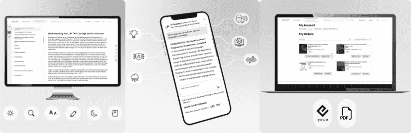

# 前言

当我最初考虑写这本书时，我的第一反应是：*不，不要又是另一本 AI 书！*

我见过很多这样的例子。有时，一个月内就有十几个。大多数可以分为两类：要么是只有 AI 人士或数据科学家才能真正欣赏的高度技术性的深入研究，要么是让你兴奋（有时甚至害怕）但提供很少实际行动的浮夸的商业书籍。这两者都不符合我在咨询工作中每天遇到的人：渴望理解 AI 并将其付诸实践的企业领导者，但被炒作所压倒，努力使其成为现实。

这本书旨在填补这个空白。

在过去的五年里，我从事应用 AI 咨询工作，帮助各种规模的组织以有意义、实用的方式采用 AI。在此之前，我曾担任数据科学家，将机器学习模型投入生产是我日常工作的一部分——在 ChatGPT 使 AI 成为家喻户晓的术语之前很久。如今，我的关注点更少在于从头开始训练深度学习模型，而是更多地帮助企业在实际和盈利的方式中将可访问的 AI 技术应用于现实世界的问题。

当我提到**盈利**时，我是从管理角度说的——通过减少可避免的成本、增加吞吐量、减轻风险或在不向组织增加相应成本的情况下创造新的收入来扩大利润率。我不会带你进行折现现金流分析；相反，我们将使用简单的阈值、成本上限和快速估算，你可以将其应用到自己的财务中。目标是简单明了：实施 AI，使其出现在你的损益表上。

这本书以（希望）读者友好的方式提炼了我亲眼所见的第一手经验教训、模式和陷阱。我的工作带我进入了汽车和保险等行业的大型企业，有 500-1,000 名员工的中小企业，以及希望将产出翻倍的单打独斗的创业者，还有在意想不到的地方发现每月 10k+美元以上节省的小企业主。背景可能大相径庭，但 AI 成功和失败的根本模式却出奇地一致。

这里的大部分想法最初都是我在每周通讯中分享的短篇作品——今天有超过 10,000 名来自谷歌、亚马逊、古驰、洲际酒店、H&M、桑坦德和梅赛德斯-奔驰等公司的专业人士在阅读。你将在这些页面中找到扩展、精炼后的版本：你可以立即在你的业务中使用的框架、案例研究和策略。

这本书旨在帮助你理解 AI 对你业务的意义以及如何以清晰和自信的方式迈出下一步，以便你可以朝着**盈利的结果**前进。

**现在就开始。**

# 这本书面向谁

这本书是为那些希望以实用、可操作且与实际商业目标一致的方式理解 AI 的企业领导者、CTO、企业家、经理和专业人士而写的。

这本书尤其适合那些负责将 AI 推向他们组织的人——无论您是探索用例的部门负责人、负责构建路线图的转型负责人，还是面临将炒作转化为结果的执行压力的行政人员。

您不需要成为数据科学家就能从本书中受益。您需要的只是好奇心，愿意重新思考工作如何完成，以及连接战略与执行的驱动力。如果您曾经感到夹在技术术语的一边和空洞的术语的另一边——这本书是为您写的。

如果您在寻找一本编码手册或深入探讨算法的书籍，这不是那本书。已经有许多其他书籍在这方面做得很好。

# 本书涵盖的内容

*第一章，理解 AI 革命*，揭穿炒作，展示 AI 在企业中的实际应用情况，以及为什么许多项目会陷入停滞。

*第二章**，理解现代 AI*，将今天的 AI 技术分解为简单、与业务相关的概念，您可以实际使用。

*第三章**，成功采用 AI 的方法*，探讨了采用 AI 而不陷入模仿硅谷的陷阱的验证策略。

*第四章**，开始您的 AI 之旅*，教您如何识别痛点瓶颈，以及谁应该拥有 AI 路线图。

*第五章**，在流程和产品中寻找 AI 机会*，带您了解如何在您的业务中映射 AI 能力。

*第六章**，设计 AI 用例*，为您提供设计、评估和比较 AI 项目在投入资源之前的结构化框架。

*第七章**，构建您的 AI 路线图*，帮助您将一堆用例转化为优先级路线图，找到协同效应，并使不同的利益相关者围绕共同的方向达成一致。

*第八章**，为成功进行原型设计*，向您展示如何快速测试想法，避免原型炼狱，并平衡制造与购买的决定。

*第九章**，扩展 AI 驱动的系统和流程*，探讨了如何成功地将原型过渡到生产。

*第十章**，利用您的 AI 工具包*，为您提供一套适合您需求的 AI 技术栈的实用指南，帮助您开始构建而不会感到不知所措。

# 为了充分利用本书

+   **您不需要从头到尾阅读它。** 虽然章节之间会交叉引用早期概念，但每个章节都是独立的。您可以自由地直接跳到与您当前位置相匹配的旅程部分——无论是识别机会、构建原型还是扩展。

+   **从您的背景出发**。如果您对商业中的 AI 是新手，第一部分为您提供了基础。如果您已经在进行试点项目，第二部分和第三部分将帮助您从实验过渡到规模化。

+   **与您现有的工具结合使用**。如果您的组织已经实施了框架或转型模型，请将我的视为补充性的现场笔记。混合、匹配和调整 - 价值在于使其为您所用。

+   **把它当作一本操作手册，而不是理论书籍**。不要只是阅读框架和清单 - 选择一个，本周尝试一下。与您的团队一起测试它，从发生的事情中学习，然后回来获取更多信息。进步来自小而重复的行动 - 而不是等到一切都完美无缺的计划（您将在本书中看到这个主题）。

## 下载资源文件

本书资源文件托管在 GitHub 上，网址为 [`github.com/PacktPublishing/The-Profitable-AI-Advantage`](https://github.com/PacktPublishing/The-Profitable-AI-Advantage)。我们还有其他来自我们丰富图书和视频目录的代码包，可在 [`github.com/PacktPublishing`](https://github.com/PacktPublishing) 获取。查看它们！

## 下载彩色图像

我们还提供了一份包含本书中使用的截图/图表彩色图像的 PDF 文件。您可以从这里下载：[`packt.link/gbp/9781836205890`](https://packt.link/gbp/9781836205890)。

## 使用的约定

本书中使用了多种文本约定。

**粗体**：表示新术语、重要词汇或您在屏幕上看到的词汇。例如，菜单或对话框中的文字会像这样显示。例如：“为了了解人工智能对竞争动态的影响，让我们谈谈经典的**五力框架**。”

警告或重要注意事项如下所示。

小贴士和技巧如下所示。

# 联系我们

我们欢迎读者的反馈。

**一般反馈**：如果您对本书的任何方面有疑问或有任何一般性反馈，请通过电子邮件发送给我们 `customercare@packt.com`，并在邮件主题中提及本书的标题。

**勘误表**：尽管我们已经尽一切努力确保内容的准确性，但错误仍然可能发生。如果您在本书中发现了错误，我们将非常感谢您向我们报告。请访问 [`www.packt.com/submit-errata`](http://www.packt.com/submit-errata)，点击**提交勘误**，并填写表格。

**盗版**：如果您在互联网上以任何形式遇到我们作品的非法副本，我们将非常感谢您提供位置地址或网站名称。请通过电子邮件发送链接到 `copyright@packt.com` 与我们联系。

**如果您想成为作者**：如果您在某个领域有专业知识，并且您有兴趣撰写或为本书做出贡献，请访问 [`authors.packt.com/`](http://authors.packt.com/)。

# 保持关注

要了解生成式 AI 和 LLMs 领域的最新发展，请订阅我们的每周通讯，AI_Distilled，[`packt.link/8Oz6Y`](https://packt.link/8Oz6Y)。

# 加入我们的 Discord 和 Reddit 社区

对书籍有疑问或想参与关于生成式 AI 和 LLMs 的讨论？

加入我们的 Discord 服务器[`packt.link/4Bbd9`](https://packt.link/4Bbd9)和 Reddit 频道[`packt.link/wcYOQ`](https://packt.link/wcYOQ)，以连接、分享和与志同道合的爱好者合作。

 

# 您的书籍附带独家优惠 - 这是如何解锁它们的方法

|

#### 现在解锁这本书的独家优惠

扫描此二维码或访问[`packtpub.com/unlock`](https://packtpub.com/unlock)，然后按名称搜索此书。确保是正确的版本。 |  |

| **注意**：在开始之前，请准备好您的购买发票。* |
| --- |

使用我们的下一代 Reader 增强阅读体验：

 **多设备进度同步**：在任何设备上无缝同步进度进行学习。

 **高亮和笔记**：将您的阅读转化为持久的知识。

 **书签功能**：随时回顾您最重要的学习内容。

 **深色模式**：通过切换到深色或棕褐色模式，以最小的眼部疲劳来集中注意力。

使用我们的 AI 助手（测试版）更智能地学习：

 **总结内容**：总结关键部分或整章内容。

 **AI 代码解释器**：在下一代 Packt Reader 中，点击每个代码块上方的**解释**按钮，获取 AI 驱动的代码解释。

**注意**：AI 助手是下一代 Packt Reader 的一部分，目前处于测试阶段。

任何时间、任何地点学习：

使用无 DRM 的 PDF 和 ePub 版本访问您的离线内容——与您喜欢的电子阅读器兼容。

# 解锁您书籍的独家优惠

您的这本书附带以下独家优惠：

 下一代 Packt Reader

 AI 助手（测试版）

 无 DRM PDF/ePub 下载

如果您尚未解锁，请使用以下指南进行解锁。此过程只需几分钟，并且只需进行一次。

# 如何通过三个简单步骤解锁这些优惠

## 第 1 步

请将此书的购买发票准备好，因为在*步骤 3*中你需要用到它。如果你收到了实物发票，请用手机扫描它，并准备好作为 PDF、JPG 或 PNG 格式的文件。

如需更多帮助查找发票，请访问[`www.packtpub.com/unlock-benefits/help`](https://www.packtpub.com/unlock-benefits/help)。

**注意**：你是直接从 Packt 购买这本书的吗？你不需要发票。完成步骤 2 后，你可以直接跳转到你的专属内容。

|

## 步骤 2

扫描此二维码或访问[`packtpub.com/unlock`](https://packtpub.com/unlock)。 |  |

| 在打开的页面（如果你在桌面电脑上，看起来会与图 1 相似），通过书名搜索这本书。确保你选择了正确的版本。图 1：桌面上的 Packt 解锁着陆页面 |
| --- |

## 步骤 3

登录你的 Packt 账户或免费创建一个新账户。登录后，上传你的发票。它可以以 PDF、PNG 或 JPG 格式，且大小不能超过 10 MB。按照屏幕上的其余说明完成此过程。

|

## 需要帮助？

如果你遇到困难需要帮助，请访问[`www.packtpub.com/unlock-benefits/help`](https://www.packtpub.com/unlock-benefits/help)获取有关如何查找发票的详细 FAQ 以及更多信息。以下二维码将直接带你去帮助页面： |  |

**注意**：如果你仍然遇到问题，请联系[customercare@packt.com](https://customercare@packt.com)。

# 分享你的想法

读完*《盈利的 AI 优势》*后，我们很乐意听听你的想法！请点击此处直接进入此书的亚马逊评论页面并分享你的反馈。

你的评论对我们和科技社区都很重要，并将帮助我们确保我们提供高质量的内容。
