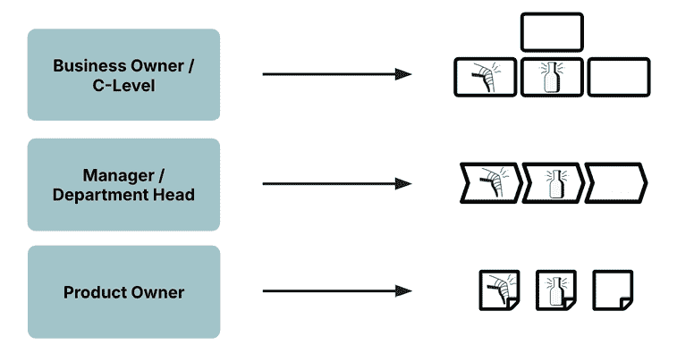
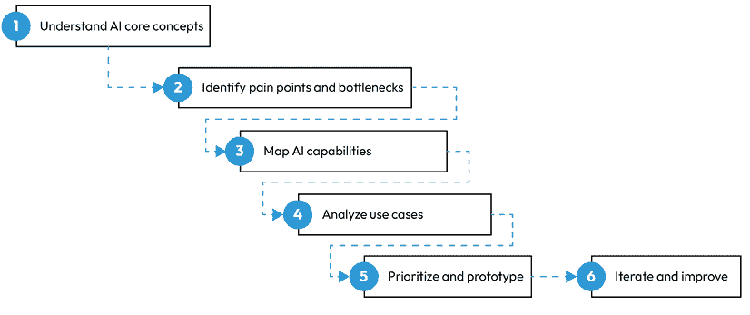
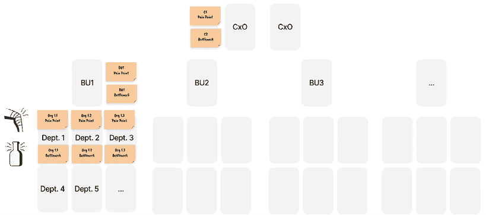
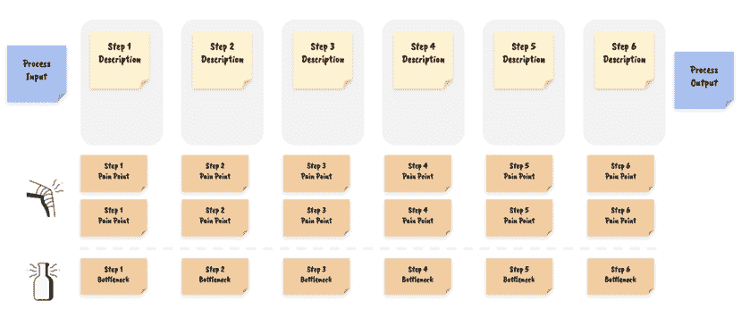
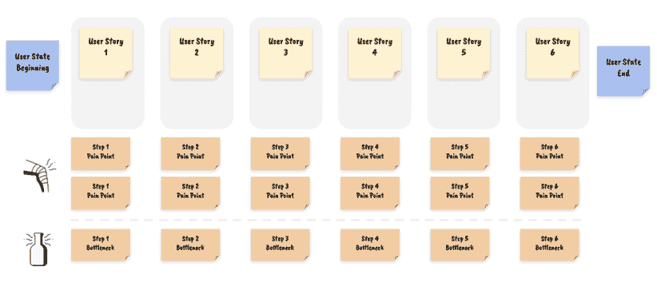
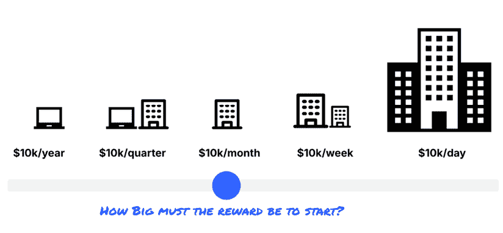

# 第四章：开始您的 AI 之旅

热点观点：您的 AI 之旅已经开始了。毕竟，您对 AI 的兴趣是您阅读这本书的原因。也许您已经尝试过像 ChatGPT 这样的工具，或者以其他形式与 AI 互动，激发您了解更多的好奇心。这种普遍的好奇心和可及性正是现代 AI 革命与 2010 年代早期 AI 和机器学习初期的区别。

现在，人工智能几乎无处不在——从您的智能手机到推动全球商业的供应链。因此，真正的问题不是是否开始您的 AI 之旅，而是您目前在这个旅程中的位置。

在本章中，我们将探讨以下主题：

+   为什么路线图很重要

+   人工智能应用中的常见陷阱

+   承担 AI 路线图的责任

+   AI 路线图流程概述

+   识别痛点与瓶颈：您的 AI 路线图的基础

+   寻找有利可图的 AI 项目的正确起点

+   实施价值过滤器

# 为什么路线图很重要

我合作过的多数组织往往处于他们的旅程中间。他们经常被提供承诺复杂 AI 解决方案的供应商接触。这些工具一开始可能看起来很令人印象深刻，但它们往往无法达到预期，导致失望，在许多情况下，AI 项目停滞在原型阶段。这就是当您的目标是分割并征服 AI，但您实际上在做的是选择性（机会主义）AI 时会发生的情况。这种冲突最终会形成一个挫败的循环，其中 AI 仍然是一个诱人的但难以捉摸的承诺，而不是一个变革性的现实。

因此，从清晰的**AI 路线图**开始至关重要。了解您在这个旅程中的位置——并知道何时前进或后退一步——是避免这些常见陷阱的关键。路线图将帮助您明确您从哪里开始，您想去哪里，以及您在通往那里的路上需要克服哪些障碍。最终，您的 AI 路线图确保 AI 倡议从一开始就与您的商业利益紧密相连。

没有路线图，很容易迷失在炒作中，投资错误工具，或设定不切实际的期望。路线图提供了清晰性和方向，帮助您专注于真正重要的事情：解决您的业务挑战和推动业务成果。

本章旨在帮助您构建这个路线图。它将为以结构化方式处理 AI 解决方案奠定基础，引导您将 AI 融入公司流程的过程。最重要的是，它将帮助您确定起点，识别 AI 在您的业务中可以产生最大影响的领域。本书的其余部分将基于这里介绍的阶段，所以无论何时您感到不确定，您都可以参考这个路线图并重新评估您的位置以及您是否走在正确的道路上。

## 人工智能应用中的常见陷阱

在没有明确计划的情况下跳入人工智能可能会导致一些常见的陷阱。最大的错误之一是对供应商过度依赖。外部供应商可以提供有价值的工具和专业知识，但他们的解决方案通常是通用的——设计来满足广泛受众的需求，而不是针对你具体的业务挑战。这可能会导致原型无法扩展为实际实施，最终成本高于价值。

另一个挑战是设定不切实际的期望。人工智能可能令人兴奋，很容易假设它将带来快速、简单的胜利。但现实中，人工智能项目通常需要大量的时间、资源，甚至是在原型阶段之后，你组织内部的文化变革。如果不理解这些需求，当人工智能没有立即带来你期望的结果时，你可能会感到失望。

将人工智能集成到现有系统中是另一个主要障碍。人工智能需要与你的当前流程、数据流和组织结构无缝工作。如果你没有考虑到这一点，你可能会遇到中断、低效，甚至项目失败。一家公司可能在一个由人工智能驱动的客户服务工具上投入了大量资金，结果却发现它与现有的 CRM 系统无法很好地集成，导致团队感到沮丧，无法接受。

最后，还有忽视人的因素的陷阱。人工智能可以帮助你加快任务或提供更高品质的输出，但最终决定其成功的是你组织中的员工。如果你的团队不支持，或者他们不理解人工智能如何融入他们的日常工作，你的人工智能项目很可能会失败。

通过确保业务目标和技术能力之间的适当对齐，嵌入到务实的 AI 治理框架中，这些是 AI 路线图的核心组成部分，所有这些陷阱都可以避免。

# 掌握人工智能路线图

人工智能通常被视为数据科学家、IT 专家和技术型创新者的领域。虽然这些专家对于人工智能的技术方面至关重要，但推动人工智能项目的真正责任应该落在整个组织的商业领导者肩上。原因如下：人工智能不仅仅是另一款可以安装并期望顺利运行的软件。它是一种变革性技术，有可能彻底改变你的业务运营方式。这项技术的用例必须来自你——商业领导者。

想象一下，就像试图在没有蓝图的情况下建造摩天大楼。即使你拥有世界上最好的工程师和建筑工人，但没有明确的计划，结果最多是混乱，最坏的情况则是灾难性。对于人工智能也是如此。你的组织可能拥有有才华的数据科学家和 IT 专业人士，但如果没有清晰的愿景和战略方向，你的人工智能项目很容易偏离目标。

## 为什么领导力很重要

作为一位商业领导者，你的任务是定义这个愿景。你比任何人都更了解你公司的目标、市场定位和竞争格局。你知道业务需要走向何方，而且你需要引导人工智能项目朝这个方向前进。是的，你将依赖专家来导航技术方面，但路线图应该由你的业务需求驱动，而不仅仅是技术可能性的驱动。

将人工智能引入你的组织通常需要一种文化转变，就像指挥家可能向一个交响乐团介绍一首新音乐一样。这种转变可能会遇到阻力，因为人们可能对变化持谨慎态度或不确定人工智能将如何影响他们的角色。作为领导者，你的责任是倡导这种变革，解决担忧，并培养实验和学习的文化。记住，你的参与不仅有益，而且是必不可少的。当人工智能项目由理解公司战略目标的商业领导者推动时，它们更有可能成功。积极参与人工智能采用的领导者不仅指导战略方向，也为围绕人工智能的组织文化定下了基调。

既然我们已经确定了为什么掌握人工智能路线图至关重要，让我们来看看这个过程实际上是什么样子。接下来的部分将指导你构建一个符合你的业务目标、利用你团队的优势，并在你的人工智能之旅中为你设定长期成功的实际可行的路线图。

## 人工智能路线图过程概述

以下构建人工智能路线图的高级框架来源于我在人工智能领域多年的咨询经验。它对小型和大型公司都取得了成功，并且整个过程始终如一。不过，不同的地方在于你开始的地方。根据你的人工智能采用策略和当前情况，它可以是以下三个起点之一：

+   **基于流程的**：你从流程的角度看待这个路线图，通常由部门领导或业务单元负责人驱动。这与机会主义人工智能方法非常契合。

+   **基于产品的**：这关注的是用户旅程而不是流程步骤。你的目标是通过对现有产品进行新（或改进）的人工智能增强功能来改进它。这映射到产品主导的人工智能方法。

+   **基于组织的**：当你把你的 C 级管理人员召集到一起，开始思考人工智能的机会，然后从组织视角开始制定这个路线图是一个好的起点。这通常涉及查看你的组织结构图，然后在超级高级别上收集机会领域。从那里，你通常需要进入基于流程或基于产品的深入挖掘，以具体化你的用例。

这种方法适用于通过分而治之或登月计划方法来接近人工智能。

图 4.1：人工智能路线图过程入口点

如果你现在觉得完全不明白，不要担心。一旦我们详细地通过路线图框架，一切都会变得清晰。只需记住，关键步骤和里程碑将保持不变，但它们可能以不同的形式出现，细节的深度取决于你的起点。

因此，让我们逐一审视这些里程碑（*图 4.2*），以便你能了解涉及的内容。

图 4.2：人工智能路线图过程里程碑

+   **里程碑 1：理解人工智能核心概念**

在你能够有效地将人工智能整合到你的业务之前，建立一个共同的知识基础是非常重要的。否则，人工智能将始终是一个流行词汇，对不同的人意味着不同的事情，你将无法确定哪些是人工智能可能解决的潜在好问题，哪些不是。这涉及到对人工智能基础知识的理解——什么是人工智能，它是如何工作的，以及它可以用不同的方式应用。在*第二章*中，我们概述了这些基础知识，涵盖了 5 种人工智能模式和一些常见术语。你总是可以花更多的时间学习人工智能的核心概念，但当你制定路线图时，这样做会容易得多。

要开始，确保所有参与人工智能项目的人都共享这种基本理解。考虑组织研讨会或研讨会，确保每个人都站在同一起跑线上，并确保人工智能讨论基于共同的知识基础。

如果你想探索一些人工智能的核心概念，这里有一些可能帮助的资源：[人工智能元素](https://www.elementsofai.com)

+   [人工智能元素免费在线课程](https://www.elementsofai.com) ([人工智能入门](https://www.deeplearning.ai/courses/ai-for-everyone/))

+   [《人工智能入门》安德鲁·吴（免费课程）](https://www.deeplearning.ai/courses/ai-for-everyone/) ([博客文章](https://blog.tobiaszwingmann.com/p/demystifying-ai-practical-guide-key-terminology))

+   [人工智能概览：关键人工智能术语实用指南（博客文章）](https://blog.tobiaszwingmann.com/p/demystifying-ai-practical-guide-key-terminology)

+   **里程碑 2：识别业务痛点和瓶颈**

在打下坚实的基础之后，下一个里程碑是寻找你业务中的人工智能机会。这一阶段涉及识别具体的挑战——无论是当前的还是未来的——这些挑战足够大，甚至可以考虑作为人工智能增强。我们将使用本章后面的痛点瓶颈概念，通过$10K 阈值对这些挑战进行筛选。

+   **里程碑 3：将人工智能能力映射到业务需求**

一旦你确定了你的痛点瓶颈，下一个里程碑就是探索 AI 如何解决这些问题。这是你将业务需求映射到特定 AI 能力的地方。例如，如果你处理大量客户反馈是一个挑战，那么 AI 阅读技能，可以称之为 AI 阅读技能，可能是一个合适的匹配。如果你想预测电子商务销售，**监督式机器学习**（或为了简便起见的预测模式）可能是一个重要的探索能力。

达到这个里程碑是找到你的业务挑战和 AI 能力交汇的地方。这并不是追逐最新的 AI 趋势；而是识别能够带来实际结果的应用。我们将在*第五章*中进一步探讨这个领域。

+   **里程碑 4：定义和分析 AI 用例**

当你的业务需求和 AI 能力对齐后，下一个里程碑就是着手和构思具体的 AI 用例。这些用例概念帮助你将所有内容整合成一个路线图，并最终决定哪些项目要处理以及处理顺序。在这个阶段，你的想法开始成形，从广泛的想法转变为具有明确商业目标的特定、定义明确的计划，这些计划最终将成为你的第一个 AI 项目。*第六章*将全部致力于这一点。

+   **里程碑 5：优先考虑和原型化 AI 计划**

下一个里程碑是优先考虑和原型化你的 AI 计划。并非所有 AI 项目都会产生相同的影响或同样容易实施。根据它们潜在的影響力、可行性以及原型成本来优先考虑计划至关重要。达到这个里程碑是当你的策略开始转化为行动的时候。第*7*章和*8*章将充满这个阶段可操作的建议和策略。

+   **里程碑 6：迭代和扩展 AI 计划**

一旦你启动了你的第一个 AI 项目，最终的里程碑就是确保你准备好从失败中学习，并朝着明确的目标交付增量。采用 AI 不是一次性的努力；它是一个需要持续监控、改进和扩展的迭代过程。达到这个里程碑让你能够适应新信息，尝试新想法，并在整个组织中扩展成功的项目。第*9*章和*10*章将更深入地探讨这个关键阶段。

总体而言，你的 AI 路线图是 AI 计划从想法发展到试点项目再到业务战略组成部分的地方。它是一个活生生的文件，指导你的学习、适应和成长过程，确保你的 AI 努力随着时间的推移持续创造价值。

## 在每个步骤中，你作为业务领导者的角色

作为一位企业领导者，您在这个路线图的每个阶段都扮演着核心角色。您不仅仅是监督过程，您是积极引导它。您的参与确保了 AI 项目与业务目标保持一致，并且组织始终专注于创造真正的价值。

在早期阶段，您的角色是设定愿景并确定 AI 可以产生最大影响的地方。随着旅程的推进，您将做出关于哪些项目应优先考虑、如何分配资源以及何时扩大成功项目的战略决策。

在整个过程中，您的领导力对于培养一种实验、学习和持续改进的文化至关重要。

在您的组织中成为 AI 的可见倡导者。明确传达愿景，尽早涉及关键利益相关者，并确保每个人都了解 AI 如何融入更广泛的企业战略。

现在您已经对整体路线图有了清晰的了解，是时候深入探讨您 AI 策略的基础：识别您企业的痛点和瓶颈。

这正是您的 AI 之旅真正开始的地方。

# 识别痛点和瓶颈：您 AI 路线图的基础

为了确保 AI 通过解决实际问题来创造价值，您需要首先考虑您的 AI 路线图业务，而不是技术。如果没有问题需要解决，就没有必要使用 AI。如果您的客户支持可以轻松处理每个 incoming 查询，您可能不需要聊天机器人。如果您销售的是永续产品，您可能不需要良好的需求预测。因此，理解 AI 机会意味着理解您的业务需求。

这就是所谓的痛点与瓶颈概念发挥作用的地方。简单来说，这些是您的企业目前正在发生或未来可能发生的问题。

**痛点**是当前正在您企业内部造成摩擦的问题。这些问题可能来自您流程中的低效、成本的上升，或者客户的不满意。痛点通常是正在损害您业务的事情，而且通常非常明显——它们会出现在财务报告、客户反馈或运营指标中。

图 4.3：痛点：当前正在损害企业的业务问题

例如，想象一下你正在管理一个客户服务部门。如果你看到大量的客户投诉关于响应时间慢的问题，那就是一个痛点。这是正在对你的客户体验产生负面影响的事情，进而影响到你的业务。

**瓶颈**另一方面，是可能阻止你的业务在未来繁荣的约束或限制。它们现在可能不是重大问题，但如果置之不理，它们可能会成为扩展、创新或保持竞争优势的严重障碍。瓶颈通常代表潜在风险或错失的机会——它们是阻止未来增长的障碍。

图 4.4：瓶颈：限制你未来增长或竞争力的难题

考虑一个简单、非 AI 的例子：如果你的公司计划拓展到新市场，但当前的生产线无法满足增加的需求，那么这就是一个瓶颈。这并不是今天的问题，但需要解决，以便你可以增长。虽然像这样的瓶颈在传统的、非技术性的工作流程中通常是明显的，但在数字和 AI 驱动的环境中，它们变得更加隐蔽和难以识别。在 AI 和数字流程的背景下，瓶颈通常隐藏在不太明显的地方。它们可能包括无法支持 AI 工具集成的过时 IT 基础设施，阻止信息有效流动的数据孤岛，甚至缺乏能够利用新技术的人才。这些数字瓶颈可能会无声地削弱公司创新、应对市场变化或有效扩展的能力。

# 寻找有利可图的 AI 项目的正确起点

痛点和瓶颈可以从流程、产品或组织层面进行分析。但在深入具体流程和方法以识别痛点和瓶颈之前，重要的是要认识到，这一旅程的起点将根据你在组织中的角色而有所不同。无论你是负责整个组织的 C 级高管，还是专注于特定业务部门的部门领导，你采取的揭露这些挑战的方法都将不同。了解你的位置和责任范围是有效导航 AI 路线图的关键。

因此，通常有两种情况可能发生。让我们逐一探索。

## 情景 1：针对 C 级领导者的组织级方法

如果你是一名高管，你的视角自然会扩展到整个组织。在这个阶段，你需要获得直升机般的视角，这通常意味着在组织结构图上映射主要痛点和瓶颈，如下面的图所示：

图 4.5：将痛点与瓶颈映射到组织结构图

这个组织概述是确定 AI 可以创造真正影响的基础——但它需要一个清晰的北极星来引导它。在扫描部门之前，确定你的顶级业务目标：目前最紧迫的挑战是什么？你需要削减成本、加速增长还是推出新的业务线？拥有这个北极星有助于将分析缩小到与该目标直接相关的痛点和瓶颈。

我看到的一些北极星例子包括：在不增加办公桌的情况下加倍产出，实现成本领先，或在未来六个月内推出新的业务线。一旦目标明确，召集你的领导团队，系统地评估组织，一个单位一个单位地，以确定哪里的不效率、延误或客户不满阻碍了向那个北极星的目标迈进。

但组织视角只是旅程的开始。它为你提供了所需的环境，并告知你应该采取的方法：机会 AI、产品主导、分而治之或月球计划。根据这一点，你的 AI 倡议将由不同的人推动：

+   **机会 AI 方法**：部门领导者负责他们控制范围内的 AI 倡议，专注于特定的流程改进。

+   **AI 分而治之方法**：AI**卓越中心**（**CoE**）协调组织内的 AI 工作，与业务单元紧密合作，确保一致性和资源效率。

+   **AI 月球计划方法**：月球计划通常由 C 级执行团队成员直接监督，并作为一个独立项目实施。

+   **产品主导 AI 方法**：产品负责人最终负责推动他们监督的产品中的 AI 创新。

## 情景 2：业务单元或部门领导者——专注于特定领域

如果你是一个业务单元或部门的领导者，你在识别痛点和瓶颈的方法将更加专注和具体，针对你的责任区域。与必须考虑整个组织的 C 级领导者不同，你的任务是深入到直接影响你部门绩效的流程或产品旅程中——理想情况下，作为一支深度参与日常运营的专家团队的一部分。

根据你的角色、职能和 AI 采用方法，你可以以流程或产品为基础进行这一探索。

### 基于流程的分析

对于部门经理来说，最简单的起点通常是基于流程的分析。这种方法涉及将你部门内的关键流程分解成一系列关键步骤。将一个流程分解为 5-6 个关键步骤，将给定的流程输入转化为所需的流程输出，已被证明是一种有效的抽象。

不要试图保持过于宏观，但也不要陷入细节中。

图 4.6：将痛点瓶颈映射到业务流程

例如，如果你管理一个销售部门，你可能将销售流程分解为如以下阶段：潜在客户生成、资格审核、培养和成交。通过检查每个阶段，你可以确定潜在客户可能在哪里流失，销售周期是否过长，或者与潜在客户的沟通是否可以改进。对于每个步骤，问问自己：

+   我们在哪里花费最多的资源？

+   我们在哪里体验最多的延误？

+   错误或不一致最常见的地方在哪里？

+   哪些步骤产生了最多的客户投诉或不满？

我们将在下面探讨更多寻找痛点和方法的方法。但首先，让我们看看如果我们关注的是产品而不是流程，这种分析会是什么样子。

### 基于产品的分析

如果你的部门是产品导向的，比如在产品管理或开发中，基于产品的分析可能更合适。这种方法涉及检查与你的产品相关的整个用户旅程，从初始意识到购买后的支持。通过绘制客户体验图，你可以识别出导致摩擦或不满意的痛点。

与基于流程的分析相比，设置看起来非常相似，唯一的区别是，你查看的是用户旅程中的步骤——通常用用户故事来描述，这些故事需要将用户从给定的起始状态移动到期望的结束状态。

图 4.7：在整个用户旅程中映射痛点和瓶颈

例如，如果你的产品是一个电子商务平台，你可能从客户登陆网站的那一刻开始，查看用户的整个旅程，包括浏览和选择，到结账和配送。客户在结账过程中是否流失？对产品描述是否感到困惑？配送时间是否不一致？这些都是潜在的难题区域，如果得到解决，可以显著提升客户体验并增加满意度和忠诚度。

在基于流程和基于产品的分析中，关键是全面和具体。你对痛点和瓶颈存在地点的理解越详细，你的 AI 解决方案就越有针对性和有效性。

在这个阶段，重要的是我们还没有讨论 AI 解决方案；只是在收集待解决的问题（是否适合 AI 将是下一步决定的内容）。

### 与组织战略协调

当你专注于你的部门或产品时，确保你的努力与更广泛的组织 AI 战略保持一致是很重要的。如果你的组织采用了机会主义 AI 方法，你的倡议应与其他部门协调，以确保一致性和资源共享。如果实施的是分而治之的方法，应与**AI CoE**紧密合作，利用他们的专业知识，并将你的项目与组织目标对齐。

对于以产品为主导的 AI 项目，您在推动创新和确保 AI 无缝集成到您负责的产品中的角色至关重要。与其他部门，如营销、工程和客户支持的合作是必不可少的，以确保 AI 解决方案有效并增强整体产品提供。

在所有情况下，与 C 级管理层和 AI CoE（如果适用）保持开放沟通将有助于确保您的努力有助于组织的整体 AI 路线图和战略目标。

现在我们已经确定了开始的地方和如何进行识别过程，是时候深入探讨痛点和瓶颈实际上是什么，以及您可以在组织内部找到它们的位置。

# 实施价值过滤器

识别 AI 项目成功中的痛点和瓶颈将帮助您实现 AI 在组织中的采用带来的有意义的影响。

您如何有效地识别痛点？以下是一系列您可以使用的技术，无论您是在寻找组织、流程或产品层面的痛点：

1.  **识别内部挫折**：识别痛点的最直接方法之一是询问您的员工。通过调查或访谈收集他们关于在日常工作遇到挫折或低效率的见解。通常，您的团队对阻碍他们发挥最大效能的障碍有敏锐的认识。例如，一项内部调查可能揭示您的销售团队花费大量时间手动将数据输入 CRM 系统，这阻止了他们与客户共度时光。

1.  **客户服务反馈**：您的客户也可以是关于您的痛点信息的有价值来源。分析客户投诉、询问和反馈，以了解您的产品或服务哪些方面导致了不满——无论是定性还是定量。这种外部视角可以突出一些可能在内部分布不均的问题。一些客户反馈是可以衡量的，例如您的电子邮件营销的打开率和点击率可以作为客户参与度的代理，而其他则需要更明确的调查和访谈。

1.  **工作流程分析**：仔细审视您现有的工作流程。任务在哪里重复、耗时或容易出错？绘制出您流程中的步骤，并确定延误或错误经常发生的地方。一个很好的例子是手动客户支持中提供的信息缺失或错误。您的客户服务代表和客户可能甚至都不会在意，因为他们*不知道自己不知道的东西*。但事实上，客户洞察需要由支持代表手动提取，这是一个巨大的隐藏痛点。

1.  **竞争分析**：看看你的竞争对手是如何解决类似问题的。如果他们在质量、速度或交付成本方面优于你，这可能是一个迹象，表明你正面临严重的痛点。例如，如果你看到你的竞争对手已经成功推出了个性化的营销活动，而你仍在使用通用的接触方式，这可能会凸显你营销策略中的痛点。定期进行竞争对手基准测试，以了解行业最佳实践和创新。

但这不仅仅是解决你今天的问题。你还需要考虑明天可能出现的挑战。这就是瓶颈的所在。

寻找限制未来增长的因素通常比寻找具体的痛点更难，原因与更多人购买阿司匹林而不是维生素相同。我们通常太忙于解决今天最紧迫的问题，而忘记了预测明天。这就是为什么从战略上考虑这个领域如此重要的原因。以下是一些开始的方法：

1.  **容量限制**：确定你的运营遇到天花板的领域——无论是数据处理能力、生产吞吐量还是服务更多客户的能力。随着业务增长，这些限制可能会成为重要的瓶颈。例如，一家金融机构可能会发现，其手动欺诈检测流程在今天是有效的，但随着交易量的增加，将难以扩展。

1.  **技能差距**：找出你的团队缺乏支持未来增长所需的技能。随着数字工具更多地融入业务运营，对某些技能的需求，如数据素养或特定于人工智能的知识，将会增加。现在识别和解决这些差距可以防止它们在未来成为瓶颈。例如，如果你的运营中没有人在理解人工智能，他们将如何有效地控制和监控由人工智能驱动的系统？

1.  **可扩展性问题**：评估今天运行良好的流程，但可能无法随着业务扩张而高效扩展。这可能包括从手动数据录入到高度依赖人工代理的客户服务流程。例如，一个 B2B 电子商务平台可能目前依赖于手动精选的推荐，但随着其产品目录的增长，这种方法将无法扩展。

1.  **创新阻碍因素**：有时，创新的愿望是存在的，但现有的技术或组织限制阻碍了前进。这些阻碍因素可能会阻止你推出可能推动增长的新产品、服务或商业模式。

通过识别这些瓶颈，你可以主动解决可能在未来减缓你业务发展的挑战。在许多情况下，人工智能可以在克服这些限制中发挥关键作用，帮助你保持灵活性和竞争力，随着你的增长。

# 筛选值得解决的问题：$10K 阈值框架

在识别了组织、流程或产品旅程中的痛点与瓶颈之后，你可能会得到一份相当长的问题清单。并非所有这些问题都值得你投入时间和注意力，尤其是在涉及人工智能的情况下。这就是**$10K 阈值**框架的用武之地——这是一个简单而强大的框架，我通过多年的咨询工作开发出来。

## 我们为什么需要一个价值过滤器？

在深入具体解决方案之前，你需要确定哪些问题是足够重要的，值得你关注。许多商业领袖犯了一个错误，就是关注那些看起来**最有趣**或他们个人认为**最令人烦恼**的问题。然而，尽管这使它们成为很好的候选人，但这并不一定是充分的理由。那么，你该怎么办？

当然，你可以尝试精确地测量或量化每个问题的详细影响。但这种方法不仅耗时很多，而且非常困难，因为并非每个问题都可以精确量化。我发现，与优先排序或衡量问题相比，**过滤**它们要容易得多。快速去除那些**太小**的问题，然后在接近解决方案空间时再优先考虑所有剩余的问题。

为了做到这一点，你需要从一个单一数字开始：你的**价值阈值**。

你的价值阈值定义了你在开始新的旅程之前想要看到的最低回报。

例如，如果我说**解决这个问题每年可以为你节省$35K**，你会这么做吗？你的答案取决于你的情况。如果你是一家小企业，那么可能会的——你会抓住这个机会。然而，如果你在一家大型企业工作，每年$35K 的影响可能甚至不值得你与同事讨论这个想法所花费的会议时间。

价值阈值还将帮助你确保每个人都保持一致。有些人需要** moonshots**（大胆的尝试）才能改变现有的流程中的任何问题，而其他人如果一点改进就能自给自足，就会感到满意。

在你开始任何解决方案之前，最好找出每个人需要跳过的最低障碍，否则，你会在太晚的时候才意识到这一点。

## $10K 阈值是如何工作的？

你如何设定这个阈值？我了解到，使用$10K 的倍数作为重复的阈值效果很好。$10K 不是一个随机的数字。在很多情况下，它代表了一个合理的人类劳动成本代理——大约相当于雇佣一个人一个月的费用，包括工资、福利和开销。进一步分解，这大约是每个工作日$500，每小时$60，或每分钟$1。

现在，你可以调整这个数字到一个时间框架，以适应你企业的规模和风险偏好。

图 4.8：$10K 阈值根据企业规模而定

选择每年 10K 美元的最小影响对于小型企业或那些不想参与复杂 AI 项目，只想通过实施短期内就能收回成本的低垂果实解决方案来快速看到回报率的大型企业来说将非常有效。

另一种极端情况——每天 10K 美元——大约相当于每年 360 万美元的影响，即使是对于大型企业来说也是显而易见的。同时，这通常会导致更复杂的解决方案（因为您正在考虑更大、更复杂的问题），而回报率变得难以实现。

无论您选择什么门槛，都要确保负责 AI 路线图过程的团队对他们的最低奖励有相同理解。

## 应用 10K 美元的门槛

一旦您为自己设定了 10K 美元的门槛，您就可以遍历所有列出的痛点和不畅，并问自己：

1.  **解决这个问题的收益至少能达到每年/季度/月/日 10K 美元的持续价值吗？**

这可能通过以下方式实现：

+   **收入增长**：它是否会创造新客户或增加至少价值 10K 美元的销售？

+   **成本降低**：它是否会消除浪费的劳动力、减少外包或防止价值 10K 美元以上的低效率？

+   **机会解锁**：移除这个问题是否会让您能够追求价值 10K 美元以上的新机会？

+   **风险缓解**：未能解决这个问题是否会至少造成 10K 美元的合规罚款、失去机会或竞争优势？

1.  **价值是否真正是持续性的？**一次性收益，无论大小，可能不足以证明持续资源投入的合理性，尤其是对于需要持续维护的 AI 系统。

1.  **解决方案是否可扩展？**随着您的业务增长，由这个 AI 解决方案产生的价值是否会成比例增长，还是会遇到天花板？例如，时间节省只有在转化为更高的吞吐量或利润率时才会影响您的损益表。

通过在流程早期应用这个过滤器，您可以快速消除那些虽然引人入胜，但无法提供足够价值以证明投资合理性的问题。这使您能够将资源集中在真正能推动您业务发展的具有高影响力的领域。

例如，一个帮助销售团队以 20%的速度更快响应询问的定制 AI 工具可能听起来很令人印象深刻。但如果这只能转化为每年额外 30K 美元的收入，它就低于每季度 10K 美元的门槛，不会得到优先考虑。相反，一个通过减少客户流失率 2%的 AI 解决方案，如果这 2%代表了重要的持续收入，可能会轻松超过每季度 10K 美元的门槛。

无论您设定什么门槛，关键是保持纪律，坚持应用它。这可以防止过于常见的问题，即仅仅为了 AI 而追求 AI，而不是为了真正的商业价值。

在路线图制定过程中继续前进时，这一初步筛选步骤确保你专注于值得解决的问题，为将它们与适当的技能匹配——包括相关的人工智能，以及避免仅仅为了人工智能而引入人工智能——在下一个里程碑中做好准备。

# 摘要

分析痛点和瓶颈使你能够直面你的 AI 战略。这是为未来一切对齐的最终基础。结合 10,000 美元的门槛，你确保你正在调查的问题实际上值得用人工智能来解决，并团结团队成员围绕同一目标。

在下一章中，我们将探讨如何将人工智能能力映射到这些痛点和瓶颈，以便我们可以开始开发特定的用例。

在你继续前进之前，花一点时间反思一下你现在所处的位置，以及你看到哪些痛点瓶颈。

记住，这是一个协作练习——召集你的团队，讨论，并确定最关键的挑战。如果你做对了，你将朝着成功使用人工智能创造有意义的商业价值迈出坚实的步伐。

在下一章中，我们将探讨一些现实世界的例子和实用方法，以揭示你组织内部的人工智能机会。我们将首先将人工智能能力映射到现有的流程中，以确定人工智能可以解决痛点并消除瓶颈的地方，帮助你更快、更好或更便宜地完成工作。

|

#### 现在解锁这本书的独家优惠

扫描此二维码或访问`packtpub.com/unlock`，然后按名称搜索此书。 |  |

| **注意**：在开始之前准备好你的购买发票。* |
| --- |
