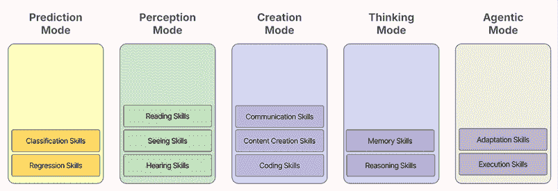
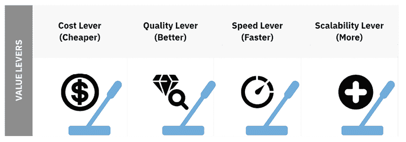

# 第五章：在流程和产品中寻找人工智能机会

你在人工智能之旅上已经迈出了重要的一步。你已经建立了人工智能的基础知识，绘制出了你业务的痛点瓶颈，并开始思考人工智能如何融入你的整体战略。但现在，这个过程的关键部分来了——识别那些人工智能能够真正产生影响的特定机会。这正是“真刀真枪”的时候。

事实上，并不是你业务中的每一个问题都适合人工智能。实际上，试图将人工智能强加在不属于它的环境中可能会导致资源浪费、挫败感，最终甚至失败。那么，如何找到那些甜蜜点，那些人工智能真正能够发光发热并提供实际价值的地方呢？答案在于将人工智能的能力与你的业务流程和产品相匹配。

在本章中，我们将系统地介绍如何识别人工智能机会。我们将首先探讨如何将人工智能能力映射到现有的流程中，突出人工智能可以解决特定痛点或消除瓶颈的区域。但我们不会就此止步。我们还将探讨如何通过增强用户体验和改善客户体验来将这种方法应用于你的产品。

到本章结束时，你不仅会对人工智能在你组织中的实施有更深入的了解，而且还会理解如何以战略思维来处理这个过程。我们将通过一些实例来展示这些概念的实际应用，帮助你看到你可以采取的实用步骤来识别适合你业务的人工智能机会。

本章将涵盖以下主题：

+   理解映射人工智能能力的过程

+   示例 1：在 RFP 响应过程中寻找人工智能机会

+   示例 2：在潜在客户生成和资格认证中的人工智能机会

+   示例 3：利用人工智能增强产品用户体验

+   识别人工智能机会的实用技巧

+   有效的流程增强

让我们卷起袖子，开始识别那些能够将你的业务提升到下一个水平的人工智能机会。

# 理解映射人工智能能力的过程

当涉及到识别人工智能机会时，最有效的方法之一是将人工智能能力直接映射到你的业务流程和产品中。一开始这可能听起来有些抽象，但实际上，它真的是采取一步一步的方法来理解人工智能可以增加价值的地方。无论你是查看内部流程还是面向客户的产品，目标都是一样的：找到那些人工智能可以解决问题、提高效率或改善客户体验的区域。

让我们一步步来分析。

## 将人工智能映射到业务流程

首先，让我们谈谈业务流程。每个组织都有——无论是处理客户咨询、销售团队如何筛选潜在客户，还是如何管理供应链物流。这些流程通常涉及多个步骤，在每一步中可能存在低效、瓶颈或改进的机会。这就是 AI 可以介入的地方。

那么，您如何找到一个好的起点呢？这取决于您的做法。

在一个机会主义场景中，您可以从任何当前相关的事物开始——比如您负责的流程。在分而治之的方法中，切入点与一个北极星（目标）相联系，流程的选择是故意为之，因为它们阻碍了向该目标迈进。从那里开始，无需担心范围界定，只需使用上一章中提到的痛点和方法，找出任何痛苦、低效或限制性的问题。

接下来，应用您的$10K 阈值。为了回顾：这是一个问题必须提供的最低持续价值（每月、每季度等），以证明进一步探索的合理性。不符合该标准的问题将被筛选出去。明显超过该标准的问题将被保留——这时您就需要聚焦于它们。

如果一个问题看起来很大——多次超过您的阈值——您不想将其视为一个单一的巨石。相反，将其分解为一个包含 5-6 个有意义的子步骤的子流程。然后，在这个更详细的层面上映射问题，并重新应用$10K 过滤器。您重复这个循环——映射→过滤→聚焦→重复——直到达到以下任一条件：

+   $10K 问题在 5-6 个步骤中**合理分布**。

+   进一步分解会稀释其价值，低于您的阈值。

这种方法使您的 AI 探索保持专注、可操作，并基于业务影响。它确保您始终在解决真正值得解决的问题。

让我们快速通过一个例子来了解一下。

我们假设我们的$10K 阈值被定义为每季度至少$10K 的影响。如果解决问题不会带来该金额，那么现在它不值得我们关注。

假设您已经选择了客户支持工单流程。您将其分解为以下关键步骤：

1.  **提交工单**：客户提交支持请求。

1.  **分类**：根据问题类型对工单进行分类。

1.  **分配任务**：工单被分配给适当的团队成员。

1.  **解决**：问题得到解决，工单被关闭。

1.  **跟进**：联系客户以确保满意度。

在设置好您的$10K 阈值后，您现在需要寻找每个步骤中存在的问题，如果解决了这些问题，它们将满足或超过该价值。

假设你发现人类代理通常花费大量时间在分类工单和确定正确的联系人来分配工单上。深入分析这个过程，你估计每个代理平均每周花费大约 2 小时手动分配工单。有 15 个代理都面临着同样的挑战，所以每周就是 30 小时。如果每小时的工作成本为 30 美元，那么每周的成本大约是 900 美元，换算成每月影响约为 3600 美元，每季度约为 10000 美元。因此，这个问题有很大可能正好在我们的阈值之上，并得到优先处理。然而，记住，10K 的阈值并不是用来衡量问题的大小，而是衡量解决这个问题的影响。简单来说：如果我们能够每天给人类代理节省这 2 小时，他们会用这些时间做什么？

如果这 2 小时立即被现有的工单积压所吸收，那么影响将直接体现在更快的响应时间、更高的客户满意度和潜在的更低流失率或更高的收入保留。如果运营正在扩展，工单量在增长，那么释放出的容量可以防止需要雇佣额外的代理，这代表了一种非常实际的成本避免。另一方面，如果工作量稳定，代理只是简单地拥有更多的空闲时间，那么企业将不会实现我们计算出的财务收益，因为那些小时并没有被重新投资到生产性工作中。换句话说，解决问题的价值仅在于恢复时间的下游使用——无论是减少积压、在不增加新雇佣的情况下处理增长，还是将容量重新分配到更高价值的活动。

一旦你完成了前面的高级客户支持流程，并识别出几个这些 10K+的问题，那就是引入 AI 的信号。

现在重新审视**带有核心技能的五种 AI 模式**（见图 5.1）。问问自己：*哪些技能领域可能适用于这个问题？*

例如：

+   “AI 可以通过学习过去的案例来帮助分类工单。”

+   “AI 可以起草初步回应，节省支持代表的时间。”

这些技能来源于分类、阅读、沟通甚至推理等方面，具体取决于情境。（现在也是打开 AI 技能图谱([`github.com/PacktPublishing/The-Profitable-AI-Advantage/blob/main/ch02/AI_Skills.xlsx`](https://github.com/PacktPublishing/The-Profitable-AI-Advantage/blob/main/ch02/AI_Skills.xlsx))的好时机，以便快速查找信号动词。）

图 5.1：带核心技能的 AI 模式

**快速提示**：需要查看此图像的高分辨率版本？请使用下一代 Packt Reader 打开此书或在其 PDF/ePub 副本中查看。

**下一代 Packt Reader**随本书免费赠送。扫描二维码或访问[packtpub.com/unlock](https://packtpub.com/unlock)，然后使用搜索栏通过名称查找此书。请仔细检查显示的版本，以确保您获得正确的版本。

如果您发现了一个匹配的技能，请确保它也关联到一个或多个**AI 价值杠杆**（见图 5.2）：

+   AI 能否帮助以**更低**的成本完成任务？（成本）

+   AI 能否帮助做得**更好**？（质量）

+   AI 能否帮助做得**更快**？（速度）

+   AI 能否帮助以**更大**的规模完成它？（可扩展性）

如果它至少拉动了一个价值杠杆，并且是 10K+问题的解决方案，那么它就是一个强大的原型候选。

**提示**：您甚至可以使用 ChatGPT 运行这一部分。一旦您定义了您的痛点阈值，请让它建议使用五种模式和价值杠杆的 AI 应用。这是一个快速激发想法的方法。

如果现在这听起来对您来说仍然过于抽象，请不要担心！这只是为了给您一个概述。我们将在本章中一起探讨一些现实世界的例子。

图 5.2：AI 价值杠杆

虽然内部流程通常是一个好的切入点，但它们并不是唯一的。有时更好的视角是您的产品本身——从客户的角度来看。让我们看看。

## 将 AI 映射到产品

将 AI 能力映射到产品的工作方式与映射到流程的工作方式基本相同。但您不是在查看流程步骤，而是在查看用户旅程中的步骤，即用户与您的产品的互动。这些步骤中的每一个都代表了一个机会，要么让您的客户感到满意，要么如果处理不当，让他们感到沮丧。在这个旅程中的痛点瓶颈定义了您需要将注意力放在 AI 上的地方。记住——如果没有痛点或瓶颈，就没有必要使用 AI。这适用于基于产品和流程的映射。

例如，假设您正在开发一个移动应用。用户旅程可能包括以下内容：

1.  **入门**：用户注册并开始使用应用。

1.  **日常使用**：用户定期与该应用互动，利用其核心功能。

1.  **功能发现**：用户探索额外的功能。

1.  **客户支持**：用户遇到问题并寻求帮助。

1.  **反馈循环**：用户对其体验提供反馈。

通过将这些阶段的 AI 能力映射到痛点和不畅之处，你可以发现改善用户体验的方法——比如个性化的入职或更快的支持。然而，与内部工作流程不同，在美元中证明更好的体验的价值更难。明确你的目标：如果投资回报率是目标，应用$10K 过滤器，并将改进与转化或保留联系起来。如果你追求以产品为主导的 AI 采用并使差异化成为主要目标，你可能需要依赖更软的产品信号，如更高的 NPS 或参与度。无论如何，都要明确如何定义和衡量成功。

记住，这并不是一次性的练习。随着你的业务发展，你的产品和流程会发生变化，新的 AI 技术也会出现，你需要重新审视和细化你的流程图。这个过程是迭代的，这意味着你应该准备好在收集更多洞察和数据时进行调整。

在接下来的部分中，我们将深入探讨三个具体的例子，以展示这个映射过程在实际中的应用。当你仔细地将 AI 能力映射到你的流程和产品中时，你正在为显著的改进奠定基础——不仅在于效率和成本节约，还在于客户满意度和业务增长。

让我们将这次讨论映射到一个你可以实际遵循的框架中。这包括四个步骤：

1.  绘制业务流程图。

1.  识别痛点和不畅之处。

1.  应用$10K 阈值。

1.  将 AI 技能映射到相关流程中。

理解这一点最好的方式是看看一些例子。

那么，让我们从它们开始。

# 示例 1：在 RFP 响应过程中寻找 AI 机会

让我们从如何在一个特定的业务流程中识别 AI 机会的实例开始。假设我们是销售部门的负责人，并与我们的 AICoE（AI 能力中心）一起，我们将审查响应请求报价（RFP）的过程，因为我们已经将其识别为未来增长的一个大机会，有多个$10K 的机会。

应对 RFP（请求报价）是许多行业中的常见且通常复杂的任务，组织必须准备详细的提案以赢得新业务。

## 第 1 步：绘制业务流程图

第一步是将 RFP 响应过程分解为其关键阶段。对于许多企业来说，这个过程可能看起来像这样：

1.  **分析 RFP**：了解客户的需求和要求，并决定是否追求增加 AI 功能的机会。

1.  **组建团队**：聚集合适的人来参与 RFP 提案，包括主题专家、作家和审查员。

1.  **制定提案大纲和计划**：为提案制定路线图，概述关键部分，并为每个部分设定截止日期。

1.  **起草、定制和审查内容**：撰写提案内容，根据客户的具体需求进行定制，并审查其准确性和有效性。

1.  **最终确定格式、获得批准和提交**：确保提案格式良好，获得必要的批准，并按时提交提案。

1.  **跟进客户和内部总结**：提交后联系客户以解决任何问题，并进行内部审查以吸取经验教训。

通过梳理这些阶段，我们可以看到流程可能放缓的地方，错误可能发生的地方，或者提高效率的机会所在。这为识别具体的痛点奠定了基础。

## 第 2 步：识别痛点和瓶颈

接下来，我们确定流程每个阶段的痛点。这些是使 RFP 响应流程耗时、成本高昂或容易出错的问题。以下是一些常见的痛点：

+   **分析 RFP**：快速消化复杂的 RFP 困难，导致决策延迟。

+   **组建团队**：快速识别正确专家的挑战，导致瓶颈。

+   **制定提案大纲和计划**：不一致的规划流程可能导致提案中存在空白或错过截止日期。

+   **起草、定制和审查内容**：在确保符合所有要求的同时，努力撰写有说服力、定制化的内容，使其脱颖而出。

+   **最终确定格式、获得批准和提交**：格式问题和在获得必要批准方面的延误可能导致匆忙提交。

+   **跟进客户和内部总结**：缺乏对客户的系统跟进和无效的内部总结可能导致错失学习和改进的机会。

这些痛点代表了 AI 可能介入以优化流程的机会。

## 第 3 步：应用$10K 的门槛

为了使这个练习简单明了，让我们假设上述所有内容代表每年$10K 的最小机会。

例如，这包括以下内容：

1.  **分析 RFP**：更快地理解可以避免每年$10K+浪费在不合格的或误读的投标上。

1.  **组建团队**：更快地获取专家可以每年节省$10K+的瓶颈和提案质量损失。

1.  **制定提案大纲和计划**：更清晰的规划可以防止因重写和错过截止日期而造成的每年$10K+的损失。

1.  **起草、定制和审查内容**：更优质的内容每年可以额外赢得$10K+的奖励收入。

1.  **最终确定格式、获得批准和提交**：更顺畅的提交可以保护每年$10K+免受可避免的拒绝。

1.  **跟进客户和内部总结**：持续的跟进将

    通过这些，每年可以增加$10K+的交叉销售和未来胜利的机会。

## 第 4 步：将 AI 技能映射以优化流程

现在是激动人心的部分 - 将 AI 能力映射到 RFP 响应过程的特定阶段，以解决优先级较高的痛点。以下是 AI 可以如何应用：

1.  **分析 RFP**需要 AI 的感知模式快速阅读并从冗长的 RFP 文档中提取关键要求，帮助您的团队做出更快、更明智的通过/不通过决策。

1.  **组建团队**需要分类技能（预测模式），根据 RFP 的具体需求，在您的组织中分类和匹配最合适的专家，确保从一开始就涉及正确的人员。

1.  **制定提案大纲和计划**需要具有内容创作技能的创作模型，在分析类似过去的提案并提出既全面又符合客户期望的结构后生成提案大纲。

1.  **起草、定制和审查内容**将利用创作和思考模式：

    +   **创作模式（内容创作技能）**可以起草初步提案内容，然后由人类作家进行定制。

    +   **思考模式（推理技能）**可以分析和解释要求，确保所有强制性元素都得到处理，降低不合规的风险。

1.  最终确定格式、获得批准和提交将需要创作和代理模式：

    +   **创作模式（内容创作技能）**可以快速且准确地格式化提案，以满足所有指南。

    +   **代理模式（执行技能）**可以通过将文档路由到正确的人员并发送提醒以获得批准来自动化审批流程。

1.  **跟进客户和内部简报**将使用 AI 的创作和思考模式：

    +   **创作模式（沟通技巧）**可以起草后续电子邮件。

    +   **思考模式（推理技能）**可以在提交后总结客户互动。

如您所见，找到 AI 解决方案并不意味着将单个 AI 模式或能力应用于整个流程，而是通常多个 AI 模式协同工作，处理不同的部分或任务。每种模式都带来特定的技能，以解决您工作流程中的特定痛点。

这里有一个简单的表格，展示了这种映射：

| **RFP 流程阶段** | **痛点** | **AI 技能** |
| --- | --- | --- |
| 分析 RFP | 复杂 RFP 的消化困难 | 快速分析和提取关键要求的推理技能 |
| 组建团队 | 确定合适专家的挑战 | 匹配和推荐专家的分类技能 |
| 制定提案大纲和计划 | 计划过程不一致 | 起草内容的能力；合规分析的推理技能 |
| 起草、定制和审查内容 | 编写有说服力、定制的文案；合规 | 起草内容的内容创作技能；分析和解释要求的推理技能 |
| 完成格式化，获得批准 | 格式化问题，批准延迟 | 格式化内容创作的技巧；批准自动化的执行技巧 |
| 跟进和内部总结 | 跟进和总结无效 | 跟进电子邮件的沟通技巧；互动总结的推理技巧 |

表 5.1：RFP 流程的 AI 能力映射表

一旦将 AI 技能映射到 RFP 响应过程的各个阶段，我们就可以看到 AI 如何增加价值、简化任务并提高整体效率。这个例子还展示了 AI 如何拉动速度和质量杠杆，在您的 RFP 响应中给予您的业务竞争优势。

在下一个例子中，我们将应用同样的方法到线索生成和资格认证的过程，这是另一个非常适合 AI 驱动的改进领域。

# 示例 2：线索生成和资格认证中的 AI 机会

现在我们已经探讨了如何在 RFP 响应过程中识别 AI 机会，让我们将注意力转向另一个关键的业务流程：线索生成和资格认证。对于许多企业来说，这个过程是销售漏斗的生命线，推动新的机会和潜在收入。然而，它也是一个可能充满低效率、错失机会和有效扩展挑战的领域。让我们看看 AI 如何帮助。

## 第 1 步：映射业务流程

首先，让我们概述线索生成和资格认证过程中的关键阶段。这个过程通常涉及几个步骤，可能看起来像这样：

1.  **线索生成**：通过各种渠道（例如网站表单、社交媒体或活动）收集潜在客户的联系信息和相关数据。

1.  **线索细分**：根据某些标准对线索进行分类，例如行业、公司规模或对您的产品或服务的潜在兴趣。

1.  **线索评分**：根据每个线索的转化可能性为其分配分数，这有助于优先考虑销售努力。

1.  **线索培育**：通过有针对性的内容、电子邮件或电话与线索互动，将他们推向销售漏斗的更下游。

1.  **线索资格认证**：根据线索的参与程度和与目标客户档案的匹配度，确定线索是否准备好传递给销售团队。

每个这些阶段都为 AI 提供了通过自动化重复性任务、做出更好的决策以及提供可能被人类分析遗漏的见解来增强流程的机会。

## 第 2 步：识别痛点和瓶颈

接下来，我们需要确定线索生成和资格认证过程中的常见痛点。这些通常是导致流程缓慢、错失机会或造成低效率的挑战。一些典型的痛点包括以下内容：

+   **线索生成**：过时或不完整的联系信息，导致高退订率和低质量线索。

+   **线索细分**：效率低下或手动细分无法准确分组线索，导致营销努力目标不明确。

+   **线索评分**：难以预测哪些线索最有可能转化，导致在低质量线索上浪费了努力。

+   **线索培育**：耗时且不够个性化的跟进流程，无法有效地吸引线索。

+   **线索资格**：确定何时线索准备好销售的不一致标准，导致营销和销售团队之间的努力不一致。

这些痛点表明 AI 可以潜在地介入以优化流程并改善结果。

## 第 3 步：应用 10K 美元的阈值

让我们再次假设这里的所有步骤都符合每年 10K 美元的范畴，因此我们优先考虑所有问题以进行进一步探索：

+   **线索生成**：提高数据质量可以每年节省 10K 美元以上的时间，避免接近不良联系人。

+   **线索细分**：更好的线索分组可以解锁每年 10K 美元以上的额外活动收入。

+   **线索评分**：专注于正确的线索可以每年产生 10K 美元以上的更高转化价值。

+   **线索培育**：更强的参与度可以防止每年价值 10K 美元以上的机会流失。

+   **线索资格**：更清晰的准则可以避免每年 10K 美元以上的销售和营销努力浪费。

## 第 4 步：将 AI 技能映射以优化流程

在优先考虑痛点后，我们现在可以将 AI 能力映射到线索生成和资格的具体阶段，以解决这些挑战。以下是 AI 可能的应用方式：

1.  **线索生成**可以利用 AI 的预测模式：

    +   **具有分类技能的预测模式**可以*分类*和*标记*可能低质量的线索数据。

    +   **具有回归技能的预测模式**有助于*估计*新线索的预期客户终身价值（CLV）。

1.  **线索细分**可以采用**具有阅读技能的感知模式**来阅读和分析线索互动，例如电子邮件内容或社交媒体活动。这将能够根据行为、兴趣或参与度水平自动将线索分类到更精确的群体中。

1.  **线索评分**可以通过**具有回归技能的预测模式**达到最佳效果，该模式可以对每个线索的转化可能性进行评分和估计，帮助优先考虑最值得追求的线索。

1.  **线索培育**将需要**具有内容创作技能的创作模式**。此模式可以生成和草拟用于培育活动的个性化内容，例如根据线索的互动历史定制电子邮件或相关内容建议。

1.  **线索资格**将利用预测模式和思考模式：

    +   **具有分类技能的预测模式**可以分类线索参与度级别并自动确定何时线索符合转交给销售团队的标准，确保只有最合格的线索被移交。

    +   **具有推理技能的思维模式**可以分析和解释沟通模式，以识别表现出购买准备迹象的潜在客户，使销售团队能够专注于最有希望的机会。

这里是如何在表格中呈现这种映射的一个例子：

| **领先过程阶段** | **痛点** | **人工智能技能** |
| --- | --- | --- |
| 领先生成 | 过时/不完整的联系数据 | 数据质量标记的分类技能；缺失值估计的回归技能 |
| 领先细分 | 低效或手动细分 | 基于行为的细分分析阅读技能 |
| 领先评分 | 预测转化可能性困难 | 预测评分的回归技能 |
| 领先培养 | 耗时、非个性化的跟进 | 个性化自动跟进的内容创作技能 |
| 领先资格认定 | 销售准备不一致的标准 | 准备检测的分类技能和推理技能 |

表 5.2：领先过程的人工智能能力映射表

通过将人工智能能力映射到这些阶段，您可以了解人工智能如何简化领先生成和资格认定，使这些过程更加高效、可扩展和有效。这种方法不仅有助于生成高质量的潜在客户，还确保您的销售团队将精力集中在最有希望的机会上，从而提高转化率。

# 示例 3：使用人工智能增强产品用户体验

到目前为止，我们一直专注于在内部业务流程中识别人工智能机会。现在，让我们将注意力转向外部——人工智能如何通过改善用户体验和整体客户体验来提升您的产品。这种方法对于提供数字产品或服务的业务尤其有价值，因为用户体验可以决定产品的成功与否。

让我们探讨人工智能如何增强电子商务环境中客户旅程的特定方面——即产品搜索过程。这是客户体验中的一个关键接触点，因为它通常决定了访客是否会成为付费客户或因沮丧而离开您的网站。

## 第 1 步：映射产品搜索过程

在电子商务商店中，产品搜索过程通常涉及客户在寻找合适产品时经历的几个关键阶段。这些阶段可能包括以下内容：

1.  **搜索查询输入**：客户将搜索词输入搜索栏或上传他们正在寻找的产品的图片。

1.  **搜索结果显示**：系统返回与搜索查询或上传的图片匹配的产品列表。

1.  **过滤和排序**：客户使用过滤器（例如，价格、品牌或评分）和排序选项（例如，相关性或流行度）来细化搜索结果。

1.  **产品评估**：客户查看产品详情、图片和客户评价，以评估其适用性。

1.  **产品选择**：客户将产品添加到购物车或决定继续搜索。

这些步骤对于引导客户找到他们确切想要的东西至关重要，每个步骤都为 AI 提供了增强体验的机会，使其更加个性化、高效和令人满意。

## 第 2 步：识别用户痛点瓶颈

要确定 AI 可以产生差异的地方，我们首先需要了解客户在产品搜索过程中面临的常见痛点。以下是一些典型问题：

+   **搜索查询输入**：客户可能难以清楚地表达他们想要什么，导致模糊或不准确的搜索查询，返回不相关的结果。有些人甚至可能更喜欢通过上传图片而不是键入查询来搜索。

+   **搜索结果显示**：搜索引擎可能返回太多结果，使客户感到不知所措，或者太少，使他们因没有显示相关选项而感到沮丧。

+   **过滤和排序**：应用过滤器可能会很繁琐，而且客户在没有进行大量手动排序的情况下可能难以找到他们需要的精确产品。

+   **产品评估**：客户通常发现根据详细规格、评论和图像比较类似产品具有挑战性。

+   **产品选择**：如果客户不确定他们是否找到了最佳选项，可能会出现犹豫，导致购物车放弃或继续搜索。

这些痛点突出了可以通过 AI 改进的产品搜索体验的领域。

## 第 3 步：应用$10K 阈值

这里是如何看起来$10K 优先级排序的：

+   **搜索查询输入**：更清晰的查询将防止每年$10K 以上的销售额损失。

+   **搜索结果显示**：更相关的结果将捕获每年$10K 以上的收入，否则这些收入将因挫败感而损失。

+   **过滤和排序**：更简单的导航将通过帮助客户更快地找到产品，每年解锁$10K 以上的销售额。

+   **产品评估**：更好的比较将推动每年$10K 以上的更高转化率，来自自信的购买决策。

+   **产品选择**：减少犹豫将挽回每年$10K 以上的损失，否则这些损失将归因于购物车放弃。

## 第 4 步：将 AI 技能映射到增强产品搜索过程

让我们探讨如何将特定的 AI 技能应用于产品搜索过程的每个阶段，以解决这些痛点并创造更流畅的客户体验：

1.  **搜索查询输入**将利用感知模式：

    +   **感知模式（阅读技巧**）：AI 可以解释和理解客户查询，即使它们是模糊或复杂的。例如，如果客户键入“适合跑步的舒适鞋”，AI 可以解释意图并优先显示舒适度评分高的跑步鞋**。**

    +   **感知模式（视觉技能）**：AI 可以通过上传图像而不是输入查询来允许客户扫描和识别产品。例如，如果客户在照片中看到他们喜欢的夹克，他们可以上传该图像，AI 将识别商店中可用的类似夹克（结合**预测模式的分类技能**）。

    +   **预测模式（分类技能）**：AI 可以在客户输入或上传图像后立即建议和推荐智能自动建议，提供流行或相关的搜索术语以更有效地引导用户。这减少了输入产生不良结果的查询的可能性。

1.  **搜索结果显示**可以使用**预测模式（回归技能）**。AI 可以根据客户的浏览历史和过去购买等数据，根据客户偏好对搜索结果进行定制，从而根据每个客户的偏好对搜索结果进行排序。例如，如果客户经常购买环保产品，搜索引擎可以在结果中优先显示可持续选项。

1.  **过滤和排序**将采用思维模式和预测模式：

    +   **思维模式（推理技能）**：AI 可以根据客户的查询、行为或上传的图像来情境化客户行为，并基于客户的查询、行为或上传的图像推荐最相关的过滤器。例如，如果客户搜索“夏装”或上传一张图片，系统可能会自动建议“轻薄面料”或“无袖”等过滤器。

    +   **预测模式（分类或回归技能）**：AI 可以根据相关性等因素的组合对产品进行排序和优先排序，而不是依赖于基本的排序选项。

1.  **产品评估**将受益于思维和创造模式：

    +   **思维模式（推理技能）**：AI 可以总结和综合客户评价，提取关键主题和情感，以提供快速概述。这通过减少阅读数十条评论的需要来节省客户的时间。

    +   **创造模式（内容创作技能）**：AI 可以根据综合洞察力撰写摘要，该摘要根据用户真正关心的标准进行个性化。

1.  **产品** **选择**可以通过**预测模式（分类技能）**实现：根据客户的搜索行为、上传的图像和偏好，AI 根据类似客户的购物行为推荐替代品或互补产品。

下面是如何在表格中呈现这种映射：

| **产品搜索阶段** | **痛点** | **AI 技能** |
| --- | --- | --- |
| 搜索查询输入 | 模糊/不准确的搜索查询；偏好视觉搜索 | 更好的查询解释的阅读技能；图像上传的视觉技能；自动建议的分类技能 |
| 搜索结果显示 | 结果过多/过少；不相关选项 | 改进搜索结果排名的回归技能 |
| 过滤和排序 | 繁琐的过滤；难以找到精确匹配 | 推理技能以建议相关过滤器；分类技能根据用户偏好动态重新排序产品 |
| 产品评估 | 比较产品困难 | 推理技能用于评论分析；内容创作技能用于个性化摘要 |
| 产品选择 | 犹豫不决和购物车放弃 | 分类技能用于交叉促销和升级推荐 |

表 5.3：产品搜索过程的人工智能能力映射表

通过将人工智能能力映射到产品搜索过程的各个阶段，您可以在您的电子商务平台上显著提升客户体验。人工智能不仅使搜索更快，而且通过使其更加直观并与客户实际寻找的内容保持一致，使搜索变得更好。这导致更高的满意度、增加的转化率，最终使电子商务业务更加成功。

现在您已经看到了映射过程在实际中的应用，让我们退一步，回顾一些适用于所有用例的最佳实践，确保您能够有效地将这些策略应用于流程和产品。

# 识别人工智能机会的实用技巧

到现在为止，您已经看到了人工智能如何映射到业务流程和产品旅程中，以在效率、客户满意度和整体业务价值方面创造显著的改进。但为了有效地识别和利用您自己组织中的人工智能机会，遵循一些最佳实践是至关重要的。这些实践将有助于确保您的 AI 项目不仅构思良好，而且与您的更广泛业务目标保持一致：

1.  **将您的商业利益放在首位**。

第一步也是最重要的一步是将 AI 项目与您的整体业务目标对齐。人工智能绝不能仅仅为了实施而实施；它应该服务于一个明确的、推动业务向前发展的目的。无论您的目标是增加收入、提高客户满意度、简化运营还是创新产品提供，人工智能都应该是实现这些目标的一种手段。

**提示**：首先，明确界定您想要解决的业务问题或想要探索的机会。例如，如果您的目标是减少客户流失，人工智能不仅可用于预测处于风险中的客户，还可以触发针对性的保留策略。始终将您的 AI 项目与这些具体业务目标联系起来，以确保它们提供真正的价值。

1.  **跨部门协作**。

人工智能项目在跨职能合作时最成功。人工智能的影响通常跨越多个部门，因此涉及来自组织不同部分的利益相关者至关重要。创建包括技术成员（如 IT、数据科学和数据分析）以及与特定用例相关的非技术业务单元（如营销、销售、产品管理等）的跨职能团队。这些团队可以提供不同的视角，并确保人工智能项目既基于技术可行性，也满足业务需求。

例如，如果你打算在客户支持运营中实施人工智能，应涉及来自服务、IT 和营销部门的人员。支持部门可以提出最常见的问题点，IT 部门确保聊天机器人安全地与你的系统集成，营销部门确保聊天机器人无缝连接到你的网站，以便客户能够被引导到正确的资源。

1.  **迭代和改进**。

将这个阶段视为头脑风暴练习。快速完成映射过程，记下人工智能可能适合的地方以及它如何解决已识别的问题点。现在不必担心一切都完美无缺；目的是创建一个广泛的可能性的地图，你将在稍后深入探讨。这种方法确保你不会被分析所瘫痪，可以更有效地进行范围界定和优先级排序。

1.  **利用外部专业知识**。

这个阶段是引入已经解决过类似挑战的外部专业知识的好机会，提供你可能没有的专门知识或工具。

**提示：**考虑与人工智能顾问合作，参加以人工智能为重点的工作坊，或使用人工智能概念会议来启动你的项目。外部专家可以提供新的视角，介绍新的方法，并帮助你避免常见的陷阱。

1.  **确保人工智能的伦理使用**。

随着人工智能越来越多地融入业务流程和产品，考虑使用人工智能的伦理影响至关重要。虽然我们将在稍后更详细地探讨人工智能用例的伦理维度，但最好从开始就考虑伦理问题。这包括确保数据隐私，并让客户和利益相关者了解人工智能的使用情况。在你的组织中建立明确的伦理准则，用于人工智能的使用。

到现在为止，你已经确定了高价值问题，并将它们映射到人工智能能力和价值杠杆上。但接下来会发生什么？让我们来谈谈。

# 有效的流程增强

一个常见的本能是问，“人工智能能否完全自动化这个流程？”但这个问题并不总是最好的。在这个阶段，更有用的心态是：**我们如何将人工智能引入这个工作流程，至少拉动一个价值杠杆，以便我们跨越价值阈值**？

这就是自动化和**增强**之间的区别——一个我们将在下一章中进一步探讨的概念。与其将完全控制权交给 AI，有效的增强意味着以帮助人们更快、更好、更轻松地工作——或者实现手工劳动限制所阻挡的规模的方式，将 AI 编织到现有流程中。

以苹果的数学笔记([`support.apple.com/en-gb/guide/iphone/iph46efa613a/ios`](https://support.apple.com/en-gb/guide/iphone/iph46efa613a/ios))功能为例。它允许用户在 iPad 上手写方程式，立即识别输入，并提供实时结果或可视化——而不会打断流程。无需切换任何*AI 模式*。它只需工作即可。

这种体验并非偶然发生。它反映了一套被称为**TRICUS**（[`www.oreilly.com/library/view/augmented-analytics/9781098151713/ch05.html`](https://www.oreilly.com/library/view/augmented-analytics/9781098151713/ch05.html)）的原则，这些原则定义了有效的 AI 增强是什么样的：

+   **及时**：人工智能在恰当的时刻提供帮助。

+   **相关**：它与用户的意图或目标保持一致。

+   **有洞察力**：它提供有意义的、可操作的支持。

+   **可信**：输出结果值得信赖。

+   **不干扰**：它不会打断用户的流程。

+   **具体**：它针对手头的精确需求进行定制。

您无需重新设计整个流程就能从人工智能中受益。事实上，一些最佳结果来自于小规模的、有针对性的改进，这些改进消除了摩擦，而没有增加复杂性。当然，一旦您将人工智能引入到流程中，值得退一步思考是否更根本的重设计能够释放更大的价值。

当您进入测试和原型制作阶段时，这种心态将为您带来好处。在下一章中，我们将更深入地探讨如何确定您的 AI 用例范围，构建智能原型，并确保您的 AI 解决方案不仅技术上可靠，而且真正改善了人们的工作方式——并推动业务影响。

# 摘要

在您的业务中识别 AI 机会是一个涉及将 AI 模式和技能映射到您的业务目标、涉及合适的人员以及持续改进您的方法的战略过程。通过遵循这些最佳实践，您可以最大化您组织中 AI 的影响，将 AI 从一种流行语转变为推动业务成功的强大驱动力。

关键在于理解五种 AI 模式——预测、感知、创造、思考和代理——如何解决您流程和产品中值得解决的问题。无论您是使用分类技能来提高潜在客户评分，阅读技能来处理客户反馈，还是推理技能来综合复杂信息，关键是将这些技能与值得用 AI 解决的问题相匹配。

使用您的 10,000 美元门槛来关注高价值机会，并利用您的价值杠杆——成本、质量、速度和可扩展性——来界定 AI 将如何产生影响。

记住：AI 的力量往往不在于完全自动化，而在于深思熟虑的工作流程增强。在合适的时机将 AI 引入现有流程中，可以在不增加复杂性的情况下提高结果。

在您前进的过程中，请记住以下原则：从明确的目标开始，涉及跨职能团队，迭代您的倡议，在需要时寻求外部专业知识，关注快速胜利，并始终考虑您 AI 使用中的道德影响。

在下一章中，我们将探讨如何有效地范围界定、优先排序和规划 AI 用例——这样您就可以投资于能够带来真正投资回报率的项目。

|

#### 现在解锁本书的独家优惠

扫描此二维码或访问 [`packtpub.com/unlock`](https://packtpub.com/unlock)，然后通过书名搜索此书。 |  |

| **注意**：在开始之前准备好您的购买发票。* |
| --- |
