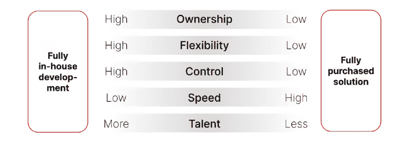
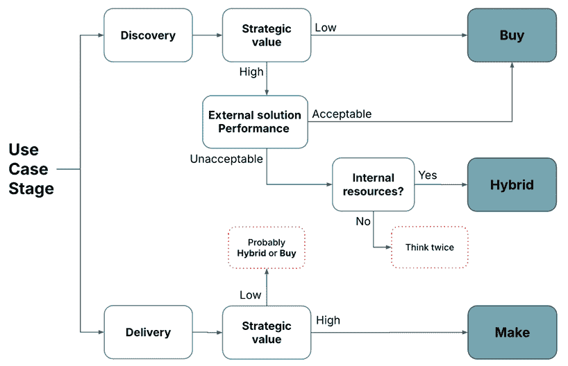
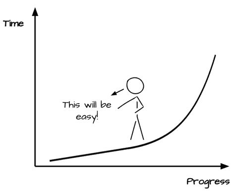
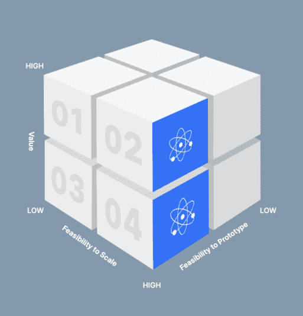
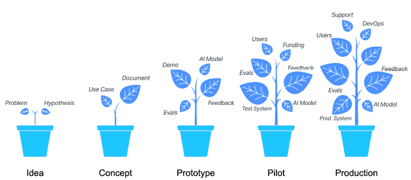
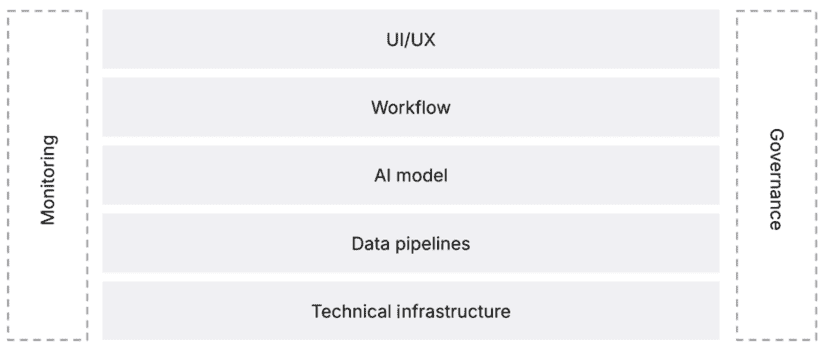

# 第八章：为成功进行原型设计

在上一章中，我们通过识别具有高影响力和可行性的用例，并将它们与更广泛的企业目标对齐，构建了我们的 AI 路线图。但仅仅拥有路线图并不能自动带来结果，尤其是在人工智能领域，不确定性和快速的技术变革可能会使规划变得复杂。

下一步是从规划阶段过渡到原型设计阶段。**原型设计**验证您的用例是否能够真正实现您所期望的价值。在本章中，我们将探讨原型设计的核心要素：决定您是想购买还是自制人工智能解决方案，在整个原型设计阶段有效地管理人工智能项目，以及评估原型以确保它们能够成功。

在本章中，我们将探讨以下主题：

+   自制与购买决策

+   管理人工智能项目

+   评估和迭代您的原型

+   开发您的原型

# 自制与购买决策

当您从想法过渡到原型时，首先出现的一个问题是：*我们应该在内部构建所有内容，还是购买现成的（或部分现成的）解决方案？* **自制**-

**自制与购买**问题很少是直接的，您的选择可能会在您的人工智能旅程的不同阶段发生变化。最好将其视为一个二元决策，而不是一个选项的连续体。

有选择要做：您是想在内部构建完整的解决方案，还是外包给外部供应商。让我们首先概述一下这些选项。

+   **完全自制**：您将所有工作都在内部完成，包括数据管道、模型开发、前端集成和持续维护。这个选项提供了最大的控制权，但也需要显著的技术专长、时间和资源。

+   **混合模式**：您可能使用预构建的机器学习平台或大型语言模型，但在内部开发特定的应用程序逻辑、集成和定制数据管道。这种方法可以在速度和灵活性之间取得平衡。

+   **完全购买**：在这种情况下，您购买或订阅现有的 AI 解决方案。供应商处理技术上的重活，您的内部团队专注于部署、变革管理和用户采用。如果供应商的解决方案符合您的需求，这可以加速价值实现的时间。

图 8.1：自制与购买决策的连续体

选择完全自制、完全购买或混合模式的决定取决于四个关键因素：

+   **用例阶段**：您可能需要根据您的想法所处的阶段重新审视这个决定。

    +   **探索**：在您的第一个原型或概念验证阶段，购买或许可现有解决方案通常更快、更便宜——尤其是如果您仍然处于*学习模式*。您希望快速测试、快速失败和迭代。

    +   **交付**：如果你的原型证明具有高战略价值，你可能会后来决定逐步内部化更多的解决方案，或者从头开始构建一个深度定制以满足你需求的全新版本。

+   **战略价值**：不同的产品带来不同的商业价值。例如，一些产品可能有助于提高生产力，而一些可能是宏伟的想法。因此，这个决策将由短期和长期业务目标驱动。

    +   **核心差异化**：如果你的整个商业战略的成功依赖于某个特定的 AI 用例——比如特斯拉这样的公司的自动驾驶——那么在内部投资构建这些能力通常是有意义的。

    +   **非核心但有用**：对于低影响或常规的 AI 任务（例如，生成基本的营销洞察），通常采用现有的工具比重新发明轮子更经济有效。

+   **外部解决方案性能**：对于许多用例，市场上可能已经存在现成的解决方案。如果引入供应商是一个可行的选项，你应该主要关注使用涵盖关键维度（如**功能性和性能**、**集成和技术兼容性**、**成本和商业**、**供应商信任和稳定性**以及提供的**支持和服务**）的供应商评分卡来评估可用的解决方案。考虑以下：

    +   **足够好与完美**：没有供应商的解决方案能够完美地满足你的需求。但有时，在*性能*维度上达到 70%–80%的准确度，仍然可能比之前的 60%要好。如果一个现成的产品能够达到这个“足够好”的门槛，你可能会选择购买它。

    +   **特殊需求**：如果你有超具体的需求、独特的数据或监管约束，你可能会发现供应商的解决方案不足——这可能会推动你更接近“制造”或“混合”方法。

+   **内部资源**：谁将真正负责构建和维护 AI 解决方案？这些不是一劳永逸的，但随着时间的推移需要持续的监控和发展——即使只是管理供应商许可证的人。你是否有可用的内部资源是一个关键决策标准。

    +   **数据、基础设施和人才**：即使一个用例很有价值，你可能也没有内部技能集或计算能力来构建和维护定制的 AI 解决方案。在这种情况下，购买或合作可以帮助你快速前进。

    +   **随着时间的推移而变化**：随着你的内部**AI 卓越中心（AI CoE）**的发展或成熟，你可能会将更多的 AI 生命周期内部化。今天你购买的，如果战略重要性增加——或者如果你内部的专长足够强大，你可能会决定以后自己构建。

下面的流程图有助于可视化“制造”或“购买”决策：

图 8.2：制造与购买流程图

在我们深入具体例子之前，先强调一下推动组织采取制造、购买或混合方法的一些典型情况是有用的。原型设计并非万能，正确的路径通常取决于你的组织环境：

+   **购买**：较小的组织或刚开始 AI 之旅的团队通常从购买现成解决方案中受益。例如，一家中型零售商可能会快速试点一个预构建的情感分析工具，以了解客户评价，而不需要雇佣数据科学家。这里的目的是速度、学习和最小化前期投资。

+   **制造**：拥有深厚技术专长的较大组织可能会将原型设计视为研发投资。一家全球汽车制造商或大型保险公司可能会为潜在的 AI 应用案例建立内部原型，这些案例最终可能对业务产生战略性的影响。即使早期版本粗糙，长期战略重要性使得内部拥有变得至关重要。

+   **混合**：大多数公司实际上处于中间地带。他们对于通用 AI 基础设施等事物高度依赖现成的解决方案，但最后一英里则是在内部构建。这可能包括集成层、用户体验或 AI 解决方案的监控框架。最终，这最后一英里是使他们的 AI 解决方案具有竞争力的关键。例如，一家媒体公司可能会从供应商那里获得大型语言模型许可，但会在其上构建自己的应用层，以帮助编辑写出更好的标题和文章摘要，同时不干扰编辑的工作流程并遵守公司的风格指南。这平衡了速度、定制和控制。

这些场景说明，原型设计不仅仅是关于测试可行性——它还涉及到在战略层面做出选择，即你希望你的用例落在何处——它是否应该设计为一个短期 ROI 倡议，需要迅速收回成本，或者是一个长期战略赌注（具有更多研发特征）。考虑到这个背景，让我们看看这个决策框架如何在实际中发挥作用。

## 一个实际例子

让我们回顾一下上一章中的 AI 路线图。假设你已经将 RFP 聊天机器人分析器作为优先事项，它将根据 RFP 文档为用户提供响应。接下来的问题是：你是构建还是购买？在这个阶段，你通常处于探索模式——我们将在下一章中更详细地探讨这个概念。简而言之，价值尚未得到验证。你确信这个用例可以增加价值，但你没有数据来证明这一点。因此，目前的目标是速度和学习：验证这个想法是否可行，而不需要投入大量资源。

我们已经将这个用例的范围界定在每年 10,000 美元的门槛上（*第五章*），这立即将其归类为战术性收益而非战略性收益——这正是我们将要从中进行原型设计的视角，同时确保对投资回报率（ROI）有明确的严谨性。

预期的每年 10K 美元的门槛基本上排除了任何内部招聘资源的手段。这就是为什么我们的首要行动项是迅速调查现有的 *与你的文档聊天* 供应商。一个供应商可能提供 14 天的免费试用。团队注册并使用有限的 RFP PDFs 来快速测试这个概念。或者，你选择一个你已经在内部使用的解决方案，比如 Microsoft Copilot，并测试系统是否能够足够准确地回答基本查询，从而变得有用。几周内，你就会知道这种方法是否显示出希望，它在哪些方面有困难（例如，合规性强的文档或 PDFs 中的图形），以及你的销售团队是否看到了真正的生产力提升。

快进：如果原型显示出影响，你准备切换到交付模式（更多内容请见 *第九章*），你将重新评估情况。如果你仍在寻找战术影响，你的交付方式可能意味着转向混合方法，通过定制添加（如定制数据集成层）来扩展现有供应商的能力。或者，你可以选择完全制造的方法，开发一个内部解决方案，以更好地控制数据安全和长期所有权，基本上是从头开始重建供应商之前提供的某些组件。后者在响应 RFPs 是核心业务活动时是有意义的。但如果 RFPs 只是众多销售流程之一，混合方法通常是更好的选择。如果供应商解决方案继续以可接受的成本和性能水平满足你的需求，你甚至可以保持纯购买策略以快速获得 ROI。

这个例子展示了同一个用例可以根据你的策略以及你是否仍在探索或已经扩展而采取不同的路径。我们将更深入地探讨这些概念——以及如何在 *第九章* 中无缝地过渡到各个阶段。

目前，让我们认识到，对于许多人工智能应用案例，尤其是在早期原型设计阶段，购买通常是 simplest 的途径，尤其是如果你的重点是生成 ROI 而不是进行大量的研发投资。稍后，对于真正区分你业务的少数关键用例，你可能会投资于构建。这种对 *制造与购买* 问题的动态方法将确保你将资源集中在回报最高的地方。作为一个经验法则：默认购买以快速验证 ROI；只有当用例证明对你的战略至关重要时，才转向制造。

由于你需要灵活适应动态的景观和发展，同时确保你不会在人工智能项目上陷入困境，反复无常，因此人工智能项目往往会变得难以控制。我们将在下一节讨论如何有效地管理人工智能项目。

# 管理人工智能项目

原型设计很少是一帆风顺的线性旅程。从概念验证到试点，你将遇到独特的挑战——不稳定的进度表、复杂的数据需求、不断变化的需求，以及性能的不确定性。

在传统的 IT 中，严格的项目计划可以很好地工作（有时）。但 AI 项目伴随着更高的不确定性。如果你的模型准确率达到 70%时，纯瀑布方法可能会阻碍适应性，或者新的数据发现需要转型。另一方面，没有业务对齐的纯敏捷方法可能导致永远无法进入生产的**原型炼狱**。

首先最重要的是**平衡结构和灵活性**。为此，你可以遵循以下步骤：

1.  **明确范围，然后拥抱迭代**：将你的 AI 项目分解成小而可管理的增量。确保问题陈述清晰明了：我们究竟想改进什么，以及为了谁？而不是一开始就计划好每一个细节，分配时间进行重复的实验周期（冲刺）。在每个周期结束后，回顾你的结果并做出调整。

1.  **组建一个混合团队**：AI 原型从数据工程师、数据科学家、领域专家、业务领导者和用户体验专家的混合中受益。回想一下第六章，框架如**负责、问责、咨询、知情**（**RACI**）可以帮助定义责任。如果你还有一个 AI CoE，他们可以与部门团队协调。如果你的内部能力不足，不要犹豫，引入自由职业者或咨询公司——尤其是在早期原型阶段。

1.  **在两个时间范围内规划-短期和中期**：保持每周或两周一次的冲刺，用于构建原型、分析数据和改进方法。专注于快速测试大的假设。在许多情况下，一个灵活的项目时间表，包括在 6 到 12 周后进行试点测试，效果相当好（作为一个经验法则）。如果试点成功，准备下一步行动（如果失败，制定退出计划）。

当你定义范围和规划项目时，你还需要警惕在实施 AI 项目时发生的常见错误。

## 常见的 AI 项目陷阱及其解决方法

在开始构建你的 AI 解决方案时，以下是最常见的陷阱，你应该避免：

+   **80%谬误**：许多 AI 项目一开始势头强劲，早期原型迅速达到相当不错的性能，给利益相关者留下了深刻印象，给人一种项目已经**完成了 80%**的感觉。这往往引发兴奋，给人一种项目几乎完成的感觉。然而，这种信念是误导性的。例如，达到 80%的准确率可能相对容易，但将性能提升到 95%往往要困难得多，耗时更长。实际上，这个最后的冲刺可能需要占总努力量的 80%，尽管它只占总性能范围的 15%。

以一个简单的例子来说明：如果你的目标是构建一个预测异常的 AI 模型，你可以简单地通过构建一个主要预测**无异常**的模型来达到高精度，这个模型将会有 99%的准确率，因为 99%的所有观察结果都不会是异常。然而，这个模型将毫无用处。虽然在这种情况下理解 80%的谬误很容易，但更复杂的 AI 解决方案也会陷入同样的原则。对于复杂的 AI 解决方案来说，模型做出一些**简单**的猜测很容易，但匹配细微差别却非常困难。

图 8.3：80%谬误可视化

很频繁地，从原型到可交付产品的性能提升既缓慢又复杂，因为它们需要严格的实验、处理无数边缘情况，以及微调以达到适用于现实生活输入的模型，而且收益并不保证。

为了解决这个问题，团队需要采取一种将早期成功视为起点的心态。真正的挑战和真正的价值在于填补性能上的最后差距。相应地规划和分配资源。

+   **忽视用户体验**：AI 团队深入构建技术复杂的模型，以至于他们失去了关注实际使用这些模型的人。结果？一个聪明但没有人理解、想要或知道如何使用的系统。你可能会得到一些在纸上看起来很令人印象深刻的东西，但无法产生任何实际影响。

这种情况的一个典型迹象是，一个模型在技术上准确，但与日常工作流程完全脱节。也许它提供了见解，但这些见解被隐藏在一个令人困惑的界面中。或者，也许它建议采取行动，但在没有人能够采取行动的时候。如果用户无法信任它或看不到它如何帮助他们，他们可能会完全避免使用它。

为了避免这种情况，从第一天开始就涉及最终用户至关重要。例如，如果你正在为销售团队构建一个 AI 工具，那么可以尽早向他们展示线框图或粗糙的演示。询问他们如何使用它，它在他们的日常工作中如何定位，以及什么会使它真正有用。准备好根据实际反馈调整界面、时间安排，甚至模型的行为了。将其视为与用户**一起**构建，而不是为用户**而**构建。拥抱增强 AI 系统的概念，这些系统能够支持人类决策，而不是试图完全取代它。

+   **成本和时间的螺旋上升**：最初是一个快速的两个月原型，往往变成六个月的漫长故事，耗尽预算，使团队疲惫不堪，并在整个团队中造成挫败感。这是 AI 项目中最常见的陷阱之一：低估了事情需要多长时间，以及未能认识到何时应该止损。

AI 项目本质上都是探索性的。你经常与混乱的数据、不确定的价值和不断变化的需求打交道。这就是为什么在项目中建立决策点或清晰的检查点至关重要，以评估项目是否仍然可行。模型是否达到了基线性能水平？它是否运行得足够快，足以有用？是否有明确的回报投资路径？如果对任何这些问题的回答是*尚未*，*那是可以的-但仅限于某个程度*。关于设定限制要有纪律性。如果一个用例在定义的时间或预算窗口内没有证明自己，那么暂停、转型或完全关闭它可能更明智。这样可以为那些正在工作的想法加倍投入资源，并向利益相关者表明，你的团队做出的是战略性的、数据驱动的决策，而不仅仅是沉没成本的承诺。

现在你已经准备好设置你的 AI 项目，我将分享一些启动的技巧。

## 项目设置的实际技巧

在过去十年中，无论是从内部还是 AI 咨询项目中构建机器学习和 AI 项目，我都积累了一些可以帮助你设置 AI 项目的策略。显然，具体细节可能需要根据你组织的规模和雄心水平进行调整，但在高层次上，它们将为你提供一些指导原则。

+   **寻找原子 AI 用例**：保持原型范围小-可以在短时间内测试的内容（例如，在四周内）。这确保了项目团队能够快速收集真实反馈，并迭代或继续前进。

图 8.4：原子 AI 用例

这里创建原子 AI 用例的想法是，除了影响和可行性（我们之前讨论过的维度，见*第六章*）之外，我们现在还关注第三个维度：测试或原型化解决方案有多容易。如果解决方案不能轻松原型化，那将是一个巨大的障碍。

我喜欢遵循 20-20 规则。原型应在 20 天内完成，成本不超过预期年度价值阈值的 20%。例如，如果你的阈值是每季度 10K 美元（即每年 40K 美元），那么 20%等于 8K 美元。如果一个原型需要更多的时间或预算，通常是一个迹象表明范围太大或商业案例太弱。当然，调整这些数字以适应你组织的规模和风险偏好，但始终将它们保持在较低端。

+   **采用混合项目管理风格**：在路线图阶段，你使用了一些*瀑布式*思维来概述时间表、预算和跨部门资源需求。然而，一旦开始原型设计，就需要切换到**敏捷**心态进行日常执行：

    +   **迭代冲刺**：规划 2-4 周的周期。每个冲刺的目标是交付一个可感知的改进（例如*一个可工作的数据摄取管道*或*模型 V2，将错误率降低 5%*）。

    +   **频繁测试**：使用真实或代表性的数据快速评估结果。你发现问题的越早，越好。

    +   **风险评估**：实施简短的风险检查点。如果你发现你的数据处理管道无法处理新的文件格式，或者你的供应商解决方案与你的企业安全要求不兼容，请立即解决。

    +   **利益相关者反馈**：让相关的业务负责人保持知情。他们可以确认原型是否满足真正的业务需求，或者你是否偏离了正确的方向。

+   **组建正确的团队**：大多数组织在专业的 AI 技能方面仍然存在差距——尤其是在那些由旧技术驱动的公司中。为了一个有效的 AI 原型，你需要一个**混合**团队：

    +   **AI 专家**：熟悉你选择的建模方法的数据科学家或机器学习工程师。

    +   **业务领域专家**：对实际问题了如指掌的人。他们会防止你陷入死胡同。

    +   **翻译人员**：那些既懂**数据**又懂**业务**的人。他们确保投资回报率始终放在首位，并且 AI 专家构建真正相关的东西。

    +   **IT/基础设施**：能够启动（或采购）环境、处理数据摄取并规划任何安全限制的人。

    +   **项目经理或团队领导**：协调任务、监控进度、组织冲刺，并确保利益相关者保持一致。

请记住，这些是角色，不一定是人。对于非常小的项目，只有 1-2 个人承担这些角色并不罕见，这可能一开始是可行的，但正如你所想象的那样，这种情况不会持续太久。

有效地管理 AI 项目意味着接受不确定性，优先考虑范围明确的原型，并创造一种文化，允许你快速调整——而不牺牲交付业务价值所需的架构和对齐。

下一个重要的行动项目是如何评估和演进你的原型，我们将在下一节讨论。

# 评估和迭代你的原型

一旦你有了*工作模型*，原型设计并不结束。你需要一种系统的方法来评估它是否值得进一步投资——以及如何为实际条件进行优化。将你的原型视为*迷你产品*，而不是你将培育成生产的*种子*。它可能被种植在一个小型的测试环境中，但它必须已经考虑未来的运营需求，以避免在扩展时遇到死胡同。

图 8.5：从想法到生产的原型种子

在许多传统的软件开发项目中，原型通常是*一次性*构建的——快速测试，最终被丢弃并重新以正确的方式为生产构建。人工智能原型则不同。现实情况是，你的 AI 原型通常是你最终部署解决方案的种子。在原型设计期间做出的模型、数据工作流程、集成点和 UX 决策并不会简单地消失；它们会被带入（并且通常扩展）到生产中。

## 逆向思考

因为 AI 原型最终会作为你的生产系统继续存在，所以采用*逆向思考*的方法是值得的。换句话说，将每个原型都视为它最终将在真实环境中为真实用户服务的样子——因为它很可能就是这样。

+   **优先考虑最终目标**：即使在初始原型阶段，也要确定最终的商业成果和用户需求。例如，如果你的计划是通过减少通话处理时间 50%，那么从第一天起，就要考虑这个指标来设计 AI 交互（例如聊天机器人的流程或预测性建议的出现方式）。

+   **尽早涉及真实用户**：团队往往只使用合成数据或精心准备的数据来验证原型。但混乱的真实世界使用是最好的试金石。将你的 AI 展示给实际最终用户——无论是内部团队还是外部客户——可以揭示你可以早期修复的关键工作流程问题。

+   **以未来为导向进行构建**：你仍然可以保持原型轻量级，但选择在你想要扩展时不会成为障碍的工具和基础设施。例如，如果你选择了一个只能处理几千份文档的快速 SaaS AI 平台，当你的数据需求激增时，你最终不得不重新构建应用程序的大部分内容。

## 哪些会持续存在，哪些可以升级

当从原型过渡到生产时，你的 AI 系统的一些组件会被保留，而其他组件则需要重建或首次添加。提前考虑这一点可以帮助你避免死胡同，并以模块化的方式设计你的原型。

下图展示了人工智能解决方案的核心组件在高级别上的情况：

图 8.6\. 人工智能解决方案的高级组件

在原型设计过程中，你自然会关注这些组件中的几个——AI 模型、基本的工作流程逻辑，以及可能的数据管道的轻量级版本。这些是你验证这个想法是否可行的必需品。

其他组件，如监控和管理，很少是早期原型的部分。这没关系。你不需要一个完整的合规仪表板或漂移检测系统来验证你的 RFP 聊天机器人分析器。但重要的是要记住，如果解决方案进入生产，这些缺失的部分最终将变得至关重要。

将其视为构建种子：原型包含了你的工作流程、数据流和模型的早期形态，但还没有生产全框架。在*第九章*中，我们将探讨这些组件如何从原型发展到生产，以及为了实际交付而加固它们需要做什么。

但现在，让我们强调三个值得特别注意的关键组件：

+   **核心模型**：如果你的聊天机器人或计算机视觉工具在原型阶段无法很好地解释数据，它不会在生产中神奇地修复自己。关于模型架构、训练数据和推理速度的早期设计选择通常保持不变。

+   **数据管道**：如果你为原型依赖手动数据准备，你需要一个健壮的数据管道用于生产。该管道将继承在原型阶段构建的数据格式、清洗步骤和刷新周期中的任何怪癖。

+   **用户采用**：人们在原型中如何实际使用你的 AI（例如，提供反馈或纠正错误）将塑造他们在生产中的习惯。如果原型的用户体验令人困惑，那么在更大的用户群中将会加倍困惑。

## 避免废弃人工智能

+   **即使快速构建也要考虑长期性**：尽可能保持你的初始编码或平台决策的灵活性。原型中的快速修复可能因为过于专业化或依赖于单一供应商的解决方案而变成昂贵的重做。我有一个客户，他们使用了一个名为 Carbon 的 RAG-as-a-Service 初创公司来原型化他们的客户支持聊天机器人。当 Carbon 被 Perplexity 收购并在几周内停止运营时，他们不得不从头开始。

+   **拥抱反馈循环**：人工智能系统依赖于持续学习。如果你的原型忽略反馈或随意收集反馈，你将带着一个次优模型开始生产。相反，设计用户友好的方式，让企业主或客户能够报告错误、提供更好的数据或突出边缘情况。

+   **考虑运营成本**：一个令人印象深刻但生产成本过高的原型（例如，使用高端 GPU 24/7 以获得微小的收益）无法扩展。确保在早期就讨论成本因素，如云使用或许可。你将在下一章中了解更多关于这些成本因素的信息。

+   **构建（甚至）最小化生产路径**：概述如果你的原型成功，它将在哪里“生存”。这不需要从第一天开始就进行完整的 DevOps，但确实要考虑基本的版本控制、模型部署选项（例如，容器）以及你将如何监控运行时性能。许多现成的 AI 工具和 SaaS 产品根本不提供这些指标，而且你以后也无法添加它们。我们还会在*第九章*和*第十章*中更深入地探讨这一点。

原型设计不是一项可丢弃的练习。你前期所做的努力会强烈影响你的最终产品。质量和可持续性很重要。即使你正在快速推进，也要避免可能导致未来陷入困境的选择。AI 原型在生产中会增长、演变和适应；它们不会从头开始。

通过认识到你的原型已经处于真实、生产环境中的引力范围内，你可以避免传统 IT 原型中的**废弃陷阱**，并让你的 AI 项目能够更快、更平滑地扩展。

一旦你有一个工作原型——不管多粗糙——真正的学习就开始了。让我们看看你如何可以完善它并创建一个完全功能的人工智能产品。

# 开发你的原型

原型是活生生的实验；它们的主要目的是收集反馈并指导你的下一步行动。彻底评估它们并吸收它们可以帮助你验证假设并完善你的方法。

+   **定义明确的成功标准**：在你让真实用户测试你的 AI 之前，设定客观的阈值，以表明原型是否满足你的业务需求。这些可以包括以下内容：

    +   **定量性能**：分类模型是否达到了最低的精确度/召回率？生成模型 90%的时间产生可接受的响应吗？

    +   **用户采用**：相关部门的员工是否真的使用了试点解决方案？或者他们是否回归到手动流程？

    +   **时间节省或成本影响**：你是否看到了手动工作时间的可测量减少或销售转化率的增加？

        **提示**：使用前一章中相同的四个**价值杠杆**（**成本**、**质量**、**速度**、**数量**）或你部门的 KPIs 进行对齐。

+   **进行快速、真实世界的测试**：在人为的实验室条件下，AI 的结果可能看起来很棒，但遇到真实、混乱的数据时可能会失败。尽快将你的原型推入接近真实的环境，即使它只是用户基础的子集或部分数据流。这就是你快速发现边缘案例的方法：

    +   **数据差距**：处理某些请求所需的数据。

    +   **集成问题**：由于基础设施不完整导致的性能缓慢或错误。

    +   **用户行为**：意外的用户输入或不同的用户期望。

+   **尽早和经常收集反馈**：邀请试点用户直接反馈。例如，如果你的销售团队正在测试一个 RFP 聊天机器人，你可以问他们以下问题：

    +   聊天机器人是否减少了准备提案所需的时间？

    +   聊天机器人偶尔会产生尴尬或不正确的陈述吗？多频繁？

    +   如果它是可选的，他们会继续使用聊天机器人吗？

利用**观察反馈**，有时，正式的调查可能会说“一切都很好”，但使用日志显示采用率很低。这是一个红旗，表明解决方案可能实际上不适合日常工作流程。

+   **转向或继续的决定**：试点运行了一段时间（几周或几个月）后，收集所有数据并决定以下哪一项：

    +   **进行下一步**：原型展示出足够的潜力，表明你已经准备好解决最后 20%的完善工作并转向生产。

    +   **转型**：某些方面需要重大改革——也许你发现不同的供应商可以做得更好，或者需要不同的数据方法。

    +   **暂停或停止**：业务影响或可行性根本不存在。现在停止比继续投入更多资金到死胡同中更好。

如果你必须转型或甚至暂停，不要气馁。这是过程的一个自然部分。事实上，健康的原型应该有更高的早期失败风险。这是你如何保护资源并将它们引导到路线图上其他高潜力用例的方法。

许多时候，你可能希望根据获得的价值来优先考虑你的原型。让我们谈谈你如何实现这一点。

## 为最大学习效果对原型进行排序

如果你从你的待办事项中排出了多个原型，考虑你解决它们的顺序。正如你在更高层次上对路线图进行排序一样，你还需要优化你的原型计划以获得最大的协同效应：

+   **从快速胜利开始**：尤其是如果你是 AI 的新手或需要立即的证明来获得更多的支持，例如，你可能会选择一个可以在几周内证明或证伪的原子 AI 用例。

+   **应用学习**：从你的第一个原型中获得反馈和知识（例如，如何高效地存储文本数据或如何最佳地与供应商的 API 接口）可以重新用于加速后续原型。

+   **转向关键用例**：一旦你的团队和基础设施从小型原型中成熟起来，就承担高影响、更复杂的项目。

让我们看看所有这些元素在实践中可能看起来是什么样子。

## 原型实践：重新审视我们的 RFP 聊天机器人分析器示例

现在，如果你想构建我们的 RFP 聊天机器人分析器的原型，你会怎么做？以下是一些可以帮助你构建这个原型的提示。

+   **制造与购买决策**：你可以组建一个团队，由各种团队成员专注于原型的不同方面。

    +   一个市场营销经理来提供真实的 RFP 数据。

    +   一个对哪些数据需要、在哪里存储、如何存储以及如何访问有良好理解的**数据翻译者**。

    +   一个 IT 专家，负责设置环境将文档发送到供应商的 API（如果适用）。

    +   一个项目经理（在较小的公司，这个人可能是数据翻译者）来保持试点有序。

+   **在真实环境中测试**：然后在上周收到的真实 RFP 数据上运行聊天机器人。起初，聊天机器人有 8 个正确答案中的 10 个。但一些 RFP 文档有特定领域的术语，这会使其困惑，导致错过关键事实，尤其是在涉及图形或表格时。在某些情况下，模型只是超时，这尤其发生在较大的 PDF 文件上。

对于初学者来说，模型开发通常在历史数据（此处为 RFP PDFs）上进行，然后可以在新或最新文件上测试模型以检查其性能。

+   **收集反馈**：让销售团队使用聊天机器人执行实际 RFP 任务的一部分。让他们跟踪使用情况并填写快速调查。他们发现了以下情况：

    +   聊天机器人显著减少了您团队的标准提案请求书（RFP）起草时间（平均减少 25%）。

    +   它在与专业合规表格的斗争中感到困难。

    +   销售代表更喜欢聊天机器人直接集成到他们的 CRM 系统中，而不是需要登录到单独的网页界面。

+   **决策**：销售团队决定**继续**进行下一迭代，探索部分**构建**方法：使用经过合规数据训练的定制**大型语言模型**（**LLM**），然后重新使用供应商的界面进行其他所有操作。影响这一决策的因素如下：

    +   RFP 响应时间减少了 25%，这是一个令人鼓舞的减少。

    +   他们看到通过添加特定领域的数据或定制微调来解决合规差距的途径。

通过这种方式仔细进行原型设计，他们避免了过早投资于定制的、完全内部解决方案，或者花费预算在不太适合目的的供应商许可证上。

## 关键要点

原型设计是大型 AI 想法接受首次实际测试的地方。通过仔细平衡制作， 

与购买决策相比，通过结合结构和敏捷性管理您的 AI 项目，并严格评估每个原型的性能，您将您的战略愿景转化为可衡量的商业成果。

这里是您构建有效和可扩展原型的关键要点：

+   **制作与购买选择**：在早期原型中，不要使事情过于复杂。利用现成解决方案可以降低风险并快速获得反馈。对于核心、高战略价值用例，您最终可能倾向于构建和拥有知识产权。

+   **有效的 AI 项目管理**：以小增量进行规划，但确保每个冲刺与您的更广泛路线图保持一致。建立跨职能团队，跟踪风险，并预期在过程中进行一些调整。

+   **原型作为活实验室**：从小规模的原子 AI 用例开始，以便您可以快速验证想法。拥抱短周期迭代，从第一天开始定义成功标准，并牢记生产现实以避免后续返工。

+   **迭代、集成或退出**：并非每个原型都能最终进入生产。这是正常的，快速失败比将时间和金钱投入到死胡同中要好。对于赢家（成功的原型），在试点中进行改进，然后自信地扩展。

# 摘要

在本章中，我们关注了在开发原型时需要考虑的各个方面。这包括是否创建内部解决方案或从外部供应商购买的决定。我们还讨论了如何有效地管理您的 AI 项目。我们学习了如何评估和迭代原型，以及它们如何作为一个完整的解决方案发展。通过 RFP 聊天机器人的案例研究，我们展示了如何将这些原则付诸实践。

在下一章中，我们将探讨如何使这些原型投入运营，并随着组织内 AI 的成熟来管理您的 AI 堆栈——这样您就可以可持续地扩展您成功的 AI 原型，并继续为您的业务带来有形的投资回报。

|

#### 现在解锁这本书的独家优惠

扫描此二维码或访问`packtpub.com/unlock`，然后通过书名搜索此书。 |  |

| **注意**：在开始之前，请准备好您的购买发票。* |
| --- |
