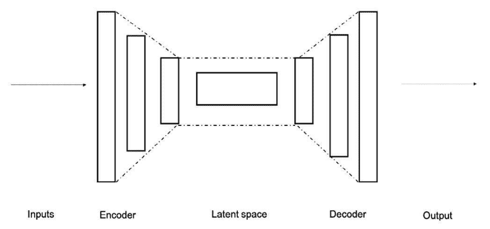

# 第一章：预训练基础模型简介

从 70 年的人工智能研究中可以得到的最大教训是，利用计算的通用方法最终是最有效的，而且差距很大……从长远来看，唯一重要的是利用计算。

– Richard Sutton, “The Bitter Lesson,” 2019 (1)

在本章中，你将接触到基础模型，它们是当今许多人工智能和机器学习系统的核心。特别是，我们将深入了解它们的创建过程，也就是预训练，并了解在哪些情况下，改进模型的准确性具有竞争力。我们将讨论支撑最先进模型的核心 Transformer 架构，如稳定扩散（Stable Diffusion）、BERT、视觉 Transformer、OpenChatKit、CLIP、Flan-T5 等。你将了解编码器和解码器框架，它们用于解决各种使用案例。

本章将涵盖以下内容：

+   预训练与微调的艺术

+   Transformer 模型架构

+   最先进的视觉与语言模型

+   编码器与解码器

# 预训练与微调的艺术

人类是地球上最有趣的生物之一。我们能够创造出最伟大的美丽，并提出最深刻的问题，然而关于我们的基本方面，在许多情况下仍然知之甚少。意识究竟是什么？人类的心智是什么，它存在于何处？成为人类意味着什么？人类是如何学习的？

当来自无数学科的科学家、艺术家和思想家在应对这些复杂的问题时，计算领域却在不断推进，试图复制（在某些情况下，超越）人类智能。今天，从自动驾驶汽车到编写剧本、搜索引擎和问答系统的应用都有一个共同点——它们都使用模型，有时是多种不同类型的模型。这些模型从哪里来，如何获取智能，以及我们可以采取哪些步骤来最大化它们的影响力？基础模型本质上是大规模数据集的紧凑表示。这种表示是通过将*预训练目标*应用于数据集来实现的，从预测掩码标记到完成句子。基础模型之所以有用，是因为一旦创建完成（通过预训练过程），它们可以直接部署，也可以为下游任务进行微调。直接部署的基础模型示例是**稳定扩散（Stable Diffusion）**，它在数十亿对图像-文本配对上进行了预训练，预训练后即可根据文本生成有用的图像。微调过的基础模型示例是**BERT**，它在大规模语言数据集上进行了预训练，但当其适应于下游领域（如分类）时，效果最佳。

在自然语言处理应用中，这些模型可以完成句子补全、将文本分类到不同类别、生成摘要、回答问题、进行基础数学运算，以及生成创意作品如诗歌和标题。在计算机视觉中，基础模型在图像分类到生成、姿态估计到物体检测、像素映射等各个领域都非常有用。

这归因于定义了一个**预训练目标**，我们将在本书中详细学习这一内容。我们还将讨论它的对等方法——**微调**，该方法帮助模型学习特定领域的知识。更广泛地说，这属于**迁移学习**范畴，即将一个预训练的神经网络与一个新数据集结合，期望提升其在某一维度的知识。在视觉和语言领域，这些术语有一些重叠和明显的区别，但别担心，我们将在后续章节中进一步探讨。我使用“*微调*”这个术语，涵盖了适应模型到另一个领域的所有技术，而非狭义上经典的定义。

基础知识 – 预训练目标

大规模预训练的核心围绕这个核心概念展开：用`[MASK]`标记替换某些词语，并训练模型去填充这些词语。其他方法则走另一条路，使用给定文本串的左侧部分来尝试生成右侧部分。

训练过程通过**前向传播**进行，将原始训练数据输入神经网络，产生输出结果。然后，损失函数计算预测结果与数据中实际值之间的差异。这种预测值与实际值之间的差异将作为**反向传播**的基础。反向传播通常利用一种随机梯度下降方法，根据该损失函数更新神经网络的参数，从而确保下次训练时能够得到更低的损失函数值。

以 BERT*(2)* 为例，预训练目标称为**掩码标记损失**。对于 GPT *(3)* 类型的生成文本模型，预训练目标称为**因果语言损失**。另一种看待这一过程的方式是**自监督学习**，利用数据集中已有的内容作为模型的信号。在计算机视觉中，你也会看到它被称为**前置任务**。关于最先进的模型，后续章节会有更多介绍！

就个人而言，我认为预训练是机器学习研究中最令人兴奋的进展之一。为什么？因为正如理查德·萨顿在本章开始时有争议地指出的那样，它在计算上非常高效。通过预训练，你可以利用互联网上大量的信息构建一个模型，然后结合所有这些知识，使用你自己的专有数据，将其应用到你能想象到的所有应用中。更重要的是，预训练为跨公司、跨国家、跨语言和跨领域的巨大合作打开了大门。整个行业实际上才刚刚开始开发、完善和利用预训练范式。

我们知道预训练既有趣又有效，但它在什么方面具有竞争力呢？当你的专有数据集非常庞大且与常见研究数据集不同，并且主要是未标注的时，预训练自己的模型是非常有用的。我们在本书中将学习的大多数模型都训练于相似的语料库——维基百科、社交媒体、书籍和流行的互联网网站。它们中的许多集中在英语语言上，且很少有模型有意识地利用视觉和文本数据之间的丰富互动。在整本书中，我们将学习选择和完善预训练策略的细微差别和不同优势。

如果你的业务或研究假设依赖于非标准自然语言，例如金融或法律术语、非英语语言，或来自其他领域的丰富知识，你可能需要考虑从头开始预训练自己的模型。你需要问自己一个核心问题，*在我的模型中，额外的一个百分点的准确性有多大价值？* 如果你无法回答这个问题，我强烈建议你花些时间找到答案。我们将在*第二章*中详细讨论如何做到这一点。一旦你能自信地说，提高模型的准确性至少值几十万美元，甚至可能值几百万美元，那么你就准备好开始预训练自己的模型了。

现在我们已经了解了基础模型，它们是如何通过一种称为预训练的过程产生的，以及如何通过微调将其适应特定领域，接下来让我们进一步了解 Transformer 模型的架构。

# Transformer 模型架构与自注意力机制

Transformer 模型，最早出现在 2017 年那篇著名的论文《*Attention is all you need*》中，标志着机器学习行业的一个转折点。这主要是因为它使用了一种现有的数学技术——自注意力机制，解决了与序列相关的自然语言处理（NLP）问题。Transformer 当然不是第一个尝试建模序列的模型，之前，**递归神经网络**（**RNNs**）甚至**卷积神经网络**（**CNNs**）在语言处理领域中都很流行。

然而，Transformer 引起轰动是因为其训练成本仅为现有技术的一小部分。这是因为 Transformer 在其核心自注意过程中基本上更易于并行化，比之前的技术更为简单。它还在机器翻译领域刷新了世界记录。原始的 Transformer 同时使用了编码器和解码器，我们将在本章后续部分深入讨论这些技术。其他专注于类似文本对文本任务的模型，如 T5，直接遵循了这种联合编码器-解码器模式。

2018 年，Alex Radford 和他的团队提出了**生成式预训练转换器**，这种方法灵感来自于 2017 年的 Transformer，但仅使用解码器。称为**GPT**，这种模型很好地处理了大规模无监督的预训练，并与监督微调配对以在下游任务中表现良好。正如我们之前提到的，这种*因果语言建模*技术优化了令牌的对数概率，使我们能够从左到右找到序列中最可能的单词。

2019 年，Jacob Devlin 和他的团队提出了*BERT: Pretraining of Deep Bidirectional Transformers*。BERT 也采用了预训练和微调范式，但实施了一种掩码语言建模损失函数，帮助模型学习单词之前和之后的影响。这在消除单词在不同语境中的歧义意义方面非常有用，并自那时以来帮助了仅编码器任务如分类。

尽管它们的名称如此，GPT 和 BERT 都没有像原始 Transformer 论文中展示的完整编码器-解码器那样使用，而是利用了**自注意机制**作为学习过程中的核心步骤。因此，事实上我们应该理解的是自注意过程。

首先，要记住每个单词或令牌都表示为一个嵌入。这种嵌入是通过使用**分词器**，每个模型的预训练数据对象，将单词映射到适当的密集向量来创建的。一旦我们获得了每个令牌的嵌入，我们使用**可学习权重**生成三个新向量：**关键词**、**查询**和**值**。然后，我们使用矩阵乘法和几个步骤与关键词和查询进行交互，最终使用值来确定整个序列中最具信息量的内容。在整个训练循环中，我们更新这些权重，以便根据您的预训练目标获得更好的交互。

您的预训练目标作为指导如何更新模型参数的方向指南。换句话说，您的预训练目标提供了主要信号给您的随机梯度下降更新过程，根据您的模型预测的错误程度改变模型的权重。当您长时间训练时，参数应反映损失的减少，从而使您的整体精度提高。

有趣的是，变压器头的类型会根据你使用的不同预训练目标略有变化。例如，普通的自注意力模块会使用来自标记左右两侧的信息来进行预测。这是为了提供最有价值的上下文信息，以便进行预测，并且在掩蔽语言建模中非常有用。实际上，自注意力头是堆叠起来的，在嵌入矩阵上操作，从而实现多头注意力。然而，日常语言建模使用的是一种不同类型的注意力头：掩蔽自注意力。这将预测信息的范围限制为仅矩阵的左侧，迫使模型学习从左到右的过程。这与传统的自注意力形成对比，后者可以访问序列的左右两侧进行预测。

大多数情况下，实际上，尤其是在本书中，你不需要从头开始编写任何变压器或自注意力头。然而，通过本书，我们将深入探讨许多模型架构，因此拥有这些概念性知识作为基础是很有帮助的。

从直观的角度来看，关于变压器和自注意力，你需要理解的内容可以概括为几点：

+   **变压器本身是完全建立在自注意力函数上的模型**：自注意力函数接受一组输入（如嵌入），并执行数学运算将这些输入组合起来。当与标记（单词或子词）掩蔽结合使用时，模型可以有效地学习某些嵌入或序列的部分对其他部分的重要性。这就是自注意力的含义；模型试图理解输入数据集中哪些部分与其他部分最相关。

+   **变压器在处理序列时表现非常出色**：它们在最近几年突破的许多基准测试主要来自自然语言处理，原因很简单。这些预训练目标包括标记掩蔽和序列补全，二者都不仅依赖于单独的数据点，还依赖于将它们串联起来以及它们的组合。这对于那些已经处理顺序数据的人来说是好消息，对于那些没有的人来说，则是一个有趣的挑战。

+   **Transformer 在大规模应用下表现非常好**：底层的注意力机制（attention head）非常容易并行化，这使得它相对于其他候选的基于序列的神经网络架构（如 RNNs，包括**长短期记忆**（**LSTM**）网络）具有明显的优势。自注意力头可以在预训练时设置为可训练，或者在微调时设置为不可训练。在训练自注意力头时，正如我们在本书中所做的，Transformer 在大数据集上的表现最为优异。它们需要多大的数据集，以及在选择微调或预训练时可以做出哪些权衡，都是未来章节的内容。

Transformer 并不是唯一的预训练方法。正如我们在接下来的章节中将看到的，尤其是在视觉和多模态案例中，有许多不同类型的模型可以提供最先进的性能。

# 最先进的视觉和语言模型

如果你是机器学习的新手，那么有一个关键概念你最终会想要学习并掌握，那就是**最先进技术（state of the art）**。正如你所知道的，机器学习任务有很多不同的类型，比如物体检测、语义分割、姿态检测、文本分类和问答等。每一种任务都有许多不同的研究数据集。这些数据集通常会提供标签，通常用于训练、测试和验证数据集划分。这些数据集通常由学术机构托管，每个数据集都专门用于训练解决这些问题的机器学习模型。

在发布新的数据集时，研究人员通常还会发布一个新的模型，该模型已经在训练集上进行了训练，在验证集上进行了调优，并在测试集上进行了独立评估。该模型在新的测试集上的评估分数为该特定类型建模问题确立了一个新的**最先进技术**。在发布某些类型的论文时，研究人员通常会尝试提高该领域的性能——例如，通过在一些数据集上提高几个百分点的准确率。

**最先进技术**的性能对你来说很重要，因为它是你模型在最佳情况下可能表现如何的强有力指示。大多数研究结果不容易复制，且实验室通常会开发特殊的技术来提高性能，这些技术可能并不容易被其他人观察和复制。尤其是当数据集和代码库没有公开共享时，像 GPT-3 这样的情况就会变得尤为复杂。而当训练方法未公开时，像 GPT-4 的情况则更加明显。

然而，考虑到足够的资源，确实可以达到类似于顶级论文中所报告的性能。一个很好的地方，可以找到当前最先进的性能，就是由 Meta 维护并由社区增强的一个出色网站——*Papers With Code*。通过使用这个免费的工具，你可以轻松地找到顶级论文、数据集、模型以及带示例代码的 GitHub 网站。此外，它们还提供了很好的历史视图，因此你可以看到不同数据集中的顶级模型是如何随时间演变的。

在接下来的章节中，我们将详细讨论如何准备数据集和选择模型，包括如何确定与你自身目标的相似性和差异性。书中的后续部分，我们还将帮助你确定最佳模型及其大小。目前，让我们来看一些模型，截至目前，它们仍然稳居各自领域的排行榜之首。

## 截至 2023 年 4 月的顶级视觉模型

首先，让我们快速看一下当前在图像任务（如分类和生成）中表现最好的模型。

| **数据集** | **最佳模型** | **来自 Transformer** | **性能** |
| --- | --- | --- | --- |
| ImageNet | Basic-L (Lion 微调) | 是 | 91.10% 顶级 1% 准确率 |
| CIFAR-10 | ViT-H/14 *(1)* | 是 | 99.5% 正确率 |
| COCO | InternImage-H (M3I 预训练：[`paperswithcode.com/paper/internimage-exploring-large-scale-vision`](https://paperswithcode.com/paper/internimage-exploring-large-scale-vision)) | 否 | 65.0 Box AP |
| STL-10 | Diffusion ProjectedGAN | 否 | 6.91 FID（生成） |
| ObjectNet | CoCa | 是 | 82.7% 顶级 1% 准确率 |
| MNIST | 简单 CNN 的异构集成 *(1)* | 否 | 99.91% 准确率（0.09% 错误） |

表格 1.1 – 顶级图像结果

初看这些数字，可能会让人感到有些畏惧。毕竟，其中许多模型的准确率接近或达到了 99%！对于初学者或中级机器学习从业者来说，这是不是太高的标准了？

在我们对疑虑和恐惧过于担忧之前，理解一个关键点是很有帮助的，那就是这些准确度分数大多是在研究数据集发布后至少五年才取得的。如果我们分析*Paper With Code*上提供的历史图表，很容易发现，当第一批研究人员发布他们的数据集时，初始的准确度分数通常在 60%左右。随后，经过多年各个组织和团队的努力，才最终生产出能够达到 90%以上的模型。所以，不要灰心！只要你投入时间，你也可以训练出在特定领域内创造新最优性能的模型。这是科学，而非魔法。

你会注意到，尽管这些模型中有一些确实采用了 Transformer 启发式的后端结构，但也有一些并没有。经过仔细观察，你还会发现，这些模型中的一些依赖于我们将在本书中学习的预训练和微调范式，但并不是所有模型都是如此。如果你对机器学习是新手，那么这种差异可能是你需要开始适应的！强大而多元的科学辩论、观点、见解和观察是维持健康社区和提升领域整体成果质量的关键因素。这意味着，你可以并且应该对遇到的方法有所预期，并且这种差异是件好事。

现在，既然你对当前计算机视觉领域的顶尖模型有了更好的理解，让我们来探讨一下将大规模语言模型技术与视觉技术相结合的早期方法：对比预训练和自然语言监督。

## 对比预训练和自然语言监督

关于现代和经典图像数据集的有趣之处在于，从 Fei-Fei Li 于 2006 年提出的 ImageNet，到 2022 年在 Stable Diffusion 中使用的 LAION-5B，这些数据集的标签本身都是由自然语言构成。换句话说，由于图像的范围包括了物理世界中的物体，因此标签必然比单一数字更为细致。从广义上讲，这种问题框定方式被称为**自然语言监督**。

想象一下，拥有一个包含数千万张图片的大型数据集，每张图片都有对应的描述。除了简单地命名物体之外，描述还会为你提供更多关于图片内容的信息。一个描述可以是*Stella 坐在一张黄色沙发上*，也可以是*Pepper，这只澳大利亚小狗*。仅用几句话，我们就能获得比单纯描述物体更多的背景信息。现在，假设你使用一个预训练的模型，比如编码器，将语言处理成一个密集的向量表示。然后，将这个向量与另一个预训练模型——这次是图像编码器——结合起来，将图像处理成另一个密集的向量表示。将这两者结合在一个可学习的矩阵中，你就可以开始进行对比预训练了！这一方法同样由 Alex Radford 和他的团队提出，距离他们在 GPT 上的研究成果仅仅几年的时间，这种方法为我们提供了一个联合学习图像和语言之间关系的方式，同时也给出了一个非常适合执行这一任务的模型。这个模型叫做**对比语言-图像预训练**（**CLIP**）。

CLIP 并不是唯一一个使用自然语言监督的视觉-语言预训练任务。早在 2019 年，一支来自中国的研究团队就提出了**视觉语言 BERT**模型，试图实现类似的目标。从那时起，视觉与语言基础模型的联合训练变得非常流行，Flamingo、Imagen 和 Stable Diffusion 都展示了有趣的研究成果。

现在我们已经了解了一些关于联合视觉与语言对比预训练的内容，让我们来探讨今天语言领域中的顶级模型。

## 2023 年 4 月顶级语言模型

现在，让我们评估一些当前最顶尖的模型，针对一个与基础模型极为相关的任务，这也是本书的主题：语言建模。此表展示了一组在多种场景下的语言模型基准测试结果。

| **数据集** | **最佳模型** | **来自 Transformer** | **性能** |
| --- | --- | --- | --- |
| WikiText-103 | 混合 H3 (2.7B 参数) | 否 | 10.60 测试困惑度 |
| Penn Treebank (词汇级别) | GPT-3 (零-shot) *(1)* | 是 | 20.5 测试困惑度 |
| LAMBADA | PaLM-540B (少-shot) *(1)* | 是 | 89.7% 准确率 |
| Penn Treebank (字符级别) | Mogrifer LSTM + 动态评估 *(1)* | 否 | 1.083 每字符比特 |
| C4 (庞大清理抓取语料库) | Primer | 否 | 12.35 困惑度 |

表 1.2 – 顶级语言建模结果

首先，让我们尝试回答一个基本问题。什么是语言建模，为什么它如此重要？今天所知的语言建模似乎在两篇基础论文中得到了形式化：BERT *(9)* 和 GPT *(10)*。启发这两篇论文的核心概念看似简单：我们如何更好地使用无监督的自然语言？

如你所料，我们世界上绝大多数自然语言并没有直接的数字标签。一些自然语言适合使用具体标签，例如那些客观性毋庸置疑的情况。这包括回答问题的准确性、总结、情感分析、高级情感分析、文档检索等。

但寻找这些标签并生成所需数据集的过程可能会非常昂贵，因为这一过程完全是手动的。同时，许多无监督数据集在不断增大。现在，由于全球对话大多在线进行，丰富多样的数据集变得容易获取。那么，机器学习研究人员如何定位自己，借助这些庞大且无监督的数据集获益呢？

这正是语言建模试图解决的问题。语言建模是将数学技术应用于大规模无标签文本的过程，依赖多种预训练目标，使模型能够*自我学习*这些文本内容。也称为**自监督**，具体的学习方法根据所使用的模型而有所不同。BERT 在数据集中随机应用掩码，并学习预测被掩码隐藏的单词，使用的是编码器。GPT 使用解码器从左到右进行预测，例如，从句子的开头开始，学习如何预测句子的结尾。T5 家族的模型使用编码器和解码器共同学习文本到文本的任务，如翻译和搜索。正如在 ELECTRA *(11)* 中提出的，另一种选择是**标记替换**目标，它选择将新标记注入原始文本，而不是对其进行掩码处理。

基础知识 – 微调

基础语言模型只有与其配套方法——微调一起使用时，才在应用中发挥作用。微调的直觉非常容易理解；我们希望利用一个在其他地方预训练的基础模型，并应用一个更小的数据集，使其更加专注和适用于我们的具体任务。我们也可以称之为**领域适应**——将一个预训练的模型适应到一个完全不同的领域，这个领域在其预训练任务中并未涉及。

微调任务无处不在！你可以使用一个基础语言模型，例如 BERT，并将其微调用于文本分类，或者问答，或者命名实体识别。你也可以使用其他模型，例如 GPT-2，并将其微调用于摘要生成。或者，你可以使用类似 T5 的模型并将其微调用于翻译。基本的思路是，你正在利用基础模型的智能。你正在利用计算力、数据集、大型神经网络，以及最终，研究人员通过继承他们的预训练模型所利用的分发方法。然后，你可以选择性地为网络添加额外的层，或者更可能的是，使用像 Hugging Face 这样的软件框架来简化这一过程。Hugging Face 已经成功构建了一个极其流行的开源框架，拥有数万个预训练模型，我们将在未来的章节中学习如何最佳利用它们的示例来构建我们自己的视觉和语言模型。微调有许多不同类型，从参数高效的微调到指令微调、思维链，甚至有些方法并不严格更新核心模型参数，比如检索增强生成。我们将在本书的后续章节中讨论这些内容。

正如我们将在未来章节中发现的那样，基础语言和视觉模型也并非没有负面影响。首先，它们对计算资源的极大需求对服务提供商造成了显著的能源压力。确保能源通过可持续方式得到满足，并且建模过程尽可能高效，是未来模型的主要目标。这些巨大的计算需求显然也非常昂贵，对资源不足的人来说构成了固有的挑战。然而，我认为，本书中你将学习到的核心技术适用于各种计算需求和资源配置。一旦你在较小规模的预训练中取得成功，通常更容易证明额外资源的需求是合理的。

此外，正如我们将在后续章节中看到的那样，大型模型因能够继承其训练数据中存在的社会偏见而声名狼藉。从将某些就业领域与性别挂钩，到基于种族分类犯罪可能性，研究人员已识别出数百种*(9)*偏见渗入自然语言处理系统的方式。和所有技术一样，设计师和开发人员必须意识到这些风险，并采取措施加以缓解。在后续章节中，我将指出你今天可以采取的各种措施，以减少这些风险。

接下来，让我们了解一种用于为语言模型定义适当实验的核心技术：扩展规律！

## 语言技术聚焦——因果建模与扩展规律

你无疑听说过现在臭名昭著的模型**ChatGPT**。几年来，总部位于旧金山的人工智能公司 OpenAI 致力于研究，旨在改善人类在人工智能领域的成果。为了实现这一目标，他们在扩展语言模型方面取得了大胆的突破，像物理学中推导公式一样，解释了大规模语言模型（LLM）性能的规律。最初，他们将自己定位为一个非营利组织，发布了他们的核心见解和代码以供复现。然而，创立四年后，他们转向与微软达成独家数十亿美元的合作协议。如今，他们的 600 人研发团队专注于开发专有模型和技术，许多开源项目则试图复制并改进他们的成果。尽管这一转型备受争议，但 OpenAI 团队为行业提供了几个极具价值的见解。第一个是 GPT，第二个是扩展规律。

如前所述，基于 GPT 的模型使用**因果语言建模**来学习如何最好地完成文本。这意味着使用从左到右的完成学习标准，不断更新模型的可学习参数，直到文本完全准确。虽然 2018 年的首个 GPT 模型本身已经很有用，但真正的兴奋出现在几年后的两个阶段。首先，贾里德·凯普兰（Jared Kaplan）领导 OpenAI 的团队提出了一个新概念：利用受到他在物理学研究中的启发的公式，来估算模型、数据集和整体计算环境的规模对模型损失的影响。这些*神经语言模型的扩展规律* *(9)* 表明，对于给定的计算环境，最优的模型规模是非常庞大的。

2018 年发布的原版 GPT 模型仅包含 1.17 亿个参数，而它的第二版，恰如其名的 GPT-2，将模型规模提高了最多 10 倍。参数数量的增加使模型的整体准确度翻倍以上。在这些结果的鼓舞下，且受凯普兰（Kaplan）理论和实证研究成果的推动，OpenAI 大胆地将模型参数大小再增加了 10 倍，最终推出了 GPT-3。

随着模型规模的增大，从 13 亿个参数到 130 亿，最终达到 1750 亿个参数，准确性也取得了巨大的飞跃！这一结果催生了自然语言处理（NLP）领域，释放了新的应用场景并引发了一波新的工作，探索并扩展了这些影响。从那时起，新的研究探索了更大（PaLM *(9)*)和更小（Chinchilla *(10)*)的模型，Chinchilla 提出了对扩展规律的全新更新。Meta 的 Yann LeCunn 团队也提出了一些小型模型，这些模型在特定领域超越了更大模型，例如问答（Atlas *(9)*）。亚马逊也提出了两个超越 GPT-3 的模型：AlexaTM 和 MM-COT。许多团队也在努力推出开源版本的 GPT-3，例如 Hugging Face 的 BLOOM、EleutherAI 的 GPT-J 和 Meta 的 OPT。

本书的其余部分将专注于讨论这些模型——它们来自哪里、它们的用途，尤其是如何训练你自己的模型！虽然许多优秀的工作已经覆盖了如何通过微调使用这些预训练模型进行生产，例如 Hugging Face 自己的*自然语言处理与变换器*（Tunstall 等，2022），但我依然相信，自己进行基础模型的预训练，可能是当今你能参与的最有趣的计算智能挑战。我还认为，这是最具盈利性的之一。但更多内容将在后面展开！

接下来，让我们了解两个你需要详细理解的关键模型组件：编码器和解码器。

# 编码器和解码器

现在，我想简要介绍两个关键的主题，你将在讨论基于变换器的模型时看到：编码器和解码器。我们先建立一些基本的直觉，帮助你理解它们的含义。编码器只是一个计算图（或神经网络、函数或对象，具体取决于你的背景），它接受一个具有较大特征空间的输入，并返回一个具有较小特征空间的对象。我们希望（并通过计算演示）编码器能够学习到输入数据中最重要的部分。

通常，在大型语言和视觉模型中，编码器本身由多个多头自注意力对象组成。这意味着在基于变换器的模型中，编码器通常是多个自注意力步骤，学习输入数据中最重要的部分，并将其传递给下游模型。我们来看一个简短的图示：

图 1.1 – 编码器和解码器

直观地，正如您在前面的图中看到的，编码器从较大的输入空间开始，并逐步将其压缩成较小的潜在空间。在分类的情况下，这只是一个分类头，为每个类别分配输出。在掩蔽语言建模的情况下，编码器堆叠在一起，更好地预测要替换的掩蔽标记。这意味着编码器输出的是一个嵌入，即该标记的数值表示，经过预测后，分词器将重新利用该嵌入将其转化回自然语言。

作为最早的“大型语言模型”之一，BERT 是一个仅包含编码器的模型。大多数其他基于 BERT 的模型，如 DeBERTa、DistiliBERT、RoBERTa、DeBERTa 等，采用的是仅编码器的模型架构。解码器的操作正好相反，从压缩表示开始，逐步将其重新组合回较大的特征空间。编码器和解码器可以结合使用，如原始 Transformer 中所示，以解决文本到文本的问题。

为了简化，下面是一个简短的表格，快速总结了我们所看过的三种自注意力模块：编码器、解码器及其组合。

| 输入和输出的大小 | 自注意力模块类型 | 机器学习任务 | 示例模型 |
| --- | --- | --- | --- |
| 长到短 | 编码器 | 分类，任何稠密表示 | BERT, DeBERTa, DistiliBERT, RoBERTa, XLM, AlBERT, CLIP, VL-BERT, Vision Transformer |
| 短到长 | 解码器 | 生成，摘要，问答，任何稀疏表示 | GPT, GPT-2, GPT-Neo, GPT-J, ChatGPT, GPT-4, BLOOM, OPT |
| 相等 | 编码器-解码器 | 机器翻译，风格转换 | T5, BART, BigBird, FLAN-T5, Stable Diffusion |

表 1.3 – 编码器、解码器及其组合

现在，您对编码器、解码器及它们所创建的模型有了更深入的理解，让我们快速回顾一下您刚刚学习过的所有概念，结束这一章。

# 摘要

我们在这一章中已经涵盖了很多内容！在继续之前，让我们快速回顾一些关键主题。首先，我们讨论了预训练和微调的技巧，包括一些关键的预训练对象，如掩蔽语言模型和因果语言建模。我们了解了 Transformer 模型架构，包括其变种的核心自注意力机制。我们探讨了最先进的视觉和语言模型，重点介绍了来自自然语言监督的对比预训练，以及神经语言模型的扩展规律。我们还了解了编码器、解码器及其组合，这些概念今天在视觉和语言领域中仍然非常有用。

现在，您已经具备了理解预训练基础模型的良好概念性和应用基础，让我们来看看如何准备数据集：第一部分。

# 参考文献

请参阅以下内容，以获取更多有关本章中涵盖的某些主题的信息：

1.  *痛苦的教训*, Rich Sutton, 2019 年 3 月 13 日: [`www.incompleteideas.net/IncIdeas/BitterLesson.html`](http://www.incompleteideas.net/IncIdeas/BitterLesson.html)

1.  Jacob Devlin, Ming-Wei Chang, Kenton Lee, 和 Kristina Toutanova. 2019\. *BERT: 深度双向转换器的预训练用于语言理解*: [`aclanthology.org/N19-1423/`](https://aclanthology.org/N19-1423/)。在 *2019 年北美计算语言学学会年会论文集：人类语言技术，第 1 卷（长文与短文）*，第 4171-4186 页，明尼阿波利斯，明尼苏达州。计算语言学学会。

1.  Brown, Tom 和 Mann, Benjamin 和 Ryder, Nick 和 Subbiah, Melanie 和 Kaplan, Jared D 和 Dhariwal, Prafulla 和 Neelakantan, Arvind 和 Shyam, Pranav 和 Sastry, Girish 和 Askell, Amanda 和 Agarwal, Sandhini 和 Herbert-Voss, Ariel 和 Krueger, Gretchen 和 Henighan, Tom 和 Child, Rewon 和 Ramesh, Aditya 和 Ziegler, Daniel 和 Wu, Jeffrey 和 Winter, Clemens 和 Hesse, Chris 和 Chen, Mark 和 Sigler, Eric 和 Litwin, Mateusz 和 Gray, Scott 和 Chess, Benjamin 和 Clark, Jack 和 Berner, Christopher 和 McCandlish, Sam 和 Radford, Alec 和 Sutskever, Ilya 和 Amodei, Dario. 2020\. *语言模型是少样本学习者*。在 *神经信息处理系统进展，第 33 卷*。第 1877-1901 页。Curran Associates, Inc.

1.  *一张图片等于 16x16 个词：用于* *规模化图像识别的变换器*: [`arxiv.org/pdf/2010.11929v2.pdf`](https://arxiv.org/pdf/2010.11929v2.pdf)

1.  *一个简单卷积神经网络模型的集成用于 MNIST 数字* *识别*: [`arxiv.org/pdf/2008.10400v2.pdf`](https://arxiv.org/pdf/2008.10400v2.pdf)

1.  *语言模型是少样本* *学习者*: [`arxiv.org/pdf/2005.14165v4.pdf`](https://arxiv.org/pdf/2005.14165v4.pdf )

1.  *PaLM: 使用* *Pathways* 扩展语言建模： [`arxiv.org/pdf/2204.02311v3.pdf`](https://arxiv.org/pdf/2204.02311v3.pdf)

1.  *MOGRIFIER* *LSTM*: [`arxiv.org/pdf/1909.01792v2.pdf`](https://arxiv.org/pdf/1909.01792v2.pdf)

1.  *BERT: 深度双向转换器的预训练用于语言* *理解*: [`arxiv.org/pdf/1810.04805.pdf`](https://arxiv.org/pdf/1810.04805.pdf)

1.  *通过生成式* *预训练提升语言理解*: [`s3-us-west-2.amazonaws.com/openai-assets/research-covers/language-unsupervised/language_understanding_paper.pdf`](https://s3-us-west-2.amazonaws.com/openai-assets/research-covers/language-unsupervised/language_understanding_paper.pdf)

1.  *ELECTRA: 作为判别器而非* *生成器的预训练文本编码器*: [`arxiv.org/pdf/2003.10555.pdf`](https://arxiv.org/pdf/2003.10555.pdf)

1.  *语言（技术）是权力：NLP 中“偏见”的批判性调查*: [`arxiv.org/pdf/2005.14050.pdf`](https://arxiv.org/pdf/2005.14050.pdf)

1.  *神经语言模型的规模定律*: [`arxiv.org/pdf/2001.08361.pdf`](https://arxiv.org/pdf/2001.08361.pdf)

1.  *PaLM: 利用路径提升语言建模的规模*: [`arxiv.org/pdf/2204.02311.pdf`](https://arxiv.org/pdf/2204.02311.pdf)

1.  *训练计算优化的大型语言模型*: [`arxiv.org/pdf/2203.15556.pdf`](https://arxiv.org/pdf/2203.15556.pdf)

1.  *Atlas: 使用增强检索语言模型进行少样本学习*: [`arxiv.org/pdf/2208.03299.pdf`](https://arxiv.org/pdf/2208.03299.pdf)
