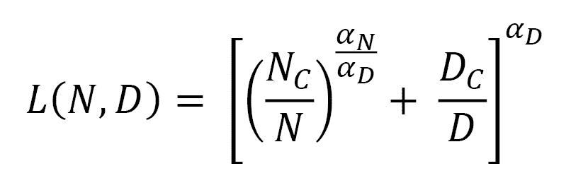

# 第二章：数据集准备：第一部分

在本章中，我们将开始讨论启动有意义的预训练项目所需的数据集内容。这是关于数据集准备的两部分内容中的第一部分。首先，我们提供一些关于如何为基础建模找到合适用例的业务指导，其中数据起着至关重要的作用。然后，专注于数据集的内容，我们使用定性和定量的标准将其与用于预训练其他顶级模型的数据集进行比较。你将学会如何判断你的数据集是否“足够大”和“足够好”，以在预训练时提高准确性。我们还将讨论偏差识别与缓解，以及多语言和多模态解决方案。

在本章中，我们将涵盖以下主题：

+   讨论如何为基础建模寻找数据集和用例的业务层面内容

+   通过将你的数据集与开源研究社区中可用的数据集进行对比来评估它

+   使用扩展定律来合理规划你的数据集规模

+   偏差检测与缓解

+   数据集增强——多语言和数据增强

# 为基础建模寻找数据集和用例

数据集——我们热爱它们，挣扎于它们，依赖它们，也常常忽视它们，往往是同时发生的。每一笔交易、每一个数字瞬间、每一个档案、每一张快照都可能成为数据集的候选项。如果你的组织已经经历了数字化转型，或者你是数字原生企业，那么很可能你已经大量投资于某些数据存储解决方案。无论是本地存储还是云存储，每个组织都需要一个安全、可靠、可操作且强大的解决方案来存储各种数据类型。此时你面临的主要问题是，我如何通过这些数据进行盈利？我如何利用我组织历史和优势中最独特的部分，并通过它开发新的能力，进一步提升我的竞争优势？

对于已经在生产应用中部署机器学习模型的公司，找到一个适合基础建模项目的候选数据集的简单方法是问自己，所有模型的共同点是什么？这些模型依赖于哪些领域、哪些模式、哪些信号，哪些资源可以用来提高这些模型的整体智能？

一种常见的思维练习是考虑与业务核心相关的互动。从搜索到客户支持、供应链、产品开发和维护、营销等，你的每一条业务线都涉及到定期的决策过程。现在，问问自己以下问题：

+   如果我能将决策准确性提高 1%呢？

+   如果我能将我的营销潜在客户转化率提高 1%呢？

+   如果我能为客户推荐更好的内容，提高 1%呢？

+   如果我能将我的运营效率提高 1%呢？

+   如果我能更准确地回答问题，提高 1%呢？

+   如果我能让我的产品交付速度提高 1%，会怎样呢？

一旦你找到自己最感兴趣的业务领域，或者你认为投资影响最大的一块，尝试量化这个数字。准确度提高 1%会为你带来$50,000 吗？那$500,000 呢？甚至$1,000,000？或者更多倍的收益？我说的显而易见，但所有条件相同的情况下，显然数字越高越好。你要选择一个你认为能带来最大投资回报的领域。

现在，一旦你确定了组织中的那个领域，拿出总预估收入的 10%，或者是你觉得更合适的其他低百分比。这就是你的最大计算预算。别担心——我们不会一次性花光这些预算。你甚至可能根本不需要花完它。随着我们逐步阅读本书，我将帮助你弄清楚如何通过早期信号判断你的项目是否会成功，例如在`1%`的数据上进行训练，以确保性能优于开源模型。在你的预训练项目中，你需要达到关键的里程碑，随着你完成这些里程碑，你会越来越接近最终目标。这个总体目标也将是你用来决定花费多少时间、需要多少人手、要使用多少次冲刺等的数字。

一旦你有了这个目标应用，并且清楚了预估的回报和成本，你就可以开始将其付诸实践了！开始列出你的组织中已经存储的、与您想要构建的应用相关的任何数据集。你是否有与此相关的事务型关系数据库？客户历史记录？点击流数据？搜索结果？那图像呢？有没有视频？有没有音频文件？有没有实验结果？尽量发挥创意，列出你所拥有的尽可能多的候选数据集。考虑花一个小时四处看看，看看你的组织已经存储了哪些与这个候选应用领域相关的数据。如果它已经是关键任务系统，那么很可能你已经存储了不少数据。

如果你还没有至少几个 GB 的数据，或者更好的是，几十 GB 的数据，那么你可能需要考虑从开源解决方案中收集一个新的数据集。这些可能包括通过*Papers With Code*网站*(1)*提供的 6000 多个数据集的任何组合。你也可以查看*Hugging Face Hub*提供的 8000 个数据集*(2)*。记住，这些数据集是免费的！开源数据集是开始验证你想法概念的绝佳方式。常见的语言预训练数据集包括*The Pile*、*Common Crawl*、*Wikipedia*、*CodeParrot*等*(3)*。你还可以查看用于多模态预训练的 OSCAR 语料库。**视觉变换器**（**ViT**）*(4)*模型就是从头开始在 ImageNet 上训练的。你有很多选择！你也可以利用所有这些开源数据集来增强你的原始数据集，结合开源和专有选项的最佳部分。

另一个需要记住的事情是，*预训练明显受益于未标记数据*。最好的预训练项目是在利用大量未标记数据和较少量的标记数据时发生的。这也是为什么预训练基础模型如此流行的原因——世界上大多数数据都没有标记。然而，当我们使用预训练目标时，正如我们在第一章中学到的，我们可以轻松地训练模型来学习这些数据。然后，我们使用监督数据对模型进行微调，通常这些数据量较少。

所以，如果你发现自己处于一个拥有数百 GB 数据的场景中，例如图像、文件、记录、交易、元数据和时间序列数据，那么你可能需要考虑将其作为定制预训练的首选候选。

## 按行业划分的顶级预训练应用场景

现在，让我们突出展示一些按行业定制预训练基础模型的顶级应用场景。这些是我们世界中，预训练和微调已经在今天产生影响的领域：

+   **软件** **和互联网**：

    +   搜索与发现

    +   生成文档和代码

    +   问答

+   **酒店业** **和旅游业**：

    +   客户支持和服务

    +   预定推荐

+   **消费电子**：

    +   设计自动化

    +   时尚设计自动化

+   **金融服务**：

    +   文档总结和生成

    +   多模态预测

+   **媒体** **和娱乐**：

    +   创意增强

    +   加速创意生成（新图像、新电影、更好的艺术品等）

    +   确定最佳创意进入决赛（最佳镜头、最佳镜头序列、最佳旋律等）

+   **医疗保健和** **生命科学**：

    +   蛋白质建模、药物发现和实验优先排序

    +   记录综述和诊断确认

    +   视觉结果确认和实验结果优先排序

    +   科学文献综述和实验设计建议

+   **制造业** **和农业**：

    +   部件缺陷和构建错误检测

    +   部件和产品的整体设计自动化

    +   自主产品设计

+   **公共** **部门治理**：

    +   政策影响分析自动化

    +   政策建议自动化

    +   政治和哲学差异调解

    +   预算影响评估和分析自动化

现在让我们继续看看你的数据集有多不同。

# Delta ——你的数据集有多不同？

既然你已经有了对最感兴趣的应用场景的某种理解，并且知道哪些数据集能为你的组织带来最大价值，现在是时候了解你的数据集有多独特了。这一分析很重要，因为它将回答两个问题：

1.  首先，哪些模型已经可以供你使用，因为它们已经在类似的数据上训练过？

1.  其次，这些模型的表现如何？

这一见解将开始为你提供一个线索，指引你在最佳情况下能期望在数据集上实现的性能。然后，我们将把这个预期的性能数值重新带入我们整体项目的价值中，确保我们仍然在正确的轨道上。下一章将完全致力于回答这些问题。在这里，我们将学习如何分析你的数据集。这一部分对于那些刚接触数据分析的人来说非常有帮助。

首先，花时间真正分析你正在处理的任何数据集总是一个好主意。无论你是从自己数据库中的定制数据开始，还是使用开源选项，预计至少会花上几个小时来详细了解它。我听过的最能激励这个过程的短语是，*一个好的数据科学团队提出的问题比他们回答的问题还要多*。这是因为*分析数据集的过程是一个动态的过程，而不是一个有限的状态*。了解一个数据集有点像了解一个人；只不过你提问和观察的方式完全不同。

从口头描述你的数据集的轮廓开始。它有多少行？有多少列？图像有多大？它有多少个标记？它有哪些特征？这些特征是数值型的还是类别型的？它是基于时间的吗？它有哪些元数据？确保你对这个数据集的样貌有清晰的认知。和你团队中的其他人讨论，直到你感到自信，并能快速回答有关数据集组成的基本问题。使用常见的数据分析技术，如 Jupyter 笔记本，生成总结性统计和图表，并进行探索性数据分析。

关键是要问自己，这个数据集是从哪个现实世界过程中抽取出来的？这个数据集是如何获取的？我们称这为抽样机制。如果您是数据分析新手，尤其是在应用设置中进行数据分析而不是在理论研究中，您首先需要了解的是“并非所有抽样机制都是完美的”。换句话说，您应该习惯于假设您的数据集可能存在问题。您需要批判性地评估数据集的开发方式。它是随机收集的吗？或者所有数据都具有某些潜在的相似性？有任何错误吗？数据分析过程中最重要的部分是消除原始数据本身的任何潜在错误、不一致性、奇怪之处和缺陷。您需要确信数据本身确实是有效且可靠的。为什么？因为这种确定性是您从这些数据集产生的一切内容的基本保证。如果数据不可靠，您的工作永远不可能是可靠的。

当您对数据集有了想法，但在您通过实证观察到的结果证明之前，这被称为**假设**。假设是您认为可能适用于您的数据集或任何现实世界过程的概念。然而，由于目前缺乏实证证据来验证此假设的确定性，因此您不能断言它在当前时间是客观真实的。这就是为什么我们称其为假设！

科学过程的核心部分，以及作为推论的，您在机器学习中自身的发展，是学会如何清晰地陈述这一假设。您可以将其表述为一个简单的问题，例如“哪种模型最好地解决了这个问题？”，“什么是最优解决这种类型问题的意义？”，或者甚至，“我们如何在这个领域改进现有技术水平？”

一旦您有了假设，也称为**研究目标**，清晰地表达出来，接下来您需要学习“如何设计实验来回答这个问题”。实验设计是一项令人惊讶地具有挑战性的技能！这包括评估某些领域的当前研究工作，考虑开放性问题和他人展示的结果，并试图从经验上构建。在项目结束时，您希望有明确的经验性结果可以证明您的工作。我们将在关于模型评估的后续章节中进一步讨论这一点，但这是一个需要牢记的关键话题。

接下来，让我们学习如何调整我们的数据集大小。

## 使用缩放定律来确定您的数据集大小。

到目前为止，您应该已经确定了您的数据集，并对其有了基本的理解，能够描述它们与以前的数据集及您选择的领域中的研究工作的相似之处和不同之处。有几篇论文可以参考会很有帮助，这样在遇到困难时就能派上用场。

在本节中，我们将探讨数据集应该有多大，才能在预训练或微调项目中产生预期的结果，从而清楚地验证你将投入的时间和计算开销。我们还将讨论你希望这个数据集具备的某些特征，比如足够的多样性、质量和没有重复项。下一章的内容将完全专注于选择合适的模型，包括模型的大小和范围，但现在我们将重点讨论数据集。

首先，了解所谓的大模型和小模型之间，以及它们通常运行的数据集大小之间有一个非常大的灰色地带是很有帮助的。在任何情况下，你都不应该认为，只有多达数 TB 和/或 PB 的数据才能考虑预训练，或者认为即使是无法放入单个 GPU 的模型也不值得考虑。你可以通过继续预训练你的模型，而不必从零开始预训练，单凭无监督数据就能产生有意义的结果，并且仍然可以实现你的商业和知识目标。根据你的项目以及它可能的独特性和有趣程度，你完全可以在不到 1 GB 的数据上展示一些有用的工作。因此，不要因为没有大量网络数据而犹豫不决；从你现有的资源开始吧！

接下来，你需要理解一种叫做扩展法则的东西 *(6)*。这些是关于大模型在不同规模下如何表现的理论和公式，尤其是作为幂律。这些公式本身是通过不同规模的经验行为推导出来的。你可以用它们来确定给定计算预算下，什么样的模型和数据集大小是最优的，反之亦然。在某种程度上，这些法则，以及在*Chinchilla*中提出的更新版本，与模型架构本身是独立的。这意味着，提高模型准确性的最大方式是扩大规模，而不是改变模型架构本身。Kaplan 最初在语言模型的背景下，明确提出了扩展法则，并利用了变换器模型架构。然而，考虑到这一被验证的假设在 GPT-3 论文中引发了准确度的 10 倍提升，我和许多其他人 *(7)* 相信，有理由在**大语言模型**（**LLMs**）之外探索这种基本关系，特别是在视觉和多模态领域。

你可能会想，那又怎样？为什么这会是一个大问题？显然，你会希望在数据集、计算资源和模型之间取得某种平衡，那么，问题出在哪里呢？Kaplan 的研究之所以具有突破性，是因为*拥有一个有效的公式来量化最优的计算、数据和模型值，可以让你估算出模型可能达到的损失范围*。换句话说，现在我们有了尺度定律，我们可以通过数学推导出在给定范围内，模型训练结束时应该预期的损失是多少。对于那些计算成本可能达到数十万美元，甚至数百万美元的训练任务来说，这种知识极为宝贵。OpenAI 在其 GPT-4 技术报告中验证了这一点，声称能够根据规模变化准确预测其模型的损失。

这为我们开辟了一个新的问题领域。机器学习的其他哪些方面也有经验可观测的定律？除了模型本身的内部运作外，我们还能从物理学中获得哪些灵感，发现依赖于数学关系的公式化模式？这个问题非常重要，因为如今，绝大多数机器学习仍然是试验和错误的过程。我们希望某种方法能奏效，尝试后从实验中学习，然后再采取下一步。然而，我认为尺度定律指向了一个未来，在这个未来中，机器学习将越来越多地通过简单、高效、快速的检查来增强，而不是依赖漫长的计算实验。如果我们这些年来一直在错误地思考这一问题呢？

## 基础知识——神经语言模型的尺度定律

如果你查看原始论文：《神经语言法则的尺度定律》（*Scaling Laws of Neural Language Laws*），你会发现有一个核心概念贯穿整个分析——比例性。Kaplan 等人在文中指出，当数据集大小或模型大小发生变化时，伴随其变化的数量也应该成比例变化。换句话说，如果你使用更大的数据集，就应该使用更大的模型，反之亦然。那么，这种关系的强度究竟有多大？是什么描述了它？涉及哪些常数？应该做多大的缩放调整，这些问题恰恰是他们论文的核心内容。

尽管知道关系是成比例的很有帮助，但这仍然不够。Kaplan 等人建议并通过经验发现，神经语言模型的最优尺度遵循幂律。幂律实际上非常简单；归根结底，它们只是关于指数的。如果两个量遵循幂律，你可以假设方程的一侧遵循指数变化：

为了估算基于 Transformer 的训练方案中，早停时的测试损失，考虑到数据集和模型的大小，Kaplan 等人提出了以下建议。

让我们尝试用非常简单的术语来解释——首先是左侧部分：

+   **L** = 模型在测试集上早停时的最终损失

+   **N** = 你模型中可训练参数的数量

+   **D** = 数据集中令牌的大小（对于语言）

现在，你已经理解整个方程是关于计算模型的潜在损失，这样你就可以提前知道了！右侧的其余项是关于如何达到这个目标的。所有这四个项：、、 和  都描述了必须从数据集和训练过程中发现的常数。可以把它们看作超参数；我们希望找到一些常数项，用以描述我们的特定数据集和模型。然而，在许多情况下，我们可以直接使用他们工作中呈现的常数。

Kaplan 等人在他们的训练过程中通过拟合损失曲线与其缩放法则函数，发现了每个常数的值。利用他们核心方程的数学扩展，他们能够准确地拟合学习曲线。进行这种拟合帮助他们发现了在其余研究中都非常有用的常数。

在现实世界中，一旦你进行了一些初步的数据分析，并对你需要的特征有了清晰的了解，大多数数据科学团队会立即开始训练你的第一个模型。这是因为机器学习过程通常是迭代的；你会测试多种方法，看看在特定时间点哪些方法最有前景，然后扩大规模并进行评估，接着再尝试。为了更全面地阐述这个主题，我将详细介绍两个可以帮助你改善数据集的关键话题。这些步骤你可能不会在数据科学旅程的最初就实施，但随着时间的推移，你应该不断回顾它们，以提高工作整体质量。第一个是偏差检测与缓解，第二个是数据集增强。

# 偏差检测与缓解

“偏差”一词的轨迹非常有趣，因为在过去的 15 年里，它已经走完了一圈。最初，*偏差*无疑是一个统计学术语。正式来说，它意味着样本大小不当，给某些变量赋予了过大的权重。统计学家们开发了许多方法来识别和减少偏差，以正确评估研究，例如公共卫生中的随机对照试验或计量经济学中的政策评估所使用的方法。基本策略包括确保处理组和控制组大致相同大小，并且具有大致相同的特征。如果没有保证这种基本的数学等价性，或者更现实地说，研究团队尽可能接近它，就很难相信研究结果是真正有效的。结果本身会受到偏差的影响，简单地指示基本特征的存在与否，而不是暗示关于治疗本身的任何有意义的信息。

然而，在过去五年里，许多研究已经证明，机器学习模型在特定情境下无法对某些群体的人群做出适当的表现。最严重的例子包括面部识别、图像检测、就业、司法决策等无数案例。大型科技公司首先受到指责，金融机构甚至公共政策组织也纷纷受到波及。这些指控是有根据的。虽然数据集中的偏见一直是机器学习中的一个大问题，但如今它对全球人类生活的影响如此显著，值得进行充分的对话、讨论、解决和监控。如果某个数据集中存在偏见，那么几乎可以肯定它会渗透到模型本身中。模型当然不是客观的；它们实际上是它们所训练的那些数据集的“孩子”。偏见已经走到了一个完整的循环，最初在统计学中出现，与人权相关联，现在推动着机器学习研究。

*“偏见”一词现在已经走到了一个完整的循环；最初在统计学中出现，与人权相关联，现在推动着机器* *学习研究。*

为了开发和尝试部署一个机器学习模型，尤其是一个具有自己预训练机制的大型模型，你需要知道一些事情。首先，最可靠的减少偏见的方法是通过增加或减少数据集中的不同方面。特别是在计算机视觉领域，这一点尤为明显。如果你增加某些群体的图片——例如，非裔美国人——你的模型将能够识别他们。如果没有足够数量的这些图片，你的模型在应用中就无法识别这些群体。

对于自然语言而言，这个问题变得更加具有挑战性。这是因为语言中的大部分数据并没有以性别、种族、宗教和性取向等不同的社会类别进行分类。对于我们关心的、并且知道需要保护的所有这些类别，我们需要引入自己的方法，以便在我们的数据集中识别、比较和综合它们。仅仅做到这一点就已经很难了，正如你可以想象的那样。

识别偏见是你迈向负责任机器学习之旅的第一步。从一开始，你就需要能够回答关于你的数据集的两个关键问题：

+   首先，我的数据集中目前存在哪些类型的偏见？

+   其次，这种偏见给我的组织带来了多大的风险？

从对客户的影响角度来思考风险，特别是来自有偏见的机器学习模型的预测。如果你的模型可能会对客户造成伤害，比如拒绝贷款、降低就业申请、推荐有害内容，甚至拒绝保释或其他法律判决，那么毫无疑问，应该把偏见检测和缓解作为你的最高优先事项！

虽然关于负责任的人工智能有各种框架，我喜欢将其归结为四个关键步骤。在训练偏差数据集的机器学习模型中，你的四个关键步骤是**预期**、**识别**、**缓解**和**监控**：

1.  **预期**：在选择机器学习项目和数据集时，预期每个数据集的根本上都会有某种偏差。问问自己，我的机器学习模型试图解决什么问题，如果我没有足够的某些类型数据，会遇到哪些问题？

1.  **识别**：然后，使用各种技术来识别数据集中存在的偏差。确保从一开始就知道某些组中你是否有某些属性。不断进行这个过程，直到你能够量化出至少几种不同类型的偏差指标。请参见以下提示框，了解如何识别偏差的一些建议。

1.  **缓解**：一旦你在数据集中识别出偏差，采取措施来缓解它。增加或减少数据集中的某些方面。使用增强、上采样或下采样以及数据转换来降低偏差指标，直到它们达到一个较低的危险阈值。

1.  **监控**：一旦你部署了机器学习模型，冒险仍在继续。你可以使用在*步骤 2*中采用的相同偏差检测方法来监控你在应用程序中部署的模型。确保你的应用程序和整体系统设计包括统计监控，并为可接受的统计水平设置阈值。当模型开始达到或超过这些阈值时，开始手动审查模型预测并启动你的训练管道。保持人为干预，特别是那些既有知识又有责任心的人，是减少偏见预测风险的最佳方法。

如何进行偏差检测和监控

现在我们知道偏差很重要，那么我们如何在数学上找到它呢？一旦做到了这一点，我们如何缓解并监控它？有很多方法可以做到这一点，我们可以根据它们各自的领域将这些方法进行分类：

**表格数据**：检测表格数据中的偏差等同于计算一些统计数据。首先，你需要在数据集中有一些真实标签，指示某个组内或组外的状态。值得注意的是，对于许多团队来说，仅此一点就已是一个相当大的问题。然而，针对这一点的合理反应非常简单。预期你的数据会有偏差，无论你是否有一个列标记它为某些组的成员。引入这个标签*是识别数据集中固有偏差并最终消除它的唯一方法*。否则，尝试使用代理，但这些已知是有缺陷的。

假设你有一个标签，例如性别或种族，那么你就有两种度量标准——预训练和后训练度量。一个简单的预训练统计量是**类别不平衡**。类别不平衡指的是来自你的优势群体的观测数，减去来自劣势群体的观测数，再除以整体数据集的大小。如果你的类别不平衡过高，那么你的数据集以及随后的模型肯定会存在偏差。

一个常见的后训练度量标准是**不平等待遇影响**，它的定义非常简单，即在你的劣势群体中预测为正标签的数量，除以在你的优势群体中预测为正标签的数量。直观地说，这衡量了你的模型在不同群体中预测为正的可能性，正如你所想象的，这在某些领域（如就业或法律）是至关重要的。在此，有一些法律先例表明使用 4/5 或 80%作为此处的下限阈值。

**视觉与语言**：最后，视觉与语言有不同的处理方式。在语言领域，通常会评估语言模型在特定条件下提出某个类别的偏好，例如将“he”或“her”归类于某些就业标准下。

在计算机视觉领域，你可以使用一个预训练的文本分类器来确保数据集在训练前是平衡的。此外，你还可以清楚地指出模型在检测某些类别时的不足表现——例如，在图像识别中的某些群体。

# 提升你的数据集——多语言、多模态和增强技术

最后，既然你已经学会了如何选择数据集，如何与研究数据集进行比较，如何确定合适的大致大小，以及如何评估偏差，那么我们就可以开始提升数据集了。特别是，我们将关注几个维度——**多语言**、**多模态**和**增强技术**。这三者通常会在你的机器学习项目的稍后阶段出现，特别是在模型的前几个版本训练完成后，你会寻找下一个能够给你带来提升的思路。

个人而言，我认为在世界上很少有应用场景是多语言*不是*一个强有力的附加价值的。*多语言*仅仅意味着多种语言。尽管许多最先进的语言模型最初是基于仅英文文本进行训练的，但近年来研究人员已在大力提升这些语料库的语言多样性。这意味着他们正在为许多语言增加支持。2022 年，Hugging Face 发起了一项全球性的大规模努力，旨在民主化大语言模型的创建，称其项目为*Big Science* *(8)*。这促成了一个新模型的创建，命名为**BigScience 开放科学开放访问多语言语言模型**（**BLOOM**）。Hugging Face 希望在多语言应用场景中，尤其是在零样本语言翻译等任务上，能改进现有技术。然而，该模型在许多情况下表现不如 GPT-3，这让我们认为最优秀的模型可能还是仅限于单一语言。

坦率地说，多语种化就是好的商业。对于你开发的任何产品，运行的任何程序，以及提供的任何服务，最终，你在与潜在消费者互动时都受到语言的限制。将语言视为一个市场。在你开发产品时，你希望将其推向尽可能多的市场。最终，这意味着尽可能多的语言。因此，我对行业能够找到更好的方法，将多种语言融入到可能是同一个模型中，而不导致结果恶化感到乐观。也许这仅仅是像链式思维或指令调整那样适当格式化数据集的问题。

简而言之，让我们探讨一下增加其他模态的问题。简单来说，这意味着不同类型的数据集，例如将视觉与文本结合，或者反过来。我在*第一章*的结尾部分更详细地介绍了这一概念。在这里，我只是想指出，*如果你的文本中有图片，或者你的图片中有文本，尽量加以利用*。一旦你投入到一个项目中，花费了大量时间分析数据、训练、评估模型、部署模型等，为什么不再进一步探索增加其他模态呢？特别是当它有提升准确性的潜力时，确实如此。从模型的角度来看，另一种模态仅仅是另一种嵌入类型。你最可能需要使用一些其他地方预训练的模型，将原始图像转换成嵌入——也就是说，在将其作为模型的另一个输入之前。

这里有一些权衡；增加模型的大小会增加其运行时间。增加数据集的大小也会增加数据转换的成本。增加数据转换的步骤使得托管变得更复杂，这意味着你可能需要重新考虑系统设计，以便部署你的模型。所有这些权衡都是值得讨论的，最终，你需要优先考虑那些为你的团队和客户带来最大价值的项目，而这其中可能非常包含仅限语言的模型。

我对多模态项目一般来说持乐观态度，而不是仅限语言的项目的另一个原因是，视觉领域对人类传达了如此多的信息。人类在学会说话之前学会了看东西，我们的许多经验和知识都是通过视觉收集的。基于这个原因，我相信基础模型将继续朝着联合视觉与语言任务的方向收敛。

最后，数据增强是一个简单易行的步骤，可以提高模型的准确性，而不需要额外付出大量工作。其核心思想是向你的数据集中添加一定程度的多样性和对提供样本的轻微变化，这将帮助模型学习信号和噪声之间的区别。无论是文本还是视觉，都有经过验证的增强方法。在视觉方面，这通常仅仅是像素操作、轻微的颜色变化或图像旋转。

对于文本来说，这可能是替换同义词、句子层面的重构或轻微的标点修改。关键是你不想改变你正在尝试学习的基本机制。如果你在训练一个图像检测模型，就不要修改任何图像，以免无法检测到它们。如果你在训练一个文本分类器，也不要修改文本到它变成一个不同的类别。

在大规模预训练中，数据增强通常不是一个问题，因为大多数数据集非常庞大，已经包含了足够的噪声和变化。然而，这似乎是一个特别有前景的偏差减少途径。预训练的另一个关键技术是减少重复文本。这在网络数据中尤为重要，因为表情包、评论和讨论线程很容易在平台和用户之间反复出现同一段文本。

现在你已经了解了数据准备的早期阶段，让我们在继续准备模型之前，快速回顾一下你刚刚学到的内容！

# 总结

本章介绍了各种基础模型的使用案例，包括你可以微调现有基础模型的场景以及预训练本身具有竞争力的场景。我们提供了一个简单的经济学框架，帮助你为预训练项目提供依据，特别是通过将其与你预计基于更准确的模型，业务将如何增长相联系。之后，我们讨论了评估你的数据集，将其与研究数据集进行比较，并学习如何批判性地思考其采样机制。我们提出了一些基本的想法，用于将这种批判性思维应用于实验框架的设定，这将在下一章继续讨论。我们了解了扩展法则，并提供了一个开源笔记本，你可以用来找到在固定模型和计算预算下，哪个数据集大小能帮助你达到预期的性能水平。我们还讨论了如何检测和减轻数据集中的偏差，并通过增强、模态和语言进行改善。

接下来是模型准备！

# 参考文献

请阅读以下内容，了解本章中涉及的一些主题：

1.  *Papers With* *Code*: [`paperswithcode.com/datasets`](https://paperswithcode.com/datasets).

1.  *Hugging Face* *Hub*: [`huggingface.co/datasets`](https://huggingface.co/datasets)

1.  *Hugging* *Face*：[`huggingface.co/datasets?task_ids=task_ids:language-modeling&sort=downloads`](https://huggingface.co/datasets?task_ids=task_ids:language-modeling&sort=downloads)

1.  *一张图胜过 16x16 个词：用于图像识别的变换器模型（Transformer）*：[`arxiv.org/pdf/2010.11929.pdf`](https://arxiv.org/pdf/2010.11929.pdf)

1.  神经语言模型的扩展法则：[`arxiv.org/pdf/2001.08361.pdf`](https://arxiv.org/pdf/2001.08361.pdf)

1.  训练计算最优的大型语言模型：[`arxiv.org/pdf/2203.15556.pdf`](https://arxiv.org/pdf/2203.15556.pdf)

1.  *BigScience 第五集 – 创建大型语言模型的挑战与视角*：[`bigscience.huggingface.co/acl-2022`](https://bigscience.huggingface.co/acl-2022)
