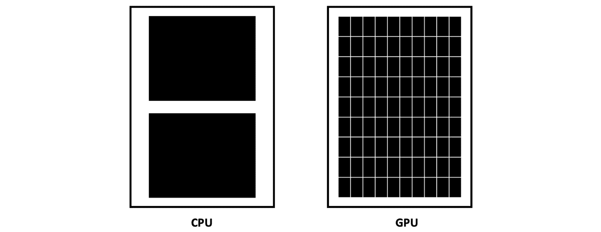

# 第四章：云上的容器和加速器

在本章中，你将学习如何将脚本容器化，并为云上的加速器进行优化。我们将了解一系列用于基础模型的加速器，包括在整个机器学习生命周期中围绕成本和性能的权衡。你将学习关于 Amazon SageMaker 和 AWS 的关键方面，以便在加速器上训练模型，优化性能，并排除常见问题。如果你已经熟悉 AWS 上的容器和加速器，可以跳过本章。

在本章中，我们将覆盖以下主要内容：

+   什么是加速器，为什么它们对基础模型很重要？

+   将你的脚本容器化以便在 AWS 上的加速器使用

+   使用加速器与 Amazon SageMaker

+   AWS 上的基础设施优化

+   排除加速器性能问题

# 什么是加速器，为什么它们很重要？

有些关于人类行为的事情是值得注意的。我们非常关心自己的体验。许多艺术和科学，特别是社会科学，专注于量化、预测和理解人类行为的含义和特性。其中最明显的一种就是人类对技术性能的反应。虽然这在不同人群之间有所差异，但对于选择花费大量时间与技术互动的群体来说，有一个定理是不言而喻的：更快、更简便永远是更好的。

以视频游戏为例。虽然 20 世纪 40 年代和 50 年代见证了一些最早的视频游戏，但直到 70 年代初期，像*乒乓*这样的街机游戏才开始获得广泛的流行。或许并不奇怪，这几乎与原始**图形处理单元**（**GPU**）的诞生时间相吻合，GPU 于 1973 年问世*(1)*！1994 年，PlayStation1 推出，配备了索尼 GPU。作为一个孩子，我花了许多小时沉迷于任天堂 64 的图形性能，玩着*塞尔达传说*、*超级大乱斗*、*马里奥赛车 64*等游戏！如今，你只需要看看像*Roblox*、*英雄联盟*和*堡垒之夜*这样的游戏，就能明白图形性能对游戏行业成功的重要性。几十年来，游戏一直是 GPU 市场中最重要的信号之一。

直到机器学习才是。我们在*第一章*中了解了 ImageNet 数据集，并简要介绍了 2012 年的冠军 AlexNet。为了高效地在大型 ImageNet 数据集上训练模型，作者使用了 GPU！当时，GPU 的性能较低，仅提供 3 GB 的内存，因此他们需要实现*模型并行策略*。该策略使用两个 GPU 将整个模型加载到内存中。这些增强功能，除了其他修改（如使用 ReLU 激活函数和重叠池化）外，使得 AlexNet 凭借压倒性的优势赢得了挑战。

自从十多年前取得这一成就以来，大多数最优秀的机器学习模型都使用了 GPU。从变换器到强化学习，从训练到推理，从计算机视觉到自然语言处理，绝大多数最先进的机器学习模型都需要 GPU 才能达到最佳性能。在适合的处理类型下，GPU 的速度可以比 CPU 快数个数量级。在训练或托管深度学习模型时，选择使用 GPU 还是 CPU，通常会导致完成任务所需时间的差异，可能是几小时到几天。

我们知道，与标准的 CPU 处理相比，GPU 有很多有前景的优点，但究竟是如何实现的呢？从根本上说，GPU 与 CPU 有什么不同？答案可能会让你吃惊：*分布式*！让我们看一下这张图，来理解 CPU 和 GPU 之间的区别：

图 4.1 – CPU 与 GPU 的区别

CPU 只有少数几个核心，但拥有大量内存。这意味着它们一次只能执行少数几个操作，但可以非常快速地完成这些操作。可以把它想象为低延迟。CPU 几乎像一个缓存一样工作；它们非常擅长处理需要交互的任务。

另一方面，GPU 拥有成千上万的核心。例如，英伟达最新一代的 GH100 芯片就拥有 18,432 个核心。这意味着它们非常擅长同时处理许多操作，比如在神经网络中的数百万到数十亿个参数上进行矩阵乘法。可以把它想象为高吞吐量。

难道我们不关心低延迟和高吞吐量吗？是的，绝对如此！这就是为什么你今天使用的大多数计算设备，从手机到笔记本电脑，从笔记本实例到你需要训练最先进模型的大量实例，都同时使用了 CPU 和 GPU。问题是，如何做到的呢？

正如你可能想象的那样，编写一个软件程序，成功地在成千上万的微处理器上运行复杂的操作，显然不是世界上最简单的事情。这就是为什么，为了编写 GPU 的代码，你需要一个专门为超大规模操作分发而构建的软件框架。这里就引入了**CUDA**，英伟达的**计算统一设备架构**。CUDA 抽象了底层分布式微处理器的协调工作，允许用户在无需成为该架构专家的情况下，利用其强大的分发能力。例如，Python 可以直接与 CUDA 一起工作。PyTorch 和 TensorFlow 也可以与 CUDA 进行交互。

NVIDIA 显然不是唯一提供高性能分布式微处理器的供应商。通常称为**加速器**，类似 GPU 的大规模并行处理单元可以从亚马逊（Inferentia 和 Trainium）、谷歌（TPU）、英特尔（Habna Gaudi）、AMD（ROCm）等处获得。然而，利用底层分布式硬件需要专门的步骤。当这些硬件适用于你的用例时，它们显然具有明显的优势，但对于初学者的书籍目的而言，我们将只关注 GPU。我们将深入研究亚马逊的加速器 Trainium 和 Inferentia，位于*第九章**，高级培训概念*。

现在你已经了解了加速器，让我们弄清楚如何使用它们！

# 准备使用加速器

让我们从学习如何使用你的加速器开始：

1.  *第一步：获取*。在没有至少一台 GPU 的情况下，你绝对不能在 GPU 上训练模型。幸运的是，有一些免费选择供你选择。亚马逊的一个项目中，我实际上是编写了关于这个的原始文档：SageMaker Studio Lab！Studio Lab 是在云中运行免费 Jupyter Notebook 服务器的一种方式。如果你想在 CPU 或 GPU 上使用免费的笔记本环境，存储你的文件，与他人合作，并连接到 AWS 或任何其他服务，Studio Lab 是一个很好的开始方式。

1.  *第二步：容器*。一旦你进入 Jupyter 笔记本并尝试运行一些示例代码，你会意识到一切都依赖于安装正确的软件包。即使安装了这些软件包，将它们连接到 GPU 还取决于笔记本中的 CUDA 安装。如果你尝试使用的 PyTorch 或 TensorFlow 版本与特定的 CUDA 安装不兼容，那就没办法了！

这就是为什么选择正确的容器作为你的基础镜像是开始开发的完美方式，特别是在 GPU 上进行深度学习时。AWS、NVIDIA、PyTorch 和 TensorFlow 都提供了可以用来开始使用深度学习框架的基础镜像。在 AWS，我们有 70 多个跨多个框架和关键版本的容器*(2)*。我们提供这些容器，涵盖 CPU、GPU、训练、托管、SageMaker 和我们的容器服务。

你问什么是容器？想象一下编写一个 Python 脚本，其中包含 5、10、15 甚至超过 100 个软件包。安装所有这些软件包真的非常耗时且容易出错！试想一下，单独成功安装一个软件包是多么困难；所有这些复杂性、时间和你找到的小心解决方案都可以轻松地转移到任何你喜欢的地方。如何实现？通过容器！容器是一个强大的工具。学会如何让它们成为你的朋友。

现在你对使用容器有了一些了解，特别是它们作为模型与 GPU 之间中介的角色，让我们讨论一下在哪里运行 GPU 的选项。

在这里，我想强调的是，显然我在 AWS 工作了很多年。我非常喜欢它！这段经历为我提供了一个极好的平台来提升我的技能、了解世界、实践深度学习、服务客户，并与一些非常优秀的人一起合作。我还花了很多时间研究云计算与本地计算之间的权衡。事实上，在加入 AWS 之前，我曾在很多不同的组织工作过：一些初创公司、一家银行、一所大学、餐馆、政策组织和一个非营利机构。这些地方的计算资源管理方式各不相同。

一方面，购买本地计算资源可能一开始看起来是更安全的选择。重要的是，你实际上用钱买到了实物！你不需要支付使用机器的费用，而且似乎更容易保护它。毕竟，你可以把它放在桌子下。那么，为什么会这样呢？

在本地运行计算存在五个主要问题：

+   第一个问题是**后勤**。假设你确实购买了一些带有 GPU 的本地服务器。你会把它们放在哪里？如何将它们连接到你的笔记本电脑？如何保持它们的低温？如何确保它们有足够的电力？如果在实验过程中房间里的电力突然中断，你该怎么办？你还需要等待 GPU 通过邮件送达。然后，你需要“安装和配置”这些机器，把它们放入你的本地数据中心。很快，这些辅助任务就可能成为你全职工作的内容，如果你打算为整个组织运行这些计算资源，你还需要一个团队。

+   第二个问题是**规模**。假设你一开始只购买了八个 GPU。你可以进行少量的实验，每次执行一个。但如果你有一个新的项目想要测试怎么办？如果你只有这八个 GPU，你将受到它们的限制，无法在其他地方进行额外的实验。在这种情况下，大多数人会选择购买更多 GPU 来进行额外的实验，这就引出了第三个问题。

+   第三个问题是**资源闲置**。当大家晚上回家不再训练模型时，那些昂贵的 GPU 都发生了什么？可能什么都没发生。它们可能完全没有被利用。如果你晚上或几个星期内进行实验，可能会看到更高的 GPU 利用率。然而，组织通常会大量投资昂贵的 GPU 基础设施，但实际使用这些资源的团队往往是最少的！通常，你会看到少数几个高级用户，而大多数轻度使用者只是偶尔登录。

+   第四个是**货币**。硬件更新，迅速。许多公司每年都会投入大量资源发布更新、更快、更好的硬件版本。每年，你都应该期望看到最新版本的性能提升。如果你在本地 GPU 上投入了大量资金，却在几个月内看到它们被淘汰，这种感觉可不好。这还会给你的实验带来风险；如果你不能从计算预算中获得最好的性能，你可能无法取得最先进的结果。

+   第五个是**碳足迹**。你对为你所在电网提供能源的类型了解多少？它是否可持续？所有这些 GPU 会为你的社区带来多少额外的碳足迹，更不用说你的账单了？实际上，亚马逊是全球最大的可再生能源企业采购商。我们非常谨慎地选择供应我们区域的电网，并能证明，转向 AWS 云可以将平均数据中心的碳足迹减少最多 80%，当我们完全使用 100%可再生能源时，目标是减少至 96%。

另一个在 Amazon SageMaker 上运行 GPU 的好处是，*如果你没有运行任务，就不需要为实例付费*。在使用 SageMaker 训练机器学习模型时，GPU 只有在你训练模型时才会上线。也就是说，搬到 SageMaker 后，你的整体 GPU 利用率会显著提高，这仅仅是因为系统架构的原因。大多数数据中心并没有为深度学习训练所需要的动态性而建，因为当你不在训练模型时，节点仍然在运行！同样的逻辑也适用于 Amazon EC2。

最后，你需要确保你的项目实际上使用了 GPU。这比听起来复杂得多。首先，软件框架本身需要连接到底层的 CUDA 内核。然后，你需要使用一些工具来确保 GPU 的使用率尽可能高。你将在本章后面学到各种技术，深入了解这些话题。

现在你已经学会了如何准备使用加速器，让我们来看看如何在 Amazon SageMaker 上使用它们吧！

## 如何在 AWS 上使用加速器——Amazon SageMaker

正如你在上一节中学到的，AWS 是一个极好的方式，让你在无需配置、存储、物理保护和维护 GPU 的情况下就能获得 GPU。现在，我们将看看在 AWS 上利用 GPU 的一种简单、高效且高性能的方法——Amazon SageMaker。我要明确的是，SageMaker 当然不是在 AWS 上运行 GPU 或加速器的唯一方式。然而，它是我个人最喜欢的方法，因此我们从这里开始。

有许多书籍、博客文章、网络研讨会和 re:Invent 会议专门介绍和讨论 SageMaker。我自己也有一个包含 16 个视频的 YouTube 系列，你可以通过它来学习更多关于 SageMaker 的内容！不过，为了本书的目的，我希望你了解 SageMaker 的三个关键部分：**Studio**、**训练**和 **托管**。这些部分的共同点是：**实例**。

*实例* 是我们用来描述 AWS 上虚拟机的术语。这个服务叫做 **弹性计算云**，简称 **EC2**。每次你启动一个虚拟机，我们都称之为一个 **实例**。你可能以前使用过 EC2 实例，比如在 AWS 控制台中启动它们，使用 SSH 连接，尝试写一些代码。但你是不是觉得，每当需要更改实例的大小时，这个过程有点儿烦人？下载日志或输出文件呢？分享你的笔记本？更不用提你忘记关机后收到的账单了！

那么，如果我告诉你，有一种简单的方式可以在不需要管理底层基础设施的情况下，运行笔记本、训练模型并围绕你的数据科学工作成果构建业务应用，你是不是会感兴趣呢？

这就是 SageMaker 的核心理念。我们通过让你能够在一个统一的界面上轻松运行你的笔记本、模型、任务、管道和流程，来实现机器学习的普及化。我们还提供高性能并以实惠的价格交付服务。让我们更仔细地看看 SageMaker 的一些关键部分。

### SageMaker Studio

SageMaker Studio 是我们旗舰级的开发环境，完全与机器学习集成。我最喜欢 Studio 的一点是，*我们将支撑用户界面的计算资源与运行你的笔记本的计算资源解耦*。这意味着 AWS 会为每个用户托管一个 Jupyter 服务器，负责你的可视化体验。这包括大量专为机器学习构建的功能，如 Feature Store、Pipelines、Data Wrangler、Clarify、Model Monitor 等等。

然后，每当你创建一个新的 Jupyter 笔记本，*我们会在专用实例上运行它*。这些实例叫做 **内核网关应用**，它们让你能够在 IDE 中无缝运行许多不同的项目，满足不同的包需求和数据集，而无需离开你的开发环境。更棒的是，Studio 中的笔记本非常容易升级、降级或更换内核。也就是说，你可以在 CPU 和 GPU 之间切换，而几乎不需要中断工作。

### SageMaker 训练

现在你大概了解了如何在 SageMaker 上运行笔记本，但如果是一个大规模的分布式训练任务呢？

对于这个主题，我们需要介绍 SageMaker 的第二个关键支柱：**训练**。SageMaker Training 让你能够轻松定义作业参数，例如所需的实例、脚本、包依赖、软件版本等。然后，当你训练模型时，我们会在 AWS 上启动一群远程实例来运行你的脚本。所有的元数据、包细节、作业输出、超参数、数据输入等都会被存储、可搜索并默认进行版本管理。这样，你就能轻松追踪工作进展、重现结果，并在作业完成后，即使是几个月或几年后，也能找到实验的详细信息。

此外，我们在更新训练后端平台方面投入了大量精力，以支持超大规模建模。从使用 FSx for Lustre 的数据优化到分布式库（如模型和数据并行），我们正在推动下一代大规模模型在 AWS 上无缝训练，涵盖视觉和文本领域。下一章会更详细地介绍这一点。本书中我们分析的大部分 GPU 实例都属于 SageMaker Training。

### SageMaker 托管

最后，你还可以在 SageMaker 托管中运行 GPU。当你想在核心模型之上构建可扩展的 REST API 时，这非常有用。你可能会使用 SageMaker 托管端点来运行搜索体验、提供问答服务、进行内容分类、推荐内容等多种应用。SageMaker 托管支持 GPU！我们将在 *第十二章*《如何部署你的模型》中更详细地探讨这一点。

现在你已经了解了 SageMaker 的一些关键支柱，让我们深入探讨它们背后的概念：实例。

### SageMaker 上 GPU 实例解析

截至 2022 年 11 月，我们支持 SageMaker 上两种主要的 GPU 实例系列、两种自定义加速器和 Habana Gaudi 加速器。在这里，我将为你解析所有实例的命名规范，并介绍你可能会使用这些实例的具体场景。

所有实例的命名规范实际上由三部分组成：前缀、中缀和后缀。例如，`ml.g4dn.12xlarge`。其中，`ml` 部分表示这是一个 SageMaker 实例，因此你不会在 EC2 控制平面中看到它。`g` 部分告诉你这个实例属于哪个计算系列，特别是它的计算类型。在这里，`g` 表示它是一个特定类型的 GPU 加速器：`g4` 实例配备 NVIDIA T4，而 `g5` 配备 NVIDIA A10G。紧跟字母后的数字是该实例的版本号，数字越大，版本越新。所以，`g5` 比 `g4` 更新，依此类推。每个实例的最新版本通常会提供更好的性价比。

这里，`g4` 表示你正在使用 NVIDIA T4 GPU。数字后面的字母告诉你该实例上还可用的其他资源，在这种情况下，`d` 表示我们可以使用 `n` 来运行 `ml.t3.medium` 的 Jupyter notebook，但之后可以升级到更大的实例，如 `ml.g4dn.12xlarge` 进行开发，最终可能会使用 `ml.p4dn.24xlarge` 进行大规模训练。

一般来说，`g` 实例非常适合较小的模型。这可以包括开发和测试，例如在此上运行复杂的笔记本、使用热池，或者只是使用数据并行的多 GPU 模型训练。`g5` 实例在这里尤其具有竞争力。

然而，如果你想训练大型语言模型，强烈推荐使用 `p` 系列实例。这是因为这些 GPU 实际上性能更强，并且更大。它们支持更大的模型和更大的批量大小。`ml.p4dn.24xlarge` 配备 8 个 NVIDIA A100，每个卡有 40 GB 的 GPU 内存。`ml.g5.48xlarge` 配备 8 个 NVIDIA A10G，每个卡只有 24 GB 的 GPU 内存。

在撰写本文时，Trainium 刚刚上线！这是亚马逊开发的定制加速器，旨在为客户提供高达 50% 的成本性能提升。

现在你已经了解了如何在 AWS 上使用 GPU，特别是在 Amazon SageMaker 上使用 GPU，以及哪些实例你应该关注，接下来我们来探讨如何优化 GPU 性能。

# 优化加速器性能

这里有两种方法可以处理这个问题，而这两种方法都很重要。第一种是从超参数的角度来看。第二种是从基础设施的角度来看。让我们一一解析吧！

## 超参数

整个 *第七章* 都致力于选择正确的超参数，而优化 GPU 性能是其中一个重要因素。值得注意的是，随着你集群中 GPU 数量的变化，也就是我们所说的 **世界大小**，你需要调整你的超参数以适应这种变化。此外，在最大化批量大小以提高整体工作吞吐量和找到一个较小的批量大小以最终提高准确性之间，有一个核心的权衡。书中的后续部分将教你如何通过超参数调优来弥补这一差距。

## AWS 上加速器的基础设施优化

在这里，你将学习到五个关键主题，它们能够决定你的脚本如何使用 AWS 上的 GPU 基础设施。在你学习的这个阶段，我不期望你成为这些主题的专家。我只是希望你了解它们的存在，并且知道在以后工作流中，你可能需要更新与它们相关的标志和配置：

+   **EFA**：亚马逊的 **弹性网络适配器** 是 AWS 上的定制网络解决方案，旨在为高性能深度学习提供最佳规模。专为亚马逊 EC2 网络拓扑结构设计，它使从几个到几百甚至几千个 GPU 在 AWS 上实现无缝的网络扩展。

+   `ml.p4d.24xlarge`、`ml.p3dn.24xlarge`、`ml.g4dn.12xlarge` 等等。

+   `AllReduce`、`Broadcast`、`Reduce`、`AllGather` 和 `ReduceScatter`。你将使用的大多数分布式训练软件框架都采用了这些算法的组合或其自定义实现，并且有多种方式。*第五章*将详细探讨这一点。另一个需要了解的关键 NVIDIA 库是 CUDA，正如前面提到的，它允许你在加速器上运行深度学习框架软件。

+   **GPUDirectRDMA**：这是 NVIDIA 的一款工具，允许 GPU 在同一实例上直接相互通信，而无需经过 CPU。这也可以在 AWS 上通过特定的实例使用。

+   **Open MPI**：**开放消息传递接口**是一个开源项目，旨在使远程计算机能够轻松地相互通信。你大多数的分布式训练工作负载，特别是那些在 SageMaker 上运行的工作负载，将使用 MPI 作为基础通信层，以确保各个工作节点能够保持同步。

如果你在想，"*现在，我该如何使用这些东西呢？*"，答案通常非常简单。只需要三步，如下所示：

1.  首先，问问自己，*我使用的是哪种基础容器*？如果你使用的是 AWS 的深度学习容器，那么在我们进行广泛的测试和检查后，这些能力都将会提供给你。

1.  其次，查看你使用的是哪种实例。正如你之前学到的，每种实例类型都会影响你在 AWS 上是否能使用某些功能。确保你获得最佳性能！

1.  第三，查看如何在作业参数中配置这些内容。在 SageMaker 中，我们将使用超参数和脚本中的设置，确保你能够最大化性能。

现在你已经了解了一些优化 GPU 性能的知识，接下来我们来看看如何排查性能问题。

# 排查加速器性能问题

在分析 GPU 性能之前，我们需要一般了解如何在训练平台上进行调试和分析性能。SageMaker 为此提供了一些非常不错的解决方案。首先，所有的日志都会发送到**Amazon CloudWatch**，这是另一个 AWS 服务，帮助你监控作业性能。你集群中的每个节点都会有一个完整的专用日志流，你可以通过查看日志流来了解整个训练环境，SageMaker 如何运行你的作业，你的作业状态，以及你的脚本所生成的所有日志。所有你写入标准输出的内容，或者打印的语句，都会被自动捕获并存储在 CloudWatch 中。调试代码的第一步是查看日志，弄清楚到底出了什么问题。

一旦你发现脚本中存在问题，你可能会想尽快修复并让它恢复运行，对吧？这就是为什么我们在 SageMaker 上引入了**托管的热池**功能，一个即使在任务完成后也能保持训练集群在线的功能。通过 SageMaker 热池，你现在可以在几秒钟内就在 SageMaker 训练上运行新的任务！

当脚本工作正常时，接下来你需要分析任务的整体性能。这时调试工具就非常有用。SageMaker 提供了调试器和分析器，它们在任务运行时会启动远程实例，应用规则并在整个训练过程中检查张量。分析器是一个特别有用的工具；它会自动生成图表，帮助你评估任务的整体性能，包括哪些 GPU 正在被使用，以及使用的程度。NVIDIA 还提供了 GPU 调试和分析工具。

如前所述，编写软件以无缝协调成千上万的 GPU 核心绝非易事。因此，GPU 突然出现故障的情况非常常见。你可能会看到 NCCL 错误、CUDA 错误或其他看似无法解释的故障。对于其中许多情况，SageMaker 实际上会提前为你运行 GPU 健康检查！这也是为什么`p4d`实例初始化时间比较长的原因；我们在将 GPU 暴露给你之前，会分析它们的健康状况。

除了这些已知的以 GPU 为中心的问题外，你可能还会遇到其他故障，比如损失值不下降或突然爆炸、容量不足、GPU 吞吐量异常低或节点拓扑结构发生小变化。对于这些问题，通常会在你的账户中实现一个**Lambda 函数**来监控你的任务。你可以使用这个 Lambda 函数来分析 Cloudwatch 日志、触发警报、重启任务等。

只要记住*每 2 到 3 小时检查一次模型*。我们将在接下来的章节中讨论在 SageMaker 上大规模训练时的最佳实践，但现在请记住，你需要定期写入最近训练的模型的完整副本，以确保训练过程的顺利进行。

现在你已经了解了一些排查 GPU 性能问题的技术，接下来让我们总结一下本章所学的内容。

# 总结

在本章中，我们介绍了机器学习加速器，包括它们如何与标准 CPU 处理方式不同，以及为何在大规模深度学习中需要它们。我们讲解了获取加速器并为软件开发和模型训练做好准备的一些技术。我们还介绍了 Amazon SageMaker 的关键方面，特别是 Studio、Training 和托管。你应该知道，有一些关键的软件框架让你可以在 GPU 上运行代码，例如 NCCL、CUDA 等。你还应该了解 AWS 提供的用于高性能 GPU 计算的顶级功能，以训练深度学习模型，如 EFA、Nitro 等。我们介绍了如何找到并构建预装了这些软件包的容器，以便成功运行脚本。我们还讲解了如何在 SageMaker 上调试代码并排查 GPU 性能问题。

现在我们已经详细了解了 GPU，接下来的章节将探索分布式训练的基础知识！

# 参考文献

请查看以下内容，了解更多本章中涉及的一些主题：

1.  微控制外围处理器：[`dl.acm.org/doi/10.1145/800203.806247`](https://dl.acm.org/doi/10.1145/800203.806247)

1.  *AWS，深度* *学习*：[`github.com/aws/deep-learning-containers`](https://github.com/aws/deep-learning-containers)
