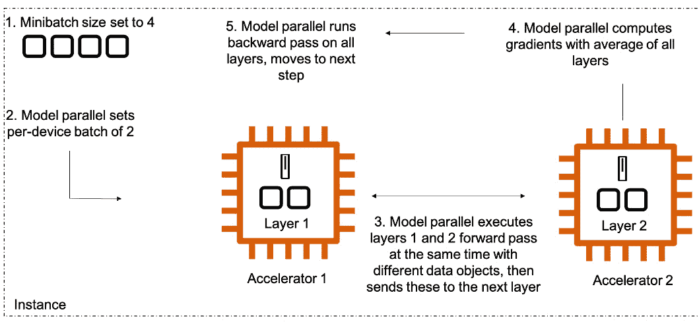
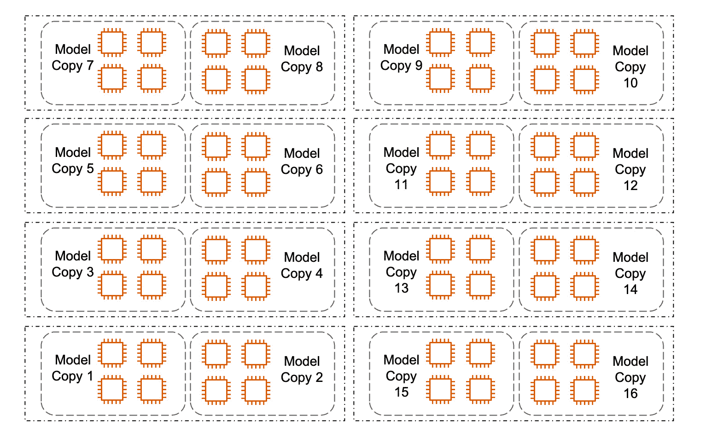

# 第五章：分布式基础

在本章中，您将学习大规模预训练和微调所需分布技术的基本概念。首先，您将掌握**机器学习**（**ML**）的顶级分布概念，特别是模型并行和数据并行。接着，您将了解如何通过 Amazon SageMaker 与分布式软件集成，在您需要的 GPU 上运行任务。您将学习如何优化模型并行和数据并行，以便进行大规模训练，特别是使用诸如分片数据并行等技术。然后，您将学习如何通过高级技术来减少内存消耗，比如优化器状态分片、激活检查点、编译等。最后，我们将通过一些语言、视觉等方面的示例来整合这些概念。

在本章中，我们将讨论以下主要主题：

+   理解关键概念——数据并行和模型并行

+   结合模型并行和数据并行

+   在 Amazon SageMaker 上进行分布式训练

+   减少 GPU 内存的高级技术

+   用当今模型的示例总结所有内容

# 理解关键概念——数据并行和模型并行

我在处理 ML 基础设施时的一些最极端的记忆来自研究生阶段。我将永远记得新作业的压力，通常是需要分析的某个大数据集。然而，往往数据集无法在我的笔记本电脑上存储！我不得不清除掉所有先前的作业，只为开始下载。然后，下载会花费很长时间，而且经常被我不稳定的咖啡馆网络中断。一旦我设法下载完成，我失望地发现它太大，无法加载到内存中！在一个好的日子里，您在*第二章*中接触过的 Python 库 *pandas* 有一个内置的功能来读取这种类型的文件，它可以限制读取为少数几个对象。而在糟糕的日子里，我需要自己构建一个流式读取器。在我设法运行一些分析后，我会选择几个我认为相关且适合的模型。然而，它们似乎训练起来永远也结束不了！我会坐在笔记本电脑前几个小时，确保网络连接不掉线、Jupyter 内核没有崩溃，阅读调试语句，并希望循环能在第二天早上提交报告之前完成。

幸运的是，今天的 ML 开发人员已经有许多这些问题的优秀解决方案——正如我们在上一章中介绍的，Amazon SageMaker 和 AWS 云平台通常就是其中之一。现在，让我们深入拆解其中一个方面：*训练运行时*。事实证明，分布是一个您可以掌握的概念，用来训练极其庞大的模型和数据集。在本章中，我们将探讨两个关键概念，正确使用它们将帮助您将训练规模扩展到您梦想的大小。这两个概念如下所示：

+   **数据并行**

+   **模型并行**

数据并行*为每个 GPU 创建模型副本*，将你的数据集拆分以帮助你更快地训练，而模型并行*将你的模型拆分到多个 GPU 上*，帮助你训练更大的模型。换句话说，数据并行将数据拆分到单节点和多节点设置中的加速器上，并对完全相同的模型应用不同的数据拆分，模型副本数为*N*。另一方面，模型并行将同一个模型拆分到多个加速器和节点上，并为每个模型拆分使用相同的数据。

## 数据并行的基本概念

数据并行在处理极大数据集时非常有用。在最简单的情况下，你可能有一个包含两块 GPU 的实例。假设你正在使用一个小到只能放进单个 GPU 的模型——比如参数数量少于 10 亿——你的数据并行软件框架可能会在每个 GPU 上创建模型的两个副本。这个框架还需要一个**分布式数据加载器**。这个数据加载器需要指向一个单一的源——例如你的训练和测试文件——但是*将每个批次按模型副本的数量进行拆分*。例如，如果你的全局批次大小为 32，则每个 GPU 上的批次大小将变为 16。数据加载器会为你管理这一切，确保每个全局批次在你整个*世界大小*（即你用于训练的所有机器上的 GPU 总数）上正确地拆分和分配。

那么，如何将两个模型变成一个呢？通过简单的平均！前向传播很容易理解：每个模型副本使用每个 GPU 的批次执行一次前向传播。然而，对于反向传播，梯度*会在所有模型副本之间进行平均*。前向传播之后，每个模型副本将其输出发送到集中的控制平面。控制平面计算所有副本输出的加权平均值，并将其与真实值进行比较，然后通过优化器运行梯度下降算法。优化器随后将新的模型权重发送到每个模型副本。每完成一个批次就叫做**一步**，而完整通过一次数据集就叫做**一个周期**。

这一基本概念可以随着你不断增加 GPU 而扩展。这意味着像**SageMaker 分布式数据并行**（**SM DDP**）这样的优秀数据并行软件，将帮助你在单实例和多实例情况下都能在多个 GPU 上运行。我们将在本章稍后的部分学习更多关于 SageMaker 管理的分布式训练库。

但是首先，现在你已经对数据并行有了初步的理解，让我们来探讨分布式的第二个维度：模型并行。

## 模型并行的基本概念

如我们所发现的，今天世界上的许多最先进的模型都是极其庞大的。通常，这些模型的参数范围从几十亿个到几百亿个，偶尔会达到万亿级别。记住，**参数**就是神经网络中的权重。它们是所有层内的内容。当数据通过网络时，每一步都是一个数学函数，利用某种由层类型定义的公式转换输入数据，通常会应用某种激活函数，然后将结果传递给下一层。从计算的角度来看，层本质上是一个列表。这个列表由参数组成！当设置为**可训练**时，这些参数会在反向传播的随机梯度下降过程中发生变化。当设置为**不可训练**时，这些参数将不会改变，从而允许你部署模型或使用下游层进行微调。

那么，我们如何处理大型模型呢？模型并行性就是答案！

模型并行性涵盖了多种帮助你将模型分布到多个 GPU 上的方法。最简单的方法叫做**流水线并行**。在流水线并行中，你的软件框架会将神经网络的各个层放置到不同的 GPU 上。如果你的神经网络有两个非常大的层，且你希望在一个有两个 GPU 的实例上进行训练，你可能会将每个层放到一个 GPU 上。

类似于前述的数据并行示例，你仍然需要一个分布式数据加载器。这个分布式数据加载器仍然会将每个全局批量大小分解成每个 GPU 的**微批次**。然后，模型的每一部分——在这个例子中是模型的每一层——可以一次接收一个微批次进行前向传播。集中的控制平面将会*异步执行每一层*，在适当的时刻将微批次传递到相关层。每一层仍然会看到数据集中的每一项，因此从数学上讲，就像所有层都被打包到某个庞大的单一 GPU 上一样。谢谢你，交换律！

你可以在以下图示中看到该过程的示意图：

图 5.1 – 模型并行

模型并行的另一个关键方面是处理*过大以至于无法在单个 GPU 上容纳的层*。在大型语言模型中尤其常见，正如我们在第一章中了解到的 Transformer 注意力头，它很容易超出现代 GPU 的内存限制。那么我们该如何解决这个问题呢？**张量并行性**，这是分布式训练的第三个维度。在张量并行框架中，您可能会将一个张量的一部分放在一个 GPU 上，而将同一个张量的另一部分放在另一个 GPU 上。集中式的分布式软件仍然会将小批量数据传递给它们，从逻辑上来看，操作没有任何区别。张量并行性是今天训练像 GPT-3 这样的大型模型的必备技术，GPT-3 拥有 1750 亿个参数或更多。

若想了解更多关于模型并行性，尤其是通过 SageMaker 模型并行性提供的分布式库，可以查看我们在该主题上的论文(*4*)。现在，您已经了解了分布式训练中的两个基础主题，分别是数据并行性和模型并行性，接下来让我们学习如何将它们结合起来！

# 结合模型并行和数据并行

正如您之前可能已经怀疑的那样，正如通过规模定律得到的实验证据所显示的，*大型模型只有与大数据集结合时才有效*。换句话说，如果您将一个极大的模型与一个小型或中型的数据集一起使用，您极有可能会导致模型过拟合。这意味着它可能最终会学会如何复制您提供的核心示例，但很难应对新的挑战。

出人意料的是，反过来并不一定成立。作为一个一般规则，随着数据集规模的增加，增大模型规模通常是有帮助的。然而，在大多数计算机视觉的应用场景中，模型规模很少会超过单个 GPU 的内存限制。我可以说，我与之合作的绝大多数视觉客户，从自动驾驶汽车到制造业，从金融服务到医疗保健，都倾向于使用能够很好地适应单个 GPU 的模型。在这些情况下，仅使用数据并行就能显著提高训练过程的吞吐量，因为每增加一个 GPU 上的模型副本，您的训练速度就会提升。

然而，在 **自然语言处理**（**NLP**）中，通常情况并非如此，最具性能的模型通常至少需要几个 GPU，有时甚至需要数百个或数千个 GPU。在这些情况下，*您可以预期使用模型与数据并行的组合*，正如 Alpa 早期示例（*5*）所演示的那样。模型并行使您能够将模型保存在 GPU 的活动内存中，而数据并行则通过复制模型并增加每步处理的数据量来提高整体速度。当即便一个模型的副本也需要多个 GPU 时，意味着每增加一个副本都需要相同数量的 GPU。因此，如果您的模型需要 4 个 GPU，基于数据大小，您使用扩展规律来确定总计算预算包括 64 个 GPU（8 个实例，每个实例有 8 个 GPU），那么您将拥有 16 个模型副本！这是因为每个 8-GPU 实例可以容纳 2 个副本的模型。让我们通过图示来进一步分析：

图 5.2 – 模型与数据并行

记住——每个模型副本通过模型并行进行处理。然后，所有模型副本的合并则通过数据并行处理。看起来很复杂，对吧？但希望这些概念开始在您脑海中扎根——一旦它们明确，所有这些术语和想法就会开始变得有意义。记住——您并不孤单，我们有一个完全托管的服务来帮助您在令人难以置信的规模上训练模型！在下一部分，我将与您分享 Amazon SageMaker 在自动化、管理和为您提供支持方面的一些内容，帮助您更快地达成目标。

# Amazon SageMaker 上的分布式训练

在上一章中，我们大致了解了 SageMaker。现在，我想深入探讨分布式训练的能力。我们可以将这些能力分为四个不同的类别：容器、编排、可用性和大规模性能。

正如我们在前面章节中所学到的，AWS 提供了 **深度学习**（**DL**）容器，您可以轻松地将它们指向自己的脚本和代码。这些容器作为您项目的起点是强烈推荐的，因为所有的框架、版本和库都已经为您进行了测试和集成。这意味着您只需根据使用的深度学习框架选择一个容器——例如 PyTorch 或 TensorFlow——*并且这个容器已经在 AWS 和 SageMaker 上经过测试*。您还可以选择这个容器的 GPU 版本，它已经编译并安装了所有 NVIDIA 库，以便在您的 GPU 上顺利运行。然而，如果您有自己的容器，您可以直接将它推送到 Amazon 的 **弹性容器注册表**（**ECR**），并用于训练。您还需要添加训练工具包，以启用自定义容器的所有训练功能，如入口点脚本、日志输出、热池等。

一旦选择了您的镜像，您就可以开始格式化您的脚本！在 SageMaker 上，我们使用 `CreateTrainingJob`，这是一个您会非常熟悉的概念。核心思想是您使用您的估算器指向基本对象，例如您的 DL 容器、您的脚本和所有作业参数。然后，您只需调用 `estimator.fit()`。这将提交您的调用到 `CreateTrainingJob` API，然后执行命令以创建作业！

记住，SageMaker 训练 *在训练期间为您初始化远程实例*。这意味着一旦您执行了 `estimator.fit()`，然后在**训练作业**下的控制台中，您将看到新初始化的实例。这些由服务管理。一旦实例初始化完成，它们将把您的数据复制到其中，下载您的镜像，并在您的数据上运行训练脚本。所有日志都发送到 CloudWatch，并维护作业的所有元数据。这意味着您的实验是可以默认重现的！一旦作业完成，训练好的模型工件将代表您发送到亚马逊 **简单存储服务**（**S3**）。

现在，您一定在想：对于只使用一个 GPU 的脚本来说，这似乎是可行的。但如何使用多个 GPU 呢？答案很简单：软件！

## 分布式训练软件

从一个 GPU 扩展您的代码的关键步骤是使用正确的软件来做这件事。而对您来说，今天有许多选择。在 SageMaker 上，您可以使用任何您想要的开源软件；轻松带入额外的软件包、脚本和框架到 `training` API。这意味着您可以在我们的训练 API 中实现任何一种顶级分布式训练框架。其中一些包括 DeepSpeed ZeRO-3D、Megatron-LM、PyTorch **分布式数据并行**（**DDP**）、Horovod 等等。如果您已经在这些框架中运行代码，您扩展的第一步很可能就是将其移至 AWS 和 SageMaker。然而，如果您仅使用开源分布式框架，*您可能会错失效率收益*。

这些效率收益的原因根本来自于我们在亚马逊经常使用的一个概念：*经验没有压缩算法*。这字面意思是亚马逊在优化云上的 DL，特别是大规模 DL 方面不断做出了很多改进。特别是我们有一个软件解决方案，SageMaker 分布式训练库，帮助您在 AWS 上实现最先进的性能。

我们将更深入地探讨不同的分布式训练软件的细微差别，包括关键的设计决策，如参数服务器和基于环的方法的区别，在*第八章*中。现在，让我们从高层次探索可用的库。

## SM DDP

记得在 *第四章*中，我们学习了一个叫做**通信集体**的概念。这些是旨在促进多 GPU 分布式梯度下降的核心算法。然而，**NVIDIA 集体通信库**（**NCCL**）实际上是针对特定基础设施设计的：InfiniBand。这是一种极其宽松的网络解决方案，支持超过 1 TB 的通信传输。将其投入使用是相当昂贵的，并且需要大额的前期投资才能在本地获取并使用该解决方案。

在 AWS，我们设计了自己的定制通信集体，这些集体是专门为 **弹性计算云**（**EC2**）网络拓扑构建的。它们使得在 AWS 上实现最佳性能成为可能，能够扩展到数千个 GPU 甚至更多，而不会带来巨大的网络开销。与这些定制集体交互的主要方式是通过 SM DDP (*3*)。SM DDP 是一种完全托管的数据并行软件，通过后端与你的训练脚本集成。这意味着你可以使用自己的数据并行神经网络软件——特别是 PyTorch DDP、Hugging Face 的 Accelerate 或 TensorFlow 的 Horovod——并简单地将 SM DDP 设置为你的后端。

设置 SM DDP 作为你的后端的主要原因是为了**提高扩展效率**。如果没有 SM DDP，你可能会使用一些并非专门为 AWS EC2 实例拓扑设计的通信集体算法。因此，当你向整体集群中添加更多实例时，你会体验到 *收益递减*。从理论上讲，在一个完美的世界里，你应该能够通过将节点从一个增加到两个，精确地将训练时间缩短一半。将节点从一个增加到三个应该将训练时间缩短三倍。将节点从一个增加到四个应该将训练时间缩短四倍。这个理论上的极限被称为**线性** **扩展效率**。

然而，我们并不生活在一个完美的世界。从计算角度来看，这种线性扩展效率实际上是无法达到的。你将看到的是一些接近更好扩展效率的尝试，例如通过 SM DDP 提供的更好的通信集体算法。SM DDP 在更大规模下的效果尤其显著。例如，如果你比较一个使用 PyTorch DDP 的 8 节点集群与一个使用 SM DDP 的相同集群，SM DDP 作业的性能可能会提高多达 40%。这些提升是大规模的。这意味着不仅你的实验结果返回更快，给你更多时间尝试新想法并更快地将解决方案推向市场，而且训练的实际计算成本也大大降低！

现在我们了解了 SM DDP 库，让我们探索在 AWS 上获取扩展效率提升的另一种选择：**SageMaker 模型并行**（**SMP**）库。

## SMP 库

记住，在本章前面，我们介绍了 Amazon SageMaker 上的大规模训练。我们还澄清了，这使得你可以在不受分布式软件限制的情况下，在任意数量的 GPU 上运行任何开源库。在模型并行性方面，这包括 DeepSpeed、Megatron-LM 等。然而，为了真正充分利用 SageMaker 提供的所有性能增强，我强烈建议你评估 SMP 库。本书中，我们将详细使用这个库。

SMP 是一个由 AWS 构建和管理的 Python SDK，帮助你轻松地将神经网络模型扩展到多个 GPU 上。SMP 与 PyTorch 集成得很好，并提供了先进的功能，帮助你将模型扩展到从少数几个到几百甚至几千个 GPU 上。这些功能包括流水线并行性、张量并行性、优化器状态分片、激活卸载与检查点、分片数据并行性等。在本章后面，我们将探讨这些高级功能，但首先，让我们简单了解如何配置和使用库来进行基础的模型分布。

一般来说，一旦你拥有一个能在单个 GPU 上训练的有效 PyTorch 模型，就可以开始评估如何扩展它。首先，确保你正在使用的基础容器与 SMP 兼容。如果你使用的是 AWS 管理的支持 GPU 的 DL 容器、SageMaker 和训练，那么你已经准备好进入下一步。如果没有，请按照文档步骤（*1*）从任意基础镜像扩展一个预构建的 Docker 容器。

一旦确保你的容器支持 SMP，就可以将库集成到你的训练脚本中。这主要集中在以下三个关键方面：

1.  将库导入你的脚本。从 2022 年 11 月开始，这仅仅是执行以下命令：`import smdistributed.modelparallel.torch` `as smp`。

1.  使用相关的`smp`对象包装你的模型和优化器。实际上，这非常简单。完成用 PyTorch 定义神经网络后，或者在从 Hugging Face 加载 PyTorch 模型后，只需将其作为参数传递给`smp.DistributedModel()`对象。接着，像平常一样在脚本的其他部分继续使用你的模型。优化器的结构类似。

1.  重构你的训练循环，包含两个独立的函数，一个是**训练步骤**，另一个是**测试步骤**。这两个函数都应当接收你的模型、优化器和其他相关参数。训练步骤应当将数据通过网络向前传递，计算损失，通过优化器将其反向传播到网络中，并返回损失值。测试步骤仅需计算损失，并返回损失值。

对于训练和测试步骤函数，你需要*添加一个 Python 装饰器*，将它们声明为`@smp.step`。这个装饰器非常关键，因为*这个函数中的所有内容都会被切分到多个 GPU 上*。SMP 库会显式地评估这些函数中的活动，特别是你的模型以及数据如何在其中流动，以便将模型最优地分配到多个 GPU 上。

一旦你的脚本完成了这些以及其他一些相关的更改，你将需要进行最后一次配置。在 SageMaker 训练作业估算器中，添加另一个名为`distribution`的参数。正如我们在本书中将看到的，这个参数将允许我们配置 SageMaker 训练后端的多个方面，包括 SMP 和 SM DDP。传递一个标志来启用 SMP，并包括其他相关参数。你还需要启用**消息传递接口**（**MPI**），这是我们在本书前面学到的。MPI 是一个开源框架，能够在训练过程中使你的节点之间进行通信。SMP 通过 MPI 来跨节点通信。

最后，测试你的脚本！在 SageMaker 训练中测试模型并行性的一个简单方法叫做**本地模式**。本地模式是一个非常有用的技术，它允许你在不等待集群启动开销的情况下开发 SageMaker 训练 API，包括容器、数据指针、脚本和作业参数。你可以在任何运行 Docker 的地方使用 SageMaker 本地模式，比如 SageMaker 笔记本实例，甚至是你本地的笔记本电脑。截至本书写作时，Studio 不支持本地模式。本地模式帮助你在编写代码时快速而轻松地进行步骤，确保一切设计合理并且正常工作。

一旦你通过从 Hugging Face 导入一个更大的版本，或者通过手动增加 PyTorch 定义中的参数数量，已经增大了模型的规模，并且有证据表明它在至少两个 GPU 上运行良好，那么就可以开始探索 SMP 库中的高级技术，减少你的整体 GPU 内存占用。

# 减少 GPU 内存的高级技巧

现在，假设你已经深入到项目中。你已经确定了数据集、使用场景和基础模型。你在 SageMaker 上进行了小规模的测试，例如在模型的最小版本上使用 1%的数据，并且效果不错。你已经使用了扩展法则，或者通过另一个示例看到大型模型能够帮助提高准确性，并且你确信自己有足够的数据来证明更大的模型是合理的。你已经将模型规模增大，至少能够在两个 GPU 上运行，并且已经在 AWS 上成功测试过。

如果你还没有达到这些阶段，那么老实说，我建议你直接跳到下一部分。在这里，我们将深入探讨模型并行的前沿领域，这些话题非常复杂、细节丰富且小众。如果你还没有准备好，比如没有经历我之前提到的所有前置阶段，那么最好现在跳过这个话题。你可以随时回来参考这些内容。特别是如果你在这个领域是初学者，我们将讨论的话题可能会让你不知所措，进而影响你继续进行分布式训练。你依然可以训练像 Stable Diffusion 这样的最先进的模型，而不需要使用极大规模的模型并行。然而，对于那些准备好完全深入模型并行世界的人，我们现在可以开始了！

你可能已经注意到，将一个模型分割到多个加速器上会自然地*减少模型的 GPU 内存占用*。换句话说，当一个模型太大，无法放入单个 GPU 时，它会受到该 GPU 可用内存的瓶颈限制，因此我们需要一种方式来减少其内存占用。将模型分割到多个 GPU 上是实现这一点的一种方法，但这并不是唯一的方式。接下来，我们将介绍更多方法。

一旦你将训练脚本与 SMP 库集成，使用其余功能就像添加和移除超参数一样简单。虽然编写代码实现它们非常简单，但理解它们并成功设计是相当具有挑战性的。首先，让我们回顾一下基础知识。`pipeline_parallel_degree` 参数表示你将如何在多个 GPU 之间分配模型。例如，如果你的机器有 8 个 GPU，并且你将 `pipeline_parallel_degree` 设置为 `2`，那么根据你在模型中分配参数的方式，模型可能会被分成两半。如果每一半使用 4 个 GPU，那么整个模型就能使用 8 个 GPU，每一半使用 4 个 GPU。如果你想在此基础上增加数据并行度，你还需要另一个实例。

你还需要考虑每个 GPU 的批量大小。在 SMP 库中，我们称之为 `microbatches`。整个*第七章*都在讨论如何找到正确的超参数，但在这里你需要理解的是，*增加批量大小会直接增加 GPU 利用率*。模型并行的核心目标是找到有效的方式来减少模型的 GPU 内存占用，这样你就可以增加批量大小——从而提高 GPU 利用率——这减少了作业的总体运行时间，因此也降低了成本。然而，正如你在*第七章*中会学到的，精确的模型通常需要较小的批量大小。Yann LeCunn 在 Twitter 上著名地表示，“*朋友们不会让朋友使用超过 32 的批量大小*”。

除了流水线并行和微批次，理解模型并行性时，还需要掌握一些其他关键术语，包括张量并行、优化器状态分片、激活检查点和分片数据并行。

## 张量并行

虽然流水线并行性使我们能够将神经网络的不同层分配到不同的设备上，但在张量并行中，我们将这一步走得更远，*进一步拆分层本身*。通常，这在极端模型并行的情况下很常见，例如具有超过 1000 亿个参数的 GPT-3 类型的模型。在 SMP 中，你可以通过`tensor_parallel_degree`简单地启用这一点。确保将单个层的所有部分保留在同一个节点内，因为这对于最大化训练集群中的带宽至关重要。

如果你特别好奇，要将模型规模扩展到 1 万亿参数，另一种有用的技术是备用网络。这最早在 2017 年提出(*6*)，作为**专家混合**（**MoE**）技术，用于在训练过程中仅激活神经网络的一部分，从而实现更高效的扩展到超大参数规模。一支来自华为的分布式训练团队提出了一个专门针对 transformer 的更新，实施了他们所称的**随机路由专家**。令人印象深刻的是，他们声称这项工作在超过 100 天的时间里仅使用了 512 个加速器，显著提升了中文 NLP 任务的最前沿(*7*)。然而，在本书的其余部分，我们将主要关注适用于几百亿参数的密集型网络。

## 优化器状态分片

当你的神经网络中的可训练权重或参数数量非常大时，你可以预期优化器也会变得同样庞大。如果你在训练集群中有多个模型副本，比如结合使用数据并行和模型并行，那么可以通过设置`shard_optimizer_state : True`来考虑将优化器进行拆分。有趣的是，这样做将`DistributedOptimizer`对象的作用域仅限于该数据并行 rank 中所持有的参数。这些参数被称为**虚拟参数**，并且与原始参数共享底层存储。

## 激活检查点

激活检查点实际上是一种*通过增加计算时间来减少内存开销*的技术。换句话说，当启用激活检查点时，你可以将更多对象加载到清空的 GPU 内存中，但代价是每一步的计算会稍微变长。这是通过清除某些层的激活值并在反向传播时重新计算它们来实现的。

## 分片数据并行

亚马逊的一个团队在 2022 年开发了一种新颖的策略，用于在 AWS 上优化大规模分布式训练。特别是，他们意识到 *并非所有 GPU 都应被平等对待*。当你试图优化通信集群时，*假设某些组合的模型和数据并行*，这一点尤为重要。他们设计了一种分层方法，用于分布式训练的 **完成证书** (**CCLs**)，这种方法首先在数据并行组内（文档中称之为“分片”）进行检查，然后在数据并行组之间进行检查。这种方法最大程度地减少了在反向传播过程中同步梯度时所需的整体通信量，从而提高了工作的整体速度。因此，他们将其命名为：**最小化通信规模**，或称 **MiCS** (*8*)。这种 MiCS 技术已在 SageMaker 的 SMP 库中提供，称为 **分片数据并行**。

现在你已经了解了一些先进的方式来减少整体 GPU 消耗并加速你的任务，让我们通过一些有趣模型的示例来帮助你将这些概念整合在一起。

# 通过今天模型的示例，将这一切带回家

记得我们在书中早些时候学习到的内容，*真正的每个先进模型都需要一定的分布式处理*。这是因为好的模型源于好的数据集，而好的数据集往往非常庞大。处理这些数据集需要时间，因此你需要分布式地处理任务，以便及时完成。有些模型的规模太大，无法放入单个 GPU，所以它们需要一定程度的模型并行处理。但也有一些模型相对较小，只需要数据并行处理即可。让我们通过今天一些顶级模型的两个例子来进一步探讨：Stable Diffusion 和 GPT-2。

## Stable Diffusion – 大规模数据并行处理

Stable Diffusion 是一个迷人的模型，它使你能够 *从文本中生成图像*。训练完成后，你只需提供文本输入给 Stable Diffusion，它就会为你生成一幅新的图片！尽管研究人员从至少 2017 年起就尝试过这种方法，但 Stable Diffusion 的表现已经接近人类水平的创造力。与之具有相似表现但未公开共享的模型包括 Imagen (*9*) 和 DALL-E (*10*)。它生成的图像质量几乎可以立即使用。虽然在偏见、图像控制、分辨率和常识推理等方面仍然存在问题，但自 2017 年以来，技术的飞跃真是令人兴奋。

对于普通的 Python 开发者来说，幸运的是，Stable Diffusion 是一个小型模型！它的设计使得它可以适配单个 GPU，这意味着只需要稍微编写一些脚本和一块中等性能的 GPU，你就可以轻松地搭建自己的演示。Stable Diffusion 成功的驱动因素有几个，具体如下：

1.  他们在训练过程中使用了四种模型：CLIP 分词器、CLIP 文本编码器、**变分自编码器**（**VAE**）和 2D 卷积 U-Net。分词器和编码器使用智能语言模型处理文本数据，而 VAE 对图像进行编码并将其转换为更小的潜在空间。

1.  在“扩散”或学习过程中，他们将噪声添加到这些相同的潜在图像中。使用语言模型编码的文本，他们试图预测噪声残差，计算损失并将其反向传播通过 UNet。

1.  他们使用了数十亿张图像！他们的训练数据和代码都是公开可用的。就我个人而言，我编写了脚本将 5000 万张图像下载到 AWS 上的优化分布式文件系统 FSx for Lustre，并使用了接近 200 个 GPU 在 Amazon SageMaker 上对这个庞大的数据集进行了几步操作。他们原始的数据集是**LAION-5B**，其中的“**5B**”代表 50 亿。这些数十亿张图像来自互联网，每张图像都有相应的文本描述。然后，在训练过程中，他们的模型将这些图像与描述结合起来。

这意味着，当你读完这一章后，如果你已经对数据并行性有了深入的理解，那么你就具备了训练自己稳定扩散模型所需的所有知识！无论是预训练还是微调，情况都是如此。在下一章中，我们将深入了解数据加载器，你将学会如何为预训练或大规模微调准备新数据集。但首先，让我们通过一个复杂的模型并行案例研究来分析：GPT-3。

## GPT-3 – 大规模的模型和数据并行

正如我们在 *第一章* 中学到的那样，GPT-3 是一个非常重要的模型。当 OpenAI 团队将模型规模提高了 10 倍，并且将准确率提升了三倍，从 GPT-2 迁移到 GPT-3 时，他们引发了一场全球性的运动，现在这几乎与**人工智能**（**AI**）同义。正如我们在本章中所学到的，扩展的核心步骤是模型并行性。让我们来解开对于拥有超过 1000 亿参数的模型，这一过程是如何运作的！

我们先来估算一下模型本身的内存大小。首先，我们按参数数量来计算——假设是 1000 亿个参数。那么，对于一个使用 `FP16` 数据类型和 Adam 优化器的任务，你可以假设单个 FP16 参数大约占用 2 字节，FP16 梯度占用的字节数也差不多。所以，对于一个有 100 亿个参数的模型，你至少需要 200 GB 的 GPU 内存。一个有 1000 亿个参数的模型则需要大约 2 TB 的 GPU 内存！

假设每个设备可用 40 GB 的 GPU 内存，如 `p4d.24xlarge` 实例的配置，那仅为了在内存中存储一个完整的模型副本就需要 50 个 GPU。每个 `p4d.24xlarge` 实例有 8 个 GPU，所以每个模型副本大约需要 6 个 `p4d` 实例。假设你既想要一个准确的模型，又不希望等上几年才能完成训练，你将需要多个模型副本。我曾经帮助客户在 SageMaker 上使用 128 个 p4d 实例训练这类大型语言模型，这样的配置大约可以在 1,024 个 GPU 上分布 20 个模型副本。

若想通过脚本示例更好理解这一过程的实际应用，建议查阅我们在 GitHub 上的 *SageMaker 示例* 仓库中的笔记本。如果你在仓库中搜索 `GPT-2` 或 `模型并行`，应该能找到相关内容。目前的链接在这里：(*2*)。

如果你检查笔记本，你会注意到一些细节：

+   它提供了不同的模型训练尺寸，从最小的开始，一直到数十亿个参数。

+   每个不同的配置都需要略微不同的超参数。

*第七章*的全部内容都在讲如何选择这些配置。现在，你刚刚了解到为何这一过程如此具有挑战性且重要！在配置工作时，你需要确定你的分发策略，集成模型和数据并行、总体世界规模、任何额外的 GPU 内存优化技术、模型大小及相关参数等等。

但不要灰心——我们还有很多东西需要学习。现在，让我们通过一个简短的总结来结束这一章。

# 总结

在这一章中，你学习了分布式训练的基础知识。你了解了数据并行和模型并行这两个关键概念，这将帮助你将训练规模扩展到接近最新技术的水平。你还学会了如何结合这两者，特别是如何利用像 Amazon SageMaker 这样的托管编排平台，帮助你无缝地使用成百上千个 GPU，并借助优化的分布式训练库进行工作。接着，你了解了先进的 GPU 内存优化技术，并通过 Stable Diffusion 和 GPT-3 等实际示例将其付诸实践。

在下一章，我们将深入探讨构建数据加载器所需的工程基础知识和概念！

# 参考文献

请浏览以下内容，了解章节中涉及的几个主题：

1.  *SMP* *库*：[`docs.aws.amazon.com/sagemaker/latest/dg/model-parallel-sm-sdk.html#model-parallel-customize-container`](https://docs.aws.amazon.com/sagemaker/latest/dg/model-parallel-sm-sdk.html#model-parallel-customize-container)

1.  *Amazon SageMaker* *示例*：[`github.com/aws/amazon-sagemaker-examples/blob/main/training/distributed_training/pytorch/model_parallel/gpt2/smp-train-gpt-simple.ipynb`](https://github.com/aws/amazon-sagemaker-examples/blob/main/training/distributed_training/pytorch/model_parallel/gpt2/smp-train-gpt-simple.ipynb)

1.  *SM DDP* *库*：[`docs.aws.amazon.com/sagemaker/latest/dg/data-parallel.html`](https://docs.aws.amazon.com/sagemaker/latest/dg/data-parallel.htmll)

1.  *Amazon SageMaker 模型并行：一个通用且灵活的大型模型* *训练*框架：[`arxiv.org/pdf/2111.05972.pdf`](https://arxiv.org/pdf/2111.05972.pdf)

1.  *Alpa：自动化分布式深度* *学习*的操作间与操作内并行性： https://www.usenix.org/conference/osdi22/presentation/zheng-lianmin

1.  *极大规模神经网络：稀疏门控专家混合* *层*：[`arxiv.org/pdf/1701.06538.pdf`](https://arxiv.org/pdf/1701.06538.pdf)

1.  *Pangu-Σ：迈向万亿参数语言模型与稀疏异构* *计算*：https://arxiv.org/pdf/2303.10845.pdf

1.  *MiCS：在公共* *云*上训练巨大模型的近线性扩展性：https://arxiv.org/pdf/2205.00119.pdf

1.  *照片级真实感文本到图像扩散模型与深度语言* *理解*：[`arxiv.org/pdf/2205.11487.pdf`](https://arxiv.org/pdf/2205.11487.pdf)

1.  *零样本文本到图像* *生成*：[`arxiv.org/pdf/2102.12092.pdf`](https://arxiv.org/pdf/2102.12092.pdf)
