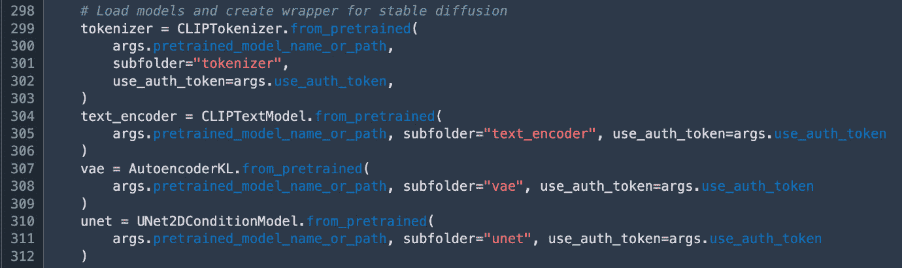

# 第六章：数据集准备：第二部分，数据加载器

*与数据融为一体。 – Andrej Karpathy*

在本章中，你将学习如何准备数据集，以便立即将其与选择的模型一起使用。你将掌握数据加载器的概念，了解它为何在训练大型模型时是常见的错误来源。你还将学习如何创建嵌入、使用分词器以及其他方法，将原始数据特征化，以适应你首选的神经网络。按照这些步骤，你将能够准备整个数据集，涵盖视觉和语言任务。最后，你将学习如何在 AWS 和 Amazon SageMaker 上进行数据优化，以高效地将大大小小的数据集发送到训练集群。在本章中，我们将从训练循环的后端开始，逐步为你提供所需的所有步骤，帮助你在大规模训练中构建功能性深度神经网络。你还将跟随一个案例研究，了解我如何在 SageMaker 上训练了 10TB 数据用于 Stable Diffusion！

永远不要低估数据的力量。无论是获取尽可能高质量的样本和标签，还是未能捕捉到微妙的损坏，抑或是优化计算选择，数据都能真正决定你项目的成败。许多顶尖的深度学习模型实际上是通过开发一个新颖的数据集诞生的，从 MNIST 到 AlexNet，从 GPT-3 到 Stable Diffusion！当我们在机器学习中思考宏大时，往往意味着对你的数据集进行宏大的思考。

你无法拥有一个功能完整的训练循环，除非你有一个功能完善的数据加载器，所以让我们来解析它！在本章中，我们将覆盖以下主要主题：

+   通过 Python 中的关键概念介绍数据加载器

+   构建并测试你自己的数据加载器：来自 Stable Diffusion 的案例研究

+   嵌入和分词器

+   在 AWS 上优化你的数据管道

+   在 AWS 上大规模转换深度学习数据集

# 在 Python 中介绍数据加载器

数据加载器是一个深度学习中特有的概念。在统计机器学习中，你仍然会看到许多模型使用梯度更新，这需要小批量数据，但其*加载*方面更为隐蔽——更多地与算法本身集成。PyTorch 从早期便采纳了这一概念，明确地提供了一个`data loader`对象，并将整个训练循环暴露给开发者。尽管比早期的 TensorFlow 稍显复杂，但这实际上使开发者在训练过程中拥有了更多的灵活性和控制权，从而帮助他们更轻松地开发定制解决方案。这也是越来越多的研究项目最终选择 PyTorch 而非 TensorFlow 作为其深度学习框架的原因之一。现在，我接触到的大多数模型都是首先在 PyTorch 中实现的，偶尔会用 TensorFlow。

数据加载器是什么？数据加载器*为你的训练循环注入数据*。大多数 PyTorch 训练循环实际上只是嵌套的循环。首先，外部循环遍历训练的轮次（epochs）。每个轮次是对数据集的完整遍历。也就是说——你猜对了——*内部循环其实就是对数据加载器的遍历*。这意味着，数据加载器需要在底层使用一个非常有用的 Python 对象，称为**迭代器**。

首先，我们快速了解一下 Python 中的对象，然后逐步构建数据加载器。

图 6.1 – Python 中的类

记住，Python 是一门**面向对象**的语言。这意味着，大多数时候，当你在使用 Python 时，你是在与对象打交道。类则是构建、维护和使用对象的便捷方式。

大多数情况下，在现实世界中，你不会自己构建对象，除非你正在构建一个新的软件 SDK。通常，作为服务的消费者，你只是使用别人已经构建好的对象，并开发脚本将其集成到你的任务中。这在深度学习中也同样适用；我们的大多数对象已经在 PyTorch、pandas、sklearn 等软件包中实现。

那么，如果我想一次性指向一个非常大的列表，但每次调用该函数时只返回预定义数量的对象呢？我需要自己构建整个结构吗？现在我不再是研究生了，可以很高兴地说不需要！我只需使用一个迭代器，就像下面截图所示的那样。

图 6.2 – Python 中的简单迭代器类

Python 迭代器是为这种场景特别设计的，能够多次调用一个对象，但每次返回不同的项目。Python 中许多对象都支持迭代器，比如列表和字典。将它们转换为迭代器通常非常简单。你需要做两步，首先在定义核心对象时，将其作为迭代器，这里使用 `iter()` 语法。其次，当你调用迭代器来提供下一个批次的项目时，使用 `next()`。可以预期语法会发生变化，但大部分概念会保持不变。

构建数据加载器时，你的任务*并不是*从头开始构建一个类。你的任务是使用一些软件框架，如 NumPy、Hugging Face、PyTorch 或 TensorFlow，来接收你想要使用的数据。然后，你需要使用那些预先构建好的数据加载器来遍历你的批次，并将它们填充到训练循环中。

现在你已经知道数据加载器应该做什么，接下来让我们探讨如何构建你自己的数据加载器。

# 构建和测试你自己的数据加载器——以 Stable Diffusion 为案例分析

数据加载器的语法有可能发生变化，所以我不想过于依赖 PyTorch 当前的实现。不过，让我先提供一张简单的截图：

图 6.3 – 在 PyTorch 中使用数据加载器

这实际上来自我在 2022 年 re:Invent 大会上与 SageMaker 的 Gal Oshri 和 AI21 的 Dan Padnos 一起进行的大规模训练演示：[`medium.com/@emilywebber/how-i-trained-10tb-for-stable-diffusion-on-sagemaker-39dcea49ce32`](https://medium.com/@emilywebber/how-i-trained-10tb-for-stable-diffusion-on-sagemaker-39dcea49ce32)。在这里，我使用 SageMaker 和 FSx for Lustre 训练 Stable Diffusion，数据量为 10 TB，FSx for Lustre 是为高性能计算设计的分布式文件系统。关于这一点以及相关优化将在本章后面详细介绍！

正如你所看到的，实际上唯一困难的部分是构建输入的训练数据集。一旦你有了一个有效的数据集对象，获取一个有效的数据加载器就像把最新的语法复制到你的脚本中并确保它有效一样简单。所以，你可能会问，我们如何获得自己的训练数据集？一个词：字典！

在我当前的设置中，我有一个在 Studio 上运行的 Jupyter 笔记本。我根据是否需要进行大规模或小规模处理，不断升级和降级运行我的内核网关应用程序或临时笔记本的实例。在这个笔记本中，我开发了我确信能够工作的脚本和函数，然后将它们复制到在 SageMaker 训练任务上运行的主脚本中。这就是我构建自定义数据加载函数的地方。

Hugging Face 提供了一个很好的`load_dataset()`函数，可以从其数据集库加载数据，但经过几个小时的搜索和测试，我还是无法使它与我的自定义数据集一起工作。所以，我最终构建了自己的数据加载器后端，然后指向了`DatasetDict()`对象。在我的笔记本中，它看起来是这样的：

图 6.4 – 在 Hugging Face 中创建你自己的 DatasetDict 对象

很简单，对吧？你可以看到，我显然有一个训练集，它本身只是指向 Hugging Face `Dataset`对象的`train`词。你还可以看到，这个数据集中只有 1,736 个对象，这很好，因为我仅使用一个`ml.t3.medium`实例来运行我的笔记本，而这个实例非常小。当我需要指向并测试一个更大的数据集时，我只需在 Studio 中几次点击就能升级我的实例，突然间，我的实例内存达到数百 GB，数十个 CPU 核心触手可及！

当它简单时，那是由于优雅的设计决策。你的代码应该像诗歌一样：简短、简单、有效、富有表现力。强大。这可以追溯到莎士比亚：

简洁是智慧的灵魂。

对于我的 Stable Diffusion 数据集，我下载了 5000 万个图像和标题对。关于我是如何做到这一点的，稍后会在本章中介绍！

在这之后，我意识到，浪费宝贵的 GPU 时间将整个数据集加载到内存中是极其低效的。这是因为我的实现，尽管毫无疑问可以改进，却懒散地列出了所有图片，逐一查看，读取标题，并将其与指针一起存储。

现在，幸运的是，我至少可以使用 Python 的多进程包并发列出图片，每个 CPU 核心处理一张，但对于 5000 万张图片，这可能需要 24 小时才能完成。更何况，我只需要一台机器来执行此任务。我的训练集群有 24 台`ml.p4d.24xlarge`机器，所以我不打算让这些主机闲置，等着我列出图片并逐一查看。因此，我构建了一个索引！

在这里，索引只是一个 JSON Lines 对象。让我们来检查一下！

图 6.5 - 检查数据索引

我花了几天时间构建了整个过程的端到端流程：

1.  首先，我在 SageMaker 上使用一些玩具数据测试了我的训练脚本，确保它能正常工作。

1.  然后，我使用多个大型 CPU 机器在 SageMaker 上下载了一个新的数据集。

1.  接下来，我将数据集放到了 FSx for Lustre 上。我在 SageMaker 上进行了测试，指向了相关的**虚拟私有云**（**VPC**）位置。

1.  然后，我在 Studio 中复制了一个小版本，仅包含几个对象。我编写了一些脚本来解析这些对象，确保它们在执行过程中能够扩展并且可操作。我将这些脚本移到了 SageMaker 的训练作业中，并在一个大型 CPU 机器上进行了过夜运行。

第二天早上，我构建并测试了我的索引加载器，在它正常工作时将其移到了 SageMaker 训练中。现在，我正在 16 个`ml.p4d.24xlarge`实例上运行，或者说 128 个 A100 GPU。明天，我将在 24 个`ml.p4d.24xlarge`实例上进行完整的运行，处理 5000 万张图片，或者 192 个 GPU。如果我能做到端到端运行，你也可以！

在本章中，我将与您分享整个管道的优化方案，但现在，让我们拆解一下这条训练流程中的一个关键环节，这对为您选择的模型准备数据至关重要：分词器。

# 创建嵌入——分词器和其他智能特征的关键步骤

现在，您已经测试并构建了数据加载器，并可能进行了扩展，您可能会在想，我该如何处理这些原始图片和/或自然语言字符串？我是否直接将它们丢进神经网络？事实上，过去五年的学习表示已经明确证明了这一点：不，您不应该直接将原始图片或文本输入到神经网络中。您应该通过使用另一个模型将原始输入转换为嵌入。

这个直觉非常简单：在你教会模型如何识别数据集中的关系之前，你首先得向它介绍数据集的概念。创建嵌入基本上就是这么做的；你使用一个已经通过其他过程训练过的数据结构来创建你数据的向量表示。也就是说，你将原始文本和图像作为输入，然后得到高维的向量作为输出。这些向量是通过你希望它能够捕捉到数据之间细微关系的有效过程生成的。在多模态设置中，像 Stable Diffusion 这样的模型，你实际上会使用不同的过程来处理视觉和语言的嵌入，将它们分别输入到你的模型中，并通过学习循环进行集成。

自然语言通常使用一种叫做**分词（tokenization）**的过程。每个模型都有一个独特的分词器，这个分词器是基于特定词汇表训练出来的。如果你想要预训练或微调一个类似于 GPT-3 的模型，你需要下载与模型一起提供的分词器，并将其应用到你的数据集上。这个分词器会有独特的方式将字符串拆分成单词、子词或字符，具体取决于模型的不同。最终，每个词元都会被转换成一个高维向量，或者用更简单的术语来说，就是一个非常长的数字列表。我们称之为**向量嵌入（vector embeddings）**。许多词嵌入还包括**位置编码（positional encoding）**，这是一种用数值表示特定单词或词元在句子中相对于其他单词位置的方式。这种位置编码帮助基于变换器（transformer）的模型理解该数据集中特定单词的含义。如果你正在预训练一个全新的模型或数据集，你可能最终需要训练你自己的分词器。

在计算机视觉中，一种常见的生成图像嵌入的方式是*使用预训练的视觉模型来创建特征*。这意味着你可以使用一个完全训练好的计算机视觉模型，比如**对比语言-图像预训练**（**CLIP**），并将权重设置为仅用于推理。这就相当于冻结权重。也就是说，当图像通过这个网络时，网络会创建图像的密集表示，而不是正式地做出预测。然后，这个密集表示会与可训练的模型进行交互，这个模型才是你实际用梯度下降算法训练的模型。

现在，让我们通过在 SageMaker 上训练 Stable Diffusion 的示例来使这些概念更加具体化。

图 6.6 – 导入库

首先，你会看到我指向了两个关键的库：`diffusers` 和 `transformers`。它们都是来自我们在 Hugging Face 的朋友们！

`transformers` 库提供了许多有用的自然语言处理方法和技术。`diffusers` 库也提供了类似的功能，只不过它是针对基于扩散的模型。扩散模型通常可以生成高质量的图像，通常通过提供自然语言提示。这意味着您可以提供自然语言提示，并让模型为您生成图像！

在前面的代码片段中，我们只是指向我们将用来特征化图像和文本对的基础模型和分词器，这些是我们训练 Stable Diffusion 模型所需的。之后，我们需要正确地下载它们。

图 6.7 – 导入模型以训练 Stable Diffusion

为了节省我庞大的 GPU 集群的时间，我提前下载了这些模型。我将它们保存在我的 S3 存储桶中，然后创建了一个*训练渠道*，指向当我运行 SageMaker 训练作业时的 S3 路径。脚本随后从训练集群的路径读取它们，这些模型在作业开始时已经下载到该路径。

渠道只是将您的 SageMaker 训练作业指向任何支持的数据输入。这可以是一个 S3 路径、一个 FSx for Lustre 挂载，或一个 EFS 卷。渠道是组织作业中不同输入的便捷方式。您可以为指向数据中不同切分的部分创建渠道，例如训练集和验证集、基础模型、脚本或任何您想要的内容。这些会作为作业参数进行跟踪，您可以看到它们与作业的其余元数据一起存储。它们也是可搜索的。SageMaker 会在实例启动后复制、流式传输或挂载您的渠道，因此请确保尽量减少复制时间，因为这将有助于降低成本。

接下来，我们需要*冻结权重*。这与将其设置为“不可训练”或“仅推理”是一样的。它意味着我们只想要数据通过该模型的结果，而不是预测。幸运的是，这个语法非常简单。

图 6.8 – 冻结不可训练模型的参数

之后，我们需要处理原始数据，将其输入到神经网络中。这时，分词和特征化就显得尤为重要。

图 6.9 – 图像预处理

这个代码片段应该比较容易理解。我们传入训练集。这个函数明确期望有两列，一列是图像路径，另一列是图像的描述。然后，它使用 Python `Image` 对象来简单地从磁盘读取所有图像并将它们转换为机器可读的格式。通常，这意味着三通道，每个通道分别对应红色、绿色和蓝色。每个通道是一个二维数组，或者是一个简单的浮点像素值列表。读取完图像后，函数接着会对描述进行分词处理。这个脚本使用 `ClipTokenizer` 来解析提供的自然语言文本。

这个函数在我们创建了 `DataSetDict()` 对象后应用，就像本章前面笔记本中展示的那样。我们指向训练集，应用转换，然后我们终于可以将其传递给数据加载器了！

图 6.10 – 指向训练数据集

现在我们已经学习了如何构建、测试和扩展我们的数据加载器，让我们来学习 AWS 上可用的整个数据流的不同优化方法。

# 优化 Amazon SageMaker 上的数据管道

记住，我们已经学习了 Amazon SageMaker 上的短暂训练，在那里你可以无缝地启动从几到几百、甚至几千个 GPU，运行完全托管的远程实例。现在，让我们学习如何优化数据发送到 SageMaker 训练实例的不同选项。

如果你曾经使用过 SageMaker 训练，你会记得你的任务经历的不同阶段：启动实例、下载数据、下载训练镜像并调用它，然后上传完成的模型。

这是我 2022 年 re:Invent 演示中的一个截图，展示了 Stable Diffusion。你可能会问，我怎么能在仅仅两分钟内下载 5000 万对图像/文本呢？答案是优化的数据管道。在这个案例中，我使用了 FSx for Lustre。

图 6.11 – 训练任务状态

对于非常小的数据集，比如只有几十 GB 的数据，直接将 S3 作为输入训练通道是完全可以的。当你使用 S3 作为训练输入时，SageMaker 可以在训练过程中以*复制*（文件模式）或*流式传输*（管道模式或快速文件模式）方式处理你的文件。数据的移动通常是一个缓慢的过程，这里受到主训练机器带宽的瓶颈限制。使用文件模式将 S3 作为输入，可能会让你的训练时间增加数十分钟，随着数据集规模的扩大，可能会增加几个小时甚至更长时间。例如，当我训练 100 GB 数据时，如果使用 S3 作为输入数据模式而不进行流式传输，训练时间就会增加整整 20 分钟。遗憾的是，我需要为这段等待时间付费，因为实例已经初始化，所以优化我的数据管道是对我最有利的选择。

在某些情况下，S3 复制选项的简单且具有成本效益的替代方案是**流式传输**，可以使用管道模式（Pipe Mode）或快速文件模式（Fast File Mode）。管道模式需要您在本地做一些脚本修改，但幸运的是，快速文件模式则不需要！然而，快速文件模式在处理大量文件时已知存在扩展性问题。为了解决这个问题，并处理数百到数千个 GPU 的数据加载，我们通常推荐使用 FSx for Lustre。

FSx for Lustre 是一个分布式文件系统，能够轻松连接到 S3 中的数据存储库，挂载到您的 SageMaker 训练任务上，并代表您执行高吞吐量的训练循环。这是因为它从 S3 读取数据一次，然后将数据存储在缓存中，并且*通过挂载水平扩展读取操作*。换句话说，一旦数据加载到 Lustre 中，训练循环的吞吐量读写会随着加速器的数量线性扩展。

您需要在 VPC 中创建 Lustre，也就是说，在 AWS 上的虚拟私有云中创建 Lustre。这对处理个人身份信息或在高度监管行业中工作的人员来说是个好消息。通过使用 VPC，您可以在云上构建和维护一个私有网络，利用安全性和网络控制来管理流量并确保对高度受限内容的访问。

说实话，管理来自 S3 数据存储库的流量并确保安全访问相当直接。通常我大约需要二十分钟，过程中偶尔会遇到一些小问题，这包括了卷创建的时间。

以下是在创建 Lustre 时建立数据存储库的方法：

1.  首先，指向包含所有数据的 S3 路径。

1.  其次，确定您想要设置的策略类型。导入策略将决定 Lustre 如何自动从 S3 获取数据，而导出策略则决定 Lustre 如何自动将数据推送到 S3。

最后，这里是我加载了 9.5 TB 稳定扩散图像/文本对后的卷视图：

图 6.12 – 我的 FSx for Lustre 卷

一旦创建了 Lustre，您需要花大约三十分钟左右的时间来测试和完善从 SageMaker 到 Lustre 的连接。这包括配置 VPC 及其相关子网。目前，以下是关键步骤：

1.  确保您的目标 VPC 中有一个互联网网关。

1.  确保创建 Lustre 的子网有通往该网关的路由。

1.  确保该子网的安全组允许以多种方式定义的进出流量。

1.  为您的目标存储桶建立一个 S3 VPC 终端节点，以允许 SageMaker 在完成后将模型结果上传到 S3。

我见过一些配置，它们有两个子网，一个用于与实际的公共互联网交互以执行 `pip install` 新包，另一个用于运行训练任务。就个人而言，我跳过了这个过程，通过构建一个包含所有包的 Docker 容器，然后将其加载到 ECR，在启动训练任务时指向它。

当你运行训练作业时，如果想指向特定的 VPC，确保将相关凭证传递给估算器。你还需要传递一些额外的参数来指向 FSx for Lustre。

最后，你还可以直接将 Lustre 挂载到你的笔记本电脑上！在这种设置中，你需要*重新构建笔记本实例以连接到相同的 VPC 凭证*。实际上，启动 Lustre 作业时并不需要这样做，但要直接挂载卷时是必须的。这里有一个很好的脚本，可以帮助你完成这个操作 *(1)*。如果你想更详细地了解每种选项的优缺点，请查看我们关于这个话题的博客文章 *(2)*。

现在你对如何优化数据管道选项，指向 SageMaker 进行训练循环有了更好的了解，让我们退后一步，评估一下在 AWS 上大规模下载和转换数据集的几种选项！

# 在 AWS 上大规模转换深度学习数据集

在这一点上，你一定在想，我现在知道如何构建和测试我的数据加载器，甚至将我的数据放到 FSx for Lustre 上，以便与 SageMaker 训练集成。但如果我需要提前进行大规模的下载或转换怎么办？如何以大规模、具有成本效益且简单的方式完成这些操作？

虽然有许多不同的工具和方法可以解决这个问题，但我个人最喜欢的始终是采取最简单、最经济且最具可扩展性的方法。对我来说，实际上这是使用 **作业并行性** 在 SageMaker 训练上实现的。

事实证明，SageMaker 训练是一项非常广泛的计算服务，你可以用它来运行几乎任何类型的脚本。特别是，你可以用它并行运行大型 CPU 数据转换作业。你可以运行的 SageMaker 训练作业数量没有上限，我们有客户每天运行 *数千个作业* 来训练模型，以满足他们独特的业务需求。这可能是为广告、个性化推荐、定价或其他增强功能训练小型模型。

对于我的 Stable Diffusion 案例研究，我实际上使用了 18 个并发的 SageMaker 作业来下载我的所有数据！首先，我使用了一个大的 CPU 作业来下载 Laion-5B 数据集中的所有 Parquet 文件。然后，我对它们进行循环，将每个 Parquet 文件发送到它自己的作业。它大致看起来是这样的：

图 6.13 – 使用作业并行性大规模转换数据

你看到我实际上在运行 18 个不同的作业吗？这样，你可以轻松追踪、管理和评估每个作业。所有结果都返回到 S3 —— 在这种情况下，是通过工具本身，它代表我写入 S3。现在我甚至不需要使用 Spark！我可以根据需要运行任意多的 SageMaker 作业，使用 Python 和其 `multiprocessing` 包来执行所需的多个任务。

图 6.14 – 数据处理脚本

你可能会问，Python 的`multiprocessing`是如何工作的？其实很简单。关键在于`Pool.map()`这个过程。首先，你通过提供可用 CPU 的数量来创建池。你可以使用`multiprocess.cpu_count()`方法查找这个数量。然后，你将两个对象传递给`map()`：第一个是你想分发给所有进程的对象列表，第二个是你希望在列表中的每个对象上执行的函数。基本上，这就是一个`for`循环的概念，不过在这里，你不仅使用一个进程，而是使用实例上所有可用的进程。这意味着，如果你从 2 个 CPU 增加到 96 个 CPU，你的运行速度将提升超过 10 倍。

将尽可能多的数据转换工作交给 CPU 处理是个不错的主意，因为 CPU 非常便宜。以我每小时使用 192 个 GPU 与 18 个基于 CPU 的作业的成本做比较，CPU 的成本大约是 GPU 的 13 倍便宜！

如你所料，我们实际上有数百种其他方法可以在 AWS 上操作数据。我这里不打算详细讲解这些内容，但你可以随时自己去探索。

# 总结

在本书的这一部分，以及在你的项目中，你应该已经构建、测试并优化了一个完全可用的数据加载器，且在本地笔记本和 SageMaker 训练实例上都能正常工作。你应该已经确定、下载、处理并准备好整个数据集，准备通过训练循环运行。你应该至少用数据集中的一个小样本（例如 100 个样本）完成过一次完整的训练循环。你应该已经确定如何将大型数据集发送到 SageMaker 训练实例，可能是使用 FSx for Lustre，你应该已经建立、测试并投入使用。你还应该了解其他一些在 AWS 上存储和处理数据的方法。

你应该非常熟悉做出能够降低项目成本的架构决策，比如选择基于 CPU 的数据下载和处理，并使用 Python 的`multiprocessing`包，轻松地将任务分发到所有可用的 CPU 上。你也应该能够轻松地在 SageMaker 训练中并行化作业，使得你可以同时运行不同的作业，每个作业处理项目的不同部分。

现在你已经完全准备好数据集，在下一章中，我们将进入主题：训练你的模型！

# 参考文献

请参阅以下内容，了解本章中涉及的几个主题的更多信息。

1.  *amazon-sagemaker-notebook-instance-lifecycle-config-samples*: [`github.com/aws-samples/amazon-sagemaker-notebook-instance-lifecycle-config-samples/blob/master/scripts/mount-fsx-lustre-file-system/on-start.sh`](https://github.com/aws-samples/amazon-sagemaker-notebook-instance-lifecycle-config-samples/blob/master/scripts/mount-fsx-lustre-file-system/on-start.sh

)

1.  *为你的 Amazon SageMaker 训练* *作业选择最佳数据源*：[`aws.amazon.com/blogs/machine-learning/choose-the-best-data-source-for-your-amazon-sagemaker-training-job/`](https://aws.amazon.com/blogs/machine-learning/choose-the-best-data-source-for-your-amazon-sagemaker-training-job/)

# 第三部分：训练你的模型

在第三部分，你将学习如何训练大规模语言和视觉模型。你将学习如何找到合适的超参数，确保损失下降，并解决持续的性能问题。

本节包含以下章节：

+   *第七章*，*找到正确的超参数*

+   *第八章*，*在 SageMaker 上进行大规模训练*

+   *第九章*，*高级训练概念*
