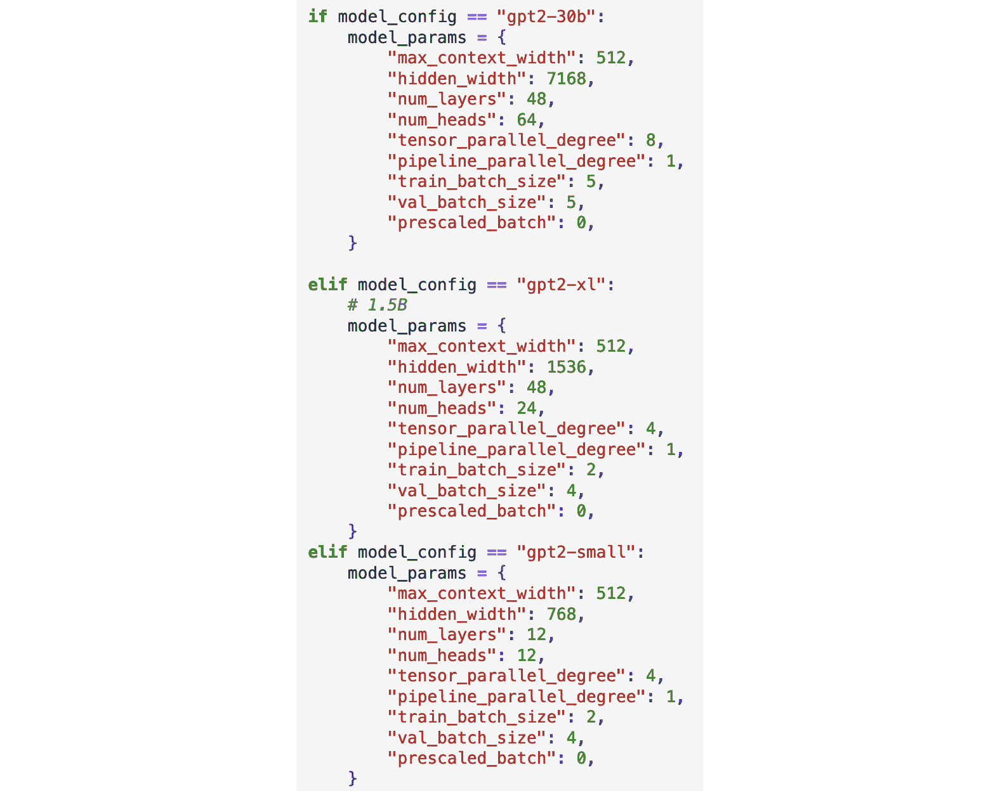
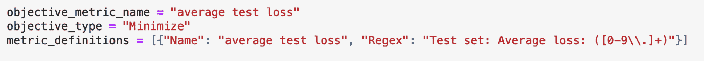
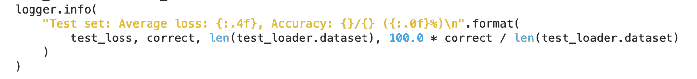

# 第七章：寻找合适的超参数

在本章中，你将深入探讨影响顶级视觉和语言模型性能的关键超参数，如批量大小、学习率等。首先，我们将为那些新手或需要简单复习的人提供超参数调优的快速概述，并包括视觉和语言中的关键示例。接着，我们将探讨基础模型中的超参数调优，既包括当前的可能性，也包括未来可能出现的趋势。最后，我们将学习如何在 Amazon SageMaker 上进行超参数调优，逐步增加集群大小，并在此过程中调整每个超参数。在本章中，我们将覆盖以下主要内容：

+   超参数——批量大小、学习率等

+   调优策略

+   基础模型的调优

+   使用 SageMaker 按世界规模进行扩展

# 超参数——批量大小、学习率等

**超参数**决定了深度学习中大多数关键决策点。它们像是你、你的模型、你的数据集和你的计算环境之间的中介。你将学习到如批量大小、学习率、注意力头数量等术语，以平衡你当前问题的整体解决方案，平衡成本，并确保在训练和推理过程中模型的最佳性能。

`内存不足` 错误。较大的批量大小帮助你快速通过训练循环，但如果你没有足够频繁地运行优化器，它可能会导致无法捕捉数据集中的所有变化。这个核心的权衡是你需要熟悉并学习解决的方法。提示：接下来的整个部分都将介绍一种名为**超参数调优**的方法。

**学习率**几乎像是整个学习过程的方向盘，控制着梯度下降优化过程。字面上讲，它是你用来参数化更新可训练权重的步长。较小的学习率意味着你在梯度上走小步，理想情况下沿着损失曲线下降，但这可能会显著减慢你的工作进度。较大的学习率意味着你在损失曲线上走大步，虽然这可以加速你的工作，但也有可能导致陷入所谓的**局部最小值**，或是*梯度下降函数中的小谷底*。基本上，这意味着你的模型欠拟合；循环会认为训练已经完成，因为优化器指示损失已经平稳，但模型实际上只是卡在了一个小的损失谷底。正如之前所述，这引入了另一个核心的权衡，超参数调优非常适合帮助我们解决这个问题。学习率调度器是解决这个问题的一步，允许你在循环开始时选择一个足够大的值，并逐渐减小它。

让我们来看一下影响著名视觉和语言模型性能的各种重要超参数。

## 视觉和语言中的关键超参数

让我们来看看一些关键的视觉和语言超参数：

+   **批处理大小** – 每个训练步骤中，模型从 GPU 内存中提取的对象数量。较高的批处理大小可以加速训练，而较低的批处理大小可能提高泛化性能。梯度噪声尺度似乎是预测最大批处理大小的一个有前景的途径。

+   **学习率** – 一个术语，用于确定在梯度下降优化过程中可训练权重应更新多少。较大的学习率加速训练，可能导致过拟合，而较小的学习率可能导致欠拟合，无法充分学习训练数据。如前所述，这些通常与调度器配对使用。

+   **训练轮数** – 完整数据集的总遍历次数。较少的轮数减少训练作业的总运行时间，而较多的轮数可以提高准确性。然而，设置这个数字过大可能会浪费资源并导致过拟合。在 *第九章* 中，我们将学习如何使用规模定律来解决这个问题。

+   **注意力头数** – 模型中使用的自注意力头的总数。这是模型训练参数总大小的一个重要决定因素。当你看到 GPT-2 到 GPT-3 的大小跃升时，通常是因为更多的注意力头和更大的头部。

+   **序列长度** – 训练循环中作为一个对象使用的令牌总数。这在语言模型中特别相关，因为训练循环中的每一步都使用句子的一部分来预测另一部分。令牌大致对应于单词。这意味着序列长度几乎可以普遍理解为每个预测步骤中的单词数。这直接影响训练和推理。对于推理，这意味着这是该模型可以使用的最大单词数。对于训练，它可以直接增加或减少 GPU 内存占用。

还有无数其他超参数。你将会看到一些特定于不同 SDK 的超参数，例如 Hugging Face 的 `transformers` 或 `diffusers`，它们允许你定义训练作业的各个方面，比如基础模型名称、数据集名称、数据类型等。SageMaker 也有适用于我们分布式训练库的超参数，例如优化器状态分片、张量并行、激活检查点和卸载等。在 SageMaker 训练作业 API 中，你还可以定义并引入任何你喜欢的任意超参数。

# 调优策略

从某种意义上说，超参数调优是一种*大规模猜测和验证*的艺术与科学。通过使用复杂的算法和策略，你实际上可以训练*一整批模型*，在各种配置中测试整个超参数范围。你的*调优策略*最终将帮助你找到最佳的模型，并最终确定在更大规模下使用的关键超参数。我见过超参数调优帮助客户将准确性提升从不到 1%到超过 15 个百分点不等。如果这能够直接转化为商业回报，你就能理解为什么它是一个有吸引力的方案。

超参数调优有很多策略和技术方案。这些方案有一个共同点，即作为最终用户，你需要选择你想要测试的超参数及其范围。许多超参数调优方案会为你提供默认值作为起点，并附有相关文档。在你逐步使用你偏好的超参数调优方案时，我建议你为研究这些超参数预留足够的时间，并且要深入了解其中的一些。如果你计划将来面试数据科学岗位，那么你应当花大量时间理解这些超参数，特别是它们如何影响模型的表现。

大多数超参数调优方案实际上会为你训练从几到几百个模型，每个模型的超参数配置略有不同。在调优过程结束时，你应该能在你偏好的指标上看到改善，例如损失的降低或准确率的提高。你可能会问，这些方案是如何找到并选择最佳超参数的？答案是通过**调优策略**。

调优策略是一种优化方法，它通过测试各种配置并根据预定义的性能指标评估每个配置。这些策略在几个维度上有所不同。有些仅仅是随机猜测，另一些尝试逻辑地填充某个空间，部分使用基本的机器学习算法，还有一些则使用极其复杂的机器学习算法。除了搜索方法外，它们在搜索的时机上也会有所不同。有些调优方法会同时或并行运行所有实验，这样的优势在于整体任务完成得更快。其他方法则是顺序运行，在测试一些配置后才进行下一组测试。虽然这种方式可能最终达到更高的准确性，但缺点是整体运行时间较长。我们来看一些常见的超参数调优策略及其权衡。

以下是一些常见的超参数调优策略：

+   **随机搜索** – 顾名思义，随机搜索是一种调整策略，它通过随机性来评估你的搜索空间。例如，假设你想探索从 2 到 26 的批量大小，并且使用随机搜索，你指定希望运行 4 个任务。你可能会同时运行 4 个任务，每个任务的批量大小随机选择，例如 4、7、17 和 22。你的调整方案应该告诉你哪个任务在你偏好的指标上表现最好。

+   **网格搜索** – 与随机搜索相反，网格搜索将建立一组有序的实验来平衡你可用的搜索空间。例如，使用与前面相同的批量大小配置，但使用网格搜索，你可能最终会同时运行 4 个任务，批量大小分别为 8、14、20 和 26。和上次一样，这些任务将同时运行并给出表现最好的模型。

+   **贝叶斯搜索** – 贝叶斯搜索通过两种方式将这个基本概念颠倒过来：

    +   首先，它是一种顺序调整策略。这意味着它会同时运行几个任务，然后评估它们的结果，并启动另一组实验进行运行。

    +   其次，它实际上使用机器学习算法来选择超参数。通常，这是一种简单的逻辑回归；通过使用模型的元数据作为输入，预测下一组超参数的值。自 2018 年以来，我们至少在 Amazon SageMaker 中提供了这一功能！顺便提一下，SageMaker 也支持随机搜索和网格搜索。

+   **Hyperband** – 由一个*研究团队* *(1)* 在 2018 年提出，Hyperband 策略实际上专注于优化随机搜索。它们开发了一种无限臂赌博机，能够自适应地探索并选择调整配置，使用预定义的偏好。这与强化学习非常相似！在 AWS，我们将其与一种称为**异步连续减半算法**（**ASHA**）*(2)*的大规模并行策略相结合，该策略利用并行性和激进的早停技术。我们已经证明，这些解决方案能够支持大规模调整，例如用于视觉和语言模型。我们的*测试* *(3)* 显示，相比于随机和贝叶斯策略，它们的加速分别达到约 5 倍和 4.5 倍。

如你所见，我基本上是按照从简单到复杂的顺序列出了搜索策略。在你的学习旅程中，你也可以将这个目标路径作为参考。先从最简单的调整策略入手，然后随着时间的推移，逐步向更复杂的策略过渡。

你可能已经猜到的另一个主题是必须*平衡成本和准确度提升*。看看你的搜索策略在哪里运行，以及它们是如何运行的；它们是否高效地使用计算资源？当增益放缓时，它们会继续运行任务和实验，还是会在增益停止时果断关闭你的资源？

最后，了解当你围绕模型构建一个完整应用时，你很可能希望在重新训练管道中集成调优策略。比如，你在 SageMaker 上部署了一个视觉或语言模型，当新数据到达时，你会触发一个管道来重新训练你的模型。在这个管道中，一个非常重要的资源就是调优你的模型，以确保你获得最高的准确率。更多内容请见*第十四章*！

现在，让我们探索在基础模型中调优超参数的独特挑战和方法。

# 基础模型的超参数调优

基础模型在超参数调优上存在一些独特的挑战。让我们来试着理解这些挑战：

+   **模型大小** – 可能是调优基础模型时最大的问题就是它们的庞大规模。我们之前提到的许多经典调优策略都*依赖于尽可能多地训练模型*。当仅仅将模型的一个副本保存在内存中就需要数十个加速器时，这种方法的经济性就会崩溃。

+   **下游任务的数量** – 正如我们在本书中所见，基础模型的候选下游任务数量庞大。这使得超参数调优变得更加复杂，因为每个任务的目标指标都是独一无二的。选择正确的下游任务本身可能就是一种调优挑战！

+   **超参数的多样性** – 在这些规模下，相关的超参数不仅仅是训练过程的指示符。它们还涉及分布式技术，比如之前我们提到过的模型并行和数据并行。

我们应该如何思考克服这些挑战？这里提出了一种方法；基本上，你可以在数据集的小样本上高效地调优超参数。这意味着你可以使用 1%的数据进行大规模的超参数搜索，并且这有助于你在工作开始时找到正确的设置。

另一种方法，正如我们之前提到的，是一种更高效的调优策略，叫做**Hyperband**。通过这篇博客文章*(4)*，你可以看到如何将其与 SageMaker Training 集成，且有一个 Cifar10 的示例。

这就是故事的结局吗？我不这么认为。如今，基础模型开发领域中的大部分工作都依赖于他人的成果，包括重用他们的超参数，或者在大规模数据集和加速器规模上进行非常轻量的实验；我觉得这种做法最终会与超参数调优策略相结合。此外，考虑到我们将在第十章和第十五章中学习的一些参数高效的微调策略，我们可能会看到超参数调优在预训练过程后调整模型时变得更加相关。我们还将在*第十三章*中讨论*调优推理请求*的策略。

接下来，让我们看看如何将调优实验扩展到处理大模型和大数据集，除了在 SageMaker 上进行超参数调优之外。

# 使用 SageMaker 按照世界规模进行扩展

在本节中，我们将分解两个你需要掌握的关键概念，尤其是在分布式训练的背景下。第一个是扩展的概念，特别是使用超参数调优作为一种方法，在最终运行大规模训练任务之前先进行小规模实验。第二个是使用 SageMaker 提供的超参数调优技巧和窍门。

## 在数据样本上进行调优，并根据世界规模更新

正如你在本章中学到的，超参数调优是提升性能的好方法，但它可能需要大量的计算资源，执行大量的实验。你可能在想，*如何将这种方法轻松应用到我的用例中，尤其是在数据集大小至少有几百 GB，甚至可能有几 TB 或更多的情况下？* 答案就是从一个小样本开始！

在数据集的极小一部分上进行调优的目标是*查看模型对其关键超参数变化的敏感度*。在 1% 的样本上，你可能对一些核心算法设置感兴趣，比如注意力头数、优化器或层操作的变化、序列长度，以及任何其他在整体训练循环中至关重要的设置。如果你看到一个大的提升，那就意味着你可能需要更多关注这个超参数，或者将调优直接集成到你的训练任务中，或者简单地增加一个检查，以确定什么设置在大规模下能带来最佳性能。你还可以调优批量大小和学习率，包括其预热阶段，以查看哪种设置效果最好。

正如我希望你已经想到的，如果你仅在整个数据集的 1% 上进行调优，那么你只需要使用你整体计算资源的一小部分！这意味着你可以并且应该计划使用非常小的实例进行超参数调优，比如 `ml.g5.12xlarge` 或更小的实例。然而，一旦你准备好扩展到更多的实例，你将需要根据整体的世界规模来更新你的关键超参数。

记住，世界规模只是一个用来计数你训练集群中所有 GPU 或加速器的术语。如果你有 2 个实例，每个实例配有 8 个 GPU，那么你整体的世界规模就是 16 个 GPU。你的一些超参数应该在每次改变世界规模时更新，因为它们决定了你的模型如何与训练环境交互。特别是批量大小和学习率。

比如，在我们之前的 16 个 GPU 示例中，假设你通过超参数调优找到了合适的每设备批次大小为 22 和学习率为 5e-5。接下来，假设你想将实例数增加到 4 个，每个实例配备 8 个 GPU，总共得到 32 个 GPU。这个从 16 到 32 的跃升显然是一个倍增，将加速器数量增加了 2 倍。我们会对全局批次大小和学习率应用相同的比例调整，使它们和世界大小一起扩展。

### 简单的超参数调优扩展示例

接下来我们按以下示例逐步进行：

*原始*：

+   两个实例，每个实例配备八个 GPU

+   世界大小 = 16

+   每设备批次大小 = 22

+   学习率 = 5e-5

*增加的* *集群大小*：

+   四个实例，每个实例配备八个 GPU

+   世界大小 = 32

+   每设备批次大小 = 22

请注意，*每设备*批次大小不会随着世界大小的增加而必然发生变化。然而，具体取决于你的脚本，确保你了解自己是提供每设备批次大小还是全局批次大小。当然，全局批次大小是需要进行调整的！

*学习率 = 5e-5 * 2 =* *0.0001*

在随着整体世界大小的增加，更新批次大小和学习率的同时，确保*也考虑到模型本身的大小*。这可能包括增加更多的参数、更多的注意力头、更深的层次等等。正如我们所见，这是最终得到更精确模型的重要指标。例如，在我们公开的训练大规模 GPT-2 模型的示例中，提供了三种不同配置的模型，并为每个模型大小选择了相应的超参数：

图 7.1 – 模型配置参数

你可以看到，对于`30b`参数的模型，我们建议将头数设置为`64`，层数设置为`48`，隐藏宽度设置为`7168`，训练批次大小为*5*。

然而，对于仅有`1.5b`参数的更小模型，我们将头数设置为`24`，隐藏宽度为`1536`，训练批次大小为`2`。你可能会问，为什么一个更小的模型使用更小的批次大小？这是不是有些反直觉，因为更小的模型应该占用更少的 GPU 内存，从而可以增加批次大小？

问题的答案是肯定的，理论上来说，更小的模型应该使用*更大的*批次大小，但在这种情况下，因为我们在大模型上实现了*显著的模型并行性*，它实际上抵消了这种影响，并且具有较小的 GPU 内存占用。

如果你感兴趣的话，隐藏宽度参数实际上只是你神经网络内层的大小。我们称它们为“隐藏层”，因为它们位于黑盒内部；在输入层和输出层之间。这个非常符合整体模型大小的逻辑；一个参数数量更大的模型，隐藏宽度也应该更大。

最后，我们快速看一下在 SageMaker 上进行超参数调优的情况。

### 使用 Amazon SageMaker 进行调优

使用 SageMaker 进行超参数调优非常简单，并且你有几个选项。首先，和往常一样，你可以直接在脚本中添加任何调优策略，并在训练集群上执行它。你可以通过网格搜索来完成这一操作，简单地将自己的脚本导入并运行。

然而，随着规模的扩大，特别是在将调优集成到重训管道中时，你可能最终希望使用我们完全托管的 `HyperparameterTuner`。这本质上是一个对象，它将你的训练任务（以预构建的估算器形式）与一些其他规格结合在一起：

图 7.2 – 定义调优对象

你定义了目标指标、超参数及其范围，以及你希望运行的总任务数和并行任务数。这些默认设置将使用贝叶斯优化。事实上，在这个示例中，它们会同时启动最多三个实例，并重用它们以运行最多九个任务。

你可以通过增加早期停止，或者使用我们之前学到的 **Hyperband** 算法来增强这一点。你可以通过将它作为另一个参数添加到这个函数中来指定该策略。 *(5)*

在目标指标方面，你会很高兴知道你可以带上任何你想要的。我们所做的就是查看你的任务的 CloudWatch 日志，寻找指标定义。老实说，我发现这是整个过程最困难的部分：将你的正则表达式字符串准确匹配到训练任务的输出。在一个 PyTorch MNIST 示例中，下面是它的样子：

图 7.3 – 为任务配置定义调优指标

你可以看到我们要求你编写一个正则表达式字符串并将其提供给这个对象。然后，这应该直接与训练脚本中定义的内容匹配：

图 7.4 – 在你的训练脚本中定义调优指标

为了更好的效果，这里有一个超参数范围的可视化图，方便你查看它们是如何定义的：

图 7.5 – 定义超参数范围

我们还有另一种方法，我认为它设计得特别好。它允许你通过将调优任务导入 pandas DataFrame 来进行分析！相关的笔记本在这里 *(6)*：

图 7.6 – 调用 tuner.dataframe()

就是这样！让我们快速回顾一下你在这一章中学到的内容。

# 总结

在本章关于超参数调优的内容中，你学习了什么是超参数，包括批次大小、学习率、训练轮数、注意力头的数量、序列长度等。你学习了如何使用超参数调优来提高模型的性能，以及实现这一目标的最佳策略。你还学习了如何扩展调优，从数据集的 1%开始，然后根据你的整体 GPU 世界规模调整关键超参数。最后，你学习了在 Amazon SageMaker 上实现这一切的关键功能。

在下一章中，我们将学习大规模分布式训练！

# 参考文献

1.  *Hyperband: 一种基于赌博机的新型超参数* *优化方法*: [`arxiv.org/pdf/1603.06560.pdf`](https://arxiv.org/pdf/1603.06560.pdf)

1.  *一种大规模并行超参数* *调优系统*: [`arxiv.org/pdf/1810.05934.pdf`](https://arxiv.org/pdf/1810.05934.pdf)

1.  *Amazon SageMaker 自动模型调优现在提供最高三倍速度的超参数调优，使用的是* **Hyperband**：[`aws.amazon.com/blogs/machine-learning/amazon-sagemaker-automatic-model-tuning-now-provides-up-to-three-times-faster-hyperparameter-tuning-with-hyperband/`](https://aws.amazon.com/blogs/machine-learning/amazon-sagemaker-automatic-model-tuning-now-provides-up-to-three-times-faster-hyperparameter-tuning-with-hyperband/)

1.  *amazon-sagemaker-examples*: [`github.com/aws/amazon-sagemaker-examples/blob/main/training/distributed_training/pytorch/model_parallel/gpt2/smp-train-gpt-simple.ipynb`](https://github.com/aws/amazon-sagemaker-examples/blob/main/training/distributed_training/pytorch/model_parallel/gpt2/smp-train-gpt-simple.ipynb)

1.  *HyperparameterTuner*: [`sagemaker.readthedocs.io/en/stable/api/training/tuner.html`](https://sagemaker.readthedocs.io/en/stable/api/training/tuner.html)

1.  *amazon-sagemaker-examples*: [`github.com/aws/amazon-sagemaker-examples/blob/main/hyperparameter_tuning/analyze_results/HPO_Analyze_TuningJob_Results.ipynb`](https://github.com/aws/amazon-sagemaker-examples/blob/main/hyperparameter_tuning/analyze_results/HPO_Analyze_TuningJob_Results.ipynb)
