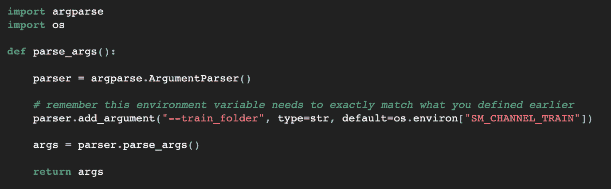
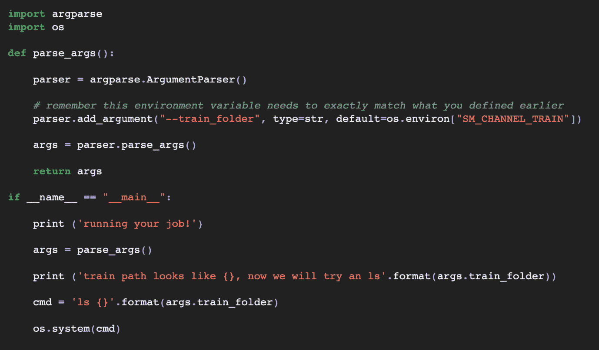
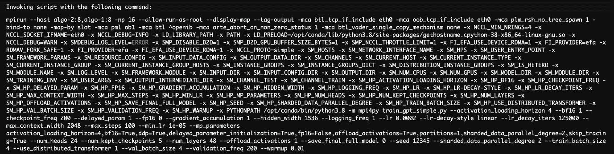
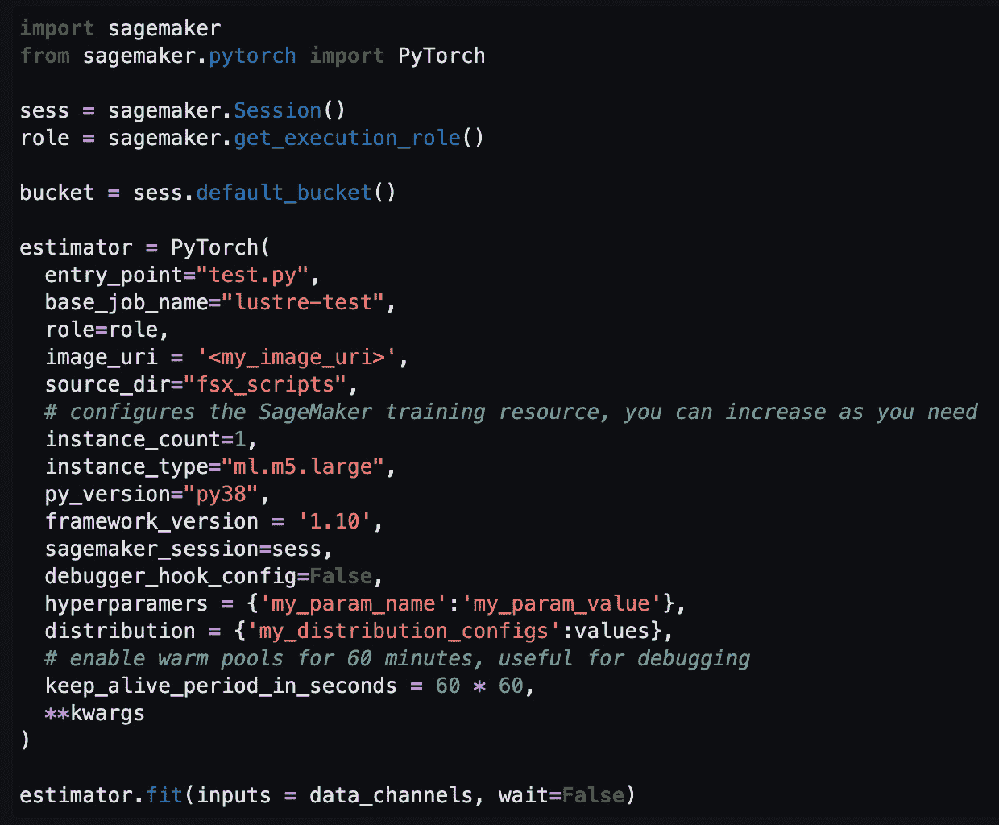
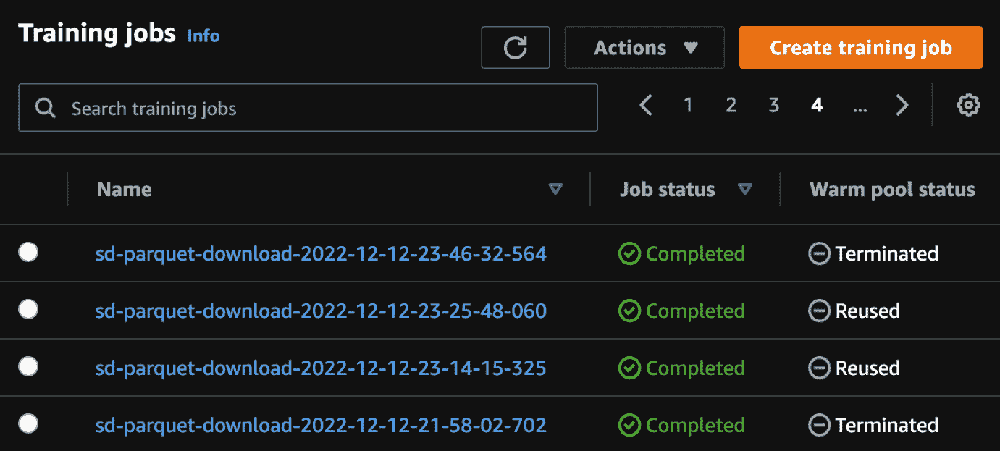
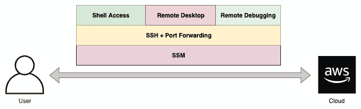
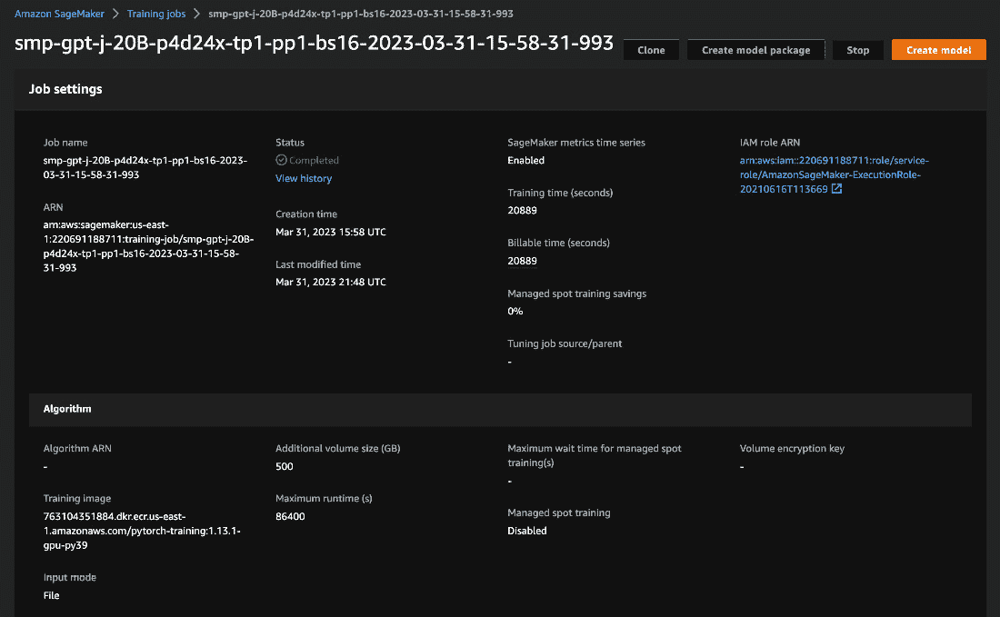
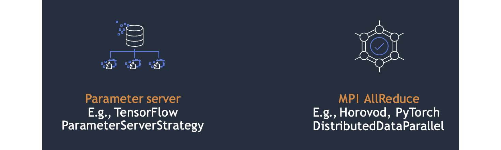

# 第八章：在 SageMaker 上的大规模训练

在本章中，我们将介绍 Amazon SageMaker 提供的关键功能和特性，以便进行高效的分布式训练。你将学习如何优化脚本以适应 SageMaker 训练，并掌握一些关键的可用性特性。你还将了解 SageMaker 的后端优化，例如 GPU 健康检查、弹性训练、检查点和脚本模式。

本章将覆盖以下主题：

+   为 SageMaker 训练优化你的脚本

+   SageMaker 训练的顶级可用性特性

# 为 SageMaker 训练优化你的脚本

到目前为止，你已经学到了很多内容！我们已经涵盖了从预训练基础到 GPU 优化、选择合适的用例、数据集和模型准备、并行化基础、寻找合适的超参数等等。这些内容绝大部分是适用于你选择应用的任何计算环境的。然而，本章专门面向 AWS 和特别是 SageMaker。为什么？这样你就可以掌握至少一种计算平台的所有细节。一旦你学会了如何在一种计算平台上变得熟练，那么你就能够将它用于任何你喜欢的项目！当出于各种原因需要过渡到另一个平台时，你至少能掌握过渡时所需要了解的基本概念。

首先，让我们看看你的脚本。大多数 SageMaker 训练脚本的核心至少包含以下三项内容：

+   包导入

+   参数解析

+   函数定义和使用

接下来我们将逐一解析这些内容。

## 导入包

正如我们之前讨论过的，你可以安装并访问任何你需要的包。你有多种方法可以在 SageMaker 训练中使它们可用。至少，当你定义你的作业时，你可以带上一个包含已定义包的 `requirements.txt` 文件。然后，SageMaker 将使用 `pip install` 安装这些包到你的训练计算环境中，使它们可用。

或者，你可以构建一个预装了所有这些内容的基础容器。这无疑是最快的选择，因为它节省了训练过程中的时间。与其使用 *pip install*，不如使用一个预构建的镜像，所有的包都已包含。另一种选择是导入你自己的 Python 包，将整个项目发送到 SageMaker 训练环境中。然后，你可以导入你正在工作的代码。

## 参数解析

在 SageMaker 训练环境中，我们经常使用的一个非常常见的包是 `argparse`。如果你不熟悉它，让我来介绍一下。

一旦你构建了 Python 脚本，你可能需要通过不同的标志、设置或参数来运行它。其中一些可能是不同的超参数、模式或你希望脚本执行的功能。`argparse`包是 Python 中实现这一目标的绝佳方式。首先，在脚本中，你需要*明确地为每个你想使用的参数添加一行代码*。在 SageMaker 中，你可能会这样开始。

图 8.1 – 一个基本的参数解析函数

正如你在*图 8.1*中看到的，我只是导入了`argparse`，创建了`parser`对象，然后添加了一个名为`train_folder`的参数。默认情况下，它会查找*我的环境变量*，你可能还记得，SageMaker 训练通过这种方式将信息注入到你的环境中。如果你感兴趣，你可以通过 CloudWatch 日志查看任何 SageMaker 训练作业，了解所有可用环境变量的列表。这些环境变量包括你作业的所有元数据、所有超参数等等。

在这个简短的示例中，我指向了我的*训练通道*。当我创建训练作业时，通过指向 S3 或可选的 FSx for Lustre，我创建了这个训练通道。这就是我的训练数据。首先，我将其上传到 S3。然后，我在配置作业时指向它。SageMaker 将其复制到我的 SageMaker 训练实例，并加载到本地路径。这个本地路径通常是`/opt/ml/input/data/train/`这样的路径。当你想指向训练容器上的本地路径时，你调用`args.train_folder`，或者你定义的任何名称。要读取文件，你可以列出文件夹中的文件名，或将文件名作为另一个参数传递。

我个人喜欢保持脚本清晰整洁的方法是将所有的`arg`解析封装在一个专用函数中。然后，它会整齐地返回`args`对象。以下是完整脚本。

图 8.2 – 在主脚本中调用参数解析函数

另一个常见的参数是`model_dir`。你可以将其指向`SM_MODEL_DIR` SM 环境变量。SageMaker 将在作业完成后，将你的模型从训练容器写入 S3。

你可以使用作业配置中的`hyperparameters`参数添加任何你想要的超参数。然后，你可以在脚本中使用这些超参数。我已经创建了指向诸如我的数据索引、如何运行我的脚本、检查点模型路径以及你项目中可能需要的其他无数参数的命令行参数。

### 函数的定义和使用

在此声明可能有些显而易见，你可以编写你想编写的任何软件。你可以直接从任何可访问的数据源读取和写入，启动其他作业，启动其他云资源，或使用开源包——可能性无穷无尽。

### 使用 mpi 调用你的脚本

当你使用分布式训练时，SageMaker 会通过 `mpi` 调用你的脚本。如前所述，这是一个在分布式训练中非常有用的核心库。我们将使用 `mpirun` 或 `smddprun` 来调用你的脚本。如你所见，我们会使用所有相关的参数来调用你的脚本。

图 8.3 – SageMaker 训练如何调用你的脚本

这是一个非常复杂的示例，训练了 GPT-2 的数百亿参数，但它展示了你可以在 SageMaker 上配置分布式训练集群的多种方法。

#### 日志记录与 CloudWatch

如你所知，你有很多日志记录的选项。打印语句是调试的好方法，但随着项目的发展，你可能会转向更为管理化的工具，比如 `logging` 包。记住，所有这些日志都会发送到 CloudWatch 中，因此你可以轻松查看和调试你的脚本。打开 AWS 控制台中的训练任务视图，滚动到底部，点击 *查看日志*。这将带你进入 CloudWatch，提供每个节点的日志流，每个日志流被命名为 `algo`。通常，顶部的日志流是主节点，但所有日志流都会尝试连接到主节点，因此你只需查看它们尝试连接的 `algo`。日志将在你的实例上线并且脚本被调用后开始记录，因此在任务开始后可能需要几分钟才能看到这些日志。

#### 检查点

在 SageMaker 训练脚本中，另一个需要注意的参数是 **检查点**。在 SageMaker 中，检查点的作用不同于仅仅作为模型路径。模型路径将在训练任务结束时复制到 S3，但你的检查点 *将在整个过程中被复制*。这使得它们成为在任务中调试、运行 TensorBoard *(2)* 和从最新检查点重启的理想选择。

实现从检查点重启是一种非常高效的技术，值得学习和完善。这并不难——只需在 S3 中查找正确的路径，配置你的任务，然后确保你在正确的目录中查找你的基础模型。对于大规模任务，我们建议你至少每 2 到 3 小时创建一次检查点。这将帮助你应对训练过程中几乎肯定会出现的硬件、软件、网络、数据或其他问题。

若要查看更详细的示例，可以参考我们在 *参考文献* 部分 *(3)* 中的 GPT-2 训练示例。它实现了一个 `load_partial` 参数，指向你可以为检查点提供的 S3 路径。

### 通过 SageMaker 估算器配置任务

尽管你有多种方法可以运行你的 SageMaker 任务，特别是通过 UI、CLI 和 `boto3`，但最常见的方式可能是通过 Python SDK。

以下是一个可能的示例：

图 8.4 – 使用 SageMaker 估算器运行远程训练任务

请注意，我们指向的是一个基础镜像，实际上是通过 `PyTorch` 对象来指向的。它指向一个基础的 AWS 深度学习容器，具体由你指定的框架版本决定。你可以通过指向 `image_uri` 来覆盖它，这需要是 Amazon ECS 中的 Docker 容器。在这个估算器中，你还可以传递一些关键参数，例如：

+   `instance_count` 和 `instance_type` 用于配置你的训练资源。

+   你的入口点脚本及其源目录。这是 SageMaker 查找 `requirements.txt` 和你的主脚本以执行两个文件的地方。

+   你的超参数 – 再次提醒，你根据自己的需求定义这些参数。

+   你的分发参数。我们将在本章的最后一节中讲解它们。

接下来，让我们来看看一些 SageMaker 训练中的有趣可用性功能。

# SageMaker 训练的顶级可用性功能

现在你对如何将脚本与 SageMaker 训练集成有了一些了解，我们来学习一下 SageMaker 的一些关键方面，它们让使用 SageMaker 变得尤其简单和有趣。

## 热池用于快速实验

一旦你的 SageMaker 任务上线，它将经历以下阶段：

+   初始化资源

+   下载你的数据

+   下载你的训练镜像

+   调用你的主脚本

+   任务完成后，将模型文件上传到 S3

你可能会想，如果我的任务崩溃了，我需要更新几行代码怎么办？我需要从头开始完全重启整个集群吗？

幸运的是，答案是否定的！绝对不是。你可以使用托管的热池。只需添加一个额外的超参数 `keep_alive_period_in_seconds`，它将保持你的任务在线，即使脚本失败或完全完成。这非常有用，因为在许多情况下，前期的任务初始化实际上是你工作流程中最大的瓶颈。它可能需要几分钟，取决于小型基于 CPU 的实例，而较大型基于 GPU 的实例可能需要 8 分钟或更长时间来初始化。

从积极的一面来看，GPU 实例的等待时间最终为你节省了时间和金钱，因为我们在后台运行 GPU 健康检查，确保你只接收到好消息。消极的一面是，8 分钟的等待时间对于开发迭代之间来说实在是太长了。如果你只是更新一些非常简单的内容，比如一个基础的语法错误，那就特别痛苦了。

图 8.5 – 在控制台查看你的训练任务

托管的热池通过以下方式为你解决了这个问题：

1.  首先，将该超参数添加到你的任务配置中。

1.  接下来，一旦任务完成训练，无论是成功还是出错，热池状态应该显示为**可用**。

1.  此后，当你提交另一个具有匹配的镜像 URI、实例类型和实例数量的作业时，它将显示**正在使用**状态，最终显示**已重用**，如 *图 8.5* 所示。

虽然通过使用托管的热池节省几分钟时间看起来可能不是一个巨大的收益，但它确实在大规模上积累起来。当你在与截止日期赛跑时，每一小时都至关重要，使用热池可能就是你是否能够按时完成任务的关键。它意味着在一个小时内，你可以轻松地更新你的脚本数百次，而以前你可能只能做到每小时大约更新 10 次。

## SSM 和 SSH 连接到训练实例

一旦你的作业成功启动并运行，尤其是一个长期运行并包含许多复杂步骤的作业，你可以想象直接连接到实例、查看它并运行调试命令是多么有用。

幸运的是，我们有一个解决方案——我们的一组 ML SAs 构建了一个自定义设计模式，帮助你在自己的环境中启用这一功能 *(1)*。他们仔细听取了客户的意见，反复迭代需求，并开发了一个非常不错的项目。

你可以按照以下代码库中的步骤，在自己的 SageMaker 资源中安装这个功能，轻松地连接到正在运行的作业并分析它们。

图 8.6 – 在 SageMaker 训练作业中的 SSH

从系统架构的角度来看，在评估这个解决方案时，有两条关键路径。 一方面，你可以使用完全托管的服务 AWS Systems Manager。这通常比 SSH 更安全，但功能上有些限制。如果你所需的只是打开一个终端，连接到远程实例，运行一些调试命令，并查看进度中的输出，这可能就是适合你的解决方案。设置起来并不难，你只需相应配置 IAM 和 SSM 资源。与热池结合使用时，这非常强大！

另一方面，你也可以直接使用 SSH。通常，SSH 的安全性低于 SSM，因为 SSM 使用的是托管的 AWS 服务，而 SSH 打开了一个可能性，即任何恶意用户都可以通过端口转发连接到节点。这意味着在企业环境中，在许多情况下，你最好从 SSM 开始。然而，SSH 允许你更新本地脚本并使用端口转发。这意味着，如果你想让某个东西将你的本地脚本无缝地传输到远程训练实例，SSH 是最合适的选择。然而，考虑到现在有了热池，你可能不再需要这个。SSH 解决方案非常适合你的 IDE 支持远程连接点的情况，比如 VS Code 或 PyCharm。

## 跟踪作业和实验以复制结果

我个人最喜欢的 SageMaker 训练功能，老实说，就是它最基本的功能——默认情况下，存储有关你的作业的所有信息并保持可搜索性！这就叫做**元数据**。每次提交时，所有的超参数、输入数据位置、图像、变量和其他作业信息都会被存储。这意味着你可以轻松地追踪你的作业，通过登录查看 CloudWatch 日志，随时从 S3 下载模型，添加标签来指定其他细节，等等。

图 8.7 – 在 AWS 控制台查看训练作业的元数据

所有这些数据都长期保存在你的账户中，你无需为此付费。你还可以使用 SageMaker Search 查找来自指定 S3 路径、实例类型或数量、超参数或任何可用值的精度最高的作业。最近，我们发布了一些新的功能，使得使用 SageMaker 训练变得更加轻松。其一是托管的 TensorBoard（[`aws.amazon.com/about-aws/whats-new/2023/04/amazon-sagemaker-hosted-tensorboard/`](https://aws.amazon.com/about-aws/whats-new/2023/04/amazon-sagemaker-hosted-tensorboard/)），它让你轻松跟踪和比较实验。其二是新的 @remote 装饰器，它让你轻松地将本地函数转为远程作业！（[`aws.amazon.com/blogs/machine-learning/run-your-local-machine-learning-code-as-amazon-sagemaker-training-jobs-with-minimal-code-changes/?sc_channel=sm&sc_campaign=Machine_Learning&sc_publisher=LINKEDIN&sc_geo=GLOBAL&sc_outcome=awareness&sc_content=ml_services&trk=machine_learning&linkId=211795861`](https://aws.amazon.com/blogs/machine-learning/run-your-local-machine-learning-code-as-amazon-sagemaker-training-jobs-with-minimal-code-changes/?sc_channel=sm&sc_campaign=Machine_Learning&sc_publisher=LINKEDIN&sc_geo=GLOBAL&sc_outcome=awareness&sc_content=ml_services&trk=machine_learning&linkId=211795861))

现在，让我们通过学习后端优化来结束本章！

### 使用 SageMaker 进行分布式训练的后端优化

你已经学习了如何更新你的 SageMaker 训练脚本，并且你也更深入地了解了 SageMaker 在使用时一些有趣且友好的特性。现在，让我们通过探讨 SageMaker 如何优化大规模分布式训练的后端来结束本章内容。

正如你可能已经猜到的那样，SageMaker 可以在任何地方启动从几个到几千个 GPU。这是因为训练的核心服务提供——在你定义训练作业时，打开、编排和管理所有这些 GPU 的能力。你在定义这个集群时，以及你在本章早些时候学到的一样，使用 *mpi* 在所有节点之间进行通信。你可以存储所有的超参数和作业元数据，将所有的日志流式传输到 CloudWatch，连接到你喜爱的操作工具，确保节点健康，连接到 S3 中的数据，下载并运行你的镜像，等等。这种 *大规模集群编排* 完全是弹性的，可以轻松地从一个实例流动到数百个实例。

然而，编排这个集群并不特别有用，除非你的 GPU 健康状况良好。正如你在本书的早些部分所学到的，编写软件成功地编排单个 GPU 上数以万计的核心并不是一件小事。即使你更新了 CUDA、驱动程序和最新的深度学习框架，坏消息是你仍然可能会遇到糟糕的 GPU。硬件故障，特别是 GPU 故障是非常常见的。随着你将训练作业扩展到更多的 GPU，你在这个庞大的计算池中遇到一次 GPU 故障的概率也会增加。这就是为什么 SageMaker 提供的 *GPU 健康检查* 非常有用！我们可以追踪最新的 GPU 错误，并在我们的作业编排器中集成检查这些错误。这意味着当你在 SageMaker 上获得一个节点时，它更有可能是健康的。

即使进行了广泛的 GPU 健康检查和大规模作业编排，你的作业在开始之前可能仍会出现错误。你可能会遇到类似 *容量不足错误* 的情况，这表明你请求的实例类型在请求的区域内数量不足。你也可能遇到 *内部服务错误*，并不奇怪地告诉你在你这端出了问题。对于这些以及其他情况，设置 `max_retry_attempts` 非常有用；就我个人而言，每次运行超过 8 个实例的作业时，我都会将其最大化设置为 30 次。

虽然这对于成功启动作业非常有用，但我也有客户*实现了另一个作业重启*。这可能会在你通过训练循环的迷你批次时发生。当`bf16`数据类型被证明对大规模分布式 GPU 训练的稳定性有极大的改善作用时，仍然不罕见看到模型损失突然飙升、停滞或下降。你还可能看到总作业吞吐量的意外变化。如果发生这些情况，最好触发紧急检查点，终止作业，然后从相同的检查点和步骤号重新开始。将训练脚本中的一些附加功能与通过`EventBridge`监听的 Lambda 函数结合使用，是一种自然的做法。有关一些最佳实践的最新总结，请查看*参考文献*部分中的博客文章*(4)*。

### 分布式训练库 – 模型和数据并行

正如你之前学到的，AWS 针对分布式训练进行了优化。这些方法在 SageMaker 上有效地扩展到了数百甚至数千个 GPU。让我们再详细看看它们。

还记得 AlexNet 之所以取得突破性成果，是因为它使用了多个 GPU 吗？从历史上看，最早的多节点深度学习方法之一被称为**参数服务器**。如下面的图所示，参数服务器是一种简单而有效的方式，用于大规模地协调分布式梯度下降。一个节点作为主节点，负责与工作节点同步梯度，检查节点的健康状况，并维护一个全局一致的模型版本。参数服务器可能稍显缓慢，但在带宽消耗方面更为高效。让我们通过图示来进一步了解。

图 8.7 – 分布式梯度下降的历史方法

然而，这种慢速性导致了稍微不同的方法。基于环的拓扑结构在底层使用`AllReduce`算法在所有节点之间进行通信，收集梯度的平均值，并将结果分发给每个节点。这是 Horovod 和 PyTorch DistributedDataParallel 中常见的基本方法，因其速度比旧版本更快而受到广泛使用。

然而，`AllReduce`作为一种基本的集体操作，在大规模下*表现不佳*。每增加一个节点，`AllReduce`步骤所消耗的带宽就会增加。这意味着，随着实例数量的增加，你的扩展效率会变差，最终导致实例的利用率低下，从而影响计算预算。

为了应对这种负面影响，AWS 开发了 *自定义数据并行集合*。这是在 AWS 云上获得最高性能的最佳方式。这一技术被称为 **SageMaker 分布式数据并行** (**SMDDP**) *(5)*，作为 SDK 提供，可以在容器中使用，并适用于任何支持的 SageMaker 作业。使用 SMDDP 可以确保您的大规模 GPU 作业运行尽可能快速和高效，将其作为任何支持的分布式软件的后端。SMDDP 还与亚马逊的弹性网络适配器（Elastic Fabric Adapter）集成，这是 AWS 上的一项低抖动、低延迟通信增强功能。通常，SMDDP 使您可以轻松地将其从深度学习框架中指向，将其设置为分布式后端。

幸运的是，从 2022 年 12 月发布开始，这项功能现在也可以在 *模型并行* 系列中使用。现在，您可以在 `smp_options` 对象中设置 `ddp` 后端，使用 `ddp_dist_backend:auto`。当这个新的后端选项与我们在 *第五章* 中讨论的 *分片数据并行* 配置结合使用时，它将带来额外的 30% 提升！

现在，让我们通过简短的回顾来结束本章。

# 总结

本章中，我们了解了 Amazon SageMaker 在大规模分布式训练中的关键功能。我们探讨了如何优化脚本，从导入包到解析参数、编写代码、使用 `mpi` 调用脚本、写入 CloudWatch 日志、检查点、与 SM 估算器一起使用等。我们涵盖了提高 SageMaker 可用性的关键功能，以使其更有趣且更易于使用，例如用于快速实验的热池、训练实例中的 SSM 和 SSH 以及作业追踪。最后，我们了解了分布式训练的后端优化，如 SMDDP 集合，既可以单独使用，也可以与模型并行包结合使用。

在下一章，我们将探索分布式训练中的更高级主题！

# 参考文献

请查看以下内容，了解本章涵盖的一些主题：

1.  *aws-sample/sagemaker-ssh-helper*: [`github.com/aws-samples/sagemaker-ssh-helper`](https://github.com/aws-samples/sagemaker-ssh-helper)

1.  *在 Amazon SageMaker* *Studio* 中使用 TensorBoard：[`docs.aws.amazon.com/sagemaker/latest/dg/studio-tensorboard.html`](https://docs.aws.amazon.com/sagemaker/latest/dg/studio-tensorboard.html)

1.  *aws/amazon-sagemaker-examples*: [`github.com/aws/amazon-sagemaker-examples/blob/main/training/distributed_training/pytorch/model_parallel/gpt2/train_gpt_simple.py`](https://github.com/aws/amazon-sagemaker-examples/blob/main/training/distributed_training/pytorch/model_parallel/gpt2/train_gpt_simple.py)

1.  *在 Amazon SageMaker 上训练大型语言模型：最佳* *实践*：[`aws.amazon.com/blogs/machine-learning/training-large-language-models-on-amazon-sagemaker-best-practices/`](https://aws.amazon.com/blogs/machine-learning/training-large-language-models-on-amazon-sagemaker-best-practices/)

1.  *SageMaker 分布式数据并行* *库简介*：[`docs.aws.amazon.com/sagemaker/latest/dg/data-parallel-intro.html`](https://docs.aws.amazon.com/sagemaker/latest/dg/data-parallel-intro.html)
