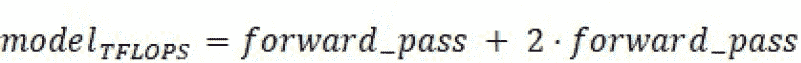
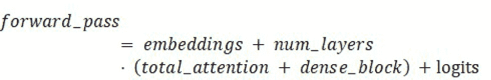
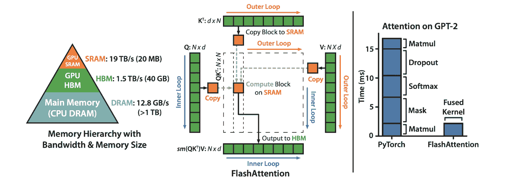
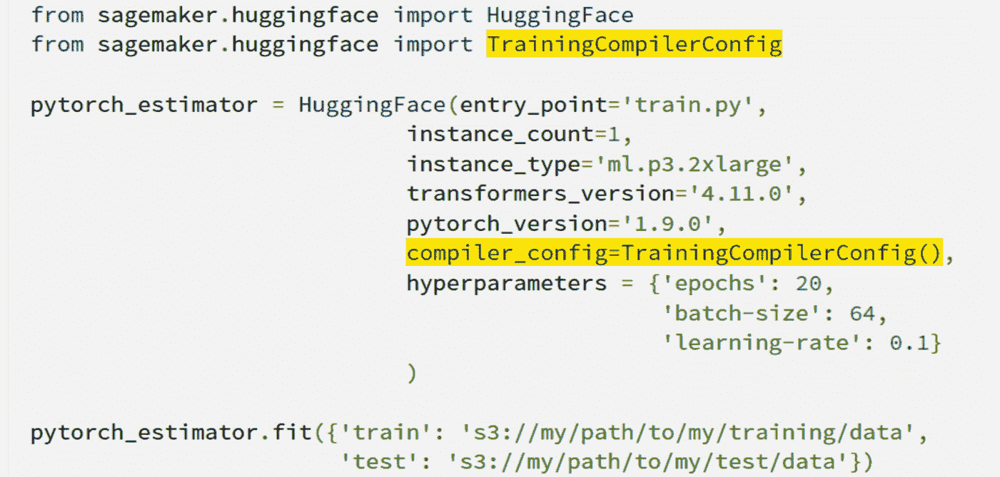
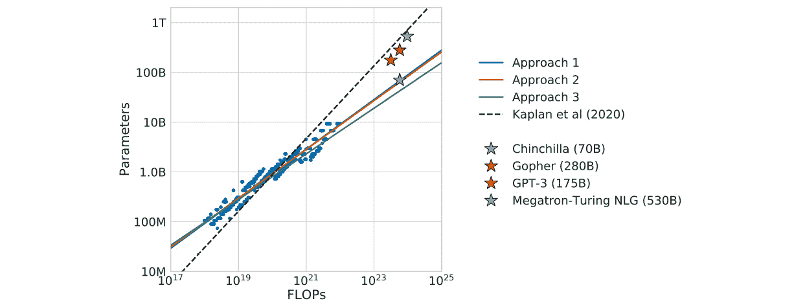
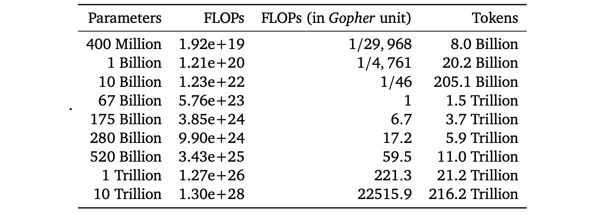

# 第九章：高级训练概念

本章将涵盖大规模训练的高级概念，例如评估吞吐量、计算每个设备的模型**teraFLOPS**(**TFLOPS**)、编译以及使用缩放法则来确定合适的训练时间长度。在上一章中，你学习了如何在 SageMaker 上进行大规模训练的基本知识。在本章中，你将学习一些复杂且先进的技术，帮助你降低作业的总体成本。较低的成本直接转化为更高的模型性能，因为你可以在相同的预算下进行更长时间的训练。

本章将涵盖以下主题：

+   使用模型 TFLOPS 评估和提升吞吐量

+   使用 FlashAttention 加速训练过程

+   通过编译加速作业

+   Amazon SageMaker 训练编译器和 Neo

+   在 Amazon 的 Trainium 和 Inferentia 定制硬件上运行编译后的模型

+   解决最优训练时间的问题

# 评估和提升吞吐量

正如我们在本书中之前提到的，总作业吞吐量是一个重要的指标。 一方面，你需要保持小的批处理大小，以确保模型得到适当训练。另一方面，你希望最大化整体作业性能，以获得尽可能准确的模型。我们在*第七章*中学习了如何使用超参数调整来解决这两个问题。我们还在*第五章*和*第八章*中介绍了减少**图形处理单元**(**GPU**)内存占用的其他技巧。现在，让我们进一步解决这一领域的一些问题。

首先，重要的是要考虑如何在一般情况下衡量吞吐量。你可能已经在 PyTorch 中使用过一些日志包，它们方便地报告训练循环中的每秒迭代次数。显然，这对于监控训练速度非常有用，但你如何考虑模型的大小呢？如果你想与他人比较你的速度，以确定是否处于相同的水平，该怎么办呢？

为了解决这个问题，许多研究团队计算一个聚合指标，将模型大小和完成的操作结合在一起。通常，这被称为**模型 TFLOPS**。这些计算会根据不同团队的偏好有所变化，但我们将探讨来自近期 Chinchilla *(11)* 论文的设置，这篇论文刚刚获得了**神经信息处理系统**(**NeurIPS**)最佳论文奖。你会发现，这个短语在评估大规模分布式训练系统时非常常见。

## 计算模型的 TFLOPS

你听说过**每秒浮动操作数**（**FLOPS**）吗？这是一个简单的方式来展示一个给定机器可以执行多少次计算。数值越高越好，因为这意味着在相同时间内，机器可以完成更多的任务。**TFLOPS**是一种更容易比较分布式训练解决方案性能的方式。

在 Chinchilla 中，作者有一种清晰的计算模型 TFLOPS 的方法。首先，考虑到前向传播和反向传播的性能是不同的。反向传播实际上是前向传播计算成本的两倍，因为我们不仅需要计算梯度，还需要更新权重和参数。因此，模型的 TFLOPS 将如下所示：

简单吧？现在让我们来解读一下这个术语。

在他们论文的*附录 F*中，作者详细定义了他们的其他术语。另一种更简单但稍微不那么精确的计算总模型 TFLOPS 的方法是直接使用 C=6⋅D⋅N，其中*N*是模型中的参数数量。Chinchilla 实际上发现这个计算方式与前面公式中的计算结果没有显著差异。

在阅读这些指标时，考虑到每个术语都与神经网络的一个部分相关，特别是它的规模。将这些与每秒处理的令牌数量结合起来，你就可以得到一个衡量整体训练循环效率的实际指标。这个效率指标随后成为一个你可以在运行时比较实验的共同标准。

记得在*第三章*中，你学习了如何将整体项目视为一系列实验吗？虽然项目的准确性无疑应该是一个关键性能指标，但我强烈建议你同时包括一个效率指标。这有助于确保你充分利用计算预算，这对于初始训练、随后的再训练、推理、监控和整体项目维护都非常重要。

例如，你可能会考虑以下实验计划：

| **阶段** | **模型类型** | **模型大小** | **数据集大小** | **计算规模** | **计算效率** | **实验运行时间** |
| --- | --- | --- | --- | --- | --- | --- |
| 一 – 小规模测试 | 通用预训练 | 基础 | 5–30 GB | 1–4 个较便宜的 GPU | 低 | 对小数据样本进行一次完整的传递 |
| 二 – 增加数据集 | 半定制 | 数十亿参数 | 100 GB 至 TB | 数十至数百个更强的 GPU | 中等 | 几个步骤或纪元 |
| 三 – 增加模型（及数据） | 非常定制 | 数十亿参数 | TB | 数百至数千个高性能 GPU | 高 | 几个步骤或纪元 |
| 四 – 最大化计算预算 | 完全定制 | 数十亿至数百亿参数 | TB 至 PB | 数千个或更多高性能 GPU | 最先进 | 训练至最优时期 |

图 9.1 – 建议用于大规模训练基础模型的实验阶段

让我明确地说一下这张表；无论在任何情况下，我都不指望每个人都完全按此执行。新颖的训练模式、数据集规模、模型、GPU 性能、建模结果、计算预算以及不同视角有着无数的细微差别，单一的表格无法囊括所有这些差异。有些团队永远无法构建超过 10 亿参数的模型，但仍然能打造出世界喜爱的作品，例如 Stable Diffusion！但我向你保证，实验室的构建经历了多个阶段，最终才达成了大规模运行。你需要学习如何将项目的范围从“可行”扩展到“令人印象深刻”。如何适当地实现这一点，取决于你正在解决的具体问题。

现在，让我们看看一些可以用来提高训练效率的方法。接下来是 Flash Attention！

# 使用 Flash Attention 加速你的训练过程

在前面的章节中，我们了解了核心的 Transformer 模型，以及其底层的自注意力机制，这成为了如今视觉、语言和生成任务中大多数先进模型的基础。虽然 Transformer 模型很容易并行化，但它们在优化现代 GPU 中不同内存速度方面并不特别擅长。当由于简单的实现方式导致 Transformer 出现在 GPU 中最慢的部分时，就会成为问题。正如你所想象的那样，这会让性能提升无法得到完全释放。

斯坦福大学领导的研究团队意识到，他们可以改进这一点，并开发出一种创新的 Transformer 架构实现。简而言之，这是一种极其巧妙的方式来处理一个二次嵌套的 for 循环。让我们仔细看看。

图 9.2 – 来源于 Tri Dao 等人 2022 年的 FlashAttention *(1)*

这张论文中的图示展示了三个关键概念。左侧部分，我们看到一个简单的金字塔，展示了大多数 GPU 服务器上可用的三种常见计算类型。在底部，我们有许多 CPU，并且主内存超过 1 TB，但其带宽最高为 12.8 GB/s。接下来是 GPU 中较慢的部分，内存更少，但带宽更大，只有 40 GB 的 GPU HMB，但带宽高达 1.5 TB。最后，我们有 GPU 中最快的部分，内存仅有 20 MB，但带宽可达 19 TB。显然，19 TB 的带宽比 1.5 TB 快超过 10 倍！这立刻向你展示了，将尽可能多的计算移至**静态随机存取内存**（**SRAM**）可以为你节省大量时间。

然而，你会注意到，这个 10 倍的提升是指带宽，而不一定是吞吐量。纯吞吐量意味着高效处理大量数据，而带宽在这里有助于优化 **输入/输出**（**I/O**）。在这种情况下，它指的是数据在整个计算机架构中如何在不同的数据结构之间传递。这就是为什么我们最关注带宽指标；带宽控制了我们能够传递到或从给定计算单元的数据量。这意味着当我们处理 I/O 密集型过程时，例如在自注意力头中使用的二次嵌套循环，将尽可能多的数据传输到带宽最高的部分，是加速整体速度的一个方法。

这种技术能带来什么样的收益？在图像的最右侧，你可以看到 FlashAttention 提供的这一新 *融合内核*，它的运行时间等同于在一个普通 PyTorch 实现中完成五个操作中的一个所需的时间。普通实现需要大约 17 秒来完成所有的 **矩阵乘法**（**Matmul**）、掩蔽、Softmax、Dropout，最后是 Matmul，而 FlashAttention 融合内核可以在不到几秒钟的时间内完成所有这些操作！

FlashAttention 目前尚未直接集成到 PyTorch 中，尽管如果在接下来的 12 个月内没有集成，我会感到非常惊讶。暂时，你可以使用一个开源实现，详情见这里 *(2)*。作者展示了，使用 FlashAttention 可以让 **生成预训练变换器**（**GPT**）模型在 Hugging Face 的选项上实现 3–5 倍的加速，在每个 NVIDIA A100 GPU 上达到 189 TFLOPS。虽然在较小规模下这可能听起来不是很大的提升，但一旦你使用了数百到上千个 GPU，这就可能带来巨大的节省！FlashAttention 在 SageMaker Model Parallel 库中已提供支持，从 2022 年 12 月开始 *(3)*。

现在让我们看看另一个先进的训练概念，帮助加速你的训练过程：编译。

# 利用编译加速你的任务

记得在 *第四章* 中，我们学习了 GPU 系统架构的一些基本概念。我们介绍了 **计算统一设备架构**（**CUDA**）软件框架，它使你可以在 GPU 上运行普通的 Python 代码。我们讨论了管理容器和深度学习框架，如 PyTorch 和 TensorFlow，这些框架已经经过测试并且可以很好地运行在 AWS 云平台上。大多数神经网络实现的问题在于它们并没有针对 GPU 进行特别优化。这就是编译发挥作用的地方；你可以通过它为同一个模型带来两倍的加速！

在深度学习编译器的上下文中，我们主要关注的是 `torch.compile` 方法。

在我们进入使用编译的示例之前，让我们先尝试理解它是什么以及为什么它有用。假设你有两个向量（记住，想成是“列表”），每个向量的大小都是 1000。一个向量填充的是零，另一个向量填充的是一。现在假设你有一个基本操作要应用于这两个向量：加法。你想将这两个向量相加，得到一个长度为 1000 的第三个向量，该向量是原始两个向量中每个项的直接和。

一种简单的做法是遍历两个列表，计算和，并将结果添加到新列表中。但如果你提前知道其中一个向量是零呢？那样的话，你不想完全跳过加法操作吗？如果你这样做，可能会节省很多时间！

这种跃升的实现得益于中间表示。如 2020 年一项调查所示 *(4)*，深度学习编译器会对神经网络的图进行分析。首先，前端编译器计算出图的一个更优版本，如融合操作符、简化代数表达式、执行静态内存规划等多种技术。接着，后端编译器会根据特定硬件、低级表示、内存分配、定制内核等因素再次计算这一过程。然后，它会生成新的代码，这些代码会被加速器使用。

现在让我们来学习如何将编译添加到你的脚本中！

## 将编译集成到你的 PyTorch 脚本中

从这里的 PyTorch 文档 *(5)* 中，你会看到有三种主要方式可以在你自己的 PyTorch 代码中使用编译。首先，你可以使用任何 PyTorch 内置的函数，比如`torch.sin`或`torch.cos`，然后将这些传递给`torch.compile`。这会使用我们之前讨论的多种技术来根据可用的 GPU 编译你的函数。或者，你可以为你的 PyTorch 函数添加一个装饰器，简单地写`@torch.compile`，它提供相同的功能。这两种功能也适用于`torch.nn.Module`基础对象，这意味着你应该能够在你的任何 PyTorch 模型中使用它们！

如果你觉得编译带来的加速很有用，但又不想重写我的模型代码来使用它们，那么接下来的部分对你来说一定非常有趣！我们来看看 AWS 上的托管编译功能——SageMaker 训练编译器和 SageMaker Neo。

# 亚马逊 SageMaker 训练编译器与 Neo

如果你今天使用的是 Hugging Face 语言模型，比如 BERT、GPT、RoBERTa、AlBERT、DistiliBERT 或其他数百种模型，那么你很幸运！通过简单的操作，你就可以轻松将作业的运行时间提高最多 50%。这是因为 **SageMaker Training Compiler** (**SMTC**) 的存在。正如我们之前所学，编译通常具有提高训练速度的潜力。使用 SMTC，我们在 SageMaker 训练中提供了一个托管的编译功能，轻松地为你自己的模型和脚本启用这一功能。

如你在提供的图示中所见，启用这一功能非常简单。在这里，我们使用 Hugging Face 提供的 AWS 托管深度学习容器，并只需添加 `TrainingCompilerConfig()`。如果你正在使用带有 Hugging Face `Trainer` API 的模型，这将自动触发训练编译器：

图 9.3 – 配置 SageMaker Training Compiler

它是如何工作的？SMTC 在三个不同的层次上使用各种编译方法：图层、数据流层和后端层。图层优化包括操作符融合、内存规划和代数简化。数据流层优化包括布局转换和常见子表达式消除。后端优化包括内存延迟隐藏和面向循环的优化。这些优化可以将训练过程加速最多 50%，且结果模型与未应用 SMTC 时的模型相同。例如，在微调 Hugging Face 的 GPT-2 模型时，SMTC 将训练时间从将近 3 小时减少到仅 90 分钟！

## 编译的最佳实践

在使用编译器时，你需要确保相应地更新你的超参数。这是因为编译器的最终效果是减少模型的 GPU 内存占用。例如，未编译时，你的模型可能会消耗大约 10 GB 的 GPU 内存。经过编译后，可能会将其减少到 5 GB！这为你提供了更多的空间来增加批量大小中的对象。如我们在书中早些时候学到的，这直接提高了 GPU 的利用率，从而提高了整体项目效率。只需小心不要过度增加批量大小，否则会使收敛变得更加困难。你还需要以相同的速度增加学习率。

正如你可能预料的那样，有些时候编译是非常有用的，而有些时候编译可能会浪费时间。这是因为大多数编译器*在执行你的代码之前需要一些时间来运行编译过程*。这意味着，与正常的 Python 代码执行相比，编译器会提前运行其子进程，生成一个更优化的模型版本。一旦这个版本生成完成，你的代码就会开始正式运行。

这种提前编译的过程引入了评估编译整体影响的关键权衡。你的模型训练周期越长，编译带来的提升就越大。这意味着如果你使用大量的 epoch，或者数据集非常庞大，那么编译应该是一个节省计算成本的有效方法。就我个人而言，如果你的模型运行超过 30 或 40 分钟，尝试通过编译来缩短这个时间。

或者，如果你有一个频繁的重训练流程或任务，特别是一个半定期运行的任务，可以尝试使用编译来缩短时间。我的一些客户每天、每周，甚至每几小时或几分钟就会重训练他们的模型。我们将在*第十四章*中深入讨论这个以及其他与操作相关的话题。

现在，让我们学习如何通过使用 PyTorch 编译，使我们能够轻松使用亚马逊的定制硬件进行机器学习：Trainium 和 Inferentia！

# 在亚马逊的 Trainium 和 Inferentia 定制硬件上运行已编译的模型

到目前为止，在本书中，我们评估的大多数加速器都是由 NVIDIA 设计和制造的 GPU。正如我们之前所了解的，NVIDIA 的优秀软件使得大部分深度学习框架能够在这些 GPU 上运行得非常顺畅，这也成为了使用 GPU 的主要决定因素。我们还了解到，这些 GPU 同样可以在 AWS 上使用，特别是通过我们的机器学习服务 Amazon SageMaker。

然而，正如你到目前为止无疑已经意识到的那样，那些 GPU 的价格可能非常高！即使 AWS 有慷慨的企业折扣计划，比如通过使用预留实例节省高达 75%的费用*(6)*，你仍然可以从了解替代方案中获益。基础经济学告诉我们，当供给增加，比如通过替代加速器，而需求保持不变时，价格就会下降！这正是我们兴奋地为客户提供的：我们的机器学习定制加速器——Trainium 和 Inferentia。正如你可能猜到的，Trainium 专门用于训练机器学习模型，而 Inferentia 则专注于托管。至本文写作时，这些加速器已经可以通过 EC2 和 SageMaker 作为 Inf1 和 Trn1 实例使用。

幸运的是，对于那些已经通过前一节了解过编译的读者，许多使用 XLA 编译的模型已经得到 Trainium 和 Inferentia 的支持！这意味着，如果你已经在使用通过 PyTorch 或 TensorFlow 的 XLA 编译，那么你已经很接近成功迁移到 Trainium 和 Inferentia 了。不过需要提醒的是，并不是每个模型和操作都已经得到支持。在开发和测试时，可能会遇到一些摩擦。AWS Neuron **软件开发工具包** (**SDK**) 是测试兼容性的好方法*(7)*。

有两个原因需要评估我们的定制加速器：

+   首先，它是一种新型的硬件。对你们这些科学家来说，这一点尤其重要，因为你们很可能是世界上第一个在这种硬件上使用某种类型模型的人。这可能实际上会增加你们发表论文和获得认可的机会，因为你们可以基于模型在该硬件上的表现开发出真正新颖的见解。

+   第二，与我们在 AWS 上的所有新实例一样，性价比应该比以前大大提高。

什么是性价比？考虑你需要完成的每项任务。以 Inferentia 为例，这将是完成的模型推理请求数。对于 Trainium，则是通过训练循环的步骤数。然后，考虑完成每项任务的成本。现在你就有了性价比！我们的 Trn1 实例提供比同类 GPU 实例高达 50% 的训练成本节省，而 Amazon Search 通过 Inferentia 将其推理成本降低了 85% *(8)*。

现在我们已经对 Trainium 和 Inferentia 有了一个非常高层次的了解，接下来让我们探讨如何利用扩展法则来解决最佳训练时间的问题。

# 寻找最佳训练时间

时间是训练大型视觉和语言模型中的一个有趣的概念。一方面，你可能会将其视为一个超参数，仅仅是迭代次数的数量。另一方面，你可能会将其视为训练数据的一个方面，比如数据的总令牌数或图像数。你也可能会将其视为项目的固定输入，即你的总计算预算。我与之合作的大多数研究团队通过直觉和良好的判断力，结合这些因素来确定最佳方案。

正如我们在书中早些时候所学，提出的 *扩展法则* 提供了一种有趣的理论工具，您可以用它来预测模型的表现。其原作者 Kaplan 等人 *(9)* 实际上建议，在给定的计算预算下，最佳的使用应当在“远未收敛”时就停止。他们提出这一建议，是基于他们对大型语言模型“比小型模型更具样本效率”的洞察。

然而，2022 年，这些原始法则发生了翻转。在这个图示中，你可以看到由 **Chinchilla** 提出的新一组扩展法则所确定的理论预测：

图 9.4 – 来自 Hoffman 等人的改进表现，2022 年 *(10)*

在这里，Hoffman 等人提出了一个优雅的建议，认为*训练数据和模型大小应该线性增加*。也就是说，如果你把模型的大小加倍，训练数据的大小也应该加倍。我很欣赏这种自然的对称性，并且觉得它非常直观。幸运的是，这些预测得到了跨越至少 400 个模型、150 个下游任务和 6 个领域的广泛实证证据的验证，其中包括语言建模、阅读理解、问答、常识推理等。根据作者的说法，“Chinchilla 在大量下游评估任务上统一且显著地超越了**Gopher (280 B)**、**GPT-3 (175 B)**、**Jurassic-1 (178 B)** 和 **Megatron-Turing NLG (530B)**。”这意味着这些模型训练不足，实际上需要更大的数据集来验证它们的参数大小。

使用这些方程式和大量的实验结果，作者建议了以下一组参数、FLOPS 和 tokens 的值：

图 9.5 – 每个模型大小建议的 FLOPS 和 tokens

记住，当我们查看这个 FLOPS 值时，我们需要考虑以下几点：

1.  我期望这个模型为我的组织带来什么价值？

1.  根据这些，我可以规划多少总的计算预算？

1.  我的训练数据有多大？

1.  基于这些，应该使用多大规模的模型？

1.  我的训练循环和分布式系统有多高效？换句话说，我每个 GPU 能挤出多少 TFLOPS？

1.  我能从我的云服务提供商那里获取多少个 GPU？

1.  我需要多长时间才能运行整个训练循环，直到训练收敛？

对于问题（*1*）、（*2*）、（*3*）和（*5*）的答案只能由你来提供。问题（*4*）和（*7*）的答案是前面答案的函数导数。至于问题（*6*），我认为它是问题（*1*）的函数导数与当时市场的一个简单事实之间的中间值。如果电子产品出现全球供应链问题，那么获取 GPU 将变得困难。

呼，您已经完成了高级章节！现在让我们快速回顾一下概念，然后进入*第四部分：评估* *您的模型*。

# 总结

在本章中，我们介绍了一些训练大规模视觉和语言模型的高级概念。首先，你学习了如何通过计算每个 GPU 上的模型 TFLOPS 来评估和提高吞吐量，并使用这一指标与其他多个指标来比较实验结果。你了解了 FlashAttention，以及它的 I/O 感知优化二次循环如何将 Transformer 自注意力机制的速度提高 3-5 倍。你学习了如何使用 PyTorch 内置和 AWS 管理的方法进行编译。你还了解了几种不同类型的编译方法。你学会了如何更新你的编译超参数，以及在某些情况下编译是否能提供提升（或没有提升）。

你还学到了如何使用编译器在亚马逊的机器学习定制硬件 Trainium 和 Inferentia 上运行。最后，我们使用缩放定律来解决最优训练时间问题。

在下一章，你将学习如何微调你的模型，并将其与开源替代方案进行比较。

# 参考文献

1.  FlashAttention：快速且内存高效的精确注意力机制，具备 I/O 感知：[`arxiv.org/pdf/2205.14135.pdf`](https://arxiv.org/pdf/2205.14135.pdf)

1.  HazyResearch/flash-attention：[`github.com/HazyResearch/flash-attention`](https://github.com/HazyResearch/flash-attention)

1.  亚马逊 SageMaker 模型并行库的新性能改进：[`aws.amazon.com/blogs/machine-learning/new-performance-improvements-in-amazon-sagemaker-model-parallel-library/`](https://aws.amazon.com/blogs/machine-learning/new-performance-improvements-in-amazon-sagemaker-model-parallel-library/)

1.  深度学习编译器：综合调查：[`arxiv.org/pdf/2002.03794.pdf`](https://arxiv.org/pdf/2002.03794.pdf)

1.  TORCH.COMPILE 教程：[`pytorch.org/tutorials/intermediate/torch_compile_tutorial.html`](https://pytorch.org/tutorials/intermediate/torch_compile_tutorial.html)

1.  企业客户：[`aws.amazon.com/pricing/enterprise/`](https://aws.amazon.com/pricing/enterprise/)

1.  欢迎使用 AWS Neuron：[`awsdocs-neuron.readthedocs-hosted.com/en/latest/`](https://awsdocs-neuron.readthedocs-hosted.com/en/latest/)

1.  亚马逊搜索如何通过 AWS Inferentia 将 ML 推理成本降低 85%：[`aws.amazon.com/blogs/machine-learning/how-amazon-search-reduced-ml-inference-costs-by-85-with-aws-inferentia/`](https://aws.amazon.com/blogs/machine-learning/how-amazon-search-reduced-ml-inference-costs-by-85-with-aws-inferentia/)

1.  神经语言模型的缩放定律：[`arxiv.org/abs/2001.08361`](https://arxiv.org/abs/2001.08361)

1.  训练计算最优的大型语言模型：[`arxiv.org/pdf/2203.15556.pdf`](https://arxiv.org/pdf/2203.15556.pdf)

1.  训练计算最优的大型语言模型：[`openreview.net/pdf?id=iBBcRUlOAPR`](https://openreview.net/pdf?id=iBBcRUlOAPR)

# 第四部分：评估你的模型

在第四部分，你将学习如何评估你的模型。你将使用扩展规律来确定最短的训练时间，微调你的模型并与公共基准进行比较，同时识别并缓解偏差。

本节包含以下章节：

+   *第十章*，*微调与评估*

+   *第十一章*，*检测、缓解与监控偏差*

+   *第十二章*，*如何部署你的模型*
