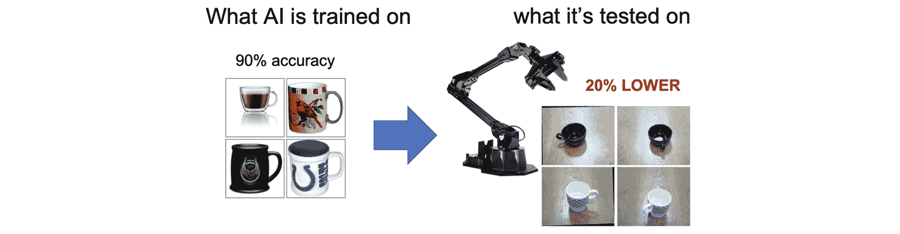
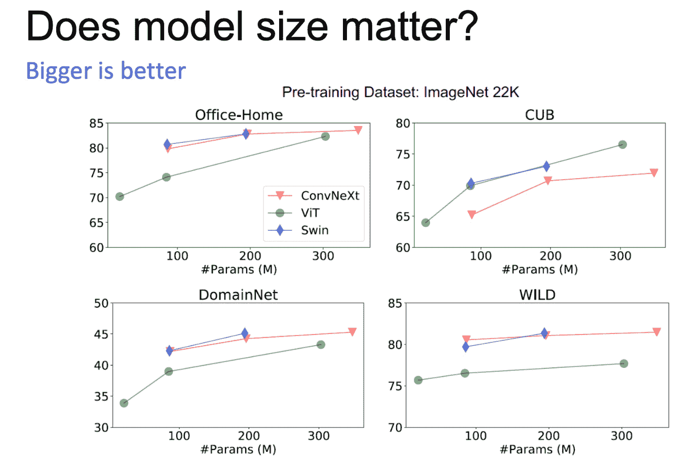
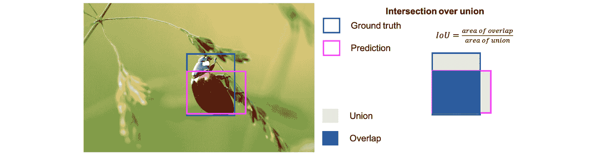
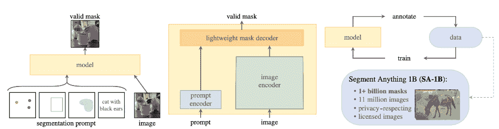
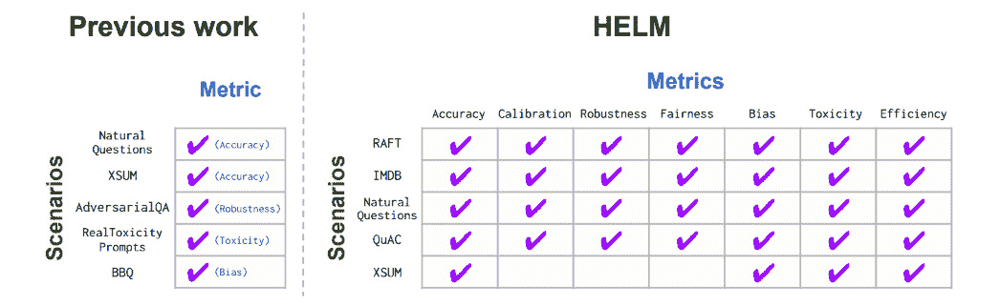
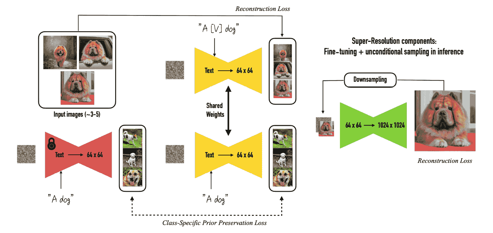
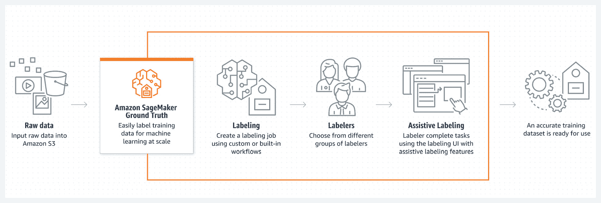
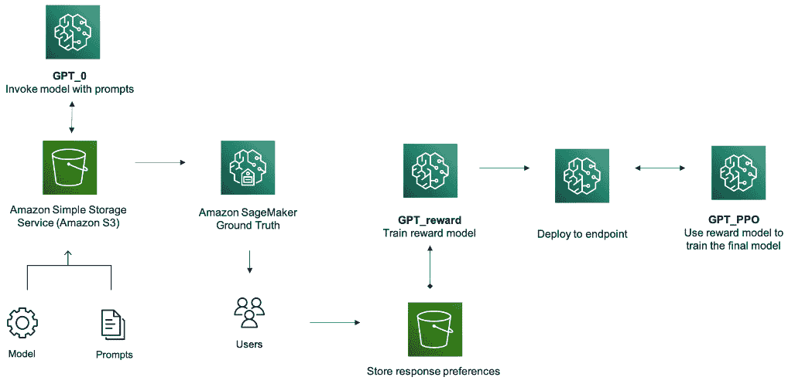

# 第十章：微调和评估

在本章中，您将学习如何在用例特定数据集上微调您的模型，比较其性能与现成的公共模型。您应该能够从预训练中看到定量和定性的提升。您将深入一些涉及语言、文本及其间关系的例子。您还将学习如何思考和设计一个人在循环评估系统，包括使 ChatGPT 运行的 RLHF！本章重点在于更新模型的可训练权重。对于模仿学习但不更新权重的技术，如提示调整和标准检索增强生成，请参阅*第十三章*中的提示工程。

我们将在本章中涵盖以下主题：

+   语言、文本及其间的微调

+   LLM 微调分解 - 指令微调、参数高效微调以及带有人类反馈的强化学习

+   视觉微调

+   在视觉、语言和联合任务中评估基础模型

# 语言、文本及其间的微调

在本书的这一部分，我们已经涵盖了很多内容。我们主要关注预训练方面，涵盖了从寻找合适的用例和数据集到定义损失函数，准备您的模型和数据集，定义逐渐扩展的更大实验，基本并行化，与 GPU 合作，寻找合适的超参数，高级概念等！在这里，我们将探讨如何使您的模型更加针对特定应用：**微调**。

假设，如果您正在进行大规模的训练项目，您可能会有以下一些目标：

+   您可能正在预训练您自己的基础模型

+   您可能正在设计自动驾驶车辆的新方法

+   您可能正在对 3D 数据进行分类和分割，比如在房地产或制造业中

+   您可能正在训练一个大型文本分类模型或设计一个新颖的图像文本生成模型

+   您可能正在构建一个文本到音乐的生成器，或者正在开发一个机器学习社区尚未发现的全新联合训练模态

+   您可能正在训练一个大型语言模型，以解决全球范围内的通用搜索和问答问题，或者针对特定社区、语言、组织和目的

所有这些使用案例有一个共同点；它们使用一个大规模模型，通过在极大规模的数据集和模型规模中学习模式来实现通用智能。然而，在许多情况下，*这些模型只有在经过微调以解决特定问题时才会变得特别有用*。这并不是说你不能简单地部署其中一个并使用专门的*提示工程*来立即获得有用的结果，因为你可以。事实上，我们将在本书后续内容中深入探讨这个话题。但仅仅依靠提示工程是有限的。通常，*将提示工程与微调相结合*，以便将你的模型集中于目标应用，并运用你的创造力和技能解决实际的人工问题，这种方式更加常见。

我喜欢将这种预训练和微调范式视为一种类似于通用和专业教育之间差异的思考方式，无论是正式的本科和研究生课程、在线课程还是在职培训。通用教育是广泛的。如果做得好，它涵盖了多个学科的广泛技能。可以说，通用教育的主要产出就是批判性思维本身。

专业化培训非常不同，它通常专注于某个狭窄领域的卓越表现。专业化培训的例子包括硕士学位、证书、研讨会或训练营。它的产出通常是应用于某一特定领域的批判性思维。

虽然这种直观差异容易理解，但在实践中，设计既优化了通用知识又优化了专业知识的机器学习应用程序和实验，并保持这些内容的更新，却并不那么明显。从个人观点出发，我认为预训练和微调模型的结合是迄今为止最佳的解决方案。很可能，这将是我们未来几年，甚至几十年，继续处理机器学习的方式。

正如你在本书中这一部分应该开始感到非常熟悉的那样，*构建一个出色的机器学习应用程序或有效实验的艺术在于同时利用通用模型和专业模型的优势*。不要局限于使用单一模型；这与限制自己只拥有单一的世界观或视角没有太大不同。增加你使用的模型种类有可能提高你应用程序的整体智能水平。只要确保你在每个实验和迭代中都设定清晰的目标和可交付成果。

你可能使用一个单一的预训练模型，比如 GPT-2，然后对其进行微调，以生成你自己的语言风格的文本。或者你可能使用预训练模型对输入文本进行特征化，比如在稳定扩散（Stable Diffusion）中，然后将其传递给下游模型，如 KNN。

提示

这是解决图像搜索的一个很好的方法！或者你可以使用下文所列的任何微调方法。

## 微调一个仅处理语言的模型

如果你的模型是一个仅处理语言的项目——比如受 BERT 或 GPT 启发的模型——那么一旦你完成了预训练或达到了一个重要的里程碑（可能是几百步），你就需要在更具体的数据集上微调这个预训练的基础模型。我会开始考虑将模型应用于哪个用例——很可能是在我拥有最多监督训练数据的地方。这也很可能是我的业务中影响客户最强的部分——从客户支持到搜索，从问答到翻译。你也可以探索产品创意、功能请求优先级、文档生成、文本自动补全等方面。

收集你的监督数据，并按照上一章关于分析数据的步骤进行操作。我会有许多笔记本来比较数据集，运行摘要统计，并对关键特征的分布进行比较。完成这基本分析后，我会运行一些训练任务！这些任务可以是完整的 SageMaker 训练任务，也可以是使用你的笔记本实例或 Studio 资源。通常，微调任务并不庞大；通常只微调几 GB 的数据。如果你有明显更多的数据，我可能会考虑将其直接加入到我的预训练数据集中。

你的最终模型应结合预训练项目的输出和与目标用例相关的通用数据。如果你做得对，你应该已经有了多个用例排队等待，因此微调将让你可以将预训练模型应用于所有这些用例！

就个人而言，我会使用 Hugging Face 来处理仅涉及语言的项目，将我的新预训练模型作为基础对象。你可以按照其 SDK 中的步骤来指向不同的*下游任务*。发生的事情是，我们将预训练模型作为神经网络的基础，然后在末尾简单地添加额外的层，以便将输出的标记渲染成与你想处理的用例更为接近的格式。

你将再次选择所有的超参数。这是超参数调优极为有用的又一个时刻；把它当作朋友，轻松地进行几十到几百次的模型迭代，找到最佳版本。

现在，让我们详细拆解几种显式更新模型参数的语言微调策略。请注意，接下来的评论只是描述了这些技术的常见场景；我毫不怀疑今天的开发中会有更好的方法来处理这些问题。

| **名称** | **方法** | **结果** |
| --- | --- | --- |
| 经典微调 | 这种方法需要一组监督学习的文本对和一个预训练的基础模型，并向模型添加一个新的下游头部。新的头部，可能还会更新原始模型的几层。 | 新模型在给定任务和数据集上表现良好，但在其他方面表现不佳。 |
| 指令微调 | 这项技术本质上是常规的微调，但关键在于使用包含明确指令和期望回应的数据集。有关样本数据集，请参见斯坦福的 Alpaca 项目 *(1)*。指令包括“讲个故事”，“制定一个计划”或“总结一篇文章”等命令。 | 基础生成模型生成任意文本，并且仅在少量示例学习情况下，结合复杂的提示工程时表现良好。一旦指令经过微调，模型就能在零-shot 情况下很好地响应，而无需在提示中提供示例。自然地，人们更喜欢这种方式，因为它使用起来更简单、更快捷。 |
| **参数高效** **微调**（**PEFT**） | PEFT 基于 LoRA *(2)* 启发，通过将新的可训练矩阵注入原始模型，而不是更新原始模型的所有权重。这使得训练和存储变得更加高效且具有成本效益，效率提高了三倍 | 对于相似数据集，PEFT 基础的方法似乎能达到与完全微调相当的准确度，同时所需的计算量少了一个数量级。新训练的层可以像经典微调模型一样被重复使用。个人而言，我在想，这种方法是否能够为基础模型的大规模超参数调优开辟新的可能！ |
| 领域适应 | 通过大量无监督数据，这项技术可以在语言领域继续对模型进行预训练。这对于将模型性能集中在新领域（如特定行业垂直或专有数据集）尤为重要。 | 这会导致一个更新后的基础模型，它应该掌握基于更新领域的新词汇和术语。但要在特定任务上实现最佳性能，仍然需要针对任务的微调。 |
| **强化学习与人类** **反馈**（**RLHF**） | 该技术允许你在大规模上量化人类对生成内容的偏好。这个过程将多个模型响应展示给人类标注员，并让他们对其进行排序。这用于训练奖励模型，奖励模型作为强化学习过程的指导，用来训练新的 LLM。我们稍后会详细讨论这一点。 | OpenAI *(3)* 表明，通过 RLHF 训练的模型在人类偏好上始终优于其他模型，甚至超过指令微调。这是因为奖励模型学习了人类群体平均认为更好的生成内容。这种偏好随后通过 RL 融入 LLM 中。 |

如果你想直接了解这些技术，包括它们如何与示例一起工作，那么请直接前往代码库。你也可以直接跳转到*第十五章*以深入了解参数高效微调。记住，在*第十三章*中，我们将学习所有关于模仿学习的技术，但这些技术并不更新模型本身的任何参数。这包括提示调优、提示工程、前缀调优等。现在，让我们先了解一下微调视觉专用模型。

## 微调视觉专用模型

在微调方面，视觉和语言是完全不同的世界。在语言中，使用一个大型预训练模型，如 BERT 或 GPT，添加一个额外的数据集，进行微调，并能在开箱即用的情况下获得相对较好的表现，已成为一种较为可靠的做法。这并不是说语言中没有无数其他细微差别和问题，因为它们确实存在，但通过简单的微调获得较好表现的普遍可能性较高。

在视觉中，立即获得良好表现的可能性并不是很高。你可能有一个来自 ImageNet 的模型，想用它作为你的基础模型，然后与另一组标注图像配对。如果你的图像看起来已经像是来自 ImageNet，那你就处于有利位置。然而，如果你的图像完全不同，风格、语调、特征、细微差别或模式都不一样，那么你的模型很可能不会立即表现得很好。这是一个早在基础模型之前就存在的视觉问题。

图 10.1 – 来自凯特·塞恩科的 WACV 预训练研讨会 2023 年主旨演讲 (4)

领先的视觉研究者凯特·塞恩科（Kate Saenko）开创了解决这一问题的方法，她称之为**分布偏差**。正如她在 2010 年的第一篇论文中所指出的*(5)*，核心问题在于**领域**之间的巨大差距。在计算机视觉中，使用专注于某一特定数据集的预训练模型并不能很好地转化到下游任务。即使在新一组标注样本上对预训练基础模型进行微调，模型也很可能只是过拟合，或者甚至无法很好地学习新领域。

凯特的研究发现，事实上，使用最近预训练的基础模型对于克服领域适应问题非常有帮助*(6)*。她发现“*仅仅使用最先进的骨干网络就超过了现有的最先进领域适应基准，并在 OfficeHome 和 DomainNet 上设置了新的基准，分别提高了 10.7%和 5.5%*”。在这种情况下，*骨干网络*指的是模型，这里是 ConvNext-T、DeiT-S 和 Swin-S。

在同一项工作中，Kate 还发现，较大的模型往往表现得更好。在下图中，你可以看到，通过将模型的参数数量增加数千万，她也提高了准确性。

图 10.2 – Saenko 关于在视觉中增加模型大小的影响的结果

现在我们已经了解了一些与仅视觉相关的微调机制，让我们来探索视觉与语言结合的微调机制吧！

## 微调视觉-语言模型

首先，让我们回顾一下几项与视觉和语言明确结合独特相关的有趣任务。这些任务包括视觉问答、文本到图像、文本到音乐，正如 Allie Miller 所说的，“文本到一切”。它们还包括图像描述、视频描述、视觉蕴含、基础对接等。你可能会在电商应用中使用视觉-语言模型，确保页面上的产品正确，甚至在电影行业中用于生成新的故事板点。

微调预训练的视觉-语言模型，在最基本的层面上，应该遵循我们为其他范式讨论的相同模式。你需要一个基础模型，然后需要一组符合相同标签方案的数据。如果你使用过*Lensa*应用，那么你已经对微调视觉-语言模型有些了解了！Lensa 会要求你上传自己的照片到应用中。假设一下，我猜它会利用这些照片，并迅速在这些新图像上微调 Stable Diffusion。然后，它可能使用一个提示工具，并配合内容过滤器将图像发送回给你。

我最近非常印象深刻的另一个视觉-语言微调的案例研究是*Riffusion* *(7)*。目前，你可以使用他们的免费网站来听从文本生成的音乐，而且效果相当不错！他们建立了一个开源框架，能够将音频片段转换成图像。这些图像被称为**声谱图**，是通过使用*短时傅里叶变换*得出的，这是一种将音频转换为二维图像的近似方法。这样就能为声音本身提供一种视觉特征。声谱图也可以转回音频，重新生成声音。

自然地，他们使用了音频片段的简短文本描述作为每张图像的文本标签，瞧！他们拥有了一个标注数据集来微调 Stable Diffusion。通过使用这些声谱图和其文本描述，他们对模型进行了微调并进行了托管。现在，你几乎可以写下像“牙买加舞厅人声”或“日出 DJ 集”的文本提示，他们的模型就会为你生成这些音频！

我喜欢这个项目，因为作者更进一步：他们设计了一种新颖的平滑函数，可以无缝地从一个谱图过渡到另一个谱图。这意味着当你使用他们的网站时，你可以非常自然地从一种音乐模式过渡到另一种音乐模式。所有这一切都得益于使用了大规模预训练的稳定扩散基础模型，并用他们的新型图像/文本数据集进行了微调。值得一提的是，还有其他一些音乐生成项目，包括 MusicLM *(8)*、DiffusionLM *(9)*、MuseNet *(10)* 等等。

现在你已经了解了各种预训练和微调策略，应该对找到利用你一直在训练的模型的方式感到非常兴奋。让我们学习如何与开源模型进行性能比较吧！

# 评估基础模型

正如我们在本书中多次讨论的那样，进行大规模训练的主要原因是开源模型无法满足你的需求。在开始自己的大规模训练项目之前，你应该已经完成了以下步骤：

1.  在你的特定使用场景中测试过开源模型

1.  确定了性能差距

1.  在你数据的*小*子集上微调了同一个开源模型

1.  确定了*更小*的性能差距

关键是，你应该有一些经验性的理由相信开源模型可以解决你*部分*的业务问题，但并不是*全部*问题。你还需要经验性地证明小规模微调也在同样的情况下；它应该提高系统性能，但仍然有改进的空间。接下来的整个部分将讨论如何评估这种改进空间。让我们试着理解如何评估基础模型。

正如你无疑已经猜到的那样，评估基础模型分为两个阶段。首先，我们关注的是预训练性能。你希望看到预训练损失下降，无论是掩码语言建模损失、因果建模损失、扩散损失、困惑度、FID 还是其他任何指标。其次，我们关注的是下游性能。下游任务可以是分类、命名实体识别、推荐、纯生成、问答、聊天等。我们在前面的章节中已经讨论了如何评估预训练损失函数。在接下来的部分，我们将主要讨论下游任务的评估。让我们从一些视觉模型中的重要术语开始吧。

## 视觉模型评估指标

在视觉项目中，和所有机器学习任务一样，评估完全依赖于当前任务。常见的视觉任务包括图像分类、物体检测、分类、分割、人脸识别、姿态估计、分割图等。对于图像分类问题，你会很高兴知道，主要的评估指标通常是准确率！精确率和召回率在这里也同样重要，因为它们在任何分类任务中都相关。

对于物体检测，如你在图中所见，问题要复杂得多。仅仅知道给定类别是否在图像中的某个位置是不够的；你还需要模型知道图像的哪一部分包含了该物体。

图 10.3 – 交集与并集的比值

物体检测在自动驾驶、制造业、安全、零售和其他应用中非常有用。通常，仅仅识别物体是不够的；你希望共同最小化边界框包含的错误像素数量，同时最大化包含的正确像素数量。

在这里，我们使用了一个叫做**IOU**的术语，它的字面意思是**交集与并集的比值**。如你所见，该术语对应的是两个边界框的重叠区域面积，除以这两个边界框并集的面积。正如你可能想象的那样，较大的 IOU 值更好，因为它意味着你的边界框更加一致。较小的 IOU 值则意味着两者之间的差异较大，你的分类器可能没有捕捉到相似的内容。如果你的物体检测器包含多个类别，并且你想对这些类别进行比较，你可能会对这个概念感兴趣。你还可以计算所有类别的加权平均 IOU，从而得到**均值** **IOU**（**mIOU**）。

另一种常见的聚合物体检测算法中多个分类器整体性能的方式是**mAP**，即**均值平均精度**。对于单个模型，你会称其为平均精度，因为它是跨所有分类阈值的结果平均值。对于多个模型，你会取每个类别的平均值，因此就是**均值平均精度**（**mAP**）。

在基础模型领域，另一个非常有趣的视觉解决方案是 Meta 的**Segment** **Anything Model**（**SAM**）*(9)*。如下面图中的展示，它提出了一项新的任务、数据集和模型，旨在*启用基于提示的掩码生成*。分割图是计算机视觉中的一种有用结构，用来识别图像中属于某个特定类别的像素。在这项工作中，SAM 学习如何根据给定图像和自然语言提示生成新的分割图。然后，它会从图像中隔离出解决自然语言提示问题的像素。

图 10.4 – Meta 的 SAM

为了评估模型生成的分割图，Meta 团队随机抽取了 50,000 个掩码，并要求他们的专业标注员使用图像编辑工具（如“画笔”和“橡皮擦”）来改进这些掩码的质量。然后，他们计算了原始图和最终图之间的 IOU 值。

现在我们已经看过了一些视觉领域的评估示例，接下来我们也来看看语言领域的类似评估。

## 语言中的模型评估指标

虽然许多分类型指标仍适用于语言，但如何评估生成语言本身是一个固有的挑战。可以说，人文学科中的许多领域，比如文学批评、历史学和哲学，归根结底都是对给定的文本语料库进行评估。如何将这些知识应用到改善大型语言模型的输出并不显而易见。

提供一个标准化框架的一个尝试是斯坦福大学基础模型研究中心的*HELM* *(12)*项目。**HELM**代表的是**语言模型的整体评估**。它提供了一个极为丰富的多个评估指标的分类法，包括准确性、公平性、偏见、毒性等，以及来自近 30 个现有 LLM 的结果。以下是他们工作中的一个简短示例*(13)*。它标准化了跨模型和数据集评估的指标。

图 10.5 – 来自 HELM 的多个指标分类

HELM 评级是开源的，并且可以在一个网页界面*(14)*和 GitHub 仓库*(15)*中找到。在很多情况下，当你寻找最合适的模型作为基础时，HELM 是一个很好的起点。现在，让我们更详细地探讨这些评估指标。我们将从翻译开始，然后继续总结、问答，最后是纯生成。

自然语言处理的第一个应用之一就是翻译，也叫做*机器翻译*。字面意思就是训练一个大型语言模型，学习你提供的成对字符串之间的关系，例如不同自然语言之间的翻译，例如从英语到德语。一个早期用来比较生成翻译质量的指标是**bleu**，这个指标由 IBM 的一个团队在 2002 年的 ACL 会议上提出*(16)*。他们将其方法称为**双语评估替代方法**，因此叫做**bleu**。通常，这个指标是通过比较模型生成的精确单词，以及这些单词是否出现在目标句子中来进行评估。

然而，Bleu 有许多缺点，例如不能充分处理同义词、相同单词的小变体、单词的重要性或它们的顺序。因此，许多实践者使用了最近开发的评估指标，例如 rouge*(17)*。与 bleu 预测字面翻译不同，rouge 则预测文本的总结。它计算了重叠的子词、单词序列和单词对的数量。

问答评估非常有趣，因为从根本上讲，你可以将问题分解为两部分。首先，根据给定问题，通常你希望检索与该问题相关的文档。多年前，这个问题通常通过词频/逆文档频率（TF-IDF）来解决，当然，这一方法后来被 Google 的页面排名取代，页面排名是根据其他页面链接的高质量站点链接的次数来对页面进行评分的。今天，NLP 初创公司 deepset 提供了一个有趣的解决方案，叫做**haystack**，它为你自己预训练的 NLP 模型提供了一个方便的封装，用来检索与问题最相关的文档。

评估问答系统的第二部分实际上是你呈现的文本质量作为答案。你可能只是尝试找到与问题最相关的原始文档部分，使用信息检索的技术。或者你可能尝试总结文档，或者文档的某部分，它最接近问题的内容。如果你有大量标注数据，比如点击流数据，你实际上可以准确指出文档中获得最多点击的数据部分，并将其作为答案。显然，这似乎就是今天 Google 的做法。

评估生成文本的质量尤其具有挑战性。尽管分类和一些其他机器学习问题有着固有的客观答案，人在标注时是明确对错的，但在文学分析中并非如此。因为有很多正确的答案，合理的人们会根据他们对给定故事或文本的不同解读，得出不同的结论。这就是主观性的一个例子。

我们如何处理在评估生成文本时主观性与客观性之间的这种差异呢？我能想到至少三种方法。首先，我非常喜欢训练一个判别器。这可以是一个使用正负样本训练的分类器，在某些情况下（例如试图模仿某位作者的风格）是准确的。你可以很容易地用一小部分作者作品对基于 BERT 的模型进行微调，和 GPT-3 的随机输出进行对比，从而获得一种非常可靠的方式来评估生成的文本。另一个有趣的项目是 GPTScore，它使用零-shot 提示测试其他 LLM：[`arxiv.org/pdf/2302.04166.pdf`](https://arxiv.org/pdf/2302.04166.pdf)

你也可以让人类标注回答，然后简单地汇总这些标签。就个人而言，我对 ChatGPT 在这个问题上的有趣方法感到非常印象深刻。他们直接让人类对来自 GPT-3 模型的回答进行排序，然后使用强化学习训练模型，以优化所有回答中的最佳答案！我们将在本章最后一部分深入探讨这个方法。

现在你已经了解了一些语言评估指标，让我们在共同训练的视觉-语言任务中探讨相同的内容。

## 联合视觉-语言任务中的模型评估指标

正如你自发布以来无疑已经见证的那样，基于扩散的模型是一个非常引人注目的领域。这些模型通常是联合训练的视觉-语言模型，通过一种叫做**扩散**的过程来学习如何生成图像。这个过程学习了提供的文字与图像之间的关系，使得使用者可以通过简单地提供一组新文字来轻松生成新图像。在验证集上训练时实现低损失后，评估通常是由使用者离线手动完成的。大多数人只是通过猜测和检查，测试模型的几个不同超参数，最终选择自己最喜欢的图片。一支雄心勃勃的团队可能会训练一个鉴别器，类似于我之前提到的，用于评估生成的文本。

但是，如果你想专注于一个特定对象，并简单地将该对象放到另一个背景上呢？或者将该对象进行风格化？或者改变它的情绪或姿势？幸运的是，现在你可以了！来自波士顿大学的 Nataniel Ruiz，在谷歌实习时，开发了一个名为**DreamBooth** *(18)*的项目，专门实现这一目标。

图 10.6 – 使用 DreamBooth 微调保持损失

DreamBooth 通过自定义标记和*专业损失函数*来实现这一点。这个损失函数被称为**先验保持**，它旨在对抗在视觉微调过程中常见的过拟合问题，以及语言微调中已知的*语言漂移*问题。我将省略损失函数的数学细节，但如果你感兴趣，欢迎直接阅读论文！一般来说，这个新的损失函数在微调过程中保留了其生成的样本，并在监督中使用这些样本。这有助于它保持先验。他们发现大约 200 次迭代和仅 3-5 张输入训练图像就足以生成优秀的图像了。你可以将这个自定义损失函数视为图像-文本模型的另一种评估方式。

现在我们已经探讨了多种视觉和语言模型的评估方法，让我们来学习如何保持人类在循环中的方法！

## 通过 SageMaker Ground Truth 结合人类标注视角

显然，将人工视角融入工作的一种关键方式就是标注！在 AWS，我们有一个低级标注服务 **机械土耳其人** (**MTurk**) 和一个更为管理化的功能叫做 **SageMaker Ground Truth**。正如我们讨论的那样，MTurk 已经通过用于创建像 ImageNet 这样著名的数据集，影响了 ML 领域！就个人而言，我更喜欢 SageMaker Ground Truth，因为它在使用预建的图像标注任务（如物体检测、图像分类和语义分割）时更加方便。它还提供 NLP 任务，如文本分类和命名实体识别，视频任务以及 3D 点云任务。

图 10.7 – 使用 SageMaker Ground Truth 管理数据标注

你可以为任何任意的 ML 任务带入自己的 HTML 框架，甚至利用*主动标注* *(19)* 功能，动态训练一个模型，使用你已标注的记录并加速整个标注过程。对于支持的内建任务，如图像分类、语义分割、物体检测和文本分类，这意味着你实际上会在已标注的数据上训练 ML 模型，然后对未标注的数据进行推理。当模型对其响应的置信度达到至少 80% 时，它被视为已标注样本。如果没有，它会被转交给人工团队进行标注。总体来说，这可以大幅度降低你的项目成本。

SageMaker Ground Truth 的另一个不错的功能是，它会自动为你整合标注者之间的任何差异。你可以定义想要多少人标注你的对象，它会根据每个标注者的准确性进行平均，然后使用这个每个人的平均准确度来整合每个对象的投票。

对于托管模型，你还可以通过*增强型人工智能*解决方案将其与 SageMaker Ground Truth 连接。这意味着你可以设置触发器，通过 SageMaker Ground Truth 将模型推理响应引导至人工标注团队，审查响应并确保其准确且不对人类造成伤害。

现在你大致了解了如何在 ML 项目中融入人工标注，让我们来分解一下让 ChatGPT 运作的关键方法！

# 来自人类反馈的强化学习

关于 ChatGPT，有至少两件事是不可否认的。首先，它的发布引起了极大的关注。如果你在社交和大众媒体上关注机器学习话题，你可能记得被关于人们用它做从写新食谱到制定创业计划、从网站代码到 Python 数据分析技巧等各类内容的文章淹没。然而，围绕它的热议是有充分理由的。就性能而言，它实际上比世界上任何其他基于提示的自然语言处理（NLP）解决方案都要好得多。它在问题回答、文本生成、分类等多个领域树立了新的技术标准。它表现得如此出色，在某些情况下，甚至比基本的 Google 搜索更好！他们是怎么做到的呢？**RLHF**就是答案！

虽然 RLHF 本身并不是一个新概念，但在大型语言模型领域，RLHF 最显著的成功应用无疑是 ChatGPT。ChatGPT 的前身是 InstructGPT *(20)*，OpenAI 在其中开发了一种新的框架来改进 GPT-3 的模型响应。尽管在参数数量上 InstructGPT 小 100 倍，但在许多文本生成场景中，InstructGPT 实际上优于 GPT-3。ChatGPT 更进一步，通过为训练数据添加明确的对话框架来增强这一点。这种对话有助于保持整个聊天的上下文，将模型引导回消费者提供的顶部数据点。

图 10.8 – 来自人类反馈的强化学习

让我们来解析强化学习吧！为了简化过程，我们可以将其分解为三个关键步骤：

1.  首先，从由人类主持的预训练模型中收集数据。OpenAI 将人类提供的实际问题发送给一组人工标注员进行标注。这些标注数据随后被用于微调大型 GPT-3 类型的模型——在这种情况下，特别是 GPT-3.5。

1.  接下来，使用微调后的模型并提交提示。之后，OpenAI 要求人工标注者*简单地对输出进行排名*。我喜欢这种方法，因为它很好地弥合了标注自由生成任务这一固有主观性的工作与生产更好机器学习模型这一客观目标之间的差距。当人类将响应从最好到最差进行排名时，它避免了主观问题*“这好不好？”*，而是用一个客观问题*“哪个是你最喜欢的？”*来代替。通过这些排名的响应，它训练出一个*奖励模型*，这只是一个机器学习模型，接收给定的提示并根据人类的响应对其进行评分。我想这应该是一个回归模型，尽管分类模型也可以使用。

1.  最后，OpenAI 使用一种强化学习算法，具体来说是 PPO，将各个环节连接起来。它从大语言模型（LLM）生成一个提示响应，在强化学习文献中，我们称之为*采取行动*。这个响应的奖励是通过将其与我们在前一步训练的奖励模型进行对比得出的。这个奖励用于更新 PPO 算法，进而确保下一次生成的响应更接近能够获得的最高奖励。

这就是 RLHF 的精髓！我认为这是将细致的人类偏好与机器学习模型结合起来的绝妙方式，迫不及待想在下一个项目中尝试它。

在我们进入下一章，检测和缓解偏差之前，让我们快速回顾一下本章中讨论的所有概念。提示：内容很多！

# 摘要

本章的目标是让你更好地理解微调和评估机器学习模型，比较它们与开源选项，最终确保人类始终在决策环节中参与。

我们从回顾语言、文本及其相关领域的微调开始，讨论了通用知识和专业知识的优势。我们学习了如何微调仅限语言的模型，并了解即使数据量较小，通常也能实现这一点。我们还讨论了如何微调仅限视觉的模型，并认识到它们更容易出现过拟合，从而使得这种方法更加具有挑战性。我们研究了微调联合训练的视觉-语言模型，包括 Stable Diffusion 和一个名为 Riffusion 的有趣开源项目。我们讨论了与现成的公共模型进行性能比较。我们了解了视觉、语言以及新兴的联合视觉-语言空间的模型评估指标。我们还探索了在整个过程中如何确保人类参与，最终讨论了 ChatGPT 中使用的 RLHF（人类反馈强化学习）！

现在，你已准备好在下一章学习如何在你的机器学习项目中检测和缓解偏差。

# 参考文献

1.  tatsu-lab/stanford_alpaca: [`github.com/tatsu-lab/stanford_alpaca`](https://github.com/tatsu-lab/stanford_alpaca)

1.  LORA：大规模语言模型的低秩适配： [`arxiv.org/pdf/2106.09685.pdf`](https://arxiv.org/pdf/2106.09685.pdf)

1.  用人类反馈训练语言模型以遵循指令: [`arxiv.org/pdf/2203.02155.pdf`](https://arxiv.org/pdf/2203.02155.pdf)

1.  主旨演讲人: [`sites.google.com/view/wacv2023-workshop/speakers`](https://sites.google.com/view/wacv2023-workshop/speakers)

1.  将视觉类别模型适配到新领域: [`link.springer.com/content/pdf/10.1007/978-3-642-15561-1_16.pdf?pdf=inline%20link`](https://link.springer.com/content/pdf/10.1007/978-3-642-15561-1_16.pdf?pdf=inline%20link)

1.  针对领域泛化和适应性进行预训练的广泛研究: [`arxiv.org/pdf/2203.11819.pdf`](https://arxiv.org/pdf/2203.11819.pdf)

1.  RIFFUSION: [`www.riffusion.com/about`](https://www.riffusion.com/about)

1.  MusicLM: 从文本生成音乐: [`arxiv.org/pdf/2301.11325.pdf`](https://arxiv.org/pdf/2301.11325.pdf)

1.  以符号音乐生成为重点的 Diffusion-LM: [`cs230.stanford.edu/projects_fall_2022/reports/16.pdf`](http://cs230.stanford.edu/projects_fall_2022/reports/16.pdf)

1.  OpenAI: [`openai.com/research/musenet`](https://openai.com/research/musenet)

1.  Segment Anything [`arxiv.org/pdf/2304.02643.pdf`](https://arxiv.org/pdf/2304.02643.pdf)

1.  HELM: [`crfm.stanford.edu/helm/latest/`](https://crfm.stanford.edu/helm/latest/)

1.  语言模型的整体评估: [`arxiv.org/pdf/2211.09110.pdf`](https://arxiv.org/pdf/2211.09110.pdf)

1.  HELM: [`crfm.stanford.edu/helm/latest/?groups=1`](https://crfm.stanford.edu/helm/latest/?groups=1)

1.  stanford-crfm/helm: [`github.com/stanford-crfm/helm`](https://github.com/stanford-crfm/helm)

1.  BLEU: 一种用于机器翻译自动评估的方法: [`aclanthology.org/P02-1040.pdf`](https://aclanthology.org/P02-1040.pdf)

1.  ROUGE: 自动摘要评估包: [`aclanthology.org/W04-1013.pdf`](https://aclanthology.org/W04-1013.pdf)

1.  DreamBooth: Fine Tuning Text-to-Image Diffusion Models for Subject-Driven Generation: [`arxiv.org/pdf/2208.12242.pdf`](https://arxiv.org/pdf/2208.12242.pdf)

1.  自动化数据标注: [`docs.aws.amazon.com/sagemaker/latest/dg/sms-automated-labeling.html`](https://docs.aws.amazon.com/sagemaker/latest/dg/sms-automated-labeling.html)

1.  用人类反馈训练语言模型遵循指令: [`arxiv.org/pdf/2203.02155.pdf`](https://arxiv.org/pdf/2203.02155.pdf)
