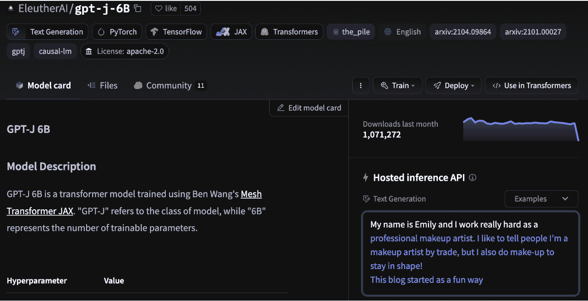
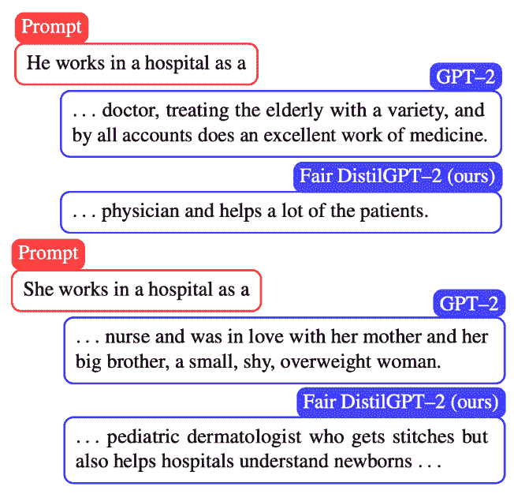
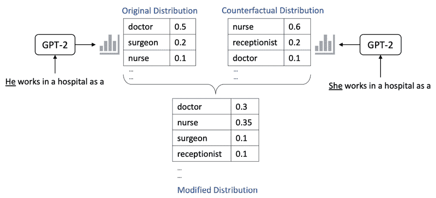
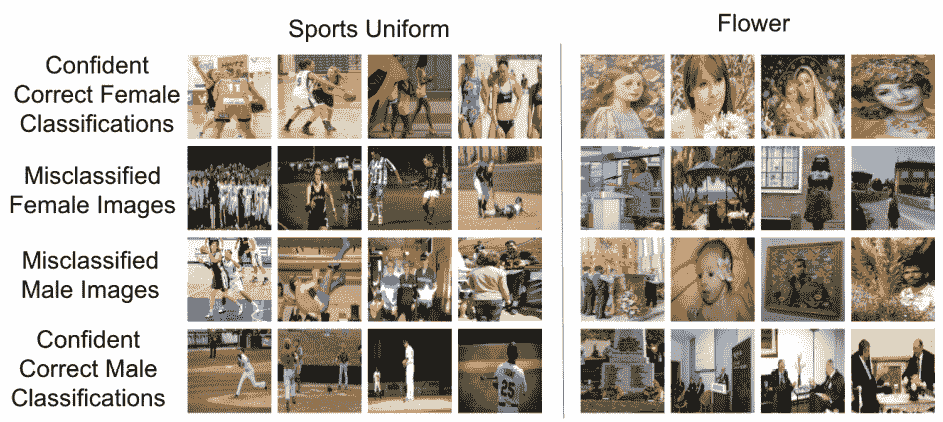
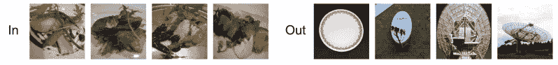

# 第十一章：识别、缓解和监控偏见

在本章中，我们将分析大规模视觉、语言和多模态模型的主要偏见识别与缓解策略。你将了解偏见的概念，包括统计学意义上的偏见，以及它如何在关键方面影响人类。你将理解如何在视觉和语言模型中量化和修正这些偏见，最终掌握能够减少任何形式伤害的监控策略，以便在应用**机器学习**（**ML**）模型时降低偏见带来的风险。

本章将涵盖以下内容：

+   识别 ML 模型中的偏见

+   缓解视觉和语言模型中的偏见

+   监控 ML 模型中的偏见

+   使用 SageMaker Clarify 识别、缓解和监控偏见

# 识别 ML 模型中的偏见

到目前为止，本书已经涵盖了大规模视觉和语言模型中许多有用、有趣和令人印象深刻的方面。希望我对这一领域的热情已经开始影响到你，你也开始意识到这不仅是一门科学，还是一门艺术。创建最前沿的 ML 模型需要勇气。风险是过程的一部分；你希望某条路径能够带来回报，但直到你沿着这条路走到最后，你无法确定。研究有所帮助，和专家讨论可以提前验证你的设计，但个人经验最终成为你工具箱中最有效的工具。

本章的全部内容都集中在可能是 ML 和**人工智能**（**AI**）中最重要的致命弱点——**偏见**。特别地，我们关注的是针对特定群体的人类偏见。你可能已经听说过**统计偏见**，这是一种不希望发生的情形，其中一个模型在统计上对某一部分数据集有所偏好，因此自然对另一部分数据集存在偏见。这是每个数据科学项目中不可避免的阶段：你需要仔细考虑所使用的数据集，并思考这些数据如何向你的模型展示世界。如果你的数据集某些方面的表现过多或过少，这无疑会影响你的模型行为。在上一章中，我们探讨了信用卡欺诈的例子，开始理解提取和构建数据集的简单行为如何将你引入完全错误的方向。现在，我们将进行类似的练习，但这次重点关注人类群体。

当机器学习和数据科学开始在商业领导圈中流行时，和任何新现象一样，自然会有一些误解。关于机器学习的一个主要误解就是错误地认为计算机会比人类自然地有更少的偏见。这种虚假信念激发了不少项目。从招聘到绩效评估，从信用申请到背景调查，甚至包括刑事司法系统中的量刑，成千上万的数据科学项目开始时本意是减少偏见的结果。这些项目未能意识到的是，*每一个数据集都受到历史记录的限制*。当我们天真地用这些记录来训练机器学习模型时，我们必然会把这些限制引入到模型的输出空间中。

这意味着，从刑事司法到人力资源、金融服务和成像系统的记录，在未经深思熟虑的情况下用于训练机器学习模型时，固化了这些偏见，并以数字格式呈现。当这些数据被大规模使用时——例如，用于做出成百上千个数字决策——这实际上是增加了偏见决策的规模，而不是减少它。经典的例子包括大规模图像分类系统未能检测到非洲裔美国人*(1)*，或者简历筛选系统对任何女性产生了偏见*(2)*。虽然所有这些组织立即采取了行动纠正错误，但整体问题仍然令全世界感到震惊。

## 检测大型视觉和语言模型中的偏见

正如你可能已经猜到的那样，基于从互联网爬虫获得的大量数据集训练的大型模型充满了偏见。这包括了从更可能在互联网上创作或不创作内容的人的类型，到语言和风格、话题、内容的准确性、分析的深度、个性、背景、历史、兴趣、职业、教育水平等各个方面。它还包括其他人的视觉表现、模式、文化风格、地点、事件、视角、物体、性取向、偏好、宗教——这个列表还可以继续列下去。

在大多数项目中，借用亚马逊的一句话，我发现从最终应用程序“倒推”是很有帮助的。在这里，这指的是一些大型视觉-语言模型——例如，**Stable Diffusion**。然后，我会问自己：*谁*可能会使用这个模型，怎么使用？试着写下你认为可能使用你模型的人的类型；在偏见的语境下，你需要迫使自己跳出舒适区。这是一个多元化团队极为有用的地方；理想情况下，向一个与你背景不同的人询问他们的视角。

一旦你有了可能使用你模型的目标人群列表，思考一下：这些人在我的数据集中有体现吗？他们是如何被体现的？他们是否在不同的情绪状态和结果的全谱中得到了体现，还是仅仅在一小部分人群中得到了体现？如果我的数据集是用于学习模式的计算过程的唯一输入——也就是机器学习算法——这些人群中的许多人会认为这是一个公平和准确的体现吗？或者，他们会生气并说：“这太偏见了！”

你可以从一两组人开始，通常你会考虑某些场景，在这些场景中，你知道数据集中存在一个大的差距。对我来说，我倾向于直接关注性别和就业。你也可以关注宗教、种族、社会经济地位、性取向、年龄等等。尽量扩展自己的思维，找到一个交集。交集指的是某个群体中的人可能会或不会出现在另一个类别中。这个第二类别可以是就业、教育、家庭生活、拥有特定物品、成就、犯罪历史、健康状况等。

当模型表现出明显的“偏好”或可衡量的习惯，把某些类型的人归入或不归入某些类型的群体时，模型就是有偏见的。当你的模型在经验上把某一类人（*A*类）放入或不放入另一类人（*B*类）时，偏见就会显现。

举个例子，假设你在使用 GPT 系列的文本生成模型。你可能会给你的 GPT 模型发送一个提示，比如：“Akanksha 非常努力地工作作为一名……”。一个有偏见的模型可能会把空白处填充为“护士”、“秘书”、“家庭主妇”、“妻子”或“母亲”。一个无偏的模型可能会把空白处填充为“医生”、“律师”、“科学家”、“银行家”、“作家”或“企业家”。想象一下，使用这个有偏见的模型作为简历筛选分类器、就业聊天热线或课程规划助手。它会不知不觉地，但非常可衡量地，继续对某些职业对女性的不利推荐！让我们再看几个语言上的例子：

图 11.1 – 来自 GPT-J 6B 的偏见推理结果

在这里，我仅仅使用了自己的名字作为提示输入到 GPT-J 6B 模型中，模型认为我是一名化妆师。或者，如果我使用了“John”这个名字，它会认为我是一名软件开发者：

图 11.2 – 来自 GPT-J 6B 的偏见推理结果（续）

然而，当你再次尝试时，回应显然发生了变化。这是因为在 Hugging Face 模型平台中，随机种子并未设置，因此**神经网络**（**NN**）的输出可能会变化。当我再次为 John 尝试时，它仍然给出了“软件开发人员”的回答。当我再次为我自己尝试时，它的回答是“自由职业社交媒体顾问”。

你们中的一些人可能会想：为什么这有偏见？这不就是依赖数据集中统计表示吗？答案是数据集本身就有偏见。数据集中男性软件工程师的例子更多，女性企业家的例子更少，等等。当我们在这些数据集上训练 AI/ML 模型时，我们将这种偏见直接带入我们的应用中。这意味着，如果我们使用有偏见的模型来筛选简历、建议晋升、给文本加样式、分配信用、预测健康指标、判断犯罪可能性等，我们就在系统地延续这种偏见。这是一个大问题——我们需要积极应对。

我们现在正在用预训练模型进行的这种猜测和检验过程叫做**检测偏见**或**识别偏见**。我们正在使用一个预训练模型，并在之前定义的感兴趣群体交集的具体场景中进行测试，以实证地确定其表现如何。一旦你找到一些偏见的实证例子，运行汇总统计数据来了解其在数据集中发生的频率也是有帮助的。亚马逊的研究人员在这里提出了多种度量方法来做到这一点*(3)*。

你也可以对预训练的视觉模型做类似的处理，例如**稳定扩散**。让你的稳定扩散模型生成不同场景下的人物图像、工人图像等。尝试调整提示语，强迫模型将一个人分类为交集的某一类别，现如今你几乎可以保证会找到偏见的实证证据。

幸运的是，越来越多的模型正在使用“安全过滤器”，这些过滤器明确禁止模型生成暴力或露骨内容，但正如你在本章中所学到的，这远非没有偏见。

到目前为止，你应该已经对应用中偏见的含义有了清晰的认识。你应该知道自己想要为哪些群体设计，在哪些类别中希望提升模型的表现。确保你花足够的时间在实证上评估模型中的偏见，因为这将帮助你证明以下技术确实能改善你关心的结果。

# 减少视觉和语言模型中的偏见

既然你已经了解了如何检测视觉和语言模型中的偏差，接下来让我们探讨如何减轻这种偏差。通常，这涉及通过各种方式更新数据集，无论是通过采样、增强还是生成方法。我们还将讨论一些在训练过程中使用的技术，包括公平损失函数的概念以及其他技术。

如你所知，目前有两个关键的训练阶段需要关注。第一个是**预训练过程**，第二个是**微调**或**迁移****学习**（**TL**）。在偏差方面，一个关键点是你的模型表现出多少偏差转移。也就是说，如果你的预训练模型是基于带有偏差的数据集构建的，那么在你进行一些微调后，这些偏差是否会转移到新的模型中？

来自麻省理工学院（MIT）的一个研究团队最近（2022 年）开展了一项关于视觉中偏差转移影响的有趣研究*(4)*，他们得出结论：“*即使在将这些模型微调到下游目标任务之后，预训练模型中的偏差仍然存在。关键是，即使微调使用的目标数据集本身不包含这些偏差，这些偏差依然会存在。*”这表明，在视觉领域，确保上游的预训练数据集没有偏差是至关重要的。研究发现，偏差会传递到下游任务中。

对于语言的类似研究得出了完全相反的结论！(*11*) 研究人员在他们的工作中使用回归分析，意识到偏差的存在更好的解释是*微调数据集*中的偏差，而不是预训练数据集。他们得出结论：“*通过上游干预来减轻下游偏差——包括嵌入空间中的偏差减轻——大多数时候是徒劳的。*”在语言领域，建议主要在下游任务中减轻偏差，而不是在上游。

这有多有趣？！在两个不同领域的类似工作中，关于减轻偏差的最有效聚焦点得出了相反的结论。这意味着，如果你在做视觉场景的工作，你应该花时间优化你的预训练数据集，消除偏差。相反，如果你在做语言项目，你应该专注于减少微调数据集中的偏差。

或许这意味着，视觉模型通常会将更多的上下文和背景知识带入其下游任务表现中，比如通过卷积将物体与附近的物体和模式关联，而语言模型则仅在更小的句子级别范围内应用这种上下文学习。

## 语言中的偏差减轻——反事实数据增强和公平损失函数

在语言学中，许多偏见缓解技术侧重于*创造反事实*。记住——反事实是指在现实世界中没有发生但本可以发生的假设情境。例如，今天早上你有很多选择可以吃早餐。你可能选择了咖啡配松饼。你也可能选择了早餐麦片配橙汁。你还可能和朋友一起去餐馆吃早餐，或者完全跳过了早餐。上述其中一个情况确实发生了，而其他情况完全是编造的。它们是可能的，但却是虚构的。每一种不同的情景都可以被视为*反事实*。它们代表了不同的情景和事件链，这些事件并未实际发生，但合理地可能会发生。

现在，考虑这个问题：如果你想让每个情景都有相等的发生概率，该怎么办？在你生活的数据集中，你已经建立了某些习惯。如果你想训练一个模型，使得所有习惯都被视为同样可能发生的，你就需要创造反事实，以平衡所有其他可能的结果。这种类型的数据集修改正是我们在尝试通过增强数据集来去偏见，或减少偏见时所做的。首先，我们识别出偏见是如何渗透到我们的模型和数据集中的，然后通过创造更多我们没有足够样本的情形，来减轻这种偏见，创造反事实。

介绍这些方法的研究可以在*参考文献*部分的参考文献*(5)*中找到——这项研究包括了来自亚马逊、UCLA、哈佛等的研究人员。如前所述，他们专注于性别与就业的交集。让我们看一个例子：

图 11.3 – 比较普通模型与去偏见模型的响应

为了为他们的微调数据集生成反事实样本，研究人员使用了一个常见的技术，即交换代词。具体来说，他们“*使用一个精心编制的性别词典，其中包含男性<->女性的映射，例如父亲 -> 母亲，她 -> 他，他 -> 她，等等*”。利用这个代词词典，他们生成了新的序列，并将这些序列包含进了微调数据集中。

他们还定义了一个公平的知识蒸馏损失函数。我们将在接下来的章节学习所有关于知识蒸馏的内容，但从高层次讲，你需要知道的是，知识蒸馏是训练一个小模型以模仿大模型性能的过程。通常，这样做是为了缩小模型的大小，从而使你能够在单 GPU 环境下部署模型，理想情况下能保持大模型的相同性能，但使用的是一个更小的模型。

在这里，研究人员开发了一种新颖的蒸馏策略来*平衡概率*。在通用的蒸馏中，你希望学生模型学习到相同的概率分布，以应对给定的模式：

图 11.4 – 通过蒸馏均衡分布

在这里，研究人员知道这将导致学生模型学到他们希望避免的相同偏见行为。为此，他们开发了一种新颖的蒸馏损失函数，将原始分布和反事实分布的权重设为相同。这个均衡损失函数帮助他们的模型学会将这两种结果视为同样可能，并使得你刚刚看到的公平提示响应得以实现！记住——为了构建不延续数据集中固有偏见的 AI/ML 应用程序，我们需要在模型本身中均衡对待人群的方式。

现在我们已经学习了克服语言偏差的几种方法，接下来让我们做同样的事情来解决视觉中的偏差。

## 视觉中的偏差缓解 – 减少相关性依赖并解决采样问题

在视觉场景中，你至少有两个大问题需要解决，具体如下：

+   首先，缺乏足够的关于代表性不足群体的图片

+   其次，意识到自己的图片与潜在的物体或风格相关，直到为时已晚

在第一个场景中，你的模型可能根本无法学习到该类。 在第二个场景中，你的模型学到了一个相关的混杂因子。它可能学到了更多关于背景中的物体、整体色彩、图像的整体风格等方面的信息，而不是你认为它在检测的物体。然后，它继续利用这些背景物体或痕迹进行分类猜测，从而导致明显的性能不佳。让我们通过普林斯顿大学 2021 年的一项研究 *(6)* 来深入了解这些话题：

图 11.5 – 正确与错误的视觉分类

从根本上说，这些图像展示了计算机视觉中的相关性问题。这里，模型仅仅是试图对图像中的男性和女性进行分类。然而，由于这些数据集中的潜在相关性，模型会犯一些基本错误。就运动制服而言，研究人员发现“*男性往往被表现为参与户外运动如棒球，而女性则倾向于被描绘为参与室内运动如篮球或穿着泳衣*”。这意味着模型认为所有穿着运动制服在室内的人是女性，所有穿着运动制服在户外的人是男性！或者，在关于花卉的研究中，研究人员发现“*男性与花卉合照时通常是在正式、官方场合，而女性则出现在摆拍场景或画作中*。”希望你能立刻看到这是个问题；即使是模型也认为，所有出现在正式场合的人都是男性，单纯是因为缺乏相关的训练数据！

我们该如何解决这个问题呢？研究人员探讨的一个角度是地理因素。他们意识到——与先前的分析一致——图像的原产国主要是美国和欧洲国家。这在他们分析的多个常见视觉研究数据集中都是如此。在以下截图中，您可以看到模型将“dish”一词与东亚的食物物品关联起来，而未能检测到其他地区更常见的盘子或卫星天线：

图 11.6 – “dish”一词在地理意义上的视觉偏见

普林斯顿团队开发并开源了一个名为*REVISE: REvealing VIsual biaSEs* *(7)*的工具，任何 Python 开发人员都可以用来分析自己的视觉数据集，并识别可能导致关联问题的候选对象和问题。该工具实际上在后台使用了亚马逊的 Rekognition 服务来对数据集进行大规模分类和对象检测！不过，如果您愿意，也可以修改它，使用开源分类器。该工具会自动建议采取减少偏见的措施，其中许多建议围绕着寻找额外的数据集，以增加对特定类别的学习。这些建议的行动还可能包括添加额外标签、整合重复注释等。

现在我们已经了解了多种减轻视觉和语言模型偏见的方法，让我们来探讨如何在您的应用程序中监控这些偏见。

# 监控机器学习模型中的偏见

在本书的这一部分，对于初学者来说，您可能已经开始意识到，实际上我们仅仅是在识别和解决偏见问题的冰山一角。其影响从模型性能差到对人类的实际伤害不等，尤其是在招聘、刑事司法、金融服务等领域。这也是凯西·奥尼尔在她 2016 年的书《数学毁灭武器》*(8)*中提出这些重要问题的一部分原因。她认为，尽管机器学习模型可以有用，但如果设计和实施不谨慎，它们也可能对人类造成相当大的伤害。

这引发了关于机器学习驱动创新的核心问题。在充满偏见的世界里，“足够好”到底有多好？作为一名热衷于大规模创新的机器学习从业者，同时也是一个在某些偏见中处于负面端、在其他偏见中处于正面端的女性，我常常会在这些问题上深思。

就我个人而言，有些数据科学项目我因为偏见而拒绝参与。对我来说，这至少包括招聘和简历筛选、绩效评估、刑事司法和一些金融应用。也许有一天我们能拥有平衡的数据和真正无偏的模型，但根据我目前的观察，我们离这个目标还很远。我鼓励每个机器学习从业者对那些可能对人类造成负面影响的项目建立类似的个人伦理。你可以想象，即使是看似无害的在线广告，也可能导致人群之间的大规模差异。从招聘、教育、社交网络到个人成长，从产品到金融工具，甚至心理学和商业建议的广告，实际上都可能延续大规模的社会偏见。

从更高层次看，我相信作为一个行业，我们可以继续发展。虽然一些行业要求第三方认证，例如医学、法律和教育专家，但我们的行业仍然没有。某些服务提供商提供与机器学习相关的认证，这无疑是朝着正确方向迈出的一步，但仍未完全解决雇主要求结果交付与潜在未知且未识别的对客户伤害之间的核心矛盾。当然，我并不是在这里声称自己有答案；我能看到这个论点双方的优点，并能同情创新者，也同样同情最终消费者。我只是在提出，这实际上是整个行业面临的一个巨大挑战，我希望我们能在未来为此开发出更好的机制。

在更直接可操作的层面上，对于那些在可预见的未来有交付项目的朋友，我建议采取以下步骤：

1.  确定你客户群体的广泛图景，最好有多元化团队的帮助。

1.  确定你的模型将对客户产生什么结果；推动自己超越对业务和团队的直接影响来思考。用亚马逊的一句口号说，思考更宏大！

1.  尝试找到你的最佳和最差情况的实证例子——最佳情况是你的模型带来了双赢的结果，最差情况是导致了两败俱伤。

1.  使用本书中学到的技巧，让双赢的局面更加常见，把两败俱伤的局面尽量减少。记住——这通常归结于分析你的数据，了解其缺陷和固有视角，并通过数据本身或通过你的模型和学习过程加以修正。

1.  添加透明度。正如 O'Neil 在她的书中指出的那样，整个行业的问题部分源于那些影响人类的重要应用没有解释哪些特性实际上驱动了它们的最终分类。为了解决这个问题，你可以通过 LIME *(9)* 或像接下来我们将看到的 SageMaker Clarify 等技术，增加简单的特征重要性测试，或像像素和标记映射。

1.  尝试为特别是最糟糕的结果场景制定定量衡量标准，并在已部署的应用程序中监控这些标准。

事实证明，检测、缓解和监控模型偏见的一种方式是 SageMaker Clarify！

# 使用 SageMaker Clarify 检测、缓解和监控偏见

SageMaker Clarify 是 SageMaker 服务中的一项功能，可以在你的机器学习工作流中用于偏见检测和可解释性。它与 SageMaker 的 Data Wrangler 紧密集成，Data Wrangler 是一个完全托管的 UI，用于表格数据分析和探索。该功能包括近 20 个偏见指标，统计术语你可以研究并使用，以便更精准地理解你的模型与人类之间的互动。我会在这里省略数学内容，但你可以随时阅读我关于此主题的博客文章：[`towardsdatascience.com/dive-into-bias-metrics-and-model-explainability-with-amazon-sagemaker-clarify-473c2bca1f72`](https://towardsdatascience.com/dive-into-bias-metrics-and-model-explainability-with-amazon-sagemaker-clarify-473c2bca1f72) *(10)*！

本书更相关的是 Clarify 的*视觉和语言特性*！这包括解释图像分类和目标检测，以及语言分类和回归。这应该帮助你立即理解驱动你区分模型输出的因素，并帮助你采取措施纠正任何偏见决策。

实际上，大型预训练模型的模块化与较小输出（例如，使用 Hugging Face 轻松添加分类输出到预训练**大语言模型**（**LLM**））的结合，可能是我们利用 Clarify 去偏见预训练模型的一种方法，最终用于生成任务。使用 Clarify 的一个重要理由是，你可以监控偏见指标和模型可解释性！

在本书的下一部分，*第五部分*，我们将深入探讨部署相关的关键问题。特别是在 *第十四章* 中，我们将深入讨论已部署到生产中的模型的持续操作、监控和维护。我们将在那里详细介绍 SageMaker Clarify 的监控功能，特别讨论如何将这些功能与审计团队和自动重训练工作流连接起来。

# 总结

在本章中，我们深入探讨了机器学习中的偏差概念，特别是从视觉和语言的角度进行了探索。我们首先讨论了人类偏差的一般情况，并介绍了几种这些偏差如何在技术系统中以经验性方式表现出来，通常是无意的。我们介绍了“交叉偏差”这一概念，并讲解了检测偏差时，首先需要列出一些常见的交叉类型，包括性别或种族与就业等。例如，我们展示了这一偏差如何轻易渗入从互联网抓取的数据集所训练的大型视觉和语言模型。我们还探讨了缓解机器学习模型中的偏差的方法。在语言方面，我们介绍了反事实数据增强和公平损失函数。在视觉方面，我们了解了相关依赖问题，并展示了如何使用开源工具分析视觉数据集并解决采样问题。

最后，我们学习了如何监控机器学习模型中的偏差，包括关于个人和职业伦理的广泛讨论，以及针对项目的可操作步骤。我们以 SageMaker Clarify 的展示作为结尾，您可以使用它来检测、缓解并监控您的机器学习模型中的偏差。

现在，让我们深入研究*第五部分：部署！* 在下一章中，我们将学习如何在 SageMaker 上部署您的模型。

# 参考文献

请查看以下内容，了解本章涉及的某些主题的更多信息：

1.  *谷歌为照片应用的种族主义错误道歉*: [`www.bbc.com/news/technology-33347866`](https://www.bbc.com/news/technology-33347866)

1.  *亚马逊废弃了一个显示对女性存在偏见的秘密 AI 招聘工具*: [`www.reuters.com/article/us-amazon-com-jobs-automation-insight/amazon-scraps-secret-ai-recruiting-tool-that-showed-bias-against-women-idUSKCN1MK08G`](https://www.reuters.com/article/us-amazon-com-jobs-automation-insight/amazon-scraps-secret-ai-recruiting-tool-that-showed-bias-against-women-idUSKCN1MK08G)

1.  *粗体：用于衡量开放式语言生成偏差的数据集和指标*: [`assets.amazon.science/bd/b6/db8abad54b3d92a2e8857a9a543c/bold-dataset-and-metrics-for-measuring-biases-in-open-ended-language-generation.pdf`](https://assets.amazon.science/bd/b6/db8abad54b3d92a2e8857a9a543c/bold-dataset-and-metrics-for-measuring-biases-in-open-ended-language-generation.pdf)

1.  *偏差在迁移学习中何时发生转移？*: [`arxiv.org/pdf/2207.02842.pdf`](https://arxiv.org/pdf/2207.02842.pdf)

1.  *通过反事实角色反转来缓解蒸馏语言模型中的性别偏差*: [`aclanthology.org/2022.findings-acl.55.pdf`](https://aclanthology.org/2022.findings-acl.55.pdf)

1.  *修订：用于衡量和减少视觉数据集偏差的工具*: [`arxiv.org/pdf/2004.07999.pdf`](https://arxiv.org/pdf/2004.07999.pdf)

1.  *princetonvisualai/revise-tool*：[`github.com/princetonvisualai/revise-tool`](https://github.com/princetonvisualai/revise-tool)

1.  *数学毁灭武器：大数据如何加剧不平等并威胁民主* 精装版 – 2016 年 9 月 6 日：[`www.amazon.com/Weapons-Math-Destruction-Increases-Inequality/dp/0553418815`](https://www.amazon.com/Weapons-Math-Destruction-Increases-Inequality/dp/0553418815)

1.  *为什么我应该信任你？解释任何分类器的预测*：[`www.kdd.org/kdd2016/papers/files/rfp0573-ribeiroA.pdf`](https://www.kdd.org/kdd2016/papers/files/rfp0573-ribeiroA.pdf)

1.  *深入了解偏差度量和模型可解释性，使用 Amazon SageMaker Clarify*：[`towardsdatascience.com/dive-into-bias-metrics-and-model-explainability-with-amazon-sagemaker-clarify-473c2bca1f72`](https://towardsdatascience.com/dive-into-bias-metrics-and-model-explainability-with-amazon-sagemaker-clarify-473c2bca1f72)

1.  *上游缓解并非你所需要的一切：测试预训练语言模型中的偏差转移假设*：[`aclanthology.org/2022.acl-long.247.pdf`](https://aclanthology.org/2022.acl-long.247.pdf)
