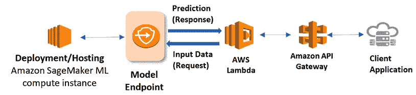
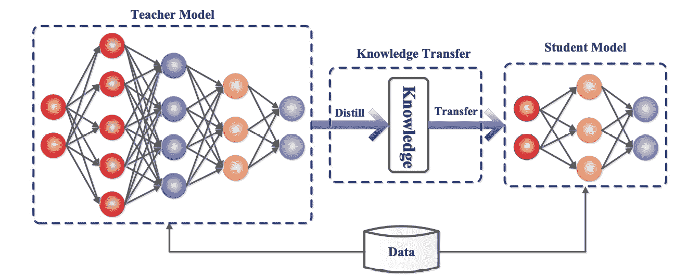
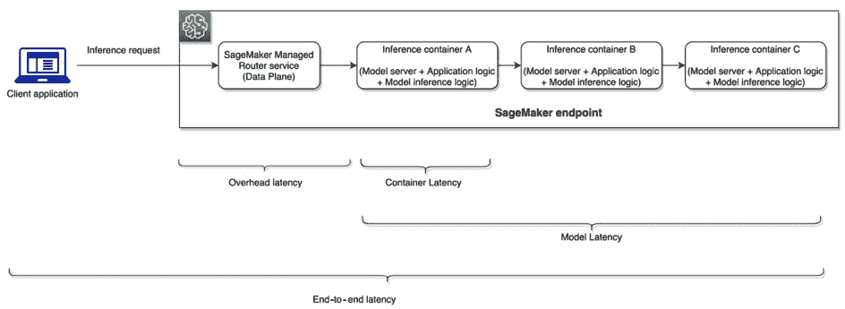

# 第十二章：如何部署您的模型

在本章中，我们将向您介绍多种模型部署技术，包括实时端点、无服务器架构、批量选项等。这些概念适用于许多计算环境，但我们将重点讨论在 Amazon SageMaker 上可用的功能。我们将讨论在部署之前为什么应该尝试缩小模型的大小，并介绍在视觉和语言领域的相关技术。我们还将介绍分布式托管技术，适用于那些无法或不需要缩小模型的场景。最后，我们将探讨模型服务技术和概念，帮助您优化模型的端到端性能。

本章将涵盖以下主题：

+   什么是模型部署？

+   如何托管我的模型是最好的方式？

+   AWS 上使用 SageMaker 部署模型的选项

+   缩小模型大小的技术

+   在 SageMaker 上托管分布式模型

+   模型服务器和端到端托管优化

# 什么是模型部署？

在经过几周到几个月的时间，从优化数据集到分布式训练环境，评估模型，减少偏差后，您一定迫不及待想要将模型发布给客户了！在本书的这一部分，我们将专注于与模型部署相关的所有关键主题。但首先，让我们尝试解释一下这一术语本身。

**模型部署**指的是*将您的模型集成到应用程序中*。这意味着除了在笔记本中使用您的模型进行本地分析或运行报告之外，您还将其连接到其他软件应用程序。最常见的情况是，您将该模型集成到一个应用程序中。这个应用程序可能只是一个分析仪表盘，也可能是一个欺诈检测系统、自然语言聊天、通用搜索、自动驾驶汽车，甚至是一个视频游戏。在下一章中，我们将提供更多关于跨组织使用案例的想法，特别是那些由大型预训练视觉和语言模型提供加速的案例。

对我来说，数据科学团队的一个重要区分点是他们是否会部署模型。如果他们部署模型，这通常意味着他们的模型以自动化方式与客户互动，并创造业务价值。这通常表明他们的团队将产品开发作为主要输出。或者，你也可能会看到一些数据科学团队将知识构建作为主要输出。这在一些金融服务、医疗保健和公共部门组织中比较常见。他们可能专注于回答业务利益相关者的分析问题，较少关注交付产品，而更多关注理解其庞大而复杂的数据集。本书的大部分内容都致力于关注产品的团队，但许多工具和概念也适用。本章的大部分内容将与构建产品极为相关。为什么？因为模型成为了产品的一部分。部署是实现这一点的步骤。

数据科学团队将模型部署任务交给工程团队是常见的做法。通常这样做是为了让数据科学家和应用科学家能够专注于核心的研究与开发，而工程团队则可以专注于端到端优化应用程序。有些团队同时包含数据科学和平台工程，而也有一些人对整个流程充满好奇！在*第十四章*中，我们将深入探讨目前被称为 MLOps 的运营问题，这将帮助你开发人员、流程和技术，以简化部署。这通常包括模型监控、审计、自动重训练、调优等内容。

本书中我们关注的大多数部署模式明确地将模型保留在云端。这是为了简化端到端的操作。然而，一些应用无法承受额外的延迟，尤其是往返云端的延迟，无论我们如何降低这一延迟。这些应用包括自动驾驶汽车、视频游戏执行、手机部署、低互联网连接场景、机器人技术等。这些应用通常将模型工件和推理脚本直接集成到 SDK 构建中。然而，这只有在模型足够小，能够适应目标部署设备时才可能实现。这对 Meta 的较小 LLaMA 模型*(1)*、Stable Diffusion 以及其他单 GPU 模型而言尤为相关。这意味着我们稍后将在本章讨论的相同模型缩减技术，对云端和设备端部署都适用。

在 2021 年，我领导了 AWS 的一个团队，发布了一份关于**混合机器学习**的 35 页白皮书。它可以在网上免费获取，链接如下：[`docs.aws.amazon.com/pdfs/whitepapers/latest/hybrid-machine-learning/hybrid-machine-learning.pdf`](https://docs.aws.amazon.com/pdfs/whitepapers/latest/hybrid-machine-learning/hybrid-machine-learning.pdf) *(2)*。该白皮书包括了每种架构的建议性指南以及优缺点。与本书类似，许多概念适用于各种计算环境，但为在 AWS 上工作提供了深入的技术信息。

现在你对模型部署的概念有了更好的了解，让我们来探索你可以选择的不同选项吧！

# 我该如何托管我的模型？

正如你可能预期的，这个问题的答案完全取决于你正在构建的应用程序。首先，大多数客户都会提出一个大问题：你是否需要实时或同步方式从模型中获取响应？这适用于搜索、推荐、聊天等应用程序。大多数实时模型部署使用*托管端点*，这是一个持续运行在云端的实例，用于处理请求。与此相对的是*批处理*。批处理作业将你的模型和推理数据带入，启动计算集群在所有请求数据上执行推理脚本，然后关闭。实时部署和批处理作业之间的关键区别在于新数据和模型推理请求之间的等待时间。实时部署能够提供尽可能快速的模型响应，虽然你需要为此支付更多费用。而批处理作业则是在作业完成之前不会返回模型响应，你会等待几分钟，但支付的费用要少得多。

让我们首先详细探讨实时端点，然后再深入了解批处理和更多选项。对于那些已经熟悉 SageMaker 托管并希望直接跳到有关如何托管基础模型问题的读者，请随时直接跳到以下部分。

我们在 Amazon SageMaker 上推出的最早的功能之一就是实时端点。这些是完全托管的 API，用于托管你的模型和脚本。如下面的图所示，当指定时，它们可以在多个可用区的多个实例上运行。SageMaker 可以根据客户流量自动扩展这些端点，根据需要启动和停止实例。SageMaker 还会管理一个负载均衡器，将流量发送到这些端点，所有这些都由端点本身处理，与请求流量进行交互。

图 12.1 – 指向 SageMaker 端点的示例架构

终端会与接口进行交互，例如 Lambda 函数或简单的 API 网关。然后，网关会直接与客户端应用程序交互。例如，您可能在本地托管一个网页应用程序，例如搜索航空航班。根据客户的偏好和航班历史，您可能希望使用推荐算法。您的数据科学团队可能会在另一个账户中分析这些数据，训练模型并优化该模型的投资回报率。一旦他们找到一个表现合理的模型工件，他们可以使用自己的脚本、包和对象将其加载到 SageMaker 终端。然后，您可能会将该工件推广到您的生产账户，进行渗透测试和安全测试。部署后，这个新终端可以与 API 请求进行交互。网站托管团队可以简单地指向您在云中托管的新 API，而您的数据科学团队则独立更新和监控模型。

我们将在接下来的章节中介绍更多的这些架构最佳实践，但现在，先来看一下您在 AWS 账户中已可用的一些模型部署选项。

## AWS 上使用 SageMaker 的模型部署选项

以下术语是您在 AWS 账户中已可用的一些模型部署选项：

+   **实时终端**：如前所述，实时终端是通过 SageMaker 提供的始终在线的完全托管计算资源。您提供您的模型和推理脚本；我们为您提供整个 RESTful API。这包括随着流量增加而启动，流量减少时则关闭的能力。这会影响您的费用，因为您是按实例每分钟付费的。实时终端还具有许多其他功能，例如支持 GPU 运行、分布式托管、多模型终端、异步终端等。目前，它们的最大负载大小为 6 兆字节，最大请求运行时间为 60 秒。

+   **批量转换和计划的笔记本**：实时终端的两个主要替代方案：

    +   **批量** **转换作业**

    +   **计划的** **笔记本作业**

使用 SageMaker 上的 **批量转换**，您与实时终端起始位置相似，都有一个训练好的模型和推理脚本，但您还需指向在运行时已知的数据集。这意味着您将启动一个批量转换作业，指向一个已知的数据集。您还需要确定此作业所需的计算资源。SageMaker 会启动这些资源，针对数据进行模型推理， 将推理结果存储到 S3 中，然后关闭计算资源。

一个类似的服务是 *笔记本作业*。与直接使用预训练的模型工件不同，笔记本作业以整个笔记本作为起始点。当你想运行一组 Python 函数或数据分析步骤，并生成多个图表和图形作为分析结果时，你可以使用笔记本作业。你可以在 SageMaker Studio 中编写笔记本，并简单地创建一个定时笔记本作业，而无需编写任何代码！

+   **异步端点**：如果你计划托管大型模型，或者你的推理脚本中有大量计算，那么推理请求可能无法在 60 秒内完成。在这种情况下，你可能需要考虑使用异步端点。这些端点可以为你提供最长 15 分钟的运行时间，并配有管理队列来处理所有请求。你将拥有最大 1 GB 的负载大小，这比实时端点的 6 MB 负载限制大大提升。异步端点非常适合文档处理任务，比如实体识别和提取。

+   **多模型端点**：在使用实时端点时，你可以额外选择在同一端点上托管 *多个模型*。这有三种不同的方式。首先，你可以使用一个容器托管在端点上，并将多个模型存储在 S3 中。这对于处理涉及成千上万个模型的使用场景非常适合，例如为你数据库中的每个客户训练小型线性模型。你可以将任意数量的模型存储在 S3 中，只要它们使用相同的托管镜像，并将模型名称发送到 SageMaker 多模型端点。我们会从 S3 加载该模型并将其载入 RAM，响应请求。之后，该模型会被缓存以应对未来的流量，当不再需要时会被发送回 S3。

另一个更简单的选项是 *在一个端点上存储多个容器*。在这种模式下，你可以创建多个容器，例如一个使用 XGBoost，另一个使用 PyTorch，还有一个使用 `pandas`，依此类推。只要端点足够大，它就能托管这些容器，并且你可以根据请求确定使用哪个容器。

最后，你还可以使用所谓的 **串行推理管道**。这也使用多个容器，但每个容器会依次调用，类似于一个管道。你可能会在特征预处理时使用这种方法，比如运行 LDA 或 VAE，然后将其应用于你的模型。

+   **无服务器端点**：在 SageMaker 上托管模型的另一个选项是无服务器端点。这对于基于 CPU 的模型，如 KNN 或逻辑回归，非常适合，尤其是在你预期间歇性流量时。这可能包括长时间没有任何推理请求，然后突然出现流量激增。无服务器选项非常具有成本效益，所以如果你能够在无服务器环境下满足延迟目标，那么这通常是一个不错的选择。鉴于 Lambda 函数现在可以支持最多 10GB 的内存 (*3*)，你可能能够将已经较小的基础模型缩小到这些运行时要求。基于 CPU 的运行时可能会有挑战，但如果较慢的响应时间不成为阻碍，无服务器可能是一个选项。

在 SageMaker 上托管有很多其他方面的内容。你可以监控你的模型，启用自动扩展，解释模型，安全地验证模型，应用影子测试，在注册表中目录化模型，启用 A/B 测试，对其进行审计等等。我们将在 *第十四章* 中深入探讨这些话题。现在，让我们了解如何减少推理模型大小的方法。

# 为什么我需要缩小我的模型，如何缩小？

在了解了大模型如何提升准确性的强大能力后，你可能会想，为什么我会考虑缩小我的模型呢？事实上，大型模型可能响应推理请求的速度非常慢，并且部署成本很高。尤其是在语言和视觉应用中，包括从视觉搜索到对话、图像到音乐生成、开放领域问答等。虽然这对训练而言不一定是问题，因为唯一等待模型完成的人是你自己，但在托管过程中，当你试图让客户满意时，它会成为一个巨大的瓶颈。正如许多研究所证明，在数字体验中，每毫秒都至关重要。客户非常严格地偏好快速、简洁和高效的在线界面。这就是为什么在业界有多种技术能够加速模型推理而不降低准确度。这里我们将介绍三种关键技术：编译、知识蒸馏和量化。

## 模型编译

如我们之前所学，**编译**是一种可以用于基于 GPU 的深度学习模型的技术。根据编译器中对运算符的支持，你可能能够为你所选的目标设备编译一个预训练模型。AWS 提供了一个托管功能，称为 SageMaker Neo，它会运行一个编译任务，将你的工件转换为指定环境下的格式。这适用于云端和设备端的部署。尽管 Neo 可以将你的模型大小减少最多 10 倍，但不能保证它适用于任何任意的神经网络，因此需要谨慎操作。

## 知识蒸馏

**知识蒸馏**是一种迷人的技术，它使用一个较大的模型（称为教师模型）来影响一个较小模型（称为学生模型）的性能。通过梯度下降，特别是计算两个分布之间差异的 KL 散度，我们可以教学生模型模仿教师模型的行为。一个非常合乎逻辑的应用场景是大规模预训练之后！例如，利用规模法则将模型的规模扩大到与数据规模匹配，帮助你最大化在准确性和计算智能上的潜力。然而，在此之后，你可以使用知识蒸馏来优化该模型在生产环境中的性能。根据教师模型和学生模型之间的规模差距，你可以轻松将推理运行时间提升 10 倍或更多，同时仅损失少量的准确性。以下是 Jianping Gou（*3*）等人在其 2021 年关于该领域的调查中展示的知识蒸馏的可视化呈现。

图 12.2 – 通过蒸馏进行知识转移

虽然教师模型和学生模型接收相同的数据集，但我们通过比较它们生成的概率来*传递知识*给学生。然后，我们只需更新学生模型，以最小化它们之间的差异！

知识蒸馏在其他应用中也非常有用，包括机器翻译和**基于人类反馈的强化学习**（**RLHF**）。专业提示：RLHF 是 ChatGPT 背后的一个关键技术！我们在*第十章*中了解了更多关于它的内容。蒸馏还负责 DistiliBert（*4*），这是 Hugging Face 团队在 2019 年提出的一个模型。

## 量化

**量化**是另一种减少模型运行时间的技术。在这种情况下，我们并不是严格减少模型的内存占用（这是编译和蒸馏的做法），而是重构网络，使用较低精度的数据类型。在这里，数据类型指的是位表示，通常范围从高精度的 FP32 到 FP16 甚至 INT8。整数在计算上更容易表示，因此它们所需的存储空间较小。然而，浮点数显然更具表现力，因为它们可以表示介于整数之间几乎无限的数值范围。通过量化转换数据表示是有用的，因为当你将训练中的浮点数据类型转换为部署中的整数时，整体内存消耗会减少。如何操作取决于不同的框架，PyTorch 中如何实现可以在这里找到（*5*），NVIDIA 的 TensorRT 中也有相关细节（*6*）。量化确实有权衡，因此，在部署量化模型之前，请确保对其进行充分的测试，以了解它对速度和准确性的影响。

现在，你已经学习了几种减少模型占用空间的方法，接下来我们将介绍一些当你无法使用这些方法时可以采用的技术：分布式模型托管！

# 在 SageMaker 上托管分布式模型

在*第五章*中，我们讲解了分布式基础知识，你学习了如何将模型和数据集分配到多个 GPU 上。好消息是，你可以使用相同的逻辑来托管模型。在这种情况下，你更关注的是模型并行，将层和张量分配到多个 GPU 分区。你实际上不需要数据并行框架，因为我们不使用反向传播。我们只是通过网络进行前向传播，并获取推理结果。这里没有梯度下降或权重更新的过程。

什么时候使用分布式模型托管？将超大型模型集成到你的应用程序中！通常，这仅限于大型语言模型。视觉模型超出单 GPU 的情况较为罕见。记住，在*第四章*中，*云中的容器与加速器*部分，我们了解了不同大小的 GPU 内存。这对于托管和训练同样重要。估算模型的 GB 大小的一种简单方法是查看其存储在磁盘上的占用空间。虽然当对象从磁盘转移到内存时，大小可能会略有变化，但总体的磁盘占用空间仍然是一个很好的估算值。

对于像 GPT-3 这样拥有 175B 参数的超大型模型，模型通常至少需要 350GB 的存储！在这个案例研究*(7)*中，我们展示了如何在 SageMaker 上托管这样一个规模的模型，只使用 8 个 A100。那是一个`ml.p4d.24xlarge`实例，在 SageMaker 公开定价下，约为每小时 37 美元！尽管这是训练成本的一小部分，训练成本对于超大型基础模型来说可能轻松达到 10 倍甚至更多，但看到账单上的这个费用依然令人感到痛苦。

除了这个集群的巨大成本，你还会给客户带来额外的延迟成本。想象一下，如果在 8 个 GPU 上运行任何过程，即便使用流水线和张量并行，速度仍然不会特别快。

现在，让我们了解一些关键的基础技术，它们将所有这些内容汇聚在一起。然后，我们将看看 6B 和 175B 规模的托管模型的几个示例。

### SageMaker 上的大型模型托管容器

正如我们在训练基础模型时学到的，关键在于基础容器和你使用的相关软件包，这些都是你实现目标的核心。对于在 SageMaker 上托管大型模型，我们提供了专门的深度学习容器，专门用于这个目的。这些容器已在 GitHub 上开源*(8)*，你可以轻松查看并在其基础上进行开发。

大模型推理容器为你打包并提供了两项关键技术：DJLServing 和 DeepSpeed。**Deep Java Library**（**DJL**）*(9)* 最初是为 Java 开发者构建的，用于构建 ML 模型和应用程序。他们构建了一个通用的模型托管解决方案，语言无关，提供了一个共同的基准，可以跨 TensorFlow、ONNX、TensorRT 和 Python 等框架托管模型。他们还通过 MPI 和套接字连接原生支持多 GPU 托管。这使得它成为分布式托管的一个有吸引力的选择！

AWS 大模型托管容器提供的第二项关键技术是 DeepSpeed。值得注意的是，DeepSpeed 非常有帮助，因为它将你的张量分片到多个 GPU 上，并自动找到最佳的分片策略。正如我的同事在这篇博客文章中讨论的那样*(10)*，DeepSpeed 在确定最佳分片方案时，评估了推理延迟和成本。

如果你想详细了解这个的实际操作示例，可以查看我们的 6B GPT-J 笔记本：[`github.com/aws/amazon-sagemaker-examples/blob/main/inference/generativeai/deepspeed/GPT-J-6B_DJLServing_with_PySDK.ipynb`](https://github.com/aws/amazon-sagemaker-examples/blob/main/inference/generativeai/deepspeed/GPT-J-6B_DJLServing_with_PySDK.ipynb)。

较小的示例是一个很好的起点，因为它为跨多个 GPU 托管模型提供了非常简单、实用且成本较低的内容。一旦你测试过这个，就可以升级到一个更大的示例，通过这个 BLOOM 笔记本托管 175B 参数：[`github.com/aws/amazon-sagemaker-examples/blob/main/inference/nlp/realtime/llm/bloom_176b/djl_deepspeed_deploy.ipynb`](https://github.com/aws/amazon-sagemaker-examples/blob/main/inference/nlp/realtime/llm/bloom_176b/djl_deepspeed_deploy.ipynb)。

现在我们已经介绍了一些分布式托管的选项，让我们以一个快速讨论模型服务器和优化端到端托管体验来结束这一章。

# 模型服务器和端到端托管优化

你可能会想：如果 SageMaker 托管我的模型工件和推理脚本，我怎么将它转化为一个能够响应实时流量的服务呢？答案就是模型服务器！对于那些不特别想了解如何将模型推理响应转换为 RESTful 接口的人来说，你会很高兴地知道，在 SageMaker 上，这些操作大部分已经被抽象化，便于快速原型开发。然而，如果你想优化推理堆栈以提供最先进的模型响应，请继续阅读。

在改进模型托管响应时，有五种关键类型的延迟需要缩减。以下是我们总结的这些延迟类型：

+   **容器延迟**：指的是进入和退出其中一个容器所需的时间开销。正如我们之前所学，在 SageMaker 上，你可能会在*串行推理管道*中托管各种容器。这里展示了这一点。容器延迟是调用和退出一个容器的时间。

+   **模型延迟**：包括所有容器在端点上的调用和退出时间。正如下面的*图 12.13*所示，单个容器的延迟可能远小于模型的整体延迟。

+   **开销延迟**：指的是 SageMaker 路由请求、接收来自客户端的请求并返回的时间，减去模型的延迟。

+   **端到端延迟**：主要从客户端的角度来计算。它受客户端请求带宽、与云的连接、SageMaker 前的任何处理、开销延迟以及模型延迟的影响。

让我们将这些部分一起看看：

图 12.3 – SageMaker 上的端到端模型延迟

作为这个服务的用户，你可以部署一些优化技术。首先，这对于 AWS 上的任何应用程序都适用，*将应用程序推送到你的客户所在的位置！* 使用 AWS 的一个主要原因是我们拥有全球最大的基础设施，比任何其他 CSP 都要大。我们拥有更多的区域和更高可用性的设计，比地球上任何其他云平台都要多。当你将应用程序推送到离客户最近的地理区域或接入点时，请将这一点作为你的资产。这将立即减少客户请求到达云端所需的时间，因为它需要在网络上传输的距离会更短。

我的 AWS 同事们发布了一篇精彩的博客文章，介绍了如何为 SageMaker 托管工作负载*优化容器*。特别是，他们探索了 NVIDIA 的 Triton，一个开源项目，可以提供超低延迟的模型推理结果，延迟甚至可以低至单个毫秒。

要了解更多关于 Triton 的详细信息，除了对 SageMaker 托管的端到端优化外，请参阅他们关于这个话题的博客文章：[`aws.amazon.com/blogs/machine-learning/achieve-hyperscale-performance-for-model-serving-using-nvidia-triton-inference-server-on-amazon-sagemaker/`](https://aws.amazon.com/blogs/machine-learning/achieve-hyperscale-performance-for-model-serving-using-nvidia-triton-inference-server-on-amazon-sagemaker/) *(11)*。

最后，我还想特别提到 SageMaker 的**推理推荐器** *(12)*，它可以帮助你根据预期的流量选择合适的实例类型、数量和配置。事实上，我的团队使用推理推荐器在 Triton 上进行测试！

现在，您对模型服务器是什么以及如何使用它们来优化端到端托管性能有了更深入的了解，让我们在本章结束时做一个总体回顾。

# 总结

我们将模型部署定义为将模型集成到客户端应用程序中。我们讨论了可能会部署自己模型的数据科学团队的特点，以及那些可能专注于更一般分析的团队。我们介绍了多种模型部署在整个应用程序中至关重要的用例。虽然提到了多种混合架构，但我们特别关注了云中的部署。我们了解了托管模型的一些最佳方式，包括 SageMaker 上的实时端点、批量转换和笔记本作业、异步端点、多模型端点、无服务器端点等选项。我们了解了减少模型大小的选项，从编译到蒸馏和量化。我们还讨论了分布式模型托管，并以回顾模型服务器和在 SageMaker 上优化端到端托管的建议作为结尾。

接下来，我们将深入探讨一组可以与基础模型互动的技术，以便挤出最佳性能：提示工程！

# 参考文献

1.  *LLaMA：开放高效的基础语言* *模型*: [`arxiv.org/pdf/2302.13971.pdf`](https://arxiv.org/pdf/2302.13971.pdf)

1.  *Lambda* *配额*: https://docs.aws.amazon.com/lambda/latest/dg/gettingstarted-limits.html

1.  *知识蒸馏：一项* *综述*: [`arxiv.org/pdf/2006.05525.pdf`](https://arxiv.org/pdf/2006.05525.pdf)

1.  *DistilBERT，一个精简版的 BERT：更小、更快、更便宜、* *更轻*]: https://arxiv.org/pdf/1910.01108.pdf

1.  *量化*: [`pytorch.org/docs/stable/quantization.html`](https://pytorch.org/docs/stable/quantization.html)

1.  *使用 NVIDIA Triton 推理服务器在 Amazon* *SageMaker 上实现模型服务的超大规模性能*: [`aws.amazon.com/blogs/machine-learning/achieve-hyperscale-performance-for-model-serving-using-nvidia-triton-inference-server-on-amazon-sagemaker/`](https://aws.amazon.com/blogs/machine-learning/achieve-hyperscale-performance-for-model-serving-using-nvidia-triton-inference-server-on-amazon-sagemaker/)

1.  *在 Amazon SageMaker 上使用大型模型推理深度学习容器和* *DeepSpeed* 部署 BLOOM-176B 和 OPT-30B: [`aws.amazon.com/blogs/machine-learning/deploy-bloom-176b-and-opt-30b-on-amazon-sagemaker-with-large-model-inference-deep-learning-containers-and-deepspeed/`](https://aws.amazon.com/blogs/machine-learning/deploy-bloom-176b-and-opt-30b-on-amazon-sagemaker-with-large-model-inference-deep-learning-containers-and-deepspeed/)

1.  *大型模型推理* *容器*：[`github.com/aws/deep-learning-containers/blob/master/available_images.md#large-model-inference-containers`](https://github.com/aws/deep-learning-containers/blob/master/available_images.md#large-model-inference-containers)

1.  *深度 Java* *库*：[`djl.ai/`](https://djl.ai/)

1.  *使用 DJLServing 和 DeepSpeed 模型并行推理在 Amazon SageMaker 上部署大型模型*：[`aws.amazon.com/blogs/machine-learning/deploy-large-models-on-amazon-sagemaker-using-djlserving-and-deepspeed-model-parallel-inference/`](https://aws.amazon.com/blogs/machine-learning/deploy-large-models-on-amazon-sagemaker-using-djlserving-and-deepspeed-model-parallel-inference/)

1.  *使用 NVIDIA Triton 推理服务器在 Amazon SageMaker 上实现超大规模模型服务性能*：https://aws.amazon.com/blogs/machine-learning/achieve-hyperscale-performance-for-model-serving-using-nvidia-triton-inference-server-on-amazon-sagemaker/

1.  *Amazon SageMaker 推理* *推荐系统*：[`docs.aws.amazon.com/sagemaker/latest/dg/inference-recommender.html`](https://docs.aws.amazon.com/sagemaker/latest/dg/inference-recommender.html)

# 第五部分：部署你的模型

在第五部分，你将学习如何部署你的模型。你将使用蒸馏、量化和编译等技术来减少模型的整体体积。你还将确定最合适的用例，以便在组织中扩展模型，并了解持续的操作、监控和维护。

本节包括以下章节：

+   *第十三章*，*提示工程*

+   *第十四章*，*视觉与语言的 MLOps*

+   *第十五章*，*预训练基础模型的未来趋势*
