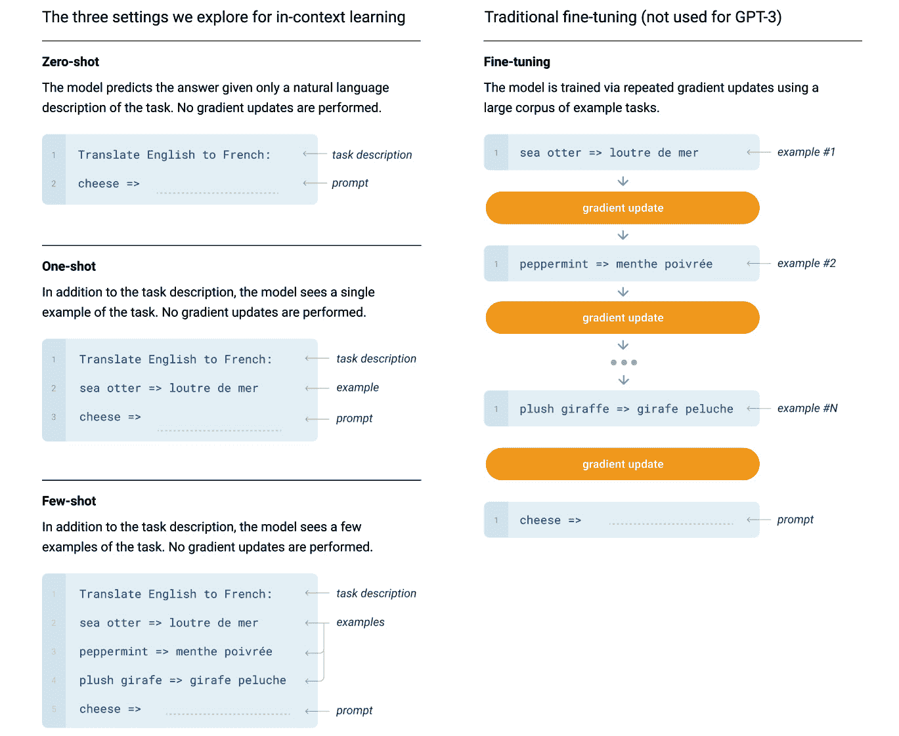
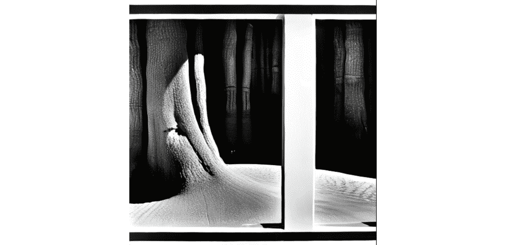
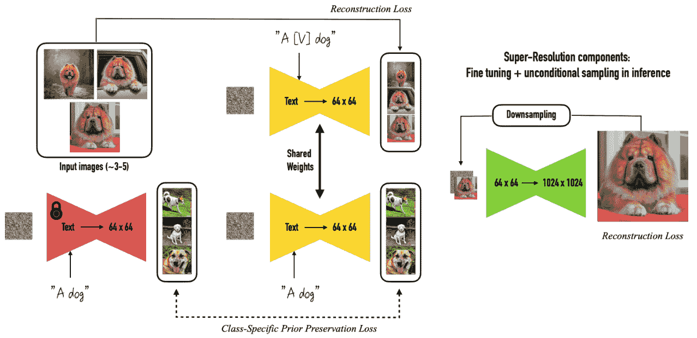
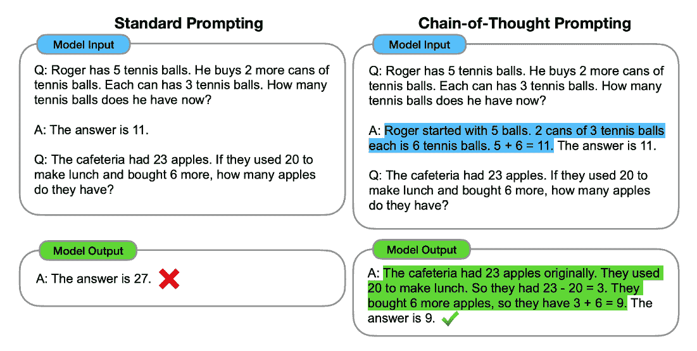
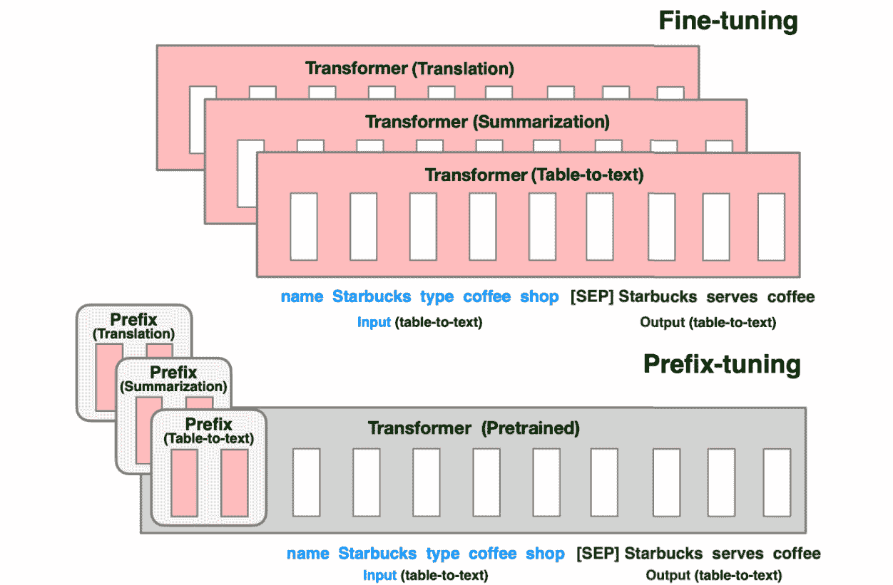
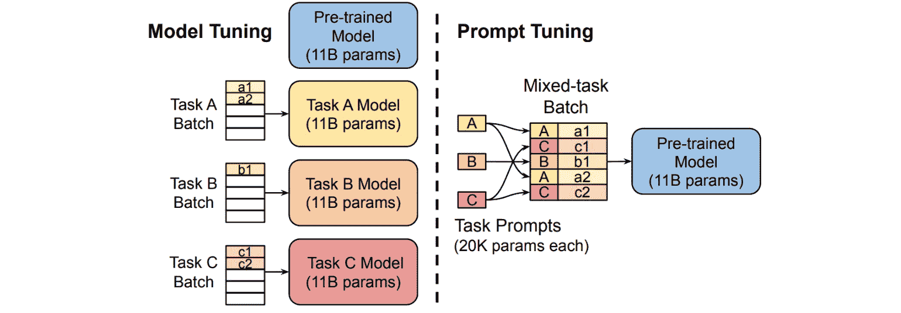

# 第十三章：提示工程

在本章中，我们将深入探讨一种特殊的技术集合——提示工程。你将从高层次了解这一技术，包括它与本书中其他基于学习的主题的相似性和差异性。我们将探索视觉和语言方面的示例，深入研究关键术语和成功指标。特别地，本章涵盖了所有改进性能的技巧与窍门，*无需更新模型权重*。这意味着我们将模拟学习过程，而不一定改变任何模型参数。这包括一些高级技术，如提示和前缀微调。本章将涵盖以下主题：

+   提示工程 – 用更少的输入获得更多的艺术

+   从少量学习到零-shot 学习

+   文本到图像提示的技巧与窍门

+   图像到图像提示的最佳实践

+   提示大型语言模型

+   高级技术 – 提示和前缀微调

# 提示工程 – 用更少的输入获得更多的艺术

在本书的这个阶段，以及在你的项目中，你应该已经在你的新基础模型上投入了大量的时间。从计算成本、数据集、定制代码到你阅读过的研究论文，你可能已经花费了 50 到 100 小时或更多的时间来提升性能。为你鼓掌！这是一种很棒的生活方式。

然而，在你完成这一切之后，尤其是当你学会如何围绕你的模型构建一个完整的应用时，接下来就是最大化你的模型在推理时的表现了。在上一章中，我们了解了多种优化模型运行时的方法，从编译到量化，再到蒸馏和分发，每一种都对加速推理结果有所帮助。然而，本章的重点是获得你能够得到的最准确的响应。在这里，我使用“准确”一词是为了表明任何类型的模型*质量*或*评估*指标。如你在上一章关于评估中所学，准确率本身是一个具有误导性的术语，通常不是评估指标中最好的选择。更多细节请参见*第十章*

提示工程包括一组与选择最佳输入以进行模型推理相关的技术。推理是指在不更新权重的情况下从模型中获取结果；可以将其理解为没有任何反向传播的前向传递。这很有趣，因为它是你如何从模型中获取*预测*的方式。当你部署你的模型时，你是在进行推理。

提示工程包含了大量的技术。它包括像*零-shot 和少量-shot 学习*这样的内容，我们向模型提供多个示例，要求它完成逻辑序列。它还包括选择正确的超参数。它包括大量的猜测和检验，测试你的模型结果并找出最适合的技术。

对于那些为终端消费者托管生成性 AI 模型的你们，可能会考虑搭建一个客户端来处理提示工程。这在模型演示平台中似乎比较常见，其中并非所有的参数和模型调用都是直接公开的。作为应用开发者，你可以并且应该修改客户发送给你模型的提示，以确保他们获得最佳性能。这可能包括在调用中添加额外的术语、更新超参数以及重新表述请求。

让我们更详细地探讨一下提示工程以及与之相关的技能——少样本学习。

# 从少样本到零样本学习

正如你所记得的，我们一直在参考的一个关键模型是**GPT-3**，即**生成预训练变换器**。提供第三版的论文叫做*语言模型是少样本学习者*。（1）为什么？因为这篇论文的主要目标是开发一个能够在没有大量微调的情况下表现良好的模型。这是一个优势，因为它意味着你可以使用一个模型来覆盖更多的使用场景，而不需要开发定制代码或整理定制数据集。换句话说，零样本学习的单位经济学比微调更强。在微调的世界中，你需要为基础模型的任务解决方案付出更多努力。这与少样本学习的世界不同，在少样本学习中，基于你的基础模型解决其他任务要容易得多。这使得少样本模型更有价值，因为微调模型在大规模应用时成本太高。虽然在实践中，微调比少样本学习更稳健地解决问题，但它使得提示工程的整个实践变得非常有吸引力。接下来让我们看看以下屏幕截图中的一些示例。

图 13.1 – 来自 GPT-3 论文的少样本学习示例

在左侧，我们看到模型推理的不同输入选项。在论文中，他们使用了“上下文学习”这一短语，指的是在数据集中，可以包含任务定义和示例的样本。这些重复的样本帮助模型学习任务的名称和示例。在这里，任务的名称或任务描述是**将英语翻译成法语**。然后，我们看到这样的示例，例如**海獺 -> loutre de mer**。当你向 GPT-3 提供任务名称以及一些样本时，它便能够做出相当不错的响应。

我们称之为**少-shot 学习**。这是因为我们为模型提供了少量示例，显然比一个示例多，但又少于完整的数据集。我在这里使用“学习”这个词有些困难，因为从技术上讲，模型的权重和参数并没有更新。模型并没有发生变化，因此可以说我们甚至不应该使用“学习”这个词。另一方面，提前提供这些示例作为输入显著提升了模型的表现，因此从输出的角度来看，或许我们可以使用“学习”这个词。无论如何，这已是标准的术语。

一个类似的例子是**零-shot 学习**，在这种情况下，我们不给模型提供任何完成任务的示例，而是希望它能够表现良好。这种方法非常适合开放领域的问答任务，比如 ChatGPT。然而，正如许多人发现的那样，一个在零-shot 学习场景中表现良好的模型，也可以在少-shot 甚至单-shot 示例中表现得很好。所有这些技术对于理解大型模型都非常有用。

正如我们在*图 13.1*中看到的，这种学习方法的自然比较是微调。在微调方法中，正如我们在*第十章*中学到的，我们使用预训练的模型作为基础，并使用更大的数据集样本对其进行再训练。通常，这个数据集样本是有监督的，但在必要时也可以使用无监督的微调。在语言场景中，这种监督可能是分类、问答或摘要。在视觉领域，你可能会看到新的图像和文本对，涵盖了各种应用场景：时尚、电商、图像设计、营销、媒体娱乐、制造业、产品设计等等。

最常见的进展通常包括以下几个步骤：

1.  首先，尝试在你的模型上进行零-shot 学习。它能在每个用例和边缘场景下完美运行吗？很可能，它在一些非常狭窄的场景下能工作得很好，但在其他场景下可能需要一些帮助。

1.  接下来，尝试单-shot 和少-shot 学习。

如果你提供一些你期望的示例，模型能否理解并给出合适的响应？它是否能按照你提供的提示做出好的反应？如果这些都不行，可以尝试微调。去收集一个更具体的、与你想要增强模型的应用场景相关的数据集并进行训练。有趣的是，微调在仅涉及语言的场景中似乎更加成功。在视觉领域，微调很容易导致模型过拟合或陷入*灾难性遗忘*，即模型失去了保持基础数据集中的图像和物体的能力。你可能更适合探索图像到图像的方式，下面会进一步讲解。

现在，让我们学习一些关于视觉和语言的最佳提示工程实践。

# 文本到图像的提示工程技巧

正如我们之前在书中提到的，Stable Diffusion 是一个很棒的模型，你可以通过自然语言与其互动并生成新图像。Stable Diffusion 基于模型的美妙、趣味和简单性在于，你可以在设计提示时尽情发挥创意。在这个例子中，我为一件艺术作品编造了一个挑衅性的标题。我要求模型想象一下，如果这幅图像是由安塞尔·亚当斯（Ansel Adams）创作的，会是什么样子。安塞尔·亚当斯是 20 世纪中期著名的美国摄影师，以其黑白自然风光摄影而闻名。以下是完整的提示：“*关闭即是开放*，安塞尔·亚当斯，高分辨率，黑白，获奖。指导（20）*”。让我们仔细看看。

图 13.2 – 由 Stable Diffusion 生成的图像

在以下列表中，你会找到一些有助于提升你 Stable Diffusion 结果的提示：

+   **在你的提示中添加以下词汇**：*获奖、高清晰度、在<你喜欢的网站>上流行、以<你喜欢的艺术家>的风格、400 高 dpi*，等等。网上有成千上万的优秀照片和它们的相应提示；一个很好的网站是 lexica.art。以有效的方法为起点总是一个不错的选择。如果你对视觉充满热情，你可以轻松地花费几个小时只是在浏览这些示例并找到好的案例。为了更快速的方式，同一个网站允许你以关键词作为提示进行搜索并渲染图像。这是开始提示模型的快捷方式。

+   **添加负面提示**：Stable Diffusion 提供了负面提示选项，允许你向模型提供它明确不使用的词语。常见的负面提示包括：手、人类、过度饱和、绘制不佳、畸形等。

+   **图像放大**：虽然大多数使用 Stable Diffusion 的提示生成的图像较小，比如 512x512 的大小，但你可以使用另一种技巧，称为图像放大，将同一图像渲染成更大、更高质量的图像，大小可以是 1,024x1,024 或更大。图像放大是你可以用来获得今天最佳质量 Stable Diffusion 模型的一个重要步骤，无论是在 SageMaker *(2)* 上，还是通过 Hugging Face 直接使用 *(3)*。我们将在接下来的图像到图像部分进一步探讨这一点。

+   **精准度与细节**：当你向 Stable Diffusion 提供更长的提示词时，例如在提示中加入更多术语并详细描述你想要它生成的物体类型和风格，实际上会提高响应效果的几率。要小心你在提示中使用的词汇。正如我们在*第十一章*关于偏见的部分学到的，大多数大型模型都是基于互联网上的数据进行训练的。对于 Stable Diffusion 来说，无论是好是坏，这意味着你要使用网络上常见的语言。这也意味着标点符号和大小写并不是那么重要，你可以非常创造性和自发地描述你想要看到的内容。

+   **顺序**：有趣的是，单词的顺序在给 Stable Diffusion 下达提示时非常重要。如果你想让提示中的某部分更具冲击力，比如*黑暗*或*美丽*，可以把它放在提示词的前面。如果它太强烈了，可以把它移到后面。

+   **超参数**：这些在纯语言模型中也有关系，但我们来特别提一下几个对 Stable Diffusion 尤为重要的超参数。

Stable Diffusion 提示工程的关键超参数

1\. `guidance=20` 在第二张图像中，模型捕捉到了亚当斯作品中明显的对比和阴影渐变。此外，我们得到了一个新的风格，几乎像 M.C. 艾舍尔（M.C. Escher），树木似乎变成了地板。

2\. **种子**：这指的是一个整数，你可以设置它作为扩散过程的基准。设置种子对模型响应有很大影响。特别是如果我的提示词不太好，我喜欢从种子超参数开始，尝试几次随机启动。种子影响图像的高层属性，如风格、物体大小和颜色。如果你的提示词足够强大，你可能不需要在这里做大量实验，但它是一个不错的起点。

3\. **宽度和高度**：这些非常直接；它们只是输出图像的像素尺寸！你可以通过它们来改变结果的范围，从而影响模型生成的图片类型。如果你想要一张完全方形的图像，使用 512x512。如果你想要竖版方向，使用 512x768。如果是横版方向，使用 768x512。记住，你可以使用稍后我们会学习的放大过程来提高图像的分辨率，因此最好先从较小的尺寸开始。

4\. `steps` 设置为 `50`。增加这个数字也会增加处理时间。为了得到很好的结果，个人来说，我喜欢根据 guidance 的值来调整这个数字。如果你计划使用非常高的 guidance 值（大约 16），比如在一个强力提示下，那么我不建议将推理步骤设置为超过 50。这看起来会出现过拟合，结果会很差。不过，如果你的 guidance 值较低，接近 8，那么增加步骤数量可能会得到更好的结果。

对于 Stable Diffusion 和其他文本到图像的扩散模型，还有许多其他的超参数可以探索。现在，让我们来探讨一下图像到图像的技术！

# 图像到图像提示工程技巧

在生成性 AI 中，尤其是在提示模型时，*图像到图像* 是一个引人入胜的趋势。这涵盖了一系列广泛的技术，允许你在调用模型时带入一张图像。然后，模型的响应将把你的源图像整合到响应中，让你更具体地确定模型提供的响应。这对于提高图像分辨率、添加遮罩，甚至引入物体以无缝地格式化到输出图像中的任何背景都非常有帮助。

这些核心能力是通过一种在 2022 年初提出的技术实现的 *(4)*，称为**随机微分方程编辑**（**SDEdit**），它利用随机微分方程使得图像合成和编辑变得更加容易。虽然听起来有点吓人，但实际上它非常直观。它允许你将源图像添加到预训练的扩散模型中，并使用该基础图像作为灵感来源。怎么做呢？通过以多种方式反复添加和去除噪声，直到最终结果符合你的偏好标准。SDEdit 在真实性上比其前身——基于 GAN 的方法提高了多达 98%，在人类满意度评分上提高了 91%。

让我们探索一下，在使用扩散模型进行提示时，如何利用这一增强的图像到图像技术！

## 放大

如前所述，这是一种简单且快速的提高图像分辨率的方法。在提示模型时，你可以增强低分辨率的图像，并结合其他参数来提高质量。使用 SageMaker JumpStart *(5)*，你可以直接使用内置的选项，此外，通过 Hugging Face，你还可以使用完整的放大流程。*(6)* 这还可以接受除了源图像之外的其他文本提示。

## 遮罩

提示扩散模型时，另一个有趣的技术是**遮罩**。遮罩就是一组像素，覆盖在照片中的某个区域：山脉、汽车、人类、狗或图像中的任何其他物体。如何找到像素图呢？现在，老实说，一个简单的方法可能是从 Meta 的新**任何物体分割模型**（**SAM**）*（***SAM**）* 开始。*(7)* 你可以上传一张图像，并让模型生成该图像中任何物体的像素图。

一旦你有了一个遮罩，你可以将其发送到 Stable Diffusion 图像中，在遮罩区域生成一张新图像。经典的例子是改变人们所穿衣服的风格。你可以使用 SAM 或开源的 CV 工具提取照片中衣服的区域，渲染遮罩，然后将遮罩发送给 Stable Diffusion。它将生成一张新图像，将原始图像与新生成的元素结合起来，填充遮罩区域。

如果你想看一个简单又完整的端到端示例，可以看看我刚在 GitHub 上找到的一个！*(8)*

## 使用 DreamBooth 进行物体到图像的提示

与我们在前面几节中看到的其他方法不同，DreamBooth *(9)* 并不使用底层的 SDEdit 方法。相反，它使用一组输入图像，并通过结合文本指导的微调过程，将来自所有输入图像的源物体放置到模型生成的目标场景中。该技术使用了两个损失函数，一个用于保留预训练模型已经学到的先前类别，另一个用于将新物体重建到最终图像中。

这意味着可以说，它并不是一种提示技术；它更接近于一种微调技术。然而，我将它包括在这里，因为我觉得它的意图更类似于遮蔽（masking），而不是创建一个全新的模型，但实际上它的结果就是如此。我们来更仔细地看看 DreamBooth 的损失函数。

图 13.3 - DreamBooth 损失函数

图 13.3 - DreamBooth 保留先前信息的损失函数

DreamBooth 是一个很棒的开源解决方案，你可以用它将你喜欢的任何物体放置到你选择的任何背景中！接下来，我们来学习一些你可以用来改善语言模型提示的技巧。

# 提示大型语言模型

我之前说过：我非常喜欢并大力支持 Hugging Face。我从他们那里学到了很多关于**自然语言处理**（**NLP**）的知识，因此如果不提到他们的书作为一个关于提示工程技巧和技术的极佳资源，我就不对得起自己了。*(10)* 其中大多数做法围绕着为你的模型选择合适的超参数展开，每种类型的模型都会提供稍有不同的结果。

然而，我认为 ChatGPT 的崛起几乎完全改变了这一点。在今天的世界里，OpenAI 模型的极高准确度提高了所有 NLP 开发者的标准，迫使我们交付相似的结果。无论好坏，都无法回头。让我们尝试理解如何提示我们的**大型语言模型**（**LLMs**）！我们将从指令微调开始。

## 指令微调

首先，理解一个经过*指令微调*的模型和一个未经过微调的模型之间的区别是非常有帮助的。正如我们在*第十章*关于微调的内容中所学到的，指令微调是指一种监督式的微调步骤，它使用模型提供的指令，例如“告诉我含羞草和三角饺的区别”，并将这些指令与答案配对，如“含羞草是一种含有香槟和橙汁的酒精饮料，而三角饺则是一种印度酥皮点心，里面填充有蔬菜或肉类，通常还有土豆馅料。”模型随后会明确学习如何遵循指令。

这对提示 LLM 非常重要，因为它会完全改变你的提示风格。如果你正在使用一个已经经过指令微调的 LLM，你可以直接进入零-shot 性能，并立即让它无缝地为你执行任务。如果没有，你可能需要在提示中添加一些示例，也就是少量示例学习，以鼓励它按照你希望的方式做出回应。

一旦你弄清楚了这个关键区别，花时间尝试你选择的模型也是有帮助的。它们有细微的差别；有些模型需要不同的符号和分隔符，而其他的则对关键字和短语反应较好。你需要了解并测试你的 LLM，而提示工程是一个很好的方法。另一个值得学习的风格是*思维链提示*。

## 思维链提示

即使你正在使用一个在零-shot 情况下表现良好的模型，比如一个已经接受了指令微调的模型，正如我们之前讨论的，你仍然可能会遇到一些需要在提示中添加示例以获得期望输出的使用场景。思维链提示就是一个很好的例子。思维链提示指的是提示模型*展示它是如何* *得出答案的*。这在解释性至关重要的场景中极为有价值，例如解释 LLM 为什么做出风格更新或分类决策。举个例子，假设你正在法律场景中使用 LLM，并且你希望 LLM 更新法律文件中的语言。当你这样提示它时，模型不仅仅是提供答案，而是可以一步步解释它是如何得出某个结论的。这种逻辑清晰性有助于大多数用户对系统更有信任，帮助他们理解并相信模型提出的建议是有效的。

它在很多情况下也有助于提高准确性！这是因为大多数大语言模型（LLMs）本质上是自回归的；它们非常擅长预测在给定字符串中下一个最可能出现的词。当你引导它们进入一连串的思维时，你实际上是在推动它们按一步步的思路生成，从而使它们更接近真实情况。让我们通过以下原始论文中的图示来更直观地理解这一点。*(11)*

图 13.4 – 思维链提示

如你所见，在左侧，我们仍然在进行一些少量学习，但提示中的答案很简单。它仅仅回答问题，完结。可是，在右侧，我们通过提供一个*重新表述问题*的答案来提示模型。现在，答案开始于重新生成问题中提供的信息的快速摘要，然后进行一次逻辑跳跃，输出正确答案。你可以看到，左侧的模型没有正确回答，而右侧的模型是正确的。实际上，模型本身是一样的，唯一的区别是提示。

对于经过指令微调的模型，你还可以通过一个像“逐步指导我如何...”这样的语句来触发连锁思维表现。

## 摘要

这可能是我今天看到的最常见的 LLM 应用场景：总结电话记录、文档等。使用顶级 LLM，摘要现在变得非常容易。只需根据模型的上下文长度，将尽可能多的文档粘贴到 LLM 中，并在提示的底部添加*Summarize*：。一些模型可能有所不同；你也可以添加*TL;DR*、*in summary*：或其他类似的变体。它们会完美地工作吗？当然不行。它们会抓住所有内容吗？绝对不可能。它们偶尔会产生幻觉吗？毫无疑问。我们该如何减轻这个问题？微调、大规模验证、实体识别和审计。

## 防御提示注入和越狱

在提示模型时需要考虑的一种技巧是*它对越狱的敏感程度*。正如我们在*第十一章*中学到的关于检测和缓解偏见的内容，越狱是指恶意用户诱导模型执行有害行为。这可能就像是要求模型讲一些关于某些群体的粗鲁笑话，要求它提供盗窃的指导，或者询问它对某些政治家或社会群体的看法。在每个 LLM 应用中，至少会有一些用户尝试越狱，看看是否能诱使模型做出不当行为。一个类似的方法是**提示注入**，用户可以恶意欺骗模型，让它输出来自数据集、提示集或任何其他指令列表中的 IP。

如何防御这一点？一种方法是通过有监督的微调。Anthropic 维护了一个大型的红队数据集，可以在 Hugging Face 上找到，链接在这里。*(12)* 请小心使用；这个数据集中的词汇非常直白，可能会让一些读者感到不适。就个人而言，我甚至觉得很难研究这个数据集中的几行内容。作为一种有监督的微调技术，或者正如 Anthropic 所建议的，作为一种带有人工反馈的强化学习技术，你可以对模型进行微调，以拒绝任何看起来恶意或有害的内容。

除此之外，你还可以*为应用程序增加分类器来处理输入数据*。这意味着，当你的应用接收到来自用户的新问题时，你可以轻松地增加额外的机器学习模型来检测这些问题中的恶意或异常行为，并绕过回答。这使你能更好地控制应用的响应方式。

现在我们已经学习了一些提示 LLM 的基本技巧，让我们看看一些更高级的技巧！

# 高级技巧 – 前缀与提示调优

你可能在想，难道没有一种更精巧的方式，通过优化技术找到正确的提示，而不需要更新模型参数吗？答案是肯定的，确实有许多方法可以实现这一点。首先，让我们试着理解**前缀调优**。

## 前缀调优

这一技术由一对斯坦福研究人员在 2021 年提出，专门用于文本生成。正如你在他们论文中的下图所看到的，核心思想是，与其为每个下游任务生成一个全新的模型，不如创建一个简单的向量来表示每个任务，这个向量被称为前缀，且该方法消耗的资源较少。

图 13.5 – 前缀调优

这里的核心思想是，不是为每个下游任务微调整个预训练的变换器，而是尝试只更新该任务的一个单一向量。这样，我们就不需要存储所有的模型权重；我们只需要存储那个向量！

可以说，这一技术与我们在*第十章**中简要提到的有些相似，*即微调与评估*。这项技术向 LLM 注入可训练的权重，让我们只学习新的参数，而不是更新整个模型本身。我觉得前缀调优很有趣，因为我们根本没有触及模型架构；我们只是从一开始就学习这个基本对象。

为什么你应该了解这个？因为正如斯坦福团队所展示的，这种方法只使用了完整模型的 0.1%参数，却能提供与微调整个模型相媲美的性能。

如何开始前缀调优？使用我们 Hugging Face 的朋友们提供的新库！他们正在构建一个开源库，让各种参数高效的微调在这里变得可用：[`github.com/huggingface/peft`](https://github.com/huggingface/peft)。前缀调优肯定是可用的。

幸运的是，来自无可比拟的 Phill Schmid 的通用 PEFT 示例，在这里似乎非常易于访问。*(14)* 通过一些专门的数据预处理和自定义模型配置，你也可以将其添加到你的脚本中。

现在，让我们来看看提示调优。

## 提示调优

正如我们所见，找到合适的提示是相当具有挑战性的。通常，这些提示基于人类自然语言中的离散单词，可能需要相当多的手动迭代才能欺骗模型提供预期的答案。在谷歌 2021 年 ACL 论文中（*(15)*）引入这一概念时，他们提出了可以通过反向传播学习的“软提示”。幸运的是，这种方法包含了来自任何数量标记示例的信号，从而简化了之前提出的前缀调优方法。

通过提示调优，我们冻结整个预训练模型，但允许为每个下游任务向输入文本添加额外的*k*可调令牌。这些令牌被视为软令牌，或者是模型学习到的信号，用于识别每个下游任务。你可以在他们论文中的图示中看到这一点。

图 13.6 – 提示调优

类似于前缀调优，通过提示调优，我们仍然冻结基础模型的权重。我们同样还会向输入数据集中添加一些新的、可学习的项，并与各种下游任务数据样本混合。关键的区别在于，与学习完整模块不同，我们学习新的、机器可读的令牌。这意味着这些令牌本身应在梯度更新后发生变化，标志着模型识别出这基本上是该类型下游任务的触发信号。如果你正在处理参数高效微调不可行的场景，例如模型完全对你隐藏的情况，那么前缀调优或提示调优可能是一个不错的探索选项。这两种技术都可以在相关的 Hugging Face 库中找到，`peft`。

现在，让我们通过快速总结来结束本章。

# 总结

在本章中，我们介绍了提示工程的概念。我将其定义为在不更新模型权重的情况下，从模型中榨取准确性提升的所有方法。换句话说，这就是以更少的投入获取更多成果的艺术。我们介绍了少样本学习，其中你向模型提供几个期望推理结果的示例，零样本学习则是你希望模型在没有任何先前信息的情况下给出回应。毋庸置疑，消费者通常更喜欢零样本学习。我们讨论了一些针对文本到图像模型的提示技巧，特别是如何从开源的 Stable Diffusion 中获得良好的表现。我们了解了图像到图像的提示方法，通过向基于扩散的模型传递图像，从而利用交集生成新图像。我们还了解了提示大语言模型（LLM），包括指令微调、思维链提示、摘要生成、防止提示注入和越狱的影响。最后，我们介绍了一些高级技巧，包括提示和前缀调优。

现在，让我们开始阅读 *第十四章*，内容是关于视觉和 LLM 的 MLOps！

# 参考文献

请查看以下内容，了解本章节涵盖的一些主题的更多信息：

1.  Language Models are Few-Shot Learners：[`arxiv.org/pdf/2005.14165.pdf`](https://arxiv.org/pdf/2005.14165.pdf)

1.  使用稳定扩散在 Amazon SageMaker JumpStart 中提升图像质量：[`aws.amazon.com/blogs/machine-learning/upscale-images-with-stable-diffusion-in-amazon-sagemaker-jumpstart/`](https://aws.amazon.com/blogs/machine-learning/upscale-images-with-stable-diffusion-in-amazon-sagemaker-jumpstart/)

1.  stabilityai/stable-diffusion-x4-upscaler Copied：[`huggingface.co/stabilityai/stable-diffusion-x4-upscaler`](https://huggingface.co/stabilityai/stable-diffusion-x4-upscaler)

1.  SDEDIT：使用随机微分方程进行引导图像合成和编辑：[`arxiv.org/pdf/2108.01073.pdf`](https://arxiv.org/pdf/2108.01073.pdf)

1.  使用稳定扩散在 Amazon SageMaker JumpStart 中提升图像质量：[`aws.amazon.com/blogs/machine-learning/upscale-images-with-stable-diffusion-in-amazon-sagemaker-jumpstart/`](https://aws.amazon.com/blogs/machine-learning/upscale-images-with-stable-diffusion-in-amazon-sagemaker-jumpstart/)

1.  Hugging Face：[`huggingface.co/stabilityai/stable-diffusion-x4-upscaler`](https://huggingface.co/stabilityai/stable-diffusion-x4-upscaler )

1.  Segment Anything：[`arxiv.org/pdf/2304.02643.pdf`](https://arxiv.org/pdf/2304.02643.pdf)

1.  amrrs/stable-diffusion-prompt-inpainting：[`github.com/amrrs/stable-diffusion-prompt-inpainting/blob/main/Prompt_based_Image_In_Painting_powered_by_ClipSeg.ipynb`](https://github.com/amrrs/stable-diffusion-prompt-inpainting/blob/main/Prompt_based_Image_In_Painting_powered_by_ClipSeg.ipynb)

1.  DreamBooth：Fine Tuning Text-to-Image Diffusion Models for Subject-Driven Generation：[`arxiv.org/pdf/2208.12242.pdf`](https://arxiv.org/pdf/2208.12242.pdf)

1.  nlp-with-transformers/website：[`github.com/nlp-with-transformers/website`](https://github.com/nlp-with-transformers/website)

1.  Chain-of-Thought Prompting Elicits Reasoning in Large Language Models：[`arxiv.org/pdf/2201.11903.pdf`](https://arxiv.org/pdf/2201.11903.pdf)

1.  Hugging Face：[`huggingface.co/datasets/Anthropic/hh-rlhf`](https://huggingface.co/datasets/Anthropic/hh-rlhf)

1.  Prefix-Tuning：优化连续提示以进行生成：[`arxiv.org/pdf/2101.00190.pdf`](https://arxiv.org/pdf/2101.00190.pdf)

1.  huggingface/notebooks：[`github.com/huggingface/notebooks/blob/main/sagemaker/24_train_bloom_peft_lora/scripts/run_clm.py`](https://github.com/huggingface/notebooks/blob/main/sagemaker/24_train_bloom_peft_lora/scripts/run_clm.py)

1.  The Power of Scale for Parameter-Efficient Prompt Tuning：[`aclanthology.org/2021.emnlp-main.243.pdf`](https://aclanthology.org/2021.emnlp-main.243.pdf)

1.  [`arxiv.org/pdf/1902.00751.pdhttps://arxiv.org/pdf/1902.00751.pd`](https://arxiv.org/pdf/1902.00751.pdhttps://arxiv.org/pdf/1902.00751.pd)
