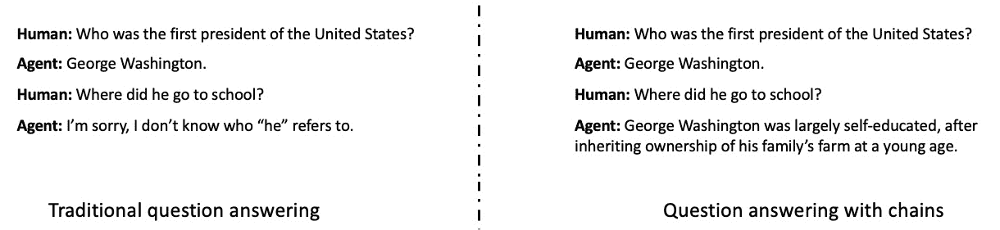
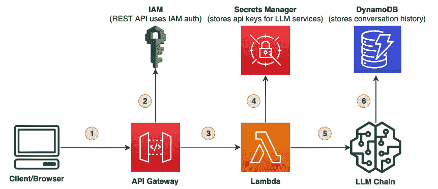
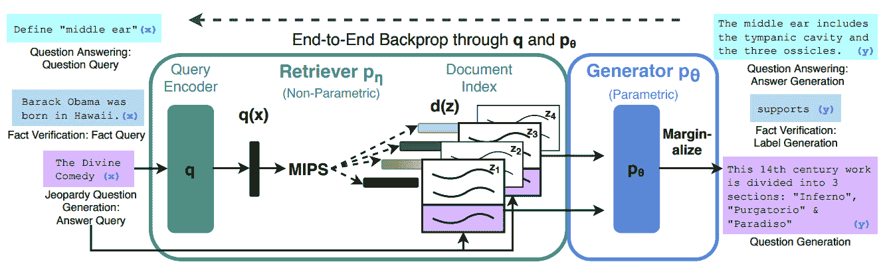
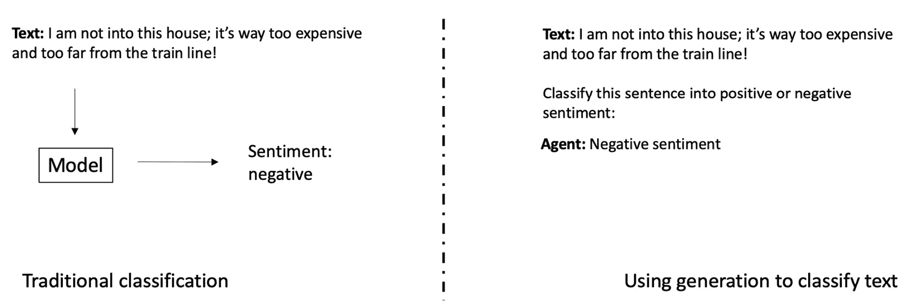

# 第十五章：预训练基础模型的未来趋势

在本章中，我们将通过指引未来的趋势来总结本书，涵盖书中所有相关主题。我们将探讨基础模型应用开发的趋势，例如使用 LangChain 构建互动对话应用程序，以及使用检索增强生成（retrieval augmented generation）等技术来减少大语言模型的幻觉问题。我们还将探索如何使用生成模型解决分类任务、人本设计以及其他生成模式，如代码、音乐、产品文档、幻灯片等！我们将讨论 AWS 的服务，例如 SageMaker JumpStart 基础模型、Amazon Bedrock、Amazon Titan 和 Amazon Code Whisperer，并展望基础模型及预训练技术的未来趋势。

我们特别将深入探讨以下主题：

+   构建大语言模型应用的技术

+   视觉与语言之外的生成模式

+   AWS 在基础模型方面的服务

+   基础模型的未来

+   预训练的未来

# 构建大语言模型应用的技术

现在你已经了解了基础模型，特别是大语言模型，我们来聊聊几种关键方式，如何利用它们来构建应用程序。2022 年 12 月 ChatGPT 事件中，最重要的一个收获就是，用户显然喜欢他们的聊天能够记住对话中的每一刻，记住之前提到的主题，并涵盖对话的所有曲折变化。换句话说，除了通用的问答之外，用户明显偏好聊天能够进行*链式对话*。我们来看看下面截图中的一个例子：

图 15.1 – 用于聊天应用的链式提问

*图 15.1* 左右两边的关键区别在于，左侧的回答是**不连续的**。这意味着模型只是将每个问题作为单独的实体来看待，然后提供其回答。而右侧的回答则是**连续的**，即整个对话被提供给模型，最新的问题位于底部。这有助于确保回答的连贯性，模型能够更好地保持上下文。

你如何自己设置这个？嗯，首先，我刚才描述的其实并不难。想象一下，只需从你的 HTML 页面读取，将所有的问答数据打包进提示词中，然后提取回答并返回给终端用户。然而，如果你不想自己构建，完全可以使用一些优秀的开源选项！

## 使用开源堆栈构建互动对话应用

如果你之前没有见过，允许我快速向你介绍 LangChain。它可以在 GitHub 上免费获取，链接是：[`github.com/hwchase17/langchain`](https://github.com/hwchase17/langchain)。LangChain 是由 Harrison Chase 和其他超过 600 名贡献者共同构建的开源工具包。它提供了类似于著名的 ChatGPT 的功能，可以指向 OpenAI 的 API 或任何其他基础模型，但允许你作为开发者和数据科学家创建自己的前端和客户体验。

将应用程序与模型解耦是一个明智的做法；仅在过去几个月里，全球已经上线了数百个新的大型语言模型，全球各地的团队也在积极开发更多。当你的应用程序通过单一的 API 调用与模型交互时，你可以更容易地从一个模型切换到下一个，因为随着时间的推移，许可、定价和功能都会升级。这对你来说是一个大大的好处！

另一个有趣的开源技术是 Haystack (*26*)。由德国初创公司 Deepset 开发，Haystack 是一个非常有用的工具，用于……在大海捞针。具体来说，它充当一个接口，帮助你将自己的 LLMs 带入广泛的问答场景。这是他们的初步专长，后来他们扩展了很多！

在 AWS，我们有一个开源模板，用于在 AWS 上构建 LangChain 应用程序。可以在 GitHub 上找到，链接是：[`github.com/3coins/langchain-aws-template`](https://github.com/3coins/langchain-aws-template)。在下面的图示中，你可以看到架构的简要表示：

图 15.2 – 在 AWS 上托管 LangChain

虽然这可以指向任何前端，但我们提供了一个示例模板，供你用于启动应用程序。你也可以轻松地指向*任何*自定义模型，无论它是在 SageMaker 端点上，还是在新的 AWS 服务 Bedrock 中！稍后在本章中我们会进一步介绍。正如你在前面的图像中看到的，这个模板可以轻松地在任何与云交互的地方运行 UI。让我们来看一下所有的步骤：

1.  第一，UI 访问 API 网关。

1.  第二，通过 IAM 检索凭据。

1.  第三，通过 Lambda 调用该服务。

1.  第四，通过 Secrets Manager 检索模型凭据。

1.  第五，模型通过调用无服务器模型 SDK 的 API，或者通过调用你训练的并托管在 SageMaker 端点上的自定义模型来调用。

1.  第六，查找 DynamoDB 中相关的对话历史，以确保你的回答准确无误。

这个聊天界面如何确保不产生幻觉回答？它如何指向存储在数据库中的一组数据？通过**检索增强生成**（**RAG**），我们将在接下来的部分进行讲解。

## 使用 RAG 确保 LLM 应用程序的高准确性

正如原始的 2020 年*(1)*论文中所解释的那样，RAG 是一种检索与给定查询相关的文档的方法。假设你的聊天应用程序接收关于你数据库中特定项目的问题，比如你的产品之一。与其让模型编造答案，不如从你的数据库中检索正确的文档，并仅使用 LLM 来*美化*响应。这就是 RAG 如此强大的地方；你可以用它来确保生成答案的准确性保持高，同时在风格和语气上保持一致的客户体验。让我们更仔细地看看：

图 15.3 – RAG

首先，一个问题从左侧出现。在左上方，你可以看到一个简单的问题，**定义“中耳”**。这个问题被一个查询编码器处理，查询编码器只是一个语言模型，用于生成查询的嵌入。然后，这个嵌入被应用到一个数据库的索引中，这里使用了许多候选算法：**K** **最近邻**、**最大内积搜索**（**MIPS**）等。一旦你检索到一组相似的文档，就可以将最好的文档输入到生成器中，右侧的最终模型。这会根据输入的文档返回一个简单的答案。在这里，答案是**中耳包括鼓室和** **三块小骨**。

然而，值得注意的是，这里的 LLM 并没有真正定义什么是中耳。它实际上是在回答问题：“中耳内包含哪些物体？”可以说，中耳的任何定义都会包括其功能，特别是作为耳道和内耳之间的缓冲区，帮助你保持平衡并让你听到声音。因此，这可能是专家**强化学习与人类反馈**（**RLHF**）优化的一个好候选。

如*图 15.3*所示，这整个 RAG 系统是可调的。这意味着你可以并且应该对编码器和解码器部分进行微调，以便根据你的数据集和查询类型调整模型性能。另一种分类文档的方法，正如我们将看到的，是生成！

## 生成是新的分类吗？

正如我们在 *第十三章*中学到的，*提示工程*，有很多方法可以促使你的语言模型输出你想要的响应类型。其中一种方法实际上是让它分类文本中看到的内容！这里有一个简单的图表来说明这个概念：

图 15.4 – 使用生成代替分类

如图所示，传统的分类方法是在训练模型时提前完成一个任务：**分类**。这个模型可能在分类上表现良好，但它完全无法处理新任务。这一关键缺点是基础模型，特别是大型语言模型如今如此受欢迎的主要原因之一：它们非常灵活，可以在不需要重新训练的情况下处理许多不同的任务。

在*图 15.4*的右侧，你可以看到我们使用相同的文本作为起始点，但我们并不是将其传递给基于编码器的文本模型，而是传递给基于解码器的模型，并简单地添加了指令：**将此句子分类为正面或负面情感**。你也可以同样说：“告诉我更多关于这个顾客真实感受的事情，”或者“这个购房者有多乐观？”或者“帮助这个购房者找到一所符合他需求的房子。”可以说，以上三种指令有所不同，逐渐脱离了纯粹的分类任务，转向了更广泛的应用开发或客户体验。随着时间的推移，预计会看到更多类似的例子！让我们再看看另一种构建 LLM 应用程序的关键技术：保持人类在环中的参与。

## 面向人类的应用程序设计方法，利用大型语言模型（LLMs）

我们之前在*第二章**,* *数据集准备：第一部分*、*第十章**,* *微调与评估*、*第十一章**,* *检测、缓解和监控偏见*以及*第十四章**,* *计算机视觉与语言的 MLOps*中涉及过这个话题。我再说一遍，我相信人工标注将成为公司能够提供的竞争优势。为什么？因为构建 LLM 现在变得极具竞争力，开放源代码和专有技术的竞争方都在积极争夺你的业务。开放源代码的选项来自 Hugging Face 和 Stability 等公司，而专有技术则来自 AI21、Anthropic 和 OpenAI。这些选项之间的差异是值得质疑的；你可以查看*斯坦福大学的 HELM* *(2)*上最新的排名模型，顺便提一句，它也属于该校的人本 AI 倡议。通过足够的微调和定制，你通常应该能够达到预期的性能。

那么，是什么决定了最佳的大型语言模型应用，如果不是基础模型呢？显然，端到端的客户体验至关重要，且始终如此。消费者偏好随时间变化，但一些普遍的技术原则依然存在：速度、简洁、灵活性和低成本。通过基础模型，我们可以清楚地看到，客户更倾向于可解释性和他们信任的模型。这意味着应用设计师和开发人员应当与这些长期的消费者偏好作斗争，选择最大化这些偏好的解决方案和系统。正如你可能猜到的，仅这一点就不是一项小任务。

除了设计和构建成功应用的核心技能外，我们还可以做些什么来在这个充满挑战的 LLM 新世界中保持竞争力呢？我认为，答案就是定制你的数据。专注于让你的数据和数据集变得独特：在目的、广度、深度和完整性上独一无二。充分利用你能获得的最佳资源对数据进行标注，并将其作为整个应用工作流程的核心部分。这将带你进入**持续学习**，即模型能够根据最终用户的反馈不断变得越来越好。

接下来，让我们看看即将出现的生成模态。

# 其他生成模态

自 2022 年 ChatGPT 事件以来，技术界大多为*生成新内容*这一命题所着迷。虽然这一点一直是比较有趣的，但高性能基础模型与媒体对于这些能力的过度热情相遇，再加上疫情后社区对错失机会的强烈恐惧，导致我们进入了生成 AI 的全球关注风暴。

这是一件好事吗？说实话，我很高兴终于看到这种转变；自 2019 年以来，我就一直以某种方式在使用 AI/ML 模型生成内容，作为一个作家和创意工作者，我一直认为这是机器学习中最有趣的部分。我对 David Foster 的关于这一主题的书*(3)*印象深刻。他刚刚发布了这本书的更新版，包含了最新的基础模型和方法！让我们快速回顾一下目前在生成 AI 应用中常见的其他类型的模态。

视觉和语言之外的生成关键模态

这里是我认为最有趣的内容生成类型的简短清单，超出了我们在本书中看到的内容：

+   生成代码

+   生成音乐

+   生成 PowerPoint 幻灯片、广告和视觉内容

+   生成产品文档

+   生成建筑设计，然后构建应用

+   生成电影、电视节目和娱乐内容

+   生成网站、游戏和移动应用

生成代码对大多数人来说并不意外；它与语言生成的核心相似性使得它成为完美的候选者！微调一个大型语言模型（LLM）以输出你所选择语言的代码非常简单；这是我 2019 年的项目*(4)*，它正是利用 SageMaker 示例笔记本完成了这一任务！代码好吗？绝对不好，但幸运的是，LLM 自那时以来已经取得了很大进展。许多现代的代码生成模型非常优秀，感谢 Hugging Face 和 ServiceNow 的合作，我们现在可以使用一个开源模型！它叫做*StarCoder*，并且可以在 Hugging Face 上免费获取：[`huggingface.co/bigcode/starcoder`](https://huggingface.co/bigcode/starcoder)。

我喜欢使用开源 LLM 进行代码生成的一个原因是你可以*自定义它*！这意味着你可以指向你自己的私有代码库，对数据进行标记，更新模型，并立即训练这个 LLM 以生成你组织风格的代码！在组织层面，你甚至可以对开源 LLM 进行一些持续的预训练，以加速所有开发人员的工作，尤其是用于你自己的代码库。接下来，在我们重点讨论 AWS 产品，特别是**Amazon Code** **Whisperer**时，我们将看看你可以如何利用 LLM 来更快地编写自己的代码。(*27*)

前面提到的内容都可以是你自己生成式 AI 项目的绝佳候选者。真的，就像我们看到的，通用机器学习从实验室走向了大多数企业和项目的基础，生成能力也很可能以某种方式走上相同的道路。

那么这意味着工程岗位会被取代吗？老实说，我对此表示怀疑。就像优秀的搜索引擎的崛起并没有取代软件工程岗位，反而让许多人觉得这些岗位更加有趣和可做，我预期生成能力也会有相同的效果。它们擅长快速搜索大量可能性并找到很好的选择，但仍然需要你了解消费者、产品和设计的方方面面。模型并不擅长批判性思维，但它们擅长提出创意并发现不足，至少在文字方面如此。

现在我们已经从高层次上了解了其他生成方式，让我们来看看 AWS 在基础模型方面的产品吧！

# AWS 在基础模型方面的产品

在 AWS 上，正如你在本书中所看到的，你有成百上千种方式来优化基础模型的开发和部署。现在让我们来看一下 AWS 在这一领域明确投资以提升客户体验的几种方式：

+   **SageMaker JumpStart Foundation Model Hub**：该功能在 2022 年 re:Invent 大会预览中宣布，这是一个可以在 SageMaker 环境中便捷访问基础模型的选项。它包括开源模型，如 Hugging Face 提供的 BLOOM 和 Flan-T5，以及专有模型，如 AI21 Jurassic。所有基础模型的列表可在这里查看 *(5)*。至今，我们已有近 20 种基础模型，所有模型都可以在您自己的安全环境中进行托管。您用于与这些模型进行交互或微调的任何数据都不会与提供方共享。您还可以通过自行选择实例来优化成本。我们有数十个示例笔记本，指向这些模型，适用于各种训练和托管使用场景，您可以在这里 *(6)* 以及其他地方查看。关于模型训练数据的更多信息，您可以直接在游乐场中阅读。

+   **Amazon Bedrock**：如果您密切关注 AWS 在 2023 年初的新闻，您可能已经注意到我们发布了一个新的基础模型服务：Amazon Bedrock！正如 Swami Sivasubramanian 在这篇博客文章中所讨论的 *(7)*，Bedrock 是一项通过无服务器接口与各种基础模型进行交互的服务，并且保持安全性。换句话说，Bedrock 为多个基础模型提供了一个入口点，让您能够获得各大提供商的最佳服务。这包括 AI 初创公司，如 AI21、Anthropic 和 Stability。与 Bedrock 交互意味着使用无服务器体验，免去了处理底层基础设施的麻烦。您还可以使用 Bedrock 对模型进行微调！

+   **Amazon Titan**：通过 Bedrock 提供的另一个模型是 *Titan*，这是一款由 Amazon 完全训练和管理的大型语言模型！这意味着我们负责处理训练数据、优化、调优、去偏以及所有增强功能，以帮助您获得大规模语言模型的最佳结果。Titan 也将支持微调功能。

亚马逊 Code Whisperer：正如你可能已经看到的，Code Whisperer 是 AWS 在 2022 年发布的服务，并在 2023 年正式上线。有趣的是，它似乎与特定的开发环境紧密结合，利用你正在编写的脚本的整个上下文，并基于此生成推荐。你可以编写伪代码、Markdown 或其他函数起始部分，并通过快捷键调用模型。这样，系统会根据脚本的上下文为你提供多种选项，最终让你选择最适合你的脚本！幸运的是，Jupyter notebooks 和 SageMaker Studio 现在都支持这一功能；你可以阅读 AWS 高级首席技术专家 Brian Granger 的博客，Brian 是 Project Jupyter 的联合创始人，了解更多这些倡议。以下是 Brian 关于这一主题的博客文章：[`aws.amazon.com/blogs/machine-learning/announcing-new-jupyter-contributions-by-aws-to-democratize-generative-ai-and-scale-ml-workloads/`](https://aws.amazon.com/blogs/machine-learning/announcing-new-jupyter-contributions-by-aws-to-democratize-generative-ai-and-scale-ml-workloads/) 小贴士：Code Whisperer 对个人用户免费！仔细阅读 Swami 的博客文章的读者也会注意到我们最新的机器学习基础设施更新，如第二版的*Inferentia 芯片*、*inf2*，以及带有更高带宽的 Trainium 实例，*trn1n*。

细心的 Swami 博客文章读者还会注意到我们最新机器学习基础设施的更新，例如第二版的*Inferentia 芯片*、*inf2*，以及带有更高带宽的 Trainium 实例，*trn1n*。我们还推出了免费的代码生成服务*CodeWhisperer*！

现在我们已经了解了 AWS 在这个领域的一些产品，让我们来假设一下基础模型的未来。

# 基础模型的未来

对我而言，关于基础模型的发展趋势，有几点似乎是显而易见的：

+   *开源和专有模型提供者之间的激烈竞争将持续下去*。正如前面提到的，目前我们正处于全球大多数科技行业对基础模型的高度关注的完美风暴中。这里的一个关键轴线是专有模型与开源模型的对比。正如 5 月 4 日泄露的 Google 文档（*8*）所建议的，开源世界的能力正在不断提升，在许多情况下，开源选项比专有选项更优。实际上，他们将开源模型描述为“按重量计算更强大”。这意味着就模型本身的规模而言，开源世界所生产的小型模型在按字节大小比较时表现得更好。

+   *如果模型消费者对模型提供者保持灵活性，他们将以更低的成本获得更多的选择*。对我来说，这场激烈竞争的结果很明确；随着时间的推移，你会得到越来越多的选择，且价格会越来越低！这意味着，作为模型消费者，明智的选择是不要把自己锁定在单一模型上。随着基础模型的勇敢新世界的推进，确保你和你的团队处于最佳的情境，并保持灵活性，跟随新模型的出现。

+   *模型正变得越来越小且更强大*。这在很大程度上得益于开源社区中由 Stable Diffusion 推动的热情，基础模型现在正在减小体积，但其准确性却在提高。这意味着今天你可以用一个 13B 参数的模型，如 *StableVicuna* (*28*)，完成几年前需要 175B 参数模型才能完成的任务。在你设计应用时，记得这一点！

+   *将专有数据和人工反馈作为你的优势*。为了最大限度地利用这些竞争，我建议你依托你的数据。只要你愿意接受最新最强的模型基础，将你的专有数据和人工反馈作为关键投资领域，就能使你从市场中脱颖而出。确保你和你的团队从一开始就频繁地标注数据，并尽可能多地利用你们独特的视角和专业知识。

+   *安全性对于与基础模型的互动至关重要*。这一信号在市场中非常明显，消费者强烈偏好那些能够保护其数据并且不允许与模型提供者共享数据的环境，包括模型查询和微调资产。从某种意义上说，这也是将专有数据和人工反馈作为优势的衍生品；在未来的世界里，你的数据将成为你的卖点。以你自己的基础模型的形式保护这些数据，保持模型公正，避免越狱攻击，并防止生成仇恨言论，依旧是至关重要的。看起来，确保基础模型应用程序安全，可能需要一套全新的安全措施。

+   *基础模型正在成为新的数据库，自然语言则是新的编程语言*。我预计未来十二个月内，大多数应用将把基础模型作为一种新型数据库。现在，除了将记录存储在磁盘上，你还可以通过神经网络对其进行处理，学习映射关系和数据之间的联系，这些是单个人类无法与之竞争的，并且能与人类进行自然语言交互。优化、扩展、去偏见、确保准确性以及降低成本将是未来几年的工作重点。

我还预计会有更多的基础模型，涵盖不同的模式、用户群体、语言、技术、目标和领域。随着训练和生产它们的成本因激烈的竞争而下降，我们可能会看到越来越多的入门级开发者进入这个市场。考虑到这一点，让我们在最后总结一下关于预训练未来的思考。

# 预训练的未来

让我们回顾一些提供谨慎和批判性评估的趋势，来看一看最近基础模型的“淘金热”。其中最突出的例子之一是杰弗里·辛顿辞去谷歌职务（*29*），警告 AI 发展的危险，并呼吁对所有基础模型研究实施 6 个月的暂停（*30*）。

个人来说，我认为这一暂停并没有认识到最初推动这种炒作的原因：AI 经济学的无形之手。找到高薪的技术工作并不容易；获得并维持美国及类似国家的签证也并非易事。在一个拥有一些最聪明且最有驱动力的人才的行业中，随着快速变革和颠覆性的变化来发展你的职业生涯是绝非简单的。基础模型和所有技术的进步之所以发展，是因为人类需要证明自己、发展职业并养家糊口。要求暂停大规模训练的实验几乎等同于要求大量年轻人停止将他们的热情、技能和时间投入到自己职业发展的最佳选择中。显然，这与他们的最佳利益背道而驰！

然而，即便是在支持继续研究基础模型的阵营中，并非每个人都对预训练变压器的持续价值持过于乐观的态度。我们在*第一章*中提到的科学家雅恩·勒昆，曾开发了 MNIST，他认为自监督学习是“*智能的暗物质*。（*9*）”自从 ChatGPT 全球热潮以来，勒昆对大型语言模型和自回归模型的局限性提出了严厉批评，因为它们的核心优势仅仅是预测序列中下一个最可能的词素，而并非以任何可靠的方式理解世界。相反，他建议我们构建能够学习推理的 AI 模型，包括开发行动计划的层级表示。

他在这个警示中并不孤单。华盛顿大学和艾伦人工智能研究所的麦克阿瑟学者崔烨金 *(10)* 最近在 TED 演讲中分享了她的看法，关于为什么“AI 非常聪明——但又令人震惊地愚蠢。” *(11)* 崔烨金在常识推理方面的几十年工作表明，尽管 NLP 模型可能能解决一些有限的任务，但它们仍然在一些极其基础的人类任务上挣扎，比如理解现实与虚构之间的区别，或者假设和规划、简洁性的价值，以及基本的世界逻辑映射。

对我来说，这里的分界是清晰的。一方面，我们有着数十年的推动，致力于构建最佳且最令人印象深刻的人工智能表现。另一方面，我们有着庞大的商业、技术和学术产业，数百万的人的努力致力于构建应用并提供价值，这些应用和价值为他们的职业生涯和团队的长久发展奠定了基础。这个技术发展经济体是否会创造出最聪明的机器？可能会。是否会建立起提供消费者价值的应用和商业？当然会。未来几十年，这两种相关却不同的方向会继续重叠吗？毫无疑问。

在我们结束之前，我想提一下几个特别与预训练相关的有趣技术趋势：

+   **持续预训练**：如果你的基础模型能够从最新的数据中受益，并且这些数据以持续的更新流提供，为什么不构建一个持续的摄取和训练循环，以保持你的应用性能呢？这是 2022 年论文中的核心提议 *(12)*。我想象一些应用会从这种持续的训练流中受益，特别是当参数高效微调 (*31*) 使得这种方式的成本更具吸引力时。

+   **检索预训练**：随着生成式 AI 应用的扩展，对准确生成文本的需求将持续增加。DeepMind 提出的这种方法，将检索过程 *(14)* 应用于预训练，并在使用 25 倍更少的参数的情况下，达到与 GPT-3 相似的性能，使其在训练和托管时更加高效且更具吸引力。我预计，在预训练期间检索令牌的基本概念会与 RAG *(15)* 结合，发展成提供更高准确性保证的大型语言模型（LLM）。

+   **更多通用的预训练机制**：正如你们可能已经注意到的，很多媒体和开源关注似乎仅集中在模型和低级任务中的新一代表现上。我认为这是一个问题，因为它忽略了这些模型的根基——它们的来源和构建方式：预训练本身。这意味着，如果预训练能够变得更易于获取和更具普遍性，我们就能从对模型的固守转向对预训练本身的广泛支持。目前已有一些朝着这个方向迈出的步伐，例如 Data2Vec *(16)*，它提出了一个适用于视觉、语音和语言的自监督学习通用框架。另一个尝试是**UL2**，**统一语言学习范式**。Google Brain 团队建议结合不同的预训练范式，然后在微调时切换不同的范式。

+   **更多语言，拜托**！我在疫情后亲自参加的第一场会议之一是 2022 年计算语言学协会大会*(18)*。我惊喜地发现，他们特别关注多语言，强烈且令人钦佩地推动着能够跨越语言障碍并拓展自然语言处理技术在全球濒危语言和社区中的应用。令人钦佩的是，联合国宣布 2022-2023 年为国际土著语言十年，估计到 2100 年，至少 50%的现有语言将会灭绝或面临严重危险*(32)*。这将继续成为基础模型中的一个重要话题，因为它是技术采用和创新的瓶颈之一。朝着这一方向迈出的一个步骤是清华大学的 GLM-130B *(19)*，这是一个明确以中文和英文预训练的模型。另一个值得注意的双语模型是 Hugging Face 的 BLOOM *(20)*，该模型在 46 种自然语言和 13 种编程语言上进行了训练。其他类似的项目也提供了针对单一非英语语言的能力，例如 LightOn 的法语模型 PAGnol *(21)*、日语掩码语言模型*(22)*、德语 LLM *(23)*等。甚至还有呼声要求推出 BritGPT *(24)*，以将生成能力引入英国的口语和会话风格。

在这一点上，让我们以最后的结论结束本书。

# 总结

真是一次难忘的旅程！感谢那些和我一起坚持到最后的你们，感谢你们投入的时间、创意和精力，学习我的文字和思考。我希望至少一些见解对你们来说是值得的，也希望错误没有过于显眼。

在本书中，我们详细讲解了预训练基础模型的整个过程，展示了来自视觉和语言的关键用例和示例，并了解了在 AWS 上构建应用程序和项目的核心能力。我非常喜欢听取读者的反馈，所以请随时联系我并保持联系！我在 LinkedIn 上很活跃，您可以随时通过问题或评论与我交流。我每周在 Twitch 上做一档关于生成式 AI 的节目，您可以在那里找到我，并参与反馈或评论。*(25)*

当然，您也可以随时与您的 AWS 团队联系，直接与我交流！我喜欢与客户见面，思考架构选择，将您的需求传达给我们的服务团队，并与您一起构思如何创造更美好的明天。告诉我您迫不及待想要构建的项目！

# 参考文献

请查看以下内容以获取更多章节涉及主题的信息：

1.  知识密集型自然语言处理任务的检索增强生成：[`arxiv.org/pdf/2005.11401.pdf`](https://arxiv.org/pdf/2005.11401.pdf)

1.  HELM：[`crfm.stanford.edu/helm/latest/`](https://crfm.stanford.edu/helm/latest/)

1.  生成式深度学习：教机器绘画、写作、作曲和演奏（第 1 版）：[`www.amazon.com/Generative-Deep-Learning-Teaching-Machines/dp/1492041947`](https://www.amazon.com/Generative-Deep-Learning-Teaching-Machines/dp/1492041947)

1.  aws-samples/amazon-sagemaker-architecting-for-ml：[`github.com/aws-samples/amazon-sagemaker-architectingfor-ml/tree/master/Example-Project`](https://github.com/aws-samples/amazon-sagemaker-architectingfor-ml/tree/master/Example-Project)

1.  开始使用 Amazon SageMaker JumpStart：[`aws.amazon.com/sagemaker/jumpstart/gettingstarted/?sagemaker-jumpstart-cards.sort-by=item.additionalFields.priority&sagemaker-jumpstart-cards.sort-order=asc&awsf.sagemakerjumpstart-filter-product-type=*all&awsf.sagemaker-jumpstartfilter-text=*all&awsf.sagemaker-jumpstart-filter-vision=*all&awsf.sagemaker-jumpstart-filter-tabular=*all&awsf.sagemaker-jumpstartfilter-audio-tasks=*all&awsf.sagemaker-jumpstart-filtermultimodal=*all&awsf.sagemaker-jumpstart-filter-RL=*all`](https://aws.amazon.com/sagemaker/jumpstart/gettingstarted/?sagemaker-jumpstart-cards.sort-by=item.additionalFields.priority&sagemaker-jumpstart-cards.sort-order=asc&awsf.sagemakerjumpstart-filter-product-type=*all&awsf.sagemaker-jumpstartfilter-text=*all&awsf.sagemaker-jumpstart-filter-vision=*all&awsf.sagemaker-jumpstart-filter-tabular=*all&awsf.sagemaker-jumpstartfilter-audio-tasks=*all&awsf.sagemaker-jumpstart-filtermultimodal=*all&awsf.sagemaker-jumpstart-filter-RL=*all)

1.  aws/amazon-sagemaker-examples：[`github.com/aws/amazon-sagemaker-examples/tree/main/`](https://github.com/aws/amazon-sagemaker-examples/tree/main/)

1.  宣布 AWS 上用于构建生成型人工智能的新工具: [`aws.amazon.com/blogs/machine-learning/announcing-new-tools-for-building-with-generative-ai-on-aws/`](https://aws.amazon.com/blogs/machine-learning/announcing-new-tools-for-building-with-generative-ai-on-aws/)

1.  Google "我们没有护城河，OpenAI 也没有": [`www.semianalysis.com/p/google-we-have-no-moat-and-neither`](https://www.semianalysis.com/p/google-we-have-no-moat-and-neither)

1.  自监督学习：智能的暗物质: [`ai.facebook.com/blog/self-supervised-learning-the-dark-matter-of-intelligence/`](https://ai.facebook.com/blog/self-supervised-learning-the-dark-matter-of-intelligence/)

1.  Yejin Choi: [`homes.cs.washington.edu/~yejin/`](https://homes.cs.washington.edu/~yejin/)

1.  为什么人工智能非常聪明却又令人震惊地愚蠢: [`www.ted.com/talks/yejin_choi_why_ai_is_incredibly_smart_and_shockingly_stupid/c?language=en`](https://www.ted.com/talks/yejin_choi_why_ai_is_incredibly_smart_and_shockingly_stupid/c?language=en)

1.  持续预训练缓解语言和视觉中的遗忘问题: [`arxiv.org/pdf/2205.09357.pdf`](https://arxiv.org/pdf/2205.09357.pdf)

1.  LoRA：大型语言模型的低秩适应: [`arxiv.org/abs/2106.09685`](https://arxiv.org/abs/2106.09685)

1.  通过从万亿个标记中检索来改进语言模型: [`arxiv.org/pdf/2112.04426.pdf`](https://arxiv.org/pdf/2112.04426.pdf)

1.  检索增强生成用于知识密集型自然语言处理任务: [`arxiv.org/pdf/2005.11401.pdf`](https://arxiv.org/pdf/2005.11401.pdf)

1.  data2vec: 一个通用的自监督学习框架，适用于语音、视觉和语言: [`arxiv.org/pdf/2202.03555.pdf`](https://arxiv.org/pdf/2202.03555.pdf)

1.  UL2：统一语言学习范式: [`arxiv.org/pdf/2205.05131.pdf`](https://arxiv.org/pdf/2205.05131.pdf)

1.  ACL 2022: [`www.2022.aclweb.org/`](https://www.2022.aclweb.org/)

1.  GLM-130B：一个开放的双语预训练模型: [`openreview.net/pdf?id=-Aw0rrrPUF`](https://openreview.net/pdf?id=-Aw0rrrPUF)

1.  BLOOM：一个 176B 参数的开放访问多语言语言模型: [`arxiv.org/pdf/2211.05100.pdf`](https://arxiv.org/pdf/2211.05100.pdf)

1.  LightOn 发布 PAGnol，最大的法语语言模型: [`medium.com/@LightOnIO/lighton-releases-pagnol-the-largest-french-language-model-f50b719352ab`](https://medium.com/@LightOnIO/lighton-releases-pagnol-the-largest-french-language-model-f50b719352ab)

1.  日本学术领域的掩码语言模型: [`aclanthology.org/2022.sdp-1.16.pdf`](https://aclanthology.org/2022.sdp-1.16.pdf)

1.  Cedille.ai 推出了最大的德语文本生成语言模型: [`cedille.ai/blog/cedille-ai-launches-the-largest-language-model-in-german-for-text-generation`](https://cedille.ai/blog/cedille-ai-launches-the-largest-language-model-in-german-for-text-generation)

1.  英国需要自己的“BritGPT”，否则将面临不确定的未来，议员们听闻：[`www.theguardian.com/business/2023/feb/22/uk-needs-its-own-britgpt-or-will-face-an-uncertain-future-mps-hear`](https://www.theguardian.com/business/2023/feb/22/uk-needs-its-own-britgpt-or-will-face-an-uncertain-future-mps-hear)

1.  AWS 时间表：[`www.twitch.tv/aws/schedule?seriesID=340be301-27dc-42c6-890a-302cd13899af`](https://www.twitch.tv/aws/schedule?seriesID=340be301-27dc-42c6-890a-302cd13899af)

1.  deepset-ai/haystack：[`github.com/deepset-ai/haystack`](https://github.com/deepset-ai/haystack)

1.  AWS 概览：[`aws.amazon.com/codewhisperer/`](https://aws.amazon.com/codewhisperer/)

1.  Hugging Face: https://huggingface.co/CarperAI/stable-vicuna-13b-delta

1.  AI 之父：[`www.theguardian.com/technology/2023/may/02/geoffrey-hinton-godfather-of-ai-quits-google-warns-dangers-of-machine-learning`](https://www.theguardian.com/technology/2023/may/02/geoffrey-hinton-godfather-of-ai-quits-google-warns-dangers-of-machine-learning)

1.  暂停大型 AI 实验：一封公开信：[`futureoflife.org/open-letter/pause-giant-ai-experiments/`](https://futureoflife.org/open-letter/pause-giant-ai-experiments/)

1.  huggingface/peft：[`github.com/huggingface/peft`](https://github.com/huggingface/peft)

1.  经济和社会事务部土著人民：[`www.un.org/development/desa/indigenouspeoples/indigenous-languages.html`](https://www.un.org/development/desa/indigenouspeoples/indigenous-languages.html)
