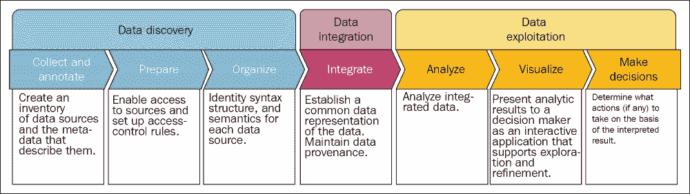
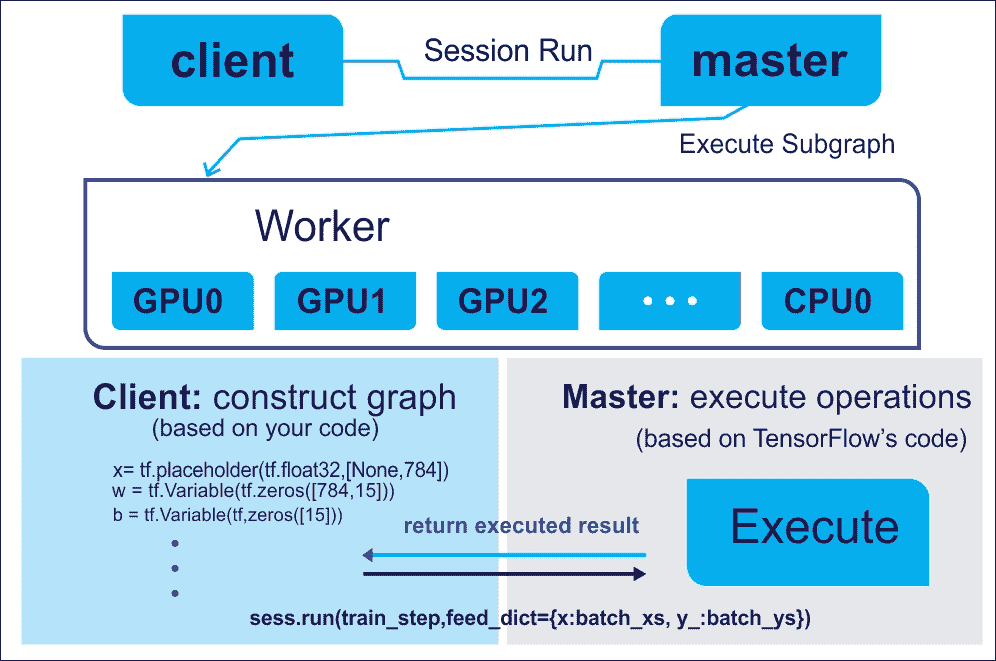

# 第一章：从数据到决策——开始使用 TensorFlow

尽管数据的巨大可用性和大量投资，许多商业组织仍然依赖直觉，因为他们既没有充分利用数据，也没有做出适当且有效的商业决策。另一方面，TensorFlow 可以帮助从这庞大的数据集合中做出商业决策。TensorFlow 是一款数学软件，是由 Google Brain 团队在 2011 年开发的开源机器智能软件库，它可以帮助我们分析数据并预测有效的商业结果。虽然 TensorFlow 的初衷是进行机器学习和深度神经网络的研究，但该系统足够通用，能够应用于各种其他领域。

牢记您的需求，并基于 TensorFlow 1.x 的所有最新且令人兴奋的特性，在本课程中，我们将描述 TensorFlow 的主要功能，这些功能大多通过使用数据的实际例子来激励。

本课程将涵盖以下主题：

+   从数据到决策：泰坦尼克号例子

+   TensorFlow 概述

+   安装与配置 TensorFlow

+   TensorFlow 计算图

+   TensorFlow 编程模型

+   TensorFlow 数据模型

+   通过 TensorBoard 可视化

+   开始使用 TensorFlow：线性回归及其应用

# 基于数据做决策——泰坦尼克号例子

对数据需求的日益增加是一个关键挑战。决策支持团队，如机构研究和商业智能，通常无法在大量数据中做出关于如何扩展业务和研究成果的正确决策。尽管数据在推动决策方面起着重要作用，但实际上，正确的决策是在正确的时间做出的目标。

换句话说，目标是决策支持，而非数据支持。通过高级的数据管理和分析方法可以实现这一目标。

## 数据价值链与决策制定

图 1 中的下图（来源：*H. Gilbert Miller 和 Peter Mork，From Data to Decisions: A Value Chain for Big Data，IT Professional，2013 年 1 月 - 2 月，卷：15，期：1，DOI：10.1109/MITP.2013.11*）展示了从数据到实际决策的链条——即目标。价值链从数据发现阶段开始，包含多个步骤，如数据收集和注释数据准备，然后按逻辑顺序组织它们，确保所需的数据流。接着是数据集成，用于建立数据的共同表示。由于目标是做出正确的决策，因此，未来参考时，拥有适当的数据来源（即数据的来源）非常重要：



图 1：从数据到决策：大数据的价值链

现在，您的数据已经以某种方式集成到一个可呈现的格式中，是时候进入数据探索阶段了，该阶段包括多个步骤，如分析集成数据和可视化，之后根据解读结果采取相应的行动。

然而，在做出正确决策之前，这就足够了吗？可能不够！原因在于，它缺乏足够的分析，这最终有助于通过可操作的洞察力做出决策。此时，预测分析介入，填补了其中的空白。现在让我们在接下来的部分中看看一个例子。

## 从灾难到决策 – Titanic 生存案例

这是挑战，来自 Kaggle 的 Titanic–机器学习从灾难中（[`www.kaggle.com/c/titanic`](https://www.kaggle.com/c/titanic)）：

*"RMS Titanic 的沉没是历史上最臭名昭著的船难之一。1912 年 4 月 15 日，在她的处女航行中，Titanic 与冰山相撞后沉没，造成 2224 名乘客和船员中 1502 人死亡。这个震惊国际社会的悲剧促使了更严格的船只安全规定。船难导致如此多人死亡的原因之一是船上没有足够的救生艇供乘客和船员使用。虽然幸存者中有些人是因为运气因素，但某些群体比其他人更可能生还，例如妇女、儿童和上层阶级。在这个挑战中，我们要求你完成对哪些人更可能幸存的分析。特别地，我们要求你应用机器学习工具来预测哪些乘客在这场悲剧中幸存。"*

但深入研究这一点，我们需要了解在灾难中乘坐 Titanic 的乘客数据，以便我们可以开发一个可用于生存分析的预测模型。

数据集可以从前述网址下载。表 1 显示了 Titanic 生存数据集的元数据：


数据集的快照如下所示：


图 2：Titanic 生存数据集快照

使用该数据集的最终目标是预测哪些人幸存于 Titanic 灾难。然而，稍微进行一些数据集的探索性分析是必要的。首先，我们需要导入必要的软件包和库：

```py
import pandas as pd
import matplotlib.pyplot as plt
import numpy as np
```

现在读取数据集并创建一个 Pandas 的 DataFrame：

```py
df = pd.read_csv('/home/asif/titanic_data.csv')
```

在绘制数据集的分布之前，让我们先指定图表的参数：

```py
fig = plt.figure(figsize=(18,6), dpi=1600)
alpha=alpha_scatterplot = 0.2
alpha_bar_chart = 0.55
fig = plt.figure()
ax = fig.add_subplot(111)
```

绘制一个柱状图，显示谁幸存了与谁没有幸存：

```py
ax1 = plt.subplot2grid((2,3),(0,0))
ax1.set_xlim(-1, 2)            
df.Survived.value_counts().plot(kind='bar', alpha=alpha_bar_chart)
plt.title("Survival distribution: 1 = survived")
```

绘制一个显示`年龄`与生存情况的图表：

```py
plt.subplot2grid((2,3),(0,1))
plt.scatter(df.Survived, df.Age, alpha=alpha_scatterplot)
plt.ylabel("Age")                      
plt.grid(b=True, which='major', axis='y') 
plt.title("Survival by Age: 1 = survived")
```

绘制一个显示`乘客`类别分布的图表：

```py
ax3 = plt.subplot2grid((2,3),(0,2))
df.Pclass.value_counts().plot(kind="barh", alpha=alpha_bar_chart)
ax3.set_ylim(-1, len(df.Pclass.value_counts()))
plt.title("Class dist. of the passengers")
```

绘制 1 等舱乘客年龄子集的核密度估计图：

```py
plt.subplot2grid((2,3),(1,0), colspan=2)
df.Age[df.Pclass == 1].plot(kind='kde')   
df.Age[df.Pclass == 2].plot(kind='kde')
df.Age[df.Pclass == 3].plot(kind='kde')
plt.xlabel("Age")    
plt.title("Age dist. within class")
plt.legend(('1st Class', '2nd Class','3rd Class'),loc='best')
```

绘制一个显示`每个登船地点的乘客`的图表：

```py
ax5 = plt.subplot2grid((2,3),(1,2))
df.Embarked.value_counts().plot(kind='bar', alpha=alpha_bar_chart)
ax5.set_xlim(-1, len(df.Embarked.value_counts()))
plt.title("Passengers per boarding location")
Finally, we show all the subplots together:
plt.show()
>>>
```

图表显示了生存分布、年龄生存率、年龄分布以及每个登船地点的乘客数量：


图 3: 泰坦尼克号生存数据在年龄、舱位和各舱位内年龄分布以及登船地点上的分布

然而，要执行上述代码，您需要安装几个包，例如 matplotlib、pandas 和 scipy。它们列在下面：

+   **安装 pandas**: Pandas 是用于数据操作的 Python 包。可以按以下步骤安装：

    ```py
    $ sudo pip3 install pandas 
    #For Python 2.7, use the following: 
    $ sudo pip install pandas

    ```

+   **安装 matplotlib**: 在上述代码中，matplotlib 是用于数学对象绘图的库。可以按以下步骤安装：

    ```py
    $ sudo apt-get install python-matplotlib   # for Python 2.7 
    $ sudo apt-get install python3-matplotlib # for Python 3.x

    ```

+   **安装 scipy**: Scipy 是用于科学计算的 Python 包。安装`blas`、`lapack`和`gfortran`是其先决条件。现在只需在您的终端上执行以下命令：

    ```py
    $ sudo apt-get install libblas-dev liblapack-dev $ sudo apt-get install gfortran $ sudo pip3 install scipy # for Python 3.x
    $ sudo pip install scipy # for Python 2.7 

    ```

对于 Mac，请使用以下命令安装上述模块：

```py
$ sudo easy_install pip
$ sudo pip install matplotlib
$ sudo pip install libblas-dev liblapack-dev
$ sudo pip install gfortran
$ sudo pip install scipy

```

对于 Windows，我假设 Python 2.7 已经安装在 C:\Python27\。然后打开命令提示符并键入以下命令：

```py
C:\Users\admin-karim>cd C:/Python27
C:\Python27> python -m pip install <package_name> # provide package name accordingly.

```

对于 Python3，请发出以下命令：

```py
C:\Users\admin-karim>cd C:\Users\admin-karim\AppData\Local\Programs\Python\Python35\Scripts
C:\Users\admin-karim\AppData\Local\Programs\Python\Python35\Scripts>python3 -m pip install <package_name>

```

好了，我们已经看过数据了。现在轮到你对数据进行一些分析了。比如预测哪些人从那场灾难中幸存下来了。你不觉得我们已经有足够的乘客信息了吗？但是如何进行预测建模，以便我们可以从这些数据中得出一些相当直接的结论呢？

例如，女性、一等舱乘客和儿童在这次灾难中生存的可能性更高。

在一种蛮力方法中，例如使用 if/else 语句和某种加权评分系统，您可以编写一个程序，以预测给定乘客是否会在灾难中生存。然而，在 Python 中编写这样的程序是否有多大意义呢？自然地，这将非常繁琐，难以泛化，并且需要对每个变量和样本（即乘客）进行广泛的微调。

这就是预测分析与机器学习算法及新兴工具的应用，使您可以构建一个程序，从样本数据中学习，预测给定乘客是否会生存。在本书中，我们将看到 TensorFlow 能够成为实现预测模型卓越准确性的完美解决方案。我们将开始描述 TensorFlow 框架的概要，然后展示如何在 Linux、Mac OS 和 Windows 上安装和配置 TensorFlow。

# TensorFlow 框架的概述

TensorFlow 是谷歌推出的一个开源框架，用于基于数据流图进行科学计算和数值计算，数据流图代表了 TensorFlow 的执行模型。TensorFlow 中使用的数据流图帮助机器学习专家在数据上进行更高级、更密集的训练，以开发深度学习和预测分析模型。2015 年，谷歌将 TensorFlow 及其所有参考实现开源，并将所有源代码以 Apache 2.0 许可证发布到 GitHub 上。从那时起，TensorFlow 得到了学术界、研究界和工业界的广泛采用，最近发布了稳定的 1.x 版本，并且具有统一的 API。

正如名称 TensorFlow 所暗示的那样，操作是由神经网络在多维数据数组上执行的（也就是张量流）。通过这种方式，TensorFlow 提供了一些广泛使用且稳健的线性模型和深度学习算法实现。

使用 TensorFlow 部署预测模型或通用模型是相当简单的。关键是，一旦你构建了神经网络模型并完成必要的特征工程，就可以通过交互式训练（使用绘图或 TensorBoard 进行）来进行训练（我们将在接下来的部分看到更多内容）。最后，在通过一些测试数据进行评估后，你可以将模型部署到实际环境中。

既然我们在谈论数据流图，流图中的节点对应于数学运算，如加法、乘法、矩阵分解等，而边则对应于张量，确保边与节点之间的通信，即数据流和控制流。

你可以在 CPU 上执行数值计算。然而，使用 TensorFlow，你也可以将训练分布到同一系统上的多个设备，并在这些设备上进行训练，特别是如果你的系统有多个 GPU，可以共享计算负载。但前提是 TensorFlow 能访问这些设备，它会通过贪婪的方式自动将计算分配到多个设备上。TensorFlow 也允许程序指定哪些操作会在哪些设备上执行，这通过命名作用域进行分配。

TensorFlow 1.x 中的 API 发生了变化，这些变化并非完全向后兼容。也就是说，之前在 TensorFlow 0.x 上运行的 TensorFlow 程序不一定能在 TensorFlow 1.x 上运行。

TensorFlow 最新版本提供的主要功能包括：

+   **更快的计算**：TensorFlow 的最新版本极其快速。例如，Inception v3 在 8 个 GPU 上速度提高了 7.3 倍，分布式 Inception（在 64 个 GPU 上进行 v3 训练）的速度提升达 58 倍。

+   **灵活性**：TensorFlow 不仅仅是一个深度学习库，它还提供了几乎所有你需要的功能，通过函数解决最困难的问题，进行强大的数学运算。TensorFlow 1.x 引入了一些高层次的 API，用于处理高维数组或张量，包含`tf.layers`、`tf.metrics`、`tf.losses`和`tf.keras`模块。这些功能使得 TensorFlow 非常适合高层次的神经网络计算。

+   **可移植性**：TensorFlow 可以在 Windows、Linux 和 Mac 机器以及移动计算平台（即 Android）上运行。

+   **易于调试**：TensorFlow 提供了 TensorBoard 工具，用于分析已开发的模型。

+   **统一** **API**：TensorFlow 提供了非常灵活的架构，使得您可以通过一个 API 将计算部署到桌面、服务器或移动设备上的一个或多个 CPU 或 GPU 上。

+   **透明** **使用** **GPU** **计算**：自动管理和优化相同的内存和数据。现在，您可以使用 NVIDIA cuDNN 和 CUDA 工具包，在机器上进行大规模和数据密集型的 GPU 计算。

+   **易于使用**：TensorFlow 适合每个人，适合学生、研究人员、深度学习从业者，也适合本书的读者。

+   **生产就绪** **并且** **可扩展**：它最近已经发展为一种用于机器翻译的神经网络，并且可以在生产规模下运行。TensorFlow 1.x 保证了 Python API 的稳定性，使得选择新功能变得更加容易，无需过多担心现有代码的破坏。

+   **可扩展性**：TensorFlow 是一项相对较新的技术，仍在积极开发中。然而，它具有可扩展性，因为它以开源代码的形式发布在 GitHub 上（[`github.com/tensorflow/tensorflow`](https://github.com/tensorflow/tensorflow)）。

+   **支持**：有一个庞大的开发者和用户社区在共同努力，使 TensorFlow 成为一个更好的产品，既通过提供反馈，也通过积极贡献源代码。

+   **广泛应用**：众多科技巨头正在使用 TensorFlow 来提升他们的商业智能。例如，ARM、Google、Intel、eBay、Qualcomm、SAM、Dropbox、DeepMind、Airbnb、Twitter 等。

在接下来的课程中，我们将看到如何实现这些预测分析功能。

# 安装和配置 TensorFlow

您可以在多个平台上安装和使用 TensorFlow，例如 Linux、Mac OS 和 Windows。此外，您还可以从 TensorFlow 的最新 GitHub 源代码构建并安装 TensorFlow。此外，如果您使用的是 Windows 机器，可以通过原生 pip 或 Anaconda 安装 TensorFlow。需要注意的是，TensorFlow 在 Windows 上支持 Python 3.5.x 和 3.6.x。

此外，Python 3 附带了 pip3 包管理器，这是你将用来安装 TensorFlow 的程序。所以，如果你使用的是此版本的 Python，就无需单独安装 pip。为了简便起见，在本节中，我将展示如何使用原生 pip 安装 TensorFlow。现在，为了安装 TensorFlow，启动终端，然后在终端中输入相应的`pip3 install`命令。  

若要安装仅支持 CPU 版本的 TensorFlow，请输入以下命令：

```py
C:\> pip3 install --upgrade tensorflow

```

若要安装 TensorFlow 的 GPU 版本，请输入以下命令：

```py
C:\> pip3 install --upgrade tensorflow-gpu

```

当谈到 Linux 时，TensorFlow 的 Python API 支持 Python 2.7 和 Python 3.3 以上版本，因此你需要安装 Python 来开始安装 TensorFlow。为了获得 GPU 支持，你必须安装 Cuda Toolkit 7.5 和 cuDNN v5.1 以上版本。在本节中，我们将向你展示如何安装并开始使用 TensorFlow。更多关于在 Linux 上安装 TensorFlow 的详细信息将在后续展示。

### 注意

在 Mac OS 上的安装与 Linux 类似。有关更多详情，请参阅[`www.tensorflow.org/install/install_mac`](https://www.tensorflow.org/install/install_mac)。另一方面，Windows 用户应参阅[`www.tensorflow.org/install/install_windows`](https://www.tensorflow.org/install/install_windows)。

请注意，在本课程的这一部分及后续部分，我们将提供大多数源代码，这些代码兼容 Python 3.x。

## 在 Linux 上安装 TensorFlow

在本节中，我们将向你展示如何在 Ubuntu 14.04 或更高版本上安装 TensorFlow。这里提供的说明也可能适用于其他 Linux 发行版，只需进行一些小的调整。

然而，在正式开始之前，我们需要确定在你的平台上安装哪个版本的 TensorFlow。TensorFlow 的开发使得你可以在 GPU 和 CPU 上运行数据密集型的张量应用。因此，你应选择以下类型之一的 TensorFlow 进行安装：

+   **仅支持 CPU 的 TensorFlow**：如果你的机器上没有安装类似 NVIDIA®的 GPU，你必须安装并使用此版本进行计算。这非常简单，你只需 5 到 10 分钟即可完成。

+   **支持 GPU 的 TensorFlow**：正如你所知，深度学习应用通常需要非常高强度的计算资源。因此，TensorFlow 也不例外，但通常在 GPU 上进行数据计算和分析比在 CPU 上快得多。因此，如果你的机器上有 NVIDIA® GPU 硬件，你最终应该安装并使用此版本。

根据我们的经验，即使你的机器上集成了 NVIDIA GPU 硬件，首先安装并尝试仅支持 CPU 的版本也是值得的。如果你没有获得良好的性能，再切换到 GPU 支持版本。

TensorFlow 的 GPU 支持版本有几个要求，如 64 位 Linux、Python 2.7（或 Python 3 的 3.3 及更高版本）、NVIDIA CUDA® 7.5 或更高版本（Pascal GPU 需要 CUDA 8.0）、NVIDIA cuDNN v4.0（最低要求）或 v5.1（推荐）。更具体地说，TensorFlow 的当前开发版本仅支持使用 NVIDIA 工具包和软件进行 GPU 计算。因此，必须在 Linux 机器上安装以下软件，以便为预测分析应用程序提供 GPU 支持：

+   Python

+   NVIDIA 驱动程序

+   **计算能力 >= 3.0** 的 CUDA

+   cuDNN

+   TensorFlow

### 安装 Python 和 nVidia 驱动程序

我们已经了解如何在不同平台上安装 Python，因此可以跳过这一步。同时，我假设您的机器上已经安装了 NVIDIA GPU。

要检查 GPU 是否安装正确并正常工作，可以在终端中输入以下命令：

```py
$ lspci -nnk | grep -i nvidia
# Expected output (of course may vary for your case): 4b:00.0 VGA compatible controller [0300]: NVIDIA Corporation Device [10de:1b80] (rev a1)4b:00.1 Audio device [0403]: NVIDIA Corporation Device [10de:10f0] (rev a1)

```

由于预测分析在很大程度上依赖于机器学习和深度学习算法，因此请确保在机器上安装了一些基本的软件包，如 GCC 和一些科学 Python 包。

只需在终端中输入以下命令即可：

```py
$ sudo apt-get update
$ sudo apt-get install libglu1-mesa libxi-dev libxmu-dev -y
$ sudo apt-get — yes install build-essential
$ sudo apt-get install python-pip python-dev -y
$ sudo apt-get install python-numpy python-scipy –y

```

现在通过`wget`下载 NVIDIA 驱动程序（别忘了选择适合您机器的版本），并以静默模式运行脚本：

```py
$ wget http://us.download.nvidia.com/XFree86/Linux-x86_64/367.44/NVIDIA-Linux-x86_64-367.44.run
$ sudo chmod +x NVIDIA-Linux-x86_64-367.35.run
$ ./NVIDIA-Linux-x86_64-367.35.run --silent

```

### 注意

一些 GPU 卡，如 NVIDIA GTX 1080，配有内置驱动程序。因此，如果您的机器使用的是不同于 GTX 1080 的 GPU，您需要下载该 GPU 的驱动程序。

要确认驱动程序是否正确安装，请在终端中输入以下命令：

```py
$ nvidia-smi

```

命令的输出结果应如下所示：


图 4：nvidia-smi 命令的输出结果

### 安装 NVIDIA CUDA

要使用 TensorFlow 与 NVIDIA GPU，必须安装 CUDA®工具包 8.0 和与 CUDA 工具包 8+相关联的 NVIDIA 驱动程序。CUDA 工具包包括：

+   GPU 加速库，如 cuFFT，用于**快速** **傅里叶** **变换**（**FFT**）

+   cuBLAS 用于**基本** **线性** **代数** **子程序**（**BLAS**）

+   cuSPARSE 用于稀疏矩阵运算

+   cuSOLVER 用于稠密和稀疏直接求解器

+   cuRAND 用于随机数生成，NPP 用于图像和视频处理原语

+   **nvGRAPH** 用于 **NVIDIA** **图形** **分析** **库**

+   Thrust 用于模板并行算法和数据结构以及专用的 CUDA 数学库

对于 Linux，下载并安装所需的软件包：

使用`wget`命令在 Ubuntu 上下载 [`developer.nvidia.com/cuda-downloads`](https://developer.nvidia.com/cuda-downloads)：

```py
$ wget https://developer.nvidia.com/compute/cuda/8.0/Prod2/local_installers/cuda_8.0.61_375.26_linux-run
$ sudo chmod +x cuda_8.0.61_375.26_linux.run
$ ./ cuda_8.0.61_375.26_linux.run --driver --silent
$ ./ cuda_8.0.61_375.26_linux.run --toolkit --silent
$ ./ cuda_8.0.61_375.26_linux.run --samples –silent

```

此外，确保已将 CUDA 安装路径添加到`LD_LIBRARY_PATH`环境变量中，如下所示：

```py
$ echo 'export LD_LIBRARY_PATH="$LD_LIBRARY_PATH:/usr/local/cuda/lib64:/usr/local/cuda/extras/CUPTI/lib64"' >> ~/.bashrc
$ echo 'export CUDA_HOME=/usr/local/cuda' >> ~/.bashrc
$ source ~/.bashrc

```

### 安装 NVIDIA cuDNN v5.1+

一旦 CUDA 工具包安装完成，您应该从 Linux 下载 cuDNN v5.1 库，并在下载后解压文件并将其复制到 CUDA 工具包目录（假定位于/usr/local/cuda/）：

```py
$ cd /usr/local
$sudo mkdir cuda
$ cd ~/Downloads/
$ wget http://developer2.download.nvidia.com/compute/machine-learning/cudnn/secure/v6/prod/8.0_20170427/cudnn-8.0-linux-x64-v6.0.tgz 
$ sudo tar –xvzf cudnn-8.0-linux-x64-v6.0.tgz
$ cp cuda/lib64/* /usr/local/cuda/lib64/
$ cp cuda/include/cudnn.h /usr/local/cuda/include/

```

请注意，要安装 cuDNN v5.1 库，您必须注册 [加速计算开发者计划](https://developer.nvidia.com/accelerated-computing-developer)。现在，当您安装了 cuDNN v5.1 库后，请确保创建 `CUDA_HOME` 环境变量。

### 安装 libcupti-dev 库

最后，您需要在机器上安装 libcupti-dev 库。这是 NVIDIA CUDA 提供的高级性能分析支持。要安装此库，请执行以下命令：

```py
$ sudo apt-get install libcupti-dev

```

### 安装 TensorFlow

请参阅以下部分，获取关于如何安装仅支持 CPU 和支持 NVIDIA cuDNN 和 CUDA 计算能力的最新版本 TensorFlow 的逐步指南。您可以通过多种方式在您的机器上安装 TensorFlow，例如使用 virtualenv、pip、Docker 和 Anaconda。然而，使用 Docker 和 Anaconda 有点复杂，因此我们决定使用 pip 和 virtualenv。

### 注意

有兴趣的读者可以尝试从 [`www.tensorflow.org/install/`](https://www.tensorflow.org/install/) 使用 Docker 和 Anaconda。

#### 使用本地 pip 安装 TensorFlow

如果步骤 1 到 6 已完成，请通过以下命令之一安装 TensorFlow。对于 Python 2.7，并且仅支持 CPU：

```py
$ pip install tensorflow
# For Python 3.x and of course with only CPU support:
$ pip3 install tensorflow 
# For Python 2.7 and of course with GPU support:
$ pip install tensorflow-gpu
# For Python 3.x and of course with GPU support: 
$ pip3 install tensorflow-gpu

```

如果步骤 3 失败，请手动执行命令安装最新版本的 TensorFlow：

```py
$ sudo pip install --upgrade TF_PYTHON_URL
#For Python 3.x, use the following command: 
$ sudo pip3 install --upgrade TF_PYTHON_URL 

```

对于两种情况，`TF_PYTHON_URL` 表示位于 [`www.tensorflow.org/install/install_linux#the_url_of_the_tensorflow_python_package`](https://www.tensorflow.org/install/install_linux#the_url_of_the_tensorflow_python_package) 的 TensorFlow Python 包的 URL。

例如，要安装仅支持 CPU 的最新版本（在撰写时为 v1.1.0），请使用以下命令：

```py
$ sudo pip3 install --upgrade https://storage.googleapis.com/tensorflow/linux/cpu/tensorflow-1.1.0-cp34-cp34m-linux_x86_64.wh
l

```

#### 使用 virtualenv 安装

我们假设您已经在系统上安装了 Python 2+（或 3+）和 pip（或 pip3）。如果是这样，请按照以下步骤安装 TensorFlow：

1.  如下创建 virtualenv 环境：

    ```py
    $ virtualenv --system-site-packages targetDirectory

    ```

    `targetDirectory` 表示 `virtualenv` 树的根目录。默认情况下，它是 `~/tensorflow`（但您可以选择任何目录）。

1.  如下激活 virtualenv 环境：

    ```py
    $ source ~/tensorflow/bin/activate # bash, sh, ksh, or zsh
     $ source ~/tensorflow/bin/activate.csh  # csh or tcsh

    ```

    如果步骤 2 中的命令成功，则应在终端中看到以下内容：

    ```py
      (tensorflow)$
    ```

1.  安装 TensorFlow。

    按照以下命令之一，在激活的 virtualenv 环境中安装 TensorFlow。对于 Python 2.7，仅支持 CPU，请使用以下命令：

    ```py
     (tensorflow)$ pip install --upgrade tensorflow 
    #For Python 3.x with CPU support, use the following command: 
    (tensorflow)$ pip3 install --upgrade tensorflow 
    #For Python 2.7 with GPU support, use the following command:
    (tensorflow)$ pip install --upgrade tensorflow-gpu
    #For Python 3.x with GPU support, use the following command: 
     (tensorflow)$ pip3 install --upgrade tensorflow-gpu

    ```

    如果前面的命令成功，跳过步骤 5。如果前面的命令失败，请执行步骤 5。此外，如果步骤 3 失败，请尝试通过执行以下格式的命令，在激活的 virtualenv 环境中安装 TensorFlow：

    ```py
    #For python 2.7 (select appropriate URL with CPU or GPU support):
    (tensorflow)$ pip install --upgrade TF_PYTHON_URL 
    #For python 3.x (select appropriate URL with CPU or GPU support):
     (tensorflow)$ pip3 install --upgrade TF_PYTHON_URL

    ```

1.  验证安装。

    要验证步骤 3 中的安装，必须激活虚拟环境。如果虚拟环境当前没有激活，请执行以下命令之一：

    ```py
    $ source ~/tensorflow/bin/activate  # bash, sh, ksh, or zsh
    $ source ~/tensorflow/bin/activate.csh  # csh or tcsh

    ```

1.  卸载 TensorFlow

    要卸载 TensorFlow，只需删除您创建的目录树。例如：

    ```py
    $ rm -r targetDirectory

    ```

    最后，如果您想手动控制哪些设备对 TensorFlow 可见，您应该设置`CUDA_VISIBLE_DEVICES`。例如，以下命令可强制仅使用 GPU 0：

    ```py
    $ CUDA_VISIBLE_DEVICES=0 python

    ```

## 从源代码安装 TensorFlow

使用 pip 安装可能会在使用 TensorBoard 时出现问题（稍后在本课程中讨论）。因此，我建议您直接从源代码构建 TensorFlow。步骤如下所述。

### 注意

请按照以下网址上的指示和准则，在您的平台上安装 Bazel：[`bazel.io/docs/install.html`](http://bazel.io/docs/install.html)。

首先，按以下方式克隆整个 TensorFlow 存储库：

```py
$git clone --recurse-submodules https://github.com/tensorflow/tensorflow

```

然后是安装 Bazel 的时候了，这是一个自动化软件构建和测试的工具。此外，为了从源代码构建 TensorFlow，必须在您的机器上安装 Bazel 构建系统。为此，请执行以下命令：

```py
$ sudo apt-get install software-properties-common swig
$ sudo add-apt-repository ppa:webupd8team/java
$ sudo apt-get update $ sudo apt-get install oracle-java8-installer
$ echo "deb http://storage.googleapis.com/bazel-apt stable jdk1.8" | sudo tee /etc/apt/sources.list.d/bazel.list
$ curl https://storage.googleapis.com/bazel-apt/doc/apt-key.pub.gpg | sudo apt-key add -
$ sudo apt-get update
$ sudo apt-get install bazel

```

然后运行 Bazel 安装程序，执行以下命令：

```py
$ chmod +x bazel-version-installer-os.sh
$ ./bazel-version-installer-os.sh –-user

```

此外，您可能需要一些 Python 依赖项，例如`python-numpy`、`swig`和`python-dev`。现在，执行以下命令来安装它们：

```py
$ sudo apt-get install python-numpy swig python-dev

```

现在是时候配置安装（GPU 或 CPU）了。通过执行以下命令来完成：

```py
$ ./configure

```

然后使用`bazel`创建您的 TensorFlow 包：

```py
$ bazel build -c opt //tensorflow/tools/pip_package:
$ build_pip_package

```

然而，要构建支持 GPU 的版本，请执行以下命令：

```py
$ bazel build -c opt --config=cuda //tensorflow/tools/pip_package:build_pip_package

```

最后，安装 TensorFlow。这里我列出了 Python 版本的安装步骤：

+   对于 Python 2.7：

    ```py
    $ sudo pip install --upgrade /tmp/tensorflow_pkg/tensorflow-1.1.0-*.whl

    ```

+   对于 Python 3.4：

    ```py
    $ sudo pip3 install --upgrade /tmp/tensorflow_pkg/tensorflow-1.1.0-*.whl

    ```

## 测试您的 TensorFlow 安装

我们从流行的 TensorFlow 别名`tf`开始。打开一个 Python 终端（只需在终端上键入`python`或`python3`）并执行以下代码：

```py
>>> import tensorflow as tf
```

如果您喜欢的 Python 解释器没有投诉，那么您已经准备好开始使用 TensorFlow 了！

```py
>>> hello = tf.constant("Hello, TensorFlow!")
>>> sess=tf.Session()
```

现在验证您的安装，只需输入以下命令：

```py
>>> print sess.run(hello)
```

如果安装成功，您将看到以下输出：

```py
Hello, TensorFlow!
```

# TensorFlow 计算图

在考虑执行 TensorFlow 程序时，我们应该熟悉图的创建和会话的执行。基本上，第一个是用于构建模型，第二个是用于提供数据并获取结果。有趣的是，TensorFlow 的每一点乘或加法都是在 C++引擎上执行的，这意味着甚至在 Python 上执行的操作也只是一个包装器。基本上，TensorFlow 的 C++引擎由以下两部分组成：

+   对于操作如卷积、最大池、sigmoid 等的高效实现。

+   前向模式操作的导数。

当我们/您使用 TensorFlow 执行一些稍复杂的操作时，例如训练线性回归，TensorFlow 内部使用数据流图来表示其计算。这个图称为计算图，它是由以下内容组成的有向图：

+   一组节点，每个节点表示一个操作

+   一组有向弧线，每一条代表操作执行时的数据。

TensorFlow 有两种类型的边：

+   **普通**：它们在节点之间传递数据结构。一个节点的某个操作的输出，成为另一个操作的输入。连接两个节点的边承载着这些值。

+   **特殊**：该边不传递值，仅表示两个节点之间的控制依赖关系，例如 X 和 Y。这意味着，只有当 X 中的操作已执行时，节点 Y 才会被执行，但在数据操作之间的关系之前。

TensorFlow 的实现定义了控制依赖关系，以强制执行原本独立的操作之间的顺序，从而控制峰值内存使用。

计算图基本上就像是一个数据流图。图 5 展示了一个简单计算的计算图，例如 *z=d×c=(a+b) ×c*：


图 5：一个非常简单的执行图，计算一个简单的方程。

在前面的图中，图中的圆圈表示操作，而矩形表示数据计算图。正如前面所述，TensorFlow 图包含以下内容：

+   **一组 tf.Operation 对象**：用于表示要执行的计算单元。

+   **一个 tf.Tensor 对象**：用于表示控制操作之间数据流的单元数据。

使用 TensorFlow，也可以执行延迟计算。简单来说，一旦你在计算图的构建阶段组成了一个高度可组合的表达式，你仍然可以在运行会话阶段评估它们。从技术上讲，TensorFlow 会调度任务并高效地按时执行。例如，图 6 展示了如何使用 GPU 并行执行独立的代码部分。


图 6：TensorFlow 图中的边和节点将在设备（如 CPU 或 GPU）上通过会话执行。

创建计算图后，TensorFlow 需要一个活跃的会话，在多个 CPU（以及可用的 GPU）上以分布式方式执行。通常，你不需要明确指定使用 CPU 还是 GPU，因为 TensorFlow 会选择并使用其中之一。默认情况下，TensorFlow 会选择尽可能多的操作使用 GPU；如果没有 GPU，则使用 CPU。因此，从整体上看，TensorFlow 的主要组件如下：

+   **变量**：用于存储在 TensorFlow 会话之间的权重和偏置值。

+   **张量**：一组在节点之间传递的值。

+   **占位符**：用于在程序和 TensorFlow 图之间传递数据。

+   **会话**：当会话启动时，TensorFlow 会自动计算图中所有操作的梯度，并使用链式法则。实际上，当图要执行时，会调用一个会话。

不用太担心，前面提到的每个组件将在后续章节中详细讨论。从技术上讲，你所编写的程序可以被视为客户端。然后，客户端用于在 C/C++ 或 Python 中符号化地创建执行图，然后你的代码可以要求 TensorFlow 执行这个图。详细信息请见下图：



图 7：使用客户端–主节点架构执行 TensorFlow 图

计算图有助于将工作负载分配到具有 CPU 或 GPU 的多个计算节点。这样，神经网络可以进一步等同于一个复合函数，其中每一层（输入层、隐藏层或输出层）都可以表示为一个函数。现在，为了理解在张量上执行的操作，了解有关 TensorFlow 编程模型的良好解决方案是必须的。下一节将解释计算图在实现神经网络中的作用。

# TensorFlow 编程模型

TensorFlow 编程模型表示如何构建你的预测模型。一旦导入了 TensorFlow 库的相关资源，TensorFlow 程序通常会分为四个阶段：

+   构建计算图，涉及对张量的一些操作（我们将很快了解什么是张量）

+   创建一个会话

+   运行一个会话，这将在图中定义的操作上执行

+   数据收集和分析的计算

这些主要步骤定义了 TensorFlow 中的编程模型。考虑以下示例，我们要乘两个数字：

```py
import tensorflow as tf
x = tf.constant(8)
y = tf.constant(9)
z = tf.multiply(x, y)
sess = tf.Session()
out_z = sess.run(z)
Finally, close the TensorFlow session when you're done:
sess.close()print('The multiplicaiton of x and y: %d' % out_z)
```

前面的代码段可以通过以下图示表示：


图 8：在客户端-主节点架构中执行并返回乘积的简单乘法

为了提高前面程序的效率，TensorFlow 还允许你通过占位符（稍后讨论）在图变量中交换数据。现在，假设以下代码段以更高效的方式执行相同的操作：

```py
# Import tensorflow
import tensorflow as tf
# Build a graph and create session passing the graph:
with tf.Session() as sess:
 x = tf.placeholder(tf.float32, name="x")
 y = tf.placeholder(tf.float32, name="y")
 z = tf.multiply(x,y)
# Put the values 8,9 on the placeholders x,y and execute the graph
z_output = sess.run(z,feed_dict={x: 8, y:9})
# Finally, close the TensorFlow session when you're done:
sess.close()
print(z_output)
```

TensorFlow 不是为了乘两个数而必需的；此外，这个简单操作的代码行数也很多。然而，这个例子旨在阐明如何构建任何代码，从最简单的例子到最复杂的例子。此外，该例子还包含了一些基本的指令，这些指令会出现在本书其他例子中。

### 注意

本书中的大多数例子将以 Python 3.x 兼容的方式演示。然而，也有少数例子将使用 Python 2.7.x 来展示。

第一行中的这个单一导入帮助你导入 TensorFlow，之后可以使用 `tf` 来实例化它。然后，`TensorFlow` 运算符将通过 `tf` 和点符号 '.' 来表达，并通过运算符的名称来使用。接下来的行中，我们通过 `tf.Session()` 指令来构造对象 `session`：

```py
with tf.Session() as sess:
```

### 注意

会话对象（即 sess）封装了 TensorFlow 的环境，以便执行所有操作对象并评估 Tensor 对象。我们将在接下来的章节中看到它们。

该对象包含计算图，正如我们之前所说，它是需要执行的计算。

以下两行定义了变量 x 和 y，使用了占位符的概念。通过占位符，你可以定义输入（例如我们示例中的变量 x）和输出变量（例如变量 y）：

```py
x = tf.placeholder(tf.float32, name='x')
y = tf.placeholder(tf.float32, name='y')
```

占位符提供了图形元素与问题计算数据之间的接口，它允许我们创建操作并构建计算图，而不需要数据，只需要对其的引用。

要通过占位符函数定义数据或张量（稍后我将介绍张量的概念），需要三个参数：

+   **数据** **类型**：是输入张量中元素的类型。

+   **形状**：占位符的形状——即要输入的张量的形状（可选）。如果未指定形状，可以输入任何形状的张量。

+   **名称**：对调试和代码分析非常有用，但它是可选的。

### 注意

更多信息，请参阅[`www.tensorflow.org/api_docs/python/tf/Tensor`](https://www.tensorflow.org/api_docs/python/tf/Tensor)。

因此，我们可以介绍我们希望使用两个参数计算的模型，即先前定义的占位符和常量。接下来，我们定义计算模型。

以下语句在会话内部构建了`x`与`y`的乘积数据结构，并将操作结果赋值给占位符`z`。接下来是这样的：

```py
  z = tf.multiply(x, y)
```

现在，由于结果已经由占位符`z`持有，我们通过` sess.run`语句执行计算图。这里我们提供两个值，将张量传入计算图节点。它暂时用张量值替换操作的输出（更多内容将在接下来的章节中介绍）：

```py
z_output = sess.run(z,feed_dict={x: 8, y:9})
```

然后当我们完成时，关闭 TensorFlow 会话：

```py
sess.close()
```

在最后的指令中，我们打印出结果：

```py
     print(z_output)
```

这本质上是打印输出 72.0。

# TensorFlow 中的数据模型

TensorFlow 中的数据模型由**张量**表示。无需使用复杂的数学定义，我们可以说，张量（在 TensorFlow 中）标识了一个多维的数字数组。但我们将在下一小节中看到关于张量的更多细节。

## 张量

让我们看看 Wikipedia 上对张量的正式定义（[`en.wikipedia.org/wiki/Tensor`](https://en.wikipedia.org/wiki/Tensor)）如下：

*“张量是几何对象，用于描述几何向量、标量和其他张量之间的线性关系。此类关系的基本示例包括点积、叉积和线性映射。几何向量通常用于物理学和工程应用中，标量本身也是张量。”*

这个数据结构由三个参数来描述：秩、形状和类型，如下图所示：


图 9：张量不过是几何对象，具有形状、秩和类型，用于存储多维数组

因此，张量可以被看作是矩阵的推广，它通过任意数量的索引来指定一个元素。在实际使用时，张量的语法几乎与嵌套向量相似。

### 注意

张量仅定义这个值的类型，以及在会话期间如何计算这个值。因此，实质上，它们并不代表或保存任何由操作生成的值。

一些人喜欢比较 NumPy 与 TensorFlow；然而，实际上，TensorFlow 和 NumPy 在某种程度上非常相似，因为它们都是 N 维数组库！

诚然，NumPy 支持 n 维数组，但它并没有提供创建张量函数和自动计算导数的方法（+ 不支持 GPU）。下表可以看作是一个简短且一对一的比较，可以帮助我们理解这种比较：


图 10：NumPy 与 TensorFlow

现在让我们看看另一种创建张量的方式，在它们可以被 TensorFlow 图形接收之前（我们稍后会看到其他接收机制）：

```py
>>> X = [[2.0, 4.0],
        [6.0, 8.0]]
>>> Y = np.array([[2.0, 4.0],
                 [6.0, 6.0]], dtype=np.float32)
>>> Z = tf.constant([[2.0, 4.0],
                    [6.0, 8.0]])
```

这里，`X` 是一个列表，`Y` 是来自 NumPy 库的 n 维数组，而 `Z` 本身是 TensorFlow 的张量对象。现在让我们来看它们的类型：

```py
>>> print(type(X))
>>> print(type(Y))
>>> print(type(Z))
#Output
<class 'list'>
<class 'numpy.ndarray'>
<class 'tensorflow.python.framework.ops.Tensor'>
```

好的，它们的类型已经正确打印。然而，当我们正式处理张量时，相比其他类型，更方便的函数是 `tf.convert_to_tensor()`，如下所示：

```py
t1 = tf.convert_to_tensor(X, dtype=tf.float32)t2 = tf.convert_to_tensor(Z, dtype=tf.float32)t3 = tf.convert_to_tensor(Z, dtype=tf.float32)
```

现在让我们通过以下几行代码来看它们的类型：

```py
>>> print(type(t1))
>>> print(type(t2))
>>> print(type(t3))
#Output:
<class 'tensorflow.python.framework.ops.Tensor'>
<class 'tensorflow.python.framework.ops.Tensor'>
<class 'tensorflow.python.framework.ops.Tensor'>
```

太棒了！我认为到现在为止关于张量的讨论已经足够了，现在我们可以考虑由 **秩** 这一术语所描述的结构。

## 秩

每个张量由一个叫做秩的维度单位来描述。它标识了张量的维度数，因此，秩也称为张量的阶数或 n 维度。秩为零的张量是标量，秩为一的张量是向量，而秩为二的张量是矩阵。以下代码定义了一个 TensorFlow 标量，一个 `向量`，一个 `矩阵`，以及一个 `立方矩阵`，在下一个例子中，我们将展示秩是如何工作的：

```py
import tensorflow as tf
scalar = tf.constant(100)
vector = tf.constant([1,2,3,4,5])
matrix = tf.constant([[1,2,3],[4,5,6]])
cube_matrix = tf.constant([[[1],[2],[3]],[[4],[5],[6]],[[7],[8],[9]]])
print(scalar.get_shape())
print(vector.get_shape())
print(matrix.get_shape())
print(cube_matrix.get_shape())
```

结果打印如下：

```py
>>>
()
(5,)
(2, 3)
(3, 3, 1)
>>>
```

## 形状

张量的形状是它拥有的行数和列数。现在我们将看到如何将形状与张量的秩关联起来：

```py
>>scalar1.get_shape()
TensorShape([])
>>vector1.get_shape()
TensorShape([Dimension(5)])
>>matrix1.get_shape()
TensorShape([Dimension(2), Dimension(3)])
>>cube1.get_shape()
TensorShape([Dimension(3), Dimension(3), Dimension(1)])
```

## 数据类型

除了秩和形状，张量还有数据类型。以下是数据类型的列表：


我们认为前面的表格不言自明，因此没有详细讨论前述数据类型。现在，TensorFlow APIs 已经实现了管理数据 **到** 和 **从** NumPy 数组的功能。因此，要构建具有常量值的张量，只需将 NumPy 数组传递给 `tf.constant()` 运算符，结果将是一个包含该值的 TensorFlow 张量：

```py
import tensorflow as tf
import numpy as np
tensor_1d = np.array([1,2,3,4,5,6,7,8,9,10])
tensor_1d = tf.constant(tensor_1d)
with tf.Session() as sess:
    print (tensor_1d.get_shape())
    print sess.run(tensor_1d)
# Finally, close the TensorFlow session when you're done
sess.close()
```

运行示例后，我们得到：

```py
>>>
 (10,)
 [ 1  2  3  4  5  6  7  8  9 10]
```

要构建具有变量值的张量，使用一个 `NumPy` 数组并将其传递给 `tf.Variable` 构造函数，结果将是一个具有该初始值的 TensorFlow 变量张量：

```py
import tensorflow as tf
import numpy as np
tensor_2d = np.array([(1,2,3),(4,5,6),(7,8,9)])
tensor_2d = tf.Variable(tensor_2d)
with tf.Session() as sess:
    sess.run(tf.global_variables_initializer())
    print (tensor_2d.get_shape())
    print sess.run(tensor_2d)
# Finally, close the TensorFlow session when you're done
sess.close()
```

结果是：

```py
>>>
 (3, 3)
 [[1 2 3]
 [4 5 6]
 [7 8 9]]
```

为了方便在交互式 Python 环境中使用，我们可以使用 `InteractiveSession` 类，然后用该会话执行所有 `Tensor.eval()` 和 `Operation.run()` 调用：

```py
import tensorflow as tf
import numpy as np

interactive_session = tf.InteractiveSession()
tensor = np.array([1,2,3,4,5])
tensor = tf.constant(tensor)
print(tensor.eval())

interactive_session.close()
```

### 注意

`tf.InteractiveSession()` 只是为了在 IPython 中保持默认会话而提供的一种便捷的语法糖。

结果是：

```py
>>>
   [1 2 3 4 5]
```

在交互式环境中（如 shell 或 IPython notebook）使用时，这种方式会更加方便，因为在这种环境下将会话对象传递到处可能会显得繁琐。

### 注意

IPython Notebook 现在被称为 Jupyter Notebook。它是一个交互式计算环境，允许你结合代码执行、富文本、数学公式、绘图和富媒体。欲了解更多信息，感兴趣的读者可以参考 [`ipython.org/notebook.html`](https://ipython.org/notebook.html) 页面。

定义张量的另一种方法是使用 TensorFlow 语句 `tf.convert_to_tensor`：

```py
import tensorflow as tf
import numpy as np
tensor_3d = np.array([[[0, 1, 2], [3, 4, 5], [6, 7, 8]],
					[[9, 10, 11], [12, 13, 14], [15, 16, 17]],
					[[18, 19, 20], [21, 22, 23], [24, 25, 26]]])
tensor_3d = tf.convert_to_tensor(tensor_3d, dtype=tf.float64)
with tf.Session() as sess:
    print(tensor_3d.get_shape())
    print(sess.run(tensor_3d))
# Finally, close the TensorFlow session when you're done
sess.close()
>>>
(3, 3, 3)
[[[  0\.   1\.   2.]
  [  3\.   4\.   5.]
  [  6\.   7\.   8.]]
 [[  9\.  10\.  11.]
  [ 12\.  13\.  14.]
  [ 15\.  16\.  17.]]
 [[ 18\.  19\.  20.]
  [ 21\.  22\.  23.]
  [ 24\.  25\.  26.]]]
```

## 变量

变量是 TensorFlow 对象，用于保存和更新参数。变量必须初始化；你还可以保存并恢复它以便分析代码。变量是通过使用 `tf.Variable()` 语句创建的。在以下示例中，我们想要计算从 1 到 10 的数字，但我们先导入 TensorFlow：

```py
import tensorflow as tf
```

我们创建了一个变量，并将其初始化为标量值 `0`：

```py
value = tf.Variable(0, name="value")
```

`assign()` 和 `add()` 运算符只是计算图的节点，因此它们不会在会话运行之前执行赋值操作：

```py
one = tf.constant(1)
new_value = tf.add(value, one)
update_value = tf.assign(value, new_value)
initialize_var = tf.global_variables_initializer()
```

我们可以实例化计算图：

```py
with tf.Session() as sess:
    sess.run(initialize_var)
    print(sess.run(value))
    for _ in range(5):
        sess.run(update_value)
        print(sess.run(value))
# Finally, close the TensorFlow session when you're done:
sess.close()
```

让我们回顾一下，张量对象是对操作结果的符号句柄，但它并不实际保存操作输出的值：

```py
>>>
0
1
2
3
4
5
```

## 获取

要获取操作的输出，通过在会话对象上调用 `run()` 并传入要检索的张量来执行图。除了获取单个张量节点外，你还可以获取多个张量。在以下示例中，我们一起获取了求和和乘法张量，使用 `run()` 调用：

```py
import tensorflow as tf

constant_A = tf.constant([100.0])
constant_B = tf.constant([300.0])
constant_C = tf.constant([3.0])

sum_ = tf.add(constant_A,constant_B)
mul_ = tf.multiply(constant_A,constant_C)

with tf.Session() as sess:
    result = sess.run([sum_,mul_])
    print(result)

# Finally, close the TensorFlow session when you're done:
sess.close()
```

输出如下：

```py
>>>
[array(400.],dtype=float32),array([ 300.],dtype=float32)]
```

所有生成所请求张量值的操作仅执行一次（而不是每个请求的张量一次）。

## 输入和占位符

有四种方法可以将数据导入 TensorFlow 程序（详情见 [`www.tensorflow.org/api_guides/python/reading_data`](https://www.tensorflow.org/api_guides/python/reading_data)）：

+   **数据集 API**：它使你能够从分布式文件系统中构建复杂的输入管道，并执行复杂的操作。处理大量数据和不同数据格式时，建议使用数据集 API。数据集 API 引入了两个新的抽象概念来为 TensorFlow 创建可馈送的数据集，分别是通过 `tf.contrib.data.Dataset`（通过创建源或应用转换操作）或使用 `tf.contrib.data.Iterator`。

+   **馈送**：允许我们将数据注入到计算图中的任何张量中。

+   **从文件中读取**：我们可以在 TensorFlow 图的开头使用 Python 内建的机制来开发输入管道，从数据文件中读取数据。

+   **预加载数据**：对于小型数据集，我们可以在 TensorFlow 图中使用常量或变量来保存所有数据。

在这一部分，我们只会看到馈送机制的示例。其他方法将在接下来的课程中看到。TensorFlow 提供了馈送机制，允许我们将数据注入到计算图中的任何张量中。你可以通过 `feed_dict` 参数将馈送数据提供给 `run()` 或 `eval()` 调用来启动计算。

### 注意

使用 `feed_dict` 参数进行馈送是将数据馈送到 TensorFlow 执行图中的最低效方式，应该仅用于需要小型数据集的小型实验。它也可以用于调试。

我们还可以用馈送数据（即变量和常量）替换任何张量，最佳实践是使用 `tf.placeholder()` 调用来创建 TensorFlow 占位符节点。占位符仅用于作为馈送的目标。空占位符未初始化，因此不包含任何数据。因此，如果没有馈送它，它总是会生成错误，这样你就不会忘记给它馈送数据。

以下示例演示了如何馈送数据以构建一个随机的 2×3 矩阵：

```py
import tensorflow as tf
import numpy as np

a = 3
b = 2
x = tf.placeholder(tf.float32,shape=(a,b))
y = tf.add(x,x)

data = np.random.rand(a,b)
sess = tf.Session()
print sess.run(y,feed_dict={x:data})

# Finally, close the TensorFlow session when you're done:
sess.close()
```

输出是：

```py
>>>
[[ 1.78602004  1.64606333]
 [ 1.03966308  0.99269408]
 [ 0.98822606  1.50157797]]
>>>
```

# TensorBoard

TensorFlow 包括用于调试和优化程序的函数，这些函数位于一个名为 **TensorBoard** 的可视化工具中。使用 TensorBoard，你可以观察与图中任何部分的参数和细节相关的不同统计信息。

此外，在使用复杂的深度神经网络进行预测建模时，图可能会变得复杂和混乱。为了更容易理解、调试和优化 TensorFlow 程序，你可以使用 TensorBoard 来可视化你的 TensorFlow 图，绘制有关图执行的定量指标，并展示经过图形处理的额外数据，如图像等。

因此，TensorBoard 可以看作是一个为分析和调试预测模型而设计的框架。TensorBoard 使用所谓的汇总（summaries）来查看模型的参数：一旦执行了 TensorFlow 代码，我们可以调用 TensorBoard 在图形界面中查看汇总。

## TensorBoard 是如何工作的？

如前所述，TensorFlow 使用计算图来执行应用程序，其中每个节点表示一个操作，弧线表示操作之间的数据。

TensorBoard 的主要思想是将所谓的摘要与计算图的节点（操作）关联起来。运行代码时，摘要操作会将与节点相关联的数据序列化，并将数据输出到一个文件中，TensorBoard 可以读取该文件。然后，TensorBoard 可以运行并可视化这些摘要操作。使用 TensorBoard 的工作流程是：

+   构建你的计算图/代码

+   将摘要操作附加到你感兴趣的节点

+   像平常一样开始运行你的计算图

+   此外，运行摘要操作

+   当代码运行完成后，运行 TensorBoard 以可视化摘要输出

如果你在终端中输入`$ which tensorboard`，如果你是通过`pip`安装的，它应该会显示：

```py
asif@ubuntu:~$ which tensorboard
/usr/local/bin/tensorboard

```

你需要提供一个日志目录，所以确保你在运行计算图的目录下；你可以在终端使用类似以下命令来启动它：

```py
tensorboard --logdir .

```

然后打开你喜欢的网页浏览器，输入`localhost:6006`进行连接。当 TensorBoard 完全配置好后，你可以通过执行以下命令来访问它：

```py
$ tensorboard –logdir=<trace_file_name>

```

现在你只需从浏览器访问本地端口`6006`，地址为`http://localhost:6006/`。然后界面应该是这样的：


图 11：在浏览器中使用 TensorBoard

这是不是有点太复杂了？别担心，在最后一部分，我们将结合之前解释的所有概念，构建一个单输入神经元模型，并用 TensorBoard 分析它。

# 开始使用 TensorFlow – 线性回归及其应用

在这个示例中，我们将更详细地了解 TensorFlow 和 TensorBoard 的主要概念，并尝试进行一些基本操作，帮助你入门。我们要实现的模型是模拟线性回归。

在线性回归的统计学和机器学习领域，线性回归是一种常用的技术，用于衡量变量之间的关系。这也是一个非常简单但有效的算法，可以用于预测建模。线性回归模拟了一个因变量**yi**、一个自变量**xi**和一个随机项*`b`*之间的关系。可以表示为：


现在，为了更好地理解前面的方程，我将编写一个简单的 Python 程序来创建二维空间中的数据。然后，我将使用 TensorFlow 寻找最适合这些数据点的直线：

```py
# Import libraries (Numpy, matplotlib)
import numpy as np
import matplotlib.pyplot as plot

# Create 1000 points following a function y=0.1 * x + 0.4 (i.e. y \= W * x + b) with some normal random distribution:

num_points = 1000
vectors_set = []
for i in range(num_points):
    W = 0.1 # W
    b = 0.4 # b
    x1 = np.random.normal(0.0, 1.0)
    nd = np.random.normal(0.0, 0.05)
    y1 = W * x1 + b

 # Add some impurity with some normal distribution -i.e. nd:
    y1 = y1+nd

 # Append them and create a combined vector set:
    vectors_set.append([x1, y1])

# Separate the data point across axises:
x_data = [v[0] for v in vectors_set]
y_data = [v[1] for v in vectors_set]

# Plot and show the data points in a 2D space
plt.plot(x_data, y_data, 'r*', label='Original data')
plt.legend()
plt.show()
```

如果编译器没有报错，你应该能看到以下图形：


图 12：随机生成（但原始的）数据

到目前为止，我们只是创建了一些数据点，但没有任何可以通过 TensorFlow 执行的关联模型。那么，下一步是创建一个线性回归模型，以便能够从输入数据点（即`x_data`）中估计输出值`y`。在这个上下文中，我们只有两个相关参数，即`W`和`b`。现在的目标是创建一个图形，允许通过调整`W`和`b`的值，使其根据输入数据`x_data`来拟合`y_data`，即优化问题。

所以在我们的例子中，目标函数将如下所示：


如果你还记得，我们在创建二维空间中的数据点时定义了**W = 0.1**和**b = 0.4**。现在 TensorFlow 需要优化这两个值，使得`W`趋近于 0.1，`b`趋近于 0.4，但如果没有任何优化函数，TensorFlow 甚至无法知道这些。

解决这种优化问题的标准方法是通过每个数据点的值进行迭代，并调整`W`和`b`的值，以便在每次迭代中获得更精确的答案。现在，为了检查这些值是否真正改进，我们需要定义一个代价函数来衡量某条直线的好坏。

在我们的例子中，代价函数是均方误差，它有助于基于每次迭代中真实数据点和估计数据点之间的距离函数，找到误差的平均值。我们首先导入 TensorFlow 库：

```py
import tensorflow as tf
W = tf.Variable(tf.random_uniform([1], -1.0, 1.0))
b = tf.Variable(tf.zeros([1]))
y = W * x_data + b
```

在前面的代码段中，我们使用不同的策略生成一个随机点，并将其存储在变量 W 中。现在我们来定义一个损失函数**loss=mean [(y−y_data) 2]**，它返回一个标量值，表示我们数据与模型预测之间所有距离的均值。按照 TensorFlow 的约定，损失函数可以表示如下：

```py
loss = tf.reduce_mean(tf.square(y - y_data))
```

不深入讨论，我们可以使用一些广泛使用的优化算法，例如梯度下降。在最基本的层面，梯度下降是一种算法，它在一组已有的参数上工作。它从一组初始参数值开始，通过迭代逐步朝着一组最小化函数的值前进，并采用另一个参数称为学习率。这个迭代最小化是通过沿着函数的负方向（称为梯度）进行步进来实现的。

```py
optimizer = tf.train.GradientDescentOptimizer(0.6)
train = optimizer.minimize(loss)
```

在运行这个优化函数之前，我们需要初始化到目前为止所有的变量。让我们按照 TensorFlow 的约定进行初始化，如下所示：

```py
init = tf.global_variables_initializer()
sess = tf.Session()
sess.run(init)
```

由于我们已经创建了一个 TensorFlow 会话，我们已经准备好进行迭代过程，帮助我们找到`W`和`b`的最优值：

```py
for i in range(16):
  sess.run(train)
  print(i, sess.run(W), sess.run(b), sess.run(loss))
```

你应该看到以下输出：

```py
>>>
0 [ 0.18418592] [ 0.47198644] 0.0152888
1 [ 0.08373772] [ 0.38146532] 0.00311204
2 [ 0.10470386] [ 0.39876288] 0.00262051
3 [ 0.10031486] [ 0.39547175] 0.00260051
4 [ 0.10123629] [ 0.39609471] 0.00259969
5 [ 0.1010423] [ 0.39597753] 0.00259966
6 [ 0.10108326] [ 0.3959994] 0.00259966
7 [ 0.10107458] [ 0.39599535] 0.00259966
```

因此，你可以看到算法从**W = 0.18418592 和 b = 0.47198644**的初始值开始，此时损失较高。然后，算法通过最小化成本函数来迭代调整这些值。在第八次迭代时，所有值趋近于我们期望的值。

那么，如果我们能够绘制它们呢？让我们通过在`for`循环下方添加绘图代码来实现，如下所示：


图 13：第八次迭代后的线性回归，优化了损失函数

现在，让我们将迭代次数增加到第 16 次：

```py
>>>
0 [ 0.23306453] [ 0.47967502] 0.0259004
1 [ 0.08183448] [ 0.38200468] 0.00311023
2 [ 0.10253634] [ 0.40177572] 0.00254209
3 [ 0.09969243] [ 0.39778906] 0.0025257
4 [ 0.10008509] [ 0.39859086] 0.00252516
5 [ 0.10003048] [ 0.39842987] 0.00252514
6 [ 0.10003816] [ 0.39846218] 0.00252514
7 [ 0.10003706] [ 0.39845571] 0.00252514
8 [ 0.10003722] [ 0.39845699] 0.00252514
9 [ 0.10003719] [ 0.39845672] 0.00252514
10 [ 0.1000372] [ 0.39845678] 0.00252514
11 [ 0.1000372] [ 0.39845678] 0.00252514
12 [ 0.1000372] [ 0.39845678] 0.00252514
13 [ 0.1000372] [ 0.39845678] 0.00252514
14 [ 0.1000372] [ 0.39845678] 0.00252514
15 [ 0.1000372] [ 0.39845678] 0.00252514
```

好得多，我们离优化后的值更近了，对吧？那么，接下来我们如何进一步通过 TensorFlow 提高可视化分析，帮助我们更好地理解这些图表中发生的事情。TensorBoard 提供了一个网页，供你调试图形并检查所用的变量、节点、边以及它们的连接关系。

然而，为了获取前面回归分析的功能，你需要为前面的图形注释一些变量，如损失函数、`W`、`b`、`y_data`、`x_data`等。然后，你需要通过调用函数`tf.summary.merge_all()`来生成所有的汇总信息。

现在，我们需要对前面的代码进行以下更改。不过，使用`tf.name_scope()`函数将相关节点分组是一种好习惯。因此，我们可以使用`tf.name_scope()`来组织 TensorBoard 图形视图中的内容，但我们为它起个更合适的名字：

```py
with tf.name_scope("LinearRegression") as scope:
   W = tf.Variable(tf.random_uniform([1], -1.0, 1.0), name="Weights")
   b = tf.Variable(tf.zeros([1]))y = W * x_data + b
```

接着，我们以类似的方式注释损失函数，但要给它起个合适的名字，如`LossFunction`：

```py
with tf.name_scope("LossFunction") as scope:
  loss = tf.reduce_mean(tf.square(y - y_data))
```

让我们注释 TensorBoard 所需的损失、权重和偏差：

```py
loss_summary = tf.summary.scalar("loss", loss)
w_ = tf.summary.histogram("W", W)
b_ = tf.summary.histogram("b", b)
```

好了，一旦你注释了图形，接下来就该通过合并它们来配置汇总：

```py
merged_op = tf.summary.merge_all()
```

现在，在运行训练之前（初始化后），使用`tf.summary.FileWriter()` API 来编写汇总信息，如下所示：

```py
writer_tensorboard = tf.summary.FileWriter('/home/asif/LR/', sess.graph_def)
```

然后按如下方式启动 TensorBoard：

```py
$ tensorboard –logdir=<trace_file_name>

```

在我们的例子中，它可能是如下所示：

```py
$ tensorboard --logdir=/home/asif/LR/

```

现在，让我们转到`http://localhost:6006`，点击**GRAPHS**标签后，你应该会看到如下图：


图 14：TensorBoard 中的主图和辅助节点

## 线性回归的源代码

我们报告了之前描述的示例的完整源代码：

```py
# Import libraries (Numpy, Tensorflow, matplotlib)
import numpy as np
import matplotlib.pyplot as plot

# Create 1000 points following a function y=0.1 * x + 0.4 (i.e. y = W * x + b) with some normal random distribution:
num_points = 1000
vectors_set = []
for i in range(num_points):
    W = 0.1  # W
    b = 0.4  # b
    x1 = np.random.normal(0.0, 1.0)
    nd = np.random.normal(0.0, 0.05)
    y1 = W * x1 + b

# Add some impurity with some normal distribution -i.e. nd:y1 = y1 + nd

# Append them and create a combined vector set:
    vectors_set.append([x1, y1])

# Separate the data point across axises
x_data = [v[0] for v in vectors_set]
y_data = [v[1] for v in vectors_set]

# Plot and show the data points in a 2D space
plot.plot(x_data, y_data, 'ro', label='Original data')
plot.legend()
plot.show()

import tensorflow as tf

#tf.name_scope organize things on the tensorboard graph view
with tf.name_scope("LinearRegression") as scope:
   W = tf.Variable(tf.random_uniform([1], -1.0, 1.0), name="Weights")
   b = tf.Variable(tf.zeros([1]))
   y = W * x_data + b

# Define a loss function that takes into account the distance between the prediction and our dataset
with tf.name_scope("LossFunction") as scope:
   loss = tf.reduce_mean(tf.square(y - y_data))

optimizer = tf.train.GradientDescentOptimizer(0.6)
train = optimizer.minimize(loss)

# Annotate loss, weights, and bias (Needed for tensorboard)
loss_summary = tf.summary.scalar("loss", loss)
w_ = tf.summary.histogram("W", W)
b_ = tf.summary.histogram("b", b)

# Merge all the summaries
merged_op = tf.summary.merge_all()

init = tf.global_variables_initializer()
sess = tf.Session()
sess.run(init)

# Writer for TensorBoard  (replace with our preferred location
writer_tensorboard = tf.summary.FileWriter('/ LR/', sess.graph_def)

for i in range(16):
   sess.run(train)
   print(i, sess.run(W), sess.run(b), sess.run(loss))
   plot.plot(x_data, y_data, 'ro', label='Original data')
   plot.plot(x_data, sess.run(W)*x_data + sess.run(b))
   plot.xlabel('X')
   plot.xlim(-2, 2)
   plot.ylim(0.1, 0.6)
   plot.ylabel('Y')
   plot.legend()
   plot.show()
# Finally, close the TensorFlow session when you're done
sess.close()
```

Ubuntu 可能会提示你安装 python-tk 包。你可以通过在 Ubuntu 上执行以下命令来安装：

```py
$ sudo apt-get install python-tk
# For Python 3.x, use the following
$ sudo apt-get install python3-tk

```

# 总结

TensorFlow 的设计目的是使机器学习和深度学习中的预测分析变得简单易懂，但使用它确实需要理解一些基本原理和算法。此外，TensorFlow 的最新版本带来了许多令人兴奋的功能。因此，我也尝试覆盖这些功能，帮助你更轻松地使用它们。我展示了如何在不同平台上安装 TensorFlow，包括 Linux、Windows 和 Mac OS。总之，以下是本课中解释的 TensorFlow 的关键概念的简要回顾：

+   **图**：每个 TensorFlow 计算可以表示为一组数据流图，其中每个图都作为一组操作对象构建。图的核心数据结构有三种：

    1.  `tf.Graph`

    1.  `tf.Operation`

    1.  `tf.Tensor`

+   **操作**：图中的一个节点将张量作为输入，并且也产生一个张量作为输出。一个节点可以通过操作对象来表示，执行加法、乘法、除法、减法或更复杂操作等计算单位。

+   **张量**：张量类似于高维数组对象。换句话说，它们可以表示为数据流图的边缘，但它们并不持有由操作产生的任何值。

+   **会话**：会话对象是一个封装了操作对象执行环境的实体，用于在数据流图上运行计算。因此，张量对象在`run()`或`eval()`调用中被评估。

在课程的后续部分，我们介绍了 TensorBoard，它是一个强大的工具，用于分析和调试神经网络模型，本课最后通过一个示例展示了如何实现一个简单的神经元模型，以及如何通过 TensorBoard 分析其学习过程。

预测模型通常在实时交易中进行计算，例如评估给定客户或交易的风险或机会，以指导决策。随着计算速度的提升，单个代理建模系统已经能够模拟人类的行为或对给定刺激或场景的反应。

在下一课中，我们将介绍用于回归、分类和聚类的线性模型，以及降维方法，并对一些性能度量进行一些洞察。

# 评估

1.  每个张量由一个维度单位描述，称为 ____。

    1.  数据类型

    1.  排序

    1.  变量

    1.  获取

1.  判断下列陈述是否正确：TensorFlow 使用计算图来执行应用程序，其中每个节点表示一个操作，弧线是操作之间的数据。

1.  判断下列陈述是否正确：NumPy 支持 n 维数组，但不提供创建张量函数和自动计算导数的方法（+ 不支持 GPU）。

1.  一个 TensorFlow 图包含哪些对象？

1.  当你使用 TensorFlow 执行稍微复杂的操作时，例如训练线性回归，TensorFlow 会在内部使用数据流图表示其计算。这个图被称为？

    1.  数据流图

    1.  线性图

    1.  计算图

    1.  回归图
