# 第二章：将数据整理到位——用于预测分析的监督学习

在本课程中，我们将从理论和实践的角度讨论监督学习。特别是，我们将重新审视第一章中讨论的线性回归模型，通过使用真实数据集进行回归分析。然后，我们将看到如何使用**逻辑回归**（**LR**）、随机森林和**支持向量机**（**SVM**）来开发泰坦尼克号生存预测模型。

简而言之，本课程将涵盖以下主题：

+   用于预测分析的监督学习

+   用于预测分析的线性回归：重新审视

+   用于预测分析的逻辑回归

+   用于预测分析的随机森林

+   用于预测分析的 SVM

+   比较分析

# 用于预测分析的监督学习

根据可用的学习反馈类型，机器学习过程通常被分为三大类：监督学习、无监督学习和强化学习——见图 1。基于监督学习算法的预测模型可以根据标记数据集做出预测，该数据集将输入与现实世界中的输出相匹配。

例如，垃圾邮件过滤的数据集通常包含垃圾邮件和非垃圾邮件。因此，我们可以知道训练集中哪些消息是垃圾邮件，哪些是正常邮件。然而，我们可能有机会利用这些信息来训练我们的模型，以便对新的未见消息进行分类：

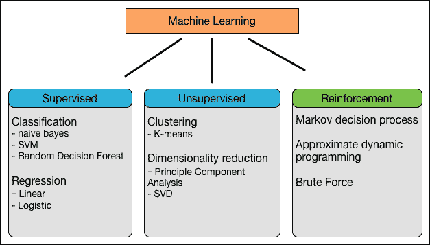

图 1：机器学习任务（仅包含少数几个算法）

下图展示了监督学习的示意图。当算法找到所需的模式后，这些模式可以用于对未标记的测试数据进行预测：

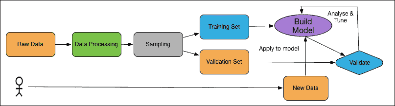

图 2：监督学习的实际应用

示例包括分类和回归，用于解决监督学习问题，从而可以基于它们建立预测模型进行预测分析。我们将提供几种监督学习的示例，如线性回归、逻辑回归、随机森林、决策树、朴素贝叶斯、多层感知机等。

在本课程中，我们将主要关注用于预测分析的监督学习算法。让我们从非常简单的线性回归算法开始。

# 线性回归——重新审视

在第一课《从数据到决策——TensorFlow 入门》中，我们看到了一个线性回归的例子。我们观察了如何在随机生成的数据集（即假数据）上使用 TensorFlow。我们了解到，回归是一种监督学习，用于预测连续值输出。然而，在假数据上运行线性回归就像是买了一辆新车却从未开过它。这台令人惊叹的机器渴望在现实世界中发挥作用！

幸运的是，许多数据集可以在网上找到，用于测试你新学到的回归知识：

+   马萨诸塞大学阿姆赫斯特分校提供了各种类型的小型数据集：[`www.umass.edu/statdata/statdata/`](http://www.umass.edu/statdata/statdata/)

+   Kaggle 包含各种大规模的机器学习竞赛数据集：[`www.kaggle.com/datasets`](https://www.kaggle.com/datasets)

+   Data.gov 是美国政府的一个开放数据计划，包含了许多有趣且实用的数据集：[`catalog.data.gov`](https://catalog.data.gov)

因此，在这一部分，通过定义一组模型，我们将看到如何减少可能函数的搜索空间。此外，TensorFlow 利用这些函数的可微分特性，运行高效的梯度下降优化器来学习参数。为了避免过拟合数据，我们通过对较大值的参数施加惩罚来正则化成本函数。

线性回归在第一课《从数据到决策——TensorFlow 入门》中展示，其中有一些张量仅包含一个标量值，但你当然可以对任意形状的数组执行计算。在 TensorFlow 中，诸如加法和乘法等操作需要两个输入，并生成一个输出。相反，常量和变量不需要任何输入。我们还将看到一个例子，展示 TensorFlow 如何操作 2D 数组来执行类似线性回归的操作。

## 问题陈述

在线电影评分和推荐已成为全球重要的商业之一。例如，好莱坞每年在美国票房的收入约为 100 亿美元。像 Rotten Tomatoes 这样的电影网站将电影评论汇总成一个综合评分，并报告糟糕的首映周末。尽管单一的电影评论家或负面评论不能决定一部电影的成败，但成千上万的评论和评论家却能。

Rotten Tomatoes、Metacritic 和 IMDb 有自己汇总电影评论和独特的评分系统。另一方面，Fandango，NBCUniversal 的子公司，使用五颗星的评分系统，按照 FiveThirtyEight 的分析，大多数电影至少获得三颗星。

对 Fandango 使用的数据集进行的探索性分析显示，在 510 部电影中，437 部电影至少获得了一条评论，令人发笑的是，98% 的电影评分为 3 星或更高，75% 的电影评分为 4 星或更高。这意味着，根据 Fandango 的标准，一部电影几乎不可能在票房上失败。因此，Fandango 的评分存在偏见和失真：

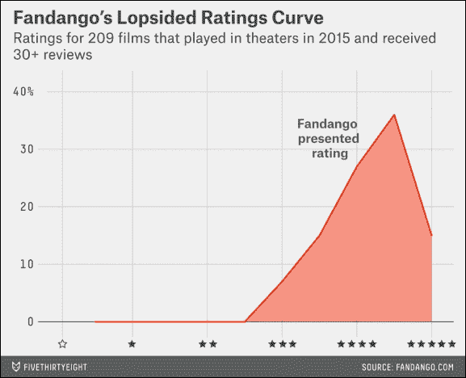

图 3：Fandango 评分曲线的失衡现象

(来源：[`fivethirtyeight.com/features/fandango-movies-ratings/`](https://fivethirtyeight.com/features/fandango-movies-ratings/))

由于 Fandango 的评分不可靠，我们将根据 IMDb 评分来预测我们自己的评分。更具体地说，这是一个多元回归问题，因为我们的预测模型将使用多个特征来进行评分预测，拥有多个预测变量。

幸运的是，数据集足够小，可以适应内存，因此普通的批量学习就能很好地完成任务。考虑到这些因素和需求，我们会发现线性回归能够满足我们的要求。然而，对于更强大的回归分析，你仍然可以使用基于深度神经网络的回归技术，比如深度置信网络回归器（Deep Belief Networks Regressor）。

## 使用线性回归进行电影评分预测

现在，第一步是从 GitHub 下载 Fandango 的评分数据集，网址为 [`github.com/fivethirtyeight/data/tree/master/fandango`](https://github.com/fivethirtyeight/data/tree/master/fandango)。该数据集包含了所有拥有 Rotten Tomatoes 评分、RT 用户评分、Metacritic 评分、Metacritic 用户评分、IMDb 评分，且在 Fandango 上至少有 30 条影迷评论的电影。

表 1：fandango_score_comparison.csv 中各列的说明

该数据集有 22 列，具体说明如下：

| 列名 | 定义 |
| --- | --- |
| `FILM` | 电影名称。 |
| `RottenTomatoes` | Rotten Tomatoes 为电影提供的对应番茄评分（Tomatometer score）。 |
| `RottenTomatoes_User` | Rotten Tomatoes 用户评分。 |
| `Metacritic` | Metacritic 影评人评分。 |
| `Metacritic_User` | Metacritic 用户评分。 |
| `IMDB` | IMDb 用户评分。 |
| `Fandango_Stars` | 电影在 Fandango 电影页面上的星级评分。 |
| `Fandango_Ratingvalue` | 从每个页面的 HTML 中提取出的 Fandango 评分值。即电影实际获得的平均分数。 |
| `RT_norm` | 电影的番茄评分（Tomatometer score）。它被标准化为 0 到 5 分制。 |
| `RT_user_norm` | Rotten Tomatoes 用户评分，已标准化为 0 到 5 分制。 |
| `Metacritic_norm` | 电影的 Metacritic 影评人评分，已标准化为 0 到 5 分制。 |
| `Metacritic_user_nom` | Metacritic 用户评分，已标准化为 0 到 5 分制。 |
| `IMDB_norm` | IMDb 用户评分，已标准化为 0 到 5 分制。 |
| `RT_norm_round` | 电影的烂番茄 Tomatometer 评分，已规范化为 0 到 5 分的系统，并四舍五入至最接近的半颗星。 |
| `RT_user_norm_round` | 电影的烂番茄用户评分，已规范化为 0 到 5 分的系统，并四舍五入至最接近的半颗星。 |
| `Metacritic_norm_round` | 电影的 Metacritic 评论员评分，已规范化为 0 到 5 分的系统，并四舍五入至最接近的半颗星。 |
| `Metacritic_user_norm_round` | 电影的 Metacritic 用户评分，已规范化为 0 到 5 分的系统，并四舍五入至最接近的半颗星。 |
| `IMDB_norm_round` | 电影的 IMDb 用户评分，已规范化为 0 到 5 分的系统，并四舍五入至最接近的半颗星。 |
| `Metacritic_user_vote_count` | 电影在 Metacritic 上的用户投票数量。 |
| `IMDB_user_vote_count` | 电影在 IMDb 上的用户投票数量。 |
| `Fandango_votes` | 电影在 Fandango 上的用户投票数量。 |
| `Fandango_Difference` | 显示的`Fandango_Stars`与实际`Fandango_Ratingvalue`之间的差异。 |

我们已经看到，使用 TensorFlow 的典型线性回归问题具有以下工作流程，它更新参数以最小化 Fandango 的偏斜评分曲线的给定成本函数：

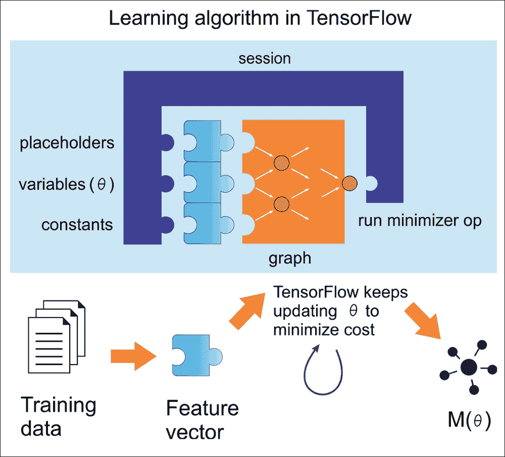

图 4：使用 TensorFlow 进行线性回归的学习算法

现在，让我们尝试遵循前面的图示，并重新制作相同的线性回归：

1.  导入所需的库：

    ```py
    import numpy as np
    import pandas as pd
    from scipy import stats
    import sklearn
    from sklearn.model_selection import train_test_split
    import tensorflow as tf
    import matplotlib
    import matplotlib.pyplot as plt
    import seaborn as sns
    ```

1.  读取数据集并创建一个 Panda DataFrame：

    ```py
    df = pd.read_csv('fandango_score_comparison.csv')
    print(df.head())
    ```

    输出结果如下：

    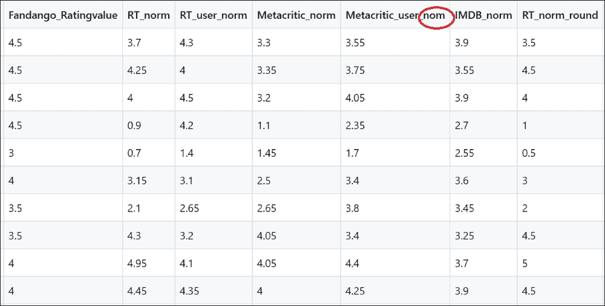

    图 5：展示 Metacritic_user_nom 中的错别字的数据集快照

    因此，如果你仔细查看前面的 DataFrame，会发现一个可能导致灾难的错别字。从直觉来看，很明显`Metacritic_user_nom`应该是`Metacritic_user_norm`。我们将其重命名，以避免进一步的混淆：

    ```py
    df.rename(columns={'Metacritic_user_nom':'Metacritic_user_norm'}, inplace=True)
    ```

    此外，根据[`fivethirtyeight.com/features/fandango-movies-ratings`](https://fivethirtyeight.com/features/fandango-movies-ratings)/上的统计分析，所有变量并非等同贡献；以下列出的列对电影排名的影响更大：

    ```py
     'Fandango_Stars',
    'RT_user_norm',
    'RT_norm',
    'IMDB_norm',
    'Metacritic_user_norm',
    'Metacritic_norm'
    ```

    现在，我们可以在构建 LR 模型之前检查变量之间的相关系数。首先，让我们为此创建一个排名列表：

    ```py
    rankings_lst = ['Fandango_Stars',
                    'RT_user_norm',
                    'RT_norm',
                    'IMDB_norm',
                    'Metacritic_user_norm',
                    'Metacritic_norm']
    ```

    以下函数计算`Pearson`相关系数并构建完整的相关矩阵：

    ```py
    def my_heatmap(df):    
        import seaborn as sns    
        fig, axes = plt.subplots()
        sns.heatmap(df, annot=True)
        plt.show()
        plt.close()
    ```

    我们可以调用前述方法来绘制矩阵，如下所示：

    ```py
    my_heatmap(df[rankings_lst].corr(method='pearson'))
    ```

    ### 注意

    **皮尔逊相关系数**：衡量两个变量之间线性关系强度的指标。如果变量之间的关系不是线性的，则相关系数不能准确而充分地表示这两个变量之间关系的强度。通常，当对总体进行测量时，它用“ρ”表示，而对样本进行测量时用“r”表示。从统计学角度看，相关系数的范围是-1 到 1，其中-1 表示完全负线性关系，r 为 0 表示没有线性关系，r 为 1 表示完全正线性关系。

    以下相关矩阵显示了使用皮尔逊相关系数的特征之间的相关性：

    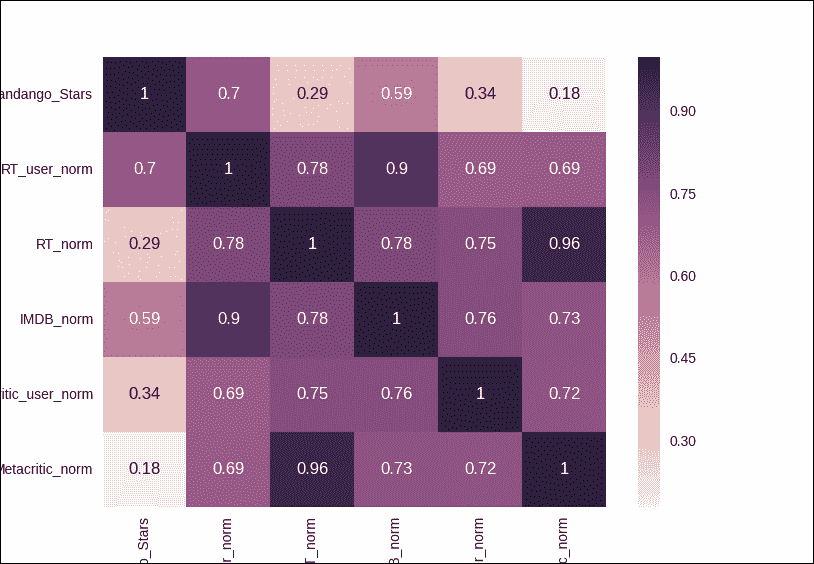

    图 6：排名电影的相关矩阵

    所以，Fandango 与 Metacritic 之间的相关性依然是正相关。接下来，让我们通过只考虑 RT 至少给出 4 星评分的电影来进行另一个研究：

    ```py
    RT_lst = df['RT_norm'] >= 4.
    my_heatmap(df[RT_lst][rankings_lst].corr(method='pearson'))
    >>>
    ```

    输出的是排名电影和 RT 评分至少为 4 的电影的相关矩阵，显示了使用皮尔逊相关系数的特征之间的相关性：

    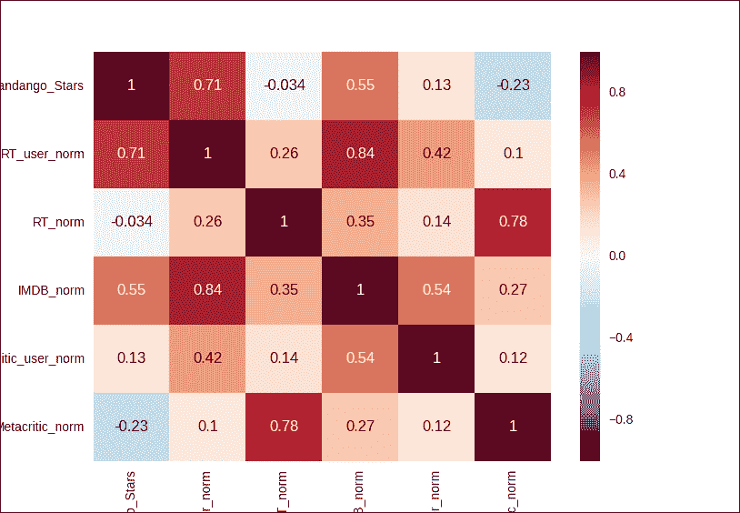

    图 7：排名电影和 RT 至少评分为 4 的电影的相关矩阵

    这次，我们发现 Fandango 与 Metacritic 之间存在反相关（即负相关），相关系数为-0.23。这意味着 Metacritic 在 Fandango 的评分上存在显著的偏向高分。

    因此，我们可以在不考虑 Fandango 评分的情况下训练我们的模型，但在此之前，我们先使用这个构建 LR 模型。之后我们将决定哪个选项最终会产生更好的结果。

1.  准备训练集和测试集。

    通过选择两个数据框列来创建一个特征矩阵`X`：

    ```py
    feature_cols = ['Fandango_Stars', 'RT_user_norm', 'RT_norm', 'Metacritic_user_norm', 'Metacritic_norm']
    X = df.loc[:, feature_cols]
    ```

    在这里，我只使用了选定的列作为特征，现在我们需要创建一个响应向量`y`：

    ```py
    y = df['IMDB_norm']
    ```

    我们假设 IMDB 是最可靠的评分基准来源。我们的最终目标是预测每部电影的评分，并将预测评分与响应列`IMDB_norm`进行比较。

    现在我们已经有了特征列和响应列，接下来是将数据划分为训练集和测试集：

    ```py
    X_train, X_test, y_train, y_test = train_test_split(X, y, test_size=0.50, random_state=43)
    ```

    如果你想更改`random_state`，它将帮助你生成伪随机数，用于随机抽样，从而得到不同的最终结果。

    ### 注意

    **随机状态**：顾名思义，它可用于初始化内部随机数生成器，从而决定数据划分为训练集和测试集的方式。这也意味着每次运行时，如果不指定`random_state`，你将得到不同的结果，这是预期的行为。因此，我们可以有以下三种选择：

    +   如果`random_state`为 None（或`np.random`），将返回一个随机初始化的`RandomState`对象。

    +   如果`random_state`是一个整数，它将用于初始化一个新的`RandomState`对象。

    +   如果`random_state`是一个`RandomState`对象，它会被传递进去。

    现在，我们需要知道数据集的维度，以便将其传递给张量：

    ```py
    dim = len(feature_cols)
    ```

    我们需要为独立系数添加一个额外的维度：

    ```py
    dim += 1

    ```

    因此，我们还需要为训练集和测试特征集中的独立系数创建一个额外的列：

    ```py
    X_train = X_train.assign( independent = pd.Series([1] * len(y_train), index=X_train.index))
    X_test = X_test.assign( independent = pd.Series([1] * len(y_train), index=X_test.index))
    ```

    到目前为止，我们已经使用并利用了 Pandas DataFrame，但将其转换为张量很麻烦，因此我们改为将它们转换为 NumPy 数组：

    ```py
    P_train = X_train.as_matrix(columns=None)
    P_test = X_test.as_matrix(columns=None)

    q_train = np.array(y_train.values).reshape(-1,1)
    q_test = np.array(y_test.values).reshape(-1,1)
    ```

1.  为 TensorFlow 创建占位符。

    现在我们已经有了所有的训练集和测试集，在初始化这些变量之前，我们需要为 TensorFlow 创建占位符，以便通过张量传递训练集：

    ```py
    P = tf.placeholder(tf.float32,[None,dim])
    q = tf.placeholder(tf.float32,[None,1])
    T = tf.Variable(tf.ones([dim,1]))
    ```

    让我们添加一些偏差，以区分在两种类型量化的情况下的值，如下所示：

    ```py
    bias = tf.Variable(tf.constant(1.0, shape = [n_dim]))
    q_ = tf.add(tf.matmul(P, T),bias)
    ```

1.  创建优化器。

    让我们为目标函数创建一个优化器：

    ```py
    cost = tf.reduce_mean(tf.square(q_ - q))
    learning_rate = 0.0001
    training_op = tf.train.GradientDescentOptimizer(learning_rate=learning_rate).minimize(cost)
    ```

1.  初始化全局变量：

    ```py
    init_op = tf.global_variables_initializer()
    cost_history = np.empty(shape=[1],dtype=float)
    ```

1.  训练 LR 模型。

    在这里，我们将训练迭代 50,000 次，并跟踪多个参数，例如均方误差，它表示训练的好坏；我们保持成本历史记录，以便未来可视化，等等：

    ```py
    training_epochs = 50000
    with tf.Session() as sess:
        sess.run(init_op)
        cost_history = np.empty(shape=[1], dtype=float)
        t_history = np.empty(shape=[dim, 1], dtype=float)
        for epoch in range(training_epochs):
            sess.run(training_op, feed_dict={P: P_train, q: q_train})
            cost_history = np.append(cost_history, sess.run(cost, feed_dict={P: P_train, q: q_train}))
            t_history = np.append(t_history, sess.run(T, feed_dict={P: P_train, q: q_train}), axis=1)
        q_pred = sess.run(q_, feed_dict={P: P_test})[:, 0]
        mse = tf.reduce_mean(tf.square(q_pred - q_test))
        mse_temp = mse.eval()
        sess.close()
    ```

    最后，我们评估`mse`，以便从测试集上的训练评估中得到标量值。现在，让我们计算`mse`和`rmse`值，如下所示：

    ```py
    print(mse_temp)
    RMSE = math.sqrt(mse_temp)
    print(RMSE)
    >>> 
    0.425983107542
    0.6526738140461913
    ```

    你也可以按如下方式更改特征列：

    ```py
    feature_cols = ['RT_user_norm', 'RT_norm', 'Metacritic_user_norm', 'Metacritic_norm']
    ```

    现在我们不考虑 Fandango 的评分，我得到了`mse`和`rmse`的以下结果：

    ```py
    0.426362842426
    0.6529646563375979
    ```

1.  观察整个迭代过程中的训练成本：

    ```py
    fig, axes = plt.subplots()
    plt.plot(range(len(cost_history)), cost_history)
    axes.set_xlim(xmin=0.95)
    axes.set_ylim(ymin=1.e-2)
    axes.set_xscale("log", nonposx='clip')
    axes.set_yscale("log", nonposy='clip')
    axes.set_ylabel('Training cost')
    axes.set_xlabel('Iterations')
    axes.set_title('Learning rate = ' + str(learning_rate))
    plt.show()
    plt.close()
    >>>

    ```

    输出如下：

    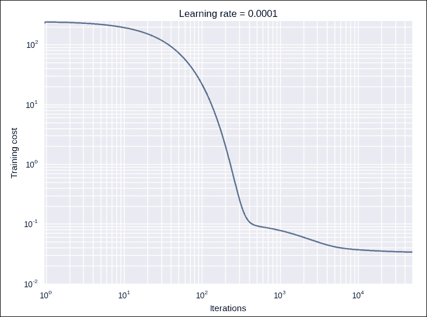

    图 8：训练和训练成本在 10000 次迭代后变得饱和

    上述图表显示训练成本在 10,000 次迭代后变得饱和。这也意味着，即使你将模型迭代超过 10,000 次，成本也不会出现显著下降。

1.  评估模型：

    ```py
    predictedDF = X_test.copy(deep=True)
    predictedDF.insert(loc=0, column='IMDB_norm_predicted', value=pd.Series(data=q_pred, index=predictedDF.index))
    predictedDF.insert(loc=0, column='IMDB_norm_actual', value=q_test)

    print('Predicted vs actual rating using LR with TensorFlow')
    print(predictedDF[['IMDB_norm_actual', 'IMDB_norm_predicted']].head())print(predictedDF[['IMDB_norm_actual', 'IMDB_norm_predicted']].tail())
    >>>
    ```

    以下显示了使用 LR 模型的预测与实际评分：

    ```py
              IMDB_norm_actual  IMDB_norm_predicted
    45              3.30              3.232061
    50              3.35              3.381659
    98              3.05              2.869175
    119             3.60              3.796200
    133             2.15              2.521702
    140             4.30              4.033006
    143             3.70              3.816177
    42              4.10              3.996275
    90              3.05              3.226954
    40              3.45              3.509809
    ```

    我们可以看到，预测是一个连续的值。现在是时候看看 LR 模型如何推广并拟合回归线：

    ```py
    How the LR fit with the predicted data points:
    plt.scatter(q_test, q_pred, color='blue', alpha=0.5)
    plt.plot([q_test.min(), q_test.max()], [q_test.min(), q_test.max()], '--', lw=1)
    plt.title('Predicted vs Actual')
    plt.xlabel('Actual')
    plt.ylabel('Predicted')
    plt.show()
    plt.show()

    >>>
    ```

    输出如下：

    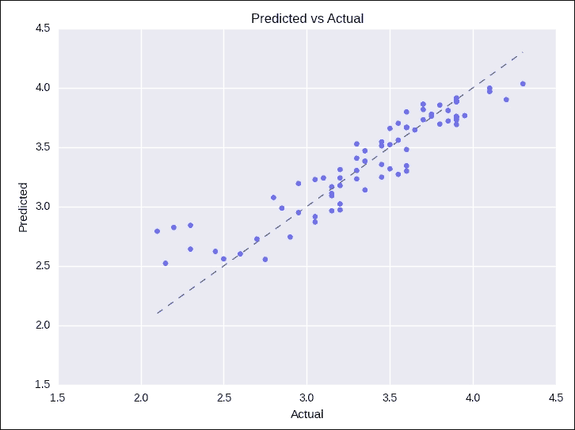

    图 9：LR 模型的预测结果

    图表没有告诉我们 LR 模型的预测是好是坏。但我们仍然可以通过使用像深度神经网络这样的层次结构来提高模型的性能。

    下一个例子是关于应用其他监督学习算法，如逻辑回归、支持向量机和随机森林进行预测分析。

# 从灾难到决策——重新审视泰坦尼克号示例

在第 1 课中，*从数据到决策 - 使用 TensorFlow 入门*，我们对泰坦尼克号数据集进行了最基本的数据分析。现在轮到我们基于数据做一些分析了。让我们来看看哪些人群在这场灾难中幸存了下来。

既然我们有足够的数据，如何进行预测建模，以便从这些数据中得出一些相对直接的结论呢？例如，女性、头等舱乘客和儿童都是提高乘客在灾难中生存几率的因素。

使用像 if-else 语句这样简单的强力法（结合某种加权评分系统），你可以编写一个程序来预测一个给定的乘客是否会在灾难中幸存。然而，用 Python 编写这样一个程序没有太多意义。显然，这样的程序会非常繁琐，难以推广，并且需要对每个变量和样本（即每个乘客）进行广泛的微调：

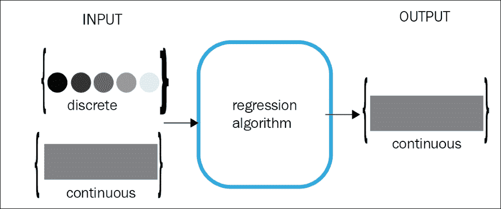

图 10：回归算法的目的是产生连续的输出

在这一点上，你可能会对分类问题和回归问题之间的基本区别感到困惑。那么，回归算法的目的是产生连续的输出。输入可以是离散的，也可以是连续的。相比之下，分类算法的目的是从一组离散或连续值的输入中产生离散的输出。这一区别很重要，因为离散值的输出更适合由分类算法处理，接下来的章节将讨论这一点：

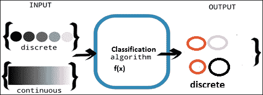

图 11：分类算法的目的是产生离散的输出

在本节中，我们将看到如何为泰坦尼克号生存预测开发几种预测模型，并使用它们进行一些分析。特别地，我们将讨论逻辑回归、随机森林和线性支持向量机（SVM）。我们从逻辑回归开始。然后使用 SVM，因为特征数量并不多。最后，我们将看看如何利用随机森林提高性能。然而，在深入之前，我们需要对数据集进行一个简短的探索性分析。

## 泰坦尼克号数据集的探索性分析

我们将看到各个变量如何对生存率产生影响。首先，我们需要导入所需的包：

```py
import os
import pandas as pd
import numpy as np
import seaborn as sns
import matplotlib.pyplot as plt
from sklearn.model_selection import train_test_split
from sklearn.metrics import classification_report
import shutil

```

现在，让我们加载数据并检查可以使用的特征：

```py
train = pd.read_csv(os.path.join('input', 'train.csv'))
test = pd.read_csv(os.path.join('input', 'test.csv'))
print("Information about the data")
print(train.info())
>>> 
RangeIndex: 891 entries, 0 to 890
Data columns (total 12 columns):
PassengerId    891 non-null int64
Survived       891 non-null int64
Pclass         891 non-null int64
Name           891 non-null object
Sex            891 non-null object
Age            714 non-null float64
SibSp          891 non-null int64
Parch          891 non-null int64
Ticket         891 non-null object
Fare           891 non-null float64
Cabin          204 non-null object
Embarked       889 non-null object
```

因此，训练数据集一共有`12`列和`891`行。此外，`Age`、`Cabin`和`Embarked`列存在空值或缺失值。我们将在特征工程部分处理这些空值，但目前，让我们看看有多少数据是有效的：

```py
print("How many have survived?")
print(train.Survived.value_counts(normalize=True))
count_plot = sns.countplot(train.Survived)
count_plot.get_figure().savefig("survived_count.png")
>>>
```

有多少人幸存了下来？

```py
0    0.616162
1    0.383838
```

因此，约 61%的乘客死亡，只有 39%的乘客成功生还，如下图所示：

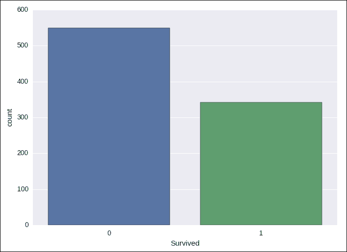

图 12：泰坦尼克号训练集中生还者与死亡者的对比

那么，乘客的舱位与生存率之间有什么关系呢？首先我们应该查看每个舱位的计数：

```py
train['Name_Title'] = train['Name'].apply(lambda x: x.split(',')[1]).apply(lambda x: x.split()[0])
print('Title count')
print(train['Name_Title'].value_counts())
print('Survived by title')
print(train['Survived'].groupby(train['Name_Title']).mean())
>>> 	
Title      count
Mr.          517
Miss.        182
Mrs.         125
Master.       40
Dr.            7
Rev.           6
Mlle.          2
Col.           2
Major.         2
Sir.           1
Jonkheer.      1
Lady.          1
Capt.          1
the            1
Don.           1
Ms.            1
Mme.           1
```

正如你可能记得的那样（即电影《泰坦尼克号》1997 年版），来自较高阶层的人有更好的生还机会。所以，你可能会认为，乘客的头衔也可能是生还的重要因素。另一个有趣的现象是，名字较长的人生还的几率更高。这是因为大多数名字较长的人是已婚女士，可能得到了丈夫或家人帮助，从而增加了生还机会：

```py
train['Name_Len'] = train['Name'].apply(lambda x: len(x))
print('Survived by name length')
print(train['Survived'].groupby(pd.qcut(train['Name_Len'],5)).mean())
>>>
Survived by name length 
(11.999, 19.0]    0.220588
(19.0, 23.0]      0.301282
(23.0, 27.0]      0.319797
(27.0, 32.0]      0.442424
(32.0, 82.0]      0.674556
```

妇女和儿童的生还几率更高，因为他们是最先撤离船难的乘客：

```py
print('Survived by sex')
print(train['Survived'].groupby(train['Sex']).mean())
>>> 
Survived by sex
Sex
female    0.742038
male      0.188908
```

舱位字段包含最多的空值（近 700 个），但我们仍然可以从中提取信息，比如每个舱位的首字母。因此，我们可以看到大多数舱位字母与生存率相关：

```py
train['Cabin_Letter'] = train['Cabin'].apply(lambda x: str(x)[0])
print('Survived by Cabin_Letter')
print(train['Survived'].groupby(train['Cabin_Letter']).mean())
>>>
Survived by Cabin_Letter
A    0.466667
B    0.744681
C    0.593220
D    0.757576
E    0.750000
F    0.615385
G    0.500000
T    0.000000
n    0.299854
```

最后，看起来在谢尔堡登船的人生还率比其他登船地点高出 20%。这很可能是因为那个地方的上层阶级乘客比例较高：

```py
print('Survived by Embarked')
print(train['Survived'].groupby(train['Embarked']).mean())
count_plot = sns.countplot(train['Embarked'], hue=train['Pclass'])
count_plot.get_figure().savefig("survived_count_by_embarked.png")

>>> 
Survived by Embarked
C    0.553571
Q    0.389610
S    0.336957
```

从图形上看，前面的结果可以如下所示：

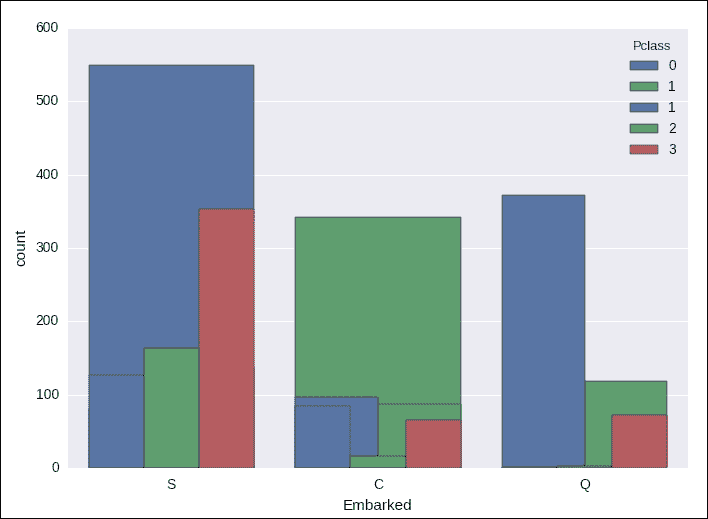

图 13：按登船情况分组的生还者

因此，有几个重要因素影响了人们的生存。这意味着我们在开发预测模型时需要考虑这些因素。

我们将训练几个二分类器，因为这是一个二分类问题，预测值为 0 或 1，使用训练集进行训练，并用测试集进行生存预测。

但是，在我们进行这一步之前，让我们先做一些特征工程，因为你已经看到有些数据缺失或为空。我们将通过填充这些空值或删除这些记录来处理训练集和测试集中的缺失值。此外，我们不能直接使用这些数据集，而需要对其进行处理，使其能够适应我们的机器学习模型。

## 特征工程

由于我们将乘客姓名的长度视为一个重要特征，最好将姓名本身去除，计算其对应的长度，并且提取出头衔：

def create_name_feat(train, test):

```py
    for i in [train, test]:
        i['Name_Len'] = i['Name'].apply(lambda x: len(x))
        i['Name_Title'] = i['Name'].apply(lambda x: x.split(',')[1]).apply(lambda x: x.split()[0])
        del i['Name']
    return train, test
```

由于年龄字段有 177 个空值，而这些空值的生还率比非空值低 10%。因此，在填充空值之前，我们将添加一个 Age_null 标志，以确保我们能够考虑数据的这一特征：

```py
def age_impute(train, test):
    for i in [train, test]:
        i['Age_Null_Flag'] = i['Age'].apply(lambda x: 1 if pd.isnull(x) else 0)
        data = train.groupby(['Name_Title', 'Pclass'])['Age']
        i['Age'] = data.transform(lambda x: x.fillna(x.mean()))
    return train, test
```

我们通过用该列的平均值填充空缺的年龄数据。这样会在数据集中加入一些额外的偏差。但为了提高我们的预测模型，我们不得不做出一些牺牲。

然后我们将`SibSp`和`Parch`列合并，创建家庭规模，并将其分为三个级别：

```py
def fam_size(train, test):
    for i in [train, test]:
        i['Fam_Size'] = np.where((i['SibSp']+i['Parch']) == 0, 'One',
                                 np.where((i['SibSp']+i['Parch']) <= 3, 'Small', 'Big'))
        del i['SibSp']
        del i['Parch']
    return train, test
We are using the Ticket column to create Ticket_Letr, which indicates the first letter of each ticket and Ticket_Len, which indicates the length of the Ticket field:
```

```py
def ticket_grouped(train, test):
    for i in [train, test]:
        i['Ticket_Letr'] = i['Ticket'].apply(lambda x: str(x)[0])
        i['Ticket_Letr'] = i['Ticket_Letr'].apply(lambda x: str(x))
        i['Ticket_Letr'] = np.where((i['Ticket_Letr']).isin(['1', '2', '3', 'S', 'P', 'C', 'A']),
                                    i['Ticket_Letr'],
                                    np.where((i['Ticket_Letr']).isin(['W', '4', '7', '6', 'L', '5', '8']),'Low_ticket', 'Other_ticket'))
        i['Ticket_Len'] = i['Ticket'].apply(lambda x: len(x))
        del i['Ticket']
    return train, test
```

我们还需要提取`Cabin`列的第一个字母：

```py
def cabin(train, test):
    for i in [train, test]:
        i['Cabin_Letter'] = i['Cabin'].apply(lambda x: str(x)[0])
        del i['Cabin']
    return train, test
```

用最常见的值`'S'`填充`Embarked`列中的空值：

```py
def embarked_impute(train, test):
    for i in [train, test]:
        i['Embarked'] = i['Embarked'].fillna('S')
    return train, test
```

现在我们需要转换我们的分类列。到目前为止，我们认为对我们将要创建的预测模型来说，字符串变量需要转换为数值。下面的`dummies()`函数对字符串变量进行一热编码：

```py
def dummies(train, test,
            columns = ['Pclass', 'Sex', 'Embarked', 'Ticket_Letr', 'Cabin_Letter', 'Name_Title', 'Fam_Size']):
    for column in columns:
        train[column] = train[column].apply(lambda x: str(x))
        test[column] = test[column].apply(lambda x: str(x))
        good_cols = [column+'_'+i for i in train[column].unique() if i in test[column].unique()]
        train = pd.concat((train, pd.get_dummies(train[column], prefix=column)[good_cols]), axis=1)
        test = pd.concat((test, pd.get_dummies(test[column], prefix=column)[good_cols]), axis=1)
        del train[column]
        del test[column]
    return train, test
```

我们已经有了数值特征，最后，我们需要为预测值或目标创建一个单独的列：

```py
def PrepareTarget(data):
    return np.array(data.Survived, dtype='int8').reshape(-1, 1)
```

我们已经看过数据及其特征，并进行了特征工程，构建了适合线性模型的最佳特征。接下来的任务是构建预测模型并在测试集上进行预测。让我们从逻辑回归开始。

## 生存预测的逻辑回归

逻辑回归是最广泛使用的二元响应预测分类器之一。它是一种线性机器学习方法，`loss`函数由逻辑损失公式给出：

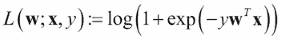

对于逻辑回归模型，损失函数是逻辑损失。对于二元分类问题，该算法输出一个二元逻辑回归模型，给定一个新的数据点，记为*`x`*，模型通过应用逻辑函数来进行预测：

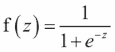

在前面的方程中，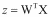 **并且**如果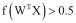，结果为正；否则，结果为负。注意，逻辑回归模型的原始输出**f (z)**具有概率解释。

好吧，如果现在将逻辑回归与其前身线性回归进行比较，前者提供了更高的分类准确率。此外，它是一种灵活的方式来对模型进行正则化，以便进行自定义调整，并且总的来说，模型的响应是概率的度量。最重要的是，尽管线性回归只能预测连续值，但逻辑回归可以广泛地推广到预测离散值。从现在起，我们将经常使用 TensorFlow contrib API。那么，让我们快速了解一下它。

### 使用 TensorFlow Contrib

contrib 是一个用于 TensorFlow 学习的高级 API。它支持以下估算器：

+   `tf.contrib.learn.BaseEstimator`

+   `tf.contrib.learn.Estimator`

+   `tf.contrib.learn.Trainable`

+   `tf.contrib.learn.Evaluable`

+   `tf.contrib.learn.KMeansClustering`

+   `tf.contrib.learn.ModeKeys`

+   `tf.contrib.learn.ModelFnOps`

+   `tf.contrib.learn.MetricSpec`

+   `tf.contrib.learn.PredictionKey`

+   `tf.contrib.learn.DNNClassifier`

+   `tf.contrib.learn.DNNRegressor`

+   `tf.contrib.learn.DNNLinearCombinedRegressor`

+   `tf.contrib.learn.DNNLinearCombinedClassifier`

+   `tf.contrib.learn.LinearClassifier`

+   `tf.contrib.learn.LinearRegressor`

+   `tf.contrib.learn.LogisticRegressor`

因此，我们无需从头开发逻辑回归模型，而是使用 TensorFlow contrib 包中的估计器。当我们从头创建自己的估计器时，构造函数仍然接受两个高层次的参数来配置模型：`model_fn` 和 `params`：

```py
nn = tf.contrib.learn.Estimator(model_fn=model_fn, params=model_params)
```

要实例化一个估计器，我们需要提供两个参数，如 `model_fn` 和 `model_params`，如下所示：

```py
nn = tf.contrib.learn.Estimator(model_fn=model_fn, params=model_params)
```

值得注意的是，`model_fn()` 函数包含了上述所有 TensorFlow 逻辑，以支持训练、评估和预测。因此，您只需要实现能高效使用它的功能。

现在，调用 `main()` 方法时，`model_params` 包含学习率，实例化估计器。您可以按如下方式定义 `model_params`：

```py
model_params = {"learning_rate": LEARNING_RATE}
```

### 注意

欲了解更多关于 TensorFlow contrib 的信息，感兴趣的读者可以访问此网址：[`www.tensorflow.org/extend/estimators`](https://www.tensorflow.org/extend/estimators)

好的，到目前为止，我们已经掌握了足够的背景知识，可以用我们的数据集在 TensorFlow 中创建 LR 模型。是时候实现它了：

1.  导入所需的包和模块：

    ```py
    import os
    import shutil
    import random
    import pandas as pd
    import numpy as np
    import seaborn as sns
    import matplotlib.pyplot as plt
    from sklearn.model_selection import train_test_split
    from sklearn.metrics import classification_report
    from sklearn.metrics import confusion_matrix
    from feature import *
    import tensorflow as tf
    from tensorflow.contrib.learn.python.learn.estimators import estimator
    from tensorflow.contrib import learn
    ```

1.  加载和准备数据集。

    首先，我们加载这两个数据集：

    ```py
    random.seed(12345) # For the reproducibility 
    train = pd.read_csv(os.path.join('input', 'train.csv'))
    test = pd.read_csv(os.path.join('input', 'test.csv'))
    ```

    让我们做一些特征工程。我们将调用在特征工程部分定义的函数，但该函数将作为名为 `feature.py` 的独立 Python 脚本提供：

    ```py
    train, test = create_name_feat(train, test)
    train, test = age_impute(train, test)
    train, test = cabin(train, test)
    train, test = embarked_impute(train, test)
    train, test = fam_size(train, test)
    test['Fare'].fillna(train['Fare'].mean(), inplace=True)
    train, test = ticket_grouped(train, test)
    ```

    值得注意的是，上述调用的顺序对于确保训练集和测试集的一致性至关重要。现在，我们还需要使用 sklearn 的 `dummies()` 函数为分类变量创建数值：

    ```py
    train, test = dummies(train, test, columns=['Pclass', 'Sex', 'Embarked', 'Ticket_Letr', 'Cabin_Letter', 'Name_Title', 'Fam_Size'])
    ```

    我们需要准备训练集和测试集：

    ```py
    TEST = True
    if TEST:
        train, test = train_test_split(train, test_size=0.25, random_state=10)
        train = train.sort_values('PassengerId')
        test = test.sort_values('PassengerId')

    X_train = train.iloc[:, 1:]
    x_test = test.iloc[:, 1:]
    ```

    然后我们将训练集和测试集转换为 NumPy 数组，因为到目前为止我们一直将它们保存在 Pandas DataFrame 格式中：

    ```py
    x_train = np.array(x_train.iloc[:, 1:], dtype='float32')
    if TEST:
     x_test = np.array(x_test.iloc[:, 1:], dtype='float32')
    else:
        x_test = np.array(x_test, dtype='float32')
    ```

    让我们准备目标列进行预测：

    ```py
    y_train = PrepareTarget(train)
    ```

    我们还需要知道特征数量，以便构建 LR 估计器：

    ```py
    feature_count = x_train.shape[1]

    ```

1.  准备 LR 估计器。

    我们构建 LR 估计器。我们将使用 `LinearClassfier` 估计器进行构建。由于这是一个二分类问题，我们提供了两个类别：

    ```py
    def build_lr_estimator(model_dir, feature_count):
        return estimator.SKCompat(learn.LinearClassifier(
            feature_columns=[tf.contrib.layers.real_valued_column("", dimension=feature_count)],
            n_classes=2, model_dir=model_dir))
    ```

1.  训练模型。

    在这里，我们训练上述 LR 估计器`10,000`次迭代。`fit()` 方法完成了训练，而 `predict()` 方法计算训练集的预测结果，其中包含特征 `X_train` 和标签 `y_train`：

    ```py
    print("Training...")
    try:
        shutil.rmtree('lr/')
    except OSError:
        pass
    lr = build_lr_estimator('lr/', feature_count)
    lr.fit(x_train, y_train, steps=1000)
    lr_pred = lr.predict(x_test)
    lr_pred = lr_pred['classes']
    ```

1.  模型评估。

    我们将评估模型，查看几个分类性能指标，如精度、召回率、F1 分数和混淆矩阵：

    ```py
    if TEST:
     target_names = ['Not Survived', 'Survived']
     print("Logistic Regression Report")
     print(classification_report(test['Survived'], lr_pred, target_names=target_names))
     print("Logistic Regression Confusion Matrix")

    >>>
    Logistic Regression Report
     precision    recall  f1-score   support
    Not Survived       0.90         0.88      0.89       147
    Survived           0.78         0.80      0.79        76---------------------------------------------------------
     avg / total       0.86         0.86       0.86       223
    ```

    由于我们用 NumPy 数据训练了 LR 模型，现在我们需要将其转换回 Pandas DataFrame 格式，以便创建混淆矩阵：

    ```py
    cm = confusion_matrix(test['Survived'], lr_pred)
        df_cm = pd.DataFrame(cm, index=[i for i in ['Not Survived', 'Survived']],
                             columns=[i for i in ['Not Survived', 'Survived']])
        print(df_cm)

    >>> 
    Logistic Regression Confusion Matrix
                  Not Survived  Survived
    Not Survived           130        17
    Survived               15         61
    ```

    现在，让我们看看计数：

    ```py
    print("Predicted Counts")
    print(sol.Survived.value_counts())

    >>> 
    Predicted Counts
    0    145
    1     78
    ```

    由于以图形方式查看计数非常棒，我们来绘制一下它：

    ```py
    sol = pd.DataFrame()
    sol['PassengerId'] = test['PassengerId']
    sol['Survived'] = pd.Series(lr_pred.reshape(-1)).map({True:1, False:0}).values
    sns.plt.suptitle("Predicted Survived LR")
    count_plot = sns.countplot(sol.Survived)
    count_plot.get_figure().savefig("survived_count_lr_prd.png")

    >>>
    ```

    输出结果如下：

    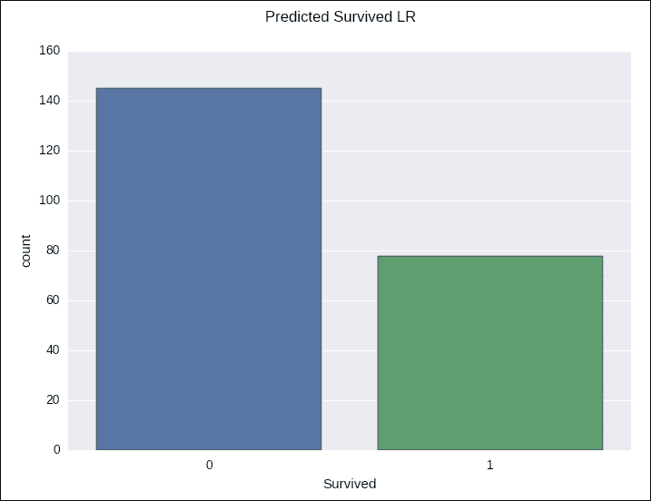

    图 14：使用 TensorFlow 进行逻辑回归的生存预测

所以，我们使用 LR 模型获得的准确率是 86%，这已经算不错了。但它仍然可以通过更好的预测模型进行改进。在下一部分，我们将尝试使用线性 **SVM** 来进行生存预测。

## 用于生存预测的线性 SVM

线性 **SVM** 是大规模分类任务中最广泛使用和标准的方法之一。多分类和二分类问题都可以通过使用 hinge loss 损失函数的 SVM 来解决：

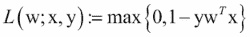

通常，线性 SVM 使用 L2 正则化进行训练。最终，线性 SVM 算法会输出一个可以用来预测未知数据标签的 SVM 模型。

假设你有一个未知的数据点，*`x`*，SVM 模型根据 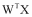 的值进行预测。结果可以是正的或负的。更具体地说，如果 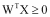，那么预测值为正；否则，预测值为负。

当前版本的 TensorFlow contrib 包仅支持线性 SVM。TensorFlow 使用 SDCAOptimizer 作为底层优化器。现在的问题是，如果你想要构建自己的 SVM 模型，你需要考虑性能和收敛调整的问题。幸运的是，你可以将 `num_loss_partitions` 参数传递给 SDCAOptimizer 函数。但你需要设置 *`X`*，使其在每个工作节点的并发训练操作中收敛。

如果你将 `num_loss_partitions` 设置为大于或等于这个值，收敛是有保证的，但随着 `num_loss_partitions` 增加，整体训练会变得更慢。另一方面，如果你将其值设置得较小，优化器在减少全局损失时会更具攻击性，但收敛性无法保证。

### 注意

想了解更多实现的 contrib 包，感兴趣的读者可以参考这个网址 [`github.com/tensorflow/tensorflow/tree/master/tensorflow/contrib/learn/python/learn/estimators`](https://github.com/tensorflow/tensorflow/tree/master/tensorflow/contrib/learn/python/learn/estimators)。

好的，到目前为止，我们已经掌握了创建 SVM 模型所需的足够背景知识，现在是时候实现它了：

1.  导入所需的包和模块：

    ```py
    import os
    import shutil
    import random
    import pandas as pd
    import seaborn as sns
    import matplotlib.pyplot as plt
    from sklearn.model_selection import train_test_split
    from sklearn.metrics import classification_report
    from sklearn.metrics import confusion_matrix
    from feature import *
    import tensorflow as tf
    from tensorflow.contrib.learn.python.learn.estimators import svm
    ```

1.  构建 SVM 模型的数据集准备：

    现在，构建 SVM 模型的数据准备工作与 LR 模型差不多，只是我们需要将 `PassengerId` 转换为字符串，因为 SVM 需要这个格式：

    ```py
    train['PassengerId'] = train['PassengerId'].astype(str)
    test['PassengerId'] = test['PassengerId'].astype(str)
    ```

1.  为连续特征列创建一个 SVM 字典。

    ### 注意

    为了将数据传入 SVM 模型，我们需要进一步创建一个字典，将每个连续特征列的名称（k）映射到该列存储在常量张量中的值。有关此问题的更多信息，请参见 TensorFlow GitHub 仓库中的此问题 [`github.com/tensorflow/tensorflow/issues/9505`](https://github.com/tensorflow/tensorflow/issues/9505)。

    我为特征和标签都编写了两个函数。让我们看看第一个函数是什么样的：

    ```py
    def train_input_fn():
        continuous_cols = {k: tf.expand_dims(tf.constant(train[k].values), 1)
                           for k in list(train) if k not in ['Survived', 'PassengerId']}
        id_col = {'PassengerId' : tf.constant(train['PassengerId'].values)}
        feature_cols = continuous_cols.copy()
        feature_cols.update(id_col)
        label = tf.constant(train["Survived"].values)
        return feature_cols, label
    ```

    上述函数创建了一个字典，将每个连续特征列映射到一个字典，然后又为 `passengerId` 列创建了一个字典。接着我将它们合并为一个字典。由于我们希望以 'Survived' 列作为标签，我将标签列转换为常量张量。最后，通过这个函数，我返回了特征列和标签。

    现在，第二种方法几乎做了相同的操作，唯一的区别是它只返回特征列，如下所示：

    ```py
    def predict_input_fn():
        continuous_cols = {k: tf.expand_dims(tf.constant(test[k].values), 1)
                           for k in list(test) if k not in ['Survived', 'PassengerId']}
        id_col = {'PassengerId' : tf.constant(test['PassengerId'].values)}
        feature_cols = continuous_cols.copy()
        feature_cols.update(id_col)
        return feature_cols
    ```

1.  训练 SVM 模型。

    现在，我们将只对实值列进行 10,000 次迭代训练。最后，它会创建一个包含所有预测值的预测列表：

    ```py
    svm_model = svm.SVM(example_id_column="PassengerId",
                        feature_columns=[tf.contrib.layers.real_valued_column(k) for k in list(train)
                                         if k not in ['Survived', 'PassengerId']], 
                        model_dir="svm/")
    svm_model.fit(input_fn=train_input_fn, steps=10000)
    svm_pred = list(svm_model.predict_classes(input_fn=predict_input_fn))
    ```

1.  模型评估：

    ```py
    target_names = ['Not Survived', 'Survived']
    print("SVM Report")
    print(classification_report(test['Survived'], svm_pred, target_names=target_names))
    >>>
    SVM Report
                           precision    recall  f1-score   support
    Not Survived       0.94        0.72      0.82       117
    Survived           0.63        0.92      0.75        62--------------------------------------------------------
     avg / total       0.84         0.79      0.79       179
    ```

    因此，使用 SVM 时，准确率仅为 79%，低于 LR 模型的准确率。与 LR 模型类似，绘制并观察混淆矩阵：

    ```py
    print("SVM Confusion Matrix")
    cm = confusion_matrix(test['Survived'], svm_pred)
    df_cm = pd.DataFrame(cm, index=[i for i in ['Not Survived', 'Survived']],
                            columns=[i for i in ['Not Survived', 'Survived']])
    print(df_cm)
    >>> 
    SVM Confusion Matrix
                  Not Survived  Survived
    Not Survived            84        33
    Survived                    5         57
    ```

    然后，我们绘制计数图，直观地查看比例：

    ```py
    sol = pd.DataFrame()
    sol['PassengerId'] = test['PassengerId']
    sol['Survived'] = pd.Series(svm_pred).values
    sns.plt.suptitle("Titanic Survival prediction using SVM with TensorFlow")
    count_plot = sns.countplot(sol.Survived)
    ```

    输出如下：

    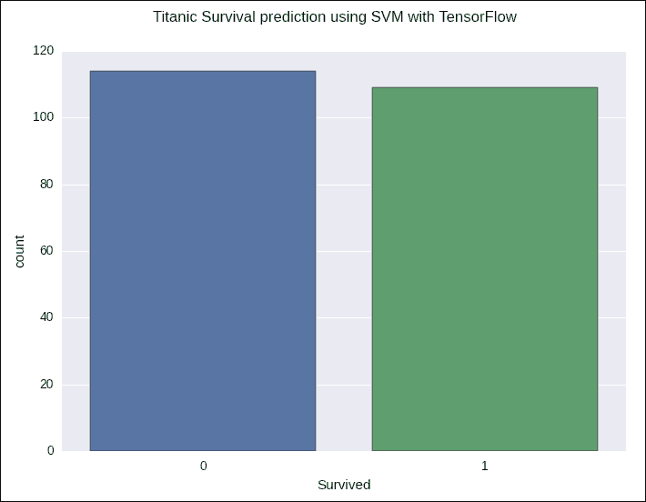

    图 15：使用 TensorFlow 的线性 SVM 进行生存预测

    现在，计数：

    ```py
    print("Predicted Counts")
    print(sol.Survived.value_counts())

    >>> 
    Predicted Counts
    1    90
    0    89
    ```

## 生存预测的集成方法 – 随机森林

最常用的机器学习技术之一是集成方法，它是通过构建一组分类器来进行学习的算法。然后可以通过对预测结果加权投票的方式来对新的数据点进行分类。在本节中，我们将主要关注通过组合数百棵决策树来构建的随机森林。

**决策树**（**DT**）是一种在监督学习中用于解决分类和回归任务的技术。决策树模型通过利用树状图来展示行动步骤，学习从数据特征中推断出的简单决策规则。决策树的每个分支表示一个可能的决策、事件或反应，基于统计概率：

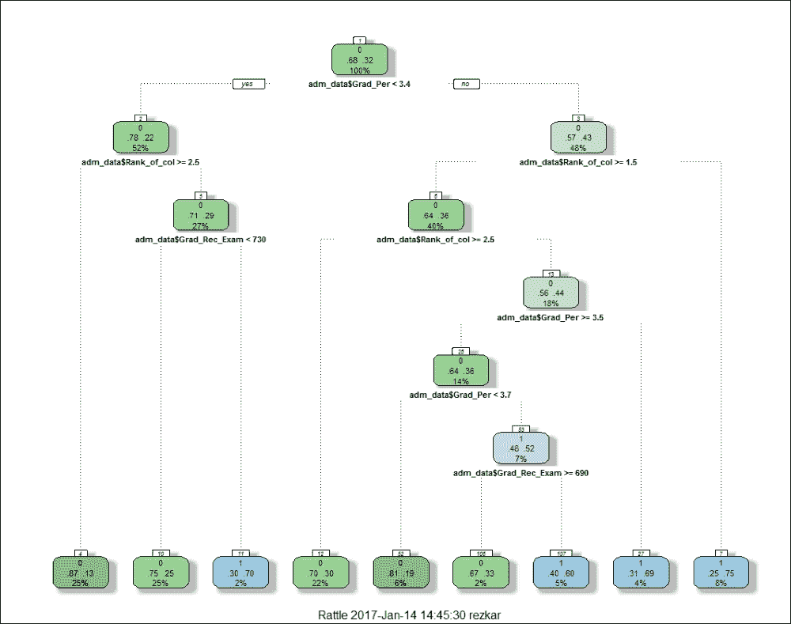

图 16：使用 R 的 rattle 包对入学测试数据集进行的样本决策树

与 LR 或 SVM 相比，决策树（DT）是更为稳健的分类算法。树根据训练数据中可用特征的划分推断预测标签或类别，从而产生良好的泛化效果。最有趣的是，该算法可以处理二分类和多分类问题。

例如，图 16 中的决策树从入学数据中学习，通过一组`if...else`决策规则来逼近正弦曲线。数据集包含每个申请入学学生的记录，比如申请美国大学的记录。每条记录包含研究生入学考试成绩、CGPA 成绩以及列的排名。现在，我们需要基于这三项特征（变量）来预测谁是合格的。

决策树（DTs）可以在训练 DT 模型并修剪掉不需要的树枝后用于解决这种问题。通常，较深的树表示更复杂的决策规则和更合适的模型。因此，树越深，决策规则越复杂，模型拟合度越高。

### 注意

如果你想绘制上面的图形，只需使用我的 R 脚本并在 RStudio 中执行，输入入学数据集。脚本和数据集可以在我的 GitHub 仓库中找到，链接为：[`github.com/rezacsedu/AdmissionUsingDecisionTree`](https://github.com/rezacsedu/AdmissionUsingDecisionTree)。

到目前为止，我们已经获得了足够的背景知识来创建一个随机森林（RF）模型，现在是时候实现它了。

1.  导入所需的包和模块：

    ```py
    import os
    import shutil
    import random
    import pandas as pd
    import numpy as np
    import seaborn as sns
    import matplotlib.pyplot as plt
    from sklearn.model_selection import train_test_split
    from sklearn.metrics import classification_report
    from sklearn.metrics import confusion_matrix
    from feature import *
    import tensorflow as tf
    from tensorflow.contrib.learn.python.learn.estimators import estimator
    from tensorflow.contrib.tensor_forest.client import random_forest
    from tensorflow.contrib.tensor_forest.python import tensor_forest
    ```

1.  构建 RF 模型的数据集准备。

    现在，构建 RF 模型的数据准备与 LR 模型大致相同。因此，请参考逻辑回归部分。

1.  构建随机森林估计器。

    以下函数构建了一个随机森林估计器。它创建了 1,000 棵树，最多 1,000 个节点，并进行了 10 倍交叉验证。由于这是一个二分类问题，我将类别数设为 2：

    ```py
    def build_rf_estimator(model_dir, feature_count):
        params = tensor_forest.ForestHParams(
            num_classes=2,
            num_features=feature_count,
            num_trees=1000,
            max_nodes=1000,
            min_split_samples=10)
        graph_builder_class = tensor_forest.RandomForestGraphs
        return estimator.SKCompat(random_forest.TensorForestEstimator(
            params, graph_builder_class=graph_builder_class,
            model_dir=model_dir))
    ```

1.  训练 RF 模型。

    在这里，我们训练上述 RF 估计器。一旦`fit()`方法完成工作，`predict()`方法便会计算在包含特征`x_train`和标签`y_train`的训练集上的预测结果：

    ```py
    rf = build_rf_estimator('rf/', feature_count)
    rf.fit(x_train, y_train, batch_size=100)
    rf_pred = rf.predict(x_test)
    rf_pred = rf_pred['classes']
    ```

1.  评估模型。

    现在让我们评估 RF 模型的性能：

    ```py
        target_names = ['Not Survived', 'Survived']
        print("RandomForest Report")
        print(classification_report(test['Survived'], rf_pred, target_names=target_names))

    >>>
    RandomForest Report
                             precision    recall  f1-score   support
    ------------------------------------------------------
    Not Survived       0.92         0.85       0.88            117
    Survived           0.76         0.85       0.80            62
    ------------------------------------------------------
    avg / total        0.86         0.85       0.86            179
    ```

    因此，使用 RF 时，准确率为 87%，高于 LR 和 SVM 模型。与 LR 和 SVM 模型类似，我们将绘制并观察混淆矩阵：

    ```py
        print("Random Forest Confusion Matrix")
        cm = confusion_matrix(test['Survived'], rf_pred)
        df_cm = pd.DataFrame(cm, index=[i for i in ['Not Survived', 'Survived']],
                             columns=[i for i in ['Not Survived', 'Survived']])
        print(df_cm)
    >>> 
    Random Forest Confusion Matrix
                           Not Survived  Survived
    -----------------------------------------------------
    Not Survived            100             17
    Survived                 9              53
    ```

    然后，让我们绘制计数图，直观地查看比例：

    ```py
    sol = pd.DataFrame()
    sol['PassengerId'] = test['PassengerId']
    sol['Survived'] = pd.Series(svm_pred).values
    sns.plt.suptitle("Titanic Survival prediction using RF with TensorFlow")
    count_plot = sns.countplot(sol.Survived)
    ```

    输出结果如下：

    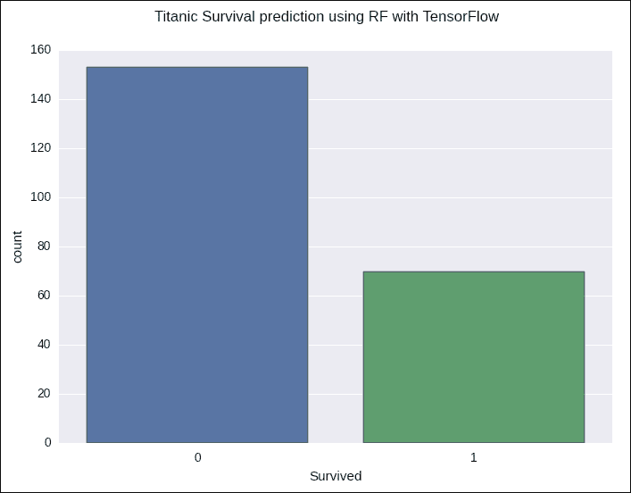

    图 17：使用 TensorFlow 的随机森林进行泰坦尼克号生存预测

    现在，分别统计每个的数量：

    ```py
    print("Predicted Counts")
    print(sol.Survived.value_counts())
    >>>  Predicted Counts
    -------------------------
    0   109
    1    70
    ```

## 一项比较分析

从分类报告中，我们可以看到随机森林具有最佳的整体表现。其原因可能是随机森林在处理分类特征时，比其他两种方法表现更好。同时，由于它使用隐式特征选择，过拟合问题得到了显著减轻。使用逻辑回归是为观察结果提供方便的概率评分。然而，当特征空间过大时，它的表现不佳，即不能很好地处理大量的分类特征/变量。它还完全依赖于非线性特征的转换。

最后，使用 SVM 我们可以处理具有非线性特征交互的大规模特征空间，而不依赖于整个数据集。然而，它在大量观察数据的情况下表现不好。不过，有时找到合适的核函数可能会有些棘手。

# 总结

在本节课中，我们从理论和实践的角度讨论了监督学习。特别是，我们重新审视了用于回归分析的线性回归模型。我们了解了如何使用回归来预测连续值。随后，在本节课中，我们讨论了其他一些用于预测分析的监督学习算法。我们看到了如何使用逻辑回归、SVM 和随机森林在泰坦尼克号数据集上进行生存预测。最后，我们还做了这些分类器的对比分析。我们还发现，基于决策树集成的随机森林优于逻辑回归和线性 SVM 模型。

在第 3 课中，*聚类你的数据——用于预测分析的无监督学习*，我们将提供一些无监督学习的实际示例。特别地，我们将提供使用 TensorFlow 进行邻域聚类和音频特征聚类的聚类技术。

更具体地说，我们将提供数据集的探索性分析，然后我们将使用 K-means、K-NN 和二分 K-means 方法结合充分的性能指标（如聚类成本、准确性等）来开发邻域的聚类。在课程的第二部分，我们将学习如何进行音频特征聚类。最后，我们将提供聚类算法的对比分析。

# 评估

1.  根据可用的学习反馈的性质，机器学习过程通常分为三大类。请列出它们。

1.  判断以下陈述是对还是错：使用暴力法（如 if-else 语句与某种加权评分系统），你无法编写程序来预测给定乘客是否能够在灾难中幸存。

1.  调用 main()方法时，包含学习率的 model_params 会实例化 Estimator。你如何定义 model_params？

1.  判断以下陈述是对还是错：决策树的每个分支代表一个可能的决策、事件或反应，从统计概率的角度来看。

1.  基于监督学习算法的预测模型可以根据一个带标签的 _______ 进行预测，该标签将输入映射到与现实世界对齐的输出。

    1.  数据流图

    1.  线性图

    1.  回归模型

    1.  数据集
