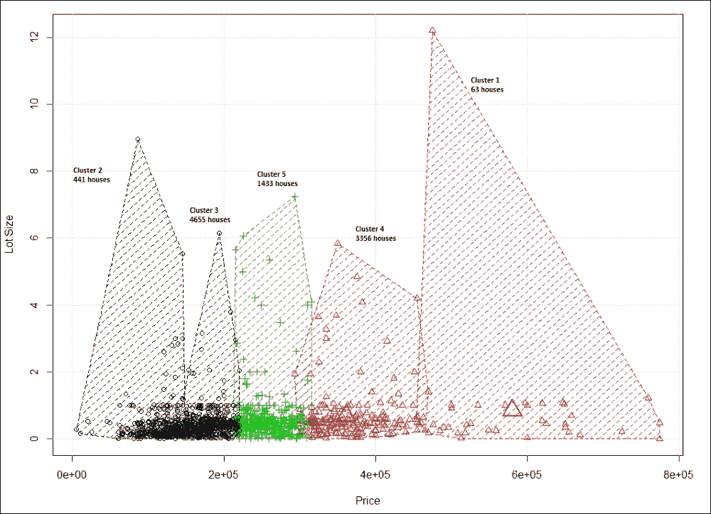

# 第三章：聚类你的数据 – 用于预测分析的无监督学习

在本课中，我们将深入探讨预测分析，并了解如何利用它对无监督观察数据集中的记录进行分组，属于某个特定组或类别。我们将提供一些无监督学习的实际示例；特别是会讨论使用 TensorFlow 进行的聚类技术，并附带一些动手示例。

本课将涵盖以下主题：

+   无监督学习与聚类

+   使用 K-means 进行预测邻域

+   使用 K-means 进行音频文件聚类

+   使用无监督的**k-最近邻**（**kNN**）进行预测最近邻

# 无监督学习与聚类

本节将简要介绍无监督**机器学习**（**ML**）技术。无监督学习是一种机器学习算法，用于通过推断无标签数据集中的隐藏模式，将相关的数据对象进行分组，也就是一个由无标签的输入数据组成的训练集。

让我们来看一个现实生活中的例子。假设你有一个庞大的文件夹，其中包含大量完全合法的非盗版 MP3 文件，存放在你的硬盘中。现在，如果你能够建立一个预测模型，帮助自动将相似的歌曲分组，并将它们组织到你最喜欢的类别中，比如乡村、嘻哈和摇滚，这该多好？

这是一种将项目分配到某个组中的行为，以便在无监督的方式下将 MP3 添加到相应的播放列表中。在第 1 课，*从数据到决策 – 使用 TensorFlow 入门，关于分类*中，我们假设你有一个标注正确的训练数据集。不幸的是，当我们在现实世界中收集数据时，通常无法享有这样的奢侈。例如，假设我们想将大量音乐集合分成有趣的播放列表。如果我们无法直接访问它们的元数据，我们该如何将歌曲分组呢？一种可能的方法是结合多种机器学习技术，但聚类往往是解决方案的核心。

换句话说，无监督学习算法的主要目标是探索输入数据中未知/隐藏的模式，而这些数据没有标签。然而，无监督学习还包括其他技术，通过探索性方式解释数据的关键特征，以发现隐藏的模式。为了克服这一挑战，聚类技术被广泛用于根据某些相似度度量将无标签数据点分组，且这一过程是无监督的。

在聚类任务中，算法通过分析输入示例之间的相似性，将相关特征分组到不同类别中，其中相似的特征被聚集并用圆圈标记。

聚类的应用包括但不限于以下几点：

+   在无监督方式下进行异常检测，以发现可疑模式

+   文本分类，用于寻找自然语言处理中的有用模式

+   社交网络分析，用于寻找一致的群体

+   数据中心计算集群，用于将相关计算机组合在一起

+   基于相似特征的房地产数据分析，用于识别社区

聚类分析是将数据样本或数据点划分并放入相应的同质类别或簇中的过程。因此，聚类的简单定义可以看作是将对象组织成组，组内成员在某些方面是相似的，如图 1 所示：


图 1：典型的聚类原始数据管道

因此，簇是指一组在某些方面彼此相似，并且与属于其他簇的对象不相似的对象集合。如果给定一组对象，聚类算法会根据相似性将这些对象分成不同的组。例如，像 K-means 这样的聚类算法会定位数据点组的质心。

然而，为了使聚类更准确和有效，算法会评估每个点到簇质心的距离。最终，聚类的目标是确定一组无标签数据中的内在分组。例如，K-means 算法会尝试将相关的数据点聚类到预定的 *3* 个簇（即 *k = 3*）中，如图 2 所示：


图 2：典型聚类算法的结果以及簇中心的表示

聚类是智能地对数据集中的项进行分类的过程。总体思路是，同一簇中的两个项比属于不同簇的项更接近。这是一个通用定义，具体的接近度解释可以灵活调整。例如，当接近度通过物种在生物分类（如科、属和种）的层次关系中的相似性来衡量时，猎豹和美洲豹可能属于同一簇，而大象则属于另一个簇。

# 使用 K-means 进行预测分析

K-means 是一种聚类算法，旨在将相关的数据点聚集在一起。然而，我们需要了解其工作原理和数学运算。

## K-means 工作原理

假设我们有 *n* 个数据点，*xi*，*i = 1...n*，需要将它们划分成 *k* 个簇。现在目标是为每个数据点分配一个簇，K-means 的目标是找到簇的位置 *μi*，*i=1...k*，使得数据点到簇的距离最小。从数学角度来看，K-means 算法通过解决一个优化问题的方程来实现这一目标：


在之前的方程中，**ci** 是一组数据点，当这些数据点被分配到簇 **i** 时，是需要计算的欧几里得距离（我们稍后会解释为何需要使用这种距离度量）。因此，我们可以看到，使用 K-means 进行整体聚类操作并非易事，而是一个 NP-难度的优化问题。这也意味着 K-means 算法不仅尝试找到全局最小值，而且常常会陷入不同的解中。

使用 K-means 算法进行聚类时，从初始化所有坐标为质心开始。每次算法执行时，根据某种距离度量（通常是前面提到的欧几里得距离），每个点都会被分配到其最近的质心。

### 注意

**距离计算**：当然，还有其他方法可以计算距离。例如，切比雪夫距离可以通过只考虑最显著的维度来测量距离。哈明距离算法可以识别两个字符串之间的差异。马氏距离可以用来规范化协方差矩阵。曼哈顿距离则是通过仅考虑轴对齐的方向来测量距离。哈弗辛距离用于测量球面上两点之间的大圆距离。

考虑到这些距离度量算法，可以明确看出，欧几里得距离算法是最适合用于解决我们在 K-means 算法中距离计算的目的的。然后，质心会更新为该迭代中分配给它的所有点的中心。这个过程会不断重复，直到质心的变化最小。简而言之，K-means 算法是一个迭代算法，并且分为两个步骤：

1.  **簇分配步骤**：K-means 会遍历数据集中每一个 *n* 数据点，将其分配到最接近的 k 个质心的簇中，然后选择距离最小的一个。

1.  **更新步骤**：对于每个簇，计算该簇内所有数据点的新质心。K-means 的整体工作流程可以通过以下流程图来解释：


图 4：K-means 算法的流程图（肘部法则是一个可选但也是高级的选项）

## 使用 K-means 预测邻域

现在，为了展示使用 K-means 进行聚类的例子，我们将使用从 [`course1.winona.edu/bdeppa/Stat%20425/Datasets.html`](http://course1.winona.edu/bdeppa/Stat%20425/Datasets.html) 下载的 Saratoga NY Homes 数据集，作为一种无监督学习技术。该数据集包含位于纽约市郊的房屋的若干特征；例如，价格、地块面积、水 front、年龄、土地价值、新建构、中央空调、燃料类型、供热类型、污水处理类型、生活面积、大学百分比、卧室、壁炉、浴室以及房间数。然而，**表 1** 中仅展示了其中的一些特征：


表 1：来自萨拉托加纽约房屋数据集的示例数据

该聚类技术的目标是基于城市中每个房屋的特征进行探索性分析，目的是寻找位于相同区域的可能邻近房屋。在进行特征提取之前，我们需要加载并解析萨拉托加纽约房屋数据集。然而，为了更好地理解，我们将一步一步地查看这个示例的源代码：

1.  加载所需的库和软件包。

    我们需要一些内置的 Python 库，例如 os、random、NumPy 和 Pandas，用于数据处理；PCA 用于降维；Matplotlib 用于绘图；当然，还有 TensorFlow：

    ```py
    import os
    import random
    from random import choice, shuffle
    import pandas as pd
    import numpy as np
    import tensorflow as tf
    from sklearn.decomposition import PCA
    import matplotlib.pyplot as plt
    from mpl_toolkits.mplot3d import axes3d, Axes3D
    ```

1.  加载、解析并准备训练集。

    这里的第一行用于确保结果的可重现性。第二行基本上是从你的位置读取数据集并将其转换为 Pandas 数据框：

    ```py
    random.seed(12345)
    train = pd.read_csv(os.path.join('input', 'saratoga.csv'))
    x_train = np.array(train.iloc[:, 1:], dtype='float32')
    ```

    如果现在打印数据框（使用 print(train)），您应该会看到包含标题和数据的数据框，如图 3 所示：

    

    图 5：萨拉托加纽约房屋数据集的快照

    好的，我们已经成功准备了数据集。现在，下一步是概念化我们的 K-means 并为其编写一个函数/类。

1.  实现 K-means。

    以下是 K-means 的源代码，这在 TensorFlow 中非常简单：

    ```py
    def kmeans(x, n_features, n_clusters, n_max_steps=1000, early_stop=0.0):
        input_vec = tf.constant(x, dtype=tf.float32)
        centroids = tf.Variable(tf.slice(tf.random_shuffle(input_vec), [0, 0], [n_clusters, -1]), dtype=tf.float32)
        old_centroids = tf.Variable(tf.zeros([n_clusters, n_features]), dtype=tf.float32)
        centroid_distance = tf.Variable(tf.zeros([n_clusters, n_features]))
        expanded_vectors = tf.expand_dims(input_vec, 0)
        exanded_centroids = tf.expand_dims(centroids, 1)
        distances = tf.reduce_sum(tf.square(tf.subtract(expanded_vectors, expanded_centroids)), 2)
        assignments = tf.argmin(distances, 0)
        means = tf.concat([tf.reduce_mean(
            tf.gather(input_vec, tf.reshape(tf.where(tf.equal(assignments, c)), [1, -1])),
            reduction_indices=[1]) for c in range(n_clusters)], 0)
        save_old_centroids = tf.assign(old_centroids, centroids)
        update_centroids = tf.assign(centroids, means)
        init_op = tf.global_variables_initializer()
        performance = tf.assign(centroid_distance, tf.subtract(centroids, old_centroids))
        check_stop = tf.reduce_sum(tf.abs(performance))
        with tf.Session() as sess:
            sess.run(init_op)
            for step in range(n_max_steps):
                sess.run(save_old_centroids)
                _, centroid_values, assignment_values = sess.run(
                    [update_centroids, centroids, assignments])            
                sess.run(check_stop)
                current_stop_coeficient = check_stop.eval()
                if current_stop_coeficient <= early_stop:
                    break
        return centroid_values, assignment_values
    ```

    上述代码包含了开发 K-means 模型所需的所有步骤，包括基于距离的质心计算、质心更新和训练所需的参数。

1.  对房屋进行聚类。

    现在可以用实际值调用前面的函数，例如，我们的房屋数据集。由于有许多房屋及其相应的特征，绘制所有房屋的聚类图会很困难。这就是我们在之前的课程中讨论的**主成分分析**（**PCA**）：

    ```py
    centers, cluster_assignments = kmeans(x_train, len(x_train[0]), 10)
    pca_model = PCA(n_components=3)
    reduced_data = pca_model.fit_transform(x_train)
    reduced_centers = pca_model.transform(centers)
    ```

    好的，现在我们一切就绪。为了更好地可视化聚类，您可以参见图 6 所示。为此，我们将使用 mpl_toolkits.mplot3d 进行 3D 投影，如下所示：

    ```py
    plt.subplot(212, projection='3d')
    plt.scatter(reduced_data[:, 0], reduced_data[:, 1], reduced_data[:, 2], c=cluster_assignments)
    plt.title("Clusters")
    plt.show()
    >>>
    ```

    

    图 6：聚类具有相似属性的房屋，例如价格

    在这里，我们可以看到大多数房屋的价格位于**0**到**100,000**之间。第二多的房屋价格位于**100,000**到**200,000**之间。然而，要区分它们是非常困难的。此外，我们使用的预定义聚类数量是 10，这可能不是最优的选择。因此，我们需要调整此参数。

1.  微调并找到最优的聚类数目。

    选择正确的簇数通常取决于任务。例如，假设你正在为数百人（包括老年人和年轻人）策划一个活动。如果你的预算只允许提供两个娱乐选项，那么你可以使用 K 均值聚类，设置**k = 2**，将宾客分成两组按年龄分配。有时，`k`值的选择并不那么明显。自动确定`k`值则会复杂一些。

    如前所述，K 均值算法试图最小化距离的平方和（即欧几里得距离），以**簇内平方和**（**WCSS**）为准。

    ### 注意

    然而，如果你想手动或自动最小化每个集合中点之间的平方和，你将得到一个模型，其中每个簇都是其自己的簇中心；在这种情况下，这个度量值将为 0，但它几乎不会是一个通用的模型。

    因此，一旦你通过指定参数训练好模型，就可以使用 WCSS 来评估结果。从技术上讲，它与每个 K 簇中每个观测点的距离和相同。聚类算法，尤其是 K 均值算法的优点是，它能在具有无限特征的数据上进行聚类。当你拥有原始数据，并希望了解其中的模式时，它是一个非常有用的工具。

    然而，在进行实验之前决定簇的数量可能并不会成功，有时可能导致过拟合问题或欠拟合问题。此外，非正式地说，确定簇的数量是一个独立的优化问题需要解决。因此，基于此，我们可以重新设计我们的 K 均值算法，考虑到 WCSS 值的计算，如下所示：

    ```py
    def kmeans(x, n_features, n_clusters, n_max_steps=1000, early_stop=0.0):
        input_vec = tf.constant(x, dtype=tf.float32)
        centroids = tf.Variable(tf.slice(tf.random_shuffle(input_vec), [0, 0], [n_clusters, -1]), dtype=tf.float32)
        old_centroids = tf.Variable(tf.zeros([n_clusters, n_features]), dtype=tf.float32)
        centroid_distance = tf.Variable(tf.zeros([n_clusters, n_features]))
        expanded_vectors = tf.expand_dims(input_vec, 0)
        expanded_centroids = tf.expand_dims(centroids, 1)
        distances = tf.reduce_sum(tf.square(tf.subtract(expanded_vectors, expanded_centroids)), 2)
        assignments = tf.argmin(distances, 0)
        means = tf.concat([tf.reduce_mean(        tf.gather(input_vec, tf.reshape(tf.where(tf.equal(assignments, c)), [1, -1])),
            reduction_indices=[1]) for c in range(n_clusters)], 0)
        save_old_centroids = tf.assign(old_centroids, centroids)
        update_centroids = tf.assign(centroids, means)
        init_op = tf.global_variables_initializer()

        performance = tf.assign(centroid_distance, tf.subtract(centroids, old_centroids))
        check_stop = tf.reduce_sum(tf.abs(performance))
        calc_wss = tf.reduce_sum(tf.reduce_min(distances, 0))
        with tf.Session() as sess:
            sess.run(init_op)
            for step in range(n_max_steps):
                sess.run(save_old_centroids)
                _, centroid_values, assignment_values = sess.run(
                    [update_centroids, centroids, assignments])            
                sess.run(calc_wss)
                sess.run(check_stop)
                current_stop_coeficient = check_stop.eval()
                wss = calc_wss.eval()
                print(step, current_stop_coeficient)
                if current_stop_coeficient <= early_stop:
                    break
        return centroid_values, assignment_values, wss
    ```

    为了优化聚类性能，我们可以使用一种启发式方法，称为肘部法则。我们从**K = 2**开始。然后，通过增加`K`值运行 K 均值算法，并观察使用 WCSS 的代价函数（CF）值。在某个时刻，我们应该会看到 CF 值出现大幅下降。然而，随着`K`值的增加，改进将变得微不足道。

    总结来说，我们可以在 WCSS 最后一次大幅下降之后选择`K`值作为最优值。K 均值包括多个参数，如簇内性和中心性，分析这些参数可以帮助我们了解 K 均值的性能：

    +   **中心性**：这是平方和的中心性，也称为簇内相似度

    +   **簇内性**：这是平方和的簇内性，也称为簇间相似度

    +   **总簇内性**：这是所有簇的簇内性之和，也称为总的簇内相似度

    请注意，一个健壮且准确的聚类模型将具有较低的内聚度值和较高的中介度值。然而，这些值依赖于选择的簇的数量`K`，这个值是在建立模型之前确定的。现在，基于此，我们将为不同的`K`值训练 K-means 模型，这些`K`值是预定义的簇的数量。我们将从**K = 2**到`10`开始，具体如下：

    ```py
    wcss_list = []
    for i in range(2, 10):
        centers, cluster_assignments, wcss = kmeans(x_train, len(x_train[0]), i)
        wcss_list.append(wcss)
    ```

    现在，让我们讨论如何利用肘部法则来确定簇的数量。我们计算了 K-means 算法应用于房屋数据时，WCSS 随簇数量变化的成本函数，如下所示：

    ```py
    plt.figure(figsize=(12, 24))
    plt.subplot(211)
    plt.plot(range(2, 10), wcss_list)
    plt.xlabel('No of Clusters')
    plt.ylabel('WCSS')
    plt.title("WCSS vs Clusters")
    >>>
    ```

    

    图 7：簇的数量与 WCSS 的关系

    我们将在接下来的示例中，继续使用 K-means 算法复用这个教训。现在可以观察到，当**k = 5**时，发生了一个大幅下降。因此，我们选择了**5**个簇，如图 7 所示。基本上，这是在最后一次大幅下降之后的结果。这意味着，在我们开始训练 K-means 模型之前，我们需要设置的最优簇数量是**5**。

1.  聚类分析。

    从图 8 可以看出，大多数房屋属于**簇 3**（**4655 套房屋**），其次是**簇 4**（**3356 套房屋**）。x 轴表示价格，y 轴表示每套房屋的地块大小。我们还可以观察到，**簇 1**只有少量房屋，且可能分布在较远的距离，但价格较高。因此，如果你购买的房屋属于这一簇，最有可能的是你无法找到一个更近的邻里互动。然而，如果你喜欢更多的人际互动且预算有限，可能应该考虑购买簇 2、3、4 或 5 中的房屋：

    

    图 8：邻里簇，即相同簇中的房屋属于同质群体

    为了进行分析，我们将输出数据导入到 RStudio 中，并生成了图 6 所示的簇。R 脚本可以在我的 GitHub 仓库中找到，链接为：[`github.com/rezacsedu/ScalaAndSparkForBigDataAnalytics`](https://github.com/rezacsedu/ScalaAndSparkForBigDataAnalytics)。或者，您也可以编写自己的脚本并相应地进行可视化。

# 音频文件聚类的预测模型

对于使用音频数据进行聚类，数据点是音频文件的特征向量。如果两个点靠得很近，说明它们的音频特征相似。我们希望发现哪些音频文件属于同一个邻里，因为这些簇很可能是组织您的音乐文件的好方法：

1.  使用 TensorFlow 和 Python 加载音频文件。

    ML 算法中的一些常见输入类型是音频和图像文件。这不应该令人惊讶，因为录音和照片是语义概念的原始、冗余并且常常是嘈杂的表示。ML 是一种帮助处理这些复杂情况的工具。这些数据文件有各种实现方式，例如，音频文件可以是 MP3 或 WAV。

    从磁盘读取文件并不完全是 ML 特有的能力。你可以使用多种 Python 库将文件加载到内存中，例如 Numpy 或 Scipy。一些开发者喜欢将数据预处理步骤与 ML 步骤分开。然而，我认为这也是整个分析过程的一部分。

    由于这是一本关于 TensorFlow 的书，我会尝试使用 TensorFlow 内置操作符中的 `tf.train.match_filenames_once()` 来列出目录中的文件。然后，我们可以将此信息传递给 `tf.train.string_input_producer()` 队列操作符。通过这种方式，我们可以一次访问一个文件，而不是一次性加载所有文件。下面是该方法的结构：

    ```py
    match_filenames_once(pattern,name=None)
    ```

    这个方法接受两个参数：`pattern` 和 `name`。`pattern` 表示文件模式或文件模式的 1D 张量。`name` 用来表示操作的名称。然而，这个参数是可选的。一旦调用该方法，它会保存匹配模式的列表，顾名思义，它只会计算一次。

    最后，返回一个初始化为与模式匹配的文件列表的变量。完成读取元数据和音频文件后，我们可以解码文件，以从给定的文件名中检索可用的数据。现在，让我们开始。首先，我们需要导入必要的包和 Python 模块，如下所示：

    ```py
    import 
    tensorflow as tf
    import numpy as np
    from bregman.suite import *
    from tensorflow.python.framework import ops
    import warnings
    import random
    ```

    现在我们可以开始从指定的目录读取音频文件。首先，我们需要存储与包含特定文件扩展名的模式匹配的文件名，例如 `.mp3`、`.wav` 等。然后，我们需要设置一个管道，用于随机获取文件名。现在，代码本地读取 TensorFlow 中的文件。然后，我们运行读取器来提取文件数据。你可以使用以下代码来完成这项任务：

    ```py
    filenames = tf.train.match_filenames_once('./audio_dataset/*.wav')
    count_num_files = tf.size(filenames)
    filename_queue = tf.train.string_input_producer(filenames)
    reader = tf.WholeFileReader()
    filename, file_contents = reader.read(filename_queue)
    chromo = tf.placeholder(tf.float32)
    max_freqs = tf.argmax(chromo, 0)
    ```

    一旦我们读取了所有音频文件的数据和元数据，接下来的直接任务就是捕捉音频特征，这些特征将用于 K-means 聚类。

1.  提取特征并准备特征向量。

    ML 算法通常设计为使用特征向量作为输入；然而，声音文件是一个完全不同的格式。我们需要一种方法从声音文件中提取特征，以便创建特征向量。

    它有助于理解这些文件是如何表示的。如果你曾经看过黑胶唱片，你可能会注意到音频被表示为磁碟上的凹槽。我们的耳朵通过空气中的一系列振动来解读音频。通过记录振动特性，我们的算法能够将声音存储为数据格式。现实世界是连续的，但计算机将数据存储为离散值。

    声音通过**模拟到数字转换器**（**ADC**）被数字化为离散表示。你可以把声音看作是随时间波动的波。然而，这些数据噪声很大，难以理解。表示波的等效方式是检查每个时间间隔内构成它的频率。这种视角被称为频域。

    使用一种叫做离散傅里叶变换的数学运算（通常称为快速傅里叶变换），可以轻松地在时域和频域之间转换。我们将使用这一技术从我们的声音中提取特征向量。

    一个声音可能产生 12 种音高。在音乐术语中，这 12 个音高分别是 C、C#、D、D#、E、F、F#、G、G#、A、A#和 B。图 9 显示了如何在 0.1 秒的间隔内获取每个音高的贡献，从而得到一个包含 12 行的矩阵。列数随着音频文件长度的增加而增加。具体而言，对于一个**t**秒的音频，将有**10*t**列。

    这个矩阵也叫做音频的色谱图。但首先，我们需要为 TensorFlow 提供一个占位符，用来保存音频的色谱图和最大频率：

    ```py
    chromo = tf.placeholder(tf.float32) 
    max_freqs = tf.argmax(chromo, 0)
    ```

    接下来的任务是我们可以编写一个方法，提取音频文件的这些色谱图。它可能如下所示：

    ```py
    def get_next_chromogram(sess):
        audio_file = sess.run(filename)
        F = Chromagram(audio_file, nfft=16384, wfft=8192, nhop=2205)
        return F.X, audio_file
    ```

    上述代码的工作流程如下：

    +   首先，传入文件名，并使用这些参数描述每 0.1 秒的 12 个音高。

    +   最后，以每秒 10 次的频率表示 12 维向量的值。

    我们使用前面的方法提取的色谱图输出将是一个矩阵，如图 10 所示。一个声音片段可以被读取为色谱图，而色谱图则是生成声音片段的配方。现在，我们有了将音频和矩阵相互转换的方法。如你所学，绝大多数机器学习算法接受特征向量作为有效的数据形式。也就是说，我们将要看的第一个机器学习算法是 K 均值聚类：

    

    图 9：色谱矩阵的可视化，其中 x 轴表示时间，y 轴表示音高类别。绿色标记表示在该时间点该音高的存在。

    为了在我们的色谱图上运行机器学习算法，我们首先需要决定如何表示特征向量。一个想法是通过只关注每个时间间隔内最显著的音高类别来简化音频，如图 10 所示：

    

    图 10：在每个时间间隔内，最有影响力的音高被突出显示。你可以把它看作是每个时间间隔内最响亮的音高

    现在，我们将统计每个音高在音频文件中出现的次数。图 11 显示了这些数据的直方图，形成了一个 12 维向量。如果我们将该向量归一化，使所有计数之和为**1**，那么我们就可以轻松比较不同长度的音频：

    

    图 11：我们统计了在每个时间间隔内听到的最响亮音高的频率，以生成这个直方图，作为我们的特征向量

    既然我们已经有了色谱图，我们需要利用它提取音频特征来构建特征向量。你可以使用以下方法来完成这个任务：

    ```py
    def extract_feature_vector(sess, chromo_data):
        num_features, num_samples = np.shape(chromo_data)
        freq_vals = sess.run(max_freqs, feed_dict={chromo: chromo_data})
        hist, bins = np.histogram(freq_vals, bins=range(num_features + 
    ))
        normalized_hist = hist.astype(float) / num_samples
        return normalized_hist
    ```

    前述代码的工作流程如下：

    +   创建一个操作来识别贡献最大的音高。

    +   现在，将色谱图转换为特征向量。

    +   之后，我们将构建一个矩阵，其中每一行都是一个数据项。

    +   现在，如果你能听到音频片段，你可以想象并区分不同的音频文件。然而，这只是直觉。

    因此，我们不能仅依赖于此，而应该进行视觉检查。所以，我们将调用先前的方法，从每个音频文件中提取特征向量并绘制特征图。整个操作应如下所示：

    ```py
    def get_dataset(sess):
        num_files = sess.run(count_num_files)
        coord = tf.train.Coordinator()
        threads = tf.train.start_queue_runners(coord=coord)
        xs = list()
        names = list()
        plt.figure()
        for _ in range(num_files):
            chromo_data, filename = get_next_chromogram(sess)
            plt.subplot(1, 2, 1)
            plt.imshow(chromo_data, cmap='Greys', interpolation='nearest')
            plt.title('Visualization of Sound Spectrum')
            plt.subplot(1, 2, 2)
            freq_vals = sess.run(max_freqs, feed_dict={chromo: chromo_data})
            plt.hist(freq_vals)
            plt.title('Histogram of Notes')
            plt.xlabel('Musical Note')
            plt.ylabel('Count')
            plt.savefig('{}.png'.format(filename))
            plt.clf()
            plt.clf()
            names.append(filename)
            x = extract_feature_vector(sess, chromo_data)
            xs.append(x)
        xs = np.asmatrix(xs)
        return xs, names
    ```

    之前的代码应该将每个音频文件的音频特征绘制成直方图，如下所示：

    

    图 12：踩镲音频文件显示了相似的直方图

    你可以看到一些音频文件的示例，我们正在根据它们的音频特征进行聚类。正如你所看到的，右侧的两个音频文件似乎有相似的直方图。左侧的两个音频文件也具有相似的声音频谱：

    

    图 13：撞钹音频文件显示了相似的直方图

    现在，目标是开发 K-means，使其能够准确地将这些声音聚类在一起。我们将查看咳嗽音频文件的高级视图，如下图所示：

    

    图 14：咳嗽音频文件显示了相似的直方图

    最后，我们得到了具有相似直方图和音频频谱的尖叫音频文件，但与其他音频文件相比，当然它们是不同的：

    

    图 15：尖叫音频文件显示了相似的直方图和音频频谱

    现在，我们可以想象我们的任务。我们已经准备好了特征来训练 K-means 模型。让我们开始进行训练。

1.  训练 K-means 模型。

    现在特征向量已经准备好，是时候将其输入 K-means 模型进行聚类了，如图 10 所示。其核心思想是，聚类中所有点的中点称为质心。

    根据我们选择提取的音频特征，质心可以捕捉到一些概念，如大声的声音、高音调的声音或萨克斯管类似的声音。因此，需要注意的是，K-means 算法分配的是没有描述性标签的聚类，例如聚类 1、聚类 2 或聚类 3。首先，我们可以编写一个方法，计算初始的聚类质心，如下所示：

    ```py
    def initial_cluster_centroids(X, k):
        return X[0:k, :]
    ```

    现在，接下来的任务是根据初始聚类分配随机地将聚类编号分配给每个数据点。这次我们可以使用另一种方法：

    ```py
    def assign_cluster(X, centroids):
        expanded_vectors = tf.expand_dims(X, 0)
        expanded_centroids = tf.expand_dims(centroids, 1)
        distances = tf.reduce_sum(tf.square(tf.subtract(expanded_vectors, expanded_centroids)), 2)
        calc_wss = tf.reduce_sum(tf.reduce_min(distances, 0))
        mins = tf.argmin(distances, 0)
        return mins, calc_wss
    ```

    之前的方法计算了聚类评估中最小距离和 WCSS。然后，我们需要更新质心来检查并确保聚类分配中是否发生了任何变化：

    ```py
    def recompute_centroids(X, Y):
        sums = tf.unsorted_segment_sum(X, Y, k)
        counts = tf.unsorted_segment_sum(tf.ones_like(X), Y, k)
        return sums / counts
    ```

    既然我们已经定义了许多变量，现在是时候使用 `local_variable_initializer()` 来初始化它们，如下所示：

    ```py
    init_op = tf.local_variables_initializer()
    ```

    最后，我们可以执行训练。为此，`audioClusterin()` 方法接受初步聚类数 `k` 并将训练迭代直到最大迭代次数，如下所示：

    ```py
    def audioClustering(k, max_iterations ): 
        with tf.Session() as sess:
            sess.run(init_op)
            X, names = get_dataset(sess)
            centroids = initial_cluster_centroids(X, k)
            i, converged = 0, False
            while not converged and i < max_iterations:
                i += 1.
                Y, wcss_updated = assign_cluster(X, centroids)        
                centroids = sess.run(recompute_centroids(X, Y))
            wcss = wcss_updated.eval()        
            print(zip(sess.run(Y)), names) 
        return wcss
    ```

    之前的方法返回了聚类成本、WCSS，并打印了每个音频文件的聚类编号。因此，我们已经完成了训练步骤。接下来的任务是评估 K-means 聚类质量。

1.  评估模型。

    在这里，我们将从两个角度评估聚类质量。首先，我们将观察预测的聚类数量。其次，我们还将尝试找出 `k` 的最优值，它是 WCSS 的一个函数。因此，我们将对 **K = 2** 到 **10** 进行迭代训练，并观察聚类结果。然而，首先，让我们创建两个空列表来保存每一步中 `K` 和 WCSS 的值：

    ```py
    wcss_list = []
    k_list = []
    ```

    现在，让我们使用 `for` 循环来迭代训练，如下所示：

    ```py
    for k in range(2, 9):
        random.seed(12345)
        wcss = audioClustering(k, 100)
        wcss_list.append(wcss)
        k_list.append(k)
    ```

    这将打印出以下输出：

    ```py
     ([(0,), (1,), (1,), (0,), (1,), (0,), (0,), (0,), (0,), (0,), (0,)],
    ['./audio_dataset/scream_1.wav', './audio_dataset/Crash-Cymbal-3.
    wav', './audio_dataset/Ride_Cymbal_1.wav', './audio_dataset/Ride_
    Cymbal_2.wav', './audio_dataset/Crash-Cymbal-2.wav', './audio_
    dataset/Ride_Cymbal_3.wav', './audio_dataset/scream_3.wav', './
    audio_dataset/scream_2.wav', './audio_dataset/cough_2.wav', './audio_
    dataset/cough_1.wav', './audio_dataset/Crash-Cymbal-1.wav'])

    ([(0,), (1,), (2,), (2,), (2,), (2,), (2,), (1,), (2,), (2,), (2,)],
    ['./audio_dataset/Ride_Cymbal_2.wav', './audio_dataset/Crash-
    Cymbal-3.wav', './audio_dataset/cough_1.wav', './audio_dataset/Crash-
    Cymbal-2.wav', './audio_dataset/scream_2.wav', './audio_dataset/
    Ride_Cymbal_3.wav', './audio_dataset/Crash-Cymbal-1.wav', './
    udio_
    dataset/Ride_Cymbal_1.wav', './audio_dataset/cough_2.wav', './audio_
    dataset/scream_1.wav', './audio_dataset/scream_3.wav'])

    ([(0,), (1,), (2,), (3,), (2,), (2,), (2,), (2,), (2,), (2,), (2,)],
    ['./audio_dataset/Ride_Cymbal_2.wav', './audio_dataset/Ride_Cymbal_3.
    wav', './audio_dataset/cough_1.wav', './audio_dataset/Crash-Cymbal-1.
    wav', './audio_dataset/scream_3.wav', './audio_dataset/cough_2.wav',
    './audio_dataset/Crash-Cymbal-2.wav', './audio_dataset/Ride_Cymbal_1.
    wav', './audio_dataset/Crash-Cymbal-3.wav', './audio_dataset/
    scream_1.wav', './audio_dataset/scream_2.wav'])

    ([(0,), (1,), (2,), (3,), (4,), (0,), (0,), (4,), (0,), (0,), (0,)],
    ['./audio_dataset/cough_1.wav', './audio_dataset/scream_1.wav', './
    audio_dataset/Crash-Cymbal-1.wav', './audio_dataset/Ride_Cymbal_2.
    wav', './audio_dataset/Crash-Cymbal-3.wav', './audio_dataset/
    scream_2.wav', './audio_dataset/cough_2.wav', './audio_dataset/
    Ride_Cymbal_1.wav', './audio_dataset/Crash-Cymbal-2.wav', './audio_
    dataset/Ride_Cymbal_3.wav', './audio_dataset/scream_3.wav'])

    ([(0,), (1,), (2,), (3,), (4,), (5,), (2,), (2,), (2,), (4,), (2,)],
    ['./audio_dataset/scream_3.wav', './audio_dataset/Ride_Cymbal_2.wav',
    './audio_dataset/cough_1.wav', './audio_dataset/Crash-Cymbal-2.wav',
    './audio_dataset/Crash-Cymbal-3.wav', './audio_dataset/scream_2.wav',
    './audio_dataset/Crash-Cymbal-1.wav', './audio_dataset/cough_2.wav',
    './audio_dataset/Ride_Cymbal_3.wav', './audio_dataset/Ride_Cymbal_1.
    wav', './audio_dataset/scream_1.wav'])

    ([(0,), (1,), (2,), (3,), (4,), (5,), (6,), (5,), (6,), (5,), (5,)],
    ['./audio_dataset/cough_2.wav', './audio_dataset/Ride_Cymbal_3.
    av',
    './audio_dataset/scream_1.wav', './audio_dataset/Ride_Cymbal_2.wav',
    './audio_dataset/Crash-Cymbal-1.wav', './audio_dataset/cough_1.wav',
    './audio_dataset/scream_2.wav', './audio_dataset/Crash-Cymbal-3.wav',
    './audio_dataset/scream_3.wav', './audio_dataset/Ride_Cymbal_1.wav',
    './audio_dataset/Crash-Cymbal-2.wav'])

    ([(0,), (1,), (2,), (3,), (4,), (5,), (6,), (7,), (6,), (6,), (1,)],
    ['./audio_dataset/Crash-Cymbal-1.wav', './audio_dataset/scream_3.
    wav', './audio_dataset/Ride_Cymbal_3.wav', './audio_dataset/
    Crash-Cymbal-3.wav', './audio_dataset/Crash-Cymbal-2.wav', './
    audio_dataset/cough_2.wav', './audio_dataset/cough_1.wav', './audio_
    dataset/Ride_Cymbal_1.wav', './audio_dataset/Ride_Cymbal_2.wav', './
    audio_dataset/scream_1.wav', './audio_dataset/scream_2.wav'])

    ([(0,), (1,), (2,), (3,), (4,), (5,), (6,), (7,), (8,), (1,), (7,)],
    ['./audio_dataset/scream_2.wav', './audio_dataset/Ride_Cymbal_1.wav',
    './audio_dataset/Crash-Cymbal-2.wav', './audio_dataset/Ride_Cymbal_3.
    wav', './audio_dataset/Ride_Cymbal_2.wav', './audio_dataset/scream_3.
    wav', './audio_dataset/Crash-Cymbal-1.wav', './audio_dataset/cough_1.
    wav', './audio_dataset/cough_2.wav', './audio_dataset/Crash-Cymbal-3.
    wav', './audio_dataset/scream_1.wav'])
    ```

    这些值表示每个音频文件已被聚类，并且聚类编号已分配（第一个括号是聚类编号，第二个括号内是文件名）。然而，从这个输出中很难判断准确性。一种天真的方法是将每个文件与图 12 至图 15 进行比较。或者，让我们采用一种更好的方法，那就是我们在第一个示例中使用的肘部法则。为此，我已经创建了一个字典，使用了两个列表 `k_list` 和 `wcss_list`，它们是先前计算得出的，具体如下：

    ```py
    dict_list = zip(k_list, wcss_list)
    my_dict = dict(dict_list)
    print(my_dict)
    ```

    之前的代码产生了以下输出：

    ```py
    {2: 2.8408628007260428, 3: 2.3755930780867365, 4: 0.9031724736903582,
    5: 0.7849431270192495, 6: 0.872767581979385, 7: 0.62019339653673422,
    8: 0.70075249251166494, 9: 0.86645706880532057}
    ```

    从之前的输出可以看到，在 **k = 4** 时 WCSS 出现了急剧下降，这是在第三次迭代中生成的。因此，基于这个最小评估，我们可以做出关于以下聚类分配的决策：

    ```py
    Ride_Cymbal_1.wav => 2
    Ride_Cymbal_2.wav => 0 
    cough_1.wav => 2 
    cough_2.wav =>2
    Crash-Cymbal-1.wav =>3
    Crash-Cymbal-2.wav => 2
    scream_1.wav => 2 
    scream_2.wav => 2  
    ```

    既然我们已经看过了使用 K-means 的两个完整示例，接下来我们将介绍另一个示例，叫做 kNN。它通常是一个监督学习算法。在下一节中，我们将看到如何以无监督的方式训练这个算法来进行回归任务。

# 使用 kNN 进行预测分析

kNN 是非参数化和基于实例的，广泛用于监督学习。它是一个强大且多功能的分类器，常用作复杂分类器（如**神经网络**(**NNs**)和**支持向量机**(**SVMs**)）的基准。kNN 常用于经济预测、数据压缩和基因组学，尤其是基于基因表达分析的应用。

## kNN 的工作原理

kNN 的思想是，从一组特征**x**中，我们尝试预测标签**y**。因此，kNN 属于监督学习算法的范畴。非正式地说，这意味着我们有一个标记的数据集，由训练观测值(*x*，*y*)组成。现在，任务是建模*x*和*y*之间的关系，使得函数*f: X→Y*从未见过的观测值*x*中学习。通过观察一组最近邻点，函数*f(x)*可以自信地预测点*z*的相应标签 y。

然而，实际的预测方法取决于我们是进行回归（连续）还是分类（离散）。对于离散分类目标，预测可以通过一个最大投票方案给出，该方案根据距离预测点的远近进行加权：


在这里，我们的预测*f(z)*是所有类别*j*的最大加权值，其中预测点到训练点的加权距离由*φ(dij)*给出，其中*d*表示两点之间的距离。另一方面，*Iij*是一个指示函数，表示点*i*是否属于类别*j*。

对于连续回归目标，预测值由与预测点最近的所有*k*点的加权平均值给出：


从前面的两个方程可以看出，预测结果在很大程度上依赖于距离度量的选择*d*。有很多不同的距离度量规范，例如 L1 和 L2 度量可用于文本距离：

一种简单的加权方法是根据距离本身进行加权。距离预测点更远的点应该比离得更近的点影响小。最常见的加权方式是距离的归一化逆值。我们将在下一节中实现此方法。

## 实现基于 kNN 的预测模型

为了说明如何在 TensorFlow 中使用最近邻进行预测，我们将使用 1970 年代的波士顿住房数据集，该数据集可通过 UCI ML 仓库获取，网址为[`archive.ics.uci.edu/ml/machine-learning-databases/housing/housing.data`](https://archive.ics.uci.edu/ml/machine-learning-databases/housing/housing.data)。下表显示了数据集的基本描述：


在这里，我们将预测的是邻里住房中位数，即最后一个名为 MEDV 的值，作为若干特征的函数。由于我们将训练集视为训练好的模型，因此我们将找到预测点的 kNN，并对目标值进行加权平均。让我们开始吧：

1.  加载所需的库和包。

    作为入口，我们导入必要的库和包，这些将用于使用 TensorFlow 进行 kNN 预测分析：

    ```py
    import matplotlib.pyplot as plt
    import numpy as np 
    import random
    import os
    import tensorflow as tf
    import requests
    from tensorflow.python.framework import ops
    import warnings
    ```

1.  重置默认图并禁用 TensorFlow 警告。

    我们需要使用 TensorFlow 的 `reset_default_graph()` 函数重置默认的 TensorFlow 图。你还必须禁用所有警告，因为你的设备没有 GPU：

    ```py
    warnings.filterwarnings("ignore")
    os.environ['TF_CPP_MIN_LOG_LEVEL'] = '3'
    ops.reset_default_graph()
    ```

1.  加载和预处理数据集。

    首先，我们将使用 requests 包中的 `get()` 函数加载并解析数据集，如下所示：

    ```py
    housing_url = 'https://archive.ics.uci.edu/ml/machine-learning-databases/housing/housing.data'
    housing_header = ['CRIM', 'ZN', 'INDUS', 'CHAS', 'NOX', 'RM', 'AGE', 'DIS', 'RAD', 'TAX', 'PTRATIO', 'B', 'LSTAT', 'MEDV']
    num_features = len(housing_header)
    housing_file = requests.get(housing_url)
    housing_data = [[float(x) for x in y.split(' ') if len(x)>=1] for y in housing_file.text.split('\n') if len(y)>=1]
    ```

    ### 注释

    欲了解更多关于前面代码如何工作的详细信息，请参阅[requests 包的文档](http://docs.python-requests.org/en/master/user/quickstart/)。

    接下来，我们将把特征（预测变量）和标签分开：

    ```py
    y_vals = np.transpose([np.array([y[len(housing_header)-1] for y in housing_data])])
    x_vals = np.array([[x for i,x in enumerate(y) if housing_header[i] in housing_header] for y in housing_data])
    ```

    现在，为了了解特征和标签的大概情况，让我们按如下方式打印它们：

    ```py
    print(y_vals)
    >>>
    [[ 24\. ]
    [ 21.6]
    [ 34.7]
    [ 33.4]
    [ 36.2]
    [ 28.7]
    [ 22.9]
    [ 27.1]
    [ 16.5]
    [ 18.9]
    [ 15\. ]
    …]
    ```

    所以，标签可以正常使用，而且它们也是连续值。现在，让我们看看特征：

    ```py
    print(x_vals)
    >>>
    [[  6.32000000e-03   1.80000000e+01   2.31000000e+00 ...,   3.96900000e+02
        4.98000000e+00   2.40000000e+01]
     [  2.73100000e-02   0.00000000e+00   7.07000000e+00 ...,   3.96900000e+02
        9.14000000e+00   2.16000000e+01]
     [  2.72900000e-02   0.00000000e+00   7.07000000e+00 ...,   3.92830000e+02
        4.03000000e+00   3.47000000e+01]
     ..., 
     [  6.07600000e-02   0.00000000e+00   1.19300000e+01 ...,   3.96900000e+02
        5.64000000e+00   2.39000000e+01]
     [  1.09590000e-01   0.00000000e+00   1.19300000e+01 ...,   3.93450000e+02
    
        6.48000000e+00   2.20000000e+01]
     [  4.74100000e-02   0.00000000e+00   1.19300000e+01 ...,   3.96900000e+02
        7.88000000e+00   1.19000000e+01]]
    ```

    好吧，如果你看到这些值，它们并没有经过缩放，不能直接输入到预测模型中。因此，我们需要应用最小-最大缩放来使特征结构更加合理，以便估算器能单独对每个特征进行缩放和转换，并确保其在训练集中的给定范围内，即在零到一之间。由于特征在预测分析中非常重要，我们应该特别关注它们。以下代码行完成了最小-最大缩放：

    ```py
    x_vals = (x_vals - x_vals.min(0)) / x_vals.ptp(0)
    ```

    现在让我们再次打印它们，以检查确保发生了什么变化：

    ```py
    print(x_vals)
    >>>
    [[  0.00000000e+00   1.80000000e-01   6.78152493e-02 ...,   1.00000000e+008.96799117e-02   4.22222222e-01]
     [  2.35922539e-04   0.00000000e+00   2.42302053e-01 ...,   1.00000000e+002.04470199e-01   3.68888889e-01]
     [  2.35697744e-04   0.00000000e+00   2.42302053e-01 ...,   9.89737254e-016.34657837e-02   6.60000000e-01] ..., 
     [  6.11892474e-04   0.00000000e+00   4.20454545e-01 ...,   1.00000000e+001.07891832e-01   4.20000000e-01]
     [  1.16072990e-03   0.00000000e+00   4.20454545e-01 ...,   9.91300620e-01
        1.31070640e-01   3.77777778e-01]
     [  4.61841693e-04   0.00000000e+00   4.20454545e-01 ...,   1.00000000e+00
        1.69701987e-01   1.53333333e-01]]
    ```

1.  准备训练集和测试集。

    由于我们的特征已经进行了缩放，现在是时候将数据分成训练集和测试集了。现在，我们将 x 和 y 值分别拆分成训练集和测试集。我们将通过随机选择约 75% 的行来创建训练集，剩余的 25% 用于测试集：

    ```py
    train_indices = np.random.choice(len(x_vals), int(len(x_vals)*0.75), replace=False)
    test_indices = np.array(list(set(range(len(x_vals))) - set(train_indices)))
    x_vals_train = x_vals[train_indices]
    x_vals_test = x_vals[test_indices]
    y_vals_train = y_vals[train_indices]
    y_vals_test = y_vals[test_indices]
    ```

1.  准备张量的占位符。

    首先，我们将声明批量大小。理想情况下，批量大小应该等于测试集中特征的大小：

    ```py
    batch_size=len(x_vals_test)
    ```

    接下来，我们需要声明 TensorFlow 张量的占位符，如下所示：

    ```py
    x_data_train = tf.placeholder(shape=[None, num_features], dtype=tf.float32)
    x_data_test = tf.placeholder(shape=[None, num_features], dtype=tf.float32)
    y_target_train = tf.placeholder(shape=[None, 1], dtype=tf.float32)
    y_target_test = tf.placeholder(shape=[None, 1], dtype=tf.float32)
    ```

1.  定义距离度量。

    对于这个例子，我们将使用 L1 距离。原因是使用 L2 距离在我的案例中没有得到更好的结果：

    ```py
    distance = tf.reduce_sum(tf.abs(tf.subtract(x_data_train, tf.expand_dims(x_data_test,1))), axis=2)
    ```

1.  实现 kNN。

    现在，到了实现 kNN 的时候了。这将通过获取最小距离的索引来预测最近的邻居。`kNN()` 方法完成了这个任务。为此，我们需要按以下步骤操作：

    1.  获取最小距离的索引。

    1.  计算预测函数。为此，我们将使用`top_k()`函数，它返回张量中最大值的值和索引。由于我们需要的是最小距离的索引，所以我们将查找 k 个最大的负距离。由于我们预测的是连续值，也就是回归任务，我们还声明了预测值和**均方误差**（**MSE**）的目标值。

    1.  计算训练数据的循环次数。

    1.  初始化全局变量。

    1.  根据步骤 3 计算的循环次数进行训练迭代。

    现在，这是 kNN 的函数。它接受初始邻居的数量并开始计算。请注意，尽管这是一个广泛使用的约定，但在这里我将其做成一个变量以便进行一些调优，如下所示：

    ```py
    def kNN(k): 
        topK_X, topK_indices = tf.nn.top_k(tf.negative(distance), k=k)
        x_sums = tf.expand_dims(tf.reduce_sum(topK_X, 1), 1)
        x_sums_repeated = tf.matmul(x_sums,tf.ones([1, k], tf.float32))
        x_val_weights = tf.expand_dims(tf.div(topK_X, x_sums_repeated), 1)
        topK_Y = tf.gather(y_target_train, topK_indices)
        prediction = tf.squeeze(tf.matmul(x_val_weights,topK_Y), axis=[1])
       mse = tf.div(tf.reduce_sum(tf.square(tf.subtract(prediction, y_target_test))), batch_size)
        num_loops = int(np.ceil(len(x_vals_test)/batch_size))
        init_op = tf.global_variables_initializer()
        with tf.Session() as sess:
                sess.run(init_op) 
                for i in range(num_loops):
                    min_index = i*batch_size
                    max_index = min((i+1)*batch_size,len(x_vals_train))
                    x_batch = x_vals_test[min_index:max_index]
                    y_batch = y_vals_test[min_index:max_index]
                    predictions = sess.run(prediction, feed_dict={x_
    data_train: x_vals_train, x_data_test: x_batch, y_target_train: y_vals_train, y_target_test: y_batch})
                    batch_mse = sess.run(mse, feed_dict={x_data_train: x_vals_train, x_data_test: x_batch, y_target_train: y_vals_train, y_target_test: y_batch})           
        return batch_mse
    ```

1.  评估分类/回归。

    注意，这个函数并没有返回最优的`mse`值，也就是最低的`mse`值，而是在不同的`k`值下变化，因此它是一个需要调优的超参数。一个可能的技术是将方法迭代从*k = 2* 到 `11`，并跟踪哪个最优的`k`值使得`kNN()`产生最低的`mse`值。首先，我们定义一个方法，迭代多次从`2`到`11`，并分别返回两个单独的列表，包含`mse`和`k`值：

    ```py
    mse_list = []
    k_list = []
    def getOptimalMSE_K():
        mse = 0.0
        for k in range(2, 11):
            mse = kNN(k)  
            mse_list.append(mse)
            k_list.append(k)
        return k_list, mse_list 
    ```

    现在，是时候调用前面的那个方法，找到使得 kNN 产生最低`mse`值的最优`k`值了。在收到这两个列表后，我们创建一个字典，并使用`min()`方法来返回最优的`k`值，代码如下：

    ```py
    k_list, mse_list  = getOptimalMSE_K()
    dict_list = zip(k_list, mse_list)
    my_dict = dict(dict_list)
    print(my_dict)
    optimal_k = min(my_dict, key=my_dict.get)
    >>>
    {2: 7.6624126, 3: 10.184645, 4: 8.9112329, 5: 11.29573, 6: 13.341181, 7: 14.406253, 8: 13.923589, 9: 14.915736, 10: 13.920851}
    ```

    现在，让我们打印出`最优的 k 值`，即能够获得最低`mse`值的`k`值：

    ```py
    print("Optimal K value: ", optimal_k)
    mse = min(mse_list)
    print("Minimum mean square error: ", mse)
    >>>
    Optimal K value: 2 minimum mean square error: 7.66241
    ```

1.  运行最佳 kNN。

    现在我们有了最优的`k`值，我们将进行最近邻计算。这次，我们会尝试返回预测标签和实际标签的矩阵：

    ```py
    def bestKNN(k): 
        topK_X, topK_indices = tf.nn.top_k(tf.negative(distance), k=k)
        x_sums = tf.expand_dims(tf.reduce_sum(topK_X, 1), 1)
        x_sums_repeated = tf.matmul(x_sums,tf.ones([1, k], tf.float32))
        x_val_weights = tf.expand_dims(tf.div(topK_X, x_sums_repeated), 1)
        topK_Y = tf.gather(y_target_train, topK_indices)
        prediction = tf.squeeze(tf.matmul(x_val_weights,topK_Y), axis=[1])
        num_loops = int(np.ceil(len(x_vals_test)/batch_size))
        init_op = tf.global_variables_initializer()
        with tf.Session() as sess:
                sess.run(init_op) 
                for i in range(num_loops):
                    min_index = i*batch_size
                    max_index = min((i+1)*batch_size,len(x_vals_train))
                    x_batch = x_vals_test[min_index:max_index]
                    y_batch = y_vals_test[min_index:max_index]
    ```

    predictions = sess.run(prediction, feed_dict={x_data_train: x_vals_train, x_data_test: x_batch, y_target_train: y_vals_train, y_target_test: y_batch})

    ```py
        return predictions, y_batch
    ```

1.  评估最佳 kNN。

    现在，我们将调用`bestKNN()`方法，使用在前一步中计算出的最优`k`值，代码如下：

    ```py
    predicted_labels, actual_labels = bestKNN(optimal_k)
    ```

    现在，我想要测量预测的准确性。你是不是在想为什么？我知道原因。你没错。实际上，计算准确率或精度并没有特别重要的理由，因为我们预测的是连续值，也就是标签。尽管如此，我还是想展示给你看是否有效：

    ```py
    def getAccuracy(testSet, predictions):
     correct = 0
     for x in range(len(testSet)):
         if(np.round(testSet[x]) == np.round(predictions[x])):
                    correct += 1
     return (correct/float(len(testSet))) * 100.0
    accuracy = getAccuracy(actual_labels, predicted_labels)
    print('Accuracy: ' + repr(accuracy) + '%')
    >>>
    Accuracy: 17.322834645669293%
    ```

    前面的`getAccuracy()`方法计算了准确率，但结果很低。这是显而易见的，且没有什么困难。这也意味着前面的这个方法没有什么意义。然而，如果你即将预测的是离散值，这个方法显然会对你有所帮助。试试用适当的数据和前面代码的组合来进行测试。

    但不要失望；我们还有另一种方式来观察我们的预测模型表现。我们仍然可以绘制一个直方图，展示预测标签与实际标签之间的分布：

    ```py
    bins = np.linspace(5, 50, 45)
    plt.hist(predicted_labels, bins, alpha=1.0, facecolor='red', label='Prediction')
    plt.hist(actual_labels, bins, alpha=1.0, facecolor='green', label='Actual')
    plt.title('predicted vs actual values')
    plt.xlabel('Median house price in $1,000s')
    plt.ylabel('count')
    plt.legend(loc='upper right')
    plt.show()
    >>>
    ```

    

    图 16：房屋的预测价格与实际中位数价格（单位：千美元）

# 总结

在本课中，我们从理论和实践的角度讨论了无监督学习。我们已经了解了如何利用预测分析，并发现如何利用它将属于某个组或类别的记录聚类，以便对无监督观测数据集进行分析。我们讨论了使用 K 均值进行无监督学习和聚类。此外，我们还了解了如何通过肘部法则来优化聚类，以提高预测准确性。我们还讨论了如何使用 K 均值预测邻近区域，接着，我们看到了另一个基于音频特征对音频片段进行聚类的例子。最后，我们看到了如何使用无监督 kNN 预测最近邻。

在下一课中，我们将讨论使用 TensorFlow 的文本分析这一精彩领域。文本分析是**自然语言处理**（**NLP**）中的一个广泛领域，机器学习在许多应用场景中都非常有用，例如情感分析、聊天机器人、电子邮件垃圾邮件检测、文本挖掘和自然语言处理。你将学习如何使用 TensorFlow 进行文本分析，重点关注基于非结构化垃圾邮件预测和电影评论数据集的文本分类应用场景。在垃圾邮件过滤数据集的基础上，我们将使用 LR 算法和 TensorFlow 开发预测模型。

# 评估

1.  kNN 属于 ______ 学习算法家族。

1.  判断以下陈述是对还是错：一个簇是具有相似性的对象集合，与属于其他簇的对象不相似。如果提供了一组对象，聚类算法会根据相似性将这些对象分组。

1.  无监督学习的主要目标是什么？

1.  判断以下陈述是对还是错：在聚类任务中，算法通过分析输入示例之间的相似性，将相关特征分为类别，其中相似的特征被聚类并用圆圈标记。

1.  聚类分析是关于将数据样本或数据点划分并放入相应的 ______ 类别或簇中。

    1.  异质的

    1.  线性的

    1.  同质的

    1.  相似的。
