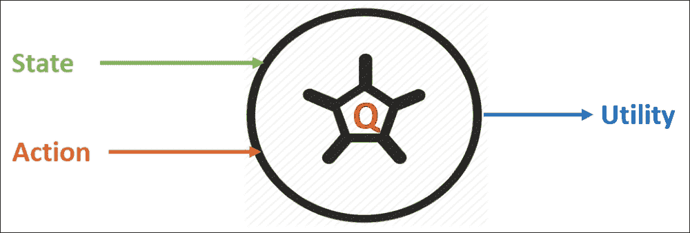
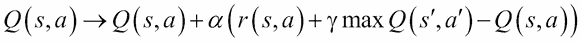
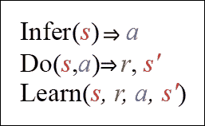

# 第四章：使用强化学习进行预测分析

作为人类，我们从过去的经验中学习。我们并不是偶然变得如此迷人。多年的正面赞美以及负面批评帮助我们塑造了今天的自己。我们通过尝试不同的肌肉动作直到掌握了骑自行车的方法。当你执行某些动作时，某些时候会立刻得到奖励。这就是**强化学习**（**RL**）。

本课程的核心是设计一个由批评和奖励驱动的机器学习系统。我们将看到如何将强化学习算法应用于实际数据集的预测模型。

简而言之，本课程将涵盖以下主题：

+   强化学习

+   用于预测分析的强化学习

+   强化学习中的符号、策略和效用

+   开发多臂赌博机的预测模型

+   开发股票价格预测模型

# 强化学习

从技术角度来看，监督学习和无监督学习分别位于两端，而强化学习则处于中间。它不是监督学习，因为训练数据来自算法在探索与利用之间的选择。它也不是无监督学习，因为算法会从环境中接收反馈。只要你处于一个在某个状态下执行某个动作会产生奖励的情况，你就可以使用强化学习来发现一系列好的动作，以获得最大期望奖励。

强化学习智能体的目标是最大化它在长期内所获得的总奖励。第三个主要子元素是`价值`函数。

奖励决定了状态的即时可取性，而价值则表示了状态的长期可取性，考虑到可能随之而来的状态以及这些状态中的可用奖励。`价值`函数是根据所选策略来指定的。在学习阶段，智能体会尝试采取能够确定具有最高价值的状态的行动，因为这些行动在长期内将获得最佳奖励。

# 预测分析中的强化学习

图 1 显示了一个人做决策以到达目的地。此外，假设你从家到工作一直选择相同的路线。但有一天，你的好奇心占了上风，你决定尝试一条不同的路，希望能缩短通勤时间。这种尝试新路线还是坚持最熟悉路线的困境，就是探索与利用的例子：


图 1：智能体总是试图通过路线到达目的地

强化学习技术正在被应用于许多领域。目前一个正在追求的总体目标是创建一个只需要任务描述的算法。一旦这种性能实现，它将几乎在所有地方得到应用。

# 强化学习中的符号、政策和效用

你可能会注意到，强化学习的术语涉及到将算法人格化，使其在特定情境下采取行动以获得奖励。事实上，算法通常被称为一个代理，它与环境互动。你可以将它看作是一个智能硬件代理，利用传感器感知并通过执行器与环境互动。

因此，强化学习理论被广泛应用于机器人技术并不奇怪。图 2 展示了状态、行动和奖励之间的相互作用。如果你从状态**s1**开始，你可以执行行动**a1**来获得奖励 r（**s1**，**a1**）。行动由箭头表示，状态由圆圈表示：


图 2：一个代理在某个状态上执行一个行动产生奖励

一个机器人通过执行行动在不同的状态之间转换。但它是如何决定采取哪种行动的呢？这完全依赖于使用不同的或具体的策略。

## 政策

在强化学习的术语中，我们称这种策略为策略。强化学习的目标是发现一种有效的策略。解决问题的最常见方法之一是观察每个状态下行动的长期后果。短期后果很容易计算：那就是奖励。虽然执行一个行动会立即获得奖励，但贪婪地选择最佳奖励的行动并不总是一个好主意。

这也是生活中的一课，因为最立即的最佳选择可能并不总是长期来看最令人满意的。最佳的策略被称为最优策略，它通常是强化学习的圣杯，如图 3 所示，显示了在任何状态下的最优行动：


图 3：一个策略定义了在给定状态下要采取的行动

到目前为止，我们已经看到了一个策略的例子，其中代理总是选择立即获得最大奖励的行动，这被称为贪婪策略。另一个简单的策略例子是随机选择一个行动，这被称为随机策略。如果你为强化学习问题设计了一个策略，通常建议你再次检查所学到的策略是否优于随机策略和贪婪策略。

此外，我们还将看到如何开发另一个强健的策略，称为策略梯度，其中神经网络通过调整其权重来学习选择行动的策略，方法是通过梯度下降使用来自环境的反馈。我们将看到，尽管这两种方法都在使用，但策略梯度更直接且更为乐观。

## 效用

长期奖励称为效用。事实证明，如果我们知道在某个状态下执行某个行动的效用，那么强化学习就变得容易解决。例如，要决定采取哪个行动，我们只需选择产生最高效用的行动。然而，揭示这些效用值才是更难解决的部分。执行行动`a`在状态*`s`*下的效用写作一个函数*Q(s, a)*，称为效用函数，它预测期望的即时奖励加上遵循最优策略的奖励，该策略根据状态-行动输入计算，如图 4 所示：



图 4：使用效用函数

大多数强化学习算法归结为三个主要步骤：推理、执行和学习。在第一步中，算法使用到目前为止所获得的知识，从给定的状态(`s`)中选择最佳行动(`a`)。接下来，它执行该行动以获得奖励(`r`)以及下一个状态(*s'*)。然后，它使用新获得的知识*(s, r, a, s')*来改进对世界的理解。然而，这只是计算效用的一种简单方法，你也会同意这一点。

现在，问题是有什么更稳健的方式来计算它吗？这是我的一些看法。我们可以通过递归地考虑未来行动的效用，来计算特定状态-行动对*(s, a)*的效用。你当前行动的效用不仅受到即时奖励的影响，还受到下一个最佳行动的影响，如下公式所示：


在之前的公式中，*s'*表示下一个状态，*a'*表示下一个行动。采取行动`a`在状态`s`中的奖励表示为*r(s, a)*。这里，*γ*是一个超参数，你可以选择，称为折扣因子。如果*γ*为`0`，那么代理将选择最大化即时奖励的行动。更高的*γ*值会让代理更重视考虑长期后果。

在实践中，我们需要考虑更多的超参数。例如，如果预期吸尘机器人能够快速学习解决任务，但不一定是最优的，我们可能希望设置一个更快的学习率。相反，如果允许机器人有更多时间来探索和利用，我们可能会降低学习率。我们将学习率称为**α**，并按以下方式修改我们的效用函数（注意，当*α = 1*时，这两个公式是相同的）：



总结来说，如果我们知道这个*Q(s, a)*函数，就可以解决强化学习问题。这里出现了一个叫做神经网络的机器学习策略，神经网络是一种通过足够的训练数据来逼近函数的方式。此外，TensorFlow 是处理神经网络的完美工具，因为它包含了许多必要的算法。

在接下来的两个部分中，我们将看到两个使用 TensorFlow 实现的示例。第一个示例是开发一个多臂强盗智能体的简单方法，用于预测模型。接着，第二个示例使用神经网络实现来进行股票价格预测，稍微复杂一些。

# 开发多臂强盗的预测模型

最简单的强化学习问题之一被称为 n 臂强盗问题。问题在于，有 n 个老虎机，但每个老虎机的固定奖励概率不同。目标是通过总是选择奖励最好的机器来最大化利润。

如前所述，我们还将看到如何使用策略梯度来产生显式的输出。对于我们的多臂强盗问题，我们不需要在任何特定状态上正规化这些输出。为了简单起见，我们可以设计我们的网络，使其仅由一组权重组成，这些权重对应于强盗中每个可能的臂。然后，我们将表示智能体认为拉取每个臂以获得最大利润的好坏。一个简单的方法是将这些权重初始化为 1，这样智能体会对每个臂的潜在奖励持乐观态度。

为了更新网络，我们可以尝试选择一个具有贪婪策略的臂，这在前面已经讨论过。我们的策略是，智能体每次执行一个动作后，都会收到 `1` 或 `-1` 的奖励。我知道这不是一个现实的设想，但大多数时候，智能体会选择一个随机的动作，对应于最大的期望值。

我们将逐步开发一个简单但有效的强盗智能体，以解决多臂强盗问题。最初，不会有状态，即我们将拥有一个无状态的智能体。然后，我们将看到，使用无状态的强盗智能体来解决复杂问题会出现偏差，以至于我们无法在实际生活中使用它。

然后，我们将通过添加或将样本强盗转换为上下文强盗来增加智能体的复杂度。上下文强盗将成为一个有状态的智能体，从而可以更高效地解决我们的预测问题。最后，我们将通过将文本强盗转换为完整的强化学习智能体，进一步增加智能体的复杂度，直到部署：

1.  加载所需的库。

    加载所需的库和所需的包/模块：

    ```py
    import tensorflow as tf
    import tensorflow.contrib.slim as slim
    import numpy as np
    ```

1.  定义强盗。

    在这个示例中，我使用的是四臂强盗。`getBandit` 函数从正态分布中生成一个随机数，均值为 0。Bandit 数字越低，获得正奖励的概率越大。如前所述，这只是一种简单但贪婪的方式来训练智能体，使其学会选择一个不仅能产生正奖励，而且能产生最大奖励的强盗。这里，我列出了强盗的列表，其中 Bandit 4 最常提供正奖励：

    ```py
    def getBandit(bandit):
        ''
        This function creates the reward to the bandits on the basis of randomly generated numbers. It then returns either a positive or negative reward.
        '' 
        random_number = np.random.randn(1)
        if random_number > bandit:   
            return 1
        else:
            return -1
    ```

1.  为强盗问题开发一个智能体。

    以下代码创建了一个非常简单的神经代理，它包含一个为每个`bandits`设置的值。每个值根据`bandits`的回报值估算为 1。我们使用策略梯度方法通过将所选行动的值朝着获得的奖励方向更新代理。首先，我们需要重置图形，如下所示：

    ```py
    tf.reset_default_graph()
    ```

    然后，接下来的两行代码实际完成选择操作，建立网络的前馈部分：

    ```py
    weight_op = tf.Variable(tf.ones([num_bandits]))
    action_op = tf.argmax(weight_op,0)
    ```

    现在，在开始训练过程之前，我们需要启动训练过程本身。因为我们已经知道奖励，现在是时候将奖励输入并选择网络中的行动来计算损失，并用它来更新网络：

    ```py
    reward_holder = tf.placeholder(shape=[1],dtype=tf.float32)
    action_holder = tf.placeholder(shape=[1],dtype=tf.int32)
    responsible_weight = tf.slice(weight_op,action_holder,[1])
    ```

    我们需要定义目标函数，即损失函数：

    ```py
    loss = -(tf.log(responsible_weight)*reward_holder)
    ```

    然后让我们将训练过程放慢，以便更全面地利用学习率：

    ```py
    LR = 0.001
    ```

    然后我们使用梯度下降`optimizer`并实例化`training`操作：

    ```py
    optimizer = tf.train.GradientDescentOptimizer(learning_rate=LR)
    training_op = optimizer.minimize(loss)
    ```

    现在，是时候定义训练参数了，比如训练代理的总迭代次数、`reward`函数和一个`random`行动。这里的奖励将`bandits`的计分板设置为`0`，通过选择随机行动，我们设置采取随机行动的概率：

    ```py
    total_episodes = 10000
    total_reward = np.zeros(num_bandits) 
    chance_of_random_action = 0.1 
    ```

    最后，我们初始化全局变量：

    ```py
    init_op = tf.global_variables_initializer() 
    ```

1.  训练代理。

    我们需要通过采取行动与环境互动并获得奖励来训练代理。我们从创建一个 TensorFlow 会话并启动 TensorFlow 图开始。接着，迭代训练过程直到达到总迭代次数。然后，我们选择一个随机行为或从网络中选择一个行为。接下来，我们计算选择一个`bandits`后的奖励。然后，我们使训练过程保持一致并更新网络。最后，我们更新计分板：

    ```py
    with tf.Session() as sess:
        sess.run(init_op)
        i = 0
        while i < total_episodes:        
            if np.random.rand(1) < chance_of_random_action:
                action = np.random.randint(num_bandits)
            else:
                action = sess.run(action_op)
                    reward = getBandit(bandits[action])         
                _,resp,ww = sess.run([training_op,responsible_weight,weight_op], feed_dict={reward_holder:[reward],action_holder:[action]})
            total_reward[action] += reward
            if i % 50 == 0:
                print("Running reward for all the " + str(num_bandits) + " bandits: " + str(total_reward))
            i+=1
    ```

    现在让我们按如下方式评估上述模型：

    ```py
    print("The agent thinks bandit " + str(np.argmax(ww)+1) + " would be the most efficient one.")
    if np.argmax(ww) == np.argmax(-np.array(bandits)):
        print(" and it was right at the end!")
    else:
        print(" and it was wrong at the end!")
    >>>
    ```

    第一次迭代生成以下输出：

    ```py
    Running reward for all the 4 bandits: [-1\. 0\. 0\. 0.]
    Running reward for all the 4 bandits: [ -1\. -2\. 14\. 0.]
    …
    Running reward for all the 4 bandits: [ -15\. -7\. 340\. 21.]
    Running reward for all the 4 bandits: [ -15\. -10\. 364\. 22.]
    The agent thinks Bandit 3 would be the most efficient one and it was wrong at the end!
    ```

    第二次迭代生成一个不同的结果，如下所示：

    ```py
    Running reward for all the 4 bandits: [ 1\. 0\. 0\. 0.]
    Running reward for all the 4 bandits: [ -1\. 11\. -3\. 0.]
    Running reward for all the 4 bandits: [ -2\. 1\. -2\. 20.]
    …
    Running reward for all the 4 bandits: [ -7\. -2\. 8\. 762.]
    Running reward for all the 4 bandits: [ -8\. -3\. 8\. 806.]
    The agent thinks Bandit 4 would be the most efficient one and it was right at the end!
    ```

    现在，如果你看到这个代理是一个无状态的代理，它随机预测选择哪个 bandits。在这种情况下，没有环境状态，代理必须简单地学习选择最好的行动。为了解决这个问题，我们可以考虑开发上下文 bandits。

    使用上下文 bandits，我们可以引入并合理利用状态。状态由代理可以用来做出更智能、更有信息的行动的环境说明组成。关键是，与其使用单个 bandit，我们可以将多个 bandits 串联在一起。那么，状态的作用是什么呢？环境的状态告诉代理从可用列表中选择一个 bandit。另一方面，代理的目标是学习对于任意数量的 bandits，最好的行动。

    这样，代理会遇到一个问题，因为每个强盗对每个手臂的奖励概率可能不同，而代理需要学会如何在环境状态下执行动作。否则，代理无法实现最大可能的奖励：

    

    图 5：无状态与上下文强盗

    如前所述，为了解决这个问题，我们可以构建一个单层神经网络，使其能够接受状态并输出动作。现在，类似于随机强盗，我们也可以使用策略梯度更新方法，使得网络更新更容易采取动作以最大化奖励。这种简化的强化学习问题表示方式被称为上下文强盗。

1.  开发上下文强盗。

    本例基于 Arthur Juliani 发表在 [`medium.com/`](https://medium.com/) 的《简单强化学习与 TensorFlow 第 1.5 部分：上下文强盗》进行了改编和扩展。

    首先，让我们定义我们的上下文强盗。在这个例子中，我们将看到如何使用三个四臂强盗，也就是说，每个强盗有四个手臂可以拉动以执行动作。由于每个强盗都是上下文相关的并且有一个状态，因此它们的手臂有不同的成功概率。这需要执行不同的动作来获得最佳的预测结果。

    在这里，我们定义了一个名为 `contextual_bandit()` 的类，其中包含一个构造函数和两个用户定义的函数：`getBandit()` 和 `pullArm()`。`getBandit()` 函数从均值为 `0` 的正态分布中生成一个随机数。Bandit 数字越低，返回正奖励的可能性越大。我们希望我们的代理学会选择最常返回正奖励的强盗手臂。当然，这取决于呈现的强盗。该构造函数列出了我们所有的强盗。我们假设当前状态为武装 `4`、`2`、`3` 和 `1`，这些是最优的选择。

    此外，如果你仔细观察，大多数强化学习算法遵循类似的实现模式。因此，创建一个包含相关方法的类是个好主意，以便以后引用，例如抽象类或接口：

    ```py
    class contextualBandit():
        def __init__(self):
            self.state = 0        
            self.bandits = np.array([[0.2,0,-0.0,-5], [0.1,-5,1,0.25], [0.3,0.4,-5,0.5], [-5,5,5,5]])
            self.num_bandits = self.bandits.shape[0]
            self.num_actions = self.bandits.shape[1]
            def getBandit(self):        
            '''
            This function returns a random state for each episode.
            '''
            self.state = np.random.randint(0, len(self.bandits)) 
            return self.state
            def pullArm(self,action):        
            '''
            This function creates the reward to the bandits on the basis of randomly generated numbers. It then returns either a positive or negative reward that is action
            ''' 
            bandit = self.bandits[self.state, action]
            result = np.random.randn(1)
            if result > bandit:
                return 1
            else:
                return -1
    ```

1.  开发基于策略的代理。

    以下类 `ContextualAgent` 帮助开发我们的简单但非常有效的神经和上下文代理。我们提供当前状态作为输入，代理会根据环境的状态返回一个动作。这是将无状态代理转变为有状态代理并能够解决完整强化学习问题的最重要一步。

    在这里，我尝试开发一个代理，使其在给定强盗的情况下使用一组权重来选择特定的手臂。使用策略梯度方法通过将特定动作的值朝最大奖励的方向移动来更新代理：

    ```py
    class ContextualAgent():
        def __init__(self, lr, s_size,a_size):
            '''
            This function establishes the feed-forward part of the network. The agent takes a state and produces an action -that is. contextual agent
            ''' 
            self.state_in= tf.placeholder(shape=[1], dtype=tf.int32)
            state_in_OH = slim.one_hot_encoding(self.state_in, s_size)
            output = slim.fully_connected(state_in_OH, a_size,biases_initializer=None, activation_fn=tf.nn.sigmoid, weights_initializer=tf.ones_initializer())
            self.output = tf.reshape(output,[-1])
            self.chosen_action = tf.argmax(self.output,0)
            self.reward_holder = tf.placeholder(shape=[1], dtype=tf.float32)
            self.action_holder = tf.placeholder(shape=[1], dtype=tf.int32)
            self.responsible_weight = tf.slice(self.output, self.action_holder,[1])
            self.loss = -(tf.log(self.responsible_weight)*self.reward_holder)
            optimizer = tf.train.GradientDescentOptimizer(learning_rate=lr)
            self.update = optimizer.minimize(self.loss)
    ```

1.  训练上下文强盗代理。

    首先，我们清除默认的 TensorFlow 图：

    ```py
    tf.reset_default_graph()
    ```

    然后，我们定义一些参数，供训练代理时使用：

    ```py
    lrarning_rate = 0.001 # learning rate 
    chance_of_random_action = 0.1 # Chance of a random action.
    max_iteration = 10000 #Max iteration to train the agent.
    ```

    现在，在开始训练之前，我们需要加载强盗，并接着加载我们的代理：

    ```py
    contextualBandit = contextualBandit() #Load the bandits.
    contextualAgent = ContextualAgent(lr=lrarning_rate, s_size=contextualBandit.num_bandits, a_size=contextualBandit.num_actions) #Load the agent.
    ```

    现在，为了最大化目标函数对总回报的影响，我们使用`weights`来评估网络。我们还将`bandits`的记分板初始设置为`0`：

    ```py
    weights = tf.trainable_variables()[0] 
    total_reward = np.zeros([contextualBandit.num_bandits,contextualBandit.num_actions])
    ```

    然后，我们使用`global_variables_initializer()`函数初始化所有变量：

    ```py
    init_op = tf.global_variables_initializer()
    ```

    最后，我们将开始训练。这个训练与我们在前面示例中进行的随机训练类似。然而，在这里，训练的主要目标是计算每个强盗的平均回报，以便我们稍后可以通过利用它们来评估代理的预测准确性：

    ```py
    with tf.Session() as sess:
        sess.run(init_op)
        i = 0
        while i < max_iteration:
            s = contextualBandit.getBandit() #Get a state from the environment.
            #Choose a random action or one from our network.
            if np.random.rand(1) < chance_of_random_action:
                action = np.random.randint(contextualBandit.num_actions)
            else:
                action = sess.run(contextualAgent.chosen_action,feed_dict={contextualAgent.state_in:[s]})
            reward = contextualBandit.pullArm(action) #Get our reward for taking an action given a bandit.
            #Update the network.
            feed_dict={contextualAgent.reward_holder:[reward],contextualAgent.action_
    holder:[action],contextualAgent.state_in:[s]}
            _,ww = sess.run([contextualAgent.update,weights], feed_dict=feed_dict)        
            #Update our running tally of scores.
            total_reward[s,action] += reward
            if i % 500 == 0:
                print("Mean reward for each of the " + str(contextualBandit.num_bandits) + " bandits: " + str(np.mean(total_reward,axis=1)))
            i+=1
    >>>
    Mean reward for each of the 4 bandits: [ 0\. 0\. -0.25 0\. ]
    Mean reward for each of the 4 bandits: [ 25.75 28.25 25.5 28.75]
    …
    Mean reward for each of the 4 bandits: [ 488.25 489\. 473.5 440.5 ]
    Mean reward for each of the 4 bandits: [ 518.75 520\. 499.25 465.25]
    Mean reward for each of the 4 bandits: [ 546.5 547.75 525.25 490.75]
    ```

1.  评估代理。

    现在，我们已经有了所有四个强盗的平均回报，是时候利用它们来预测一些有趣的事情，也就是哪个强盗的臂将最大化回报。首先，我们可以初始化一些变量来估计预测准确性：

    ```py
    right_flag = 0
    wrong_flag = 0
    ```

    然后让我们开始评估代理的预测性能：

    ```py
    for a in range(contextualBandit.num_bandits):
        print("The agent thinks action " + str(np.argmax(ww[a])+1) + " for bandit " + str(a+1) + " would be the most efficient one.")
        if np.argmax(ww[a]) == np.argmin(contextualBandit.bandits[a]):
            right_flag += 1
            print(" and it was right at the end!")
        else:	
            print(" and it was wrong at the end!")
            wrong_flag += 1
    >>>
    The agent thinks action 4 for Bandit 1 would be the most efficient one and it was right at the end!
    The agent thinks action 2 for Bandit 2 would be the most efficient one and it was right at the end!
    The agent thinks action 3 for Bandit 3 would be the most efficient 
    ne and it was right at the end!
    The agent thinks action 1 for Bandit 4 would be the most efficient one and it was right at the end!
    ```

    如你所见，所有的预测都是正确的预测。现在我们可以按如下方式计算准确率：

    ```py
    prediction_accuracy = (right_flag/right_flag+wrong_flag)
    print("Prediction accuracy (%):", prediction_accuracy * 100)
    >>>
    Prediction accuracy (%): 100.0
    ```

太棒了，做得好！我们通过一个上下文代理成功设计并开发了一个更强大的强盗代理，能够准确预测哪个臂，即哪个行动的强盗能够帮助实现最大回报，也就是利润。

在接下来的章节中，我们将看到另一个非常有趣但又非常实用的股票价格预测应用，我们将展示如何从强化学习的框架中开发一个基于策略的 Q 学习代理。

# 开发股票价格预测模型

一个新兴的应用领域是股市交易，其中交易员像一个强化学习代理，因为买卖（即行动）特定股票会通过产生利润或亏损来改变交易员的状态，也就是回报。下图展示了 2017 年 7 月 15 日一些最活跃的股票（例如）：


图 6: [`finance.yahoo.com/`](https://finance.yahoo.com/)

现在，我们希望开发一个智能代理，预测股票价格，以便交易员能够以低价买入并以高价卖出。然而，这种预测并不容易，它依赖于多个参数，比如当前的股票数量、最近的历史价格，以及最重要的，买卖时可用的投资预算。

在这种情况下，状态是一个包含当前预算、当前股票数量和最近的股价历史（最近 200 个股价）信息的向量。所以每个状态是一个 202 维的向量。为了简化，股市代理需要执行的动作只有三种：买入、卖出和持有。

所以，我们已经有了状态和动作，那还缺什么？策略，对吧？是的，我们应该有一个好的策略，这样基于该策略，才能在某个状态下执行动作。一个简单的策略可以包含以下规则：

+   在当前股价（即状态）下购买（即动作）股票会减少预算，同时增加当前股票的数量

+   卖出股票则按当前股价将股票换成现金

+   持有既不减少预算也不增加股票数量，执行该动作只是等待一个特定的时间段，并且不会获得任何奖励

要查找股票价格，我们可以使用 Python 中的 `yahoo_finance` 库。你可能会遇到一个常见的警告：“**HTTPError: HTTP Error 400: Bad Request**”。但请继续尝试。

现在，让我们尝试熟悉这个模块：

```py
>>> from yahoo_finance import Share
>>> msoft = Share('MSFT')
>>> print(msoft.get_open())
72.24=
>>> print(msoft.get_price())
72.78
>>> print(msoft.get_trade_datetime())
2017-07-14 20:00:00 UTC+0000
>>>
```

所以截至 2017 年 7 月 14 日，微软公司的股价从 72.24 上涨至 72.78，这意味着大约 7.5%的涨幅。然而，这一小段仅一天的数据并未给我们任何显著的信息。但至少我们了解了这只特定股票或工具的当前状态。

要安装 `yahoo_finance`，请执行以下命令：

```py
$ sudo pip3 install yahoo_finance 

```

现在，值得查看一下历史数据。以下函数帮助我们获取微软公司的历史数据：

```py
def get_prices(share_symbol, start_date, end_date, cache_filename):
    try:
        stock_prices = np.load(cache_filename)
    except IOError:
        share = Share(share_symbol)
        stock_hist = share.get_historical(start_date, end_date)
        stock_prices = [stock_price['Open'] for stock_price in stock_hist]
        np.save(cache_filename, stock_prices)
    return stock_prices
```

`get_prices()` 方法接受几个参数，如股市中某个工具的股票符号、开始日期和结束日期。你还可以指定并缓存历史数据，以避免重复下载。一旦下载了数据，就可以绘制图表以获得一些洞察。

以下函数帮助我们绘制价格：

```py
def plot_prices(prices):
    plt.title('Opening stock prices')
    plt.xlabel('day')
    plt.ylabel('price ($)')
    plt.plot(prices)
    plt.savefig('prices.png')
```

现在我们可以通过指定实际参数来调用这两个函数，如下所示：

```py
if __name__ == '__main__':
    prices = get_prices('MSFT', '2000-07-01', '2017-07-01', 'historical_stock_prices.npy')
    plot_prices(prices)
```

在这里，我选择了 17 年的广泛历史数据，以获得更好的洞察。现在，让我们来看看这些数据的输出：


图 7：微软公司 2000 年至 2017 年的历史股价数据

目标是学习一种策略，从股票市场交易中获得最大净资产。那么，最终交易代理会实现什么目标呢？图 8 给了你一些线索：


图 8：一些洞察和线索，显示根据当前价格，最多可以获得$160 的利润

好吧，图 8 显示，如果代理以$20 购买某个工具，并在峰值价格如$180 时卖出，它将能够获得$160 的奖励，也就是利润。

所以，使用强化学习算法实现这样一个智能代理是个不错的主意吗？

从之前的例子中，我们已经看到，要实现一个成功的强化学习代理，我们需要定义两个操作，分别如下：

+   如何选择一个动作

+   如何提高效用 Q 函数

更具体来说，给定一个状态，决策策略将计算出下一步的动作。另一方面，通过从执行某个动作中获得的新经验来改进 Q 函数。

此外，大多数强化学习算法归结为三个主要步骤：推理、执行和学习。在第一步中，算法根据当前状态(`s`)使用迄今为止所获得的知识选择最佳行动(`a`)。接下来，它执行该行动以找到奖励(`r`)以及下一个状态(*s'*)。

然后，它使用新获得的知识*(s, r, a, s')*来改善对世界的理解，如下图所示：



图 9：实现智能股票价格预测代理的步骤

现在，让我们开始实现决策策略，基于该策略采取购买、卖出或持有股票的行动。同样，我们将以增量方式进行。首先，我们将创建一个随机决策策略并评估代理的性能。

但在此之前，让我们创建一个抽象类，以便我们可以相应地实现它：

```py
class DecisionPolicy:
    def select_action(self, current_state, step):
        pass
    def update_q(self, state, action, reward, next_state):
        pass
```

接下来的任务是从这个父类继承，实施一个随机决策策略：

```py
class RandomDecisionPolicy(DecisionPolicy):
    def __init__(self, actions):
        self.actions = actions
    def select_action(self, current_state, step):
        action = self.actions[random.randint(0, len(self.actions) - 1)]
        return action
```

上一个类什么也没做，只定义了一个名为`select_action()`的函数，它将随机选择一个行动，甚至不查看状态。

现在，如果你想使用这个策略，可以将其应用于现实世界的股价数据。此功能在每个时间间隔处理探索与开发，正如下面的图所示，形成状态 S1、S2 和 S3。该策略建议采取某种行动，我们可以选择执行该行动或随机探索另一个行动。随着我们为执行某个行动而获得奖励，我们可以随着时间推移更新策略函数：


图 10：一个滚动窗口以某种大小在股票价格上迭代

太棒了，现在我们有了策略，接下来就是利用这个策略做决策并返回性能指标。现在，假设一个实际场景——假设你在外汇或 ForTrade 平台上进行交易，那么你也需要计算投资组合和当前的利润或损失，即奖励。通常，这些可以按以下方式计算：

```py
portfolio = budget + number of stocks * share value
reward = new_portfolio - current_portfolio
```

一开始，我们可以初始化依赖于计算投资组合净资产的值，其中状态是一个`hist+2`维向量。在我们的例子中，它将是 202 维的。然后我们定义调节范围的范围，直到：

用户查询所选价格的长度 - （历史 + 1），由于我们从 0 开始，因此应该减去 1。接下来，我们应该计算投资组合的更新值，并从投资组合中计算奖励值，即利润。

此外，我们已经定义了随机策略，因此可以从当前策略中选择一个动作。然后，我们在每次迭代中根据动作更新投资组合的值，并可以计算出采取该动作后的新投资组合值。接着，我们需要计算在某个状态下采取行动所获得的奖励。然而，我们还需要在经历新动作后更新策略。最后，我们计算最终的投资组合价值：

```py
def run_simulation(policy, initial_budget, initial_num_stocks, prices, hist, debug=False):
    budget = initial_budget
    num_stocks = initial_num_stocks
    share_value = 0
    transitions = list()
    for i in range(len(prices) - hist - 1):
        if i % 100 == 0:
            print('progress {:.2f}%'.format(float(100*i) / (len(prices) - hist - 1)))
        current_state = np.asmatrix(np.hstack((prices[i:i+hist], budget, num_stocks)))
        current_portfolio = budget + num_stocks * share_value
        action = policy.select_action(current_state, i)
        share_value = float(prices[i + hist + 1])
        if action == 'Buy' and budget >= share_value:
            budget -= share_value
            num_stocks += 1
        elif action == 'Sell' and num_stocks > 0:
            budget += share_value
            num_stocks -= 1
        else:
            action = 'Hold'
        new_portfolio = budget + num_stocks * share_value
        reward = new_portfolio - current_portfolio
        next_state = np.asmatrix(np.hstack((prices[i+1:i+hist+1], budget, num_stocks)))
        transitions.append((current_state, action, reward, next_state))
        policy.update_q(current_state, action, reward, next_state)
    portfolio = budget + num_stocks * share_value
    if debug:
        print('${}\t{} shares'.format(budget, num_stocks))
    return portfolio
```

之前的仿真预测出了一个相对不错的结果；然而，它也经常产生随机结果。因此，为了获得更可靠的成功度量，让我们多次运行仿真并对结果进行平均。这样做可能需要一段时间，比如 100 次，但结果会更可靠：

```py
def run_simulations(policy, budget, num_stocks, prices, hist):
    num_tries = 100
    final_portfolios = list()
    for i in range(num_tries):
        final_portfolio = run_simulation(policy, budget, num_stocks, prices, hist)
        final_portfolios.append(final_portfolio)
    avg, std = np.mean(final_portfolios), np.std(final_portfolios)
    return avg, std
```

之前的函数通过迭代先前的仿真函数 100 次来计算平均投资组合和标准差。现在，是时候评估之前的代理了。正如之前所说，股票交易代理将采取三种可能的行动，如买入、卖出和持有。我们有一个 202 维的状态向量和仅 $`1000` 的预算。接下来，评估过程如下：

```py
actions = ['Buy', 'Sell', 'Hold']
    hist = 200
    policy = RandomDecisionPolicy(actions)
    budget = 1000.0
    num_stocks = 0
    avg,std=run_simulations(policy,budget,num_stocks,prices, hist)
    print(avg, std)
>>>
1512.87102405 682.427384814
```

第一个是均值，第二个是最终投资组合的标准差。所以，我们的股票预测代理预测作为交易者的你/我们可以赚取大约 $513。不错。然而，问题在于，由于我们使用了随机决策策略，结果并不是很可靠。更具体地说，第二次执行肯定会产生不同的结果：

```py
>>> 
1518.12039077 603.15350649 
```

因此，我们应该开发一个更稳健的决策策略。这里就需要使用基于神经网络的 QLearning 来进行决策策略的改进。接下来，我们将看到一个新的超参数 epsilon，它可以防止在重复应用相同的动作时解决方案陷入困境。它的值越小，随机探索新动作的频率就越高：


图 11：输入是具有三个输出的状态空间向量，每个输出对应一个 Q 值

接下来，我将编写一个包含其功能的类：

+   `Constructor`：该函数帮助从 Q 函数设置超参数。它还帮助设置神经网络中隐藏节点的数量。一旦我们有了这两个参数，它有助于定义输入和输出张量。然后，它定义了神经网络的结构。此外，它定义了计算效用的操作。接着，它使用优化器来更新模型参数，以最小化损失，并设置会话和初始化变量。

+   `select_action`：该函数以 1-epsilon 的概率利用最佳选择。

+   `update_q`：该函数通过更新模型参数来更新 Q 函数。

    ```py
    class QLearningDecisionPolicy(DecisionPolicy):
        def __init__(self, actions, input_dim):
            self.epsilon = 0.9
            self.gamma = 0.001
            self.actions = actions
            output_dim = len(actions)
            h1_dim = 200
            self.x = tf.placeholder(tf.float32, [None, input_dim])
            self.y = tf.placeholder(tf.float32, [output_dim])
            W1 = tf.Variable(tf.random_normal([input_dim, h1_dim]))
            b1 = tf.Variable(tf.constant(0.1, shape=[h1_dim]))
            h1 = tf.nn.relu(tf.matmul(self.x, W1) + b1)
            W2 = tf.Variable(tf.random_normal([h1_dim, output_dim]))
            b2 = tf.Variable(tf.constant(0.1, shape=[output_dim]))
            self.q = tf.nn.relu(tf.matmul(h1, W2) + b2)
            loss = tf.square(self.y - self.q)
            self.train_op = tf.train.GradientDescentOptimizer(0.01).minimize(loss)
            self.sess = tf.Session()
            self.sess.run(tf.initialize_all_variables())
        def select_action(self, current_state, step):
            threshold = min(self.epsilon, step / 1000.)
            if random.random() < threshold:
                # Exploit best option with probability epsilon
                action_q_vals = self.sess.run(self.q, feed_dict={self.x: current_state})
                action_idx = np.argmax(action_q_vals)  
                action = self.actions[action_idx]
            else:
                # Random option with probability 1 - epsilon
                action = self.actions[random.randint(0, len(self.actions) - 1)]
            return action
        def update_q(self, state, action, reward, next_state):
            action_q_vals = self.sess.run(self.q, feed_dict={self.x: state})
            next_action_q_vals = self.sess.run(self.q, feed_dict={self.x: next_state})
            next_action_idx = np.argmax(next_action_q_vals)
            action_q_vals[0, next_action_idx] = reward + self.gamma * next_action_q_vals[0, next_action_idx]
    ```

请参考以下代码：

```py
        action_q_vals = np.squeeze(np.asarray(action_q_vals))
        self.sess.run(self.train_op, feed_dict={self.x: state, self.y: action_q_vals})
```

# 总结

在本课中，我们讨论了一个叫做强化学习的机器学习领域，使用了 TensorFlow。我们从理论和实践的角度都进行了讨论。强化学习是解决当一个问题可以通过状态来框定，而这些状态因代理采取的行动而变化，并且这些行动会带来奖励的自然工具。实现该算法有三个主要步骤：从当前状态推断出最佳行动，执行该行动，并从结果中学习。

我们已经看到了如何通过了解`action`、`state`、`policy`和`utility`函数来实现 RL 代理进行预测。我们已经看到了如何使用随机策略以及基于神经网络的 QLearning 策略来开发基于 RL 的代理。QLearning 是一种解决强化学习问题的方法，它通过开发一个算法来近似效用函数（`Q`-函数）。一旦找到足够好的近似值，就可以开始推断从每个状态应该采取的最佳行动。特别地，我们已经看到了两个逐步的例子，展示了我们如何开发一个多臂赌博机代理和一个股价预测代理，并且取得了很好的准确性。但请注意，实际的股市要复杂得多，本课中使用的技术适用于许多情况。

这大致是我们与 TensorFlow 的小旅程的结束。我希望你有一个顺利的旅程，并且学到了很多关于 TensorFlow 的知识。

祝你未来的项目一切顺利，继续学习和探索！

# 评估

1.  在强化学习术语中，我们称 ______ 为策略。

1.  判断以下陈述是对还是错：强化学习的目标是发现一种好的策略。解决这个问题的最常见方法之一是通过观察在每个状态下行动的长期后果。

1.  我们需要通过让代理采取行动并从环境中接收 ______ 来训练代理。

1.  判断以下陈述是对还是错：使用上下文赌博者，我们不能引入并正确利用状态。

1.  要查找股票价格，我们可以在 Python 中使用 _______ 库。

    1.  get_prices

    1.  plot_prices

    1.  yahoo_finance

    1.  finance_yahoo
