# 第五章：使用 ChatGPT 和 Copilot 创建流程和应用程序

在上一章中，我们通过发送提示并得到一些回应，在 ChatGPT 的水中试水。

在本章中，我们将更深入地探讨，了解一些从 AI 和自动化中获得帮助的有趣方法。也许你想要自动化比内置的 Power Automate 模板更复杂的事情，或者你不确定需要哪些连接器和操作。也许你以前从未构建过 Power App，不知道从何开始。

这些都是 AI 辅助自动化的绝佳用例。

在本章中，我们将探讨一些用例，并使用 AI 辅助来帮助构建过程。

# 与 Power Automate 一起工作

Power Automate，作为 Power 平台中的业务和流程自动化工具部分，可以简单到你想（或需要）的任何程度。从复制文件或发送电子邮件这样的简单流程，到将行插入数据库的更复杂流程，Power Automate 几乎可以帮助任何流程。

在下一节中，我们将探讨 ChatGPT 可以提供什么样的帮助。

## 使用 ChatGPT 创建流程

当涉及到 Power Automate 时，ChatGPT 可以提供一些很好的指导，告诉你如何开始。

想象一下，你在一个传说中的制造集团 Contoso 的市场部门工作。你希望监控 Twitter（或现在称为 X）上提及 Contoso 的时刻。

你可以向 ChatGPT 提出类似的问题：

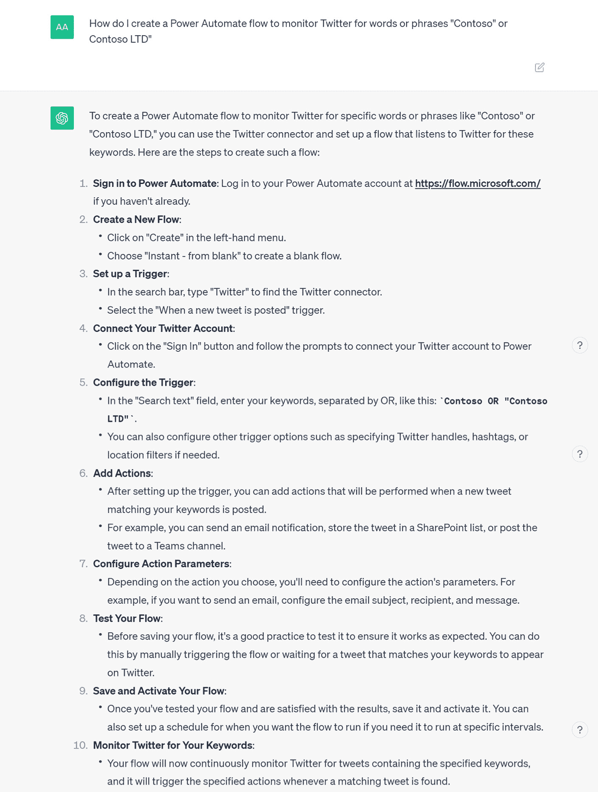

图 4.1 – 向 ChatGPT 询问如何创建流程

如你所见，ChatGPT 可以提供相当直接的指导，告诉你如何做某事。

使用 ChatGPT 创建流程的限制

如果你想得到更多，比如一个可以导入的完整流程呢？

到目前为止，ChatGPT 无法以任何有意义的方式打包流程，或提供可以导入的下载。当你从 Power Automate 界面导出流程时，生成的 ZIP 文件是一组描述流程触发器和操作的 JSON 文件，以及连接定义和一个提供有关文件和流程本身元数据的清单文件。

相反，它可以在你在 Power Automate 中创建它或使用一些 Power Platform 命令行界面工具之后，提供几种不同的导出指令。

你也可能注意到，如果你的指令没有很好地定义或不完整，ChatGPT 可能会提供一些建议。在阅读*图 4**.1 中的样本指令时，注意*步骤 6*有关于操作的提示。提示没有提供执行操作的指导——而操作是创建流程的重要组成部分。

在阅读了 ChatGPT 的指令后，你可能决定你喜欢将帖子发布到 Teams 频道的建议。你甚至可以回过头来询问 ChatGPT 如何将内容添加到你的流程中！

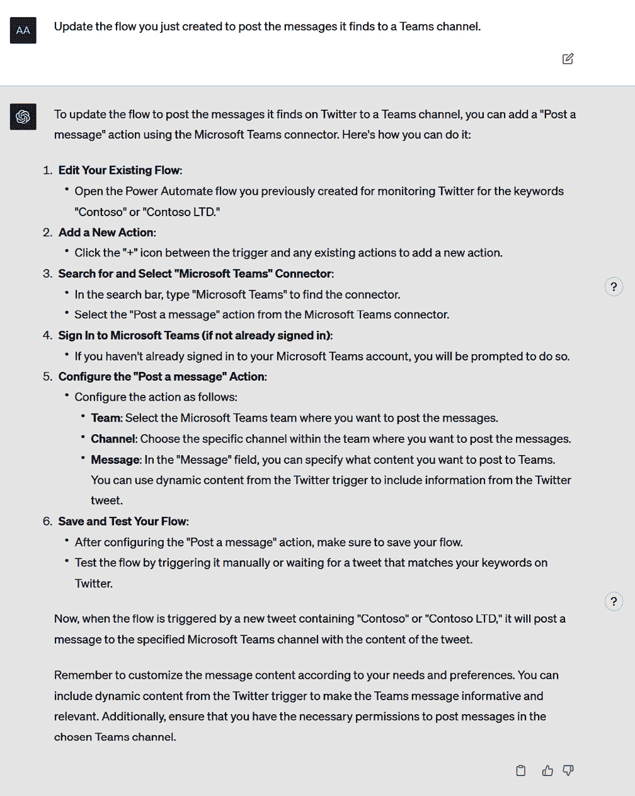

图 4.2 – 使用 ChatGPT 更新流程

你会注意到它并不完美——ChatGPT 假设你已经用某种东西填写了第 6 步的空白。幸运的是，很容易看到差距并在飞行中做出调整：你只需合并两组指令，从第一个提示的第一步开始，然后从第二个提示的第 2 步继续。

使用 ChatGPT 精炼输出

这个精炼输出的过程是艺术和科学的结合。在某些情况下，你可能希望向 ChatGPT 提供一些输出示例以供模仿或特定的数据集以供工作。

微调模型是一项大量工作，需要大量的训练数据和时间，并导致针对特定场景的更多特定性。虽然这在某些情况下可能是所希望的，但在通用人工智能中并不非常实用。在这种情况下，你可以使用一种称为**射击学习**的技术。

射击学习的概念相当简单：

**零次学习**：这种类型的学习要求模型在没有先前的知识或训练示例的情况下执行任务。这是大多数人使用 ChatGPT（以及我们在前面的示例中使用的）的方式。

**单次学习**：在这种类型的示例中，你可以向模型提供一些上下文数据来展示如何解释数据。例如，当与基于图像的人工智能模型一起工作时，你可能会上传一些不同品种的猫和狗的标记图像。然后，你可以向模型展示一张新图像并询问它，“猫还是狗？”

**少次学习**：这种学习类型将单次学习的概念进一步扩展，允许你输入几个示例。你可以输入四到五个玛雅·安吉洛、巴勃罗·聂鲁达或威廉·莎士比亚的引文，然后要求模型生成一个听起来像这些作者之一的引文。

可能你会将这项工作交给其他人，他们可能没有你那么强的直觉，或者对 Power Automate 的熟悉程度不同，你希望提供更简洁的输出。你可以尝试用更详细的语言重述你的提示，并要求 ChatGPT 提供一个完整的解决方案，就像我在*图 4.3*中做的那样：

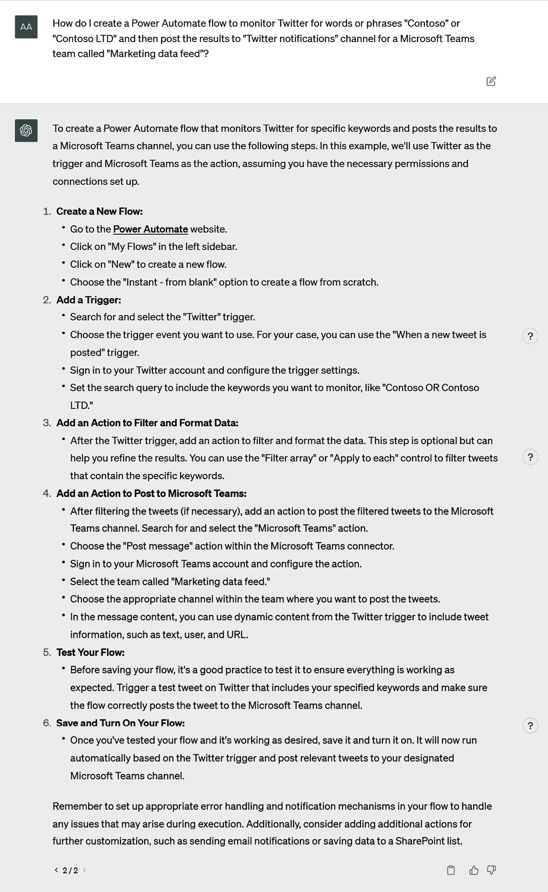

图 4.3 – 向 ChatGPT 求一个完整的 Power Automate 解决方案

虽然 ChatGPT 的低端订阅不能直接创建流程，但市场上有一个新的解决方案可以做到这一点。

## 使用 ChatGPT Plus 创建流程

2023 年 9 月，微软发布了一个新的 ChatGPT 插件，它提供了 ChatGPT 和 Power Automate 之间更好的集成。

首先，你需要将你的标准 OpenAI 订阅升级到 Plus 订阅。

一旦你完成了这些，你需要进行几个步骤：

1.  首先，点击页面左下角的你的名字或登录 ID，然后选择**设置和测试版**菜单，如图 4.4 所示：

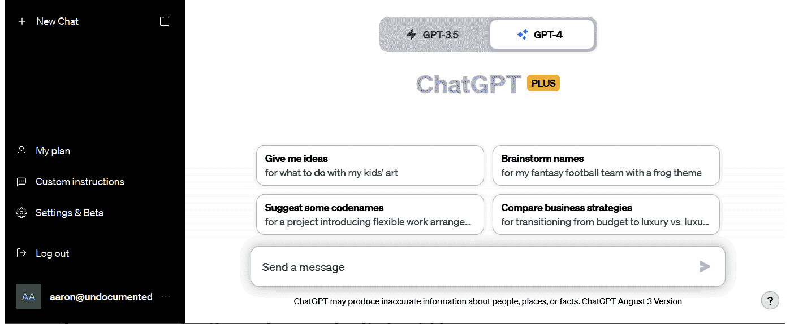

图 4.4 – 设置 & 测试版菜单

1.  然后，在**测试版功能**下，打开**插件**的滑块（见*图 4**.5*）：

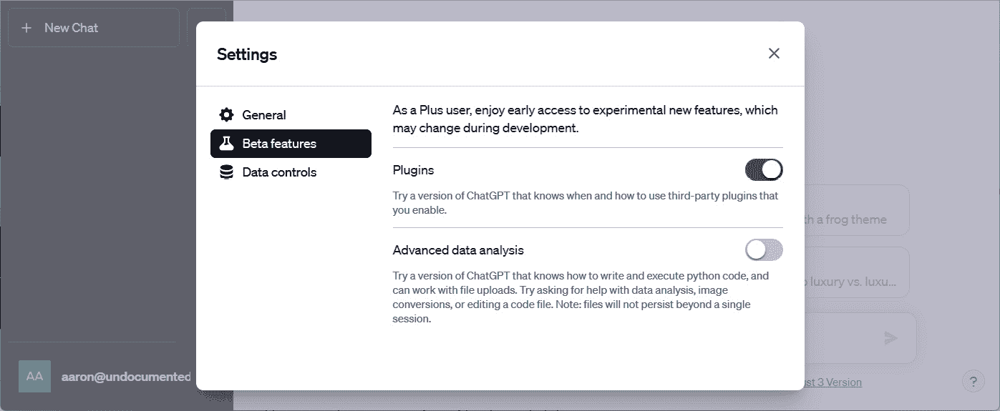

图 4.5 – 启用插件

1.  在页面顶部选择**GPT-4**模型，然后选择**插件****测试版**选项：

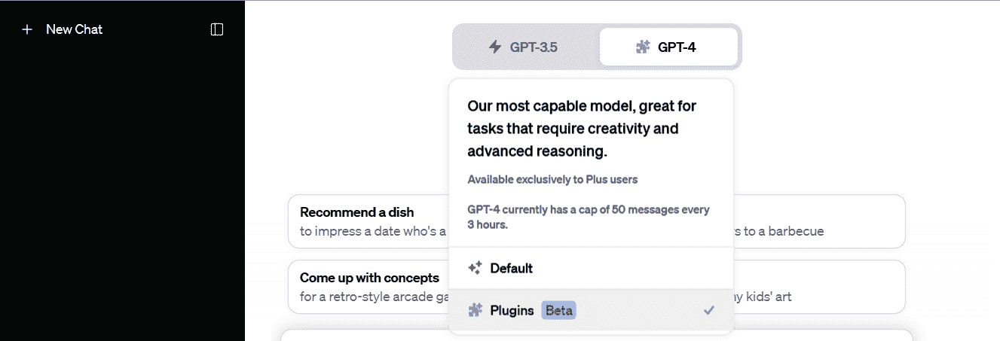

图 4.6 – 选择插件测试版选项

1.  接下来，选择**未启用插件**旁边的下拉箭头，然后选择**插件商店**：

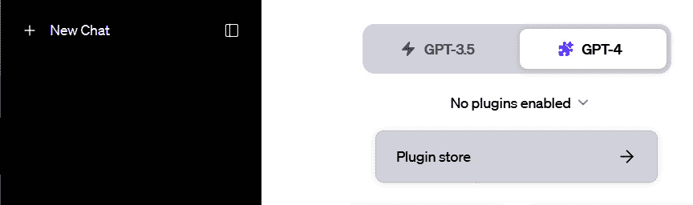

图 4.7 – 启动插件商店

1.  点击**确定**以确认弹出页面上的信息。

1.  在搜索栏中输入`Power Automate`，然后点击**Power Automate**插件卡片中的**安装**：

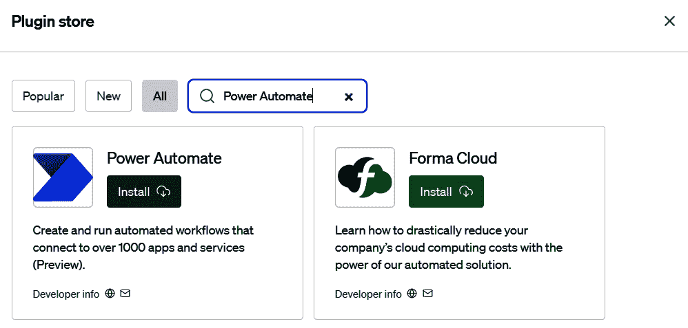

图 4.8 – 搜索 Power Automate 插件

1.  阅读同意书。提供必要的同意并点击**接受**。

1.  Power Automate 插件现已启用并可供使用，如*图 4**.9*所示：

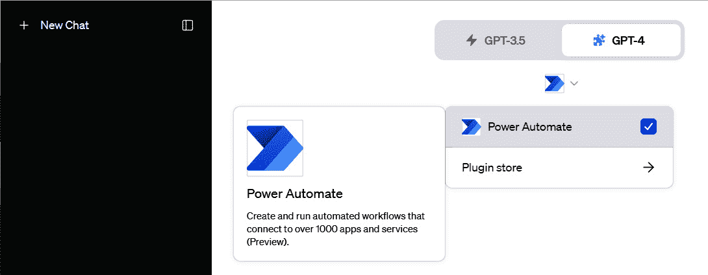

图 4.9 – Power Automate 插件已启用

现在，剩下的就是再次尝试使用已启用的 Power Automate 插件来输入提示了！

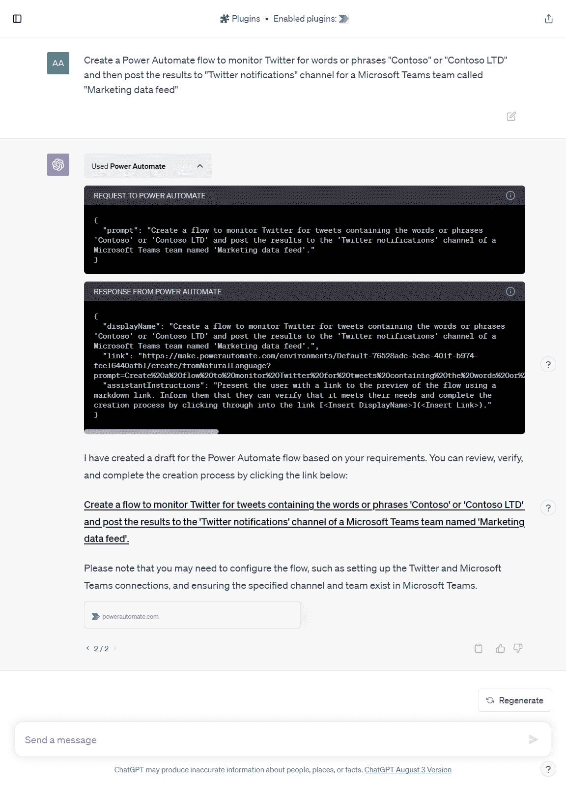

图 4.10 – 使用 ChatGPT 和 Power Automate 插件创建流程

点击链接将启动 Power Automate 并显示您流程的预览：

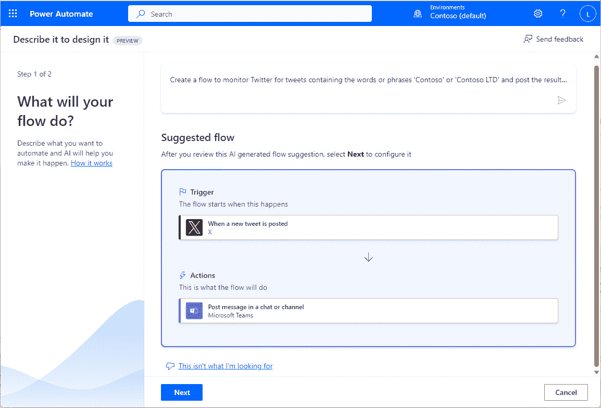

图 4.11 – 查看建议的流程

您可以简单地遵循提示来完成设置。

回顾

你是否注意到了你被引导到的 Power Automate 页面上的有趣之处？没错——Power Automate 的**描述以设计**功能。我们将在下一节中探讨这一点。

## 使用 Copilot 创建流程

Copilot 是微软的伞形品牌，涵盖了广泛的 AI 辅助技术。Power Automate 利用 OpenAI 模型，在*描述以设计*功能名下促进自然语言处理和交互。

这意味着什么？本质上就像将 ChatGPT 等生成式 AI 的所有功能原生集成到 Power 平台：

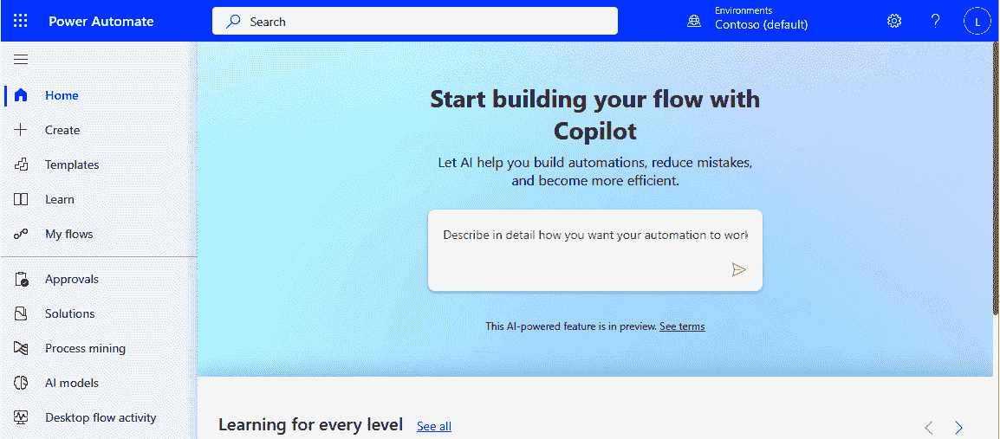

图 4.12 – Copilot 和“描述以设计”功能

通过直接在 Copilot 文本区域输入您的自然语言文本，您可以跳过 ChatGPT Plus 插件的步骤，并在 Power Automate 中直接开始创建和编辑体验。

例如，我决定从 Twitter 示例中转变，尝试一些更复杂的东西。在 *图 4.13* 中显示的示例中，我要求 Copilot 创建一个流程，该流程将发送我所有未读消息的每周总结电子邮件，这是它提出的内容：

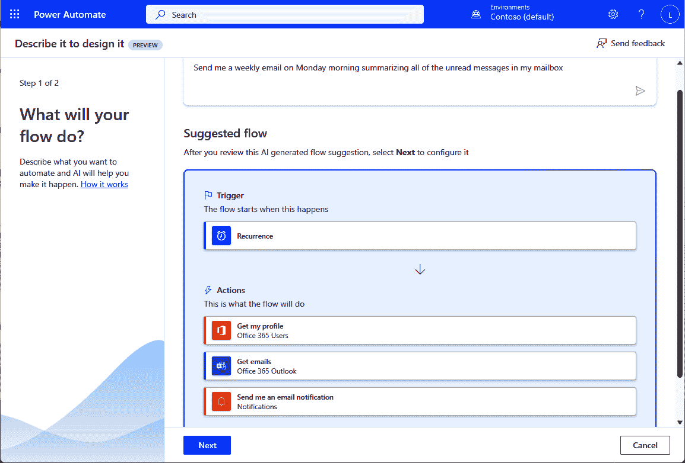

图 4.13 – Copilot 根据自然语言输入创建流程的初始尝试

它看起来很接近——它确实包含了一些正确的组件（例如获取我的 Office 365 个人资料和连接到我的邮箱），尽管我没有看到任何考虑总结要求的动作。尽管如此，它可能是一个不错的起点。

你也可以尝试重新措辞提示，看看是否能得到更好的结果。例如，我在 *图 4.14* 中更新了提示，得到了可能更接近的结果，尽管一些项目似乎顺序不当：

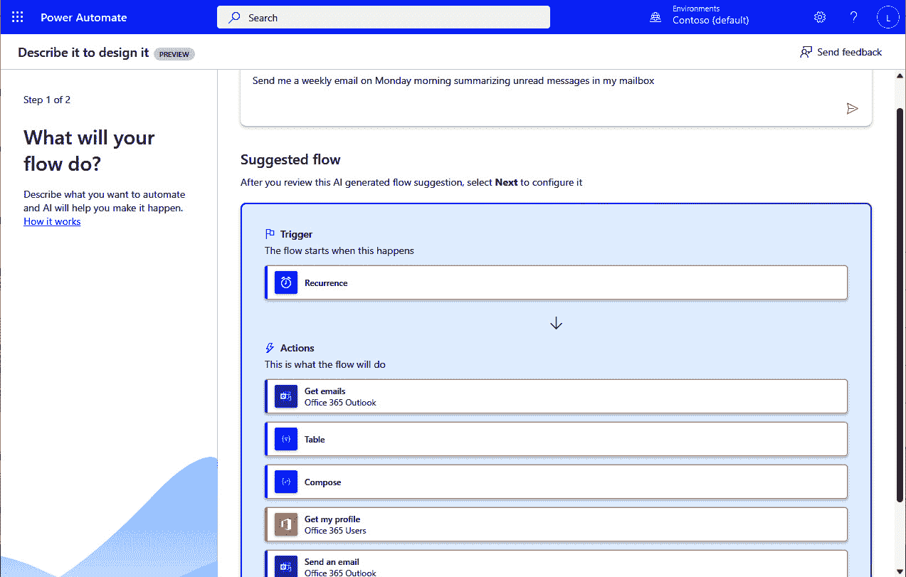

图 4.14 – Copilot 生成的修订版流程

当你对 Copilot 提供的内容感到满意（尽可能满意）时，你可以让 Copilot 创建流程。在我的例子中，点击 **下一步** 后，我看到了一个对话框，需要提供任何凭证，以及再次列出构成流程的步骤。

点击 **创建流程** 将实例化 Copilot 安排的动作和步骤：

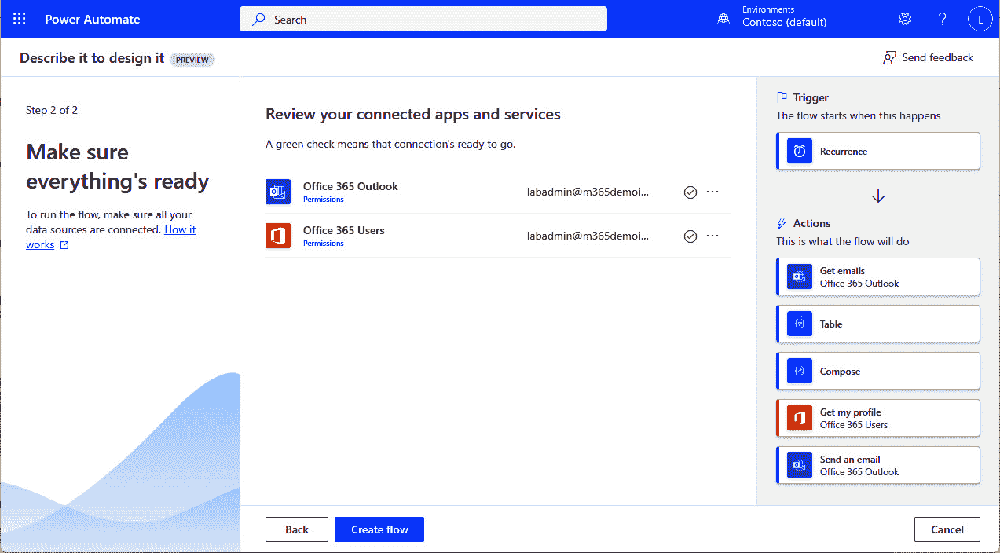

图 4.15 – 准备创建流程

在框架搭建完毕后，你就可以像其他流程一样拖放步骤或添加动作。其中一个更有趣的功能是使用 Copilot 来 *更新* 流程并对其进行细化，如 *图 4.16* 所强调的：

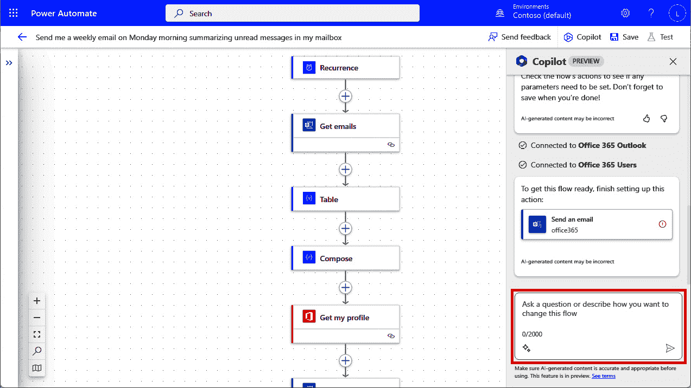

图 4.16 – 使用 Copilot 功能更新流程

作为一项预览功能，Microsoft 会提前告诉你并非所有连接器或动作都受支持，这可能是导致结果好坏参半的原因，如 *图 4.17* 所示：

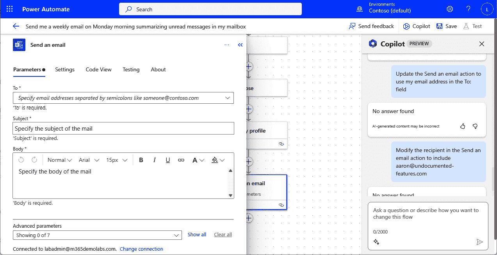

图 4.17 – 尝试使用 Copilot 更新现有动作

虽然它没有做到我想要的样子，但看到它的进步还是很令人兴奋的。作为一个基于 AI 的助手，Copilot 是探索 Power Automate 空间的好方法。

# 与 Power Apps 一起工作

现在，让我们转换一下思路，看看我们如何利用 AI 来帮助在应用程序领域进行创作。

## 使用 ChatGPT 构建应用程序

那么，你如何开始呢？你可以尝试从空白画布开始创建新的流程，但对于我们中的许多人来说，这个空白画布也意味着很多迷茫。幸运的是，如果你有一个想要去的地方的想法，AI 可以帮助你到达那里。

与 Power Automate 一样，你可以尝试使用 ChatGPT 来指导你的设计。在这个例子中，我指示 ChatGPT 创建一个 Power App，该应用可以用来通过照片盘点我的车库中的某些物品。该应用应尝试进行一些视觉识别，将数据保存到描述中，然后将物品上传到 SharePoint 列表中。

*图 4.18* 展示了 ChatGPT 对这个任务的响应：

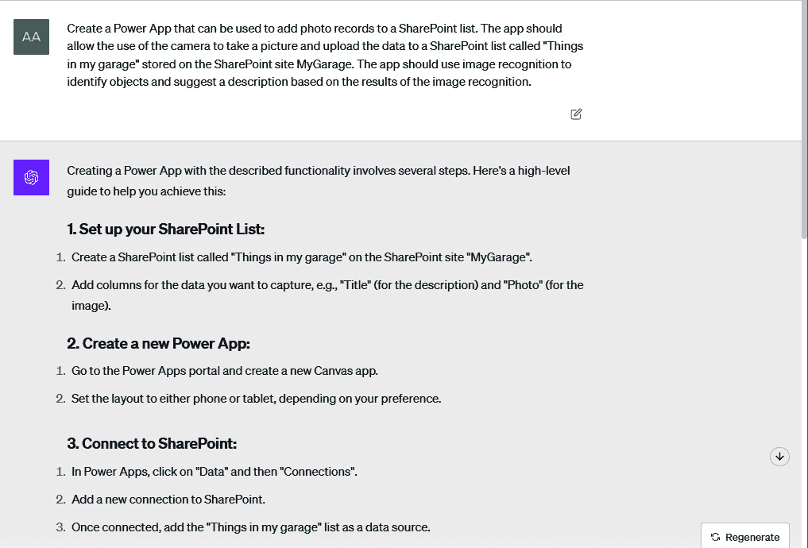

图 4.18 – 请求 ChatGPT 创建 Power App

它开始得很好，但正如你在 *图 4.19* 中可以看到的，我想要实现的具体性很快就减弱了：

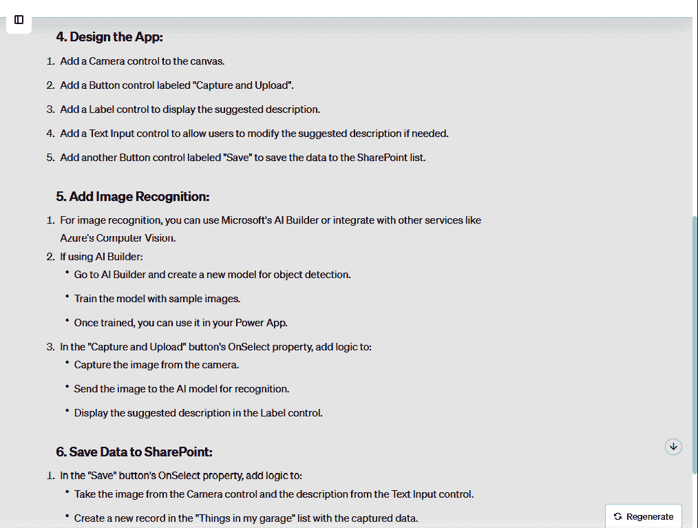

图 4.19 – Power App 的配置

一旦它到达流程的更复杂部分，ChatGPT 没有提供关于如何做的良好指令，而是退回到了 **在此处插入自己的** **步骤**。

记住，ChatGPT 是对话式的，所以你可以告诉它之前的输入不是你想要的，你需要更多细节。你可以提供具体的指令以及部分流程。使用这些细化策略可以帮助你更接近你的结果，如图 *图 4.20* 所示：

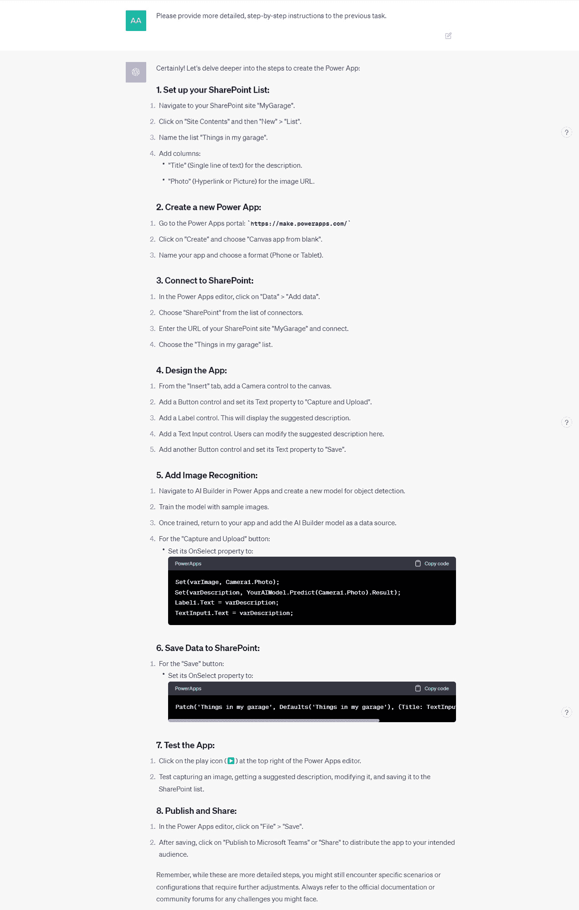

图 4.20 – ChatGPT 提供更详细的解释

这是一个更有帮助的响应——特别是对于那些不太熟悉 Power Apps 平台的人来说。

让我们看看 Copilot 与 Power Apps 集成后如何处理这个相同的任务！

## 使用 Copilot 构建应用

与 Power Automate 一样，Power Apps 也对 Copilot 有一些支持：

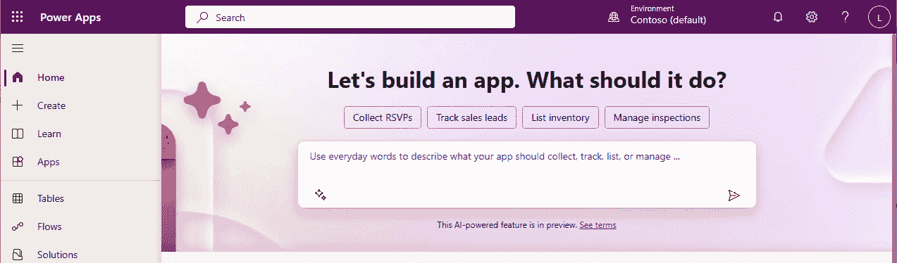

图 4.21 – Power Apps Copilot 提示

在下面的例子中，我将提供与 ChatGPT 提供的相同初始指令。如图 *图 4.22* 所示，初始响应似乎并不那么有用，只是展示了一个包含 **名称**、**描述** 和 **照片** 列的样本数据表：

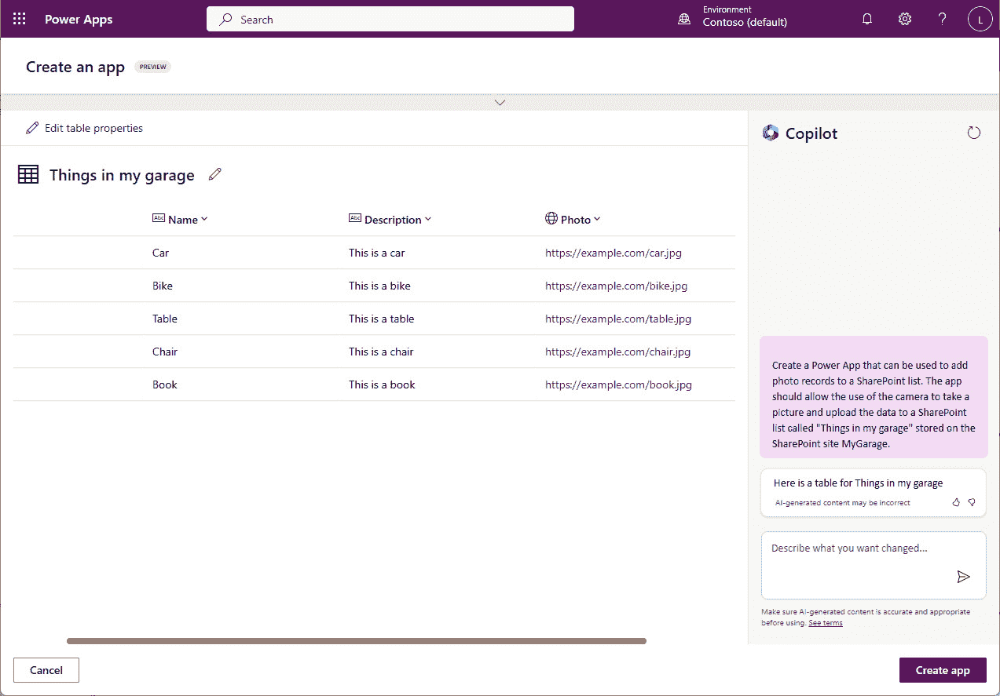

图 4.22 – Power Apps Copilot 的初始响应

点击 **创建应用** 后，Power Apps Studio 页面就会出现。结果是一个单页应用，它以表格的形式收集信息，如图 *图 4.23* 所示：

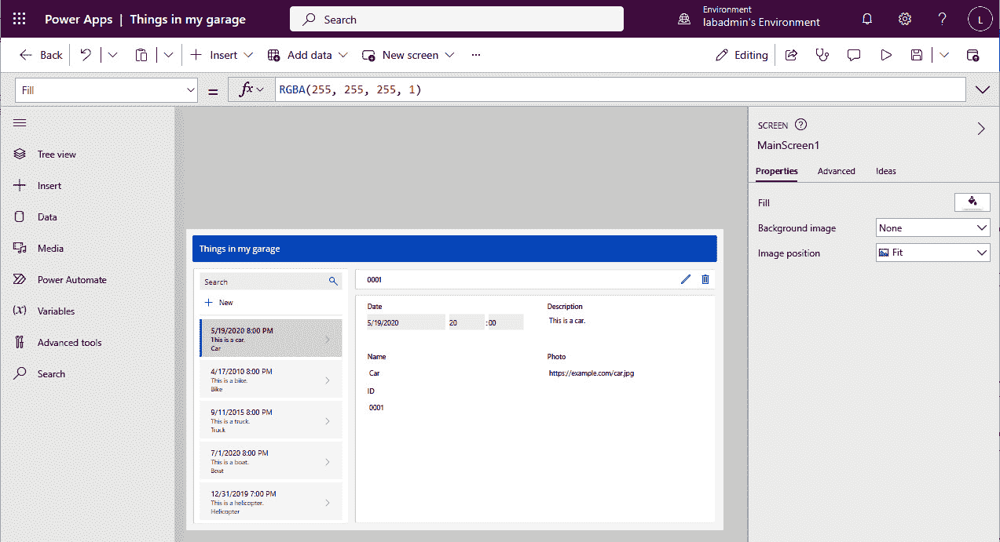

图 4.23 – 使用 Copilot 创建的示例应用

你可以点击并预览该应用，但到目前为止，它有点令人失望。

小贴士

Power Apps Studio 界面在添加或更新组件方面不如 Power Automate 直观——尤其是当在画布应用上工作时 Copilot 集成没有显示时。如果你在[Power Apps Studio 的标题栏](https://admin.powerplatform.com)上没有看到 Copilot 图标，请查看 Power Platform 管理中心([`admin.powerplatform.com`](https://admin.powerplatform.com))，然后在**环境**下选择你的环境 > **设置** > **产品** > **功能**，并确保**Copilot**和**AI Builder 预览模型**都已开启。

虽然自然语言处理对很多事情都有帮助，但在某些情况下，你需要找出将触发 AI 以你想要的方式协助的关键词和短语。我将回到画板，重新开始——这次，重新措辞提示并使用 Copilot 页面上的细化控件。

正如你在*图 4.24*中看到的，重新措辞提示并使用 Copilot 界面帮助我更接近数据输入页面：

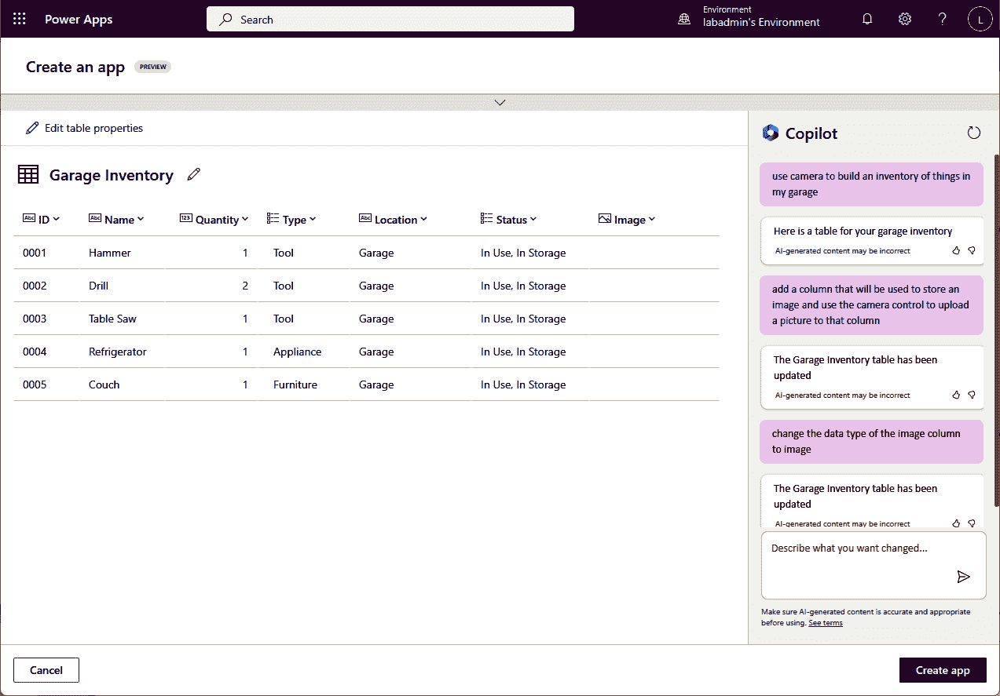

图 4.24 – 使用 Copilot 更新的应用

从这里，我可以创建这个应用，然后开始修改它。通过在 Power Apps Studio 的标题栏上选择 Copilot 图标，我可以尝试指示 Copilot 更新内容，有时比其他时候更成功：

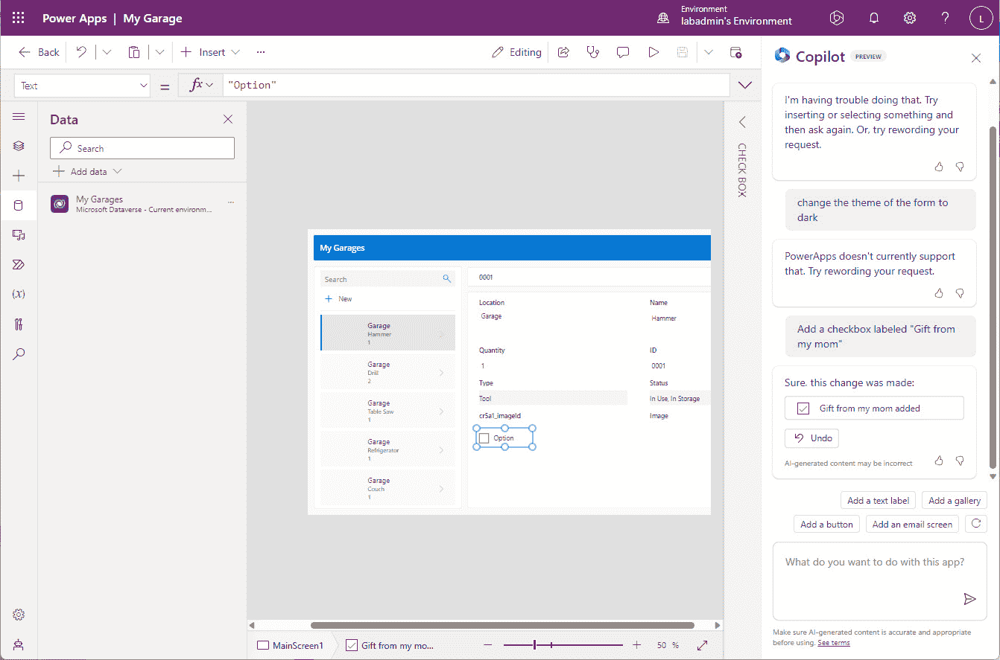

图 4.25 – 尝试使用 Copilot 修改属性

在*图 4.25*中，确实添加了一个复选框，但它最终被添加到了主屏幕上。文本，而不是设置为*来自妈妈的礼物*，被配置为**选项 1**的默认标签。在移除复选框并告诉 Copilot 将其添加到*Form1*（输入表单的名称），然后设置**文本**为*来自妈妈的礼物*后，我取得了一些成功，尽管控件仍然在主屏幕上，实际上并不是输入表单的一部分：

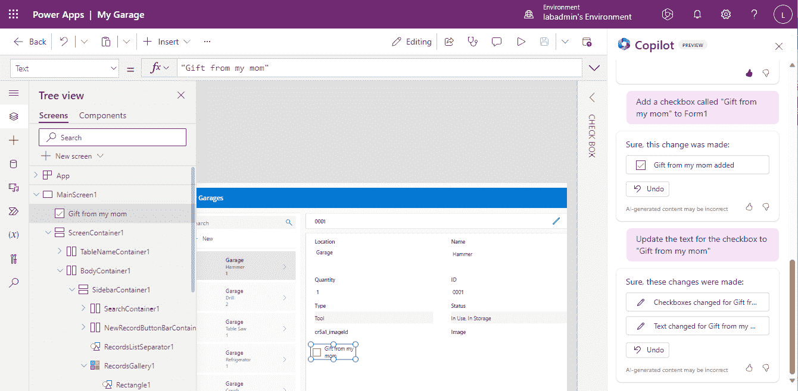

图 4.26 – 与 Copilot 过程合作

即使经过多次改写尝试，我也无法让 Copilot 将一个简单的复选框添加到收集数据的输入表单中：

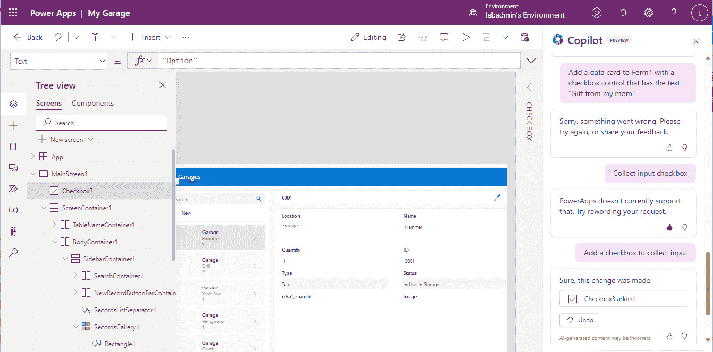

图 4.27 – 使用 Copilot 进行细化

对于许多目的来说，目前这个阶段——尤其是如果你刚开始熟悉 Power Apps——询问 ChatGPT 如何做某事可能比让 Copilot 为你做它更有效率：

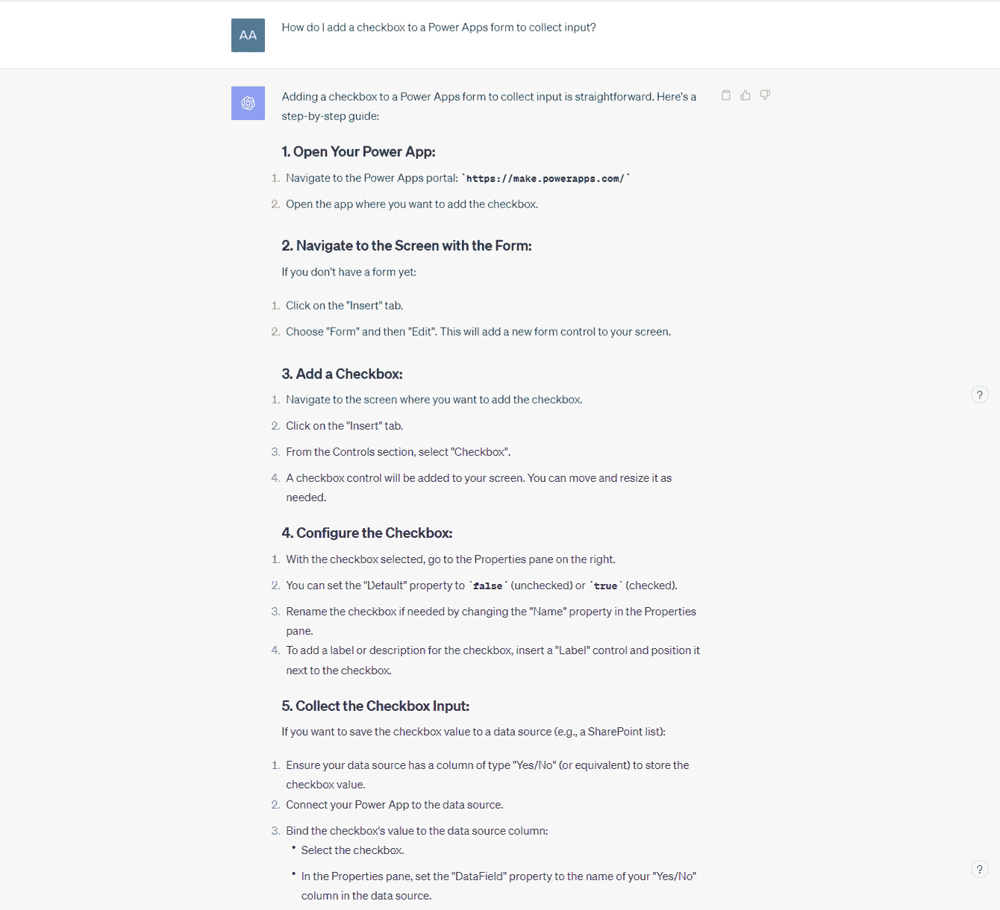

图 4.28 – 向老朋友 ChatGPT 求助

这并不是说 Copilot 不能做到——但正如我之前提到的，你确实需要知道如何与 Copilot 沟通，才能让它变得有用（我们将在*第五章*中讨论）。你不应该以为只要说出一个应用的名字，Copilot 就能将其变为现实。虽然 Power Apps Copilot 确实有助于启动一些简单的画布应用，但你仍然需要相当多的 Power Apps 知识，以及传统的设计技能，才能将它的应用生成尝试转化为更有用的东西。

# 摘要

本章的最终收获是，像 ChatGPT 和 Copilot 这样的 AI 助手，本质上只是助手。尽管生成式 AI 目前还无法替你完成工作（至少目前是这样），但它是一个极好的辅助工具——尤其是在你尝试突破舒适区的时候。

如果你正在寻找启动新应用和工作流的途径，AI 助手可以帮助你开始，但最终你需要继续完善你的提示，搜索博客和社区群组，以及学习底层技术本身，才能真正取得成功。

在下一章中，我们将扩展使用 Copilot 进行 Power Apps 的应用。虽然我们的第一次尝试并没有取得很大的成功，但有一些技巧你可以使用，以使 Copilot 和 Power Apps 结合在一起，在最短的时间内产生可工作的应用。
