# 第六章：使用 Copilot 启动 Power App

Copilot 已经开始进入 Microsoft 365 平台。然而，正如你在上一章中看到的，如果你只是像对待 ChatGPT 一样寻求 Copilot 的帮助，你可能会感到沮丧。

在本章中，我们将深入了解如何让 Copilot 与你合作创建可用的应用程序。我们将尝试一个比我们在*第四章*中一起工作的车库库存应用更复杂的应用程序。在这里，我们将尝试使用几个 SharePoint 列表和 Copilot 创建一个简单的请假或休假请求应用。

# 配置先决条件

这个请假请求示例应用将包括几个 SharePoint 列表：一个用于存储关于请求的信息（请求者、开始和结束日期、审批状态等），另一个用于存储关于审批者的信息。

## 在 Entra ID 中创建身份

由于我们将从 Entra ID 中挑选用户，你需要用用户填充目录。你应该创建尽可能详细信息的用户。

进一步阅读

有关在 Entra ID 中创建用户的更多信息，请访问[`learn.microsoft.com/en-us/microsoft-365/admin/add-users/add-users?view=o365-worldwide`](https://learn.microsoft.com/en-us/microsoft-365/admin/add-users/add-users?view=o365-worldwide)。

## 创建 Dataverse 环境

虽然 Microsoft 365 租户是组织逻辑边界，但**环境**是一个用于分割应用程序、用户、部门或业务单位的逻辑容器或边界。一个 Microsoft 365 租户可以有多个环境。环境用于分组 Power Platform 组件（如 Power Automate 流程、Power Apps 应用程序、Power Pages 站点或 Dynamics 365 组件），以及在 Dataverse 数据库中的专用信息存储。一个 Dataverse 环境只能有一个数据库。

默认情况下，你的 Microsoft 365 租户应该有一个预构建的 Dataverse 环境（包含一个可以存储高达 3 GB 数据的数据库），如图*图 5.1*所示：

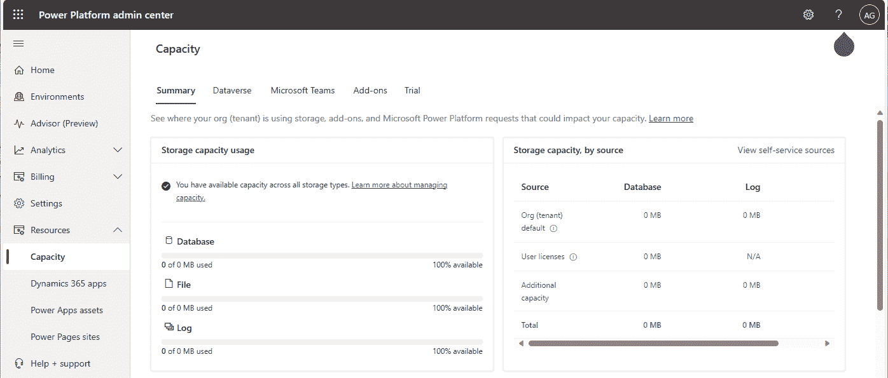

图 5.1 – 查看 Dataverse 的容量

如果由于某种原因它没有（或者你不想使用默认环境），你可以按照以下步骤创建一个新的环境：

1.  导航到 Power Platform 管理中心([`admin.powerplatform.com`](https://admin.powerplatform.com))并使用被分配了管理角色（如全局管理员或 Microsoft Power Platform 管理员）的用户登录。

1.  选择**环境**，然后点击**新建**。

1.  为环境输入一个**名称**值并选择一个**区域**值。

1.  选择一个**类型**值（可以是**试用**、**开发**、**生产**或**沙盒**），并在**目的**区域中（可选）输入描述。

1.  在**添加 Dataverse 数据存储**下，将滑块移动到**是**以启用数据库。然后，点击**下一步**。

1.  在向导此页面上，唯一需要填写的是 **安全组**。点击 **选择** 以选择环境的安全控件。您可以在 **公开访问** 下选择 **无** 以允许任何用户访问，或在 **受限访问** 下选择现有的安全组以限制访问。

1.  点击 **保存**。

几分钟后，环境应该已经创建。无论何时您希望在此环境中创建或管理内容，您都需要在创建者门户中切换环境，如图 *图 5**.2* 所示。

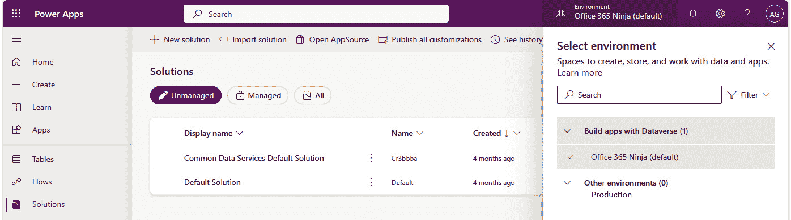

图 5.2 – 选择环境

接下来，让我们探索如何使用 Copilot 创建新的 Power App。

如果我遇到困难怎么办？

如果由于某种原因遇到障碍（找不到功能、某个选项没有显示出来，或者某些内容不清楚），帮助只需点击一下！您可以从我们的 GitHub 网站下载本章的工件：[`github.com/PacktPublishing/Power-Platform-and-the-AI-Revolution`](https://github.com/PacktPublishing/Power-Platform-and-the-AI-Revolution)。

# 使用 Copilot 构建新的 Power App

在满足我们的先决条件后，是时候开始构建应用程序了！如您在 *第四章* 中所看到的，如果您仅使用 Copilot 提示来创建应用程序，您实际上得到的是一个可以用于数据输入的表格。我们将尝试不同的方法 – 从一个空白应用程序开始，然后使用 Copilot 添加和链接组件。

该解决方案建立在具有数据库的 **Dataverse**（以前称为 **Common Data Service**）环境之上，将利用员工请求休假的前端入口组件和审批者或经理使用的后端解决方案。

画布和模型驱动应用

Power Apps 有两种类型 – **画布** 应用和 **模型驱动** 应用。画布应用是通过向空白画布页面添加控件来构建的（因此得名）。控件本质上是用户通过点击按钮、添加文本或提交表单等动作与之交互的构建块。然而，模型驱动应用的设计方法与光谱的另一端相反。模型驱动应用用于与结构化数据交互，并从连接的数据源中获取其核心架构和界面组件配置。有关画布应用的更多信息，请参阅 [`learn.microsoft.com/en-us/power-apps/maker/canvas-apps/getting-started`](https://learn.microsoft.com/en-us/power-apps/maker/canvas-apps/getting-started)。有关模型驱动应用的更多信息，请参阅 [`learn.microsoft.com/en-us/power-apps/maker/model-driven-apps/model-driven-app-overview`](https://learn.microsoft.com/en-us/power-apps/maker/model-driven-apps/model-driven-app-overview)。

## 配置数据元素

在您开始创建应用程序之前，您需要设置一些结构来存储数据。本质上，您将创建一个带有**列**的表——您可以将其视为电子表格。在 Dataverse 表中，列被配置为具有**类型**，这相当于可以存储的数据类型。

按照以下步骤开始：

Copilot 可用性

在撰写本文时，Power Apps Maker 门户的 Dataverse 部分没有 Copilot 界面。

1.  导航到 Power Apps Maker 门户 ([`make.powerapps.com`](https://make.powerapps.com)) 并选择**解决方案**。

什么是解决方案？

**解决方案**可以被视为容器对象，用于在环境之间传输应用程序和组件，并在 Power Platform 中实现**应用程序生命周期管理**（**ALM**）。一个解决方案可以像单个流程一样简单，也可以包括应用程序和组件，例如网站地图、应用程序和表。

1.  点击**新建解决方案**。

1.  输入一个**显示名称**值。**名称**属性将自动计算，尽管您可以编辑它。然后，点击**创建**：

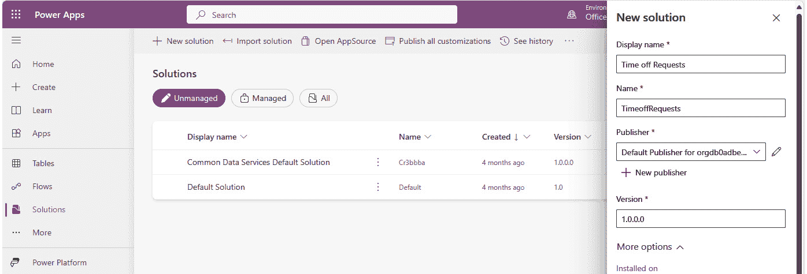

图 5.3 – 创建新解决方案

1.  展开新菜单，指向**表**，然后选择**表**：

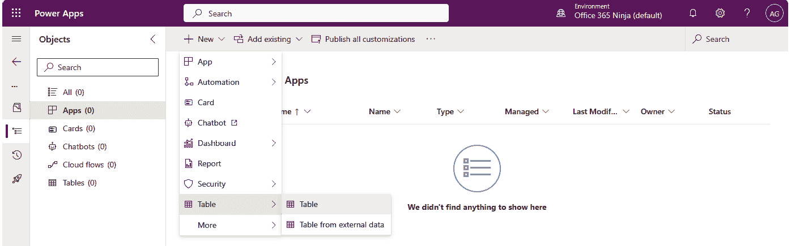

图 5.4 – 添加表

1.  输入一个`休假表`。选中**启用附件（包括笔记和文件）**复选框并点击**保存**：

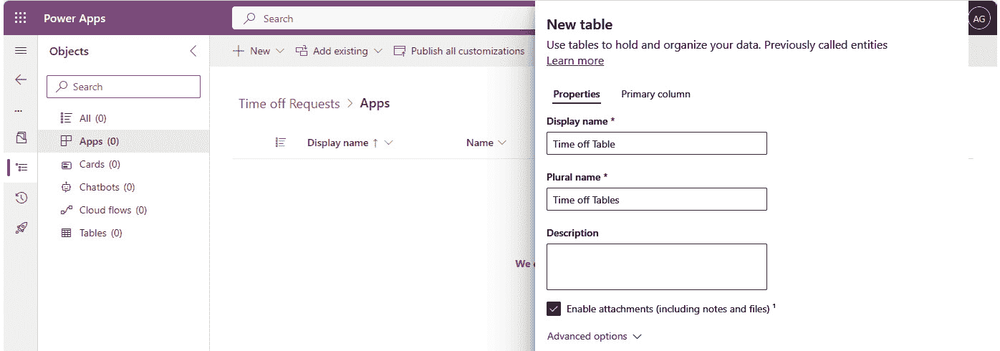

图 5.5 – 创建新表

术语更新

**表**之前被称为**实体**。

1.  点击**新建** > **列**:

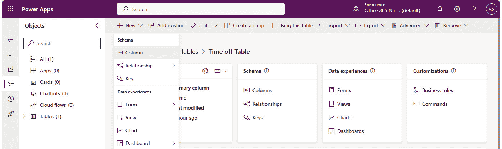

图 5.6 – 添加列

术语更新

**列**之前被称为**字段**。

1.  在**显示名称**字段中的**姓氏**，选择**单行文本**下的**数据类型**，并点击**保存**。见 *图 5.7*：

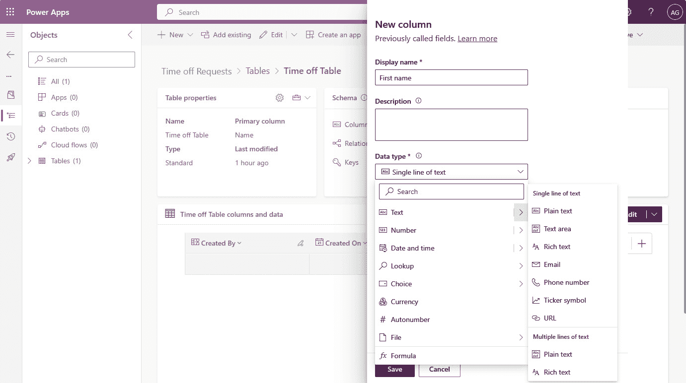

图 5.7 – 配置列

1.  重复 *步骤 7* 以根据 *表 5.1* 中显示的内容创建更多字段：

| **字段名称** | **数据类型** | **附加属性** | **必需** |
| --- | --- | --- | --- |
| 姓氏 | 单行文本 |  | 业务必需 |
| 电子邮件 | 单行文本 | 格式：电子邮件 | 业务必需 |
| 监督员 | 单行文本 |  | 业务必需 |
| 监督员电子邮件 | 单行文本 | 格式：电子邮件 | 业务必需 |
| 开始日期 | 日期和时间 | 仅日期 | 业务必需 |
| 结束日期 | 日期和时间 | 仅日期 | 业务必需 |
| 请求类型 | 选择 | 与全局选择同步：否选择：休假选择：生病选择：丧亲选择：陪审团服务 |  |

表 5.1 – Dataverse 字段

9. 从 Power Apps Maker 门户，展开**表** > **视图**并选择**活跃的休假表**。见 *图 5.8*：

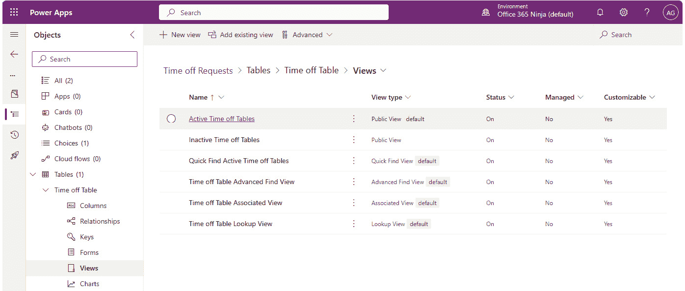

图 5.8 – 激活休假表

10. 将 **First name**（名字）、**Last name**（姓氏）、**Start date**（开始日期）和 **End date**（结束日期）字段从 **表列** 区域拖动到主窗口中：

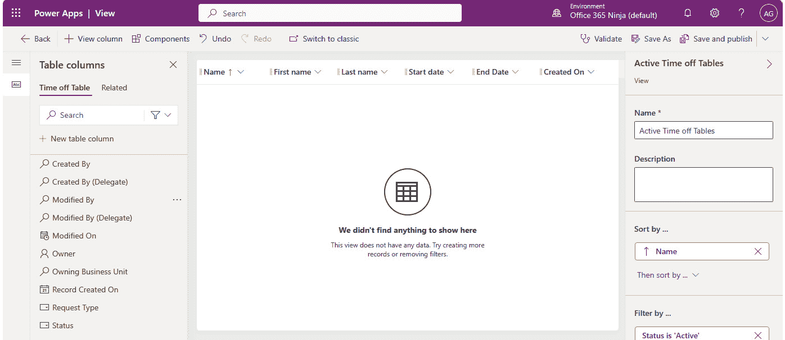

图 5.9 – 更新视图

11. 点击 **保存** **并发布**。

12. 点击 **后退** 返回到 **对象** 视图。

13. 展开 **表** > **请假表** 并选择 **表单**。选择将 **表单类型** 设置为 **主** 的表单。见图 *图 5.9*：

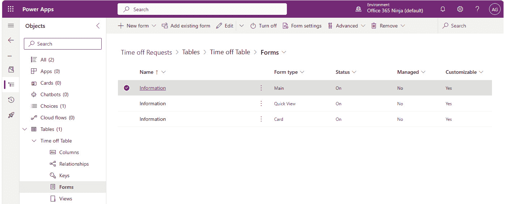

图 5.10 – 查看表单

14. 将您之前创建的 Dataverse 列添加到视图中，如图 *图 5.11* 所示。完成操作后，点击 **保存** **并发布**：

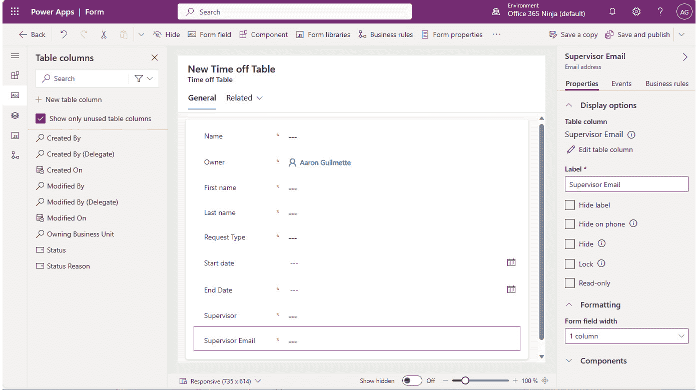

图 5.11 – 添加 Dataverse 列

接下来，是构建后端应用程序的时候了。

## 创建模型驱动后端应用程序

在本节中，您将配置一个新模型驱动应用程序，管理人员将使用该应用程序来批准请假请求。按照以下步骤操作：

Copilot 可用性

在撰写本文时，Copilot 不可用于处理模型驱动应用程序。

1.  导航到 Power Apps Maker 门户 ([`make.powerapps.com`](https://make.powerapps.com))。然后，展开 **解决方案** 并选择 **Time off Requests** 解决方案：

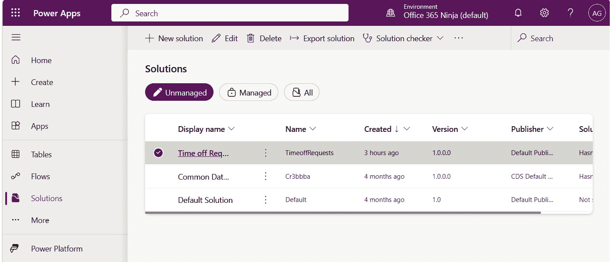

图 5.12 – 选择“请假请求”应用程序

1.  点击 **新建**，展开 **应用程序**，并选择 **模型驱动应用程序**：

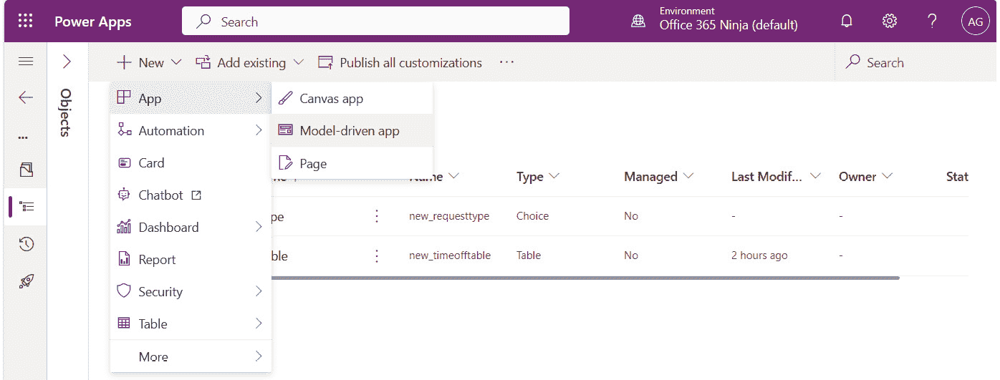

图 5.13 – 创建新的模型驱动应用程序

1.  输入 `Time off` `后端应用程序`。

1.  展开高级下拉菜单，选择 **使用自定义解决方案中的组件**。在 **解决方案** 下，选择 **Time off Requests** 解决方案，然后点击 **创建**：

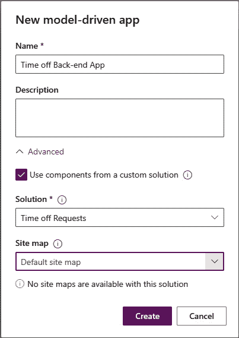

图 5.14 – 设置新模型驱动应用程序的参数

1.  点击 **后退** 返回到 **对象** 页面。

1.  选择 **网站地图**。

1.  选择 **Time off Back-end App** 网站地图：

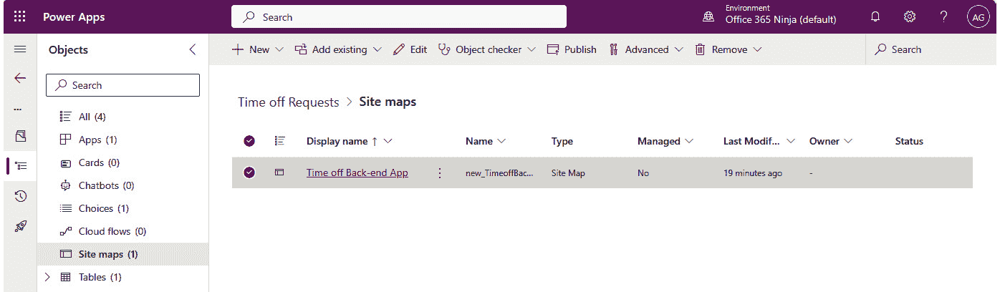

图 5.15 – 查看网站地图

1.  点击 **Area1** 标签，然后从菜单中选择 **添加**。选择 **组**。

1.  点击 **添加**，然后点击 **子区域**。

1.  在 **属性** 窗格中，在 **类型** 下选择 **实体**。

1.  在 **实体** 下，选择 **Time off Table**（请假表）：

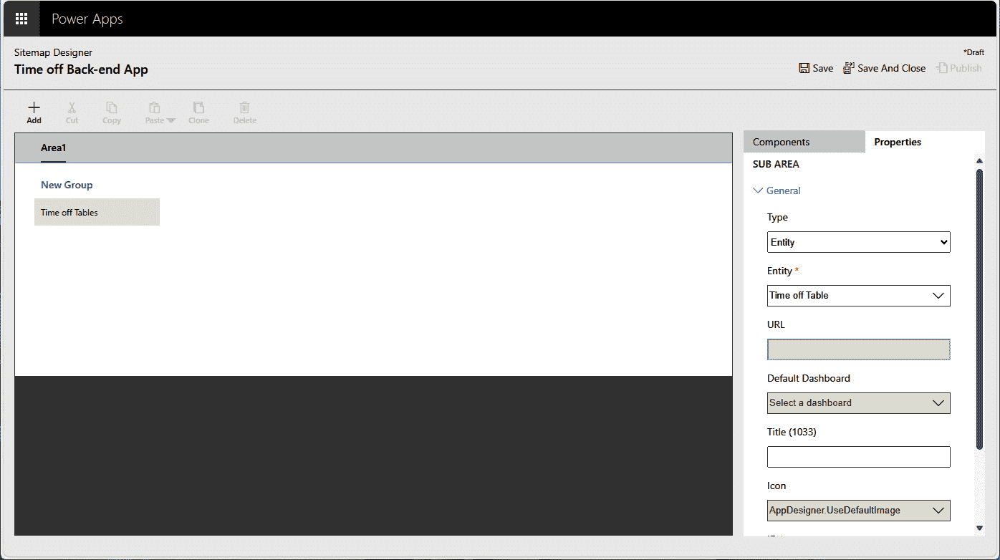

图 5.16 – 更新网站地图

1.  点击 **保存** **并关闭**。

1.  在 **对象** 视图中，选择 **网站地图**，然后点击 **发布**：

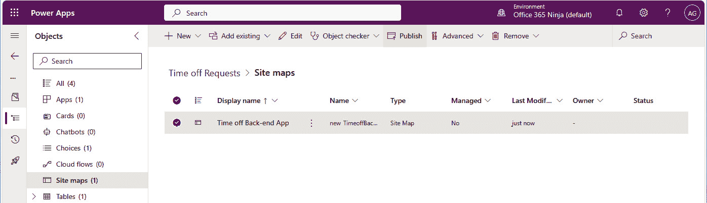

图 5.17 – 发布网站地图

1.  点击 **应用程序**，然后点击 **发布** **所有自定义设置**：

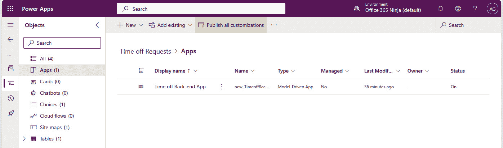

图 5.18 – 发布应用程序自定义设置

1.  通过点击打开应用程序。

1.  从顶部菜单中选择 **播放**：

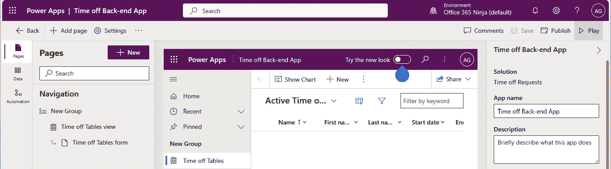

图 5.19 – 运行应用程序

1.  在应用程序上，点击**新建**以添加新记录：

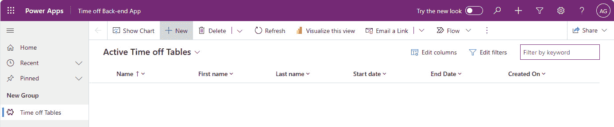

图 5.20 – 创建新记录

1.  按如下方式填写记录：

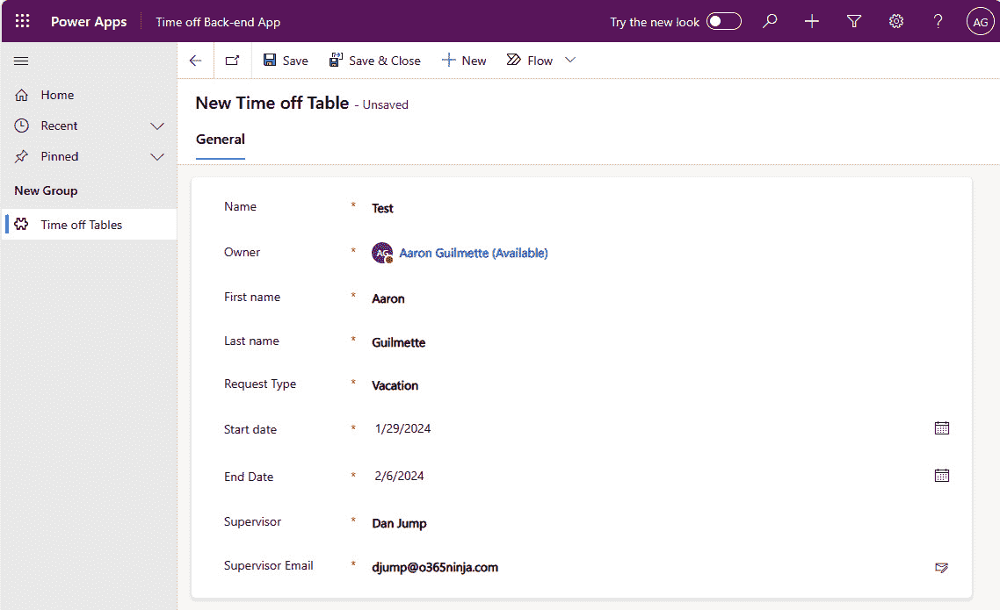

图 5.21 – 创建记录

这样，基于模型的移动应用程序就创建完成了。现在，是时候创建最终用户界面了。

## 创建画布前端应用程序

画布应用程序将由最终用户用于创建休假请求。在这里，您可以使用 Copilot 来帮助配置应用程序：

1.  导航到 Power Apps Maker 门户([`make.powerapps.com`](https://make.powerapps.com))。然后，展开**解决方案**并选择**休假请求**解决方案。

1.  选择**应用**。

1.  点击**新建** > **应用** > **画布应用程序**。

1.  在“休假请求”下，选择一个格式（无论是**平板电脑**还是**手机**），然后点击**创建**。

1.  在导航面板中，选择**数据**。

1.  点击**添加数据**并选择**Office 365 用户连接器**。在弹出窗口中，点击**连接**。

1.  在“添加新表单。将表单的数据源设置为'Time off Tables'”：

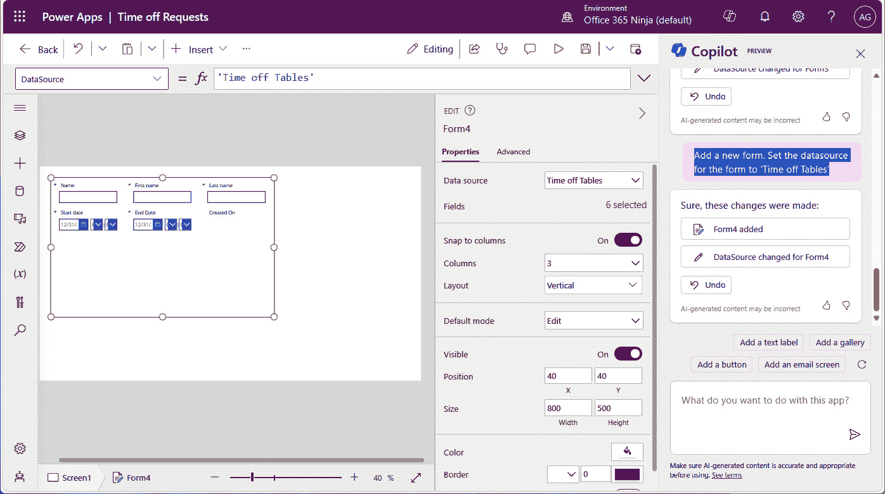

图 5.22 – 添加表格并连接到数据源

注意

可能需要与 Copilot 尝试几次才能得到您想要的结果。如果它无法连接到数据源，请确保您输入的名称与**表格**下显示的名称完全一致。您可以打开表单的属性并选择**数据源**下拉菜单来手动选择它。

1.  在**数据源**下，点击**编辑字段**。

1.  点击**添加字段**。添加您之前创建的字段（列）：

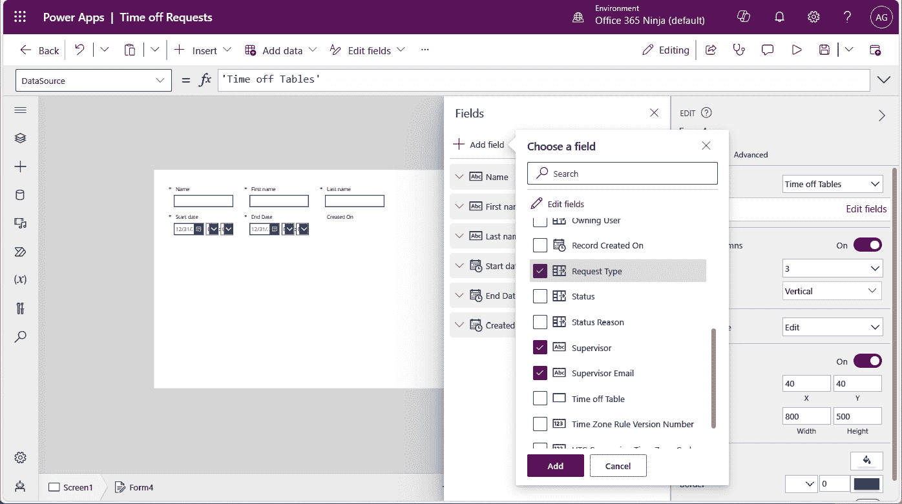

图 5.23 – 添加剩余字段

1.  通过指示 Copilot 将所选表单的默认模式设置为“新建”，来更新表单的默认模式。或者，您也可以通过在属性表单旁边点击**默认模式**的下拉菜单并选择**新建**来更新配置。

1.  指示 Copilot 向 Screen1 添加一个按钮。配置按钮以提交表单并导航到 Screen2。验证按钮的`OnSelect`方法显示`SubmitForm('FormName');Navigate('Screen2')`函数并引用表单的名称。将按钮拖到屏幕上的适当位置：

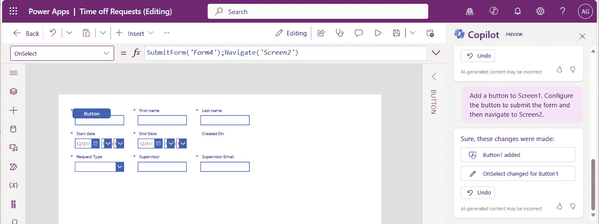

图 5.24 – 向屏幕添加按钮

1.  指示 Copilot 将按钮文本更新为“提交”。

1.  指示 Copilot 使用“成功模板”创建一个新屏幕。或者，从菜单中选择**新屏幕** > **模板** > **成功**。默认情况下，屏幕将被命名为 Screen2。您应该会自动被导向 Screen2。

1.  指示 Copilot 在 Screen2 上添加一个标签，上面写着“感谢您提交您的请求。”屏幕上应出现一个新的标签。调整大小，以便所有文本都可见。

1.  指示 Copilot 在 Screen2 上添加一个标签为“开始新的请求”的按钮，该按钮导航到 Screen1 并重置表单。应创建一个新的按钮，该按钮具有`Navigate('Screen1');ResetForm('Form1')`（或您的表单名称）的功能。将其拖到屏幕的空白区域，并调整大小以便所有文本都可见。参见*图 5**.25*：

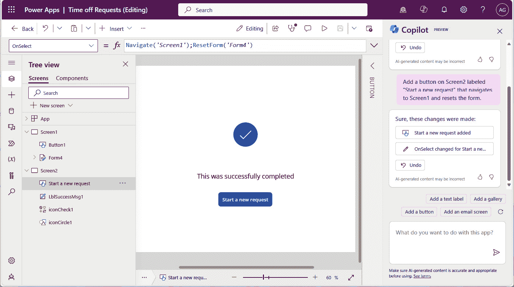

图 5.25 – 完成表单

1.  点击**播放**按钮进行测试并添加记录：

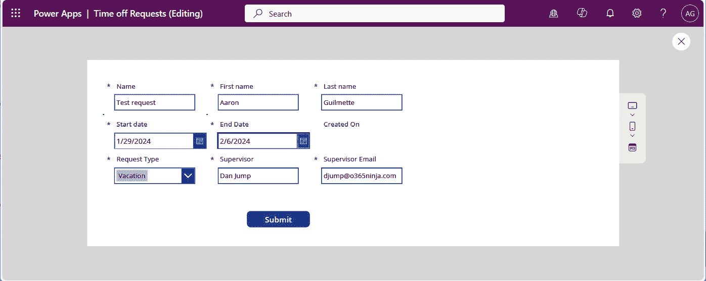

图 5.26 – 测试应用

1.  测试应用后，点击**X**图标关闭它。然后，点击**保存****并发布**。

1.  在**发布**页面，输入简短描述并点击**发布****此版本**：

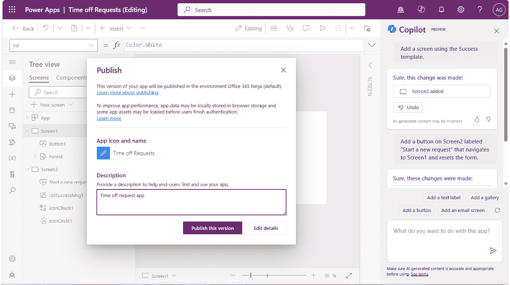

图 5.27 – 发布应用

接下来，我们将使用 Power Automate 来启动审批。

## 启用自动化

在本节中，您将使用 Power Automate 来帮助自动化处理和通知：

1.  导航到 Power Apps Maker Portal ([`make.powerapps.com`](https://make.powerapps.com))。然后，展开**解决方案**并选择**休假****请求**解决方案。

1.  选择**应用**。

1.  点击**新建**，指向**自动化**，指向**云流程**，然后选择**自动化**：

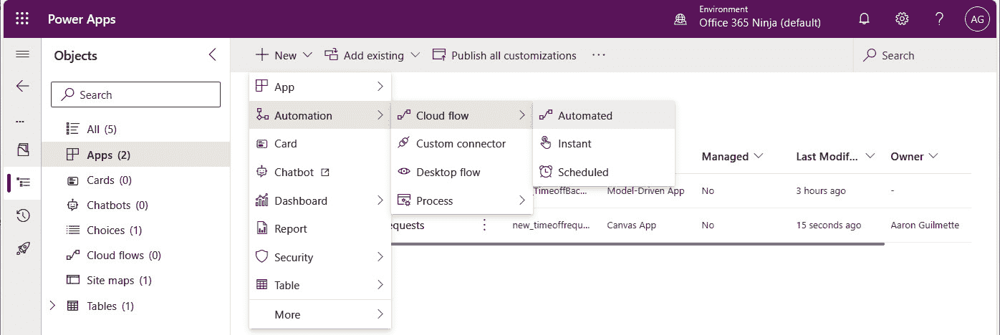

图 5.28 – 创建新流程

1.  在**构建自动化云流程**向导中，输入**流程名称**值并选择**当行被添加、修改或删除**的 Microsoft Dataverse 触发器：

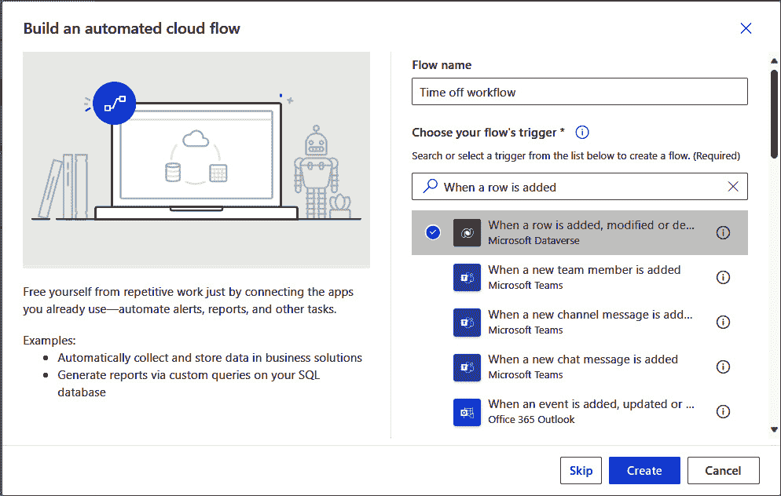

图 5.29 – 选择触发器

1.  点击**创建**。

1.  更新触发器。为此，在**更改类型**下选择**添加**。然后，在**表名**下选择**休假表**选项。最后，在**范围**下选择**组织**：

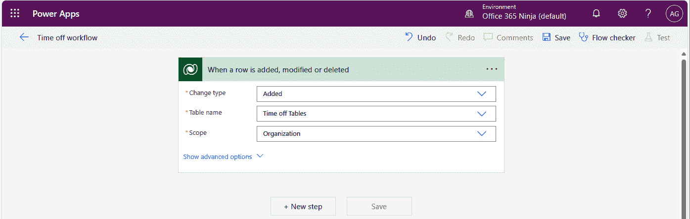

图 5.30 – 更新触发器

1.  点击**新建步骤**。

1.  在**开始并等待**中，选择如图*图 5**.31*所示的**开始并等待审批**操作：

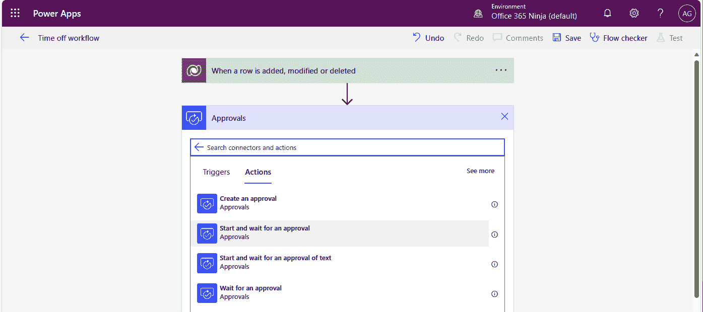

图 5.31 – 选择开始并等待审批操作

1.  使用**动态内容**令牌填写审批：

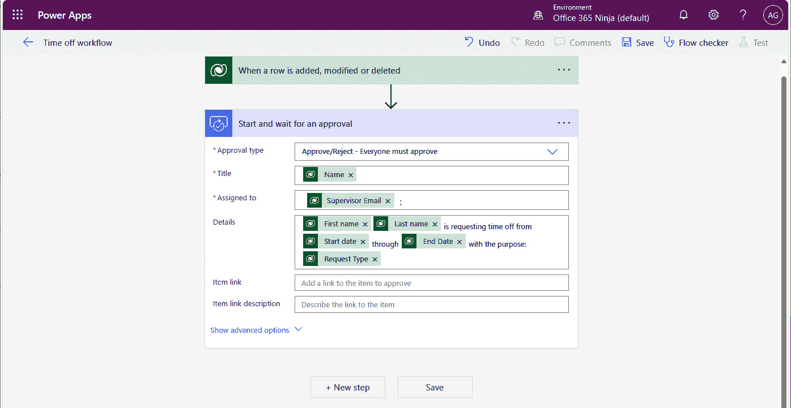

图 5.32 – 填写审批步骤

1.  点击**新建步骤**并选择**条件**控件。

1.  在第一个**批准**：

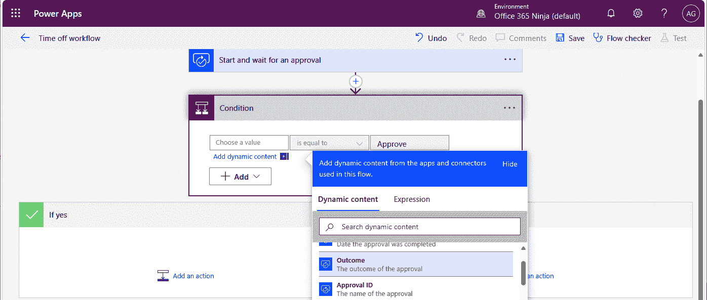

图 5.33 – 填充条件

1.  在**是**分支中，点击**添加****一个操作**。

1.  选择**发送****电子邮件（V2）**。

1.  使用动态内容令牌和文本填充电子邮件响应。

1.  在 **如果没有** 分支中，点击 **添加** **操作**。

1.  选择 **发送** **电子邮件（V2）**。

1.  使用动态内容标记和文本填充电子邮件响应。

1.  查看流程。参见 *图 5.34*：

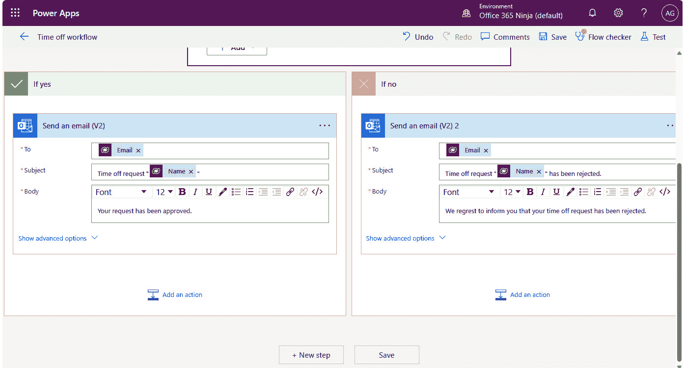

图 5.34 – 完成流程

1.  点击 **保存**。

完成此操作后，您可以启动画布应用程序输入数据，然后使用模型驱动应用程序检查提交的数据。这样，最终用户有一个简单的前端可以与之交互，而经理或审批者则可以更全面地查看组织的休假请求。

# 进一步探索

有几种方法可以提高这些应用程序的可用性。例如，您可以通过更改 **默认** 属性来自动填充请求者的姓名或电子邮件地址（以及经理的姓名和地址），而不是接受默认值：

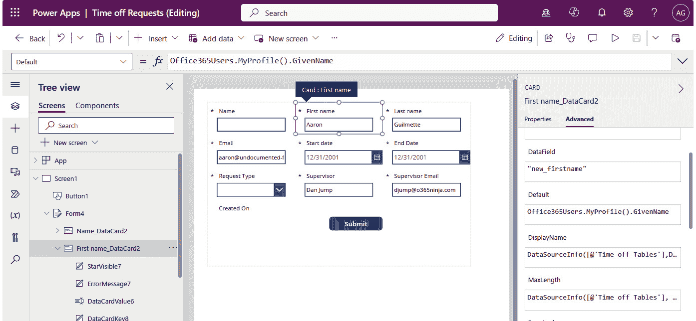

图 5.35 – 更改默认属性

尝试使用 *表 5.2* 中显示的值更新控件，以提高应用程序的可用性：

| **字段** | **更新后的默认** **属性值** |
| --- | --- |
| 名字 | `Office365Users.MyProfile().GivenName` |
| 姓氏 | `Office365Users.MyProfile().SurName` |
| 电子邮件 | `Office365Users.MyProfile().Mail` |
| 监督员 | `Office365Users.Manager(Office365Users.MyProfile().UserPrincipalName).DisplayName` |
| 监督员邮箱 | `Office365Users.Manager(Office365Users.MyProfile().UserPrincipalName).Mail` |

表 5.2 – 建议的默认属性值

尽管这个特定的解决方案不是最复杂的，但它可以用来展示 Power Platform 和协作者的能力。

# 摘要

协作者有潜力成为公民（和专业）开发者工具箱中的一个真正强大的补充。然而，正如您从我们与它的互动中看到的，它既不是万无一失的，也不是理解 Power Platform 的工作原理的替代品。在撰写本文时，Dataverse 和模型驱动应用程序没有协作者界面，当在 Power Platform 解决方案上下文中启动时，Power Automate 也没有。

协作者仍处于起步阶段，因此您可以期待它在接下来的几个月和几年里变得更好。话虽如此，如果您需要构建一个应用程序，并且您从对 Power Apps 知识最少的地方开始，您可能想从一些基础知识开始，例如 Matthew Weston 和 Elisa Barcena Martin 的 *Learn Microsoft Power Apps, 2nd Edition*。

在下一章中，我们将探讨如何使用 Power Platform 的一部分 AI Builder 工具来分析客户反馈。
