# 第七章：使用情感分析处理数据

到目前为止，我们已经探讨了使用 AI（特别是微软的 Copilot 和 ChatGPT）来帮助我们创建和修改工具（如流程和应用程序）。虽然它们可能很有帮助，但通常需要大量的额外努力才能让这些通用助手完成非常具体的步骤导向任务。

Power Platform 允许您利用 AI 在广泛的内容和数据类型上做出判断，以帮助在机器速度下模仿人类评估。

例如，人类可以轻易地扫一眼名片，就能辨认出人的姓名和职位，无论这些信息在名片上的位置如何。然而，对于传统的计算机逻辑来说，这项任务要困难得多。随着名片设计的演变，数据字段发生变化，这使得传统的自动化引擎识别和识别变得更加具有挑战性。AI 模型引入了数据的相关意识，简化了自动化过程，使其类似于人类的表现。另一个例子可能是确定客户对某个产品或服务的感受。对于人类来说，推断客户的电子邮件是否有快乐或愤怒的语气相对容易，但使用标准的编程逻辑则要困难得多。

Power Platform 提供了访问各种 AI 能力的途径——无论是利用为特定类型任务训练的现有 AI 模型，还是将数据输入更通用的 AI 工具以对内容进行推理。Power Platform 的本地 AI 模型分为两大类：**预构建模型**（针对特定类型的数据集和狭窄的内容领域进行训练的模型）和**自定义模型**（具有一些核心训练但需要额外的定制和与您的数据进行训练的模型）。

# 那么，情感分析究竟是什么呢？

简而言之，情感分析回答的问题是：“*在这段内容中存在哪些类型的情感？*”Power Platform 的情感分析模型可以检查一段内容，并返回以下四种情感之一：

+   积极

+   消极

+   中立

+   混合

在处理文本时，情感分析 AI 模型为每个句子以及整个内容返回一个情感值。除了情感值之外，情感分析还提供置信度评分，表示模型对其评估的信心程度，评分范围在 0 到 1 之间，其中 1 表示更有信心，0 表示信心不足。然而，情感分析确实有其局限性——例如，如果内容中存在错误或不恰当的用词——这可能会影响评分。

本章的场景基于一家虚构公司，该公司使用客户服务邮箱作为评论和投诉的渠道。业务目标是处理电子邮件并确定情感。如果情感是消极的，解决方案应将消息发布到 Teams 频道，以便服务代表跟进客户。

让我们开始吧！

# 许可证必备条件

在 Power Platform 中使用 AI 模型和连接器有几个必备条件：

+   包含 Microsoft Dataverse 的订阅

+   AI Builder 容量（或试用容量）

+   Power Apps 或 Power Automate 高级许可

获取适当数量许可的最简单方法是注册包含 Power Apps 和 Power Automate 高级许可以及一定数量的 AI Builder 容量信用额的 Microsoft 365 E5 试用版。

如果您已有 Microsoft 365 订阅，您可以从 Microsoft 365 管理中心（[`admin.microsoft.com`](https://admin.microsoft.com)）注册 Power Apps 或 Power Automate 高级许可，如图 *图 6**.1* 所示：

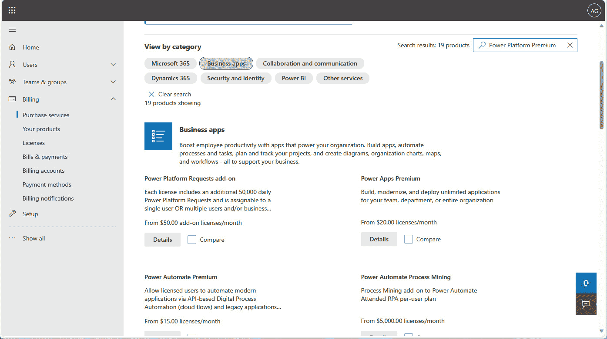

图 6.1 – Microsoft 365 管理中心

您可以在 Power Platform 管理中心（[`admin.powerplatform.microsoft.com/resources/capacity#add-ons`](https://admin.powerplatform.microsoft.com/resources/capacity#add-ons)）下的 **资源** > **容量** 查看您的 AI Builder 容量分配情况，如图 *图 6**.2* 所示：

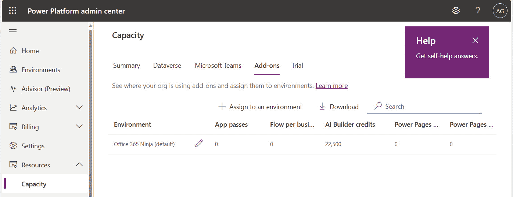

图 6.2 – 查看 Power Platform 容量

接下来，我们将查看构建解决方案的必备条件。

# 配置解决方案必备条件

一旦您解决了许可证问题，您还需要设置一些事情以确保此演示可以工作：

+   邮箱（无论是标准邮箱还是 Exchange Online 中的共享邮箱）

+   至少拥有默认通用频道的 Microsoft 团队

虽然不是必需的，但拥有一个免费的电子邮件账户（例如 Outlook.com 或 Gmail.com 账户）来验证解决方案是否端到端工作也是有帮助的。

## 创建共享邮箱

首先，我们将指导您创建一个共享邮箱。共享邮箱本身不需要任何特殊许可，但需要授权用户访问：

1.  登录到 Microsoft 365 管理中心（[`admin.microsoft.com`](https://admin.microsoft.com)）。从那里，展开 **团队与组** 并选择 **共享邮箱**。

1.  如 *图 6**.3* 所示，点击 **添加共享邮箱**：

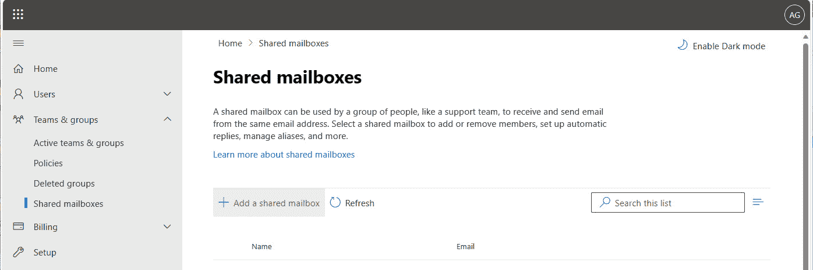

图 6.3 – 查看共享邮箱

1.  在 **添加共享邮箱** 弹出窗口中，输入 **名称** 值并根据需要调整 **电子邮件** 地址：

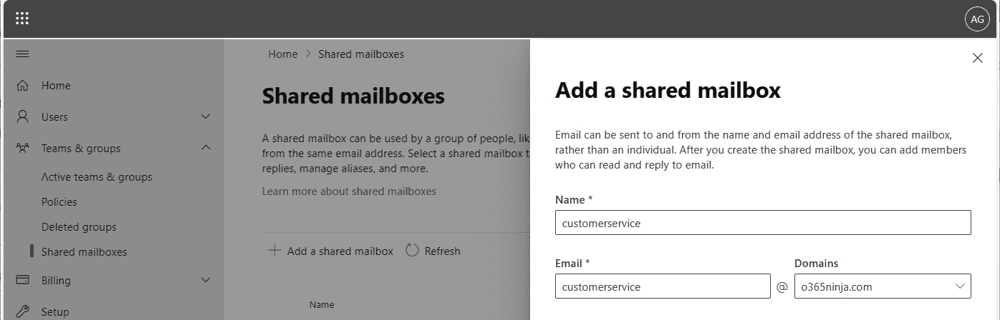

图 6.4 – 创建共享邮箱

1.  点击 **添加成员到您的** **共享邮箱**：

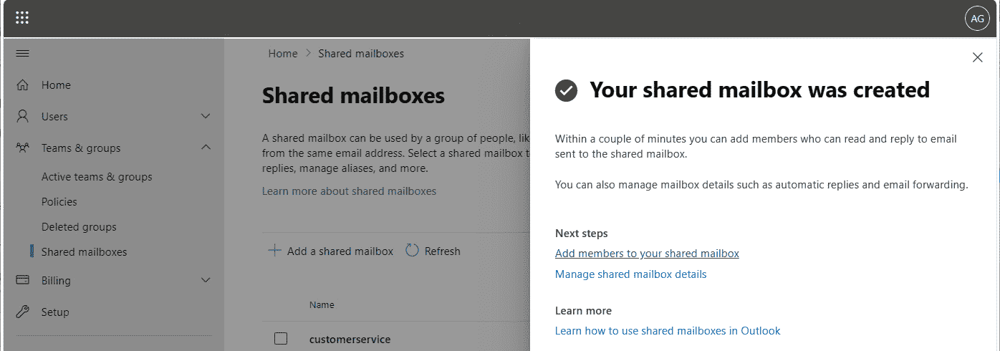

图 6.5 – 查看新创建的邮箱

1.  在 **共享邮箱成员** 弹出窗口中，点击 **添加成员**，选择组织中的至少一个拥有邮箱许可的用户，然后点击 **添加**。

1.  关闭弹出窗口。

当使用 Power Automate 时，您需要使用在 *步骤 5* 中授予访问权限的账户的凭证。

接下来，您需要创建一个团队。

## 创建 Microsoft Teams 团队

Microsoft Teams 团队将用于接收来自 Power Automate 的通知。要从 Microsoft 365 管理中心创建团队，请按照以下步骤操作：

所有道路都通向罗马

在 Microsoft 365 中完成同一任务的方法有很多。虽然这些步骤详细说明了通过 Microsoft 365 管理中心创建团队（因为我们已经在这里），您也可以直接从 Microsoft Teams 中完成。要了解如何使用 Teams 来完成此任务，请访问[`support.microsoft.com/en-au/office/create-a-team-from-scratch-in-microsoft-teams-174adf5f-846b-4780-b765-de1a0a737e2b`](https://support.microsoft.com/en-au/office/create-a-team-from-scratch-in-microsoft-teams-174adf5f-846b-4780-b765-de1a0a737e2b)。

1.  从 Microsoft 365 管理中心([`admin.microsoft.com`](https://admin.microsoft.com))，展开**团队和组**，然后选择**活动团队****和组**。

1.  在**团队和 Microsoft 365 组**选项卡上，点击**添加****团队**。

1.  在**添加团队**向导的**基本**页面，为团队提供一个**名称**值并点击**下一步**：

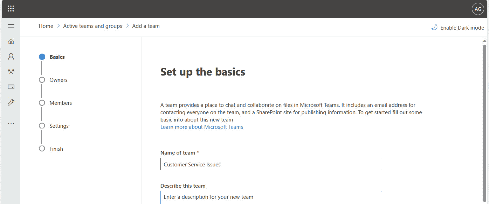

图 6.6 – 创建新的团队

1.  在**所有者**页面，添加至少一个所有者（例如管理共享邮箱的账户）。然后，点击**下一步**。

1.  在**成员**页面，添加任何其他成员并点击**下一步**。

1.  在**设置**页面，输入**团队电子邮件地址**值。然后，点击**下一步**：

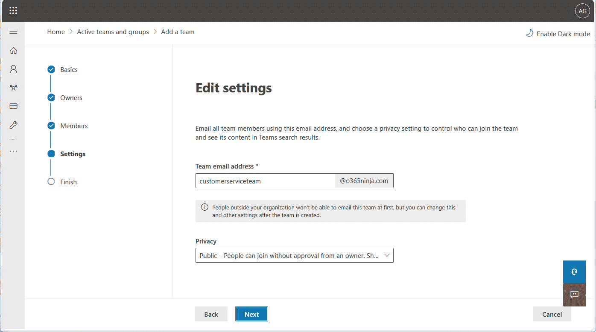

图 6.7 – 为团队配置电子邮件地址

1.  在**完成**页面，检查设置并点击**添加团队**。

现在，让我们进入有趣的部分！

# 配置情感分析流程

如您在本章前面所学，情感分析提供了一种评估内容语气并提供输出的机制。为了应对处理负面客户反馈的业务场景，您可以使用情感分析流程来处理收到的共享邮箱中的消息。

如果我遇到困难怎么办？

如果您因为某些原因遇到障碍（找不到功能、选项没有显示或某些内容不清楚），帮助只需点击一下！您可以从我们的 GitHub 网站下载本章的工件：[`github.com/PacktPublishing/Power-Platform-and-the-AI-Revolution`](https://github.com/PacktPublishing/Power-Platform-and-the-AI-Revolution)。

让我们创建流程：

1.  导航到 Power Automate 制作门户([`make.powerautomate.com`](https://make.powerautomate.com))。

1.  从导航菜单中选择**创建**。

1.  在**从空白开始**下，选择**自动****云流程**：

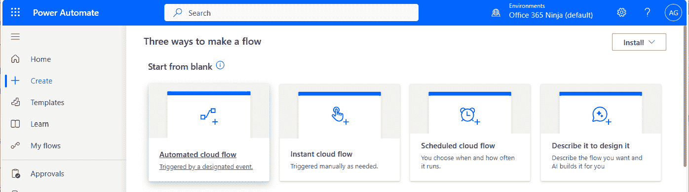

图 6.8 – 开始一个新的流程

1.  在**构建自动化云流程**向导中，输入**流程名称**值然后选择**当共享邮箱中收到新电子邮件（V2）**触发器。完成后点击**创建**：

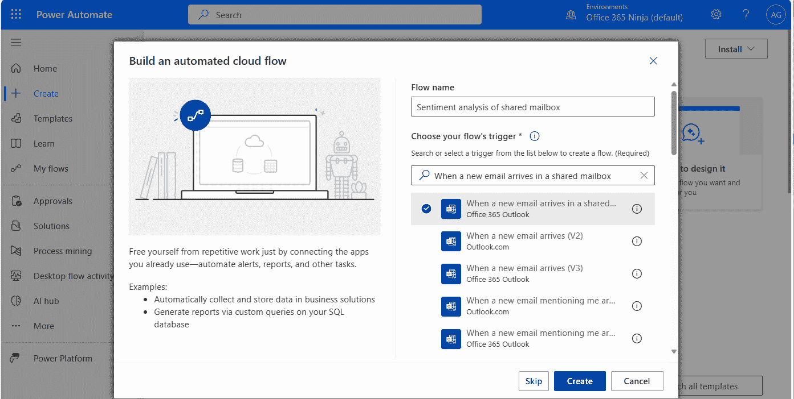

图 6.9 – 选择流程的触发器

1.  在画布区域，选择**当共享邮箱中收到新电子邮件（V2）**触发器。

1.  在弹出窗口中，如果屏幕显示有关无效连接的消息，则点击**更改连接**链接。参见 *图 6**.10*：

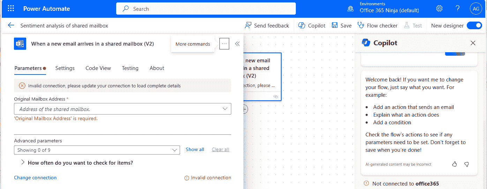

图 6.10 – 配置共享邮箱

1.  选择将用于验证邮箱的凭据。如果凭据未列出，则点击**添加新**并提供对共享邮箱有访问权限的账户的用户名和密码。

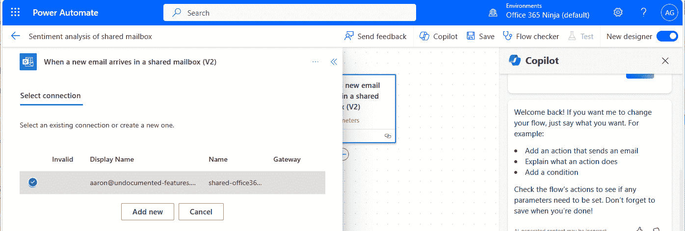

图 6.11 – 更新连接设置

1.  在弹出窗口的**参数**选项卡中，输入将用于接收客户电子邮件的共享邮箱的电子邮件地址。当提示时，选择**使用 <电子邮件地址> 作为** **自定义值**。

1.  点击**<<** （**收起**）图标以关闭弹出窗口。

1.  在画布区域，点击触发器下的**+**图标以添加新步骤，然后点击**添加** **操作**：

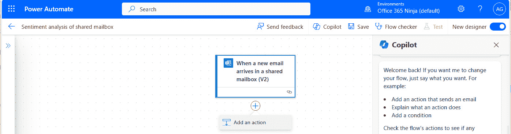

图 6.12 – 添加新操作

1.  在搜索框中的`detect`并选择**检测文本中使用的语言**操作，如图 *图 6**.13* 所示：

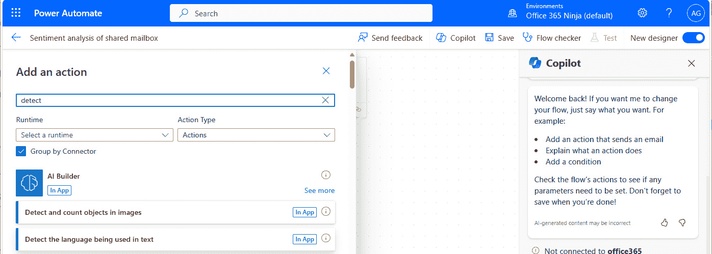

图 6.13 – 选择检测文本中使用的语言操作

1.  在**检测文本中使用的语言**弹出窗口中，点击**文本**框内的位置。选择闪电图标以展开动态内容选择器：

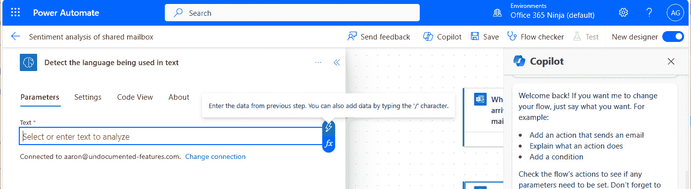

图 6.14 – 配置检测文本中使用的语言操作

1.  选择**正文**标记：

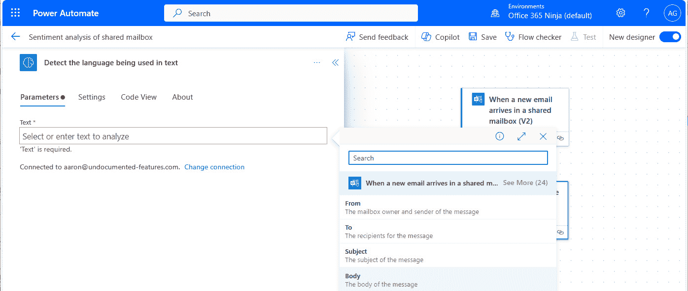

图 6.15 – 选择正文标记

1.  收起弹出窗口。

1.  点击**For each**循环组件外的**+**图标并选择**添加** **操作**。

1.  在搜索框中的`sentiment analysis`并选择**分析文本中的积极或消极情绪**操作。

1.  在**分析文本中的积极或消极情绪**弹出窗口中，选择**语言**下拉菜单并选择**输入自定义值**。选择闪电图标以显示动态内容选择器：

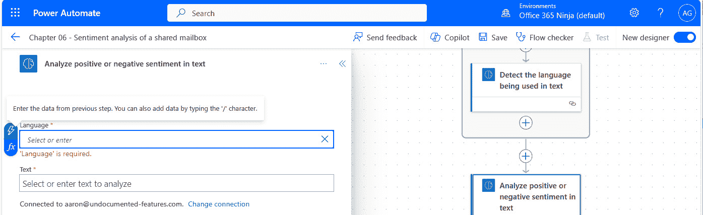

图 6.16 – 配置语言字段

1.  选择闪电图标以显示动态内容选择器。

1.  在动态内容选择器中，在**检测文本中使用的语言**操作下，选择**语言**动态内容标记：

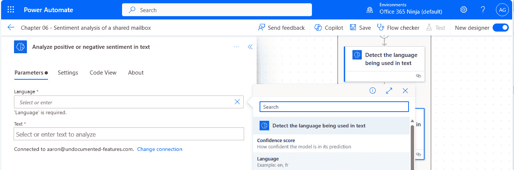

图 6.17 – 选择语言动态内容令牌

1.  在**文本**字段内点击并选择动态内容选择器。

1.  在动态内容选择器中，在**当共享邮箱（V2）中收到新电子邮件**操作下，选择**正文**令牌。

1.  收起飞出窗口。

1.  查看到目前为止的流程。它应该看起来与*图 6.18*中所示排列相似：

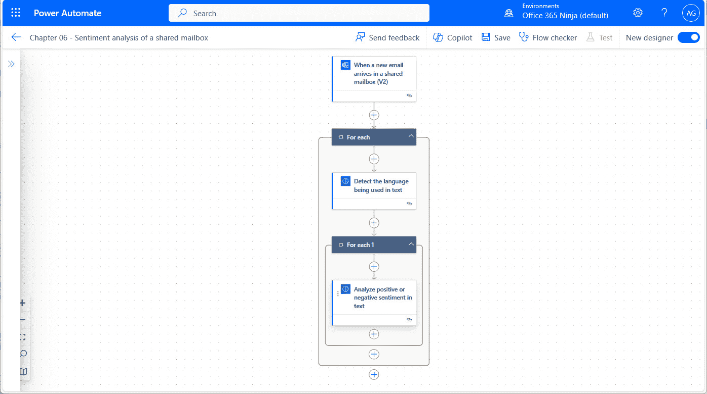

图 6.18 – 查看流程的当前状态

1.  在包含**分析文本中的正面或负面情感**操作的嵌套**For each**循环容器内，点击**+**图标以**添加****一个操作**。

1.  在搜索框的`条件`中，选择位于**控制**下的**条件**操作。

1.  在**条件**飞出窗口中，点击左侧文本框并选择动态内容选择器。

1.  在动态内容选择器中，在**分析文本中的正面或负面情感**下，选择**整体文本情感**令牌。如果该令牌不在默认选择列表中显示，您可能需要点击**查看更多**：

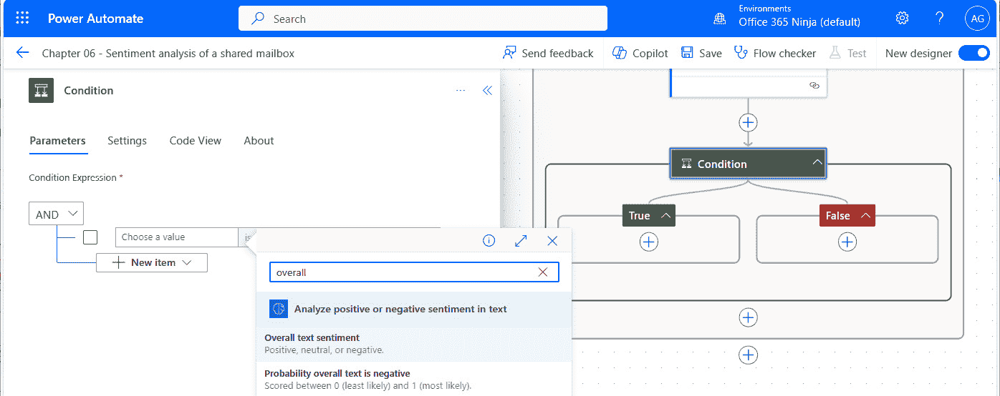

图 6.19 – 选择整体文本情感令牌

1.  在右侧文本框中输入`negative`：

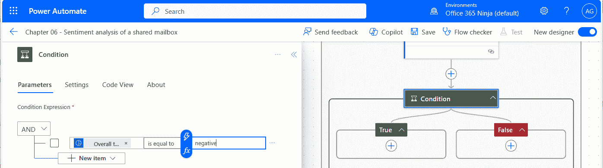

图 6.20 – 配置条件评估

1.  收起飞出窗口。

1.  在条件的**真**分支中，点击**+**图标以**添加****一个操作**。

1.  在搜索框中，输入`发布消息`并选择**在聊天或频道中发布消息**的 Microsoft Teams 操作：

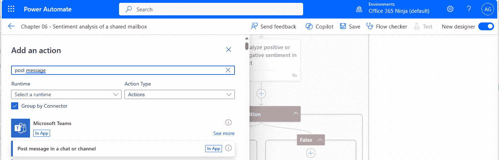

图 6.21 – 添加在聊天或频道中发布消息的操作

1.  在**在聊天或频道中发布消息**的飞出窗口中，点击**登录**以创建连接。为将用于发布到 Teams 的用户账户提供凭据。

1.  在**发布为**下拉菜单中，选择**流程机器人**。

1.  在**发布到**下拉菜单中，选择**频道**。

1.  在**团队**下拉菜单中，搜索您在*许可* *先决条件*部分创建的团队。

1.  在**频道**下拉菜单中，选择**通用**。

1.  在**消息**文本框中，为要发布到频道的消息添加详细信息。您可以使用富文本格式选项，以及从动态内容令牌中选择。参见*图 6.22*：

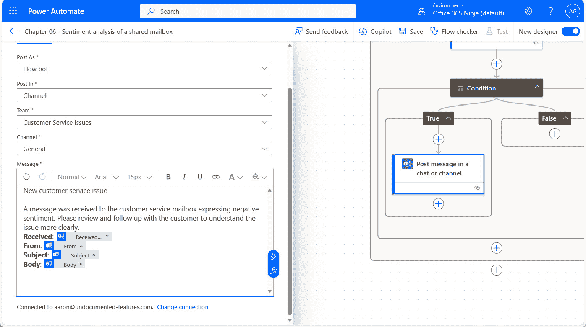

图 6.22 – 配置在聊天或频道中发布消息的操作

1.  收起飞出窗口。

1.  查看流程布局，并检查任何明显的错误。参见*图 6.23*：

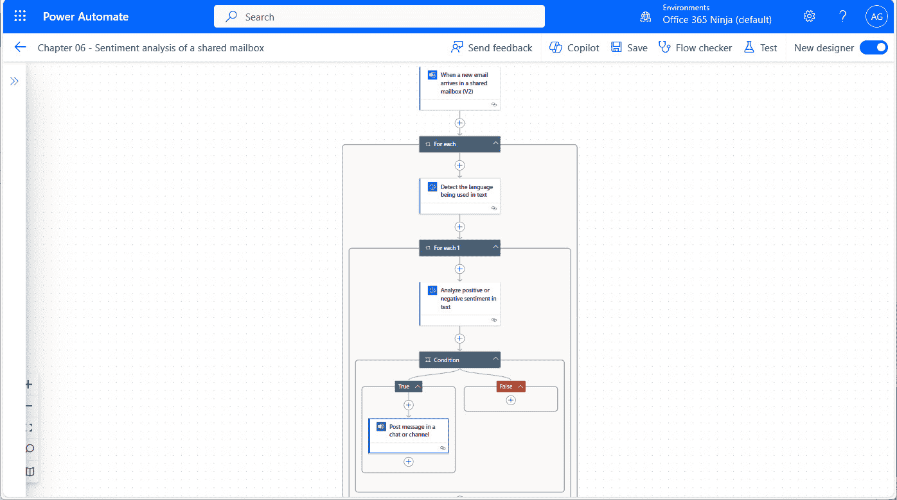

图 6.23 – 查看整体流程

1.  在菜单栏上，点击**保存**以保存流程。

检查流程以确保步骤已配置。完成后，就是时候测试它了！

# 测试流程

现在，是时候确保一切按预期工作：

1.  从菜单栏中选择**烧杯**图标（**测试**）：

图 6.24 – 测试流程

1.  选择**手动**单选按钮并点击**测试**。

1.  通过向配置的共享邮箱发送电子邮件来测试您的流程。确保措辞强烈，以确保您表达的是不满：

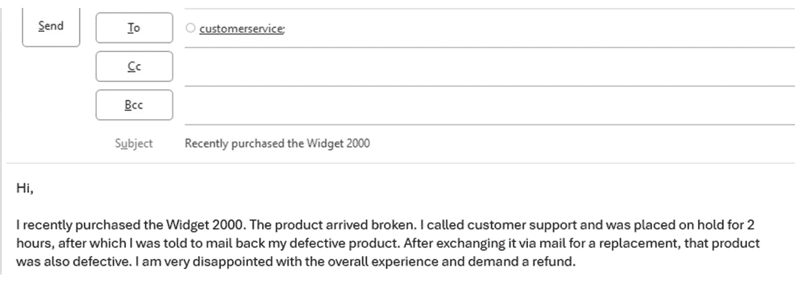

图 6.25 – 编写测试电子邮件

1.  发送电子邮件后，Power Automate Maker Portal 中的流程运行历史应开始更新：

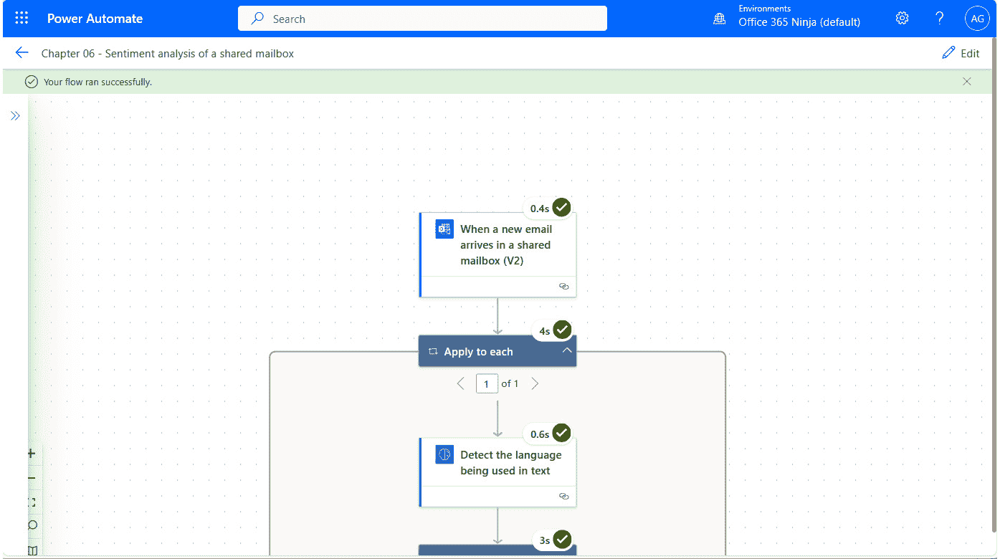

图 6.26 – 流程执行结果

1.  打开 Microsoft Teams（或导航到[`teams.microsoft.com`](https://teams.microsoft.com)）并验证渠道帖子是否已发布：

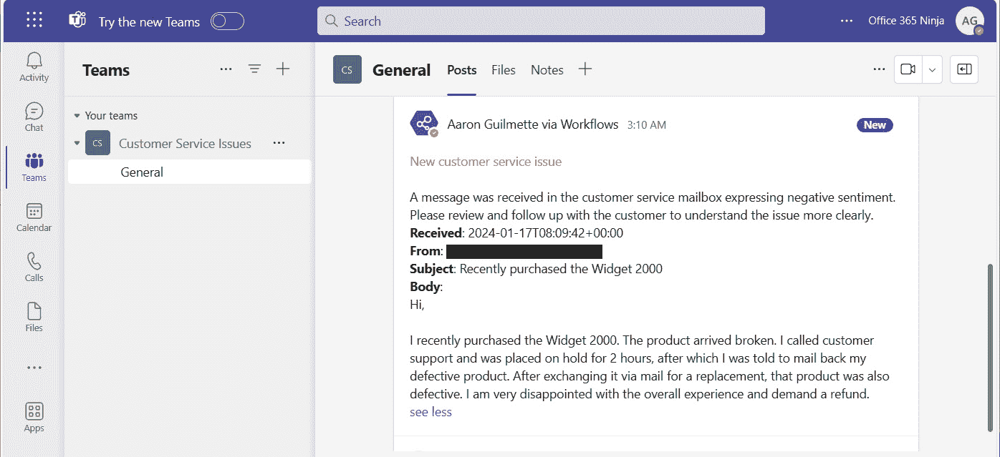

图 6.27 – 验证渠道帖子

# 进一步探索

根据您的需求和其它连接的系统，您可能能够扩展和增强此解决方案，包括执行以下操作的流程：

+   连接到电子商务平台并为未来购买生成折扣优惠券代码

+   通过电子邮件回复客户并启动退款

+   与快递承运商集成以生成邮寄标签

在这方面已经覆盖后，让我们总结一下本章所学的内容。

# 摘要

AI Builder 模型具有许多开箱即用的功能。在本章中，你学习了如何利用 AI 处理客户服务邮箱中接收到的电子邮件。通过情感分析模型，你能够检测电子邮件是否具有整体积极或消极的语气，然后触发额外的操作，在 Teams 频道对话中发布通知。

在下一章中，我们将探讨如何使用 Power Automate 与 AI 服务将简单的 Word 文档转换为 PowerPoint 演示文稿。
