# 第十章：实施一个 AI 赋能的简历筛选器

在某个时候，您可能需要负责招聘某人——至少，您需要审查一堆简历并尝试筛选出优秀的候选人。

如果您发布了一个热门的工作帖子，您可能会面临数十份、数百份甚至数千份简历。您如何有效地筛选这些简历？

关键词匹配可能是一种您可以采用的策略。从 AI 那里获得帮助怎么样？AI 模型可能能够做些什么？让我们来看看！

# 设计解决方案

这个解决方案将基于本书中已经学到的某些技能，包括使用 Power Automate 流程和 AI Builder 功能。在这个解决方案中，您将使用 AI 处理候选人简历，提取关键信息，并将候选人与一份工作描述列表进行比较，以查看他们是否有资格。AI 模型确定有资格的候选人将被发布到 Teams 频道。

以下图表表示解决方案背后的逻辑过程：

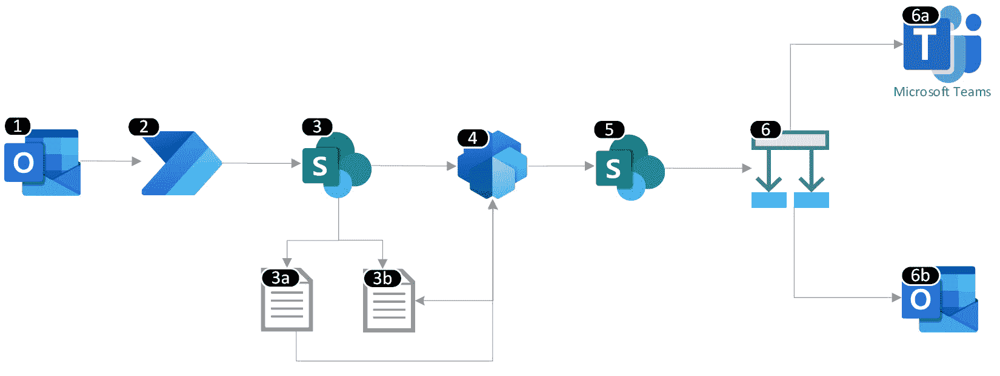

图 9.1 – 查看解决方案工作流程

让我们分解一下：

1.  简历由共享邮箱接收。

1.  Power Automate 检索文档并将其发送到 SharePoint。

1.  SharePoint 用于维护申请人的状态信息：

    1.  简历文档本身存储在 SharePoint 库中。

    1.  候选人的引用存储在 SharePoint 列表中的一个条目中。

1.  AI Builder 处理简历并使用提取的候选人信息更新 SharePoint 列表。

1.  AI Builder 还评估候选人与 SharePoint 中存储的工作描述的匹配度。

1.  AI Builder 的输出决定流程如何进行：

    1.  如果候选人是潜在匹配项，将向 Teams 频道发送通知。

    1.  如果候选人不符合条件，将向候选人的电子邮件地址发送拒绝邮件。

此解决方案以两种方式使用 AI：

+   为了提取**实体**信息（例如一个人的姓名和电子邮件地址）

+   为了推理文本以确定内容的含义

这个项目中有很多移动部件，所以让我们开始吧！

# 许可前提条件

在 Power Platform 中使用 AI 模型和连接器有几个前提条件：

+   包含 Microsoft Dataverse 的订阅

+   AI Builder 容量（或试用容量）

+   Power Apps 或 Power Automate 高级许可

+   包含 Microsoft Teams 的订阅

+   包含 Exchange Online 的订阅，以便您可以配置共享邮箱

+   Cloudmersive 免费层账户

如果您还没有启用 Dataverse 和 AI Builder 容量，请参阅*第二章*，*配置支持 AI 服务的环境*，以及*第六章*，*使用情感分析处理数据*。

# 配置解决方案前提条件

在开始工作流配置之前，您需要设置一些先决条件，例如 Microsoft Teams，以及一些 SharePoint 列表和文档库。由于 Microsoft Teams 中的所有团队都包含一个 SharePoint 站点，您只需利用该团队的 SharePoint 站点组件即可——这为您（以及您的 IT 环境）节省了空间。

## 创建共享邮箱

创建共享邮箱是一个相对简单的任务。这个邮箱将由提交简历的候选人使用。要配置共享邮箱，请按照以下步骤操作：

1.  导航到 Microsoft 365 管理中心([`admin.microsoft.com`](https://admin.microsoft.com))。

1.  在导航菜单中，展开**团队和组**并选择**共享邮箱**。

1.  点击**添加共享邮箱**。

1.  输入`resumes`。确认电子邮件地址的输入并点击**保存更改**。

1.  在邮箱创建完成后，选择**将成员添加到您的共享邮箱**，如图*图 9.2*所示：

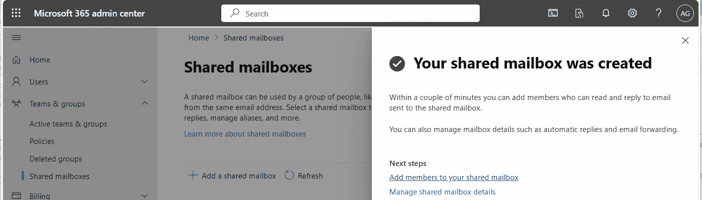

图 9.2 – 向共享邮箱添加成员

1.  在**共享邮箱成员**弹出窗口中，选择**添加成员**。

1.  选择一个或多个用户（例如你自己）并点击**添加**。

接下来，您将创建一个团队，该团队将用于存储简历和候选人信息（因为团队的一个组成部分是 SharePoint 站点），以及通知其他人潜在候选人已提交简历申请某个职位。

## 创建团队

创建团队的过程同样简单。您可以从 Microsoft Teams 或 Microsoft 365 管理中心创建一个。由于我们已经在 Microsoft 365 管理中心，我们将使用该界面。按照以下步骤操作：

1.  从 Microsoft 365 管理中心([`admin.microsoft.com`](https://admin.microsoft.com))，展开**团队和组**，然后选择**活动团队和组**。

1.  在**活动团队和组**页面，选择**添加团队**。

1.  在`Jobs and candidates`上，点击**下一步**。

1.  在**所有者**选项卡中，添加至少一个所有者（例如你自己）并点击**下一步**。

1.  在**成员**选项卡中，可选地添加额外的团队成员。点击**下一步**。

1.  在`jobsandcandidates`)上，将**隐私级别**设置为**公共**并点击**下一步**。

1.  验证设置并点击**添加团队**以完成。

1.  点击**关闭**。

一旦团队已配置，就到了将内容迁移到 SharePoint 的时候了。

## 配置 SharePoint Online

如前所述，每个 Microsoft Teams 团队都会获得一个 SharePoint 站点。对于此解决方案，我们将使用一些 SharePoint 列表和文档库。

进一步阅读

有关组成 Microsoft Teams 团队对象的组件的更多信息，请参阅[`www.undocumented-features.com/2021/07/05/a-deeper-dive-into-teams-architecture/`](https://www.undocumented-features.com/2021/07/05/a-deeper-dive-into-teams-architecture/)。

让我们逐步了解确保 SharePoint Online 正确配置的要求。第一步是创建一个文档库，用于存储候选人的申请文档。

### 配置 SharePoint 文档库

此解决方案需要一个存储位置来保存候选人的简历。虽然您可以使用默认的文档库，但因为它显示名称（**文档**）与其实际名称（**共享文档**）不同，所以往往会引起更多的故障排除。

要创建新的 SharePoint 文档库，请按照以下步骤操作：

1.  从 Microsoft 365 管理中心([`admin.teams.microsoft.com`](https://admin.teams.microsoft.com))，展开**团队和组**并选择**活动团队和组**。

1.  选择您在上一节中创建的团队。

1.  在弹出窗口中，点击**查看网站**以导航到团队的连接 SharePoint 网站。见*图 9**.3*：

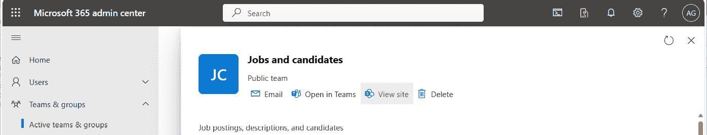

图 9.3 – 导航到团队的连接 SharePoint 网站

1.  点击**新建**，然后选择**文档库**。

1.  在**创建新文档库**页面，选择**空白库**。

1.  在**名称**字段中输入`简历`，然后点击**创建**。

就这些！接下来，我们将创建一些 SharePoint 列表。

### 配置 SharePoint 列表

在本节中，您将创建两个 SharePoint 列表——一个列出角色名称和描述，另一个用于存储候选人信息。按照以下步骤操作：

1.  导航到**工作和候选人**SharePoint 网站主页。

1.  点击**新建**，然后选择**列表**。

1.  在**创建列表**页面，选择**空白列表**。

1.  输入`角色`，然后点击**创建**。

1.  在**角色**列表中，点击**添加列**。选择**多行文本**作为类型，然后点击**下一步**。

1.  `职位描述`并点击**保存**。

1.  点击**主页**以返回到网站的首页。

1.  点击**新建**，然后选择**列表**。

1.  在**创建列表**页面，选择**空白列表**。

1.  输入`候选人`，然后点击**创建**。

1.  使用*表 9.1*中的列名和类型，重复将列添加到**候选人**列表的过程：

    | **列名** | **列类型** |
    | --- |
    | **名字** | **文本** |
    | **姓氏** | **文本** |
    | **电话号码** | **文本** |
    | **电子邮件** | **文本** |
    | **当前公司** | **文本** |
    | **当前角色** | **文本** |
    | **候选人摘要** | **多行文本** |
    | **简历链接** | **文本** |
    | **AI 筛选** | **是/否**；默认值**否** |
    | **服务台技术人员** | **选择**：**是**/**否**/**可能**（您也可以使用**文本**作为列类型） |
    | **原因** | **多行文本** |

表 9.1 – SharePoint 列表列信息

小技巧

之后，我们将创建一个流程来填充**简历链接**列的文件 URL。如果你想使其可点击，你可以自定义字段格式。选择**简历链接**列，指向**列设置**，然后点击**格式化此列**。将以下 JSON 粘贴到文本框中，然后点击**保存**：

`{ "$schema": "https://developer.microsoft.com/json-schemas/sp/v2/column-formatting.schema.json", "elmType": "a", "txtContent": "@currentField", "attributes": { "target": "_blank", "href": "=@currentField" } }`

### 配置工作描述

这个简历筛选解决方案的一个目标是可以确定候选人是否适合某个角色。为了做到这一点，你需要定义角色信息。有许多方法可以导入工作描述数据；在这个例子中，我们将使用之前创建的**角色**SharePoint 列表。

寻找好的样本工作描述

为了让 AI 模型确定简历是否与工作匹配，你需要好的工作描述（最好是那些你可以找到相应简历的工作描述）。你可以使用[`resources.workable.com/job-descriptions/`](https://resources.workable.com/job-descriptions/)这样的网站来检索样本工作描述。

要添加工作描述，请按照以下步骤操作：

1.  导航到你在**职位和候选人**网站中之前创建的**角色**SharePoint 列表。

1.  点击**新建**。

1.  在**标题**字段中输入角色或工作标题。

1.  在**职位描述**文本区域字段中输入工作描述。

1.  点击**保存**。

重复此过程，添加几个工作标题和描述。在本章中，我们将只关注匹配单个工作描述（例如 IT 服务台技术员）。

在线内容

你可以从本书的 GitHub 网站下载样本简历：[`github.com/PacktPublishing/Power-Platform-and-the-AI-Revolution`](https://github.com/PacktPublishing/Power-Platform-and-the-AI-Revolution)

## 配置 AI 模型

到目前为止，你已经使用了几种不同的 AI 技术：

+   提示，例如 AI Builder 的**生成式 AI**（**GenAI**）提示或 Open AI 的 ChatGPT

+   Power Platform 的 Copilot

+   预构建的 AI Builder 模型，例如情感分析模型

在这些示例中，你已经提供了在运行时（即在流程或应用程序的上下文中）要分析或处理的内容。然而，在这个解决方案中，你将使用一个需要训练的 AI 模型。

在这个背景下，训练意味着向模型展示一个样本数据集，然后突出显示哪些数据是重要的以及如何将识别的数据映射到字段。由于我们正在构建简历筛选器，训练数据应该代表你可能期望处理的简历。你可以从 LinkedIn 或互联网等搜索来源获取样本。你也可以向同事、家人或朋友索要简历。模型通过看到大量不同类型的样本表现最佳。

寻找好的样本数据

你需要几个示例的原因是，这样你可以训练 AI 模型如何识别某些字段。当 AI 模型学会了与某些字段相关联的数据类型时，关键项或实体提取效果最佳。例如，如果一个人看到*123 Main Street, Chicago, IL*，他们很容易就能确定这是一个地址。除非经过其他训练，否则 AI 模型只会看到数字和字母。为了帮助增强你的训练数据，你可以从像[`www.beamjobs.com/resumes`](https://www.beamjobs.com/resumes)这样的网站下载示例简历。务必寻找包含你之前添加到**角色**列表中的职位和职位描述的简历模板。

### 训练 AI 模型

要训练 AI 模型，请按照以下步骤操作：

1.  导航到 Power Automate 制作门户([`make.powerautomate.com`](https://make.powerautomate.com))。

1.  从导航菜单中选择**AI 中心**。

1.  选择**AI 模型**：

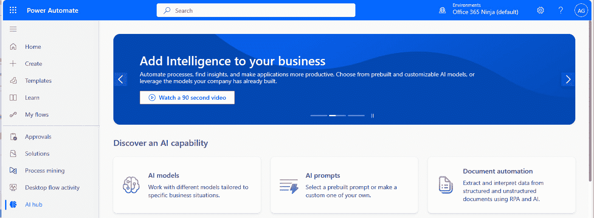

图 9.4 – 探索 AI 中心

1.  从顶部导航栏选择**文档**，然后选择**从文档中提取自定义信息**自定义模型：

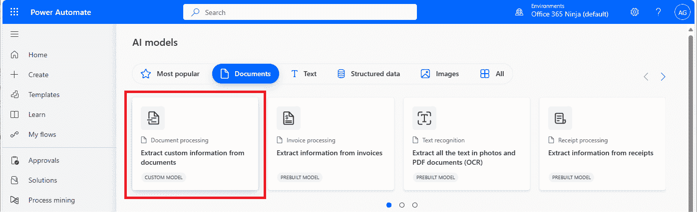

图 9.5 – 选择自定义模型

1.  在**从文档中提取自定义信息**页面，选择**创建自定义模型**，如图*图 9**.6*所示：

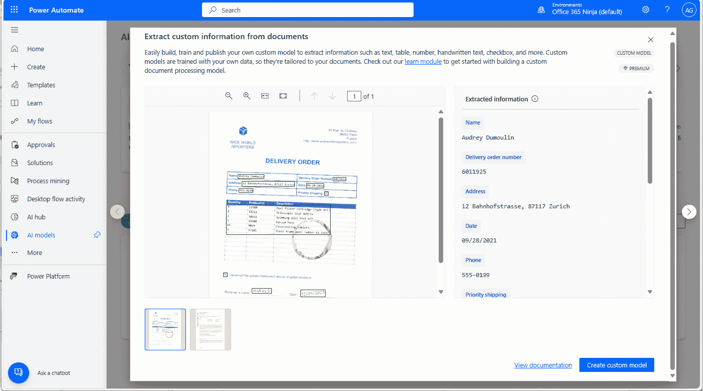

图 9.6 – 创建自定义模型

1.  在**选择文档类型**页面，选择**非结构化文档**：

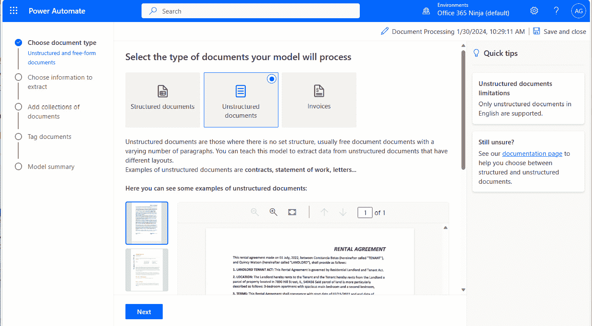

图 9.7 – 选择非结构化文档

1.  点击**下一步**。

1.  在**选择要提取的信息**页面，点击**添加**并选择**文本**：

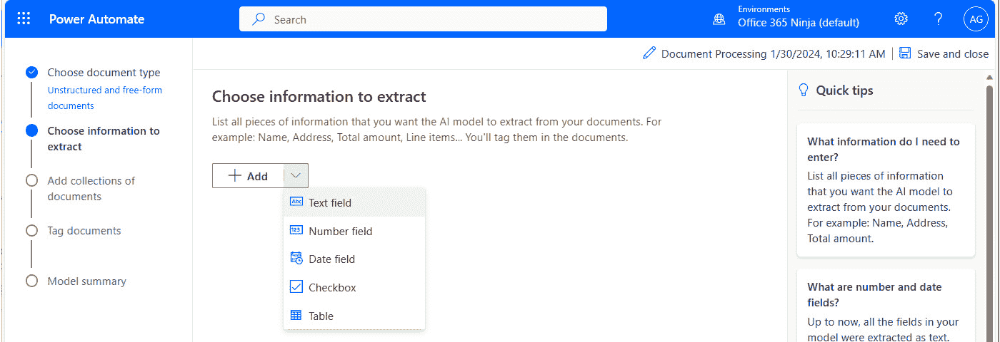

图 9.8 – 选择要提取的信息

1.  在**文本字段**弹出窗口中，为该字段输入**姓名**。点击**完成**。

1.  为**姓氏**、**电子邮件**、**电话号码**、**当前角色**和**当前公司**添加额外的文本字段。完成后点击**下一步**。

1.  在**添加文档集合**页面，点击**新建集合**，如图*图 9**.9*所示：

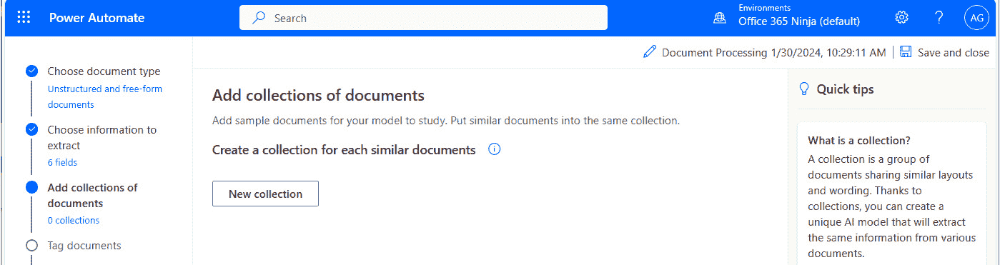

图 9.9 – 添加文档集合

1.  点击**+**号将文档添加到集合中。

1.  在**集合 1**弹出窗口中，点击**添加文档**：

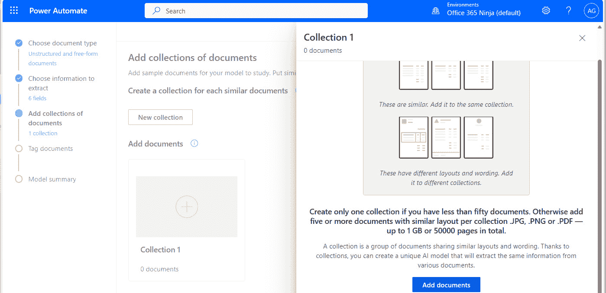

图 9.10 – 向集合中添加文档

1.  选择存储你的样本数据的位置。

1.  选择要包含在集合中的文档，然后点击**添加**：

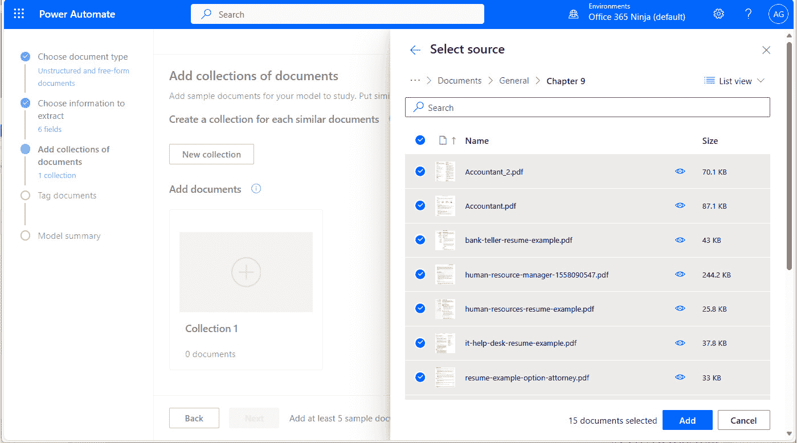

图 9.11 – 选择集合中的文档

1.  在**上传文档**页面，点击**上传文档**。

1.  上传完成后，点击**完成**。

1.  点击**下一步**。

1.  对于集合中的每个文档，选择文档中与**文本**字段（**姓名**、**姓氏**、**电子邮件**、**电话号码**、**当前角色**、**当前公司**）之一对应的文本。选择一个字段的文本后，选择适当的字段来映射此项目。请参阅*图 9.12*：

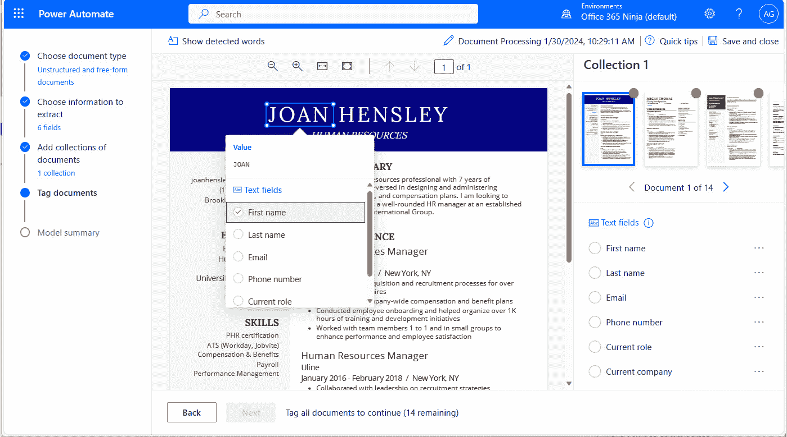

图 9.12 – 标记字段

1.  在为所选文档标记所有字段后，使用集合面板中的导航箭头移动到集合中的下一个文档。对每个文档重复选择和标记过程。在文档中标记每个字段后，文档缩略图将更新为带有复选标记的图标，表示已完成。如果样本文档中没有字段，请选择字段旁边的省略号，并选择**文档中不可用**。请参阅*图 9.13*：

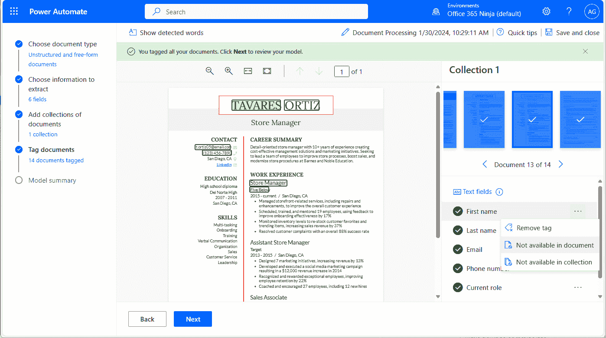

图 9.13 – 查看已标记完整的文档

1.  当所有文档都已标记后，点击**下一步**。

1.  在**模型摘要**页面上，点击**训练**。模型训练可能需要几分钟到几小时不等。在训练作业提交后，点击**转到模型**。

您可以在**AI 模型** > **我的模型**页面上查看状态，如图*图 9.14*所示：

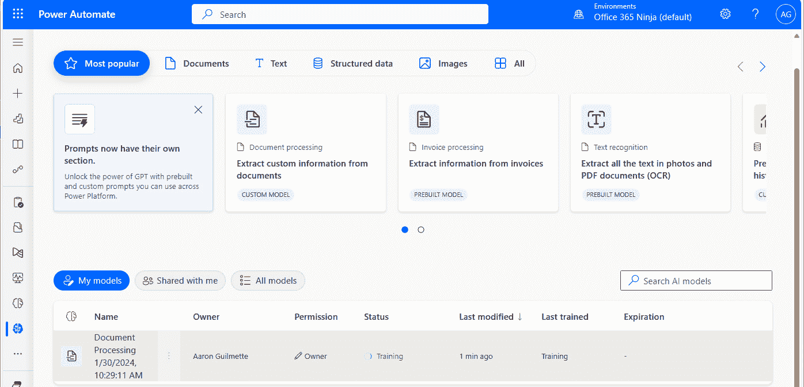

图 9.14 – 查看模型训练

如果需要，您可以修改`简历识别`。如果您的环境中有多个已训练的 AI 模型，这将帮助您轻松识别它。

### 测试模型

模型完成训练后，您应该测试它以确保它返回所需的结果。

要测试一个模型，请按照以下步骤操作：

1.  从**AI 中心**设置中，通过点击其名称来打开模型。

1.  在**训练文档**下，选择**快速测试**：

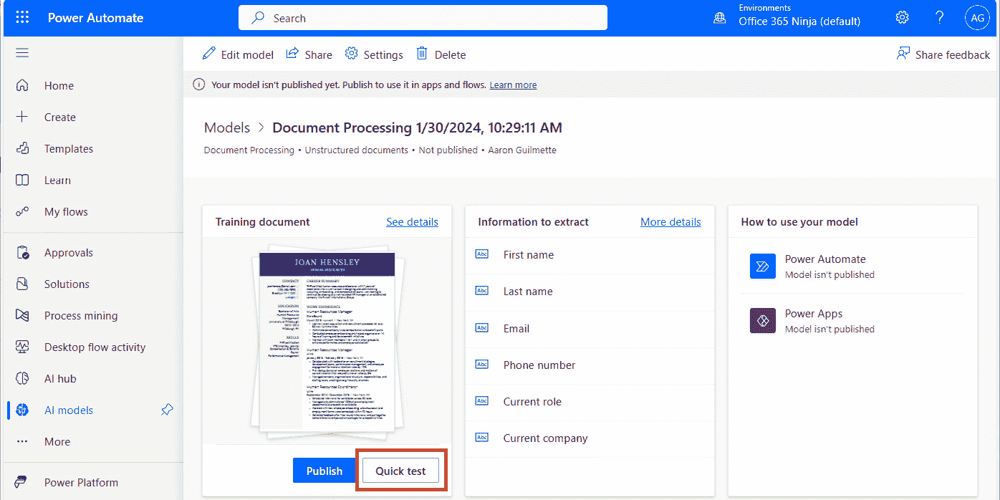

图 9.15 – 运行快速测试

1.  在**快速测试**页面上，点击**从我的设备上传**并浏览到样本简历文档（最好是您没有用于训练的文档）。

1.  如果它无法识别某些字段或您发现它将数据映射到错误的字段，您可能需要通过向集合中添加更多参考文档并重新运行训练来更新模型。

### 发布模型

在您对模型的数据识别满意后，您需要通过**发布**它来使其对 Power Platform 可用。要发布模型，请点击一个已训练的模型，然后选择**发布**：

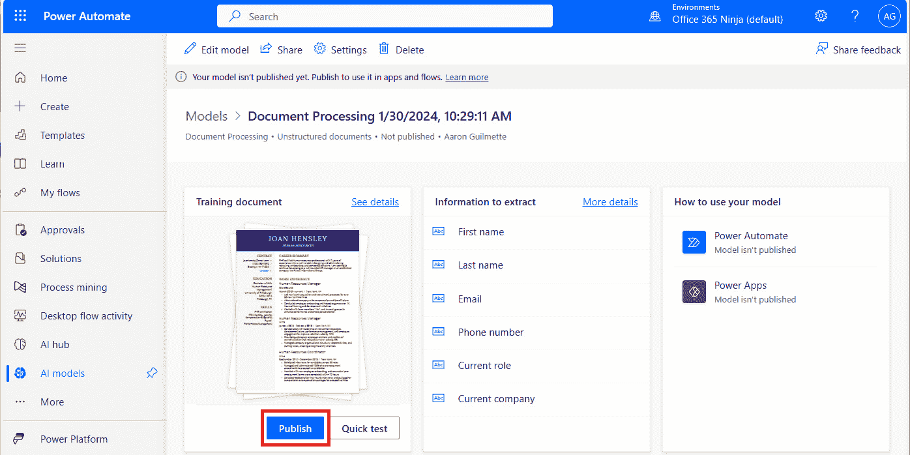

图 9.16 – 发布模型

接下来，让我们去注册一个连接器，以便使一些文本操作变得更容易。

## 启用 Cloudmersive 连接器

一些 AI Builder 动作需要您指定一个文档类型参数，或者只能以文本形式接收输入。由于最终用户可能会发送各种类型的文档（如 Word 文档或 PDF 文件），您需要能够相应地格式化数据。

虽然您可以使用一些条件控制和组合语句来完成一些工作，但为什么不使用工具来简化您的工作呢？Cloudmersive 的连接器使内容转换变得轻而易举！而且，每月有 800 个免费的 API 调用，这是一个相当不错的交易。

要注册，请按照以下步骤操作：

1.  导航到 [`portal.cloudmersive.com/signup`](https://portal.cloudmersive.com/signup)。

1.  填写表格并点击**立即注册**。

1.  在**选择计划**页面，选择**免费层**。

1.  在**选择您的角色以完成账户设置**页面，选择代表您工作类型的角色。

1.  在**您希望从哪个 API 开始？**页面，选择**文档和数据转换 API**。

1.  在**您希望使用哪种编程语言？**页面，选择**Microsoft Flow/** **Power Automate**。

1.  在**API 密钥**页面，点击**创建密钥**。

1.  将**免费层密钥**下的**API 密钥**区域的值复制到您可以轻松访问的位置。API 密钥是一个由字母 a 到 f 和数字 0-9 组成的 36 位代码。

现在，是时候开始使用自动化工具了！

# 创建流程

在所有先决条件都准备就绪后，是时候开始使用一些自动化工具了！这个流程将被分为几个部分，以帮助您理解这些动作。

## 配置触发器和变量

在**设计解决方案**部分，我们确定共享邮箱是简历内容将被摄取的方式。在现实世界中，这可能是您选择接收简历的唯一方式。您可能还有一个候选人可以上传简历的网站，甚至可能配置第三方职位发布服务以存储或转发简历。在任何情况下，流程都将非常相似。触发器将取决于您可用的访问、轮询或通知方法。

为了简化起见，此示例将使用共享邮箱。

此流程将使用**变量**——本质上，是可以在流程中用作临时内容或值的占位符。将构建四个变量：

+   `RoleFitJson`：用于存储评估候选人简历的 AI Builder 动作的 JSON 输出。

+   `RoleFit`：一个词的答案，表示候选人是否适合。示例流程将输出三个潜在值之一——**是**、**可能**和**否**。

+   `RoleFitSummary`：AI Builder 评估的简要描述或理由。这有助于您的组织映射到微软的负责任 AI 原则中的透明度。

+   `CandidateSummary`：候选人简历的简要总结。

在整个流程中，我们将使用我们各种 AI 解决方案生成的值来更新它们。

如果我遇到困难怎么办？

如果由于某种原因遇到障碍（找不到功能、选项未显示或某些内容不明确），帮助只需点击一下！您可以从我们的 GitHub 网站下载本章节的工件：[`github.com/PacktPublishing/Power-Platform-and-the-AI-Revolution`](https://github.com/PacktPublishing/Power-Platform-and-the-AI-Revolution)。

要配置流程，请按照以下步骤操作：

1.  导航到 Power Automate 制作门户([`make.powerautomate.com`](https://make.powerautomate.com))并选择**创建**。

1.  在**从空白开始**下，选择**自动化****云流程**。

1.  在`Process resumes`)上选择**当共享邮箱中收到新电子邮件时（v2）**触发器。点击**创建**。

1.  选择**当共享邮箱中收到新电子邮件时（V2）**触发器。在弹出窗口中，输入您在先决条件中创建的共享邮箱的电子邮件地址作为**自定义值**。

1.  在**高级参数**下，选择**仅包含附件**和**包含附件**参数。对于这两个参数，选择**是**。参见*图 9**.17*：

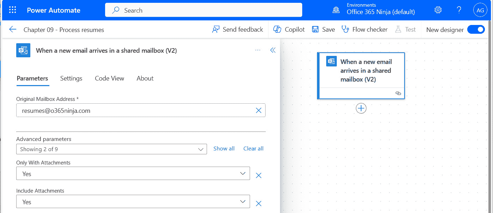

图 9.17 – 配置触发器

1.  点击**添加操作**并选择**初始化变量**变量操作。

1.  将`- RoleFitJson`更新为操作名称。在`RoleFitJson`中，选择**类型**值为**字符串**。参见*图 9**.18*：

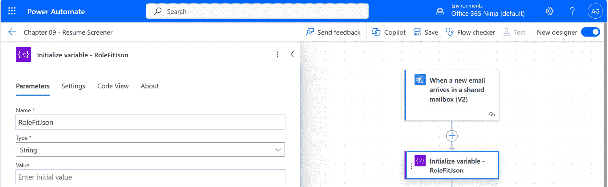

图 9.18 – 添加初始化变量操作

1.  点击**添加操作**并选择**初始化变量**变量操作。

1.  将`- RoleFit`更新为操作名称。在`RoleFit`中，选择**类型**值为**字符串**。

1.  点击**添加操作**并选择**初始化变量**变量操作。

1.  将`- RoleFitSummary`更新为操作名称。在`RoleFitSummary`中，选择**类型**值为**字符串**。

1.  点击**添加操作**并选择**初始化变量**变量操作。

1.  将`- CandidateSummary`更新为操作名称。在`CandidateSummary`中，选择**类型**值为**字符串**。

现在，我们将处理保存附件并为候选人添加 SharePoint 列表项。

## 处理附件和候选人记录

在本节中，我们将配置保存附件并添加发送简历的候选人 SharePoint 列表项所需的步骤。请按照以下步骤操作：

1.  在**Initialize variable CandidateSummary**操作之后，添加**创建文件**SharePoint 操作。

1.  将`– Add resume to SharePoint library`更新为操作名称。

1.  在**网站地址**下，选择**工作和候选人**SharePoint 网站。

1.  在**文件夹路径**下，选择**简历**文档库。

1.  在**文件名**字段中，添加一个表达式。添加以下表达式：

1.  `concat(utcNow('yyyyMMddHHmmss'),'_',triggerOutputs()?['body/from'],'_',item()?['name'])`.

    这将根据当前日期（年-月-日-小时-分钟-秒）、发件人的电子邮件地址和原始附件名称构建一个新的文件名，每个名称之间用下划线字符分隔。例如，文件名为 `20240326140005_sender@domain.com_MyResume.pdf` 将表示 2024 年 3 月 26 日 14:00:05 小时从 `sender@domain.com` 收到的文件，原始文件名为 `MyResume.pdf`。虽然这并非完全必要，但它确实有助于跟踪单个简历文件，以确保它们可以轻松地单独识别。

1.  在 **File Content** 字段中，在 **When a new email arrives in a shared mailbox (V2)** 操作下添加 **Attachments Content** 动态令牌。见图 9.19*：

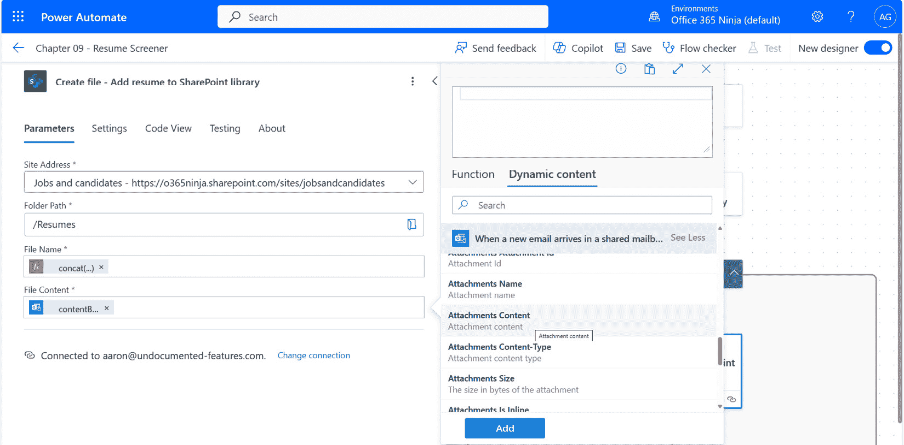

图 9.19 – 添加 SharePoint 创建文件操作

1.  将 `– 获取上传文件属性` 添加到操作名称中。

1.  在 `https://<tenant>.sharepoint.com/sites/jobsandcandidates`，如图 9.20 所示：

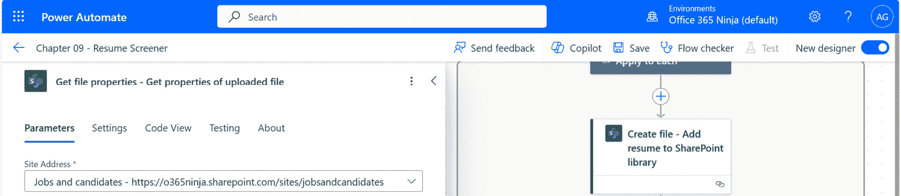

图 9.20 – 选择与团队关联的 SharePoint 网站选择

1.  在 **Library Name** 下，选择 **Resumes** 文档库。

1.  在 **Id** 下，从 **Create file Add resume to SharePoint library** 操作中选择 **Id** 或 **ItemId** 动态内容令牌。它也可能显示为 **body/ItemId** 令牌（取决于你使用的是 **New designer** 或 **Classic designer** 视图），如图 9.21 所示。21*：

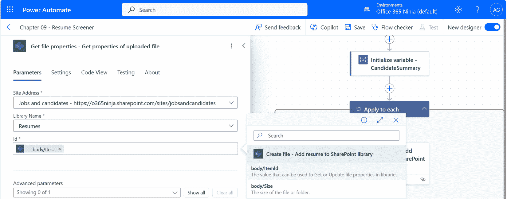

图 9.21 – 添加 ItemId 动态内容令牌

1.  接下来，将 `– 导入简历数据` 添加到操作名称中。

1.  在 **Site Address** 下，选择与 **Jobs and candidates** 团队关联的 SharePoint 网站。这应该是你之前在 *步骤* *8* 中选择的相同网站。

1.  在 **File Path** 下，在 **Create file Add resume to SharePoint library** 操作下添加 **body/Path** 动态内容令牌。见图 9.22*：

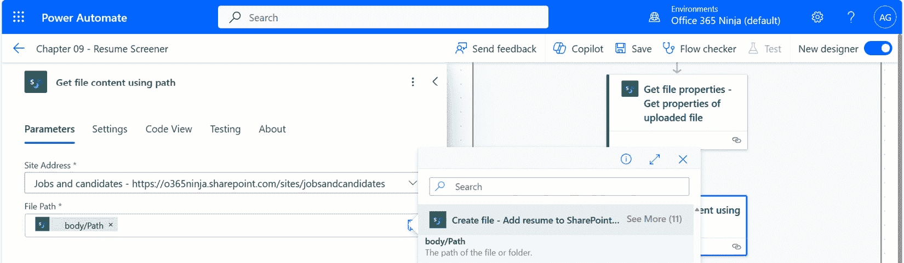

图 9.22 – 添加 body/Path 动态内容令牌

1.  在 `– Candidate list entry` 操作名称之后。

好了！现在是时候点击 **Save** 保存你的进度了！接下来，我们将介绍一个使用你之前训练的模型的新 AI Builder 操作。

## 从简历中提取信息并更新候选人记录

下一个过程将利用文档提取模型。由于模型已经训练好，你实际上不需要做任何事情，只需将文档发送到模型即可。按照以下步骤操作：

1.  在 **Create item Candidate list entry** 操作之后，添加 **Extract information from documents** AI Builder 操作：

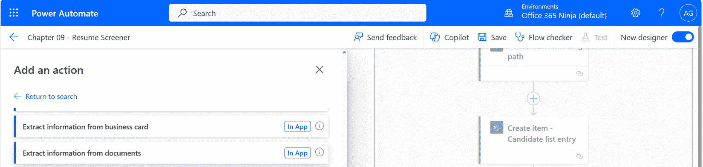

图 9.23 – 添加 AI Builder 操作

1.  将 `– 从简历中提取候选人信息` 添加到操作名称中。

1.  在**AI 模型**下，选择您训练的**简历识别**模型。

1.  在**表单类型**下，选择**PDF**。

1.  在**表单**下，选择**文件内容**动态内容标记，该标记位于**使用路径导入简历数据**动作下：

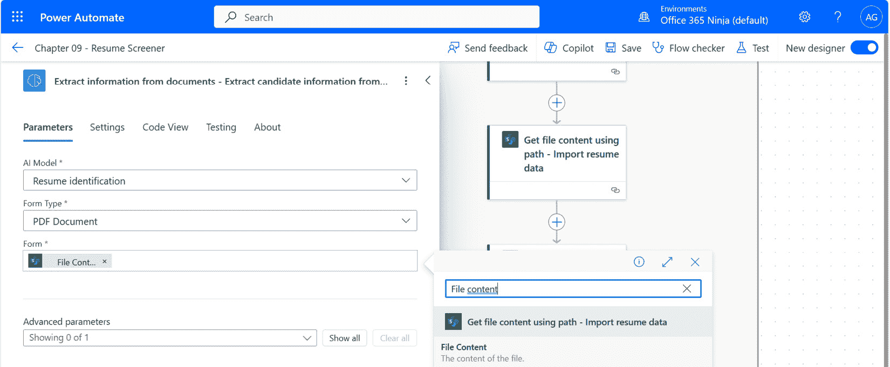

图 9.24 – 配置从文档中提取信息操作

1.  将操作名称添加为`– 更新候选人个人信息`。

1.  在**网站地址**下，选择与**职位和候选人**团队关联的 SharePoint 网站。

1.  在**列表名称**下，选择**候选人**列表。

1.  在**ID**下，选择**创建项目 - 候选列表条目** SharePoint 操作下的**ID**动态内容标记。参见*图 9*.25：

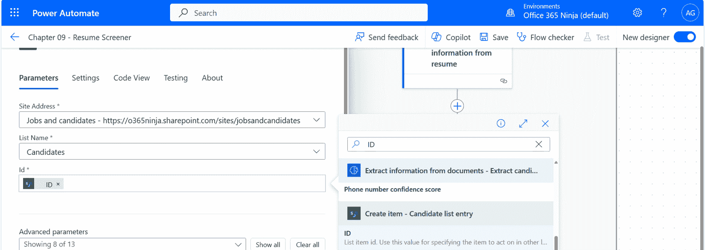

图 9.25 – 选择与候选条目关联的 ID

1.  在**高级参数**下，点击**显示全部**。

1.  在**姓氏**、**名字**、**电话号码**、**电子邮件**、**当前角色**和**当前公司**字段中，添加**从文档中提取候选人信息**动作下的相应动态内容标记，如图*图 9*.26 所示：

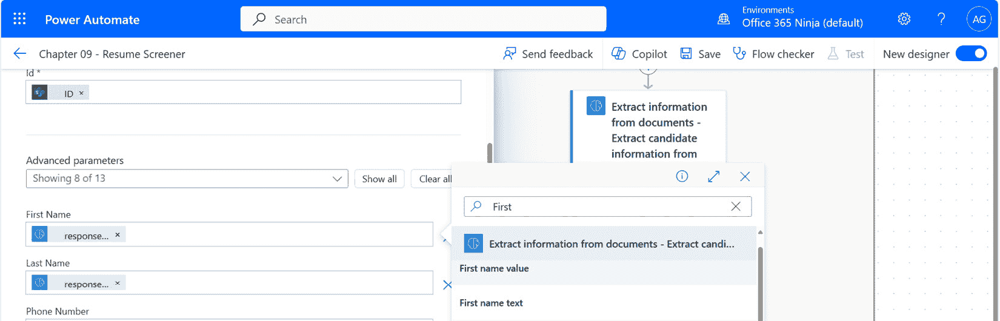

图 9.26 – 将动态内容标记映射到字段

您可以使用*<字段名称>值*或*文本*动态内容标记。为了保持一致性，请为所有字段使用相同的标记类型。

1.  在**简历链接**字段中，添加**项目链接**动态内容标记，该标记位于**获取上传文件属性 获取上传文件属性**动作下。

是时候再次点击**保存**了！到目前为止，您已经将简历处理到从文档中提取关键细节并将其插入到候选人记录的程度。接下来，您将根据职位描述评估简历。

## 使用提示评估简历

在本节中，我们将配置操作以导入其中一个职位描述，并将职位描述和简历的文本发送到 GenAI 提示。按照以下步骤操作：

1.  在动作描述中添加`– 导入职位描述`。

1.  在**网站地址**下，选择**职位和候选人**网站。

1.  在**列表名称**下，选择**角色**。

1.  在**高级参数**下，在下拉菜单中选择**过滤查询**。

1.  在`Title eq 'Service Desk Technician'`：

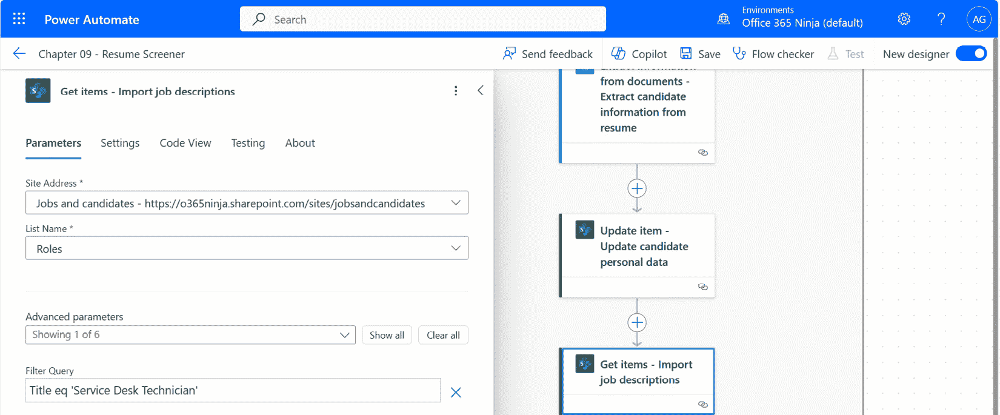

图 9.27 – 编辑过滤查询

1.  在本例中，使用过滤查询选择包含*服务台技术人员*职位描述的列表行。将单引号之间的文本更改为与您要测试的角色描述相匹配。

1.  添加**将 PDF 文档转换为文本（txt）** Cloudmersive 操作：

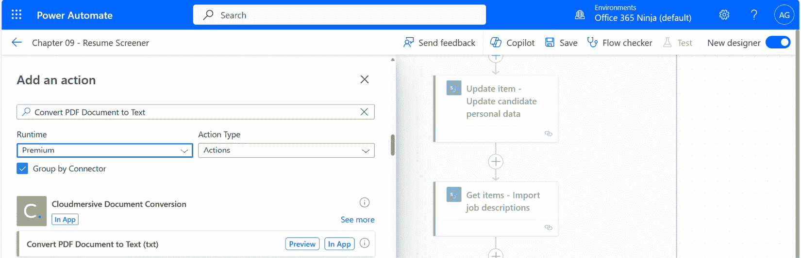

图 9.28 – 添加 Cloudmersive PDF 文档转换动作

1.  在 **创建连接** 弹出窗口中，指定一个 **连接名称** 值，然后输入在 *启用 Cloudmersive 连接器* 部分设置时获得的 **API 密钥** 值。完成后点击 **创建新**。参见 *图 9**.29*：

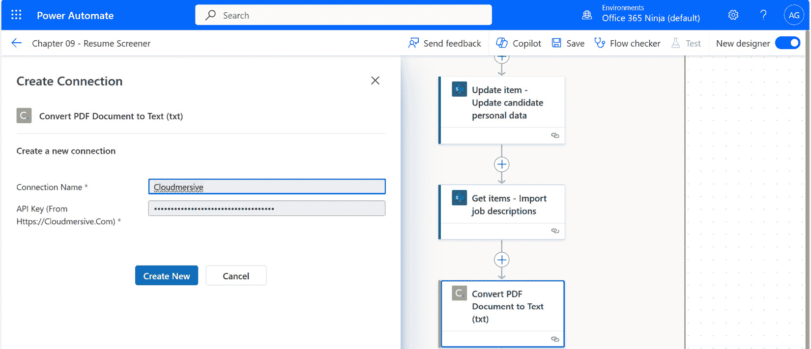

图 9.29 – 配置连接

1.  在 **要执行操作的输入文件** 字段中，添加在 **使用路径获取文件内容 导入简历数据** 动作下 **文件内容** 动态内容令牌。

1.  在 **要执行操作的输入文件（文件名）** 字段中，在 **获取上传文件的属性 获取上传文件的属性** 动作下添加 **带有扩展名的文件名** 动态内容令牌。

    这将导致简历 PDF 文件被转换为文本，以便与 GenAI 提示一起处理。

1.  在动作描述中添加 `– Evaluate candidate against job descript`。

1.  在 **提示** 下，选择 **新** **自定义提示**：

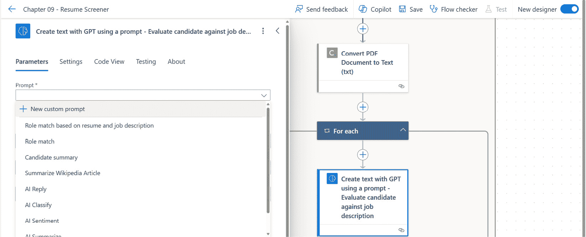


1.  在提示区域中，粘贴以下文本：

    ```py
    You are an HR professional screening candidate resumes. A candidate has submitted the following resume: *CandidateResume*
    You are trying to fill the position *RoleTitle* that has the following job description: *RoleDescription*
    Based only on the information in the supplied role description and the information in the candidate's resume, is this candidate a good fit for the position?
    Output must be structured in a JSON output. The JSON object must have three name value pairs:
    RoleFit: Evaluation of whether candidate is a fit for the role. Possible answers are Yes, No, Maybe.
    RoleFitSummary: Short summary of why candidate was or was not a fit. Limit to 50 words.
    CandidateSummary: Short summary of candidate skills, experience, and work history. Limit to 100 words.
    Only Yes, No, or Maybe answers are accepted for the RoleFit name value pair. Use the following information to determine good fit:
    The resume and the role description should have at least an 80% confidence match to be considered a good fit (Yes).
    If the resume and role description have between and 70% and 80% confidence match, then answer Maybe.
    If the resume and the role description is less than a 70% confidence rating, consider the candidate not a fit (No). You must limit your answers to either Yes, No, or Maybe for the RoleFit name value pair.
    The output data must be a properly formatted JSON object and should be ordered based on the following sample:
    {
    "RoleFit" : "yes",
    "RoleFitSummary" : "50 word description explaining reasoning.",
    "CandidateSummary" : " 100 word summary of candidate skills and experience."
    }
    ```

1.  添加一个 `基于简历和职位描述进行角色匹配`。

1.  将用星号（`*CandidateResume*`, `*RoleTitle*`, 和 `*RoleDescription*`）标记的高亮单词替换为动态值。您可以直接输入正斜杠（`/`）字符或使用 **添加动态值** 按钮来插入动态内容令牌。参见 *图 9**.31* 中的完成提示示例：

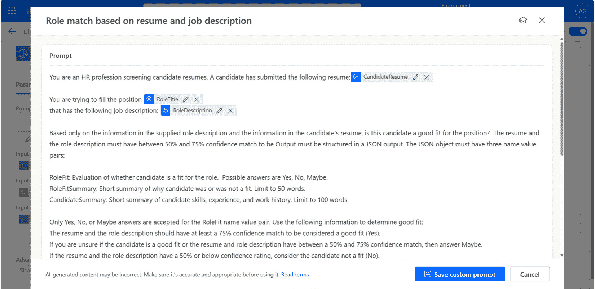

图 9.31 – 编辑提示

1.  点击 **保存** **自定义提示**。

1.  在 **输入角色标题** 字段中，选择在 **获取项目 导入职位描述** 动作下 **标题** 动态内容令牌。

1.  在 **输入候选人简历** 字段中，在 **将 PDF 文档转换为文本（****txt）** 动作下添加 **body/TextResult** 动态内容令牌：

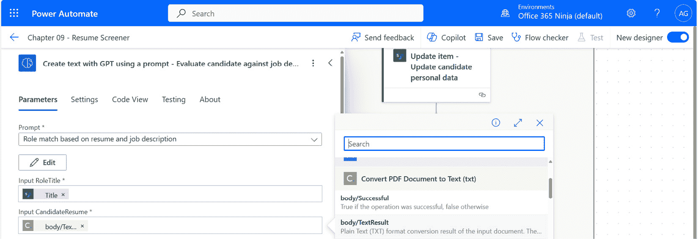

图 9.32 – 添加 Cloudmersive 将 PDF 文档转换为文本（txt）动作

1.  在 **输入角色描述** 字段中，在 **获取项目 导入职位描述** 动作下添加 **JobDescription** 动态内容令牌。

1.  点击 **保存**。

您只剩下几个部分了！接下来，我们将更新一些变量，我们可以使用这些变量来更新 SharePoint 列表中的候选人记录并生成要发布到 Teams 或通过电子邮件发送的消息。

## 更新候选人记录

在本节中，我们将从 GPT 动作生成的数据元素中添加它们回到候选人记录中。按照以下步骤操作：

1.  在动作名称后添加 `– RoleFitJson`。

1.  在 **名称** 字段中，选择 **RoleFitJson**。

1.  在 **值** 字段中，选择在 **使用提示评估与职位描述的候选人** 动作下 **创建文本** 动态内容令牌。

    此动态内容标记包含我们在提示中指定的 JSON 结构：

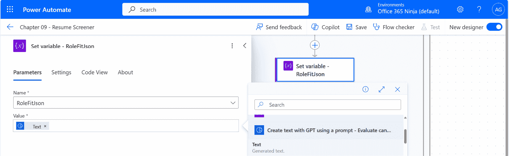

图 9.33 – 添加 GPT 提示文本输出

1.  在动作名称中添加`– 提取生成的 RoleFit 数据`。

1.  在**内容**字段中，添加**RoleFitJson**变量动态内容标记。

1.  在**架构**区域，粘贴以下定义：

    ```py
    {
        "type": "object",
        "properties": {
            "RoleFit": {
                "type": "string"
            },
            "RoleFitSummary": {
                "type": "string"
            },
            "CandidateSummary": {
                "type": "string"
            }
        }
    }
    ```

    此架构用于定义 JSON 数组的结构。注意名称/值对定义及其内容类型。在动作名称中添加`– RoleFit`。

1.  在**名称**字段中，选择**RoleFit**变量。

1.  在**值**字段中，在**解析 JSON 提取生成的 RoleFit 数据**动作下添加**Body RoleFit**动态内容标记。

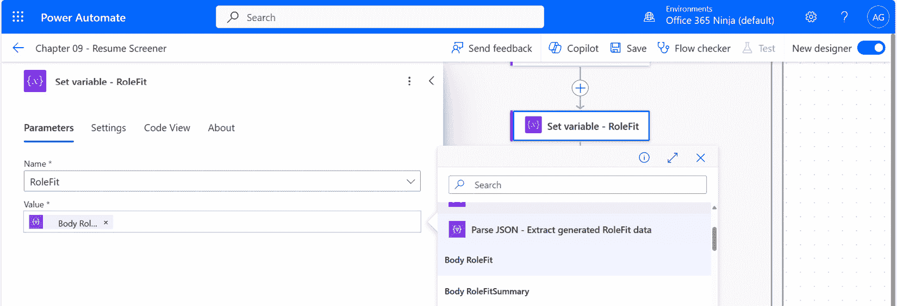

图 9.34 – 选择 RoleFit 内容

1.  在动作名称中添加`– RoleFitSummary`。

1.  在**名称**字段中，选择**RoleFitSummary**变量。

1.  在**值**字段中，在**解析 JSON 提取生成的 RoleFit 数据**动作下添加**Body RoleFitSummary**动态内容标记。

1.  在动作名称中添加`– CandidateSummary`。

1.  在**名称**字段中，选择**CandidateSummary**变量。

1.  在**值**字段中，在**解析 JSON 提取生成的 RoleFit 数据**动作下添加**Body CandidateSummary**动态内容标记。

1.  在动作名称中添加`– 更新候选人状态`。

1.  在**站点地址**下，选择包含候选人简历和列表的 SharePoint 站点。

1.  在**列表名称**下，选择**候选人**。

1.  在**ID**字段中，在**创建项候选人列表条目**动作下添加**ID**动态内容标记。

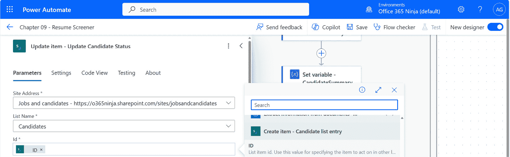

图 9.35 – 配置更新项动作 – 更新候选人状态

1.  在**高级参数**下，点击**显示全部**。

1.  在**候选人摘要**字段中，添加**CandidateSummary**变量。

1.  在**服务台技术人员**字段中，添加**RoleFit**变量。

1.  在**原因**字段中，添加**RoleFitSummary**变量。见*图 9.36*：

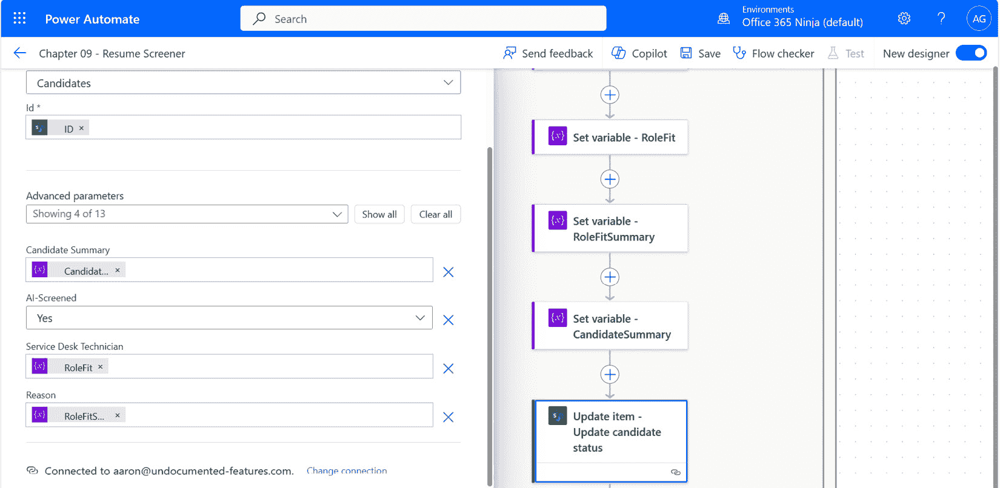

图 9.36 – 添加输出变量

点击**保存**以保存流程上的进度。在最后部分，我们将添加一些通知。

## 发送确认消息

在将候选人的**RoleFit**状态更新为**是**、**否**或**可能**之后，是时候发送一些通知了！请按照以下步骤操作：

1.  在**更新项**动作（更新候选人状态的地方）之后，点击**添加动作**并选择**条件**控件。

1.  将表达式评估从**AND**更改为**OR**。

1.  在第一个框中，添加`Yes`的动态内容标记。

1.  点击**新建项**然后选择**添加行**。

1.  在新行的第一个框中，添加`Maybe`的动态内容标记。见*图 9.37*：

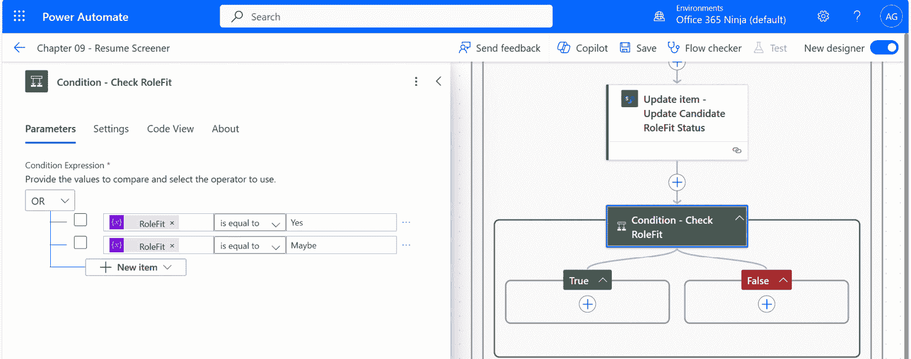

图 9.37 – 为 RoleFit 添加条件控制

1.  在**条件**控制的**真**分支中，添加如图*图 9.38*所示的**在聊天或频道中发布消息**的 Teams 操作：

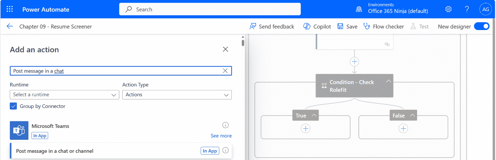

图 9.38 – 添加 Teams 发布消息操作

1.  在**以…发布**下，选择**流程机器人**。

1.  在**发布到**下，选择**频道**。

1.  在**团队**下，选择**工作和候选人**团队。

1.  在**频道**下，选择**通用**。

1.  使用标记，如*候选人摘要*、*角色匹配*和简历链接自定义消息区域：

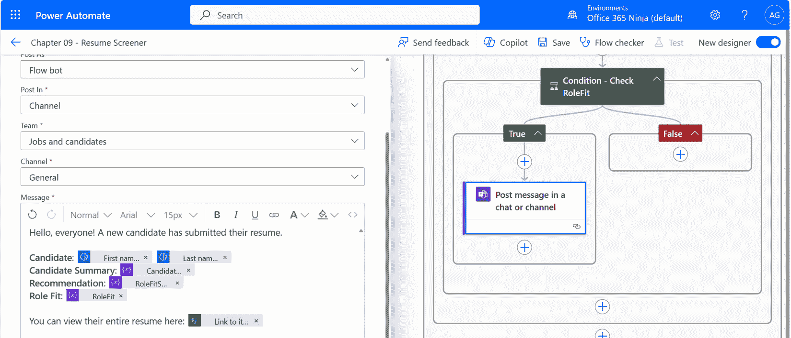

图 9.39 – 创建 Teams 频道通知

1.  在**假**条件分支中，添加**从共享邮箱发送电子邮件（V2）** Office 365 Outlook 操作。

1.  在**原始邮箱地址**字段中，选择**输入自定义值**，然后添加本章中配置的共享邮箱的电子邮件地址。

1.  在**收件人**字段中，添加来自**从简历中提取信息提取候选人信息** AI Builder 操作的**电子邮件值**动态内容标记。这将选择简历中指定的电子邮件地址。

1.  在**主题**字段中，输入一条消息。

1.  在**正文**区域，输入要发送给候选人的消息，可以使用您认为适合消息的任何动态内容标记（例如，来自**提取…** AI Builder 操作的**First name value**标记）：

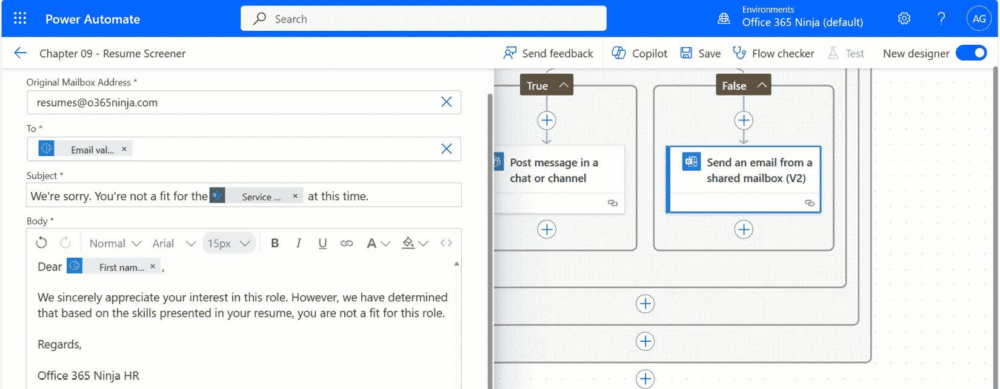

图 9.40 – 自定义电子邮件消息

1.  点击**保存**。

现在是关键时刻！

# 测试流程

要测试流程，您需要一些东西：

+   几份简历样本（一份应该符合工作描述，另一份则不应符合）

+   用于发送简历的电子邮件账户

要测试流程，请按照以下步骤操作：

1.  从流程设计器中，点击**测试**。

1.  选择**手动**单选按钮，然后点击**测试**。

1.  启动您的电子邮件客户端并向配置的共享邮箱发送带有样本简历的电子邮件。

1.  查看流程运行历史，它在流程设计器中更新：

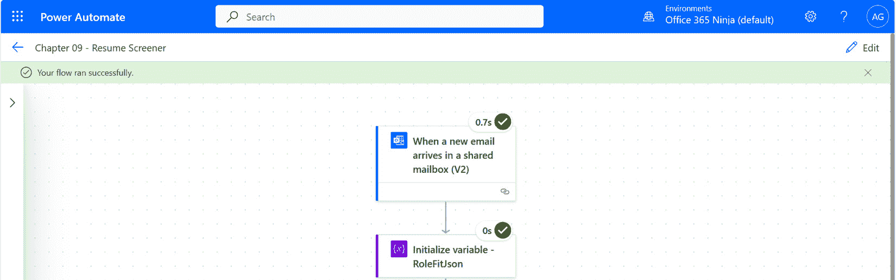

图 9.41 – 查看流程运行历史

1.  启动 Microsoft Teams 并导航到**工作和候选人**团队。检查**发布消息**操作中指定的频道，以查看简历是如何被评估的：

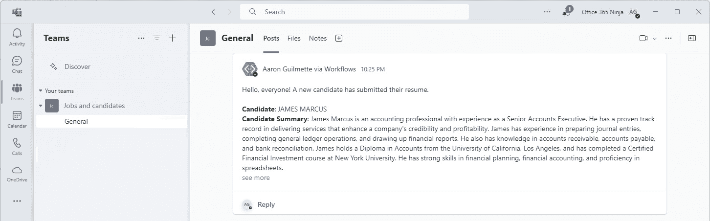

图 9.42 – 查看 Teams 频道帖子

1.  接下来，导航到**工作和候选人** SharePoint 网站并选择**候选人**列表以查看您的简历提交：

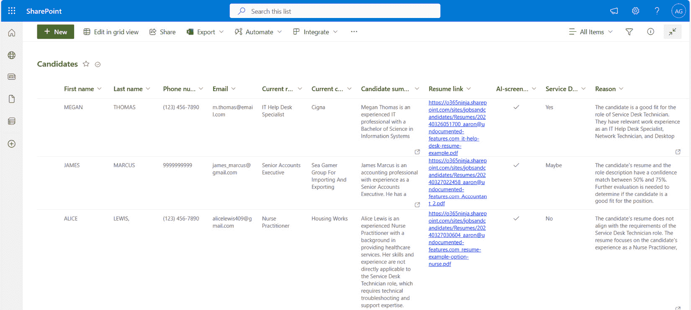

图 9.43 – 查看简历提交

恭喜！您已成功验证了流程！

如果流程错误地将简历分类，你可以轻松地返回并调整提示，以提高或降低置信度要求。

# 进一步探索

这个流程所奠定的基础为工作流程自动化开辟了众多可能性。可能性包括以下内容：

+   分支以允许与同一流程中的其他角色描述进行核对

+   筛选消息主题的条件，以便将其路由到其他流程

+   使用 Cloudmersive 操作进行文档验证，以确保提交的简历可读

+   拒绝非 PDF 附件的条件

+   面试安排

# 摘要

在本章中，我们介绍了两个强大的 AI Builder 概念：数据提取建模以及使用 GenAI 总结和评估内容。

通过本章获得的能力，你可以将 GenAI 适应到众多商业挑战中。

在下一章中，我们将基于本章的 GenAI 文本摘要能力，制作文档的执行摘要。
