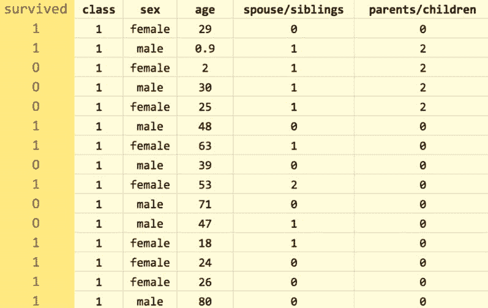
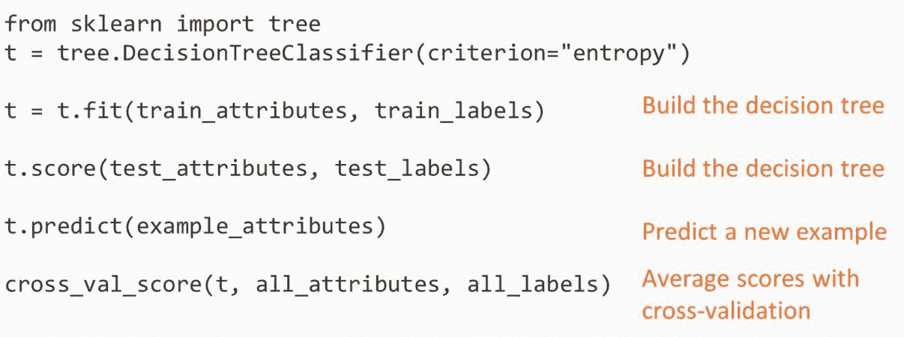
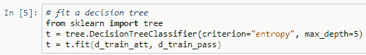
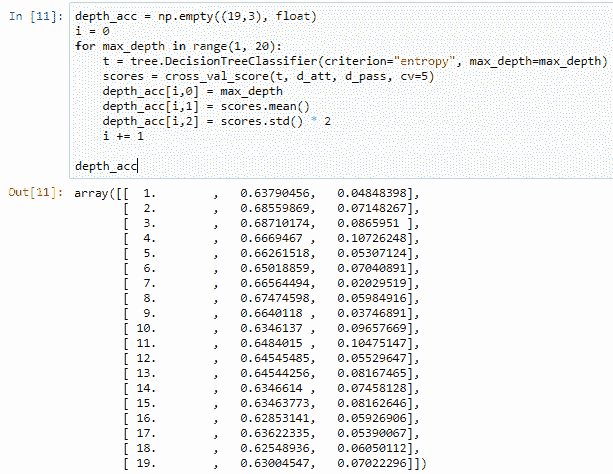

# 第一章：创建您自己的预测模型

我们的社会比以往任何时候都更具技术先进性。**人工智能**（**AI**）技术已经在全球范围内传播，正在复制人类。创造能够模拟人类智能各个方面（如推理、学习和解决问题）的机器的初衷，促成了 AI 技术的发展。AI 真正与人类本性相抗衡。换句话说，AI 使机器像人类一样思考和行动。最能展示这种技术威力的例子就是 Facebook 的标签建议或人脸识别功能。考虑到这种技术对当今世界的巨大影响，AI 无疑将在未来几年成为最伟大的技术之一。

我们将通过一个基于 AI 技术的项目进行实验，探索使用机器学习算法进行分类，并结合 Python 编程语言。我们还将通过一些示例来帮助更好地理解。

在本章中，我们将探讨以下几个有趣的主题：

+   分类技术概述

+   Python scikit 库

# 分类概述和评估技术

AI 为我们提供了各种分类技术，但机器学习分类是最适合入门的技术，因为它是最常见且最容易理解的分类方法。在我们的日常生活中，眼睛捕捉到成千上万的图像：无论是在书本中，还是在某个屏幕上，或者是你周围环境中看到的东西。这些被我们眼睛捕捉到的图像帮助我们识别和分类物体。我们的应用程序基于相同的逻辑。

在这里，我们正在创建一个应用程序，通过机器学习算法来识别图像。假设我们有苹果和橙子的图像，通过观察这些图像，我们的应用程序将帮助识别图像是苹果还是橙子。这种类型的分类可以称为**二元分类**，意味着将给定集合中的物体分类为两个组，但也存在多类别分类的技术。我们需要大量的苹果和橙子图像，并且需要设置一个机器学习算法，使得应用程序能够分类这两种图像。换句话说，我们让这些算法学习两者之间的区别，从而帮助正确分类所有示例。这被称为**监督学习**。

现在让我们比较监督学习与无监督学习。假设我们不知道实际的数据标签（即我们不知道这些图片是苹果还是橙子的例子）。在这种情况下，分类方法可能帮助不大。**聚类**方法总能缓解这种情况。结果会是一个可以部署在应用中的模型，并且它会像下面的图所示那样工作。该应用会记住苹果和橙子之间的区别，并使用机器学习算法识别实际的图像。如果我们输入一个新的数据，模型会告诉我们它的决策，判断该输入是苹果还是橙子。在这个例子中，我们创建的应用能够以 75%的置信度识别苹果图像：

有时候，我们希望知道置信度的程度，其他时候我们只需要最终的答案，也就是模型最有信心的选择。

# 评估

我们可以通过衡量模型的准确性来评估其性能。准确性定义为分类正确的案例所占的百分比。我们可以使用混淆矩阵分析模型的错误，或者说分析它的混淆程度。混淆矩阵是指模型中的混淆情况，但当混淆矩阵变得非常大时，理解起来可能会有些困难。让我们来看一下下面的二分类例子，它展示了模型在正确预测对象时的次数：

在前面的表格中，真正的苹果（True apple）和真正的橙子（True orange）所在的行表示该对象实际上是苹果或橙子的情况。列则表示模型做出的预测。我们看到，在这个例子中，有 20 个苹果被正确预测，而有 5 个苹果被错误地识别为橙子。

理想情况下，混淆矩阵应该只有对角线上的数字非零。这里我们可以通过将对角线上的数字相加来计算准确率，这些数字代表所有正确分类的例子，然后将这个和除以矩阵中所有数字的总和：

在这里，我们得到了 84%的准确率。为了更好地了解混淆矩阵，让我们通过另一个例子来学习，这个例子涉及三个类别，如下图所示：

来源：scikit-learn 文档

有三种不同种类的鸢尾花。矩阵给出了正确和错误预测的原始记录。因此，**setosa**被正确预测了 13 次，所有 setosa 图像的样本中。另一方面，**versicolor**被正确预测了 10 次，并且有 6 次 versicolor 被预测为**virginica**。现在，让我们对混淆矩阵进行标准化，并显示预测正确或错误的图像所占的百分比。在我们的例子中，我们看到 setosa 种类的图像被始终正确预测：

来源：scikit-learn 文档

在评估混淆矩阵时，我们还注意到系统在两个物种之间产生了混淆：versicolor 和 virginica。这也让我们得出结论，系统并不总能识别 virginica 种类的物种。

对于进一步的实例，我们需要更注意，因为系统将在同一数据上进行训练和测试，所以不能期望非常高的准确性。这将导致记忆训练集并使模型过度拟合。因此，我们应该尝试将数据拆分为训练集和测试集，首先按照 90/10%或 80/20%的比例进行拆分。然后，我们使用训练集开发模型，使用测试集执行和计算混淆矩阵的准确性。

我们需要小心，不要选择一个非常好的测试集或非常差的测试集来获取准确性。因此，为了确保这一点，我们使用一种验证方法，称为**K 折交叉验证**。为了更好地理解它，想象一下 5 折交叉验证，其中我们将测试集移动 20 个数据点，因为总共有 5 个数据集。然后，我们将剩余的集合作为数据集，计算所有折叠的平均值：

这有点让人困惑，对吧？但是 scikit-learn 内置了交叉验证的支持。这个功能是确保我们不会过度拟合模型，且不会在不合格的测试集上运行模型的好方法。

# 决策树

在本节中，我们将使用决策树和学生表现数据来预测一个孩子是否能够在学校表现良好。我们将结合之前的技术和一些 scikit-learn 代码来实现预测。在开始预测之前，我们先了解一下什么是决策树。

决策树是最简单的分类技术之一。它们可以与**20 个问题**的游戏相比较，其中树中的每个节点要么是叶节点，要么是问题节点。以泰坦尼克号生还率为例，这个数据集包含了泰坦尼克号每位乘客的生还结果。

将我们的第一个节点视为一个问题：*乘客是男性吗？* 如果不是，那么乘客很可能存活。否则，我们将继续对男性乘客提出另一个问题：*男性是否超过 9.5 岁？*（其中 9.5 岁是决策树学习过程选择的理想分裂点）。如果答案是**是**，那么该乘客很可能没有存活。如果答案是**否**，则会提出另一个问题：*该乘客是否有兄弟姐妹？* 下图将为您提供简要说明：

理解决策树并不要求你成为决策树学习过程的专家。如前面的图示所见，这个过程使得理解数据变得非常简单。并不是所有机器学习模型像决策树一样容易理解。

现在让我们更深入了解决策树，通过了解决策树的学习过程。考虑我们之前使用的泰坦尼克号数据集，我们将根据信息增益来找到最佳的分裂属性，信息增益也称为**熵**：

只有在知道某一列的值后，结果更可预测时，信息增益才最高。换句话说，如果我们知道乘客是**男性**还是**女性**，我们就能知道他或她是否存活，因此性别这一列的信息增益最高。我们不会将年龄列作为第一次分裂的最佳属性，因为我们对乘客的年龄知之甚少，这也不是最佳的第一次分裂，因为如果我们只知道乘客的年龄，我们对结果的了解将会更少。

根据信息增益对**性别**这一列进行分裂后，我们现在得到了**女性**和**男性**两个子集，如下图所示：

在分裂之后，我们有一个分支节点和一个问题节点，如前面的截图所示，且根据问题的答案，可以选择两条路径。现在，我们需要再次在这两个子集内找到最佳属性进行分裂。左边的子集，其中所有乘客都是女性，并没有一个很好的属性来进行分裂，因为很多乘客都存活了。因此，左边的子集最终会变成一个叶节点，预测存活情况。在右边，`age`属性被选为最佳分裂点，考虑到**9.5**岁的年龄作为分裂点。我们得到了两个新的子集：年龄大于**9.5**岁和年龄小于**9.5**岁：

重复这个过程，不断将数据分裂为两个新子集，直到没有好的分裂点，或者没有剩余的属性，最终形成叶节点而不是问题节点。在我们开始建立预测模型之前，让我们先了解一下 scikit-learn 包。

# scikit-learn 分类器的常用 API

在本节中，我们将学习如何使用 scikit-learn 包创建代码，以构建和测试决策树。Scikit-learn 包含许多简单的函数集。实际上，除了下面截图中第二行代码，这一行代码特别与决策树有关外，我们还将使用相同的函数来处理其他分类器，例如随机森林：

在我们深入技术部分之前，让我们先理解这些代码行的含义。前两行代码用于设置决策树，但我们可以认为树尚未构建，因为我们还没有指向任何已训练的数据集。第三行通过 `fit` 函数构建树。接下来，我们对一系列示例进行评分并获得准确性数值。这两行代码将用于构建决策树。之后，我们用一个示例进行预测，这意味着我们将用一行数据来训练模型，并根据“生还”列预测输出。最后，我们执行交叉验证，将数据分割并为每个训练集构建一个条目，评估每个测试集的决策树。在运行这些代码时，得到的结果是评分，随后我们会对这些评分进行平均。

你可能会有一个问题：*我们什么时候应该使用决策树？* 这个问题的答案其实很简单，因为决策树简单且易于解释，并且需要较少的数据准备，尽管你不能把它们视为最准确的技术。你可以将决策树的结果展示给任何领域专家，比如一位泰坦尼克号历史学家（以我们的例子为例）。即使是对机器学习知之甚少的专家，通常也能够理解决策树的提问并判断树的准确性。

当数据特征较少时，决策树的表现可能更好，但当数据具有较多特征时，它们的表现可能较差。这是因为树可能会变得过大，难以理解，并且可能会通过引入过于特定于训练数据的分支来轻易地过拟合训练数据，而这些分支与创建的测试数据并无太大关系，从而降低了获得准确结果的机会。现在，既然你已经了解了决策树的基本原理，我们准备好实现使用学生表现数据创建预测模型的目标了。

# 涉及决策树和学生表现数据的预测

在这一部分中，我们将使用决策树来预测学生表现，基于学生的历史表现数据。我们将使用 UC Irvine 机器学习库中的学生表现数据集，[`archive.ics.uci.edu/ml/datasets/student+performance`](https://archive.ics.uci.edu/ml/datasets/student+performance)。我们的最终目标是预测学生是否通过。数据集包含约 649 名学生的数据，每个学生有 30 个属性。这些属性是混合型的——包括词汇和短语类型的分类属性，以及数值型属性。这些混合属性造成了一个小问题，需要进行修正。我们将需要将这些词汇和短语类型的属性转换成数字。

以下截图显示了数据中的前半部分属性：

你一定注意到，有些属性是分类的，比如学校名称；**性别**；**母亲职业**（**Mjob**）；**父亲职业**（**Fjob**）；原因；以及监护人。其他的，如**年龄**（**age**）和**通学时间**（**traveltime**），是数值型的。以下截图显示了数据中的后半部分属性：

很明显，某些属性是更好的预测因子，比如缺勤和过去的失败次数，而其他属性可能预测性较差，比如学生是否有恋爱关系，或者学生的监护人是母亲、父亲还是其他人。决策树将尝试通过提供的信息增益来识别最重要或最具预测性的属性。我们可以通过查看生成的树来识别最具预测性的属性，因为最具预测性的属性会出现在最前面的提问中。

原始数据集中有三项考试成绩：`G1`、`G2`和`G3`。其中，`G1`是第一学期成绩，`G2`是第二学期成绩，`G3`是最终成绩。我们将通过只提供通过或失败来简化问题。这可以通过将三项成绩相加，检查其和是否足够大（即 35）来完成。这样，我们大约能得到 50%的学生通过，50%的学生失败，从而得到一个平衡的数据集。现在我们来看一下代码：

我们导入了数据集（`student-por.csv`），该数据集使用分号而不是逗号作为分隔符，因此我们将分隔符指定为分号。为了进行交叉验证，我们将找到数据集中的行数。使用长度变量，我们可以看到数据集有`649`行。

接下来，我们添加了“通过”和“失败”列。这些列中的数据将包含 1 或 0，其中 1 表示通过，0 表示失败。我们将通过计算每一行的考试成绩之和来实现这一点。如果三项成绩之和大于或等于 35，学生将被标记为 1，否则标记为 0。

我们需要对数据集的每一行应用这个规则，这将通过`apply`函数来实现，这是 Pandas 的一个功能。这里的`axis=1`表示按行使用 apply，`axis=0`则表示按列应用。下一行表示需要删除一个变量：`G1`、`G2` 或 `G3`。以下的代码截图将帮助你理解我们刚才学到的内容：

以下截图显示了数据集的前 5 行和 31 列。之所以有 31 列，是因为我们有所有的属性列，以及我们的"通过"和"未通过"列：

如前所述，这些列中的一些是单词或短语，例如**Mjob**、**Fjob**、**internet** 和 **romantic**。这些列需要转换为数字，可以使用`get_dummies`函数来实现，这是 Pandas 的一个功能，我们需要指定要转换为数字形式的列。

以**Mjob**为例，函数会查看该列中所有可能的答案或值，并为每个值赋予一个列名。这些列将被命名为**Mjob** **at_home**、**Mjob** **health** 或 **Mjob**。例如，**Mjob at_home**列的值将为*`1`*，其余列的值为*`0`*。这意味着生成的新列中只有一个列的值为 1。

这被称为**独热编码**。之所以给这个方法起这个名字，是因为例如，想象有一些电线进入电路。假设电路中有五根电线，而你想使用独热编码方法，你需要激活其中一根电线，同时保持其余电线关闭。

在对数据集执行`get_dummies`函数后，你可以注意到例如**activities_no**和**activities_yes**列。原先关联的列中，表示"no"的在**activities_no**列下的值为 1，后面是 0。对于**activities_yes**列，如果值为"yes"，则该列为 0，其他列为 1。这导致创建了许多新的列，总数约为 57 个，但这使我们的数据集充满了数字数据。以下截图显示了**activities_yes**和**activities_no**列：

这里我们需要打乱行并生成一个包含前 500 行的训练集，剩余的 149 行作为测试集，然后我们只需要从训练集中获取属性，也就是说我们将去掉"通过"列，并将"通过"列单独保存。对于测试集，也进行相同操作。我们将对整个数据集应用这些属性，并将"通过"列单独保存。

现在我们将计算整个数据集中有多少人通过和未通过。这可以通过计算通过和未通过的百分比来完成，结果是 649 个数据中有 328 个是通过的。这表示通过率大约是 50%，也就是一个均衡的数据集。

接下来，我们开始使用来自 scikit-learn 包的 `DecisionTreeClassifier` 函数构建决策树，这是一个能够对数据集进行多类分类的类。在这里，我们将使用熵或信息增益度量来决定何时进行拆分。我们将在深度为五个问题时进行拆分，初始树深度设置为 `max_depth=5`，以便我们了解树是如何适应数据的：

为了获得数据集的概览，我们需要创建树的可视化表示。这可以通过使用 scikit-learn 包的另一个函数：`expoert_graphviz` 来实现。以下截图展示了在 Jupyter Notebook 中树的表示：

这只是一个表示，可以通过在 Jupyter 输出中滚动查看更多内容

从之前的表示可以很容易理解，数据集被分为两部分。让我们尝试从顶部解读树。在这种情况下，如果失败大于或等于 0.5，这意味着它为真，并且它被放置在树的左侧。考虑到树总是在左侧为真，右侧为假，这意味着没有先前的失败。在表示中，我们可以看到树的左侧大多数是蓝色，这意味着它预测通过，即使与最多 5 个问题的失败相比，问题的数量较少。树的右侧如果失败小于 0.5，这将导致学生失败，这意味着第一个问题是错误的。如果预测为失败，它会以橙色显示，但随着问题数量的增加，由于我们使用了 `max_depth = 5`，预测会进一步调整。

以下代码块展示了一种方法，用于导出可视化表示，您可以通过点击导出并保存为 PDF 或其他格式，便于后续查看：

接下来，我们使用之前创建的测试集检查树的评分：

我们得到的结果大约是 60%。现在让我们交叉验证一下结果，以确保数据集已经被完美地训练过：

对整个数据集执行交叉验证，它会按照 20/80 的比例拆分数据，其中 20% 用作测试集，80% 用作训练集。平均结果为 67%。这表明我们有一个良好平衡的数据集。在这里，我们有多个关于 `max_depth` 的选择：

我们使用从 1 到 20 的各种 `max_depth` 值。考虑到我们构建的是一个深度为 20 的树，其中每个问题都具有 20 的深度值，这样我们将会得到超过 20 个问题，也就是说你需要向下走 20 步才能到达叶节点。在这里，我们再次执行交叉验证，并保存并打印我们的答案。这将给出不同的准确性和计算结果。通过分析发现，当深度为 2 和 3 时，准确性最佳，且与之前得到的平均准确性进行了比较。

以下截图展示了我们将用于创建图表的数据：

以下截图中的误差条表示分数的标准差，结果表明，对于这个数据集，深度为 2 或 3 是理想的，而我们假设的深度为 5 是不正确的：

更深的层次并不会带来更多的能力，仅仅问一个问题，*你之前失败过吗？*，并不能提供与两个或三个问题相同的信息量。

我们的模型表明，增加深度并不一定有帮助，单纯询问一个问题，*你之前失败过吗？*，也无法提供与两个或三个问题相同的信息量。

# 总结

本章我们学习了分类和评估技术，并深入了解了决策树。我们还创建了一个模型来预测学生的表现。

在下一章中，我们将深入了解随机森林，并利用机器学习和随机森林来预测鸟类物种。
