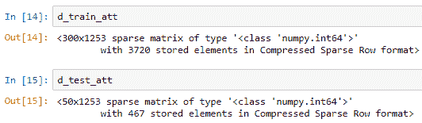
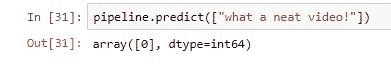
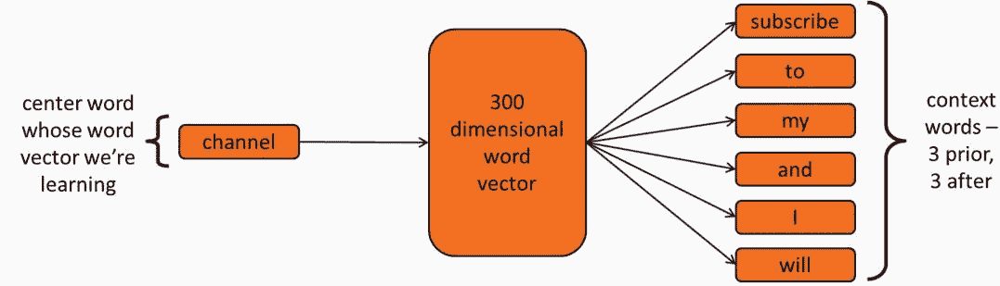
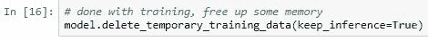
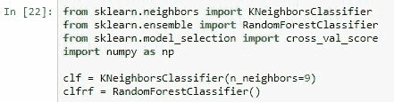

# 第三章：评论分类的应用

在这一章中，我们将概述文本分类的词袋模型。我们将研究如何使用词袋模型和随机森林技术预测 YouTube 评论是否为垃圾邮件。然后我们将研究 Word2Vec 模型，以及通过 Word2Vec 方法和 k-近邻分类器预测正面和负面评论。

在这一章中，我们将特别关注文本和单词，分类互联网评论为垃圾邮件或非垃圾邮件，或将互联网评论识别为正面或负面。我们还将概述文本分类的词袋模型，并使用词袋模型和随机森林技术预测 YouTube 评论是否为垃圾邮件。我们还将研究 Word2Vec 模型和 k-近邻分类器。

但是，在我们开始之前，我们将回答以下问题：*是什么让文本分类成为一个有趣的问题？*

# 文本分类

为了回答我们的问题，我们将以著名的鸢尾花数据集作为示例数据集。下图是紫花鸢尾物种的图片。为了识别物种，我们需要一些除物种图像之外的其他信息，例如花朵的**花瓣长度**、**花瓣宽度**、**花萼长度**和**花萼宽度**，这些将帮助我们更好地识别图像：

该数据集不仅包含了紫花鸢尾的例子，还包括了 Setosa 和 Virginica 的例子。数据集中的每个示例都包含这四个测量值。数据集包含大约 150 个例子，每个物种包含 50 个例子。我们可以使用决策树或其他模型来预测一朵新花的物种，只要给出相同的四个测量值。正如我们所知，同一物种的花朵测量值几乎相似。由于相似性有不同的定义，但在这里我们将相似性视为在图上的接近度，假设每个点代表一朵花。下图是花萼宽度与花瓣宽度的比较：

如果我们没有办法衡量相似性，比如说每朵花都有不同的测量值，那么就无法使用机器学习构建分类器了。

正如我们所知道的，同一物种的花朵有相同的测量值，这帮助我们区分不同的物种。想象一下，如果每朵花的测量值都不同，那么使用机器学习构建分类器来识别物种的图像就没有意义了。

# 机器学习技术

在考虑图像之前，我们现在来考虑文本。例如，考虑以下句子，并尝试找出第一对短语与第二对短语的相似之处：

我希望你能回答那个问题，否则我们将无法构建决策树、随机森林或其他任何预测模型。为了回答这个问题，注意到前一对短语很相似，因为它们包含一些共同的单词，如**subscribe**和**channel**，而第二对句子包含的共同单词较少，如**to**和**the**。考虑每个短语代表一个数字向量，这样前一对短语在数值上与第二对短语相似。只有这样，我们才能使用随机森林或其他分类技术，在这种情况下，检测 YouTube 评论垃圾邮件。为了实现这一点，我们需要使用词袋模型。

# 词袋模型

词袋模型正是我们所需要的，它将短语或句子转换，并计算相似单词出现的次数。在计算机科学中，词袋（bag）指的是一种数据结构，类似于数组或列表，它跟踪对象，但在这种情况下，顺序不重要，如果一个对象出现多次，我们只需要跟踪其出现次数，而不是重复记录它们。

例如，考虑前面图表中的第一个短语，它有一个词袋，包含像**channel**这样的单词，出现一次，**plz**，出现一次，**subscribe**，出现两次，等等。然后，我们会将所有这些计数收集到一个向量中，每个短语、句子或文档对应一个向量，具体取决于你正在处理的内容。再次强调，原始单词的出现顺序不重要。

我们创建的向量也可以用于按字母顺序排序数据，但必须对所有不同的短语一致地进行此操作。然而，我们仍然面临相同的问题。每个短语都有一个包含不同列的向量，因为每个短语包含不同的单词和不同数量的列，如下表所示：

如果我们通过所有短语中的唯一单词创建一个更大的向量，我们会得到一个合适的矩阵表示。每一行代表一个不同的短语，注意使用 0 来表示某个短语中没有某个单词：

如果你想拥有一个包含大量短语、文档等的词袋，我们需要收集所有示例中出现的唯一单词，并创建一个巨大的矩阵，`N` x `M`，其中`N`是示例的数量，`M`是出现次数的数量。我们可能会轻松拥有成千上万个维度，在用于鸢尾花数据集的四维模型中进行比较。词袋矩阵可能是稀疏的，意味着大部分是零，因为大多数短语中并没有包含大部分单词。

在开始构建我们的词袋模型之前，我们需要处理一些事情，例如以下内容：

+   将每个单词转换为小写

+   去除标点符号

+   去除常见词（停用词）

+   去除复数形式（例如，bunnies => bunny）

+   进行词形还原（例如，reader => read，reading = read）

+   使用 n-gram（如二元组（两词组合）或三元组）

+   仅保留频繁出现的词汇（例如，必须在 >10 个示例中出现）

+   仅保留最频繁的 `M` 词汇（例如，仅保留 1,000 个）

+   记录二进制计数（`1` = 存在，`0` = 不存在）而不是实际计数

还有许多其他最佳实践的组合，找到最适合特定数据的组合需要一些研究。

我们在处理长文档时面临的问题是，长文档通常会有更高的词汇计数，但即使词汇计数差异显著，我们仍然可能希望将关于某个主题的长文档视为与关于同一主题的短文档相似。

此外，如果我们仍然想要减少非常常见的词汇并突出显示稀有的词汇，我们需要做的是记录每个词汇的相对重要性，而不是其原始计数。这被称为**词频逆文档频率**（**TF-IDF**），它衡量一个词汇或术语在文档中的常见程度。

我们使用对数函数来确保包含大量词汇的长文档与包含相似词汇的短文档非常相似。TF-IDF 由两个相乘的部分组成，当 TF 值较高时，结果也较高，但 IDF 衡量的是词汇在所有文档中的常见程度，这将影响常见词汇的分数。因此，出现在其他文档中的常见词汇会得到较低的分数，无论它出现了多少次。

如果一个文档的得分较低，意味着该词汇出现得较少；如果得分较高，意味着该词汇在文档中出现频繁。但是，如果该词汇在所有文档中都很常见，那么在该文档中的得分就变得不相关。无论如何，它的得分都会被认为是低的。这表明，TF-IDF 公式以我们希望模型展现的方式运行。以下图表解释了我们的理论：

我们将使用词袋方法来检测 YouTube 评论是否为垃圾邮件。

# 检测 YouTube 评论垃圾邮件

在这一部分，我们将介绍一种使用词袋和随机森林检测 YouTube 评论垃圾邮件的技术。数据集非常直观。我们将使用一个包含约 2,000 条来自热门 YouTube 视频评论的数据集（[`archive.ics.uci.edu/ml/datasets/YouTube+Spam+Collection`](https://archive.ics.uci.edu/ml/datasets/YouTube+Spam+Collection)）。数据集的格式是每一行包含一个评论，后面跟着一个标记为 1 或 0 的值，表示该评论是否为垃圾邮件。

首先，我们将导入一个数据集。这个数据集实际上分成了四个不同的文件。我们的评论集来自 PSY 的《江南 Style》视频：

然后我们将打印出以下几条评论：

在这里，我们可以看到有超过两列，但我们只需要内容列和分类列。内容列包含评论，分类列包含值 1 或 0，表示是否为垃圾评论。例如，注意到前两条评论被标记为非垃圾评论，但接下来的评论**subscribe to me for call of duty vids**是垃圾评论，**hi guys please my android photo editor download yada yada**也是垃圾评论。在开始排序评论之前，我们先看一下数据集中垃圾评论和非垃圾评论的数量。我们得到的结果是 175 条垃圾评论和 175 条非垃圾评论，总共有 350 行数据：

在 scikit-learn 中，词袋技术实际上被称为`CountVectorizer`，即统计每个单词出现的次数并将其放入向量中。为了创建一个向量，我们需要为`CountVectorizer`创建一个对象，然后同时执行 fit 和 transform 操作：

这分为两个不同的步骤进行。首先是 fit 步骤，它会发现数据集中有哪些单词，其次是 transform 步骤，它会为这些短语生成词袋矩阵。得到的矩阵结果是 350 行，1,418 列：

总共有 350 行，这意味着我们有 350 条不同的评论和 1,418 个单词。显然，1,418 个单词是出现在所有这些短语中的单词。

现在让我们打印一个单独的评论，然后对该评论进行分析，以便查看短语是如何被拆解的。如下面的截图所示，评论首先被打印出来，然后我们在下方进行分析，这样我们可以看到它是如何拆解成单词的：

我们可以使用向量化器功能来找出数据集在向量化后找到的单词。以下是向量化后的结果，其中开始是数字，结束是常规单词：

执行以下命令来打乱数据集，设置分数为 100%，即添加`frac=1`：

现在我们将把数据集拆分为训练集和测试集。假设前 300 条用于训练，后 50 条用于测试：

在上面的代码中，`vectorizer.fit_transform(d_train['CONTENT'])` 是一个重要步骤。在这一阶段，你有一个训练集，你希望对其进行拟合转换，这意味着它会学习单词并生成矩阵。然而，对于测试集，我们不再执行拟合转换，因为我们不希望模型为测试数据学习不同的单词。我们将使用它在训练集上学到的相同单词。假设测试集有不同的单词，其中一些可能是测试集中独有的，可能从未出现在训练集中。这是完全可以接受的，反正我们将忽略它。因为我们使用训练集来构建随机森林或决策树，或者无论是什么模型，我们必须使用一组特定的单词，而这些单词在测试集上也必须是相同的。我们不能向测试集引入新单词，因为随机森林或任何其他模型都无法评估新单词。

现在我们对数据集进行转换，稍后将使用这些答案进行训练和测试。训练集现在有 300 行和 1,287 个不同的单词或列，而测试集有 50 行，但我们仍然有相同的 1,287 列：

即使测试集有不同的单词，我们也需要确保它与训练集以相同的方式进行转换，并保持相同的列。现在我们将开始构建随机森林分类器。我们将把这个数据集转化成 80 棵不同的树，并拟合训练集，以便在测试集上评估其表现：

我们获得的分数输出是 98%；这真的很不错。在这里，似乎它在垃圾邮件和非垃圾邮件之间产生了混淆。我们需要确保准确率很高；为此，我们将进行五次不同拆分的交叉验证。为了执行交叉验证，我们将使用所有训练数据并将其分成四个不同的组：20%、80% 和 20% 将作为测试数据，80% 将作为训练数据：

我们现在将对刚才获得的分数进行平均，结果大约是 95%的准确率。接下来，我们将打印出所有数据，如下图所示：

整个数据集包含五个不同的视频评论，这意味着我们一共有大约 2,000 行。在检查所有评论时，我们注意到有`1005`条垃圾评论和`951`条非垃圾评论，它们非常接近，足够均匀地分成两部分：

这里我们将打乱整个数据集并分离评论和答案：

我们需要在这里执行几个步骤，使用`CountVectorizer`，然后是随机森林。为此，我们将使用 scikit-learn 中的一个特性叫做**Pipeline**。Pipeline 非常方便，它可以将两个或更多步骤组合在一起，这样所有步骤就能作为一个整体来处理。因此，我们将构建一个包含词袋的管道，然后使用`countVectorizer`，接着是随机森林分类器。然后我们会打印出管道，它包含了所需的步骤：

我们可以通过将`CountVectorizer`添加到我们的`RandomForestClassifier`中，让管道自动为每个步骤命名，并且它会将它们命名为`CountVectorizer`和`RandomForestClassifier`：

一旦管道创建完成，你只需调用 fit，它会执行接下来的步骤：首先执行 fit，然后使用`CountVectorizer`进行转换，接着使用`RandomForest`分类器进行拟合。这就是使用管道的好处：

现在你可以调用 score，这样它就知道在评分时会先通过词袋`countVectorizer`，然后用`RandomForestClassifier`进行预测：

这个过程将产生大约 94 的得分。我们只能用管道预测一个示例。例如，假设我们在数据集训练之后有一个新的评论，我们想知道用户输入的这条评论是否为垃圾评论：

如所见，它检测得很准确；但对于以下评论呢：

为了克服这个问题并将此分类器部署到一个环境中，在有人输入新评论时预测它是否为`spm`。我们将使用我们的管道来计算交叉验证的准确性。在这种情况下，我们发现平均准确率约为 94：

这相当不错。现在让我们在模型中加入 TF-IDF，以使其更精确：

这将放置在`countVectorizer`之后。在生成计数后，我们可以为这些计数计算 TF-IDF 得分。现在我们将在管道中加入这个，并用相同的准确度执行另一次交叉验证检查：

这展示了管道所需的步骤：

以下输出显示了我们得到了`CountVectorizer`、一个 TF-IDF 转换器和`RandomForestClassifier`。注意，`countVectorizer`可以是小写或大写，这取决于数据集；我们可以决定要使用多少个单词。我们可以使用单词，也可以使用二元组（即词对）或三元组（即词三元组）。我们还可以移除停用词，这些停用词是非常常见的英语单词，如**and**、**or**和**the**。在使用 TF-IDF 时，你可以关闭`idf`部分，只保留`tf`部分，这样它就只是计数的对数。你也可以使用`idf`。使用随机森林时，你可以选择使用多少棵树，这就是估算器的数量。

scikit-learn 还有另一个特性可供我们搜索所有这些参数。通过这个特性，我们可以找到最佳的参数：

我们可以创建一个小字典，列出管道步骤的名称，然后说明参数名称，这样我们就有了选择的选项。为了演示，我们将尝试最大单词数，或者仅仅是 1,000 或 2,000 个单词。

使用 `ngrams`，我们可以只提及单个单词或单词对，这些单词是停用词，使用英语停用词字典，或者不使用停用词，这意味着在第一种情况下，我们需要去除常用词，在第二种情况下，我们不去除常用词。使用 TF-IDF，我们使用 `idf` 来说明是 yes 还是 no。我们创建的随机森林使用了 20、50 或 100 棵树。利用这些，我们可以执行网格搜索，遍历所有参数组合，并找出最佳组合。所以，让我们给我们的第二个管道编号，其中包含 TF-IDF。我们将使用 `fit` 执行搜索，结果可以在以下截图中看到：

由于单词数目很大，需要一点时间，大约 40 秒钟，最终找到最佳参数。我们可以从网格搜索中获取最佳参数并打印出来，看看分数如何：

因此，我们达到了近 96% 的准确率。我们使用了大约 1,000 个单词，仅使用了单词，使用了 yes 来去除停用词，在随机森林中使用了 100 棵树，同时使用了 yes、IDF 和 TF-IDF 计算。在这里，我们不仅演示了词袋模型、TF-IDF 和随机森林，还演示了管道特性和网格搜索特性。

# Word2Vec 模型

在本节中，我们将学习关于 Word2Vec 的知识，这是一种现代和流行的处理文本的技术。通常情况下，Word2Vec 的表现优于简单的词袋模型。词袋模型只计算每个文档中每个单词出现的次数。给定两个这样的词袋向量，我们可以比较文档，看它们的相似程度。这与比较文档中使用的单词是一样的。换句话说，如果两个文档有许多相似的单词，它们出现的次数也相似，那么它们将被认为是相似的。

但是词袋模型没有关于单词相似性的信息。因此，如果两个文档没有使用完全相同的单词，而是使用同义词，比如 **please** 和 **plz**，它们在词袋模型中并不被视为相似。Word2Vec 可以发现某些单词彼此相似，我们可以利用这一点在进行文本机器学习时获得更好的性能。

在 Word2Vec 中，每个单词本身就是一个向量，可能有 300 维。例如，在一个预训练的 Google Word2Vec 模型中，它检查了数百万或数十亿页的文本，我们可以看到 cat、dog 和 spatula 是 300 维向量：

+   猫 = <0.012, 0.204, ..., -0.275, 0.056>（300 维）

+   狗 = <0.051, -0.022, ..., -0.355, 0.227>

+   锅铲 = <-0.191, -0.043, ..., -0.348, 0.398>

+   猫和狗的相似度（距离）—0.761

+   猫和锅铲的相似度—0.124

如果我们比较狗和猫的向量相似度，我们将得到 0.761，或者说 76%的相似度。如果我们用猫和锅铲做相同的比较，我们得到 0.124。很明显，Word2Vec 学到了狗和猫是相似的词，而猫和锅铲则不是。Word2Vec 利用神经网络来学习这些词向量。从高层次来看，神经网络类似于随机森林或决策树以及其他机器学习技术，因为它们接收一组输入和一组输出，并学习如何根据输入预测输出。

对于 Word2Vec，输入是单个词，即我们想要学习其向量的词，输出是该词周围的词。Word2Vec 也支持这种输入输出配置的反向操作。因此，Word2Vec 通过记住上下文词来学习词向量。所以，狗和猫会有相似的词向量，因为这两个词在类似的场景中使用，例如 *她抚摸了狗* 和 *她抚摸了猫*。通过 Word2Vec 进行神经网络训练可以采取两种形式，因为 Word2Vec 支持两种不同的训练技术。

第一种技术被称为连续词袋模型，在这种模型中，上下文词作为输入，忽略中间词，正在学习向量的词（即中心词）作为输出。在以下图示中，你可以看到**channel**这个词前后各有三个词：

这些是上下文词。连续词袋模型会在整个句子中滑动，每个词依次充当中心词。神经网络学习每个词的 300 维向量，以便在给定上下文词的情况下预测中心词。换句话说，它能够根据输入预测输出。

在第二种技术中，我们将会反转这一过程。这被称为**skip-gram**，其中中心词是输入，上下文词是输出：

在这种技术中，中心词向量被用来预测给定中心词的上下文词。

这两种技术在大多数情况下表现良好。它们各自有一些小优缺点，但对于我们的使用场景来说并不重要。

# Doc2Vec

我们将使用 Word2Vec 来检测正面和负面的产品、餐厅和电影评论。我们将使用一种略微不同形式的 Word2Vec，称为**Doc2Vec**。在这种情况下，输入是文档名，例如文件名，输出是文档中的词汇滑动窗口。这一次，我们将没有中心词：

在这种情况下，作为一个帮助我们预测单词的向量，通过了解文件名。事实上，输入并不非常重要，在本例中就是文件名。我们只需要跟踪右侧的单词，确保它们都来自同一文档。因此，所有这些单词都会与该文件名连接起来，但文件名的实际内容并不重要。因为我们可以根据文件名预测文档的单词，所以我们可以有效地拥有一个模型，知道文档中哪些单词是会一起出现的。换句话说，文档通常只谈论一件事，例如，学习到很多不同的正面词汇会出现在正面评论中，而负面评论中会出现很多负面词汇。

# 文档向量

训练后，我们得到一个新的文档，想要找到它的文档向量。我们将利用在训练过程中学到的单词相似性来构建一个向量，预测新文档中的单词。我们将使用一个虚拟的文件名，因为实际名称并不重要。重要的是它只是一个名称。所以，所有这些单词都将在该一个名称下连接在一起：

一旦我们获得了新的文档向量，就可以将其与其他文档向量进行比较，并找到最相似的过去已知文档，如下所示：

因此，我们可以使用`Doc2Vec`来找出哪些文档彼此最相似。这将帮助我们检测正面和负面评论，因为理想情况下，正面评论将具有相似的文档向量，负面评论也是如此。我们期望`Doc2Vec`的表现优于词袋模型，因为`Doc2Vec`学习的是在同一文档中一起使用的单词，所以那些类似于词袋模型的单词并没有实际学到关于单词相似性的信息。

# 检测用户评论中的正面或负面情感

在这一部分，我们将研究如何检测用户评论中的正面和负面情感。换句话说，我们将检测用户是对产品或服务发表正面评论还是负面评论。我们将专门使用`Word2Vec`和`Doc2Vec`，以及`gensim` Python 库来实现这些服务。我们有两个类别，正面和负面评论，而且我们有超过 3,000 条不同的评论供我们分析。这些评论来自 Yelp、IMDb 和 Amazon。让我们通过导入`gensim`库开始代码，`gensim`提供了`Word2Vec`和`Doc2Vec`，并且用于记录消息的状态：

首先，我们将看到如何加载一个由谷歌提供的预训练的`Word2Vec`模型，该模型已在数十亿页文本上进行训练，并最终为所有不同的单词生成了 300 维的向量。加载模型后，我们将查看`cat`的向量。这表明模型是一个 300 维的向量，如同`cat`所表示的：

下图显示了单词`dog`的 300 维向量：

下图显示了单词`spatula`的 300 维向量：

我们在计算狗和猫的相似度时得到了 76%的结果，如下所示：

猫和铲子的相似度是 12%；它有点低，这也是应该的：

这里我们使用以下代码训练我们的`Word2Vec`和`Doc2Vec`模型：

我们使用`Doc2Vec`是因为我们希望为每个文档确定一个向量，而不是每个单词的向量，因为我们的文档是评论，我们希望查看这些评论是正面的还是负面的，这意味着它类似于正面评论或类似于负面评论。`Doc2Vec`由`gensim`提供，库中有一个叫做`TaggedDocument`的类，它允许我们使用“`这些是文档中的单词，Doc2Vec 是模型`”。

现在我们创建一个工具函数，它将接收一个句子或整个段落，并将其转为小写，移除所有的 HTML 标签、撇号、标点符号、空格和重复的空格，最终将其按单词拆分：

现在是时候准备我们的训练集了。我们不会使用 3,000 条 Yelp、IMDb 和 Amazon 的评论，因为这些数据量不足以训练一个良好的`Doc2Vec`模型。如果我们有数百万条评论，那我们可以拿出一部分进行训练，其余的用作测试，但仅有 3,000 条评论是不够的。因此，我从 IMDb 和其他地方收集了评论，包括 Rotten Tomato。这些足以训练一个`Doc2Vec`模型，但这些评论并不来自我们最终预测所使用的数据集。这些评论仅仅是评论。它们是正面的；它们是负面的。我不知道是哪种，因为我没有记录是哪种。重要的是我们有足够的文本来学习单词在这些评论中的使用方式。没有任何记录说明评论是正面的还是负面的。

因此，`Doc2Vec`和`Word2Vec`实际上是用于无监督训练。这意味着我们没有任何答案。我们只是学习单词是如何一起使用的。记住单词的上下文，以及单词如何根据附近的单词来使用：

所以，在每个案例中，在每个文件中，我们简单地使用该文档或评论中的单词加上一个标签，标签就是文件名。这一点很重要，因为它可以让模型学习到这些单词属于同一文档，并且这些单词之间是有某种关系的。加载后，我们从不同的文档中得到了 175,000 个训练示例：

现在让我们看一下下图中的前 10 个句子：

我们打乱这些文档，然后将它们输入到 `Doc2Vec` 训练器中，使用 `Doc2Vec(permuter, dm=0, hs=1, size=50)`，在这里我们最终训练了 `Doc2Vec` 模型，并让它学习所有不同文档的文档向量。`dm=0` 和 `hs=1` 只是表示如何进行训练的参数。这些是我发现最准确的设置。`dm=0` 是我们在上一节中展示的模型，意味着它接收一个文件名并预测单词：

这里的 `size=50` 表示我们发现每个文档的 50 维向量是最好的，而 300 维的向量则最优，因为我们没有足够的训练样本。由于我们没有数百万或数十亿的数据，这是一个很好的 300 维向量，50 维似乎效果更好。运行这段代码会使用处理器和所有核心，所以执行时会花费一些时间。你会看到它显示了完成的百分比。最终，在我的案例中，它花了 300 秒来获取这些信息，肯定算是不错的。速度挺快的，但如果你有数百万或数十亿的训练文档，那可能需要几天时间。

一旦训练完成，我们可以删除一些内容以释放内存：

我们确实需要保留推断数据，这足以为新文档绑定一个新的文档向量，但我们不需要保留所有关于不同单词的数据。

你可以保存模型，然后用 `model = Doc2Vec.Load('reviews.d2v')` 命令在之后加载它，如果你想把它放到产品中部署，或者放到服务器上：

模型训练完成后，你可以推断出一个向量，表示该新文档的文档向量。那么，让我们使用工具函数提取单词。这里我们使用的是一个在评论中找到的示例短语。这是它为该短语学习到的 50 维向量：

现在出现的问题是，负面短语呢？还有其他负面短语。它们被认为相似吗？嗯，它们被认为有 48%的相似度，如下截图所示：

那不同的短语怎么样呢？`Highly recommended` 和 `Service sucks`。它们不太相似：

模型学习了单词在同一评论中如何一起使用，并了解到这些单词以一种方式组合，而其他单词则以另一种方式组合。

最后，我们准备加载我们的真实数据集进行预测：

总结一下，我们使用了 Yelp、Amazon 和 IMDb 的评论。我们加载了不同的文件，每个文件中的每一行都包含一条评论。最终，我们从行中提取了单词，找出了该文档的向量。我们将其放入一个列表中，打乱顺序，最终构建了一个分类器。在这种情况下，我们将使用 k 近邻算法，这是一种非常简单的技术。

它只是一个技术，告诉你*找到所有相似的文档*，在这里就是找到与我们正在查看的文档最相似的九个文档，并进行投票计数：

本例中我们将使用九条评论，如果大多数是正面评论，那么我们也会认为这是一条正面评论。如果大多数是负面评论，那么我们也认为它是负面的。我们不希望评论出现平局，这就是为什么我们选择了九条评论而不是八条的原因。

现在我们将与随机森林的结果进行比较：

现在我们需要对 9 个最近邻进行交叉验证；我们使用`Doc2Vec`检测正面/负面评论的准确率为 76%。为了实验目的，如果我们使用随机森林而不特意选择树的数量，我们只能得到 70%的准确率：

在这种情况下，k 近邻算法既简单又准确。最终，这一切都值得吗？那么，让我们将其与词袋模型进行比较。我们来做一个小管道，使用`CountVectorizer`、TF-IDF 和随机森林，最后在相同的数据上进行交叉验证，这里指的是评论数据。我们得到的结果是 74%，如下图所示：

在执行模型构建后，我们发现`Doc2Vec`的效果更好。如果我们添加很多与测试集风格相同的训练示例，`Doc2Vec`比词袋模型要准确得多。因此，在我们的案例中，测试集几乎都是 Yelp、Amazon 和 IMDb 上的评论，都是一句话或一行文本，内容比较简短。然而，我们找到的训练集来自不同地方的不同评论，约有 175,000 个示例。这些评论通常是段落形式，或者是用不同的方式书写的。

理想情况下，我们将在与将来预测内容相似的示例上训练一个`Doc2Vec`或`Word2Vec`模型，但找到足够的示例可能会很困难，正如这里所面临的情况一样，因此我们尽力而为。即便如此，结果仍然比词袋模型要好。

# 总结

本章中，我们介绍了文本处理和词袋模型技术。接着，我们使用该技术为 YouTube 评论构建了一个垃圾评论检测器。随后，我们了解了复杂的 Word2Vec 模型，并通过一个编码项目来应用它，该项目可以检测正面和负面的产品、餐馆和电影评论。这就是本章关于文本处理的全部内容。

在下一章，我们将讨论深度学习，这是一种在神经网络中广泛应用的技术。
