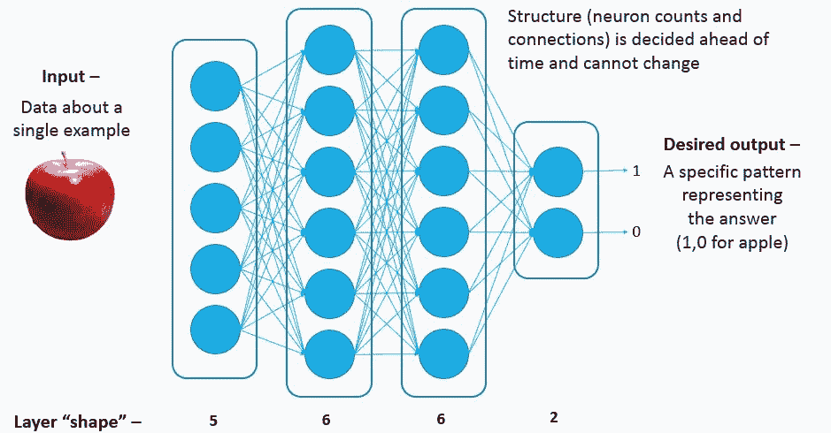
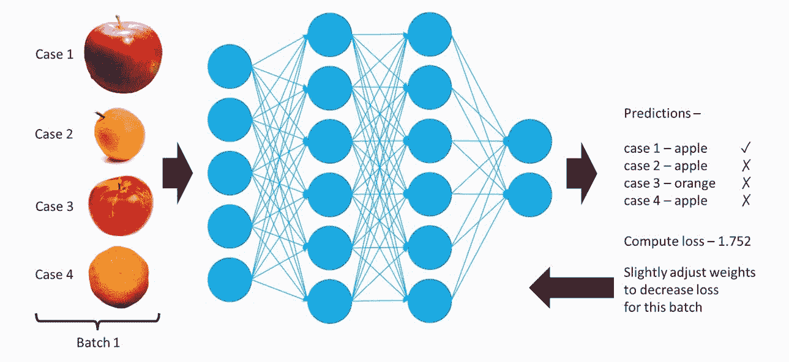
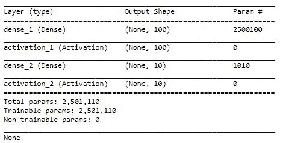
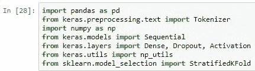

# 第四章：神经网络

在本章中，我们将对神经网络进行概述。我们将了解什么是简单的浅层神经网络，并对它们的工作原理有一些了解。我们将通过尝试使用浅层神经网络识别歌曲的风格来进行实践。同时，我们还将回顾之前使用神经网络进行垃圾邮件检测器工作的经验。之后，我们将研究更大的神经网络，称为**深度学习**，并应用卷积神经网络来识别手写的数学符号。最后，我们将重新审视之前讨论的鸟类物种识别器，并使用深度学习来生成一个更加准确的识别器。

本章将涵盖的主题如下：

+   理解神经网络

+   使用神经网络识别歌曲的风格

+   回顾我们在使用神经网络进行垃圾邮件检测器的工作

# 理解神经网络

神经网络，最初称为人工神经网络，灵感来自于动物大脑及其他神经系统部分中的实际神经元。神经元彼此连接，接收并发送冲动信号，通过动物的身体或计算机中的网络传递。

以下图示展示了单个神经元的组成部分：

单个神经元的组成部分

以下图示展示了神经元是如何发放信号的：

神经元是如何发放信号的

它是“全或无”的意思，也就是说，当神经元从其邻居那里获得足够的输入时，它会迅速发放信号，并将信号沿着轴突传送给每个前馈连接的神经元。

在这里，我们可以看到大脑中的实际神经元：

大脑中的实际神经元

人类大脑总共有大约 1000 亿个神经元，并且约有 100 万亿个连接。值得注意的是，我们在软件中创建的神经网络的复杂度至少低于 1 百万倍。

# 前馈神经网络

我们设计的大多数神经网络都是前馈的，并且是完全连接的。这意味着每个神经元都会连接到下一层的每个神经元。第一层接收输入，最后一层给出输出。网络的结构，包括神经元数量及其连接，是预先决定的，在训练过程中无法更改。此外，每个输入必须具有相同数量的值。这意味着图像等内容可能需要调整大小，以匹配输入神经元的数量。每一层神经元的数量就是该层的形状：

前馈神经网络设计

每个神经元会将它从前一层接收到的值累加起来。每个神经元之间的连接都有一个权重。在加和输入时，输入会与相应的权重相乘。每个神经元还有一个额外的输入，称为**偏置**，它与其他神经元没有连接。一旦加权输入值被累加，激活函数会应用于该和。

有几种常见的激活函数，例如双曲正切，其形状如下所示：

双曲正切

每个神经元的输出是激活函数的结果。

网络中的连接权重开始时是随机的，并在训练过程中进行调整。训练的目的是通过检查成百上千甚至更多的示例案例，调整网络的权重，直到网络足够准确。

训练结束后，我们得到一个已经定义好的网络结构，并且所有在训练中学到的权重。因此，以下内容是正确的：

*训练过的神经网络 = 结构 + 学到的权重*

如下所示：

训练后带有权重的网络结构

现在，网络已经准备好应用于训练集之外的新数据。

训练是按批次进行的，这意味着将多个训练样本送入网络，收集输出结果，称为**预测**。然后，计算每个批次的损失，损失是总体误差的衡量标准：

训练过程：评估一个批次，调整权重，然后重复

然后，网络中的每个权重都会根据它对总体损失的贡献程度进行调整。通过非常渐进的调整，应该能确保当这个批次的示例再次被访问时，预测会更准确。

网络通常会在多个周期（epoch）中进行训练。一个周期意味着所有训练数据都已处理一次。因此，10 个周期意味着对相同的训练数据查看 10 次。我们通常会将大约 20%的训练数据分离出来作为验证集。这部分数据在训练过程中不会使用，只会在每个周期后用于评估模型。

理想情况下，我们希望网络变得更加准确，这意味着我们希望减少损失，这对于训练集和验证集都应适用。

以下一组图表显示了这种理想行为：

理想行为

注意过拟合的迹象，即训练损失下降，但验证损失上升。

如果网络设计不正确，例如网络层数过多，可能会发生过拟合，这意味着网络在训练集上表现很好，但在验证集上表现差。这是一个问题，因为最终我们希望将神经网络应用于来自真实世界的新数据，这些数据可能与训练集略有不同，因此我们使用验证集来查看网络在未见过的训练数据上的表现。

# 使用神经网络识别歌曲的类型

在这一部分，我们将构建一个神经网络来识别歌曲的流派。我们将使用 GTZAN 流派集（[`marsyasweb.appspot.com/download/data_sets/.GTZAN Genre Collection`](http://marsyasweb.appspot.com/download/data_sets/.)）。它包含来自 10 多种不同流派的 1,000 首歌曲。每种流派有 100 首歌曲，每首歌大约 30 秒长。

我们将使用 Python 库`librosa`来从歌曲中提取特征。我们将使用**Mel 频率倒谱系数**（**MFCC**）。MFCC 值模仿人类听觉，通常用于语音识别应用程序以及音乐流派检测。这些 MFCC 值将直接输入到神经网络中。

为了帮助我们理解 MFCC，让我们使用两个示例。下载 Stereo Surgeon 的《Kick Loop 5》。你可以通过访问[`freesound.org/people/Stereo%20Surgeon/sounds/266093/`](https://freesound.org/people/Stereo%20Surgeon/sounds/266093/)来下载它，另外下载 cmagar 的《Whistling》可以通过访问[`freesound.org/people/grrlrighter/sounds/98195/`](https://freesound.org/people/grrlrighter/sounds/98195/)来获取。一个是低音鼓，另一个是高频口哨声。它们显然不同，我们将看看它们在 MFCC 值上有何区别。

让我们进入代码部分。首先，我们需要导入`librosa`库。我们还需要导入`glob`，因为我们将列出不同类型目录中的文件。另外，像往常一样导入`numpy`。我们将导入`matplotlib`来绘制 MFCC 图表。然后，从 Keras 导入 Sequential 模型。这是一个典型的前馈神经网络。最后，我们将导入全连接神经网络层，它只是一个包含许多神经元的层：

与卷积不同，它将有二维表示。我们将导入激活函数，它允许我们为每个神经元层指定激活函数，还将导入`to_categorical`，它允许我们将类名转换为诸如摇滚、迪斯科等内容，这就是所谓的独热编码（one-hot encoding）。

我们已经正式开发了一个辅助函数来显示 MFCC 值：

首先，我们将加载歌曲并从中提取 MFCC 值。接着，我们将使用`specshow`，这是`librosa`库中的一个频谱图显示工具。

这是低音鼓：

我们可以看到，在低频时，低音非常明显，其他频率几乎没有表现出来。

然而，如果我们看一下口哨声，很明显可以看到高频成分的表现：

颜色越深，或者越接近红色，表示在该时间点该频率范围内的能量越大。所以，你甚至可以看到口哨声时频率的变化。

现在，这是迪斯科歌曲的频率：

这是频率输出：

你可以在前面的输出中大致看到节拍，但它们只有 30 秒长，所以很难看清单独的节拍。

将此与古典音乐进行比较，古典音乐中并不像嘻哈那样有明显的节拍，而是连续的低音线，例如大提琴所发出的那种低音线：

这是嘻哈歌曲的频率：

它看起来有点像迪斯科，但如果要求我们能够用肉眼区分这些，我们就不需要神经网络了，因为这可能是一个相对简单的问题。所以，无法用肉眼区分这些不是我们的问题，而是神经网络的问题。

我们还有一个辅助函数，这次它只加载 MFCC 值，但这次我们是为神经网络做准备：

我们已经加载了这首歌的 MFCC 值，但由于这些值的范围可能在-250 到+150 之间，因此它们对神经网络没有帮助。我们不想输入这些大值和小值。我们希望输入接近-1 和+1 或从 0 到 1 之间的值。因此，我们将计算每首歌的最大值，即每个歌的绝对值，然后将所有值除以该最大值。此外，由于歌曲的长度略有不同，我们只想选择 25,000 个 MFCC 值。我们必须确保输入神经网络的内容始终具有相同的大小，因为神经网络的输入神经元数量是有限的，一旦建立了网络，我们就无法改变它。

接下来，我们有一个名为`generate_features_and_labels`的函数，它将遍历所有不同的音乐流派，逐一处理数据集中的所有歌曲，并生成这些 MFCC 值和类别名称：

如上图所示，我们将为所有特征和标签准备一个列表。遍历 10 个流派。对于每个流派，我们将查看该文件夹中的文件。`'generes/'+genre+'/*.au'`文件夹展示了数据集的组织方式。当我们处理该文件夹时，每个文件将有 100 首歌，我们将提取特征并将这些特征放入`all_features.append(features)`列表中。这首歌的流派名称也需要放入一个列表中。因此，最终，所有特征将包含 1,000 个条目，所有标签也将包含 1,000 个条目。对于所有特征，每个 1,000 个条目将包含 25,000 个条目。这将是一个 1,000 x 25,000 的矩阵。

目前，对于所有标签，存在一个包含 1,000 个条目的列表，列表中包含诸如`blues`、`classical`、`country`、`disco`、`hiphop`、`jazz`、`metal`、`pop`、`reggae`和`rock`等词语。现在，这会成为一个问题，因为神经网络不会预测单个单词或字母。我们需要为其提供一个独热编码，这意味着这里的每个词将被表示为十个二进制数。例如，在`blues`情况下，它将是一个 1，后面跟着九个 0；在`classical`情况下，它将是一个 0，后面跟着一个 1，再后面跟着九个 0，以此类推。首先，我们必须通过使用`np.unique(all_labels, return_inverse=True)`命令来找出所有独特的标签，并将其转换为整数。然后，我们需要使用`to_categorical`，它将这些整数转换为独热编码。返回的结果是 1000 x 10 维的数组。1,000 是因为有 1,000 首歌，每首歌都有十个二进制数来表示独热编码。然后，通过命令`return np.stack(all_features), onehot_labels`将所有特征堆叠到一个矩阵中，返回独热编码矩阵。因此，我们将调用该函数并保存特征和标签：

为了确保无误，我们将打印特征和标签的形状，如下截图所示。特征的形状是 1,000 x 25,000，标签的形状是 1,000 x 10。现在，我们将把数据集拆分为训练集和测试集。我们将 80%的数据作为训练集，定义为`training_split= 0.8`来进行拆分：

在此之前，我们需要先打乱数据，在打乱之前，我们需要将标签和特征配对，以确保它们不会以不同的顺序被打乱。我们将调用`np.random.shuffle(alldata)`来进行打乱，然后使用`splitidx = int(len(alldata)*training_split)`来拆分数据集，最终得到训练集和测试集，如前面的截图所示。查看训练集和测试集的形状，训练集有 800 条数据，即 1,000 的 80%。每条数据有 25,010 个特征，但这些并不是真正的所有特征。实际上，它是 25,000 个特征加上 10 个用于独热编码的特征，因为记住，在打乱之前我们已经将它们堆叠在一起了。因此，我们需要将这部分数据去除。我们可以通过`train_input = train[:,:-10]`来完成。对于训练输入和测试输入，我们取所有列除了最后 10 列，对于标签，我们只取最后 10 列。然后，我们可以查看训练输入和训练标签的形状。现在，我们得到了正确的 800 x 25,000 和 800 x 10 的形状。

接下来，我们将构建神经网络：

我们将使用一个顺序神经网络。第一层将是 100 个神经元的密集层。现在，仅在第一层中，输入的维度或输入形状是非常重要的，在我们的例子中，它是 25000。这表示每个样本输入多少个值。这 25000 将会连接到第一层中的 100 个神经元。第一层会对输入进行加权求和，权重和偏置项，然后我们将运行`relu`激活函数。如果你还记得，`relu`表示任何小于 0 的值都会变成 0，而任何大于 0 的值都将保持不变。这 100 个神经元将连接到另外 10 个神经元，这将是输出层。输出层将是 10，因为我们已经进行了独热编码，并且在该编码中有 10 个二进制数字。

代码中使用的激活函数`softmax`表示将 10 个输出进行归一化，使它们的和为 1。这样，它们就会变成概率，且在这 10 个概率中，得分最高的那个（即概率最大）将作为预测结果，并直接对应到得分最高的数字所在的位置。例如，如果最高的得分出现在第 4 个位置，那就表示是迪斯科（见代码中的说明）。

接下来，我们将编译模型，选择一个优化器，比如 Adam，并定义`loss`损失函数。每当我们有多个输出（比如这里的 10 个输出）时，我们通常会选择分类交叉熵（categorical cross-entropy）和精度（accuracy）作为评估指标，以便在训练过程中和评估时查看精度，此外损失函数会始终显示：不过，精度对于我们来说更有意义。接着，我们可以打印`model.summary`，这会告诉我们关于各层的详细信息。

它的执行结果大致如下：

第一个 100 个神经元层的输出形状肯定是 100 个值，因为有 100 个神经元，而第二层密集层的输出是 10，因为有 10 个神经元。那么，为什么第一层有 250 万个参数或权重呢？那是因为我们有 25000 个输入。实际上，我们有 25000 个输入，每一个输入都连接到这 100 个密集神经元中的每一个。所以总数是 250 万个，再加上 100，因为这 100 个神经元每个都有一个偏置项，自己的偏置权重，而这些也需要被学习。

总的来说，我们有大约 250 万个参数或权重。接下来，我们运行 fit 方法。它会接受训练输入和训练标签，并指定我们想要的训练轮数。我们需要 10 轮，所以是对训练输入进行 10 次重复训练；它还会接受一个批量大小，表示每次更新权重之前要处理多少个样本，在我们的例子中是若干首歌曲；并且`validation_split`为 0.2，这表示*从训练输入中取出 20%，不在此上进行训练，而是用它来评估每轮训练后的效果*。验证集永远不会用于训练，但它可以让我们在训练过程中查看模型的进展。

最后，因为我们提前分离了训练集和测试集，所以我们将对测试数据进行评估，并打印出该数据集的损失和准确率。这里是训练结果：

它在运行时会持续打印输出。它总是打印损失和准确率。这是针对训练集本身，而不是验证集，因此准确率应该接近 1.0。实际上，你可能不希望它接近 1.0，因为那可能意味着过拟合，但如果你让它训练足够长的时间，通常会在训练集上达到 1.0 的准确率，因为它在记住训练集。我们真正关心的是验证准确率，因为它让我们使用测试集。测试集是模型从未见过的数据，至少在训练时没有见过，事实上，验证准确率与最终准确率非常接近。这个最终准确率是基于我们提前分离出的测试数据。现在我们的准确率大约为 53%。这个结果看起来相对较低，直到我们意识到有 10 种不同的类别。随机猜测的准确率是 10%，所以这个结果比随机猜测要好得多。

# 修改垃圾邮件检测器以使用神经网络

在这一部分，我们将更新之前的垃圾邮件检测器，改为使用神经网络。回想一下，使用的数据集来自 YouTube，共有约 2,000 条评论，其中一半是垃圾邮件，另一半不是。这些评论来自五个不同的视频。

在上一个版本中，我们使用了词袋模型和随机森林。我们进行了参数搜索，以找到最适合词袋模型的参数，这些参数是包含 1,000 个不同单词的 CountVectorizer。这些 1,000 个单词是使用频率最高的单词。我们使用了单一词项（unigrams）而非二元组（bigrams）或三元组（trigrams）。最好从英语语言中去除常见词和停用词。最好的方法是使用 TF-IDF。我们还发现，使用 100 棵树对随机森林来说效果最好。现在，我们将继续使用词袋模型，但将随机森林替换为浅层神经网络。另请记住，在上一个版本中，我们的准确率达到了 95%或 96%。

看一下代码：

我们从导入开始。我们再次使用 pandas 来加载数据集。这次，我们将使用 Keras Tokenizer。使用 Tokenizer 没有特别的理由，只是为了展示一种替代技术。我们将导入 NumPy，然后继续导入神经网络的顺序模型，这是典型的前馈网络。接着，我们添加典型的密集层，即神经元层。我们还将添加 dropout 功能，帮助防止过拟合，并决定每一层的激活函数。我们将使用来自 Keras 的`np_utils`库中的`to_categorical`方法来生成独热编码，并引入`StratifiedKFold`来执行交叉验证。

首先，我们加载数据集：

有五个不同的 CSV 文件。我们将把它们堆叠在一起，以便形成一个大的数据集。然后我们通过运行一个随机抽取行的样本来对其进行洗牌。我们将设置为保留 100%的数据，从而有效地洗牌所有数据。

现在，`StratifiedKFold`技术会取一个拆分数，比如五个，并生成原始数据集在这些拆分中的索引：

我们将得到一个 80%/20%的训练和测试集拆分。这个 20%的测试集在每次拆分时都会不同。它是一个迭代器，因此我们可以使用`for`循环查看所有不同的拆分。我们将打印测试位置，以确保它们在每次拆分中都没有重叠：

这是第一个拆分：

这是第二个拆分：

这是第三个：

这是第四个：

最后，看看第五个：

现在显然可以看出它们没有重叠。

接下来，我们定义一个函数，接收这些不同拆分的索引，并执行词袋模型，构建神经网络，训练并评估它。然后返回该拆分的得分。我们从获取训练集和测试集的位置开始，并提取评论：

然后我们继续构建我们的 Tokenizer。在这个阶段，我们可以指定 Tokenizer 支持的词汇数量。一项研究得出结论，使用 2,000 个词比使用 1,000 个词更好。对于随机森林来说，使用 1,000 个词更好，并且通过进行所有参数的 GridSearch 验证了这一点。没有特别的理由认为，由于词袋模型在 1,000 个词上表现最佳，而随机森林也适用，因此它一定是神经网络的最佳选择。所以，在这个案例中，我们将使用 2,000 个词。这只是一个构造函数，词袋模型实际上还没有发生什么。接下来我们需要做的是学习这些词汇，这将通过使用`fit_on_texts`方法来实现。

现在，`fit_on_texts`应该只用于训练集。我们只希望学习训练集中的单词。这帮助我们模拟真实世界的情境：在训练模型时，只在某一数据集上进行训练，然后真实世界可能会呈现出一些全新的数据，我们从未见过。为了实现这一点，我们采用了训练和测试的拆分方法。我们只想学习训练集中的单词。如果测试集中的某些单词在训练集中从未出现过，它们将被忽略。这是好的，因为它正是现实世界中会发生的情况。

我们将在训练集上学习单词，然后将训练集和测试集的评论转换成词袋模型。`texts_to_matrix`用于此目的。它生成一个矩阵，可以直接输入到神经网络中。我们给它`train_content`（评论）和`test_content`。然后，我们可以决定是否使用`tfidf`分数、二进制分数或频率计数。我们这次将使用`tfidf`。`tfidf`是一个介于 0 和任何随机整数之间的数，可能是一个很大的数字，在大多数情况下，不建议给神经网络中的神经元输入过大的数字或过小的数字（即负数）。在这里，我们希望将这些数字缩放到 0 和 1 之间，或者-1 和 1 之间。为了将其缩放到 0 和 1 之间，我们可以除以最大值。因此，我们必须查看所有训练示例中的所有 TF-IDF 训练数字，并将每个数字除以其中的最大值。测试集也需要做同样的处理。现在，训练输入和测试输入是已经重新缩放到 0 到 1 之间的`tfidf`分数。

我们还通过从每个分数中减去平均值，将其在-1 和 1 之间进行转换。现在，对于输出，尽管我们可以使用二进制，但我们在此案例中将使用分类输出，没什么特别的原因，仅仅是为了展示。我们将把所有的期望输出（即类别），如垃圾邮件和非垃圾邮件，转换成 1，0 和 0，1 的编码。

现在，我们可以构建我们的网络了。我们将在每次训练/测试拆分时重新构建网络，这样它就会从随机状态开始。我们将构建一个顺序网络，这是一种典型的前馈网络。我们将有一个由 512 个神经元组成的第一层。它们将接收 2,000 个不同的输入。之所以是 2,000，是因为词袋模型的大小是 2,000。

然后我们使用 ReLU 激活函数。我们也可以使用 Tanh。ReLU 在今天的神经网络中很常见，且它的运算速度较快，精度也较高。这里有 512 个神经元的层，接着是一个 2 个神经元的层。2 个神经元是很特定的，因为这是输出层。我们使用独热编码（one-hot encoding），所以是 1，0，0，1，这样就是两个神经元。它必须与我们所需的输出数量相匹配。每个神经元都与之前的 512 个神经元相连接。这是很多边缘连接，将第一层和第二层相连。

为了防止过拟合，我们加入了一个丢弃层。50%的丢弃率意味着每次更新权重时，它会随机拒绝更新一半的权重。然后，我们会计算它们输入的加权和。

我们将那个加权和输入到 softmax 函数。Softmax 会将这些不同的输出转化为概率，使得其中一个概率最大，且所有的概率值都介于 0 和 1 之间。接着，我们编译模型，计算损失函数为`categorical_crossentropy`。这是通常在使用独热编码时使用的损失函数。接着，我们使用 Adamax 优化器。Keras 提供了不同的优化器，你可以查看 Keras 文档：[`keras.io/`](https://keras.io/)。

准确率是训练网络时需要关注的一个重要指标，我们也希望在最后计算准确率，以查看模型的表现。

然后，我们在训练集上运行 fit 函数。`d_train_inputs`是训练输入数据，`d_train_inputs`是矩阵词袋模型，训练输出数据以及独热编码。我们设定 10 个 epoch，这意味着它会遍历整个训练集 10 次，批量大小为 16，这意味着它会遍历 16 行数据，计算平均损失后再更新权重。

在模型拟合完成后，间接地意味着它已经经过训练，我们会进行测试评估。直到这时，它才会查看测试集。输出的分数包括损失和其他我们设定的度量标准，在这个例子中是准确率。因此，我们将显示准确率乘以 100，得到百分比，然后返回分数。

现在，我们重新构建那个拆分，即使用五个不同折叠的 k 折交叉验证：

我们收集分数。对于每个拆分，我们将运行`train_and_test`函数并保存分数。在这里，它会在每个拆分上运行。如果你向下滚动，你会看到每个 epoch 的进展。我们可以看到训练输入的准确率在每个 epoch 上都在增加。如果准确率非常高，可能会开始担心过拟合，但在经过 10 个 epoch 后，我们使用从未见过的测试集进行测试。这帮助我们获得测试集的准确率。然后，我们会对下一个拆分进行相同操作，并得到一个不同的准确率。我们会再做几次，直到我们得到五个不同的数字，每个拆分一个。

平均值的计算方法如下：

在这里，我们得到了 95%的准确率，这与我们使用随机森林得到的结果非常接近。我们并没有使用这个神经网络示例来证明我们能得到 100%的准确率，而是用它来展示一种替代的垃圾邮件检测方法，替代了随机森林的方法。

# 总结

本章介绍了神经网络的简要概念，讲解了前馈神经网络，并展示了一个使用神经网络识别歌曲类型的程序。最后，我们修订了之前的垃圾邮件检测器，使其能够与神经网络一起工作。

在下一章中，我们将深入学习深度学习，并了解卷积神经网络。
