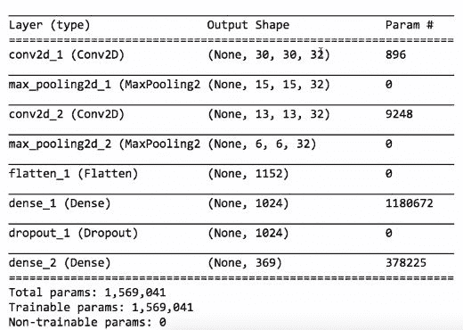
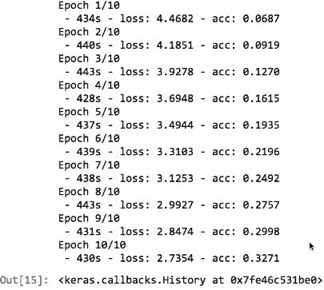
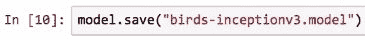

# 第五章：深度学习

在本章中，我们将介绍一些深度学习的基础知识。深度学习是指拥有多层的神经网络。这虽然是一个流行词，但其背后的技术是真实且相当复杂的。

这个术语的流行程度正在上升，与机器学习和人工智能一起，如下图所示：

正如一些深度学习方法的发明者所言，深度学习的主要优势在于，添加更多数据和更多计算能力通常能产生更准确的结果，而无需进行大量的工程工作。

本章中，我们将探讨以下内容：

+   深度学习方法

+   使用 CNN 识别手写数学符号

+   重新审视鸟类物种识别器以使用图像

# 深度学习方法

深度学习是指在特定应用中可以使用的几种方法。这些方法包括卷积层和池化层。更简单、更快速的激活函数，例如 ReLU，当神经元的加权和为正时返回其加权和，为负时返回零。正则化技术，如丢弃法（dropout），在权重更新过程中随机忽略部分权重，以防止过拟合。GPU 被用于加速训练，其速度比传统方法快 50 倍。这是因为 GPU 针对矩阵计算进行了优化，而矩阵计算在神经网络和语音识别等应用中被广泛使用。

过去五年，多个因素推动了深度学习的快速发展。大量公共数据集，如包含数百万张标注图像的 ImageNet 和包含语音样本的 Mozilla Common Voice Project，现已可用。这些数据集满足了深度学习的基本要求——大量的训练数据。GPU 已经转向深度学习和集群，同时也专注于游戏领域。这有助于实现大规模的深度学习。

先进的软件框架已经开源并且在快速改进，人人都可以使用。这些框架包括 TensorFlow、Keras、Torch 和 Caffe。像 Inception-v3 这样的深度架构在 ImageNet 数据集上取得了最先进的成果。这个网络大约有 2400 万个参数，并且有一个庞大的研究人员和软件工程师社区，他们迅速将研究原型转化为开源软件，任何人都可以下载、评估和扩展。

# 卷积和池化

本节将深入探讨两项基本的深度学习技术，即卷积和池化。在这一部分中，我们将使用图像来理解这些概念。尽管如此，我们所学习的内容同样可以应用于其他数据，如音频信号。让我们来看一下以下的照片，并开始通过放大观察像素：

卷积是按通道进行的。输入图像通常由三个通道组成：红色、绿色和蓝色。接下来的步骤是将这三种颜色分离开。下图展示了这一过程：

卷积是一个核。在这张图中，我们应用了一个 3 x 3 的卷积核。每个卷积核包含一定数量的权重。卷积核在图像上滑动，并计算卷积核上像素的加权和，每个像素与其对应的卷积核权重相乘：

还添加了一个偏置项。每个卷积核滑动到的位置会产生一个单一的数字，即加权和。卷积核的权重最初是随机值，并在训练阶段发生变化。下图展示了三种不同权重的卷积核示例：

你可以看到图像如何根据权重不同而有所不同。最右边的图像强调了边缘，这通常对识别物体很有帮助。步幅帮助我们理解卷积核如何在图像上滑动。下图是一个 1 x 1 步幅的例子：

卷积核向右移动一个像素，然后向下移动。在这个过程中，卷积核的中心会接触到图像的每个像素，并与其他卷积核发生重叠。也可以观察到，有些像素被卷积核的中心遗漏。下图展示了一个 2 x 2 步幅的例子：

在某些情况下，观察到没有发生重叠。为了证明这一点，以下图包含了一个 3 x 3 步幅的例子：

在这种情况下，由于卷积核与步幅的大小相同，因此不会发生重叠。

然而，图像的边缘需要不同的处理方式。为了处理这一点，我们可以使用填充。填充有助于防止卷积核跨越图像边界。填充由额外的像素组成，这些像素的值始终为零，不参与加权和的计算。填充使得卷积核的权重能够覆盖图像的每个区域，同时仍然假设卷积核的步幅为 1。卷积核在覆盖的每个区域上会生成一个输出。因此，如果步幅大于 1，我们将得到的输出会比原始像素少。换句话说，卷积有助于减少图像的尺寸。下面的公式展示了卷积输出的尺寸：

通常的做法是使用方形图像。为了简化，卷积核和步幅通常是方形的。这有助于我们仅关注一个维度，并且宽度和高度是相同的。下图展示了一个 3 x 3 卷积核与(3, 3)步幅的例子：

上述计算结果为 85 宽度和 85 高度。图像的宽度和高度有效地从原始 256 缩小了三倍。我们不会使用较大的步幅，而是选择使用步幅为 1 的卷积，以便卷积能够遍历每个像素。这将帮助我们得到更实际的结果。我们还需要确保有足够的填充。然而，在网络中移动时减少图像尺寸是有益的，因为这样可以让网络更快地训练，减少参数数量。较少的参数意味着更小的过拟合风险。

我们通常在卷积维度之间使用最大池化或平均池化，而不是改变步幅长度。池化操作查看一个区域，假设它是 2 x 2，并且只保留最大值或平均值。以下图像展示了一个 2 x 2 矩阵，表示池化操作：

池化区域的步幅大小始终与池的大小相同。这有助于避免重叠。

池化操作不使用任何权重，这意味着没有需要训练的参数。

这是一个相对较浅的**卷积神经网络**（**CNN**）表示：

来源：cs231.github.io，MIT 许可证

我们观察到，输入图像经过多个卷积和池化层，并且每层之间有 ReLU 激活，最终到达一个传统的全连接网络。尽管图中没有展示全连接网络，但它最终会预测类别。在这个例子中，与大多数 CNN 一样，我们会在每个层中进行多次卷积。这里我们观察到的是 10 个卷积，它们以行的形式展示。每个卷积都有自己的核在每一列中，这样可以在每个分辨率上学习不同的卷积。右侧的全连接层将决定哪些卷积最能识别汽车、卡车等。

# 使用 CNN 识别手写数学符号

本节内容涉及构建一个卷积神经网络（CNN）来识别手写数学符号。我们将使用`HASYv2`数据集。该数据集包含来自 369 个不同类别的 168,000 张图像，每个类别代表一个不同的符号。与流行的 MNIST 数据集（包含手写数字）相比，这个数据集是一个更为复杂的类比。

以下图示展示了该数据集中可用的图像类型：

在这里，我们可以看到一张图表，展示了有多少符号拥有不同数量的图像：

我们观察到许多符号的图像较少，而有些符号则有大量图像。导入任何图像的代码如下：

我们首先从`IPython`库导入`Image`类，这样我们就可以在 Jupyter Notebook 中显示图像。以下是数据集中的一张图像：

这是一张字母*`A`*的图像。每张图像的尺寸为 30 x 30 像素。尽管它实际上不需要是 RGB 格式，这张图像还是采用了 RGB 格式。不同的通道主要是黑白或灰度的。我们将使用这三个通道。接着，我们导入 CSV 文件，这样就可以加载数据集了：

该 CSV 文件列出了所有不同的文件名和类名。我们从`pil`库导入图像类，它允许我们加载图像。我们还导入了`preprocessing.image`，它使我们能够将图像转换为`numpy`数组。然后，我们会遍历数据文件，逐一查看每个文件名并加载它，同时记录它属于哪个类：

下一步是保存图像和类，并使用 CSV 读取器。我们需要设置一个计数器，确保跳过 CSV 文件的第一行（表头）。在这之后，我们继续打开图像，它位于每行的第一列。然后将其转换为数组。最终结果的维度将为 30 x 30 x 3，即 30 宽度、30 高度和 3 个通道（RGB）。

这三个通道的值将在 0 到 255 之间。这些是典型的像素值，但对于神经网络来说并不好。我们需要将值转换到 0 到 1 或-1 到 1 之间。为此，我们将每个像素值除以 255。为了简化操作，我们将收集文件名、类名和图像矩阵，并将它们放入我们的图像列表中。我们还会记录类的名称。以下代码片段将帮助我们更深入地理解这一概念：

该文件名为`hasy-data/v2-00000.png`。`A`是类的名称，后面跟着数组。该数组的维度为 30 x 30 x 3。最内层和最后一个维度是 3。每个 1.0 表示白色。这是因为我们像前面提到的那样将所有值除以 255。

我们在`HASYv2`数据集中有 168,000 张图像：

然后我们继续对数据进行打乱，并按照 80%的训练集和 20%的测试集比例进行拆分。如下代码块所示，我们首先进行打乱，然后再拆分图像：

因为我们使用了包含三个不同值的元组，所以最终我们需要将它们收集成一个矩阵：

我们需要收集图像和标签。为了收集图像，我们遍历每一行并提取每个第三个元素。这个元素就是图像矩阵。我们将它们全部合并成一个`numpy`数组。同样的操作适用于训练集和测试集。

对于输出，我们需要选择第二个值。这些值仍然是字符串，如`a`和`=`。我们需要将第二个值转换为独热编码，以便它能用于神经网络。

我们接着使用 scikit-learn 的预处理标签编码器和独热编码器：

我们将创建一个`LabelEncoder`对象，并且对类进行拟合和转换：

`fit`函数学习现存的类别。它学会了有 369 个不同的类别名称。`transform`函数将这些类别转化为整数。这是通过对类别进行排序并为每个类别分配一个整数 ID 来实现的。`integer_encoded`帮助我们以整数 ID 的形式重现类别列表。一热编码器（one-hot encoder）将这些整数进行拟合，并学习有多少个不同的整数。就像`LabelEncoder`学习类别名称一样，`onehot_encoder`将学习到有 369 个不同的整数。

代码接着使用了`LabelEncoder`，它将`train_output`转化为整数。这些整数随后被转化为一热编码（one-hot encoding）。一热编码返回一个 369 维的向量，第一维有 369 个值，向量中所有值都是零，除了一个值是 1。这个 1 的位置取决于该类别是哪一类。`test_output`也经过同样的处理。当输入和输出的训练数据准备好后，我们继续构建神经网络。

为了做到这一点，我们将再次使用`Sequential`：

Sequential 是一个前馈网络。尽管有卷积层，但它们仍然是前馈的，并且没有循环结构。网络的最后使用了全连接层（dense layers）。我们还使用了`Dropout`来尽量避免过拟合。当我们从卷积层切换到全连接层时，我们需要使用`flatten`命令，因为卷积层是二维的，而全连接层不是。我们还需要使用`Conv2D`和`MaxPooling2D`。

以下代码块是我们的网络设计：

这个模型借鉴了 MNIST 设计，它处理手写数字。我们首先创建一个顺序模型。我们需要添加一个具有 32 个不同卷积层的卷积层。卷积核大小为 3 x 3，激活函数为 ReLU。由于这是第一层，我们需要指定输入形状。如果你还记得，输入的维度是 30 x 30 x 3。

我们使用 3 x 3 的卷积核大小，并将步幅设置为 1，因为这是默认值。步幅为 1 时需要进行填充。这样会产生一个 30 x 30 x 32 的形状，因为有 32 个卷积层。30 x 30 的维度保持不变。我们现在可以观察到，仅通过进行卷积操作，我们并没有真正地减少维度。

`MaxPooling`用于将维度缩减一半。这是可能的，因为它的池化大小为 2 x 2。然后，我们进行另一个卷积层，这是另一次维度缩减。

在所有卷积操作完成后，我们将所有内容展平。这将二维表示转化为一维表示。然后将其输入到一个拥有超过 1000 个神经元的全连接层。

这个密集层将会有一个`tanh`激活函数。然后，这个结果会被送入另一个神经元的密集层。这个密集层有 369 个神经元，用于类别输出。这是`onehot_encoding`输出。除了 softmax 激活函数外，我们不会使用其他激活函数。因此，原始值将被重新缩放到 0 和 1 之间。这意味着所有 369 个神经元的输出值之和为 1.0。Softmax 基本上将输出转化为概率。

重新编译`categorical _crossentropy`有助于我们预测多个类别中的一个。你希望在`adam`优化器上执行此操作，并观察其准确性。以下是模型的总结：

我们观察到卷积层不会改变维度，但池化会改变维度。由于奇数维度大小，即 15，它会将尺寸减半。下一个层的输出是 13，同样会被减半。`conv2d_1 (Conv2D)`的参数用于学习卷积。`dense_1 (Dense)`的参数用于学习与前一层连接的权重。类似地，`dense_2 (Dense)`的参数用于学习前一层的权重。最终，我们有大约 160 万个参数。

我们将使用 TensorBoard 可视化性能的准确性和验证准确性。我们将把所有结果保存到名为`mnist-style`的目录中，因为这就是我们之前构建的网络的风格。以下是一个回调：

Keras 支持各种类型的回调。回调函数在`fit`方法中使用，因此每完成一个周期后，它会调用回调函数。回调函数会接收信息，比如验证损失和训练损失。我们使用 10 个周期和 32 的批量大小，且验证分割为 0.2（20%）。

这是训练的结果：

现在，有很多选择，但最终我们需要检查它们。我们得到了大约 76%的验证准确率，当我们在测试集上进行测试时，得到了相同的 76%准确率。现在，设计过程中有很多决策，包括卷积层的数量、每个卷积层的大小、使用什么类型的核，核的大小、步幅、卷积的激活函数、最大池化是否出现、池化的大小、密集层的数量及出现时机、激活函数等等。很多决策。选择这些不同设计的方式相当困难。这些实际上叫做**超参数**。

在拟合过程中可以学习的权重叫做参数，而关于如何设计网络、激活函数等的决策，我们称之为超参数，因为它们不能通过网络学习。为了尝试不同的参数，我们可以通过一些循环来实现：

我们将计时每个训练过程所需的时间。我们将收集结果，也就是准确率数字。然后，我们将尝试一个 2D 卷积层，可能会有一两个这样的层。我们将尝试一个包含 128 个神经元的密集层。我们将尝试一个 dropout，如`for dropout in [0.0, 0.25, 0.50, 0.7]`，这意味着会有 0-25%、50%、75% 的可能性进行丢弃。所以，对于这些组合，我们根据卷积层的数量来创建模型，卷积层可能是一个或两个。我们将添加一个卷积层。

如果是第一层，我们需要输入输入形状，否则我们只需添加该层。然后，在添加卷积层后，我们将对最大池化做相同的操作。接着，我们将展平并添加一个密集层，其大小由`for dense_size in [128, 256, 512, 1024, 2048]: loop`决定。不过，它总是使用`tanh`激活函数。

如果使用了`Dropout`，我们将添加一个 dropout 层。这个 dropout 的意思是，假设它是 50%，每次在每个批次更新权重时，每个权重有 50% 的概率不会被更新，但我们将这个层放在两个密集层之间，以防止过拟合。最后一层将始终是类别数量，因为必须如此，并且我们将使用 softmax。编译方法是相同的。

为 TensorBoard 设置一个不同的日志目录，以便我们能够区分不同的配置。启动计时器并运行 fit。进行评估并获取分数，停止计时器，并打印结果。所以，下面是它在所有这些不同配置下的运行情况：

0.74 是实际测试集的准确率。所以，你可以看到准确率有很多不同的数字。从低到高准确率大约在 0.7 到 0.8 之间，并且训练时间因网络中的参数数量而不同。我们可以可视化这些结果，因为我们正在使用回调函数。

这是来自训练集的准确率和损失：

这是验证准确率和验证损失：

稍微缩小视图，这样我们就可以看到旁边的配置，然后我们可以将它们全部关闭。再打开`mnist-style`。这是我们尝试的第一个配置：

你可以看到，准确率在上升，损失在下降。这是非常正常的。验证准确率上升，损失下降，并且大体保持一致。我们不希望看到的是，尽管准确率在大幅上升，但验证损失在一段时间后急剧飙升。这几乎可以定义为过拟合。模型在训练集上的表现非常好，但在未见过的样本上表现大幅下滑。我们真的不希望发生这种情况。所以，让我们比较一些东西。首先，我们将比较不同的 dropout。我们来看`conv2d_1`-`dense_128`，但是使用不同的 dropout。

至于损失函数：

我们可以看到，当丢弃率非常低时，比如 0 或 0.25，损失值被最小化了。这是因为，如果你真的想学习训练集，就不要拒绝更新权重。相反，要一直更新所有权重。在相同的实验中，通过观察深蓝色的线，我们可以看到，经过两次训练后，模型确实出现了过拟合，因为验证损失（即未见过的样本）开始变得更差了。所以，过拟合从这里开始。很明显，丢弃率能减少过拟合。看看 0.75 的丢弃率，验证损失在此时变得越来越低，这意味着损失越来越小。

然而，这并没有使其成为最准确的模型，因为我们可以看到，无论是训练集还是验证集，准确率并不一定是最好的。

实际上，大约 0.5 的丢弃率对于验证集来说效果相当好。现在，让我们确保其他层也符合这个规律。再次地，当没有丢弃率（0.0）时，我们得到最低的训练损失，但最高的验证损失。同样，0.75 的丢弃率会带来最低的验证损失，但不一定是最好的训练表现。

现在，让我们比较一下它们有多少个密集层。我们将保持丢弃率为 0.5，所以我们将使用`conv2d_1`。因此，我们有一个卷积层，`dense_*`，并且丢弃率为 0.50：

所以这里的选择是，密集层应该有 128、256、512、1024 还是 2048 个神经元？在前面的图中，我们可以看到一些明显的过拟合现象。几乎除了 128，其他的密集层数都会开始遭遇过拟合。因此，128 个神经元的密集层可能是最好的选择。现在，我们来比较一下一个卷积层和两个卷积层的表现：

实际上并没有太大的差别。为了验证，我们使用了两个卷积层，并获得了最低的损失值，这通常也意味着最高的准确率。这表明我们已经缩小了范围。这叫做模型选择，主要是找出最佳模型以及最佳超参数。我们已经将其缩小到二维卷积，两个卷积层，第一层密集层有 128 个神经元，并使用 50%的丢弃率。基于这些条件，接下来让我们在所有数据上重新训练，以确保我们拥有最优的训练模型：

我们得到了两个卷积层，做了 128 个全连接层和 0.5 的 dropout，在这个案例中，我们将我们所有的数据、整个数据集的训练和测试结果都结合在一起。现在，我们不能真正评估这个模型，因为我们丢失了测试集，所以我们接下来要做的就是使用这个模型来预测其他图像。实际上，我们将在拟合模型后保存它，并展示如何加载它。假如你要在另一个文件中加载它，你还需要知道那些标签的名称，因为我们所知道的只是 one-hot 编码。通过 one-hot 编码，我们可以得到整数，但那仍然不同于符号的实际名称。所以，我们必须保存`LabelEncoder`中的类别，我们将使用一个`numpy`文件来保存它。

让我们训练模型：

其实这些内容可以放在一个单独的文件中。你可以再次加载所有内容：

导入`keras.models`，然后你可以使用`load_model`功能。那里保存的模型文件实际上保存了结构和权重。恢复网络时，你只需要做这些。你可以再次打印出总结信息。对于`LabelEncoder`，我们需要重新调用构造函数，并传入我们提前保存的类别。

现在，我们可以创建一个名为`predict`的函数来接受图像。我们做一点预处理，将图像转换为数组，除以 255，然后进行预测。如果你有一整套图像，就不需要进行这种 reshape，但由于我们只有一张，我们可以将它放入一个只有一行的数组中。我们将从中获取预测结果，并使用`LabelEncoder`将预测结果反转为实际的类别名称、符号名称，那么哪个是预测呢？它是 one-hot 编码，因此你可以找出最大数字的位置。这会处理所有神经元输出，即 369 个结果，找出最大置信度的数字，然后认为这是预测的结果。因此，one-hot 编码会告诉你这个特定的符号，然后我们可以打印它：

这是我们如何使用该函数的示例：

实际上，我们正在使用训练图像来进行此操作，而不是制作新的图像，但你明白了这个思路。你拿到一张图像，假设它是一个`A`，而我对此的置信度是 87%。对于π的预测，我们的置信度是 58%，而对于 alpha 的预测，置信度是 88%。接下来，我们将看看之前使用过的鸟类物种示例，而不是使用人类创建的所有属性，我们将直接使用图像本身。

# 重新回顾使用图像的鸟类物种识别器

在本节中，我们将重新审视之前的鸟类物种识别器。这一次，我们将更新它以使用神经网络和深度学习。你还记得鸟类数据集吗？它包含了 200 种不同的鸟类，共有 12000 张图像。与上次不同，我们这次不会使用人工标注的属性，而是直接使用原始图像，且不进行任何预处理。在第一次尝试中，我们将构建一个自定义的卷积神经网络，就像我们为数学符号分类器所做的那样。

让我们来看一下代码。我们将从典型的导入开始：

我们会创建一些便捷变量，包括图像的行数和列数，宽度和高度，以及通道数（RGB），尽管每张鸟类图像将是相同的。尽管它们的大小不一定相同，我们将把它们调整为这个尺寸，以便它们保持一致：

现在，这个项目介绍了一个 Keras 中的有趣功能，叫做**图像数据生成器**：

数据生成器可以从现有的训练集生成新的图像，这些新图像可能会有各种差异；例如，它们可以旋转，可以水平或垂直翻转，等等。然后，我们就可以生成比最初更多的示例。当你的训练示例较少时，这是一个很好的方法。在我们的案例中，我们大约有 6000 个训练集。这个数量在深度学习中相对较小，因此我们希望能够生成更多；数据生成器会持续生成，直到我们要求它停止。对于训练图像，我们还希望生成水平翻转的版本。我们不想进行垂直翻转，因为我不期望任何鸟类图像会被倒置。我们还希望支持最多 45 度的旋转，并且希望将所有像素值重新缩放为除以 255。实际上，`ImageDataGenerator`只是调用构造函数，因此实际上还没有发生任何事情。接下来你需要做的是使用`flow_from_directory`，这样你的图像就可以组织到目录或子目录中。

我们有一个`train`目录，里面会有每个鸟类类别的文件夹。所以，在 train 中有 200 个不同的文件夹，而每个文件夹里包含了该鸟类的图像。我们希望所有图像都被调整为 256 x 256 的尺寸，并且我们可以指定不使用二进制，而是使用类别类，这意味着我们将有许多不同的类别（在这个例子中是 200 个）。我们也会使用数据生成器来处理测试集，因为`flow_from_directory`是一个非常方便的函数。不过，我们不希望做任何翻转或旋转。我们只希望直接使用测试集，以便能够与其他人的结果进行比较。`flow_from_directory`的另一个非常方便的特点是，它会自动生成一个包含图像数据的`numpy`矩阵，同时也会提供类别值的独热编码。

所以，之前需要几个步骤的事情，现在可以一次完成。

现在，我其实不需要进行重置，但由于这些技术上是迭代器，如果你一直在修正模型并尝试重新训练，那么你可能想要重置一下，这样你可以确保每次生成相同顺序的图像。无论如何，它是一个迭代器，所以你可以调用`next`、`reset`等：

现在，我们将构建一个顺序模型，这是一个卷积模型。我们有一个 3 x 3 的卷积核，数量为 64。我们还使用了一个`relu`激活函数和另一个由`relu`激活函数构建的卷积层，接着可以进行最大池化。通过实验，我发现这种结构效果相对较好：3 x 3 之后是 3 x 3，每层有 64 个卷积核。通过使用比较剧烈的 4 x 4 最大池化，我们重复这个过程，然后进行展平。我们设置 50%的 Dropout 以减少过拟合，接着是一个 400 个神经元的全连接层，再加一个 Dropout，最后输出层有 200 个神经元，因为有 200 个不同的类别，并且由于是独热编码，我们希望使用 softmax 激活函数，这样只有那 200 个类别中一个类别的值会是最大的。同时，我们也要确保它们的总和为 1.0。

这是模型的概述。最终，我们有大约 500 万个参数：

我做过的不同变体，比如说 100 百万个参数的情况，效果更差，因为参数实在是太多了。要么是参数太多，这意味着训练它学习任何东西都非常困难，因为显然所有参数一开始都是随机的，所以很难让这些参数趋向正确的值，要么是参数太少，这样也学不到任何东西。你需要找到一个平衡点，我认为 500 万差不多是在这个平衡点附近。

现在，如果你使用生成器，你就不需要提前准备好所有训练数据；它会随着训练的进行动态生成这些图像：

这实际上相当节省内存。你不需要提前加载整个数据集。它只会按需加载，但你必须调用`fit_generator`，而不是仅仅使用 fit。你提供的不是训练输入和输出，而是生成器。生成器知道如何生成图像矩阵，也知道如何生成一热编码（one-hot encoding）。所以，当你有图像数据时，这非常方便。还有其他类型的生成器，可以查阅 Keras 文档了解更多。`steps_per_epoch`显示每个训练周期需要生成多少张图片，或者说需要生成多少批次。默认情况下，生成器每次生成 32 张图片。关于训练周期数量，如果你想在 TensorBoard 上查看一些统计信息，可以设置一个回调函数，并设置 verbose 为 2，这样我们就可以看到一些输出了。

总共有 10 个训练周期（epochs）：

我们可以看到，训练准确度是在训练图片上进行的。它并不是很准确，无法预测测试集上的准确度，所以我们需要分开处理。测试图片也在生成器中。你不只是进行评估——你需要使用`evaluate_generator`，然后你会说，*你想评估多少张图片？* 我们只评估 1,000 张，结果得到了 22%的准确率。

这还算不错。随机猜测的准确率大约是 0.5%，所以 22%是相当不错的，而这仅仅是从一个从零开始的手工制作的模型，学习了所有的鸟类图片后得到的结果。我之所以这么说，是因为接下来我们要做的就是扩展一个预训练模型，以获得更高的准确度提升。

这个模型是手工构建的，但要是扩展像`Inceptionv3`这样的模型会更好，如图所示：

这个模型相当深，它有很多卷积层，和大多数 CNN 一样，它以一个全连接层结束，或者可能是多个全连接层。`Inceptionv3`模型是为 ImageNet 设计的。嗯，这是一个数据集，并且它有一些相关的竞赛，里面有数百万张图片，包含 1,000 个不同类别，比如昆虫、房屋、汽车等等。`Inceptionv3`模型是最先进的，或者至少曾经是。它是 ImageNet 的竞赛模型，用来与其他数据库竞争。我们将使用这个网络的大部分部分，一直到全连接层。我们不需要最后的全连接或密集层，因为这些是为 ImageNet 设计的。具体来说，ImageNet 有 1,000 个输出，而这对我们来说并不合适。我们不需要识别 ImageNet 中的图像，但我们确实需要识别我们的鸟类图像，而且只有 200 个不同的类别。

所以，我们只是去掉前面的部分，并用我们自己的全连接层或多个层替换它。我们将使用它学习到的所有卷积和卷积核，这些都是基于 ImageNet 图像学习得到的。接下来，我们来看看代码。为了实现这一点，从 Keras 的 applications 模块导入`Inceptionv3`。Keras 还提供了其他可以选择的模型：

我们将像之前一样使用数据生成器。

这时开始有所不同：

首先，加载`InceptionV3`模型，并使用 ImageNet 的权重。`include_top=False`意味着去掉顶部的密集全连接层。这就是所谓的顶部，它最终输出 1000 个不同的结果。我们不需要这个，我们只需要卷积层。这将被称为`base_model`。调用`x`，这是基础模型的输出，添加一个`GlobalAveragePooling`，它会计算整个卷积的平均值，然后加入一些全连接层，包含 1024 个神经元和另一个 200 个神经元的层。当然，200 个神经元是因为我们有 200 个不同的鸟类物种，1024 个神经元则是为了学习卷积如何匹配鸟类物种，然后生成包含这些层的模型。模型的输入是`Inceptionv3`的输入，输出是`out_layer = Dense(200, activation='softmax')(x)`。

此时，你可以调用常规的模型函数，比如`compile`，但在编译之前，我们希望将所有基础模型的层和所有卷积层标记为不可训练。

我们将执行两个步骤。在我们添加了新的两层全连接层，即 1024 和 200 个神经元时，这些层的权重是随机的，所以它们现在几乎没有用。卷积层已经在 ImageNet 上进行了学习，所以它们已经很好了。我们不希望在训练我们的鸟类图片时更改这些卷积层，直到我们将那对新的全连接层排列正确。所以，我们首先将 Inception 模型中的那些层标记为不可训练；只保留那些卷积层的权重不变——我们只训练我们新添加的那两层：

接下来的操作是对生成器进行拟合，就像之前一样。

我们将开始训练 100 个 epoch：

然后我们将进行评估：

现在，我们的准确率达到了 44%。通过使用 Inception v3 的权重和结构，或者 ImageNet，但将顶部的两层替换为我们自己的全连接网络，我们比之前自定义卷积神经网络的结果提高了 20%。但我们可以做得更好。

我们可以使用我们刚刚得到的模型，这样模型就能训练顶部的两层并将所有层标记为可训练：

所以，现在顶层的两层已经调整成合理的形式，准确率为 44%，我们将让整个网络更新我们所有的鸟类图像。我们将非常慢地使用随机梯度下降法（SGD），采用非常低的学习率和高动量。经过 100 轮训练后，我们的准确率达到了 64%：

所以，我们基本上每次都提升了 20%。使用自定义的 CNN，我们从头开始就获得了 22%的准确率。当然，这个网络没有`Inception`模型那么大，但它展示了从头开始时会发生什么。然后，我们从`Inception`开始，使用所有的卷积核，但在其上加了我们自己的两个随机层，随机权重，训练这些权重但不改变卷积核，最终得到了 44%的准确率。最后，我们更新了所有的权重、卷积核和顶层，并获得了 64%的准确率。

所以，这比随机猜测要好得多，随机猜测的准确率是 0.5%，而且每次我们改进模型时，准确率都有所提高。你可以保存结果，然后将其加载到一个单独的文件中，也许通过加载模型来实现：

如果你想将鸟的名字打印给用户，你还需要知道类别名称：

在这种情况下，我们可以按排序的形式列出子目录，因为这将与独热编码匹配，我们可以定义一个名为`predict`的函数，给它一个包含图像的文件名，它会加载该图像。确保它会调整图像大小并转换为数组，将其除以 255，然后运行预测器。所有这些之前都通过图像生成器为我们做过了：

但是现在，由于我们是一次处理一个，我们将改为手动操作。运行预测，找出最佳得分和位置，获取类别名称并打印出来，再加上置信度。这里有几个例子是我在互联网上找到的鸟类：

我不能保证这些图片不是训练集的一部分，但谁知道呢。在蜂鸟的情况下，它预测正确了。房屋鹪鹩也被正确预测了。然而，大雁并没有被正确预测。这是一个允许用户输入文件名的例子。如果你有自己的图片，且这些图片与摄影类型的图像相似，你应该考虑使用像`InceptionV3`这样的预训练模型，以获得更大的准确率提升。

# 概要

在这一章中，我们讨论了深度学习和卷积神经网络（CNN）。我们通过两个项目练习了卷积神经网络和深度学习。首先，我们构建了一个可以读取手写数学符号的系统，然后重新审视了鸟类物种识别器，并将实现方式更改为使用深度卷积神经网络，这样的准确性显著提高。这也标志着 Python 人工智能初学者项目的结束。
