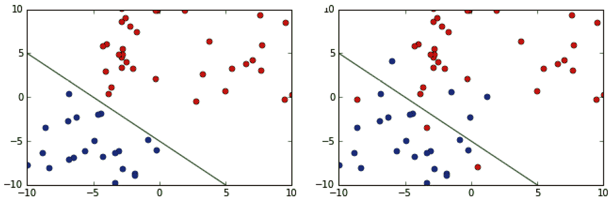
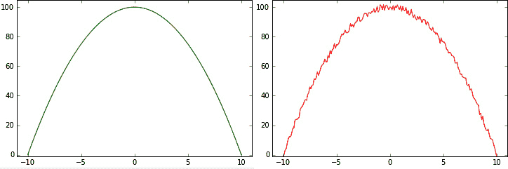
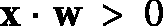

# 第一章：机器学习——简介

**机器学习**（**ML**）技术正在广泛应用于各个领域，数据科学家在许多不同的行业中需求量很大。通过机器学习，我们识别出从数据中获得不易察觉的知识以做出决策的过程。机器学习技术的应用领域各不相同，涵盖了医学、金融、广告等多个学科。

在本章中，我们将介绍不同的机器学习方法、技术及其在实际问题中的一些应用，同时也将介绍 Python 中一个主要的开源机器学习包——PyTorch。这为后续章节奠定了基础，在这些章节中，我们将专注于使用**神经网络**（**NNs**）的某种类型的机器学习方法，特别是我们将重点讲解**深度学习**（**DL**）。

深度学习（DL）采用了比以往更先进的神经网络（NN）。这不仅是近年来理论发展的结果，也是计算机硬件进步的体现。本章将总结机器学习（ML）的基本概念及其应用，帮助你更好地理解深度学习（DL）如何区别于传统的流行机器学习技术。

本章我们将讨论以下主要内容：

+   机器学习简介

+   不同的机器学习方法

+   神经网络

+   PyTorch 简介

# 技术要求

我们将在本章中使用 Python 和 PyTorch 实现示例。如果你还没有配置好相关环境，也不必担心——示例代码已作为 Jupyter 笔记本提供在 Google Colab 上。你可以在本书的 GitHub 仓库中找到代码示例：[`github.com/PacktPublishing/Python-Deep-Learning-Third-Edition/tree/main/Chapter01`](https://github.com/PacktPublishing/Python-Deep-Learning-Third-Edition/tree/main/Chapter01)。

# 机器学习简介

机器学习（ML）通常与**大数据**和**人工智能**（**AI**）等术语相关联。然而，这两者与机器学习是完全不同的。要理解机器学习是什么以及它为何有用，首先需要了解大数据是什么，以及机器学习如何应用于大数据。

大数据是一个用来描述由大量数据积累和存储所产生的大型数据集的术语。例如，这些数据可能来源于摄像头、传感器或社交网络网站。

我们每天创造多少数据？

据估计，仅谷歌每天处理的信息量就超过 20PB，而且这个数字还在不断增加。几年前，福布斯估计，每天创造的数据量为 2.5 万亿字节，而全球 90%的数据是在过去两年内生成的。

([`www.forbes.com/sites/bernardmarr/2018/05/21/how-much-data-do-we-create-every-day-the-mind-blowing-stats-everyone-should-read/`](https://www.forbes.com/sites/bernardmarr/2018/05/21/how-much-data-do-we-create-every-day-the-mind-blowing-stats-everyone-should-read/))

人类无法独立掌握，更不用说分析如此庞大的数据量，机器学习技术就是用来理解这些非常大的数据集的工具。机器学习是用于大规模数据处理的工具。它非常适合具有大量变量和特征的复杂数据集。许多机器学习技术，尤其是深度学习的优势之一是，它们在大数据集上使用时表现最佳，从而提高了它们的分析和预测能力。换句话说，机器学习技术，特别是深度学习神经网络，最擅长在能够访问大量数据集的情况下进行学习，在这些数据集中它们能够发现隐藏的模式和规律。

另一方面，机器学习的预测能力可以成功地应用到人工智能（AI）系统中。机器学习可以被认为是人工智能系统的大脑。人工智能可以定义为（尽管这种定义可能不唯一）一种能够与其环境进行交互的系统。此外，AI 机器配备了传感器，使它们能够了解所处的环境，并配有工具来与环境进行交互。因此，机器学习就是让机器分析通过传感器获取的数据并得出合适答案的大脑。一个简单的例子是 iPhone 上的 Siri。Siri 通过麦克风接收命令，并通过扬声器或显示屏输出答案，但为了做到这一点，它需要理解收到的命令。类似地，自动驾驶汽车将配备摄像头、GPS 系统、声纳和激光雷达，但所有这些信息都需要经过处理才能提供正确的答案。这可能包括是否加速、刹车或转弯。机器学习是这种信息处理方法，能够得出最终答案。

我们已经解释了什么是机器学习（ML），那深度学习（DL）呢？目前，我们暂且说深度学习是机器学习的一个子领域。深度学习方法具有一些特殊的共同特征。最著名的代表方法就是深度神经网络（NN）。

# 不同的机器学习方法

如我们所见，机器学习（ML）这一术语被广泛使用，它指的是从大量数据集中推断模式的通用技术，或者是基于分析已知数据来对新数据进行预测的能力。机器学习技术大致可以分为两大核心类别，此外通常还会添加一个类别。以下是这些类别：

+   监督学习

+   无监督学习

+   强化学习

让我们来仔细看看。

## 监督学习

监督学习算法是一类机器学习算法，它们使用之前标注过的数据来学习其特征，以便能够对类似但未标注的数据进行分类。让我们通过一个例子来更好地理解这个概念。

假设一个用户每天会收到许多电子邮件，其中一些是重要的商务邮件，而另一些则是未经请求的垃圾邮件，也就是**垃圾邮件**。监督式机器学习算法会接收到大量已经由“教师”标注为垃圾邮件或非垃圾邮件的电子邮件（这叫做**训练数据**）。对于每个样本，机器将尝试预测该邮件是否是垃圾邮件，并将预测结果与原始目标标签进行比较。如果预测结果与目标不符，机器将调整其内部参数，以便下次遇到该样本时，能够正确分类。相反，如果预测正确，参数将保持不变。我们给算法提供的训练数据越多，它的表现就会越好（但这一规则也有例外，稍后我们会讨论）。

在我们使用的例子中，电子邮件只有两个类别（垃圾邮件或非垃圾邮件），但是相同的原则适用于具有任意类别（或分类）的任务。例如，Google 提供的免费电子邮件服务 Gmail 允许用户选择最多五个类别，分类标签如下：

+   **主要**：包括人与人之间的对话

+   **促销**：包括营销邮件、优惠和折扣

+   **社交**：包括来自社交网络和媒体共享网站的消息

+   **更新**：包括账单、银行对账单和收据

+   **论坛**：包括来自在线小组和邮件列表的消息

总结来说，机器学习任务是将一组输入值映射到有限数量的类别，这个任务叫做**分类**。

在某些情况下，结果可能不一定是离散的，我们可能没有有限数量的类别来对数据进行分类。例如，我们可能尝试根据预定的健康参数预测一组人的预期寿命。在这种情况下，结果是一个数值，我们不再谈论分类，而是谈论**回归**。

一种看待监督学习的方法是想象我们正在构建一个函数，`f`，该函数定义在一个数据集上，数据集由**特征**组织的信息组成。在电子邮件分类的例子中，特征可以是一些在垃圾邮件中出现频率高于其他单词的特定词汇。显式的性别相关词汇最有可能识别出垃圾邮件，而不是商务/工作邮件。相反，像*meeting*、*business*或*presentation*这样的词更有可能描述工作邮件。如果我们可以访问元数据，我们也可以使用发件人的信息作为特征。每封电子邮件将具有一组相关的特征，每个特征将有一个值（在这种情况下，就是特定单词在电子邮件正文中出现的次数）。然后，机器学习算法将尝试将这些值映射到一个离散的范围，该范围代表一组类别，或者在回归的情况下，映射到一个实数值。`f`函数的定义如下：


在后续章节中，我们将看到一些分类或回归问题的示例。我们将讨论的一个问题是对**修改后的国家标准与技术研究所**（**MNIST**）数据库中的手写数字进行分类（[`yann.lecun.com/exdb/mnist/`](http://yann.lecun.com/exdb/mnist/)）。当给定一个表示 0 到 9 的图像集合时，机器学习算法将尝试将每个图像分类到 10 个类别之一，每个类别对应 10 个数字中的一个。每个图像的大小为 28×28 (= 784) 像素。如果我们把每个像素看作一个特征，那么算法将使用 784 维的特征空间来分类这些数字。

下图展示了来自 MNIST 数据集的手写数字：


图 1.1 – 来自 MNIST 数据集的手写数字示例

在接下来的章节中，我们将讨论一些最受欢迎的经典监督学习算法。以下内容绝非详尽无遗，也不是每种机器学习方法的深入描述。我们建议参考 Sebastian Raschka 所著的《*Python 机器学习*》一书（[`www.packtpub.com/product/python-machine-learning-third-edition/9781789955750`](https://www.packtpub.com/product/python-machine-learning-third-edition/9781789955750)）。这是一本简单的回顾，旨在为你提供不同机器学习技术的概览，特别是在 Python 中的应用。

### 线性回归与逻辑回归

**回归**算法是一种监督学习算法，它利用输入数据的特征来预测一个数值，例如在给定房屋的大小、年龄、浴室数量、楼层数和位置等特征的情况下，预测房屋的价格。回归分析试图找到使输入数据集最符合的函数参数值。

在**线性回归**算法中，目标是通过在输入数据上找到适当的参数，使得函数最小化**代价函数**，从而最好地逼近目标值。代价函数是误差的函数——即，我们离正确结果有多远。一个常见的代价函数是**均方误差**（**MSE**），它通过取预期值与预测结果之间差值的平方来计算。所有输入示例的和给出了算法的误差，并代表了代价函数。

假设我们有一栋 100 平方米的房子，它建于 25 年前，有三个浴室和两层楼。我们还假设这座城市分为 10 个不同的社区，我们用 1 到 10 的整数来表示这些社区，假设这座房子位于编号为 7 的区域。我们可以用一个五维向量来表示这栋房子，![<mml:math xmlns:mml="http://www.w3.org/1998/Math/MathML" xmlns:m="http://schemas.openxmlformats.org/officeDocument/2006/math"><mml:mi mathvariant="bold">x</mml:mi><mml:mo>=</mml:mo><mml:mfenced separators="|"><mml:mrow><mml:msub><mml:mrow><mml:mi>x</mml:mi></mml:mrow><mml:mrow><mml:mn>1</mml:mn></mml:mrow></mml:msub><mml:mo>,</mml:mo><mml:msub><mml:mrow><mml:mi>x</mml:mi></mml:mrow><mml:mrow><mml:mn>2</mml:mn></mml:mrow></mml:msub><mml:mo>,</mml:mo><mml:msub><mml:mrow><mml:mi>x</mml:mi></mml:mrow><mml:mrow><mml:mn>3</mml:mn></mml:mrow></mml:msub><mml:mo>,</mml:mo><mml:msub><mml:mrow><mml:mi>x</mml:mi></mml:mrow><mml:mrow><mml:mn>4</mml:mn></mml:mrow></mml:msub><mml:mo>,</mml:mo><mml:msub><mml:mrow><mml:mi>x</mml:mi></mml:mrow><mml:mrow><mml:mn>5</mml:mn></mml:mrow></mml:msub></mml:mrow></mml:mfenced><mml:mo>=</mml:mo><mml:mfenced separators="|"><mml:mrow><mml:mn>100,25,3</mml:mn><mml:mo>,</mml:mo><mml:mn>2,7</mml:mn></mml:mrow></mml:mfenced></mml:math>](img/2.png)。假设我们还知道这栋房子的估计价值为$100,000（在今天的世界里，这可能只够在北极附近买一座小屋，但我们假设如此）。我们想要创建一个函数，`f`，使得 。

鼓励的话

如果你没有完全理解本节中的某些术语，不用担心。我们将在*第二章*中更详细地讨论向量、成本函数、线性回归和梯度下降。我们还将看到，训练神经网络（NN）和线性/逻辑回归有很多相似之处。现在，你可以将向量看作一个数组。我们将用粗体字表示向量——例如，。我们将用斜体字和下标表示向量的元素——例如，。

在线性回归中，这意味着找到一个权重向量，![<mml:math xmlns:mml="http://www.w3.org/1998/Math/MathML" xmlns:m="http://schemas.openxmlformats.org/officeDocument/2006/math"><mml:mi mathvariant="bold">w</mml:mi><mml:mo>=</mml:mo><mml:mfenced separators="|"><mml:mrow><mml:msub><mml:mrow><mml:mi>w</mml:mi></mml:mrow><mml:mrow><mml:mn>1</mml:mn></mml:mrow></mml:msub><mml:mo>,</mml:mo><mml:msub><mml:mrow><mml:mi>w</mml:mi></mml:mrow><mml:mrow><mml:mn>2</mml:mn></mml:mrow></mml:msub><mml:mo>,</mml:mo><mml:msub><mml:mrow><mml:mi>w</mml:mi></mml:mrow><mml:mrow><mml:mn>3</mml:mn></mml:mrow></mml:msub><mml:mo>,</mml:mo><mml:msub><mml:mrow><mml:mi>w</mml:mi></mml:mrow><mml:mrow><mml:mn>4</mml:mn></mml:mrow></mml:msub><mml:mo>,</mml:mo><mml:msub><mml:mrow><mml:mi>w</mml:mi></mml:mrow><mml:mrow><mml:mn>5</mml:mn></mml:mrow></mml:msub></mml:mrow></mml:mfenced></mml:math>](img/6.png)，使得向量的点积，，将是 ![<mml:math xmlns:mml="http://www.w3.org/1998/Math/MathML" xmlns:m="http://schemas.openxmlformats.org/officeDocument/2006/math"><mml:mn>100</mml:mn><mml:msub><mml:mrow><mml:mi>w</mml:mi></mml:mrow><mml:mrow><mml:mn>1</mml:mn></mml:mrow></mml:msub><mml:mo>+</mml:mo><mml:mn>25</mml:mn><mml:msub><mml:mrow><mml:mi>w</mml:mi></mml:mrow><mml:mrow><mml:mn>2</mml:mn></mml:mrow></mml:msub><mml:mo>+</mml:mo><mml:mn>3</mml:mn><mml:msub><mml:mrow><mml:mi>w</mml:mi></mml:mrow><mml:mrow><mml:mn>3</mml:mn></mml:mrow></mml:msub><mml:mo>+</mml:mo><mml:mn>2</mml:mn><mml:msub><mml:mrow><mml:mi>w</mml:mi></mml:mrow><mml:mrow><mml:mn>4</mml:mn></mml:mrow></mml:msub><mml:mo>+</mml:mo><mml:mn>7</mml:mn><mml:msub><mml:mrow><mml:mi>w</mml:mi></mml:mrow><mml:mrow><mml:mn>5</mml:mn></mml:mrow></mml:msub><mml:mo>=</mml:mo><mml:mn>100000</mml:mn></mml:math>](img/8.png) 或者 ![<mml:math xmlns:mml="http://www.w3.org/1998/Math/MathML" xmlns:m="http://schemas.openxmlformats.org/officeDocument/2006/math"><mml:mi> </mml:mi><mml:mrow><mml:msubsup><mml:mo stretchy="false">∑</mml:mo><mml:mrow><mml:mi> </mml:mi></mml:mrow><mml:mrow><mml:mi> </mml:mi></mml:mrow></mml:msubsup><mml:mrow><mml:msub><mml:mrow><mml:mi>x</mml:mi></mml:mrow><mml:mrow><mml:mi>i</mml:mi></mml:mrow></mml:msub></mml:mrow></mml:mrow><mml:msub><mml:mrow><mml:mi>w</mml:mi></mml:mrow><mml:mrow><mml:mi>i</mml:mi></mml:mrow></mml:msub><mml:mo>=</mml:mo><mml:mn>100000</mml:mn></mml:math>](img/9.png)。如果我们有 1000 栋房子，我们可以对每栋房子重复相同的过程，理想情况下，我们希望找到一个单一的向量，*`w`*，能够预测每栋房子足够接近的正确值。训练线性回归模型的最常见方法可以在以下伪代码块中看到：

```py
Initialize the vector w with some random values
repeat:
  E = 0 # initialize the cost function E with 0
  for every pair  of the training set:
       # here  is the real house price
   # Mean Square Error
  use gradient descent to update the weights w based on MSE until MSE falls below threshold
```

首先，我们遍历训练数据来计算代价函数 MSE。一旦我们知道了 MSE 的值，就会使用 **梯度下降** 算法来更新向量的权重，*`w`*。为此，我们将计算代价函数关于每个权重的导数，。通过这种方式，我们就能知道代价函数如何相对于  发生变化（增加或减少）。然后，我们将相应地更新该权重的值。

之前，我们演示了如何使用线性回归解决回归问题。现在，让我们来处理一个分类任务：尝试判断一座房子是被高估还是低估。在这种情况下，目标数据将是分类的[1, 0]——1 代表高估，0 代表低估。房子的价格将作为输入参数，而不再是目标值。为了解决这个问题，我们将使用逻辑回归。这与线性回归类似，但有一个区别：在线性回归中，输出是 。然而，在这里，输出将是一个特殊的逻辑函数 ([`en.wikipedia.org/wiki/Logistic_function`](https://en.wikipedia.org/wiki/Logistic_function))，。这将把  的值压缩到 (0:1) 区间。你可以将逻辑函数看作是一个概率，结果越接近 1，房子被高估的可能性越大，反之亦然。训练过程与线性回归相同，但函数的输出在 (0:1) 区间内，标签要么是 0，要么是 1。

逻辑回归不是一种分类算法，但我们可以将其转化为分类算法。我们只需引入一条规则，根据逻辑函数的输出确定类别。例如，如果值为  时，我们可以认为一所房子被高估，否则它被低估。

多元回归

本节中的回归示例具有单一的数值输出。回归分析可以有多个输出。我们将这种分析称为**多元回归**。

### 支持向量机

**支持向量机**（**SVM**）是一种监督式机器学习算法，主要用于分类。它是核方法算法类中最流行的成员。SVM 试图找到一个超平面，将数据集中的样本分隔开。

超平面

超平面是一个高维空间中的平面。例如，单维空间中的超平面是一个点，二维空间中的超平面是直线。在三维空间中，超平面是一个平面，而在四维空间中我们无法直观地想象超平面，但我们知道它的存在。

我们可以将分类看作是寻找一个超平面的过程，该超平面能够分隔不同的点集。一旦我们定义了特征，数据集中的每个样本（在我们的例子中是一个电子邮件）都可以看作是特征多维空间中的一个点。该空间的一维代表一个特征的所有可能值。一个点（一个样本）的坐标是该样本每个特征的具体值。机器学习算法的任务是绘制一个超平面，将不同类别的点分开。在我们的例子中，超平面将垃圾邮件与非垃圾邮件分开。

在下图中，顶部和底部展示了两类点（红色和蓝色），这些点位于二维特征空间中（`x` 和 `y` 轴）。如果一个点的 `x` 和 `y` 值都低于 5，则该点为蓝色。其他情况下，该点为红色。在这种情况下，类别是**线性可分**的，这意味着我们可以用一个超平面将它们分开。相反，右图中的类别是线性不可分的：



图 1.2 – 一组线性可分的点集（左）和一组线性不可分的点集（右）

支持向量机（SVM）尝试找到一个超平面，使得它与各个点之间的距离最大。换句话说，在所有可以分开样本的超平面中，SVM 找到的是那个与所有点的距离最大的超平面。此外，SVM 还可以处理非线性可分的数据。有两种方法可以实现这一点：引入软间隔或使用**核技巧**。

软间隔通过允许少数被误分类的元素，同时保持算法的最强预测能力来工作。在实际应用中，最好避免对机器学习模型过拟合，我们可以通过放宽一些支持向量机（SVM）的假设来做到这一点。

核技巧通过不同的方式解决相同的问题。假设我们有一个二维特征空间，但类别是线性不可分的。核技巧使用一个核函数，通过为数据添加更多的维度来对其进行转换。在我们的例子中，经过转换后，数据将变成三维的。二维空间中线性不可分的类别在三维空间中将变得线性可分，我们的问题得以解决：


图 1.3 – 在应用核技巧之前的非线性可分数据集（左），以及应用核技巧后的同一数据集，数据变得线性可分（右）

让我们来看看列表中的最后一个，决策树。

### 决策树

另一个流行的监督算法是决策树，它创建一个树形的分类器。决策树由决策节点组成，在这些节点上进行特征测试，以及叶节点，表示目标属性的值。为了分类一个新样本，我们从树的根节点开始，沿着节点向下导航，直到到达叶节点。

该算法的一个经典应用是鸢尾花数据集（[`archive.ics.uci.edu/ml/datasets/Iris`](http://archive.ics.uci.edu/ml/datasets/Iris)），其中包含来自三种鸢尾花的 50 个样本的数据。

(**鸢尾花 Setosa**, **鸢尾花 Virginica**, 和 **鸢尾花 Versicolor**)。创建该数据集的罗纳德·费舍尔（Ronald Fisher）测量了这三种花的四个不同特征：

+   它们萼片的长度

+   它们萼片的宽度

+   它们花瓣的长度

+   它们花瓣的宽度

基于这些特征的不同组合，可以创建一个决策树来决定每朵花属于哪个物种。在下图中，我们定义了一个决策树，它将仅使用这两个特征——花瓣长度和宽度，正确地分类几乎所有的花：


图 1.4 – 用于分类鸢尾花数据集的决策树

要对一个新样本进行分类，我们从树的根节点（花瓣长度）开始。如果样本满足条件，我们就向左走到叶子节点，表示 Iris Setosa 类别。如果不满足条件，我们就向右走到一个新节点（花瓣宽度）。这个过程会一直进行，直到我们到达叶子节点。

近年来，决策树经历了两项重大改进。第一项是**随机森林**，这是一种集成方法，它结合了多个决策树的预测结果。第二项是一个叫做**梯度提升**的算法类，它通过创建多个连续的决策树，每棵树都试图改进前一棵树所犯的错误。由于这些改进，决策树在处理某些类型的数据时变得非常流行。例如，它们是 Kaggle 比赛中最常用的算法之一。

## 无监督学习

第二类机器学习算法是无监督学习。在这里，我们不事先标注数据；相反，我们让算法自行得出结论。无监督学习算法相对于监督学习算法的一个优势是，我们不需要标签数据。为监督算法生成标签可能既昂贵又缓慢。解决这个问题的一种方法是修改监督算法，使其使用更少的标注数据；对此有不同的技术。但另一种方法是使用一种根本不需要标签的算法。在本节中，我们将讨论一些无监督算法。

### 聚类

无监督学习最常见、也许是最简单的例子之一是聚类。这是一种尝试将数据分成多个子集的技术。

为了说明这一点，让我们将垃圾邮件与非垃圾邮件的电子邮件分类看作一个无监督学习问题。在监督学习的情况下，对于每封电子邮件，我们都有一组特征和一个标签（垃圾邮件或非垃圾邮件）。在这里，我们将使用相同的特征集，但电子邮件不会被标注。相反，我们会让算法在给定特征集的情况下，将每个样本分配到两个独立的组（或簇）之一。然后，算法会尝试以一种方式组合这些样本，使得同一簇内的相似度（即同一簇内样本的相似性）很高，而不同簇之间的相似度很低。不同的聚类算法使用不同的度量标准来衡量相似度。对于一些更高级的算法，你甚至不需要指定簇的数量。

以下图示显示了如何将一组点分类为三个子集：


图 1.5 – 将一组点聚类为三个子集

#### K-means

K-means 是一种聚类算法，它将数据集中的元素分成 `k` 个不同的簇（因此名称中有一个 `k`）。它的工作原理如下：

1.  从特征空间中选择 `k` 个随机点，称为**质心**，它们将代表每个 `k` 个簇的中心。

1.  将数据集中的每个样本（即特征空间中的每个点）分配给与其最接近的质心所在的簇。

1.  对于每个簇，我们通过计算簇内所有点的均值来重新计算新的质心。

1.  使用新的质心，我们重复执行 *步骤 2* 和 *步骤 3*，直到满足停止准则。

上述方法对初始随机质心的选择非常敏感，可能需要用不同的初始选择重复进行。也有可能某些质心离数据集中的任何点都很远，从而减少簇的数量，低于 `k`。最后值得一提的是，如果我们在鸢尾花数据集上使用 k-means 并设置 *k=3*，我们可能会得到与之前介绍的决策树分布不同的样本分布。再次强调，这突显了为每个问题选择和使用正确的机器学习方法的重要性。

现在，让我们讨论一个使用 k-means 聚类的实际例子。假设一个披萨配送点想在城市中开设四个新加盟店，并需要选择站点的位置。我们可以通过 k-means 来解决这个问题：

1.  找出披萨订单最多的地点，这些地点将作为我们的数据点。

1.  选择四个随机点作为新站点的位置。

1.  通过使用 k-means 聚类，我们可以识别出四个最佳位置，最小化与每个配送地点的距离：


图 1.6 – 披萨配送最多的地点分布（左）；圆点表示新加盟店应选择的位置及其相应的配送区域（右）

### 自监督学习

自监督学习指的是通过一组合适的问题和数据集，*自动生成*（即无需人工干预）标注数据。一旦我们拥有这些标签，就可以训练一个监督算法来解决我们的任务。为了更好地理解这个概念，让我们讨论一些应用场景：

+   **时间序列预测**：假设我们需要基于时间序列的最新历史数据来预测其未来的值。此类例子包括股票（以及现在的加密货币）价格预测和天气预测。为了生成一个标注的数据样本，我们将选取一个长度为 `k` 的历史数据窗口，窗口以过去时刻 `t` 作为终点。我们将使用时间区间 *[t – k; t]* 内的历史值作为监督算法的输入，同时取时刻 *t + 1* 的历史值作为给定输入样本的标签。我们可以对其余的历史值应用这种划分方式，自动生成标注的训练数据集。

+   **自然语言处理**（**NLP**）：类似于时间序列，自然文本代表了一个单词（或标记）序列。我们可以训练一个 NLP 算法，基于前面的`k`个单词来预测下一个单词，方式与时间序列类似。然而，自然文本不像时间序列那样有严格的过去/未来划分。正因为如此，我们可以使用目标单词周围的整个上下文作为输入——也就是说，不仅仅是前面的单词，还包括目标单词后面的单词。如我们将在*第六章*中看到的，这种技术是当代 NLP 算法的基础。

+   **自编码器**：这是一种特殊类型的神经网络，旨在重建其输入。换句话说，自编码器的目标值（标签）等于输入数据，，其中`i`是样本索引。我们可以正式地说，它试图学习一个恒等函数（即重复其输入的函数）。由于我们的标签只是输入数据，自编码器是一个无监督算法。你可能会想，试图预测其输入的算法有什么意义。自编码器分为两部分——编码器和解码器。首先，编码器尝试将输入数据压缩成比输入本身更小的向量。接着，解码器根据这个较小的内部状态向量重建原始输入。通过设定这个限制，自编码器被迫仅提取输入数据中最重要的特征。自编码器的目标是学习一种比原始表示更高效或更紧凑的数据表示，同时尽可能保留原始信息。

自监督学习的另一个有趣应用是生成模型，而非判别模型。让我们讨论这两者之间的区别。给定输入数据，判别模型会将其映射到一个特定的标签（换句话说，就是分类或回归）。一个典型的例子是将 MNIST 图像分类为 10 个数字类别中的一个，其中神经网络将输入数据特征（像素强度）映射到数字标签。我们也可以用另一种方式来表达：判别模型给出的是在给定* x *（输入）时，* y *（类别）的概率 —— 。在 MNIST 的情况下，这是在给定图像的像素强度时，数字的概率。

另一方面，生成模型学习类的分布情况。你可以将它视为与判别模型的相反。它不是在给定某些输入特征的情况下预测类的概率 `y`，而是尝试在给定某个类 `y` 时预测输入特征的概率 – 。例如，生成模型能够在给定数字类别时生成手写数字的图像。由于我们只有 10 个类别，它将仅能生成 10 张图像。然而，我们只是用这个例子来说明这一概念。实际上，类别可以是一个任意的张量值，模型将能够生成无限数量的具有不同特征的图像。如果你现在不理解这一点，别担心；我们将在*第五章*中再次讨论这个话题。在*第八章*和*第九章*中，我们将讨论变换器（新型神经网络）如何被用于生成一些令人印象深刻的生成模型。由于它们产生的吸引人结果，变换器在研究界和主流公众中都获得了很大的关注。最受欢迎的两种视觉模型是**稳定扩散**（[`github.com/CompVis/stable-diffusion`](https://github.com/CompVis/stable-diffusion)），由 Stability AI（[`stability.ai/`](https://stability.ai/)）开发，以及**DALL-E**（[`openai.com/dall-e-2/`](https://openai.com/dall-e-2/)），由 OpenAI 开发，它们可以从自然语言描述生成逼真的或艺术性的图像。当提示文本为*弹吉他的音乐青蛙*时，稳定扩散生成以下图像：


图 1.7 – 稳定扩散对“弹吉他的音乐青蛙”提示的输出

另一个有趣的生成模型是 OpenAI 的**ChatGPT**（GPT 代表**生成预训练变换器**），它（正如其名字所示）充当一个智能聊天机器人。ChatGPT 能够回答后续问题、承认错误、挑战不正确的前提，并拒绝不当的请求。

## 强化学习

第三类机器学习技术叫做**强化学习**（**RL**）。我们将通过一个强化学习的最流行应用来说明这一点：教机器如何玩游戏。机器（或智能体）与游戏（或环境）进行互动。智能体的目标是赢得游戏。为此，智能体采取能够改变环境状态的行动。环境对智能体的行动做出反应，并为其提供奖励（或惩罚）信号，帮助智能体决定下一步的行动。赢得游戏将提供最大的奖励。用正式的术语来说，智能体的目标是最大化它在整个游戏过程中获得的总奖励：


图 1.8 – 强化学习系统中不同元素之间的交互

让我们把国际象棋游戏看作一个强化学习（RL）问题。在这里，环境将包括棋盘以及棋子的具体位置。我们的智能体的目标是击败对手。当智能体捕获对方的棋子时，它会获得奖励，如果将对方将死，则会获得最大奖励。相反，如果对方捕获了智能体的棋子或将其将死，奖励将是负数。然而，作为更大策略的一部分，玩家们必须做出既不捕获对方棋子也不将死对方国王的行动。在这种情况下，智能体将不会收到任何奖励。如果这是一个监督学习问题，我们将需要为每一步提供标签或奖励。但在强化学习中并非如此。在强化学习框架中，智能体将通过试错法即兴决定其下一步行动。

让我们再举一个例子，有时候我们不得不牺牲一个兵，以实现更重要的目标（比如棋盘上的更好位置）。在这种情况下，我们的聪明智能体必须足够聪明，将短期的损失视为长期的收益。在一个更极端的例子中，假设我们很不幸地与现任世界象棋冠军丁立人对弈。毫无疑问，在这种情况下，智能体会输。然而，我们如何知道哪些步伐是错误的，并导致了智能体的失败呢？国际象棋属于一种问题类型，其中需要将整个游戏视为一个整体来寻找成功的解决方案，而不是仅仅看每个行动的即时后果。强化学习将为我们提供框架，帮助智能体在这个复杂的环境中导航并进行学习。

这个新获得的行动自由带来了一个有趣的问题。假设代理已经学会了一种成功的棋类策略（或者用 RL 术语说，是**策略**）。经过若干场比赛后，对手可能猜到这一策略并设法战胜我们。现在代理将面临一个困境，需要做出以下决策：要么继续遵循当前的策略，冒着变得可预测的风险，要么尝试新的棋步来让对手吃惊，但这也带来了可能更糟糕的风险。一般来说，代理使用一种给他们带来某种奖励的策略，但他们的终极目标是最大化总奖励。修改后的策略可能带来更多的奖励，如果代理不尝试找到这样的策略，他们将无效。RL 的一个挑战是如何在利用（遵循当前策略）和探索（尝试新动作）之间进行权衡。

到目前为止，我们只使用了游戏作为例子；然而，许多问题可以归入 RL 领域。例如，你可以将自动驾驶汽车看作一个 RL 问题。如果汽车保持在车道内并遵守交通规则，它会获得正奖励；如果发生碰撞，则会获得负奖励。RL 的另一个有趣的应用是管理股票投资组合。代理的目标是最大化投资组合的价值，奖励直接来源于投资组合中股票的价值。

本版中没有 RL 的内容

本书的第二版包含了两章关于强化学习（RL）的内容。在这一版中，我们将省略这些章节，而是讨论变换器及其应用。一方面，RL 是一个有前景的领域，但目前训练 RL 模型的速度较慢，且其实际应用有限。因此，RL 研究主要集中在资金充足的商业公司和学术机构。另一方面，变换器代表了机器学习领域的下一个重大进步，就像 GPU 训练的深度网络在 2009-2012 年间激发了该领域的兴趣一样。

### Q 学习

Q-learning 是一种脱离策略的时序差分强化学习（RL）算法。听起来有点复杂！但不用担心，我们不必纠结这些术语的具体含义，而是直接看一下这个算法是如何工作的。为此，我们将使用前一节介绍的国际象棋游戏。提醒一下，棋盘的配置（棋子的位置）就是环境的当前状态。在这里，智能体可以通过移动棋子来采取动作，`a`，从而将状态转变为新的状态。我们将国际象棋游戏表示为一个图，其中不同的棋盘配置是图的顶点，而每种配置下可能的棋步则是边。要进行一次移动，智能体从当前状态 `s` 按照边移动到新状态 *s’*。基本的 Q-learning 算法使用 **Q-表** 来帮助智能体决定要采取哪些行动。Q-表为每个棋盘配置提供一行，而表格的列则是智能体可以采取的所有可能动作（棋步）。表格的一个单元格 *q(s, a)* 存储的是累积的期望回报，也称为 **Q 值**。这是智能体从当前状态 `s` 执行一个动作 `a` 后，在接下来的游戏中可能获得的总回报。起初，Q-表会用一个任意的值进行初始化。掌握了这些知识后，让我们看看 Q-learning 是如何工作的：

```py
Initialize the Q table with some arbitrary value
for each episode:
     Observe the initial state s
     for each step of the episode:
          Select new action a using Q-table based policy
          Observe reward r and go to the new state s'
          Use Bellman eq to update q(s, a) in the Q-table
     until we reach a terminal state for the episode
```

一局游戏从一个随机初始状态开始，并在达到终止状态时结束。在我们的案例中，一局游戏就是一场完整的国际象棋比赛。

由此产生的问题是，智能体的策略如何决定下一步行动？为此，策略必须考虑当前状态下所有可能动作的 Q 值。Q 值越高，动作的吸引力越大。然而，策略有时会忽略 Q-表（即利用现有知识），并选择另一个随机的动作来寻找更高的潜在回报（探索）。在开始时，智能体会采取随机动作，因为 Q-表中并没有太多信息（采用试错法）。随着时间的推移，Q-表逐渐填充，智能体在与环境交互时将变得更加智能。

每次新的动作后，我们都会使用 **贝尔曼方程** 更新 *q(s, a)*。贝尔曼方程超出了本介绍的范围，但知道更新后的值 *q(s, a)* 是基于新获得的回报 `r` 以及新状态 *s’* 的最大可能 Q 值 `q`(s’, a’)* 即可。

这个例子旨在帮助你理解 Q 学习的基本原理，但你可能注意到一个问题。我们将所有可能的棋盘配置和动作的组合存储在 Q 表中。这将使得表格非常庞大，无法容纳在今天的计算机内存中。幸运的是，这里有一个解决方案：我们可以用神经网络替代 Q 表，神经网络将告诉智能体在每种状态下最优的动作是什么。近年来，这一发展使得强化学习算法在围棋、Dota 2、Doom 和星际争霸等任务中取得了超越人类的表现。

## 机器学习解决方案的组成部分

到目前为止，我们讨论了三大类机器学习算法。然而，要解决一个机器学习问题，我们需要一个系统，其中机器学习算法只是其中的一部分。这样的系统最重要的方面如下：

+   **学习者**：该算法与其学习哲学一起使用。选择该算法是由我们试图解决的问题决定的，因为不同的问题可能更适合某些机器学习算法。

+   **训练数据**：这是我们感兴趣的原始数据集。它可以是有标签的或无标签的。拥有足够的样本数据对学习者理解问题结构非常重要。

+   **表示**：这是我们如何通过选择的特征来表达数据，以便将其输入给学习者。例如，为了分类手写数字图像，我们将图像表示为一个二维数组，其中每个单元格包含一个像素的颜色值。数据表示的良好选择对于获得更好的结果非常重要。

+   **目标**：这代表了我们从数据中学习的原因。它与目标密切相关，帮助我们定义学习者应该使用什么以及如何使用什么表示。例如，目标可能是清理我们的邮箱中的垃圾邮件，这个目标定义了我们学习者的目标。在这种情况下，它是垃圾邮件的检测。

+   **目标值**：这代表了正在学习的内容以及最终的输出。目标值可以是对无标签数据的分类，是根据隐藏的模式或特征对输入数据的表示，是未来预测的模拟器，或是对外部刺激或策略的回应（在强化学习中）。

这一点永远不能被过分强调：任何机器学习算法只能接近目标，而不是完美的数值描述。机器学习算法不是问题的精确数学解答——它们只是近似值。在*监督学习部分*中，我们将学习定义为从特征空间（输入）到一系列类别的函数。之后，我们将看到某些机器学习算法，如神经网络，理论上可以近似任何函数到任意精度。这被称为通用逼近定理（[`en.wikipedia.org/wiki/Universal_approximation_theorem`](https://en.wikipedia.org/wiki/Universal_approximation_theorem)），但这并不意味着我们能为问题找到精确的解决方案。此外，通过更好地理解训练数据，可以更好地解决问题。

通常，经典机器学习技术能够解决的问题可能需要在部署之前对训练数据进行深入理解和处理。解决机器学习问题的步骤如下：

1.  **数据收集**：这包括尽可能多地收集数据。在监督学习的情况下，这还包括正确的标签。

1.  **数据处理**：这包括清理数据，如去除冗余或高度相关的特征，甚至填补缺失数据，并理解定义训练数据的特征。

1.  **测试用例的创建**：通常，数据可以分为三个集合：

    +   **训练集**：我们使用该集合来训练机器学习算法。在大多数情况下，我们将通过多次迭代整个训练集来训练算法。我们将称每次完整训练集迭代的次数为**训练轮次**。

    +   **验证集**：我们使用该集合来评估算法在训练过程中对未知数据的准确性。我们会在训练集上训练算法一段时间，然后使用验证集来检查其性能。如果结果不令人满意，我们可以调整算法的超参数并重复该过程。验证集还可以帮助我们确定何时停止训练。我们将在本节后面进一步学习这一点。

    +   **测试集**：当我们完成训练或验证周期并调优算法后，我们只会使用测试集进行最终评估一次。测试集与验证集类似，因为算法在训练过程中没有使用它。然而，当我们努力在验证数据上改善算法时，可能会无意中引入偏差，从而导致结果偏向验证集，不能真实反映实际性能。由于我们只使用一次测试集，这将提供对算法更客观的评估。

注意

深度学习（DL）算法成功的原因之一是它们通常需要比经典方法更少的数据处理。对于经典算法，你需要对每个问题应用不同的数据处理并提取不同的特征。而对于深度学习，你可以对大多数任务应用相同的数据处理流程。通过深度学习，你可以提高生产力，并且与经典的机器学习算法相比，你不需要太多的领域知识来完成当前任务。

创建测试和验证数据集有很多合理的理由。如前所述，机器学习（ML）技术只能产生所需结果的近似值。通常，我们只能包括有限的、有限数量的变量，且可能有许多变量超出我们的控制范围。如果我们只使用一个数据集，我们的模型可能最终会记住数据，并在它记住的数据上产生极高的准确度。然而，这个结果可能无法在其他相似但未知的数据集上复现。机器学习算法的一个关键目标是它们的泛化能力。这就是为什么我们既要创建用于训练过程中调整模型选择的验证集，又要在过程结束时仅用于确认所选算法有效性的最终测试集。

为了理解选择有效特征的重要性，并避免记住数据（在文献中也称为**过拟合**，我们从现在开始使用这个术语），让我们用一则来自 XKCD 漫画的笑话作为例子 ([`xkcd.com/1122):`](http://xkcd.com/1122):)

“直到 1996 年，任何没有作战经验且为现任总统的美国民主党总统候选人都从未击败过任何名字在《拼字游戏》中得分更高的人。”

很明显，这样的规则是没有意义的，但它强调了选择有效特征的重要性，以及问题“一个名字在《拼字游戏》中的得分值有多高？”在选择美国总统时可能有任何相关性。此外，这个例子对未知数据没有任何预测能力。我们将其称为过拟合（overfitting），即指做出适应手头数据完美的预测，但这些预测不能推广到更大的数据集。过拟合是试图理解我们称之为噪声（没有实际意义的信息），并试图将模型拟合到小的扰动中的过程。

为了进一步解释这一点，让我们尝试使用机器学习（ML）预测一个从地面抛向空中的球的轨迹（不是垂直方向），直到它再次落地。物理学教导我们，轨迹的形状像一个抛物线。我们也期望一个好的机器学习算法，观察到成千上万次这样的抛掷后，能够得出一个抛物线作为解决方案。然而，如果我们放大观察球体，注意到由于空气湍流引起的最小波动，我们可能会发现球体并没有保持稳定的轨迹，而是会受到小的扰动影响，这些扰动在这种情况下就是噪声。试图对这些小扰动进行建模的机器学习算法会忽略大局，从而得出不令人满意的结果。换句话说，过拟合是让机器学习算法只看到树木却忘记森林的过程：



图 1.9 – 一个好的预测模型（左）和一个差的（过拟合的）预测模型，展示了一个从地面抛出的球的轨迹（右）

这就是为什么我们要将训练数据与验证数据和测试数据分开的原因；如果算法在测试数据上的准确度与训练数据上的准确度不相似，那将是一个很好的迹象，表明模型存在过拟合问题。我们需要确保不犯相反的错误——即模型欠拟合。然而，在实际操作中，如果我们旨在使我们的预测模型在训练数据上尽可能准确，欠拟合的风险要小得多，而且我们会特别注意避免过拟合。

下图展示了欠拟合：


图 1.10 – 欠拟合也可能是一个问题

## 神经网络

在前面的章节中，我们介绍了一些流行的经典机器学习算法。在本章节中，我们将讨论神经网络（NN），这是本书的重点。

神经网络的第一个例子叫做感知器，这是由 Frank Rosenblatt 在 1957 年发明的。感知器是一种分类算法，非常类似于逻辑回归。与逻辑回归类似，它有一个权重向量 *`w`*，其输出是一个函数，，即点积，（或者)，表示权重和输入的点积。

唯一的区别是 `f` 是一个简单的阶跃函数——也就是说，如果，则，否则

，其中我们对逻辑函数的输出应用类似的逻辑回归规则。感知器是一个简单的单层前馈神经网络示例：


图 1.11 – 一个简单的感知器，具有三个输入和一个输出

感知器非常有前景，但很快就被发现它有严重的局限性，因为它只适用于线性可分的类别。在 1969 年，Marvin Minsky 和 Seymour Paper 证明了它甚至无法学习像 XOR 这样的简单逻辑函数。这导致了对感知器的兴趣大幅下降。

然而，其他神经网络可以解决这个问题。经典的多层感知器（MLP）包含多个相互连接的感知器，例如组织在不同顺序层中的单元（输入层、一个或多个隐藏层以及输出层）。每一层的单元都与下一层的所有单元相连接。首先，信息呈现给输入层，然后我们用它计算输出（或激活值），，用于第一个隐藏层的每个单元。我们向前传播，输出作为下一层输入（因此叫做前向传播），以此类推，直到达到输出层。训练神经网络最常见的方法是结合使用梯度下降和反向传播。我们将在*第二章*中详细讨论这个过程。

以下图示描绘了一个具有隐藏层的神经网络：


图 1.12 – 一个具有隐藏层的神经网络

将隐藏层视为输入数据的抽象表示。这是神经网络用其内部逻辑理解数据特征的方式。然而，神经网络是不可解释的模型。这意味着，如果我们观察隐藏层的激活值，我们是无法理解它们的。对我们来说，它们只是一个数值向量。我们需要输出层来弥合网络表示与我们实际关注的数据之间的差距。你可以把它当作一个翻译器；我们用它来理解网络的逻辑，同时也能将其转换为我们关注的实际目标值。

通用逼近定理告诉我们，一个具有一个隐藏层的前馈网络可以表示任何函数。值得注意的是，理论上，具有一个隐藏层的网络没有限制，但在实际应用中，使用这种架构的成功是有限的。在*第三章*中，我们将讨论如何通过深度神经网络来实现更好的性能，并与浅层神经网络相比的优势。目前，让我们通过解决一个简单的分类任务来应用我们的知识。

## 引入 PyTorch

在这一部分，我们将介绍 PyTorch——一个由 Facebook 开发的开源 Python 深度学习框架，近年来获得了广泛关注。它提供**图形处理单元**（**GPU**）加速的多维数组（或张量）运算和计算图，我们可以用它来构建神经网络。在本书中，我们将使用 PyTorch 和 Keras，并将在*第三章*中详细讨论和比较这两个库。

我们将创建一个简单的神经网络来分类鸢尾花数据集。步骤如下：

1.  首先加载数据集：

    ```py
    import pandas as pd
    dataset = pd.read_csv('https://archive.ics.uci.edu/ml/machine-learning-databases/iris/iris.data', names=['sepal_length', 'sepal_width', 'petal_length', 'petal_width', 'species'])
    dataset['species'] = pd.Categorical(dataset['species']).codes
    dataset = dataset.sample(frac=1, random_state=1234)
    train_input = dataset.values[:120, :4]
    train_target = dataset.values[:120, 4]
    test_input = dataset.values[120:, :4]
    test_target = dataset.values[120:, 4]
    ```

    上述代码是下载鸢尾花数据集 CSV 文件并将其加载到`dataset`中的模板代码。然后，我们将 DataFrame 的行进行洗牌，并将代码拆分为 NumPy 数组，`train_input`/`train_target`（花卉特征/花卉类别）用于训练数据，`test_input`/`test_target`用于测试数据。我们将使用 120 个样本进行训练，30 个样本用于测试。如果你不熟悉 pandas，可以把它当作 NumPy 的高级版本。

1.  接下来，定义我们的第一个神经网络。我们将使用一个前馈网络，包含一个具有五个单元的隐藏层，一个**ReLU**激活函数（这只是另一种激活函数，简单定义为*f(x) = max(0, x)*），以及一个具有三个单元的输出层。输出层有三个单元，每个单元对应一种鸢尾花的类别。以下是 PyTorch 定义的网络：

    ```py
    import torch
    torch.manual_seed(1234)
    hidden_units = 5
    net = torch.nn.Sequential(
        torch.nn.Linear(4, hidden_units),
        torch.nn.ReLU(),
        torch.nn.Linear(hidden_units, 3)
    )
    ```

    我们将使用`Iris Setosa = [1, 0, 0]`，`Iris Versicolor = [0, 1, 0]`，和`Iris Virginica = [0, 0, 1]`，其中数组中的每个元素将是输出层单元的目标。当网络对新样本进行分类时，我们通过选择激活值最高的单元来确定类别。`torch.manual_seed(1234)`使我们每次都能使用相同的随机数据种子，从而保证结果的可重复性。

1.  选择`loss`函数：

    ```py
    criterion = torch.nn.CrossEntropyLoss()
    ```

    使用`criterion`变量，我们将损失函数定义为**交叉熵损失**。损失函数将衡量网络输出与目标数据之间的差异。

1.  定义**随机梯度下降**（**SGD**）优化器（梯度下降算法的一种变体），学习率为 0.1，动量为 0.9（我们将在*第二章*中讨论 SGD 及其参数）：

    ```py
    optimizer = torch.optim.SGD(net.parameters(), lr=0.1,
              momentum=0.9)
    ```

1.  训练网络：

    ```py
    epochs = 50
    for epoch in range(epochs):
        inputs = torch.autograd.Variable(
            torch.Tensor(train_input).float())
        targets = torch.autograd.Variable(
            torch.Tensor(train_target).long())
        optimizer.zero_grad()
        out = net(inputs)
        loss = criterion(out, targets)
        loss.backward()
        optimizer.step()
        if epoch == 0 or (epoch + 1) % 10 == 0:
            print('Epoch %d Loss: %.4f' % (epoch + 1,
            loss.item()))
    ```

    我们将训练 50 个周期，也就是对训练数据集迭代 50 次：

    1.  从 NumPy 数组创建`torch`变量——即`train_input`和`train_target`。

    1.  将优化器的梯度归零，以防止上一次迭代的梯度累积。我们将训练数据输入到神经网络中，`net(inputs)`，并计算损失函数的`criterion`（`out`，`targets`），即网络输出和目标数据之间的差异。

    1.  将`loss`值反向传播通过网络。我们这么做是为了计算每个网络权重如何影响损失函数。

    1.  优化器以一种能够减少未来损失函数值的方式更新网络的权重。

    当我们运行训练时，输出将如下所示：

    ```py
    Epoch 1 Loss: 1.2181
    Epoch 10 Loss: 0.6745
    Epoch 20 Loss: 0.2447
    Epoch 30 Loss: 0.1397
    Epoch 40 Loss: 0.1001
    Epoch 50 Loss: 0.0855
    ```

    下图显示了损失函数随着每个训练周期的减少。这展示了网络是如何逐渐学习训练数据的：


图 1.13 – 损失函数随着每个训练周期的减少

1.  让我们看看模型的最终准确率是多少：

    ```py
    import numpy as np
    inputs = torch.autograd.Variable(torch.Tensor(test_input).float())
    targets = torch.autograd.Variable(torch.Tensor(test_target).long())
    optimizer.zero_grad()
    out = net(inputs)
    _, predicted = torch.max(out.data, 1)
    error_count = test_target.size - np.count_nonzero((targets == predicted).numpy())
    print('Errors: %d; Accuracy: %d%%' % (error_count, 100 * torch.sum(targets == predicted) / test_target.size))
    ```

    我们通过将测试集输入网络并手动计算误差来实现这一点。输出如下：

    ```py
    Errors: 0; Accuracy: 100%
    ```

    我们成功地正确分类了所有 30 个测试样本。

我们还必须尝试不同的网络超参数，并观察准确率和损失函数的变化。你可以尝试改变隐藏层中的单元数、训练周期数以及学习率。

# 总结

本章介绍了什么是机器学习（ML）以及它为什么如此重要。我们讨论了机器学习技术的主要类别以及一些最受欢迎的经典机器学习算法。我们还介绍了一种特定类型的机器学习算法，称为神经网络（NNs），它是深度学习（DL）的基础。然后，我们看了一个编码示例，展示了如何使用流行的机器学习库来解决一个特定的分类问题。

在下一章，我们将更详细地讨论神经网络（NNs）并探讨它们的理论依据。
