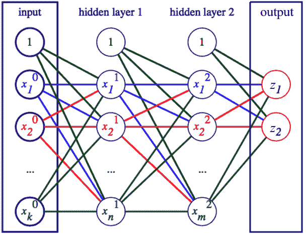
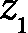
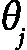

# 第二章：神经网络

在*第一章*中，我们介绍了许多基本的**机器学习**（**ML**）概念和技术。我们讲解了主要的机器学习范式以及一些经典的流行机器学习算法，最后介绍了**神经网络**（**NN**）。在本章中，我们将正式介绍神经网络是什么，讨论它们的数学基础，详细描述其构建模块如何工作，看看我们如何堆叠多个层来创建深度前馈神经网络，并学习如何训练它们。

在本章中，我们将涵盖以下主要内容：

+   神经网络的需求

+   神经网络的数学

+   神经网络简介

+   训练神经网络

神经网络与人类大脑的联系

最初，神经网络（NN）是受生物大脑的启发（因此得名）。然而，随着时间的推移，我们已不再尝试模仿大脑的工作方式，而是集中精力寻找适用于特定任务的正确配置，包括计算机视觉、自然语言处理和语音识别。你可以这样理解——长时间以来，我们受到了鸟类飞行的启发，但最终我们创造了飞机，这与鸟类飞行是截然不同的。我们仍然远未能与大脑的潜力相匹配。也许未来的机器学习算法会更像大脑，但现在情况并非如此。因此，在本书的其余部分，我们将不再试图在大脑和神经网络之间做类比。为了沿着这个思路进行，我们将把最小的神经网络构建模块称为**单元**，而不是最初的“神经元”。

# 技术要求

我们将在本章中使用 Python 实现示例。如果你尚未设置好相关工具的环境，不用担心——该示例可以在 Google Colab 上作为 Jupyter notebook 使用。你可以在本书的 GitHub 仓库中找到代码示例：[`github.com/PacktPublishing/Python-Deep-Learning-Third-Edition/tree/main/Chapter02`](https://github.com/PacktPublishing/Python-Deep-Learning-Third-Edition/tree/main/Chapter02)。

# 神经网络的需求

神经网络已经存在了许多年，并经历了多个阶段，期间它们的受欢迎程度时高时低。然而，最近，它们在许多其他竞争的机器学习算法中稳步占据了主导地位。这一复兴归因于计算机速度的提升，**图形处理单元**（**GPU**）的使用取代了最传统的**中央处理单元**（**CPU**）使用，算法和神经网络设计的改进，以及日益增大的数据集，这些我们将在本书中探讨。为了让你了解它们的成功，让我们来看看 ImageNet 大规模视觉识别挑战赛（[`image-net.org/challenges/LSVRC/`](http://image-net.org/challenges/LSVRC/)，或者简称**ImageNet**）。参与者通过使用 ImageNet 数据库来训练他们的算法。该数据库包含了超过 100 万张高分辨率彩色图像，涵盖了 1,000 多个类别（一个类别可能是汽车的图像，另一个类别是人的图像、树木的图像等等）。该挑战赛中的一个任务是将未知的图像分类到这些类别中。2011 年，获胜者实现了 74.2%的前五名准确率。2012 年，Alex Krizhevsky 及其团队带着卷积网络（深度网络的一种特殊类型）参加了比赛。那年，他们以 84.7%的前五名准确率赢得了比赛。从那时起，获胜的算法总是神经网络，而当前的前五名准确率大约为 99%。然而，深度学习算法在其他领域也表现出色——例如，谷歌的 Google Now 和苹果的 Siri 助手依赖深度网络进行语音识别，谷歌也利用深度学习进行翻译引擎的开发。最近的图像和文本生成系统，如 Stability AI 的 Stable Diffusion 和 OpenAI 的 DALL-E 与 ChatGPT，都是使用神经网络实现的。

我们将在接下来的章节中讨论这些激动人心的进展，但现在，我们将专注于神经网络的数学基础。为了帮助我们完成这项任务，我们将使用具有一两层的简单网络。你可以将这些视为玩具示例，它们不是深度网络，但理解它们的工作原理非常重要。原因如下：

+   了解神经网络的理论将帮助你理解本书的其余部分，因为如今大多数使用中的神经网络都共享一些共同的原理。理解简单的网络意味着你也能理解深度网络。

+   拥有一些基础知识总是有益的。当你面对一些新的材料时（即使是本书未涉及的材料），它会对你大有帮助。

我希望这些论点能说服你本章的重要性。作为一个小小的安慰，我们将在*第三章*中深入讨论深度学习（这个双关语用得很恰当）。

# 神经网络的数学

在接下来的几个部分中，我们将讨论神经网络的数学原理。通过这种方式，我们将能够以一种基础且结构化的方式，通过这些原理来解释神经网络。

## 线性代数

线性代数处理的对象包括向量、矩阵、线性变换和线性方程，如 ![<mml:math xmlns:mml="http://www.w3.org/1998/Math/MathML" xmlns:m="http://schemas.openxmlformats.org/officeDocument/2006/math"><mml:msub><mml:mrow><mml:mi>a</mml:mi></mml:mrow><mml:mrow><mml:mn>1</mml:mn></mml:mrow></mml:msub><mml:msub><mml:mrow><mml:mi>x</mml:mi></mml:mrow><mml:mrow><mml:mn>1</mml:mn></mml:mrow></mml:msub><mml:mo>+</mml:mo><mml:msub><mml:mrow><mml:mi>a</mml:mi></mml:mrow><mml:mrow><mml:mn>2</mml:mn></mml:mrow></mml:msub><mml:msub><mml:mrow><mml:mi>x</mml:mi></mml:mrow><mml:mrow><mml:mn>2</mml:mn></mml:mrow></mml:msub><mml:mo>+</mml:mo><mml:mo>…</mml:mo><mml:mo>+</mml:mo><mml:msub><mml:mrow><mml:mi>a</mml:mi></mml:mrow><mml:mrow><mml:mi>n</mml:mrow></mml:msub><mml:msub><mml:mrow><mml:mi>x</mml:mi></mml:mrow><mml:mrow><mml:mi>n</mml:mrow></mml:msub><mml:mo>+</mml:mo><mml:mi>b</mml:mi><mml:mo>=</mml:mo><mml:mn>0</mml:mn></mml:math>](img/32.png)。

线性代数识别以下数学对象：

+   **标量**：一个单独的数字。

+   **向量**：一个一维的数字数组（也称为分量或**标量**），每个元素都有一个索引。我们可以用上标箭头 () 或加粗字体 (`x`) 来表示向量，但在本书中我们将主要使用加粗符号。以下是一个向量的示例：

![<mml:math xmlns:mml="http://www.w3.org/1998/Math/MathML" xmlns:m="http://schemas.openxmlformats.org/officeDocument/2006/math" display="block"><mml:mi mathvariant="bold">x</mml:mi><mml:mo>=</mml:mo><mml:mover accent="true"><mml:mrow><mml:mi>x</mml:mi></mml:mrow><mml:mo>→</mml:mo></mml:mover><mml:mo>=</mml:mo><mml:mfenced open="[" close="]" separators="|"><mml:mrow><mml:msub><mml:mrow><mml:mi>x</mml:mi></mml:mrow><mml:mrow><mml:mn>1</mml:mn></mml:mrow></mml:msub><mml:mo>,</mml:mo><mml:msub><mml:mrow><mml:mi>x</mml:mi></mml:mrow><mml:mrow><mml:mn>2</mml:mn></mml:mrow></mml:msub><mml:mo>…</mml:mo><mml:msub><mml:mrow><mml:mi>x</mml:mi></mml:mrow><mml:mrow><mml:mi>n</mml:mi></mml:mrow></mml:msub></mml:mrow></mml:mfenced></mml:math>](img/34.png)

我们可以将一个 `n` 维向量表示为一个点在 `n` 维欧几里得空间中的坐标，。可以将欧几里得空间视为一个坐标系——向量从该坐标系的中心开始，每个向量的元素表示沿其相应坐标轴的点的坐标。下图显示了三维坐标系中的一个向量，：


图 2.1 – 三维空间中的向量表示

该图还帮助我们定义了向量的两个额外属性：

+   **大小**（或**长度**）：


可以将大小视为勾股定理在 n 维空间中的推广。

+   **方向**：向量与向量空间中各轴之间的角度。

+   **矩阵**：一个二维标量数组，每个元素通过行和列来标识。我们用粗体大写字母表示矩阵—例如，`A`。相反，我们用小写字母表示矩阵元素，并将行和列作为下标—例如，。我们可以在下面的公式中看到矩阵符号的例子：

![<mml:math xmlns:mml="http://www.w3.org/1998/Math/MathML" xmlns:m="http://schemas.openxmlformats.org/officeDocument/2006/math" display="block"><mml:mi mathvariant="bold">A</mml:mi><mml:mo>=</mml:mo><mml:mfenced open="[" close="]" separators="|"><mml:mrow><mml:mtable><mml:mtr><mml:mtd><mml:mtable><mml:mtr><mml:mtd><mml:msub><mml:mrow><mml:mi>a</mml:mi></mml:mrow><mml:mrow><mml:mn>11</mml:mn></mml:mrow></mml:msub></mml:mtd><mml:mtd><mml:msub><mml:mrow><mml:mi>a</mml:mi></mml:mrow><mml:mrow><mml:mn>12</mml:mn></mml:mrow></mml:msub></mml:mtd></mml:mtr><mml:mtr><mml:mtd><mml:msub><mml:mrow><mml:mi>a</mml:mi></mml:mrow><mml:mrow><mml:mn>21</mml:mn></mml:mrow></mml:msub></mml:mtd><mml:mtd><mml:msub><mml:mrow><mml:mi>a</mml:mi></mml:mrow><mml:mrow><mml:mn>22</mml:mn></mml:mrow></mml:msub></mml:mtd></mml:mtr></mml:mtable></mml:mtd><mml:mtd><mml:mo>⋯</mml:mo></mml:mtd><mml:mtd><mml:mtable><mml:mtr><mml:mtd><mml:msub><mml:mrow><mml:mi>a</mml:mi></mml:mrow><mml:mrow><mml:mn>1</mml:mn><mml:mi>n</mml:mi></mml:mrow></mml:msub></mml:mtd></mml:mtr><mml:mtr><mml:mtd><mml:msub><mml:mrow><mml:mi>a</mml:mi></mml:mrow><mml:mrow><mml:mn>2</mml:mn><mml:mi>n</mml:mi></mml:mrow></mml:msub></mml:mtd></mml:mtr></mml:mtable></mml:mtd></mml:mtr><mml:mtr><mml:mtd><mml:mo>⋮</mml:mo></mml:mtd><mml:mtd><mml:mo>⋱</mml:mo></mml:mtd><mml:mtd><mml:mo>⋮</mml:mo></mml:mtd></mml:mtr><mml:mtr><mml:mtd><mml:mtable><mml:mtr><mml:mtd><mml:msub><mml:mrow><mml:mi>a</mml:mi></mml:mrow><mml:mrow><mml:mi mathvariant="bold-italic">m</mml:mi><mml:mn>1</mml:mn></mml:mrow></mml:msub></mml:mtd><mml:mtd><mml:msub><mml:mrow><mml:mi>a</mml:mi></mml:mrow><mml:mrow><mml:mi>m</mml:mi><mml:mn>2</mml:mn></mml:mrow></mml:msub></mml:mtd></mml:mtr></mml:mtable></mml:mtd><mml:mtd><mml:mo>⋯</mml:mo></mml:mtd><mml:mtd><mml:msub><mml:mrow><mml:mi>a</mml:mi></mml:mrow><mml:mrow><mml:mi mathvariant="bold-italic">m</mml:mi><mml:mi mathvariant="bold-italic">n</mml:mi></mml:mrow></mml:msub></mml:mtd></mml:mtr></mml:mtable></mml:mrow></mml:mfenced></mml:math>](img/39.png)

我们可以将向量表示为单行的 *1×n* 矩阵（**行矩阵**）或单列的 *n×1* 矩阵（**列矩阵**）。通过这种转换，向量可以参与不同的矩阵运算。

+   **张量**：*张量* 这一术语来源于数学和物理学，在我们开始在机器学习中使用它之前，它就已经存在。这些领域中的定义与机器学习中的定义不同。幸运的是，在机器学习的背景下，张量仅仅是一个具有以下属性的多维数组：

    +   **秩**：数组的维度数量。向量和矩阵是张量的特殊情况。秩为 0 的张量是标量，秩为 1 的张量是向量，秩为 2 的张量是矩阵。维度数量没有限制，某些类型的神经网络可以使用秩为 4 或更高的张量。

    +   **形状**：张量每个维度的大小。

    +   张量值的 **数据类型**。在实际应用中，数据类型包括 16 位、32 位和 64 位浮动数，以及 8 位、16 位、32 位和 64 位整数。

张量是像 PyTorch、Keras 和 TensorFlow 等库的主要数据结构。

张量的性质

你可以在这里找到关于张量性质的详细讨论：[`stats.stackexchange.com/questions/198061/why-the-sudden-fascination-with-tensors`](https://stats.stackexchange.com/questions/198061/why-the-sudden-fascination-with-tensors)。你还可以将此与 PyTorch ([`pytorch.org/docs/stable/tensors.html`](https://pytorch.org/docs/stable/tensors.html)) 和 TensorFlow ([`www.tensorflow.org/guide/tensor`](https://www.tensorflow.org/guide/tensor)) 的张量定义进行对比。

既然我们已经介绍了向量、矩阵和张量，让我们继续讨论它们能参与的某些线性运算。

### 向量和矩阵运算

我们将重点讨论与神经网络（NNs）相关的运算，从向量开始：

+   **向量加法**：将两个或更多 `n` 维向量 `a` 和 `b`（等等）加在一起，得到一个新的向量：

![<mml:math xmlns:mml="http://www.w3.org/1998/Math/MathML" xmlns:m="http://schemas.openxmlformats.org/officeDocument/2006/math" display="block"><mml:mi mathvariant="bold">a</mml:mi><mml:mo>+</mml:mo><mml:mi mathvariant="bold">b</mml:mi><mml:mo>=</mml:mo><mml:mfenced open="[" close="]" separators="|"><mml:mrow><mml:msub><mml:mrow><mml:mi>a</mml:mi></mml:mrow><mml:mrow><mml:mn>1</mml:mn></mml:mrow></mml:msub><mml:mo>+</mml:mo><mml:msub><mml:mrow><mml:mi>b</mml:mi></mml:mrow><mml:mrow><mml:mn>1</mml:mn></mml:mrow></mml:msub><mml:mo>,</mml:mo><mml:msub><mml:mrow><mml:mi>a</mml:mi></mml:mrow><mml:mrow><mml:mn>2</mml:mn></mml:mrow></mml:msub><mml:mo>+</mml:mo><mml:msub><mml:mrow><mml:mi>b</mml:mi></mml:mrow><mml:mrow><mml:mn>2</mml:mn></mml:mrow></mml:msub><mml:mo>…</mml:mo><mml:msub><mml:mrow><mml:mi>a</mml:mi></mml:mrow><mml:mrow><mml:mi>n</mml:mi></mml:mrow></mml:msub><mml:mo>+</mml:mo><mml:msub><mml:mrow><mml:mi>b</mml:mi></mml:mrow><mml:mrow><mml:mi>n</mml:mi></mml:mrow></mml:msub></mml:mrow></mml:mfenced></mml:math>](img/40.png)

+   **点积（或标量积）**：将两个 `n` 维向量 `a` 和 `b` 合并为一个 **标量值**：

![<mml:math xmlns:mml="http://www.w3.org/1998/Math/MathML" xmlns:m="http://schemas.openxmlformats.org/officeDocument/2006/math" display="block"><mml:mi mathvariant="bold">a</mml:mi><mml:mo>⋅</mml:mo><mml:mi mathvariant="bold">b</mml:mi><mml:mo>=</mml:mo><mml:mfenced open="|" close="|" separators="|"><mml:mrow><mml:mi mathvariant="bold">a</mml:mi></mml:mrow></mml:mfenced><mml:mfenced open="|" close="|" separators="|"><mml:mrow><mml:mi mathvariant="bold">b</mml:mi></mml:mrow></mml:mfenced><mml:mi>c</mml:mi><mml:mi>o</mml:mi><mml:mi>s</mml:mi><mml:mi>θ</mml:mi></mml:math>](img/41.png)

这里，两个向量之间的夹角是*θ*，而 和  是它们的大小。例如，如果这些向量是*二维*的，且它们的分量为 ![<mml:math xmlns:mml="http://www.w3.org/1998/Math/MathML" xmlns:m="http://schemas.openxmlformats.org/officeDocument/2006/math"><mml:msub><mml:mrow><mml:mi>a</mml:mi></mml:mrow><mml:mrow><mml:mn>1</mml:mn></mml:mrow></mml:msub><mml:mo>,</mml:mo><mml:msub><mml:mrow><mml:mi>b</mml:mi></mml:mrow><mml:mrow><mml:mn>1</mml:mn></mml:mrow></mml:msub><mml:mo>,</mml:mo><mml:msub><mml:mrow><mml:mi>a</mml:mi></mml:mrow><mml:mrow><mml:mn>2</mml:mn></mml:mrow></mml:msub><mml:mo>,</mml:mo><mml:msub><mml:mrow><mml:mi>b</mml:mi></mml:mrow><mml:mrow><mml:mn>2</mml:mn></mml:mrow></mml:msub><mml:mo>…</mml:mo><mml:msub><mml:mrow><mml:mi>a</mml:mi></mml:mrow><mml:mrow><mml:mi>n</mml:mi></mml:mrow></mml:msub><mml:mo>,</mml:mo><mml:msub><mml:mrow><mml:mi>b</mml:mi></mml:mrow><mml:mrow><mml:mi>n</mml:mi></mml:mrow></mml:msub></mml:math>](img/44.png)，则上面的公式变为如下：

![<mml:math xmlns:mml="http://www.w3.org/1998/Math/MathML" xmlns:m="http://schemas.openxmlformats.org/officeDocument/2006/math" display="block"><mml:mi mathvariant="bold">a</mml:mi><mml:mo>⋅</mml:mo><mml:mi mathvariant="bold">b</mml:mi><mml:mo>=</mml:mo><mml:msub><mml:mrow><mml:mi>a</mml:mi></mml:mrow><mml:mrow><mml:mn>1</mml:mn></mml:mrow></mml:msub><mml:msub><mml:mrow><mml:mi>b</mml:mi></mml:mrow><mml:mrow><mml:mn>1</mml:mn></mml:mrow></mml:msub><mml:mo>+</mml:mo><mml:msub><mml:mrow><mml:mi>a</mml:mi></mml:mrow><mml:mrow><mml:mn>2</mml:mn></mml:mrow></mml:msub><mml:msub><mml:mrow><mml:mi>b</mml:mi></mml:mrow><mml:mrow><mml:mn>2</mml:mn></mml:mrow></mml:msub><mml:mo>+</mml:mo><mml:mo>…</mml:mo><mml:mo>+</mml:mo><mml:msub><mml:mrow><mml:mi>a</mml:mi></mml:mrow><mml:mrow><mml:mi>n</mml:mi></mml:mrow></mml:msub><mml:msub><mml:mrow><mml:mi>b</mml:mi></mml:mrow><mml:mrow><mml:mi>n</mml:mi></mml:mrow></mml:msub></mml:math>](img/45.png)

以下图示说明了`a`和`b`的点积：


图 2.2 – 向量的点积 – 上方：向量分量，和下方：两个向量的点积

我们可以将点积视为两个向量之间的相似度度量，其中角度*θ*表示它们的相似程度。如果*θ*很小（即向量方向相似），那么它们的点积将更高，因为会趋近于 1。在这种情况下，我们可以定义两个向量之间的**余弦相似度**如下：


+   **叉积（或向量积）**：两个向量`a`和`b`的组合，得到一个新的向量，该向量垂直于两个初始向量。输出向量的大小等于以下公式：

![<mml:math xmlns:mml="http://www.w3.org/1998/Math/MathML" xmlns:m="http://schemas.openxmlformats.org/officeDocument/2006/math" display="block"><mml:mi mathvariant="bold">a</mml:mi><mml:mo>×</mml:mo><mml:mi mathvariant="bold">b</mml:mi><mml:mo>=</mml:mo><mml:mfenced open="|" close="|" separators="|"><mml:mrow><mml:mi mathvariant="bold">a</mml:mi></mml:mrow></mml:mfenced><mml:mfenced open="|" close="|" separators="|"><mml:mrow><mml:mi mathvariant="bold">b</mml:mi></mml:mrow></mml:mfenced><mml:mi>s</mml:mi><mml:mi>i</mml:mi><mml:mi>n</mml:mi><mml:mi>θ</mml:mi></mml:math>](img/48.png)

我们可以在下图中看到二维向量叉积的例子：


图 2.3 – 两个二维向量的叉积

输出向量垂直（或**法向**）于包含输入向量的平面。输出向量的大小等于由`a`和`b`向量（在前面的图中以浅蓝色表示）构成的平行四边形的面积。

现在，让我们关注矩阵运算：

+   **矩阵转置**：沿着矩阵的主对角线翻转矩阵，表示为矩阵中所有元素的集合，，其中 *i=j*。我们用  来表示转置操作。`A` 的单元格  等于  的单元格，且该单元格属于 。

![<mml:math xmlns:mml="http://www.w3.org/1998/Math/MathML" xmlns:m="http://schemas.openxmlformats.org/officeDocument/2006/math" display="block"><mml:msub><mml:mrow><mml:mfenced open="[" close="]" separators="|"><mml:mrow><mml:msup><mml:mrow><mml:mi mathvariant="bold">A</mml:mi></mml:mrow><mml:mrow><mml:mi mathvariant="normal">⊤</mml:mi></mml:mrow></mml:msup></mml:mrow></mml:mfenced></mml:mrow><mml:mrow><mml:mi>i</mml:mi><mml:mi>j</mml:mi></mml:mrow></mml:msub><mml:mo>=</mml:mo><mml:msub><mml:mrow><mml:mi mathvariant="bold">A</mml:mi></mml:mrow><mml:mrow><mml:mi>j</mml:mi><mml:mi>i</mml:mi></mml:mrow></mml:msub></mml:math>](img/54.png)

*m×n* 矩阵的转置是一个 *n×m* 矩阵，以下例子可以帮助理解：

![<mml:math xmlns:mml="http://www.w3.org/1998/Math/MathML" xmlns:m="http://schemas.openxmlformats.org/officeDocument/2006/math" display="block"><mml:mi mathvariant="bold">A</mml:mi><mml:mo>=</mml:mo><mml:mfenced open="[" close="]" separators="|"><mml:mrow><mml:mtable><mml:mtr><mml:mtd><mml:msub><mml:mrow><mml:mi>a</mml:mi></mml:mrow><mml:mrow><mml:mn>11</mml:mn></mml:mrow></mml:msub></mml:mtd><mml:mtd><mml:msub><mml:mrow><mml:mi>a</mml:mi></mml:mrow><mml:mrow><mml:mn>12</mml:mn></mml:mrow></mml:msub></mml:mtd><mml:mtd><mml:msub><mml:mrow><mml:mi>a</mml:mi></mml:mrow><mml:mrow><mml:mn>13</mml:mn></mml:mrow></mml:msub></mml:mtd></mml:mtr><mml:mtr><mml:mtd><mml:msub><mml:mrow><mml:mi>a</mml:mi></mml:mrow><mml:mrow><mml:mn>21</mml:mn></mml:mrow></mml:msub></mml:mtd><mml:mtd><mml:msub><mml:mrow><mml:mi>a</mml:mi></mml:mrow><mml:mrow><mml:mn>22</mml:mn></mml:mrow></mml:msub></mml:mtd><mml:mtd><mml:msub><mml:mrow><mml:mi>a</mml:mi></mml:mrow><mml:mrow><mml:mn>23</mml:mn></mml:mrow></mml:msub></mml:mtd></mml:mtr><mml:mtr><mml:mtd><mml:msub><mml:mrow><mml:mi>a</mml:mi></mml:mrow><mml:mrow><mml:mn>31</mml:mn></mml:mrow></mml:msub></mml:mtd><mml:mtd><mml:msub><mml:mrow><mml:mi>a</mml:mi></mml:mrow><mml:mrow><mml:mn>32</mml:mn></mml:mrow></mml:msub></mml:mtd><mml:mtd><mml:msub><mml:mrow><mml:mi>a</mml:mi></mml:mrow><mml:mrow><mml:mn>33</mml:mn></mml:mrow></mml:msub></mml:mtd></mml:mtr></mml:mtable></mml:mrow></mml:mfenced><mml:mo>⇒</mml:mo><mml:msup><mml:mrow><mml:mi mathvariant="bold">A</mml:mi></mml:mrow><mml:mrow><mml:mi mathvariant="normal">⊤</mml:mi></mml:mrow></mml:msup><mml:mo>=</mml:mo><mml:mfenced open="[" close="]" separators="|"><mml:mrow><mml:mtable><mml:mtr><mml:mtd><mml:msub><mml:mrow><mml:mi>a</mml:mi></mml:mrow><mml:mrow><mml:mn>11</mml:mn></mml:mrow></mml:msub></mml:mtd><mml:mtd><mml:msub><mml:mrow><mml:mi>a</mml:mi></mml:mrow><mml:mrow><mml:mn>21</mml:mn></mml:mrow></mml:msub></mml:mtd><mml:mtd><mml:msub><mml:mrow><mml:mi>a</mml:mi></mml:mrow><mml:mrow><mml:mn>31</mml:mn></mml:mrow></mml:msub></mml:mtd></mml:mtr><mml:mtr><mml:mtd><mml:msub><mml:mrow><mml:mi>a</mml:mi></mml:mrow><mml:mrow><mml:mn>12</mml:mn></mml:mrow></mml:msub></mml:mtd><mml:mtd><mml:msub><mml:mrow><mml:mi>a</mml:mi></mml:mrow><mml:mrow><mml:mn>22</mml:mn></mml:mrow></mml:msub></mml:mtd><mml:mtd><mml:msub><mml:mrow><mml:mi>a</mml:mi></mml:mrow><mml:mrow><mml:mn>32</mml:mn></mml:mrow></mml:msub></mml:mtd></mml:mtr><mml:mtr><mml:mtd><mml:msub><mml:mrow><mml:mi>a</mml:mi></mml:mrow><mml:mrow><mml:mn>13</mml:mn></mml:mrow></mml:msub></mml:mtd><mml:mtd><mml:msub><mml:mrow><mml:mi>a</mml:mi></mml:mrow><mml:mrow><mml:mn>23</mml:mn></mml:mrow></mml:msub></mml:mtd><mml:mtd><mml:msub><mml:mrow><mml:mi>a</mml:mi></mml:mrow><mml:mrow><mml:mn>33</mml:mn></mml:mrow></mml:msub></mml:mtd></mml:mtr></mml:mtable></mml:mrow></mml:mfenced></mml:math>](img/55.png)

![<math xmlns="http://www.w3.org/1998/Math/MathML" display="block"><mrow><mrow><mi mathvariant="bold">A</mi><mo>=</mo><mfenced open="[" close="]"><mtable columnspacing="0.8000em 0.8000em" columnwidth="auto auto auto" columnalign="center center center" rowspacing="1.0000ex" rowalign="baseline baseline"><mtr><mtd><msub><mi>a</mi><mn>11</mn></msub></mtd><mtd><msub><mi>a</mi><mn>12</mn></msub></mtd><mtd><msub><mi>a</mi><mn>13</mn></msub></mtd></tr><mtr><mtd><msub><mi>a</mi><mn>21</mn></msub></mtd><mtd><msub><mi>a</mi><mn>22</mn></msub></mtd><mtd><msub><mi>a</mi><mn>23</mn></msub></td></mtr></mtable></mfenced><mo>⇒</mo><msup><mi mathvariant="bold">A</mi><mi mathvariant="normal">⊤</mi></msup><mo>=</mo><mfenced open="[" close="]"><mtable columnspacing="0.8000em" columnwidth="auto" columnalign="center" rowspacing="1.0000ex 1.0000ex" rowalign="baseline baseline baseline"><mtr><mtd><msub><mi>a</mi><mn>11</mn></msub></mtd><mtd><msub><mi>a</mi><mn>21</mn></msub></mtd></tr><mtr><mtd><msub><mi>a</mi><mn>12</mn></msub></mtd><mtd><msub><mi>a</mi><mn>22</mn></msub></td></mtr><mtr><mtd><msub><mi>a</mi><mn>13</mn></msub></mtd><mtd><msub><mi>a</mi><mn>23</mn></msub></td></mtr></mtable></mfenced></mrow></mrow></math>](img/56.png)

![<math xmlns="http://www.w3.org/1998/Math/MathML" display="block"><mrow><mrow><mi mathvariant="bold">A</mi><mo>=</mo><mfenced open="[" close="]"><mtable columnspacing="0.8000em 0.8000em" columnwidth="auto auto auto" columnalign="center center center" rowspacing="1.0000ex" rowalign="baseline"><mtr><mtd><msub><mi>a</mi><mn>11</mn></msub></mtd><mtd><msub><mi>a</mi><mn>12</mn></msub></mtd><mtd><msub><mi>a</mi><mn>13</mn></msub></mtd></mtr></mtable></mfenced><mo>⇒</mo><msup><mi mathvariant="bold">A</mi><mi mathvariant="normal">⊤</mi></msup><mo>=</mo><mfenced open="[" close="]"><mtable columnwidth="auto" columnalign="center" rowspacing="1.0000ex 1.0000ex" rowalign="baseline baseline baseline"><mtr><mtd><msub><mi>a</mi><mn>11</mn></msub></mtd></tr><mtr><mtd><msub><mi>a</mi><mn>12</mn></msub></mtd></mtr><mtr><mtd><msub><mi>a</mi><mn>13</mn></msub></mtd></tr></mtable></mfenced></mrow></mrow></math>](img/57.png)

+   **矩阵-标量乘法**：将矩阵`A`与标量`y`相乘，生成一个与原矩阵相同大小的新矩阵：

![<mml:math xmlns:mml="http://www.w3.org/1998/Math/MathML" xmlns:m="http://schemas.openxmlformats.org/officeDocument/2006/math" display="block"><mml:mi mathvariant="bold">A</mml:mi><mml:mi>y</mml:mi><mml:mo>=</mml:mo><mml:mfenced open="[" close="]" separators="|"><mml:mrow><mml:mtable><mml:mtr><mml:mtd><mml:msub><mml:mrow><mml:mi>a</mml:mi></mml:mrow><mml:mrow><mml:mn>11</mml:mn></mml:mrow></mml:msub></mml:mtd><mml:mtd><mml:msub><mml:mrow><mml:mi>a</mml:mi></mml:mrow><mml:mrow><mml:mn>12</mml:mn></mml:mrow></mml:msub></mml:mtd></mml:mtr><mml:mtr><mml:mtd><mml:msub><mml:mrow><mml:mi>a</mml:mi></mml:mrow><mml:mrow><mml:mn>21</mml:mn></mml:mrow></mml:msub></mml:mtd><mml:mtd><mml:msub><mml:mrow><mml:mi>a</mml:mi></mml:mrow><mml:mrow><mml:mn>22</mml:mn></mml:mrow></mml:msub></mml:mtd></mml:mtr></mml:mtable></mml:mrow></mml:mfenced><mml:mi>y</mml:mi><mml:mo>=</mml:mo><mml:mfenced open="[" close="]" separators="|"><mml:mrow><mml:mtable><mml:mtr><mml:mtd><mml:msub><mml:mrow><mml:mi>a</mml:mi></mml:mrow><mml:mrow><mml:mn>11</mml:mn></mml:mrow></mml:msub><mml:mo>×</mml:mo><mml:mi>y</mml:mi></mml:mtd><mml:mtd><mml:msub><mml:mrow><mml:mi>a</mml:mi></mml:mrow><mml:mrow><mml:mn>12</mml:mn></mml:mrow></mml:msub><mml:mo>×</mml:mo><mml:mi>y</mml:mi></mml:mtd></mml:mtr><mml:mtr><mml:mtd><mml:msub><mml:mrow><mml:mi>a</mml:mi></mml:mrow><mml:mrow><mml:mn>21</mml:mn></mml:mrow></mml:msub><mml:mo>×</mml:mo><mml:mi>y</mml:mi></mml:mtd><mml:mtd><mml:msub><mml:mrow><mml:mi>a</mml:mi></mml:mrow><mml:mrow><mml:mn>22</mml:mn></mml:mrow></mml:msub><mml:mo>×</mml:mo><mml:mi>y</mml:mi></mml:mtd></mml:mtr></mml:mtable></mml:mrow></mml:mfenced></mml:math>](img/58.png)

+   **矩阵加法**：两个或多个矩阵（`A` 和 `B` 等）逐元素相加，得到一个新的矩阵。所有输入矩阵必须具有相同的大小：

![<mml:math xmlns:mml="http://www.w3.org/1998/Math/MathML" xmlns:m="http://schemas.openxmlformats.org/officeDocument/2006/math" display="block"><mml:mi mathvariant="bold">A</mml:mi><mml:mo>+</mml:mo><mml:mi mathvariant="bold">B</mml:mi><mml:mo>=</mml:mo><mml:mfenced open="[" close="]" separators="|"><mml:mrow><mml:mtable><mml:mtr><mml:mtd><mml:msub><mml:mrow><mml:mi>a</mml:mi></mml:mrow><mml:mrow><mml:mn>11</mml:mn></mml:mrow></mml:msub></mml:mtd><mml:mtd><mml:msub><mml:mrow><mml:mi>a</mml:mi></mml:mrow><mml:mrow><mml:mn>12</mml:mn></mml:mrow></mml:msub></mml:mtd></mml:mtr><mml:mtr><mml:mtd><mml:msub><mml:mrow><mml:mi>a</mml:mi></mml:mrow><mml:mrow><mml:mn>21</mml:mn></mml:mrow></mml:msub></mml:mtd><mml:mtd><mml:msub><mml:mrow><mml:mi>a</mml:mi></mml:mrow><mml:mrow><mml:mn>22</mml:mn></mml:mrow></mml:msub></mml:mtd></mml:mtr></mml:mtable></mml:mrow></mml:mfenced><mml:mo>+</mml:mo><mml:mfenced open="[" close="]" separators="|"><mml:mrow><mml:mtable><mml:mtr><mml:mtd><mml:msub><mml:mrow><mml:mi>b</mml:mi></mml:mrow><mml:mrow><mml:mn>11</mml:mn></mml:mrow></mml:msub></mml:mtd><mml:mtd><mml:msub><mml:mrow><mml:mi>b</mml:mi></mml:mrow><mml:mrow><mml:mn>12</mml:mn></mml:mrow></mml:msub></mml:mtd></mml:mtr><mml:mtr><mml:mtd><mml:msub><mml:mrow><mml:mi>b</mml:mi></mml:mrow><mml:mrow><mml:mn>21</mml:mn></mml:mrow></mml:msub></mml:mtd><mml:mtd><mml:msub><mml:mrow><mml:mi>b</mml:mi></mml:mrow><mml:mrow><mml:mn>22</mml:mn></mml:mrow></mml:msub></mml:mtd></mml:mtr></mml:mtable></mml:mrow></mml:mfenced><mml:mo>=</mml:mo><mml:mfenced open="[" close="]" separators="|"><mml:mrow><mml:mtable><mml:mtr><mml:mtd><mml:msub><mml:mrow><mml:mi>a</mml:mi></mml:mrow><mml:mrow><mml:mn>11</mml:mn></mml:mrow></mml:msub><mml:mo>+</mml:mo><mml:msub><mml:mrow><mml:mi>b</mml:mi></mml:mrow><mml:mrow><mml:mn>11</mml:mn></mml:mrow></mml:msub></mml:mtd><mml:mtd><mml:msub><mml:mrow><mml:mi>a</mml:mi></mml:mrow><mml:mrow><mml:mn>12</mml:mn></mml:mrow></mml:msub><mml:mo>+</mml:mo><mml:msub><mml:mrow><mml:mi>b</mml:mi></mml:mrow><mml:mrow><mml:mn>12</mml:mn></mml:mrow></mml:msub></mml:mtd></mml:mtr><mml:mtr><mml:mtd><mml:msub><mml:mrow><mml:mi>a</mml:mi></mml:mrow><mml:mrow><mml:mn>21</mml:mn></mml:mrow></mml:msub><mml:mo>+</mml:mo><mml:msub><mml:mrow><mml:mi>b</mml:mi></mml:mrow><mml:mrow><mml:mn>21</mml:mn></mml:mrow></mml:msub></mml:mtd><mml:mtd><mml:msub><mml:mrow><mml:msub><mml:mrow><mml:mi>a</mml:mi></mml:mrow><mml:mrow><mml:mn>22</mml:mn></mml:mrow></mml:msub><mml:mo>+</mml:mo><mml:mi>b</mml:mi></mml:mrow><mml:mrow><mml:mn>22</mml:mn></mml:mrow></mml:msub></mml:mtd></mml:mtr></mml:mtable></mml:mrow></mml:mfenced></mml:math>](img/59.png)

+   **矩阵-向量乘法**：将矩阵`A`与向量`x`相乘，得到一个新的向量：

![<mml:math xmlns:mml="http://www.w3.org/1998/Math/MathML" xmlns:m="http://schemas.openxmlformats.org/officeDocument/2006/math" display="block"><mml:mi mathvariant="bold">A</mml:mi><mml:mi mathvariant="bold">x</mml:mi><mml:mo>=</mml:mo><mml:mfenced open="[" close="]" separators="|"><mml:mrow><mml:mtable><mml:mtr><mml:mtd><mml:msub><mml:mrow><mml:mi>a</mml:mi></mml:mrow><mml:mrow><mml:mn>11</mml:mn></mml:mrow></mml:msub></mml:mtd><mml:mtd><mml:msub><mml:mrow><mml:mi>a</mml:mi></mml:mrow><mml:mrow><mml:mn>12</mml:mn></mml:mrow></mml:msub></mml:mtd></mml:mtr><mml:mtr><mml:mtd><mml:msub><mml:mrow><mml:mi>a</mml:mi></mml:mrow><mml:mrow><mml:mn>21</mml:mn></mml:mrow></mml:msub></mml:mtd><mml:mtd><mml:msub><mml:mrow><mml:mi>a</mml:mi></mml:mrow><mml:mrow><mml:mn>22</mml:mn></mml:mrow></mml:msub></mml:mtd></mml:mtr><mml:mtr><mml:mtd><mml:msub><mml:mrow><mml:mi>a</mml:mi></mml:mrow><mml:mrow><mml:mn>31</mml:mn></mml:mrow></mml:msub></mml:mtd><mml:mtd><mml:msub><mml:mrow><mml:mi>a</mml:mi></mml:mrow><mml:mrow><mml:mn>32</mml:mn></mml:mrow></mml:msub></mml:mtd></mml:mtr></mml:mtable></mml:mrow></mml:mfenced><mml:mfenced open="[" close="]" separators="|"><mml:mrow><mml:mtable><mml:mtr><mml:mtd><mml:msub><mml:mrow><mml:mi>x</mml:mi></mml:mrow><mml:mrow><mml:mn>1</mml:mn></mml:mrow></mml:msub></mml:mtd></mml:mtr><mml:mtr><mml:mtd><mml:msub><mml:mrow><mml:mi>x</mml:mi></mml:mrow><mml:mrow><mml:mn>2</mml:mn></mml:mrow></mml:msub></mml:mtd></mml:mtr></mml:mtable></mml:mrow></mml:mfenced><mml:mo>=</mml:mo><mml:mfenced open="[" close="]" separators="|"><mml:mrow><mml:mtable><mml:mtr><mml:mtd><mml:msub><mml:mrow><mml:mi>a</mml:mi></mml:mrow><mml:mrow><mml:mn>11</mml:mn></mml:mrow></mml:msub><mml:msub><mml:mrow><mml:mi>x</mml:mi></mml:mrow><mml:mrow><mml:mn>1</mml:mn></mml:mrow></mml:msub><mml:mo>+</mml:mo><mml:msub><mml:mrow><mml:mi>a</mml:mi></mml:mrow><mml:mrow><mml:mn>12</mml:mn></mml:mrow></mml:msub><mml:msub><mml:mrow><mml:mi>x</mml:mi></mml:mrow><mml:mrow><mml:mn>2</mml:mn></mml:mrow></mml:msub></mml:mtd></mml:mtr><mml:mtr><mml:mtd><mml:msub><mml:mrow><mml:mi>a</mml:mi></mml:mrow><mml:mrow><mml:mn>21</mml:mn></mml:mrow></mml:msub><mml:msub><mml:mrow><mml:mi>x</mml:mi></mml:mrow><mml:mrow><mml:mn>1</mml:mn></mml:mrow></mml:msub><mml:mo>+</mml:mo><mml:msub><mml:mrow><mml:mi>a</mml:mi></mml:mrow><mml:mrow><mml:mn>22</mml:mn></mml:mrow></mml:msub><mml:msub><mml:mrow><mml:mi>x</mml:mi></mml:mrow><mml:mrow><mml:mn>2</mml:mn></mml:mrow></mml:msub></mml:mtd></mml:mtr><mml:mtr><mml:mtd><mml:msub><mml:mrow><mml:mi>a</mml:mi></mml:mrow><mml:mrow><mml:mn>31</mml:mn></mml:mrow></mml:msub><mml:msub><mml:mrow><mml:mi>x</mml:mi></mml:mrow><mml:mrow><mml:mn>1</mml:mn></mml:mrow></mml:msub><mml:mo>+</mml:mo><mml:msub><mml:mrow><mml:mi>a</mml:mi></mml:mrow><mml:mrow><mml:mn>32</mml:mn></mml:mrow></mml:msub><mml:msub><mml:mrow><mml:mi>x</mml:mi></mml:mrow><mml:mrow><mml:mn>2</mml:mn></mml:mrow></mml:msub></mml:mtd></mml:mtr></mml:mtable></mml:mrow></mml:mfenced></mml:math>](img/60.png)

![<mml:math xmlns:mml="http://www.w3.org/1998/Math/MathML" xmlns:m="http://schemas.openxmlformats.org/officeDocument/2006/math" display="block"><mml:mfenced open="[" close="]" separators="|"><mml:mrow><mml:mtable><mml:mtr><mml:mtd><mml:msub><mml:mrow><mml:mi>a</mml:mi></mml:mrow><mml:mrow><mml:mn>11</mml:mn></mml:mrow></mml:msub></mml:mtd><mml:mtd><mml:msub><mml:mrow><mml:mi>a</mml:mi></mml:mrow><mml:mrow><mml:mn>12</mml:mn></mml:mrow></mml:msub></mml:mtd></mml:mtr></mml:mtable></mml:mrow></mml:mfenced><mml:mfenced open="[" close="]" separators="|"><mml:mrow><mml:mtable><mml:mtr><mml:mtd><mml:msub><mml:mrow><mml:mi>x</mml:mi></mml:mrow><mml:mrow><mml:mn>1</mml:mn></mml:mrow></mml:msub></mml:mtd></mml:mtr><mml:mtr><mml:mtd><mml:msub><mml:mrow><mml:mi>x</mml:mi></mml:mrow><mml:mrow><mml:mn>2</mml:mn></mml:mrow></mml:msub></mml:mtd></mml:mtr></mml:mtable></mml:mrow></mml:mfenced><mml:mo>=</mml:mo><mml:mfenced open="[" close="]" separators="|"><mml:mrow><mml:msub><mml:mrow><mml:mi>a</mml:mi></mml:mrow><mml:mrow><mml:mn>11</mml:mn></mml:mrow></mml:msub><mml:msub><mml:mrow><mml:mi>x</mml:mi></mml:mrow><mml:mrow><mml:mn>1</mml:mn></mml:mrow></mml:msub><mml:mo>+</mml:mo><mml:msub><mml:mrow><mml:mi>a</mml:mi></mml:mrow><mml:mrow><mml:mn>12</mml:mn></mml:mrow></mml:msub><mml:msub><mml:mrow><mml:mi>x</mml:mi></mml:mrow><mml:mrow><mml:mn>2</mml:mn></mml:mrow></mml:msub></mml:mrow></mml:mfenced></mml:math>](img/61.png)

![<mml:math xmlns:mml="http://www.w3.org/1998/Math/MathML" xmlns:m="http://schemas.openxmlformats.org/officeDocument/2006/math" display="block"><mml:mi mathvariant="bold">A</mml:mi><mml:mi mathvariant="bold">x</mml:mi><mml:mo>=</mml:mo><mml:mfenced open="[" close="]" separators="|"><mml:mrow><mml:mtable><mml:mtr><mml:mtd><mml:mn>1</mml:mn></mml:mtd><mml:mtd><mml:mn>2</mml:mn></mml:mtd></mml:mtr><mml:mtr><mml:mtd><mml:mn>3</mml:mn></mml:mtd><mml:mtd><mml:mn>4</mml:mn></mml:mtd></mml:mtr></mml:mtable></mml:mrow></mml:mfenced><mml:mfenced open="[" close="]" separators="|"><mml:mrow><mml:mtable><mml:mtr><mml:mtd><mml:mn>5</mml:mn></mml:mtd></mml:mtr><mml:mtr><mml:mtd><mml:mn>6</mml:mn></mml:mtd></mml:mtr></mml:mtable></mml:mrow></mml:mfenced><mml:mo>=</mml:mo><mml:mfenced open="[" close="]" separators="|"><mml:mrow><mml:mtable><mml:mtr><mml:mtd><mml:mn>1</mml:mn><mml:mo>×</mml:mo><mml:mn>5</mml:mn><mml:mo>+</mml:mo><mml:mn>2</mml:mn><mml:mo>×</mml:mo><mml:mn>6</mml:mn></mml:mtd></mml:mtr><mml:mtr><mml:mtd><mml:mn>3</mml:mn><mml:mo>×</mml:mo><mml:mn>5</mml:mn><mml:mo>+</mml:mn><mml:mn>4</mml:mn><mml:mo>×</mml:mo><mml:mn>6</mml:mn></mml:mtd></mml:mtr></mml:mtable></mml:mrow></mml:mfenced><mml:mo>=</mml:mo><mml:mfenced open="[" close="]" separators="|"><mml:mrow><mml:mtable><mml:mtr><mml:mtd><mml:mn>17</mml:mn></mml:mtd></mml:mtr><mml:mtr><mml:mtd><mml:mn>39</mml:mn></mml:mtd></mml:mtr></mml:mtable></mml:mrow></mml:mfenced></mml:math>](img/62.png)

矩阵的列数必须与向量的大小相等。一个 *m×n* 矩阵与一个 `n` 维向量相乘的结果是一个 `m` 维向量。我们可以假设矩阵的每一行都是 `n` 维向量。那么，输出向量的每一个值都是对应矩阵行向量与`x`的点积。

+   **矩阵乘法**：一种二元运算，表示两个矩阵 `A` 和 `B` 的乘积，得到一个单一的输出矩阵。我们可以将其看作是多个矩阵-向量乘法，其中第二个矩阵的每一列都是一个向量：

![<mml:math xmlns:mml="http://www.w3.org/1998/Math/MathML" xmlns:m="http://schemas.openxmlformats.org/officeDocument/2006/math" display="block"><mml:mi mathvariant="bold">A</mml:mi><mml:mi mathvariant="bold">B</mml:mi><mml:mo>=</mml:mo><mml:mfenced open="[" close="]" separators="|"><mml:mrow><mml:mtable><mml:mtr><mml:mtd><mml:msub><mml:mrow><mml:mi>a</mml:mi></mml:mrow><mml:mrow><mml:mn>11</mml:mn></mml:mrow></mml:msub></mml:mtd><mml:mtd><mml:msub><mml:mrow><mml:mi>a</mml:mi></mml:mrow><mml:mrow><mml:mn>12</mml:mn></mml:mrow></mml:msub></mml:mtd><mml:mtd><mml:msub><mml:mrow><mml:mi>a</mml:mi></mml:mrow><mml:mrow><mml:mn>13</mml:mn></mml:mrow></mml:msub></mml:mtd></mml:mtr><mml:mtr><mml:mtd><mml:msub><mml:mrow><mml:mi>a</mml:mi></mml:mrow><mml:mrow><mml:mn>21</mml:mn></mml:mrow></mml:msub></mml:mtd><mml:mtd><mml:msub><mml:mrow><mml:mi>a</mml:mi></mml:mrow><mml:mrow><mml:mn>22</mml:mn></mml:mrow></mml:msub></mml:mtd><mml:mtd><mml:msub><mml:mrow><mml:mi>a</mml:mi></mml:mrow><mml:mrow><mml:mn>23</mml:mn></mml:mrow></mml:msub></mml:mtd></mml:mtr></mml:mtable></mml:mrow></mml:mfenced><mml:mfenced open="[" close="]" separators="|"><mml:mrow><mml:mtable><mml:mtr><mml:mtd><mml:msub><mml:mrow><mml:mi>b</mml:mi></mml:mrow><mml:mrow><mml:mn>11</mml:mn></mml:mrow></mml:msub></mml:mtd><mml:mtd><mml:msub><mml:mrow><mml:mi>b</mml:mi></mml:mrow><mml:mrow><mml:mn>12</mml:mn></mml:mrow></mml:msub></mml:mtd></mml:mtr><mml:mtr><mml:mtd><mml:msub><mml:mrow><mml:mi>b</mml:mi></mml:mrow><mml:mrow><mml:mn>21</mml:mn></mml:mrow></mml:msub></mml:mtd><mml:mtd><mml:msub><mml:mrow><mml:mi>b</mml:mi></mml:mrow><mml:mrow><mml:mn>22</mml:mn></mml:mrow></mml:msub></mml:mtd></mml:mtr><mml:mtr><mml:mtd><mml:msub><mml:mrow><mml:mi>b</mml:mi></mml:mrow><mml:mrow><mml:mn>31</mml:mn></mml:mrow></mml:msub></mml:mtd><mml:mtd><mml:msub><mml:mrow><mml:mi>b</mml:mi></mml:mrow><mml:mrow><mml:mn>32</mml:mn></mml:mrow></mml:msub></mml:mtd></mml:mtr></mml:mtable></mml:mrow></mml:mfenced><mml:mo>=</mml:mo><mml:mfenced open="[" close="]" separators="|"><mml:mrow><mml:mtable><mml:mtr><mml:mtd><mml:msub><mml:mrow><mml:mi>a</mml:mi></mml:mrow><mml:mrow><mml:mn>11</mml:mn></mml:mrow></mml:msub><mml:msub><mml:mrow><mml:mi>b</mml:mi></mml:mrow><mml:mrow><mml:mn>11</mml:mn></mml:mrow></mml:msub><mml:mo>+</mml:mo><mml:msub><mml:mrow><mml:mi>a</mml:mi></mml:mrow><mml:mrow><mml:mn>12</mml:mn></mml:mrow></mml:msub><mml:msub><mml:mrow><mml:mi>b</mml:mi></mml:mrow><mml:mrow><mml:mn>21</mml:mn></mml:mrow></mml:msub><mml:mo>+</mml:mo><mml:msub><mml:mrow><mml:mi>a</mml:mi></mml:mrow><mml:mrow><mml:mn>13</mml:mn></mml:mrow></mml:msub><mml:msub><mml:mrow><mml:mi>b</mml:mi></mml:mrow><mml:mrow><mml:mn>31</mml:mn></mml:mrow></mml:msub></mml:mtd><mml:mtd><mml:msub><mml:mrow><mml:mi>a</mml:mi></mml:mrow><mml:mrow><mml:mn>11</mml:mn></mml:mrow></mml:msub><mml:msub><mml:mrow><mml:mi>b</mml:mi></mml:mrow><mml:mrow><mml:mn>12</mml:mn></mml:mrow></mml:msub><mml:mo>+</mml:mo><mml:msub><mml:mrow><mml:mi>a</mml:mi></mml:mrow><mml:mrow><mml:mn>12</mml:mn></mml:mrow></mml:msub><mml:msub><mml:mrow><mml:mi>b</mml:mi></mml:mrow><mml:mrow><mml:mn>22</mml:mn></mml:mrow></mml:msub><mml:mo>+</mml:mo><mml:msub><mml:mrow><mml:mi>a</mml:mi></mml:mrow><mml:mrow><mml:mn>13</mml:mn></mml:mrow></mml:msub><mml:msub><mml:mrow><mml:mi>b</mml:mi></mml:mrow><mml:mrow><mml:mn>32</mml:mn></mml:mrow></mml:msub></mml:mtd></mml:mtr><mml:mtr><mml:mtd><mml:msub><mml:mrow><mml:mi>a</mml:mi></mml:mrow><mml:mrow><mml:mn>21</mml:mn></mml:mrow></mml:msub><mml:msub><mml:mrow><mml:mi>b</mml:mi></mml:mrow><mml:mrow><mml:mn>11</mml:mn></mml:mrow></mml:msub><mml:mo>+</mml:mo><mml:msub><mml:mrow><mml:mi>a</mml:mi></mml:mrow><mml:mrow><mml:mn>22</mml:mn></mml:mrow></mml:msub><mml:msub><mml:mrow><mml:mi>b</mml:mi></mml:mrow><mml:mrow><mml:mn>21</mml:mn></mml:mrow></mml:msub><mml:mo>+</mml:mo><mml:msub><mml:mrow><mml:mi>a</mml:mi></m

![<mml:math xmlns:mml="http://www.w3.org/1998/Math/MathML" xmlns:m="http://schemas.openxmlformats.org/officeDocument/2006/math" display="block"><mml:mi mathvariant="bold">A</mml:mi><mml:mi mathvariant="bold">B</mml:mi><mml:mo>=</mml:mo><mml:mfenced open="[" close="]" separators="|"><mml:mrow><mml:mtable><mml:mtr><mml:mtd><mml:mn>1</mml:mn></mml:mtd><mml:mtd><mml:mn>2</mml:mn></mml:mtd><mml:mtd><mml:mn>3</mml:mn></mml:mtd></mml:mtr><mml:mtr><mml:mtd><mml:mn>4</mml:mn></mml:mtd><mml:mtd><mml:mn>5</mml:mn></mml:mtd><mml:mtd><mml:mn>6</mml:mn></mml:mtd></mml:mtr></mml:mtable></mml:mrow></mml:mfenced><mml:mfenced open="[" close="]" separators="|"><mml:mrow><mml:mtable><mml:mtr><mml:mtd><mml:mn>1</mml:mn></mml:mtd><mml:mtd><mml:mn>2</mml:mn></mml:mtd></mml:mtr><mml:mtr><mml:mtd><mml:mn>3</mml:mn></mml:mtd><mml:mtd><mml:mn>4</mml:mn></mml:mtd></mml:mtr><mml:mtr><mml:mtd><mml:mn>5</mml:mn></mml:mtd><mml:mtd><mml:mn>6</mml:mn></mml:mtd></mml:mtr></mml:mtable></mml:mrow></mml:mfenced><mml:mo>=</mml:mo><mml:mfenced open="[" close="]" separators="|"><mml:mrow><mml:mtable><mml:mtr><mml:mtd><mml:mn>1</mml:mn><mml:mo>+</mml:mo><mml:mn>6</mml:mn><mml:mo>+</mml:mo><mml:mn>15</mml:mn></mml:mtd><mml:mtd><mml:mn>2</mml:mn><mml:mo>+</mml:mo><mml:mn>8</mml:mn><mml:mo>+</mml:mo><mml:mn>18</mml:mn></mml:mtd></mml:mtr><mml:mtr><mml:mtd><mml:mn>4</mml:mn><mml:mo>+</mml:mo><mml:mn>15</mml:mn><mml:mo>+</mml:mo><mml:mn>30</mml:mn></mml:mtd><mml:mtd><mml:mn>8</mml:mn><mml:mo>+</mml:mo><mml:mn>20</mml:mn><mml:mo>+</mml:mo><mml:mn>36</mml:mn></mml:mtd></mml:mtr></mml:mtable></mml:mrow></mml:mfenced><mml:mo>=</mml:mo><mml:mfenced open="[" close="]" separators="|"><mml:mrow><mml:mtable><mml:mtr><mml:mtd><mml:mn>22</mml:mn></mml:mtd><mml:mtd><mml:mn>28</mml:mn></mml:mtd></mml:mtr><mml:mtr><mml:mtd><mml:mn>49</mml:mn></mml:mtd><mml:mtd><mml:mn>64</mml:mn></mml:mtd></mml:mtr></mml:mtable></mml:mrow></mml:mfenced></mml:math>](img/64.png)

如果我们将这两个向量表示为矩阵，它们的点积，，等同于矩阵与矩阵的乘法。

现在你可以松一口气了，因为我们已经结束了线性代数的介绍。虽然所有的困难还没有结束，接下来我们将重点讨论概率论。

## 概率论简介

在这一节中，我们将介绍一些概率论的基本概念。它们将帮助我们在本书后面讨论神经网络训练算法和自然语言处理时更好地理解相关内容。

我们将从**统计实验**的概念开始，统计实验有以下特点：

+   它由多个独立的试验组成

+   每次试验的结果是由偶然决定的（它是**非确定性的**）

+   它有多个可能的结果，称为**事件**

+   我们提前知道所有可能的实验结果

统计实验的例子包括硬币抛掷（有两个可能结果：正面或反面）和掷骰子（有六个可能结果：1 到 6）。

某个事件`e`发生的可能性被称为**概率**P(`e`)。它的值在[0, 1]之间。P(`e`) = 0.5 表示该事件有 50%的可能性发生，P(`e`) = 0 表示该事件不可能发生，P(`e`) = 1 表示该事件必定发生。

我们可以通过两种方式来处理概率：

+   **理论**：所有事件的发生概率是相等的，我们感兴趣的事件（结果）的概率如下：


硬币抛掷的理论概率是 P(正面) = P(反面) = 1/2。在掷骰子的例子中，我们有 P(每一面) = 1/6。

+   **经验**：这是事件`e`发生的次数与所有试验次数的比值：


实验的经验结果可能表明事件的发生并非等概率。例如，如果我们抛硬币 100 次，正面朝上的次数是 47 次，则正面朝上的经验概率为 P(正面) = 47 / 100 = 0.47。大数法则告诉我们，试验次数越多，计算的概率就越准确。

现在，我们将在集合的背景下讨论概率。

### 概率与集合

在本节中，我们将介绍集合及其属性。我们还将看到如何在概率论中应用这些属性。首先从一些定义开始：

+   **样本空间**：实验的**所有可能事件**（结果）的集合。我们用大写字母表示它。像 Python 一样，我们用{}列出样本空间中的所有事件。例如，掷硬币和掷骰子的样本空间分别是  和 。

+   **样本点**：样本空间中的单个事件（例如，反面）。

+   **事件**：样本空间中的单个样本点或样本点的组合（**子集**）。例如，掷骰子落在奇数上的联合事件是 。

假设我们有一个集合（样本空间），S = {1, 2, 3, 4, 5}，和两个子集（联合事件），A = {1, 2, 3} 和 B = {3, 4, 5}。我们将用它们来定义以下集合运算：

+   **交集**：A 和 B 中同时存在的元素的集合：


如果 A 和 B 的交集是空集{}，则它们是**不相交**的。

+   **补集**：A 或 B 中未包含的所有元素的集合：


+   **并集**：包含 A 或 B 中所有元素的集合：


下面的维恩图展示了这些操作：


图 2.4 – 可能集合关系的维恩图

现在，让我们看看如何在概率领域中进行集合操作。我们将处理独立事件——也就是说，一个事件的发生不会影响另一个事件发生的概率。例如，不同硬币投掷的结果彼此独立。因此，让我们根据概率和事件定义集合操作：

+   **两个事件的交集**：存在于两个事件中的样本点的集合。交集的概率称为**联合概率**：


假设我们想要计算一张卡牌同时是黑桃和一张 A 牌（更有诗意地说，黑桃 A）。黑桃的概率为 P(黑桃) = 13/52 = ¼，而 A 牌的概率为 P(A) = 4/52 = 1/13。两者的联合概率为 P(A, 黑桃) = (1/13) ![<mml:math xmlns:mml="http://www.w3.org/1998/Math/MathML" xmlns:m="http://schemas.openxmlformats.org/officeDocument/2006/math"><mml:mo>×</mml:mo></mml:math> (1/4) = 1/52。我们可以直观地验证这个结果，因为黑桃 A 是一张独特的牌，其概率应为 1/52。由于我们抽取的是一张牌，这两个事件同时发生且独立。如果它们依次发生——例如，两次抽卡，其中一次是黑桃，另一次是 A——我们将进入条件概率的领域。单个事件发生的概率 P(A)也称为**边际概率**（与联合概率相对）。+   **互斥（或互相排斥）事件**：两个或多个事件没有共同的结果。换句话说，它们各自的样本空间子集是互斥的。例如，掷骰子的奇数和偶数事件是互斥的。对于互斥事件，有如下性质：    +   这些事件共同发生的联合概率是 P(AB) = 0

    +   互斥事件的概率总和是 

+   **联合穷尽事件**：此类事件的子集相互之间包含整个样本空间。例如，事件 A = {1, 2, 3} 和 B = {4, 5, 6} 是联合穷尽的，因为它们共同覆盖了整个样本空间 S = {1, 2, 3, 4, 5, 6}。对于联合穷尽事件，其概率有如下性质：


+   **互斥事件**：两个或多个事件彼此没有共同的结果，并且它们是联合穷尽的。例如，掷骰子的奇数和偶数事件是互斥的。

+   **事件的并集**：一组来自 A 或 B（不一定都在两个集合中）的事件。该并集的概率是：


到目前为止，我们讨论了独立事件。现在，让我们看看如果事件不是独立的会发生什么。

### 条件概率和贝叶斯定理

如果事件 A 发生在 B 之前，并且 A 的发生改变了 B 发生的概率，那么这两个事件是相关的。为了理解这一点，假设我们从一副牌中抽取连续的牌。当牌堆满时，抽到黑桃的概率是 P(黑桃) = 13/52 = 0.25。然而，一旦我们抽到了第一张黑桃，第二次抽到黑桃的概率就会发生变化。现在，我们只有 51 张牌，而且黑桃减少了 1 张。第二次抽到黑桃的概率被称为**条件概率**，P(B|A)。这是指在事件 A（第一次抽到黑桃）已经发生的情况下，事件 B（第二次抽到黑桃）发生的概率。第二次抽到黑桃的概率是 P(黑桃 2|黑桃 1) = 12/51 = 0.235。

我们可以扩展前面章节中介绍的联合概率公式，来适应相关事件：


然而，这个公式只是两个事件的特例。我们可以进一步扩展它以适用于多个事件，。这个新的通用公式被称为**概率链式法则**：

![<mml:math xmlns:mml="http://www.w3.org/1998/Math/MathML" xmlns:m="http://schemas.openxmlformats.org/officeDocument/2006/math" display="block"><mml:mtext>P</mml:mtext><mml:mfenced separators="|"><mml:mrow><mml:msub><mml:mrow><mml:mtext>A</mml:mtext></mml:mrow><mml:mrow><mml:mtext>n</mml:mtext></mml:mrow></mml:msub><mml:mo>∩</mml:mo><mml:mo>…</mml:mo><mml:mo>∩</mml:mo><mml:msub><mml:mrow><mml:mtext>A</mml:mtext></mml:mrow><mml:mrow><mml:mtext>1</mml:mtext></mml:mrow></mml:msub></mml:mrow></mml:mfenced><mml:mo>=</mml:mo><mml:mtext>P</mml:mtext><mml:mfenced separators="|"><mml:mrow><mml:msub><mml:mrow><mml:mtext>A</mml:mtext></mml:mrow><mml:mrow><mml:mtext>n</mml:mtext></mml:mrow></mml:msub></mml:mrow><mml:mrow><mml:msub><mml:mrow><mml:mtext>A</mml:mtext></mml:mrow><mml:mrow><mml:mtext>n-1</mml:mtext></mml:mrow></mml:msub><mml:mo>∩</mml:mo><mml:mo>…</mml:mo><mml:mo>∩</mml:mo><mml:msub><mml:mrow><mml:mtext>A</mml:mtext></mml:mrow><mml:mrow><mml:mtext>1</mml:mtext></mml:mrow></mml:msub></mml:mrow></mml:mfenced><mml:mo>×</mml:mo><mml:mtext>P</mml:mtext><mml:mfenced separators="|"><mml:mrow><mml:msub><mml:mrow><mml:mtext>A</mml:mtext></mml:mrow><mml:mrow><mml:mtext>n-1</mml:mtext></mml:mrow></mml:msub><mml:mo>∩</mml:mo><mml:mo>…</mml:mo><mml:mo>∩</mml:mo><mml:msub><mml:mrow><mml:mtext>A</mml:mtext></mml:mrow><mml:mrow><mml:mtext>1</mml:mtext></mml:mrow></mml:msub></mml:mrow></mml:mfenced></mml:math>](img/83.png)

例如，三个事件的链式法则如下所示：

![<mml:math xmlns:mml="http://www.w3.org/1998/Math/MathML" xmlns:m="http://schemas.openxmlformats.org/officeDocument/2006/math" display="block"><mml:mtext>P</mml:mtext><mml:mfenced separators="|"><mml:mrow><mml:msub><mml:mrow><mml:mtext>A</mml:mtext></mml:mrow><mml:mrow><mml:mtext>3</mml:mtext></mml:mrow></mml:msub><mml:mo>∩</mml:mo><mml:msub><mml:mrow><mml:mtext>A</mml:mtext></mml:mrow><mml:mrow><mml:mtext>2</mml:mtext></mml:mrow></mml:msub><mml:mo>∩</mml:mo><mml:msub><mml:mrow><mml:mtext>A</mml:mtext></mml:mrow><mml:mrow><mml:mtext>1</mml:mtext></mml:mrow></mml:msub></mml:mrow></mml:mfenced><mml:mo>=</mml:mo><mml:mtext>P</mml:mtext><mml:mfenced separators="|"><mml:mrow><mml:msub><mml:mrow><mml:mtext>A</mml:mtext></mml:mrow><mml:mrow><mml:mtext>3</mml:mtext></mml:mrow></mml:msub></mml:mrow><mml:mrow><mml:msub><mml:mrow><mml:mtext>A</mml:mtext></mml:mrow><mml:mrow><mml:mtext>2</mml:mtext></mml:mrow></mml:msub><mml:mo>∩</mml:mo><mml:msub><mml:mrow><mml:mtext>A</mml:mtext></mml:mrow><mml:mrow><mml:mtext>1</mml:mtext></mml:mrow></mml:msub></mml:mrow></mml:mfenced><mml:mo>×</mml:mo><mml:mtext>P</mml:mtext><mml:mfenced separators="|"><mml:mrow><mml:msub><mml:mrow><mml:mtext>A</mml:mtext></mml:mrow><mml:mrow><mml:mtext>2</mml:mtext></mml:mrow></mml:msub><mml:mo>∩</mml:mo><mml:msub><mml:mrow><mml:mtext>A</mml:mtext></mml:mrow><mml:mrow><mml:mtext>1</mml:mtext></mml:mrow></mml:msub></mml:mrow></mml:mfenced><mml:mo>=</mml:mo><mml:mtext>P</mml:mtext><mml:mfenced separators="|"><mml:mrow><mml:msub><mml:mrow><mml:mtext>A</mml:mtext></mml:mrow><mml:mrow><mml:mtext>3</mml:mtext></mml:mrow></mml:msub></mml:mrow><mml:mrow><mml:msub><mml:mrow><mml:mtext>A</mml:mtext></mml:mrow><mml:mrow><mml:mtext>2</mml:mtext></mml:mrow></mml:msub><mml:mo>∩</mml:mo><mml:msub><mml:mrow><mml:mtext>A</mml:mtext></mml:mrow><mml:mrow><mml:mtext>1</mml:mtext></mml:mrow></mml:msub></mml:mrow></mml:mfenced><mml:mo>×</mml:mo><mml:mtext>P</mml:mtext><mml:mfenced separators="|"><mml:mrow><mml:msub><mml:mrow><mml:mtext>A</mml:mtext></mml:mrow><mml:mrow><mml:mtext>2</mml:mtext></mml:mrow></mml:msub></mml:mrow><mml:mrow><mml:msub><mml:mrow><mml:mtext>A</mml:mtext></mml:mrow><mml:mrow><mml:mtext>1</mml:mtext></mml:mrow></mml:msub></mml:mrow></mml:mfenced><mml:mo>×</mml:mo><mml:mtext>P</mml:mtext><mml:mfenced separators="|"><mml:mrow><mml:msub><mml:mrow><mml:mtext>A</mml:mtext></mml:mrow><mml:mrow><mml:mtext>1</mml:mtext></mml:mrow></mml:msub></mml:mrow></mml:mfenced></mml:math>](img/84.png)

我们可以利用这个性质来推导条件概率本身的公式：


让我们来讨论一下其中的直觉：

+   **P(A** **∩** **B)** 表示我们只关心事件 B 的发生，前提是 A 已经发生——也就是说，我们关注事件的联合发生，因此是联合概率。

+   **P(A)** 表示我们只关注事件 A 发生时的结果子集。我们已经知道 A 发生了，因此我们将观察范围限制在这些结果上。

以下对于依赖事件是成立的：

![<mml:math xmlns:mml="http://www.w3.org/1998/Math/MathML" xmlns:m="http://schemas.openxmlformats.org/officeDocument/2006/math" display="block"><mml:mtext>P</mml:mtext><mml:mfenced separators="|"><mml:mrow><mml:mtext>A</mml:mtext><mml:mo>∩</mml:mo><mml:mtext>B</mml:mtext></mml:mrow></mml:mfenced><mml:mo>=</mml:mo><mml:mtext>P</mml:mtext><mml:mfenced separators="|"><mml:mrow><mml:mtext>A</mml:mtext></mml:mrow></mml:mfenced><mml:mo>×</mml:mo><mml:mtext>P</mml:mtext><mml:mfenced separators="|"><mml:mrow><mml:mtext>B</mml:mtext></mml:mrow><mml:mrow><mml:mtext>A</mml:mtext></mml:mrow></mml:mfenced></mml:math>](img/86.png)

![<mml:math xmlns:mml="http://www.w3.org/1998/Math/MathML" xmlns:m="http://schemas.openxmlformats.org/officeDocument/2006/math" display="block"><mml:mtext>P</mml:mtext><mml:mfenced separators="|"><mml:mrow><mml:mtext>A</mml:mtext><mml:mo>∩</mml:mo><mml:mtext>B</mml:mtext></mml:mrow></mml:mfenced><mml:mo>=</mml:mo><mml:mtext>P</mml:mtext><mml:mfenced separators="|"><mml:mrow><mml:mtext>B</mml:mtext></mml:mrow></mml:mfenced><mml:mo>×</mml:mo><mml:mtext>P</mml:mtext><mml:mfenced separators="|"><mml:mrow><mml:mtext>A</mml:mtext></mml:mrow><mml:mrow><mml:mtext>B</mml:mtext></mml:mrow></mml:mfenced></mml:math>](img/87.png)

我们可以使用这个规则来替换条件概率公式中的 P(A∩B) 值，从而推导出被称为 **贝叶斯规则** 的公式：

![<math xmlns="http://www.w3.org/1998/Math/MathML" display="block"><mrow><mrow><mtext>P</mtext><mfenced open="(" close=")"><mtext>A∩B</mtext></mfenced><mtext>=P</mtext><mfenced open="(" close=")"><mtext>A</mtext></mfenced><mo>×</mo><mtext>P</mtext><mfenced open="(" close=")"><mrow><mtext>B</mtext><mo>|</mo><mtext>A</mtext></mrow></mfenced><mtext>=P</mtext><mfenced open="(" close=")"><mtext>B</mtext></mfenced><mo>×</mo><mtext>P</mtext><mfenced open="(" close=")"><mrow><mtext>A</mtext><mo>|</mo><mtext>B</mtext></mrow></mfenced><mtext>⇔</mtext><mtext>  </mtext><mtext>P</mtext><mfenced open="(" close=")"><mrow><mtext>B</mtext><mo>|</mo><mtext>A</mtext></mrow></mfenced><mtext>=</mtext><mfrac><mrow><mtext>P</mtext><mfenced open="(" close=")"><mtext>A∩B</mtext></mfenced></mrow><mrow><mtext>P</mtext><mfenced open="(" close=")"><mtext>A</mtext></mfenced></mrow></mfrac><mtext>=</mtext><mfrac><mrow><mtext>P</mtext><mfenced open="(" close=")"><mtext>B</mtext></mfenced><mo>×</mo><mtext>P</mtext><mfenced open="(" close=")"><mrow><mtext>A</mtext><mo>|</mo><mtext>B</mtext></mrow></mfenced></mrow><mrow><mtext>P</mtext><mfenced open="(" close=")"><mtext>A</mtext></mfenced></mrow></mfrac></mrow></mrow></math>](img/88.png)

贝叶斯定理使我们能够计算条件概率 P(B|A)，如果我们知道反向的条件概率 P(A|B)。P(A)和 P(B|A)分别被称为**先验概率**和**后验概率**。

我们可以通过一个经典的医学检测例子来说明贝叶斯定理。一位病人接受了某种疾病的医学检测，结果显示为阳性。大多数检测都有一个灵敏度值，即当对患有特定疾病的人进行检测时，测试为阳性的概率。利用这些信息，我们将应用贝叶斯定理来计算在测试为阳性的情况下，病人患病的实际概率。我们得到如下公式：

![<math xmlns="http://www.w3.org/1998/Math/MathML" display="block"><mrow><mrow><mtext>P</mtext><mfenced open="(" close=")"><mrow><mtext>has disease</mtext><mo>|</mo><mtext>test</mtext><mo>=</mo><mi>p</mi><mi>o</mi><mi>s</mi><mi>i</mi><mi>t</mi><mi>i</mi><mi>v</mi><mi>e</mi></mrow></mfenced><mo>=</mo><mfrac><mrow><mtext>P</mtext><mfenced open="(" close=")"><mtext>has disease</mtext></mfenced><mo>×</mo><mtext>P</mtext><mfenced open="(" close=")"><mrow><mtext>test</mtext><mo>=</mo><mi>p</mi><mi>o</mi><mi>s</mi><mi>i</mi><mi>t</mi><mi>i</mi><mi>v</mi><mi>e</mi><mo>|</mo><mtext>has disease</mtext></mrow></mfenced></mrow><mrow><mtext>P</mtext><mfenced open="(" close=")"><mrow><mtext>test</mtext><mo>=</mo><mi>p</mi><mi>o</mi><mi>s</mi><mi>i</mi><mi>t</mi><mi>i</mi><mi>v</mi><mi>e</mi></mrow></mfenced></mrow></mfrac></mrow></mrow></math>](img/89.png)

我们可以将 P(患病)看作是一般人群中患病的概率。

现在，我们将对疾病和测试的灵敏度做一些假设：

+   该测试的敏感度为 98%——也就是说，它只能检测出 98%的所有阳性病例：P(测试=阳性|患病) = 0.98

+   50 岁以下的 2%的人患有这种疾病：P(患病) = 0.02

+   对 50 岁以下的人群进行测试时，3.9%的人群测试结果为阳性：P(测试=阳性) = 0.039

我们可以问这样一个问题：如果一个测试的敏感度是 98%，并且对一位 45 岁的人进行测试，结果为阳性，那么他患病的概率是多少？我们可以用贝叶斯规则来计算：

![<mml:math xmlns:mml="http://www.w3.org/1998/Math/MathML" xmlns:m="http://schemas.openxmlformats.org/officeDocument/2006/math" display="block"><mml:mtext>P</mml:mtext><mml:mfenced separators="|"><mml:mrow><mml:mtext>has disease</mml:mtext></mml:mrow><mml:mrow><mml:mtext>test</mml:mtext><mml:mo>=</mml:mo><mml:mi>p</mml:mi><mml:mi>o</mml:mi><mml:mi>s</mml:mi><mml:mi>i</mml:mi><mml:mi>t</mml:mi><mml:mi>i</mml:mi><mml:mi>v</mml:mi><mml:mi>e</mml:mi></mml:mrow></mml:mfenced><mml:mo>=</mml:mo><mml:mfrac><mml:mrow><mml:mtext>P</mml:mtext><mml:mfenced separators="|"><mml:mrow><mml:mtext>has disease</mml:mtext></mml:mrow></mml:mfenced><mml:mo>×</mml:mo><mml:mtext>P</mml:mtext><mml:mfenced separators="|"><mml:mrow><mml:mtext>test</mml:mtext><mml:mo>=</mml:mo><mml:mi>p</mml:mi><mml:mi>o</mml:mi><mml:mi>s</mml:mi><mml:mi>i</mml:mi><mml:mi>t</mml:mi><mml:mi>i</mml:mi><mml:mi>v</mml:mi><mml:mi>e</mml:mi></mml:mrow><mml:mrow><mml:mtext>has disease</mml:mtext></mml:mrow></mml:mfenced></mml:mrow><mml:mrow><mml:mtext>P</mml:mtext><mml:mfenced separators="|"><mml:mrow><mml:mtext>test</mml:mtext><mml:mo>=</mml:mo><mml:mi>p</mml:mi><mml:mi>o</mml:mi><mml:mi>s</mml:mi><mml:mi>i</mml:mi><mml:mi>t</mml:mi><mml:mi>i</mml:mi><mml:mi>v</mml:mi><mml:mi>e</mml:mi></mml:mrow></mml:mfenced></mml:mrow></mml:mfrac><mml:mo>=</mml:mo><mml:mfrac><mml:mrow><mml:mn>0.02</mml:mn><mml:mo>×</mml:mo><mml:mn>0.98</mml:mn></mml:mrow><mml:mrow><mml:mn>0.039</mml:mn></mml:mrow></mml:mfrac><mml:mo>=</mml:mo><mml:mn>0.5</mml:mn></mml:math>](img/90.png)

这个例子可以作为下一节的引入，在这一节中我们将介绍混淆矩阵。

### 混淆矩阵

**混淆矩阵**用于评估二分类算法的性能，类似于我们在*条件概率和贝叶斯* *规则* 部分介绍的医学测试：


图 2.5 – 混淆矩阵

实际情况（`P` 和 `N`）与预测结果（**PP** 和 **PN**）之间的关系使我们能够将预测结果归类为四种类别之一：

+   **真阳性 (TP)**：实际值和预测值都是正

+   **真阴性 (TN)**：实际值和预测值都是假

+   **假阳性 (FP)**：实际值为负，但分类算法预测为正

+   **假阴性（FN）**：实际值为正，但算法预测为负值。

基于这些分类，我们将引入一些衡量算法性能不同方面的指标：

+   **准确率** = ：所有案例中正确预测的比例。

+   **精确率** = ：所有正类预测中实际正确的比例。

+   **召回率**（或 **敏感度**）= ：实际正类案例中被正确预测的比例。

+   **特异性** = ：实际负类案例中被正确预测的比例。

+   **F1 分数** = ：表示精确率和召回率之间的平衡。由于这两个指标的相乘，当这两个值都较高时，F1 分数也会较高。

在接下来的部分中，我们将讨论微积分领域，这将帮助我们训练神经网络。

## 微积分

我们可以将机器学习算法视为一个具有输入和参数的数学函数（神经网络也是如此）。我们的目标是调整这些参数，以便让机器学习函数能够尽可能接近某个目标函数。为了做到这一点，我们需要知道当我们改变某些参数（称为权重）时，机器学习函数的输出如何变化。幸运的是，微积分可以帮助我们——它研究函数对于一个变量（参数）变化的变化率。为了理解这一点，我们将从一个具有单一参数 `x` 的函数 *f(x)* 开始，其图形如下：


图 2.6 – 一个具有单一参数 `x` 的函数 *f(x)* 的示例图。函数图通过连续的蓝色线表示；斜率通过断开的红色线表示。

我们可以通过计算该值处函数的斜率，来近似 *f(x)* 相对于 `x` 的变化。如果斜率为正，则函数增加；如果斜率为负，则函数减少。斜率的陡峭程度表示该值处函数的变化速率。我们可以用以下公式来计算斜率：


这里的思路很简单——我们计算 `f` 在 `x` 和 *x+Δx* 处的两个值之差（*Δx* 是一个非常小的值）——*Δy = f(x + Δx) - f(x)*。*Δy* 和 *Δx* 的比值给我们斜率。那么，为什么 *Δx* 必须很小呢？如果 *Δx* 太大，`x` 和 *x+Δx* 之间的函数图形部分可能会发生较大变化，斜率测量将不准确。当 *Δx* 收敛到 0 时，我们假设我们的斜率近似于图形上某一点的实际斜率。在这种情况下，我们称斜率为 **f(x)** 的**一阶导数**。我们可以通过以下公式用数学语言表示：

![<math xmlns="http://www.w3.org/1998/Math/MathML" display="block"><mrow><mrow><mrow><mi>f</mi><mo>′</mo></mrow><mfenced open="(" close=")"><mi>x</mi></mfenced><mo>=</mo><mfrac><mrow><mi>d</mi><mi>y</mi></mrow><mrow><mi>d</mi><mi>x</mi></mrow></mfrac><mo>=</mo><munder><mi>lim</mi><mrow><mtext>Δ</mtext><mi>x</mi><mo>→</mo><mn>0</mn></mrow></munder><mfrac><mrow><mi>f</mi><mfenced open="(" close=")"><mrow><mi>x</mi><mo>+</mo><mtext>Δ</mtext><mi>x</mi></mrow></mfenced><mo>−</mo><mi>f</mi><mfenced open="(" close=")"><mi>x</mi></mfenced></mrow><mrow><mtext>Δ</mtext><mi>x</mi></mrow></mfrac></mrow></mrow></math>](img/97.png)

这里，是极限的数学概念（*Δx* 趋近于 0），而 *f’(x)* 和 *dy/dx* 分别是拉格朗日和莱布尼茨表示导数的符号。求 `f` 的导数的过程称为**微分**。下图展示了不同 x 值的斜率：


图 2.7 – 不同 x 值的斜率

当 `f` 在变化 `x` 时既不增加也不减少的点，称为**鞍点**。在鞍点处的 `f` 值称为**局部最小值**和**局部最大值**。相反，鞍点处的 `f` 的斜率为 0。

到目前为止，我们已经讨论了只有一个参数的函数 `x`。现在，让我们关注一个具有多个参数的函数，![<mml:math xmlns:mml="http://www.w3.org/1998/Math/MathML" xmlns:m="http://schemas.openxmlformats.org/officeDocument/2006/math"><mml:mi>f</mml:mi><mml:mfenced separators="|"><mml:mrow><mml:msub><mml:mrow><mml:mi>x</mml:mi></mml:mrow><mml:mrow><mml:mn>1</mml:mn></mml:mrow></mml:msub><mml:mo>,</mml:mo><mml:msub><mml:mrow><mml:mi>x</mml:mi></mml:mrow><mml:mrow><mml:mn>2</mml:mn></mml:mrow></mml:msub><mml:mo>…</mml:mo><mml:msub><mml:mrow><mml:mi>x</mml:mi></mml:mrow><mml:mrow><mml:mi>n</mml:mi></mml:mrow></mml:msub></mml:mrow></mml:mfenced></mml:math>](img/99.png)。`f` 相对于任意参数的导数，，被称为 **偏导数**，并表示为 。计算偏导数时，我们将假设其他所有参数，，是常数。我们将用 ![<mml:math xmlns:mml="http://www.w3.org/1998/Math/MathML" xmlns:m="http://schemas.openxmlformats.org/officeDocument/2006/math"><mml:mo>∇</mml:mo><mml:mo>=</mml:mo><mml:mfenced separators="|"><mml:mrow><mml:mfrac><mml:mrow><mml:mo>∂</mml:mo></mml:mrow><mml:mrow><mml:mo>∂</mml:mo><mml:msub><mml:mrow><mml:mi>x</mml:mi></mml:mrow><mml:mrow><mml:mn>1</mml:mn></mml:mrow></mml:msub></mml:mrow></mml:mfrac><mml:mo>,</mml:mo><mml:mo>…</mml:mo><mml:mo>,</mml:mo><mml:mfrac><mml:mrow><mml:mo>∂</mml:mo></mml:mrow><mml:mrow><mml:mo>∂</mml:mo><mml:msub><mml:mrow><mml:mi>x</mml:mi></mml:mrow><mml:mrow><mml:mi>n</mml:mi></mml:mrow></mml:msub></mml:mrow></mml:mfrac></mml:mrow></mml:mfenced></mml:math>](img/103.png)来表示向量组件的偏导数。

最后，让我们讨论一些有用的求导规则：

+   **链式法则**：`f` 和 `g` 是函数，且 *h(x)= f(g(x))*。对于任意 `x`，`f` 相对于 `x` 的导数如下：

![<mml:math xmlns:mml="http://www.w3.org/1998/Math/MathML" xmlns:m="http://schemas.openxmlformats.org/officeDocument/2006/math" display="block"><mml:msup><mml:mrow><mml:mi>h</mml:mi></mml:mrow><mml:mrow><mml:mi mathvariant="normal">'</mml:mi></mml:mrow></mml:msup><mml:mfenced separators="|"><mml:mrow><mml:mi>x</mml:mi></mml:mrow></mml:mfenced><mml:mo>=</mml:mo><mml:msup><mml:mrow><mml:mi>f</mml:mi></mml:mrow><mml:mrow><mml:mi mathvariant="normal">'</mml:mi></mml:mrow></mml:msup><mml:mfenced separators="|"><mml:mrow><mml:mi>g</mml:mi><mml:mfenced separators="|"><mml:mrow><mml:mi>x</mml:mi></mml:mrow></mml:mfenced></mml:mrow></mml:mfenced><mml:msup><mml:mrow><mml:mi>g</mml:mi></mml:mrow><mml:mrow><mml:mi mathvariant="normal">'</mml:mi></mml:mrow></mml:msup><mml:mfenced separators="|"><mml:mrow><mml:mi>x</mml:mi></mml:mrow></mml:mfenced><mml:mtext>or</mml:mtext><mml:mfrac><mml:mrow><mml:mi>d</mml:mi><mml:mi>h</mml:mi></mml:mrow><mml:mrow><mml:mi>d</mml:mi><mml:mi>x</mml:mi></mml:mrow></mml:mfrac><mml:mo>=</mml:mo><mml:mfrac><mml:mrow><mml:mi>d</mml:mi></mml:mrow><mml:mrow><mml:mi>d</mml:mi><mml:mi>x</mml:mi></mml:mrow></mml:mfrac><mml:mfenced open="[" close="]" separators="|"><mml:mrow><mml:mi>f</mml:mi><mml:mfenced separators="|"><mml:mrow><mml:mi>g</mml:mi><mml:mfenced separators="|"><mml:mrow><mml:mi>x</mml:mi></mml:mrow></mml:mfenced></mml:mrow></mml:mfenced></mml:mrow></mml:mfenced><mml:mo>=</mml:mo><mml:mfrac><mml:mrow><mml:mi>d</mml:mi></mml:mrow><mml:mrow><mml:mi>d</mml:mi><mml:mi>g</mml:mi><mml:mfenced separators="|"><mml:mrow><mml:mi>x</mml:mi></mml:mrow></mml:mfenced></mml:mrow></mml:mfrac><mml:mfenced open="[" close="]" separators="|"><mml:mrow><mml:mi>f</mml:mi><mml:mfenced separators="|"><mml:mrow><mml:mi>g</mml:mi><mml:mfenced separators="|"><mml:mrow><mml:mi>x</mml:mi></mml:mrow></mml:mfenced></mml:mrow></mml:mfenced></mml:mrow></mml:mfenced><mml:mfrac><mml:mrow><mml:mi>d</mml:mi></mml:mrow><mml:mrow><mml:mi>d</mml:mi><mml:mi>x</mml:mi></mml:mrow></mml:mfrac><mml:mfenced open="[" close="]" separators="|"><mml:mrow><mml:mi>g</mml:mi><mml:mfenced separators="|"><mml:mrow><mml:mi>x</mml:mi></mml:mrow></mml:mfenced></mml:mrow></mml:mfenced></mml:math>](img/104.png)

+   **求和法则**：`f` 和 `g` 是一些函数，*h(x) = f(x) + g(x)*。求和法则表明以下内容：

![<mml:math xmlns:mml="http://www.w3.org/1998/Math/MathML" xmlns:m="http://schemas.openxmlformats.org/officeDocument/2006/math" display="block"><mml:mi>h</mml:mi><mml:mfenced separators="|"><mml:mrow><mml:mi>x</mml:mi></mml:mrow></mml:mfenced><mml:mo>=</mml:mo><mml:mi>f</mml:mi><mml:mfenced separators="|"><mml:mrow><mml:mi>x</mml:mi></mml:mrow></mml:mfenced><mml:mo>+</mml:mo><mml:mi>g</mml:mi><mml:mfenced separators="|"><mml:mrow><mml:mi>x</mml:mi></mml:mrow></mml:mfenced><mml:mo>⟹</mml:mo><mml:msup><mml:mrow><mml:mi>h</mml:mi></mml:mrow><mml:mrow><mml:mi mathvariant="normal">'</mml:mi></mml:mrow></mml:msup><mml:mfenced separators="|"><mml:mrow><mml:mi>x</mml:mi></mml:mrow></mml:mfenced><mml:mo>=</mml:mo><mml:msup><mml:mrow><mml:mfenced separators="|"><mml:mrow><mml:mi>f</mml:mi><mml:mfenced separators="|"><mml:mrow><mml:mi>x</mml:mi></mml:mrow></mml:mfenced><mml:mo>+</mml:mo><mml:mi>g</mml:mi><mml:mfenced separators="|"><mml:mrow><mml:mi>x</mml:mi></mml:mrow></mml:mfenced></mml:mrow></mml:mfenced></mml:mrow><mml:mrow><mml:mi mathvariant="normal">'</mml:mi></mml:mrow></mml:msup><mml:mo>=</mml:mo><mml:msup><mml:mrow><mml:mi>f</mml:mi></mml:mrow><mml:mrow><mml:mi mathvariant="normal">'</mml:mi></mml:mrow></mml:msup><mml:mfenced separators="|"><mml:mrow><mml:mi>x</mml:mi></mml:mrow></mml:mfenced><mml:mo>+</mml:mo><mml:msup><mml:mrow><mml:mi>g</mml:mi></mml:mrow><mml:mrow><mml:mi mathvariant="normal">'</mml:mi></mml:mrow></mml:msup><mml:mfenced separators="|"><mml:mrow><mml:mi>x</mml:mi></mml:mrow></mml:mfenced></mml:math>](img/105.png)

+   **常见函数**:

    +   

    +   , 其中`a`是一个标量

    +   , 其中`a`是一个标量

    +   

    +   ![<mml:math xmlns:mml="http://www.w3.org/1998/Math/MathML" xmlns:m="http://schemas.openxmlformats.org/officeDocument/2006/math"><mml:msup><mml:mrow><mml:mfenced separators="|"><mml:mrow><mml:msup><mml:mrow><mml:mi>e</mml:mi></mml:mrow><mml:mrow><mml:mi>x</mml:mi></mml:mrow></mml:msup></mml:mrow></mml:mfenced></mml:mrow><mml:mrow><mml:mi mathvariant="normal">'</mml:mi></mml:mrow></mml:msup><mml:mo>=</mml:mo><mml:msup><mml:mrow><mml:mi>e</mml:mi></mml:mrow><mml:mrow><mml:mi>x</mml:mi></mml:mrow></mml:msup></mml:math>](img/110.png)

神经网络及其数学基础构成了一种知识层次结构。把我们在*神经网络的数学*部分讨论的内容看作是神经网络的构建块。它们代表了理解神经网络的一个重要步骤，这将有助于我们在本书以及未来的学习中。现在，我们已经做好了学习完整神经网络的必要准备。

# 神经网络简介

我们可以将神经网络描述为一种信息处理的数学模型。正如在*第一章*中讨论的那样，这是描述任何机器学习算法的一个良好方式，但在本章中，它在神经网络的上下文中具有特定含义。神经网络不是一个固定的程序，而是一个模型，一个处理信息或输入的系统。神经网络的特征如下：

+   信息处理以最简单的形式发生，作用于被称为**单元**的简单元素上。

+   单元相互连接，并通过连接链路交换信号。

+   单元之间的连接链路可以更强或更弱，这决定了信息的处理方式。

+   每个单元都有一个内部状态，该状态由所有来自其他单元的输入连接决定。

+   每个单元都有不同的**激活函数**，该函数根据单元的状态计算，并决定其输出信号。

对神经网络的更一般描述可以是数学运算的计算图，但我们将在后面进一步学习这个内容。

我们可以识别神经网络的两个主要特征：

+   **神经网络架构**：这描述了单元之间的连接方式——即前馈、递归、多层或单层等——层数和每层单元的数量。

+   **学习**：这描述了通常定义为训练的过程。训练神经网络最常见但并非唯一的方式是使用**梯度下降**（**GD**）和**反向传播**（**BP**）。

我们将从神经网络的最小构建块——单元开始讨论。

## 单元——神经网络的最小构建块

单元是可以定义为以下数学函数：

![<mml:math xmlns:mml="http://www.w3.org/1998/Math/MathML" xmlns:m="http://schemas.openxmlformats.org/officeDocument/2006/math" display="block"><mml:mi>y</mml:mi><mml:mo>=</mml:mo><mml:mi>f</mml:mi><mml:mfenced separators="|"><mml:mrow><mml:mrow><mml:munderover><mml:mo stretchy="false">∑</mml:mo><mml:mrow><mml:mi>i</mml:mi><mml:mo>=</mml:mo><mml:mn>1</mml:mn></mml:mrow><mml:mrow><mml:mi>n</mml:mi></mml:mrow></mml:munderover><mml:mrow><mml:msub><mml:mrow><mml:mi>x</mml:mi></mml:mrow><mml:mrow><mml:mi>i</mml:mi></mml:mrow></mml:msub></mml:mrow></mml:mrow><mml:msub><mml:mrow><mml:mi>w</mml:mi></mml:mrow><mml:mrow><mml:mi>i</mml:mi></mml:mrow></mml:msub><mml:mo>+</mml:mo><mml:mi>b</mml:mi></mml:mrow></mml:mfenced></mml:math>](img/111.png)

在这里，我们做以下操作：

1.  我们计算加权和 （也称为激活值）。让我们聚焦于这个和的组成部分：

    +   输入  是表示网络中其他单元输出或输入数据本身值的数值。

    +   权重  是表示输入强度或单元间连接强度的数值。

    +   权重 `b` 是一个特殊的权重，称为**偏置**，它表示一个始终开启的输入单元，值为 1。

    或者，我们可以用它们的向量表示来替代  和 ，其中 x =  → x  = [x 1, x 2, … , x n] 和 ![<mml:math xmlns:mml="http://www.w3.org/1998/Math/MathML" xmlns:m="http://schemas.openxmlformats.org/officeDocument/2006/math"><mml:mi mathvariant="bold">w</mml:mi><mml:mo>=</mml:mo><mml:mover accent="true"><mml:mrow><mml:mi>w</mml:mi></mml:mrow><mml:mo>→</mml:mo></mml:mover><mml:mo>=</mml:mo><mml:mfenced open="[" close="]" separators="|"><mml:mrow><mml:msub><mml:mrow><mml:mi>w</mml:mi></mml:mrow><mml:mrow><mml:mn>1</mml:mn></mml:mrow></mml:msub><mml:mo>,</mml:mo><mml:msub><mml:mrow><mml:mi>w</mml:mi></mml:mrow><mml:mrow><mml:mn>2</mml:mn></mml:mrow></mml:msub><mml:mo>,</mml:mo><mml:mo>…</mml:mo><mml:mo>,</mml:mo><mml:msub><mml:mrow><mml:mi>w</mml:mi></mml:mrow><mml:mrow><mml:mi>n</mml:mi></mml:mrow></mml:msub></mml:mrow></mml:mfenced></mml:math>](img/117.png)。这里，公式将使用两个向量的点积：

![<mml:math xmlns:mml="http://www.w3.org/1998/Math/MathML" xmlns:m="http://schemas.openxmlformats.org/officeDocument/2006/math" display="block"><mml:mi>y</mml:mi><mml:mo>=</mml:mo><mml:mi>f</mml:mi><mml:mfenced separators="|"><mml:mrow><mml:mi mathvariant="bold">x</mml:mi><mml:mo>⋅</mml:mo><mml:mi mathvariant="bold">w</mml:mi><mml:mo>+</mml:mo><mml:mi>b</mml:mi></mml:mrow></mml:mfenced><mml:mo>=</mml:mo><mml:mi>f</mml:mi><mml:mfenced separators="|"><mml:mrow><mml:mover accent="true"><mml:mrow><mml:mi>x</mml:mi></mml:mrow><mml:mo>→</mml:mo></mml:mover><mml:mo>⋅</mml:mo><mml:mover accent="true"><mml:mrow><mml:mi>w</mml:mi></mml:mrow><mml:mo>→</mml:mo></mml:mover><mml:mo>+</mml:mo><mml:mi>b</mml:mi></mml:mrow></mml:mfenced></mml:math>](img/118.png)

2. 总和  作为 **激活函数** `f`（也称为 **传输函数**）的输入。`f` 的输出是一个单一的 **数值**，代表单元本身的输出。激活函数具有以下特性：

+   **非线性**：`f` 是神经网络（NN）中非线性的来源——如果神经网络完全线性，它只会逼近其他线性函数

+   **可微分**：这使得可以通过梯度下降（GD）和反向传播（BP）来训练网络

如果你并不完全理解，不用担心——我们将在本章稍后详细讨论激活函数。

下图（左侧）展示了一个单元：


图 2.8 – 左：一个单元及其等效公式，右：感知机的几何表示

输入向量`x`与权重向量`w`垂直时，满足。因此，所有满足的`x`向量定义了一个超平面，该超平面位于向量空间，其中`n`是`x`的维度。在二维输入情况下，我们可以将超平面表示为一条直线。这可以通过感知器（或**二分类器**）来说明——一个带有**阈值激活函数**的单元，，它将输入分类为两个类别中的一个。带有两个输入的感知器的几何表示是一条直线（或**决策边界**），它将两个类别分开（如前图所示，位于右侧）。

在前面的图示中，我们也可以看到偏置 `b` 的作用是使超平面能够从坐标系的中心移动。如果我们不使用偏置，单元的表示能力将受到限制。

单元是我们在*第一章*中介绍的几种算法的概括：

+   一个具有恒等激活函数 *f(x) = x* 的单元相当于**多元** **线性回归**。

+   一个具有**sigmoid 激活函数**的单元相当于逻辑回归。

+   一个具有阈值激活函数的单元相当于感知机。

我们已经从*第一章*中了解到，感知机（因此也包括单元）只对线性可分的类别有效，而现在我们知道这是因为它定义了一个超平面。这对单元来说是一个严重的限制，因为它无法处理线性不可分的问题——即使是像**异或**（**XOR**）这样简单的问题。为了克服这个限制，我们需要将单元组织成神经网络（NN）。然而，在讨论完整的神经网络之前，我们将重点讨论下一个神经网络构建块——层。

## 层作为操作。

神经网络（NN）可以有无限数量的单元，这些单元按层次组织并互相连接。每一层具有以下特性：

+   它将多个单元的标量输出组合成一个单一的输出向量。单元的输出是标量，因此它只能传达有限的信息。通过组合单元的输出，而不是单一的激活函数，我们现在可以整体考虑向量。这样，我们就能传递更多的信息，不仅因为向量有多个值，还因为它们之间的相对比率承载了额外的含义。

+   一层的单元可以与其他层的单元连接，但不能与同一层的其他单元连接。由于这一点，我们可以并行计算单层所有单元的输出（从而提高计算速度）。这种能力是近年来深度学习（DL）成功的主要原因之一。

+   我们可以将多变量回归推广到一层，而不仅仅是将线性回归或逻辑回归应用于单一单元。换句话说，我们可以用一层来近似多个值，而不是用单一单元来近似单个值。这在分类输出的情况下尤为适用，其中每个输出单元代表输入属于某个类别的概率。

在经典神经网络（即深度学习之前的神经网络，那时它们只是众多机器学习算法中的一种）中，主要的层类型是**全连接**（**FC**）层。在这一层中，每个单元都会从输入向量的所有组件接收加权输入，`x`。这可以表示网络中另一个层的输出或输入数据集的一个样本。假设输入向量的大小为`m`，且 FC 层有`n`个单元和一个激活函数`f`，这个激活函数对所有单元都是相同的。每个`n`个单元会有`m`个权重——每个`m`个输入对应一个权重。下面是我们可以用来表示 FC 层单个单元`j`输出的公式。它与我们在*单元 - 最小神经网络构建块*部分定义的公式相同，但这里我们将包括单元索引：

![<mml:math xmlns:mml="http://www.w3.org/1998/Math/MathML" xmlns:m="http://schemas.openxmlformats.org/officeDocument/2006/math" display="block"><mml:msub><mml:mrow><mml:mi>y</mml:mi></mml:mrow><mml:mrow><mml:mi>j</mml:mi></mml:mrow></mml:msub><mml:mo>=</mml:mo><mml:mi>f</mml:mi><mml:mfenced separators="|"><mml:mrow><mml:mrow><mml:munderover><mml:mo stretchy="false">∑</mml:mo><mml:mrow><mml:mi>i</mml:mi><mml:mo>=</mml:mo><mml:mn>1</mml:mn></mml:mrow><mml:mrow><mml:mi>m</mml:mi></mml:mrow></mml:munderover><mml:mrow><mml:msub><mml:mrow><mml:mi>x</mml:mi></mml:mrow><mml:mrow><mml:mi>i</mml:mi></mml:mrow></mml:msub></mml:mrow></mml:mrow><mml:msub><mml:mrow><mml:mi>w</mml:mi></mml:mrow><mml:mrow><mml:mi>i</mml:mi><mml:mi>j</mml:mi></mml:mrow></mml:msub><mml:mo>+</mml:mo><mml:msub><mml:mrow><mml:mi>b</mml:mi></mml:mrow><mml:mrow><mml:mi>j</mml:mi></mml:mrow></mml:msub></mml:mrow></mml:mfenced></mml:math>](img/127.png)

这里， 是*第 j*层单元与输入向量的*第 i*个值之间的权重，`x`。我们可以将连接`x`的各个元素与单元的权重表示为一个*m×n*的矩阵`W`。`W`的每一列代表该层单个单元的所有输入的权重向量。在这种情况下，层的输出向量`y`是矩阵-向量乘法的结果。

我们还可以将多个输入样本向量，，组合成一个输入矩阵`X`，其中每个输入数据向量，通过`X`中的一行表示。该矩阵本身被称为**批次**。然后，我们将同时计算所有输出向量，，对应于输入样本，。在这种情况下，我们将进行矩阵-矩阵乘法，**XW**，并且层的输出也是一个矩阵，`Y`。

以下图展示了一个全连接层的示例，以及在批次和单个样本场景下的等效公式：


图 2.9 – 一个带有向量/矩阵输入输出的全连接层及其等效公式

我们已经明确分开了偏置和输入权重矩阵，但实际上，底层实现可能使用共享的权重矩阵，并将一行额外的 1 添加到输入数据中。

到目前为止，我们将输入数据样本表示为向量，能够将它们组合成矩阵。然而，输入数据可以有更多的维度。例如，我们可以用三维来表示 RGB 图像——三个二维通道（每个颜色一个通道）。为了将多个图像组合在一个批次中，我们需要一个第四维度。在这种情况下，我们可以使用输入/输出**张量**而不是矩阵。

我们还将使用不同类型的层来处理多维数据。其中一种类型是卷积层，我们将在*第四章*中讨论。我们有许多其他类型的层，如注意力层、池化层等。有些层具有可训练的权重（全连接层、注意力层、卷积层），而有些则没有（池化层）。我们也可以将“函数”或“操作”与“层”互换使用。例如，在 TensorFlow 和 PyTorch 中，我们刚才描述的全连接层是两个顺序操作的组合。首先，我们对权重和输入进行加权求和，然后将结果作为输入传递给激活函数操作。在实际应用中（即在使用深度学习库时），神经网络的基本构建块不是单元，而是一个操作，它接受一个或多个张量作为输入，并输出一个或多个张量：


图 2.10 – 一个带有输入和输出张量的函数（或操作）

最后，我们拥有了讨论神经网络（NNs）完整细节所需的所有信息。

## 多层神经网络

如我们多次提到的，单层神经网络只能分类线性可分的类别。然而，实际上并没有什么阻止我们在输入和输出之间引入更多的层。这些额外的层称为隐藏层。下图展示了一个具有两个隐藏层的三层全连接神经网络：



图 2.11 – 多层前馈网络

输入层有 `k` 个输入单元，第一个隐藏层有 `n` 个隐藏单元，第二个隐藏层有 `m` 个隐藏单元。最上面是一个始终开启的偏置单元。输出在这个例子中是两个单元， 和 ，其中每个单元表示两个可能类别之一。具有最高激活值的输出单元将决定神经网络对给定输入样本的类别预测。每个隐藏单元都有一个非线性激活函数，而输出层则具有一种特别的激活函数叫做**softmax**，我们将在*激活函数*部分中讨论。一个层中的单元与前一层和后一层的所有单元相连（因此是全连接的）。每个连接都有自己的权重，`w`，为了简化图示未显示出来。

正如我们在*第一章*中提到的，我们可以将隐藏层看作是神经网络对输入数据的内部表示。这是神经网络用自己的内部逻辑理解输入样本的方式。然而，这种内部表示是人类无法解释的。为了弥合网络表示和我们关注的实际数据之间的差距，我们需要输出层。你可以将它看作一个翻译器；我们用它来理解网络的逻辑，同时也能将其转换为我们关心的实际目标值。

然而，我们并不局限于具有顺序层的单路径网络，如前图所示。这些层（或一般操作）构成**有向无环图**。在这样的图中，信息不能通过同一层两次（没有循环），且信息仅沿一个方向流动，从输入到输出。前面的网络图只是一个特殊的图例，其中的层按顺序连接。下图也展示了一个有效的神经网络，具有两个输入层、一个输出层以及随机互联的隐藏层。这些层被表示为操作  (`i` 是帮助我们区分多个操作的索引)：


图 2.12 – 神经网络作为操作图

递归网络

有一种特殊类型的神经网络，称为**递归网络**，它们表示**有向循环图**（可以有循环）。我们将在*第六章*中详细讨论它们。

在这一节中，我们介绍了最基本的神经网络类型——即单元——并逐步扩展到层级，然后将其概括为操作图。我们也可以从另一个角度来思考它。这些操作有着精确的数学定义。因此，神经网络作为函数的组合，实际上也是一个数学函数，其中输入数据代表函数的参数，网络权重集合*θ*（即所有权重矩阵的集合，`W`）则是其参数。我们可以用 或者  来表示它。假设当一个操作接收到来自多个来源（输入数据或其他操作）的输入时，我们使用逐元素求和来合并多个输入张量。然后，我们可以将神经网络表示为一系列嵌套的函数/操作。左侧前馈网络的等效公式如下：

![<mml:math xmlns:mml="http://www.w3.org/1998/Math/MathML" xmlns:m="http://schemas.openxmlformats.org/officeDocument/2006/math" display="block"><mml:msubsup><mml:mrow><mml:mi>f</mml:mi></mml:mrow><mml:mrow><mml:mi>θ</mml:mi></mml:mrow><mml:mrow><mml:mfenced separators="|"><mml:mrow><mml:mi>f</mml:mi><mml:mi>f</mml:mi></mml:mrow></mml:mfenced></mml:mrow></mml:msubsup><mml:mfenced separators="|"><mml:mrow><mml:mi mathvariant="bold">x</mml:mi></mml:mrow></mml:mfenced><mml:mo>=</mml:mo><mml:msup><mml:mrow><mml:mi>f</mml:mi></mml:mrow><mml:mrow><mml:mfenced separators="|"><mml:mrow><mml:mn>5</mml:mn></mml:mrow></mml:mfenced></mml:mrow></mml:msup><mml:mfenced separators="|"><mml:mrow><mml:msup><mml:mrow><mml:mi>f</mml:mi></mml:mrow><mml:mrow><mml:mfenced separators="|"><mml:mrow><mml:mn>3</mml:mn></mml:mrow></mml:mfenced></mml:mrow></mml:msup><mml:mfenced separators="|"><mml:mrow><mml:msup><mml:mrow><mml:mi>f</mml:mi></mml:mrow><mml:mrow><mml:mfenced separators="|"><mml:mrow><mml:mn>1</mml:mn></mml:mrow></mml:mfenced></mml:mrow></mml:msup><mml:mfenced separators="|"><mml:mrow><mml:msub><mml:mrow><mml:mi>x</mml:mi></mml:mrow><mml:mrow><mml:mn>1</mml:mn></mml:mrow></mml:msub></mml:mrow></mml:mfenced><mml:mo>+</mml:mo><mml:msup><mml:mrow><mml:mi>f</mml:mi></mml:mrow><mml:mrow><mml:mfenced separators="|"><mml:mrow><mml:mn>4</mml:mn></mml:mrow></mml:mfenced></mml:mrow></mml:msup><mml:mfenced separators="|"><mml:mrow><mml:msup><mml:mrow><mml:mi>f</mml:mi></mml:mrow><mml:mrow><mml:mfenced separators="|"><mml:mrow><mml:mn>1</mml:mn></mml:mrow></mml:mfenced></mml:mrow></mml:msup><mml:mfenced separators="|"><mml:mrow><mml:msub><mml:mrow><mml:mi>x</mml:mi></mml:mrow><mml:mrow><mml:mn>1</mml:mn></mml:mrow></mml:msub></mml:mrow></mml:mfenced><mml:mo>+</mml:mo><mml:msup><mml:mrow><mml:mi>f</mml:mi></mml:mrow><mml:mrow><mml:mfenced separators="|"><mml:mrow><mml:mn>2</mml:mn></mml:mrow></mml:mfenced></mml:mrow></mml:msup><mml:mfenced separators="|"><mml:mrow><mml:msub><mml:mrow><mml:mi>x</mml:mi></mml:mrow><mml:mrow><mml:mn>2</mml:mml:msub></mml:mrow></mml:mfenced></mml:mrow></mml:mfenced>现在我们已经了解了完整的神经网络架构，让我们来讨论不同类型的激活函数。## 激活函数我们现在知道，多层网络可以对线性不可分的类进行分类，但为此它们还需要满足一个条件。如果单元没有激活函数，它们的输出将是输入的加权和，，这就是一个线性函数。那么，整个神经网络——也就是单元的组合——将变成线性函数的组合，这也是一个线性函数。这意味着即使我们加入隐藏层，网络仍然等价于一个简单的线性回归模型，具有所有的局限性。为了将网络转变为非线性函数，我们将使用非线性激活函数来处理这些单元。通常，同一层的所有单元都使用相同的激活函数，但不同层之间可以使用不同的激活函数。我们将从三种常见的激活函数开始，前两种来自神经网络的*经典*时期，第三种则是当代的：

+   **Sigmoid**：它的输出值被限制在 0 和 1 之间，可以在随机过程中解释为该单元被激活的概率。由于这些特性，sigmoid 曾是最受欢迎的激活函数。然而，它也有一些不太理想的属性（稍后会详细讨论），这导致了它的使用逐渐减少。下图展示了 sigmoid 函数及其导数的图形（导数将在我们讨论反向传播时派上用场）：


图 2.13 – sigmoid 激活函数

+   **双曲正切函数（tanh）**：其名称就已说明了其含义。与 sigmoid 的主要区别在于，tanh 的取值范围是(-1, 1)。下图展示了 tanh 函数及其导数的图形：


图 2.14 – 双曲正切激活函数

+   **修正线性单元（ReLU）**：这是新兴的技术（与*前辈们*相比）。ReLU 首次成功应用于 2011 年（参见[《深度稀疏修正神经网络》](http://proceedings.mlr.press/v15/glorot11a/glorot11a.pdf)）。下图展示了 ReLU 函数及其导数的图形：


图 2.15 – ReLU 激活函数

如我们所见，当 x > 0 时，ReLU 会重复其输入，而在其他情况下保持为 0。这种激活函数相较于 sigmoid 和 tanh 具有几个重要的优势，使得训练拥有更多隐藏层（即更深层网络）的神经网络成为可能。我们将在*第三章*中讨论这些优势以及其他类型的激活函数。

在下一部分，我们将展示神经网络如何逼近任何函数。

## 泛化逼近定理

在*多层神经网络（NNs）*部分，我们将神经网络定义为一个函数，，其中`x`是输入数据（通常是一个向量或张量），*θ*是神经网络的权重。相反，训练数据集是输入样本和标签的集合，表示另一个现实世界中的函数！<mml:math xmlns:mml="http://www.w3.org/1998/Math/MathML" xmlns:m="http://schemas.openxmlformats.org/officeDocument/2006/math"><mml:mi>g</mml:mi><mml:mfenced separators="|"><mml:mrow><mml:mi mathvariant="bold">x</mml:mi></mml:mrow></mml:mfenced></mml:math>。神经网络函数**近似**了函数：


普遍逼近定理指出，任何在有限子集上的连续函数  都可以通过一个至少包含一个隐含层、有限数量单元和非线性激活的前馈神经网络（NN）来逼近到任意精度。这是重要的，因为它告诉我们，在神经网络的理论上没有不可逾越的限制。实际上，虽然只有一个隐含层的神经网络在许多任务中表现不佳，但至少我们可以期待神经网络的光明前景。我们可以通过一个直观的例子来理解普遍逼近定理。

注意

以下例子的灵感来源于 Michael A. Nielsen 的书籍 *神经网络与深度* *学习* ([`neuralnetworksanddeeplearning.com/`](http://neuralnetworksanddeeplearning.com/))。

我们将设计一个带有单一隐含层的神经网络，用于逼近 **箱型函数**（见下图右侧）。这是一种阶梯函数，在所有输入值上都为 0，只有在一个狭窄范围内，它才取常数值 `A`。一系列 **平移** 的阶梯函数可以逼近任何在有限子集上的连续函数 ，如下图左侧所示：


图 2.16 – 左：使用一系列阶梯函数来逼近连续函数，右：一个单一的箱型阶梯函数

我们将从构建一个带有单一单元的箱型神经网络开始，该单元具有一个标量输入 `x`，并采用 sigmoid 激活函数。下图展示了该单元及其等效公式：


图 2.17 – 带有单一输入和 sigmoid 激活的单元

在接下来的图示中，我们可以看到在输入 `x` 范围为 [-10: 10] 时，不同 `b` 和 `w` 值下的单元输出：


图 2.18 – 基于不同 `w` 和 `b` 值的单元输出。网络输入 `x` 显示在 x 轴上。

我们可以看到权重 `w` 决定了 sigmoid 函数的陡峭程度。我们还可以看到公式 *t = -b/w* 决定了函数沿 `x` 轴的平移。让我们看看前面图示中的不同图形：

+   **左上角**：常规 sigmoid

+   **右上角**：一个较大的权重，`w`，放大输入，`x`，直到 sigmoid 输出类似于阈值激活

+   **左下角**：偏置，`b`，沿 `x` 轴平移单元激活

+   **右下角**：我们可以同时通过偏置，`b`，沿 `x` 轴平移激活，并通过负值权重，`w`，反转激活

我们可以直观地看到，这个单元可以实现箱形函数的所有部分。然而，为了创建一个完整的箱形函数，我们需要在一个有一个隐藏层的神经网络中结合两个这样的单元。以下图显示了神经网络架构，以及单元的权重和偏置，还有网络生成的箱形函数：


图 2.19 – 箱形函数近似神经网络

其工作原理如下：

+   ：神经网络输出为 0。

+   5：顶层单元对函数的上升阶梯激活，并且在所有值为 时保持激活。

+   0：底层单元对函数的下阶梯激活，并且在所有 时保持激活。由于输出层的权重相同但符号相反，两个隐藏单元的输出相互抵消。

+   输出层的权重决定了箱形函数的常数值，*A = 5*。

该网络的输出在[-5:5]区间内为 5，其他输入则输出 0。我们可以通过以类似的方式向隐藏层添加更多单元来近似其他箱形函数。

现在我们已经熟悉了神经网络（NN）的结构，让我们关注它们的训练过程。

# 训练神经网络

函数  **近似** 函数 ： 。训练的目标是找到参数 *θ*，使得  能够最佳地近似 。首先，我们将看到如何为单层网络使用一个名为 GD 的优化算法。

然后，我们将把它扩展到一个深度前馈网络，借助 BP 的帮助。

Note

我们应该注意，NN 和其训练算法是两个独立的东西。这意味着我们可以通过除了 GD 和 BP 之外的某种方式调整网络的权重，但这是目前在实践中使用的最流行和高效的方式。

## GD

在本节中，我们将使用**均方误差**（**MSE**）成本函数训练一个简单的 NN。它衡量了网络输出与所有训练样本的训练数据标签之间的差异（称为**误差**）。

![<mml:math xmlns:mml="http://www.w3.org/1998/Math/MathML" xmlns:m="http://schemas.openxmlformats.org/officeDocument/2006/math" display="block"><mml:mi>J</mml:mi><mml:mfenced separators="|"><mml:mrow><mml:mi>θ</mml:mi></mml:mrow></mml:mfenced><mml:mo>=</mml:mo><mml:mfrac><mml:mrow><mml:mn>1</mml:mn></mml:mrow><mml:mrow><mml:mn>2</mml:mn><mml:mi>n</mml:mi></mml:mrow></mml:mfrac><mml:mrow><mml:munderover><mml:mo stretchy="false">∑</mml:mo><mml:mrow><mml:mi>i</mml:mi><mml:mo>=</mml:mo><mml:mn>1</mml:mn></mml:mrow><mml:mrow><mml:mi>n</mml:mi></mml:mrow></mml:munderover><mml:mrow><mml:msup><mml:mrow><mml:mfenced separators="|"><mml:mrow><mml:msub><mml:mrow><mml:mi>f</mml:mi></mml:mrow><mml:mrow><mml:mi>θ</mml:mi></mml:mrow></mml:msub><mml:mfenced separators="|"><mml:mrow><mml:msup><mml:mrow><mml:mi mathvariant="bold">x</mml:mi></mml:mrow><mml:mrow><mml:mfenced separators="|"><mml:mrow><mml:mi>i</mml:mi></mml:mrow></mml:mfenced></mml:mrow></mml:msup></mml:mrow></mml:mfenced><mml:mo>-</mml:mo><mml:msup><mml:mrow><mml:mi>t</mml:mi></mml:mrow><mml:mrow><mml:mfenced separators="|"><mml:mrow><mml:mi>i</mml:mi></mml:mrow></mml:mfenced></mml:mrow></mml:msup></mml:mrow></mml:mfenced></mml:mrow><mml:mrow><mml:mn>2</mml:mn></mml:mrow></mml:msup></mml:mrow></mml:mrow></mml:math>](img/157.png)

起初，这可能看起来有些吓人，但别担心！背后其实是非常简单直接的数学（我知道这听起来更吓人！）。让我们来讨论它的组成部分：

+   : 神经网络的输出，其中 *θ* 是所有网络权重的集合。在本节的其余部分，我们将使用  来表示各个单独的权重（与其他部分使用的 `w` 符号不同）。

+   `n`: 训练集中的样本总数。

+   ：训练样本的向量表示，其中上标`i`表示数据集的第`i`个样本。我们使用上标是因为是一个向量，且下标通常保留给每个向量分量。例如，是第`i`个训练样本的第`j`个分量。

+   ：与训练样本相关联的标签，。

注

在这个例子中，我们将使用均方误差（MSE），但实际上有不同类型的代价函数。我们将在*第三章*中讨论它们。

首先，梯度下降（GD）计算代价函数*J(θ)*对所有网络权重的导数（梯度）。梯度告诉我们*J(θ)*如何随着每个权重的变化而变化。然后，算法利用这些信息以更新权重的方式，使得将来相同输入/目标对的*J(θ)*值最小化。目标是逐步达到代价函数的**全局最小值**，此时梯度为 0。以下是对单个神经网络权重的 MSE 梯度下降（GD）可视化：


图 2.20 – MSE 图示

让我们逐步了解 GD 的执行过程：

1.  初始化网络权重*θ*，赋予随机值。

1.  重复以下过程，直到代价函数*J(θ)*降到某个阈值以下：

    +   **前向传播**：使用前述公式计算训练集所有样本的 MSE *J(θ)* 成本函数。

    +   **反向传播**：使用链式法则计算 *J(θ)* 对所有网络权重  的偏导数（梯度）。

![<mml:math xmlns:mml="http://www.w3.org/1998/Math/MathML" xmlns:m="http://schemas.openxmlformats.org/officeDocument/2006/math" display="block"><mml:mfrac><mml:mrow><mml:mo>∂</mml:mo><mml:mi>J</mml:mi><mml:mfenced separators="|"><mml:mrow><mml:mi>θ</mml:mi></mml:mrow></mml:mfenced></mml:mrow><mml:mrow><mml:mo>∂</mml:mo><mml:msub><mml:mrow><mml:mi>θ</mml:mi></mml:mrow><mml:mrow><mml:mi>j</mml:mi></mml:mrow></mml:msub></mml:mrow></mml:mfrac><mml:mo>=</mml:mo><mml:mfrac><mml:mrow><mml:mo>∂</mml:mo><mml:mfrac><mml:mrow><mml:mn>1</mml:mn></mml:mrow><mml:mrow><mml:mn>2</mml:mn><mml:mi>n</mml:mi></mml:mrow></mml:mfrac><mml:mrow><mml:munderover><mml:mo stretchy="false">∑</mml:mo><mml:mrow><mml:mi>i</mml:mi></mml:mrow><mml:mrow><mml:mi>n</mml:mi></mml:mrow></mml:munderover><mml:mrow><mml:msup><mml:mrow><mml:mfenced separators="|"><mml:mrow><mml:msub><mml:mrow><mml:mi>f</mml:mi></mml:mrow><mml:mrow><mml:mi>θ</mml:mi></mml:mrow></mml:msub><mml:mfenced separators="|"><mml:mrow><mml:msup><mml:mrow><mml:mi mathvariant="bold">x</mml:mi></mml:mrow><mml:mrow><mml:mfenced separators="|"><mml:mrow><mml:mi>i</mml:mi></mml:mrow></mml:mfenced></mml:mrow></mml:msup></mml:mrow></mml:mfenced><mml:mo>-</mml:mo><mml:msup><mml:mrow><mml:mi>t</mml:mi></mml:mrow><mml:mrow><mml:mfenced separators="|"><mml:mrow><mml:mi>i</mml:mi></mml:mrow></mml:mfenced></mml:mrow></mml:msup></mml:mrow></mml:mfenced></mml:mrow><mml:mrow><mml:mn>2</mml:mn></mml:mrow></mml:msup></mml:mrow></mml:mrow></mml:mrow><mml:mrow><mml:mo>∂</mml:mo><mml:msub><mml:mrow><mml:mi>θ</mml:mi></mml:mrow><mml:mrow><mml:mi>j</mml:mi></mml:mrow></mml:msub></mml:mrow></mml:mfrac><mml:mo>=</mml:mo><mml:mfrac><mml:mrow><mml:mn>1</mml:mn></mml:mrow><mml:mrow><mml:mn>2</mml:mn><mml:mi>n</mml:mi></mml:mrow></mml:mfrac><mml:mrow><mml:munderover><mml:mo stretchy="false">∑</mml:mo><mml:mrow><mml:mi>i</mml:mi></mml:mrow><mml:mrow><mml:mi>n</mml:mi></mml:mrow></mml:munderover><mml:mrow><mml:mfrac><mml:mrow><mml:mo>∂</mml:mo><mml:msup><mml:mrow><mml:mfenced separators="|"><mml:mrow><mml:msub><mml:mrow><mml:mi>f</mml:mi></mml:mrow><mml:mrow><mml:mi>θ</mml:mi></mml:mrow></mml:msub><mml:mfenced separators="|"><mml:mrow><mml:msup><mml:mrow><mml:mi mathvariant="bold">x</mml:mi></mml:mrow><mml:mrow><mml:mfenced separators="|"><mml:mrow><mml:mi>i</mml:mi></mml:mrow></mml:mfenced></mml:mrow></mml:msup></mml:mrow></mml:mfenced><mml:mo>-</mml:mo><mml:msup><mml:mrow><mml:mi>t</mml:mi></mml:mrow><mml:mrow><mml:mfenced separators="|"><mml:mrow><mml:mi>i</mml:mi></mml:mrow></mml:mfenced></mml:mrow></mml:msup></mml:mrow></mml:mfenced></mml:mrow><mml:mrow><mml:mn>2</mml:mn></mml:mrow></mml:msup></mml:mrow><mml:mrow><mml:mo>∂</mml:mo><mml:msub><mml:mrow><mml:mi>θ</mml:mi></mml:mrow><mml:mrow><mml:mi>j</mml:mi></mml:mrow></mml:msub></mml:mrow></mml:mfrac><mml:mfenced open="[" close="]" separators="|"><mml:mrow><mml:msub><mml:mrow><mml:mi>f</mml:mi></mml:mrow><mml:mrow><mml:mi>θ</mml:mi></mml:mrow></mml:msub><mml:mfenced separators="|"><mml:mrow><mml:msup><mml:mrow><mml:mi mathvariant="bold">x</mml:mi></mml:mrow><mml:mrow><mml:mfenced separators="|"><mml:mrow><mml:mi>i</mml:mi></mml:mrow></mml:mfenced></mml:mrow></mml:msup></mml:mrow></mml:mfenced><mml:mo>-</mml:mo><mml:msup><mml:mrow><mml:mi>t</mml:mi></mml:mrow><mml:mrow><mml:mfenced separators="|"><mml:mrow><mml:mi>i</mml:mi></mml:mrow></mml:mfenced></mml:mrow></mml:msup></mml:mrow></mml:mfenced></mml:mrow></mml:mrow></mml:math>](img/166.png)

让我们分析一下偏导数 。`J` 是一个关于  的函数，因为它是网络输出的函数。因此，它也是 NN 函数本身的函数——即 *J(f(θ))*。然后，按照链式法则，我们得到以下公式：![<math xmlns="http://www.w3.org/1998/Math/MathML"><mrow><mrow><mstyle scriptlevel="+1"><mfrac><mrow><mo>∂</mo><mi>J</mi><mfenced open="(" close=")"><mi>θ</mi></mfenced></mrow><mrow><mo>∂</mo><msub><mi>θ</mi><mi>j</mi></msub></mrow></mfrac></mstyle><mo>=</mo><mstyle scriptlevel="+1"><mfrac><mrow><mo>∂</mo><mi>J</mi><mfenced open="(" close=")"><mrow><mi>f</mi><mfenced open="(" close=")"><mi>θ</mi></mfenced></mrow></mfenced></mrow><mrow><mo>∂</mo><msub><mi>θ</mi><mi>j</mi></msub></mrow></mfrac></mstyle><mo>=</mo><mstyle scriptlevel="+1"><mfrac><mrow><mo>∂</mo><mi>J</mi><mfenced open="(" close=")"><mrow><mi>f</mi><mfenced open="(" close=")"><mi>θ</mi></mfenced></mrow></mfenced></mrow><mrow><mo>∂</mo><mi>f</mi><mfenced open="(" close=")"><mi>θ</mi></mfenced></mrow></mfrac></mstyle><mstyle scriptlevel="+1"><mfrac><mrow><mo>∂</mo><mi>f</mi><mfenced open="(" close=")"><mi>θ</mi></mfenced></mrow><mrow><mo>∂</mo><msub><mi>θ</mi><mi>j</mi></msub></mrow></mfrac></mstyle></mrow></mrow></math>](img/169.png)

+   使用这些梯度值来更新每个网络权重：

![<mml:math xmlns:mml="http://www.w3.org/1998/Math/MathML" xmlns:m="http://schemas.openxmlformats.org/officeDocument/2006/math" display="block"><mml:msub><mml:mrow><mml:mi>θ</mml:mi></mml:mrow><mml:mrow><mml:mi>j</mml:mi></mml:mrow></mml:msub><mml:mo>←</mml:mo><mml:msub><mml:mrow><mml:mi>θ</mml:mi></mml:mrow><mml:mrow><mml:mi>j</mml:mi></mml:mrow></mml:msub><mml:mo>-</mml:mo><mml:mi>η</mml:mi><mml:mfrac><mml:mrow><mml:mo>∂</mml:mo><mml:mi>J</mml:mi><mml:mfenced separators="|"><mml:mrow><mml:mi>θ</mml:mi></mml:mrow></mml:mfenced></mml:mrow><mml:mrow><mml:mo>∂</mml:mo><mml:msub><mml:mrow><mml:mi>θ</mml:mi></mml:mrow><mml:mrow><mml:mi>j</mml:mi></mml:mrow></mml:msub></mml:mrow></mml:mfrac><mml:mo>=</mml:mo><mml:msub><mml:mrow><mml:mi>θ</mml:mi></mml:mrow><mml:mrow><mml:mi>j</mml:mi></mml:mrow></mml:msub><mml:mo>-</mml:mo><mml:mi>η</mml:mi><mml:mfrac><mml:mrow><mml:mn>1</mml:mn></mml:mrow><mml:mrow><mml:mi>n</mml:mi></mml:mrow></mml:mfrac><mml:mrow><mml:munderover><mml:mo stretchy="false">∑</mml:mo><mml:mrow><mml:mi>i</mml:mi></mml:mrow><mml:mrow><mml:mi>n</mml:mi></mml:mrow></mml:munderover><mml:mrow><mml:mfrac><mml:mrow><mml:mo>∂</mml:mo><mml:msub><mml:mrow><mml:mi>f</mml:mi></mml:mrow><mml:mrow><mml:mi>θ</mml:mi></mml:mrow></mml:msub><mml:mfenced separators="|"><mml:mrow><mml:msup><mml:mrow><mml:mi mathvariant="bold">x</mml:mi></mml:mrow><mml:mrow><mml:mfenced separators="|"><mml:mrow><mml:mi>i</mml:mi></mml:mrow></mml:mfenced></mml:mrow></mml:msup></mml:mrow></mml:mfenced></mml:mrow><mml:mrow><mml:mo>∂</mml:mo><mml:msub><mml:mrow><mml:mi>θ</mml:mi></mml:mrow><mml:mrow><mml:mi>j</mml:mi></mml:mrow></mml:msub></mml:mrow></mml:mfrac><mml:mfenced open="[" close="]" separators="|"><mml:mrow><mml:msub><mml:mrow><mml:mi>f</mml:mi></mml:mrow><mml:mrow><mml:mi>θ</mml:mi></mml:mrow></mml:msub><mml:mfenced separators="|"><mml:mrow><mml:msup><mml:mrow><mml:mi mathvariant="bold">x</mml:mi></mml:mrow><mml:mrow><mml:mfenced separators="|"><mml:mrow><mml:mi>i</mml:mi></mml:mrow></mml:mfenced></mml:mrow></mml:msup></mml:mrow></mml:mfenced><mml:mo>-</mml:mo><mml:msup><mml:mrow><mml:mi>t</mml:mi></mml:mrow><mml:mrow><mml:mfenced separators="|"><mml:mrow><mml:mi>i</mml:mi></mml:mrow></mml:mfenced></mml:mrow></mml:msup></mml:mrow></mml:mfenced></mml:mrow></mml:mrow></mml:math>](img/170.png)

这里，*η* 是**学习率**，它决定了优化器在训练过程中更新权重时的步长。需要注意的是，随着我们逐渐接近全局最小值，梯度会变得越来越小，我们将以更细的步伐更新权重。

为了更好地理解梯度下降（GD）是如何工作的，我们以线性回归为例。我们可以回顾一下，线性回归相当于一个具有恒等激活函数的单一神经网络单元，*f(x) =* `x`：

+   线性回归由以下函数表示 ![<mml:math xmlns:mml="http://www.w3.org/1998/Math/MathML" xmlns:m="http://schemas.openxmlformats.org/officeDocument/2006/math"><mml:msub><mml:mrow><mml:mi>f</mml:mi></mml:mrow><mml:mrow><mml:mi>θ</mml:mi></mml:mrow></mml:msub><mml:mfenced separators="|"><mml:mrow><mml:mi mathvariant="bold">x</mml:mi></mml:mrow></mml:mfenced><mml:mo>=</mml:mo><mml:mrow><mml:msubsup><mml:mo stretchy="false">∑</mml:mo><mml:mrow><mml:mi>j</mml:mi><mml:mo>=</mml:mo><mml:mn>1</mml:mn></mml:mrow><mml:mrow><mml:mi>m</mml:mi></mml:mrow></mml:msubsup><mml:mrow><mml:msub><mml:mrow><mml:mi>x</mml:mi></mml:mrow><mml:mrow><mml:mi>j</mml:mi></mml:mrow></mml:msub></mml:mrow></mml:mrow><mml:msub><mml:mrow><mml:mi>θ</mml:mi></mml:mrow><mml:mrow><mml:mi>j</mml:mi></mml:mrow></mml:msub></mml:math>](img/171.png)，其中 `m` 是输入向量的维度（等于权重的数量）。

+   然后，我们有 MSE 代价函数 – ![<mml:math xmlns:mml="http://www.w3.org/1998/Math/MathML" xmlns:m="http://schemas.openxmlformats.org/officeDocument/2006/math"><mml:mi>J</mml:mi><mml:mfenced separators="|"><mml:mrow><mml:mi>θ</mml:mi></mml:mrow></mml:mfenced><mml:mo>=</mml:mo><mml:mfrac><mml:mrow><mml:mn>1</mml:mn></mml:mrow><mml:mrow><mml:mn>2</mml:mn><mml:mi>n</mml:mi></mml:mrow></mml:mfrac><mml:mrow><mml:msubsup><mml:mo stretchy="false">∑</mml:mo><mml:mrow><mml:mi>i</mml:mi><mml:mo>=</mml:mo><mml:mn>1</mml:mn></mml:mrow><mml:mrow><mml:mi>n</mml:mi></mml:mrow></mml:msubsup><mml:mrow><mml:msup><mml:mrow><mml:mfenced separators="|"><mml:mrow><mml:mfenced separators="|"><mml:mrow><mml:mrow><mml:msubsup><mml:mo stretchy="false">∑</mml:mo><mml:mrow><mml:mi>j</mml:mi><mml:mo>=</mml:mo><mml:mn>1</mml:mn></mml:mrow><mml:mrow><mml:mi>m</mml:mi></mml:mrow></mml:msubsup><mml:mrow><mml:msubsup><mml:mrow><mml:mi>x</mml:mi></mml:mrow><mml:mrow><mml:mi>j</mml:mrow></mml:mrow><mml:mrow><mml:mfenced separators="|"><mml:mrow><mml:mi>i</mml:mi></mml:mrow></mml:mfenced></mml:mrow></mml:msubsup></mml:mrow></mml:mrow><mml:msub><mml:mrow><mml:mi>θ</mml:mi></mml:mrow><mml:mrow><mml:mi>j</mml:mi></mml:mrow></mml:msub></mml:mrow></mml:mfenced><mml:mo>-</mml:mo><mml:msup><mml:mrow><mml:mi>t</mml:mi></mml:mrow><mml:mrow><mml:mfenced separators="|"><mml:mrow><mml:mi>i</mml:mi></mml:mrow></mml:mfenced></mml:mrow></mml:msup></mml:mrow></mml:mfenced></mml:mrow><mml:mrow><mml:mn>2</mml:mn></mml:mrow></mml:msup></mml:mrow></mml:mrow></mml:math>](img/172.png)

+   接下来，我们计算偏导数  相对于单个网络权重 ，使用链式法则和求和法则：

![<math xmlns="http://www.w3.org/1998/Math/MathML" display="block"><mrow><mrow><mfrac><mrow><mo>∂</mo><mi>J</mi><mfenced open="(" close=")"><mi>θ</mi></mfenced></mrow><mrow><mo>∂</mo><msub><mi>θ</mi><mi>j</mi></msub></mrow></mfrac><mo>=</mo><mfrac><mrow><mo>∂</mo><mstyle scriptlevel="+1"><mfrac><mn>1</mn><mrow><mn>2</mn><mi>n</mi></mrow></mfrac></mstyle><mrow><msubsup><mo>∑</mo><mrow><mi>i</mi><mo>=</mo><mn>1</mn></mrow><mi>n</mi></msubsup><msup><mfenced open="(" close=")"><mrow><mfenced open="(" close=")"><mrow><mrow><msubsup><mo>∑</mo><mrow><mi>j</mi><mo>=</mo><mn>1</mn></mrow><mi>m</mi></msubsup><msubsup><mi>x</mi><mi>j</mi><mfenced open="(" close=")"><mi>i</mi></mfenced></msubsup></mrow><msub><mi>θ</mi><mi>j</mi></msub></mrow></mfenced><mo>−</mo><msup><mi>t</mi><mfenced open="(" close=")"><mi>i</mi></mfenced></msup></mrow></mfenced><mn>2</mn></msup></mrow></mrow><mrow><mo>∂</mo><msub><mi>θ</mi><mi>j</mi></msub></mrow></mfrac></mrow></mrow></math>](img/175.png)

![<math xmlns="http://www.w3.org/1998/Math/MathML" display="block"><mrow><mrow><mo>=</mo><mfrac><mn>1</mn><mrow><mn>2</mn><mi>n</mi></mrow></mfrac><mrow><munderover><mo>∑</mo><mrow><mi>i</mi><mo>=</mo><mn>1</mn></mrow><mi>n</mi></munderover><mfrac><mrow><mo>∂</mo><msup><mfenced open="(" close=")"><mrow><mfenced open="(" close=")"><mrow><mrow><msubsup><mo>∑</mo><mrow><mi>j</mi><mo>=</mo><mn>1</mn></mrow><mi>m</mi></msubsup><msubsup><mi>x</mi><mi>j</mi><mfenced open="(" close=")"><mi>i</mi></mfenced></msubsup></mrow><msub><mi>θ</mi><mi>j</mi></msub></mrow></mfenced><mo>−</mo><msup><mi>t</mi><mfenced open="(" close=")"><mi>i</mi></mfenced></msup></mrow></mfenced><mn>2</mn></msup></mrow><mrow><mo>∂</mo><msub><mi>θ</mi><mi>j</mi></msub></mrow></mfrac></mrow></mrow></mrow></math>](img/176.png)

![<mml:math xmlns:mml="http://www.w3.org/1998/Math/MathML" xmlns:m="http://schemas.openxmlformats.org/officeDocument/2006/math" display="block"><mml:mo>=</mml:mo><mml:mfrac><mml:mrow><mml:mn>1</mml:mn></mml:mrow><mml:mrow><mml:mi>n</mml:mi></mml:mrow></mml:mfrac><mml:mrow><mml:munderover><mml:mo stretchy="false">∑</mml:mo><mml:mrow><mml:mi>i</mml:mi><mml:mo>=</mml:mo><mml:mn>1</mml:mn></mml:mrow><mml:mrow><mml:mi>n</mml:mi></mml:mrow></mml:munderover><mml:mrow><mml:mfenced separators="|"><mml:mrow><mml:mfenced separators="|"><mml:mrow><mml:mrow><mml:munderover><mml:mo stretchy="false">∑</mml:mo><mml:mrow><mml:mi>j</mml:mi><mml:mo>=</mml:mo><mml:mn>1</mml:mn></mml:mrow><mml:mrow><mml:mi>m</mml:mi></mml:mrow></mml:munderover><mml:mrow><mml:msubsup><mml:mrow><mml:mi>x</mml:mi></mml:mrow><mml:mrow><mml:mi>j</mml:mi></mml:mrow><mml:mrow><mml:mfenced separators="|"><mml:mrow><mml:mi>i</mml:mi></mml:mrow></mml:mfenced></mml:mrow></mml:msubsup></mml:mrow></mml:mrow><mml:msub><mml:mrow><mml:mi>θ</mml:mi></mml:mrow><mml:mrow><mml:mi>j</mml:mi></mml:mrow></mml:msub></mml:mrow></mml:mfenced><mml:mo>-</mml:mo><mml:msup><mml:mrow><mml:mi>t</mml:mi></mml:mrow><mml:mrow><mml:mfenced separators="|"><mml:mrow><mml:mi>i</mml:mi></mml:mrow></mml:mfenced></mml:mrow></mml:msup></mml:mrow></mml:mfenced><mml:msubsup><mml:mrow><mml:mi>x</mml:mi></mml:mrow><mml:mrow><mml:mi>j</mml:mi></mml:mrow><mml:mrow><mml:mfenced separators="|"><mml:mrow><mml:mi>i</mml:mi></mml:mrow></mml:mfenced></mml:mrow></mml:msubsup></mml:mrow></mml:mrow></mml:math>](img/177.png)

![<mml:math xmlns:mml="http://www.w3.org/1998/Math/MathML" xmlns:m="http://schemas.openxmlformats.org/officeDocument/2006/math" display="block"><mml:mo>=</mml:mo><mml:mfrac><mml:mrow><mml:mn>1</mml:mn></mml:mrow><mml:mrow><mml:mi>n</mml:mi></mml:mrow></mml:mfrac><mml:mrow><mml:munderover><mml:mo stretchy="false">∑</mml:mo><mml:mrow><mml:mi>i</mml:mi><mml:mo>=</mml:mo><mml:mn>1</mml:mn></mml:mrow><mml:mrow><mml:mi>n</mml:mi></mml:mrow></mml:munderover><mml:mrow><mml:mfenced separators="|"><mml:mrow><mml:msub><mml:mrow><mml:mi>f</mml:mi></mml:mrow><mml:mrow><mml:mi>θ</mml:mi></mml:mrow></mml:msub><mml:mfenced separators="|"><mml:mrow><mml:msup><mml:mrow><mml:mi mathvariant="bold">x</mml:mi></mml:mrow><mml:mrow><mml:mfenced separators="|"><mml:mrow><mml:mi>i</mml:mi></mml:mrow></mml:mfenced></mml:mrow></mml:msup></mml:mrow></mml:mfenced><mml:mo>-</mml:mo><mml:msup><mml:mrow><mml:mi>t</mml:mi></mml:mrow><mml:mrow><mml:mfenced separators="|"><mml:mrow><mml:mi>i</mml:mi></mml:mrow></mml:mfenced></mml:mrow></mml:msup></mml:mrow></mml:mfenced><mml:msubsup><mml:mrow><mml:mi>x</mml:mi></mml:mrow><mml:mrow><mml:mi>j</mml:mi></mml:mrow><mml:mrow><mml:mfenced separators="|"><mml:mrow><mml:mi>i</mml:mi></mml:mrow></mml:mfenced></mml:mrow></mml:msubsup></mml:mrow></mml:mrow></mml:math>](img/178.png)

+   现在我们得到了梯度， ，我们可以使用学习率*η*来更新权重 

到目前为止，我们讨论的是一个适用于具有多个权重的神经网络（NN）的梯度下降算法。然而，为了简化起见，前面的图示说明了成本函数与单一权重神经网络之间的关系。让我们通过引入一个具有两个权重的更复杂的神经网络成本函数来解决这个问题，分别为  和 :


图 2.21 – 关于两个权重的成本函数 J

该函数有局部最小值和全局最小值。没有什么可以阻止梯度下降（GD）收敛到局部最小值，而不是全局最小值，从而找到一个次优的目标函数近似。我们可以通过增大学习率*η*来尝试缓解这个问题。其想法是，即使 GD 收敛到局部最小值，较大的*η*也能帮助我们*跳跃*过鞍点并收敛到全局最小值。风险在于，反之也可能发生——如果 GD 正确地收敛到全局最小值，较大的学习率可能会使其*跳跃*到局部最小值。

防止此问题的一个更优雅的方法是使用**动量**。这通过调整当前权重更新与之前权重更新的值来扩展了普通的梯度下降——也就是说，如果步骤 t-1 的权重更新很大，它也会增加步骤 t 的权重更新。我们可以通过类比来解释动量。可以将损失函数表面看作是一座山的表面。现在，假设我们把一个球放在山顶（最大值）上。如果我们放开球，依靠地球的重力，它会开始滚向山谷底部（最小值）。它行进的距离越远，速度就越快。换句话说，它会获得动量（因此优化方法也得名）。

现在，让我们看看如何在权重更新规则中实现动量 ![<mml:math xmlns:mml="http://www.w3.org/1998/Math/MathML" xmlns:m="http://schemas.openxmlformats.org/officeDocument/2006/math"><mml:msub><mml:mrow><mml:mi>θ</mml:mi></mml:mrow><mml:mrow><mml:mi>j</mml:mi></mml:mrow></mml:msub><mml:mo>←</mml:mo><mml:msub><mml:mrow><mml:mi>θ</mml:mi></mml:mrow><mml:mrow><mml:mi>j</mml:mi></mml:mrow></mml:msub><mml:mo>-</mml:mo><mml:mi>η</mml:mi><mml:mo>∂</mml:mo><mml:mi>J</mml:mi><mml:mfenced separators="|"><mml:mrow><mml:mi>θ</mml:mi></mml:mrow></mml:mfenced><mml:mtext>/</mml:mtext><mml:mo>∂</mml:mo><mml:msub><mml:mrow><mml:mi>θ</mml:mi></mml:mrow><mml:mrow><mml:mi>j</mml:mi></mml:mrow></mml:msub></mml:math>](img/183.png)。我们假设现在处于训练过程中的第 t 步：

1.  首先，我们将计算当前的权重更新值 ，并包括上次更新的速度 ：![<mml:math xmlns:mml="http://www.w3.org/1998/Math/MathML" xmlns:m="http://schemas.openxmlformats.org/officeDocument/2006/math"><mml:msub><mml:mrow><mml:mi>v</mml:mi></mml:mrow><mml:mrow><mml:mi>t</mml:mi></mml:mrow></mml:msub><mml:mo>←</mml:mo><mml:mi>μ</mml:mi><mml:msub><mml:mrow><mml:mi>v</mml:mi></mml:mrow><mml:mrow><mml:mi>t</mml:mi><mml:mo>-</mml:mo><mml:mn>1</mml:mn></mml:mrow></mml:msub><mml:mo>-</mml:mo><mml:mi>η</mml:mi><mml:mo>∂</mml:mo><mml:mi>J</mml:mi><mml:mfenced separators="|"><mml:mrow><mml:mi>θ</mml:mi></mml:mrow></mml:mfenced><mml:mtext>/</mml:mtext><mml:mo>∂</mml:mo><mml:msub><mml:mrow><mml:mi>θ</mml:mi></mml:mrow><mml:mrow><mml:mi>j</mml:mi></mml:mrow></mml:msub></mml:math>](img/186.png)。这里，μ是一个范围在[0:1]之间的超参数，称为动量率。 在第一次迭代时初始化为 0。

1.  然后，我们执行实际的权重更新 – 。

找到最佳的学习率 *η* 和动量率 *μ* 是一项经验任务。它们可能依赖于神经网络的架构、数据集的类型和大小以及其他因素。此外，我们可能需要在训练过程中调整它们。由于神经网络的权重是随机初始化的，我们通常从较大的 *η* 开始，以便梯度下降（GD）可以快速推进，尤其是在成本函数（误差）初始值较大时。一旦成本函数的下降开始趋于平稳，我们就可以降低学习率。通过这种方式，梯度下降可以找到那些在较大学习率下可能*跳过*的最小值。

另外，我们可以使用一种自适应学习率算法，如 **Adam**（请参阅 [`arxiv.org/abs/1412.6980`](https://arxiv.org/abs/1412.6980) 中的 *Adam: A Method for Stochastic Optimization*）。它根据之前的权重更新（动量）为每个权重计算个性化和自适应的学习率。

我们刚刚描述的 GD 称为 **批量梯度下降**，因为它在 *所有* 训练样本上累积误差，然后进行一次权重更新。这对于小型数据集来说没问题，但对于大型数据集来说可能变得不切实际，因为这种偶尔更新的方式会导致训练时间很长。在实际应用中，我们会使用两种修改：

+   **随机（或在线）梯度下降**（**SGD**）：在每个训练样本之后更新权重。

+   **小批量梯度下降**：在每个小批量（称为**小批量**）的 `k` 个样本上累积误差，并在每个小批量之后进行一次权重更新。它是在线 GD 和批量 GD 之间的一种混合方式。在实践中，我们几乎总是会使用小批量 GD，而不是其他修改。

我们学习旅程的下一步是了解如何将 GD 应用到多层网络的训练中。

## 反向传播

在本节中，我们将讨论如何将 GD 与 BP 算法结合，以更新多层网络的权重。正如我们在 *GD* 部分演示的那样，这意味着求出成本函数 *J(θ)* 对每个网络权重的导数。我们已经借助链式法则在这方面迈出了第一步：

![<math xmlns="http://www.w3.org/1998/Math/MathML" display="block"><mrow><mrow><mfrac><mrow><mo>∂</mo><mi>J</mi><mfenced open="(" close=")"><mi>θ</mi></mfenced></mrow><mrow><mo>∂</mo><msub><mi>θ</mi><mi>j</mi></msub></mrow></mfrac><mo>=</mo><mfrac><mrow><mo>∂</mo><mi>J</mi><mfenced open="(" close=")"><mrow><mi>f</mi><mfenced open="(" close=")"><mi>θ</mi></mfenced></mrow></mfenced></mrow><mrow><mo>∂</mo><msub><mi>θ</mi><mi>j</mi></msub></mrow></mfrac><mo>=</mo><mfrac><mrow><mo>∂</mo><mi>J</mi><mfenced open="(" close=")"><mrow><mi>f</mi><mfenced open="(" close=")"><mi>θ</mi></mfenced></mrow></mfenced></mrow><mrow><mo>∂</mo><mi>f</mi><mfenced open="(" close=")"><mi>θ</mi></mfenced></mrow></mfrac><mfrac><mrow><mo>∂</mo><mi>f</mi><mfenced open="(" close=")"><mi>θ</mi></mfenced></mrow><mrow><mo>∂</mo><msub><mi>θ</mi><mi>j</mi></msub></mrow></mfrac></mrow></mrow></math>](img/189.png)

在这里，*f(θ)* 是网络的输出，![+   为了简化起见，我们将使用顺序前馈神经网络（NN）。*顺序*意味着每一层都从前一层接收输入，并将其输出发送到下一层。+   我们将定义  作为层 `l` 中第 `i` 个单元与下一层 *l+1* 中第 `j` 个单元之间的权重。在多层网络中，`l` 和 *l+1* 可以是任何两个连续的层，包括输入层、隐藏层和输出层。

+   我们将用  来表示层 `l` 中第 `i` 个单元的输出，用  来表示层 *l+1* 中第 `j` 个单元的输出。

+   我们将用  来表示层 `l` 中单元 `j` 激活函数的输入（即激活前输入的加权和）。

以下图示展示了我们介绍的所有符号：


图 2.22 – 层 l 表示输入层，层 l+1 表示输出层，w 连接了层 l 中的 y 激活到层 l+1 中第 j 个单元的输入。

掌握了这些有用的知识后，我们开始正式讨论：

1.  首先，我们假设 `l` 和 *l+1* 分别是倒数第二层和最后一层（输出层）。了解这一点后，`J` 关于  的导数如下所示：

![<math xmlns="http://www.w3.org/1998/Math/MathML" display="block"><mrow><mrow><mfrac><mrow><mo>∂</mo><mi>J</mi></mrow><mrow><mo>∂</mo><msub><mi>w</mi><mrow><mi>i</mi><mi>j</mi></mrow></msub></mrow></mfrac><mo>=</mo><mfrac><mrow><mo>∂</mo><mi>J</mi></mrow><mrow><mo>∂</mo><msubsup><mi>y</mi><mi>j</mi><mfenced open="(" close=")"><mrow><mi>l</mi><mo>+</mo><mn>1</mn></mrow></mfenced></msubsup></mrow></mfrac><mfrac><mrow><mo>∂</mo><msubsup><mi>y</mi><mi>j</mi><mfenced open="(" close=")"><mrow><mi>l</mi><mo>+</mo><mn>1</mn></mrow></mfenced></msubsup></mrow><mrow><mo>∂</mo><msubsup><mi>a</mi><mi>j</mi><mfenced open="(" close=")"><mrow><mi>l</mi><mo>+</mo><mn>1</mn></mrow></mfenced></msubsup></mrow></mfrac><mfrac><mrow><mo>∂</mo><msubsup><mi>a</mi><mi>j</mi><mfenced open="(" close=")"><mrow><mi>l</mi><mo>+</mo><mn>1</mn></mrow></mfenced></msubsup></mrow><mrow><mo>∂</mo><msub><mi>w</mi><mrow><mi>i</mi><mi>j</mi></mrow></msub></mrow></mfrac></mrow></mrow></math>](img/196.png)

2. 让我们聚焦于 ![<mml:math xmlns:mml="http://www.w3.org/1998/Math/MathML" xmlns:m="http://schemas.openxmlformats.org/officeDocument/2006/math"><mml:mo>∂</mml:mo><mml:msubsup><mml:mrow><mml:mi>a</mml:mi></mml:mrow><mml:mrow><mml:mi>j</mml:mi></mml:mrow><mml:mrow><mml:mfenced separators="|"><mml:mrow><mml:mi>l</mml:mi><mml:mo>+</mml:mo><mml:mn>1</mml:mn></mml:mrow></mml:mfenced></mml:mrow></mml:msubsup><mml:mtext>/</mml:mtext><mml:mo>∂</mml:mo><mml:msub><mml:mrow><mml:mi>w</mml:mi></mml:mrow><mml:mrow><mml:mi>i</mml:mi><mml:mi>j</mml:mi></mml:mrow></mml:msub></mml:math>](img/197.png)。这里，我们计算的是层 `l` 输出的加权和对其中一个权重的偏导数，![因此，我们得出以下结论：![<mml:math xmlns:mml="http://www.w3.org/1998/Math/MathML" xmlns:m="http://schemas.openxmlformats.org/officeDocument/2006/math" display="block"><mml:mfrac><mml:mrow><mml:mo>∂</mml:mo><mml:msubsup><mml:mrow><mml:mi>a</mml:mi></mml:mrow><mml:mrow><mml:mi>j</mml:mi></mml:mrow><mml:mrow><mml:mfenced separators="|"><mml:mrow><mml:mi>l</mml:mi><mml:mo>+</mml:mo><mml:mn>1</mml:mn></mml:mrow></mml:mfenced></mml:mrow></mml:msubsup></mml:mrow><mml:mrow><mml:mo>∂</mml:mo><mml:msub><mml:mrow><mml:mi>w</mml:mi></mml:mrow><mml:mrow><mml:mi>i</mml:mi><mml:mi>j</mml:mi></mml:mrow></mml:msub></mml:mrow></mml:mfrac><mml:mo>=</mml:mo><mml:msubsup><mml:mrow><mml:mi>y</mml:mi></mml:mrow><mml:mrow><mml:mi>i</mml:mi></mml:mrow><mml:mrow><mml:mfenced separators="|"><mml:mrow><mml:mi>l</mml:mi></mml:mrow></mml:mfenced></mml:mrow></mml:msubsup></mml:math>](img/202.png)

3. 第 1 点中的公式适用于网络中任何两个连续的隐藏层，`l` 和 *l+1*。我们知道，![<mml:math xmlns:mml="http://www.w3.org/1998/Math/MathML" xmlns:m="http://schemas.openxmlformats.org/officeDocument/2006/math"><mml:mo>∂</mml:mo><mml:mfenced separators="|"><mml:mrow><mml:msubsup><mml:mrow><mml:mi>y</mml:mi></mml:mrow><mml:mrow><mml:mi>i</mml:mi></mml:mrow></mml:mrow><mml:mfenced separators="|"><mml:mrow><mml:mi>l</mml:mi></mml:mrow></mml:mfenced></mml:mrow></mml:msubsup><mml:msub><mml:mrow><mml:mi>w</mml:mi></mml:mrow><mml:mrow><mml:mi>i</mml:mi><mml:mi>j</mml:mi></mml:mrow></mml:msub></mml:mrow></mml:mfenced><mml:mtext>/</mml:mtext><mml:mo>∂</mml:mo><mml:msub><mml:mrow><mml:mi>w</mml:mi></mml:mrow><mml:mrow><mml:mi>i</mml:mi><mml:mi>j</mml:mi></mml:mrow></mml:msub><mml:mo>=</mml:mo><mml:msubsup><mml:mrow><mml:mi>y</mml:mi></mml:mrow><mml:mrow><mml:mi>i</mml:mi></mml:mrow><mml:mrow><mml:mfenced separators="|"><mml:mrow><mml:mi>l</mml:mi></mml:mrow></mml:mfenced></mml:mrow></mml:msubsup></mml:math>](img/203.png)，同时我们还知道，![<mml:math xmlns:mml="http://www.w3.org/1998/Math/MathML" xmlns:m="http://schemas.openxmlformats.org/officeDocument/2006/math"><mml:mo>∂</mml:mo><mml:msubsup><mml:mrow><mml:mi>y</mml:mi></mml:mrow><mml:mrow><mml:mi>j</mml:mi></mml:mrow><mml:mrow><mml:mfenced separators="|"><mml:mrow><mml:mi>l</mml:mi><mml:mo>-</mml:mo><mml:mn>1</mml:mn></mml:mrow></mml:mfenced></mml:mrow></mml:msubsup><mml:mtext>/</mml:mtext><mml:mo>∂</mml:mo><mml:msubsup><mml:mrow><mml:mi>a</mml:mi></mml:mrow><mml:mrow><mml:mi>j</mml:mi></mml:mrow><mml:mrow><mml:mfenced separators="|"><mml:mrow><mml:mi>l</mml:mi><mml:mo>-</mml:mo><mml:mn>1</mml:mn></mml:mrow></mml:mfenced></mml:mrow></mml:msubsup></mml:math>](img/204.png) 是激活函数的导数，我们可以计算它（参见 *激活函数* 部分）。我们需要做的就是计算导数 （回想一下，这里，*l+1* 是一个隐藏层）。我们可以注意到，这是相对于 *l+1* 层中激活函数的误差导数。现在我们可以从最后一层开始，逐步向后计算所有的导数，因为以下内容成立：

+   我们可以计算最后一层的这个导数。

+   我们有一个公式，可以让我们计算一个层的导数，前提是我们能够计算下一层的导数。

4. 牢记这些要点后，我们通过应用链式法则得到以下公式：

![<math xmlns="http://www.w3.org/1998/Math/MathML" display="block"><mrow><mrow><mfrac><mrow><mo>∂</mo><mi>J</mi></mrow><mrow><mo>∂</mo><msubsup><mi>y</mi><mi>i</mi><mfenced open="(" close=")"><mi>l</mi></mfenced></msubsup></mrow></mfrac><mo>=</mo><mrow><munderover><mo>∑</mo><mi>j</mi><mrow /></munderover><mrow><mfrac><mrow><mo>∂</mo><mi>J</mi></mrow><mrow><mo>∂</mo><msubsup><mi>y</mi><mi>j</mi><mfenced open="(" close=")"><mrow><mi>l</mi><mo>+</mo><mn>1</mn></mrow></mfenced></msubsup></mrow></mfrac><mfrac><mrow><mo>∂</mo><msubsup><mi>y</mi><mi>j</mi><mfenced open="(" close=")"><mrow><mi>l</mi><mo>+</mo><mn>1</mn></mrow></mfenced></msubsup></mrow><mrow><mo>∂</mo><msubsup><mi>y</mi><mi>i</mi><mfenced open="(" close=")"><mi>l</mi></mfenced></msubsup></mrow></mfrac></mrow></mrow><mo>=</mo><mrow><munderover><mo>∑</mo><mi>j</mi><mrow /></munderover><mrow><mfrac><mrow><mo>∂</mo><mi>J</mi></mrow><mrow><mo>∂</mo><msubsup><mi>y</mi><mi>j</mi><mfenced open="(" close=")"><mrow><mi>l</mi><mo>+</mo><mn>1</mn></mrow></mfenced></msubsup></mrow></mfrac><mfrac><mrow><mo>∂</mo><msubsup><mi>y</mi><mi>j</mi><mfenced open="(" close=")"><mrow><mi>l</mi><mo>+</mo><mn>1</mn></mrow></mfenced></msubsup></mrow><mrow><mo>∂</mo><msubsup><mi>a</mi><mi>j</mi><mfenced open="(" close=")"><mrow><mi>l</mi><mo>+</mo><mn>1</mn></mrow></mfenced></msubsup></mrow></mfrac><mfrac><mrow><mo>∂</mo><msubsup><mi>a</mi><mi>j</mi><mfenced open="(" close=")"><mrow><mi>l</mi><mo>+</mo><mn>1</mn></mrow></mfenced></msubsup></mrow><mrow><mo>∂</mo><msubsup><mi>y</mi><mi>i</mi><mfenced open="(" close=")"><mi>l</mi></mfenced></msubsup></mrow></mfrac></mrow></mrow></mrow></mrow></math>](img/206.png)

 在网络的前馈部分中，输出被馈送到第 *l+1* 层的所有单元。因此，它们在向后传播错误时都会对  有所贡献。

注意

在*层作为操作*部分，我们讨论了在前向传递中，如何通过矩阵-矩阵乘法同时计算出层*l+1*的所有输出 ![<mml:math xmlns:mml="http://www.w3.org/1998/Math/MathML" xmlns:m="http://schemas.openxmlformats.org/officeDocument/2006/math"><mml:msup><mml:mrow><mml:mi mathvariant="bold">Y</mml:mi></mml:mrow><mml:mrow><mml:mfenced separators="|"><mml:mrow><mml:mi>l</mml:mi></mml:mrow></mml:mfenced></mml:mrow></mml:msup><mml:msup><mml:mrow><mml:mi mathvariant="bold">W</mml:mi></mml:mrow><mml:mrow><mml:mfenced separators="|"><mml:mrow><mml:mi>l</mml:mi><mml:mo>,</mml:mo><mml:mi>l</mml:mi><mml:mo>+</mml:mo><mml:mn>1</mml:mn></mml:mrow></mml:mfenced></mml:mrow></mml:msup></mml:math>](img/209.png)。在这里， 是层`l`的层输出， 是层`l`和层*l+1*之间的权重矩阵。在前向传递中， 的一列代表了从输入层`l`的所有单元到输出层*l+1*的某个单元的权重。在反向传递中，我们也可以通过使用转置权重矩阵来表示矩阵-矩阵乘法！[<mml:math xmlns:mml="http://www.w3.org/1998/Math/MathML" xmlns:m="http://schemas.openxmlformats.org/officeDocument/2006/math"><mml:msup><mml:mrow><mml:mi mathvariant="bold">W</mml:mi></mml:mrow><mml:mrow><mml:mfenced separators="|"><mml:mrow><mml:mi>l</mml:mi><mml:mo>+</mml:mo><mml:mn>1</mml:mn><mml:mo>,</mml:mo><mml:mi>l</mml:mi></mml:mrow></mml:mfenced></mml:mrow></mml:msup><mml:mo>=</mml:mo><mml:msup><mml:mrow><mml:mfenced open="[" close="]" separators="|"><mml:mrow><mml:msup><mml:mrow><mml:mi mathvariant="bold">W</mml:mi></mml:mrow><mml:mrow><mml:mfenced separators="|"><mml:mrow><mml:mi>l</mml:mi><mml:mo>,</mml:mo><mml:mi>l</mml:mi><mml:mo>+</mml:mo><mml:mn>1</mml:mn></mml:mrow></mml:mfenced></mml:mrow></mml:msup></mml:mrow></mml:mfenced></mml:mrow><mml:mrow><mml:mi>⊤</mml:mi></mml:mrow></mml:msup></mml:math>](img/213.png)。转置矩阵的一列代表了所有来自`l`的单元权重，这些权重在前向传递阶段贡献给了*l+1*的某个特定单元。

我们再次计算 ![<mml:math xmlns:mml="http://www.w3.org/1998/Math/MathML" xmlns:m="http://schemas.openxmlformats.org/officeDocument/2006/math"><mml:mo>∂</mml:mo><mml:msubsup><mml:mrow><mml:mi>y</mml:mi></mml:mrow><mml:mrow><mml:mi>j</mml:mi></mml:mrow><mml:mrow><mml:mfenced separators="|"><mml:mrow><mml:mi>l</mml:mi><mml:mo>+</mml:mo><mml:mn>1</mml:mn></mml:mrow></mml:mfenced></mml:mrow></mml:msubsup><mml:mtext>/</mml:mtext><mml:mo>∂</mml:mo><mml:msubsup><mml:mrow><mml:mi>a</mml:mi></mml:mrow><mml:mrow><mml:mi>j</mml:mi></mml:mrow><mml:mrow><mml:mfenced separators="|"><mml:mrow><mml:mi>l</mml:mi><mml:mo>+</mml:mo><mml:mn>1</mml:mn></mml:mrow></mml:mfenced></mml:mrow></mml:msubsup></mml:math>](img/214.png)。 使用我们在*步骤 3*中遵循的相同逻辑，我们可以计算出 ![<mml:math xmlns:mml="http://www.w3.org/1998/Math/MathML" xmlns:m="http://schemas.openxmlformats.org/officeDocument/2006/math"><mml:mo>∂</mml:mo><mml:msubsup><mml:mrow><mml:mi>a</mml:mi></mml:mrow><mml:mrow><mml:mi>j</mml:mi></mml:mrow><mml:mrow><mml:mfenced separators="|"><mml:mrow><mml:mi>l</mml:mi><mml:mo>+</mml:mo><mml:mn>1</mml:mn></mml:mrow></mml:mfenced></mml:mrow></mml:msubsup><mml:mtext>/</mml:mtext><mml:mo>∂</mml:mo><mml:msubsup><mml:mrow><mml:mi>y</mml:mi></mml:mrow><mml:mrow><mml:mi>i</mml:mi></mml:mrow><mml:mrow><mml:mfenced separators="|"><mml:mrow><mml:mi>l</mml:mi></mml:mrow></mml:mfenced></mml:mrow></mml:msubsup><mml:mo>=</mml:mo><mml:msub><mml:mrow><mml:mi>w</mml:mi></mml:mrow><mml:mrow><mml:mi>i</mml:mi><mml:mi>j</mml:mi></mml:mrow></mml:msub></mml:math>](img/215.png)。 因此，一旦我们知道 ，我们可以计算出 。

由于我们可以计算  用于最后一层，我们可以向后移动并计算  对于任何层，并因此计算  对于任何层。

5. 总结一下，假设我们有一系列层，其中适用以下内容：


这里，我们有以下基本方程式：

![<math xmlns="http://www.w3.org/1998/Math/MathML" display="block"><mrow><mrow><mfrac><mrow><mo>∂</mo><mi>J</mi></mrow><mrow><mo>∂</mo><msub><mi>w</mi><mrow><mi>i</mi><mi>j</mi></mrow></msub></mrow></mfrac><mo>=</mo><mfrac><mrow><mo>∂</mo><mi>J</mi></mrow><mrow><mo>∂</mo><msubsup><mi>y</mi><mi>j</mi><mfenced open="(" close=")"><mrow><mi>l</mi><mo>+</mo><mn>1</mn></mrow></mfenced></msubsup></mrow></mfrac><mfrac><mrow><mo>∂</mo><msubsup><mi>y</mi><mi>j</mi><mfenced open="(" close=")"><mrow><mi>l</mi><mo>+</mo><mn>1</mn></mrow></mfenced></msubsup></mrow><mrow><mo>∂</mo><msubsup><mi>a</mi><mi>j</mi><mfenced open="(" close=")"><mrow><mi>l</mi><mo>+</mo><mn>1</mn></mrow></mfenced></msubsup></mrow></mfrac><mfrac><mrow><mo>∂</mo><msubsup><mi>a</mi><mi>j</mi><mfenced open="(" close=")"><mrow><mi>l</mi><mo>+</mo><mn>1</mn></mrow></mfenced></msubsup></mrow><mrow><mo>∂</mo><msub><mi>w</mi><mrow><mi>i</mi><mi>j</mi></mrow></msub></mrow></mfrac></mrow></mrow></math>](img/196.png)

![<math xmlns="http://www.w3.org/1998/Math/MathML" display="block"><mrow><mrow><mfrac><mrow><mo>∂</mo><mi>J</mi></mrow><mrow><mo>∂</mo><msubsup><mi>y</mi><mi>i</mi><mfenced open="(" close=")"><mi>l</mi></mfenced></msubsup></mrow></mfrac><mo>=</mo><mrow><munderover><mo>∑</mo><mi>j</mi><mrow /></munderover><mrow><mfrac><mrow><mo>∂</mo><mi>J</mi></mrow><mrow><mo>∂</mo><msubsup><mi>y</mi><mi>j</mi><mfenced open="(" close=")"><mrow><mi>l</mi><mo>+</mo><mn>1</mn></mrow></mfenced></msubsup></mrow></mfrac><mfrac><mrow><mo>∂</mo><msubsup><mi>y</mi><mi>j</mi><mfenced open="(" close=")"><mrow><mi>l</mi><mo>+</mo><mn>1</mn></mrow></mfenced></msubsup></mrow><mrow><mo>∂</mo><msubsup><mi>y</mi><mi>i</mi><mfenced open="(" close=")"><mi>l</mi></mfenced></msubsup></mrow></mfrac></mrow></mrow><mo>=</mo><mrow><munderover><mo>∑</mo><mi>j</mi><mrow /></munderover><mrow><mfrac><mrow><mo>∂</mo><mi>J</mi></mrow><mrow><mo>∂</mo><msubsup><mi>y</mi><mi>j</mi><mfenced open="(" close=")"><mrow><mi>l</mi><mo>+</mo><mn>1</mn></mrow></mfenced></msubsup></mrow></mfrac><mfrac><mrow><mo>∂</mo><msubsup><mi>y</mi><mi>j</mi><mfenced open="(" close=")"><mrow><mi>l</mi><mo>+</mo><mn>1</mn></mrow></mfenced></msubsup></mrow><mrow><mo>∂</mo><msubsup><mi>a</mi><mi>j</mi><mfenced open="(" close=")"><mrow><mi>l</mi><mo>+</mo><mn>1</mn></mrow></mfenced></msubsup></mrow></mfrac><mfrac><mrow><mo>∂</mo><msubsup><mi>a</mi><mi>j</mi><mfenced open="(" close=")"><mrow><mi>l</mi><mo>+</mo><mn>1</mn></mrow></mfenced></msubsup></mrow><mrow><mo>∂</mo><msubsup><mi>y</mi><mi>i</mi><mfenced open="(" close=")"><mi>l</mi></mfenced></msubsup></mrow></mfrac></mrow></mrow></mrow></mrow></math>](img/206.png)

通过这两个方程，我们可以计算出每一层的成本函数的导数。

6. 如果我们设置 ![<mml:math xmlns:mml="http://www.w3.org/1998/Math/MathML" xmlns:m="http://schemas.openxmlformats.org/officeDocument/2006/math"><mml:msubsup><mml:mrow><mml:mi>δ</mml:mi></mml:mrow><mml:mrow><mml:mi>j</mml:mi></mml:mrow><mml:mrow><mml:mfenced separators="|"><mml:mrow><mml:mi>l</mml:mi><mml:mo>+</mml:mo><mml:mn>1</mml:mn></mml:mrow></mml:mfenced></mml:mrow></mml:msubsup><mml:mo>=</mml:mo><mml:mfrac><mml:mrow><mml:mo>∂</mml:mo><mml:mi>J</mml:mi></mml:mrow><mml:mrow><mml:mo>∂</mml:mo><mml:msubsup><mml:mrow><mml:mi>y</mml:mi></mml:mrow><mml:mrow><mml:mi>j</mml:mi></mml:mrow><mml:mrow><mml:mfenced separators="|"><mml:mrow><mml:mi>l</mml:mi><mml:mo>+</mml:mo><mml:mn>1</mml:mn></mml:mrow></mml:mfenced></mml:mrow></mml:msubsup></mml:mrow></mml:mfrac><mml:mfrac><mml:mrow><mml:mo>∂</mml:mo><mml:msubsup><mml:mrow><mml:mi>y</mml:mi></mml:mrow><mml:mrow><mml:mi>j</mml:mi></mml:mrow><mml:mrow><mml:mfenced separators="|"><mml:mrow><mml:mi>l</mml:mi><mml:mo>+</mml:mo><mml:mn>1</mml:mn></mml:mrow></mml:mfenced></mml:mrow></mml:msubsup></mml:mrow><mml:mrow><mml:mo>∂</mml:mo><mml:msubsup><mml:mrow><mml:mi>a</mml:mi></mml:mrow><mml:mrow><mml:mi>j</mml:mi></mml:mrow><mml:mrow><mml:mfenced separators="|"><mml:mrow><mml:mi>l</mml:mi><mml:mo>+</mml:mo><mml:mn>1</mml:mn></mml:mrow></mml:mfenced></mml:mrow></mml:msubsup></mml:mrow></mml:mfrac></mml:math>](img/225.png)，那么  表示相对于激活值的成本变化，我们可以将  看作是单元  的误差。我们可以将这些方程改写如下：

![<math xmlns="http://www.w3.org/1998/Math/MathML" display="block"><mrow><mrow><mfrac><mrow><mo>∂</mo><mi>J</mi></mrow><mrow><mo>∂</mo><msubsup><mi>y</mi><mi>i</mi><mfenced open="(" close=")"><mi>l</mi></mfenced></msubsup></mrow></mfrac><mo>=</mo><mrow><munderover><mo>∑</mo><mi>j</mi><mrow /></munderover><mrow><mfrac><mrow><mo>∂</mo><mi>J</mi></mrow><mrow><mo>∂</mo><msubsup><mi>y</mi><mi>j</mi><mfenced open="(" close=")"><mrow><mi>l</mi><mo>+</mo><mn>1</mn></mrow></mfenced></msubsup></mrow></mfrac><mfrac><mrow><mo>∂</mo><msubsup><mi>y</mi><mi>j</mi><mfenced open="(" close=")"><mrow><mi>l</mi><mo>+</mo><mn>1</mn></mrow></mfenced></msubsup></mrow><mrow><mo>∂</mo><msubsup><mi>y</mi><mi>i</mi><mfenced open="(" close=")"><mi>l</mi></mfenced></msubsup></mrow></mfrac></mrow></mrow><mo>=</mo><mrow><munderover><mo>∑</mo><mi>j</mi><mrow /></munderover><mrow><mfrac><mrow><mo>∂</mo><mi>J</mi></mrow><mrow><mo>∂</mo><msubsup><mi>y</mi><mi>j</mi><mfenced open="(" close=")"><mrow><mi>l</mi><mo>+</mo><mn>1</mn></mrow></mfenced></msubsup></mrow></mfrac><mfrac><mrow><mo>∂</mo><msubsup><mi>y</mi><mi>j</mi><mfenced open="(" close=")"><mrow><mi>l</mi><mo>+</mo><mn>1</mn></mrow></mfenced></msubsup></mrow><mrow><mo>∂</mo><msubsup><mi>a</mi><mi>j</mi><mfenced open="(" close=")"><mrow><mi>l</mi><mo>+</mo><mn>1</mn></mrow></mfenced></msubsup></mrow></mfrac><mfrac><mrow><mo>∂</mo><msubsup><mi>a</mi><mi>j</mi><mfenced open="(" close=")"><mrow><mi>l</mi><mo>+</mo><mn>1</mn></mrow></mfenced></msubsup></mrow><mrow><mo>∂</mo><msubsup><mi>y</mi><mi>i</mi><mfenced open="(" close=")"><mi>l</mi></mfenced></msubsup></mrow></mfrac></mrow></mrow><mo>=</mo><mrow><munderover><mo>∑</mo><mi>j</mi><mrow /></munderover><msubsup><mi>δ</mi><mi>j</mi><mfenced open="(" close=")"><mrow><mi>l</mi><mo>+</mo><mn>1</mn></mrow></mfenced></msubsup></mrow><msub><mi>w</mi><mrow><mi>i</mi><mi>j</mi></mrow></msub></mrow></mrow></math>](img/229.png)

接下来，我们可以写出以下方程：

![<math xmlns="http://www.w3.org/1998/Math/MathML" display="block"><mrow><mrow><msubsup><mi>δ</mi><mi>i</mi><mfenced open="(" close=")"><mi>l</mi></mfenced></msubsup><mo>=</mo><mfenced open="(" close=")"><mrow><mrow><munderover><mo>∑</mo><mi>j</mi><mrow /></munderover><msubsup><mi>δ</mi><mi>j</mi><mfenced open="(" close=")"><mrow><mi>l</mi><mo>+</mo><mn>1</mn></mrow></mfenced></msubsup></mrow><msub><mi>w</mi><mrow><mi>i</mi><mi>j</mi></mrow></msub></mrow></mfenced><mfrac><mrow><mo>∂</mo><msubsup><mi>y</mi><mi>i</mi><mfenced open="(" close=")"><mi>l</mi></mfenced></msubsup></mrow><mrow><mo>∂</mo><msubsup><mi>a</mi><mi>i</mi><mfenced open="(" close=")"><mi>l</mi></mfenced></msubsup></mrow></mfrac></mrow></mrow></math>](img/230.png)

这两个方程为我们提供了 BP 的另一种视角，因为成本随着激活值的变化而变化。它们为我们提供了一种计算任意层* l *变化的方法，只要我们知道下一层* l+1 *的变化。

7. 我们可以将这些方程组合起来显示如下：

![<mml:math xmlns:mml="http://www.w3.org/1998/Math/MathML" xmlns:m="http://schemas.openxmlformats.org/officeDocument/2006/math" display="block"><mml:mfrac><mml:mrow><mml:mo>∂</mml:mo><mml:mi>J</mml:mi></mml:mrow><mml:mrow><mml:mo>∂</mml:mo><mml:msub><mml:mrow><mml:mi>w</mml:mi></mml:mrow><mml:mrow><mml:mi>i</mml:mi><mml:mi>j</mml:mi></mml:mrow></mml:msub></mml:mrow></mml:mfrac><mml:mo>=</mml:mo><mml:msubsup><mml:mrow><mml:mi>δ</mml:mi></mml:mrow><mml:mrow><mml:mi>j</mml:mi></mml:mrow><mml:mrow><mml:mfenced separators="|"><mml:mrow><mml:mi>l</mml:mi><mml:mo>+</mml:mo><mml:mn>1</mml:mn></mml:mrow></mml:mfenced></mml:mrow></mml:msubsup><mml:mfrac><mml:mrow><mml:mo>∂</mml:mo><mml:msubsup><mml:mrow><mml:mi>a</mml:mi></mml:mrow><mml:mrow><mml:mi>j</mml:mi></mml:mrow><mml:mrow><mml:mfenced separators="|"><mml:mrow><mml:mi>l</mml:mi><mml:mo>+</mml:mo><mml:mn>1</mml:mn></mml:mrow></mml:mfenced></mml:mrow></mml:msubsup></mml:mrow><mml:mrow><mml:mo>∂</mml:mo><mml:msub><mml:mrow><mml:mi>w</mml:mi></mml:mrow><mml:mrow><mml:mi>i</mml:mi><mml:mi>j</mml:mi></mml:mrow></mml:msub></mml:mrow></mml:mfrac><mml:mo>=</mml:mo><mml:msubsup><mml:mrow><mml:mi>δ</mml:mi></mml:mrow><mml:mrow><mml:mi>j</mml:mi></mml:mrow><mml:mrow><mml:mfenced separators="|"><mml:mrow><mml:mi>l</mml:mi><mml:mo>+</mml:mo><mml:mn>1</mml:mn></mml:mrow></mml:mfenced></mml:mrow></mml:msubsup><mml:msubsup><mml:mrow><mml:mi>y</mml:mi></mml:mrow><mml:mrow><mml:mi>i</mml:mi></mml:mrow><mml:mrow><mml:mfenced separators="|"><mml:mrow><mml:mi>l</mml:mi></mml:mrow></mml:mfenced></mml:mrow></mml:msubsup></mml:math>](img/231.png)

8. 每层权重的更新规则由以下方程给出：

![<mml:math xmlns:mml="http://www.w3.org/1998/Math/MathML" xmlns:m="http://schemas.openxmlformats.org/officeDocument/2006/math" display="block"><mml:msub><mml:mrow><mml:mi>w</mml:mi></mml:mrow><mml:mrow><mml:mi>i</mml:mi><mml:mi>j</mml:mi></mml:mrow></mml:msub><mml:mo>←</mml:mo><mml:msub><mml:mrow><mml:mi>w</mml:mi></mml:mrow><mml:mrow><mml:mi>i</mml:mi><mml:mi>j</mml:mi></mml:mrow></mml:msub><mml:mo>-</mml:mo><mml:mi>η</mml:mi><mml:msubsup><mml:mrow><mml:mi>δ</mml:mi></mml:mrow><mml:mrow><mml:mi>j</mml:mi></mml:mrow><mml:mrow><mml:mfenced separators="|"><mml:mrow><mml:mi>l</mml:mi><mml:mo>+</mml:mo><mml:mn>1</mml:mn></mml:mrow></mml:mfenced></mml:mrow></mml:msubsup><mml:msubsup><mml:mrow><mml:mi>y</mml:mi></mml:mrow><mml:mrow><mml:mi>i</mml:mi></mml:mrow><mml:mrow><mml:mfenced separators="|"><mml:mrow><mml:mi>l</mml:mi></mml:mrow></mml:mfenced></mml:mrow></mml:msubsup></mml:math>](img/232.png)

现在我们熟悉了 GD 和 BP，让我们在 Python 中实现它们。

## XOR 函数的 NN 的代码示例

在本节中，我们将创建一个具有一个隐藏层的简单网络，该网络解决 XOR 函数问题。我们回顾一下，XOR 是一个线性不可分的问题，因此需要一个隐藏层。源代码将允许你轻松修改层数和每层的单元数，便于你尝试不同的场景。我们将不使用任何机器学习库，而是从零开始实现它们，仅借助`numpy`。我们还将使用`matplotlib`来可视化结果：

1.  我们首先导入这些库：

    ```py
    import matplotlib.pyplot as plt
    import numpy as np
    from matplotlib.colors import ListedColormap
    ```

1.  然后，我们将定义激活函数及其导数。在这个例子中，我们将使用`tanh(x)`：

    ```py
    def tanh(x):
        return (1.0 - np.exp(-2 * x)) / (1.0 + np.exp(-2 * x))
    def tanh_derivative(x):
        return (1 + tanh(x)) * (1 - tanh(x))
    ```

1.  然后，我们将开始定义`NeuralNetwork`类及其构造函数（请注意，所有的方法和属性都必须正确缩进）：

    ```py
    class NeuralNetwork:
        # net_arch consists of a list of integers, indicating
        # the number of units in each layer
        def __init__(self, net_arch):
            self.activation_func = tanh
            self.activation_derivative = tanh_derivative
            self.layers = len(net_arch)
            self.steps_per_epoch = 1000
            self.net_arch = net_arch
            # initialize the weights with random values in the range (-1,1)
            self.weights = []
            for layer in range(len(net_arch) - 1):
                w = 2 * np.random.rand(net_arch[layer] + 1, net_arch[layer + 1]) - 1
                self.weights.append(w)
    ```

    这里，`net_arch`是一个一维数组，包含每一层的单元数。例如，`[2, 4, 1]`表示输入层有两个单元，隐藏层有四个单元，输出层有一个单元。由于我们正在研究 XOR 函数，输入层将有两个单元，输出层只有一个单元。然而，隐藏单元的数量可以变化。

    为了结束构造函数，我们将使用范围为(-1, 1)的随机值来初始化网络权重。

1.  现在，我们需要定义`fit`函数，它将训练我们的网络：

    ```py
    def fit(self, data, labels, learning_rate=0.1, epochs=10):
    ```

1.  我们将通过将`bias`与训练`data`连接到一个新的变量`input_data`来开始实现（源代码在方法定义内进行了缩进）：

    ```py
    bias = np.ones((1, data.shape[0]))
    input_data = np.concatenate((bias.T, data), axis=1)
    ```

1.  然后，我们将运行训练若干`epochs`：

    ```py
    for k in range(epochs * self.steps_per_epoch):
    ```

1.  在循环中，我们将在每个 epoch 开始时可视化 epoch 编号和神经网络的预测输出：

    ```py
    print('epochs: {}'.format(k / self.steps_per_epoch))
    for s in data:
        print(s, nn.predict(s))
    ```

1.  在循环中，我们从训练集随机选择一个样本，并将其通过隐藏网络层进行前向传播：

    ```py
    sample = np.random.randint(data.shape[0])
    y = [input_data[sample]]
    for i in range(len(self.weights) - 1):
        activation = np.dot(y[i], self.weights[i])
        activation_f = self.activation_func(activation)
        # add the bias for the next layer
        activation_f = np.concatenate((np.ones(1),
            np.array(activation_f)))
        y.append(activation_f)
    ```

1.  在循环外，我们将计算最后一层的输出和误差：

    ```py
    # last layer
    activation = np.dot(y[-1], self.weights[-1])
    activation_f = self.activation_func(activation)
    y.append(activation_f)
    # error for the output layer
    error = y[-1] - labels[sample]
    delta_vec = [error * self.activation_derivative(y[-1])]
    ```

1.  然后，我们将反向传播误差（反向传播）：

    ```py
    # we need to begin from the back from the next to last layer
    for i in range(self.layers - 2, 0, -1):
        error = delta_vec[-1].dot(self.weights[i][1:].T)
        error = error * self.activation_derivative(y[i][1:])
        delta_vec.append(error)
    # reverse
    # [level3(output)->level2(hidden)] => [level2(hidden)->level3(output)]
    delta_vec.reverse()
    ```

1.  最后，我们将根据我们刚刚计算的误差更新权重。我们将用输出的 delta 与输入激活相乘，得到权重的梯度。然后，我们将使用学习率更新权重：

    ```py
    for i in range(len(self.weights)):
        layer = y[i].reshape(1, nn.net_arch[i] + 1)
        delta = delta_vec[i].reshape(1, nn.net_arch[i + 1])
        self.weights[i] -= learning_rate * layer.T.dot(delta)
    ```

    这就完成了`fit`方法的实现。

1.  我们现在将编写一个`predict`函数来检查结果，该函数返回给定输入的网络输出：

    ```py
    def predict(self, x):
        val = np.concatenate((np.ones(1).T, np.array(x)))
        for i in range(0, len(self.weights)):
            val = self.activation_func(
                np.dot(val, self.weights[i]))
            al = np.concatenate((np.ones(1).T,
                np.array(val)))
        return val[1]
    ```

1.  最后，我们将编写`plot_decision_regions`方法，该方法根据输入变量绘制分隔类的超平面（在我们的例子中表示为直线）。我们将创建一个二维网格，每个输入变量对应一个轴。我们将绘制神经网络对整个网格的所有输入值组合的预测结果。我们会将网络输出大于 0.5 的视为`true`，否则视为`false`（我们将在本节的最后看到这些图）：

    ```py
    def plot_decision_regions(self, X, y, points=200):
        markers = ('o', '^')
        colors = ('red', 'blue')
        cmap = ListedColormap(colors)
        x1_min, x1_max = X[:, 0].min() - 1, X[:, 0].max() + 1
        x2_min, x2_max = X[:, 1].min() - 1, X[:, 1].max() + 1
        resolution = max(x1_max - x1_min, x2_max - x2_min) / float(points)
        xx1, xx2 = np.meshgrid(np.arange(x1_min,
            x1_max, resolution),
            np.arange(x2_min, x2_max, resolution))
        input = np.array([xx1.ravel(), xx2.ravel()]).T
        Z = np.empty(0)
        for i in range(input.shape[0]):
            val = nn.predict(np.array(input[i]))
            if val < 0.5:
                val = 0
            if val >= 0.5:
                val = 1
            Z = np.append(Z, val)
        Z = Z.reshape(xx1.shape)
        plt.pcolormesh(xx1, xx2, Z, cmap=cmap)
        plt.xlim(xx1.min(), xx1.max())
        plt.ylim(xx2.min(), xx2.max())
        # plot all samples
        classes = ["False", "True"]
        for idx, cl in enumerate(np.unique(y)):
            plt.scatter(x=X[y == cl, 0],
                y=X[y == cl, 1],
                alpha=1.0,
                c=colors[idx],
                edgecolors='black',
                marker=markers[idx],
                s=80,
                label=classes[idx])
        plt.xlabel('x1)
        plt.ylabel('x2')
        plt.legend(loc='upper left')
        plt.show()
    ```

    这就完成了`NeuralNetwork`类的实现。

1.  最后，我们可以使用以下代码运行程序：

    ```py
    np.random.seed(0)
    # Initialize the NeuralNetwork with 2 input, 2 hidden, and 1 output units
    nn = NeuralNetwork([2, 2, 1])
    X = np.array([[0, 0],
                  [0, 1],
                  [1, 0],
                  [1, 1]])
    y = np.array([0, 1, 1, 0])
    nn.fit(X, y, epochs=10)
    print("Final prediction")
    for s in X:
        print(s, nn.predict(s))
    nn.plot_decision_regions(X, y)
    ```

    我们将构建默认的网络，`nn = NeuralNetwork([2,2,1])`。第一个和最后一个值（`2`和`1`）代表输入层和输出层，不能修改，但我们可以添加不同数量的隐藏层和不同数量的单元。例如，`([2,4,3,1])`将表示一个三层的神经网络，第一个隐藏层有四个单元，第二个隐藏层有三个单元。

    我们将使用`numpy.random.seed(0)`来确保权重初始化在每次运行时的一致性，以便我们能够比较它们的结果。这是在训练神经网络时的常见做法。

现在，我们将分别在`x`和`y`中定义训练 XOR 数据和标签。我们将训练 10 个周期。最后，我们将绘制结果。

在接下来的图示中，你可以看到`nn.plot_decision_regions`函数方法如何绘制超平面，这些超平面将不同的类别分开。圆圈表示`(true, true)`和`(false, false)`输入的网络输出，而三角形表示 XOR 函数的`(true, false)`和`(false, true)`输入。在左边，我们可以看到一个具有两个隐藏单元的神经网络的超平面，而在右边，我们可以看到一个具有四个隐藏单元的神经网络：


图 2.23 – 左：具有两个隐藏单元的神经网络所学习到的超平面，右：具有四个隐藏单元的神经网络的超平面

具有不同架构的网络可以产生不同的分离区域。在前面的图中，我们可以看到，尽管网络找到了正确的解决方案，但分隔区域的曲线会有所不同，这取决于所选择的架构。

我们现在准备开始更深入地了解深度神经网络及其应用。

# 总结

在本章中，我们详细介绍了神经网络（NNs），并提到了它们相对于其他竞争算法的成功。神经网络由互相连接的单元组成，连接的权重决定了不同单元之间通信的强度。我们讨论了不同的网络架构，神经网络如何拥有多个层次，以及为什么内部（隐藏）层非常重要。我们解释了信息是如何从输入流向输出的，经过每一层的传递，基于权重和激活函数。最后，我们展示了如何训练神经网络——也就是如何通过梯度下降（GD）和反向传播（BP）调整它们的权重。

在接下来的章节中，我们将继续讨论深度神经网络（NNs）。我们将特别解释*深度*在深度学习中的含义，这不仅指网络中隐藏层的数量，还指网络学习的质量。为此，我们将展示神经网络如何学习识别特征并将其组合成更大对象的表示。我们还将介绍一些重要的深度学习库，最后提供一个具体的示例，展示如何将神经网络应用于手写数字识别。
