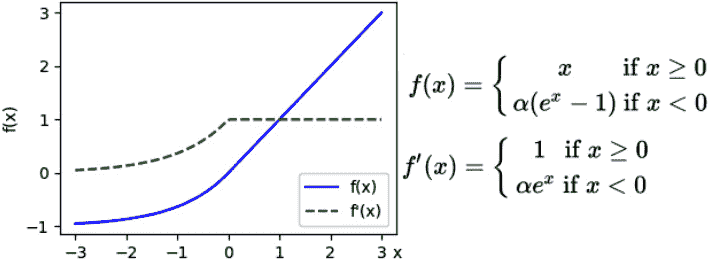
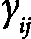
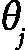

# 第三章：深度学习基础

在这一章中，我们将介绍**深度学习**（**DL**）和**深度神经网络**（**DNNs**）——即具有多个隐藏层的**神经网络**（**NNs**）。你可能会疑惑，既然有通用逼近定理，为什么还需要使用多个隐藏层？这个问题并非天真，长期以来，神经网络确实是以这种方式使用的。

不需要过多细节解释，原因之一是，逼近一个复杂的函数可能需要隐藏层中大量的单元，这使得使用它变得不切实际。还有另一个更为重要的原因，虽然它与隐藏层的数量无关，但与学习的层次相关。一个深度网络不仅仅是学习如何根据输入`X`预测输出`Y`；它还能够理解输入的基本特征。它能够学习输入样本特征的抽象，理解样本的基本特性，并基于这些特性进行预测。这种抽象层次在其他基本的**机器学习**（**ML**）算法和浅层神经网络中是缺失的。

在这一章中，我们将讨论以下主要主题：

+   深度学习简介

+   深度学习的基本概念

+   深度神经网络

+   训练深度网络

+   深度学习的应用

+   介绍流行的深度学习库

# 技术要求

我们将在本章中使用 Python、PyTorch 和 Keras 作为**TensorFlow**（**TF**）的一部分来实现示例。如果你还没有设置好这些工具的环境，别担心——示例代码已经作为 Jupyter 笔记本文件提供在 Google Colab 上。你可以在本书的 GitHub 仓库中找到代码示例：[`github.com/PacktPublishing/Python-Deep-Learning-Third-Edition/tree/main/Chapter03`](https://github.com/PacktPublishing/Python-Deep-Learning-Third-Edition/tree/main/Chapter03)。

# 深度学习简介

在 2012 年，Alex Krizhevsky、Ilya Sutskever 和 Geoffrey Hinton 发表了一篇具有里程碑意义的论文，题为 *使用深度卷积神经网络进行 ImageNet 分类* ([`papers.nips.cc/paper/4824-imagenet-classification-with-deep-convolutional-neural-networks.pdf`](https://papers.nips.cc/paper/4824-imagenet-classification-with-deep-convolutional-neural-networks.pdf))。该论文描述了他们使用神经网络（NN）赢得同年 ImageNet 竞赛的过程，这一点我们在*第二章*中提到过。论文结尾指出，即使移除单一层，网络的性能也会下降。他们的实验表明，移除任何中间层都会导致模型大约 2%的 Top-1 准确率损失。他们得出结论，网络的深度对性能至关重要。那么，基本问题是：是什么让网络的深度如此重要呢？

一个典型的英文谚语是“一图胜千言”。让我们用这种方法来理解什么是深度学习（DL）。我们将使用来自广泛引用的论文《卷积深度信念网络：可扩展的无监督学习层次表示》中的图像（[`ai.stanford.edu/~ang/papers/icml09-ConvolutionalDeepBeliefNetworks.pdf`](https://ai.stanford.edu/~ang/papers/icml09-ConvolutionalDeepBeliefNetworks.pdf)）。在这篇论文中，作者用不同类别的物体或动物图片训练了一个神经网络（NN）。下图展示了网络的不同层如何学习输入数据的不同特征。在第一层，网络学习检测一些小的基础特征，例如线条和边缘，这些特征在所有类别的所有图像中都是常见的：


图 3.1 – 第一层权重（上）和第二层权重（下）训练后的结果

但是接下来的层，如下图所示，将这些线条和边缘结合起来，组成了更复杂的特征，这些特征对每个类别都是特定的。在左下角图像的第一行中，我们可以看到网络如何检测到人脸的不同特征，例如眼睛、鼻子和嘴巴。对于汽车而言，这些特征可能是车轮、车门等等，如下图中的第二张图所示。这些特征是**抽象的**——即，网络已经学会了一个特征（如嘴巴或鼻子）的通用形状，并且能够在输入数据中检测到这个特征，尽管它可能具有不同的变化：


图 3.2 – 第 1 至第 4 列表示为特定物体类别（类）学习的第二层（上）和第三层（下）权重。第 5 列表示为四个物体类别（人脸、汽车、飞机和摩托车）混合学习的权重

在前述图像的第二行中，我们可以看到，在更深的层次中，网络将这些特征组合成更复杂的特征，如人脸和完整的汽车。深度神经网络（DNN）的一个优势是，它们能够自主地学习这些高层次的抽象表示，并从训练数据中推导出这些表示。

接下来，让我们更详细地讨论 DNN 的这些特性。

# 深度学习的基本概念

1801 年，Joseph Marie Charles 发明了**贾卡尔织机**。Charles 不是一名科学家，而仅仅是一个商人。贾卡尔织机使用了一套打孔卡片，每张卡片代表着织机上要复制的图案。同时，每张卡片也是该图案的抽象表示。例如，打孔卡片曾被用在 1890 年由 Herman Hollerith 发明的统计机器中，或者作为第一代计算机输入代码的一种方式。在统计机器中，卡片仅仅是要输入机器以计算人口统计数据的样本的抽象。然而，在贾卡尔织机中，卡片的使用更加微妙，每张卡片代表了可以与其他卡片组合起来形成更复杂图案的模式抽象。打孔卡片是现实特征的抽象表示，最终编织出来的设计就是这一抽象的体现。

在某种程度上，贾卡尔织机为今天的深度学习（DL）播下了种子，它通过对特征的表示定义了现实的含义。深度神经网络（DNN）不仅仅是识别猫是什么，或者松鼠是什么，它更理解猫和松鼠分别具备哪些特征。它学会了如何利用这些特征来设计一只猫或一只松鼠。如果我们要用贾卡尔织机设计一个猫形状的织物图案，我们需要使用具有猫鼻子上的胡须，且有优雅而纤细的身体的打孔卡片。相反，如果我们要设计一只松鼠，则需要使用能够表现松鼠毛茸茸尾巴的打孔卡片。一个学习了基本特征表示的深度网络，可以根据它所做的假设进行分类。例如，如果没有毛茸茸的尾巴，它可能就不是松鼠，而是猫。通过这种方式，网络学习到的信息更为完整且更具鲁棒性，最令人兴奋的是，深度神经网络能够自动完成这一学习过程。

## 特征学习

为了说明深度学习是如何工作的，我们来考虑一个简单的几何图形识别任务，例如识别一个立方体，见下图所示：


图 3.3 – 一个表示立方体的神经网络（NN）的抽象图。不同的层次编码了具有不同抽象层级的特征。

这个立方体由边（或线）组成，这些边在顶点处相交。假设三维空间中的每一个可能点都与一个单位相关联（暂时忽略这将需要无穷多个单位）。所有这些点/单位都位于多层前馈网络的第一层（输入层）。如果相应的点位于一条线上，则输入点/单位是激活的。位于同一条线（边）上的点/单位与下一层中的单一公共边/单位之间有强的正向连接。相反，它们与下一层中所有其他单位之间有负向连接。唯一的例外是位于顶点上的单位。每个这样的单位同时位于三条边上，并与下一层中的三个对应单位相连接。

现在，我们有了两个隐藏层，分别具有不同的抽象层次——第一个层次处理点，第二个层次处理边。然而，这还不足以在网络中编码一个完整的立方体。我们尝试通过增加一个顶点层来解决这个问题。在这里，第二层中每三个激活的边/单位（形成一个顶点）与第三层中的单一公共顶点/单位之间有显著的正向连接。由于立方体的每条边形成两个顶点，因此每条边/单位将与两个顶点/单位有正向连接，并与所有其他单位有负向连接。最后，我们将引入最后一个隐藏层（立方体）。形成立方体的四个顶点/单位将与来自立方体/层的单一立方体/单位之间有正向连接。

这个立方体表示的例子过于简化，但我们可以从中得出几个结论。其中之一是深度神经网络（DNN）非常适合层次化组织的数据。例如，一张图像由像素组成，这些像素形成线条、边缘、区域等。同样，语音也如此，其中的基本构件叫做**音素**，而文本则有字符、单词和句子。

在前面的例子中，我们有意为特定的立方体特征分配了层，但实际上，我们不会这么做。相反，深度网络会在训练过程中自动“发现”特征。这些特征可能不会立刻显现出来，而且通常人类也无法解释它们。此外，我们无法知道网络中不同层所编码的特征的层次。我们的例子更像是经典的机器学习（ML）算法，在这些算法中，用户必须凭借自己的经验选择他们认为最好的特征。这一过程被称为**特征工程**，它可能既费力又耗时。让网络自动发现特征不仅更容易，而且这些特征通常非常抽象，从而使它们对噪声的敏感度较低。例如，人类视觉可以识别不同形状、大小、光照条件下的物体，甚至在物体的视角部分被遮挡时也能识别。我们能认出不同发型和面部特征的人，即使他们戴着帽子或围巾遮住嘴巴。类似地，网络学习到的抽象特征将帮助它更好地识别面孔，即使在更具挑战性的条件下。

在下一节中，我们将讨论深度学习（DL）变得如此流行的一些原因。

## 深度学习流行的原因

如果你已经关注机器学习（ML）一段时间，你可能会注意到许多深度学习（DL）算法并不新鲜。**多层感知机**（**MLPs**）已经存在近 50 年。反向传播算法曾多次被发现，但最终在 1986 年获得了认可。著名计算机科学家 Yann LeCun 在 1990 年代完善了他的卷积网络工作。在 1997 年，Sepp Hochreiter 和 Jürgen Schmidhuber 发明了长短期记忆网络（LSTM），这是一种至今仍在使用的递归神经网络（RNN）。在这一节中，我们将尝试理解为什么如今我们迎来了 AI 的春天，而之前只有 AI 的冬天（[`en.wikipedia.org/wiki/AI_winter`](https://en.wikipedia.org/wiki/AI_winter)）。

第一个原因是，今天我们拥有的数据比过去多得多。互联网和软件在各个行业的兴起生成了大量可以通过计算机访问的数据。我们还拥有更多的基准数据集，例如 ImageNet。随着这些数据的增加，人们也希望通过分析数据来提取价值。正如我们稍后会看到的，深度学习（DL）算法在使用大量数据进行训练时表现得更好。

第二个原因是计算能力的提升。最显著的表现就是**图形处理单元**（**GPU**）的处理能力大幅提高。神经网络的组织方式使得它能够充分利用这种并行架构。让我们看看为什么。正如我们在*第二章*中所学到的，网络层的单元与同一层的单元没有直接连接。我们还学到了，许多层的操作可以表示为矩阵乘法。矩阵乘法是显著并行的（相信我，这是一个术语——你可以去 Google 查找！）。每个输出单元的计算与其他输出单元的计算无关。因此，我们可以并行计算所有的输出。并且，GPU 非常适合执行这样的高并行操作。一方面，GPU 的计算核心数量远超**中央处理单元**（**CPU**）。尽管 CPU 的核心速度比 GPU 核心更快，但我们仍然可以在 GPU 上并行计算更多的输出单元。但更重要的是，GPU 在内存带宽方面进行了优化，而 CPU 则优化了延迟。这意味着 CPU 可以非常快速地获取小块内存，但当需要获取大块内存时则会变得较慢。而 GPU 则相反。对于一个深度网络中有许多宽层的矩阵乘法，带宽成为瓶颈，而不是延迟。此外，GPU 的 L1 缓存比 CPU 的 L1 缓存更快，而且更大。L1 缓存代表了程序下一步可能使用的信息存储，存储这些数据可以加速处理过程。在深度神经网络（DNN）中，大量的内存会被重复使用，这也是 L1 缓存非常重要的原因。

在下一节《深度神经网络》中，我们将给出神经网络关键架构的更精确定义，并将在接下来的章节中详细介绍这些架构。

# 深度神经网络

我们可以将深度学习（DL）定义为机器学习（ML）技术的一类，其中信息通过分层处理，以逐步深入的方式理解数据中的表示和特征，复杂度逐渐增加。实际上，所有深度学习算法都是神经网络（NN），它们共享一些基本的共同特性。它们都由一个互联操作的图构成，操作过程使用输入/输出张量。它们的不同之处在于网络架构（或网络中单元的组织方式），有时也体现在训练方法上。考虑到这一点，让我们来看看神经网络的主要类型。以下列表并不详尽，但它代表了今天大多数使用中的神经网络类型：

+   **多层感知器**（**MLP**）：一种具有前馈传播、全连接层且至少有一个隐藏层的神经网络。我们在*第二章*中介绍了 MLP。

+   **卷积神经网络**（**CNN**）：CNN 是一种前馈神经网络，具有几种特殊类型的层。例如，卷积层通过滑动滤波器到输入图像（或声音）上，从而应用该滤波器，生成`n`维激活图。有证据表明，CNN 中的单元以类似生物细胞在大脑视觉皮层中的组织方式进行组织。到目前为止，我们已经提到过 CNN 很多次，这并非巧合——今天，CNN 在许多计算机视觉和自然语言处理任务中优于所有其他机器学习算法。我们将在*第四章*中讨论 CNN。

+   **循环神经网络**（**RNN**）：这种类型的神经网络具有一个内部状态（或记忆），该状态基于已输入网络的所有或部分数据。循环网络的输出是其内部状态（输入的记忆）和最新输入样本的组合。同时，内部状态会发生变化，以纳入新输入的数据。由于这些特性，循环网络非常适合处理顺序数据任务，例如文本或时间序列数据。我们将在*第六章*中讨论循环网络。

+   **Transformer**：与 RNN 类似，transformer 适合处理序列数据。它使用一种叫做**注意力机制**的方式，使得模型能够*直接同时访问*输入序列中的所有元素。这与 RNN 不同，后者是逐个处理序列元素，并在每个元素之后更新其内部状态。正如我们将在*第七章*中看到的，注意力机制相较于经典的 RNN 具有多个重要优势。正因为如此，近年来，transformer 已经在许多任务中取代了 RNN。

+   **自编码器**：正如我们在*第一章*中提到的，自编码器是一类无监督学习算法，其输出形状与输入相同，这使得网络能够更好地学习基本表示。

现在我们已经概述了主要的深度神经网络类型，让我们讨论一下如何训练它们。

# 训练深度神经网络

历史上，科学界一直认为，深度网络相比浅层网络具有更强的表示能力。然而，训练拥有多个隐藏层的网络曾面临许多挑战。我们现在知道，结合梯度下降和反向传播，我们可以成功训练深度神经网络（DNN），正如我们在*第二章*中讨论过的那样。在本节中，我们将看到如何改进这些网络，以解决一些只在深度神经网络中出现的问题，而不是浅层神经网络。

本书的第一版包括了如**限制玻尔兹曼机**（**RBMs**）和**深度信念网络**（**DBNs**）等网络。它们由加拿大科学家 Geoffrey Hinton 推广，他是最著名的深度学习研究者之一。早在 1986 年，他也是反向传播算法的发明者之一。RBM 是一种特殊类型的生成性神经网络，其中单元被组织成两个层次，即可见层和隐藏层。与前馈网络不同，RBM 中的数据可以双向流动——从可见单元到隐藏单元，反之亦然。2002 年，Hinton 教授引入了**对比散度**，这是一种用于训练 RBM 的无监督算法。2006 年，他引入了**深度信念网络**（**DBNs**），这些是通过堆叠多个 RBM 形成的深度神经网络。由于其创新的训练算法，DBN 可以拥有比以前更多的隐藏层。但即便有了对比散度，训练一个 DBN 也不是件容易的事。这是一个两步过程：

1.  首先，我们必须使用对比散度训练每个 RBM，并逐渐将它们堆叠在一起。这个阶段叫做**预训练**。

1.  实际上，预训练作为下一阶段的一个复杂的权重初始化算法，叫做**微调**。通过微调，我们将 DBN 转化为一个常规的 MLP，并继续使用监督反向传播和梯度下降训练它，就像我们在*第二章*中看到的那样。

由于一些算法的进展，现在可以使用传统的反向传播算法训练深度网络，从而有效地消除了预训练阶段。这些进展使得 DBN 和 RBM 变得过时。它们无疑在研究中非常有趣，但在实践中已经很少使用，我们将在本版本中省略它们。

接下来，让我们讨论一些使得使用反向传播训练神经网络成为可能的算法进展。

## 改进的激活函数

那么，为什么训练深度网络如此困难呢？预训练解决的主要挑战之一就是所谓的**梯度消失**问题。为了理解这一点，我们假设使用反向传播训练一个普通的多层感知机（MLP），该网络具有多个隐藏层，并在每个层使用逻辑 sigmoid 激活函数。我们先聚焦于 sigmoid 函数（tanh 函数的情况也是如此）。提醒一下，sigmoid 函数的计算公式为 ![<mml:math xmlns:mml="http://www.w3.org/1998/Math/MathML" xmlns:m="http://schemas.openxmlformats.org/officeDocument/2006/math"><mml:mi>σ</mml:mi><mml:mfenced separators="|"><mml:mrow><mml:mi>x</mml:mi></mml:mrow></mml:mfenced><mml:mo>=</mml:mo><mml:mn>1</mml:mn><mml:mtext>/</mml:mtext><mml:mfenced separators="|"><mml:mrow><mml:mn>1</mml:mn><mml:mo>+</mml:mo><mml:msup><mml:mrow><mml:mi>e</mml:mi></mml:mrow><mml:mrow><mml:mo>-</mml:mo><mml:mi>x</mml:mi></mml:mrow></mml:msup></mml:mrow></mml:mfenced></mml:math>](img/233.png)![<mml:math xmlns:mml="http://www.w3.org/1998/Math/MathML" xmlns:m="http://schemas.openxmlformats.org/officeDocument/2006/math"><mml:mi>σ</mml:mi><mml:mfenced separators="|"><mml:mrow><mml:mi>x</mml:mi></mml:mrow></mml:mfenced><mml:mo>=</mml:mo><mml:mn>1</mml:mn><mml:mtext>/</mml:mtext><mml:mfenced separators="|"><mml:mrow><mml:mn>1</mml:mn><mml:mo>+</mml:mo><mml:msup><mml:mrow><mml:mi>e</mml:mi></mml:mrow><mml:mrow><mml:mo>-</mml:mo><mml:mi>x</mml:mi></mml:mrow></mml:msup></mml:mrow></mml:mfenced></mml:math>](img/234.png):


图 3.4 – 逻辑 sigmoid（未中断）及其导数（中断）（左）；连续的 sigmoid 激活，将数据“压缩”（右）

梯度消失现象表现为以下几种方式：

+   在前向传播阶段，第一个 sigmoid 层的输出由前面图像中的蓝色不中断线表示，且其值位于（0, 1）范围内。右侧图像中的虚线表示每一层连续层之后的 sigmoid 激活值。即使经过三层，我们也可以看到激活值在一个狭窄的范围内“压缩”，并且无论输入值如何，它都趋向于约 0.66。例如，如果第一层的输入值为 2，那么，，，等等。sigmoid 函数的这一特性相当于擦除从前一层传来的信息。

+   我们现在知道，要训练一个神经网络（NN），我们需要计算激活函数的导数（以及所有其他的导数）以供反向传播阶段使用。在前面的图像中，左侧的绿色中断线表示了 sigmoid 函数的导数。我们可以看到，它在一个非常窄的区间内有显著的值，且该区间围绕 0 居中，而在其他所有情况下则趋向于 0。在有多个层的网络中，当导数传播到网络的前几层时，它很可能会趋向于 0。实际上，这意味着我们无法将误差传播到这些层，也无法以有意义的方式更新它们的权重。

幸运的是，我们在**第二章**中引入的**ReLU**激活函数可以一举解决这两个问题。回顾一下，下面的图像展示了 ReLU 图形及其导数：


图 3.5 – ReLU 激活函数（不中断）及其导数（中断）

ReLU 具有以下理想特性：

+   它是 **幂等的**。如果我们通过任意次数的 ReLU 激活传递一个值，它将保持不变；例如，*ReLU(2) = 2*，*ReLU(ReLU(2)) = 2*，依此类推。这对于 sigmoid 函数来说并不成立。ReLU 的幂等性使得理论上可以创建比 sigmoid 更深层的网络。

+   我们还可以看到，它的导数无论反向传播的值如何，都是 0 或 1。通过这种方式，我们还可以避免在反向传播中梯度消失的问题。严格来说，ReLU 在值为 0 时的导数是未定义的，这使得 ReLU 只在半微分意义下有效（关于这一点的更多信息可以参考 [`en.wikipedia.org/wiki/Semi-differentiability`](https://en.wikipedia.org/wiki/Semi-differentiability)）。但在实践中，它足够有效。

+   它产生稀疏的激活。假设网络的权重通过正态分布随机初始化。在这种情况下，每个 ReLU 单元的输入有 0.5 的概率小于 0。因此，大约一半的激活输出也将为 0。这种稀疏激活有几个优势，我们可以粗略地总结为在神经网络中的奥卡姆剃刀原则——用更简单的数据表示来实现相同的结果，比复杂的表示方式更好。

+   它在前向和反向传播中计算速度更快。

尽管 ReLU 有这些优势，但在训练过程中，网络权重可能会被更新到某些 ReLU 单元总是接收小于 0 的输入，从而导致它们始终输出 0。这种现象被称为 **死亡 ReLU（dying ReLUs）**。为了解决这个问题，已经提出了几种 ReLU 的改进方法。以下是一个非详尽的列表：

+   **Leaky ReLU**：当输入大于 0 时，Leaky ReLU 与普通 ReLU 相同，直接输出输入值。然而，当 *x < 0* 时，Leaky ReLU 输出 `x` 与某个常数 α (*0 < α < 1*) 的乘积，而不是 0。下图展示了 Leaky ReLU 的公式、它的导数以及它们的图形，*α = 0.2*：


图 3.6 – Leaky ReLU 激活函数

+   **Parametric ReLU** (**PReLU**；参见 *深入探讨激活函数：超越人类水平的 ImageNet 分类*， [`arxiv.org/abs/1502.01852`](https://arxiv.org/abs/1502.01852))：该激活函数与 Leaky ReLU 相同，但 *α* 是可调的，并且在训练过程中会进行调整。

+   **指数线性单元** (**ELU**；见 *通过指数线性单元（ELUs）进行快速准确的深度网络学习*，[`arxiv.org/abs/1511.07289`](https://arxiv.org/abs/1511.07289)): 当输入大于 0 时，ELU 与 ReLU 的工作方式相同。然而，当 *x < 0* 时，ELU 的输出变为 ，其中 *α* 是一个可调参数。下图展示了 ELU 公式、它的导数及其图像，适用于 *α =* *0.2*：



图 3.7 – ELU 激活函数

+   **缩放指数线性单元** (**SELU**；见 *自归一化神经网络*，[`arxiv.org/abs/1706.02515`](https://arxiv.org/abs/1706.02515)): 该激活函数类似于 ELU，除了输出（大于或小于 0）通过一个附加的训练参数 *λ* 进行缩放。SELU 是一个更大概念的组成部分，称为 **自归一化神经网络** (**SNNs**)，这一概念在源论文中有所描述。

+   **Sigmoid 线性单元 (SiLU)**，**高斯误差线性单元** (**GELU**；见 *高斯误差线性单元 (GELUs)*，[`arxiv.org/abs/1606.08415`](https://arxiv.org/abs/1606.08415))，以及 **Swish**（见 *激活函数搜索*，[`arxiv.org/abs/1710.05941`](https://arxiv.org/abs/1710.05941)): 这是一个由三个相似（但不完全相同）函数组成的集合，它们与 ReLU 非常相似，但在 0 点处是可微的。为了简化，我们只展示 SiLU 的图像（*σ* 是 Sigmoid 函数）：


图 3.8 – SiLU 激活函数

最后，我们有了 softmax，它是分类问题中输出层的激活函数。假设最终网络层的输出是一个向量，![<mml:math xmlns:mml="http://www.w3.org/1998/Math/MathML" xmlns:m="http://schemas.openxmlformats.org/officeDocument/2006/math"><mml:mi mathvariant="bold">z</mml:mi><mml:mo>=</mml:mo><mml:mfenced separators="|"><mml:mrow><mml:msub><mml:mrow><mml:mi>z</mml:mi></mml:mrow><mml:mrow><mml:mn>1</mml:mn></mml:mrow></mml:msub><mml:mo>,</mml:mo><mml:msub><mml:mrow><mml:mi>z</mml:mi></mml:mrow><mml:mrow><mml:mn>2</mml:mn></mml:mrow></mml:msub><mml:mo>…</mml:mo><mml:msub><mml:mrow><mml:mi>z</mml:mi></mml:mrow><mml:mrow><mml:mi>n</mml:mi></mml:mrow></mml:msub></mml:mrow></mml:mfenced></mml:math>](img/239.png)。每个 `n` 元素代表可能属于的 `n` 个类别之一。为了确定网络的预测结果，我们将取最大值的索引 `i`，，并将输入样本分配给它所代表的类别。然而，我们也可以将网络的输出解释为离散随机变量的概率分布——即，每个值，，代表输入样本属于特定类别的概率。为了帮助我们实现这一点，我们将使用 softmax 激活函数：

![<math xmlns="http://www.w3.org/1998/Math/MathML" display="block"><mrow><mrow><mi>f</mi><mfenced open="(" close=")"><msub><mi>z</mi><mi>i</mi></msub></mfenced><mo>=</mo><mfrac><mrow><mi>e</mi><mi>x</mi><mi>p</mi><mfenced open="(" close=")"><msub><mi>z</mi><mi>i</mi></msub></mfenced></mrow><mrow><msubsup><mo>∑</mo><mrow><mi>j</mi><mo>=</mo><mn>1</mn></mrow><mi>n</mi></msubsup><mrow><mi>e</mi><mi>x</mi><mi>p</mi><mfenced open="(" close=")"><msub><mi>z</mi><mi>j</mi></msub></mfenced></mrow></mrow></mfrac></mrow></mrow></math>](img/242.png)

它具有以下属性：

+   公式中的分母充当了归一化器。这对于我们刚才介绍的概率解释非常重要：

    +   每个值，，都被限制在[0, 1]的范围内，这使我们可以将其视为一个概率。

    +   值的总和  等于 1: ，这也与概率解释相一致。

+   一个额外的（实际上是强制性的）条件是该函数是可微的。

+   softmax 激活函数还有一个更微妙的属性。在我们对数据进行归一化之前，我们对每个向量组件进行指数变换，变换公式为 。假设两个向量组件为  和 。在这种情况下，我们会得到 exp(1) = 2.7 和 exp(2) = 7.39。如我们所见，变换前后组件的比率有很大不同——0.5 和 0.36。实际上，softmax 函数增强了较高分数的概率，相对于较低的分数。

在实际应用中，**softmax** 常常与 **交叉熵损失** 函数结合使用。它比较估计的类别概率与实际类别分布之间的差异（这种差异称为交叉熵）。我们可以将单个训练样本的交叉熵损失定义如下：

![<mml:math xmlns:mml="http://www.w3.org/1998/Math/MathML" xmlns:m="http://schemas.openxmlformats.org/officeDocument/2006/math" display="block"><mml:mi>H</mml:mi><mml:mfenced separators="|"><mml:mrow><mml:mi>p</mml:mi><mml:mo>,</mml:mo><mml:mi>q</mml:mi></mml:mrow></mml:mfenced><mml:mo>=</mml:mo><mml:mo>-</mml:mo><mml:mrow><mml:munderover><mml:mo stretchy="false">∑</mml:mo><mml:mrow><mml:mi>j</mml:mi><mml:mo>=</mml:mo><mml:mn>1</mml:mn></mml:mrow><mml:mrow><mml:mi>n</mml:mi></mml:mrow></mml:munderover><mml:mrow><mml:msub><mml:mrow><mml:mi>p</mml:mi></mml:mrow><mml:mrow><mml:mi>j</mml:mi></mml:mrow></mml:msub><mml:mfenced separators="|"><mml:mrow><mml:mi>x</mml:mi></mml:mrow></mml:mfenced><mml:mi>l</mml:mi><mml:mi>o</mml:mi><mml:mi>g</mml:mi><mml:mfenced separators="|"><mml:mrow><mml:msub><mml:mrow><mml:mi>q</mml:mi></mml:mrow><mml:mrow><mml:mi>j</mml:mi></mml:mrow></mml:msub><mml:mfenced separators="|"><mml:mrow><mml:mi>x</mml:mi></mml:mrow></mml:mfenced></mml:mrow></mml:mfenced></mml:mrow></mml:mrow></mml:math>](img/249.png)

这里， 是输出属于类 `j`（从 `n` 个类中） 的估计概率， 和  是实际的概率。实际分布 *P(X)* 通常是一个独热编码向量，其中真实的类具有 1 的概率，其他所有类的概率为 0。在这种情况下，交叉熵损失函数将仅捕捉目标类的误差，并忽略其他类的误差。

现在我们已经学会了如何防止梯度消失，并且能够将神经网络输出解释为概率分布，我们将重点关注 DNN 面临的下一个挑战——过拟合。

## DNN 正则化

到目前为止，我们已经了解到神经网络（NN）可以逼近任何函数。但强大的能力伴随着巨大的责任。神经网络可能会学习逼近目标函数的噪声，而不是其有用的部分。例如，假设我们正在训练一个神经网络来分类图像是否包含汽车，但由于某种原因，训练集大多数是红色的汽车。结果可能是，神经网络会将红色与汽车关联，而不是其形状。现在，如果网络在推理模式下看到一辆绿色的汽车，它可能无法识别为汽车，因为颜色不匹配。正如我们在*第一章*中讨论的那样，这个问题被称为过拟合，它是机器学习（ML）的核心问题（在深度网络中尤为严重）。在本节中，我们将讨论几种防止过拟合的方法。这些技术统称为正则化。

在神经网络的上下文中，这些正则化技术通常会在训练过程中施加一些人工的限制或障碍，以防止网络过度逼近目标函数。它们试图引导网络学习目标函数的一般性而非特定的逼近方式，期望这种表示能够在之前未见过的测试数据集示例上良好地泛化。让我们先从应用于输入数据的正则化技术开始，然后再将其输入到神经网络中：

+   **最小-最大归一化**：![<mml:math xmlns:mml="http://www.w3.org/1998/Math/MathML" xmlns:m="http://schemas.openxmlformats.org/officeDocument/2006/math"><mml:mi>x</mml:mi><mml:mo>=</mml:mo><mml:mfrac><mml:mrow><mml:mi>x</mml:mi><mml:mo>-</mml:mo><mml:msub><mml:mrow><mml:mi>x</mml:mi></mml:mrow><mml:mrow><mml:mi>m</mml:mi><mml:mi>i</mml:mi><mml:mi>n</mml:mi></mml:mrow></mml:msub></mml:mrow><mml:mrow><mml:msub><mml:mrow><mml:mi>x</mml:mi></mml:mrow><mml:mrow><mml:mi>m</mml:mi><mml:mi>a</mml:mi><mml:mi>x</mml:mi></mml:mrow></mml:msub><mml:mo>-</mml:mo><mml:msub><mml:mrow><mml:mi>x</mml:mi></mml:mrow><mml:mrow><mml:mi>m</mml:mi><mml:mi>i</mml:mi><mml:mi>n</mml:mi></mml:mrow></mml:msub></mml:mrow></mml:mfrac></mml:math>](img/253.png)。这里，`x` 是输入向量的单个元素， 是训练数据集中最小的元素， 是最大的元素。此操作将所有输入缩放到 [0, 1] 范围内。例如，一个灰度图像的最小颜色值为 0，最大颜色值为 255。然后，一个强度为 125 的像素，其缩放值为 。最小-最大归一化快速且易于实现。此归一化的一个问题是数据中的异常值可能对整个数据集的结果产生过大的影响。例如，如果一个单一的错误元素有非常大的值，它会进入公式计算中，并成为 ，这将使所有归一化后的数据集值趋近于 0。

+   **标准分数**（或**z 分数**）：。它比最小-最大方法更好地处理数据中的异常值。为了理解其原因，让我们专注于这个公式：

    +   ![<mml:math xmlns:mml="http://www.w3.org/1998/Math/MathML" xmlns:m="http://schemas.openxmlformats.org/officeDocument/2006/math"><mml:mi>μ</mml:mi><mml:mo>=</mml:mo><mml:mn>1</mml:mn><mml:mtext>/</mml:mtext><mml:mi>N</mml:mi><mml:mrow><mml:msubsup><mml:mo stretchy="false">∑</mml:mo><mml:mrow><mml:mi>i</mml:mi><mml:mo>=</mml:mo><mml:mn>1</mml:mn></mml:mrow><mml:mrow><mml:mi>N</mml:mi></mml:mrow></mml:msubsup><mml:mrow><mml:msub><mml:mrow><mml:mi>x</mml:mi></mml:mrow><mml:mrow><mml:mi>i</mml:mi></mml:mrow></mml:msub></mml:mrow></mml:mrow></mml:math>](img/259.png) 是数据集中所有元素的均值，其中  是输入向量中的单个元素，`N` 是数据集的总大小。

    +   ![<mml:math xmlns:mml="http://www.w3.org/1998/Math/MathML" xmlns:m="http://schemas.openxmlformats.org/officeDocument/2006/math"><mml:mi>σ</mml:mi><mml:mo>=</mml:mo><mml:msqrt><mml:mn>1</mml:mn><mml:mtext>/</mml:mtext><mml:mi>N</mml:mi><mml:mrow><mml:msubsup><mml:mo stretchy="false">∑</mml:mo><mml:mrow><mml:mi>i</mml:mi><mml:mo>=</mml:mo><mml:mn>1</mml:mn></mml:mrow><mml:mrow><mml:mi>N</mml:mi></mml:mrow></mml:msubsup><mml:mrow><mml:msup><mml:mrow><mml:mfenced separators="|"><mml:mrow><mml:msub><mml:mrow><mml:mi>x</mml:mi></mml:mrow><mml:mrow><mml:mi>i</mml:mi></mml:mrow></mml:msub><mml:mo>-</mml:mo><mml:mi>μ</mml:mi></mml:mrow></mml:mfenced></mml:mrow><mml:mrow><mml:mn>2</mml:mn></mml:mrow></mml:msup></mml:mrow></mml:mrow></mml:msqrt></mml:math>](img/261.png) 是所有数据集元素的**标准差**。它衡量数据集的值与均值的偏离程度。还有**方差，** **![<mml:math xmlns:mml="http://www.w3.org/1998/Math/MathML" xmlns:m="http://schemas.openxmlformats.org/officeDocument/2006/math"><mml:msup><mml:mrow><mml:mi>σ</mml:mi></mml:mrow><mml:mrow><mml:mn>2</mml:mn></mml:mrow></mml:msup><mml:mo>=</mml:mo><mml:mn>1</mml:mn><mml:mtext>/</mml:mtext><mml:mi>N</mml:mi><mml:mrow><mml:msubsup><mml:mo stretchy="false">∑</mml:mo><mml:mrow><mml:mi>i</mml:mi><mml:mo>=</mml:mo><mml:mn>1</mml:mn></mml:mrow><mml:mrow><mml:mi>N</mml:mi></mml:mrow></mml:msubsup><mml:mrow><mml:msup><mml:mrow><mml:mfenced separators="|"><mml:mrow><mml:msub><mml:mrow><mml:mi>x</mml:mi></mml:mrow><mml:mrow><mml:mi>i</mml:mi></mml:mrow></mml:msub><mml:mo>-</mml:mo><mml:mi>μ</mml:mi></mml:mrow></mml:mfenced></mml:mrow><mml:mrow><mml:mn>2</mml:mn></mml:mrow></mml:msup></mml:mrow></mml:mrow></mml:math>](img/262.png)**![<mml:math xmlns:mml="http://www.w3.org/1998/Math/MathML" xmlns:m="http://schemas.openxmlformats.org/officeDocument/2006/math"><mml:msup><mml:mrow><mml:mi>σ</mml:mi></mml:mrow><mml:mrow><mml:mn>2</mml:mn></mml:mrow></mml:msup><mml:mo>=</mml:mo><mml:mn>1</mml:mn><mml:mtext>/</mml:mtext><mml:mi>N</mml:mi><mml:mrow><mml:msubsup><mml:mo stretchy="false">∑</mml:mo><mml:mrow><mml:mi>i</mml:mi><mml:mo>=</mml:mo><mml:mn>1</mml:mn></mml:mrow><mml:mrow><mml:mi>N</mml:mi></mml:mrow></mml:msubsup><mml:mrow><mml:msup><mml:mrow><mml:mfenced separators="|"><mml:mrow><mml:msub><mml:mrow><mml:mi>x</mml:mi></mml:mrow><mml:mrow><mml:mi>i</mml:mi></mml:mrow></mml:msub><mml:mo>-</mml:mo><mml:mi>μ</mml:mi></mml:mrow></mml:mfenced></mml:mrow><mml:mrow><mml:mn>2</mml:mn></mml:mrow></mml:msup></mml:mrow></mml:mrow></mml:math>](img/263.png)，它去除了标准差中的平方根。方差在理论上是正确的，但比标准差不那么直观，因为标准差与原始数据的单位相同，`x`。

    另外，如果在整个数据集上计算μ和σ不实际，我们也可以按样本计算它们。标准分数保持数据集的均值接近 0，标准差接近 1。

+   **数据增强**：这是通过在将训练样本输入到网络之前，对其进行随机修改，从而人为地增加训练集的大小。在图像的情况下，这些修改可能包括旋转、倾斜、缩放等。

下一类正则化技术应用于 DNN 结构本身：

+   **丢弃法**：在这里，我们随机且周期性地从网络中去除某些层的单元（连同它们的输入和输出连接）。在每个训练小批量中，每个单元都有一个概率 `p`，使其随机丢弃。这样做是为了确保没有单元过度依赖其他单元，而是“学习”对神经网络有用的内容。丢弃法仅在训练阶段应用，所有单元在推理阶段都会完全参与。在下图中，我们可以看到全连接层的丢弃法：


图 3.9 – 全连接层丢弃法示例

+   **批量归一化**（**BN**；参见 *Batch Normalization: Accelerating Deep Network Training by Reducing Internal Covariate Shift*，[`arxiv.org/abs/1502.03167`](https://arxiv.org/abs/1502.03167)）：这是一种对网络隐藏层应用数据处理的方法，类似于标准分数。它对每个小批量（因此得名）隐藏层的输出进行归一化，使其均值接近 0（**重新中心化**），标准差接近 1（**重新缩放**）。其直观理解是，随着信息在各层之间传播，这些值可能会偏离期望值。假设小批量由 *m×n* 矩阵 *`X`* 表示。*`X`* 的每一行，，表示一个单独的输入向量（该向量是前一层的输出）。 是第 `i` 个向量的第 `j` 个元素。我们可以通过以下方式计算每个矩阵元素的 BN：

    +   ![<mml:math xmlns:mml="http://www.w3.org/1998/Math/MathML" xmlns:m="http://schemas.openxmlformats.org/officeDocument/2006/math"><mml:msub><mml:mrow><mml:mi>μ</mml:mi></mml:mrow><mml:mrow><mml:mi mathvariant="bold">X</mml:mi></mml:mrow></mml:msub><mml:mo>←</mml:mo><mml:mfrac><mml:mrow><mml:mn>1</mml:mn></mml:mrow><mml:mrow><mml:mi>m</mml:mi><mml:mo>×</mml:mo><mml:mi>n</mml:mi></mml:mrow></mml:mfrac><mml:mrow><mml:msubsup><mml:mo stretchy="false">∑</mml:mo><mml:mrow><mml:mi>i</mml:mi><mml:mo>=</mml:mo><mml:mn>1</mml:mn></mml:mrow><mml:mrow><mml:mi>m</mml:mi></mml:mrow></mml:msubsup><mml:mrow><mml:mrow><mml:msubsup><mml:mo stretchy="false">∑</mml:mo><mml:mrow><mml:mi>j</mml:mi><mml:mo>=</mml:mo><mml:mn>1</mml:mn></mml:mrow><mml:mrow><mml:mi>n</mml:mi></mml:mrow></mml:msubsup><mml:mrow><mml:msub><mml:mrow><mml:mi>x</mml:mi></mml:mrow><mml:mrow><mml:mi>i</mml:mi><mml:mi>j</mml:mi></mml:mrow></mml:msub></mml:mrow></mml:mrow></mml:mrow></mml:mrow></mml:math>](img/266.png): 这是小批量均值。我们通过对小批量矩阵的所有单元格计算一个单一的*μ*值。

    +   ![<mml:math xmlns:mml="http://www.w3.org/1998/Math/MathML" xmlns:m="http://schemas.openxmlformats.org/officeDocument/2006/math"><mml:msubsup><mml:mrow><mml:mi>σ</mml:mi></mml:mrow><mml:mrow><mml:mi mathvariant="bold">X</mml:mi></mml:mrow><mml:mrow><mml:mn>2</mml:mn></mml:mrow></mml:msubsup><mml:mo>←</mml:mo><mml:mfrac><mml:mrow><mml:mn>1</mml:mn></mml:mrow><mml:mrow><mml:mi>m</mml:mi><mml:mo>×</mml:mo><mml:mi>n</mml:mi></mml:mrow></mml:mfrac><mml:mrow><mml:msubsup><mml:mo stretchy="false">∑</mml:mo><mml:mrow><mml:mi>i</mml:mi><mml:mo>=</mml:mo><mml:mn>1</mml:mn></mml:mrow><mml:mrow><mml:mi>m</mml:mi></mml:mrow></mml:msubsup><mml:mrow><mml:mrow><mml:msubsup><mml:mo stretchy="false">∑</mml:mo><mml:mrow><mml:mi>j</mml:mi><mml:mo>=</mml:mo><mml:mn>1</mml:mn></mml:mrow><mml:mrow><mml:mi>n</mml:mi></mml:mrow></mml:msubsup><mml:mrow><mml:msup><mml:mrow><mml:mfenced separators="|"><mml:mrow><mml:msub><mml:mrow><mml:mi>x</mml:mi></mml:mrow><mml:mrow><mml:mi>i</mml:mi><mml:mi>j</mml:mi></mml:mrow></mml:msub><mml:mo>-</mml:mo><mml:msub><mml:mrow><mml:mi>μ</mml:mi></mml:mrow><mml:mrow><mml:mi mathvariant="bold">X</mml:mi></mml:mrow></mml:msub></mml:mrow></mml:mfenced></mml:mrow><mml:mrow><mml:mn>2</mml:mn></mml:mrow></mml:msup></mml:mrow></mml:mrow></mml:mrow></mml:mrow></mml:math>](img/267.png): 这是小批量方差。我们通过对小批量矩阵的所有单元格计算一个单一的值。

    +   ![<mml:math xmlns:mml="http://www.w3.org/1998/Math/MathML" xmlns:m="http://schemas.openxmlformats.org/officeDocument/2006/math"><mml:mover accent="true"><mml:mrow><mml:msub><mml:mrow><mml:mi>x</mml:mi></mml:mrow><mml:mrow><mml:mi>i</mml:mi><mml:mi>j</mml:mi></mml:mrow></mml:msub></mml:mrow><mml:mo>^</mml:mo></mml:mover><mml:mo>←</mml:mo><mml:mfrac><mml:mrow><mml:msub><mml:mrow><mml:mi>x</mml:mi></mml:mrow><mml:mrow><mml:mi>i</mml:mi><mml:mi>j</mml:mi></mml:mrow></mml:msub><mml:mo>-</mml:mo><mml:msub><mml:mrow><mml:mi>μ</mml:mi></mml:mrow><mml:mrow><mml:mi mathvariant="bold">X</mml:mi></mml:mrow></mml:msub></mml:mrow><mml:mrow><mml:msqrt><mml:msubsup><mml:mrow><mml:mi>σ</mml:mi></mml:mrow><mml:mrow><mml:mi mathvariant="bold">X</mml:mi></mml:mrow><mml:mrow><mml:mn>2</mml:mn></mml:mrow></mml:msubsup><mml:mo>+</mml:mo><mml:mi>ε</mml:mi></mml:msqrt></mml:mrow></mml:mfrac></mml:math>](img/269.png)：我们对矩阵的每个单元格进行归一化处理。*ε* 是为了数值稳定性而添加的常数，这样分母就不会变为 0。

    +   ![<mml:math xmlns:mml="http://www.w3.org/1998/Math/MathML" xmlns:m="http://schemas.openxmlformats.org/officeDocument/2006/math"><mml:msub><mml:mrow><mml:mi>y</mml:mi></mml:mrow><mml:mrow><mml:mi>i</mml:mi><mml:mi>j</mml:mi></mml:mrow></mml:msub><mml:mo>←</mml:mo><mml:mi>γ</mml:mi><mml:mover accent="true"><mml:mrow><mml:msub><mml:mrow><mml:mi>x</mml:mi></mml:mrow><mml:mrow><mml:mi>i</mml:mi><mml:mi>j</mml:mi></mml:mrow></mml:msub></mml:mrow><mml:mo>^</mml:mo></mml:mover><mml:mo>+</mml:mo><mml:mi>β</mml:mi><mml:mo>≡</mml:mo><mml:mtext>B</mml:mtext><mml:msub><mml:mrow><mml:mtext>N</mml:mtext></mml:mrow><mml:mrow><mml:mtext>γ,β</mml:mtext></mml:mrow></mml:msub><mml:mfenced separators="|"><mml:mrow><mml:msub><mml:mrow><mml:mi>x</mml:mi></mml:mrow><mml:mrow><mml:mi>i</mml:mi><mml:mi>j</mml:mi></mml:mrow></mml:msub></mml:mrow></mml:mfenced></mml:math>](img/270.png)：该公式表示原始数据的尺度和偏移。*γ* 和 *β* 是可学习的参数，我们在每个位置上计算它们，*ij* ( 和 )，在整个小批量矩阵的所有单元格上计算。

+   **层归一化** (**LN**；见 *层归一化*， [`arxiv.org/abs/1607.06450`](https://arxiv.org/abs/1607.06450))：LN 类似于 BN，但有一个关键区别：均值和方差是分别在每个小批量样本上计算的。这与 BN 不同，BN 是在整个小批量上计算这些值。与 BN 一样，小批量是一个 *m×n* 矩阵，*`X`*，每一行向量，，是前一层的输出，且  是第 `i` 个向量的第 `j` 个元素。那么，我们对于第 `i` 个输入向量有如下公式：

    +   ![<mml:math xmlns:mml="http://www.w3.org/1998/Math/MathML" xmlns:m="http://schemas.openxmlformats.org/officeDocument/2006/math"><mml:msub><mml:mrow><mml:mi>μ</mml:mi></mml:mrow><mml:mrow><mml:msub><mml:mrow><mml:mi mathvariant="bold">x</mml:mi></mml:mrow><mml:mrow><mml:mi>i</mml:mi></mml:mrow></mml:msub></mml:mrow></mml:msub><mml:mo>←</mml:mo><mml:mfrac><mml:mrow><mml:mn>1</mml:mn></mml:mrow><mml:mrow><mml:mi>n</mml:mi></mml:mrow></mml:mfrac><mml:mrow><mml:msubsup><mml:mo stretchy="false">∑</mml:mo><mml:mrow><mml:mi>j</mml:mi><mml:mo>=</mml:mo><mml:mn>1</mml:mn></mml:mrow><mml:mrow><mml:mi>n</mml:mi></mml:mrow></mml:msubsup><mml:mrow><mml:msub><mml:mrow><mml:mi>x</mml:mi></mml:mrow><mml:mrow><mml:mi>i</mml:mi><mml:mi>j</mml:mi></mml:mrow></mml:msub></mml:mrow></mml:mrow></mml:math>](img/275.png)

    +   ![<mml:math xmlns:mml="http://www.w3.org/1998/Math/MathML" xmlns:m="http://schemas.openxmlformats.org/officeDocument/2006/math"><mml:msubsup><mml:mrow><mml:mi>σ</mml:mi></mml:mrow><mml:mrow><mml:msub><mml:mrow><mml:mi mathvariant="bold">x</mml:mi></mml:mrow><mml:mrow><mml:mi>i</mml:mi></mml:mrow></mml:msub></mml:mrow><mml:mrow><mml:mn>2</mml:mn></mml:mrow></mml:msubsup><mml:mo>←</mml:mo><mml:mfrac><mml:mrow><mml:mn>1</mml:mn></mml:mrow><mml:mrow><mml:mi>n</mml:mi></mml:mrow></mml:mfrac><mml:mrow><mml:msubsup><mml:mo stretchy="false">∑</mml:mo><mml:mrow><mml:mi>j</mml:mi><mml:mo>=</mml:mo><mml:mn>1</mml:mn></mml:mrow><mml:mrow><mml:mi>n</mml:mi></mml:mrow></mml:msubsup><mml:mrow><mml:msup><mml:mrow><mml:mfenced separators="|"><mml:mrow><mml:msub><mml:mrow><mml:mi>x</mml:mi></mml:mrow><mml:mrow><mml:mi>i</mml:mi><mml:mi>j</mml:mi></mml:mrow></mml:msub><mml:mo>-</mml:mo><mml:msub><mml:mrow><mml:mi>μ</mml:mi></mml:mrow><mml:mrow><mml:msub><mml:mrow><mml:mi mathvariant="bold">x</mml:mi></mml:mrow><mml:mrow><mml:mi>i</mml:mi></mml:mrow></mml:msub></mml:mrow></mml:msub></mml:mrow></mml:mfenced></mml:mrow><mml:mrow><mml:mn>2</mml:mn></mml:mrow></mml:msup></mml:mrow></mml:mrow></mml:math>](img/276.png)

    +   ![<math xmlns="http://www.w3.org/1998/Math/MathML" display="block"><mrow><mrow><mover><msub><mi>x</mi><mrow><mi>i</mi><mi>j</mi></mrow></msub><mo stretchy="true">ˆ</mo></mover><mo>←</mo><mstyle scriptlevel="+1"><mfrac><mrow><msub><mi>x</mi><mrow><mi>i</mi><mi>j</mi></mrow></msub><mo>−</mo><msub><mi>μ</mi><msub><mi mathvariant="bold">x</mi><mi>i</mi></msub></msub></mrow><msqrt><mrow><msubsup><mi>σ</mi><msub><mi mathvariant="bold">x</mi><mi>i</mi></msub><mn>2</mn></msubsup><mo>+</mo><mi>ε</mi></mrow></msqrt></mfrac></mstyle></mrow></mrow></math>](img/277.png)

    +   ![<mml:math xmlns:mml="http://www.w3.org/1998/Math/MathML" xmlns:m="http://schemas.openxmlformats.org/officeDocument/2006/math"><mml:msub><mml:mrow><mml:mi>y</mml:mi></mml:mrow><mml:mrow><mml:mi>i</mml:mi><mml:mi>j</mml:mi></mml:mrow></mml:msub><mml:mo>←</mml:mo><mml:mi>γ</mml:mi><mml:mover accent="true"><mml:mrow><mml:msub><mml:mrow><mml:mi>x</mml:mi></mml:mrow><mml:mrow><mml:mi>i</mml:mi><mml:mi>j</mml:mi></mml:mrow></mml:msub></mml:mrow><mml:mo>^</mml:mo></mml:mover><mml:mo>+</mml:mo><mml:mi>β</mml:mi><mml:mo>≡</mml:mo><mml:mtext>L</mml:mtext><mml:msub><mml:mrow><mml:mtext>N</mml:mtext></mml:mrow><mml:mrow><mml:mtext>γ,β</mml:mtext></mml:mrow></mml:msub><mml:mfenced separators="|"><mml:mrow><mml:msub><mml:mrow><mml:mi>x</mml:mi></mml:mrow><mml:mrow><mml:mi>i</mml:mi><mml:mi>j</mml:mi></mml:mrow></mml:msub></mml:mrow></mml:mfenced></mml:math>](img/278.png)

+   **均方根层归一化** (**RMSNorm**; 参见 [`arxiv.org/abs/1910.07467`](https://arxiv.org/abs/1910.07467)): RMSNorm 的作者认为，LN 的主要好处仅来自重新缩放，而不是重新中心化和重新缩放的结合。因此，RMSNorm 是 LN 的简化且更快速的版本，它只使用均方根统计量进行重新缩放。我们将使用与 LN 相同的符号。因此，我们可以将 RMSNorm 定义如下：

    +   ![<mml:math xmlns:mml="http://www.w3.org/1998/Math/MathML" xmlns:m="http://schemas.openxmlformats.org/officeDocument/2006/math"><mml:mtext>RMS</mml:mtext><mml:mfenced separators="|"><mml:mrow><mml:msub><mml:mrow><mml:mi mathvariant="bold">x</mml:mi></mml:mrow><mml:mrow><mml:mi>i</mml:mi></mml:mrow></mml:msub></mml:mrow></mml:mfenced><mml:mo>=</mml:mo><mml:msqrt><mml:mfrac><mml:mrow><mml:mn>1</mml:mn></mml:mrow><mml:mrow><mml:mi>n</mml:mi></mml:mrow></mml:mfrac><mml:mrow><mml:msubsup><mml:mo stretchy="false">∑</mml:mo><mml:mrow><mml:mi>j</mml:mi><mml:mo>=</mml:mo><mml:mn>1</mml:mn></mml:mrow><mml:mrow><mml:mi>n</mml:mi></mml:mrow></mml:msubsup><mml:mrow><mml:msubsup><mml:mrow><mml:mi>x</mml:mi></mml:mrow><mml:mrow><mml:mi>i</mml:mi><mml:mi>j</mml:mi></mml:mrow><mml:mrow><mml:mn>2</mml:mn></mml:mrow></mml:msubsup></mml:mrow></mml:mrow></mml:msqrt></mml:math>](img/279.png).

    +   ![<mml:math xmlns:mml="http://www.w3.org/1998/Math/MathML" xmlns:m="http://schemas.openxmlformats.org/officeDocument/2006/math"><mml:msub><mml:mrow><mml:mi>x</mml:mi></mml:mrow><mml:mrow><mml:mi>i</mml:mi><mml:mi>j</mml:mi></mml:mrow></mml:msub><mml:mo>←</mml:mo><mml:mfrac><mml:mrow><mml:msub><mml:mrow><mml:mi>x</mml:mi></mml:mrow><mml:mrow><mml:mi>i</mml:mi><mml:mi>j</mml:mi></mml:mrow></mml:msub></mml:mrow><mml:mrow><mml:mtext>RMS</mml:mtext><mml:mfenced separators="|"><mml:mrow><mml:msub><mml:mrow><mml:mi mathvariant="bold">x</mml:mi></mml:mrow><mml:mrow><mml:mi>i</mml:mi></mml:mrow></mml:msub></mml:mrow></mml:mfenced></mml:mrow></mml:mfrac><mml:msub><mml:mrow><mml:mi>γ</mml:mi></mml:mrow><mml:mrow><mml:mi>i</mml:mi><mml:mi>j</mml:mi></mml:mrow></mml:msub></mml:math>](img/280.png): 这里， 是增益参数，用于重新缩放标准化的输入和求和（初始值为 1）。它等同于 BN 中的 *γ* 参数。

下图说明了 BN 和 LN 之间的差异。在左侧，我们计算整个小批量中单个 *μ* 和 *σ* 值。右侧，我们可以看到每行分别为  和 ：


图 3.10 – BN 和 LN 计算 μ 和 σ

我们将介绍的最终正则化类型是**L2 正则化**。该技术在成本函数中添加一个特殊的正则化项。为了理解它，让我们以 MSE 成本为例。我们可以通过以下方式将 L2 正则化添加到其中（公式中的下划线部分）：

![<mml:math xmlns:mml="http://www.w3.org/1998/Math/MathML" xmlns:m="http://schemas.openxmlformats.org/officeDocument/2006/math" display="block"><mml:mi>J</mml:mi><mml:mfenced separators="|"><mml:mrow><mml:mi>θ</mml:mi></mml:mrow></mml:mfenced><mml:mo>=</mml:mo><mml:mfrac><mml:mrow><mml:mn>1</mml:mn></mml:mrow><mml:mrow><mml:mn>2</mml:mn><mml:mi>n</mml:mi></mml:mrow></mml:mfrac><mml:mfenced open="[" close="]" separators="|"><mml:mrow><mml:mrow><mml:munderover><mml:mo stretchy="false">∑</mml:mo><mml:mrow><mml:mi>i</mml><mml:mo>=</mml:mo><mml:mn>1</mml:mn></mml:mrow><mml:mrow><mml:mi>n</mml></mml:mrow></mml:munderover><mml:mrow><mml:msup><mml:mrow><mml:mfenced separators="|"><mml:mrow><mml:msub><mml:mrow><mml:mi>f</mml:mi></mml:mrow><mml:mrow><mml:mi>θ</mml></mml:mrow></mml:msub><mml:mfenced separators="|"><mml:mrow><mml:msup><mml:mrow><mml:mi mathvariant="bold">x</mml:mi></mml:mrow><mml:mrow><mml:mfenced separators="|"><mml:mrow><mml:mi>i</mml></mml:mrow></mml:mfenced></mml:mrow></mml:msup></mml:mrow></mml:mfenced><mml:mo>-</mml:mo><mml:msup><mml:mrow><mml:mi>t</mml></mml:mrow><mml:mrow><mml:mfenced separators="|"><mml:mrow><mml:mi>i</mml></mml:mrow></mml:mfenced></mml:mrow></mml:msup></mml:mrow></mml:mfenced></mml:mrow><mml:mrow><mml:mn>2</mml:mn></mml:mrow></mml:msup></mml:mrow><mml:mo>+</mml:mo><mml:munder><mml:mrow><mml:mi>λ</mml:mi><mml:mrow><mml:munderover><mml:mo stretchy="false">∑</mml:mo><mml:mrow><mml:mi>j</mml><mml:mo>=</mml:mo><mml:mn>1</mml:mn></mml:mrow><mml:mrow><mml:mi>m</mml></mml:mrow></mml:munderover><mml:mrow><mml:msubsup><mml:mrow><mml:mi>θ</mml></mml:mrow><mml:mrow><mml:mi>j</mml></mml:mrow><mml:mrow><mml:mn>2</mml></mml:mrow></mml:msubsup></mml:mrow></mml:mrow></mml:mrow></mml:munder></mml:mfenced></mml:math>](img/284.png)

这里， 是 `m` 个总网络权重之一，*λ* 是权重衰减系数。其原理是，如果网络权重，，较大，那么代价函数也会增大。实际上，权重衰减会惩罚大权重（因此得名）。这可以防止网络过度依赖与这些权重相关的少数特征。当网络被迫使用多个特征时，过拟合的机会会减少。实际操作中，当我们计算权重衰减代价函数（前面的公式）对每个权重的导数并将其传播到权重本身时，权重更新规则发生如下变化：

![<mml:math xmlns:mml="http://www.w3.org/1998/Math/MathML" xmlns:m="http://schemas.openxmlformats.org/officeDocument/2006/math"><mml:msub><mml:mrow><mml:mi>θ</mml:mi></mml:mrow><mml:mrow><mml:mi>j</mml:mi></mml:mrow></mml:msub><mml:mo>←</mml:mo><mml:msub><mml:mrow><mml:mi>θ</mml:mi></mml:mrow><mml:mrow><mml:mi>j</mml:mi></mml:mrow></mml:msub><mml:mo>-</mml:mo><mml:mi>η</mml:mi><mml:mfenced separators="|"><mml:mrow><mml:mfrac><mml:mrow><mml:mo>∂</mml:mo><mml:mi>J</mml:mi><mml:mfenced separators="|"><mml:mrow><mml:mi>θ</mml:mi></mml:mrow></mml:mfenced></mml:mrow><mml:mrow><mml:mo>∂</mml:mo><mml:msub><mml:mrow><mml:mi>θ</mml:mi></mml:mrow><mml:mrow><mml:mi>j</mml:mi></mml:mrow></mml:msub></mml:mrow></mml:mfrac></mml:mrow></mml:mfenced></mml:math>](img/287.png) 到 ![<mml:math xmlns:mml="http://www.w3.org/1998/Math/MathML" xmlns:m="http://schemas.openxmlformats.org/officeDocument/2006/math"><mml:msub><mml:mrow><mml:mi>θ</mml:mi></mml:mrow><mml:mrow><mml:mi>j</mml:mi></mml:mrow></mml:msub><mml:mo>←</mml:mo><mml:msub><mml:mrow><mml:mi>θ</mml:mi></mml:mrow><mml:mrow><mml:mi>j</mml:mi></mml:mrow></mml:msub><mml:mo>-</mml:mo><mml:mi>η</mml:mi><mml:mfenced separators="|"><mml:mrow><mml:mfrac><mml:mrow><mml:mo>∂</mml:mo><mml:mi>J</mml:mi><mml:mfenced separators="|"><mml:mrow><mml:mi>θ</mml:mi></mml:mrow></mml:mfenced></mml:mrow><mml:mrow><mml:mo>∂</mml:mo><mml:msub><mml:mrow><mml:mi>θ</mml:mi></mml:mrow><mml:mrow><mml:mi>j</mml:mi></mml:mrow></mml:msub></mml:mrow></mml:mfrac><mml:mo>+</mml:mo><mml:mi>λ</mml:mi><mml:msub><mml:mrow><mml:mi>θ</mml:mi></mml:mrow><mml:mrow><mml:mi>j</mml:mi></mml:mrow></mml:msub></mml:mrow></mml:mfenced></mml:math>](img/288.png)

通过对 DNN 正则化的讨论，我们已经涵盖了理论基础。接下来，让我们看看 DNN 的实际应用是什么。

# 深度学习的应用

一般来说，机器学习（ML），尤其是深度学习（DL），在预测质量、特征检测和分类方面取得了越来越令人惊叹的结果。许多这些最新的成果已经成为新闻头条。进步的速度如此之快，以至于一些专家担心机器很快会比人类更聪明。但我希望你在读完这本书后，能够缓解你可能有的任何这种担忧。无论如何，机器仍然远未达到人类级别的智能。

在*第二章*中，我们提到过深度学习算法如何占据了 ImageNet 竞赛的领先位置。它们的成功足以从学术界跳跃到工业界。

让我们来看看深度学习的一些实际应用案例：

+   如今，新的汽车配备了一系列安全性和便利性功能，旨在使驾驶体验更安全、更轻松。其中一项功能是自动紧急刹车系统，当汽车看到障碍物时会自动刹车。另一个功能是车道保持辅助，它可以让车辆在不需要驾驶员操控方向盘的情况下保持当前车道。为了识别车道标记、其他车辆、行人和骑行者，这些系统使用了

    前置摄像头。该领域最著名的供应商之一，Mobileye ([`www.mobileye.com/`](https://www.mobileye.com/))，已经生产了定制芯片，使用卷积神经网络（CNN）来检测前方道路上的物体。为了让你了解这个行业的重要性，2017 年，英特尔以 153 亿美元收购了 Mobileye。这并非个案，特斯拉著名的自动驾驶系统也依赖 CNN 来实现相同的效果。特斯拉前 AI 总监安德烈·卡帕西（Andrej Karpathy）([`karpathy.ai/`](https://karpathy.ai/))是深度学习领域的知名研究者。我们可以推测，未来的自动驾驶汽车也将使用深度网络进行计算机视觉。

+   谷歌的**视觉 API** ([`cloud.google.com/vision/`](https://cloud.google.com/vision/)) 和亚马逊的**Rekognition** ([`aws.amazon.com/rekognition/`](https://aws.amazon.com/rekognition/)) 服务都使用深度学习模型提供各种计算机视觉能力。这些功能包括图像中的物体和场景识别、文本识别、人脸识别、内容审核等。

+   如果这些 API 不够，你还可以在云端运行自己的模型。例如，你可以使用亚马逊的 AWS DL AMI（即**亚马逊机器镜像**；见[`aws.amazon.com/machine-learning/amis/`](https://aws.amazon.com/machine-learning/amis/)），这些是预配置了流行深度学习库的虚拟机。谷歌也提供类似的服务，通过其 Cloud AI（[`cloud.google.com/products/ai/`](https://cloud.google.com/products/ai/)），但他们更进一步。他们创建了**张量处理单元**（**TPUs**；见 https://cloud.google.com/tpu/）——这是一种专为快速神经网络操作（如矩阵乘法和激活函数）优化的微处理器。

+   深度学习（DL）在医学应用中具有很大的潜力。然而，严格的监管要求以及患者数据的保密性限制了其普及。尽管如此，我们仍然可以识别出深度学习在以下几个领域可能产生重大影响：

    +   医学影像学是指多种非侵入性方法，用于创建身体内部的视觉表现。其中包括**磁共振影像**（**MRIs**）、超声、**计算机断层扫描**（**CAT**）扫描、X 射线和组织学影像。通常，这些图像需要由医学专业人员分析，以确定患者的病情。

    +   计算机辅助诊断，特别是计算机视觉，可以通过检测和突出显示图像中的重要特征来帮助专家。例如，为了确定结肠癌的恶性程度，病理学家需要使用组织学影像分析腺体的形态学。这是一项具有挑战性的任务，因为形态学可能有很大的变化。深度神经网络（DNN）可以自动从图像中分割出腺体，剩下的工作由病理学家来验证结果。这将减少分析所需的时间，使得分析更加廉价且更易获得。

    +   另一个可以受益于深度学习的医学领域是病历记录的分析。当医生诊断患者的病情并开具治疗方案时，他们首先会查阅患者的病历。深度学习算法可以从这些记录中提取最相关和最重要的信息，即使它们是手写的。这样，医生的工作将变得更轻松，同时也减少了错误的风险。

    +   深度神经网络（DNNs）已在一个领域取得了显著的影响——蛋白质折叠。蛋白质是大型复杂分子，其功能取决于其三维结构。蛋白质的基本构件是氨基酸，其序列决定了蛋白质的形状。蛋白质折叠问题旨在理解初始氨基酸序列与蛋白质最终三维结构之间的关系。DeepMind 的**AlphaFold 2**模型（据信基于变换器架构；见 [`www.deepmind.com/blog/alphafold-reveals-the-structure-of-the-protein-universe`](https://www.deepmind.com/blog/alphafold-reveals-the-structure-of-the-protein-universe)）成功预测了 2 亿种蛋白质结构，这几乎涵盖了所有已知的已编目蛋白质。

+   Google 的神经机器翻译 API ([`arxiv.org/abs/1609.08144`](https://arxiv.org/abs/1609.08144)) 使用了——你猜对了——深度神经网络（DNNs）进行机器翻译。

+   Siri ([`machinelearning.apple.com/2017/10/01/hey-siri.html`](https://machinelearning.apple.com/2017/10/01/hey-siri.html))、Google 助手和 Amazon Alexa ([`aws.amazon.com/deep-learning/`](https://aws.amazon.com/deep-learning/)) 依赖深度网络进行语音识别。

+   **AlphaGo** 是基于深度学习（DL）的人工智能机器，它在 2016 年通过战胜世界围棋冠军李世石而成为新闻焦点。AlphaGo 在 2016 年 1 月就已经引起了媒体的关注，当时它击败了欧洲围棋冠军范睿。然而，当时似乎不太可能击败世界冠军。几个月后，AlphaGo 以 4-1 的胜利系列取得了这一非凡成就。这是一个重要的里程碑，因为围棋有比其他棋类（如国际象棋）更多的可能变化，而且在事先很难考虑所有可能的走法。此外，与国际象棋不同，在围棋中，即便是判断棋盘上单颗棋子的当前局势或价值也非常困难。2017 年，DeepMind 发布了 AlphaGo 的更新版**AlphaZero** ([`arxiv.org/abs/1712.01815`](https://arxiv.org/abs/1712.01815))，而在 2019 年，他们发布了一个进一步更新的版本，名为**MuZero** ([`arxiv.org/abs/1911.08265`](https://arxiv.org/abs/1911.08265))。

+   像 GitHub Copilot ([`github.com/features/copilot`](https://github.com/features/copilot)) 和 ChatGPT ([`chat.openai.com/`](https://chat.openai.com/))这样的工具利用生成型深度神经网络模型将自然语言请求转化为源代码片段、函数或完整的程序。我们之前提到的 Stable Diffusion ([`stability.ai/blog/stable-diffusion-public-release`](https://stability.ai/blog/stable-diffusion-public-release)) 和 DALL-E ([`openai.com/dall-e-2/`](https://openai.com/dall-e-2/))，则能够根据文本描述生成逼真的图像。

在这个简短的列表中，我们旨在涵盖深度学习（DL）应用的主要领域，如计算机视觉、自然语言处理（NLP）、语音识别和**强化学习**（**RL**）。然而，这个列表并不详尽，因为深度学习算法还有许多其他的应用。不过，我希望这些内容足以激发你的兴趣。接下来，我们将正式介绍两个最受欢迎的深度学习库——PyTorch 和 Keras。

# 介绍流行的深度学习库

我们已经在*第一章*中实现了一个使用 PyTorch 的简单示例。在本节中，我们将更系统地介绍该库以及 Keras。我们从大多数深度神经网络（DNN）库的共同特点开始：

+   所有库都使用 Python。

+   数据存储的基本单元是**张量**。从数学角度来看，张量的定义更加复杂，但在深度学习库的语境中，张量是多维的（具有任意数量的轴）基本值数组。

+   神经网络（NN）表示为**计算图**，图中的节点代表操作（加权求和、激活函数等）。边缘代表数据流动，数据如何从一个操作的输出作为下一个操作的输入。操作的输入和输出（包括网络的输入和输出）都是张量。

+   所有库都包含**自动微分**功能。这意味着你只需要定义网络架构和激活函数，库将自动计算训练过程中反向传播所需的所有导数。

+   到目前为止，我们提到了 GPU，但实际上，绝大多数深度学习项目仅使用 NVIDIA GPU。这是因为 NVIDIA 提供了更好的软件支持。这些库也不例外——为了实现 GPU 操作，它们依赖于 CUDA 工具包（[`developer.nvidia.com/cuda-toolkit`](https://developer.nvidia.com/cuda-toolkit)）和 cuDNN 库（[`developer.nvidia.com/cudnn`](https://developer.nvidia.com/cudnn)）。cuDNN 是 CUDA 的扩展，专为深度学习应用构建。如在*深度学习应用*部分所提到的，你也可以在云端运行你的深度学习实验。

PyTorch 是一个独立的库，而 Keras 则建立在 TF 之上，作为一个用户友好的 TF 接口。接下来，我们将使用 PyTorch 和 Keras 实现一个简单的分类示例。

## 使用 Keras 进行数字分类

Keras 作为独立库存在，其中 TF 作为后端，也可以作为 TF 本身的子组件使用。你可以选择这两种方式之一。若要将 Keras 作为 TF 的一部分使用，我们只需安装 TF 本身。安装完成后，我们可以通过以下导入使用该库：

```py
import tensorflow.keras
```

独立版 Keras 支持除 TF 外的不同后端，如 Theano。在这种情况下，我们可以安装 Keras 本身，然后通过以下导入来使用它：

```py
import keras
```

Keras 的大多数使用都基于 TF 后端。Keras 的作者推荐将该库作为 TF 的一个组件使用（即第一种方式），我们将在本书的其余部分遵循这个方式。

在这一节中，我们将通过 TF 使用 Keras 来分类 MNIST 数据集的图像。该数据集包含了 70,000 个由不同人手写的数字示例。前 60,000 个通常用于训练，剩下的 10,000 个用于测试：


图 3.11 – 从 MNIST 数据集中提取的数字样本

我们将构建一个简单的多层感知机（MLP），并且只包含一个隐藏层。让我们开始：

1.  Keras 的一个优点是它可以为你导入这个数据集，而不需要你显式地从网上下载（它会为你自动下载）：

    ```py
    import tensorflow as tf
    (X_train, Y_train), (X_validation, Y_validation) = \
                 tf.keras.datasets.mnist.load_data()
    ```

    这里，`(X_train, Y_train)`是训练图像和标签，`(X_validation, Y_validation)`是测试图像和标签。

1.  我们需要修改数据，以便将其输入到神经网络中。`X_train`包含 60,000 张 28×28 像素的图像，`X_validation`包含 10,000 张。为了将它们作为输入提供给网络，我们希望将每个样本重塑为一个 784 像素长度的数组，而不是 28×28 的二维矩阵。我们还会将其归一化到[0:1]的范围内。我们可以通过以下两行代码来实现：

    ```py
    X_train = X_train.reshape(60000, 784) / 255
    X_validation = X_validation.reshape(10000, 784) / 255
    ```

1.  标签表示图像中数字的值。我们希望将其转换为一个包含 0 和一个 1 的 10 维**独热编码**向量，其中 1 出现在与数字对应的索引位置。例如，4 被映射为[0, 0, 0, 0, 1, 0, 0, 0, 0, 0]。相应地，我们的网络将有 10 个输出单元：

    ```py
    classes = 10
    Y_train = tf.keras.utils.to_categorical(Y_train,
                classes)
    Y_validation = tf.keras.utils.to_categorical(
                Y_validation, classes)
    ```

1.  定义神经网络。在这个例子中，我们将使用`Sequential`模型，其中每一层都是下一层的输入。在 Keras 中，`Dense`表示全连接层。我们将使用一个包含 100 个单元、BN、ReLU 激活函数和 softmax 输出的隐藏层：

    ```py
    from tensorflow.keras.models import Sequential
    from tensorflow.keras.layers import Dense, BatchNormalization, Activation
    input_size = 784
    hidden_units = 100
    model = Sequential([
        Dense(
            hidden_units, input_dim=input_size),
        BatchNormalization(),
        Activation('relu'),
        Dense(classes),
        Activation('softmax')
    ])
    ```

1.  现在，我们可以定义梯度下降的参数。我们将使用 Adam 优化器和分类交叉熵损失函数（这是针对 softmax 输出优化的交叉熵）：

    ```py
    model.compile(
        loss='categorical_crossentropy',
        metrics=['accuracy'],
        optimizer='adam')
    ```

1.  接下来，运行 100 轮训练，批次大小为 100。在 Keras 中，我们可以使用`fit`方法，它会在内部遍历整个数据集。Keras 默认使用 GPU 进行训练，但如果没有可用的 GPU，它会回退到 CPU：

    ```py
    model.fit(X_train, Y_train, batch_size=100, epochs=20,
              verbose=1)
    ```

1.  剩下的就是添加代码以评估网络在测试数据上的准确性：

    ```py
    score = model.evaluate(X_validation, Y_validation,
              verbose=1)
    print('Validation accuracy:', score[1])
    ```

    就这样。验证准确率大约为 97.7%，虽然结果不算非常优秀，但这个示例在 CPU 上运行不到 30 秒。我们可以做一些简单的改进，比如增加更多的隐藏单元，或者增加更多的训练轮数。我们将把这些实验留给你，以便你能熟悉代码。

1.  为了查看网络学到了什么，我们可以可视化隐藏层的权重。以下代码可以帮助我们获取它们：

    ```py
    weights = model.layers[0].get_weights()
    ```

1.  将每个单元的权重重塑为 28×28 的二维数组，然后显示它们：

    ```py
    import matplotlib.pyplot as plt
    import matplotlib.cm as cm
    import numpy
    fig = plt.figure()
    w = weights[0].T
    for unit in range(hidden_units):
        ax = fig.add_subplot(10, 10, unit + 1)
        ax.axis("off")
        ax.imshow(numpy.reshape(w[unit], (28, 28)),
        cmap=cm.Greys_r)
    plt.show()
    ```

    我们可以在下图中看到结果：


图 3.12 – 所有隐藏单元学习到的复合图

现在，让我们看一下 PyTorch 的示例。

## 使用 PyTorch 进行数字分类

在这一部分，我们将实现与*使用 Keras 进行数字分类*部分中相同的示例，但这次使用 PyTorch。让我们开始：

1.  首先，我们将选择我们正在使用的设备（CPU 或 GPU）。我们将首先尝试 GPU，如果 GPU 不可用，则回退到 CPU：

    ```py
    import torch
    device = torch.device("cuda:0" if torch.cuda.is_available() else "cpu")
    ```

1.  和 Keras 一样，PyTorch 也开箱即用支持 MNIST。以下是如何实例化训练集和验证集的方法：

    ```py
    from torchvision import datasets
    from torchvision.transforms import ToTensor, Lambda, Compose
    train_data = datasets.MNIST(
        root='data',
        train=True,
        transform=Compose(
            [ToTensor(),
            Lambda(lambda x: torch.flatten(x))]),
            download=True,
        )
    validation_data = datasets.MNIST(
        root='data',
        train=False,
        transform=Compose(
            [ToTensor(),
            Lambda(lambda x: torch.flatten(x))]),
        )
    ```

    数据集会自动下载并分为训练集和验证集。`ToTensor()`转换将图像从`numpy`数组转换为 PyTorch 张量，并将其标准化到[0:1]范围内（而非原来的[0:255]）。`torch.flatten`变换将二维 28×28 的图像展平成一维的 784 个元素，以便我们将其传递给神经网络。

1.  接下来，我们将数据集封装在`DataLoader`实例中：

    ```py
    from torch.utils.data import DataLoader
    train_loader = DataLoader(
        dataset=train_data,
        batch_size=100,
        shuffle=True)
    validation_loader = DataLoader(
        dataset=validation_data,
        batch_size=100,
        shuffle=True)
    ```

    数据`DataLoader`实例负责创建小批量并随机打乱数据。它们也是迭代器，一次提供一个小批量。

1.  然后，我们将定义神经网络`model`。我们将使用与 Keras 示例中相同的具有单一隐藏层的 MLP：

    ```py
    torch.manual_seed(1234)
    hidden_units = 100
    classes = 10
    model = torch.nn.Sequential(
        torch.nn.Linear(28 * 28, hidden_units),
        torch.nn.BatchNorm1d(hidden_units),
        torch.nn.ReLU(),
        torch.nn.Linear(hidden_units, classes),
    )
    ```

    这个定义类似于 Keras 中的定义。唯一的区别是，`Linear`（全连接）层需要输入和输出维度，因为它们无法自动提取前一层的输出维度。激活函数被定义为独立的操作。

1.  接下来，让我们定义交叉熵损失和 Adam 优化器：

    ```py
    cost_func = torch.nn.CrossEntropyLoss()
    optimizer = torch.optim.Adam(model.parameters())
    ```

1.  现在，我们可以定义`train_model`函数，正如其名字所示，该函数负责训练模型。它接受我们预定义的`model`、`cost_function`、`optimizer`和`data_loader`并运行一个 epoch 的训练：

    ```py
    def train_model(model, cost_function, optimizer, data_loader):
        # send the model to the GPU
        model.to(device)
        # set model to training mode
        model.train()
        current_loss = 0.0
        current_acc = 0
        # iterate over the training data
        for i, (inputs, labels) in enumerate(data_loader):
            # send the input/labels to the GPU
            inputs = inputs.to(device)
            labels = labels.to(device)
            # zero the parameter gradients
            optimizer.zero_grad()
            with torch.set_grad_enabled(True):
                # forward
                outputs = model(inputs)
                _, predictions = torch.max(outputs, 1)
                loss = cost_function(outputs, labels)
                # backward
                loss.backward()
                optimizer.step()
            # statistics
            current_loss += loss.item() * inputs.size(0)
            current_acc += torch.sum(predictions == labels.data)
        total_loss = current_loss / len(data_loader.dataset)
        total_acc = current_acc.double() / len(data_loader.dataset)
        print('Train Loss: {:.4f}; Accuracy: /
            {:.4f}'.format(total_loss, total_acc))
    ```

    与 Keras 及其`fit`函数不同，我们需要自己实现 PyTorch 的训练过程。`train_model`会遍历由`train_loader`提供的所有小批量数据。对于每个小批量，`optimizer.zero_grad()`会重置前一次迭代的梯度。然后，我们开始前向传播和反向传播，最后进行权重更新。

1.  我们还将定义`test_model`函数，它将在推理模式下运行模型以检查其结果：

    ```py
    def test_model(model, cost_function, data_loader):
        # send the model to the GPU
        model.to(device)
        # set model in evaluation mode
        model.eval()
        current_loss = 0.0
        current_acc = 0
        # iterate over    the validation data
        for i, (inputs, labels) in enumerate(data_loader):
            # send the input/labels to the GPU
            inputs = inputs.to(device)
            labels = labels.to(device)
            # forward
            with torch.set_grad_enabled(False):
                outputs = model(inputs)
                _, predictions = torch.max(outputs, 1)
                loss = cost_function(outputs, labels)
            # statistics
            current_loss += loss.item() * inputs.size(0)
            current_acc += torch.sum(predictions == labels.data)
        total_loss = current_loss / len(data_loader.dataset)
        total_acc = current_acc.double() / len(data_loader.dataset)
        print('Test Loss: {:.4f}; Accuracy: /
            {:.4f}'.format(total_loss, total_acc))
        return total_loss, total_acc
    ```

    BN 和 dropout 层在评估时不会使用（只在训练时使用），因此`model.eval()`会关闭它们。我们遍历验证集，启动前向传播，并汇总验证损失和准确率。

1.  让我们运行训练 20 个 epoch：

    ```py
    for epoch in range(20):
        train_model(model, cost_func, optimizer,
            train_loader)
    test_model(model, cost_func, validation_loader)
    ```

    该模型实现了 97.6%的准确率。

# 总结

在这一章中，我们解释了什么是深度学习（DL），以及它与深度神经网络（DNNs）之间的关系。我们讨论了不同类型的 DNN 及其训练方法，并特别关注了帮助训练过程的各种正则化技术。我们还提到了许多深度学习的实际应用，并尝试分析它们为何如此高效。最后，我们介绍了两种最流行的深度学习库——PyTorch 和 Keras，并用这两个库实现了相同的 MNIST 分类示例。

在下一章，我们将讨论如何借助卷积神经网络解决更复杂的图像数据集上的分类任务——这是最流行且最有效的深度网络模型之一。我们将探讨其结构、构建模块，以及是什么让它们特别适合于计算机视觉任务。为了激发你的兴趣，我们回顾一下，自 2012 年以来，卷积神经网络一直在热门的 ImageNet 挑战赛中获胜，连续多年保持前五名的准确率，从 74.2%提升到 99%。

# 第二部分：

深度神经网络在计算机视觉中的应用

在这一部分，我们将介绍**卷积神经网络**（**CNNs**）——一种适用于计算机视觉应用的神经网络类型。在前面三章的基础上，我们将讨论 CNN 的基本原理、构建模块以及其架构。我们还将概述当前最流行的 CNN 模型。最后，我们将重点讲解 CNN 的高级应用——目标检测、图像分割和图像生成。

这一部分包含以下章节：

+   *第四章*，*使用卷积网络进行计算机视觉*

+   *第五章*，*计算机视觉的高级应用*
