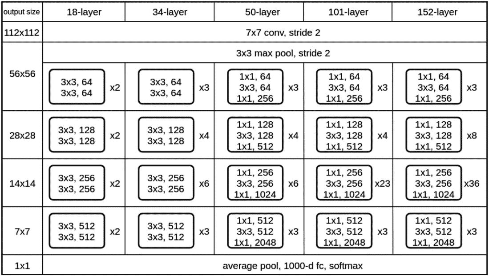

# 第四章：使用卷积网络进行计算机视觉

在*第二章*和*第三章*中，我们对**深度学习**（**DL**）和计算机视觉设定了很高的期望。首先，我们提到了 ImageNet 竞赛，然后讨论了它的一些令人兴奋的现实世界应用，例如半自动驾驶汽车。在本章及接下来的两章中，我们将实现这些期望。

视觉可以说是人类最重要的感官。我们几乎在进行的每一个动作中都依赖于它。但图像识别（并且在某些方面仍然是）长期以来一直是计算机科学中最困难的问题之一。历史上，很难向机器解释构成特定对象的特征，以及如何检测它们。但正如我们所见，在深度学习中，**神经网络**（**NN**）可以自己学习这些特征。

在本章中，我们将讨论以下主题：

+   **卷积神经网络**（**CNNs**）的直觉和理论依据

+   卷积层

+   池化层

+   卷积网络的结构

+   使用 PyTorch 和 Keras 对图像进行分类

+   卷积的高级类型

+   高级 CNN 模型

# 技术要求

我们将在本章中使用 Python、PyTorch 和 Keras 来实现这个示例。如果你还没有设置这些工具的环境，不必担心——这个示例已经作为 Jupyter Notebook 在 Google Colab 上提供。你可以在本书的 GitHub 仓库中找到代码示例：[`github.com/PacktPublishing/Python-Deep-Learning-Third-Edition/tree/main/Chapter04`](https://github.com/PacktPublishing/Python-Deep-Learning-Third-Edition/tree/main/Chapter04)。

# CNN 的直觉和理论依据

我们从感官输入中提取的信息通常取决于它们的上下文。对于图像，我们可以假设相邻的像素是密切相关的，当将它们作为一个整体来看时，它们的集合信息更为重要。相反，我们可以假设单独的像素并不传递相互之间相关的信息。例如，在识别字母或数字时，我们需要分析相邻像素之间的依赖关系，因为它们决定了元素的形状。通过这种方式，我们能够区分，例如，0 和 1 之间的区别。图像中的像素被组织成二维网格，如果图像不是灰度图，我们还会有一个用于颜色通道的第三维度。

另外，**磁共振成像**（**MRI**）也使用三维空间。你可能还记得，直到现在，如果我们想要将图像输入到神经网络中，我们必须将它从二维数组转换为一维数组。卷积神经网络就是为了解决这个问题而构建的：如何使得来自更近单元的信息比来自更远单元的信息更相关。在视觉问题中，这意味着让单元处理来自彼此接近的像素的信息。通过 CNNs，我们将能够输入一维、二维或三维数据，网络也将输出相同维度的数据。正如我们稍后会看到的，这将为我们带来几个优势。

你可能还记得，在上一章的结尾，我们成功地对 MNIST 图像进行了分类（准确率约为 98%），使用的神经网络包括了`飞机`、`汽车`、`鸟`、`猫`、`鹿`、`狗`、`青蛙`、`马`、`船`和`卡车`。如果我们尝试使用一个具有一个或多个隐藏层的全连接神经网络（FC NN）来对 CIFAR-10 进行分类，其验证准确率大概会只有 50%左右（相信我，我们在本书的上一版中确实这么做过）。与接近 98% 准确率的 MNIST 结果相比，这是一个显著的差异，即使 CIFAR-10 也是一个简单的玩具问题。因此，全连接神经网络对于计算机视觉问题的实际应用价值较小。为了理解原因，我们来分析一下我们假设中的 CIFAR-10 网络的第一个隐藏层，该层有 1,000 个单元。图像的输入大小是

32 * 32 * 3 = 3,072。因此，第一个隐藏层总共有 2,072 * 1,000 = 2,072,000 个权重。这可不是一个小数字！不仅如此，这么大的网络容易过拟合，而且在内存上也效率低下。

更为重要的是，每个输入单元（或像素）都与隐藏层中的每个单元相连。正因如此，网络无法利用像素的空间接近性，因为它无法知道哪些像素是彼此接近的。相比之下，卷积神经网络（CNNs）具有一些特性，能够有效地解决这些问题：

+   它们仅连接与图像相邻像素对应的单元。通过这种方式，这些单元被“迫使”只从空间上接近的其他单元那里获取输入。这样也减少了权重的数量，因为并非所有单元都是互相连接的。

+   卷积神经网络（CNNs）使用参数共享。换句话说，层中的所有单元共享有限数量的权重。这进一步减少了权重的数量，并有助于防止过拟合。虽然这可能听起来有些混乱，但在下一节中会变得更加清晰。

注意

在本章中，我们将在计算机视觉的背景下讨论 CNN，因为计算机视觉是其最常见的应用。然而，CNN 也成功应用于语音识别和**自然语言处理**（**NLP**）等领域。我们在此描述的许多解释同样适用于这些领域——即，无论应用领域如何，CNN 的原理都是相同的。

为了理解 CNN，我们首先讨论它们的基本构建块。一旦完成这部分，我们将展示如何将它们组装成一个完整的神经网络。接着，我们将展示该网络足够好，能够以高精度分类 CIFAR-10。最后，我们将讨论高级 CNN 模型，这些模型可以应用于实际的计算机视觉任务。

# 卷积层

卷积层是卷积神经网络（CNN）最重要的组成部分。它由一组**滤波器**（也称为**内核**或**特征检测器**）组成，每个滤波器都应用于输入数据的所有区域。滤波器由一组**可学习的权重**定义。

为了给这个简洁的定义增加一些意义，我们将从以下图开始：


图 4.1 – 卷积操作开始

上图展示了 CNN 的二维输入层。为了简化说明，我们假设这是输入层，但它也可以是网络的任何一层。我们还假设输入是一个灰度图像，每个输入单元代表一个像素的颜色强度。这个图像由一个二维张量表示。

我们将通过在图像的左上角应用一个 3×3 权重滤波器（同样是一个二维张量）来开始卷积操作。每个输入单元与滤波器的一个权重相关联。因为有九个输入单元，所以权重有九个，但一般来说，大小是任意的（例如 2×2、4×4、5×5，等等）。卷积操作被定义为以下加权和：

![<mml:math xmlns:mml="http://www.w3.org/1998/Math/MathML" xmlns:m="http://schemas.openxmlformats.org/officeDocument/2006/math" display="block"><mml:msub><mml:mrow><mml:mi>y</mml:mi></mml:mrow><mml:mrow><mml:mi>r</mml:mi><mml:mi>o</mml:mi><mml:mi>w</mml:mi><mml:mo>,</mml:mo><mml:mi>c</mml:mi><mml:mi>o</mml:mi><mml:mi>l</mml:mi></mml:mrow></mml:msub><mml:mo>=</mml:mo><mml:mrow><mml:munderover><mml:mo stretchy="false">∑</mml:mo><mml:mrow><mml:mi>i</mml:mi><mml:mo>=</mml:mo><mml:mn>1</mml:mn></mml:mrow><mml:mrow><mml:msub><mml:mrow><mml:mi>F</mml:mi></mml:mrow><mml:mrow><mml:mi>h</mml:mi></mml:mrow></mml:msub></mml:mrow></mml:munderover><mml:mrow><mml:mrow><mml:munderover><mml:mo stretchy="false">∑</mml:mo><mml:mrow><mml:mi>j</mml:mi><mml:mo>=</mml:mo><mml:mn>1</mml:mn></mml:mrow><mml:mrow><mml:msub><mml:mrow><mml:mi>F</mml:mi></mml:mrow><mml:mrow><mml:mi>w</mml:mi></mml:mrow></mml:msub></mml:mrow></mml:munderover><mml:mrow><mml:msub><mml:mrow><mml:mi>x</mml:mi></mml:mrow><mml:mrow><mml:mi>r</mml:mi><mml:mi>o</mml:mi><mml:mi>w</mml:mi><mml:mo>+</mml:mo><mml:mi>i</mml:mi><mml:mo>-</mml:mo><mml:mn>1</mml:mn><mml:mo>,</mml:mo><mml:mi>c</mml:mi><mml:mi>o</mml:mi><mml:mi>l</mml:mi><mml:mo>+</mml:mo><mml:mi>j</mml:mi><mml:mo>-</mml:mo><mml:mn>1</mml:mn></mml:mrow></mml:msub></mml:mrow></mml:mrow></mml:mrow></mml:mrow><mml:mo>×</mml:mo><mml:msub><mml:mrow><mml:mi>w</mml:mi></mml:mrow><mml:mrow><mml:mi>i</mml:mi><mml:mo>,</mml:mo><mml:mi>j</mml:mi></mml:mrow></mml:msub><mml:mo>+</mml:mo><mml:mi>b</mml:mi></mml:math>](img/289.png)

这里，*row* 和 *col* 表示输入层的位置，在此处应用滤波器（*row=1* 和 *col=1* 在前述图中）；  和  是滤波器大小（3×3）的高度和宽度； `i` 和 `j` 是每个滤波器权重的索引，； `b` 是偏置权重。参与输入的单元组，，参与输入的单元组称为**感受野**。

我们可以看到，在卷积层中，单元的激活值与我们在*第二章*中定义的单元激活值的计算方式相同——即输入的加权和。但在这里，单元的输入仅来自其周围有限数量的输入单元（感受野）。这与全连接（FC）层不同，在全连接层中，输入来自所有输入单元。这个区别很重要，因为滤波器的目的是突出输入中的某个特定特征，比如图像中的边缘或线条。在神经网络的上下文中，滤波器的输出代表下一层单元的激活值。如果该特征在此空间位置存在，单元将处于激活状态。在层次结构的数据中，如图像，邻近像素会形成有意义的形状和物体，如边缘或线条。然而，图像一端的像素与另一端的像素不太可能存在关系。因此，使用全连接层将所有输入像素与每个输出单元连接，就像让网络在大海捞针。它无法知道某个输入像素是否与输出单元相关（是否位于周围区域），还是与图像另一端的像素无关。因此，卷积层有限的感受野更适合突出输入数据中的有意义特征。

我们已经计算了一个单元的激活值，但其他单元呢？很简单！对于每个新单元，我们会将滤波器滑动到输入图像上，并计算其输出（加权和），每次使用一组新的输入单元。下图展示了如何计算接下来两个位置的激活值（右移一个像素）：


图 4.2 – 卷积操作的前三个步骤

所谓“滑动”，是指滤波器的权重在整个图像上保持不变。实际上，我们会使用相同的九个滤波器权重和一个偏置权重来计算所有输出单元的激活值，每次使用不同的输入单元集。我们称之为**参数共享**，并且这样做有两个原因：

+   通过减少权重的数量，我们减少了内存占用并防止了过拟合。

+   滤波器突出了图像中的特定视觉特征。我们可以假设该特征是有用的，无论它在图像中的位置如何。由于我们在整个图像中应用相同的滤波器，因此卷积具有平移不变性；也就是说，它可以检测到相同的特征，无论该特征在图像中的位置如何。然而，卷积既不是旋转不变的（如果特征被旋转，它不一定能检测到该特征），也不是尺度不变的（它不能保证在不同的尺度下检测到相同的特征）。

为了计算所有输出激活值，我们将重复滑动过程，直到覆盖整个输入。空间排列的输入和输出单元被称为**深度切片**（**特征图**或**通道**），意味着不仅仅有一个切片。切片和图像一样，是由张量表示的。切片张量可以作为网络中其他层的输入。最后，就像常规层一样，我们可以在每个单元后使用激活函数，如**修正线性单元**（**ReLU**）。

注意

有趣的是，每个输入单元都是多个输出单元的输入。例如，当我们滑动滤波器时，上图中的绿色单元将作为九个输出单元的输入。

我们可以用一个简单的例子来说明迄今为止所学的内容。以下图示说明了如何对单个 3×3 切片应用 2×2 滤波器进行 2D 卷积：


图 4.3 – 使用 2×2 滤波器对单个 3×3 切片进行 2D 卷积，以获得 2×2 输出切片

这个例子还向我们展示了输入和输出特征图的尺寸是不同的。假设我们有一个大小为`(width_i, height_i)`的输入层和一个尺寸为`(filter_w, filter_h)`的滤波器。应用卷积后，输出层的尺寸为`width_o = width_i - filter_w + 1`和`height_o = height_i - filter_h + 1`。

在这个例子中，我们有`width_o = height_o = 3 – 2 + 1 =` `2`。

在接下来的部分，我们将通过一个简单的编码示例来说明卷积操作。

## 卷积操作的代码示例

我们现在已经描述了卷积层是如何工作的，但通过一个可视化的例子，我们会更好地理解。让我们通过对图像应用几个滤波器来实现卷积操作。为了清晰起见，我们将手动实现滤波器在图像上的滑动，且不使用任何深度学习库。我们只会包括相关部分，而不是完整程序，但你可以在本书的 GitHub 仓库中找到完整示例。让我们开始：

1.  导入`numpy`：

    ```py
    import numpy as np
    ```

1.  定义`conv`函数，它对图像应用卷积。`conv`接受两个参数，都是二维 numpy 数组：`image`表示灰度图像本身的像素强度，`im_filter`表示硬编码的滤波器：

    1.  首先，我们将计算输出图像的大小，它取决于输入`image`和`im_filter`的大小。我们将利用它来实例化输出图像`im_c`。

    1.  然后，我们将对`image`的所有像素进行迭代，在每个位置应用`im_filter`。此操作需要四个嵌套循环：前两个循环处理`image`的维度，后两个循环用于迭代二维滤波器。

    1.  我们将检查是否有任何值超出[0, 255]的区间，并在必要时进行修正。

    如下例所示：

    ```py
    def conv(image, im_filter):
        # input dimensions
        height = image.shape[0]
        width = image.shape[1]
        # output image with reduced dimensions
        im_c = np.zeros((height - len(im_filter) + 1,
            width - len(im_filter) + 1))
        # iterate over all rows and columns
        for row in range(len(im_c)):
            for col in range(len(im_c[0])):
                # apply the filter
                for i in range(len(im_filter)):
                    for j in range(len(im_filter[0])):
                        im_c[row, col] += image[row + i, /
                            col + j] * im_filter[i][j]
        # fix out-of-bounds values
        im_c[im_c > 255] = 255
        im_c[im_c < 0] = 0
        return im_c
    ```

1.  在图像上应用不同的滤波器。为了更好地说明我们的观点，我们将使用一个 10×10 的模糊滤波器，以及 Sobel 边缘检测器，如下例所示（`image_grayscale`是一个二维的`numpy`数组，表示灰度图像的像素强度）：

    ```py
    # blur filter
    blur = np.full([10, 10], 1\. / 100)
    conv(image_grayscale, blur)
    # sobel filters
    sobel_x = [[-1, -2, -1],
               [0, 0, 0],
               [1, 2, 1]]
    conv(image_grayscale, sobel_x)
    sobel_y = [[-1, 0, 1],
               [-2, 0, 2],
               [-1, 0, 1]]
    conv(image_grayscale, sobel_y)
    ```

    完整程序将产生以下输出：


图 4.4 – 第一张图是灰度输入图像。第二张图是 10×10 模糊滤波器的结果。第三和第四张图使用了检测器和垂直 Sobel 边缘检测器

在这个例子中，我们使用了带有硬编码权重的滤波器来可视化卷积操作是如何在神经网络中工作的。实际上，滤波器的权重将在网络训练过程中设置。我们只需要定义网络架构，比如卷积层的数量、输出体积的深度以及滤波器的大小。网络将在训练过程中自动确定每个滤波器突出显示的特征。

注意

正如我们在这个例子中看到的，我们需要实现四个嵌套循环来实现卷积。然而，通过一些巧妙的转换，卷积操作可以通过矩阵乘法实现。这样，它可以充分利用 GPU 并行计算。

在接下来的几节中，我们将讨论卷积层的一些细节。

## 跨通道和深度卷积

到目前为止，我们已经描述了一个一对一的切片关系，其中我们在单个输入切片上应用单个滤波器，产生单个输出切片。但这种安排有以下局限性：

+   单个输入切片适用于灰度图像，但对于具有多个通道的彩色图像或任何其他多维输入则不起作用

+   单个滤波器可以检测切片中的单个特征，但我们希望检测多个不同的特征

如何解决这些局限性呢？很简单：

+   对于输入，我们将图像分割成颜色通道。对于 RGB 图像来说，这将是三个通道。我们可以将每个颜色通道看作一个深度切片，其中的值是给定颜色（R、G 或 B）的像素强度，如下例所示：


图 4.5 – 一个深度为 3 的输入切片示例

输入切片的组合被称为**输入体积**，深度为 3。RGB 图像由三层 2D 切片（每个颜色通道一个）组成的 3D 张量表示。

+   CNN 卷积可以拥有多个滤波器，突出显示不同的特征，从而产生多个输出特征图（每个滤波器一个），这些特征图被合并成一个**输出体积**。

假设我们有输入（大写的`C`）和输出切片。根据输入和输出切片的关系，我们可以得到跨通道卷积和深度卷积，如下图所示：


图 4.6 – 跨通道卷积（左）；深度卷积（右）

让我们讨论它们的性质：

+   **跨通道卷积**：一个输出切片接收所有输入切片的输入 ( 关系)。有了多个输出切片，关系变为 。换句话说，每个输入切片都为每个输出切片的输出做出贡献。每一对输入/输出切片使用一个独立的过滤器切片，这个过滤器切片对该对切片是独有的。我们用 （小写 `c`）表示输入切片的索引；用  表示输出切片的索引；用  和  表示过滤器的维度。然后，单个输出切片中一个输出单元的跨通道二维卷积定义为以下加权和：

![<mml:math xmlns:mml="http://www.w3.org/1998/Math/MathML" xmlns:m="http://schemas.openxmlformats.org/officeDocument/2006/math" display="block"><mml:msub><mml:mrow><mml:mi>y</mml:mi></mml:mrow><mml:mrow><mml:msub><mml:mrow><mml:mi>c</mml:mi></mml:mrow><mml:mrow><mml:mi>o</mml:mi><mml:mi>u</mml:mi><mml:mi>t</mml:mi></mml:mrow></mml:msub><mml:mo>,</mml:mo><mml:mi>r</mml:mi><mml:mi>o</mml:mi><mml:mi>w</mml:mi><mml:mo>,</mml:mo><mml:mi>c</mml:mi><mml:mi>o</mml:mi><mml:mi>l</mml:mi></mml:mrow></mml:msub><mml:mo>=</mml:mo><mml:mrow><mml:munderover><mml:mo stretchy="false">∑</mml:mo><mml:mrow><mml:msub><mml:mrow><mml:mi>c</mml:mi></mml:mrow><mml:mrow><mml:mi>i</mml:mi><mml:mi>n</mml:mi></mml:mrow></mml:msub><mml:mo>=</mml:mo><mml:mn>1</mml:mn></mml:mrow><mml:mrow><mml:msub><mml:mrow><mml:mi>C</mml:mi></mml:mrow><mml:mrow><mml:mi>i</mml:mi><mml:mi>n</mml:mi></mml:mrow></mml:msub></mml:mrow></mml:munderover><mml:mrow><mml:mrow><mml:munderover><mml:mo stretchy="false">∑</mml:mo><mml:mrow><mml:mi>i</mml:mi><mml:mo>=</mml:mo><mml:mn>1</mml:mn></mml:mrow><mml:mrow><mml:msub><mml:mrow><mml:mi>F</mml:mi></mml:mrow><mml:mrow><mml:mi>h</mml:mi></mml:mrow></mml:msub></mml:mrow></mml:munderover><mml:mrow><mml:mrow><mml:munderover><mml:mo stretchy="false">∑</mml:mo><mml:mrow><mml:mi>j</mml:mi><mml:mo>=</mml:mo><mml:mn>1</mml:mn></mml:mrow><mml:mrow><mml:msub><mml:mrow><mml:mi>F</mml:mi></mml:mrow><mml:mrow><mml:mi>w</mml:mi></mml:mrow></mml:msub></mml:mrow></mml:munderover><mml:mrow><mml:msub><mml:mrow><mml:mi>x</mml:mi></mml:mrow><mml:mrow><mml:msub><mml:mrow><mml:mi>c</mml:mi></mml:mrow><mml:mrow><mml:mi>i</mml:mi><mml:mi>n</mml:mi></mml:mrow></mml:msub><mml:mo>,</mml:mo><mml:mi>r</mml:mi><mml:mi>o</mml:mi><mml:mi>w</mml:mi><mml:mo>+</mml:mo><mml:mi>i</mml:mi><mml:mo>-</mml:mo><mml:mn>1</mml:mn><mml:mo>,</mml:mo><mml:mi>c</mml:mi><mml:mi>o</mml:mi><mml:mi>l</mml:mi><mml:mo>+</mml:mo><mml:mi>j</mml:mi><mml:mo>-</mml:mo><mml:mn>1</mml:mn></mml:mrow></mml:msub></mml:mrow></mml:mrow></mml:mrow></mml:mrow></mml:mrow></mml:mrow><mml:mo>×</mml:mo><mml:msub><mml:mrow><mml:mi>w</mml:mi></mml:mrow><mml:mrow><mml:msub><mml:mrow><mml:mi>c</mml:mi></mml:mrow><mml:mrow><mml:mi>i</mml:mi><mml:mi>n</mml:mi></mml:mrow></mml:msub><mml:mo>,</mml:mo><mml:msub><mml:mrow><mml:mi>c</mml:mi></mml:mrow><mml:mrow><mml:mi>o</mml:mi><mml:mi>u</mml:mi><mml:mi>t</mml:mi></mml:mrow></mml:msub><mml:mo>,</mml:mo><mml:mi>i</mml:mi><mml:mo>,</mml:mo><mml:mi>j</mml:mi></mml:mrow></mml:msub><mml:mo>+</mml:mo><mml:msub><mml:mrow><mml:mi>b</mml:mi></mml:mrow><mml:mrow><mml:msub><mml:mrow><mml:mi>c</mml:mi></mml:mrow><mml:mrow><mml:mi>o</mml:mi><mml:mi>u</mml:mi><mml:mi>t</mml:mi></mml:mrow></mml:msub></mml:mrow></mml:msub></mml:math>](img/302.png)

请注意，我们有一个独特的偏置， 每个输出切片都有一个。

我们还可以通过以下公式计算交叉通道 2D 卷积中的权重总数 `W`：

![<mml:math xmlns:mml="http://www.w3.org/1998/Math/MathML" xmlns:m="http://schemas.openxmlformats.org/officeDocument/2006/math" display="block"><mml:mi>W</mml:mi><mml:mo>=</mml:mo><mml:mfenced separators="|"><mml:mrow><mml:msub><mml:mrow><mml:mi>C</mml:mi></mml:mrow><mml:mrow><mml:mi>i</mml:mi><mml:mi>n</mml:mi></mml:mrow></mml:msub><mml:mo>×</mml:mo><mml:msub><mml:mrow><mml:mi>F</mml:mi></mml:mrow><mml:mrow><mml:mi>h</mml:mi></mml:mrow></mml:msub><mml:mo>×</mml:mo><mml:msub><mml:mrow><mml:mi>F</mml:mi></mml:mrow><mml:mrow><mml:mi>w</mml:mi></mml:mrow></mml:msub><mml:mo>+</mml:mo><mml:mn>1</mml:mn></mml:mrow></mml:mfenced><mml:mo>×</mml:mo><mml:msub><mml:mrow><mml:mi>C</mml:mi></mml:mrow><mml:mrow><mml:mi>o</mml:mi><mml:mi>u</mml:mi><mml:mi>t</mml:mi></mml:mrow></mml:msub></mml:math>](img/304.png)

这里，*+1* 表示每个滤波器的偏置权重。假设我们有三个输入切片，并且想要应用四个 5×5 的滤波器。如果这样做，卷积滤波器将有总共 (3 * 5 * 5 + 1) * 4 = 304 个权重，四个输出切片（深度为 4 的输出体积），每个切片有一个偏置。每个输出切片的滤波器将有三个 5×5 的滤波器块，分别对应三个输入切片，并且有一个偏置，总共有 3 * 5 * 5 + 1 = 76 个权重。

+   **深度卷积**：一个输出切片仅接收来自单个输入切片的信息。这是对前述情况的某种反转。在最简单的形式下，我们对单个输入切片应用滤波器，生成一个输出切片。在这种情况下，输入和输出的体积具有相同的深度——即 `C`。我们还可以指定一个通道倍增器（一个整数 `M`），即对单个输出切片应用 `M` 个滤波器，生成每个输入切片的 `M` 个输出切片。在这种情况下，输出切片的总数为 。深度卷积 2D 被定义为以下加权和：

![<mml:math xmlns:mml="http://www.w3.org/1998/Math/MathML" xmlns:m="http://schemas.openxmlformats.org/officeDocument/2006/math" display="block"><mml:msub><mml:mrow><mml:mi>y</mml:mi></mml:mrow><mml:mrow><mml:mi>c</mml:mi><mml:mo>,</mml:mo><mml:mi>m</mml:mi><mml:mo>,</mml:mo><mml:mi>r</mml:mi><mml:mi>o</mml:mi><mml:mi>w</mml:mi><mml:mo>,</mml:mo><mml:mi>c</mml:mi><mml:mi>o</mml:mi><mml:mi>l</mml:mi></mml:mrow></mml:msub><mml:mo>=</mml:mo><mml:mrow><mml:munderover><mml:mo stretchy="false">∑</mml:mo><mml:mrow><mml:mi>m</mml:mi><mml:mo>=</mml:mo><mml:mn>1</mml:mn></mml:mrow><mml:mrow><mml:mi>M</mml:mi></mml:mrow></mml:munderover><mml:mrow><mml:mrow><mml:munderover><mml:mo stretchy="false">∑</mml:mo><mml:mrow><mml:mi>i</mml:mi><mml:mo>=</mml:mo><mml:mn>1</mml:mn></mml:mrow><mml:mrow><mml:msub><mml:mrow><mml:mi>F</mml:mi></mml:mrow><mml:mrow><mml:mi>h</mml:mi></mml:mrow></mml:msub></mml:mrow></mml:munderover><mml:mrow><mml:mrow><mml:munderover><mml:mo stretchy="false">∑</mml:mo><mml:mrow><mml:mi>j</mml:mi><mml:mo>=</mml:mo><mml:mn>1</mml:mn></mml:mrow><mml:mrow><mml:msub><mml:mrow><mml:mi>F</mml:mi></mml:mrow><mml:mrow><mml:mi>w</mml:mi></mml:mrow></mml:msub></mml:mrow></mml:munderover><mml:mrow><mml:msub><mml:mrow><mml:mi>x</mml:mi></mml:mrow><mml:mrow><mml:mi>c</mml:mi><mml:mo>,</mml:mo><mml:mi>r</mml:mi><mml:mi>o</mml:mi><mml:mi>w</mml:mi><mml:mo>+</mml:mo><mml:mi>i</mml:mi><mml:mo>-</mml:mo><mml:mn>1</mml:mn><mml:mo>,</mml:mo><mml:mi>c</mml:mi><mml:mi>o</mml:mi><mml:mi>l</mml:mi><mml:mo>+</mml:mo><mml:mi>j</mml:mi><mml:mo>-</mml:mo><mml:mn>1</mml:mn></mml:mrow></mml:msub></mml:mrow></mml:mrow></mml:mrow></mml:mrow></mml:mrow></mml:mrow><mml:mo>×</mml:mo><mml:msub><mml:mrow><mml:mi>w</mml:mi></mml:mrow><mml:mrow><mml:mi>c</mml:mi><mml:mo>,</mml:mo><mml:mi>m</mml:mi><mml:mo>,</mml:mo><mml:mi>i</mml:mi><mml:mo>,</mml:mo><mml:mi>j</mml:mi></mml:mrow></mml:msub><mml:mo>+</mml:mo><mml:msub><mml:mrow><mml:mi>b</mml:mi></mml:mrow><mml:mrow><mml:mi>c</mml:mi><mml:mo>,</mml:mo><mml:mi>m</mml:mi></mml:mrow></mml:msub></mml:math>](img/306.png)

我们可以通过以下公式计算二维深度卷积中的权重`W`：

![<mml:math xmlns:mml="http://www.w3.org/1998/Math/MathML" xmlns:m="http://schemas.openxmlformats.org/officeDocument/2006/math" display="block"><mml:mi>W</mml:mi><mml:mo>=</mml:mo><mml:mi>C</mml:mi><mml:mo>×</mml:mo><mml:mfenced separators="|"><mml:mrow><mml:mi>M</mml:mi><mml:mo>×</mml:mo><mml:msub><mml:mrow><mml:mi>F</mml:mi></mml:mrow><mml:mrow><mml:mi>h</mml:mi></mml:mrow></mml:msub><mml:mo>×</mml:mo><mml:msub><mml:mrow><mml:mi>F</mml:mi></mml:mrow><mml:mrow><mml:mi>w</mml:mi></mml:mrow></mml:msub><mml:mo>+</mml:mo><mml:mi>M</mml:mi></mml:mrow></mml:mfenced></mml:math>](img/307.png)

这里，*+M* 代表每个输出片的偏置。

接下来，我们将讨论卷积操作的一些更多属性。

## 卷积层中的步幅和填充

到目前为止，我们假设滤波器每次滑动一个像素，但并非总是如此。我们可以让滤波器滑动多个位置。卷积层的这个参数叫做**步幅**。通常，步幅在输入的所有维度上是相同的。在下图中，我们可以看到一个*步幅 = 2*的卷积层（也叫做**步幅卷积**）：


图 4.7 – *步幅 = 2* 时，滤波器每次移动两个像素

更大步幅的主要效果是增加输出单元的感受野，代价是输出切片的大小本身会变小。为了理解这一点，我们回顾一下在上一节中，我们介绍了一个输出大小的简单公式，其中包括输入和卷积核的大小。现在，我们将它扩展到包括步幅：`width_o = (width_i - filter_w) / stride_w + 1` 和 `height_o = 1 + (height_i - filter_h) / stride_h`。例如，一个由 28×28 的输入图像生成的方形切片，与一个 3×3 的滤波器进行卷积，且*步幅 = 1*，输出大小为 1 + 28 - 3 = 26。 但是如果*步幅 = 2*，则为 1 + (28 - 3) / 2 = 13。因此，如果我们使用*步幅 = 2*，输出切片的大小大约是输入的四分之一。换句话说，一个输出单元将“覆盖”一个面积，比输入单元大四倍。接下来层的单元将逐渐捕捉来自输入图像更大区域的输入信息。这一点非常重要，因为它将允许它们检测输入图像中更大、更复杂的特征。

到目前为止，我们讨论的卷积操作产生的输出小于输入（即使*步幅 = 1*）。但是，在实践中，通常希望控制输出的大小。我们可以通过**填充**输入切片的边缘，用零的行和列进行填充，来解决这个问题。在以下图示中，我们可以看到一个填充大小为 1 且*步幅 = 1*的卷积层：


图 4.8 – 填充大小为 1 的卷积层

白色单元表示填充。输入和输出切片的维度相同（深色单元）。新填充的零将在卷积操作中与切片一起参与，但它们不会影响结果。原因是，即使填充区域与权重连接到下一层，我们始终会将这些权重乘以填充值，而填充值为 0。同时，滑动滤波器经过填充的输入切片时，会产生与未填充输入相同维度的输出切片。

现在我们已经了解了步幅和填充的概念，我们可以引入输出切片大小的完整公式：

```py
height_o = 1 + (height_i + 2*padding_h – filter_h) / stride
width_o = 1 + (width_i + 2*padding_w – filter_w) / stride
```

我们现在已经对卷积有了基本的了解，可以继续学习卷积神经网络（CNN）的下一个基本组成部分——池化层。一旦我们了解了池化层的原理，我们将介绍第一个完整的 CNN，并通过实现一个简单的任务来巩固我们的知识。接着，我们将聚焦于更高级的 CNN 话题。

# 池化层

在上一节中，我们解释了如何通过使用*步长 > 1*来增大单元的感受野。但我们也可以借助池化层来实现这一点。池化层将输入切片分割成一个网格，每个网格单元代表多个单元的感受野（就像卷积层一样）。然后，在网格的每个单元上应用池化操作。池化层不会改变卷积深度，因为池化操作是独立地在每个切片上进行的。池化层由两个参数定义：步长和感受野大小，就像卷积层一样（池化层通常不使用填充）。

在本节中，我们将讨论三种类型的池化层——最大池化、平均池化和**全局平均池化**（**GAP**）。这三种池化类型在下图中有所展示：


图 4.9 – 最大池化、平均池化和全局平均池化

**最大池化**是最常见的池化方法。最大池化操作会选择每个局部感受野（网格单元）中激活值最高的单元，并仅将该值传递给下一层。在上面的图示（左图）中，我们可以看到一个 2×2 感受野和*步长 = 2*的最大池化示例。该操作丢弃了输入单元的 3/4。池化层没有权重。在最大池化的反向传播过程中，梯度只会传递给前向传播时激活值最高的单元。其他单元的梯度为零。

**平均池化**是另一种池化方式，其中每个感受野的输出是该区域内所有激活值的均值。在上面的图示（中图）中，我们可以看到一个 2×2 感受野和*步长 = 2*的平均池化示例。

GAP 与平均池化相似，但一个池化区域覆盖整个输入切片。我们可以将 GAP 视为一种极端的降维方法，因为它输出一个代表整个切片均值的单一值。这种池化方式通常应用于 CNN 的卷积部分结束时。在上面的图示（右图）中，我们可以看到 GAP 操作的示例。步长和感受野大小不适用于 GAP 操作。

在实际应用中，通常只有两种步长和感受野大小的组合被使用。第一种是 2×2 的感受野，*步长 = 2*，第二种是 3×3 的感受野，*步长 = 2*（重叠）。如果我们为任一参数使用较大的值，网络将丧失过多的信息。或者，如果步长为 1，层的大小不会变小，感受野也不会增大。

基于这些参数，我们可以计算池化层的输出大小：

```py
height_o = 1 + (height_i – filter_h) / stride
width_o = 1 + (width_i – filter_w) / stride
```

池化层仍然被广泛使用，但通常，我们可以通过简单地使用步长较大的卷积层来实现相似甚至更好的结果。（例如，参见 *J. Springerberg, A. Dosovitskiy, T. Brox, 和 M. Riedmiller, Striving for Simplicity: The All Convolutional Net, (**2015)*, [`arxiv.org/abs/1412.6806`](https://arxiv.org/abs/1412.6806).）

我们现在有足够的知识来介绍我们的第一个完整的 CNN。

# 卷积网络的结构

下图展示了一个基本分类 CNN 的结构：


图 4.10 – 一个基本的卷积网络，包含卷积层、全连接层和池化层

大多数 CNN 共享一些基本特性。以下是其中的一些：

+   我们通常会将一个或多个卷积层与一个池化层（或步长卷积）交替使用。通过这种方式，卷积层可以在每个感受野的层级上检测特征。更深层的感受野的聚合大小大于网络开始时的感受野，这使得它们能够从更大的输入区域中捕捉到更复杂的特征。我们通过一个例子来说明这一点。假设网络使用 3×3 的卷积，*步长 = 1*，以及 2×2 的池化，*步长 = 2*：

    +   第一卷积层的单元将接收来自图像的 3×3 像素输入。

    +   第一层的 2×2 输出单元组的合并感受野大小为 4×4（由于步长的原因）。

    +   在第一次池化操作后，这些组将合并成池化层的一个单元。

    +   第二次卷积操作将从 3×3 的池化单元接收输入。因此，它将接收来自一个边长为 3×4 = 12（或总共 12×12 = 144）像素的方形区域的输入图像。

+   我们使用卷积层从输入中提取特征。最深层检测到的特征非常抽象，但它们也不适合人类阅读。为了解决这个问题，我们通常会在最后一个卷积/池化层后添加一个或多个全连接层。在这个例子中，最后一个全连接层（输出层）将使用 softmax 来估算输入的类别概率。你可以把全连接层看作是网络语言（我们无法理解）和我们语言之间的翻译器。

+   与初始卷积层相比，较深的卷积层通常具有更多的滤波器（因此卷积深度更大）。网络开始时的特征检测器在较小的感受野上工作。它只能检测到有限数量的特征，例如在所有类别中共享的边缘或线条。另一方面，较深的层则能够检测到更复杂和更多的特征。例如，如果我们有多个类别，如汽车、树木或人物，每个类别都会有一组独特的特征，如轮胎、车门、树叶和面孔等。这就需要更多的特征检测器。

现在我们已经了解了 CNN 的结构，接下来让我们用 PyTorch 和 Keras 实现一个 CNN。

# 使用 PyTorch 和 Keras 分类图像

在本节中，我们将尝试用 PyTorch 和 Keras 分类 CIFAR-10 数据集的图像。它由 60,000 张 32x32 的 RGB 图像组成，分为 10 个类别的物体。为了理解这些示例，我们将首先关注到目前为止我们还没有覆盖的两个前提条件：图像在深度学习库中的表示方式和数据增强训练技术。

## 深度学习库中的卷积层

PyTorch、Keras 和 **TensorFlow**（**TF**）支持 1D、2D 和 3D 卷积。卷积操作的输入和输出是张量。一个具有多个输入/输出切片的 1D 卷积将有 3D 的输入和输出张量。它们的轴可以是 *SCW* 或 *SWC* 顺序，我们有如下定义：

+   `S`：小批量中的样本索引

+   `C`：深度切片在体积中的索引

+   `W`：切片的内容

同样，一个 2D 卷积将由 *SCHW* 或 *SHWC* 顺序的张量表示，其中 `H` 和 `W` 分别是切片的高度和宽度。一个 3D 卷积将有 *SCDHW* 或 *SDHWC* 顺序，其中 `D` 代表切片的深度。

## 数据增强

最有效的正则化技术之一就是数据增强。如果训练数据太小，网络可能会开始过拟合。数据增强通过人工增加训练集的大小，帮助防止这种情况。在 CIFAR-10 示例中，我们将训练一个 CNN，并进行多轮训练。网络每轮都会“看到”数据集中的每个样本。为了防止这种情况，我们可以在将图像输入到 CNN 训练之前，先对它们进行随机增强，标签保持不变。以下是一些最常用的图像增强方法：

+   旋转

+   水平和垂直翻转

+   放大/缩小

+   裁剪

+   偏斜

+   对比度和亮度调整

加粗的增强方法将在以下示例中展示：


图 4.11 – 不同图像增强的示例

有了这些，我们可以继续进行示例了。

## 使用 PyTorch 分类图像

我们先从 PyTorch 开始：

1.  选择设备，最好是 GPU。这个神经网络比 MNIST 的网络要大，使用 CPU 训练会非常慢：

    ```py
    import torch
    from torchsummary import summary
    device = torch.device("cuda:0" if torch.cuda.is_available() else "cpu")
    ```

1.  加载训练数据集（然后是验证数据集）：

    ```py
    import torchvision.transforms as transforms
    from torchvision import datasets
    from torch.utils.data import DataLoader
    # Training dataset
    train_transform = transforms.Compose([
        transforms.RandomHorizontalFlip(),
        transforms.RandomVerticalFlip(),
        transforms.ToTensor(),
        transforms.Normalize(
            [0.485, 0.456, 0.406],
            [0.229, 0.224, 0.225])
    ])
    train_data = datasets.CIFAR10(
        root='data',
        train=True,
        download=True,
        transform=train_transform)
    batch_size = 50
    train_loader = DataLoader(
        dataset=train_data,
        batch_size=batch_size,
        shuffle=True,
        num_workers=2)
    ```

    `train_transform` 是特别重要的。它执行随机水平和垂直翻转，并使用 `transforms.Normalize` 通过 z-score 标准化来规范化数据集。这些硬编码的数值表示 CIFAR-10 数据集手动计算的逐通道均值和 `std` 值。`train_loader` 负责提供训练的小批量数据。

1.  加载验证数据集。请注意，我们使用训练数据集的均值和 `std` 值对验证集进行标准化：

    ```py
    validation_transform = transforms.Compose([
        transforms.ToTensor(),
        transforms.Normalize(
            [0.485, 0.456, 0.406],
            [0.229, 0.224, 0.225])
    ])
    validation_data = datasets.CIFAR10(
        root='data',
        train=False,
        download=True,
        transform=validation_transform)
    validation_loader = DataLoader(
        dataset=validation_data,
        batch_size=100,
        shuffle=True)
    ```

1.  使用 `Sequential` 类定义我们的 CNN。它具有以下特性：

    +   三个块，每个块由两个卷积层（3×3 滤波器）和一个最大池化层组成。

    +   每个卷积层后进行批量归一化。

    +   前两个块对卷积操作应用 `padding=1`，因此不会减少特征图的尺寸。

    +   `Linear`（全连接）层有 10 个输出（每个类别一个）。最终激活函数是 softmax。

    让我们看看定义：

    ```py
    from torch.nn import Sequential, Conv2d, BatchNorm2d, GELU, MaxPool2d, Dropout2d, Linear, Flatten
    model = Sequential(
        Conv2d(in_channels=3, out_channels=32,
            kernel_size=3, padding=1),
        BatchNorm2d(32),
        GELU(),
        Conv2d(in_channels=32, out_channels=32,
            kernel_size=3, padding=1),
        BatchNorm2d(32),
        GELU(),
        MaxPool2d(kernel_size=2, stride=2),
        Dropout2d(0.2),
        Conv2d(in_channels=32, out_channels=64,
            kernel_size=3, padding=1),
        BatchNorm2d(64),
        GELU(),
        Conv2d(in_channels=64, out_channels=64,
            kernel_size=3, padding=1),
        BatchNorm2d(64),
        GELU(),
        MaxPool2d(kernel_size=2, stride=2),
        Dropout2d(p=0.3),
        Conv2d(in_channels=64, out_channels=128,
            kernel_size=3),
        BatchNorm2d(128),
        GELU(),
        Conv2d(in_channels=128, out_channels=128,
            kernel_size=3),
        BatchNorm2d(128),
        GELU(),
        MaxPool2d(kernel_size=2, stride=2),
        Dropout2d(p=0.5),
        Flatten(),
        Linear(512, 10),
    )
    ```

1.  运行训练和验证。我们将使用与 *第三章* 中的 MNIST PyTorch 示例中实现的相同的 `train_model` 和 `test_model` 函数。因此，我们在此不会实现它们，但完整的源代码可以在本章的 GitHub 仓库中找到（包括 Jupyter Notebook）。我们可以期待以下结果：在 1 轮时准确率为 51%，在 5 轮时准确率为 70%，在 75 轮时准确率约为 82%。

这就是我们的 PyTorch 示例的结尾。

## 使用 Keras 进行图像分类

我们的第二个示例是相同的任务，但这次使用 Keras 实现：

1.  首先下载数据集。我们还将把数字标签转换为独热编码的张量：

    ```py
    import tensorflow as tf
    (X_train, Y_train), (X_validation, Y_validation) = \
        tf.keras.datasets.cifar10.load_data()
    Y_train = tf.keras.utils.to_categorical(Y_train, 10)
    Y_validation = \
        tf.keras.utils.to_categorical(Y_validation, 10)
    ```

1.  创建一个 `ImageDataGenerator` 实例，它对训练集图像的每个通道应用 z 标准化。在训练过程中，它还提供数据增强（随机水平和垂直翻转）。另外，请注意，我们将训练集的均值和标准差应用于测试集，以获得最佳性能：

    ```py
    from tensorflow.keras.preprocessing.image import ImageDataGenerator
    data_generator = ImageDataGenerator(
        featurewise_center=True,
        featurewise_std_normalization=True,
        horizontal_flip=True,
        vertical_flip=True)
    # Apply z-normalization on the training set
    data_generator.fit(X_train)
    # Standardize the validation set
    X_validation = \
        data_generator.standardize( \
        X_validation.astype('float32'))
    ```

1.  然后，我们可以使用 `Sequential` 类定义我们的 CNN。我们将使用在 *使用 PyTorch 进行图像分类* 部分中定义的相同架构。以下是该模型的 Keras 定义：

    ```py
    from tensorflow.keras.models import Sequential
    from tensorflow.keras.layers import Conv2D, Dense, MaxPooling2D, Dropout, BatchNormalization, Activation, Flatten
    model = Sequential(layers=[
        Conv2D(32, (3, 3),
            padding='same',
            input_shape=X_train.shape[1:]),
        BatchNormalization(),
        Activation('gelu'),
        Conv2D(32, (3, 3), padding='same'),
        BatchNormalization(),
        Activation('gelu'),
        MaxPooling2D(pool_size=(2, 2)),
        Dropout(0.2),
        Conv2D(64, (3, 3), padding='same'),
        BatchNormalization(),
        Activation('gelu'),
        Conv2D(64, (3, 3), padding='same'),
        BatchNormalization(),
        Activation('gelu'),
        MaxPooling2D(pool_size=(2, 2)),
        Dropout(0.3),
        Conv2D(128, (3, 3)),
        BatchNormalization(),
        Activation('gelu'),
        Conv2D(128, (3, 3)),
        BatchNormalization(),
        Activation('gelu'),
        MaxPooling2D(pool_size=(2, 2)),
        Dropout(0.5),
        Flatten(),
        Dense(10, activation='softmax')
    ])
    ```

1.  定义训练参数（我们还将打印模型总结以便于理解）：

    ```py
    model.compile(loss='categorical_crossentropy',
        optimizer='adam', metrics=['accuracy'])
    print(model.summary())
    ```

1.  运行 50 轮的训练：

    ```py
    batch_size = 50
    model.fit(
        x=data_generator.flow(x=X_train,
            y=Y_train,
            batch_size=batch_size),
        steps_per_epoch=len(X_train) // batch_size,
        epochs=100,
        verbose=1,
        validation_data=(X_validation, Y_validation),
        workers=4)
    ```

根据轮数的不同，这个模型将产生以下结果：在 1 轮时准确率为 50%，在 5 轮时准确率为 72%，在 45 轮时准确率约为 85%。我们的 Keras 示例与 PyTorch 示例相比，准确率略高，尽管它们应该是相同的。也许我们在某处有一个 bug。我们可能永远不会知道，但我们仍然能从中学到一课：机器学习模型并不容易调试，因为它们可能只是性能稍微下降，而不是完全报错。找到这种性能下降的确切原因可能很难。

既然我们已经实现了第一次完整的 CNN 两次，我们将重点讨论一些更高级的卷积类型。

# 高级卷积类型

到目前为止，我们讨论了“经典”卷积操作。在本节中，我们将介绍几种新的变体及其属性。

## 1D、2D 和 3D 卷积

在本章中，我们使用了**2D 卷积**，因为二维图像的计算机视觉是最常见的 CNN 应用。但我们也可以有 1D 和 3D 卷积，其中单位分别排列在一维或三维空间中。在所有情况下，滤波器的维度与输入的维度相同，并且权重在输入上是共享的。例如，我们会对时间序列数据使用 1D 卷积，因为这些值是沿单一时间轴排列的。在下图的左侧，我们可以看到一个 1D 卷积的示例：


图 4.12 – 1D 卷积（左）；3D 卷积（右）

相同虚线的权重共享相同的值。1D 卷积的输出也是 1D。如果输入是 3D，例如 3D MRI，我们可以使用 3D 卷积，它也会产生 3D 输出。这样，我们可以保持输入数据的空间排列。在上面的图示中，我们可以看到右侧的 3D 卷积示例。输入的维度是 H/W/L，滤波器在所有维度上有一个单一的大小，`F`。输出也是 3D。

## 1×1 卷积

1×1（点卷积）卷积是卷积的一种特殊情况，其中卷积滤波器的每个维度大小为 1（在 2D 卷积中是 1×1，在 3D 卷积中是 1×1×1）。起初，这看起来没有意义——一个 1×1 的滤波器并不会增加输出单元的感受野大小。这样的卷积结果只是逐点缩放。但它在另一个方面可能会有用——我们可以用它们来改变输入和输出体积之间的深度。为了理解这一点，让我们回顾一下，通常我们有一个深度为  的输入体积和  的滤波器，生成  输出体积的切片。每个输出切片都是通过对所有输入切片应用一个独特的滤波器来生成的。如果我们使用 1×1 滤波器且 ，我们会得到相同大小的输出切片，但深度不同。同时，输入和输出之间的感受野大小不会发生改变。最常见的用例是减少输出体积，或者 （降维），也被称为**“瓶颈层”**。

## 深度可分离卷积

在跨通道卷积中，一个输出切片从所有输入切片中接收输入，并使用一个滤波器。滤波器试图学习 3D 空间中的特征，其中两个维度是空间的（切片的高度和宽度），第三个维度是通道。因此，滤波器同时映射空间和跨通道的相关性。

**深度可分离卷积**（**DSC**，*Xception: 深度学习与深度可分离卷积*， [`arxiv.org/abs/1610.02357`](https://arxiv.org/abs/1610.02357)）可以完全解耦

跨通道和空间相关性。深度可分离卷积（DSC）结合了两种操作：深度卷积和 1×1 卷积。在深度卷积中，单个输入切片生成单个输出切片，因此它只映射空间相关性（而非跨通道相关性）。而在 1×1 卷积中，则恰好相反。以下图示表示 DSC：


图 4.13 – 一种深度可分离卷积

深度可分离卷积（DSC）通常在第一次（深度方向）操作后不加非线性处理。

注意

让我们比较标准卷积和深度可分离卷积。假设我们有 32 个输入和输出通道，滤波器大小为 3×3。在标准卷积中，一个输出切片是将每个 32 个输入切片应用一个滤波器的结果，总共是 32 * 3 * 3 = 288

权重（不包括偏差）。在一个类似的深度方向卷积中，滤波器只有 3 * 3 = 9 个权重，而 1×1 卷积的滤波器则有 32 * 1 * 1 = 32 个权重。权重的总数为 32 + 9 = 41。因此，与标准卷积相比，深度可分离卷积速度更快，且内存效率更高。

## 膨胀卷积

常规卷积在 *n×n* 感受野上应用 *n×n* 滤波器。而膨胀卷积则稀疏地在大小为 *(n * l - 1) × (n * l - 1)* 的感受野上应用相同的滤波器，其中 `l` 是 **膨胀因子**。我们仍然将每个滤波器的权重与一个输入切片单元相乘，但这些单元之间的距离为 `l`。常规卷积是膨胀卷积的特例，*l = 1*。以下图示最好说明这一点：

](img/B19627_04_14.jpg)

图 4.14 – 一种膨胀卷积，膨胀因子为 l=2。这里展示了操作的前两步。底层是输入，顶层是输出。来源：[`github.com/vdumoulin/conv_arithmetic`](https://github.com/vdumoulin/conv_arithmetic)

膨胀卷积可以在不丧失分辨率或覆盖范围的情况下指数级地增大感受野的大小。我们也可以通过步幅卷积或池化来增大感受野，但会以分辨率和/或覆盖范围的损失为代价。为了理解这一点，我们假设有一个步幅大于 1 的步幅卷积*s > 1*。在这种情况下，输出切片的大小是输入的`s`倍（分辨率损失）。如果我们进一步增大*s > F*（`F`是池化或卷积核的大小），我们会失去覆盖范围，因为输入切片的某些区域根本不参与输出。此外，膨胀卷积不会增加计算和内存成本，因为滤波器使用的权重数量与常规卷积相同。

## 转置卷积

在我们到目前为止讨论的卷积操作中，输出维度要么与输入维度相同，要么小于输入维度。相比之下，转置卷积（最初由*Matthew D. Zeiler、Dilip Krishnan、Graham W. Taylor 和 Rob Fergus* 提出的 *Deconvolutional Networks*： [`www.matthewzeiler.com/mattzeiler/deconvolutionalnetworks.pdf`](https://www.matthewzeiler.com/mattzeiler/deconvolutionalnetworks.pdf)）允许我们对输入数据进行上采样（其输出大于输入）。这种操作也被称为**反卷积**、**分数步幅卷积**或**子像素卷积**。这些名字有时会导致混淆。为了解释清楚，请注意，转置卷积实际上是一个常规卷积，只是输入切片或卷积滤波器略有修改。

对于更长的解释，我们将从一个 1D 常规卷积开始，处理单个输入和输出切片：


图 4.15 – 1D 常规卷积

它使用一个大小为*size = 4*，步幅为*stride = 2*，填充为*padding = 2*的滤波器（在前面的图示中用灰色表示）。输入是大小为 6 的向量，输出是大小为 4 的向量。滤波器是一个向量，![<mml:math xmlns:mml="http://www.w3.org/1998/Math/MathML" xmlns:m="http://schemas.openxmlformats.org/officeDocument/2006/math"><mml:mi mathvariant="bold">f</mml:mi><mml:mo>=</mml:mo><mml:mfenced open="[" close="]" separators="|"><mml:mrow><mml:mn>1,2</mml:mn><mml:mo>,</mml:mo><mml:mn>3,4</mml:mn></mml:mrow></mml:mfenced></mml:math>](img/313.png)始终是相同的，但每次应用时会用不同的颜色表示它的位置。对应的输出单元格也用相同的颜色表示。箭头指示哪些输入单元格贡献了一个输出单元格。

注意

本节讨论的示例灵感来源于论文 *Is the deconvolution layer the same as a convolutional* *layer?* ([`arxiv.org/abs/1609.07009`](https://arxiv.org/abs/1609.07009))。

接下来，我们将讨论相同的例子（1D，单输入输出切片，以及一个大小为*size = 4*，*padding = 2*，*stride = 2*的滤波器），但是是转置卷积。下图展示了我们可以实现它的两种方式：


图 4.16 – 使用步幅 = 2 的卷积，通过转置滤波器 f 应用。输出开始和结束时的两个像素被裁剪（左）；步幅为 0.5 的卷积，应用于输入数据，且用子像素进行填充。输入填充了值为 0 的像素（灰色）（右）

让我们详细讨论一下：

+   在第一种情况下，我们有一个常规的卷积，步幅为*stride = 2*，滤波器表示为转置的行矩阵（相当于列矩阵），大小为 4：![<mml:math xmlns:mml="http://www.w3.org/1998/Math/MathML" xmlns:m="http://schemas.openxmlformats.org/officeDocument/2006/math"><mml:msup><mml:mrow><mml:mi mathvariant="bold">f</mml:mi></mml:mrow><mml:mrow><mml:mi>⊤</mml:mi></mml:mrow></mml:msup><mml:mo>=</mml:mo><mml:msup><mml:mrow><mml:mfenced open="[" close="]" separators="|"><mml:mrow><mml:mn>1,2</mml:mn><mml:mo>,</mml:mo><mml:mn>3,4</mml:mn></mml:mrow></mml:mfenced></mml:mrow><mml:mrow><mml:mi>⊤</mml:mi></mml:mrow></mml:msup></mml:math>](img/314.png)（如前图所示，左边）。请注意，步幅应用于输出层，而不是常规卷积中的输入层。在设置步幅大于 1 时，相比于输入，我们可以增加输出的大小。在这里，输入切片的大小是`I`，滤波器的大小是`F`，步幅是`S`，输入填充是`P`。因此，转置卷积的输出切片大小`O`由以下公式给出：。在这种情况下，大小为 4 的输入会产生大小为 2 * (4 - 1) + 4 - 2 * 2 = 6 的输出。我们还会裁剪输出向量开始和结束时的两个单元格，因为它们只收集来自单个输入单元格的输入。

+   在第二种情况下，输入填充了存在像素之间的虚拟 0 值子像素（如前面的图所示，右侧）。这就是子像素卷积名称的由来。可以将其视为在图像内部进行的填充，而不仅仅是在边界上进行填充。一旦输入以这种方式变换，就会应用常规卷积。

让我们比较两个输出单元， 和 ，在这两种情况下，如前面的图所示，在任何情况下， 都接收来自第一个和第二个输入单元的输入，而  接收来自第二个和第三个单元的输入。这两种情况的唯一区别是参与计算的权重索引。然而，权重在训练过程中会被学习到，因此，索引并不重要。因此，这两个操作是等价的。

接下来，让我们从子像素的角度来看 2D 转置卷积。与 1D 情况类似，我们在输入切片中插入值为 0 的像素和填充，以实现上采样（输入位于底部）：


图 4.17 – 带填充 = 1 和步幅 = 2 的 2D 转置卷积的前三个步骤。来源: [`github.com/vdumoulin/conv_arithmetic`](https://github.com/vdumoulin/conv_arithmetic), https://arxiv.org/abs/1603.07285

常规卷积的反向传播操作是转置卷积。

这就结束了我们对各种类型卷积的扩展介绍。在下一部分，我们将学习如何利用迄今为止学到的高级卷积构建一些高级 CNN 架构。

# 高级 CNN 模型

在这一节中，我们将讨论一些复杂的 CNN 模型。它们在 PyTorch 和 Keras 中都有提供，并且在 ImageNet 数据集上进行了预训练。你可以直接导入并使用它们，而不是从头开始构建。不过，作为替代方法，讨论它们的核心思想也是值得的，而不是把它们当作黑盒使用。

这些模型大多共享一些架构原理：

+   它们从“入口”阶段开始，利用步幅卷积和/或池化的组合将输入图像的大小减少至少两到八倍，然后将其传播到网络的其余部分。这使得 CNN 在计算和内存上更加高效，因为更深层的网络处理的是较小的切片。

+   主网络体位于入口阶段之后。它由多个重复的复合模块组成。每个模块都利用填充卷积，使其输入和输出的切片大小相同。这使得可以根据需要堆叠任意数量的模块，以达到所需的深度。相比早期的模块，更深的模块在每次卷积中使用更多的过滤器（输出切片）。

+   主体中的下采样由具有步幅卷积和/或池化操作的特殊模块处理。

+   卷积阶段通常以对所有切片进行 GAP 操作结束。

+   GAP 操作的输出可以作为各种任务的输入。例如，我们可以添加一个全连接（FC）层进行分类。

我们可以在下图中看到一个基于这些原理构建的典型 CNN：


图 4.18 – 一个典型的 CNN

有了这个，让我们更深入地了解深度 CNN（懂了吗？）。

## 引入残差网络

**残差网络**（**ResNets**，*深度残差学习用于图像识别*，[`arxiv.org/abs/1512.03385`](https://arxiv.org/abs/1512.03385)）于 2015 年发布，当年他们在 ImageNet 挑战赛中赢得了所有五个类别的冠军。在*第二章*中，我们讨论了神经网络的层不是按顺序排列的，而是形成一个有向图。这是我们将要学习的第一种利用这种灵活性的架构。这也是第一种成功训练超过 100 层深度网络的架构。

由于更好的权重初始化、新的激活函数以及归一化层，现在可以训练深度网络。然而，论文的作者进行了实验，观察到一个 56 层的网络在训练和测试中出现的错误比一个 20 层的网络要高。他们认为这种情况不应发生。从理论上讲，我们可以采用一个浅层网络，并在其上堆叠恒等层（这些层的输出只是重复输入）来生成一个更深的网络，使其行为与浅层网络相同。然而，他们的实验未能匹配浅层网络的表现。

为了解决这个问题，他们提出了由残差模块构成的网络。残差模块由两到三个连续的卷积层和一个单独的并行**恒等**（重复器）快捷连接组成，该连接将第一个层的输入与最后一层的输出相连。我们可以在下面的图中看到三种类型的残差模块：


图 4.19 – 从左到右 – 原始残差模块；原始瓶颈残差模块；预激活残差模块；预激活瓶颈残差模块

每个模块都有两条并行路径。左侧路径与我们见过的其他网络类似，由连续的卷积层和批量归一化组成。右侧路径包含恒等快捷连接（也称为**跳跃连接**）。这两条路径通过元素级求和进行合并——也就是说，左右两边的张量形状相同，第一个张量的一个元素加到第二个张量中相同位置的元素上。输出是一个与输入形状相同的单一张量。实际上，我们将模块学到的特征向前传播，同时保留了原始的未修改信号。这样，我们就能更接近原始场景，正如作者所描述的那样。由于跳跃连接，网络可以选择跳过一些卷积层，实际上减少了其深度。残差模块使用填充，使得输入和输出的形状相同。得益于此，我们可以堆叠任意数量的模块，构建具有任意深度的网络。

现在，让我们看看图中的模块有何不同：

+   第一个模块包含两个 3×3 卷积层。这是原始的残差模块，但如果层数过宽，堆叠多个模块会变得计算开销很大。

+   第二个模块与第一个模块相同，但它使用了**瓶颈层**。首先，我们使用 1×1 卷积来下采样输入的深度（我们在*1×1 卷积*章节中讨论过这个）。然后，我们对减少后的输入应用一个 3×3 的（瓶颈）卷积。最后，我们通过另一个 1×1 上采样卷积将输出扩展回所需的深度。这个层的计算开销比第一个要小。

+   第三个块是这一概念的最新修订版，由同一作者于 2016 年发布（*Identity Mappings in Deep Residual Networks*, [`arxiv.org/abs/1603.05027`](https://arxiv.org/abs/1603.05027)）。它使用了预激活，并且批归一化和激活函数位于卷积层之前。这一设计可能看起来有些奇怪，但得益于这一设计，跳跃连接路径可以在整个网络中不间断地运行。这与其他残差块不同，在那些块中，至少有一个激活函数位于跳跃连接的路径上。堆叠的残差块组合依然保持了正确的层次顺序。

+   第四个块是第三层的瓶颈版本。它遵循与瓶颈残差层 v1 相同的原理。

在下表中，我们可以看到论文作者提出的网络家族：



图 4.20 – 最流行的残差网络家族。残差块以圆角矩形表示。灵感来源于 [`arxiv.org/abs/1512.03385`](https://arxiv.org/abs/1512.03385)

它们的一些属性如下：

+   它们以一个 7×7 卷积层开始，*stride = 2*，接着是 3×3 最大池化。这个阶段作为一个下采样步骤，使得网络的其余部分可以在一个更小的 56×56 的切片上工作，相比于输入的 224×224。

+   网络其余部分的下采样是通过一个修改过的残差块实现的，*stride =* `2`。

+   GAP 在所有残差块之后、1,000 单元全连接 softmax 层之前进行下采样。

+   各种 ResNet 的参数数量从 2560 万到 6040 万不等，网络的深度从 18 层到 152 层不等。

ResNet 网络家族之所以流行，不仅因为它们的准确性，还因为它们相对简洁且残差块具有很大的通用性。正如我们之前提到的，残差块的输入和输出形状由于填充可以相同。我们可以以不同的配置堆叠残差块，以解决具有广泛训练集规模和输入维度的各种问题。

## Inception 网络

**Inception 网络** (*Going Deeper with Convolutions*, [`arxiv.org/abs/1409.4842`](https://arxiv.org/abs/1409.4842)) 于 2014 年首次提出，并赢得了当年的 ImageNet 挑战（似乎有一个规律）。此后，作者们发布了该架构的多个改进版本。

有趣的事实

*Inception* 这一名称部分来源于 *We need to go deeper* 这一互联网迷因，后者与电影《盗梦空间》相关。

inception 网络的思想源于这样一个基本前提：图像中的物体具有不同的尺度。一个远距离的物体可能只占据图像中的一小部分，但同一个物体靠近时，可能会占据图像的大部分。这对于标准的 CNN 来说是一个难题，因为不同层中的单元具有固定的感受野大小，这一大小被强加到输入图像上。一个常规的网络可能在某一尺度下能很好地检测物体，但在其他尺度下可能会错过物体。为了解决这个问题，论文的作者提出了一种新颖的架构：由 inception 块组成。inception 块以一个共同的输入开始，然后将其分割成不同的并行路径（或塔）。每条路径包含具有不同尺寸滤波器的卷积层或池化层。通过这种方式，我们可以对相同的输入数据应用不同的感受野。在 Inception 块的末端，来自不同路径的输出会被连接起来。

在接下来的几节中，我们将讨论 Inception 网络的不同变体。

### Inception v1

以下图示展示了**GoogLeNet**网络架构中 inception 块的第一个版本（[`arxiv.org/abs/1409.4842`](https://arxiv.org/abs/1409.4842)）：


图 4.21 – Inception v1 块；灵感来源于 https://arxiv.org/abs/1409.4842

v1 块有四条路径：

+   1×1 卷积，它作为输入的某种重复器

+   1×1 卷积，后接 3×3 卷积

+   1×1 卷积，后接 5×5 卷积

+   3×3 最大池化，*步幅 = 1*

块中的层使用填充，使得输入和输出具有相同的形状（但深度不同）。填充也是必要的，因为每个路径的输出形状会根据滤波器大小不同而有所不同。这适用于所有版本的 inception 块。

该 inception 块的另一个主要创新是使用降采样 1×1 卷积。它们是必需的，因为所有路径的输出将被连接以产生该块的最终输出。连接的结果是输出深度被四倍增大。如果下一个块继续跟随当前块，它的输出深度将再次四倍增长。为了避免这种指数增长，块使用 1×1 卷积来减少每条路径的深度，从而降低块的输出深度。这使得我们可以创建更深的网络，而不至于耗尽资源。

完整的 GoogLeNet 具有以下特性：

+   与 ResNets 类似，它首先进行降采样阶段，利用两个卷积层和两个最大池化层将输入尺寸从 224×224 降至 56×56，然后才开始使用 inception 块。

+   该网络有九个 inception v1 块。

+   卷积阶段以全局平均池化结束。

+   网络利用了辅助分类器——即在不同的中间层有两个额外的分类输出（具有相同的真实标签）。在训练过程中，损失的总值是辅助损失和真实损失的加权和。

+   该模型共有 690 万个参数，深度为 22 层。

### Inception v2 和 v3

Inception v2 和 v3 是一起发布的，并提出了比原始 v1（*Rethinking the Inception Architecture for Computer Vision*, [`arxiv.org/abs/1512.00567`](https://arxiv.org/abs/1512.00567)）更改进的多个 Inception 块。我们可以在以下图示中看到第一个新 Inception 块 A：


图 4.22 – Inception 块 A，灵感来自于 https://arxiv.org/abs/1512.00567

块 A 的第一个新特性是将 5×5 卷积因式分解为两个堆叠的 3×3 卷积。这种结构有几个优点。

最后一层堆叠单元的感受野等同于一个大卷积滤波器的单层感受野。与使用单层大滤波器相比，堆叠的层能够以更少的参数实现相同的感受野大小。例如，我们可以将一个单独的 5×5 层替换为两个堆叠的 3×3 层。为了简便起见，我们假设有单一的输入和输出切片。5×5 层的总权重（不包括偏差）是 5 * 5 = 25。

另一方面，单个 3×3 层的总权重是 3 * 3 = 9，两个层的权重则是 2 * (3 * 3) = 18，这使得这种安排比单层的 5×5 层更高效 28%（18/25 = 0.72）。即便在输入和输出切片为多个的情况下，这种效率提升也得以保持。接下来的改进是将一个 *n×n* 卷积因式分解为两个堆叠的不对称 1×`n` 和 `n`×1 卷积。例如，我们可以将一个单一的 3×3 卷积分解为两个 1×3 和 3×1 卷积，其中 3×1 卷积应用于 1×3 卷积的输出。在第一个情况下，滤波器大小是 3 * 3 = 9，而在第二种情况下，组合后的大小是 (3 * 1) + (1 * 3) = 3 + 3 = 6，达到了 33% 的效率提升，如下图所示：


图 4.23 – 3×3 卷积的因式分解为 1×3 和 3×1 卷积；灵感来自于 https://arxiv.org/abs/1512.00567

作者引入了两个利用因式分解卷积的新块。其中第一个块（也是总的第二个块），Inception 块 B，等同于 Inception 块 A：


图 4.24 – Inception 块 B。当 n=3 时，它等同于块 A；灵感来源于 [`arxiv.org/abs/1512.00567`](https://arxiv.org/abs/1512.00567)

第二个（总共是第三个）Inception 块 C 类似，但非对称卷积是并行的，从而导致更高的输出深度（更多的连接路径）。这里的假设是，网络拥有更多特征（不同的滤波器）时，它学习得更快。另一方面，更宽的层会占用更多的内存和计算时间。作为折衷，这个块仅在网络的较深部分使用，在其他块之后：


图 4.25 – Inception 块 C；灵感来源于 [`arxiv.org/abs/1512.00567`](https://arxiv.org/abs/1512.00567)

该版本的另一个重大改进是使用批量归一化，这一技术由同一作者提出。

这些新模块创建了两个新的 Inception 网络：v2 和 v3。Inception v3 使用批量归一化，并且是这两者中更为流行的一个。它具有以下特点：

+   网络从下采样阶段开始，利用步幅卷积和最大池化将输入大小从 299×299 降低到 35×35，然后再进入 Inception 模块。

+   层被组织为三个 Inception 块 A，五个 Inception 块 B 和两个 Inception 块 C。

+   卷积阶段以全局平均池化结束。

+   它具有 2390 万个参数，深度为 48 层。

### Inception v4 和 Inception-ResNet

最新的 Inception 网络修订版引入了三个新的简化 Inception 块（**Inception-v4**，*Inception-v4, Inception-ResNet 和残差连接对学习的影响*，[`arxiv.org/abs/1602.07261`](https://arxiv.org/abs/1602.07261)）。更具体地说，新版本引入了 7×7 非对称因式分解卷积、平均池化代替最大池化，以及具有残差连接的新 Inception-ResNet 块。我们可以在以下图示中看到其中一个这样的块：


图 4.26 – 带有残差跳跃连接的 Inception 块（任何类型）

Inception-ResNet 系列模型具有以下特点：

+   网络从下采样阶段开始，利用步幅卷积和最大池化将输入大小从 299×299 降低到 35×35，然后再进入 Inception 模块。

+   模型的主体由三组四个残差 Inception-A 块、七个残差 Inception-B 块、三个残差 Inception-B 块，以及各组之间的特殊缩减模块组成。不同的模型使用这些块的略微不同变体。

+   卷积阶段以全局平均池化结束。

+   模型约有 5600 万个权重。

本节中，我们讨论了不同类型的 inception 网络以及各个 inception 块中使用的不同原理。接下来，我们将介绍一种较新的 CNN 架构，它将 inception 概念带到了一个新的深度（或者更准确地说，是宽度）。

## 引入 Xception

到目前为止，我们讨论的所有 inception 块都从将输入拆分成若干并行路径开始。每条路径接着执行一个降维的 1×1 跨通道卷积，然后是常规的跨通道卷积。一方面，1×1 连接映射跨通道相关性，但不映射空间相关性（因为 1×1 滤波器大小）。另一方面，后续的跨通道卷积映射两种类型的相关性。回想一下，在本章前面，我们介绍了 DSC，它结合了以下两种操作：

+   **深度卷积**：在深度卷积中，一个输入切片产生一个输出切片，因此它仅映射空间（而非跨通道）相关性。

+   **1×1 跨通道卷积**：使用 1×1 卷积时，正好相反——它们只映射跨通道相关性。

Xception 的作者（*Xception: Deep Learning with Depthwise Separable Convolutions*, [`arxiv.org/abs/1610.02357`](https://arxiv.org/abs/1610.02357)）认为，我们可以将 DSC 视为 inception 块的极端（因此得名）版本，其中每一对深度卷积输入/输出切片代表一条并行路径。我们有多少条并行路径，就有多少个输入切片。下图展示了一个简化版的 inception 块及其转化为 Xception 块的过程：


图 4.27 – 一个简化的 inception 模块（左）；一个 Xception 块（右）；灵感来源于 https://arxiv.org/abs/1610.02357

Xception 块和 DSC 之间有两个区别：

+   在 Xception 中，1×1 卷积位于最前面，而在 DSC 中位于最后。然而，这些操作本应被堆叠，因此我们可以假设顺序并不重要。

+   Xception 块在每个卷积后使用 ReLU 激活，而 DSC 在跨通道卷积之后不使用非线性激活。根据作者的实验结果，缺少非线性激活的深度卷积网络收敛速度更快且更为准确。

完整的 Xception 网络具有以下特点：

+   它从卷积和池化操作的输入流开始，将输入大小从 299×299 缩小到 19×19。

+   它包含 14 个 Xception 模块，所有模块周围都有线性残差连接，除了第一个和最后一个模块。

+   所有卷积和 DSC 操作后都紧跟着批量归一化。所有 DSC 的深度乘数为 1（没有深度扩展）。

+   卷积阶段以全局平均池化结束。

+   总共 2300 万个参数，36 层卷积层的深度。

本节总结了基于 inception 的模型系列。在下一节中，我们将重点讨论一个新的神经网络架构元素。

## 压缩与激发网络

**压缩与激发网络**（**SENet**，*压缩与激发网络*，[`arxiv.org/abs/1709.01507`](https://arxiv.org/abs/1709.01507)）引入了一个新的神经网络架构单元，作者称之为——你猜对了——**压缩与激发**（**SE**）块。我们回顾一下，卷积操作对输入通道应用多个滤波器以生成多个输出特征图（或通道）。SENet 的作者观察到，当这些通道作为输入传递给下一层时，它们具有“相等的权重”。然而，有些通道可能比其他通道更有信息。为了强调它们的重要性，作者提出了内容感知的 SE 块，它能够自适应地对每个通道进行加权。我们也可以将 SE 块看作是一种**注意力机制**。为了理解它是如何工作的，让我们从以下图像开始：


图 4.28 – 压缩与激发块

该块引入了一个与主神经网络数据流平行的路径。让我们来看一下它的步骤：

1.  **压缩阶段**：在各个通道上执行 GAP 操作。GAP 的输出是每个通道的一个标量值。例如，如果输入是 RGB 图像，那么在 R、G 和 B 通道上执行的独特 GAP 操作将生成一个大小为 3 的一维张量。可以将这些标量值看作是通道的精炼状态。

1.  `全连接层 -> ReLU -> 全连接层 -> sigmoid`。它类似于自编码器，因为第一个隐藏层减少了输入张量的大小，第二个隐藏层将其扩展到原始大小（对于 RGB 输入来说是 3）。最终的 sigmoid 激活函数确保输出值位于 (0:1) 范围内。

1.  **缩放**：兴奋神经网络的输出值作为原始输入张量通道的缩放系数。一个通道的所有值都由兴奋阶段生成的对应系数进行缩放（或激发）。通过这种方式，兴奋神经网络能够强调某个通道的重要性。

作者将 SE 块添加到不同的现有模型中，提升了它们的准确性。在下图中，我们可以看到如何将 SE 块添加到 inception 和残差模块中：


图 4.29 – 一个 SE-inception 模块（左）和一个 SE-ResNet 模块（右）

在下一节中，我们将看到 SE 块应用于一个优先考虑小尺寸和计算效率的模型。

## 介绍 MobileNet

本节将讨论一种轻量级卷积神经网络模型，名为**MobileNet**（*MobileNetV3: Searching for MobileNetV3*，[`arxiv.org/abs/1905.02244`](https://arxiv.org/abs/1905.02244)）。我们将重点介绍这个想法的第三个版本（MobileNetV1 在*MobileNets: Efficient Convolutional Neural Networks for Mobile Vision Applications*中介绍，[`arxiv.org/abs/1704.04861`](https://arxiv.org/abs/1704.04861)；MobileNetV2 在*MobileNetV2: Inverted Residuals and Linear* *Bottlenecks*中介绍，[`arxiv.org/abs/1801.04381`](https://arxiv.org/abs/1801.04381)）。

MobileNet 的目标是面向内存和计算能力有限的设备，例如手机（名字本身就揭示了这一点）。该神经网络引入了一种新的**反向残差块**（或称**MBConv**），具有较小的占用空间。MBConv 使用了深度可分离卷积（DSC）、**线性瓶颈**和**反向残差**。V3 版本还引入了 SE 模块。为了理解这些内容，下面是 MBConv 模块的结构：


图 4.30 – MobileNetV3 构建块。只有当步幅 s=1 时，才存在快捷连接

让我们讨论一下它的属性：

+   **线性瓶颈**：我们假设输入是一个 RGB 图像。当图像通过神经网络（NN）传播时，每一层都会生成一个带有多个通道的激活张量。一直以来，人们认为这些张量中编码的信息可以在所谓的“感兴趣流形”中压缩，这个流形的张量比原始张量要小。强迫神经网络寻找这种流形的一种方法是使用 1×1 瓶颈卷积。然而，论文的作者认为，如果该卷积后接非线性激活函数，如 ReLU，这可能会导致由于 ReLU 消失问题而丧失流形信息。为了解决这个问题，MobileNet 使用没有非线性激活的 1×1 瓶颈卷积。

+   `input -> 1×1 瓶颈卷积 -> 3×3 卷积 -> 1×1 反采样卷积`。换句话说，它遵循一个`宽 -> 窄 -> 宽`的数据表示。另一方面，反向残差块遵循`窄 -> 宽 -> 窄`的表示方式。在这里，瓶颈卷积通过**扩展** **因子** `t` 扩展其输入。

    作者认为瓶颈包含了所有必要的信息，而扩展层仅作为一个实现细节，伴随着张量的非线性变换。因此，他们提出在瓶颈连接之间使用快捷连接。

+   **DSC**：我们在本章早些时候已经介绍过这个操作。MobileNet V3 在 DSC 中引入了**H-swish**激活函数。H-swish 类似于我们在*第二章*中介绍的 swish 函数。V3 架构包括交替使用 ReLU 和 H-swish 激活函数。

+   **SE 模块**：我们已经熟悉这个模块。这里的区别是**硬 Sigmoid**激活函数，它近似 Sigmoid 函数，但在计算上更高效。该模块位于扩展深度卷积后，因此可以将注意力应用于最大的表示。SE 模块是 V3 的新增加项，在 V2 中并不存在。

+   **步幅** `s`：该模块使用步幅卷积实现下采样。当`s`=1 时，才存在捷径连接。

MobileNetV3 引入了网络的大小变体，具有以下特点：

+   两个网络都以步幅卷积开始，将输入从 224×224 下采样到 112×112。

+   小型和大型变体分别有 11 个和 15 个 MBConv 模块。

+   卷积阶段结束时，两个网络都会进行全局平均池化。

+   小型和大型网络分别有 300 万和 500 万个参数。

在下一节中，我们将讨论 MBConv 模块的改进版。

## EfficientNet

**EfficientNet**（*EfficientNet: Rethinking Model Scaling for Convolutional Neural Networks*，[`arxiv.org/abs/1905.11946`](https://arxiv.org/abs/1905.11946)）和*EfficientNetV2: Smaller Models and Faster Training*，[`arxiv.org/abs/2104.00298`](https://arxiv.org/abs/2104.00298)）引入了**复合缩放**的概念。它从一个小的基线模型开始，然后在三个方向上同时扩展：深度（更多层）、宽度（每层更多特征图）以及更高的输入分辨率。复合缩放会生成一系列新模型。EfficientNetV1 的基线模型使用了 MobileNetV2 的 MBConv 模块。EfficientNetV2 引入了新的**融合 MBConv**模块，它用单一的扩展 3×3 跨通道卷积替代了 MBConv 中的扩展 1×1 瓶颈卷积和 3×3 深度卷积：


图 4.31 – 融合 MBConv 模块

新的 3×3 卷积同时处理扩展（通过因子`t`）和步幅（1 或 2）。

EfficientNetV2 的作者观察到，使用融合 MBConv 和 MBConv 模块组合的 CNN，比仅使用 MBConv 模块的 CNN 训练速度更快。然而， 

融合 MBConv 模块在计算上比普通 MBConv 模块更为昂贵。因此，EfficientNetV2 逐步替换这些模块，从早期阶段开始。这是有道理的，因为早期的卷积使用了更少的滤波器（因此切片较少），所以在这一阶段，内存和计算代价不那么显著。找到两种模块的正确组合并不简单，因此需要复合缩放。这一过程产生了多个具有以下特点的模型：

+   这两个网络都以步幅卷积开始，将输入下采样两次。

+   主体的早期阶段使用融合 MBConv 模块，后期阶段使用 MBConv 模块。

+   所有网络的卷积阶段最终都会通过全局平均池化结束

+   参数的数量范围从 530 万到 1.19 亿不等

这篇文章介绍了高级 CNN 模型的内容。我们没有讨论所有可用的模型，而是重点介绍了其中一些最受欢迎的模型。我希望你现在已经掌握了足够的知识，可以自行探索新的模型。在下一节中，我们将演示如何在 PyTorch 和 Keras 中使用这些高级模型。

## 使用预训练模型与 PyTorch 和 Keras

PyTorch 和 Keras 都有一套预训练的即用型模型。我们在*高级网络模型*部分讨论的所有模型都可以通过这种方式使用。这些模型通常是在分类 ImageNet 数据集上进行预训练的，可以作为各种计算机视觉任务的骨干网络，正如我们在 *第五章* 中将看到的那样。

我们可以使用以下代码在 PyTorch 中加载一个预训练的模型：

```py
from torchvision.models import mobilenet_v3_large, MobileNet_V3_Large_Weights
# With pretrained weights:
model = mobilenet_v3_large(
        weights=MobileNet_V3_Large_Weights.IMAGENET1K_V1)
model = mobilenet_v3_large(weights="IMAGENET1K_V1")
# Using no weights:
model = mobilenet_v3_large(weights=None)
```

权重将会自动下载。此外，我们可以使用以下代码列出所有可用的模型并加载任意模型：

```py
from torchvision.models import list_models, get_model
# List available models
all_models = list_models()
model = get_model(all_models[0], weights="DEFAULT")
```

Keras 也支持类似的功能。我们可以使用以下代码加载一个预训练的模型：

```py
from keras.applications.mobilenet_v3 import MobileNetV3Large
model = MobileNetV3Large(weights='imagenet')
```

这些简短但非常有用的代码示例总结了本章的内容。

# 总结

在本章中，我们介绍了 CNN。我们讨论了它们的主要组成部分——卷积层和池化层，并讨论了它们的架构和特征。我们特别关注了不同类型的卷积。我们还演示了如何使用 PyTorch 和 Keras 实现 CIFAR-10 分类 CNN。最后，我们讨论了目前一些最受欢迎的 CNN 模型。

在下一章中，我们将在新的计算机视觉知识基础上进行扩展，加入一些令人兴奋的内容。我们将讨论如何通过将知识从一个问题转移到另一个问题来加速网络训练。我们还将超越简单的分类，进行目标检测，或者如何找到图像中目标的位置。我们甚至会学习如何对图像的每个像素进行分割。
