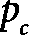
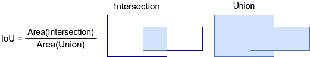
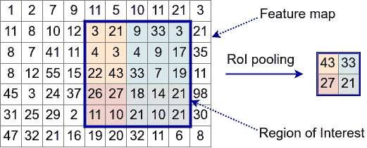

# 第五章：高级计算机视觉应用

在*第四章*中，我们介绍了用于计算机视觉的**卷积网络**（**CNN**）以及一些最受欢迎和表现最好的 CNN 模型。在本章中，我们将继续探讨类似的内容，但会深入到更高级的层次。到目前为止，我们的*操作方式*一直是提供简单的分类示例，以支持你对**神经网络**（**NN**）的理论知识。在计算机视觉任务的宇宙中，分类是相对直接的，因为它为图像分配一个单一的标签。这也使得手动创建大型标签化训练数据集成为可能。在本章中，我们将介绍**迁移学习**（**TL**），一种技术，它将使我们能够将预训练的神经网络的知识迁移到一个新的、无关的任务中。我们还将看到，迁移学习如何使得解决两个有趣的计算机视觉任务成为可能——目标检测和语义分割。我们可以说，这些任务相对于分类更为复杂，因为模型需要对图像有更全面的理解。它不仅要能够检测出不同的物体，还要知道它们在图像中的位置。同时，这些任务的复杂性也为更具创意的解决方案提供了空间。

最后，我们将介绍一种新型算法，称为生成模型，它将帮助我们生成新的图像。

本章将涵盖以下主题：

+   **迁移** **学习**（**TL**）

+   目标检测

+   语义分割

+   使用扩散模型生成图像

# 技术要求

我们将在本章中使用 Python、PyTorch、Keras 和 Ultralytics YOLOv8（[`github.com/ultralytics/ultralytics`](https://github.com/ultralytics/ultralytics)）实现示例。如果你没有配置好这些工具的环境，不用担心——示例可以在 Google Colab 上的 Jupyter notebook 中找到。你可以在本书的 GitHub 仓库中找到代码示例：[`github.com/PacktPublishing/Python-Deep-Learning-Third-Edition/tree/main/Chapter05`](https://github.com/PacktPublishing/Python-Deep-Learning-Third-Edition/tree/main/Chapter05)。

# 迁移学习（TL）

到目前为止，我们已经在玩具数据集上训练了小型模型，训练时间不超过一个小时。但如果我们想要处理大规模数据集，比如 ImageNet，我们将需要一个更大的网络，且训练时间会更长。更重要的是，大规模数据集并不总是能满足我们感兴趣任务的需求。请记住，除了获取图像之外，它们还需要被标注，而这可能是既昂贵又费时的。那么，当工程师想用有限资源解决实际的机器学习问题时，应该怎么办呢？这时，迁移学习（TL）就派上用场了。

迁移学习（TL）是将一个已经训练好的机器学习（ML）模型应用于一个新的但相关的问题的过程。例如，我们可以将一个在 ImageNet 上训练过的网络重新用于分类杂货店物品。或者，我们可以使用一个驾驶模拟游戏来训练神经网络（NN）驾驶一辆模拟汽车，然后用这个网络来驾驶真实的汽车（但请不要在家尝试！）。迁移学习是一个适用于所有机器学习算法的通用概念——我们将在*第八章*中也使用迁移学习。但在本章中，我们将讨论卷积神经网络（CNN）中的迁移学习。它是如何工作的，下面解释。

我们从一个现有的预训练网络开始。最常见的场景是使用一个在 ImageNet 上预训练的网络，但它也可以是任何数据集。PyTorch、**TensorFlow**（**TF**）和 Keras 都提供了流行的 ImageNet 预训练神经网络架构，我们可以使用。或者，我们也可以选择一个数据集来训练自己的网络。

在*第四章*中，我们提到过 CNN 最后的 **全连接层**（**FC**）如何作为网络语言（训练过程中学到的抽象特征表示）与我们的语言（每个样本的类别）之间的转换器。你可以将迁移学习看作是对另一种语言的翻译。我们从网络的特征开始，这些特征是最后一个卷积层或池化层的输出。然后，我们将它们翻译成新任务的不同类别。我们可以通过去除现有预训练网络的最后几层，并用一组新的层替换它们，这些新层代表了新问题的类别。以下是迁移学习场景的示意图：


图 5.1 – 一个迁移学习（TL）场景，其中我们替换了一个

预训练网络，并将其重新用于新的问题

然而，我们不能机械地进行这种操作并期望新网络能够正常工作，因为我们仍然需要用与新任务相关的数据来训练新层。我们有两种方式可以做到这一点：

+   **使用网络的原始部分作为特征提取器，只训练新的层**：首先，我们将新的数据批次输入网络，进行前向和反向传播，查看网络的输出和误差梯度。这部分的工作方式就像常规训练一样。但在权重更新阶段，我们会锁定原始网络的权重，只更新新层的权重。这是当我们对新问题的数据有限时推荐的做法。通过锁定大部分网络权重，我们可以防止在新数据上过拟合。

+   **微调整个网络**：我们训练整个网络，而不仅仅是最后添加的层。可以更新所有网络权重，但我们也可以锁定一些第一层的权重。这里的想法是，初始层用于检测一般特征——与特定任务无关——因此重复使用它们是合理的。另一方面，较深的层可能会检测任务特定的特征，因此更新它们会更好。当我们拥有更多训练数据并且不需要担心过拟合时，可以使用这种方法。

在继续之前，我们需要指出，迁移学习不仅限于分类到分类的问题。正如我们在本章后面看到的，我们可以使用预训练的卷积神经网络（CNN）作为目标检测和语义分割任务的主干神经网络。现在，让我们看看如何在实践中实现迁移学习。

## 使用 PyTorch 进行迁移学习

在本节中，我们将应用一个先进的 ImageNet 预训练网络到 CIFAR-10 图像上。我们将实现两种类型的迁移学习。最好在 GPU 上运行这个示例：

1.  要定义训练数据集，我们需要考虑几个因素：

    +   使用大小为 50 的 mini-batch。

    +   CIFAR-10 图像的大小为 32×32，而 ImageNet 网络期望输入为 224×224。由于我们使用的是基于 ImageNet 的网络，我们将使用`transforms.``Resize`将 32×32 的 CIFAR 图像上采样到 224×224。

    +   使用 ImageNet 的均值和标准差来标准化 CIFAR-10 数据，因为网络期望的是这种格式。

    +   添加轻微的数据增强（翻转）。

    我们可以通过以下代码完成所有这些操作：

    ```py
    import torch
    from torch.utils.data import DataLoader
    from torchvision import datasets
    from torchvision import transforms
    batch_size = 50
    # training data
    train_data_transform = transforms.Compose([
        transforms.Resize(224),
        transforms.RandomHorizontalFlip(),
        transforms.RandomVerticalFlip(),
        transforms.ToTensor(),
        transforms.Normalize(
            [0.485, 0.456, 0.406],
            [0.229, 0.224, 0.225])
    ])
    train_set = datasets.CIFAR10(
        root='data',
        train=True,
        download=True,
        transform=train_data_transform)
    train_loader = DataLoader(
        dataset=train_set,
        batch_size=batch_size,
        shuffle=True,
        num_workers=2)
    ```

1.  按照相同的步骤使用验证数据（除了数据增强之外）：

    ```py
    val_data_transform = transforms.Compose([
        transforms.Resize(224),
        transforms.ToTensor(),
        transforms.Normalize(
            [0.485, 0.456, 0.406],
            [0.229, 0.224, 0.225])
    ])
    val_set = datasets.CIFAR10(
        root='data',
        train=False,
        download=True,
        transform=val_data_transform)
    val_order = DataLoader(
        dataset=val_set,
        batch_size=batch_size,
        shuffle=False,
        num_workers=2)
    ```

1.  选择一个设备——最好是 GPU，如果没有可退回到 CPU：

    ```py
    device = torch.device("cuda:0" if torch.cuda.is_available() else "cpu")
    ```

1.  为了训练和验证模型，我们将使用`train_model(model, loss_function, optimizer, data_loader)`和`test_model(model, loss_function, data_loader)`函数。我们在*第三章*中首先实现了这些函数，因此这里不再重复实现（完整的源代码示例可以在 GitHub 上找到）。

1.  定义第一个迁移学习场景，其中我们将预训练的网络用作特征提取器：

    +   我们将使用一个流行的网络，`epochs`，并在每个 epoch 后评估网络的准确度。

    +   使用`plot_accuracy`准确度函数，它在`matplotlib`图表上绘制验证准确度。我们不会在这里包含完整的实现，但可以在 GitHub 上找到。

    以下是`tl_feature_extractor`函数，它实现了所有这些：

    ```py
    import torch.nn as nn
    import torch.optim as optim
    from torchvision.models import MobileNet_V3_Small_Weights, mobilenet_v3_small
    def tl_feature_extractor(epochs=5):
        # load the pre-trained model
        model = mobilenet_v3_small(
            weights=MobileNet_V3_Small_Weights.IMAGENET1K_V1)
        # exclude existing parameters from backward pass
        # for performance
        for param in model.parameters():
            param.requires_grad = False
        # newly constructed layers have requires_grad=True by default
        num_features = model.classifier[0].in_features
        model.classifier = nn.Linear(num_features, 10)
        # transfer to GPU (if available)
        model = model.to(device)
        loss_function = nn.CrossEntropyLoss()
        # only parameters of the final layer are being optimized
        optimizer = optim.Adam(model.classifier.parameters())
        # train
        test_acc = list()  # collect accuracy for plotting
        for epoch in range(epochs):
            print('Epoch {}/{}'.format(epoch + 1,
                epochs))
            train_model(model, loss_function,
            optimizer, train_loader)
            _, acc = test_model(model, loss_function,
                val_order)
            test_acc.append(acc.cpu())
        plot_accuracy(test_acc)
    ```

1.  使用`tl_fine_tuning`函数实现微调方法。此函数与`tl_feature_extractor`类似，但现在我们将训练整个网络：

    ```py
    def tl_fine_tuning(epochs=5):
        # load the pre-trained model
        model = mobilenet_v3_small(
            weights=MobileNet_V3_Small_Weights.IMAGENET1K_V1)
        # replace the last layer
        num_features = model.classifier[0].in_features
        model.classifier = nn.Linear(num_features, 10)
        # transfer the model to the GPU
        model = model.to(device)
        # loss function
        loss_function = nn.CrossEntropyLoss()
        # We'll optimize all parameters
        optimizer = optim.Adam(model.parameters())
        # train
        test_acc = list()  # collect accuracy for plotting
        for epoch in range(epochs):
            print('Epoch {}/{}'.format(epoch + 1,
                epochs))
            train_model(model, loss_function,
            optimizer, train_loader)
            _, acc = test_model(model, loss_function,
                val_order)
            test_acc.append(acc.cpu())
        plot_accuracy(test_acc)
    ```

1.  我们可以通过两种方式运行整个过程：

    1.  调用`tl_fine_tuning(epochs=5)`来使用微调方法训练五个 epoch。

    1.  调用`tl_feature_extractor(epochs=5)`来使用特征提取方法训练网络五个 epoch。

使用网络作为特征提取器时，我们的准确率大约为 81%，而通过微调后，准确率可以达到 89%。但如果我们在更多的训练周期中进行微调，网络将开始出现过拟合。接下来，我们来看一个相同的例子，但使用的是 Keras。

## 使用 Keras 进行迁移学习

在本节中，我们将再次实现这两种迁移学习（TL）场景，但这次使用的是 Keras 和 TF。通过这种方式，我们可以比较这两个库。我们仍然使用`MobileNetV3Small`架构。除了 Keras 外，本示例还需要 TF Datasets 包（[`www.tensorflow.org/datasets`](https://www.tensorflow.org/datasets)），它是一个包含各种流行机器学习数据集的集合。让我们开始：

注意

本示例部分基于[`github.com/tensorflow/docs/blob/master/site/en/tutorials/images/transfer_learning.ipynb`](https://github.com/tensorflow/docs/blob/master/site/en/tutorials/images/transfer_learning.ipynb)。

1.  定义小批量和输入图像大小（图像大小由网络架构决定）：

    ```py
    IMG_SIZE = 224
    BATCH_SIZE = 50
    ```

1.  使用 TF 数据集的帮助加载 CIFAR-10 数据集。`repeat()`方法允许我们在多个周期中重复使用数据集：

    ```py
    import tensorflow as tf
    import tensorflow_datasets as tfds
    data, metadata = tfds.load('cifar10', with_info=True,
        as_supervised=True)
    raw_train, raw_test = data['train'].repeat(),
        data['test'].repeat()
    ```

1.  定义`train_format_sample`和`test_format_sample`函数，这些函数会将初始图像转换为适合 CNN 输入的格式。这些函数扮演了与我们在*使用 PyTorch 实现迁移学习*一节中定义的`transforms.Compose`对象相同的角色。输入转换如下：

    +   图像会被调整为 224×224 的大小，这是网络预期的输入尺寸

    +   每张图片都会通过转换其值来进行标准化，使其处于（-1；1）区间内

    +   标签被转换为独热编码

    +   训练图像会随机地水平和垂直翻转

    让我们看看实际的实现：

    ```py
    def train_format_sample(image, label):
        """Transform data for training"""
        image = tf.cast(image, tf.float32)
        image = tf.image.resize(image, (IMG_SIZE,
            IMG_SIZE))
        image = tf.image.random_flip_left_right(image)
        image = tf.image.random_flip_up_down(image)
        label = tf.one_hot(label,
            metadata.features['label'].num_classes)
        return image, label
    def test_format_sample(image, label):
        """Transform data for testing"""
        image = tf.cast(image, tf.float32)
        image = tf.image.resize(image, (IMG_SIZE,
            IMG_SIZE))
        label = tf.one_hot(label,
            metadata.features['label'].num_classes)
        return image, label
    ```

1.  接下来是一些模板代码，将这些转换器分配到训练/测试数据集，并将其拆分成小批量：

    ```py
    # assign transformers to raw data
    train_data = raw_train.map(train_format_sample)
    test_data = raw_test.map(test_format_sample)
    # extract batches from the training set
    train_batches = train_data.shuffle(1000).batch(BATCH_SIZE)
    test_batches = test_data.batch(BATCH_SIZE)
    ```

1.  定义特征提取模型：

    +   由于 Keras 是 TF 的核心部分，因此使用 Keras 来定义预训练网络和模型

    +   加载`MobileNetV3Small`预训练网络，排除最后的全连接层

    +   调用`base_model.trainable = False`，这会冻结所有网络权重，防止它们被训练

    +   添加一个`GlobalAveragePooling2D`操作，然后在网络的末端添加一个新的、可训练的全连接层

    以下代码实现了这一点：

    ```py
    def build_fe_model():
        """"Create feature extraction model from the pre-trained model ResNet50V2"""
        # create the pre-trained part of the network, excluding FC layers
        base_model = tf.keras.applications.MobileNetV3Small(
            input_shape=(IMG_SIZE, IMG_SIZE, 3),
            include_top=False,
            classes=10,
            weights='imagenet',
            include_preprocessing=True)
        # exclude all model layers from training
        base_model.trainable = False
        # create new model as a combination of the pre-trained net
        # and one fully connected layer at the top
        return tf.keras.Sequential([
            base_model,
            tf.keras.layers.GlobalAveragePooling2D(),
            tf.keras.layers.Dense(
                metadata.features['label'].num_classes,
                activation='softmax')
        ])
    ```

1.  定义微调模型。它与特征提取的唯一区别是，我们只冻结一些底层的预训练网络层（而不是全部层）。以下是实现代码：

    ```py
    def build_ft_model():
        """"Create fine tuning model from the pre-trained model MobileNetV3Small"""
        # create the pre-trained part of the network, excluding FC layers
        base_model = tf.keras.applications.MobileNetV3Small(
            input_shape=(IMG_SIZE, IMG_SIZE, 3),
            include_top=False,
            weights='imagenet',
            include_preprocessing=True
        )
        # Fine tune from this layer onwards
        fine_tune_at = 100
        # Freeze all the layers before the `fine_tune_at` layer
        for layer in base_model.layers[:fine_tune_at]:
            layer.trainable = False
        # create new model as a combination of the pre-trained net
        # and one fully connected layer at the top
        return tf.keras.Sequential([
            base_model,
            tf.keras.layers.GlobalAveragePooling2D(),
            tf.keras.layers.Dense(
               metadata.features['label'].num_classes,
               activation='softmax')
        ])
    ```

1.  实现`train_model`函数，它用于训练和评估由`build_fe_model`或`build_ft_model`函数创建的模型。`plot_accuracy`函数在此未实现，但可在 GitHub 上找到：

    ```py
    def train_model(model, epochs=5):
        """Train the model. This function is shared for both FE and FT modes"""
        # configure the model for training
        model.compile(
            optimizer=tf.keras.optimizers.Adam(
                 learning_rate=0.0001),
            loss='categorical_crossentropy',
            metrics=['accuracy'])
        # train the model
        history = model.fit(
            train_batches,
            epochs=epochs,
            steps_per_epoch=metadata.splits['train'].num_examples /
                BATCH_SIZE,
            validation_data=test_batches,
            validation_steps=metadata.splits['test'].num_examples /
                BATCH_SIZE,
            workers=4)
        # plot accuracy
        plot_accuracy(history.history['val_accuracy'])
    ```

1.  我们可以使用以下代码运行特征提取或微调迁移学习：

    +   `train_model(build_ft_model())`

    +   `train_model(build_fe_model())`

使用网络作为特征提取器时，我们可以获得约 82%的准确率，而通过微调后，准确率可达到 89%。这些结果与 PyTorch 示例类似。

接下来，让我们关注物体检测——这是一个我们可以通过 TL 来解决的任务。

# 物体检测

**物体检测**是指在图像或视频中找到某一类别的物体实例，例如人、车、树木等。与分类不同，物体检测不仅可以检测多个物体，还可以识别它们在图像中的位置。

物体检测器会返回一份包含每个物体以下信息的检测对象列表：

+   物体的类别（例如：人、车、树木等）。

+   一个概率值（或物体性得分），范围在[0, 1]之间，表示检测器对该位置存在物体的信心。这类似于常规二分类器的输出。

+   图像中物体所在矩形区域的坐标。这个矩形被称为**边界框**。

我们可以在下图中看到物体检测算法的典型输出。物体类型和物体性得分位于每个边界框的上方：

](img/B19627_05_2.jpg)

图 5.2 – 物体检测器的输出。来源：[`en.wikipedia.org/wiki/File:2011_FIA_GT1_Silverstone_2.jpg`](https://en.wikipedia.org/wiki/File:2011_FIA_GT1_Silverstone_2.jpg)

接下来，我们将概述解决物体检测任务的不同方法。

## 物体检测方法

在这一部分中，我们将概述三种方法：

+   **经典滑动窗口**：在这里，我们将使用常规分类网络（分类器）。这种方法可以与任何类型的分类算法一起使用，但它相对较慢且容易出错。

    +   **构建图像金字塔**：这是将同一图像的不同尺度组合在一起（见下图）。例如，每个缩放后的图像可以比前一个小两倍。通过这种方式，我们能够检测到原始图像中不同尺寸的物体。

    +   **在整个图像上滑动分类器**：我们将图像的每个位置作为输入传递给分类器，结果将确定该位置的物体类型。位置的边界框就是我们用作输入的图像区域。

    +   **每个物体的多个重叠边界框**：我们将使用一些启发式方法将它们合并为一个单一的预测。

这里有一张展示滑动窗口方法的图示：


图 5.3 – 滑动窗口加图像金字塔物体检测

+   **两阶段检测方法**：这些方法非常准确，但相对较慢。顾名思义，它涉及两个步骤：

    +   一种特殊类型的 CNN，称为**区域提议网络** (**RPN**)，扫描图像并提出多个可能的边界框，或**兴趣区域** (**RoI**)，用于检测物体可能的位置。然而，该网络并不检测物体的类型，仅仅是判断该区域是否包含物体。

    +   将 RoI 送到第二阶段进行物体分类，从而确定每个边界框中的实际物体。

+   **一阶段（或单次）检测方法**：在这种方法中，单个 CNN 同时输出物体类型和边界框。这些方法通常比两阶段方法速度更快，但准确度较低。

在接下来的部分，我们将介绍**YOLO**——一种精确高效的一阶段检测算法。

## 使用 YOLO 进行物体检测

YOLO 是最受欢迎的一阶段检测算法之一。其名称来源于流行的格言“你只活一次（You Only Live Once）”，这反映了算法的一阶段特性。自其首次发布以来，YOLO 已经历了多个版本，不同的作者参与其中。为了便于理解，我们将在此列出所有版本：

+   *你只看一次：统一的实时物体检测* ([`arxiv.org/abs/1506.02640`](https://arxiv.org/abs/1506.02640))，作者：Joseph Redmon、Santosh Divvala、Ross Girshick 和 Ali Farhadi。

+   *YOLO9000: 更好、更快、更强* ([`arxiv.org/abs/1612.08242`](https://arxiv.org/abs/1612.08242))，作者：Joseph Redmon 和 Ali Farhadi。

+   *YOLOv3: 增量式改进* ([`arxiv.org/abs/1804.02767`](https://arxiv.org/abs/1804.02767), [`github.com/pjreddie/darknet`](https://github.com/pjreddie/darknet))，作者：Joseph Redmon 和 Ali Farhadi。

+   *YOLOv4: 物体检测的最佳速度与精度* ([`arxiv.org/abs/2004.10934`](https://arxiv.org/abs/2004.10934), [`github.com/AlexeyAB/darknet`](https://github.com/AlexeyAB/darknet))，作者：Alexey Bochkovskiy、Chien-Yao Wang 和 Hong-Yuan Mark Liao。

+   **YOLOv5** 和 **YOLOv8** ([`github.com/ultralytics/yolov5`](https://github.com/ultralytics/yolov5), [`github.com/ultralytics/ultralytics`](https://github.com/ultralytics/ultralytics))，由 Ultralitics 提供 ([`ultralytics.com/`](https://ultralytics.com/))。V5 和 v8 没有正式论文。

+   *YOLOv6 v3.0: 全面重新加载* ([`arxiv.org/abs/2301.05586`](https://arxiv.org/abs/2301.05586), [`github.com/meituan/YOLOv6`](https://github.com/meituan/YOLOv6))，作者：Chuyi Li、Lulu Li、Yifei Geng、Hongliang Jiang、Meng Cheng、Bo Zhang、Zaidan Ke、Xiaoming Xu 和 Xiangxiang Chu。

+   *YOLOv7: 可训练的“免费赠品”集合创造了实时物体检测的新技术前沿* ([`arxiv.org/abs/2207.02696`](https://arxiv.org/abs/2207.02696), Mark L[`github.com/WongKinYiu/yolov7`](https://github.com/WongKinYiu/yolov7))，作者：Chien-Yao Wang、Alexey Bochkovskiy 和 Hong-Yuan Mark Liao。

注意

v3 是最后一个由算法的原作者发布的版本。v4 是 v3 的一个分支，由 v1-v3 的主要作者 Joseph Redmon（[`twitter.com/pjreddie/status/1253891078182199296`](https://twitter.com/pjreddie/status/1253891078182199296)）支持发布。另一方面，v5 是一个独立的实现，灵感来自于 YOLO。这引发了关于 v5 名称的争议。你可以查看一些讨论，访问[`github.com/AlexeyAB/darknet/issues/5920`](https://github.com/AlexeyAB/darknet/issues/5920)，其中 v4 的作者 Alexey Bochkovskiy 也进行了发帖。v5 的作者也在这里解决了争议：[`blog.roboflow.com/yolov4-versus-yolov5/`](https://blog.roboflow.com/yolov4-versus-yolov5/)。不管这些讨论如何，v5 和 v8 已经证明其有效性，并且它们在各自的领域中是受欢迎的检测算法。

我们将讨论所有版本共享的 YOLO 特性，并指出其中的一些差异。

我们从 YOLO 架构开始：


图 5.4 – YOLO 架构

它包含以下组件：

+   **主干网络**：这是一个 CNN 模型，负责从输入图像中提取特征。这些特征随后会传递给下一个组件进行目标检测。通常，主干网络是一个在 ImageNet 上预训练的 CNN，类似于我们在*第四章*中讨论的高级模型。

    主干网络是迁移学习（TL）的一个例子——我们将一个用于分类的 CNN 拿来重新用于目标检测。不同版本的 YOLO 使用不同的主干网络。例如，v3 使用一个名为 DarkNet-53 的特殊全卷积 CNN，它有 53 层。随后的 YOLO 版本在此架构上进行了一些改进，而其他版本则使用了自己独特的主干网络。

+   **颈部**：这是模型的中间部分，连接主干网络和头部。它在将组合结果发送到下一个组件（头部）之前，将主干特征图在不同阶段的输出进行串联。这是标准方法的替代方案，标准方法是仅发送最后一个主干卷积的输出以进行进一步处理。为了理解颈部的必要性，让我们回顾一下我们的目标是围绕检测到的物体边缘创建一个精确的边界框。物体本身的大小可能相对图像来说很大或很小。然而，主干的深层接收域较大，因为它汇聚了所有前面层的接收域。因此，深层检测到的特征包含了输入图像的大部分。这与我们的精细物体检测目标相悖，无论物体的大小如何。为了解决这个问题，颈部在不同主干阶段结合特征图，从而使得不同尺度的物体都能被检测到。然而，每个主干阶段的特征图维度不同，不能直接组合。颈部应用不同的技术，例如上采样或下采样，以平衡这些维度，使它们能够串联。

+   **头部**：这是模型的最终组件，输出检测到的物体。每个检测到的物体通过其边界框坐标和类别来表示。

通过这些步骤，我们已经获得了 YOLO 架构的概览。但这并没有回答一些不太方便（但又令人好奇）的问题，例如模型如何在同一图像上检测多个物体，或者当两个或更多物体重叠且其中一个仅部分可见时会发生什么。为了找到这些问题的答案，我们引入下面的示意图，其中包含两个重叠的物体：


图 5.5 – 一个物体检测 YOLO 示例，包含两个重叠的物体及其边界框

这是 YOLO 实现物体检测的步骤：

1.  将输入图像分割成*S×S*个单元格（前面的示意图使用了一个 3×3 的网格）：

    +   一个单元格的中心代表一个区域的中心，该区域可能包含一个物体。

    +   模型可以检测跨越多个单元格的物体，也可以检测完全位于单元格内的物体。每个物体都与一个单元格相关联，即使它跨越了多个单元格。在这种情况下，我们将物体与其边界框中心所在的单元格关联。例如，图中的两个物体跨越了多个单元格，但它们都分配给中央单元格，因为它们的中心位于其中。

    +   一个单元格可以包含多个物体（*1 对 n*关系）或完全没有物体。我们只关注包含物体的单元格。

1.  该模型为每个网格单元输出多个可能的检测物体。每个检测物体由以下值数组表示：![<mml:math xmlns:mml="http://www.w3.org/1998/Math/MathML" xmlns:m="http://schemas.openxmlformats.org/officeDocument/2006/math"><mml:mfenced open="[" close="]" separators="|"><mml:mrow><mml:msub><mml:mrow><mml:mi>b</mml:mi></mml:mrow><mml:mrow><mml:mi>x</mml:mi></mml:mrow></mml:msub><mml:mo>,</mml:mo><mml:msub><mml:mrow><mml:mi>b</mml:mi></mml:mrow><mml:mrow><mml:mi>y</mml:mi></mml:mrow></mml:msub><mml:mo>,</mml:mo><mml:msub><mml:mrow><mml:mi>b</mml:mi></mml:mrow><mml:mrow><mml:mi>h</mml:mi></mml:mrow></mml:msub><mml:mo>,</mml:mo><mml:msub><mml:mrow><mml:mi>b</mml:mi></mml:mrow><mml:mrow><mml:mi>w</mml:mi></mml:mrow></mml:msub><mml:mo>,</mml:mo><mml:msub><mml:mrow><mml:mi>p</mml:mi></mml:mrow><mml:mrow><mml:mi>c</mml:mi></mml:mrow></mml:msub><mml:mo>,</mml:mo><mml:msub><mml:mrow><mml:mi>c</mml:mi></mml:mrow><mml:mrow><mml:mn>1</mml:mn></mml:mrow></mml:msub><mml:mo>,</mml:mo><mml:msub><mml:mrow><mml:mi>c</mml:mi></mml:mrow><mml:mrow><mml:mn>2</mml:mn></mml:mrow></mml:msub><mml:mo>…</mml:mo><mml:msub><mml:mrow><mml:mi>c</mml:mi></mml:mrow><mml:mrow><mml:mi>n</mml:mi></mml:mrow></mml:msub></mml:mrow></mml:mfenced></mml:math>](img/320.png)。我们来讨论它们：

    +   ![<mml:math xmlns:mml="http://www.w3.org/1998/Math/MathML" xmlns:m="http://schemas.openxmlformats.org/officeDocument/2006/math"><mml:mfenced open="[" close="]" separators="|"><mml:mrow><mml:msub><mml:mrow><mml:mi>b</mml:mi></mml:mrow><mml:mrow><mml:mi>x</mml:mi></mml:mrow></mml:msub><mml:mo>,</mml:mo><mml:msub><mml:mrow><mml:mi>b</mml:mi></mml:mrow><mml:mrow><mml:mi>y</mml:mi></mml:mrow></mml:msub><mml:mo>,</mml:mo><mml:msub><mml:mrow><mml:mi>b</mml:mi></mml:mrow><mml:mrow><mml:mi>h</mml:mi></mml:mrow></mml:msub><mml:mo>,</mml:mo><mml:msub><mml:mrow><mml:mi>b</mml:mi></mml:mrow><mml:mrow><mml:mi>w</mml:mi></mml:mrow></mml:msub></mml:mrow></mml:mfenced></mml:math>](img/321.png) 描述了物体的边界框。![<mml:math xmlns:mml="http://www.w3.org/1998/Math/MathML" xmlns:m="http://schemas.openxmlformats.org/officeDocument/2006/math"><mml:mfenced open="[" close="]" separators="|"><mml:mrow><mml:msub><mml:mrow><mml:mi>b</mml:mi></mml:mrow><mml:mrow><mml:mi>x</mml:mi></mml:mrow></mml:msub><mml:mo>,</mml:mo><mml:msub><mml:mrow><mml:mi>b</mml:mi></mml:mrow><mml:mrow><mml:mi>y</mml:mi></mml:mrow></mml:msub></mml:mrow></mml:mfenced></mml:math>](img/322.png) 是边界框中心相对于整张图像的坐标。它们被归一化到[0, 1]的范围内。例如，如果图像大小为 100×100，且边界框中心位于[40, 70]的位置，那么

        ![<mml:math xmlns:mml="http://www.w3.org/1998/Math/MathML" xmlns:m="http://schemas.openxmlformats.org/officeDocument/2006/math"><mml:mfenced open="[" close="]" separators="|"><mml:mrow><mml:msub><mml:mrow><mml:mi>b</mml:mi></mml:mrow><mml:mrow><mml:mi>x</mml:mi></mml:mrow></mml:msub><mml:mo>,</mml:mo><mml:msub><mml:mrow><mml:mi>b</mml:mi></mml:mrow><mml:mrow><mml:mi>y</mml:mi></mml:mrow></mml:msub></mml:mrow></mml:mfenced><mml:mo>=</mml:mo><mml:mfenced open="[" close="]" separators="|"><mml:mrow><mml:mn>0.4,0.7</mml:mn></mml:mrow></mml:mfenced></mml:math>](img/323.png). ![<mml:math xmlns:mml="http://www.w3.org/1998/Math/MathML" xmlns:m="http://schemas.openxmlformats.org/officeDocument/2006/math"><mml:mfenced open="[" close="]" separators="|"><mml:mrow><mml:msub><mml:mrow><mml:mi>b</mml:mi></mml:mrow><mml:mrow><mml:mi>h</mml:mi></mml:mrow></mml:msub><mml:mo>,</mml:mo><mml:msub><mml:mrow><mml:mi>b</mml:mi></mml:mrow><mml:mrow><mml:mi>w</mml:mi></mml:mrow></mml:msub></mml:mrow></mml:mfenced></mml:math>](img/324.png) 表示相对于整个图像的归一化边界框高度和宽度。如果边界框的尺寸是 80×50，那么 ![<mml:math xmlns:mml="http://www.w3.org/1998/Math/MathML" xmlns:m="http://schemas.openxmlformats.org/officeDocument/2006/math"><mml:mfenced open="[" close="]" separators="|"><mml:mrow><mml:msub><mml:mrow><mml:mi>b</mml:mi></mml:mrow><mml:mrow><mml:mi>h</mml:mi></mml:mrow></mml:msub><mml:mo>,</mml:mo><mml:msub><mml:mrow><mml:mi>b</mml:mi></mml:mrow><mml:mrow><mml:mi>w</mml:mi></mml:mrow></mml:msub></mml:mrow></mml:mfenced><mml:mo>=</mml:mo><mml:mfenced open="[" close="]" separators="|"><mml:mrow><mml:mn>0.8,0.5</mml:mn></mml:mrow></mml:mfenced></mml:math>](img/325.png) 适用于相同的 100×100 图像。在实际操作中，YOLO 实现通常包括帮助方法，允许我们获取边界框的绝对坐标。

    +    是一个物体性分数，表示模型对单元格中是否存在物体的置信度（范围为 [0, 1]）。如果  趋近于 1，则表示模型确信单元格中存在物体，反之亦然。

    +   ![<mml:math xmlns:mml="http://www.w3.org/1998/Math/MathML" xmlns:m="http://schemas.openxmlformats.org/officeDocument/2006/math"><mml:mfenced open="[" close="]" separators="|"><mml:mrow><mml:msub><mml:mrow><mml:mi>c</mml:mi></mml:mrow><mml:mrow><mml:mn>1</mml:mn></mml:mrow></mml:msub><mml:mo>,</mml:mo><mml:msub><mml:mrow><mml:mi>c</mml:mi></mml:mrow><mml:mrow><mml:mn>2</mml:mn></mml:mrow></mml:msub><mml:mo>…</mml:mo><mml:msub><mml:mrow><mml:mi>c</mml:mi></mml:mrow><mml:mrow><mml:mi>n</mml:mi></mml:mrow></mml:msub></mml:mrow></mml:mfenced></mml:math>](img/328.png) 是检测到的物体类别的独热编码。例如，如果我们有自行车、花、人物和鱼类，并且当前物体是人物，则它的编码将是 [0, 0, 1, 0]。

1.  到目前为止，我们已经展示了模型可以检测同一图像上的多个物体。接下来，让我们聚焦于一个更复杂的情况——同一单元格中有多个物体。YOLO 在这个问题上提供了一个优雅的解决方案——**锚框**（也称为**先验框**）。为了理解这个概念，我们从下图开始，图中展示了网格单元（方形，实线）和两个锚框——垂直和水平（虚线）：


图 5.6 – 一个网格单元（方形，实线）与两个锚框（虚线）

对于每个单元格，我们会有多个候选锚框，具有不同的尺度和纵横比。如果同一单元格内有多个物体，我们将每个物体与一个单独的锚框关联。如果某个锚框没有关联物体，它的物体性得分将为零 ()。我们可以检测到每个单元格内的锚框数量相等的物体。例如，我们的 3×3 网格，每个单元格有两个锚框，可以检测到总共 3`3`2 = 18 个物体。因为我们有固定数量的单元格 (*S×S*) 和每个单元格固定数量的锚框，网络输出的大小不会随着检测到的物体数量而变化。相反，我们会输出所有可能锚框的结果，但我们只会考虑那些物体性得分为的锚框。

1.  YOLO 算法在训练和推理过程中都使用**交并比**（**IoU**）技术来提高性能：



图 5.7 – 交并比（IoU）

IoU 是检测到的对象的边界框与真实标签（或其他对象）的边界框交集的面积与并集的面积之比。

在训练过程中，我们可以计算锚框与真实框之间的 IoU。然后，我们可以将每个真实对象分配给其与之重叠度最高的锚框，从而生成标注的训练数据。此外，我们还可以计算检测到的边界框与真实框（标签框）之间的 IoU。IoU 值越高，表示真实值与预测值的重叠越好。这可以帮助我们评估检测器。

在推理过程中，模型的输出包括每个单元格的所有可能的锚框，无论其中是否存在对象。许多框会重叠并预测相同的对象。我们可以通过 IoU 和**非最大抑制**（**NMS**）来过滤这些重叠的对象。它是如何工作的：

1.  丢弃所有对象性分数低于的边界框。

1.  选择剩余框中具有最高对象性分数的框，。

1.  丢弃所有与我们在上一步中选择的框的 IoU >= 0.5 的框。

现在我们（希望）已经熟悉 YOLO，接下来让我们学习如何在实际中使用它。

### 使用 Ultralytics YOLOv8

在本节中，我们将演示如何使用由 Ultralytics 开发的 YOLOv8 算法。对于此示例，您需要安装`ultralytics` Python 包。让我们开始：

1.  导入 YOLO 模块。我们将加载一个预训练的 YOLOv8 模型：

    ```py
    from ultralytics import YOLO
    model = YOLO("yolov8n.pt")
    ```

1.  使用`model`在 Wikipedia 图片上检测对象：

    ```py
    results = model.predict('https://raw.githubusercontent.com/ivan-vasilev/Python-Deep-Learning-3rd-Edition/main/Chapter05/wikipedia-2011_FIA_GT1_Silverstone_2.jpg')
    ```

    `results`是一个列表，包含一个`ultralytics.yolo.engine.results.Results`类的实例。该实例包含检测到的对象列表：它们的边界框、类别和对象性分数。

1.  我们可以通过`results[0].plot()`方法来显示结果，它会将检测到的对象叠加在输入图像上。这个操作的结果就是我们在*目标检测简介*部分开始时展示的第一张图像：

    ```py
    from PIL import Image
    Image.fromarray(results[0].plot()).show()
    ```

这就是我们对 YOLO 系列单次检测模型的介绍。接下来，我们将重点讲解一个流行的两次检测算法的示例。

## 使用 Faster R-CNN 进行目标检测

在本节中，我们将讨论**Faster R-CNN**（*Faster R-CNN: Towards Real-Time Object Detection with Region Proposal Networks*，[`arxiv.org/abs/1506.01497`](https://arxiv.org/abs/1506.01497)）的两阶段目标检测算法。它是早期两阶段检测器的演变，**Fast R-CNN**（*Fast R-CNN*，[`arxiv.org/abs/1504.08083`](https://arxiv.org/abs/1504.08083)）和**R-CNN**（*Rich feature hierarchies for accurate object detection and semantic* *segmentation*，[`arxiv.org/abs/1311.2524`](https://arxiv.org/abs/1311.2524)）。

Faster R-CNN 模型的一般结构在下图中概述：

](img/B19627_05_8.jpg)

图 5.8 – Faster R-CNN 的结构。来源：[`arxiv.org/abs/1506.01497`](https://arxiv.org/abs/1506.01497)

在解释算法时，我们要记住这个图。像 YOLO 一样，Faster R-CNN 首先使用一个在 ImageNet 上训练的主干分类网络，它作为模型不同模块的基础。最初，论文的作者尝试了经典的主干架构，如**VGG-16**（*Very Deep Convolutional Networks for Large-Scale Image Recognition*，[`arxiv.org/abs/1409.1556`](https://arxiv.org/abs/1409.1556)）和**ZFNet**（*Visualizing and Understanding Convolutional Networks*，[`arxiv.org/abs/1311.2901`](https://arxiv.org/abs/1311.2901)）。如今，该模型已提供更多现代化的主干，如 ResNet 和 MobileNet。

与 YOLO 不同，Faster R-CNN 没有颈部模块，只使用最后一个主干卷积层的特征图作为输入，供算法的下一个组件使用。更具体地说，主干网络作为模型其他两个组件（因此是两阶段）的支撑——**区域提议网络**（**RPN**）和检测网络。我们先来讨论一下 RPN。

### 区域提议网络

在第一阶段，RPN 将图像（任意大小）作为输入，并输出一组矩形 RoI，表示可能存在物体的位置。RoI 相当于 YOLO 中的边界框。RPN 本身是通过采用主干模型的前`p`个卷积层（参见前面的图示）来创建的。一旦输入图像传播到最后一个共享的卷积层，算法就会取该层的特征图，并在特征图的每个位置滑动另一个小型网络。这个小型网络输出是否在任意一个`k`个锚框中存在物体（锚框的概念与 YOLO 中的相同），以及其潜在的边界框坐标。下图左侧的图像展示了 RPN 在最后一个卷积层的特征图上滑动的一个位置：


图 5.9 – 单一位置的 RPN 提议。来源：https://arxiv.org/abs/1506.01497

小型网络将跨所有输入特征图，在相同位置的*n×n*区域作为输入。

（*n = 3*，根据论文）。例如，如果最终卷积层有 512 个特征图，那么在某个位置上，小型网络的输入大小为 512`3`3 = 4608。512 个 3×3 的特征图被展平为一个 4608 维的向量。这个向量作为输入传递给一个全连接层，该层将其映射到一个较低维度（通常为 512）的向量。这个向量本身作为输入传递给接下来的两个并行的全连接层：

+   一个具有*2k*单元的分类层，这些单元组织成`k`个 2 单元的二元 softmax 输出。像 YOLO 一样，每个 softmax 的输出表示在每个`k`个锚框中是否存在物体的目标性分数（在[0, 1]范围内）。在训练过程中，物体是根据 IoU 公式分配给锚框的，和 YOLO 中的方式一样。

+   一个回归层，具有*4k*单元，组织成`k`个 4 单元的 RoI 数组。像 YOLO 一样，第一个数组元素表示 RoI 中心的坐标，范围为[0:1]，相对于整个图像。其他两个元素表示区域的高度和宽度，相对于整个图像（再次类似 YOLO）。

论文的作者实验了三种尺度和三种长宽比，结果在每个位置上得到了九种可能的锚框。最终特征图的典型*H×W*大小大约是 2,400，这样就得到了 2,400*9 = 21,600 个锚框。

RPN 作为跨通道卷积

理论上，我们将小型网络滑动到最后一层卷积的特征图上。然而，小型网络的权重在所有位置之间共享。因为这个原因，滑动可以被实现为跨通道卷积。因此，网络可以在一次图像传递中为所有锚框生成输出。这是对 Fast R-CNN 的改进，后者需要为每个锚框单独进行网络传递。

RPN 通过反向传播和随机梯度下降进行训练（真是令人惊讶！）。共享卷积层的权重使用预训练的骨干网络权重进行初始化，其余的权重则是随机初始化的。每个小批量的样本都从一张图片中提取。每个小批量包含相同数量的正样本（物体）和负样本（背景）锚框。有两种正标签的锚框：与真实框 IoU 重叠最高的锚框，和与任何真实框的 IoU 重叠超过 0.7 的锚框。如果锚框的 IoU 比率低于 0.3，则该框被分配为负标签。既不是正标签也不是负标签的锚框不会参与训练。

由于 RPN 具有两个输出层（分类和回归），因此训练使用以下复合代价函数，其中包含分类 () 和回归 () 部分：

![<mml:math xmlns:mml="http://www.w3.org/1998/Math/MathML" xmlns:m="http://schemas.openxmlformats.org/officeDocument/2006/math" display="block"><mml:mi>L</mml:mi><mml:mfenced separators="|"><mml:mrow><mml:mfenced open="{" close="}" separators="|"><mml:mrow><mml:msub><mml:mrow><mml:mi>p</mml:mi></mml:mrow><mml:mrow><mml:mi>i</mml:mi></mml:mrow></mml:msub></mml:mrow></mml:mfenced><mml:mo>,</mml:mo><mml:mfenced open="{" close="}" separators="|"><mml:mrow><mml:msub><mml:mrow><mml:mi mathvariant="bold">t</mml:mi></mml:mrow><mml:mrow><mml:mi>i</mml:mi></mml:mrow></mml:msub></mml:mrow></mml:mfenced></mml:mrow></mml:mfenced><mml:mo>=</mml:mo><mml:munder underaccent="false"><mml:mrow><mml:mfrac><mml:mrow><mml:mn>1</mml:mn></mml:mrow><mml:mrow><mml:msub><mml:mrow><mml:mi>N</mml:mi></mml:mrow><mml:mrow><mml:mi>c</mml:mi><mml:mi>l</mml:mi><mml:mi>s</mml:mi></mml:mrow></mml:msub></mml:mrow></mml:mfrac><mml:mrow><mml:munderover><mml:mo stretchy="false">∑</mml:mo><mml:mrow><mml:mi>i</mml:mi></mml:mrow><mml:mrow><mml:mi mathvariant="normal"> </mml:mi></mml:mrow></mml:munderover><mml:mrow><mml:msub><mml:mrow><mml:mi>L</mml:mi></mml:mrow><mml:mrow><mml:mi>c</mml:mi><mml:mi>l</mml:mi><mml:mi>s</mml:mi></mml:mrow></mml:msub><mml:mfenced separators="|"><mml:mrow><mml:msub><mml:mrow><mml:mi>p</mml:mi></mml:mrow><mml:mrow><mml:mi>i</mml:mi></mml:mrow></mml:msub><mml:mo>,</mml:mo><mml:msubsup><mml:mrow><mml:mi>p</mml:mi></mml:mrow><mml:mrow><mml:mi>i</mml:mi></mml:mrow><mml:mrow><mml:mi mathvariant="normal">*</mml:mi></mml:mrow></mml:msubsup></mml:mrow></mml:mfenced></mml:mrow></mml:mrow></mml:mrow><mml:mo>_</mml:mo></mml:munder><mml:mo>+</mml:mo><mml:munder underaccent="false"><mml:mrow><mml:mi>λ</mml:mi><mml:mfrac><mml:mrow><mml:mn>1</mml:mn></mml:mrow><mml:mrow><mml:msub><mml:mrow><mml:mi>N</mml:mi></mml:mrow><mml:mrow><mml:mi>r</mml:mi><mml:mi>e</mml:mi><mml:mi>g</mml:mi></mml:mrow></mml:msub></mml:mrow></mml:mfrac><mml:mrow><mml:munderover><mml:mo stretchy="false">∑</mml:mo><mml:mrow><mml:mi>i</mml:mi></mml:mrow><mml:mrow><mml:mi mathvariant="normal"> </mml:mi></mml:mrow></mml:munderover><mml:mrow><mml:msubsup><mml:mrow><mml:mi>p</mml:mi></mml:mrow><mml:mrow><mml:mi>i</mml:mi></mml:mrow><mml:mrow><mml:mi mathvariant="normal">*</mml:mi></mml:mrow></mml:msubsup></mml:mrow></mml:mrow><mml:msub><mml:mrow><mml:mi>L</mml:mi></mml:mrow><mml:mrow><mml:mi>r</mml:mi><mml:mi>e</mml:mi><mml:mi>g</mml:mi></mml:mrow></mml:msub><mml:mfenced separators="|"><mml:mrow><mml:msub><mml:mrow><mml:mi mathvariant="bold">t</mml:mi></mml:mrow><mml:mrow><mml:mi>i</mml:mi></mml:mrow></mml:msub><mml:mo>,</mml:mo><mml:msubsup><mml:mrow><mml:mi mathvariant="bold">t</mml:mi></mml:mrow><mml:mrow><mml:mi>i</mml:mi></mml:mrow><mml:mrow><mml:mi mathvariant="normal">*</mml:mi></mml:mrow></mml:msubsup></mml:mrow></mml:mfenced></mml:mrow><mml:mo>_</mml:mo></mml:munder></mml:math>](img/335.png)

让我们讨论它的组成部分：

+   `i`：小批量中锚点的索引。

+   ：分类输出，表示锚点 `i` 是物体还是背景的预测物体性得分。 是相同目标的实际数据（0 或 1）。

+   ：回归输出向量，大小为 4，表示 RoI 参数。

+   ：相同目标的目标向量。

+   ：分类层的交叉熵损失。

+   ：归一化项，等于小批量大小。

+   ：回归损失，![<mml:math xmlns:mml="http://www.w3.org/1998/Math/MathML" xmlns:m="http://schemas.openxmlformats.org/officeDocument/2006/math"><mml:msub><mml:mrow><mml:mi>L</mml:mi></mml:mrow><mml:mrow><mml:mi>r</mml:mi><mml:mi>e</mml:mi><mml:mi>g</mml:mi></mml:mrow></mml:msub><mml:mo>=</mml:mo><mml:mi>R</mml:mi><mml:mfenced separators="|"><mml:mrow><mml:msub><mml:mrow><mml:mi mathvariant="bold">t</mml:mi></mml:mrow><mml:mrow><mml:mi>i</mml:mi></mml:mrow></mml:msub><mml:mo>-</mml:mo><mml:msubsup><mml:mrow><mml:mi mathvariant="bold">t</mml:mi></mml:mrow><mml:mrow><mml:mi>i</mml:mi></mml:mrow><mml:mrow><mml:mi>*</mml:mi></mml:mrow></mml:msubsup></mml:mrow></mml:mfenced></mml:math>](img/343.png)，其中 `R` 是平均绝对误差（[`en.wikipedia.org/wiki/Mean_absolute_error`](https://en.wikipedia.org/wiki/Mean_absolute_error)）。

+   ：一个归一化项，等于锚点位置的总数（大约 2400）。

+   *λ*：这有助于将分类和回归组件结合到代价函数中。由于 和 ，*λ* 被设置为 10，以保持两者损失的平衡。

现在我们已经讨论了 RPN，让我们集中注意力于检测网络。

### 检测网络

让我们回到在*基于 Faster R-CNN 的目标检测*部分开头展示的图示。回想一下，在第一阶段，RPN 已经生成了 RoI 坐标及其目标性分数。检测网络是一个常规分类器，用于确定当前 RoI 中物体的类别。RPN 和检测网络共享它们的第一卷积层，这些层借用了背骨网络。此外，检测网络还整合了来自 RPN 的提议区域以及最后共享层的特征图。

但是，我们如何将背骨特征图和提议的区域以统一的输入格式结合起来呢？我们可以通过**RoI 池化**来实现，这也是检测网络第二部分的第一层：



图 5.10 – 一个 2×2 RoI 池化示例，使用 10×7 的特征图和一个 5×5 的 RoI（粗体矩形）

为了理解 RoI 池化的工作原理，假设我们有一个 10×7 的特征图和一个 RoI。如同在*区域提议网络*部分中所学，RoI 是由其中心坐标、宽度和高度定义的。RoI 池化首先将这些参数转换为特征图上的实际坐标。在这个示例中，区域大小是 *h×w = 5×5*。RoI 池化进一步通过其输出的高度和宽度 `H` 和 `W` 来定义。在这个例子中，*H×W = 2×2*，但在实际中，这些值可能更大，比如 7×7。该操作将 *h×w* 的 RoI 分割成大小不同的子区域网格（图中通过不同的背景颜色显示）。完成此操作后，每个子区域通过获取该区域的最大值来下采样为单个输出单元。换句话说，RoI 池化可以将任意大小的输入转换为固定大小的输出窗口。这样，转换后的数据可以以一致的格式通过网络传播。

正如我们在*基于 Faster R-CNN 的目标检测*部分中提到的，RPN 和检测网络共享它们的初始层。然而，它们一开始是作为独立的网络存在的。训练在两者之间交替进行，采用四步过程：

1.  训练 RPN，它使用背骨的 ImageNet 权重进行初始化。

1.  训练检测网络，使用来自*步骤 1* 中刚训练好的 RPN 的提议。训练也从 ImageNet 背骨网络的权重开始。此时，两个网络并不共享权重。

1.  使用检测网络共享的层来初始化 RPN 的权重。然后，再次训练 RPN，但冻结共享层，只微调特定于 RPN 的层。现在，两个网络共享它们的权重。

1.  通过冻结共享层并仅微调特定于检测网络的层来训练检测网络。

现在我们已经介绍了 Faster R-CNN，接下来让我们讨论如何使用预训练的 PyTorch 模型来实际应用它。

### 使用 PyTorch 进行 Faster R-CNN

在本节中，我们将使用一个带有 ResNet50 骨干网的预训练 PyTorch Faster R-CNN 模型进行物体检测。PyTorch 原生支持 Faster R-CNN，这使得我们很容易使用它。本示例已使用 PyTorch 实现。此外，它还使用了`torchvision`和`opencv-python`包。我们只会包括代码的相关部分，但你可以在本书的 GitHub 仓库中找到完整版本。让我们开始：

1.  使用最新的权重加载预训练模型。确保使用`DEFAULT`选项：

    ```py
    from torchvision.models.detection import \
    FasterRCNN_ResNet50_FPN_V2_Weights, \
    fasterrcnn_resnet50_fpn_v2
    model = fasterrcnn_resnet50_fpn_v2(
        weights=FasterRCNN_ResNet50_FPN_V2_Weights.DEFAULT)
    ```

1.  我们将使用模型进行推断而不是训练，因此我们将启用`eval()`模式：

    ```py
    model.eval()
    ```

1.  使用`opencv-python`读取位于`image_file_path`的 RGB 图像。如果图像文件在本地不存在，我们会省略从本书仓库下载图像的代码：

    ```py
    import cv2
    img = cv2.imread(image_file_path)
    ```

    这里，`img`是一个三维的`numpy`整数数组。

1.  实现单步图像预处理管道。它将`img` `numpy`数组转换为`torch.Tensor`，该 Tensor 将作为模型的输入：

    ```py
    import torchvision.transforms as transforms
    transform = transforms.ToTensor()
    ```

1.  运行检测模型：

    ```py
    nn_input = transform(img)
    detected_objects = model([nn_input])
    ```

    这里，`detected_objects`是一个包含三个项目的字典：

    +   `boxes`：一个边界框的列表，由它们的左上角和右下角像素坐标表示

    +   `labels`：每个检测到的物体的标签列表

    +   `scores`：每个检测到的物体的物体性得分列表

1.  使用初始的`img`数组和`detected_objects`作为`draw_bboxes`函数的参数，该函数会在原始输入图像上叠加边界框和它们的标签（`draw_bboxes`的实现可以在完整示例中找到）：

    ```py
    draw_bboxes(img, detected_objects)
    ```

1.  使用`opencv-python`显示结果：

    ```py
    cv2.imshow("Object detection", img)
    cv2.waitKey()
    ```

    输出图像如下所示：


图 5.11 – 使用 Faster R-CNN 进行物体检测

我们现在已经熟悉了两种最流行的物体检测算法。在下一部分，我们将专注于下一个主要的计算机视觉任务，称为**图像分割**。

# 介绍图像分割

图像分割是将类标签（如人、自行车或动物）分配给图像中每个像素的过程。你可以将其视为像素级别的分类——而不是将整个图像分类为一个标签，我们会分别对每个像素进行分类。图像分割操作的输出被称为**分割掩码**。它是一个与原始输入图像具有相同维度的 Tensor，但每个像素不是用颜色表示，而是用它所属于的物体类别来表示。图像分割有两种类型：

+   **语义分割**：这种方法为每个像素分配一个类别，但不会区分物体实例。例如，下面图中的中间图像展示了一种语义分割掩码，其中每辆车的像素值是相同的。语义分割可以告诉我们某个像素属于某个物体，但不能区分不同的物体。

+   **实例分割**：这种方法为每个像素分配一个类别，并区分不同的物体实例。例如，下面图中的右侧展示了一种实例分割掩码，每辆车都被分割为独立的物体。

以下图示展示了语义分割和实例分割的例子：


图 5.12 – 左：输入图像；中：语义分割掩码；右：实例分割掩码。来源：http://sceneparsing.csail.mit.edu/

为了训练分割算法，我们需要一种特殊类型的真实数据，其中每张图像的标签是图像的分割版本。

分割图像最简单的方法是使用我们在*物体检测方法*部分中描述的常见滑动窗口技术——即，我们使用一个常规分类器，并以步幅 1 在任一方向上滑动它。当我们得到某个位置的预测时，我们将取位于输入区域中心的像素，并将其分配给预测的类别。可以预见，这种方法非常慢，因为图像中像素的数量非常庞大（即便是 1,024×1,024 的图像，也有超过 100 万个像素）。幸运的是，还有更快速和更准确的算法，我们将在接下来的部分中讨论。

## 使用 U-Net 的语义分割

我们将讨论的第一个分割方法被称为**U-Net**（*U-Net：用于生物医学图像分割的卷积网络*，[`arxiv.org/abs/1505.04597`](https://arxiv.org/abs/1505.04597)）。这个名称来源于网络架构的可视化：


图 5.13 – U-Net 架构。来源：https://arxiv.org/abs/1505.04597

U-Net 是一种**全卷积网络**（**FCN**），之所以如此命名，是因为它仅包含卷积层，并且在输出端不使用任何全连接层。FCN 将整个图像作为输入，并在一次传递中输出其分割图。为了更好地理解这个架构，我们首先来澄清一下图示符号：

+   水平深蓝色箭头表示 3×3 的跨通道卷积，并应用 ReLU 激活函数。模型末端的单一浅蓝色箭头代表 1×1 的瓶颈卷积，用于减少通道数。

+   所有特征图都用蓝色框表示。特征图的数量显示在框的顶部，特征图的大小显示在框的左下角。

+   水平灰色箭头表示复制和裁剪操作（稍后会详细介绍）。

+   红色竖直箭头表示 2×2 最大池化操作。

+   竖直绿色箭头表示 2×2 上卷积（或转置卷积；参见*第四章*）。

我们可以将 U-Net 模型分为两个虚拟组件（实际上，这只是一个单一的网络）：

+   **编码器**：网络的第一部分（`U`的左侧）类似于常规 CNN，但末尾没有全连接层。其作用是学习输入图像的高度抽象表示（这没有什么新意）。输入图像本身可以是任意大小，只要每次最大池化操作的输入特征图具有偶数（而非奇数）维度。否则，输出的分割掩模将被扭曲。默认情况下，输入大小为 572×572。接下来，它像常规 CNN 一样，交替进行卷积和最大池化层。编码器由四个相同的模块组成，每个模块包含两个连续的有效（未填充）卷积。

    具有步幅 1 的 3×3 跨通道卷积，可选的批量归一化、ReLU 激活，以及 2×2 最大池化层。每个下采样步骤都会使特征图数量翻倍。最终的编码器卷积结束时会得到 1,024 个 28×28 的特征图。

+   **解码器**：网络的第二部分（`U`的右侧）与编码器对称。解码器接收最内层的 28×28 编码器特征图，并同时进行上采样，将其转换为 388×388 的分割图。它包含四个相同的上采样模块：

    +   上采样使用 2×2 转置交叉通道卷积，步幅为 2。

    +   每个上采样步骤的输出与相应编码器步骤的裁剪高分辨率特征图（灰色横向箭头）进行拼接。裁剪是必要的，因为每次未填充的编码器和解码器卷积都会丢失边缘像素。

    +   每个转置卷积后跟随两个常规卷积，以平滑扩展后的表示。

    +   上采样步骤会将特征图数量减半。最终输出使用 1×1 瓶颈卷积将 64 个分量的特征图张量映射到所需的类别数量（浅蓝色箭头）。论文的作者展示了医学图像中细胞的二分类分割。

网络的输出是对每个像素的分割掩模进行 softmax 处理——也就是说，输出中包含与像素数相等的独立 softmax 操作。某一像素的 softmax 输出决定了该像素的类别。U-Net 像常规分类网络一样进行训练。然而，损失函数是所有像素的 softmax 输出的交叉熵损失的组合。

我们可以看到，由于网络采用了无填充卷积，输出的分割图比输入图像小（388 对比 572）。然而，输出图并不是输入图像的缩放版本。相反，它与输入图具有一对一的比例，但仅覆盖输入图块的中心部分。这在下图中得到了说明：

](img/B19627_05_14.jpg)

图 5.14 – 用于分割大图像的重叠平铺策略。来源：[`arxiv.org/abs/1505.04597`](https://arxiv.org/abs/1505.04597)

无填充卷积是必要的，这样网络在分割图的边缘不会产生噪声伪影。这使得使用所谓的重叠平铺策略对任意大小的图像进行分割成为可能。输入图像被分割成重叠的输入图块，如前图左侧所示。右侧图像中小的亮区的分割图需要左侧图像中的大亮区（一个图块）作为输入。

下一个输入图块与前一个图块重叠，以使它们的分割图覆盖图像的相邻区域。为了预测图像边缘区域的像素，缺失的上下文通过镜像输入图像来推断。

我们不会实现 U-Net 的代码示例，但你可以查看 [`github.com/mateuszbuda/brain-segmentation-pytorch`](https://github.com/mateuszbuda/brain-segmentation-pytorch) 来了解 U-Net 在大脑 MRI 图像分割中的应用。

## 使用 Mask R-CNN 进行实例分割

Mask R-CNN ([`arxiv.org/abs/1703.06870`](https://arxiv.org/abs/1703.06870)) 是 Faster R-CNN 在实例分割方面的扩展。Faster R-CNN 为每个候选目标提供两个输出：边界框参数和类别标签。除了这些，Mask R-CNN 增加了第三个输出——一个 FCN，为每个 RoI 生成二进制分割掩码。下图展示了 Mask R-CNN 的结构：


图 5.15 – Mask R-CNN 结构

分割路径和检测路径都使用 RPN 的 RoI 预测，但除此之外，它们是独立的，且是*并行*的。分割路径生成 `I` *m×m* 分割掩码，每个 RoI 对应一个。由于检测路径负责处理目标的分类，因此分割掩码是*二进制*的，并且与目标类别无关。分割后的像素会自动被分配到检测路径所预测的类别中。这与其他算法（如 U-Net）不同，后者将分割与分类结合，在每个像素上应用个别的 softmax。在训练或推理时，仅考虑与分类路径中预测目标相关的掩码，其余的会被丢弃。

Mask R-CNN 用更精确的 RoI align 层替换了 RoI 最大池化操作。RPN 输出锚框的中心及其高度和宽度，作为四个浮点数。然后，RoI 池化层将其转换为整数特征图单元格坐标（量化）。此外，将 RoI 划分为 *H×W* 网格（与 RoI 池化区域大小相同）也涉及量化。从*使用 Faster R-CNN 进行目标检测*章节中的 RoI 示例可以看出，这些网格的大小不同（3×3、3×2、2×3、2×2）。这两个量化级别可能会导致 RoI 与提取的特征之间的不对齐。下图展示了 RoI align 如何解决这个问题：


图 5.16 – RoI align 示例。来源：https://arxiv.org/abs/1703.06870

虚线表示特征图的单元格。中间实线区域是覆盖在特征图上的 2×2 RoI。注意，它与单元格并不完全匹配，而是根据 RPN 预测的位置来定位的，没有进行量化。同样，RoI 的单元格（黑点）也不与特定的特征图单元格对齐。**RoI align** 操作通过双线性插值计算 RoI 单元格的值，涉及其相邻单元格。这样，RoI align 比 RoI pooling 更精确。

在训练中，如果一个 RoI 与地面真值框的 IoU 大于或等于 0.5，则为其分配正标签，否则为负标签。掩膜目标是 RoI 与其关联的地面真值掩膜的交集。只有正 RoI 会参与分割路径的训练。

### 使用 PyTorch 的 Mask R-CNN

在本节中，我们将使用一个预训练的 PyTorch Mask R-CNN 模型，搭载 ResNet50 主干网络进行实例分割。与 Faster R-CNN 类似，PyTorch 原生支持 Mask R-CNN。程序结构和要求与*使用 PyTorch 的 Faster R-CNN*章节中的相同。我们将只包含相关的代码部分，完整版本可以在本书的 GitHub 仓库中找到。让我们开始：

1.  加载预训练模型并使用最新的权重，你可以通过选择 `DEFAULT` 选项来确保这一点：

    ```py
    from torchvision.models.detection import \
    maskrcnn_resnet50_fpn_v2, \
    MaskRCNN_ResNet50_FPN_V2_Weights
    model = maskrcnn_resnet50_fpn_v2(
        weights=MaskRCNN_ResNet50_FPN_V2_Weights.DEFAULT)
    ```

1.  我们将使用模型进行推理而不是训练，因此我们将启用 `eval()` 模式：

    ```py
    model.eval()
    ```

1.  使用 `opencv-python` 读取位于 `image_file_path` 的 RGB 图像。如果本地没有图像，我们将省略从本书的仓库下载图像的代码：

    ```py
    import cv2
    img = cv2.imread(image_file_path)
    ```

    这里，`img` 是一个三维的 `numpy` 整型数组。

1.  实现单步图像预处理管道。它将 `img` `numpy` 数组转换为 `torch.Tensor`，作为模型的输入：

    ```py
    import torchvision.transforms as transforms
    transform = transforms.ToTensor()
    ```

1.  运行检测模型：

    ```py
    nn_input = transform(image)
    segmented_objects = model([nn_input])
    ```

    这里，`segmented_objects`是一个包含四个项的字典：`boxes`、`labels`、`scores`和`masks`。前三项与 Faster R-CNN 中的相同。`masks`是一个形状为`[number_of_detected_objects, 1, image_height, image_width]`的张量。对于每个检测到的物体，我们有一个覆盖整个图像的二进制分割掩码。每个这样的掩码在所有像素中都是零，除了物体被检测到的像素，其值为 1。

1.  使用初始的`img`数组和`segmented_objects`作为`draw_segmentation_masks`函数的参数。它将检测到的物体的边界框、分割掩码和标签叠加到原始输入图像上（`draw_segmentation_masks`的实现可以在完整示例中找到）：

    ```py
    draw_segmentation_masks(image, segmented_objects)
    ```

1.  使用`opencv`显示结果：

    ```py
    cv2.imshow("Object detection", img)
    cv2.waitKey()
    ```

    输出图像如下所示：


图 5.17 – 使用 Mask R-CNN 进行实例分割

我们现在已经讨论了目标检测和语义分割。在下一节中，我们将讨论如何使用 CNN 生成新的图像，而不仅仅是处理现有的图像。

# 使用扩散模型生成图像

到目前为止，我们使用神经网络作为**判别模型**。这仅仅意味着，在给定输入数据的情况下，判别模型将**映射**它到某个标签（换句话说，就是分类）。一个典型的例子是将 MNIST 图像分类到十个数字类别之一，其中神经网络将输入数据特征（像素强度）映射到数字标签。我们也可以用另一种方式说：判别模型给出的是`y`（类）给定`x`（输入）的概率。在 MNIST 的例子中，就是在给定图像的像素强度时，识别数字的概率。在下一节中，我们将介绍神经网络作为生成模型的应用。

## 介绍生成模型

**生成模型**学习数据的分布。从某种程度上来说，它是我们刚刚描述的判别模型的对立面。它预测给定类`y`时输入样本的概率 – 。

例如，一个生成模型可以根据文本描述生成图像。通常，`y` 是张量，而不是标量。这个张量存在于所谓的**潜在空间**（或**潜在特征空间**）中，我们将其称为原始数据的**潜在表示**（或**潜在空间表示**），而原始数据本身存在于其自己的**特征空间**中。我们可以将潜在表示视为原始特征空间的**压缩**（或简化）版本。数字到类别的例子是这种范式的极端示例——毕竟，我们是在将整个图像压缩成一个数字。为了使潜在表示有效，它必须捕捉原始数据最重要的隐藏特征，并去除噪声。

由于其相对简单性，我们可以合理地期望我们对潜在空间的结构和属性有所了解。这与特征空间不同，后者复杂到超出我们的理解。因此，如果我们知道从潜在空间到特征空间的反向映射，我们就可以基于不同的潜在表示生成不同的特征空间表示（即图像）。更重要的是，我们可以通过有意识地修改初始潜在表示来影响输出图像的属性。

为了说明这一点，假设我们成功地创建了一个反向映射，将具有*n=3*元素的潜在向量与完整的车辆图像关联起来。每个向量元素表示一个车辆属性，例如长度、高度和宽度（如下面的图示所示）：


图 5.18 – 特征空间-潜在空间与潜在空间-特征空间映射示例

假设平均车辆长度为四米。我们可以将这个属性表示为一个**正态**（**高斯**）**分布**（[`en.wikipedia.org/wiki/Normal_distribution`](https://en.wikipedia.org/wiki/Normal_distribution)），均值为 4，从而使潜在空间变得连续（同样适用于其他属性）。然后，我们可以选择从每个属性的分布范围内采样新的值。它们将形成一个新的潜在向量（在这种情况下是一个**潜在变量**），我们可以将其作为种子来生成新的图像。例如，我们可以生成更长和更低的车辆。

（如前所示）。

注意

本书的第二版增加了关于基于神经网络的生成模型的整章内容，其中我们讨论了两个特别的架构：**变分自编码器**（**VAE**，*Auto-Encoding Variational Bayes*，[`arxiv.org/abs/1312.6114`](https://arxiv.org/abs/1312.6114)）和**生成对抗网络**（**GAN**，[`arxiv.org/abs/1406.2661`](https://arxiv.org/abs/1406.2661)）。当时，这些是用于图像生成的最先进的生成模型。从那时起，它们被一种新型算法——**扩散模型**所超越。为了与时俱进，本版中我们将省略 VAE 和 GAN，重点介绍扩散模型。

## 去噪扩散概率模型

**扩散模型**是一类特殊的生成模型，首次在 2015 年提出（*深度无监督学习与非平衡热力学*，[`arxiv.org/abs/1503.03585`](https://arxiv.org/abs/1503.03585)）。在本节中，我们将重点介绍**去噪扩散概率模型**（**DDPM**，[`arxiv.org/abs/2006.11239`](https://arxiv.org/abs/2006.11239)），它们构成了许多令人印象深刻的生成工具的基础，比如**稳定扩散**（[`github.com/CompVis/stable-diffusion`](https://github.com/CompVis/stable-diffusion)）。

DDPM 遵循与我们已讨论过的生成模型类似的模式：它从一个潜在变量开始，并使用它生成完整的图像。DDPM 的训练算法分为两个部分：

+   **正向扩散**：从初始图像开始，然后通过一系列小步骤逐渐向其中添加随机的**高斯噪声**（[`en.wikipedia.org/wiki/Gaussian_noise`](https://en.wikipedia.org/wiki/Gaussian_noise)），直到最终（潜在）表示变成纯噪声。

+   **反向扩散**：这是正向过程的反向过程。它从纯噪声开始，并逐渐尝试恢复原始图像。

下图展示了正向（顶部）和反向（底部）扩散过程：


图 5.19 – 正向（底部）和反向（顶部）扩散过程。来源：https://arxiv.org/abs/2006.11239

让我们详细讨论一下：

+   ：来自原始特征空间的初始图像，表示为张量。

+   `T`：正向和反向过程中的步骤数。最初，作者使用了*T=1000*。最近，提出了*T=4000*（*改进的去噪扩散概率模型*）。每个正向或反向步骤都会添加或去除少量噪声。

+   ：前向扩散的最终结果，表示纯噪声。我们可以把看作的一个特殊潜在表示。这两个张量具有相同的维度，与我们在*引入生成* *模型*部分讨论的例子不同。

+   （注意小写的`t`）：在一个中间步骤中的噪声增强张量，`t`。它的维度与和相同。

+   ![<mml:math xmlns:mml="http://www.w3.org/1998/Math/MathML" xmlns:m="http://schemas.openxmlformats.org/officeDocument/2006/math"><mml:mi>q</mml:mi><mml:mfenced separators="|"><mml:mrow><mml:msub><mml:mrow><mml:mi mathvariant="bold">x</mml:mi></mml:mrow><mml:mrow><mml:mi>t</mml:mi></mml:mrow></mml:msub></mml:mrow><mml:mrow><mml:msub><mml:mrow><mml:mi mathvariant="bold">x</mml:mi></mml:mrow><mml:mrow><mml:mi>t</mml:mi><mml:mo>-</mml:mo><mml:mn>1</mml:mn></mml:mrow></mml:msub></mml:mrow></mml:mfenced></mml:math>](img/355.png)：这是**前向扩散过程**在一个中间步骤`t`的**概率密度函数**（**PDF**）。PDF 听起来很复杂，但其实并不是。它的意思就是我们给已经有噪声的张量添加少量的高斯噪声，，生成一个新的、更有噪声的张量，（是依赖于)。前向扩散过程不涉及机器学习或神经网络，也没有可学习的参数。我们只是加了噪声，仅此而已。然而，它表示的是从原始特征空间到潜在表示空间的映射。

    请注意，我们需要知道  来生成 ，，以此类推——也就是说，我们需要所有的张量  来生成 。幸运的是，作者提出了一种优化方法，使我们能够仅使用初始张量  来推导出任何  的值。

![<mml:math xmlns:mml="http://www.w3.org/1998/Math/MathML" xmlns:m="http://schemas.openxmlformats.org/officeDocument/2006/math"><mml:msub><mml:mrow><mml:mi mathvariant="bold">x</mml:mi></mml:mrow><mml:mrow><mml:mi>t</mml:mi></mml:mrow></mml:msub><mml:mo>=</mml:mo><mml:msqrt><mml:mover accent="false"><mml:mrow><mml:msub><mml:mrow><mml:mi>a</mml:mi></mml:mrow><mml:mrow><mml:mi>t</mml:mi></mml:mrow></mml:msub></mml:mrow><mml:mo>¯</mml:mo></mml:mover></mml:msqrt><mml:mi mathvariant="normal"> </mml:mi><mml:msub><mml:mrow><mml:mi mathvariant="bold">x</mml:mi></mml:mrow><mml:mrow><mml:mn>0</mml:mn></mml:mrow></mml:msub><mml:mo>+</mml:mo><mml:msqrt><mml:mn>1</mml:mn><mml:mo>-</mml:mo><mml:mover accent="false"><mml:mrow><mml:msub><mml:mrow><mml:mi>a</mml:mi></mml:mrow><mml:mrow><mml:mi>t</mml:mi></mml:mrow></mml:msub></mml:mrow><mml:mo>¯</mml:mo></mml:mover></mml:msqrt><mml:mi mathvariant="normal"> </mml:mi><mml:mi mathvariant="bold">ϵ</mml:mi><mml:mo>,</mml:mo><mml:mi mathvariant="normal"> </mml:mi><mml:mi mathvariant="bold">ϵ</mml:mi><mml:mo>∼</mml:mo><mml:mi>N</mml:mi><mml:mfenced separators="|"><mml:mrow><mml:mn>0</mml:mn><mml:mo>,</mml:mo><mml:mi>I</mml:mi></mml:mrow></mml:mfenced></mml:math>](img/368.png)(1)

这里，![<mml:math xmlns:mml="http://www.w3.org/1998/Math/MathML" xmlns:m="http://schemas.openxmlformats.org/officeDocument/2006/math"><mml:msub><mml:mrow><mml:mi>a</mml:mi></mml:mrow><mml:mrow><mml:mi>t</mml:mi></mml:mrow></mml:msub><mml:mo>∈</mml:mo><mml:mfenced open="[" close="]" separators="|"><mml:mrow><mml:mn>0</mml:mn><mml:mo>:</mml:mo><mml:mn>1</mml:mn></mml:mrow></mml:mfenced></mml:math>](img/369.png) 是一个系数，它会根据预定的时间表发生变化，但通常随着 `t` 的增加而增大。**ϵ** 是与同样大小的高斯随机噪声张量。平方根确保新的仍然遵循高斯分布。我们可以看到，是和**ϵ**的混合，决定了两者之间的平衡。如果，那么将占据更多权重。当时，噪声**ϵ**将占据主导地位。由于这种优化，我们并没有进行真正的多步前向扩散过程。相反，我们在一步操作中生成所需的噪声表示，位于步骤 `t` 的。

+   ![<mml:math xmlns:mml="http://www.w3.org/1998/Math/MathML" xmlns:m="http://schemas.openxmlformats.org/officeDocument/2006/math"><mml:msub><mml:mrow><mml:mi>p</mml:mi></mml:mrow><mml:mrow><mml:mi>θ</mml:mi></mml:mrow></mml:msub><mml:mfenced separators="|"><mml:mrow><mml:msub><mml:mrow><mml:mi mathvariant="bold">x</mml:mi></mml:mrow><mml:mrow><mml:mi>t</mml:mi><mml:mo>-</mml:mo><mml:mn>1</mml:mn></mml:mrow></mml:msub></mml:mrow><mml:mrow><mml:msub><mml:mrow><mml:mi mathvariant="bold">x</mml:mi></mml:mrow><mml:mrow><mml:mi>t</mml:mi></mml:mrow></mml:msub></mml:mrow></mml:mfenced></mml:math>](img/379.png)：这是反向扩散过程在中间步骤 *t-1* 时的 PDF。这是![<mml:math xmlns:mml="http://www.w3.org/1998/Math/MathML" xmlns:m="http://schemas.openxmlformats.org/officeDocument/2006/math"><mml:mi>q</mml:mi><mml:mfenced separators="|"><mml:mrow><mml:msub><mml:mrow><mml:mi mathvariant="bold">x</mml:mi></mml:mrow><mml:mrow><mml:mi>t</mml:mi></mml:mrow></mml:msub></mml:mrow><mml:mrow><mml:msub><mml:mrow><mml:mi mathvariant="bold">x</mml:mi></mml:mrow><mml:mrow><mml:mi>t</mml:mi><mml:mo>-</mml:mo><mml:mn>1</mml:mn></mml:mrow></mml:msub></mml:mrow></mml:mfenced></mml:math>](img/380.png)的对立函数。它是从潜在空间映射到原始特征空间的过程——也就是说，我们从纯噪声张量开始，逐渐去除噪声，直到达到原始图像，整个过程需要 `T` 步。与在前向阶段中仅将噪声添加到图像相比，反向扩散要复杂得多。这也是将去噪过程分成多个步骤，并在初期引入少量噪声的主要原因。我们的最佳机会是训练一个神经网络（NN），希望它能学习到潜在空间与原始特征空间之间实际映射的合理近似。因此， 是一个神经网络，其中 *θ* 索引表示其权重。作者们提出了一种 **U-Net** 类型的网络。它以噪声张量为输入，并输出它对原始图像中加入的噪声（即仅噪声，而非图像本身）的近似值，。输入和输出张量具有相同的维度。DDPM 比原始的 U-Net 稍晚发布，因此它们的神经网络架构在这期间引入了一些改进。这些改进包括残差块、**组归一化**（一种批量归一化的替代方法）、以及 **注意力机制** (*Attention Is All You Need*, [`arxiv.org/abs/1706.03762`](https://arxiv.org/abs/1706.03762))，[`arxiv.org/abs/1803.08494`](https://arxiv.org/abs/1803.08494)) 和 **注意力机制** (*Attention Is All You* *Need*, [`arxiv.org/abs/1706.03762`](https://arxiv.org/abs/1706.03762))。

接下来，我们聚焦于 DDPM 训练，以下图中的左侧所示：


图 5.20 – DDPM 训练（左）；DDPM 采样（右）。来源：https://arxiv.org/abs/2006.11239

一个完整的训练过程包括以下步骤（第 1 行）：

+   从训练集中的随机样本（图像）开始，（第 2 行）。

+   在区间[1:`T`]内采样随机噪声步长，`t`（第 3 行）。

+   从高斯分布中采样随机噪声张量，**ϵ**（第 4 行）。在神经网络本身中，步长 `t` 被通过 **正弦位置嵌入**方式嵌入到**ϵ**的值中。如果你不理解位置嵌入的概念，不必担心。我们将在*第七章*中详细讨论它，因为它最早是在该上下文中引入的。现在我们需要知道的是，步长 `t` 被隐式编码在**ϵ**的元素中，方式使得模型能够利用这些信息。步长调整的噪声在前图中以表示。

+   基于初始图像，，生成一个损坏的图像张量，该图像以初始图像和根据采样的噪声步长，`t`，以及随机噪声，为条件。为此，我们将使用前面在本节中介绍的公式（1）。感谢它，这一步构成了整个正向扩散阶段（第 5 行）。

+   执行一次梯度下降步骤和权重更新。训练过程中使用**均方误差**（**MSE**）。它衡量采样噪声**ϵ**（第 4 行）与模型预测的噪声之间的差异，（第 5 行）。损失方程看起来 deceptively 简单。论文的作者做了长链的变换和假设，才得出这个简单的结果。这是论文的主要贡献之一。

一旦模型经过训练，我们就可以使用它基于随机初始张量，，来采样新的图像。我们可以通过以下过程实现这一点（前面的图示，右侧）：

1.  从高斯分布中采样初始随机潜变量张量，（第 1 行）。

1.  重复接下来的步骤`T`次（第 2 行）：

    +   从高斯分布中采样随机噪声张量，`z`（第 3 行）。我们为所有反向步骤执行此操作，除了最后一步。

    +   使用训练好的 U-Net 模型预测噪声，，在步骤`t`时。将此噪声从当前样本中减去，，得到新的、较少噪声的，（第 4 行）。调度系数，，

        该公式也参与了此过程，正如在前向阶段一样。该公式还保留了原始分布的均值和方差。

1.  最终的去噪步骤生成了图像。

这部分是我们对 DDPM 的介绍，暂时到此为止。然而，我们将在*第九章*中再次回顾它们，但会在稳定扩散的背景下进行讨论。

# 总结

在本章中，我们讨论了一些高级计算机视觉任务。我们从 TL 开始，这是一种通过预训练模型帮助启动实验的技术。我们还介绍了对象检测和语义分割模型，这些模型受益于 TL。最后，我们重点介绍了生成模型，特别是 DDPM。

在下一章中，我们将介绍语言建模与递归网络。

# 第三部分：

自然语言处理与变换器

本部分将以自然语言处理的介绍开始，为我们关于递归网络和变换器的讨论提供背景。变换器将是本节的主要焦点，因为它们代表了近年来深度学习领域的重大进展之一。它们是**大型语言模型**（**LLM**）的基础，例如 ChatGPT。我们将讨论它们的架构以及它们的核心元素——注意力机制。接着，我们将讨论 LLM 的特性。最后，我们将重点介绍一些高级 LLM 应用，如文本和图像生成，并学习如何构建以 LLM 为核心的应用。

本部分包括以下章节：

+   *第六章*，*自然语言处理与递归神经网络*

+   *第七章*，*注意力机制与变换器*

+   *第八章*，*深入探索大型语言模型*

+   *第九章*，*大型语言模型的高级应用*
