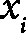
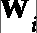
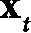
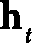

# 第六章：自然语言处理和循环神经网络

本章将介绍两个不同但互补的主题——**自然语言处理**（**NLP**）和**循环神经网络**（**RNNs**）。NLP 教会计算机处理和分析自然语言文本，以执行诸如机器翻译、情感分析和文本生成等任务。与计算机视觉中的图像不同，自然文本代表了一种不同类型的数据，其中元素的顺序（或序列）非常重要。幸运的是，RNNs 非常适合处理顺序数据，如文本或时间序列。通过在这些序列上定义递归关系（因此得名），它们帮助我们处理可变长度的序列。这使得 NLP 和 RNNs 成为天然的盟友。事实上，RNNs 可以应用于任何问题，因为已经证明它们是图灵完备的——从理论上讲，它们可以模拟任何常规计算机无法计算的程序。

然而，这并不全是好消息，我们需要从一个免责声明开始。尽管 RNNs 具有很好的理论特性，但我们现在知道它们在实际应用中有一定的局限性。这些局限性大多已经被一种更新的**神经网络**（**NN**）架构——**transformer**克服，我们将在*第七章*中讨论它。从理论上讲，transformer 相比 RNNs 有更多的限制。但有时候，实践证明它表现得更好。尽管如此，我相信本章对你仍然是有益的。一方面，RNNs 具有优雅的架构，仍然代表着神经网络中的重要一类；另一方面，本章和接下来的三章所呈现的知识进展，将与这些主题在实际研究中的进展紧密相符。因此，你将在接下来的几章中也能应用这里学到的概念。本章还将帮助你充分理解新模型的优势。

本章将涵盖以下主题：

+   自然语言处理

+   介绍 RNNs

# 技术要求

我们将在本章中使用 Python、PyTorch 和 TorchText 包（[`github.com/pytorch/text`](https://github.com/pytorch/text)）来实现示例。如果你没有配置这些工具的环境，不必担心——该示例可以在 Google Colab 上的 Jupyter Notebook 中运行。你可以在本书的 GitHub 仓库中找到代码示例：[`github.com/PacktPublishing/Python-Deep-Learning-Third-Edition/tree/main/Chapter06`](https://github.com/PacktPublishing/Python-Deep-Learning-Third-Edition/tree/main/Chapter06)。

# 自然语言处理

NLP 是机器学习的一个子领域，使计算机能够解释、操作和理解人类语言。这个定义听起来有点枯燥，因此，为了提供一些清晰度，让我们从一个非详尽的任务列表开始，看看都有哪些任务属于 NLP 的范畴：

+   **文本分类**：这会为整个输入文本分配一个标签。例如，**情感分析**可以判断一篇产品评论是积极的还是消极的。

+   **标记分类**：这为每个输入文本的标记分配一个标签。标记是文本的构建块（或单位）。单词可以是标记。一个流行的标记分类任务是**命名实体识别**，它为每个标记分配一个预定义类别列表，如地点、公司或人物。**词性**（**POS**）标注为每个单词分配一个特定的词性，如名词、动词或形容词。

+   **文本生成**：这是利用输入文本生成具有任意长度的新文本。文本生成任务包括机器翻译、问答和文本摘要（在保留原文精髓的同时创建简短版本）。

解决自然语言处理（NLP）问题并非易事。为了理解其原因，我们先回顾一下计算机视觉（*第四章*），其中输入的图像以像素强度的二维张量表示，具有以下特点：

+   图像由像素构成，并且没有其他显式定义的结构

+   像素基于彼此的接近度，形成了隐式的更大物体的层次结构

+   只有一种类型的像素，其仅由标量强度来定义

由于其同质化的结构，我们可以将（几乎）原始的图像输入到**卷积神经网络**（**CNN**）中，让它以相对较少的数据预处理做出处理。

现在，让我们回到文本数据，它具有以下特点：

+   有不同类型的字符，具有不同的语义意义，如字母、数字和标点符号。此外，我们还可能遇到以前未见过的符号。

+   自然文本有着显式的层次结构，包括字符、单词、句子和段落。我们还有引号、标题和层次结构的标题。

+   文本的某些部分可能与序列中较远的部分有关，而不是它们的直接上下文。例如，一篇虚构故事可能会先介绍一个人名，但随后只用*他*或*她*来提及。这些指代可能被长篇文本序列分隔开，但我们仍然需要能够找到这种关系。

自然文本的复杂性要求在实际神经网络模型发挥作用之前，进行几步预处理。第一步是**归一化**，包括去除多余的空白字符和将所有字母转换为小写。接下来的步骤并不像前面那样简单，因此我们将专门用接下来的两节来讨论这些步骤。

## 分词

一种直观的处理自然语言处理任务的方法是将语料库拆分为单词，这些单词将代表我们模型的基本输入单元。然而，使用单词作为输入并不是固定不变的，我们还可以使用其他元素，比如单个字符、短语，甚至整个句子。这些单元的通用术语是**标记**。标记指代文本语料库的方式，就像像素指代图像一样。将语料库拆分成标记的过程被称为**标记化**（真是意外！）。实体

（例如，执行这种标记化的算法）称为**标记器**。

注意

我们将在本节中讨论的标记器是通用的，意味着它们可以与不同的自然语言处理机器学习算法配合使用。因此，本节中的预处理算法通常用于变换器模型，我们将在*第七章*中介绍这些模型。

接下来，让我们讨论几种标记器的类型：

+   **基于词**：每个单词代表一个独特的标记。这是最直观的标记化方式，但也有严重的缺点。例如，单词*don’t*和*do not*将被表示为不同的标记，但它们的含义是相同的。另一个例子是单词*car*和*cars*，或*ready*和*readily*，它们会被表示为不同的标记，而一个单一的标记会更合适。由于自然语言如此多样，像这样的特殊情况非常多。问题不仅仅在于语义相似的单词会有不同的标记，还在于由此产生的大量唯一标记。这会导致模型计算效率低下。它还会产生许多出现次数较少的标记，这对模型的学习来说是一个挑战。最后，我们可能会遇到在新文本语料库中无法识别的单词。

+   **基于字符**：文本中的每个字符（字母、数字、标点符号等）都是一个独特的标记。通过这种方式，我们可以减少标记数量，因为字符的总数是有限的并且是有限的。由于我们事先知道所有的字符，因此不会遇到未知的符号。

    然而，与基于词的模型相比，这种标记化方法不太直观，因为由字符组成的上下文比基于词的上下文意义较小。虽然唯一标记的数量相对较少，但语料库中的标记总数将非常庞大（等于字符总数）。

+   **子词标记化**：这是一个两步过程，首先将语料库分割成单词。分割文本最明显的方式是通过空格。此外，我们还可以通过空格*和标点符号*来分割文本。在自然语言处理术语中，这一步骤被称为**预标记化**。

    （前缀意味着接下来会进行标记化）。然后，它保留常用词，并将稀有词拆解为更频繁的有意义子词。例如，我们可以将单词*tokenization*分解为核心词*token*和后缀*ization*，每个部分都有自己的标记。然后，当我们遇到*carbonization*这个词时，我们可以将其分解为*carbon*和*ization*。这样，我们会得到两个*ization*的实例，而不是一个*tokenization*和一个*carbonization*。子词标记化还使得可以将未知词分解为已知标记。

特殊服务标记。

为了使标记化的概念起作用，它引入了一些服务性标记。以下是一些服务性标记：

+   **UNK**：替换语料库中的未知标记（可以理解为稀有词汇，如字母数字标识符）。

+   **EOS**：句子（或序列）结束标记。

+   **BOS**：句子（或序列）开始标记。

+   **SEP**：用来分隔两个语义上不同的文本序列，例如问题和答案。

+   **PAD**：这是一个填充标记，它会附加到现有序列中，以便它可以达到某个预定义长度并适应固定长度的小批次。

例如，我们可以将句子*I bought a product called FD543C*标记化为*BOS I bought a product called UNK EOS PAD PAD*，以适应长度为 10 的固定输入。

子词标记化是最流行的标记化方式，因为它结合了基于字符（较小的词汇量）和基于词语（有意义的上下文）标记化的最佳特性。在接下来的几个部分中，我们将讨论一些最流行的子词标记器。

### 字节对编码和 WordPiece。

**字节对编码**（**BPE**，使用子词单元进行稀有词的神经机器翻译，[`arxiv.org/abs/1508.07909`](https://arxiv.org/abs/1508.07909)）是一种流行的子词标记化算法。与其他此类标记器一样，它从预标记化开始，将语料库拆分为单词。

以这个数据集为起点，BPE 的工作方式如下：

1.  从初始的**基础**（或**种子**）**词汇**开始，该词汇由文本语料库中所有单词的单个字符组成。因此，每个单词都是一系列单字符标记。

1.  重复以下步骤，直到标记词汇的大小达到某个最大阈值：

    1.  找出最常一起出现的一对标记（最初这些是单个字符），并将它们合并成一个新的复合标记。

    1.  使用新的复合标记扩展现有的标记词汇。

    1.  使用新的标记结构更新标记化的文本语料库。

为了理解 BPE，让我们假设我们的语料库包含以下（虚构的）单词：`{dab: 5, adab: 4, aab: 7, bub: 9, bun: 2}`。每个单词后面的数字表示该单词在文本中出现的次数。以下是相同的语料库，但已经按符号（即字符）拆分：`{(d, a, b): 5, (a, d, a, b): 4, (a, a, b): 7, (b, u, b): 9, (b, u, c): 2}`。基于此，我们可以构建我们的初始符号词汇表，每个符号的出现次数为：`{b: 36, a: 27, u: 11, d: 9, c: 2}`。以下列表展示了前四次合并操作：

1.  最常见的符号对是`(a, b)`，其出现次数为`freq((a, b)) = 5 + 4 + 7 = 16`次。因此，我们将它们合并，语料库变为`{(d,` `): 5, (a, d,` `): 4, (a,` `): 7, (b, u, b): 9, (b, u, c): 2}`。新的符号词汇表是`{b: 20,` `: 16, a: 11, u: 11, d: 9,` `c: 2}`。

1.  新的最常见的符号对是`(b, u)`，其`freq((b, u)) = 9 + 2 = 11`次出现。接着，我们将它们合并为一个新的符号：`{(d, ab): 5, (a, d, ab): 4, (a, ab): 7, (``, b): 9, (``, c): 2}`。更新后的符号词汇表是`{ab: 16, a: 11,` `: 11, b: 9, d: 9,` `c: 2}`。

1.  下一个符号对是`(d, ab)`，其出现次数为`freq((d, ab)) = 5 + 4 = 9`次。合并后，符号化的语料库变为`{(``): 5, (a,` `): 4, (a, ab): 7, (bu, b): 9, (bu, c): 2}`。新的符号词汇表是`{a: 11, bu: 11, b: 9,` `: 9, ab: 7,` `c: 2}`。

1.  新的符号对是`(bu, b)`，其出现次数为 9 次。将它们合并后，语料库变为`{(dab): 5, (a, dab): 4, (a, ab): 7, (``): 9, (bu, c): 2}`，

    而符号词汇表变为`{a: 11,` `: 9,` `: 9, ab: 7, bu: 2,` `c: 2}`。

BPE 会存储所有符号合并规则及其顺序，而不仅仅是最终的符号词汇表。在模型推理过程中，它会按照相同的顺序将规则应用于新的未知文本，以对其进行符号化。

词尾符号

原始 BPE 实现会在每个单词的末尾添加一个特殊的词尾符号`<w/>`，例如，单词`aab`变为`aab<w/>`。其他实现可以将该特殊符号放在单词的开头，而不是末尾。这使得算法能够区分，例如，单词`ca<w/>`中的符号`ab`，与`a``<w/>`中的相同符号。因此，算法可以从符号化后的语料库恢复出原始语料库（**去符号化**），否则是无法做到的。本节中，为了简洁起见，我们省略了词尾符号。

让我们回顾一下，我们的基础词汇表包括文本语料库中的所有字符。如果这些是 Unicode 字符（这是通常的情况），我们最终可能会得到一个最多包含 150,000 个词汇的词汇表。而且这还只是我们开始词汇合并过程之前的情况。解决这个问题的一个技巧是借助 **字节级 BPE**。每个 Unicode 字符可以使用多个（最多 4 个）字节进行编码。字节级 BPE 最初将语料库拆分为字节序列，而不是完整的 Unicode 字符。如果一个字符使用 `n` 个字节编码，分词器将把它当作 `n` 个单字节词汇进行处理。通过这种方式，基础词汇表的大小将始终为 256（字节中可以存储的最大唯一值）。此外，字节级 BPE 保证我们不会遇到未知的词汇。

**WordPiece** ([`arxiv.org/abs/1609.08144`](https://arxiv.org/abs/1609.08144)) 是另一种子词分词算法。它与 BPE 相似，但有一个主要区别。像 BPE 一样，它从单个字符的基础词汇表开始，然后将它们合并成新的复合词汇。然而，它根据一个得分来定义合并顺序，得分通过以下公式计算（与使用频繁共现的 BPE 不同）：

![<math xmlns="http://www.w3.org/1998/Math/MathML" display="block"><mrow><mrow><mi>s</mi><mi>c</mi><mi>o</mi><mi>r</mi><mi>e</mi><mfenced open="(" close=")"><mfenced open="(" close=")"><mrow><mi>t</mi><mi>o</mi><mi>k</mi><mi>e</mi><msub><mi>n</mi><mn>1</mn></msub><mo>,</mo><mi>t</mi><mi>o</mi><mi>k</mi><mi>e</mi><msub><mi>n</mi><mn>2</mn></msub></mrow></mfenced></mfenced><mo>=</mo><mfrac><mrow><mi>f</mi><mi>r</mi><mi>e</mi><mi>q</mi><mfenced open="(" close=")"><mfenced open="(" close=")"><mrow><mi>t</mi><mi>o</mi><mi>k</mi><mi>e</mi><msub><mi>n</mi><mn>1</mn></msub><mo>,</mo><mi>t</mi><mi>o</mi><mi>k</mi><mi>e</mi><msub><mi>n</mi><mn>2</mn></msub></mrow></mfenced></mfenced></mrow><mrow><mi>f</mi><mi>r</mi><mi>e</mi><mi>q</mi><mfenced open="(" close=")"><mrow><mi>t</mi><mi>o</mi><mi>k</mi><mi>e</mi><msub><mi>n</mi><mn>1</mn></msub></mrow></mfenced><mo>×</mo><mi>f</mi><mi>r</mi><mi>e</mi><mi>q</mi><mfenced open="(" close=")"><mrow><mi>t</mi><mi>o</mi><mi>k</mi><mi>e</mi><msub><mi>n</mi><mn>2</mn></msub></mrow></mfenced></mrow></mfrac></mrow></mrow></math>](img/397.png)

通过这种方式，算法优先合并那些在语料库中出现频率较低的词对。让我们将这种方法与 BPE 进行比较，BPE 仅根据新词汇的潜在增益来合并词汇。相比之下，WordPiece 在增益（公式中的分子）和现有词汇的潜在损失（分母）之间进行平衡。这是有道理的，因为新词汇将取代旧的词对，而不是与它们并存。

内部词汇

WordPiece 为单词中的所有标记添加一个特殊的 *##* 前缀，除了第一个。例如，它会将单词 *aab* 标记为 `[a, ##a, ##b]`。标记合并会去掉标记之间的 *##*。因此，当我们合并 *##a* 和 *##b* 时，*aab* 会变成 `[``a, ##ab]`。

与 BPE 不同，WordPiece 只存储最终的标记词汇。当它对新词进行标记时，它会在词汇中找到最长的匹配子词，并在此处分割单词。例如，假设我们想用标记词汇 `[a, ##b, ##c, ##d, ab, ##cd, ##bcd]` 来分割单词 *abcd*。根据新规则，WordPiece 会首先选择最长的子词 *bcd*，然后将 *abcd* 标记为 `[``a, ##bcd]`。

BPE 和 WordPiece 都是贪心算法——它们总是根据频率标准，确定性地合并标记。然而，使用不同的标记对相同的文本序列进行编码是可能的。这可能作为潜在 NLP 算法的正则化方法。接下来，我们将介绍一种利用这一点的标记化技术。

### Unigram

与 BPE 和 WordPiece 不同，**Unigram**（*子词正则化：通过多个子词候选改进神经网络翻译模型*，[`arxiv.org/abs/1804.10959`](https://arxiv.org/abs/1804.10959)）算法从一个大词汇表开始，并逐步尝试将其缩减。初始词汇表是所有独特字符和语料库中最常见子串的并集。找到最常见子串的一种方法是使用 BPE。该算法假设每个标记，，是独立发生的（因此得名 Unigram）。基于这一假设，一个标记，，，的概率就是它出现的次数除以语料库其他部分的总大小。然后，长度为 `M` 的标记序列，，的概率如下：

![<math xmlns="http://www.w3.org/1998/Math/MathML" display="block"><mrow><mrow><mi>P</mi><mfenced open="(" close=")"><mi>x</mi></mfenced><mo>=</mo><mrow><munderover><mo>∏</mo><mrow><mi>i</mi><mo>=</mo><mn>1</mn></mrow><mi>M</mi></munderover><mrow><mi>P</mi><mfenced open="(" close=")"><msub><mi>x</mi><mi>i</mi></msub></mfenced></mrow></mrow><mo>,</mo><mo>∀</mo><msub><mi>x</mi><mi>i</mi></msub><mo>∈</mo><mi>V</mi><mo>,</mo><mrow><munderover><mo>∑</mo><mrow><msub><mi>x</mi><mi>i</mi></msub><mo>∈</mo><mi>V</mi></mrow><mrow /></munderover><mrow><mi>P</mi><mfenced open="(" close=")"><msub><mi>x</mi><mi>i</mi></msub></mfenced></mrow></mrow><mo>=</mo><mn>1</mn></mrow></mrow></math>](img/402.png)

这里，`V` 是完整的标记词汇表。

假设我们有相同的令牌序列，`X`，并且有多个令牌分割候选项，，

对于该序列。最可能的分割候选项，`x`*，对于`X`如下：


让我们通过一个例子来澄清这一点。我们假设我们的语料库包含一些（假想的）单词，`{dab: 5, aab: 7, bun: 4}`，其中数字表示该单词在文本中的出现次数。我们的初始令牌词汇是所有唯一字符和所有可能子字符串的并集（数字表示频率）：`{a: 19, b: 16, ab: 12, aa: 7, da: 5, d: 5, bu: 4, un: 4}`。所有令牌频率的总和为 19 + 16 + 12 + 7 + 5 + 5 + 4 + 4 = 72。然后，每个令牌的独立概率为 ![<mml:math xmlns:mml="http://www.w3.org/1998/Math/MathML" xmlns:m="http://schemas.openxmlformats.org/officeDocument/2006/math"><mml:mi>P</mml:mi><mml:mfenced separators="|"><mml:mrow><mml:msub><mml:mrow><mml:mi>x</mml:mi></mml:mrow><mml:mrow><mml:mi>i</mml:mi></mml:mrow></mml:msub></mml:mrow></mml:mfenced><mml:mo>=</mml:mo><mml:mi>c</mml:mi><mml:mi>o</mml:mi><mml:mi>u</mml:mi><mml:mi>n</mml:mi><mml:mi>t</mml:mi><mml:mfenced separators="|"><mml:mrow><mml:msub><mml:mrow><mml:mi>x</mml:mi></mml:mrow><mml:mrow><mml:mi>i</mml:mi></mml:mrow></mml:msub></mml:mrow></mml:mfenced><mml:mtext>/</mml:mtext><mml:mn>72</mml:mn></mml:math>](img/405.png) – 例如，，

，等等。

我们扩展的词汇表使我们能够以多种方式对每个序列（为了简化起见，我们将重点放在单词上）进行分词。例如，我们可以将*dab*表示为`{d, a, b}`、`{da, b}`或`{d, ab}`。在这里，每个候选项的概率为 P({d, a, b}) = P(d) * P(a) * P(b) = 0.07 * 0.264 * 0.222 = 0.0041；；。

概率最高的候选项是`x`* = `{da, b}`。

基于此，以下是单元字(token)分词法的逐步实现过程：

1.  从初始的大型基础词汇表`V`开始。

1.  重复以下步骤，直到|`V`|的大小达到某个最小阈值：

    1.  使用**维特比**算法([`en.wikipedia.org/wiki/Viterbi_algorithm`](https://en.wikipedia.org/wiki/Viterbi_algorithm))，找到语料库中所有单词的`l`最佳分词候选项`x`*。使用此算法是必要的，因为这是一项计算密集型任务。选择`l`个候选项，而不是一个，使得可以在相同文本上采样不同的词元序列。你可以将这看作是对输入数据的一种数据增强技术，它为 NLP 算法提供了额外的正则化。一旦我们以这种方式得到了一个分词后的语料库，就可以利用**期望最大化**算法([`en.wikipedia.org/wiki/Expectation%E2%80%93maximization_algorithm`](https://en.wikipedia.org/wiki/Expectation%E2%80%93maximization_algorithm))估计当前词汇表`V`中所有词元的概率。

    1.  对于每个标记，，计算一个特殊的损失函数，，它确定如果我们从标记词汇中移除，语料库的概率如何减少。

    1.  按照它们的排序，并只保留前`n`%的标记（例如，*n = 80*）。始终保留个别字符，以避免未知标记。

这就结束了我们对分词的介绍。这些技术中的一些是在 Transformer 架构出现时发展起来的，我们将在接下来的章节中充分利用它们。但现在，让我们集中讨论 NLP 管道中的另一项基础技术。

## 引入词嵌入

现在我们已经学会了如何对文本语料库进行分词，我们可以继续 NLP 数据处理管道中的下一步。为了简便起见，我们假设我们已将语料库分割成单词，而不是子词或字符（在本节中，*单词*和*标记*是可以互换的）。

将序列中的词作为输入传递给 NLP 算法的一种方法是使用独热编码。我们的输入向量的大小将与词汇中标记的数量相同，每个标记将具有唯一的独热编码表示。然而，这种方法有一些缺点，如下所示：

+   **稀疏输入**：独热编码表示大多数值为零，只有一个非零值。如果我们的 NLP 算法是神经网络（而且确实如此），这种类型的输入每个词只会激活其权重的一小部分。因此，我们需要一个大规模的训练集，以包含每个词汇中足够数量的训练样本。

+   **计算强度**：词汇的庞大规模将导致输入张量很大，这需要更大的神经网络和更多的计算资源。

+   **不切实际**：每次我们向词汇表中添加一个新单词时，词汇表的大小会增加。然而，独热编码的输入大小也会增加。因此，我们必须改变神经网络的结构以适应新的大小，并且需要进行额外的训练。

+   **缺乏上下文**：像*dog*和*wolf*这样的单词在语义上是相似的，但独热编码表示无法传达这种相似性。

在本节中，我们将通过低维分布式表示法来解决这些问题，这种表示被称为**词嵌入**（*神经概率语言模型*，[`www.jmlr.org/papers/volume3/bengio03a/bengio03a.pdf`](http://www.jmlr.org/papers/volume3/bengio03a/bengio03a.pdf)）。分布式表示是通过学习一个嵌入函数来创建的，该函数将独热编码的单词转化为低维的词嵌入空间，具体如下：


图 6.1 – 词汇 -> 独热编码 -> 词嵌入向量

从词汇表中，大小为`V`的单词被转化为大小为`V`的独热编码向量。然后，**嵌入函数**将这个`V`维空间转化为一个**固定**大小的分布式表示（向量），`D`（这里，*D=4*）。这个向量作为输入传递给 NLP 算法。我们可以看到，固定且较小的向量大小解决了我们刚才提到的稀疏性、计算强度和不切实际的问题。接下来，我们将看到它是如何解决上下文问题的。

嵌入函数学习关于单词的语义信息。它将词汇表中的每个单词映射到一个连续值向量表示——即词嵌入。每个单词在这个嵌入空间中对应一个点，不同的维度对应这些单词的语法或语义属性。嵌入空间的概念类似于潜在空间表示，我们在*第五章*中首次讨论了这一点，涉及到扩散模型。

目标是确保在嵌入空间中彼此接近的词语具有相似的含义。这里所说的*接近*是指它们的嵌入向量的点积（相似度）值较高。通过这种方式，某些词语在语义上相似的信息可以被机器学习算法利用。例如，它可能会学到*fox*和*cat*在语义上是相关的，并且*the quick brown fox*和*the quick brown cat*都是有效的短语。然后，一个词语序列可以被一组嵌入向量所替代，这些向量捕捉了这些词语的特征。我们可以将这个序列作为各种自然语言处理（NLP）任务的基础。例如，试图对文章情感进行分类的分类器，可能会基于之前学到的词嵌入进行训练，而不是使用独热编码向量。通过这种方式，词语的语义信息可以轻松地为情感分类器所用。

独热表示与嵌入向量之间的映射

假设我们已经计算出了每个词元的嵌入向量。一种实现一热编码表示与实际嵌入向量之间映射的方法是借助一个*V×D*形状的矩阵，。我们可以把矩阵的行看作查找表，其中每一行代表一个词的嵌入向量。这个过程之所以可行，是因为输入的词是经过一热编码的，这个向量中除了对应词的索引位置是 1 外，其它位置全为 0。因此，输入的词，，将仅激活其对应的唯一行（向量）权重，，位于中。因此，对于每一个输入样本（词），只有该词的嵌入向量会参与计算。我们还可以把看作一个**全连接**（**FC**）神经网络层的权重矩阵。通过这种方式，我们可以将嵌入（明白了吗？）作为神经网络的第一层 —— 即，神经网络将一热编码的词元作为输入，嵌入层将其转换为一个向量。然后，神经网络的其余部分使用嵌入向量而不是一热编码表示。这是所有深度学习库中常见的标准实现。

词嵌入的概念最早是在 20 多年前提出的，但至今仍是自然语言处理领域的核心范式之一。**大型语言模型**（**LLMs**），例如 ChatGPT，使用的是改进版的词嵌入，我们将在*第七章*中讨论。

现在我们已经熟悉了嵌入向量，我们将继续进行获取和计算嵌入向量的算法。

## Word2Vec

很多研究都致力于创建更好的词嵌入模型，特别是通过省略对单词序列的概率函数学习来实现。其中一种最流行的方法是**Word2Vec** ([`papers.nips.cc/paper/5021-distributed-representations-of-words-and-phrases-and-their-compositionality.pdf`](http://papers.nips.cc/paper/5021-distributed-representations-of-words-and-phrases-and-their-compositionality.pdf), https://arxiv.org/abs/1301.3781, 和 https://arxiv.org/abs/1310.4546)。它基于目标词的上下文（周围单词）创建嵌入向量。更具体地说，上下文是目标词前后的`n`个单词。下图展示了上下文窗口在文本中滑动，围绕不同的目标词：


图 6.2 – 一个 Word2Vec 滑动上下文窗口，n=2。相同类型的上下文窗口适用于 CBOW 和 skip-gram

Word2Vec 有两种版本：**连续词袋模型** (**CBOW**) 和 **skip-gram**。我们将从 CBOW 开始，然后继续讨论 skip-gram。

### CBOW

CBOW 根据上下文（周围单词）预测最可能的词。例如，给定序列 *the quick _____ fox jumps*，模型将预测 *brown*。它对上下文窗口内的所有单词赋予相等的权重，并且不考虑它们的顺序（因此名字中有“*bag*”）。我们可以借助以下简单的神经网络进行训练，该网络包含输入层、隐藏层和输出层：


图 6.3 – 一个 CBOW 模型神经网络

下面是模型的工作方式：

+   输入是一个独热编码的单词表示（其长度等于词汇表大小，`V`）。

+   嵌入向量由*输入到隐藏*矩阵表示，。

+   所有上下文单词的嵌入向量被平均以产生隐藏网络层的输出（没有激活函数）。

+   隐藏层激活值作为输入传递给**Softmax**输出层，大小为`V`（与隐藏到输出的权重矩阵，)，用于预测最可能出现在输入词汇上下文（邻近）中的词汇。具有最高激活值的索引表示最相关的单词，采用独热编码表示。

我们将使用梯度下降和反向传播训练神经网络。训练集包含的是（上下文和标签）一对一的独热编码单词对，这些单词在文本中彼此接近。例如，如果文本的一部分是 `[the, quick, brown, fox, jumps]` 且 *n=2*，训练元组将包括 `([quick, brown], the)`，`([the, brown, fox], quick)`，`([the, quick, fox jumps], brown)` 等等。由于我们只关心词嵌入，，我们将在训练完成后丢弃输出神经网络的权重，。

CBOW 会告诉我们在给定上下文中最可能出现的单词。这对于稀有词可能是一个问题。例如，给定上下文 *今天的天气真是 _____*, 模型会预测单词 *beautiful* 而不是 *fabulous*（嘿，这只是个例子）。CBOW 的训练速度是 skip-gram 的几倍，而且对于常见单词的准确度稍好。

### Skip-gram

Skip-gram 模型可以预测给定输入单词的上下文（与 CBOW 相反）。例如，单词 *brown* 会预测单词 *The quick fox jumps*。与 CBOW 不同，输入是单一的独热编码单词向量。但如何在输出中表示上下文单词呢？Skip-gram 不试图同时预测整个上下文（所有周围单词），而是将上下文转化为多个训练对，例如 `(fox, the)`，`(fox, quick)`，`(fox, brown)` 和 `(fox, jumps)`。再次强调，我们可以用一个简单的单层神经网络训练该模型：


图 6.4 – 一个 Skip-gram 模型神经网络

与 CBOW 一样，输出是一个 softmax，表示独热编码的最可能上下文单词。输入到隐藏层的权重，，表示词嵌入查找表，隐藏到输出的权重，，仅在训练过程中相关。隐藏层没有激活函数（即，它使用线性激活）。

我们将使用反向传播训练模型（这里没有惊讶的地方）。给定一系列单词，，skip-gram 模型的目标是最大化平均对数概率，其中`n`是窗口大小：

![<mml:math xmlns:mml="http://www.w3.org/1998/Math/MathML" xmlns:m="http://schemas.openxmlformats.org/officeDocument/2006/math" display="block"><mml:mfrac><mml:mrow><mml:mn>1</mml:mn></mml:mrow><mml:mrow><mml:mi>M</mml:mi></mml:mrow></mml:mfrac><mml:mrow><mml:munderover><mml:mo stretchy="false">∑</mml:mo><mml:mrow><mml:mi>m</mml:mi><mml:mo>=</mml:mo><mml:mn>1</mml:mn></mml:mrow><mml:mrow><mml:mi>M</mml:mi></mml:mrow></mml:munderover><mml:mrow><mml:mrow><mml:munderover><mml:mo stretchy="false">∑</mml:mo><mml:mrow><mml:mi>i</mml:mi><mml:mo>=</mml:mo><mml:mo>-</mml:mo><mml:mi>n</mml:mi><mml:mo>,</mml:mo><mml:mi>i</mml:mi><mml:mo>≠</mml:mo><mml:mn>0</mml:mn></mml:mrow><mml:mrow><mml:mi>i</mml:mi><mml:mo>=</mml:mo><mml:mi>n</mml:mi></mml:mrow></mml:munderover><mml:mrow><mml:mi>l</mml:mi><mml:mi>o</mml:mi><mml:mi>g</mml:mi><mml:mi>P</mml:mi><mml:mfenced separators="|"><mml:mrow><mml:msub><mml:mrow><mml:mi>w</mml:mi></mml:mrow><mml:mrow><mml:mi>m</mml:mi><mml:mo>+</mml:mo><mml:mi>i</mml:mi></mml:mrow></mml:msub></mml:mrow><mml:mrow><mml:msub><mml:mrow><mml:mi>w</mml:mi></mml:mrow><mml:mrow><mml:mi>m</mml:mi></mml:mrow></mml:msub></mml:mrow></mml:mfenced></mml:mrow></mml:mrow></mml:mrow></mml:mrow></mml:math>](img/428.png)

该模型定义了概率，，如以下 softmax 公式所示：

![<math xmlns="http://www.w3.org/1998/Math/MathML" display="block"><mrow><mrow><mi>P</mi><mfenced open="(" close=")"><mrow><msub><mi>w</mi><mi>O</mi></msub><mo>|</mo><msub><mi>w</mi><mi>I</mi></msub></mrow></mfenced><mo>=</mo><mfrac><mrow><mi>e</mi><mi>x</mi><mi>p</mi><mfenced open="(" close=")"><mrow><msubsup><mi mathvariant="bold">v</mi><msub><mi>w</mi><mi>O</mi></msub><mrow><mo>′</mo><mi mathvariant="normal">⊤</mi></mrow></msubsup><msub><mi mathvariant="bold">v</mi><msub><mi>w</mi><mi>I</mi></msub></msub></mrow></mfenced></mrow><mrow><msubsup><mo>∑</mo><mrow><mi>w</mi><mo>=</mo><mn>1</mn></mml:math>](img/430.png)

在这个例子中， 和  是输入和输出单词，而*`v`*和*`v`*' 是输入和输出权重矩阵中的相应词向量， 和 ，分别表示（我们保留了论文中的原始符号）。由于神经网络没有隐藏激活函数，其对于一对输入/输出单词的输出值仅仅是输入词向量 和输出词向量 （因此需要进行转置操作）。

Word2Vec 论文的作者指出，词表示无法表示那些不是由单个词组成的习语。例如，*New York Times* 是一家报纸，而不仅仅是 *New*、*York* 和 *Times* 各自含义的自然组合。为了解决这个问题，模型可以扩展到包括完整的短语。然而，这会显著增加词汇表的大小。而且，正如我们从前面的公式中看到的，softmax 的分母需要计算所有词汇的输出向量。此外， 矩阵的每个权重都在每一步训练时被更新，这也减慢了训练速度。

为了解决这个问题，我们可以用所谓的 `(fox, brown)` 替代 softmax 操作，并添加 `k` 个额外的负样本对（例如，`(fox, puzzle)`），其中 `k` 通常在 [5,20] 的范围内。我们不再预测最符合输入词的单词（softmax），而是直接预测当前的词对是否为真实的。实际上，我们将多项分类问题（从多个类别中选择一个）转化为二元逻辑回归（或二分类）问题。通过学习正负词对的区别，分类器最终会以与多项分类相同的方式学习词向量。在 Word2Vec 中，负样本词是从一个特殊分布中抽取的，该分布比频繁的词更常抽取不常见的词。

与稀有词相比，一些最常出现的词携带的信息量较少。此类词的例子包括定冠词和不定冠词 `a`、*an* 和 *the*。与 *the* 和 *city* 相比，模型从观察 *London* 和 *city* 的搭配中获益更多，因为几乎所有的词都与 *the* 经常同时出现。反之亦然——在大量例子上训练后，频繁词的向量表示不会发生显著变化。为了应对稀有词和频繁词之间的不平衡，论文的作者提出了一种子采样方法，其中训练集中的每个词，，会以某个概率被丢弃，这个概率通过启发式公式计算得出。

 是单词  的频率，`t`是一个阈值（通常约为 ）：


它会积极地对频率大于`t`的单词进行子采样，同时保持频率的排名。

我们可以说，一般而言，跳字模型（skip-gram）在稀有词上的表现比 CBOW 更好，但训练时间更长。

现在我们已经了解了嵌入向量，让我们学习如何可视化它们。

## 可视化嵌入向量

一个成功的词嵌入函数将语义相似的单词映射到嵌入空间中具有高点积相似度的向量。为了说明这一点，我们将实现以下步骤：

1.  在`text8`数据集上训练 Word2Vec 跳字模型，该数据集包含来自维基百科的前 1 亿字节的纯文本（[`mattmahoney.net/dc/textdata.html`](http://mattmahoney.net/dc/textdata.html)）。每个嵌入向量是 100 维的，这是该类型模型的默认值。

1.  选择一个*种子*词列表。在此案例中，词语包括*mother*、*car*、*tree*、*science*、*building*、*elephant*和*green*。

1.  计算每个种子词的 Word2Vec 嵌入向量与词汇表中所有其他单词嵌入向量之间的点积相似度。然后，为每个种子词选择一组前`k`（在我们的例子中，*k=5*）个最相似的单词（基于它们的点积相似度）。

1.  在二维图中可视化种子嵌入与其相似词汇聚类嵌入之间的相似性。由于嵌入是 100 维的，我们将使用 t-SNE（[`en.wikipedia.org/wiki/T-distributed_stochastic_neighbor_embedding`](https://en.wikipedia.org/wiki/T-distributed_stochastic_neighbor_embedding)）降维算法。它将每个高维嵌入向量映射到二维或三维点，方法是将相似的对象建模为邻近点，而将不相似的对象建模为距离较远的点，且这种建模方式具有较高的概率。我们可以在下面的散点图中看到结果：


图 6.5 – t-SNE 可视化种子词及其最相似词汇的聚类

该图证明了所获得的词向量包含了与单词相关的信息。

Word2Vec（和类似的模型）创建**静态**（或**上下文无关**）**嵌入**。每个单词都有一个单一的嵌入向量，基于该单词在文本语料库中的所有出现（即所有上下文）。这带来了一些局限性。例如，*bank*在不同的上下文中有不同的含义，如*river bank*（河岸）、*savings bank*（储蓄银行）和*bank holiday*（银行假日）。尽管如此，它还是通过单一的嵌入进行表示。此外，静态嵌入没有考虑上下文中的单词顺序。例如，表达式*I like apples, but I don’t like oranges*（我喜欢苹果，但我不喜欢橙子）和*I like oranges, but I don’t like apples*（我喜欢橙子，但我不喜欢苹果）具有相反的含义，但 Word2Vec 将它们视为相同的句子。我们可以通过所谓的**动态**（**上下文相关**）**嵌入**来解决这些问题，后者将在*第七章*中讨论。

到目前为止，我们一直专注于单个单词（或标记）。接下来，我们将扩展我们的研究范围，探索文本序列。

## 语言模型

基于词的**语言模型**（**LM**）定义了一个词汇序列的概率分布。对于本节内容，我们假设这些词元是单词。给定一个长度为`m`（例如，一个句子）的单词序列，语言模型会为该序列分配一个概率，，表示这个完整的单词序列可能存在。这些概率的一种应用是生成模型，用于创建新文本——基于词的语言模型可以计算出下一个单词的可能性，前提是已知前面的单词序列。一旦我们得到了这个新单词，就可以将它添加到现有序列中，接着预测下一个新单词，依此类推。通过这种方式，我们可以生成任意长度的新文本序列。例如，给定序列*the quick brown*，语言模型可能会预测*fox*作为下一个最可能的单词。然后，序列变成*the quick brown fox*，我们再次让语言模型基于更新后的序列预测新的最可能单词。输出依赖于先前值以及其随机性（即带有一定随机性）的输出（新值）的模型，被称为**自回归模型**。

接下来，我们将重点关注词序列的属性，而不是模型本身。

注意

即使是最先进的 LLM，例如 ChatGPT，也是自回归模型——它们每次只预测下一个单词。

### 理解 N-gram 模型

推断长序列的概率，例如，通常是不可行的。为了理解原因，我们可以注意到，利用联合概率链式法则可以计算出。

![<mml:math xmlns:mml="http://www.w3.org/1998/Math/MathML" xmlns:m="http://schemas.openxmlformats.org/officeDocument/2006/math" display="block"><mml:mi>P</mml:mi><mml:mfenced separators="|"><mml:mrow><mml:msub><mml:mrow><mml:mi>w</mml:mi></mml:mrow><mml:mrow><mml:mn>1</mml:mn></mml:mrow></mml:msub><mml:mo>…</mml:mo><mml:msub><mml:mrow><mml:mi>w</mml:mi></mml:mrow><mml:mrow><mml:mi>m</mml:mi></mml:mrow></mml:msub></mml:mrow></mml:mfenced><mml:mo>=</mml:mo><mml:mi>P</mml:mi><mml:mfenced separators="|"><mml:mrow><mml:msub><mml:mrow><mml:mi>w</mml:mi></mml:mrow><mml:mrow><mml:mi>m</mml:mi></mml:mrow></mml:msub></mml:mrow><mml:mrow><mml:msub><mml:mrow><mml:mi>w</mml:mi></mml:mrow><mml:mrow><mml:mn>1</mml:mn></mml:mrow></mml:msub><mml:mo>…</mml:mo><mml:msub><mml:mrow><mml:mi>w</mml:mi></mml:mrow><mml:mrow><mml:mi>m</mml:mi><mml:mo>-</mml:mo><mml:mn>1</mml:mn></mml:mrow></mml:msub></mml:mrow></mml:mfenced><mml:mo>…</mml:mo><mml:mi>P</mml:mi><mml:mfenced separators="|"><mml:mrow><mml:msub><mml:mrow><mml:mi>w</mml:mi></mml:mrow><mml:mrow><mml:mn>3</mml:mn></mml:mrow></mml:msub></mml:mrow><mml:mrow><mml:msub><mml:mrow><mml:mi>w</mml:mi></mml:mrow><mml:mrow><mml:mn>1</mml:mn></mml:mrow></mml:msub><mml:mo>,</mml:mo><mml:msub><mml:mrow><mml:mi>w</mml:mi></mml:mrow><mml:mrow><mml:mn>2</mml:mn></mml:mrow></mml:msub></mml:mrow></mml:mfenced><mml:mi>P</mml:mi><mml:mfenced separators="|"><mml:mrow><mml:msub><mml:mrow><mml:mi>w</mml:mi></mml:mrow><mml:mrow><mml:mn>2</mml:mn></mml:mrow></mml:msub></mml:mrow><mml:mrow><mml:msub><mml:mrow><mml:mi>w</mml:mi></mml:mrow><mml:mrow><mml:mn>1</mml:mn></mml:mrow></mml:msub></mml:mrow></mml:mfenced><mml:mi>P</mml:mi><mml:mfenced separators="|"><mml:mrow><mml:msub><mml:mrow><mml:mi>w</mml:mi></mml:mrow><mml:mrow><mml:mn>1</mml:mn></mml:mrow></mml:msub></mml:mrow></mml:mfenced></mml:math>](img/446.png)  

给定前面的单词，后面的单词的概率尤其难以从数据中估计。这就是为什么这种联合概率通常通过独立性假设来近似，假设第 `i` 个单词仅依赖于前面 *n-1* 个单词。我们只会对 `n` 个连续单词的组合进行联合概率建模，这些组合称为 `n`-grams。例如，在短语 *the quick brown fox* 中，我们有以下 `n`-grams：  

+   **1-gram** (**unigram**)：*the*、*quick*、*brown* 和 *fox*（这就是 unigram 分词法的来源）

+   **2-gram** (**bigram**)：*the quick*、*quick brown* 和 *brown fox*  

+   **3-gram** (**trigram**)：*the quick brown* 和 *quick* *brown fox*  

+   **4-gram**：*the quick* *brown fox*  

注意  

`n`-gram 术语可以指其他长度为 `n` 的序列类型，例如 `n` 个字符。  

联合分布的推断通过 `n`-gram 模型来逼近，该模型将联合分布分割成多个独立部分。如果我们有大量的文本语料库，可以找到所有 `n`-gram，直到某个 `n`（通常为 2 到 4），并统计每个 `n`-gram 在该语料库中的出现次数。通过这些计数，我们可以估算每个 `n`-gram 最后一个单词的概率，前提是给定前 *n-1* 个单词：

+   Unigram: ![<mml:math xmlns:mml="http://www.w3.org/1998/Math/MathML" xmlns:m="http://schemas.openxmlformats.org/officeDocument/2006/math"><mml:mi>P</mml:mi><mml:mfenced separators="|"><mml:mrow><mml:mi>w</mml:mi></mml:mrow></mml:mfenced><mml:mo>=</mml:mo><mml:mfrac><mml:mrow><mml:mi>c</mml:mi><mml:mi>o</mml:mi><mml:mi>u</mml:mi><mml:mi>n</mml:mi><mml:mi>t</mml:mi><mml:mfenced separators="|"><mml:mrow><mml:mi>w</mml:mi></mml:mrow></mml:mfenced></mml:mrow><mml:mrow><mml:mtext>语料库中单词的总数</mml:mtext></mml:mrow></mml:mfrac></mml:math>](img/447.png)

+   Bigram: ![<math xmlns="http://www.w3.org/1998/Math/MathML"><mrow><mrow><mi>P</mi><mfenced open="(" close=")"><mrow><msub><mi>w</mi><mi>i</mi></msub><mo>|</mo><msub><mi>w</mi><mrow><mi>i</mi><mo>−</mo><mn>1</mn></mrow></msub></mrow></mfenced><mo>=</mo><mstyle scriptlevel="+1"><mfrac><mrow><mi>c</mi><mi>o</mi><mi>u</mi><mi>n</mi><mi>t</mi><mfenced open="(" close=")"><mrow><msub><mi>w</mi><mrow><mi>i</mi><mo>−</mo><mn>1</mn></mrow></msub><mo>,</mo><msub><mi>w</mi><mi>i</mi></msub></mrow></mfenced></mrow><mrow><mi>c</mi><mi>o</mi><mi>u</mi><mi>n</mi><mi>t</mi><mfenced open="(" close=")"><msub><mi>w</mi><mrow><mi>i</mi><mo>−</mo><mn>1</mn></mrow></msub></mfenced></mrow></mfrac></mstyle></mrow></mrow></math>](img/448.png)

+   `n`-gram: ![<math xmlns="http://www.w3.org/1998/Math/MathML"><mrow><mrow><mi>P</mi><mfenced open="(" close=")"><mrow><msub><mi>w</mi><mrow><mi>n</mi><mo>+</mo><mi>i</mi></mrow></msub><mo>|</mo><msub><mi>w</mi><mi>n</mi></msub><mo>,</mo><mo>…</mo><mo>,</mo><msub><mi>w</mi><mrow><mi>n</mi><mo>+</mo><mi>i</mi><mo>−</mo><mn>1</mn></mrow></msub></mrow></mfenced><mo>=</mo><mstyle scriptlevel="+1"><mfrac><mrow><mi>c</mi><mi>o</mi><mi>u</mi><mi>n</mi><mi>t</mi><mfenced open="(" close=")"><mrow><msub><mi>w</mi><mi>n</mi></msub><mo>,</mo><mo>…</mo><mo>,</mo><msub><mi>w</mi><mrow><mi>n</mi><mo>+</mo><mi>i</mi><mo>−</mo><mn>1</mn></mrow></msub><mo>,</mo><msub><mi>w</mi><mrow><mi>n</mi><mo>+</mo><mi>i</mi></mrow></msub></mrow></mfenced></mrow><mrow><mi>c</mi><mi>o</mi><mi>u</mi><mi>n</mi><mi>t</mi><mfenced open="(" close=")"><mrow><msub><mi>w</mi><mi>n</mi></msub><mo>,</mo><mo>…</mo><mo>,</mo><msub><mi>w</mi><mrow><mi>n</mi><mo>+</mo><mi>i</mi><mo>−</mo><mn>1</mn></mrow></msub></mrow></mfenced></mrow></mfrac></mstyle></mrow></mrow></math>](img/449.png)

假设独立性，即第 `i` 个单词只依赖于前 *n-1* 个单词，现在可以用来逼近联合分布。

例如，我们可以通过以下公式近似单元语法的联合分布：

![<mml:math xmlns:mml="http://www.w3.org/1998/Math/MathML" xmlns:m="http://schemas.openxmlformats.org/officeDocument/2006/math" display="block"><mml:mi>P</mml:mi><mml:mfenced separators="|"><mml:mrow><mml:msub><mml:mrow><mml:mi>w</mml:mi></mml:mrow><mml:mrow><mml:mn>1</mml:mn></mml:mrow></mml:msub><mml:mo>,</mml:mo><mml:mo>…</mml:mo><mml:mo>,</mml:mo><mml:msub><mml:mrow><mml:mi>w</mml:mi></mml:mrow><mml:mrow><mml:mi>m</mml:mi></mml:mrow></mml:msub></mml:mrow></mml:mfenced><mml:mo>=</mml:mo><mml:mi>P</mml:mi><mml:mfenced separators="|"><mml:mrow><mml:msub><mml:mrow><mml:mi>w</mml:mi></mml:mrow><mml:mrow><mml:mn>1</mml:mn></mml:mrow></mml:msub></mml:mrow></mml:mfenced><mml:mi>P</mml:mi><mml:mfenced separators="|"><mml:mrow><mml:msub><mml:mrow><mml:mi>w</mml:mi></mml:mrow><mml:mrow><mml:mn>2</mml:mn></mml:mrow></mml:msub></mml:mrow></mml:mfenced><mml:mo>…</mml:mo><mml:mi>P</mml:mi><mml:mfenced separators="|"><mml:mrow><mml:msub><mml:mrow><mml:mi>w</mml:mi></mml:mrow><mml:mrow><mml:mi>m</mml:mi></mml:mrow></mml:msub></mml:mrow></mml:mfenced></mml:math>](img/450.png)

对于三元组，我们可以通过以下公式近似联合分布：

![<mml:math xmlns:mml="http://www.w3.org/1998/Math/MathML" xmlns:m="http://schemas.openxmlformats.org/officeDocument/2006/math" display="block"><mml:mi>P</mml:mi><mml:mfenced separators="|"><mml:mrow><mml:msub><mml:mrow><mml:mi>w</mml:mi></mml:mrow><mml:mrow><mml:mn>1</mml:mn></mml:mrow></mml:msub><mml:mo>,</mml:mo><mml:mo>…</mml:mo><mml:mo>,</mml:mo><mml:msub><mml:mrow><mml:mi>w</mml:mi></mml:mrow><mml:mrow><mml:mi>m</mml:mi></mml:mrow></mml:msub></mml:mrow></mml:mfenced><mml:mo>=</mml:mo><mml:mi>P</mml:mi><mml:mfenced separators="|"><mml:mrow><mml:msub><mml:mrow><mml:mi>w</mml:mi></mml:mrow><mml:mrow><mml:mn>1</mml:mn></mml:mrow></mml:msub></mml:mrow></mml:mfenced><mml:mi>P</mml:mi><mml:mfenced separators="|"><mml:mrow><mml:msub><mml:mrow><mml:mi>w</mml:mi></mml:mrow><mml:mrow><mml:mn>2</mml:mn></mml:mrow></mml:msub></mml:mrow><mml:mrow><mml:msub><mml:mrow><mml:mi>w</mml:mi></mml:mrow><mml:mrow><mml:mn>1</mml:mn></mml:mrow></mml:msub></mml:mrow></mml:mfenced><mml:mi>P</mml:mi><mml:mfenced separators="|"><mml:mrow><mml:msub><mml:mrow><mml:mi>w</mml:mi></mml:mrow><mml:mrow><mml:mn>3</mml:mn></mml:mrow></mml:msub></mml:mrow><mml:mrow><mml:msub><mml:mrow><mml:mi>w</mml:mi></mml:mrow><mml:mrow><mml:mn>1</mml:mn></mml:mrow></mml:msub><mml:mo>,</mml:mo><mml:msub><mml:mrow><mml:mi>w</mml:mi></mml:mrow><mml:mrow><mml:mn>2</mml:mn></mml:mrow></mml:msub></mml:mrow></mml:mfenced><mml:mo>…</mml:mo><mml:mi>P</mml:mi><mml:mfenced separators="|"><mml:mrow><mml:msub><mml:mrow><mml:mi>w</mml:mi></mml:mrow><mml:mrow><mml:mi>m</mml:mi></mml:mrow></mml:msub></mml:mrow><mml:mrow><mml:msub><mml:mrow><mml:mi>w</mml:mi></mml:mrow><mml:mrow><mml:mi>m</mml:mi><mml:mo>-</mml:mo><mml:mn>2</mml:mn></mml:mrow></mml:msub><mml:mo>,</mml:mo><mml:msub><mml:mrow><mml:mi>w</mml:mi></mml:mrow><mml:mrow><mml:mi>m</mml:mi><mml:mo>-</mml:mo><mml:mn>1</mml:mn></mml:mrow></mml:msub></mml:mrow></mml:mfenced></mml:math>](img/451.png)

我们可以看到，基于词汇表的大小，`n`-gram 的数量随着`n`的增加呈指数增长。例如，如果一个小型词汇表包含 100 个词，那么可能的 5-gram 数量将是  种不同的 5-gram。相比之下，莎士比亚的全部作品包含大约 30,000 个不同的单词，这说明使用大`n`的`n`-gram 是不可行的。不仅存在存储所有概率的问题，而且我们还需要一个非常大的文本语料库，才能为更大的`n`值创建合理的`n`-gram 概率估计。

高维诅咒

当可能的输入变量（单词）数量增加时，这些输入值的不同组合数量会呈指数增长。这个问题被称为维度灾难。当学习算法需要每个相关值组合至少一个例子时，就会出现这种情况，这正是`n`-gram 建模中所面临的问题。我们的`n`越大，就能越好地逼近原始分布，但我们需要更多的数据才能对`n`-gram 概率进行良好的估计。

但不用担心，因为`n`-gram 语言模型给了我们一些重要线索，帮助我们继续前进。它的理论公式是可靠的，但维度灾难使其不可行。此外，`n`-gram 模型强调了单词上下文的重要性，就像 Word2Vec 一样。在接下来的几节中，我们将学习如何借助神经网络模拟`n`-gram 模型的概率分布。

# 介绍 RNN

RNN 是一种可以处理具有可变长度的顺序数据的神经网络。此类数据的例子包括文本序列或某股票在不同时间点的价格。通过使用*顺序*一词，我们意味着序列元素彼此相关，且它们的顺序很重要。例如，如果我们把一本书中的所有单词随机打乱，文本将失去意义，尽管我们仍然能够知道每个单独的单词。

RNN 得名于它对序列应用相同函数的递归方式。我们可以将 RNN 定义为递归关系：

![<mml:math xmlns:mml="http://www.w3.org/1998/Math/MathML" xmlns:m="http://schemas.openxmlformats.org/officeDocument/2006/math" display="block"><mml:msub><mml:mrow><mml:mi mathvariant="bold">s</mml:mi></mml:mrow><mml:mrow><mml:mi>t</mml:mi></mml:mrow></mml:msub><mml:mo>=</mml:mo><mml:mi>f</mml:mi><mml:mfenced separators="|"><mml:mrow><mml:msub><mml:mrow><mml:mi mathvariant="bold">s</mml:mi></mml:mrow><mml:mrow><mml:mi>t</mml:mi><mml:mo>-</mml:mo><mml:mn>1</mml:mn></mml:mrow></mml:msub><mml:mo>,</mml:mo><mml:msub><mml:mrow><mml:mi mathvariant="bold">x</mml:mi></mml:mrow><mml:mrow><mml:mi>t</mml:mi></mml:mrow></mml:msub></mml:mrow></mml:mfenced></mml:math>](img/453.png)

在这里，`f` 是一个可微分的函数， 是称为内部 RNN 状态的值向量（在步骤 `t` 处），而  是步骤 `t` 处的网络输入。与常规的神经网络不同，常规神经网络的状态只依赖于当前的输入（和 RNN 权重），而在这里， 是当前输入以及先前状态  的函数。你可以把  看作是 RNN 对所有先前输入的总结。递归关系定义了状态如何在序列中一步一步地演变，通过对先前状态的反馈循环，如下图所示：


图 6.6 – 展开的 RNN

左侧展示了 RNN 递归关系的可视化示意图，右侧展示了 RNN 状态在序列 *t-1*、`t`、*t+1* 上的递归展开。

RNN 有三组参数（或权重），这些参数在所有步骤之间共享：

+   *`U`*：将输入，，转换为状态，

+   *`W`*：将前一个状态，，转化为当前状态，

+   *`V`*：将新计算出的内部状态，，映射到输出，

*`U`*、*`V`* 和 *`W`* 对各自的输入应用线性变换。最基本的这种变换就是我们熟知并喜爱的全连接（FC）操作（因此，*`U`*、*`V`* 和 *`W`* 是权重矩阵）。我们现在可以定义内部状态和 RNN 输出如下：

![<mml:math xmlns:mml="http://www.w3.org/1998/Math/MathML" xmlns:m="http://schemas.openxmlformats.org/officeDocument/2006/math" display="block"><mml:msub><mml:mrow><mml:mi mathvariant="bold">s</mml:mi></mml:mrow><mml:mrow><mml:mi>t</mml:mi></mml:mrow></mml:msub><mml:mo>=</mml:mo><mml:mi>f</mml:mi><mml:mfenced separators="|"><mml:mrow><mml:msub><mml:mrow><mml:mi mathvariant="bold">s</mml:mi></mml:mrow><mml:mrow><mml:mi>t</mml:mi><mml:mo>-</mml:mo><mml:mn>1</mml:mn></mml:mrow></mml:msub><mml:mi mathvariant="bold">W</mml:mi><mml:mo>+</mml:mo><mml:msub><mml:mrow><mml:mi mathvariant="bold">x</mml:mi></mml:mrow><mml:mrow><mml:mi>t</mml:mi></mml:mrow></mml:msub><mml:mi mathvariant="bold">U</mml:mi></mml:mrow></mml:mfenced></mml:math>](img/465.png)


这里，`f` 是非线性激活函数（如 tanh、sigmoid 或 ReLU）。

例如，在一个基于单词的语言模型（LM）中，输入 `x` 将是一个词嵌入向量的序列 ()。

状态 `s` 将是一个状态向量的序列 ()。最后，输出 `y` 将是下一个单词序列的概率向量 ()。

请注意，在一个递归神经网络（RNN）中，每个状态依赖于通过递归关系的所有先前计算。这个重要的含义是，RNN 能够随着时间记忆，因为状态  包含基于之前步骤的信息。从理论上讲，RNN 可以记住信息很长一段时间，但实际上它们只能回溯几步。我们将在 *消失和爆炸* *梯度* 部分详细讨论这个问题。

我们描述的 RNN 在某种程度上等同于一个单层常规神经网络（NN），但带有额外的递归关系。和常规神经网络一样，我们可以堆叠多个 RNN 来形成 **堆叠 RNN**。在时间 `t` 时，RNN 单元在第 `l` 层的单元状态  将接收来自第 *l-1* 层的 RNN 单元的输出  以及该层相同层级 `l` 的先前单元状态 。

![<mml:math xmlns:mml="http://www.w3.org/1998/Math/MathML" xmlns:m="http://schemas.openxmlformats.org/officeDocument/2006/math" display="block"><mml:msubsup><mml:mrow><mml:mi mathvariant="bold">s</mml:mi></mml:mrow><mml:mrow><mml:mi>t</mml:mi></mml:mrow><mml:mrow><mml:mi>l</mml:mi></mml:mrow></mml:msubsup><mml:mo>=</mml:mo><mml:mi>f</mml:mi><mml:mfenced separators="|"><mml:mrow><mml:msubsup><mml:mrow><mml:mi mathvariant="bold">s</mml:mi></mml:mrow><mml:mrow><mml:mi>t</mml:mi><mml:mo>-</mml:mo><mml:mn>1</mml:mn></mml:mrow><mml:mrow><mml:mi>l</mml:mi></mml:mrow></mml:msubsup><mml:mo>,</mml:mo><mml:msubsup><mml:mrow><mml:mi mathvariant="bold">y</mml:mi></mml:mrow><mml:mrow><mml:mi>t</mml:mi></mml:mrow><mml:mrow><mml:mi>l</mml:mi><mml:mo>-</mml:mo><mml:mn>1</mml:mn></mml:mrow></mml:msubsup></mml:mrow></mml:mfenced></mml:math>](img/474.png)

在下图中，我们可以看到展开的堆叠 RNN：


图 6.7 – 堆叠 RNN

因为 RNN 不仅限于处理固定大小的输入，它们扩展了我们可以通过神经网络（NNs）计算的可能性。根据输入和输出大小之间的关系，我们可以识别几种类型的任务：

+   **一对一**：非顺序处理，例如前馈神经网络（NNs）和卷积神经网络（CNNs）。前馈神经网络和将 RNN 应用于单个时间步之间没有太大区别。一对一处理的一个例子是图像分类。

+   **一对多**：基于单一输入生成一个序列——例如，从图像生成标题（*展示与讲解：神经图像标题生成器*， [`arxiv.org/abs/1411.4555`](https://arxiv.org/abs/1411.4555)）。

+   **多对一**：根据一个序列输出一个结果——例如，文本的情感分类。

+   **多对多间接**：一个序列被编码成一个状态向量，之后该状态向量被解码成一个新的序列——例如，语言翻译（*使用 RNN 编码器-解码器学习短语表示用于统计机器翻译*， [`arxiv.org/abs/1406.1078`](https://arxiv.org/abs/1406.1078) 和 *序列到序列学习与神经网络*， [`papers.nips.cc/paper/5346-sequence-to-sequence-learning-with-neural-networks.pdf`](http://papers.nips.cc/paper/5346-sequence-to-sequence-learning-with-neural-networks.pdf)）。

+   **多对多直接**：为每个输入步骤输出一个结果——例如，语音识别中的帧音素标注。

注意

多对多模型通常被称为 **序列到序列** (**seq2seq**) 模型。

以下是前述输入输出组合的图示表示：


图 6.8 – RNN 输入输出组合，灵感来源于 [`karpathy.github.io/2015/05/21/rnn-effectiveness/`](http://karpathy.github.io/2015/05/21/rnn-effectiveness/)

既然我们已经介绍了 RNN，现在让我们通过实现一个简单的 RNN 示例来加深对其的理解。

## RNN 实现与训练

在上一节中，我们简要讨论了 RNN 是什么以及它们可以解决哪些问题。接下来，让我们深入了解 RNN 的细节，并通过一个非常简单的玩具示例进行训练：计算序列中的 1 的数量。

我们将教一个基本的 RNN 如何计算输入中 1 的数量，并在序列结束时输出结果。这是一个多对一关系的例子，正如我们在上一节中定义的那样。

我们将使用 Python（不使用深度学习库）和 numpy 实现这个例子。以下是输入和输出的示例：

```py
In: (0, 0, 0, 0, 1, 0, 1, 0, 1, 0)
Out: 3
```

我们将使用的 RNN 如下图所示：


图 6.9 – 用于计算输入中 1 的基本 RNN

注意

由于 ，，`U`，`W` 和 `y` 都是标量值（*`x`* 仍然是一个向量），所以在 RNN 的实现和训练部分及其子部分中，我们不会使用矩阵表示法（粗体大写字母）。我们将使用斜体表示法。在代码部分，我们将它们表示为变量。然而，值得注意的是，这些公式的通用版本使用的是矩阵和向量参数。

RNN 只会有两个参数：一个输入权重 `U` 和一个递归权重 `W`。输出权重 `V` 设置为 1，这样我们只需将最后的状态作为输出 `y`。

首先，让我们添加一些代码，以便我们的例子可以执行。我们将导入 numpy 并定义我们的训练集——输入 *`x`* 和标签 `y`。*`x`* 是二维的，因为第一维代表了小批量中的样本。`y` 是一个单一的数值（它仍然有一个批量维度）。为了简单起见，我们将使用一个只有单一样本的小批量：

```py
import numpy as np
# The first dimension represents the mini-batch
x = np.array([[0, 0, 0, 0, 1, 0, 1, 0, 1, 0]])
y = np.array([3])
```

由该 RNN 定义的递归关系是 ![<mml:math xmlns:mml="http://www.w3.org/1998/Math/MathML" xmlns:m="http://schemas.openxmlformats.org/officeDocument/2006/math"><mml:msub><mml:mrow><mml:mi>s</mml:mi></mml:mrow><mml:mrow><mml:mi>t</mml:mi></mml:mrow></mml:msub><mml:mo>=</mml:mo><mml:mi>f</mml:mi><mml:mfenced separators="|"><mml:mrow><mml:msub><mml:mrow><mml:mi>s</mml:mi></mml:mrow><mml:mrow><mml:mi>t</mml:mi><mml:mo>-</mml:mo><mml:mn>1</mml:mn></mml:mrow></mml:msub><mml:mi>W</mml:mi><mml:mo>+</mml:mo><mml:msub><mml:mrow><mml:mi>x</mml:mi></mml:mrow><mml:mrow><mml:mi>t</mml:mi></mml:mrow></mml:msub><mml:mi>U</mml:mi></mml:mrow></mml:mfenced></mml:math>](img/477.png)。请注意，这是一个线性模型，因为我们没有在这个公式中应用非线性函数。我们可以通过以下方式实现递归关系：

```py
def step(s_t, x_t, U, W):
    return x_t * U + s_t * W
```

状态 `s_t` 和权重 `W` 和 `U` 是单一的标量值。`x_t` 表示输入序列中的单个元素（在我们的例子中，是 0 或 1）。

注意

解决这个任务的一个方法是直接获取输入序列中元素的和。如果我们设置 `U=1`，那么每当输入被接收时，我们将得到它的完整值。如果我们设置 `W=1`，那么我们所累积的值将不会衰减。因此，对于这个例子，我们将得到期望的输出：3。然而，让我们用这个简单的例子来解释 RNN 的训练和实现。接下来的部分将会很有趣，我们将看到这些内容。

我们可以将 RNN 视为一种特殊类型的常规神经网络，通过时间展开它，进行一定数量的时间步（如前面的图所示）。这个常规神经网络的隐藏层数量等于输入序列元素的大小。换句话说，一个隐藏层代表时间中的一步。唯一的区别是每一层有多个输入：前一个状态，，和当前输入，。参数`U`和`W`在所有隐藏层之间共享。

前向传播沿序列展开 RNN，并为每个步骤构建状态堆栈。在下面的代码块中，我们可以看到前向传播的实现，它返回每个递归步骤和批次中每个样本的激活值`s`：

```py
def forward(x, U, W):
    # Number of samples in the mini-batch
    number_of_samples = len(x)
    # Length of each sample
    sequence_length = len(x[0])
    # Initialize the state activation for each sample along the sequence
    s = np.zeros((number_of_samples, sequence_length + 1))
    # Update the states over the sequence
    for t in range(0, sequence_length):
        s[:, t + 1] = step(s[:, t], x[:, t], U, W)  # step function
    return s
```

现在我们有了 RNN 的前向传播，我们来看一下如何训练展开的 RNN。

## 时间反向传播

**时间反向传播**（**BPTT**）是我们用来训练 RNN 的典型算法（*时间反向传播：它的作用与如何实现*，[`axon.cs.byu.edu/~martinez/classes/678/Papers/Werbos_BPTT.pdf`](http://axon.cs.byu.edu/~martinez/classes/678/Papers/Werbos_BPTT.pdf)）。顾名思义，它是我们在*第二章*中讨论的反向传播算法的一个改进版。

假设我们将使用**均方误差**（**MSE**）损失函数。现在我们也有了前向传播步骤的实现，我们可以定义梯度如何向后传播。由于展开的 RNN 等同于一个常规的前馈神经网络，我们可以使用在*第二章*中介绍的反向传播链式法则。

因为权重`W`和`U`在各层之间是共享的，所以我们将在每个递归步骤中累积误差导数，最后用累积的值来更新权重。

首先，我们需要获取输出的梯度，，关于损失函数 `J`，*∂J/∂s*。一旦我们获得了它，我们将通过在前向步骤中构建的活动堆栈向后传播。这个反向传播过程从堆栈中弹出活动，在每个时间步积累它们的误差导数。通过 RNN 传播这个梯度的递归关系可以写成如下（链式法则）：

![<mml:math xmlns:mml="http://www.w3.org/1998/Math/MathML" xmlns:m="http://schemas.openxmlformats.org/officeDocument/2006/math" display="block"><mml:mfrac><mml:mrow><mml:mo>∂</mml:mo><mml:mi>J</mml:mi></mml:mrow><mml:mrow><mml:mo>∂</mml:mo><mml:msub><mml:mrow><mml:mi>s</mml:mi></mml:mrow><mml:mrow><mml:mi>t</mml:mi><mml:mo>-</mml:mo><mml:mn>1</mml:mn></mml:mrow></mml:msub></mml:mrow></mml:mfrac><mml:mo>=</mml:mo><mml:mfrac><mml:mrow><mml:mo>∂</mml:mo><mml:mi>J</mml:mi></mml:mrow><mml:mrow><mml:mo>∂</mml:mo><mml:msub><mml:mrow><mml:mi>s</mml:mi></mml:mrow><mml:mrow><mml:mi>t</mml:mi></mml:mrow></mml:msub></mml:mrow></mml:mfrac><mml:mfrac><mml:mrow><mml:mo>∂</mml:mo><mml:msub><mml:mrow><mml:mi>s</mml:mi></mml:mrow><mml:mrow><mml:mi>t</mml:mi></mml:mrow></mml:msub></mml:mrow><mml:mrow><mml:mo>∂</mml:mo><mml:msub><mml:mrow><mml:mi>s</mml:mi></mml:mrow><mml:mrow><mml:mi>t</mml:mi><mml:mo>-</mml:mo><mml:mn>1</mml:mn></mml:mrow></mml:msub></mml:mrow></mml:mfrac><mml:mo>=</mml:mo><mml:mfrac><mml:mrow><mml:mo>∂</mml:mo><mml:mi>J</mml:mi></mml:mrow><mml:mrow><mml:mo>∂</mml:mo><mml:msub><mml:mrow><mml:mi>s</mml:mi></mml:mrow><mml:mrow><mml:mi>t</mml:mi></mml:mrow></mml:msub></mml:mrow></mml:mfrac><mml:mi>W</mml:mi></mml:math>](img/481.png)

权重 `U` 和 `W` 的梯度将如下方式积累：

![<mml:math xmlns:mml="http://www.w3.org/1998/Math/MathML" xmlns:m="http://schemas.openxmlformats.org/officeDocument/2006/math" display="block"><mml:mfrac><mml:mrow><mml:mo>∂</mml:mo><mml:mi>J</mml:mi></mml:mrow><mml:mrow><mml:mo>∂</mml:mo><mml:mi>U</mml:mi></mml:mrow></mml:mfrac><mml:mo>=</mml:mo><mml:mrow><mml:munderover><mml:mo stretchy="false">∑</mml:mo><mml:mrow><mml:mi>t</mml:mi><mml:mo>=</mml:mo><mml:mn>0</mml:mn></mml:mrow><mml:mrow><mml:mi>n</mml:mi></mml:mrow></mml:munderover><mml:mrow><mml:mfrac><mml:mrow><mml:mo>∂</mml:mo><mml:mi>J</mml:mi></mml:mrow><mml:mrow><mml:mo>∂</mml:mo><mml:msub><mml:mrow><mml:mi>s</mml:mi></mml:mrow><mml:mrow><mml:mi>t</mml:mi></mml:mrow></mml:msub></mml:mrow></mml:mfrac><mml:msub><mml:mrow><mml:mi>x</mml:mi></mml:mrow><mml:mrow><mml:mi>t</mml:mi></mml:mrow></mml:msub></mml:mrow></mml:mrow></mml:math>](img/482.png)

![<mml:math xmlns:mml="http://www.w3.org/1998/Math/MathML" xmlns:m="http://schemas.openxmlformats.org/officeDocument/2006/math" display="block"><mml:mfrac><mml:mrow><mml:mo>∂</mml:mo><mml:mi>J</mml:mi></mml:mrow><mml:mrow><mml:mo>∂</mml:mo><mml:mi>W</mml:mi></mml:mrow></mml:mfrac><mml:mo>=</mml:mo><mml:mrow><mml:munderover><mml:mo stretchy="false">∑</mml:mo><mml:mrow><mml:mi>t</mml:mi><mml:mo>=</mml:mo><mml:mn>0</mml:mn></mml:mrow><mml:mrow><mml:mi>n</mml:mi></mml:mrow></mml:munderover><mml:mrow><mml:mfrac><mml:mrow><mml:mo>∂</mml:mo><mml:mi>J</mml:mi></mml:mrow><mml:mrow><mml:mo>∂</mml:mo><mml:msub><mml:mrow><mml:mi>s</mml:mi></mml:mrow><mml:mrow><mml:mi>t</mml:mi></mml:mrow></mml:msub></mml:mrow></mml:mfrac><mml:msub><mml:mrow><mml:mi>s</mml:mi></mml:mrow><mml:mrow><mml:mi>t</mml:mi><mml:mo>-</mml:mo><mml:mn>1</mml:mn></mml:mrow></mml:msub></mml:mrow></mml:mrow></mml:math>](img/483.png)

掌握了这些知识后，让我们实现反向传播：

1.  将 `U` 和 `W` 的梯度分别累积到 `gU` 和 `gW` 中：

    ```py
    def backward(x, s, y, W):
        sequence_length = len(x[0])
        # The network output is just the last activation of sequence
        s_t = s[:, -1]
        # Compute the gradient of the output w.r.t. MSE cost function at final state
        gS = 2 * (s_t - y)
        # Set the gradient accumulations to 0
        gU, gW = 0, 0
        # Accumulate gradients backwards
        for k in range(sequence_length, 0, -1):
            # Compute the parameter gradients and accumulate the results.
            gU += np.sum(gS * x[:, k - 1])
            gW += np.sum(gS * s[:, k - 1])
            # Compute the gradient at the output of the previous layer
            gS = gS * W
        return gU, gW
    ```

1.  使用梯度下降法优化我们的 RNN。通过反向传播函数计算梯度（使用 MSE），并用这些梯度来更新权重值：

    ```py
    def train(x, y, epochs, learning_rate=0.0005):
        # Set initial parameters
        weights = (-2, 0)  # (U, W)
        # Accumulate the losses and their respective weights
        losses, gradients_u, gradients_w = list(), list(), list()
        # Perform iterative gradient descent
        for i in range(epochs):
            # Perform forward and backward pass to get the gradients
            s = forward(x, weights[0], weights[1])
            # Compute the loss
            loss = (y[0] - s[-1, -1]) ** 2
            # Store the loss and weights values for later display
            losses.append(loss)
            gradients = backward(x, s, y, weights[1])
            gradients_u.append(gradients[0])
            gradients_w.append(gradients[1])
            # Update each parameter `p` by p = p - (gradient * learning_rate).
            # `gp` is the gradient of parameter `p`
            weights = tuple((p - gp * learning_rate) for p, gp in zip(weights, gradients))
        return np.array(losses), np.array(gradients_u), np.array(gradients_w)
    ```

1.  运行 150 个训练周期：

    ```py
    losses, gradients_u, gradients_w = train(x, y,
         epochs=150)
    ```

1.  最后，显示每个权重在训练过程中的损失函数和梯度。我们将通过 `plot_training` 函数来实现，虽然这个函数在此处未实现，但可以在 GitHub 上的完整示例中找到。`plot_training` 会生成如下图表：


图 6.10 – RNN 损失 – 实线 – 损失值；虚线 – 训练过程中权重的梯度

现在我们已经学习了时间反向传播，让我们来讨论熟悉的梯度消失和梯度爆炸问题是如何影响它的。

## 梯度消失和梯度爆炸

前面的示例有一个问题。为了说明这个问题，让我们用更长的序列运行训练过程：

```py
x = np.array([[0, 0, 0, 0, 1, 0, 1, 0, 1, 0, 0, 0, 0, 0, 1, 0, 1, 0, 1, 0, 0, 0, 0, 0, 1, 0, 1, 0, 1, 0, 0, 0, 0, 0, 1, 0, 1, 0, 1, 0]])
y = np.array([12])
losses, gradients_u, gradients_w = train(x, y, epochs=150)
plot_training(losses, gradients_u, gradients_w)
```

输出结果如下：

```py
RuntimeWarning: overflow encountered in multiply
  return x * U + s * W
RuntimeWarning: invalid value encountered in multiply
  gU += np.sum(gS * x[:, k - 1])
RuntimeWarning: invalid value encountered in multiply
  gW += np.sum(gS * s[:, k - 1])
```

出现这些警告的原因是最终的参数 `U` 和 `W` 会通过 `plot_training` 函数生成以下结果：


图 6.11 – 在梯度爆炸情景下的参数和损失函数

在初期的训练阶段，梯度会缓慢增加，类似于它们在较短序列中增加的方式。然而，当达到第 23 个 epoch 时（虽然确切的 epoch 并不重要），梯度变得非常大，以至于超出了浮点变量的表示范围，变成了 NaN（如图中的跳跃所示）。这个问题被称为**梯度爆炸**。我们可以在常规的前馈神经网络中遇到梯度爆炸问题，但在 RNN 中尤为显著。为了理解原因，回顾一下我们在*时间反向传播*部分定义的两个连续序列步骤的递归梯度传播链规则：

![<mml:math xmlns:mml="http://www.w3.org/1998/Math/MathML" xmlns:m="http://schemas.openxmlformats.org/officeDocument/2006/math" display="block"><mml:mfrac><mml:mrow><mml:mo>∂</mml:mo><mml:mi>J</mml:mi></mml:mrow><mml:mrow><mml:mo>∂</mml:mo><mml:msub><mml:mrow><mml:mi>s</mml:mi></mml:mrow><mml:mrow><mml:mi>t</mml:mi><mml:mo>-</mml:mo><mml:mn>1</mml:mn></mml:mrow></mml:msub></mml:mrow></mml:mfrac><mml:mo>=</mml:mo><mml:mfrac><mml:mrow><mml:mo>∂</mml:mo><mml:mi>J</mml:mi></mml:mrow><mml:mrow><mml:mo>∂</mml:mo><mml:msub><mml:mrow><mml:mi>s</mml:mi></mml:mrow><mml:mrow><mml:mi>t</mml:mi></mml:mrow></mml:msub></mml:mrow></mml:mfrac><mml:mfrac><mml:mrow><mml:mo>∂</mml:mo><mml:msub><mml:mrow><mml:mi>s</mml:mi></mml:mrow><mml:mrow><mml:mi>t</mml:mi></mml:mrow></mml:msub></mml:mrow><mml:mrow><mml:mo>∂</mml:mo><mml:msub><mml:mrow><mml:mi>s</mml:mi></mml:mrow><mml:mrow><mml:mi>t</mml:mi><mml:mo>-</mml:mo><mml:mn>1</mml:mn></mml:mrow></mml:msub></mml:mrow></mml:mfrac><mml:mo>=</mml:mo><mml:mfrac><mml:mrow><mml:mo>∂</mml:mo><mml:mi>J</mml:mi></mml:mrow><mml:mrow><mml:mo>∂</mml:mo><mml:msub><mml:mrow><mml:mi>s</mml:mi></mml:mrow><mml:mrow><mml:mi>t</mml:mi></mml:mrow></mml:msub></mml:mrow></mml:mfrac><mml:mi>W</mml:mi></mml:math>](img/481.png)

根据序列的长度，展开的 RNN 相比常规的神经网络可以更深。同时，RNN 的权重`W`在所有步骤中是共享的。因此，我们可以将这个公式推广，用来计算序列中两个非连续步骤之间的梯度。由于`W`是共享的，方程形成了一个几何级数：

![<mml:math xmlns:mml="http://www.w3.org/1998/Math/MathML" xmlns:m="http://schemas.openxmlformats.org/officeDocument/2006/math" display="block"><mml:mfrac><mml:mrow><mml:mo>∂</mml:mo><mml:msub><mml:mrow><mml:mi>s</mml:mi></mml:mrow><mml:mrow><mml:mi>t</mml:mi></mml:mrow></mml:msub></mml:mrow><mml:mrow><mml:mo>∂</mml:mo><mml:msub><mml:mrow><mml:mi>s</mml:mi></mml:mrow><mml:mrow><mml:mi>t</mml:mi><mml:mo>-</mml:mo><mml:mi>k</mml:mi></mml:mrow></mml:msub></mml:mrow></mml:mfrac><mml:mo>=</mml:mo><mml:mfrac><mml:mrow><mml:mo>∂</mml:mo><mml:msub><mml:mrow><mml:mi>s</mml:mi></mml:mrow><mml:mrow><mml:mi>t</mml:mi></mml:mrow></mml:msub></mml:mrow><mml:mrow><mml:mo>∂</mml:mo><mml:msub><mml:mrow><mml:mi>s</mml:mi></mml:mrow><mml:mrow><mml:mi>t</mml:mi><mml:mo>-</mml:mo><mml:mn>1</mml:mn></mml:mrow></mml:msub></mml:mrow></mml:mfrac><mml:mfrac><mml:mrow><mml:mo>∂</mml:mo><mml:msub><mml:mrow><mml:mi>s</mml:mi></mml:mrow><mml:mrow><mml:mi>t</mml:mi><mml:mo>-</mml:mo><mml:mn>1</mml:mn></mml:mrow></mml:msub></mml:mrow><mml:mrow><mml:mo>∂</mml:mo><mml:msub><mml:mrow><mml:mi>s</mml:mi></mml:mrow><mml:mrow><mml:mi>t</mml:mi><mml:mo>-</mml:mo><mml:mn>2</mml:mn></mml:mrow></mml:msub></mml:mrow></mml:mfrac><mml:mo>…</mml:mo><mml:mfrac><mml:mrow><mml:mo>∂</mml:mo><mml:msub><mml:mrow><mml:mi>s</mml:mi></mml:mrow><mml:mrow><mml:mi>t</mml:mi><mml:mo>-</mml:mo><mml:mi>k</mml:mi><mml:mo>+</mml:mo><mml:mn>1</mml:mn></mml:mrow></mml:msub></mml:mrow><mml:mrow><mml:mo>∂</mml:mo><mml:mi>t</mml:mi><mml:mo>-</mml:mo><mml:mi>k</mml:mi></mml:mrow></mml:mfrac><mml:mo>=</mml:mo><mml:mrow><mml:munderover><mml:mo stretchy="false">∏</mml:mo><mml:mrow><mml:mi>j</mml:mi><mml:mo>=</mml:mo><mml:mn>1</mml:mn></mml:mrow><mml:mrow><mml:mi>k</mml:mi></mml:mrow></mml:munderover><mml:mrow><mml:mfrac><mml:mrow><mml:mo>∂</mml:mo><mml:msub><mml:mrow><mml:mi>s</mml:mi></mml:mrow><mml:mrow><mml:mi>t</mml:mi><mml:mo>-</mml:mo><mml:mi>j</mml:mi><mml:mo>+</mml:mo><mml:mn>1</mml:mn></mml:mrow></mml:msub></mml:mrow><mml:mrow><mml:mo>∂</mml:mo><mml:msub><mml:mrow><mml:mi>s</mml:mi></mml:mrow><mml:mrow><mml:mi>t</mml:mi><mml:mo>-</mml:mo><mml:mi>j</mml:mi></mml:mrow></mml:msub></mml:mrow></mml:mfrac><mml:mi>W</mml:mi></mml:mrow></mml:mrow></mml:math>](img/485.png)

在我们简单的线性 RNN 中，如果*|W|>1*（梯度爆炸），梯度会呈指数增长，其中`W`是一个标量权重——例如，50 个时间步长下，当*W=1.5*时，结果是 。如果*|W|<1*（梯度消失），梯度会呈指数衰减，例如，10 个时间步长下，当*W=0.6*时，结果是 。如果权重参数`W`是矩阵而不是标量，那么这种梯度爆炸或梯度消失现象与`W`的最大特征值*ρ*（也称为谱半径）有关。当*ρ<1*时，梯度消失；当*ρ>1*时，梯度爆炸。

我们在第*3 章*中首先提到的梯度消失问题，在 RNN 中还有另一个更微妙的影响：梯度随着步数的增加呈指数衰减，直到在较早的状态下变得极其小。实际上，它们被来自较晚时间步长的更大梯度所掩盖，导致 RNN 无法保留这些早期状态的历史。这个问题更难以察觉，因为训练仍然会继续进行，且神经网络仍会生成有效的输出（与梯度爆炸不同）。只是它无法学习长期依赖。

通过这些内容，我们已经熟悉了 RNN 的一些问题。这些知识对我们接下来的讨论非常有帮助，因为在下一节中，我们将讨论如何借助一种特殊的 RNN 单元来解决这些问题。

## 长短时记忆

Hochreiter 和 Schmidhuber 广泛研究了梯度消失和梯度爆炸的问题，并提出了一种解决方案，称为**长短时记忆网络**（**LSTM** – [`www.bioinf.jku.at/publications/older/2604.pdf`](https://www.bioinf.jku.at/publications/older/2604.pdf) 和 *Learning to Forget: Continual Prediction with LSTM*, https://citeseerx.ist.psu.edu/viewdoc/download?doi=10.1.1.55.5709&rep=rep1&type=pdf）。LSTM 由于特别设计的记忆单元，可以处理长期依赖问题。它们表现得如此出色，以至于目前大多数 RNN 在解决各种问题时的成功都归功于 LSTM 的使用。在本节中，我们将探索这个记忆单元是如何工作的，以及它如何解决梯度消失的问题。

以下是一个 LSTM 单元的示意图：


Figure 6.12 – LSTM 细胞（顶部）；展开的 LSTM 细胞（底部）。灵感来源于 [`colah.github.io/posts/2015-08-Understanding-LSTMs/`](http://colah.github.io/posts/2015-08-Understanding-LSTMs/)

LSTM 的关键思想是细胞状态，（除了隐藏的 RNN 状态，），在没有外部干扰的情况下，信息只能显式写入或移除以保持状态恒定。细胞状态只能通过特定的门来修改，这些门是信息传递的一种方式。典型的 LSTM 由三个门组成：**遗忘门**，**输入门**和**输出门**。细胞状态、输入和输出都是向量，以便 LSTM 可以在每个时间步长保持不同信息块的组合。

LSTM 符号表示

，，以及是 LSTM 在时刻`t`的输入、细胞记忆状态和输出（或隐藏状态）向量。是候选细胞状态向量（稍后会详细介绍）。输入和前一时刻的细胞输出通过一组全连接（FC）权重*`W`*和*`U`*分别与每个门和候选细胞向量相连接。，，以及是 LSTM 细胞的遗忘门、输入门和输出门（这些门也使用向量表示）。

这些门由全连接（FC）层、sigmoid 激活函数和逐元素相乘（表示为 ）组成。由于 sigmoid 函数的输出仅限于 0 到 1 之间，乘法操作只能减少通过门的值。我们按顺序讨论它们：

+   **遗忘门**，：它决定我们是否要擦除现有单元状态的部分内容。它根据前一单元输出的加权向量和当前输入来做出决定，前一单元的输出是 ，当前输入是 ：

![<mml:math xmlns:mml="http://www.w3.org/1998/Math/MathML" xmlns:m="http://schemas.openxmlformats.org/officeDocument/2006/math" display="block"><mml:msub><mml:mrow><mml:mi mathvariant="bold">f</mml:mi></mml:mrow><mml:mrow><mml:mi>t</mml:mi></mml:mrow></mml:msub><mml:mo>=</mml:mo><mml:mi>σ</mml:mi><mml:mfenced separators="|"><mml:mrow><mml:msub><mml:mrow><mml:mi mathvariant="bold">W</mml:mi></mml:mrow><mml:mrow><mml:mi>f</mml:mi></mml:mrow></mml:msub><mml:msub><mml:mrow><mml:mi mathvariant="bold">x</mml:mi></mml:mrow><mml:mrow><mml:mi>t</mml:mi></mml:mrow></mml:msub><mml:mo>+</mml:mo><mml:msub><mml:mrow><mml:mi mathvariant="bold">U</mml:mi></mml:mrow><mml:mrow><mml:mi>f</mml:mi></mml:mrow></mml:msub><mml:msub><mml:mrow><mml:mi mathvariant="bold">h</mml:mi></mml:mrow><mml:mrow><mml:mi>t</mml:mi><mml:mo>-</mml:mo><mml:mn>1</mml:mn></mml:mrow></mml:msub></mml:mrow></mml:mfenced></mml:math>](img/503.png)

从前述公式可以看出，遗忘门对先前状态向量的每个元素应用逐元素 sigmoid 激活，<mml:math xmlns:mml="http://www.w3.org/1998/Math/MathML" xmlns:m="http://schemas.openxmlformats.org/officeDocument/2006/math"><mml:msub><mml:mrow><mml:mi mathvariant="bold">c</mml:mi></mml:mrow><mml:mrow><mml:mi>t</mml:mi><mml:mo>-</mml:mo><mml:mn>1</mml:mn></mml:mrow></mml:msub></mml:math>：（注意圆点符号）。由于操作是逐元素的，因此该向量的值被压缩到[0，1]范围内。输出为 0 意味着特定的单元块被完全清除，而输出为 1 则允许该单元块中的信息通过。通过这种方式，LSTM 能够清除其单元状态向量中的无关信息。

+   **输入门**，：它通过多步骤过程决定将哪些新信息添加到记忆单元中。第一步是决定是否添加任何信息。与遗忘门类似，它的决策是基于 和 ：它通过 sigmoid 函数为候选状态向量的每个单元输出 0 或 1。0 的输出意味着没有信息被添加到该单元的记忆中。因此，LSTM 可以在其单元状态向量中存储特定的片段信息：

![<mml:math xmlns:mml="http://www.w3.org/1998/Math/MathML" xmlns:m="http://schemas.openxmlformats.org/officeDocument/2006/math" display="block"><mml:msub><mml:mrow><mml:mi mathvariant="bold">i</mml:mi></mml:mrow><mml:mrow><mml:mi>t</mml:mi></mml:mrow></mml:msub><mml:mo>=</mml:mo><mml:mi>σ</mml:mi><mml:mfenced separators="|"><mml:mrow><mml:msub><mml:mrow><mml:mi mathvariant="bold">W</mml:mi></mml:mrow><mml:mrow><mml:mi>i</mml:mi></mml:mrow></mml:msub><mml:msub><mml:mrow><mml:mi mathvariant="bold">x</mml:mi></mml:mrow><mml:mrow><mml:mi>t</mml:mi></mml:mrow></mml:msub><mml:mo>+</mml:mo><mml:msub><mml:mrow><mml:mi mathvariant="bold">U</mml:mi></mml:mrow><mml:mrow><mml:mi>i</mml:mi></mml:mrow></mml:msub><mml:msub><mml:mrow><mml:mi mathvariant="bold">h</mml:mi></mml:mrow><mml:mrow><mml:mi>t</mml:mi><mml:mo>-</mml:mo><mml:mn>1</mml:mn></mml:mrow></mml:msub></mml:mrow></mml:mfenced></mml:math>](img/510.png)

在输入门序列的下一步中，我们计算新的候选细胞状态，。它基于先前的输出，，以及当前的输入，，并通过一个 tanh 函数进行转换：

![<mml:math xmlns:mml="http://www.w3.org/1998/Math/MathML" xmlns:m="http://schemas.openxmlformats.org/officeDocument/2006/math" display="block"><mml:msubsup><mml:mrow><mml:mi mathvariant="bold">c</mml:mi></mml:mrow><mml:mrow><mml:mi>t</mml:mi></mml:mrow><mml:mrow><mml:mi>'</mml:mi></mml:mrow></mml:msubsup><mml:mo>=</mml:mo><mml:mi>t</mml:mi><mml:mi>a</mml:mi><mml:mi>n</mml:mi><mml:mi>h</mml:mi><mml:mfenced separators="|"><mml:mrow><mml:msub><mml:mrow><mml:mi mathvariant="bold">W</mml:mi></mml:mrow><mml:mrow><mml:mi>c</mml:mi></mml:mrow></mml:msub><mml:msub><mml:mrow><mml:mi mathvariant="bold">x</mml:mi></mml:mrow><mml:mrow><mml:mi>t</mml:mi></mml:mrow></mml:msub><mml:mo>+</mml:mo><mml:msub><mml:mrow><mml:mi mathvariant="bold">U</mml:mi></mml:mrow><mml:mrow><mml:mi>c</mml:mi></mml:mrow></mml:msub><mml:msub><mml:mrow><mml:mi mathvariant="bold">h</mml:mi></mml:mrow><mml:mrow><mml:mi>t</mml:mi><mml:mo>-</mml:mo><mml:mn>1</mml:mn></mml:mrow></mml:msub></mml:mrow></mml:mfenced></mml:math>](img/514.png)

然后，我们将与输入门的 Sigmoid 输出通过逐元素乘法结合起来：。

总结来说，遗忘门和输入门分别决定了要从先前的和候选单元状态中遗忘和包含哪些信息。最终版本的新单元状态，，只是这两个组成部分的逐元素和：

![<mml:math xmlns:mml="http://www.w3.org/1998/Math/MathML" xmlns:m="http://schemas.openxmlformats.org/officeDocument/2006/math" display="block"><mml:msub><mml:mrow><mml:mi mathvariant="bold">c</mml:mi></mml:mrow><mml:mrow><mml:mi>t</mml:mi></mml:mrow></mml:msub><mml:mo>=</mml:mo><mml:msub><mml:mrow><mml:mi mathvariant="bold">f</mml:mi></mml:mrow><mml:mrow><mml:mi>t</mml:mi></mml:mrow></mml:msub><mml:mo>⨀</mml:mo><mml:msub><mml:mrow><mml:mi mathvariant="bold">c</mml:mi></mml:mrow><mml:mrow><mml:mi>t</mml:mi><mml:mo>-</mml:mo><mml:mn>1</mml:mn></mml:mrow></mml:msub><mml:mo>⊕</mml:mo><mml:msub><mml:mrow><mml:mi mathvariant="bold">b</mml:mi></mml:mrow><mml:mrow><mml:mi>t</mml:mi></mml:mrow></mml:msub><mml:mo>⨀</mml:mo><mml:msubsup><mml:mrow><mml:mi mathvariant="bold">c</mml:mi></mml:mrow><mml:mrow><mml:mi>t</mml:mi></mml:mrow><mml:mrow><mml:mi>'</mml:mi></mml:mrow></mml:msubsup></mml:math>](img/518.png)

+   **输出门**，：它决定了单元格的总输出是什么。它将 和  作为输入。它为每个单元格记忆块输出一个 (0, 1) 范围内的值（通过 sigmoid 函数）。和之前一样，0 表示该块不输出任何信息，1 表示该块可以作为单元格的输出传递。因此，LSTM 可以从其单元格状态向量中输出特定的信息块：

![<mml:math xmlns:mml="http://www.w3.org/1998/Math/MathML" xmlns:m="http://schemas.openxmlformats.org/officeDocument/2006/math" display="block"><mml:msub><mml:mrow><mml:mi mathvariant="bold">o</mml:mi></mml:mrow><mml:mrow><mml:mi>t</mml:mi></mml:mrow></mml:msub><mml:mo>=</mml:mo><mml:mi>σ</mml:mi><mml:mfenced separators="|"><mml:mrow><mml:msub><mml:mrow><mml:mi mathvariant="bold">W</mml:mi></mml:mrow><mml:mrow><mml:mi>o</mml:mi></mml:mrow></mml:msub><mml:msub><mml:mrow><mml:mi mathvariant="bold">x</mml:mi></mml:mrow><mml:mrow><mml:mi>t</mml:mi></mml:mrow></mml:msub><mml:mo>+</mml:mo><mml:msub><mml:mrow><mml:mi mathvariant="bold">U</mml:mi></mml:mrow><mml:mrow><mml:mi>o</mml:mi></mml:mrow></mml:msub><mml:msub><mml:mrow><mml:mi mathvariant="bold">h</mml:mi></mml:mrow><mml:mrow><mml:mi>t</mml:mi><mml:mo>-</mml:mo><mml:mn>1</mml:mn></mml:mrow></mml:msub></mml:mrow></mml:mfenced></mml:math>](img/522.png)

最后，LSTM 单元的输出通过 tanh 函数进行传递：

![<mml:math xmlns:mml="http://www.w3.org/1998/Math/MathML" xmlns:m="http://schemas.openxmlformats.org/officeDocument/2006/math" display="block"><mml:msub><mml:mrow><mml:mi mathvariant="bold">h</mml:mi></mml:mrow><mml:mrow><mml:mi>t</mml:mi></mml:mrow></mml:msub><mml:mo>=</mml:mo><mml:msub><mml:mrow><mml:mi mathvariant="bold">o</mml:mi></mml:mrow><mml:mrow><mml:mi>t</mml:mi></mml:mrow></mml:msub><mml:mo>⨀</mml:mo><mml:mi mathvariant="normal">t</mml:mi><mml:mi mathvariant="normal">a</mml:mi><mml:mi mathvariant="normal">n</mml:mi><mml:mi mathvariant="normal">h</mml:mi><mml:mfenced separators="|"><mml:mrow><mml:msub><mml:mrow><mml:mi mathvariant="bold">c</mml:mi></mml:mrow><mml:mrow><mml:mi>t</mml:mi></mml:mrow></mml:msub></mml:mrow></mml:mfenced></mml:math>](img/523.png)

因为这些公式都是可推导的，我们可以将 LSTM 单元串联起来，就像我们将简单的 RNN 状态串联在一起，并通过时间反向传播来训练网络一样。

那么 LSTM 是如何防止梯度消失的呢？我们从前向传播阶段开始。注意，如果遗忘门为 1，且输入门为

0: ![<mml:math xmlns:mml="http://www.w3.org/1998/Math/MathML" xmlns:m="http://schemas.openxmlformats.org/officeDocument/2006/math"><mml:msub><mml:mrow><mml:mi mathvariant="bold">c</mml:mi></mml:mrow><mml:mrow><mml:mi>t</mml:mi></mml:mrow></mml:msub><mml:mo>=</mml:mo><mml:msub><mml:mrow><mml:mi mathvariant="bold">f</mml:mi></mml:mrow><mml:mrow><mml:mi>t</mml:mi></mml:mrow></mml:msub><mml:mo>⨀</mml:mo><mml:msub><mml:mrow><mml:mi mathvariant="bold">c</mml:mi></mml:mrow><mml:mrow><mml:mi>t</mml:mi><mml:mo>-</mml:mo><mml:mn>1</mml:mn></mml:mrow></mml:msub><mml:mo>⊕</mml:mo><mml:msub><mml:mrow><mml:mi mathvariant="bold">i</mml:mi></mml:mrow><mml:mrow><mml:mi>t</mml:mi></mml:mrow></mml:msub><mml:mo>⨀</mml:mo><mml:msubsup><mml:mrow><mml:mi mathvariant="bold">c</mml:mi></mml:mrow><mml:mrow><mml:mi>t</mml:mi></mml:mrow><mml:mrow><mml:mi>'</mml:mi></mml:mrow></mml:msubsup><mml:mo>=</mml:mo><mml:mn>1</mml:mn><mml:mo>⨀</mml:mo><mml:msub><mml:mrow><mml:mi mathvariant="bold">c</mml:mi></mml:mrow><mml:mrow><mml:mi>t</mml:mi><mml:mo>-</mml:mo><mml:mn>1</mml:mn></mml:mrow></mml:msub><mml:mo>⊕</mml:mo><mml:mn>0</mml:mn><mml:mo>⨀</mml:mo><mml:msubsup><mml:mrow><mml:mi mathvariant="bold">c</mml:mi></mml:mrow><mml:mrow><mml:mi>t</mml:mi></mml:mrow><mml:mrow><mml:mi>'</mml:mi></mml:mrow></mml:msubsup><mml:mo>=</mml:mo><mml:msub><mml:mrow><mml:mi mathvariant="bold">c</mml:mi></mml:mrow><mml:mrow><mml:mi>t</mml:mi><mml:mo>-</mml:mo><mml:mn>1</mml:mn></mml:mrow></mml:msub></mml:math>](img/524.png)。只有遗忘门可以完全清除单元的记忆。因此，记忆可以在长时间内保持不变。此外，注意输入是一个 tanh 激活函数，它已被加入到当前单元的记忆中。这意味着单元的记忆不会爆炸，并且相当稳定。

让我们通过一个例子来演示 LSTM 单元如何展开。为了简化起见，我们假设它具有一维（单标量值）输入、状态和输出向量。由于值是标量，我们将在此示例的其余部分中不使用向量符号：


图 6.13 – 随时间展开 LSTM

过程如下：

1.  首先，我们有一个值为 3 的候选状态。输入门设置为 ，而忘记门设置为 。这意味着先前的状态  被抹去，并被新的状态  替换。

1.  对于接下来的两个时间步骤，忘记门设置为 1，而输入门设置为 0。这样，在这些步骤中，所有信息都被保留，没有新信息被添加，因为输入门被设置为 0：![<mml:math xmlns:mml="http://www.w3.org/1998/Math/MathML" xmlns:m="http://schemas.openxmlformats.org/officeDocument/2006/math"><mml:msub><mml:mrow><mml:mi>c</mml:mi></mml:mrow><mml:mrow><mml:mi>t</mml:mi><mml:mo>+</mml:mo><mml:mn>1</mml:mn></mml:mrow></mml:msub><mml:mo>=</mml:mo><mml:mn>1</mml:mn><mml:mo>⨀</mml:mo><mml:mn>3</mml:mn><mml:mo>⊕</mml:mo><mml:mn>0</mml:mn><mml:mo>⨀</mml:mo><mml:msubsup><mml:mrow><mml:mi>c</mml:mi></mml:mrow><mml:mrow><mml:mi>t</mml:mi><mml:mo>+</mml:mo><mml:mn>1</mml:mn></mml:mrow><mml:mrow><mml:mi>'</mml:mi></mml:mrow></mml:msubsup><mml:mo>=</mml:mo><mml:mn>3</mml:mn></mml:math>](img/529.png)。

1.  最后，输出门设置为 ，3 被输出并保持不变。我们已成功展示了如何在多个步骤中存储内部状态。

接下来，让我们聚焦于反向阶段。细胞状态，，可以通过遗忘门的帮助，减轻消失/爆炸梯度的问题，。像常规的 RNN 一样，我们可以利用链式法则计算偏导数，，对于两个连续的步骤。根据公式 ![<mml:math xmlns:mml="http://www.w3.org/1998/Math/MathML" xmlns:m="http://schemas.openxmlformats.org/officeDocument/2006/math"><mml:msub><mml:mrow><mml:mi>c</mml:mi></mml:mrow><mml:mrow><mml:mi>t</mml:mi></mml:mrow></mml:msub><mml:mo>=</mml:mo><mml:msub><mml:mrow><mml:mi>f</mml:mi></mml:mrow><mml:mrow><mml:mi>t</mml:mi></mml:mrow></mml:msub><mml:mo>⨀</mml:mo><mml:msub><mml:mrow><mml:mi>c</mml:mi></mml:mrow><mml:mrow><mml:mi>t</mml:mi><mml:mo>-</mml:mo><mml:mn>1</mml:mn></mml:mrow></mml:msub><mml:mo>⊕</mml:mo><mml:msub><mml:mrow><mml:mi>i</mml:mi></mml:mrow><mml:mrow><mml:mi>t</mml:mi></mml:mrow></mml:msub><mml:mo>⨀</mml:mo><mml:msubsup><mml:mrow><mml:mi>c</mml:mi></mml:mrow><mml:mrow><mml:mi>t</mml:mi></mml:mrow><mml:mrow><mml:mi>'</mml:mi></mml:mrow></mml:msubsup></mml:math>](img/534.png)

不展开细节，其偏导数如下：

![<mml:math xmlns:mml="http://www.w3.org/1998/Math/MathML" xmlns:m="http://schemas.openxmlformats.org/officeDocument/2006/math" display="block"><mml:mfrac><mml:mrow><mml:mo>∂</mml:mo><mml:msub><mml:mrow><mml:mi>c</mml:mi></mml:mrow><mml:mrow><mml:mi>t</mml:mi></mml:mrow></mml:msub></mml:mrow><mml:mrow><mml:mo>∂</mml:mo><mml:msub><mml:mrow><mml:mi>c</mml:mi></mml:mrow><mml:mrow><mml:mi>t</mml:mi><mml:mo>-</mml:mo><mml:mn>1</mml:mn></mml:mrow></mml:msub></mml:mrow></mml:mfrac><mml:mo>≈</mml:mo><mml:msub><mml:mrow><mml:mi>f</mml:mi></mml:mrow><mml:mrow><mml:mi>t</mml:mi></mml:mrow></mml:msub></mml:math>](img/535.png)

我们还可以将其推广到非连续的步骤：

![<mml:math xmlns:mml="http://www.w3.org/1998/Math/MathML" xmlns:m="http://schemas.openxmlformats.org/officeDocument/2006/math" display="block"><mml:mfrac><mml:mrow><mml:mo>∂</mml:mo><mml:msub><mml:mrow><mml:mi>c</mml:mi></mml:mrow><mml:mrow><mml:mi>t</mml:mi></mml:mrow></mml:msub></mml:mrow><mml:mrow><mml:mo>∂</mml:mo><mml:msub><mml:mrow><mml:mi>c</mml:mi></mml:mrow><mml:mrow><mml:mi>t</mml:mi><mml:mo>-</mml:mo><mml:mi>k</mml:mi></mml:mrow></mml:msub></mml:mrow></mml:mfrac><mml:mo>=</mml:mo><mml:mfrac><mml:mrow><mml:mo>∂</mml:mo><mml:msub><mml:mrow><mml:mi>c</mml:mi></mml:mrow><mml:mrow><mml:mi>t</mml:mi></mml:mrow></mml:msub></mml:mrow><mml:mrow><mml:mo>∂</mml:mo><mml:msub><mml:mrow><mml:mi>c</mml:mi></mml:mrow><mml:mrow><mml:mi>t</mml:mi><mml:mo>-</mml:mo><mml:mn>1</mml:mn></mml:mrow></mml:msub></mml:mrow></mml:mfrac><mml:mfrac><mml:mrow><mml:mo>∂</mml:mo><mml:msub><mml:mrow><mml:mi>c</mml:mi></mml:mrow><mml:mrow><mml:mi>t</mml:mi><mml:mo>-</mml:mo><mml:mn>1</mml:mn></mml:mrow></mml:msub></mml:mrow><mml:mrow><mml:mo>∂</mml:mo><mml:msub><mml:mrow><mml:mi>c</mml:mi></mml:mrow><mml:mrow><mml:mi>t</mml:mi><mml:mo>-</mml:mo><mml:mn>2</mml:mn></mml:mrow></mml:msub></mml:mrow></mml:mfrac><mml:mo>…</mml:mo><mml:mfrac><mml:mrow><mml:mo>∂</mml:mo><mml:msub><mml:mrow><mml:mi>c</mml:mi></mml:mrow><mml:mrow><mml:mi>t</mml:mi><mml:mo>-</mml:mo><mml:mi>k</mml:mi><mml:mo>+</mml:mo><mml:mn>1</mml:mn></mml:mrow></mml:msub></mml:mrow><mml:mrow><mml:mo>∂</mml:mo><mml:msub><mml:mrow><mml:mi>c</mml:mi></mml:mrow><mml:mrow><mml:mi>t</mml:mi><mml:mo>-</mml:mo><mml:mi>k</mml:mi></mml:mrow></mml:msub></mml:mrow></mml:mfrac><mml:mo>≈</mml:mo><mml:mrow><mml:munderover><mml:mo stretchy="false">∏</mml:mo><mml:mrow><mml:mi>j</mml:mi><mml:mo>=</mml:mo><mml:mn>1</mml:mn></mml:mrow><mml:mrow><mml:mi>k</mml:mi></mml:mrow></mml:munderover><mml:mrow><mml:msub><mml:mrow><mml:mi>f</mml:mi></mml:mrow><mml:mrow><mml:mi>t</mml:mi><mml:mo>-</mml:mo><mml:mi>j</mml:mi><mml:mo>+</mml:mo><mml:mn>1</mml:mn></mml:mrow></mml:msub></mml:mrow></mml:mrow></mml:math>](img/536.png)

如果遗忘门的值接近 1，则梯度信息几乎不变地通过网络状态反向传播。这是因为  使用 sigmoid 激活函数，信息流仍然受到 sigmoid 激活特有的消失梯度的影响。但是，与普通 RNN 中的梯度不同， 在每个时间步的值是不同的。因此，这不是几何级数，消失梯度效应较不明显。

接下来，我们将介绍一种新的轻量级 RNN 单元，它仍然保留 LSTM 的特性。

## 门控循环单元

**门控循环单元**（**GRU**）是一种循环模块，首次在 2014 年提出（*使用 RNN 编码器-解码器进行统计机器翻译的学习短语表示*，[`arxiv.org/abs/1406.1078`](https://arxiv.org/abs/1406.1078) 和 *门控递归神经网络在序列建模中的实证评估*，https://arxiv.org/abs/1412.3555），作为对 LSTM 的改进。GRU 单元通常具有与 LSTM 相似或更好的性能，但它的参数和操作更少：


图 6.14 – 一个 GRU 单元示意图

类似于经典的 RNN，GRU 单元有一个单一的隐藏状态，。你可以将其看作是 LSTM 的隐藏状态和细胞状态的结合。GRU 单元有两个门：

+   **更新门**，：结合输入和遗忘 LSTM 门。根据网络输入  和先前的隐藏状态 ，决定丢弃哪些信息并确定新信息的包含方式。通过结合这两个门，我们可以确保细胞只会在有新信息需要包含时才丢弃信息：

![<mml:math xmlns:mml="http://www.w3.org/1998/Math/MathML" xmlns:m="http://schemas.openxmlformats.org/officeDocument/2006/math" display="block"><mml:msub><mml:mrow><mml:mi mathvariant="bold">z</mml:mi></mml:mrow><mml:mrow><mml:mi>t</mml:mi></mml:mrow></mml:msub><mml:mo>=</mml:mo><mml:mi>σ</mml:mi><mml:mfenced separators="|"><mml:mrow><mml:msub><mml:mrow><mml:mi mathvariant="bold">W</mml:mi></mml:mrow><mml:mrow><mml:mi>z</mml:mi></mml:mrow></mml:msub><mml:msub><mml:mrow><mml:mi mathvariant="bold">x</mml:mi></mml:mrow><mml:mrow><mml:mi>t</mml:mi></mml:mrow></mml:msub><mml:mo>+</mml:mo><mml:msub><mml:mrow><mml:mi mathvariant="bold">U</mml:mi></mml:mrow><mml:mrow><mml:mi>z</mml:mi></mml:mrow></mml:msub><mml:msub><mml:mrow><mml:mi mathvariant="bold">h</mml:mi></mml:mrow><mml:mrow><mml:mi>t</mml:mi><mml:mo>-</mml:mo><mml:mn>1</mml:mn></mml:mrow></mml:msub></mml:mrow></mml:mfenced></mml:math>](img/543.png)

+   **重置门**，：使用先前的隐藏状态，，和网络输入，，来决定保留多少先前的状态：

![<mml:math xmlns:mml="http://www.w3.org/1998/Math/MathML" xmlns:m="http://schemas.openxmlformats.org/officeDocument/2006/math" display="block"><mml:msub><mml:mrow><mml:mi mathvariant="bold">r</mml:mi></mml:mrow><mml:mrow><mml:mi>t</mml:mi></mml:mrow></mml:msub><mml:mo>=</mml:mo><mml:mi>σ</mml:mi><mml:mfenced separators="|"><mml:mrow><mml:msub><mml:mrow><mml:mi mathvariant="bold">W</mml:mi></mml:mrow><mml:mrow><mml:mi>r</mml:mi></mml:mrow></mml:msub><mml:msub><mml:mrow><mml:mi mathvariant="bold">x</mml:mi></mml:mrow><mml:mrow><mml:mi>t</mml:mi></mml:mrow></mml:msub><mml:mo>+</mml:mo><mml:msub><mml:mrow><mml:mi mathvariant="bold">U</mml:mi></mml:mrow><mml:mrow><mml:mi>r</mml:mi></mml:mrow></mml:msub><mml:msub><mml:mrow><mml:mi mathvariant="bold">h</mml:mi></mml:mrow><mml:mrow><mml:mi>t</mml:mi><mml:mo>-</mml:mo><mml:mn>1</mml:mn></mml:mrow></mml:msub></mml:mrow></mml:mfenced></mml:math>](img/547.png)

接下来，我们得到候选状态，：

![<mml:math xmlns:mml="http://www.w3.org/1998/Math/MathML" xmlns:m="http://schemas.openxmlformats.org/officeDocument/2006/math" display="block"><mml:msubsup><mml:mrow><mml:mi mathvariant="bold">h</mml:mi></mml:mrow><mml:mrow><mml:mi>t</mml:mi></mml:mrow><mml:mrow><mml:mi>'</mml:mi></mml:mrow></mml:msubsup><mml:mo>=</mml:mo><mml:mi>t</mml:mi><mml:mi>a</mml:mi><mml:mi>n</mml:mi><mml:mi>h</mml:mi><mml:mfenced separators="|"><mml:mrow><mml:mi mathvariant="bold">W</mml:mi><mml:msub><mml:mrow><mml:mi mathvariant="bold">x</mml:mi></mml:mrow><mml:mrow><mml:mi>t</mml:mi></mml:mrow></mml:msub><mml:mo>+</mml:mo><mml:mi mathvariant="bold">U</mml:mi><mml:mfenced separators="|"><mml:mrow><mml:msub><mml:mrow><mml:mi mathvariant="bold">r</mml:mi></mml:mrow><mml:mrow><mml:mi>t</mml:mi></mml:mrow></mml:msub><mml:mo>⨀</mml:mo><mml:msub><mml:mrow><mml:mi mathvariant="bold">h</mml:mi></mml:mrow><mml:mrow><mml:mi>t</mml:mi><mml:mo>-</mml:mo><mml:mn>1</mml:mn></mml:mrow></mml:msub></mml:mrow></mml:mfenced></mml:mrow></mml:mfenced></mml:math>](img/549.png)

最后，GRU 输出，，在时刻 `t` 是前一个输出，，以及候选输出，:

![<mml:math xmlns:mml="http://www.w3.org/1998/Math/MathML" xmlns:m="http://schemas.openxmlformats.org/officeDocument/2006/math" display="block"><mml:msub><mml:mrow><mml:mi mathvariant="bold">h</mml:mi></mml:mrow><mml:mrow><mml:mi>t</mml:mi></mml:mrow></mml:msub><mml:mo>=</mml:mo><mml:msub><mml:mrow><mml:mi mathvariant="bold">z</mml:mi></mml:mrow><mml:mrow><mml:mi>t</mml:mi></mml:mrow></mml:msub><mml:mo>⨀</mml:mo><mml:msub><mml:mrow><mml:mi mathvariant="bold">h</mml:mi></mml:mrow><mml:mrow><mml:mi>t</mml:mi><mml:mo>-</mml:mo><mml:mn>1</mml:mn></mml:mrow></mml:msub><mml:mo>⊕</mml:mo><mml:mfenced separators="|"><mml:mrow><mml:mn>1</mml:mn><mml:mo>-</mml:mo><mml:msub><mml:mrow><mml:mi mathvariant="bold">z</mml:mi></mml:mrow><mml:mrow><mml:mi>t</mml:mi></mml:mrow></mml:msub></mml:mrow></mml:mfenced><mml:mo>⨀</mml:mo><mml:msubsup><mml:mrow><mml:mi mathvariant="bold">h</mml:mi></mml:mrow><mml:mrow><mml:mi>t</mml:mi></mml:mrow><mml:mrow><mml:mi>'</mml:mi></mml:mrow></mml:msubsup></mml:math>](img/553.png)

由于更新门允许我们同时忘记和存储数据，因此它直接应用于之前的输出，，并应用于候选输出，。

我们将在本章的最后部分回到之前的免责声明——RNN 的实际限制。我们可以通过 LSTM 或 GRU 单元来解决其中的一个限制——消失梯度和梯度爆炸问题。但还有两个问题：

+   RNN 的内部状态在每个序列元素之后都会更新——每个新元素都需要先处理所有前面的元素。因此，RNN 的序列处理无法并行化，也无法利用 GPU 的并行计算能力。

+   所有前序序列元素的信息都被总结在一个单一的隐藏状态单元中。RNN 没有直接访问历史序列元素的能力，而是必须依赖单元状态来处理。实际上，这意味着即使是 LSTM 或 GRU，RNN 也只能有效处理最大长度约为 100 个元素的序列。

正如我们将在下一章看到的，transformer 架构成功地解决了这两种限制。但现在，让我们先看看如何在实践中使用 LSTM。

# 实现文本分类

在这一部分，我们将使用 LSTM 实现一个情感分析示例，数据集是 Large Movie Review Dataset (**IMDb**，[`ai.stanford.edu/~amaas/data/sentiment/`](http://ai.stanford.edu/~amaas/data/sentiment/))，该数据集包含 25,000 条训练评论和 25,000 条测试评论，每条评论都有一个二进制标签，表示其是正面还是负面。这个问题是一个 **多对一** 的关系类型，正如我们在 *循环神经网络 (**RNNs)* 部分定义的那样。

情感分析模型显示在下图中：


图 6.15 – 使用词嵌入和 LSTM 的情感分析

让我们描述一下模型组件（这些适用于任何文本分类算法）：

1.  序列中的每个单词都被它的嵌入向量替代。这些嵌入可以通过 word2vec 生成。

1.  词嵌入作为输入传递给 LSTM 单元。

1.  单元格输出， ，作为输入传递给具有两个输出单元和 softmax 的 FC 层。softmax 输出表示评论是正面（1）还是负面（0）的概率。

1.  网络可以通过 Word2Vec 生成。

1.  序列的最后一个元素的输出被作为整个序列的结果。

为了实现这个例子，我们将使用 PyTorch 和 TorchText 包。它包含数据处理工具和流行的自然语言数据集。我们只会包括代码中的有趣部分，但完整示例可以在本书的 GitHub 仓库中找到。有了这些，我们开始吧：

1.  定义设备（默认情况下，这是 GPU，并有 CPU 后备）：

    ```py
    import torch
    device = torch.device("cuda:0" if torch.cuda.is_available() else "cpu")
    ```

1.  启动训练和测试数据集管道。首先，定义 `basic_english` 分词器，它通过空格分割文本（即词汇分词）：

    ```py
    from torchtext.data.utils import get_tokenizer
    tokenizer = get_tokenizer('basic_english')
    ```

1.  接下来，使用 `tokenizer` 来构建 token `vocabulary`：

    ```py
    from torchtext.datasets import IMDB
    from torchtext.vocab import build_vocab_from_iterator
    def yield_tokens(data_iter):
        for _, text in data_iter:
            yield tokenizer(text)
    vocabulary = build_vocab_from_iterator(
        yield_tokens(IMDB(split='train')),
        specials=["<unk>"])
    vocabulary.set_default_index(vocabulary["<unk>"])
    ```

    在这里，`IMDB(split='train')` 提供了一个迭代器，用于访问训练集中的所有电影评论（每条评论都表示为一个字符串）。`yield_tokens(IMDB(split='train'))` 生成器遍历所有样本并将它们分割成单词。结果作为输入传递给 `build_vocab_from_iterator`，该函数遍历已 token 化的样本并构建 token `vocabulary`。请注意，词汇表仅包括训练样本。因此，任何出现在测试集（但不在训练集中的）中的 token，都将被替换为默认的未知 `<unk>` token。

1.  接下来，定义 `collate_batch` 函数，该函数接收一个包含不同长度的 token 化样本的 `batch`，并将它们拼接成一个长的 token 序列：

    ```py
    def collate_batch(batch):
        labels, samples, offsets = [], [], [0]
        for (_label, _sample) in batch:
            labels.append(int(_label) - 1)
            processed_text = torch.tensor(
                vocabulary(tokenizer(_sample)),
                dtype=torch.int64)
            samples.append(processed_text)
            offsets.append(processed_text.size(0))
        labels = torch.tensor(
            labels,
            dtype=torch.int64)
        offsets = torch.tensor(
            offsets[:-1]).cumsum(dim=0)
        samples = torch.cat(samples)
        return labels, samples, offsets
    ```

    在这里，`samples` 列表聚合了 `batch` 所有分词后的 `_sample` 实例。最终，它们会被拼接成一个单一的列表。`offsets` 列表包含每个拼接样本的起始偏移量。这些信息使得可以将长的 `samples` 序列逆向拆分回单独的项目。该函数的目的是创建一个压缩的 `batch` 表示。这是必需的，因为每个样本的长度不同。另一种做法是将所有样本填充到与最长样本相同的长度，以便它们能够适配批量张量。幸运的是，PyTorch 提供了 `offsets` 优化来避免这一点。一旦我们将压缩批次传入 RNN，它会自动将其逆转回单独的样本。

1.  然后，我们定义了 LSTM 模型：

    ```py
    class LSTMModel(torch.nn.Module):
        def __init__(self, vocab_size, embedding_size, hidden_size,
            num_classes):
            super().__init__()
            # Embedding field
            self.embedding = torch.nn.EmbeddingBag(
                num_embeddings=vocab_size,
                embedding_dim=embedding_size)
            # LSTM cell
            self.rnn = torch.nn.LSTM(
                input_size=embedding_size,
                hidden_size=hidden_size)
            # Fully connected output
            self.fc = torch.nn.Linear(
                hidden_size, num_classes)
        def forward(self, text_sequence, offsets):
            # Extract embedding vectors
            embeddings = self.embedding(
                text_sequence, offsets)
            h_t, c_t = self.rnn(embeddings)
            return self.fc(h_t)
    ```

    该模型实现了我们在本节开始时介绍的方案。顾名思义，`embedding` 属性（一个 `EmbeddingBag` 实例）将 token（在我们这里是单词）索引映射到其嵌入向量。我们可以看到构造函数接受词汇表大小（`num_embeddings`）和嵌入向量的维度（`embedding_dim`）。理论上，我们可以用预先计算好的 Word2Vec 嵌入向量初始化 `EmbeddingBag`。但在我们的例子中，我们将使用随机初始化，并让模型在训练过程中学习这些向量。`embedding` 还处理了压缩批量表示（因此在 `forward` 方法中有 `offsets` 参数）。嵌入的输出作为输入传入 `rnn` LSTM 单元，进而将输出传递给 `fc` 层。

1.  定义 `train_model(model, cost_function, optimizer, data_loader)` 和 `test_model(model, cost_function, data_loader)` 函数。这些函数几乎与我们在*第三章*中首次定义的相同，因此我们不会在这里再次列出它们。不过，它们已经适配了压缩批量表示和额外的 `offsets` 参数。

1.  继续实验。实例化 LSTM 模型、交叉熵损失函数和 Adam 优化器：

    ```py
    model = LSTMModel(
        vocab_size=len(vocabulary),
        embedding_size=64,
        hidden_size=64,
        num_classes=2)
    cost_fn = torch.nn.CrossEntropyLoss()
    optim = torch.optim.Adam(model.parameters())
    ```

1.  定义 `train_dataloader`、`test_dataloader` 及其各自的数据集（使用 64 的小批量大小）：

    ```py
    from torchtext.data.functional import to_map_style_dataset
    train_iter, test_iter = IMDB()
    train_dataset = to_map_style_dataset(train_iter)
    test_dataset = to_map_style_dataset(test_iter)
    from torch.utils.data import DataLoader
    train_dataloader = DataLoader(
        train_dataset, batch_size=64,
        shuffle=True, collate_fn=collate_batch)
    test_dataloader = DataLoader(
        test_dataset, batch_size=64,
        shuffle=True, collate_fn=collate_batch)
    ```

1.  训练 5 个周期：

    ```py
    for epoch in range(5):
        print(f'Epoch: {epoch + 1}')
        train_model(model, cost_fn, optim, train_dataloader)
        test_model(model, cost_fn, test_dataloader)
    ```

    模型在测试集上的准确率达到了 87%。

这结束了我们关于 LSTM 文本分类的简单实用示例。巧合的是，这也标志着本章的结束。

# 总结

本章介绍了两个互补的主题——NLP 和 RNN。我们讨论了分词技术以及最流行的分词算法——BPE、WordPiece 和 Unigram。接着，我们介绍了词嵌入向量的概念以及生成它们的 Word2Vec 算法。我们还讨论了 `n` -gram 语言模型，这为我们平滑地过渡到 RNN 的话题。在那里，我们实现了一个基本的 RNN 示例，并介绍了两种最先进的 RNN 架构——LSTM 和 GRU。最后，我们实现了一个情感分析模型。

在下一章，我们将通过引入注意力机制和变压器来超级增强我们的 NLP 潜力。
