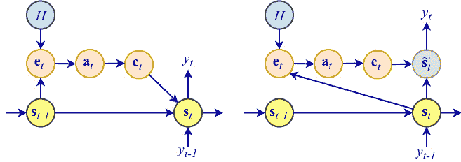
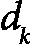

# 第七章：注意力机制与 Transformer

在*第六章*中，我们概述了一个典型的**自然语言处理**（**NLP**）流程，并介绍了**递归神经网络**（**RNNs**）作为 NLP 任务的候选架构。但我们也概述了它们的缺点——它们本质上是顺序的（即不可并行化），并且由于其内部序列表示的局限性，无法处理更长的序列。在本章中，我们将介绍**注意力机制**，它使**神经网络**（**NN**）可以直接访问整个输入序列。我们将简要讨论 RNN 中的注意力机制，因为它最初是作为 RNN 的扩展引入的。然而，本章的主角将是**Transformer**——一种完全依赖于注意力的最新神经网络架构。Transformer 在过去 10 年中成为最重要的神经网络创新之一。它们是所有近期**大型语言模型**（**LLMs**）的核心，例如 ChatGPT（[`chat.openai.com/`](https://chat.openai.com/)），甚至是图像生成模型，如 Stable Diffusion（[`stability.ai/stable-diffusion`](https://stability.ai/stable-diffusion)）。这是我们专注于 NLP 的章节中的第二章，也是三章中专门讨论 Transformer 的第一章。

本章将涵盖以下主题：

+   介绍**序列到序列**（**seq2seq**）模型

+   理解注意力机制

+   使用注意力机制构建 Transformer

# 技术要求

我们将使用 Python、PyTorch 和 Hugging Face Transformers 库（[`github.com/huggingface/transformers`](https://github.com/huggingface/transformers)）来实现本章的示例。如果你还没有配置这些工具的环境，不用担心——该示例作为 Jupyter 笔记本在 Google Colab 上提供。你可以在本书的 GitHub 仓库中找到代码示例：[`github.com/PacktPublishing/Python-Deep-Learning-Third-Edition/tree/main/Chapter07`](https://github.com/PacktPublishing/Python-Deep-Learning-Third-Edition/tree/main/Chapter07)。

# 介绍 seq2seq 模型

在 *第六章* 中，我们概述了几种类型的递归模型，取决于输入/输出的组合。其中一种是间接的多对多任务，或 **seq2seq**，其中一个输入序列被转换成另一个不同的输出序列，输出序列的长度不一定与输入序列相同。seq2seq 任务的一种类型是机器翻译。输入序列是一个语言中的句子的单词，而输出序列是同一句子翻译成另一种语言的单词。例如，我们可以将英语序列 *tourist attraction* 翻译成德语 *Touristenattraktion*。输出不仅长度不同，而且输入和输出序列的元素之间没有直接对应关系。一个输出元素对应于两个输入元素的组合。

另一种间接的多对多任务是会话聊天机器人，例如 ChatGPT，其中初始输入序列是用户的第一个查询。之后，整个对话（包括用户的查询和机器人的回复）都作为新生成的机器人的回复的输入序列。

在这一部分，我们将重点介绍编码器-解码器的 seq2seq 模型（*使用神经网络的序列到序列学习*，[`arxiv.org/abs/1409.3215`](https://arxiv.org/abs/1409.3215); *使用 RNN 编码器-解码器进行统计机器翻译的短语表示学习*，[`arxiv.org/abs/1406.1078`](https://arxiv.org/abs/1406.1078)），该模型首次于 2014 年提出。它们使用 RNN 的方式特别适用于解决间接的多对多任务，例如这些任务。以下是 seq2seq 模型的示意图，其中输入序列 `[A, B, C, <EOS>]` 被解码为输出序列 `[W, X, Y, Z, <EOS>]`：


图 7.1 – 一个 seq2seq 模型（灵感来源于 [`arxiv.org/abs/1409.3215`](https://arxiv.org/abs/1409.3215)）

该模型由两部分组成：

+   `<EOS>`—序列结束—标记已到达。假设输入是使用词级别标记化的文本序列。那么，我们将在每一步使用词嵌入向量作为编码器输入，`<EOS>` 标记表示句子的结束。编码器的输出会被丢弃，在 seq2seq 模型中没有作用，因为我们只关心隐藏的编码器状态。

+   `<GO>` 输入信号。编码器也是一个 RNN（LSTM 或 GRU）。编码器和解码器之间的联系是编码器最新的内部状态向量， （也称为 `<EOS>`，成为最可能的符号，解码完成）。

自回归模型的示例

假设我们想将英语句子*How are you today?*翻译成西班牙语。我们将其标记为`[how, are, you, today, ?, <EOS>]`。一个自回归模型将从初始序列`[<GO>]`开始。然后，它会生成翻译的第一个词，并将其附加到现有的输入序列中：`[<GO>, ¿]`。新的序列将作为解码器的输入，以便生成下一个元素并再次扩展序列：`[<GO>, ¿, cómo]`。我们将重复相同的步骤，直到解码器预测出`<EOS>`标记：`[<GO>, ¿, cómo, estás, hoy, ?, <EOS>]`。

该模型的训练是有监督的，因为它需要知道输入序列及其对应的目标输出序列（例如，多个语言中的相同文本）。我们将输入序列送入编码器，生成思维向量，，并利用它启动解码器的输出序列生成。训练解码器使用一种叫做`[W, X, Y]`的过程，但当前解码器生成的输出序列是`[W, X, Z]`。通过教师强制法，在步骤*t+1*时，解码器的输入将是`Y`而不是`Z`。换句话说，解码器学习在给定目标值`[...,t]`的情况下生成目标值`[t+1,...]`。我们可以这样理解：解码器的输入是目标序列，而其输出（目标值）是同一序列，但向右移动了一个位置。

总结来说，seq2seq 模型通过将输入序列编码为固定长度的状态向量*`v`*，然后使用这个向量作为基础来生成输出序列，从而解决了输入/输出序列长度变化的问题。我们可以通过以下方式形式化这一过程：它尝试最大化以下概率：

![<mml:math xmlns:mml="http://www.w3.org/1998/Math/MathML" xmlns:m="http://schemas.openxmlformats.org/officeDocument/2006/math" display="block"><mml:mi mathvariant="normal">P</mml:mi><mml:mfenced separators="|"><mml:mrow><mml:msub><mml:mrow><mml:mi>y</mml:mi></mml:mrow><mml:mrow><mml:mn>1</mml:mn></mml:mrow></mml:msub><mml:mo>,</mml:mo><mml:mo>…</mml:mo><mml:mo>,</mml:mo><mml:msub><mml:mrow><mml:mi>y</mml:mi></mml:mrow><mml:mrow><mml:msup><mml:mrow><mml:mi>T</mml:mi></mml:mrow><mml:mrow><mml:mi mathvariant="normal">'</mml:mi></mml:mrow></mml:msup></mml:mrow></mml:msub></mml:mrow><mml:mrow><mml:msub><mml:mrow><mml:mi>x</mml:mi></mml:mrow><mml:mrow><mml:mn>1</mml:mn></mml:mrow></mml:msub><mml:mo>,</mml:mo><mml:mo>…</mml:mo><mml:mo>,</mml:mo><mml:msub><mml:mrow><mml:mi>x</mml:mi></mml:mrow><mml:mrow><mml:mi>T</mml:mi></mml:mrow></mml:msub></mml:mrow></mml:mfenced><mml:mo>=</mml:mo><mml:mrow><mml:munderover><mml:mo stretchy="false">∏</mml:mo><mml:mrow><mml:mi>t</mml:mi><mml:mo>=</mml:mo><mml:mn>1</mml:mn></mml:mrow><mml:mrow><mml:msup><mml:mrow><mml:mi>T</mml:mi></mml:mrow><mml:mrow><mml:mi mathvariant="normal">'</mml:mi></mml:mrow></mml:msup></mml:mrow></mml:munderover><mml:mrow><mml:mi mathvariant="normal">P</mml:mi><mml:mfenced separators="|"><mml:mrow><mml:msub><mml:mrow><mml:mi>y</mml:mi></mml:mrow><mml:mrow><mml:mi>t</mml:mi></mml:mrow></mml:msub></mml:mrow><mml:mrow><mml:mi mathvariant="bold">v</mml:mi><mml:mo>,</mml:mo><mml:msub><mml:mrow><mml:mi>y</mml:mi></mml:mrow><mml:mrow><mml:mn>1</mml:mn></mml:mrow></mml:msub><mml:mo>,</mml:mo><mml:mo>…</mml:mo><mml:mo>,</mml:mo><mml:msub><mml:mrow><mml:mi>y</mml:mi></mml:mrow><mml:mrow><mml:mi>t</mml:mi><mml:mo>-</mml:mo><mml:mn>1</mml:mn></mml:mrow></mml:msub></mml:mrow></mml:mfenced></mml:mrow></mml:mrow></mml:math>](img/561.png)

这等价于以下表达式：

![<mml:math xmlns:mml="http://www.w3.org/1998/Math/MathML" xmlns:m="http://schemas.openxmlformats.org/officeDocument/2006/math" display="block"><mml:mi mathvariant="normal">P</mml:mi><mml:mfenced separators="|"><mml:mrow><mml:msub><mml:mrow><mml:mi>y</mml:mi></mml:mrow><mml:mrow><mml:mn>1</mml:mn></mml:mrow></mml:msub><mml:mo>,</mml:mo><mml:mo>…</mml:mo><mml:mo>,</mml:mo><mml:msub><mml:mrow><mml:mi>y</mml:mi></mml:mrow><mml:mrow><mml:msup><mml:mrow><mml:mi>T</mml:mi></mml:mrow><mml:mrow><mml:mi mathvariant="normal">'</mml:mi></mml:mrow></mml:msup></mml:mrow></mml:msub></mml:mrow><mml:mrow><mml:msub><mml:mrow><mml:mi>x</mml:mi></mml:mrow><mml:mrow><mml:mn>1</mml:mn></mml:mrow></mml:msub><mml:mo>,</mml:mo><mml:mo>…</mml:mo><mml:mo>,</mml:mo><mml:msub><mml:mrow><mml:mi>x</mml:mi></mml:mrow><mml:mrow><mml:mi>T</mml:mi></mml:mrow></mml:msub></mml:mrow></mml:mfenced><mml:mo>=</mml:mo><mml:mi mathvariant="normal">P</mml:mi><mml:mfenced separators="|"><mml:mrow><mml:msub><mml:mrow><mml:mi>y</mml:mi></mml:mrow><mml:mrow><mml:mn>1</mml:mn></mml:mrow></mml:msub></mml:mrow><mml:mrow><mml:mi mathvariant="bold">v</mml:mi></mml:mrow></mml:mfenced><mml:mi mathvariant="normal">P</mml:mi><mml:mfenced separators="|"><mml:mrow><mml:msub><mml:mrow><mml:mi>y</mml:mi></mml:mrow><mml:mrow><mml:mn>2</mml:mn></mml:mrow></mml:msub></mml:mrow><mml:mrow><mml:mi mathvariant="bold">v</mml:mi><mml:mo>,</mml:mo><mml:msub><mml:mrow><mml:mi>y</mml:mi></mml:mrow><mml:mrow><mml:mn>1</mml:mn></mml:mrow></mml:msub></mml:mrow></mml:mfenced><mml:mo>…</mml:mo><mml:mi mathvariant="normal">P</mml:mi><mml:mfenced separators="|"><mml:mrow><mml:msub><mml:mrow><mml:mi>y</mml:mi></mml:mrow><mml:mrow><mml:msup><mml:mrow><mml:mi>T</mml:mi></mml:mrow><mml:mrow><mml:mi mathvariant="normal">'</mml:mi></mml:mrow></mml:msup></mml:mrow></mml:msub></mml:mrow><mml:mrow><mml:mi mathvariant="bold">v</mml:mi><mml:mo>,</mml:mo><mml:msub><mml:mrow><mml:mi>y</mml:mi></mml:mrow><mml:mrow><mml:mn>1</mml:mn></mml:mrow></mml:msub><mml:mo>,</mml:mo><mml:mo>…</mml:mo><mml:mo>,</mml:mo><mml:msub><mml:mrow><mml:mi>y</mml:mi></mml:mrow><mml:mrow><mml:msup><mml:mrow><mml:mi>T</mml:mi></mml:mrow><mml:mrow><mml:mi mathvariant="normal">'</mml:mi></mml:mrow></mml:msup><mml:mo>-</mml:mo><mml:mn>1</mml:mn></mml:mrow></mml:msub></mml:mrow></mml:mfenced></mml:math>](img/562.png)

让我们更详细地看一下这个公式的各个元素：

+   ![<mml:math xmlns:mml="http://www.w3.org/1998/Math/MathML" xmlns:m="http://schemas.openxmlformats.org/officeDocument/2006/math"><mml:mi mathvariant="normal">P</mml:mi><mml:mfenced separators="|"><mml:mrow><mml:msub><mml:mrow><mml:mi>y</mml:mi></mml:mrow><mml:mrow><mml:mn>1</mml:mn></mml:mrow></mml:msub><mml:mo>…</mml:mo><mml:msub><mml:mrow><mml:mi>y</mml:mi></mml:mrow><mml:mrow><mml:msup><mml:mrow><mml:mi>T</mml:mi></mml:mrow><mml:mrow><mml:mi>'</mml:mi></mml:mrow></mml:msup></mml:mrow></mml:msub></mml:mrow><mml:mrow><mml:msub><mml:mrow><mml:mi>x</mml:mi></mml:mrow><mml:mrow><mml:mn>1</mml:mn></mml:mrow></mml:msub><mml:mo>…</mml:mo><mml:msub><mml:mrow><mml:mi>x</mml:mi></mml:mrow><mml:mrow><mml:mi>T</mml:mi></mml:mrow></mml:msub></mml:mrow></mml:mfenced></mml:math>](img/563.png)：条件概率，其中 是长度为`T`的输入序列， 是长度为*T’*的输出序列。

+   *`v`*：输入序列的固定长度编码（思维向量）。

+   ![<mml:math xmlns:mml="http://www.w3.org/1998/Math/MathML" xmlns:m="http://schemas.openxmlformats.org/officeDocument/2006/math"><mml:mi mathvariant="normal">P</mml:mi><mml:mfenced separators="|"><mml:mrow><mml:msub><mml:mrow><mml:mi>y</mml:mi></mml:mrow><mml:mrow><mml:msup><mml:mrow><mml:mi>T</mml:mi></mml:mrow><mml:mrow><mml:mi>'</mml:mi></mml:mrow></mml:msup></mml:mrow></mml:msub></mml:mrow><mml:mrow><mml:mi mathvariant="bold">v</mml:mi><mml:mo>,</mml:mo><mml:mi>y</mml:mi><mml:mn>1</mml:mn><mml:mo>…</mml:mo><mml:msub><mml:mrow><mml:mi>y</mml:mi></mml:mrow><mml:mrow><mml:mi>T</mml:mi><mml:mi>‘</mml:mi><mml:mo>-</mml:mo><mml:mn>1</mml:mn></mml:mrow></mml:msub></mml:mrow></mml:mfenced></mml:math>](img/566.png): 给定先前的词 `y` 以及思想向量 *`v`*，输出词  的概率。

原始的 seq2seq 论文介绍了一些技巧，用于增强模型的训练和性能。例如，编码器和解码器是两个独立的 LSTM。在机器翻译的情况下，这使得可以使用相同的编码器为不同语言训练不同的解码器。

另一个改进是输入序列以反向方式输入到解码器。例如，`[A,B,C]` -> `[W,X,Y,Z]` 将变成 `[C,B,A]` -> `[W,X,Y,Z]`。没有明确的解释说明为什么这样有效，但作者分享了他们的直觉：由于这是一个逐步模型，如果序列按正常顺序排列，源句子中的每个源词将远离其在输出句子中的对应词。如果我们反转输入序列，输入/输出词之间的平均距离不会改变，但第一个输入词会非常接近第一个输出词。这有助于模型在输入和输出序列之间建立更好的通信。然而，这一改进也展示了 RNN（即使是 LSTM 或 GRU）隐藏状态的不足——较新的序列元素会抑制较老元素的可用信息。在下一节中，我们将介绍一种优雅的方式来彻底解决这个问题。

# 理解注意力机制

在这一节中，我们将按引入的顺序讨论注意力机制的几个迭代版本。

## Bahdanau 注意力

第一次注意力迭代（*Neural Machine Translation by Jointly Learning to Align and Translate*， [`arxiv.org/abs/1409.0473`](https://arxiv.org/abs/1409.0473)），被称为**巴赫达瑙**注意力，扩展了 seq2seq 模型，使解码器能够与所有编码器隐藏状态进行交互，而不仅仅是最后一个状态。它是对现有 seq2seq 模型的补充，而不是一个独立的实体。下图展示了巴赫达瑙注意力的工作原理：


图 7.2 – 注意力机制

别担心——它看起来比实际更复杂。我们将从上到下解析这个图：注意力机制通过在编码器和解码器之间插入一个额外的**上下文向量**，，来实现。隐藏的解码器状态  在时间 `t` 上，现在不仅是隐藏状态和解码器输出的函数，还包含上下文向量 ：

![<mml:math xmlns:mml="http://www.w3.org/1998/Math/MathML" xmlns:m="http://schemas.openxmlformats.org/officeDocument/2006/math" display="block"><mml:msub><mml:mrow><mml:mi mathvariant="bold">s</mml:mi></mml:mrow><mml:mrow><mml:mi>t</mml:mi></mml:mrow></mml:msub><mml:mo>=</mml:mo><mml:mi>f</mml:mi><mml:mfenced separators="|"><mml:mrow><mml:msub><mml:mrow><mml:mi mathvariant="bold">s</mml:mi></mml:mrow><mml:mrow><mml:mi>t</mml:mi><mml:mo>-</mml:mo><mml:mn>1</mml:mn></mml:mrow></mml:msub><mml:mo>,</mml:mo><mml:msub><mml:mrow><mml:mi>y</mml:mi></mml:mrow><mml:mrow><mml:mi>t</mml:mi><mml:mo>-</mml:mo><mml:mn>1</mml:mn></mml:mrow></mml:msub><mml:mo>,</mml:mo><mml:msub><mml:mrow><mml:mi mathvariant="bold">c</mml:mi></mml:mrow><mml:mrow><mml:mi>t</mml:mi></mml:mrow></mml:msub></mml:mrow></mml:mfenced></mml:math>](img/571.png)

每个解码步骤都有一个独特的上下文向量，而一个解码步骤的上下文向量只是*所有编码器隐藏状态的加权和*。通过这种方式，编码器可以在每个输出步骤 `t` 中访问所有输入序列状态，这消除了像常规 seq2seq 模型那样必须将源序列的所有信息编码为一个固定长度的思维向量的必要性：

![<mml:math xmlns:mml="http://www.w3.org/1998/Math/MathML" xmlns:m="http://schemas.openxmlformats.org/officeDocument/2006/math" display="block"><mml:msub><mml:mrow><mml:mi mathvariant="bold">c</mml:mi></mml:mrow><mml:mrow><mml:mi>t</mml:mi></mml:mrow></mml:msub><mml:mo>=</mml:mo><mml:mrow><mml:munderover><mml:mo stretchy="false">∑</mml:mo><mml:mrow><mml:mi>i</mml:mi><mml:mo>=</mml:mo><mml:mn>1</mml:mn></mml:mrow><mml:mrow><mml:mi>T</mml:mi></mml:mrow></mml:munderover><mml:mrow><mml:msub><mml:mrow><mml:mi>α</mml:mi></mml:mrow><mml:mrow><mml:mi>t</mml:mi><mml:mo>,</mml:mo><mml:mi>i</mml:mi></mml:mrow></mml:msub></mml:mrow></mml:mrow><mml:msub><mml:mrow><mml:mi mathvariant="bold">h</mml:mi></mml:mrow><mml:mrow><mml:mi>i</mml:mi></mml:mrow></mml:msub></mml:math>](img/572.png)

让我们更详细地讨论这个公式：

+   ：解码器输出步骤`t`（总共有*T’*个输出步骤）的上下文向量

+   ：编码器步骤`i`（总共有`T`个输入步骤）的隐藏状态向量

+   ：与当前解码器步骤`t`中相关的标量权重

请注意， 对于编码器和解码器步骤都是唯一的——也就是说，输入序列的状态将根据当前的输出步骤具有不同的权重。例如，如果输入和输出序列的长度为 10，那么权重将由一个 10×10 的矩阵表示，共有 100 个权重。这意味着注意力机制将根据输出序列的当前状态，将解码器的注意力集中在输入序列的不同部分。如果 很大，那么解码器将非常关注在步骤 `t` 时的。

那么，我们如何计算权重 呢？首先，我们需要提到，对于解码器的每个步骤 `t`，所有 权重的总和为 1。我们可以通过在注意力机制之上执行 softmax 操作来实现这一点：

![<mml:math xmlns:mml="http://www.w3.org/1998/Math/MathML" xmlns:m="http://schemas.openxmlformats.org/officeDocument/2006/math" display="block"><mml:msub><mml:mrow><mml:mi>α</mml:mi></mml:mrow><mml:mrow><mml:mi>t</mml:mi><mml:mo>,</mml:mo><mml:mi>i</mml:mi></mml:mrow></mml:msub><mml:mo>=</mml:mo><mml:mfrac><mml:mrow><mml:mi>e</mml:mi><mml:mi>x</mml:mi><mml:mi>p</mml:mi><mml:mfenced separators="|"><mml:mrow><mml:msub><mml:mrow><mml:mi>e</mml:mi></mml:mrow><mml:mrow><mml:mi>t</mml:mi><mml:mo>,</mml:mo><mml:mi>i</mml:mi></mml:mrow></mml:msub></mml:mrow></mml:mfenced></mml:mrow><mml:mrow><mml:mrow><mml:munderover><mml:mo stretchy="false">∑</mml:mo><mml:mrow><mml:mi>j</mml:mi><mml:mo>=</mml:mo><mml:mn>1</mml:mn></mml:mrow><mml:mrow><mml:mi>T</mml:mi></mml:mrow></mml:munderover><mml:mrow><mml:mi>e</mml:mi><mml:mi>x</mml:mi><mml:mi>p</mml:mi><mml:mfenced separators="|"><mml:mrow><mml:msub><mml:mrow><mml:mi>e</mml:mi></mml:mrow><mml:mrow><mml:mi>t</mml:mi><mml:mo>,</mml:mo><mml:mi>j</mml:mi></mml:mrow></mml:msub></mml:mrow></mml:mfenced></mml:mrow></mml:mrow></mml:mrow></mml:mfrac><mml:mo>=</mml:mo><mml:mi mathvariant="normal">s</mml:mi><mml:mi mathvariant="normal">o</mml:mi><mml:mi mathvariant="normal">f</mml:mi><mml:mi mathvariant="normal">t</mml:mi><mml:mi mathvariant="normal">m</mml:mi><mml:mi mathvariant="normal">a</mml:mi><mml:mi mathvariant="normal">x</mml:mi><mml:mfenced separators="|"><mml:mrow><mml:msub><mml:mrow><mml:mi>e</mml:mi></mml:mrow><mml:mrow><mml:mi>t</mml:mi><mml:mo>,</mml:mo><mml:mi>i</mml:mi></mml:mrow></mml:msub><mml:mtext>/</mml:mtext><mml:msub><mml:mrow><mml:mi>e</mml:mi></mml:mrow><mml:mrow><mml:mi>t</mml:mi></mml:mrow></mml:msub></mml:mrow></mml:mfenced></mml:math>](img/582.png)

这里， 是一个对齐分数，表示输入序列中位置 `i` 附近的元素与位置 `t` 的输出匹配（或对齐）的程度。这个分数（由权重 ) 基于前一个解码器状态 （我们使用 ，因为我们还没有计算 ），以及编码器状态 ：

![<mml:math xmlns:mml="http://www.w3.org/1998/Math/MathML" xmlns:m="http://schemas.openxmlformats.org/officeDocument/2006/math" display="block"><mml:msub><mml:mrow><mml:mi>e</mml:mi></mml:mrow><mml:mrow><mml:mi>t</mml:mi><mml:mo>,</mml:mo><mml:mi>i</mml:mi></mml:mrow></mml:msub><mml:mo>=</mml:mo><mml:mi>a</mml:mi><mml:mfenced separators="|"><mml:mrow><mml:msub><mml:mrow><mml:mi mathvariant="bold">s</mml:mi></mml:mrow><mml:mrow><mml:mi>t</mml:mi><mml:mo>-</mml:mo><mml:mn>1</mml:mn></mml:mrow></mml:msub><mml:mo>,</mml:mo><mml:msub><mml:mrow><mml:mi mathvariant="bold">h</mml:mi></mml:mrow><mml:mrow><mml:mi>i</mml:mi></mml:mrow></mml:msub></mml:mrow></mml:mfenced></mml:math>](img/589.png)

这里，`a`（而非 alpha）是一个可微分函数，通过反向传播与系统的其他部分一起训练。不同的函数满足这些要求，但论文的作者选择了所谓的**加性注意力**，它通过向量加法将和结合起来。它有两种变体：

![<mml:math xmlns:mml="http://www.w3.org/1998/Math/MathML" xmlns:m="http://schemas.openxmlformats.org/officeDocument/2006/math" display="block"><mml:msub><mml:mrow><mml:mi>e</mml:mi></mml:mrow><mml:mrow><mml:mi>t</mml:mi><mml:mo>,</mml:mo><mml:mi>i</mml:mi></mml:mrow></mml:msub><mml:mo>=</mml:mo><mml:mi>a</mml:mi><mml:mfenced separators="|"><mml:mrow><mml:msub><mml:mrow><mml:mi mathvariant="bold">s</mml:mi></mml:mrow><mml:mrow><mml:mi>t</mml:mi><mml:mo>-</mml:mo><mml:mn>1</mml:mn></mml:mrow></mml:msub><mml:mo>,</mml:mo><mml:msub><mml:mrow><mml:mi mathvariant="bold">h</mml:mi></mml:mrow><mml:mrow><mml:mi>i</mml:mi></mml:mrow></mml:msub></mml:mrow></mml:mfenced><mml:mo>=</mml:mo><mml:msup><mml:mrow><mml:mi mathvariant="bold">v</mml:mi></mml:mrow><mml:mrow><mml:mi mathvariant="normal">⊤</mml:mi></mml:mrow></mml:msup><mml:mi>t</mml:mi><mml:mi>a</mml:mi><mml:mi>n</mml:mi><mml:mi>h</mml:mi><mml:mfenced separators="|"><mml:mrow><mml:mi mathvariant="bold">W</mml:mi><mml:mfenced open="[" close="]" separators="|"><mml:mrow><mml:msub><mml:mrow><mml:mi mathvariant="bold">h</mml:mi></mml:mrow><mml:mrow><mml:mi>i</mml:mi></mml:mrow></mml:msub><mml:mo>;</mml:mo><mml:msub><mml:mrow><mml:mi mathvariant="bold">s</mml:mi></mml:mrow><mml:mrow><mml:mi>t</mml:mi><mml:mo>-</mml:mo><mml:mn>1</mml:mn></mml:mrow></mml:msub></mml:mrow></mml:mfenced></mml:mrow></mml:mfenced></mml:math>](img/592.png)

![<mml:math xmlns:mml="http://www.w3.org/1998/Math/MathML" xmlns:m="http://schemas.openxmlformats.org/officeDocument/2006/math" display="block"><mml:msub><mml:mrow><mml:mi>e</mml:mi></mml:mrow><mml:mrow><mml:mi>t</mml:mi><mml:mo>,</mml:mo><mml:mi>i</mml:mi></mml:mrow></mml:msub><mml:mo>=</mml:mo><mml:mi>a</mml:mi><mml:mfenced separators="|"><mml:mrow><mml:msub><mml:mrow><mml:mi mathvariant="bold">s</mml:mi></mml:mrow><mml:mrow><mml:mi>t</mml:mi><mml:mo>-</mml:mo><mml:mn>1</mml:mn></mml:mrow></mml:msub><mml:mo>,</mml:mo><mml:msub><mml:mrow><mml:mi mathvariant="bold">h</mml:mi></mml:mrow><mml:mrow><mml:mi>i</mml:mi></mml:mrow></mml:msub></mml:mrow></mml:mfenced><mml:mo>=</mml:mo><mml:msup><mml:mrow><mml:mi mathvariant="bold">v</mml:mi></mml:mrow><mml:mrow><mml:mi mathvariant="normal">⊤</mml:mi></mml:mrow></mml:msup><mml:mi>t</mml:mi><mml:mi>a</mml:mi><mml:mi>n</mml:mi><mml:mi>h</mml:mi><mml:mfenced separators="|"><mml:mrow><mml:msub><mml:mrow><mml:mi mathvariant="bold">W</mml:mi></mml:mrow><mml:mrow><mml:mn>1</mml:mn></mml:mrow></mml:msub><mml:msub><mml:mrow><mml:mi mathvariant="bold">h</mml:mi></mml:mrow><mml:mrow><mml:mi>i</mml:mi></mml:mrow></mml:msub><mml:mo>+</mml:mo><mml:msub><mml:mrow><mml:mi mathvariant="bold">W</mml:mi></mml:mrow><mml:mrow><mml:mn>2</mml:mn></mml:mrow></mml:msub><mml:msub><mml:mrow><mml:mi mathvariant="bold">s</mml:mi></mml:mrow><mml:mrow><mml:mi>t</mml:mi><mml:mo>-</mml:mo><mml:mn>1</mml:mn></mml:mrow></mml:msub></mml:mrow></mml:mfenced></mml:math>](img/593.png)

在第一个公式中，*`W`* 是一个权重矩阵，应用于连接向量  和 ，而 *`v`* 是一个权重向量。第二个公式类似，但这次我们有单独的 **全连接** (**FC**) 层（权重矩阵  和 )，然后我们对  和  求和。在这两种情况下，对齐模型可以表示为一个简单的 **前馈网络** (**FFN**)，带有一个隐藏层。

现在我们知道  和  的公式，让我们用前者替换后者：

![<mml:math xmlns:mml="http://www.w3.org/1998/Math/MathML" xmlns:m="http://schemas.openxmlformats.org/officeDocument/2006/math" display="block"><mml:msub><mml:mrow><mml:mi mathvariant="bold">c</mml:mi></mml:mrow><mml:mrow><mml:mi>t</mml:mi></mml:mrow></mml:msub><mml:mo>=</mml:mo><mml:mrow><mml:munderover><mml:mo stretchy="false">∑</mml:mo><mml:mrow><mml:mi>i</mml:mi><mml:mo>=</mml:mo><mml:mn>1</mml:mn></mml:mrow><mml:mrow><mml:mi>T</mml:mi></mml:mrow></mml:munderover><mml:mrow><mml:msub><mml:mrow><mml:mi>α</mml:mi></mml:mrow><mml:mrow><mml:mi>t</mml:mi><mml:mo>,</mml:mo><mml:mi>i</mml:mi></mml:mrow></mml:msub></mml:mrow></mml:mrow><mml:msub><mml:mrow><mml:mi mathvariant="bold">h</mml:mi></mml:mrow><mml:mrow><mml:mi>i</mml:mi></mml:mrow></mml:msub><mml:mo>=</mml:mo><mml:mrow><mml:munderover><mml:mo stretchy="false">∑</mml:mo><mml:mrow><mml:mi>i</mml:mi><mml:mo>=</mml:mo><mml:mn>1</mml:mn></mml:mrow><mml:mrow><mml:mi>T</mml:mi></mml:mrow></mml:munderover><mml:mrow><mml:mfrac><mml:mrow><mml:mi>e</mml:mi><mml:mi>x</mml:mi><mml:mi>p</mml:mi><mml:mfenced separators="|"><mml:mrow><mml:msub><mml:mrow><mml:mi>e</mml:mi></mml:mrow><mml:mrow><mml:mi>t</mml:mi><mml:mo>,</mml:mo><mml:mi>i</mml:mi></mml:mrow></mml:msub></mml:mrow></mml:mfenced></mml:mrow><mml:mrow><mml:mrow><mml:munderover><mml:mo stretchy="false">∑</mml:mo><mml:mrow><mml:mi>j</mml:mi><mml:mo>=</mml:mo><mml:mn>1</mml:mn></mml:mrow><mml:mrow><mml:mi>T</mml:mi></mml:mrow></mml:munderover><mml:mrow><mml:mi>e</mml:mi><mml:mi>x</mml:mi><mml:mi>p</mml:mi><mml:mfenced separators="|"><mml:mrow><mml:msub><mml:mrow><mml:mi>e</mml:mi></mml:mrow><mml:mrow><mml:mi>t</mml:mi><mml:mo>,</mml:mo><mml:mi>j</mml:mi></mml:mrow></mml:msub></mml:mrow></mml:mfenced></mml:mrow></mml:mrow></mml:mrow></mml:mfrac><mml:msub><mml:mrow><mml:mi mathvariant="bold">h</mml:mi></mml:mrow><mml:mrow><mml:mi>i</mml:mi></mml:mrow></mml:msub></mml:mrow></mml:mrow></mml:math>](img/602.png)

作为总结，下面是一步一步总结的注意力算法：

1.  将输入序列输入编码器，并计算一组隐藏状态，H = {h 1, h 2…h T}。

1.  计算对齐分数，![<mml:math xmlns:mml="http://www.w3.org/1998/Math/MathML" xmlns:m="http://schemas.openxmlformats.org/officeDocument/2006/math"><mml:msub><mml:mrow><mml:mi>e</mml:mi></mml:mrow><mml:mrow><mml:mi>t</mml:mi><mml:mo>,</mml:mo><mml:mi>i</mml:mi></mml:mrow></mml:msub><mml:mo>=</mml:mo><mml:mi>a</mml:mi><mml:mfenced separators="|"><mml:mrow><mml:msub><mml:mrow><mml:mi mathvariant="bold">s</mml:mi></mml:mrow><mml:mrow><mml:mi>t</mml:mi><mml:mo>-</mml:mo><mml:mn>1</mml:mn></mml:mrow></mml:msub><mml:mo>,</mml:mo><mml:msub><mml:mrow><mml:mi mathvariant="bold">h</mml:mi></mml:mrow><mml:mrow><mml:mi>i</mml:mi></mml:mrow></mml:msub></mml:mrow></mml:mfenced></mml:math>](img/603.png)，该对齐分数使用来自前一步解码器状态的值。如果*t=1*，我们将使用最后一个编码器状态，，作为初始隐藏状态。

1.  计算权重![<mml:math xmlns:mml="http://www.w3.org/1998/Math/MathML" xmlns:m="http://schemas.openxmlformats.org/officeDocument/2006/math"><mml:msub><mml:mrow><mml:mi>α</mml:mi></mml:mrow><mml:mrow><mml:mi>t</mml:mi><mml:mo>,</mml:mo><mml:mi>i</mml:mi></mml:mrow></mml:msub><mml:mo>=</mml:mo><mml:mi mathvariant="normal">s</mml:mi><mml:mi mathvariant="normal">o</mml:mi><mml:mi mathvariant="normal">f</mml:mi><mml:mi mathvariant="normal">t</mml:mi><mml:mi mathvariant="normal">m</mml:mi><mml:mi mathvariant="normal">a</mml:mi><mml:mi mathvariant="normal">x</mml:mi><mml:mfenced separators="|"><mml:mrow><mml:msub><mml:mrow><mml:mi>e</mml:mi></mml:mrow><mml:mrow><mml:mi>t</mml:mi><mml:mo>,</mml:mo><mml:mi>i</mml:mi></mml:mrow></mml:msub><mml:mtext>/</mml:mtext><mml:msub><mml:mrow><mml:mi>e</mml:mi></mml:mrow><mml:mrow><mml:mi>t</mml:mi></mml:mrow></mml:msub></mml:mrow></mml:mfenced></mml:math>](img/606.png)。

1.  计算上下文向量 ![<mml:math xmlns:mml="http://www.w3.org/1998/Math/MathML" xmlns:m="http://schemas.openxmlformats.org/officeDocument/2006/math"><mml:msub><mml:mrow><mml:mi mathvariant="bold">c</mml:mi></mml:mrow><mml:mrow><mml:mi>t</mml:mi></mml:mrow></mml:msub><mml:mo>=</mml:mo><mml:mrow><mml:msubsup><mml:mo stretchy="false">∑</mml:mo><mml:mrow><mml:mi>i</mml:mi><mml:mo>=</mml:mo><mml:mn>1</mml:mn></mml:mrow><mml:mrow><mml:mi>T</mml:mi></mml:mrow></mml:msubsup><mml:mrow><mml:msub><mml:mrow><mml:mi>α</mml:mi></mml:mrow><mml:mrow><mml:mi>t</mml:mi><mml:mo>,</mml:mo><mml:mi>i</mml:mi></mml:mrow></mml:msub></mml:mrow></mml:mrow><mml:msub><mml:mrow><mml:mi mathvariant="bold">h</mml:mi></mml:mrow><mml:mrow><mml:mi>i</mml:mi></mml:mrow></mml:msub></mml:math>](img/607.png)。

1.  计算隐藏状态，![<mml:math xmlns:mml="http://www.w3.org/1998/Math/MathML" xmlns:m="http://schemas.openxmlformats.org/officeDocument/2006/math"><mml:msub><mml:mrow><mml:mi mathvariant="bold">s</mml:mi></mml:mrow><mml:mrow><mml:mi>t</mml:mi></mml:mrow></mml:msub><mml:mo>=</mml:mo><mml:msub><mml:mrow><mml:mtext>RNN</mml:mtext></mml:mrow><mml:mrow><mml:mi>d</mml:mi><mml:mi>e</mml:mi><mml:mi>c</mml:mi><mml:mi>o</mml:mi><mml:mi>d</mml:mi><mml:mi>e</mml:mi><mml:mi>r</mml:mi></mml:mrow></mml:msub><mml:mfenced separators="|"><mml:mrow><mml:mfenced open="[" close="]" separators="|"><mml:mrow><mml:msub><mml:mrow><mml:mi mathvariant="bold">s</mml:mi></mml:mrow><mml:mrow><mml:mi>t</mml:mi><mml:mo>-</mml:mo><mml:mn>1</mml:mn></mml:mrow></mml:msub><mml:mo>;</mml:mo><mml:msub><mml:mrow><mml:mi mathvariant="bold">c</mml:mi></mml:mrow><mml:mrow><mml:mi>t</mml:mi></mml:mrow></mml:msub></mml:mrow></mml:mfenced><mml:mo>,</mml:mo><mml:msub><mml:mrow><mml:mi>y</mml:mi></mml:mrow><mml:mrow><mml:mi>t</mml:mi><mml:mo>-</mml:mo><mml:mn>1</mml:mn></mml:mrow></mml:msub></mml:mrow></mml:mfenced></mml:math>](img/608.png)，基于连接的向量  和  以及先前的解码器输出 。此时，我们可以计算最终输出 。如果我们需要对下一个单词进行分类，将使用 softmax 输出，![<mml:math xmlns:mml="http://www.w3.org/1998/Math/MathML" xmlns:m="http://schemas.openxmlformats.org/officeDocument/2006/math"><mml:msub><mml:mrow><mml:mi mathvariant="bold">y</mml:mi></mml:mrow><mml:mrow><mml:mi>t</mml:mi></mml:mrow></mml:msub><mml:mo>=</mml:mo><mml:mi mathvariant="normal">s</mml:mi><mml:mi mathvariant="normal">o</mml:mi><mml:mi mathvariant="normal">f</mml:mi><mml:mi mathvariant="normal">t</mml:mi><mml:mi mathvariant="normal">m</mml:mi><mml:mi mathvariant="normal">a</mml:mi><mml:mi mathvariant="normal">x</mml:mi><mml:mfenced separators="|"><mml:mrow><mml:msub><mml:mrow><mml:mi mathvariant="bold">W</mml:mi></mml:mrow><mml:mrow><mml:mi>y</mml:mi></mml:mrow></mml:msub><mml:msub><mml:mrow><mml:mi mathvariant="bold">s</mml:mi></mml:mrow><mml:mrow><mml:mi>t</mml:mi></mml:mrow></mml:msub></mml:mrow></mml:mfenced></mml:math>](img/613.png)![<mml:math xmlns:mml="http://www.w3.org/1998/Math/MathML" xmlns:m="http://schemas.openxmlformats.org/officeDocument/2006/math"><mml:msub><mml:mrow><mml:mi mathvariant="bold">y</mml:mi></mml:mrow><mml:mrow><mml:mi>t</mml:mi></mml:mrow></mml:msub><mml:mo>=</mml:mo><mml:mi mathvariant="normal">s</mml:mi><mml:mi mathvariant="normal">o</mml:mi><mml:mi mathvariant="normal">f</mml:mi><mml:mi mathvariant="normal">t</mml:mi><mml:mi mathvariant="normal">m</mml:mi><mml:mi mathvariant="normal">a</mml:mi><mml:mi mathvariant="normal">x</mml:mi><mml:mfenced separators="|"><mml:mrow><mml:msub><mml:mrow><mml:mi mathvariant="bold">W</mml:mi></mml:mrow><mml:mrow><mml:mi>y</mml:mi></mml:mrow></mml:msub><mml:msub><mml:mrow><mml:mi mathvariant="bold">s</mml:mi></mml:mrow><mml:mrow><mml:mi>t</mml:mi></mml:mrow></mml:msub></mml:mrow></mml:mfenced></mml:math>](img/614.png)，其中  是一个权重矩阵。

1.  重复 *步骤 2* 到 *步骤 5*，直到序列结束。

接下来，我们将讨论 Bahdanau 注意力的一个稍微改进的版本。

## Luong 注意力

**Luong 注意力** (*Effective Approaches to Attention-based Neural Machine Translation*, [`arxiv.org/abs/1508.04025`](https://arxiv.org/abs/1508.04025)) 相比 Bahdanau 注意力做出了若干改进。最显著的变化是对齐分数依赖于解码器的隐藏状态 ，而不像 Bahdanau 注意力中的 。为了更好地理解这一点，我们来比较这两种算法：



图 7.3 – 左：Bahdanau 注意力；右：Luong 注意力

我们将逐步执行 Luong 注意力的过程：

1.  将输入序列传入编码器，并计算编码器的隐藏状态集 ![<mml:math xmlns:mml="http://www.w3.org/1998/Math/MathML" xmlns:m="http://schemas.openxmlformats.org/officeDocument/2006/math"><mml:mi>H</mml:mi><mml:mo>=</mml:mo><mml:mfenced open="{" close="}" separators="|"><mml:mrow><mml:msub><mml:mrow><mml:mi mathvariant="bold">h</mml:mi></mml:mrow><mml:mrow><mml:mn>1</mml:mn></mml:mrow></mml:msub><mml:mo>,</mml:mo><mml:msub><mml:mrow><mml:mi mathvariant="bold">h</mml:mi></mml:mrow><mml:mrow><mml:mn>2</mml:mn></mml:mrow></mml:msub><mml:mo>…</mml:mo><mml:msub><mml:mrow><mml:mi mathvariant="bold">h</mml:mi></mml:mrow><mml:mrow><mml:mi>T</mml:mi></mml:mrow></mml:msub></mml:mrow></mml:mfenced></mml:math>](img/618.png)![<mml:math xmlns:mml="http://www.w3.org/1998/Math/MathML" xmlns:m="http://schemas.openxmlformats.org/officeDocument/2006/math"><mml:mi>H</mml:mi><mml:mo>=</mml:mo><mml:mfenced open="{" close="}" separators="|"><mml:mrow><mml:msub><mml:mrow><mml:mi mathvariant="bold">h</mml:mi></mml:mrow><mml:mrow><mml:mn>1</mml:mn></mml:mrow></mml:msub><mml:mo>,</mml:mo><mml:msub><mml:mrow><mml:mi mathvariant="bold">h</mml:mi></mml:mrow><mml:mrow><mml:mn>2</mml:mn></mml:mrow></mml:msub><mml:mo>…</mml:mo><mml:msub><mml:mrow><mml:mi mathvariant="bold">h</mml:mi></mml:mrow><mml:mrow><mml:mi>T</mml:mi></mml:mrow></mml:msub></mml:mrow></mml:mfenced></mml:math>](img/619.png)。

1.  ![<mml:math xmlns:mml="http://www.w3.org/1998/Math/MathML" xmlns:m="http://schemas.openxmlformats.org/officeDocument/2006/math"><mml:msub><mml:mrow><mml:mi mathvariant="bold">s</mml:mi></mml:mrow><mml:mrow><mml:mi>t</mml:mi></mml:mrow></mml:msub><mml:mo>=</mml:mo><mml:mtext>RN</mml:mtext><mml:msub><mml:mrow><mml:mtext>N</mml:mtext></mml:mrow><mml:mrow><mml:mtext>decoder</mml:mtext></mml:mrow></mml:msub><mml:mfenced separators="|"><mml:mrow><mml:msub><mml:mrow><mml:mi mathvariant="bold">s</mml:mi></mml:mrow><mml:mrow><mml:mi>t</mml:mi><mml:mo>-</mml:mo><mml:mn>1</mml:mn></mml:mrow></mml:msub><mml:mo>,</mml:mo><mml:msub><mml:mrow><mml:mi>y</mml:mi></mml:mrow><mml:mrow><mml:mi>t</mml:mi><mml:mo>-</mml:mo><mml:mn>1</mml:mn></mml:mrow></mml:msub></mml:mrow></mml:mfenced></mml:math>](img/620.png): 计算解码器的隐藏状态，基于上一个解码器的隐藏状态！<mml:math xmlns:mml="http://www.w3.org/1998/Math/MathML" xmlns:m="http://schemas.openxmlformats.org/officeDocument/2006/math"><mml:msub><mml:mrow><mml:mi mathvariant="bold">s</mml:mi></mml:mrow><mml:mrow><mml:mi>t</mml:mi><mml:mo>-</mml:mo><mml:mn>1</mml:mn></mml:mrow></mml:msub></mml:math> 和上一个解码器的输出！<mml:math xmlns:mml="http://www.w3.org/1998/Math/MathML" xmlns:m="http://schemas.openxmlformats.org/officeDocument/2006/math"><mml:msub><mml:mrow><mml:mi>y</mml:mi></mml:mrow><mml:mrow><mml:mi>t</mml:mi><mml:mo>-</mml:mo><mml:mn>1</mml:mn></mml:mrow></mml:msub></mml:math>（但不是上下文向量）。

1.  ![<mml:math xmlns:mml="http://www.w3.org/1998/Math/MathML" xmlns:m="http://schemas.openxmlformats.org/officeDocument/2006/math"><mml:msub><mml:mrow><mml:mi>e</mml:mi></mml:mrow><mml:mrow><mml:mi>t</mml:mi><mml:mo>,</mml:mo><mml:mi>i</mml:mi></mml:mrow></mml:msub><mml:mo>=</mml:mo><mml:mi>a</mml:mi><mml:mfenced separators="|"><mml:mrow><mml:msub><mml:mrow><mml:mi mathvariant="bold">s</mml:mi></mml:mrow><mml:mrow><mml:mi>t</mml:mi></mml:mrow></mml:msub><mml:mo>,</mml:mo><mml:msub><mml:mrow><mml:mi mathvariant="bold">h</mml:mi></mml:mrow><mml:mrow><mml:mi>i</mml:mi></mml:mrow></mml:msub></mml:mrow></mml:mfenced></mml:math>](img/623.png): 计算对齐分数，使用当前步骤的解码器状态！<mml:math xmlns:mml="http://www.w3.org/1998/Math/MathML" xmlns:m="http://schemas.openxmlformats.org/officeDocument/2006/math"><mml:msub><mml:mrow><mml:mi mathvariant="bold">s</mml:mi></mml:mrow><mml:mrow><mml:mi>t</mml:mi></mml:mrow></mml:msub></mml:math>。除了加性注意力之外，Luong 注意力论文还提出了两种**乘性注意力**：

    +   ![<mml:math xmlns:mml="http://www.w3.org/1998/Math/MathML" xmlns:m="http://schemas.openxmlformats.org/officeDocument/2006/math"><mml:msub><mml:mrow><mml:mi>e</mml:mi></mml:mrow><mml:mrow><mml:mi>t</mml:mi><mml:mo>,</mml:mo><mml:mi>i</mml:mi></mml:mrow></mml:msub><mml:mo>=</mml:mo><mml:msubsup><mml:mrow><mml:mi mathvariant="bold">s</mml:mi></mml:mrow><mml:mrow><mml:mi>t</mml:mi></mml:mrow><mml:mrow><mml:mi>⊤</mml:mi></mml:mrow></mml:msubsup><mml:msub><mml:mrow><mml:mi mathvariant="bold">h</mml:mi></mml:mrow><mml:mrow><mml:mi>i</mml:mi></mml:mrow></mml:msub></mml:math>](img/625.png): **点积**没有任何参数。在这种情况下，向量*`s`*和*`h`*（表示为列矩阵和行矩阵）需要具有相同的大小。

    +   ![<mml:math xmlns:mml="http://www.w3.org/1998/Math/MathML" xmlns:m="http://schemas.openxmlformats.org/officeDocument/2006/math"><mml:msub><mml:mrow><mml:mi>e</mml:mi></mml:mrow><mml:mrow><mml:mi>t</mml:mi><mml:mo>,</mml:mo><mml:mi>i</mml:mi></mml:mrow></mml:msub><mml:mo>=</mml:mo><mml:msubsup><mml:mrow><mml:mi mathvariant="bold">s</mml:mi></mml:mrow><mml:mrow><mml:mi>t</mml:mi></mml:mrow><mml:mrow><mml:mi>⊤</mml:mi></mml:mrow></mml:msubsup><mml:msub><mml:mrow><mml:mi mathvariant="bold">W</mml:mi></mml:mrow><mml:mrow><mml:mi>m</mml:mi></mml:mrow></mml:msub><mml:msub><mml:mrow><mml:mi mathvariant="bold">h</mml:mi></mml:mrow><mml:mrow><mml:mi>i</mml:mi></mml:mrow></mml:msub></mml:math>](img/626.png): 这里， 是注意力层的可训练权重矩阵。

    将向量相乘作为对齐评分的度量有一个直观的解释——正如我们在*第二章*中提到的，点积作为向量之间相似性的度量。因此，如果向量相似（即对齐），那么乘积的结果将是一个较大的值，注意力将集中在当前的*t,i*关系上。

1.  ![<mml:math xmlns:mml="http://www.w3.org/1998/Math/MathML" xmlns:m="http://schemas.openxmlformats.org/officeDocument/2006/math"><mml:msub><mml:mrow><mml:mi>α</mml:mi></mml:mrow><mml:mrow><mml:mi>t</mml:mi><mml:mo>,</mml:mo><mml:mi>i</mml:mi></mml:mrow></mml:msub><mml:mo>=</mml:mo><mml:mi mathvariant="normal">s</mml:mi><mml:mi mathvariant="normal">o</mml:mi><mml:mi mathvariant="normal">f</mml:mi><mml:mi mathvariant="normal">t</mml:mi><mml:mi mathvariant="normal">m</mml:mi><mml:mi mathvariant="normal">a</mml:mi><mml:mi mathvariant="normal">x</mml:mi><mml:mfenced separators="|"><mml:mrow><mml:msub><mml:mrow><mml:mi>e</mml:mi></mml:mrow><mml:mrow><mml:mi>t</mml:mi><mml:mo>,</mml:mo><mml:mi>i</mml:mi></mml:mrow></mml:msub><mml:mtext>/</mml:mtext><mml:msub><mml:mrow><mml:mi>e</mml:mi></mml:mrow><mml:mrow><mml:mi>t</mml:mi></mml:mrow></mml:msub></mml:mrow></mml:mfenced></mml:math>](img/606.png): 计算权重。

1.  ![<mml:math xmlns:mml="http://www.w3.org/1998/Math/MathML" xmlns:m="http://schemas.openxmlformats.org/officeDocument/2006/math"><mml:msub><mml:mrow><mml:mi mathvariant="bold">c</mml:mi></mml:mrow><mml:mrow><mml:mi>t</mml:mi></mml:mrow></mml:msub><mml:mo>=</mml:mo><mml:mrow><mml:msubsup><mml:mo stretchy="false">∑</mml:mo><mml:mrow><mml:mi>i</mml:mi><mml:mo>=</mml:mo><mml:mn>1</mml:mn></mml:mrow><mml:mrow><mml:mi>T</mml:mi></mml:mrow></mml:msubsup><mml:mrow><mml:msub><mml:mrow><mml:mi>α</mml:mi></mml:mrow><mml:mrow><mml:mi>t</mml:mi><mml:mo>,</mml:mo><mml:mi>i</mml:mi></mml:mrow></mml:msub></mml:mrow></mml:mrow><mml:msub><mml:mrow><mml:mi mathvariant="bold">h</mml:mi></mml:mrow><mml:mrow><mml:mi>i</mml:mi></mml:mrow></mml:msub></mml:math>](img/607.png): 计算上下文向量。

1.  ![<mml:math xmlns:mml="http://www.w3.org/1998/Math/MathML" xmlns:m="http://schemas.openxmlformats.org/officeDocument/2006/math"><mml:mover accent="true"><mml:mrow><mml:msub><mml:mrow><mml:mi mathvariant="bold">s</mml:mi></mml:mrow><mml:mrow><mml:mi>t</mml:mi></mml:mrow></mml:msub></mml:mrow><mml:mo>~</mml:mo></mml:mover><mml:mo>=</mml:mo><mml:mi mathvariant="normal">t</mml:mi><mml:mi mathvariant="normal">a</mml:mi><mml:mi mathvariant="normal">n</mml:mi><mml:mi mathvariant="normal">h</mml:mi><mml:mfenced separators="|"><mml:mrow><mml:msub><mml:mrow><mml:mi mathvariant="bold">W</mml:mi></mml:mrow><mml:mrow><mml:mi>c</mml:mi></mml:mrow></mml:msub><mml:mfenced open="[" close="]" separators="|"><mml:mrow><mml:msub><mml:mrow><mml:mi mathvariant="bold">c</mml:mi></mml:mrow><mml:mrow><mml:mi>t</mml:mi></mml:mrow></mml:msub><mml:mo>;</mml:mo><mml:msub><mml:mrow><mml:mi mathvariant="bold">s</mml:mi></mml:mrow><mml:mrow><mml:mi>t</mml:mi></mml:mrow></mml:msub></mml:mrow></mml:mfenced></mml:mrow></mml:mfenced></mml:math>](img/630.png): 根据连接的向量  和  计算中间向量。此时，我们可以计算最终输出 。在分类的情况下，我们将使用 softmax，![<mml:math xmlns:mml="http://www.w3.org/1998/Math/MathML" xmlns:m="http://schemas.openxmlformats.org/officeDocument/2006/math"><mml:msub><mml:mrow><mml:mi mathvariant="bold">y</mml:mi></mml:mrow><mml:mrow><mml:mi>t</mml:mi></mml:mrow></mml:msub><mml:mo>=</mml:mo><mml:mi mathvariant="normal">s</mml:mi><mml:mi mathvariant="normal">o</mml:mi><mml:mi mathvariant="normal">f</mml:mi><mml:mi mathvariant="normal">t</mml:mi><mml:mi mathvariant="normal">m</mml:mi><mml:mi mathvariant="normal">a</mml:mi><mml:mi mathvariant="normal">x</mml:mi><mml:mfenced separators="|"><mml:mrow><mml:msub><mml:mrow><mml:mi mathvariant="bold">W</mml:mi></mml:mrow><mml:mrow><mml:mi>y</mml:mi></mml:mrow></mml:msub><mml:mover accent="true"><mml:mrow><mml:msub><mml:mrow><mml:mi mathvariant="bold">s</mml:mi></mml:mrow><mml:mrow><mml:mi>t</mml:mi></mml:mrow></mml:msub></mml:mrow><mml:mo>~</mml:mo></mml:mover></mml:mrow></mml:mfenced></mml:math>](img/634.png)，其中  是一个权重矩阵。

1.  重复*步骤 2*到*步骤 6*直到序列结束。

接下来，我们将使用巴赫达努（Bahdanau）和 Luong 注意力作为通用注意力机制的垫脚石。

## 通用注意力

尽管我们在使用 RNN 的 seq2seq 背景下讨论了注意力机制，但它本身就是一种通用的**深度学习**（**DL**）技术。为了理解它，我们从以下图示开始：


图 7.4 – 通用注意力

它从一个查询*`q`*开始，执行对一组键值对*`k`*和的查询。每个键有一个对应的值。查询、键和值都是向量。因此，我们可以将键值存储表示为两个矩阵*`K`*和*`V`*。如果有多个查询，我们也可以将它们表示为一个矩阵*`Q`*。因此，这些通常被简写为*`Q`*、*`K`*和*`V`*。

通用注意力与巴赫达努/Luong 注意力的区别

与一般的注意力机制不同，Bahdanau 和 Luong 注意力的键 *`K`* 和值 *`V`* 是相同的——也就是说，这些注意力模型更像是 *`Q`*/*`V`*，而不是 *`Q`*/*`K`*/*`V`*。分开键和值为一般的注意力机制提供了更多的灵活性——键专注于匹配输入查询，而值则携带实际的信息。我们可以把 Bahdanau 向量 （或 Luong 注意力中的 ）视为查询，![一般的注意力使用的是乘法机制，而非加法机制（像 Luong 注意力一样）。以下是它的工作原理：1.  起始点是其中一个输入查询向量，。

1.  ![<mml:math xmlns:mml="http://www.w3.org/1998/Math/MathML" xmlns:m="http://schemas.openxmlformats.org/officeDocument/2006/math"><mml:msub><mml:mrow><mml:mi>e</mml:mi></mml:mrow><mml:mrow><mml:msub><mml:mrow><mml:mi mathvariant="bold">q</mml:mi></mml:mrow><mml:mrow><mml:mi>m</mml:mi></mml:mrow></mml:msub><mml:mo>,</mml:mo><mml:msub><mml:mrow><mml:mi mathvariant="bold">k</mml:mi></mml:mrow><mml:mrow><mml:mi>n</mml:mi></mml:mrow></mml:msub></mml:mrow></mml:msub><mml:mo>=</mml:mo><mml:msubsup><mml:mrow><mml:mi mathvariant="bold">q</mml:mi></mml:mrow><mml:mrow><mml:mi>m</mml:mi></mml:mrow><mml:mrow><mml:mi>⊤</mml:mi></mml:mrow></mml:msubsup><mml:msub><mml:mrow><mml:mi mathvariant="bold">k</mml:mi></mml:mrow><mml:mrow><mml:mi>n</mml:mi></mml:mrow></mml:msub></mml:math>](img/645.png): 使用查询向量  和每个关键向量  计算对齐分数。正如我们在*巴达瑙注意力*部分提到的那样，点积充当相似度度量，并且在这种情况下使用它是有意义的。

1.  ![<mml:math xmlns:mml="http://www.w3.org/1998/Math/MathML" xmlns:m="http://schemas.openxmlformats.org/officeDocument/2006/math"><mml:msub><mml:mrow><mml:mi>α</mml:mi></mml:mrow><mml:mrow><mml:msub><mml:mrow><mml:mi mathvariant="bold">q</mml:mi></mml:mrow><mml:mrow><mml:mi>m</mml:mi></mml:mrow></mml:msub><mml:mo>,</mml:mo><mml:msub><mml:mrow><mml:mi mathvariant="bold">k</mml:mi></mml:mrow><mml:mrow><mml:mi>n</mml:mi></mml:mrow></mml:msub></mml:mrow></mml:msub><mml:mo>=</mml:mo><mml:mfrac><mml:mrow><mml:mi>e</mml:mi><mml:mi>x</mml:mi><mml:mi>p</mml:mi><mml:mfenced separators="|"><mml:mrow><mml:msub><mml:mrow><mml:mi>e</mml:mi></mml:mrow><mml:mrow><mml:msub><mml:mrow><mml:mi mathvariant="bold">q</mml:mi></mml:mrow><mml:mrow><mml:mi>m</mml:mi></mml:mrow></mml:msub><mml:mo>,</mml:mo><mml:msub><mml:mrow><mml:mi mathvariant="bold">k</mml:mi></mml:mrow><mml:mrow><mml:mi>n</mml:mi></mml:mrow></mml:msub></mml:mrow></mml:msub></mml:mrow></mml:mfenced></mml:mrow><mml:mrow><mml:mrow><mml:msubsup><mml:mo stretchy="false">∑</mml:mo><mml:mrow><mml:mi>j</mml:mi><mml:mo>=</mml:mo><mml:mn>1</mml:mn></mml:mrow><mml:mrow><mml:mi>N</mml:mi></mml:mrow></mml:msubsup><mml:mrow><mml:mi>e</mml:mi><mml:mi>x</mml:mi><mml:mi>p</mml:mi><mml:mfenced separators="|"><mml:mrow><mml:msub><mml:mrow><mml:mi>e</mml:mi></mml:mrow><mml:mrow><mml:msub><mml:mrow><mml:mi mathvariant="bold">q</mml:mi></mml:mrow><mml:mrow><mml:mi>m</mml:mi></mml:mrow></mml:msub><mml:mo>,</mml:mo><mml:msub><mml:mrow><mml:mi mathvariant="bold">k</mml:mi></mml:mrow><mml:mrow><mml:mi>j</mml:mi></mml:mrow></mml:msub></mml:mrow></mml:msub></mml:mrow></mml:mfenced></mml:mrow></mml:mrow></mml:mrow></mml:mfrac></mml:math>](img/648.png)：借助 softmax 计算每个值向量相对于查询的最终权重。

1.  最终的注意力向量是所有值向量的加权和（即元素级别的求和），：

![<mml:math xmlns:mml="http://www.w3.org/1998/Math/MathML" xmlns:m="http://schemas.openxmlformats.org/officeDocument/2006/math" display="block"><mml:mtext>注意力</mml:mtext><mml:mfenced separators="|"><mml:mrow><mml:msub><mml:mrow><mml:mi mathvariant="bold">q</mml:mi></mml:mrow><mml:mrow><mml:mi>m</mml:mi></mml:mrow></mml:msub><mml:mo>,</mml:mo><mml:mi mathvariant="bold">Q</mml:mi><mml:mo>,</mml:mo><mml:mi mathvariant="bold">V</mml:mi></mml:mrow></mml:mfenced><mml:mo>=</mml:mo><mml:mrow><mml:munderover><mml:mo stretchy="false">∑</mml:mo><mml:mrow><mml:mi>n</mml:mi><mml:mo>=</mml:mo><mml:mn>1</mml:mn></mml:mrow><mml:mrow><mml:mi>N</mml:mi></mml:mrow></mml:munderover><mml:mrow><mml:msub><mml:mrow><mml:mi>α</mml:mi></mml:mrow><mml:mrow><mml:msub><mml:mrow><mml:mi mathvariant="bold">q</mml:mi></mml:mrow><mml:mrow><mml:mi>m</mml:mi></mml:mrow></mml:msub><mml:mo>,</mml:mo><mml:msub><mml:mrow><mml:mi mathvariant="bold">k</mml:mi></mml:mrow><mml:mrow><mml:mi>n</mml:mi></mml:mrow></mml:msub></mml:mrow></mml:msub></mml:mrow></mml:mrow><mml:msub><mml:mrow><mml:mi mathvariant="bold">v</mml:mi></mml:mrow><mml:mrow><mml:msub><mml:mrow><mml:mi mathvariant="bold">k</mml:mi></mml:mrow><mml:mrow><mml:mi>n</mml:mi></mml:mrow></mml:msub></mml:mrow></mml:msub><mml:mo>=</mml:mo><mml:mrow><mml:munderover><mml:mo stretchy="false">∑</mml:mo><mml:mrow><mml:mi>n</mml:mi><mml:mo>=</mml:mo><mml:mn>1</mml:mn></mml:mrow><mml:mrow><mml:mi>N</mml:mi></mml:mrow></mml:munderover><mml:mrow><mml:mfrac><mml:mrow><mml:mi>e</mml:mi><mml:mi>x</mml:mi><mml:mi>p</mml:mi><mml:mfenced separators="|"><mml:mrow><mml:msub><mml:mrow><mml:mi>e</mml:mi></mml:mrow><mml:mrow><mml:msub><mml:mrow><mml:mi mathvariant="bold">q</mml:mi></mml:mrow><mml:mrow><mml:mi>m</mml:mi></mml:mrow></mml:msub><mml:mo>,</mml:mo><mml:msub><mml:mrow><mml:mi mathvariant="bold">k</mml:mi></mml:mrow><mml:mrow><mml:mi>n</mml:mi></mml:mrow></mml:msub></mml:mrow></mml:msub></mml:mrow></mml:mfenced></mml:mrow><mml:mrow><mml:mrow><mml:munderover><mml:mo stretchy="false">∑</mml:mo><mml:mrow><mml:mi>j</mml:mi><mml:mo>=</mml:mo><mml:mn>1</mml:mn></mml:mrow><mml:mrow><mml:mi>N</mml:mi></mml:mrow></mml:munderover><mml:mrow><mml:mi>e</mml:mi><mml:mi>x</mml:mi><mml:mi>p</mml:mi><mml:mfenced separators="|"><mml:mrow><mml:msub><mml:mrow><mml:mi>e</mml:mi></mml:mrow><mml:mrow><mml:msub><mml:mrow><mml:mi mathvariant="bold">q</mml:mi></mml:mrow><mml:mrow><mml:mi>m</mml:mi></mml:mrow></mml:msub><mml:mo>,</mml:mo><mml:msub><mml:mrow><mml:mi mathvariant="bold">k</mml:mi></mml:mrow><mml:mrow><mml:mi>j</mml:mi></mml:mrow></mml:msub></mml:mrow></mml:msub></mml:mrow></mml:mrow></mml:mrow></mml:mfrac><mml:msub><mml:mrow><mml:mi mathvariant="bold">v</mml:mi></mml:mrow><mml:mrow><mml:msub><mml:mrow><mml:mi mathvariant="bold">k</mml:mi></mml:mrow><mml:mrow><mml:mi>i</mml:mi></mml:mrow></mml:msub></mml:mrow></mml:msub></mml:mrow></mml:mrow></mml:math>](img/650.png)

为了更好地理解注意力机制，我们将使用以下图表中显示的数值示例：


图 7.5 – 使用四维查询在包含四个向量的键值存储中执行的注意力示例

让我们一步一步地跟踪它：

1.  执行一个四维查询向量，![<mml:math xmlns:mml="http://www.w3.org/1998/Math/MathML" xmlns:m="http://schemas.openxmlformats.org/officeDocument/2006/math"><mml:msub><mml:mrow><mml:mi mathvariant="bold">q</mml:mi></mml:mrow><mml:mrow><mml:mn>1</mml:mn></mml:mrow></mml:msub><mml:mo>=</mml:mo><mml:mfenced open="[" close="]" separators="|"><mml:mrow><mml:mn>0.6,1.2</mml:mn><mml:mo>,</mml:mo><mml:mo>-</mml:mo><mml:mn>1.2,1.8</mml:mn></mml:mrow></mml:mfenced></mml:math>](img/651.png)，对一个包含四个四维向量的键值存储进行查询。

1.  计算对齐得分。例如，第一个得分是 ![<math xmlns="http://www.w3.org/1998/Math/MathML"><mrow><mrow><msub><mi>e</mi><mrow><msub><mi mathvariant="bold">q</mi><mn>1</mn></msub><mo>,</mo><msub><mi mathvariant="bold">k</mi><mn>1</mn></msub></mrow></msub><mo>=</mo><mn>0.6</mn><mo>×</mo><mfenced open="(" close=")"><mrow><mo>−</mo><mn>0.2</mn></mrow></mfenced><mo>+</mo><mn>1.2</mn><mo>×</mo><mn>0.4</mn><mo>+</mo><mfenced open="(" close=")"><mrow><mo>−</mo><mn>1.2</mn></mrow></mfenced><mo>×</mo><mn>1.2</mn><mo>+</mo><mn>1.8</mn><mo>×</mo><mn>0.8</mn><mo>=</mo><mn>0</mn><mi mathvariant="normal"></mi><mo>.</mo><mn>36</mn></mrow></mrow></math>](img/652.png)![<math xmlns="http://www.w3.org/1998/Math/MathML"><mrow><mrow><msub><mi>e</mi><mrow><msub><mi mathvariant="bold">q</mi><mn>1</mn></msub><mo>,</mo><msub><mi mathvariant="bold">k</mi><mn>1</mn></msub></mrow></msub><mo>=</mo><mn>0.6</mn><mo>×</mo><mfenced open="(" close=")"><mrow><mo>−</mo><mn>0.2</mn></mrow></mfenced><mo>+</mo><mn>1.2</mn><mo>×</mo><mn>0.4</mn><mo>+</mo><mfenced open="(" close=")"><mrow><mo>−</mo><mn>1.2</mn></mrow></mfenced><mo>×</mo><mn>1.2</mn><mo>+</mo><mn>1.8</mn><mo>×</mo><mn>0.8</mn><mo>=</mo><mn>0</mn><mi mathvariant="normal"></mi><mo>.</mo><mn>36</mn></mrow></mrow></math>](img/653.png)。其余的得分显示在*图 7**.5*中。我们故意选择了查询 ![<mml:math xmlns:mml="http://www.w3.org/1998/Math/MathML" xmlns:m="http://schemas.openxmlformats.org/officeDocument/2006/math"><mml:msub><mml:mrow><mml:mi mathvariant="bold">q</mml:mi></mml:mrow><mml:mrow><mml:mn>1</mml:mn></mml:mrow></mml:msub><mml:mo>=</mml:mo><mml:mfenced open="[" close="]" separators="|"><mml:mrow><mml:mn>0.6,1.2</mml:mn><mml:mo>,</mml:mo><mml:mo>-</mml:mo><mml:mn>1.2,1.8</mml:mn></mml:mrow></mml:mfenced></mml:math>](img/654.png)，它与第二个键向量 ![<mml:math xmlns:mml="http://www.w3.org/1998/Math/MathML" xmlns:m="http://schemas.openxmlformats.org/officeDocument/2006/math"><mml:msub><mml:mrow><mml:mi mathvariant="bold">k</mml:mi></mml:mrow><mml:mrow><mml:mn>2</mml:mn></mml:mrow></mml:msub><mml:mo>=</mml:mo><mml:mfenced open="[" close="]" separators="|"><mml:mrow><mml:mn>0.2,0.4</mml:mn><mml:mo>,</mml:mo><mml:mo>-</mml:mo><mml:mn>0.6,0.6</mml:mn></mml:mrow></mml:mfenced></mml:math>](img/655.png)相对相似。这样，具有最大的对齐得分，![<mml:math xmlns:mml="http://www.w3.org/1998/Math/MathML" xmlns:m="http://schemas.openxmlformats.org/officeDocument/2006/math"><mml:msub><mml:mrow><mml:mi>e</mml:mi></mml:mrow><mml:mrow><mml:msub><mml:mrow><mml:mi mathvariant="bold">q</mml:mi></mml:mrow><mml:mrow><mml:mn>1</mml:mn></mml:mrow></mml:msub><mml:mo>,</mml:mo><mml:msub><mml:mrow><mml:mi mathvariant="bold">k</mml:mi></mml:mrow><mml:mrow><mml:mn>2</mml:mn></mml:mrow></mml:msub></mml:mrow></mml:msub><mml:mo>=</mml:mo><mml:mn>2.4</mml:mn></mml:math>](img/657.png)，

    它应该对最终结果产生最大的影响。

1.  计算权重，，借助 softmax 函数——例如，α q 1,k 2 = exp(2.4)/(exp(0.36) + exp(2.4) + exp(0.36) + exp(0.36)) = 0.756。关键向量，，由于其较大的对齐分数，具有最大的权重。softmax 函数夸大了输入之间的差异，因此，最终的权重！<mml:math xmlns:mml="http://www.w3.org/1998/Math/MathML" xmlns:m="http://schemas.openxmlformats.org/officeDocument/2006/math"><mml:msub><mml:mrow><mml:mi mathvariant="bold">k</mml:mi></mml:mrow><mml:mrow><mml:mn>2</mml:mn></mml:mrow></mml:msub></mml:math>甚至比输入对齐分数的比例还要高。

1.  计算最终结果，![<mml:math xmlns:mml="http://www.w3.org/1998/Math/MathML" xmlns:m="http://schemas.openxmlformats.org/officeDocument/2006/math"><mml:mi mathvariant="bold">r</mml:mi><mml:mo>=</mml:mo><mml:mo>[</mml:mo><mml:mn>1.98,2.98,3.98,4.98</mml:mn><mml:mo>]</mml:mo></mml:math>](img/661.png)，这是值向量的加权元素级求和，。例如，我们可以计算结果的第一个元素为 ![<mml:math xmlns:mml="http://www.w3.org/1998/Math/MathML" xmlns:m="http://schemas.openxmlformats.org/officeDocument/2006/math"><mml:msub><mml:mrow><mml:mi>r</mml:mi></mml:mrow><mml:mrow><mml:mn>1</mml:mn></mml:mrow></mml:msub><mml:mo>=</mml:mo><mml:mn>0.098</mml:mn><mml:mo>×</mml:mo><mml:mn>4</mml:mn><mml:mo>+</mml:mo><mml:mn>0.756</mml:mn><mml:mo>×</mml:mo><mml:mn>1</mml:mn><mml:mo>+</mml:mo><mml:mn>0.048</mml:mn><mml:mo>×</mml:mo><mml:mn>5</mml:mn><mml:mo>+</mml:mo><mml:mn>0.098</mml:mn><mml:mo>×</mml:mo><mml:mn>6</mml:mn><mml:mo>=</mml:mo><mml:mn>1.98</mml:mn></mml:math>](img/663.png)。我们可以看到结果的值最接近值向量，，这再次反映了键向量，，和输入查询，之间的大量对齐。

我希望这个例子能帮助你理解注意力机制，因为这是过去 10 年深度学习领域的一个重要创新。接下来，我们将讨论一个更先进的注意力版本。

## Transformer 注意力

在本节中，我们将讨论注意力机制，正如它在 Transformer 神经网络架构中出现的那样（*Attention Is All You Need*，[`arxiv.org/abs/1706.03762`](https://arxiv.org/abs/1706.03762)）。别担心——你现在不需要了解 Transformer，因为**Transformer 注意力**（**TA**）是整个模型的一个独立且自给自足的构建模块。它在下图中展示：


图 7.6 – 缩放点积（乘法）TA（灵感来源于 [`arxiv.org/abs/1706.03762`](https://arxiv.org/abs/1706.03762)）

TA 使用点积（乘法）相似度，并遵循我们在*通用注意力*部分介绍的通用注意力过程（正如我们之前提到的，它并不限于 RNN 模型）。我们可以用以下公式来定义它：

![<mml:math xmlns:mml="http://www.w3.org/1998/Math/MathML" xmlns:m="http://schemas.openxmlformats.org/officeDocument/2006/math" display="block"><mml:mi mathvariant="normal">A</mml:mi><mml:mi mathvariant="normal">t</mml:mi><mml:mi mathvariant="normal">t</mml:mi><mml:mi mathvariant="normal">e</mml:mi><mml:mi mathvariant="normal">n</mml:mi><mml:mi mathvariant="normal">t</mml:mi><mml:mi mathvariant="normal">i</mml:mi><mml:mi mathvariant="normal">o</mml:mi><mml:mi mathvariant="normal">n</mml:mi><mml:mfenced separators="|"><mml:mrow><mml:mi mathvariant="bold">Q</mml:mi><mml:mo>,</mml:mo><mml:mi mathvariant="bold">K</mml:mi><mml:mo>,</mml:mo><mml:mi mathvariant="bold">V</mml:mi></mml:mrow></mml:mfenced><mml:mo>=</mml:mo><mml:mi mathvariant="normal">s</mml:mi><mml:mi mathvariant="normal">o</mml:mi><mml:mi mathvariant="normal">f</mml:mi><mml:mi mathvariant="normal">t</mml:mi><mml:mi mathvariant="normal">m</mml:mi><mml:mi mathvariant="normal">a</mml:mi><mml:mi mathvariant="normal">x</mml:mi><mml:mfenced separators="|"><mml:mrow><mml:mfrac><mml:mrow><mml:mi mathvariant="bold">Q</mml:mi><mml:msup><mml:mrow><mml:mi mathvariant="bold">K</mml:mi></mml:mrow><mml:mrow><mml:mi mathvariant="normal">⊤</mml:mi></mml:mrow></mml:msup></mml:mrow><mml:mrow><mml:msqrt><mml:msub><mml:mrow><mml:mi>d</mml:mi></mml:mrow><mml:mrow><mml:mi>k</mml:mi></mml:mrow></mml:msub></mml:msqrt></mml:mrow></mml:mfrac></mml:mrow></mml:mfenced><mml:mi mathvariant="bold">V</mml:mi></mml:math>](img/667.png)

在实际应用中，我们会同时计算一组查询的 TA 函数，这些查询被打包在一个矩阵*`Q`*中（键 *`K`*、值 *`V`* 和结果也是矩阵）。让我们更详细地讨论公式中的各个步骤：

1.  将查询*`Q`*与数据库（键*`K`*）进行矩阵乘法匹配，以生成对齐分数，。矩阵乘法等价于在每一对查询和键向量之间应用点积相似度。假设我们希望将`m`个不同的查询与一个`n`个值的数据库进行匹配，且查询-键向量的长度为。然后，我们有查询矩阵，，每行包含一个-维的查询向量，共`m`行。类似地，我们有键矩阵，，每行包含一个-维的键向量，共`n`行（其转置为![<mml:math xmlns:mml="http://www.w3.org/1998/Math/MathML" xmlns:m="http://schemas.openxmlformats.org/officeDocument/2006/math"><mml:msup><mml:mrow><mml:mi mathvariant="bold">K</mml:mi></mml:mrow><mml:mrow><mml:mi>⊤</mml:mi></mml:mrow></mml:msup><mml:mo>∈</mml:mo><mml:msup><mml:mrow><mml:mi mathvariant="double-struck">R</mml:mi></mml:mrow><mml:mrow><mml:msub><mml:mrow><mml:mi>d</mml:mi></mml:mrow><mml:mrow><mml:mi>k</mml:mi></mml:mrow></mml:msub><mml:mo>×</mml:mo><mml:mi>n</mml:mi></mml:mrow></mml:msup></mml:math>](img/674.png))。然后，输出矩阵将为，其中每一行包含一个查询与数据库中所有键的对齐分数：

![<math xmlns="http://www.w3.org/1998/Math/MathML" display="block"><mrow><mrow><mi mathvariant="bold">Q</mi><msup><mi mathvariant="bold">K</mi><mi mathvariant="normal">⊤</mi></msup><mo>=</mo><munder><munder><mfenced open="[" close="]"><mtable columnspacing="0.8000em 0.8000em" columnwidth="auto auto auto" columnalign="center center center" rowspacing="1.0000ex 1.0000ex" rowalign="baseline baseline baseline"><mtr><mtd><msub><mi>q</mi><mn>11</mn></msub></mtd><mtd><mo>⋯</mo></mtd><mtd><msub><mi>q</mi><mrow><mn>1</mn><msub><mi mathvariant="bold-italic">d</mi><mi mathvariant="bold-italic">k</mi></msub></mrow></msub></mtd></tr><mtr><mtd><mo>⋮</mo></mtd><mtd><mo>⋱</mo></mtd><mtd><mo>⋮</mo></mtd></mtr><mtr><mtd><msub><mi>q</mi><mrow><mi mathvariant="bold-italic">m</mi><mn>1</mn></rrow></msub></mtd><mtd><mo>⋯</mo></mtd><mtd><msub><mi>q</mi><mrow><mi mathvariant="bold-italic">m</mi><msub><mi mathvariant="bold-italic">d</mi><mi mathvariant="bold-italic">k</mi></msub></rrow></msub></mtd></tr>'''

换句话说，我们可以通过单个矩阵乘法操作，在单个矩阵乘法中匹配多个查询与多个数据库键。例如，在翻译的上下文中，我们可以计算目标句子中所有单词与源句子中所有单词的对齐分数。

2. 使用 缩放对齐分数，其中 与矩阵 *`K`* 中键向量的大小相同，也等于 *`Q`* 中查询向量的大小（类似地， 是值向量 *`V`* 的大小）。文中作者怀疑，在 的大值情况下，点积的幅度增大，推动 softmax 函数进入极小梯度区域。这反过来导致梯度消失问题，因此需要对结果进行缩放。

3. 对矩阵的行应用 softmax 操作来计算注意力分数（稍后我们会讨论**掩码**操作）：

![<math xmlns="http://www.w3.org/1998/Math/MathML" display="block"><mrow><mrow><mi mathvariant="normal">s</mi><mi mathvariant="normal">o</mi><mi mathvariant="normal">f</mi><mi mathvariant="normal">t</mi><mi mathvariant="normal">m</mi><mi mathvariant="normal">a</mi><mi mathvariant="normal">x</mi><mfenced open="(" close=")"><mfrac><mrow><mi mathvariant="bold">Q</mi><msup><mi mathvariant="bold">K</mi><mi mathvariant="normal">⊤</mi></msup></mrow><msqrt><msub><mi>d</mi><mi>k</mi></msub></msqrt></mfrac></mfenced><mo>=</mo><mfenced open="[" close="]"><mtable columnspacing="0.8000em 0.8000em" columnwidth="auto auto auto" columnalign="center center center" rowspacing="1.0000ex 1.0000ex" rowalign="baseline baseline baseline"><mtr><mtd><mtable columnspacing="0.8000em" columnwidth="auto auto" columnalign="center center" rowspacing="1.0000ex" rowalign="baseline baseline"><mtr><mtd><mrow><mrow><mi mathvariant="normal">s</mi><mi mathvariant="normal">o</mi><mi mathvariant="normal">f</mi><mi mathvariant="normal">t</mi><mi mathvariant="normal">m</mi><mi mathvariant="normal">a</mi><mi mathvariant="normal">x</mi><mo>(</mo><mo>[</mo><msub><mi>e</mi><mn>11</mn></msub><mo>/</mo><msqrt><msub><mi>d</mi><mi>k</mi></msub></msqrt><mo>,</mo></mrow></mrow></mtd><mtd><mrow><msub><mi>e</mi><mn>12</mn></msub><mo>/</mo><msqrt><msub><mi>d</mi><mi>k</mi></msub></msqrt></mrow></mtd></mtr><mtr><mtd><mrow><mrow><mi mathvariant="normal">s</mi><mi mathvariant="normal">o</mi><mi mathvariant="normal">f</mi><mi mathvariant="normal">t</mi><mi mathvariant="normal">m</mi><mi mathvariant="normal">a</mi><mi mathvariant="normal">x</mi><mo>(</mo><mo>[</mo><msub><mi>e</mi><mn>21</mn></msub><mo>/</mo><msqrt><msub><mi>d</mi><mi>k</mi></msub></msqrt><mo>,</mo></mrow></mrow></mtd><mtd><mrow><msub><mi>e</mi><mn>22</mn></msub><mo>/</mo><msqrt><msub><mi>d</mi><mi>k</mi></msub></msqrt></mrow></mtd></mtr></mtable></mtd><mtd><mo>⋯</mo></mtd><mtd><mtable columnwidth="auto" columnalign="center" rowspacing="1.0000ex" rowalign="baseline baseline"><mtr><mtd><mrow><mrow><msub><mi>e</mi><mrow><mn>1</mn><mi mathvariant="bold-italic">n</mi></mrow></msub><mo>/</mo><msqrt><msub><mi>d</mi><mi>k</mi></msub></msqrt><mo>]</mo><mo>)</mo></mrow></mrow></mtd></mtr><mtr><mtd><mrow><mrow><msub><mi>e</mi><mrow><mn>2</mn><mi mathvariant="bold-italic">n</mi></mrow></msub><mo>/</mo><msqrt><msub><mi>d</mi><mi>k</mi></msub></msqrt><mo>]</mo><mo>)</mo></mrow></mrow></mtd></tr></mtable></mtd></mtr><mtr><mtd><mo>⋮</mo></mtd><mtd><mo>⋱</mo></mtd><mtd><mo>⋮</mo></mtd></mtr><mtr><mtd><mtable columnspacing="0.8000em" columnwidth="auto auto" columnalign="center center" rowalign="baseline"><mtr><mtd><mrow><mrow><mi mathvariant="normal">s</mi><mi mathvariant="normal">o</mi><mi mathvariant="normal">f</mi><mi mathvariant="normal">t</mi><mi mathvariant="normal">m</mi><mi mathvariant="normal">a</mi><mi mathvariant="normal">x</mi><mo>(</mo><mo>[</mo><msub><mi>e</mi><mrow><mi mathvariant="bold-italic">m</mi><mn>1</mn></mrow></msub><mo>/</mo><msqrt><msub><mi>d</mi><mi>k</mi></msub></msqrt><mo>,</mo></mrow></mrow></mtd><mtd><mrow><msub><mi>e</mi><mrow><mi mathvariant="bold-italic">m</mi><mn>2</mn></mrow></msub><mo>/</mo><msqrt><msub><mi>d</mi><mi>k</mi></msub></msqrt></mrow></mtd></mtr></mtable></mtd><mtd><mo>⋯</mo></mtd><mtd><mrow><mrow><msub><mi>e</mi><mrow><mi mathvariant="bold-italic">m</mi><mi mathvariant="bold-italic">n</mi></mrow></msub><mo>/</mo><msqrt><msub><mi>d</mi><mi>k</mi></msub></msqrt><mo>]</mo><mo>)</mo></mrow></mrow></mtd></mtr></mtable></mfenced></mrow></mrow></math>](img/681.png)

4. 通过将注意力得分与值*`V`*相乘，计算最终的注意力向量：

![<math xmlns="http://www.w3.org/1998/Math/MathML" display="block"><mrow><mrow><mi mathvariant="normal">s</mi><mi mathvariant="normal">o</mi><mi mathvariant="normal">f</mi><mi mathvariant="normal">t</mi><mi mathvariant="normal">m</mi><mi mathvariant="normal">a</mi><mi mathvariant="normal">x</mi><mfenced open="(" close=")"><mfrac><mrow><mi mathvariant="bold">Q</mi><msup><mi mathvariant="bold">K</mi><mi mathvariant="normal">⊤</mi></msup></mrow><msqrt><msub><mi>d</mi><mi>k</mi></msub></msqrt></mfrac></mfenced><mi mathvariant="bold">V</mi><mo>=</mo><mfenced open="[" close="]"><mtable columnspacing="0.8000em 0.8000em" columnwidth="auto auto auto" columnalign="center center center" rowspacing="1.0000ex 1.0000ex" rowalign="baseline baseline baseline"><mtr><mtd><mtable columnspacing="0.8000em" columnwidth="auto auto" columnalign="center center" rowspacing="1.0000ex" rowalign="baseline baseline"><mtr><mtd><mrow><mrow><mi mathvariant="normal">s</mi><mi mathvariant="normal">o</mi><mi mathvariant="normal">f</mi><mi mathvariant="normal">t</mi><mi mathvariant="normal">m</mi><mi mathvariant="normal">a</mi><mi mathvariant="normal">x</mi><mo>(</mo><mo>[</mo><msub><mi>e</mi><mn>11</mn></msub><mo>/</mo><msqrt><msub><mi>d</mi><mi>k</mi></msub></msqrt><mo>,</mo></mrow></mrow></mtd><mtd><mrow><msub><mi>e</mi><mn>12</mn></msub><mo>/</mo><msqrt><msub><mi>d</mi><mi>k</mi></msub></msqrt></mrow></mtd></mtr><mtr><mtd><mrow><mrow><mi mathvariant="normal">s</mi><mi mathvariant="normal">o</mi><mi mathvariant="normal">f</mi><mi mathvariant="normal">t</mi><mi mathvariant="normal">m</mi><mi mathvariant="normal">a</mi><mi mathvariant="normal">x</mi><mo>(</mo><mo>[</mo><msub><mi>e</mi><mn>21</mn></msub><mo>/</mo><msqrt><msub><mi>d</mi><mi>k</mi></msub></msqrt><mo>,</mo></mrow></mrow></mtd><mtd><mrow><msub><mi>e</mi><mn>22</mn></msub><mo>/</mo><msqrt><msub><mi>d</mi><mi>k</mi></msub></msqrt></mrow></mtd></mtr></mtable></mtd><mtd><mo>⋯</mo></mtd><mtd><mtable columnwidth="auto" columnalign="center" rowspacing="1.0000ex" rowalign="baseline baseline"><mtr><mtd><mrow><mrow><msub><mi>e</mi><mrow><mn>1</mn><mi mathvariant="bold-italic">n</mi></mrow></msub><mo>/</mo><msqrt><msub><mi>d</mi><mi>k</mi></msub></msqrt><mo>]</mo><mo>)</mo></mrow></mrow></mtd></mtr><mtr><mtd><mrow><mrow><msub><mi>e</mi><mrow><mn>2</mn><mi mathvariant="bold-italic">n</mi></mrow></msub><mo>/</mo><msqrt><msub><mi>d</mi><mi>k</mi></msub></msqrt><mo>]</mo><mo>)</mo></mrow></mrow></mtd></tr></mtable></mtd></mtr><mtr><mtd><mo>⋮</mo></mtd><mtd><mo>⋱</mo></mtd><mtd><mo>⋮</mo></mtd></tr><mtr><mtd><mtable columnspacing="0.8000em" columnwidth="auto auto" columnalign="center center" rowalign="baseline"><mtr><mtd><mrow><mrow><mi mathvariant="normal">s</mi><mi mathvariant="normal">o</mi><mi mathvariant="normal">f</mi><mi mathvariant="normal">t</mi><mi mathvariant="normal">m</mi><mi mathvariant="normal">a</mi><mi mathvariant="normal">x</mi><mo>(</mo><mo>[</mo><msub><mi>e</mi><mrow><mi mathvariant="bold-italic">m</mi><mn>1</mn></mrow></msub><mo>/</mo><msqrt><msub><mi>d</mi><mi>k</mi></msub></msqrt><mo>,</mo></mrow></mrow></mtd><mtd><mrow><msub><mi>e</mi><mrow><mi mathvariant="bold-italic">m</mi><mn>2</mn></mrow></msub><mo>/</mo><msqrt><msub><mi>d</mi><mi>k</mi></msub></msqrt></mrow></mtd></mtr></mtable></mtd><mtd><mo>⋯</mo></mtd><mtd><mrow><mrow><msub><mi>e</mi><mrow><mi mathvariant="bold-italic">m</mi><mi mathvariant="bold-italic">n</mi></mrow></msub><mo>/</mo><msqrt><msub><mi>d</mi><mi>k</mi></msub></msqrt><mo>]</mo><mo>)</mo></mrow></mrow></mtd></tr></mtable></mfenced><mo>∙</mo><mfenced open="[" close="]"><mtable columnspacing="0.8000em 0.8000em" columnwidth="auto auto auto" columnalign="center center center" rowspacing="1.0000ex 1.0000ex" rowalign="baseline baseline baseline"><mtr><mtd><msub><mi>v</mi><mn>11</mn></msub></mtd><mtd><mo>⋯</mo></mtd><mtd><msub><mi>v</mi><mrow><mn>1</mn><msub><mi mathvariant="bold-italic">d</mi><mi mathvariant="bold-italic">v</mi></msub></mrow></msub></mtd></mtr><mtr><mtd><mo>⋮</mo></mtd><mtd><mo>⋱</mo></mtd><mtd><mo>⋮</mo></mtd></mtr><mtr><mtd><msub><mi>v</mi><mrow><mi mathvariant="bold-italic">n</mi><mn>1</mn></mrow></msub></mtd><mtd><mo>⋯</mo></mtd><mtd><msub><mi>v</mi><mrow><mi mathvariant="bold-italic">n</mi><msub><mi mathvariant="bold-italic">d</mi><mi mathvariant="bold-italic">v</mi></msub></mrow></msub></mtd></mtr></mtable></mfenced><mo>=</mo><mi mathvariant="bold">A</mi><mo>∈</mo><msup><mi mathvariant="double-struck">R</mi><mrow><mi>m</mi><mo>×</mo><msub><mi>d</mi><mi>v</mi></msub></mrow></msup></mrow></mrow></math>](img/682.png)

完整的 TA 使用一组注意力块，称为**多头注意力**（**MHA**），如以下图所示：


图 7.7 – MHA（灵感来自 [`arxiv.org/abs/1706.03762`](https://arxiv.org/abs/1706.03762)）

不同于单一的注意力函数，其中包含-维度的键，我们将键、查询和数值线性投影`h`次，以生成`h`个不同的-维，-维和-维的这些数值投影。然后，我们对新创建的向量应用独立的并行注意力块（或**头部**），每个头部生成一个-维度的输出。接着，我们将这些头部输出连接起来，并进行线性投影，生成最终的注意力结果。

注意

线性投影是指应用全连接（FC）层。也就是说，最初我们借助单独的 FC 操作将*`Q`*/*`K`*/*`V`*矩阵分支处理。最终，我们使用一个 FC 层来合并并压缩连接后的头部输出。在这种情况下，我们遵循原论文中使用的术语。

MHA 允许每个头部关注序列的不同元素。同时，模型将各个头部的输出合并为一个统一的表示。更精确地说，我们可以通过以下公式来定义这一过程：

![<mml:math xmlns:mml="http://www.w3.org/1998/Math/MathML" xmlns:m="http://schemas.openxmlformats.org/officeDocument/2006/math" display="block"><mml:mi mathvariant="normal">M</mml:mi><mml:mi mathvariant="normal">u</mml:mi><mml:mi mathvariant="normal">l</mml:mi><mml:mi mathvariant="normal">t</mml:mi><mml:mi mathvariant="normal">i</mml:mi><mml:mi mathvariant="normal">H</mml:mi><mml:mi mathvariant="normal">e</mml:mi><mml:mi mathvariant="normal">a</mml:mi><mml:mi mathvariant="normal">d</mml:mi><mml:mfenced separators="|"><mml:mrow><mml:mi mathvariant="bold">Q</mml:mi><mml:mo>,</mml:mo><mml:mi mathvariant="bold">K</mml:mi><mml:mo>,</mml:mo><mml:mi mathvariant="bold">V</mml:mi></mml:mrow></mml:mfenced><mml:mo>=</mml:mo><mml:mi mathvariant="normal">C</mml:mi><mml:mi mathvariant="normal">o</mml:mi><mml:mi mathvariant="normal">n</mml:mi><mml:mi mathvariant="normal">c</mml:mi><mml:mi mathvariant="normal">a</mml:mi><mml:mi mathvariant="normal">t</mml:mi><mml:mfenced separators="|"><mml:mrow><mml:mi mathvariant="bold">h</mml:mi><mml:mi mathvariant="bold">e</mml:mi><mml:mi mathvariant="bold">a</mml:mi><mml:msub><mml:mrow><mml:mi mathvariant="bold">d</mml:mi></mml:mrow><mml:mrow><mml:mn>1</mml:mn></mml:mrow></mml:msub><mml:mo>,</mml:mo><mml:mi mathvariant="bold">h</mml:mi><mml:mi mathvariant="bold">e</mml:mi><mml:mi mathvariant="bold">a</mml:mi><mml:msub><mml:mrow><mml:mi mathvariant="bold">d</mml:mi></mml:mrow><mml:mrow><mml:mn>2</mml:mn></mml:mrow></mml:msub><mml:mo>…</mml:mo><mml:mi mathvariant="bold">h</mml:mi><mml:mi mathvariant="bold">e</mml:mi><mml:mi mathvariant="bold">a</mml:mi><mml:msub><mml:mrow><mml:mi mathvariant="bold">d</mml:mi></mml:mrow><mml:mrow><mml:mi>h</mml:mi></mml:mrow></mml:msub></mml:mrow></mml:mfenced><mml:msup><mml:mrow><mml:mi mathvariant="bold">W</mml:mi></mml:mrow><mml:mrow><mml:mi>o</mml:mi></mml:mrow></mml:msup></mml:math>](img/688.png)

这里是 ![<mml:math xmlns:mml="http://www.w3.org/1998/Math/MathML" xmlns:m="http://schemas.openxmlformats.org/officeDocument/2006/math"><mml:mi mathvariant="bold">h</mml:mi><mml:mi mathvariant="bold">e</mml:mi><mml:mi mathvariant="bold">a</mml:mi><mml:msub><mml:mrow><mml:mi mathvariant="bold">d</mml:mi></mml:mrow><mml:mrow><mml:mi>i</mml:mi></mml:mrow></mml:msub><mml:mo>=</mml:mo><mml:mi mathvariant="normal">A</mml:mi><mml:mi mathvariant="normal">t</mml:mi><mml:mi mathvariant="normal">t</mml:mi><mml:mi mathvariant="normal">e</mml:mi><mml:mi mathvariant="normal">n</mml:mi><mml:mi mathvariant="normal">t</mml:mi><mml:mi mathvariant="normal">i</mml:mi><mml:mi mathvariant="normal">o</mml:mi><mml:mi mathvariant="normal">n</mml:mi><mml:mfenced separators="|"><mml:mrow><mml:mi mathvariant="bold">Q</mml:mi><mml:msubsup><mml:mrow><mml:mi mathvariant="bold">W</mml:mi></mml:mrow><mml:mrow><mml:mi>i</mml:mi></mml:mrow><mml:mrow><mml:mi>Q</mml:mi></mml:mrow></mml:msubsup><mml:mo>,</mml:mo><mml:mi mathvariant="bold">K</mml:mi><mml:msubsup><mml:mrow><mml:mi mathvariant="bold">W</mml:mi></mml:mrow><mml:mrow><mml:mi>i</mml:mi></mml:mrow><mml:mrow><mml:mi>K</mml:mi></mml:mrow></mml:msubsup><mml:mo>,</mml:mo><mml:mi mathvariant="bold">V</mml:mi><mml:msubsup><mml:mrow><mml:mi mathvariant="bold">W</mml:mi></mml:mrow><mml:mrow><mml:mi>i</mml:mi></mml:mrow><mml:mrow><mml:mi>V</mml:mi></mml:mrow></mml:msubsup></mml:mrow></mml:mfenced></mml:math>](img/689.png)。

让我们更详细地了解一下，从头部开始：

+   每个头接收初始*`Q`*、*`K`*和*`V`*矩阵的线性投影版本。这些投影是通过可学习的权重矩阵计算的！<mml:math xmlns:mml="http://www.w3.org/1998/Math/MathML" xmlns:m="http://schemas.openxmlformats.org/officeDocument/2006/math"><mml:msubsup><mml:mrow><mml:mi mathvariant="bold">W</mml:mi></mml:mrow><mml:mrow><mml:mi>i</mml:mi></mml:mrow><mml:mrow><mml:mi>Q</mml:mi></mml:mrow></mml:msubsup></mml:math>、和，分别计算出来（再次强调，投影是全连接层）。注意，我们为每个组件（*`Q`*、*`K`*、*`V`*）以及每个头，`i`，拥有一组单独的权重。为了满足从到和的转换，这些矩阵的维度是![<mml:math xmlns:mml="http://www.w3.org/1998/Math/MathML" xmlns:m="http://schemas.openxmlformats.org/officeDocument/2006/math"><mml:msubsup><mml:mrow><mml:mi mathvariant="bold">W</mml:mi></mml:mrow><mml:mrow><mml:mi>i</mml:mi></mml:mrow><mml:mrow><mml:mi>Q</mml:mi></mml:mrow></mml:msubsup><mml:mo>∈</mml:mo><mml:msup><mml:mrow><mml:mi mathvariant="double-struck">R</mml:mrow></mml:mrow><mml:msub><mml:mrow><mml:mi>d</mml:mi></mml:mrow><mml:mrow><mml:mi>m</mml:mi><mml:mi>o</mml:mi><mml:mi>d</mml:mi><mml:mi>e</mml:mi><mml:mi>l</mml:mi></mml:mrow></mml:msub><mml:mo>×</mml:mo><mml:msub><mml:mrow><mml:mi>d</mml:mi></mml:mrow><mml:mrow><mml:mi>k</mml:mi></mml:mrow></mml:msub></mml:mrow></mml:msup></mml:math>](img/696.png)，![<mml:math xmlns:mml="http://www.w3.org/1998/Math/MathML" xmlns:m="http://schemas.openxmlformats.org/officeDocument/2006/math"><mml:msubsup><mml:mrow><mml:mi mathvariant="bold">W</mml:mi></mml:mrow><mml:mrow><mml:mi>i</mml:mi></mml:mrow><mml:mrow><mml:mi>K</mml:mi></mml:mrow></mml:msubsup><mml:mo>∈</mml:mo><mml:msup><mml:mrow><mml:mi mathvariant="double-struck">R</mml:mrow></mml:mrow><mml:msub><mml:mrow><mml:mi>d</mml:mi></mml:mrow><mml:mrow><mml:mi>m</mml:mi><mml:mi>o</mml:mi><mml:mi>d</mml:mi><mml:mi>e</mml:mi><mml:mi>l</mml:mi></mml:mrow></mml:msub><mml:mo>×</mml:mo><mml:msub><mml:mrow><mml:mi>d</mml:mi></mml:mrow><mml:mrow><mml:mi>k</mml:mi></mml:mrow></mml:msub></mml:mrow></mml:msup></mml:math>](img/697.png)和![<mml:math xmlns:mml="http://www.w3.org/1998/Math/MathML" xmlns:m="http://schemas.openxmlformats.org/officeDocument/2006/math"><mml:msubsup><mml:mrow><mml:mi mathvariant="bold">W</mml:mi></mml:mrow><mml:mrow><mml:mi>i</mml:mi></mml:mrow><mml:mrow><mml:mi>V</mml:mi></mml:mrow></mml:msubsup><mml:mo>∈</mml:mo><mml:msup><mml:mrow><mml:mi mathvariant="double-struck">R</mml:mi></mml:mrow><mml:mrow><mml:msub><mml:mrow><mml:mi>d</mml:mi></mml:mrow><mml:mrow><mml:mi>m</mml:mi><mml:mi>o</mml:mi><mml:mi>d</mml:mi><mml:mi>e</mml:mi><mml:mi>l</mml:mi></mml:mrow></mml:msub><mml:mo>×</mml:mo><mml:msub><mml:mrow><mml:mi>d</mml:mi></mml:mrow><mml:mrow><mml:mi>v</mml:mi></mml:mrow></mml:msub></mml:mrow></mml:msup></mml:math>](img/698.png)。

+   一旦*`Q`*、*`K`*和*`V`*被转换，我们就可以使用本节开头描述的常规注意力块来计算每个头的注意力。

+   最终的注意力结果是线性投影（带有权重矩阵 ，可学习的权重）作用于拼接的头输出 。

到目前为止，我们假设注意力机制适用于不同的输入和输出序列。例如，在翻译中，每个翻译句子的单词会 *关注* 源句子的单词。然而，注意力还有另一个有效的应用场景。变换器也依赖于**自注意力**（或**内部注意力**），其中查询 *`Q`* 来自于与键 *`K`* 和值 *`V`* 相同的数据集。换句话说，在自注意力中，源和目标是相同的序列（在我们的例子中，就是同一句话）。自注意力的好处并不是立刻显而易见的，因为没有直接的任务来应用它。从直观的角度来看，它使我们能够看到同一序列中单词之间的关系。为了理解为什么这很重要，让我们回想一下 word2vec 模型（*第六章*），在这个模型中，我们利用一个词的上下文（即它周围的词）来学习该词的嵌入向量。word2vec 的一个局限性是其嵌入是静态的（或与上下文无关的）——我们为该词在整个训练语料库中的所有上下文使用相同的嵌入向量。例如，无论我们将 *new* 使用在 *new shoes* 还是 *New York* 中，它的嵌入向量都是相同的。自注意力使我们能够通过创建该词的**动态嵌入**（或**上下文相关**）来解决这个问题。我们暂时不深入细节（我们将在*构建带注意力机制的变换器*一节中讲解），但是动态嵌入的工作原理如下：我们将当前词输入注意力模块，同时也输入其当前的即时上下文（即周围词）。该词是查询 *`q`*，而上下文是 *`K`*/*`V`* 键值存储。通过这种方式，自注意力机制使模型能够产生一个动态的嵌入向量，这个向量是针对该词当前上下文的独特表示。这个向量作为各种下游任务的输入。它的目的类似于静态的 word2vec 嵌入，但它更具表现力，并使得能够以更高的准确度解决更复杂的任务。

我们可以通过以下图示来说明自注意力是如何工作的，图中展示了词 *economy* 的多头自注意力（不同的颜色代表不同的注意力头）：


图 7.8 – 词“economy”的多头自注意力（由 https://github.com/jessevig/bertviz 生成）

我们可以看到，*economy* 与词 *market* 的关联最强，这很有道理，因为这两个词组成了一个具有独特含义的短语。然而，我们也可以看到，不同的注意力头会关注输入序列中的不同、更远的部分。

作为本节的总结，让我们概括一下注意力机制相较于 RNN 处理序列的优势：

+   **直接访问序列元素**：RNN 将输入元素的信息编码为一个单一的隐藏层（思维向量）。理论上，它代表了目前为止所有序列元素的浓缩版本。实际上，它的表示能力有限——它只能在最大长度约为 100 个标记的序列中保留有意义的信息，在此之后最新的标记开始覆盖旧的标记信息。

    相比之下，注意力机制提供了对所有输入序列元素的直接访问。一方面，这对最大序列长度施加了严格的限制；另一方面，它使得在本书编写时，基于 Transformer 的 LLM 能够处理超过 32,000 个标记的序列。

+   **输入序列的并行处理**：RNN 按照元素到达的顺序逐一处理输入序列元素。因此，我们无法对 RNN 进行并行化。与此相比，注意力机制完全由矩阵乘法操作构成，**显著并行**。这使得能够在大规模训练数据集上训练具有数十亿可训练参数的 LLM。

但是这些优势伴随着一个劣势——当 RNN 保留序列元素的顺序时，注意力机制由于其直接访问的特性，则没有保留顺序。然而，我们将在*Transformer* *编码器*部分介绍一种解决该限制的变通方法。

这就结束了我们对 TA 的理论介绍。接下来，让我们实现它。

## 实现 TA

在本节中，我们将实现 MHA，遵循 *Transformer 注意力* 部分的定义。本节中的代码是更大 Transformer 实现的一部分，我们将在本章中讨论这些内容。我们不会提供完整的源代码，但你可以在本书的 GitHub 仓库中找到它。

注意

这个示例基于 [`github.com/harvardnlp/annotated-transformer`](https://github.com/harvardnlp/annotated-transformer)。还需要注意的是，PyTorch 有原生的 Transformer 模块（文档可在 [`pytorch.org/docs/stable/generated/torch.nn.Transformer.html`](https://pytorch.org/docs/stable/generated/torch.nn.Transformer.html) 查阅）。尽管如此，在本节中，我们将从头实现 TA，以便更好地理解它。

我们将从常规缩放点积注意力的实现开始。提醒一下，它实现的公式是 ![<mml:math xmlns:mml="http://www.w3.org/1998/Math/MathML" xmlns:m="http://schemas.openxmlformats.org/officeDocument/2006/math"><mml:mi mathvariant="normal">A</mml:mi><mml:mi mathvariant="normal">t</mml:mi><mml:mi mathvariant="normal">t</mml:mi><mml:mi mathvariant="normal">e</mml:mi><mml:mi mathvariant="normal">n</mml:mi><mml:mi mathvariant="normal">t</mml:mi><mml:mi mathvariant="normal">i</mml:mi><mml:mi mathvariant="normal">o</mml:mi><mml:mi mathvariant="normal">n</mml:mi><mml:mfenced separators="|"><mml:mrow><mml:mi mathvariant="bold">Q</mml:mi><mml:mo>,</mml:mo><mml:mi mathvariant="bold">K</mml:mi><mml:mo>,</mml:mo><mml:mi mathvariant="bold">V</mml:mi></mml:mrow></mml:mfenced><mml:mo>=</mml:mo><mml:mi mathvariant="normal">s</mml:mi><mml:mi mathvariant="normal">o</mml:mi><mml:mi mathvariant="normal">f</mml:mi><mml:mi mathvariant="normal">t</mml:mi><mml:mi mathvariant="normal">m</mml:mi><mml:mi mathvariant="normal">a</mml:mi><mml:mi mathvariant="normal">x</mml:mi><mml:mfenced separators="|"><mml:mrow><mml:mi mathvariant="bold">Q</mml:mi><mml:msup><mml:mrow><mml:mi mathvariant="bold">K</mml:mi></mml:mrow><mml:mrow><mml:mi>⊤</mml:mi></mml:mrow></mml:msup><mml:mtext>/</mml:mtext><mml:msqrt><mml:msub><mml:mrow><mml:mi>d</mml:mi></mml:mrow><mml:mrow><mml:mi>k</mml:mi></mml:mrow></mml:msub></mml:msqrt></mml:mrow></mml:mfenced><mml:mi mathvariant="bold">V</mml:mi></mml:math>](img/701.png)，其中 `query`，`key` 和 `value`：

```py
def attention(query, key, value, mask=None, dropout=None):
    d_k = query.size(-1)
    # 1) and 2) Compute the alignment scores with scaling
    scores = (query @ key.transpose(-2, -1)) \
             / math.sqrt(d_k)
    if mask is not None:
        scores = scores.masked_fill(mask == 0, -1e9)
    # 3) Compute the attention scores (softmax)
    p_attn = scores.softmax(dim=-1)
    if dropout is not None:
        p_attn = dropout(p_attn)
    # 4) Apply the attention scores over the values
    return p_attn @ value, p_attn
```

`attention` 函数包括 `dropout`，因为它是完整的 transformer 实现的一部分。我们暂时将 `mask` 参数及其用途留到后面再讨论。还需要注意一个新细节——`@` 操作符的使用（`query @ key.transpose(-2, -1)` 和 `p_attn @ value`），自 Python 3.5 起，它已被保留用于矩阵乘法。

接下来，让我们继续实现 MHA。提醒一下，实现遵循以下公式：![<mml:math xmlns:mml="http://www.w3.org/1998/Math/MathML" xmlns:m="http://schemas.openxmlformats.org/officeDocument/2006/math" display="block"><mml:mi mathvariant="normal">M</mml:mi><mml:mi mathvariant="normal">u</mml:mi><mml:mi mathvariant="normal">l</mml:mi><mml:mi mathvariant="normal">t</mml:mi><mml:mi mathvariant="normal">i</mml:mi><mml:mi mathvariant="normal">H</mml:mi><mml:mi mathvariant="normal">e</mml:mi><mml:mi mathvariant="normal">a</mml:mi><mml:mi mathvariant="normal">d</mml:mi><mml:mfenced separators="|"><mml:mrow><mml:mi mathvariant="bold">Q</mml:mi><mml:mo>,</mml:mo><mml:mi mathvariant="bold">K</mml:mi><mml:mo>,</mml:mo><mml:mi mathvariant="bold">V</mml:mi></mml:mrow></mml:mfenced><mml:mo>=</mml:mo><mml:mi mathvariant="normal">C</mml:mi><mml:mi mathvariant="normal">o</mml:mi><mml:mi mathvariant="normal">n</mml:mi><mml:mi mathvariant="normal">c</mml:mi><mml:mi mathvariant="normal">a</mml:mi><mml:mi mathvariant="normal">t</mml:mi><mml:mfenced separators="|"><mml:mrow><mml:mi mathvariant="bold">h</mml:mi><mml:mi mathvariant="bold">e</mml:mi><mml:mi mathvariant="bold">a</mml:mi><mml:msub><mml:mrow><mml:mi mathvariant="bold">d</mml:mi></mml:mrow><mml:mrow><mml:mn>1</mml:mn></mml:mrow></mml:msub><mml:mo>,</mml:mo><mml:mi mathvariant="bold">h</mml:mi><mml:mi mathvariant="bold">e</mml:mi><mml:mi mathvariant="bold">a</mml:mi><mml:msub><mml:mrow><mml:mi mathvariant="bold">d</mml:mi></mml:mrow><mml:mrow><mml:mn>2</mml:mn></mml:mrow></mml:msub><mml:mo>…</mml:mo><mml:mi mathvariant="bold">h</mml:mi><mml:mi mathvariant="bold">e</mml:mi><mml:mi mathvariant="bold">a</mml:mi><mml:msub><mml:mrow><mml:mi mathvariant="bold">d</mml:mi></mml:mrow><mml:mrow><mml:mi>h</mml:mi></mml:mrow></mml:msub></mml:mrow></mml:mfenced><mml:msup><mml:mrow><mml:mi mathvariant="bold">W</mml:mi></mml:mrow><mml:mrow><mml:mi>o</mml:mi></mml:mrow></mml:msup></mml:math>](img/702.png)。这里，head i = Attention(Q W i Q，

K W i K，V W i V。

我们将其实现为`torch.nn.Module`的子类，名为`MultiHeadedAttention`。我们将从构造函数开始：

```py
class MultiHeadedAttention(torch.nn.Module):
    def __init__(self, h, d_model, dropout=0.1):
        """
        :param h: number of heads
        :param d_model: query/key/value vector length
        """
        super(MultiHeadedAttention, self).__init__()
        assert d_model % h == 0
        # We assume d_v always equals d_k
        self.d_k = d_model // h
        self.h = h
        # Create 4 fully connected layers
        # 3 for the query/key/value projections
        # 1 to concatenate the outputs of all heads
        self.fc_layers = clones(
            torch.nn.Linear(d_model, d_model), 4)
        self.attn = None
        self.dropout = torch.nn.Dropout(p=dropout)
```

请注意，我们使用`clones`函数（在 GitHub 上实现）来创建四个相同的全连接`self.fc_layers`实例。我们将使用其中三个作为`self.attn`属性。

接下来，让我们实现`MultiHeadedAttention.forward`方法。请记住，声明应该缩进，因为它是`MultiHeadedAttention`类的一个属性：

```py
def forward(self, query, key, value, mask=None):
    if mask is not None:
        # Same mask applied to all h heads.
        mask = mask.unsqueeze(1)
    batch_samples = query.size(0)
    # 1) Do all the linear projections in batch from d_model => h x d_k
    projections = [
        l(x).view(batch_samples, -1, self.h, self.d_k)
        .transpose(1, 2)
        for l, x in zip(self.fc_layers, (query, key, value))
    ]
    query, key, value = projections
    # 2) Apply attention on all the projected vectors in batch.
    x, self.attn = attention(
        query, key, value,
        mask=mask,
        dropout=self.dropout)
    # 3) "Concat" using a view and apply a final linear.
    x = x.transpose(1, 2).contiguous() \
        .view(batch_samples, -1, self.h * self.d_k)
    return self.fc_layers-1
```

我们遍历`query`/`key`/`value`张量及其参考投影`self.fc_layers`，并使用以下代码片段生成`query`/`key`/`value`的投影：

```py
l(x).view(batch_samples, -1, self.h, self.d_k).transpose(1, 2)
```

然后，我们使用我们最初定义的注意力函数，对投影进行常规注意力操作。接下来，我们将多个头的输出进行拼接，最后将它们传递到最后的全连接层（`self.fc_layers[-1]`）并返回结果。

现在我们已经讨论了 TA，让我们继续深入讲解变换器模型本身。

# 构建具有注意力机制的变换器

我们在本章的大部分内容中都在强调注意力机制的优势。现在是时候揭示完整的**变换器**架构了，它与 RNN 不同，完全依赖于注意力机制（*Attention Is All You Need*，[`arxiv.org/abs/1706.03762`](https://arxiv.org/abs/1706.03762)）。下图展示了两种最流行的变换器类型，**后归一化**和**前归一化**（或**后归一化**和**前归一化**）：


图 7.9 – 左：原始（后归一化，后 ln）变换器；右：前归一化（前 ln）变换器（灵感来源于 https://arxiv.org/abs/1706.03762）

它看起来很复杂，但别担心——其实比想象的更简单。在本节中，我们将以 seq2seq 任务为背景讨论变换器，该任务我们在*引入 seq2seq 模型*一节中已经定义。也就是说，它将接受一组标记序列作为输入，并输出另一组不同的标记序列。与 seq2seq 模型一样，它有两个组成部分——**编码器**和**解码器**。我们将从编码器开始（即前面图中两部分的左侧）。

## 变换器编码器

编码器以一组独热编码的标记序列作为输入。最常用的标记化算法有**字节对编码**（**BPE**）、WordPiece 和 Unigram（*第六章*）。这些标记会被转换成-维度的嵌入向量。这一转换方式如我们在*第六章*中所描述。我们有一个查找表（矩阵）——独热编码标记的索引指示矩阵的行，该行代表嵌入向量。嵌入向量进一步与相乘。它们被随机初始化，并与整个模型一起训练（这与使用 word2vec 等算法初始化不同）。

下一步是将位置位置信息添加到现有的嵌入向量中。这是必要的，因为注意力机制无法保留序列元素的顺序。此步骤通过一种方式修改嵌入向量，隐式地将位置信息编码到其中。

原始的 Transformer 实现使用**静态位置编码**，通过与词嵌入大小相同的特殊位置编码向量来表示。我们将这些向量使用逐元素加法的方式加到序列中的所有嵌入向量上，具体取决于它们的位置。静态编码对于序列的每个位置都是唯一的，但对于序列元素而言是常量。由于这个原因，我们可以仅预计算位置编码一次，然后在后续使用。

编码位置信息的另一种方式是使用相对位置表示

(*相对位置表示的自注意力*， [`arxiv.org/abs/1803.02155`](https://arxiv.org/abs/1803.02155))。在这里，位置信息在注意力块的键值矩阵 *`K`*/*`V`* 中动态编码。输入序列的每个元素相对于其余元素的位置都是不同的。因此，相对位置编码对于每个标记动态计算。此编码作为注意力公式的附加部分应用于 *`K`* 和 *`V`* 矩阵。

编码器的其余部分由 *N=6* 个相同的块组成，这些块有两种类型：post-ln 和 pre-ln。这两种类型的块共享以下子层：

+   一个多头自注意力机制，就像我们在*Transformer 注意力*部分描述的那样。由于自注意力机制作用于整个输入序列，编码器在设计上是**双向**的。也就是说，当前标记的上下文包括序列中当前标记之前和之后的标记。这与常规的 RNN 相对立，后者只能访问当前标记之前的标记。在一个编码器块中，每个位置都可以关注前一个编码器块中的所有位置。

    我们将每个标记的嵌入作为查询 *`q`* 输入到多头自注意力中（我们可以将整个输入序列作为一个输入矩阵 *`Q`* 一次性传递）。同时，其上下文的嵌入作为键值存储 *`K`*/*`V`*。多头自注意力操作的输出向量作为模型其余部分的输入。

MHA 和激活函数

MHA 为每个输入标记产生 `h` 个注意力向量，分别来自每个 `h` 个注意力头。然后，这些向量通过一个全连接（FC）层进行线性投影并进行结合。整个注意力块没有显式的激活函数。但让我们回想一下，注意力块的结束有一个非线性函数——softmax。键值向量的点积是一个额外的部分。

非线性。从严格意义上讲，注意力块不需要额外的激活函数。

+   一个简单的全连接 FFN，由以下公式定义：

![<mml:math xmlns:mml="http://www.w3.org/1998/Math/MathML" xmlns:m="http://schemas.openxmlformats.org/officeDocument/2006/math" display="block"><mml:mtext>FFN</mml:mtext><mml:mfenced separators="|"><mml:mrow><mml:mtext>x</mml:mtext></mml:mrow></mml:mfenced><mml:mo>=</mml:mo><mml:mtext>ActivationFunc</mml:mtext><mml:mfenced separators="|"><mml:mrow><mml:msub><mml:mrow><mml:mi mathvariant="bold">W</mml:mi></mml:mrow><mml:mrow><mml:mn>1</mml:mn></mml:mrow></mml:msub><mml:mi mathvariant="bold">x</mml:mi><mml:mo>+</mml:mo><mml:msub><mml:mrow><mml:mi>b</mml:mi></mml:mrow><mml:mrow><mml:mn>1</mml:mn></mml:mrow></mml:msub></mml:mrow></mml:mfenced><mml:msub><mml:mrow><mml:mi mathvariant="bold">W</mml:mi></mml:mrow><mml:mrow><mml:mn>2</mml:mn></mml:mrow></mml:msub><mml:mo>+</mml:mo><mml:msub><mml:mrow><mml:mi mathvariant="normal">b</mml:mi></mml:mrow><mml:mrow><mml:mn>2</mml:mn></mml:mrow></mml:msub></mml:math>](img/709.png)

网络应用于每个序列元素 *`x`*，并且是独立进行的。它使用相同的参数集 (，，，和 )，但不同的编码器块使用不同的参数。原始 transformer 使用 **整流线性单元**（**ReLU**）激活函数。然而，近年来的模型使用其变种之一，如 **sigmoid 线性单元**（**SiLU**）。FFN 的作用是以更适合下一个块输入的方式处理 MHA 输出。

pre-ln 和 post-ln 块之间的区别在于归一化层的位置。每个 post-ln 子层（包括 MHA 和 FFN）都有一个残差连接，并以该连接和自身输出的和进行归一化和丢弃。post-ln transformer 中的归一化层分别位于注意力机制和 FFN 之后。因此，每个 post-ln 子层的输出如下：


相比之下，pre-ln 块（*图 7.9*的右侧部分）在两个编码器归一化层中，分别位于注意力机制和 FFN 之前。因此，每个 pre-ln 子层的输出是这样的：


两种变体的差异在训练过程中表现得尤为明显。无需深入细节，恰如其分地命名的论文*理解训练变压器的难度*（[`arxiv.org/abs/2004.08249`](https://arxiv.org/abs/2004.08249)）表明，后-ln 变压器对残差连接的强烈依赖放大了由于参数变化（例如自适应学习率）引起的波动，从而使训练不稳定。因为这个原因，后-ln 训练从一个较低学习率的预热阶段开始，然后逐渐增加学习率。这与通常的学习率调度相反，通常从较大的学习率开始，并随着训练的进行逐渐减小。而 pre-ln 块则没有这个问题，也不需要预热阶段。然而，它们可能会遭遇**表示崩溃**的问题，即深层块（靠近神经网络末端的块）中的隐藏表示会变得相似，从而对模型容量贡献较小。在实践中，两种类型的块都会被使用。

到目前为止，编码器部分进展顺利。接下来，让我们在构建编码器的过程中，继续完善我们的注意力实现。

### 实现编码器

在这一部分，我们将实现后-ln 编码器，它由几个不同的子模块组成。让我们从主要类`Encoder`开始：

```py
class Encoder(torch.nn.Module):
    def __init__(self, block: EncoderBlock, N: int):
        super(Encoder, self).__init__()
        self.blocks = clones(block, N)
        self.norm = torch.nn.LayerNorm(block.size)
    def forward(self, x, mask):
        """Iterate over all blocks and normalize"""
        for layer in self.blocks:
            x = layer(x, mask)
        return self.norm(x)
```

它堆叠了`N`个`EncoderBlock`实例（`self.blocks`），后面跟着一个`LayerNorm`归一化层（`self.norm`）。每个实例都作为下一个实例的输入，如`forward`方法的定义所示。除了常规的输入`x`外，`forward`方法还接受一个`mask`参数作为输入。但它只与解码器部分相关，因此我们在这里不会关注它。

接下来，让我们看看`EncoderBlock`类的实现：

```py
class EncoderBlock(torch.nn.Module):
    def __init__(self,
                 size: int,
                 self_attn: MultiHeadedAttention,
                 ffn: PositionwiseFFN,
                 dropout=0.1):
        super(EncoderBlock, self).__init__()
        self.self_attn = self_attn
        self.ffn = ffn
        # Create 2 sub-layer connections
        # 1 for the self-attention
        # 1 for the FFN
        self.sublayers = clones(SublayerConnection(size, dropout), 2)
        self.size = size
    def forward(self, x, mask):
        x = self.sublayers0)
        return self.sublayers1
```

每个编码器块由多头自注意力（`self.self_attn`）和 FFN（`self.ffn`）子层（`self.sublayers`）组成。每个子层都被其残差连接（`SublayerConnection` 类）包裹，并通过熟悉的 `clone` 函数实例化：

```py
class SublayerConnection(torch.nn.Module):
    def __init__(self, size, dropout):
        super(SublayerConnection, self).__init__()
        self.norm = torch.nn.LayerNorm(size)
        self.dropout = torch.nn.Dropout(dropout)
    def forward(self, x, sublayer):
        return x + self.dropout(sublayer(self.norm(x)))
```

`SublayerConnection.forward` 方法接受数据张量 `x` 和 `sublayer` 作为输入，`sublayer` 是 `MultiHeadedAttention` 或 `PositionwiseFFN` 的实例（它与来自 *Transformer* *encoder* 部分的子层定义相匹配)。

我们尚未定义的唯一组件是 `PositionwiseFFN`，它实现了公式 ![<mml:math xmlns:mml="http://www.w3.org/1998/Math/MathML" xmlns:m="http://schemas.openxmlformats.org/officeDocument/2006/math"><mml:mtext>FFN</mml:mtext><mml:mfenced separators="|"><mml:mrow><mml:mtext>x</mml:mtext></mml:mrow></mml:mfenced><mml:mo>=</mml:mo><mml:mtext>ActivationFunc</mml:mtext><mml:mfenced separators="|"><mml:mrow><mml:msub><mml:mrow><mml:mi mathvariant="bold">W</mml:mi></mml:mrow><mml:mrow><mml:mn>1</mml:mn></mml:mrow></mml:msub><mml:mi mathvariant="bold">x</mml:mi><mml:mo>+</mml:mo><mml:msub><mml:mrow><mml:mi>b</mml:mi></mml:mrow><mml:mrow><mml:mn>1</mml:mn></mml:mrow></mml:msub></mml:mrow></mml:mfenced><mml:msub><mml:mrow><mml:mi mathvariant="bold">W</mml:mi></mml:mrow><mml:mrow><mml:mn>2</mml:mn></mml:mrow></mml:msub><mml:mo>+</mml:mo><mml:msub><mml:mrow><mml:mi>b</mml:mi></mml:mrow><mml:mrow><mml:mn>2</mml:mn></mml:mrow></mml:msub></mml:math>](img/717.png)。我们将使用 SiLU 激活函数。现在，让我们补充这一缺失的部分：

```py
class PositionwiseFFN(torch.nn.Module):
    def __init__(self, d_model: int, d_ff: int, dropout=0.1):
        super(PositionwiseFFN, self).__init__()
        self.w_1 = torch.nn.Linear(d_model, d_ff)
        self.w_2 = torch.nn.Linear(d_ff, d_model)
        self.dropout = torch.nn.Dropout(dropout)
    def forward(self, x):
        return self.w_2(
            self.dropout(
                torch.nn.functional.silu(
                    self.w_1(x)
                )))
```

这标志着我们对编码器部分的实现完成。接下来，让我们将注意力集中在解码器上。

## Transformer 解码器

解码器基于编码器输出和自身先前生成的标记序列的组合生成输出序列（我们可以在*图 7.9*的*构建带注意力的变换器*部分的两侧看到解码器）。在 seq2seq 任务的背景下，完整的编码器-解码器变换器是一个自回归模型。首先，我们将初始序列——例如，待翻译的句子或待回答的问题——输入给编码器。如果序列足够短，可以适应查询矩阵的最大大小，这可以在一次传递中完成。一旦编码器处理完所有序列元素，解码器将使用编码器的输出开始逐个标记地生成输出序列。它将每个生成的标记附加到初始输入序列中。我们将新的扩展序列再次输入给编码器。编码器的新输出将启动解码器的下一步标记生成，如此循环。实际上，目标标记序列与输入标记序列相同，且位移了一位（类似于 seq2seq 解码器）。

解码器使用与编码器相同的嵌入向量和位置编码。它继续通过堆叠*N=6*个相同的解码器块。每个块由三个子层组成，每个子层都使用残差连接、丢弃法和归一化。与编码器一样，这些块有后-ln 和前-ln 两种形式。子层如下：

+   一种带掩码的多头自注意力机制。编码器的自注意力是双向的——它可以关注序列中的所有元素，无论这些元素是在当前元素之前还是之后。然而，解码器只有部分生成的目标序列。因此，解码器是**单向的**——自注意力只能关注前面的序列元素。在推理过程中，我们别无选择，只能以顺序的方式运行转换器，从而让它一个接一个地生成输出序列中的每个标记。然而，在训练过程中，我们可以同时输入整个目标序列，因为它是提前已知的。为了避免非法的前向注意力，我们可以通过在注意力的软最大输入中将所有非法值设为−∞来**屏蔽**非法连接。我们可以在*图 7.6*中的*Transformer 注意力*部分看到掩码组件，掩码操作的结果如下：

![<mml:math xmlns:mml="http://www.w3.org/1998/Math/MathML" xmlns:m="http://schemas.openxmlformats.org/officeDocument/2006/math" display="block"><mml:mi mathvariant="normal">m</mml:mi><mml:mi mathvariant="normal">a</mml:mi><mml:mi mathvariant="normal">s</mml:mi><mml:mi mathvariant="normal">k</mml:mi><mml:mfenced separators="|"><mml:mrow><mml:mi mathvariant="bold">Q</mml:mi><mml:msup><mml:mrow><mml:mi mathvariant="bold">K</mml:mi></mml:mrow><mml:mrow><mml:mi mathvariant="normal">⊤</mml:mi></mml:mrow></mml:msup></mml:mrow></mml:mfenced><mml:mo>=</mml:mo><mml:mi mathvariant="normal">m</mml:mi><mml:mi mathvariant="normal">a</mml:mi><mml:mi mathvariant="normal">s</mml:mi><mml:mi mathvariant="normal">k</mml:mi><mml:mfenced separators="|"><mml:mrow><mml:mfenced open="[" close="]" separators="|"><mml:mrow><mml:mtable><mml:mtr><mml:mtd><mml:msub><mml:mrow><mml:mi>e</mml:mi></mml:mrow><mml:mrow><mml:mn>11</mml:mn></mml:mrow></mml:msub></mml:mtd><mml:mtd><mml:mo>⋯</mml:mo></mml:mtd><mml:mtd><mml:msub><mml:mrow><mml:mi>e</mml:mi></mml:mrow><mml:mrow><mml:mn>1</mml:mn><mml:mi mathvariant="bold-italic">n</mml:mi></mml:mrow></mml:msub></mml:mtd></mml:mtr><mml:mtr><mml:mtd><mml:mo>⋮</mml:mo></mml:mtd><mml:mtd><mml:mo>⋱</mml:mo></mml:mtd><mml:mtd><mml:mo>⋮</mml:mo></mml:mtd></mml:mtr><mml:mtr><mml:mtd><mml:msub><mml:mrow><mml:mi>e</mml:mi></mml:mrow><mml:mrow><mml:mi mathvariant="bold-italic">m</mml:mi><mml:mn>1</mml:mn></mml:mrow></mml:msub></mml:mtd><mml:mtd><mml:mo>⋯</mml:mo></mml:mtd><mml:mtd><mml:msub><mml:mrow><mml:mi>e</mml:mi></mml:mrow><mml:mrow><mml:mi mathvariant="bold-italic">m</mml:mi><mml:mi mathvariant="bold-italic">n</mml:mi></mml:mrow></mml:msub></mml:mtd></mml:mtr></mml:mtable></mml:mrow></mml:mfenced></mml:mrow></mml:mfenced><mml:mo>=</mml:mo><mml:mfenced open="[" close="]" separators="|"><mml:mrow><mml:mtable><mml:mtr><mml:mtd><mml:mtable><mml:mtr><mml:mtd><mml:msub><mml:mrow><mml:mi>e</mml:mi></mml:mrow><mml:mrow><mml:mn>11</mml:mn></mml:mrow></mml:msub></mml:mtd><mml:mtd><mml:mo>-</mml:mo><mml:mi>∞</mml:mi></mml:mtd><mml:mtd><mml:mo>-</mml:mo><mml:mi>∞</mml:mi></mml:mtd></mml:mtr><mml:mtr><mml:mtd><mml:msub><mml:mrow><mml:mi>e</mml:mi></mml:mrow><mml:mrow><mml:mn>21</mml:mn></mml:mrow></mml:msub></mml:mtd><mml:mtd><mml:msub><mml:mrow><mml:mi>e</mml:mi></mml:mrow><mml:mrow><mml:mn>22</mml:mn></mml:mrow></mml:msub></mml:mtd><mml:mtd><mml:mo>-</mml:mo><mml:mi>∞</mml:mi></mml:mtd></mml:mtr><mml:mtr><mml:mtd><mml:msub><mml:mrow><mml:mi>e</mml:mi></mml:mrow><mml:mrow><mml:mn>31</mml:mn></mml:mrow></mml:msub></mml:mtd><mml:mtd><mml:msub><mml:mrow><mml:mi>e</mml:mi></mml:mrow><mml:mrow><mml:mn>32</mml:mn></mml:mrow></mml:msub></mml:mtd><mml:mtd><mml:msub><mml:mrow><mml:mi>e</mml:mi></mml:mrow><mml:mrow><mml:mn>33</mml:mn></mml:mrow></mml:msub></mml:mtd></mml:mtr></mml:mtable></mml:mtd><mml:mtd><mml:mo>⋯</mml:mo></mml:mtd><mml:mtd><mml:mtable><mml:mtr><mml:mtd><mml:mo>-</mml:mo><mml:mi>∞</mml:mi></mml:mtd></mml:mtr><mml:mtr><mml:mtd><mml:mo>-</mml:mo><mml:mi>∞</mml:mi></mml:mtd></mml:mtr><mml:mtr><mml:mtd><mml:mo>-</mml:mo><mml:mi>∞</mml:mi></mml:mtd></mml:mtr></mml:mtable></mml:mtd></mml:mtr><mml:mtr><mml:mtd><mml:mo>⋮</mml:mo></mml:mtd><mml:mtd><mml:mo>⋱</mml:mo></mml:mtd><mml:mtd><mml:mo>⋮</mml:mo></mml:mtd></mml:mtr><mml:mtr><mml:mtd><mml:mtable><mml:mtr><mml:mtd><mml:msub><mml:mrow><mml:mi>e</mml:mi></mml:mrow><mml:mrow><mml:mi mathvariant="bold-italic">m</mml:mi><mml:mn>1</mml:mn></mml:mrow></mml:msub></mml:mtd><mml:mtd><mml:msub><mml:mrow><mml:mi>e</mml:mi></mml:mrow><mml:mrow><mml:mi>m</mml:mi><mml:mn>2</mml:mn></mml:mrow></mml:msub></mml:mtd><mml:mtd><mml:msub><mml:mrow><mml:mi>e</mml:mi></mml:mrow><mml:mrow><mml:mi>m</mml:mi><mml:mn>3</mml:mn></mml:mrow></mml:msub></mml:mtd></mml:mtr></mml:mtable></mml:mtd><mml:mtd><mml:mo>⋯</mml:mo></mml:mtd><mml:mtd><mml:msub><mml:mrow><mml:mi>e</mml:mi></mml:mrow><mml:mrow><mml:mi mathvariant="bold-italic">m</mml:mi><mml:mi mathvariant="bold-italic">n

+   常规注意力机制（而不是自注意力机制），查询来自前一个解码器层，键和值来自编码器输出。这使得解码器中的每个位置都能关注原始输入序列中的所有位置。这模拟了我们在*引入 seq2seq* *模型*部分中讨论的典型编码器-解码器注意力机制。

+   FFN，与编码器中的类似。

解码器以一个全连接层结束，接着是 softmax 操作，它生成句子中最可能的下一个单词。

我们可以使用在*引入 seq2seq* *模型*部分中定义的教师强迫过程来训练完整的编码器-解码器模型。

接下来，我们来实现解码器。

### 实现解码器

在这一部分，我们将以与编码器类似的模式实现解码器。我们将从主模块`Decoder`的实现开始：

```py
class Decoder(torch.nn.Module):
    def __init__(self, block: DecoderBlock, N: int, vocab_size: int):
        super(Decoder, self).__init__()
        self.blocks = clones(block, N)
        self.norm = torch.nn.LayerNorm(block.size)
        self.projection = torch.nn.Linear(block.size, vocab_size)
    def forward(self, x, encoder_states, source_mask, target_mask):
        for layer in self.blocks:
            x = layer(x, encoder_states, source_mask, target_mask)
        x = self.norm(x)
        return torch.nn.functional.log_softmax(self.projection(x), dim=-1)
```

它由`N`个`DecoderBlock`实例（`self.blocks`）组成。正如我们在`forward`方法中看到的，每个`DecoderBlock`实例的输出作为下一个实例的输入。这些后面跟着`self.norm`归一化（一个`LayerNorm`实例）。解码器以一个全连接层（`self.projection`）结束，接着是 softmax 操作，以生成最可能的下一个单词。需要注意的是，`Decoder.forward`方法有一个额外的参数`encoder_states`，该参数会传递给`DecoderBlock`实例。`encoder_states`表示编码器的输出，是编码器和解码器之间的联系。此外，`source_mask`参数提供了解码器自注意力的掩码。

接下来，我们来实现`DecoderBlock`类：

```py
class DecoderBlock(torch.nn.Module):
    def __init__(self,
                 size: int,
                 self_attn: MultiHeadedAttention,
                 encoder_attn: MultiHeadedAttention,
                 ffn: PositionwiseFFN,
                 dropout=0.1):
        super(DecoderBlock, self).__init__()
        self.size = size
        self.self_attn = self_attn
        self.encoder_attn = encoder_attn
        self.ffn = ffn
        self.sublayers = clones(SublayerConnection(size,
                dropout), 3)
    def forward(self, x, encoder_states, source_mask, target_mask):
        x = self.sublayers0)
        x = self.sublayers1)
        return self.sublayers2
```

该实现遵循`EncoderBlock`的模式，但针对解码器进行了调整：除了自注意力（`self_attn`），我们还增加了编码器注意力（`encoder_attn`）。因此，我们实例化了三个`sublayers`实例（即熟悉的`SublayerConnection`类的实例）：分别用于自注意力、编码器注意力和 FFN。

我们可以看到在`DecoderBlock.forward`方法中结合了多种注意力机制。`encoder_attn`以前一个解码器块的输出（`x`）作为查询，并结合编码器输出（`encoder_states`）的键值对。通过这种方式，常规注意力机制在编码器和解码器之间建立了联系。另一方面，`self_attn`使用`x`作为查询、键和值。

这就完成了解码器的实现。接下来，我们将在下一部分中构建完整的 transformer 模型。

## 将所有内容结合起来

现在我们已经实现了编码器和解码器。接下来让我们将它们组合在一起，构建完整的`EncoderDecoder`类：

```py
class EncoderDecoder(torch.nn.Module):
    def __init__(self,
                 encoder: Encoder,
                 decoder: Decoder,
                 source_embeddings: torch.nn.Sequential,
                 target_embeddings: torch.nn.Sequential):
        super(EncoderDecoder, self).__init__()
        self.encoder = encoder
        self.decoder = decoder
        self.source_embeddings = source_embeddings
        self.target_embeddings = target_embeddings
    def forward(self, source, target, source_mask, target_mask):
        encoder_output = self.encoder(
            x=self.source_embeddings(source),
            mask=source_mask)
        return self.decoder(
            x=self.target_embeddings(target),
            encoder_states=encoder_output,
            source_mask=source_mask,
            target_mask=target_mask)
```

它将 `encoder`、`decoder`、`source_embeddings` 和 `target_embeddings` 结合在一起。`forward` 方法接受源序列并将其输入到 `encoder` 中。然后，`decoder` 从前一步的输出中获取输入（`x=self.target_embeddings(target)`），以及编码器的状态（`encoder_states=encoder_output`）和源目标掩码。使用这些输入，它生成预测的下一个词（或标记），这是 `forward` 方法的返回值。

接下来，我们将实现 `build_model` 函数，该函数实例化我们实现的所有类，生成一个单一的 Transformer 实例：

```py
def build_model(source_vocabulary: int,
                target_vocabulary: int,
                N=6, d_model=512, d_ff=2048, h=8, dropout=0.1):
    c = copy.deepcopy
    attn = MultiHeadedAttention(h, d_model)
    ff = PositionwiseFFN(d_model, d_ff, dropout)
    position = PositionalEncoding(d_model, dropout)
    model = EncoderDecoder(
      encoder=Encoder(
        EncoderBlock(d_model, c(attn), c(ff), dropout), N),
        decoder=Decoder(
            DecoderBlock(d_model, c(attn), c(attn),
                    c(ff), dropout), N, target_vocabulary),
        source_embeddings=torch.nn.Sequential(
            Embeddings(d_model, source_vocabulary), c(position)),
        target_embeddings=torch.nn.Sequential(
            Embeddings(d_model, target_vocabulary), c(position)))
    # Initialize parameters with random weights
    for p in model.parameters():
        if p.dim() > 1:
            torch.nn.init.xavier_uniform_(p)
    return model
```

除了熟悉的 `MultiHeadedAttention` 和 `PositionwiseFFN`，我们还创建了一个 `position` 变量（`PositionalEncoding` 类的实例）。这个类实现了我们在 *Transformer 编码器* 部分描述的静态位置编码（我们不会在这里包含完整的实现）。

现在，让我们关注 `EncoderDecoder` 的实例化：我们已经熟悉了 `encoder` 和 `decoder`，所以这部分没有什么意外。但嵌入层则更为有趣。以下代码实例化了源嵌入（但这对目标嵌入同样有效）：

```py
source_embeddings=torch.nn.Sequential(Embeddings(d_model, source_vocabulary), c(position))
```

我们可以看到，它们是两个组件的顺序列表：

+   `Embeddings` 类的一个实例，它只是 `torch.nn.Embedding` 的组合，进一步乘以 （我们这里不包括类定义）

+   位置编码 `c(position)`，它将静态位置数据添加到嵌入向量中

一旦我们以这种方式预处理了输入数据，它就可以作为编码器-解码器核心部分的输入。

在下一部分中，我们将讨论 Transformer 架构的主要变体。

## 仅解码器和仅编码器模型

到目前为止，我们已经讨论了 Transformer 架构的完整编码器-解码器变体。但在实际应用中，我们主要会使用它的两种变体：

+   **仅编码器**：这些模型只使用完整 Transformer 的编码器部分。仅编码器模型是双向的，遵循编码器自注意力的特性。

+   **仅解码器**：这些模型只使用 Transformer 的解码器部分。仅解码器模型是单向的，遵循解码器的掩蔽自注意力特性。

我知道这些枯燥的定义听起来有些模糊，但别担心——在接下来的两部分中，我们将讨论每种类型的一个例子来澄清。

## 来自 Transformer 的双向编码器表示

**来自变压器的双向编码器表示** (**BERT**; 详见 [`arxiv.org/abs/1810.04805`](https://arxiv.org/abs/1810.04805))，顾名思义，是一种仅编码器（因此是双向的）模型，用于学习表示。这些表示作为解决各种下游任务的基础（纯 BERT 模型不解决任何特定问题）。以下图表显示了通用的前层归一化和后层归一化编码器模型，带有 softmax 输出（这也适用于 BERT）：


图 7.10 – 左：后层归一化编码器模型；右：前层归一化编码器模型

BERT 模型规格

BERT 有两种变体 和 。  包含 12 个编码器块，每个块有 12 个注意力头，768 维注意力向量（ 参数），总共 110M 参数。  包含 24 个编码器块，每个块有 16 个注意力头，1,024 维注意力向量，总共 340M 参数。这些模型使用 WordPiece 分词，并有一个 30,000 个词汇量。

让我们从 BERT 表示其输入数据的方式开始，这是其架构的重要部分。我们可以在以下图表中看到输入数据表示：


图 7.11 – BERT 输入嵌入作为标记嵌入、分段嵌入和位置嵌入的总和（来源：https://arxiv.org/abs/1810.04805）

由于 BERT 是仅编码器模型，它有两种特殊的输入数据表示模式，使其能够处理各种下游任务：

+   单一序列（例如，在分类任务中，如**情感分析**，或**SA**）

+   一对序列（例如，机器翻译或**问答**（**QA**）问题）

每个序列的第一个标记总是一个特殊的分类标记`[CLS]`。与此标记对应的编码器输出作为分类任务的聚合序列表示。例如，如果我们想对序列进行 SA 分析，`[CLS]`输入标记对应的输出将表示模型的情感（正面/负面）输出（当输入数据是单一序列时，此示例相关）。这是必要的，因为`[CLS]`标记充当查询，而输入序列的其他所有元素充当键/值存储。通过这种方式，序列中的所有标记都参与加权注意力向量，它作为输入进入模型的其余部分。选择除了`[CLS]`以外的其他标记将把该标记排除在注意力公式之外，这会导致对该标记的不公平偏见，并导致不完整的序列。

如果输入数据是一个序列对，我们将它们合并成一个单一的序列，用特殊的`[SEP]`标记分隔。除此之外，我们为每个标记添加了额外学习到的分段嵌入，表示它属于序列 `A` 还是序列 `B`。因此，输入嵌入是标记嵌入、分段嵌入和位置嵌入的总和。在这里，标记嵌入和位置嵌入的作用与常规的 Transformer 相同。

现在我们已经熟悉了输入数据的表示形式，让我们继续进行训练。

### BERT 训练

BERT 训练是一个两步过程（这对其他基于 Transformer 的模型同样适用）：

+   **预训练**：在不同的预训练任务上使用无标签数据训练模型。

+   **微调**：一种**迁移学习**（**TL**）的形式，我们通过预训练的参数初始化模型，并在特定下游任务的有标签数据集上进行微调。

我们可以在下面的图中看到左侧是预训练，右侧是微调：


图 7.12 – 左：预训练；右：微调（来源：https://arxiv.org/abs/1810.04805）

这里，**Tok N**表示一热编码输入标记，*`E`*表示标记嵌入，*`T`*表示模型输出向量。最顶部的标签表示我们可以在每种训练模式下使用模型进行的不同任务。

本文的作者通过两个无监督的训练任务对模型进行了预训练：**掩码语言模型**（**MLM**）和**下一句预测**（**NSP**）。

我们从 MLM（掩码语言模型）开始，其中模型输入一个序列，目标是预测该序列中缺失的单词。MLM 本质上类似于`[MASK]`标记（80%的情况）、一个随机单词（10%的情况），或者保持单词不变（10%的情况）。这是必要的，因为下游任务的词汇表中没有`[MASK]`标记。另一方面，预训练模型可能会期望它，这可能导致不可预测的行为。

接下来，让我们继续讨论 NSP（下一句预测）。作者认为，许多重要的下游任务，如问答或**自然语言推理**（**NLI**），基于理解两个句子之间的关系，而这种关系并未被语言建模直接捕捉。

NLI

NLI（自然语言推理）决定一个句子（表示**假设**）在给定另一个句子（称为**前提**）的情况下，是否为真（**蕴含**）、假（**矛盾**）或未确定（**中立**）。例如，给定前提*我在跑步*，我们有以下假设：*我在睡觉*是假的；*我在听音乐*是未确定的；*我在训练*是真的。

BERT 的作者提出了一种简单优雅的无监督解决方案来预训练模型，理解句子之间的关系（如*图 7.12*左侧所示）。我们将模型训练为二分类任务，每个输入样本以`[CLS]`标记开始，由两个序列（为了简便，我们称之为句子`A`和`B`）组成，这两个序列通过`[SEP]`标记分隔。我们将从训练语料库中提取句子`A`和`B`。在 50%的训练样本中，`B`是紧跟`A`的实际下一个句子（标记为`is_next`）。在另外 50%的样本中，`B`是语料库中的随机句子（标记为`not_next`）。如我们所提到，模型将在与输入对应的`[CLS]`上输出`is_next`/`not_next`标签。

接下来，让我们专注于微调任务，它是在预训练任务之后进行的（如*图 7.12*右侧所示）。这两个步骤非常相似，但不同的是，我们不再创建一个掩码序列，而是将任务特定的未修改输入和输出直接输入 BERT 模型，并以端到端的方式微调所有参数。因此，我们在微调阶段使用的模型与我们将在实际生产环境中使用的模型相同。

让我们继续探讨一些可以通过 BERT 解决的下游任务。

### BERT 下游任务

以下图表展示了如何通过 BERT 解决几种不同类型的任务：

)](img/B19627_07_13.jpg)

图 7.13 – BERT 在不同任务中的应用（来源：[`arxiv.org/abs/1810.04805`](https://arxiv.org/abs/1810.04805)）

让我们来讨论一下这两个任务：

+   左上方的场景展示了如何使用 BERT 进行句子对分类任务，如 NLI。简而言之，我们将两个连接的句子输入模型，并只查看`[CLS]`令牌的输出分类，进而得出模型结果。例如，在 NLI 任务中，目标是预测第二个句子与第一个句子的关系，是蕴含、矛盾还是中立。

+   右上方的场景展示了如何使用 BERT 进行单句分类任务，如 SA。这与句子对分类非常相似。在这两种情况下，我们都将编码器扩展为一个全连接层（FC 层）和一个二进制 Softmax，并有`N`个可能的类别（`N`是每个任务的类别数）。

+   左下方的场景展示了如何在 QA 数据集上使用 BERT。假设序列`A`是一个问题，序列`B`是来自*Wikipedia*的段落，包含答案，目标是预测答案在该段落中的文本跨度（起始和结束）。模型输出序列`B`中每个令牌作为答案起始或结束的概率。

+   右下方的场景展示了如何使用 BERT 进行**命名实体识别**（**NER**），其中每个输入令牌都被分类为某种类型的实体。

这就是我们对 BERT 模型部分的介绍。接下来，让我们聚焦于仅解码器模型。

## 生成预训练变换器

在本节中，我们将讨论一个仅解码器模型，称为**生成预训练变换器**（**GPT**；参见*通过生成预训练提升语言理解*，[`cdn.openai.com/research-covers/language-unsupervised/language_understanding_paper.pdf`](https://cdn.openai.com/research-covers/language-unsupervised/language_understanding_paper.pdf)）。这是 OpenAI 发布的一系列 GPT 模型中的第一个，后续推出了如今著名的 GPT-3 和 GPT-4。

GPT 模型的规模

GPT 有 12 个解码器层，每个层有 12 个注意力头，768 维度的注意力向量。FFN 的维度为 3,072。该模型共有 1.17 亿个参数（权重）。GPT 使用 BPE 分词，并且具有 40,000 个令牌词汇表。

我们可以在下面的图中看到 GPT 仅解码器架构：


图 7.14 – 左：后-ln 解码器模型；右：前-ln 解码器模型；预训练和微调训练步骤的不同输出

注

我们在原始 GPT 论文的背景下讨论仅解码器架构，但它适用于广泛的仅解码器模型类。

它源自我们在*Transformer 解码器*部分讨论的解码器。该模型将令牌嵌入作为输入，并添加静态位置编码。接着是一个`N`个解码器块的堆叠。每个块有两个子层：

+   **掩蔽的多头自注意力**：我们重点强调“掩蔽”部分。它决定了仅解码器模型的主要特性——单向性和自回归性。这与双向的编码器模型是对立的。

+   **FFN**：这个子层的作用与编码器-解码器模型中的作用相同。

子层包含相关的残差链接、归一化和丢弃层。解码器有预-ln 和后-ln 两种形式。

模型以一个全连接层（FC）结束，后面跟着一个 softmax 操作，可以根据具体任务进行调整。

该解码器与完整编码器-解码器转换器中的解码器的主要区别在于缺少一个注意力子层，该子层在完整模型中连接编码器和解码器部分。由于当前架构没有编码器部分，因此该子层已不再使用。这使得解码器与编码器非常相似，除了掩蔽的自注意力。由此，编码器模型和解码器模型之间的主要区别在于它们分别是双向和单向的。

与 BERT 类似，GPT 的训练也是一个两步过程，包括无监督的预训练和有监督的微调。我们先从预训练开始，它类似于我们在*介绍 seq2seq 模型*部分描述的 seq2seq 训练算法（解码器部分）。提醒一下，我们训练原始的 seq2seq 模型，将输入的标记序列转换为另一个不同的输出标记序列。这类任务的例子包括机器翻译和问答。原始的 seq2seq 训练是有监督的，因为匹配输入和输出序列相当于标签化。一旦完整的输入序列被送入 seq2seq 编码器，解码器就开始一次生成一个标记的输出序列。实际上，seq2seq 解码器学会了预测序列中的下一个单词（与 BERT 预测完整序列中任何被遮蔽的单词不同）。在这里，我们有一个类似的算法，但输出序列与输入序列相同。从语言建模的角度来看，预训练学习的是近似下一个标记的条件概率，，给定输入标记序列和模型参数*θ*：![<mml:math xmlns:mml="http://www.w3.org/1998/Math/MathML" xmlns:m="http://schemas.openxmlformats.org/officeDocument/2006/math"><mml:mi mathvariant="normal">P</mml:mi><mml:mfenced separators="|"><mml:mrow><mml:msub><mml:mrow><mml:mi>t</mml:mi></mml:mrow><mml:mrow><mml:mi>i</mml:mi></mml:mrow></mml:msub></mml:mrow><mml:mrow><mml:msub><mml:mrow><mml:mi>t</mml:mi></mml:mrow><mml:mrow><mml:mi>i</mml:mi><mml:mo>-</mml:mo><mml:mi>k</mml:mi></mml:mrow></mml:msub><mml:mo>…</mml:mo><mml:msub><mml:mrow><mml:mi>t</mml:mi></mml:mrow><mml:mrow><mml:mi>i</mml:mi><mml:mo>-</mml:mo><mml:mn>1</mml:mn></mml:mrow></mml:msub><mml:mo>,</mml:mo><mml:mi>θ</mml:mi></mml:mrow></mml:mfenced></mml:math>](img/727.png)。

让我们通过一个例子来说明预训练。我们假设输入序列为`[[START],` ```,` ```, ...,` ```]`，我们将训练对标记为`{input: label}`。我们的训练对为`{[[START]]:` ```}`，`{[[START],` ```]:` ```}`，以及`{[[START],` ```,...,` ```]:` ```}`。我们可以从下图中看到相同的场景：


图 7.15 – GPT 预训练以预测相同输入/输出序列的下一个词

接下来，让我们讨论监督式微调步骤，这与 BERT 的微调类似。以下图示说明了在 GPT 中，序列分类和 NLI 任务是如何工作的：


图 7.16 – GPT 微调；上：文本分类；下：自然语言推理（NLI）

在这两种情况下，我们都有特殊的`[START]`和`[EXTRACT]`标记。`[EXTRACT]`标记在这里起着与 BERT 中的`[CLS]`相同的作用——我们将该标记的输出作为分类结果。但是在这里，它位于序列的末尾，而不是开头。再次说明，这样做的原因是解码器是单向的，并且只能在序列末尾完全访问输入序列。NLI 任务将前提和蕴含通过一个特殊的`[`DELIM]`标记连接起来。

这就是我们对 GPT 的介绍——解码器-only 模型的典型示例。至此，我们已经介绍了三种主要的变换器架构——编码器-解码器、仅编码器和仅解码器。这也是本章的一个良好总结。

# 总结

本章的重点是注意力机制和变换器。我们从 seq2seq 模型开始，并讨论了 Bahdanau 和 Luong 注意力机制。在此基础上，我们逐步引入了 TA 机制，然后讨论了完整的编码器-解码器变换器架构。最后，我们专注于仅编码器和仅解码器的变换器变种。

在下一章，我们将专注于 LLM，并探讨 Hugging Face 的变换器库。  
