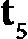
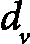
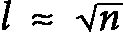
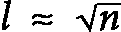
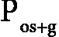
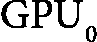

# 第八章：深入探索大型语言模型

近年来，学术界、工业界甚至大众对 Transformer 的兴趣急剧上升。当前最前沿的基于 Transformer 的架构被称为**大型语言模型**（**LLM**）。其最吸引人的特点是文本生成能力，而最著名的例子便是 ChatGPT（[`chat.openai.com/`](https://chat.openai.com/)）。但在其核心，依旧是我们在 *第七章*中介绍的朴素 Transformer。幸运的是，我们已经建立了坚实的 Transformer 基础。这一架构的一个显著特点是，自从引入以来，它几乎没有发生过太大变化。相反，LLM 的能力随着模型规模的增大而增长（这一点从名称上就可以看出来），这也为“*量变导致质变*”这一说法提供了有力的佐证。

LLM 的成功进一步推动了该领域的研究（或者是反过来？）。一方面，大型工业实验室（如 Google、Meta、Microsoft 或 OpenAI）投入大量资金，以推动更大规模 LLM 的边界。另一方面，灵活的开源社区也以有限的资源找到创造性的方式，取得了大量进展。

在本章中，我们将从理论和实践两个角度探索当前的 LLM 领域。我们将调查许多最新的 LLM，它们的特性以及训练过程。此外，我们还将看到如何借助 Hugging Face Transformers 库将它们应用于我们的目标。

在本章中，我们将涵盖以下主要内容：

+   介绍 LLM

+   LLM 架构

+   训练 LLM

+   LLM 的突现能力

+   介绍 Hugging Face Transformers

# 技术要求

我们将使用 Python、PyTorch 和 Hugging Face Transformers 库（[`github.com/huggingface/transformers`](https://github.com/huggingface/transformers)）实现本章中的示例。如果你没有安装这些工具的环境，也不必担心——示例可以在 Google Colab 的 Jupyter notebook 中找到。代码示例也在本书的 GitHub 仓库中： [`github.com/PacktPublishing/Python-Deep-Learning-Third-Edition/tree/main/Chapter08`](https://github.com/PacktPublishing/Python-Deep-Learning-Third-Edition/tree/main/Chapter08)。

# 介绍 LLM

在本节中，我们将采用更系统化的方法，深入探讨基于 Transformer 的架构。正如我们在介绍中提到的，自 2017 年引入以来，Transformer 模块的变化几乎可以说微乎其微。相反，主要的进展体现在模型规模和训练数据集的增大。例如，原始的 GPT 模型（GPT-1）有 1.17 亿个参数，而 GPT-3（*语言模型是少样本学习者*，[`arxiv.org/abs/2005.14165`](https://arxiv.org/abs/2005.14165)）则有 1750 亿个参数，增加了 1000 倍。我们可以根据模型的规模区分两类非正式的 Transformer 模型：

+   **预训练语言模型**（**PLMs**）：具有较少参数的变换器，例如**双向编码器表示来自变换器**（**BERT**）和**生成式预训练变换器**（**GPT**）属于这一类别。从 BERT 开始，这些变换器引入了两步预训练/微调（FT）范式。注意力机制和无监督预训练（**掩蔽语言建模**（**MLM**）或**下一个词预测**（**NWP**）的结合创造了有效的通用语义特征，我们可以利用这些特征进行多个下游任务。因此，PLMs 比其他**自然语言处理**（**NLP**）算法（如**递归神经网络**（**RNNs**））表现得更好。加上它们高度并行化的架构，这激发了很多基于变换器的后续研究，产生了改进的模型，并最终带来了下一个类别。

+   **LLMs**：这些是具有数十亿参数的变换器模型。LLMs 与 PLMs 在以下几个方面有质的区别：

    +   **突现能力**：它们能够解决一系列复杂的任务，我们将在*LLMs 的突现能力*部分进行讨论

    +   **提示接口**：LLMs 可以通过自然语言与人类互动，而无需特定的 API

    +   **研究与工程的融合**：LLM 的规模要求研究人员具备强大的大规模数据处理和并行训练的工程能力

目前，LLMs 几乎完全是解码器-only 模型，因为当前 LLMs 的主要应用集中在文本生成（例如，像 ChatGPT 这样的聊天机器人）。这种情况是以牺牲编码器-only 和编码器-解码器架构为代价的。为了更好地理解为什么会这样，我们来看一下聊天机器人的工作原理。它以用户生成的消息（称为**提示**）开始。提示是解码器模型的初始输入序列，该模型每次生成一个标记作为响应。响应会被添加回输入序列。一个特殊的标记将提示和响应分开。一旦 LLM 生成了响应，用户可以再发出一个新的提示。在这种情况下，我们将新提示与现有序列连接，并要求 LLM 基于扩展的序列创建新的响应。LLM 没有机制去记住现有的聊天会话，除了将其作为输入序列的一部分。这一过程可以无限继续。然而，一旦达到上下文窗口的最大长度，它将开始截断序列的最初部分（我们可以把它看作一个滑动窗口）。

注意

本章部分内容来源于论文《大规模语言模型概览》([`arxiv.org/abs/2303.18223`](https://arxiv.org/abs/2303.18223))。我们将简单地称之为*概览*。

# LLM 架构

在*第七章*中，我们介绍了**多头注意力**（**MHA**）机制以及三种主要的 Transformer 变体——编码器-解码器、仅编码器和仅解码器（我们使用 BERT 和 GPT 作为典型的编码器和解码器模型）。在本节中，我们将讨论 LLM 架构的各个方面。让我们首先集中注意力（是的——这又是那个老笑话）在注意力机制上。

## LLM 注意力变体

到目前为止，我们讨论的注意力机制被称为**全局注意力**。下图展示了双向全局自注意力机制的**连接矩阵**（上下文窗口大小为 *n=8*）：


图 8.1 – 带有上下文窗口大小为 n=8 的全局自注意力

每一行和每一列代表完整的输入令牌序列，![<mml:math xmlns:mml="http://www.w3.org/1998/Math/MathML" xmlns:m="http://schemas.openxmlformats.org/officeDocument/2006/math"><mml:mfenced open="[" close="]" separators="|"><mml:mrow><mml:msub><mml:mrow><mml:mi mathvariant="bold">t</mml:mi></mml:mrow><mml:mrow><mml:mn>1</mml:mn></mml:mrow></mml:msub><mml:mo>…</mml:mo><mml:msub><mml:mrow><mml:mi mathvariant="bold">t</mml:mi></mml:mrow><mml:mrow><mml:mn>8</mml:mn></mml:mrow></mml:msub></mml:mrow></mml:mfenced></mml:math>](img/737.png)。虚线彩色对角单元格表示当前输入令牌（查询），。每列中未中断的彩色单元格表示所有令牌（键），这些令牌是可以关注的对象。例如，关注所有前面的令牌，[t 1…t 4]，

以及所有后续的标记，![<mml:math xmlns:mml="http://www.w3.org/1998/Math/MathML" xmlns:m="http://schemas.openxmlformats.org/officeDocument/2006/math"><mml:mfenced open="[" close="]" separators="|"><mml:mrow><mml:msub><mml:mrow><mml:mi mathvariant="bold">t</mml:mi></mml:mrow><mml:mrow><mml:mn>6</mml:mn></mml:mrow></mml:msub><mml:mo>…</mml:mo><mml:msub><mml:mrow><mml:mi mathvariant="bold">t</mml:mi></mml:mrow><mml:mrow><mml:mn>8</mml:mn></mml:mrow></mml:msub></mml:mrow></mml:mfenced></mml:math>](img/741.png)。术语*全局*意味着会关注所有的标记。因此，所有的单元格都会被着色。正如我们将在*稀疏注意力*部分看到的，存在一些注意力的变体，并非所有标记都会参与其中。我们将用透明单元格来表示这些标记。该图展示了双向自注意力机制，因为查询可以同时关注前面的（下方）和后面的（上方）元素。在单向情况下，查询只会关注当前输入标记下方的元素。例如，只会关注![<mml:math xmlns:mml="http://www.w3.org/1998/Math/MathML" xmlns:m="http://schemas.openxmlformats.org/officeDocument/2006/math"><mml:mfenced open="[" close="]" separators="|"><mml:mrow><mml:msub><mml:mrow><mml:mi mathvariant="bold">t</mml:mi></mml:mrow><mml:mrow><mml:mn>1</mml:mn></mml:mrow></mml:msub><mml:mo>…</mml:mo><mml:msub><mml:mrow><mml:mi mathvariant="bold">t</mml:mi></mml:mrow><mml:mrow><mml:mn>4</mml:mn></mml:mrow></mml:msub></mml:mrow></mml:mfenced></mml:math>](img/744.png)。

正如我们将看到的，注意力机制的一个主要挑战是其时间和空间复杂度。

### 注意力复杂度

尽管注意力机制（特别是全局注意力）有其优点，但也存在一些缺点。其中之一是随着上下文窗口的增大，空间和时间复杂度会呈二次方增长。这是因为该机制是通过矩阵和矩阵乘法实现的。

矩阵乘法的时间复杂度

两个*n×n*矩阵相乘的时间复杂度是，因为经典实现使用了三重嵌套循环。在实践中，该算法经过优化，复杂度较低。本节目的是使用经典实现的复杂度。

例如，大小为*n=4*的上下文窗口会产生*n×n=4x4* `Q` 和 `V` 矩阵，每个矩阵有 16 个单元格。但是，大小为*n=8*的上下文窗口会产生*n×n=8x8* `Q` 和 `V` 矩阵，每个矩阵有 64 个单元格。因此，两倍大的上下文窗口需要四倍的内存。由于矩阵乘法的时间复杂度是，将上下文窗口从*n=4*增加到*n=8*会将操作数从增加到。

接下来，让我们专注于变压器块，其中包括一个**前馈网络**（**FFN**），

多头自注意力机制和四个线性投影（**全连接**（**FC**）层）——三个用于`Q`/`K`/`V`预注意力分离，一个用于合并注意力头的输出。我们将讨论每个组件在模块计算负载中的相对权重。我们用表示嵌入大小，用表示关键维度，用表示值维度（![<mml:math xmlns:mml="http://www.w3.org/1998/Math/MathML" xmlns:m="http://schemas.openxmlformats.org/officeDocument/2006/math"><mml:msub><mml:mrow><mml:mi>d</mml:mi></mml:mrow><mml:mrow><mml:mi>k</mml:mi></mml:mrow></mml:msub><mml:mo>=</mml:mo><mml:msub><mml:mrow><mml:mi>d</mml:mi></mml:mrow><mml:mrow><mml:mi>v</mml:mi></mml:mrow></mml:msub><mml:mo>=</mml:mo><mml:msub><mml:mrow><mml:mi>d</mml:mi></mml:mrow><mml:mrow><mml:mi>m</mml:mi><mml:mi>o</mml:mi><mml:mi>d</mml:mi><mml:mi>e</mml:mi><mml:mi>l</mml:mi></mml:mrow></mml:msub><mml:mtext>/</mml:mtext><mml:mi>h</mml:mi><mml:mo>=</mml:mo><mml:mi>d</mml:mi></mml:math>](img/752.png))，用上下文窗口大小`n`，头的数量`h`，以及 FFN 中隐藏层的大小*ffn*（通常约定为*ffn=4`d`）表示。不同组件的时间复杂度如下所示：

+   ![<mml:math xmlns:mml="http://www.w3.org/1998/Math/MathML" xmlns:m="http://schemas.openxmlformats.org/officeDocument/2006/math"><mml:mi>O</mml:mi><mml:mfenced separators="|"><mml:mrow><mml:mi>h</mml:mi><mml:mo>×</mml:mo><mml:mn>4</mml:mn><mml:mo>×</mml:mo><mml:mi>n</mml:mi><mml:mo>×</mml:mo><mml:msup><mml:mrow><mml:mi>d</mml:mi></mml:mrow><mml:mrow><mml:mn>2</mml:mn></mml:mrow></mml:msup></mml:mrow></mml:mfenced><mml:mo>=</mml:mo><mml:mi>O</mml:mi><mml:mfenced separators="|"><mml:mrow><mml:mi>n</mml:mi><mml:mo>×</mml:mo><mml:msup><mml:mrow><mml:mi>d</mml:mi></mml:mrow><mml:mrow><mml:mn>2</mml:mn></mml:mrow></mml:msup></mml:mrow></mml:mfenced></mml:math>](img/753.png)：三个输入线性投影用于所有头

+   ![<mml:math xmlns:mml="http://www.w3.org/1998/Math/MathML" xmlns:m="http://schemas.openxmlformats.org/officeDocument/2006/math"><mml:mi>O</mml:mi><mml:mfenced separators="|"><mml:mrow><mml:mi>h</mml:mi><mml:mo>×</mml:mo><mml:msup><mml:mrow><mml:mi>n</mml:mi></mml:mrow><mml:mrow><mml:mn>2</mml:mn></mml:mrow></mml:msup><mml:mo>×</mml:mo><mml:mi>d</mml:mi></mml:mrow></mml:mfenced><mml:mo>=</mml:mo><mml:mi>O</mml:mi><mml:mfenced separators="|"><mml:mrow><mml:msup><mml:mrow><mml:mi>n</mml:mi></mml:mrow><mml:mrow><mml:mn>2</mml:mn></mml:mrow></mml:msup><mml:mo>×</mml:mo><mml:mi>d</mml:mi></mml:mrow></mml:mfenced></mml:math>](img/754.png): `h` 自注意力头

+   ![<mml:math xmlns:mml="http://www.w3.org/1998/Math/MathML" xmlns:m="http://schemas.openxmlformats.org/officeDocument/2006/math"><mml:mi>O</mml:mi><mml:mfenced separators="|"><mml:mrow><mml:mi>h</mml:mi><mml:mo>×</mml:mo><mml:mi>n</mml:mi><mml:mo>×</mml:mo><mml:msup><mml:mrow><mml:mi>d</mml:mi></mml:mrow><mml:mrow><mml:mn>2</mml:mn></mml:mrow></mml:msup></mml:mrow></mml:mfenced><mml:mo>=</mml:mo><mml:mi>O</mml:mi><mml:mfenced separators="|"><mml:mrow><mml:mi>n</mml:mi><mml:mo>×</mml:mo><mml:msup><mml:mrow><mml:mi>d</mml:mi></mml:mrow><mml:mrow><mml:mn>2</mml:mn></mml:mrow></mml:msup></mml:mrow></mml:mfenced></mml:math>](img/755.png): 第四个自注意力头后的输出线性投影

+   ![<mml:math xmlns:mml="http://www.w3.org/1998/Math/MathML" xmlns:m="http://schemas.openxmlformats.org/officeDocument/2006/math"><mml:mi>O</mml:mi><mml:mfenced separators="|"><mml:mrow><mml:mi>n</mml:mi><mml:mo>×</mml:mo><mml:mi>d</mml:mi><mml:mo>×</mml:mo><mml:mi>f</mml:mi><mml:mi>f</mml:mi><mml:mi>n</mml:mi><mml:mo>+</mml:mo><mml:mi>n</mml:mi><mml:mo>×</mml:mo><mml:mi>d</mml:mi><mml:mo>×</mml:mo><mml:mi>f</mml:mi><mml:mi>f</mml:mi><mml:mi>n</mml:mi></mml:mrow></mml:mfenced><mml:mo>=</mml:mo><mml:mi>O</mml:mi><mml:mfenced separators="|"><mml:mrow><mml:mn>8</mml:mn><mml:mi>n</mml:mi><mml:mo>×</mml:mo><mml:msup><mml:mrow><mml:mi>d</mml:mi></mml:mrow><mml:mrow><mml:mn>2</mml:mn></mml:mrow></mml:msup></mml:mrow></mml:mfenced><mml:mo>=</mml:mo><mml:mi>O</mml:mi><mml:mfenced separators="|"><mml:mrow><mml:mi>n</mml:mi><mml:mo>×</mml:mo><mml:msup><mml:mrow><mml:mi>d</mml:mi></mml:mrow><mml:mrow><mml:mn>2</mml:mn></mml:mrow></mml:msup></mml:mrow></mml:mfenced></mml:math>](img/756.png): FFN 模块

该块的完整综合复杂度为 ![<mml:math xmlns:mml="http://www.w3.org/1998/Math/MathML" xmlns:m="http://schemas.openxmlformats.org/officeDocument/2006/math"><mml:mi>O</mml:mi><mml:mfenced separators="|"><mml:mrow><mml:mi>n</mml:mi><mml:mo>×</mml:mo><mml:msup><mml:mrow><mml:mi>d</mml:mi></mml:mrow><mml:mrow><mml:mn>2</mml:mn></mml:mrow></mml:msup><mml:mo>+</mml:mo><mml:msup><mml:mrow><mml:mi>n</mml:mi></mml:mrow><mml:mrow><mml:mn>2</mml:mn></mml:mrow></mml:msup><mml:mo>×</mml:mo><mml:mi>d</mml:mi></mml:mrow></mml:mfenced></mml:math>](img/757.png)。我们可以看到它依赖于上下文窗口长度 `n` 与嵌入大小 `d` 之间的比例。如果 *d>>n*，则线性投影的计算时间将超过注意力头的时间，反之亦然。在实际应用中，*d>>n* 是最常见的情况。但无论如何，注意力机制至少具有二次空间和时间复杂度。我们来看看一些应对这一挑战的解决方案。

### 多查询和分组查询注意力

MHA 将输入数据通过每个头的三个线性投影分支到多个头。下图展示了该配置的两种优化：


图 8.2 – 左侧：MHA；中间：多查询注意力（MQA）；右侧：分组查询注意力（GQA）（灵感来源于 [`arxiv.org/abs/2305.13245`](https://arxiv.org/abs/2305.13245)）

我们来讨论它们（除了我们在 *第七章* 中介绍的 MHA）。

+   **MQA**（*快速转换器解码：只需一个写头*，[`arxiv.org/abs/1911.02150`](https://arxiv.org/abs/1911.02150)）：不同的头共享键和值投影，而不是 MHA 中的独立投影。由于输入序列相同，所有头共享相同的键值存储，仅在查询上有所不同。这个优化减少了内存和计算需求，且几乎没有性能损失。

+   **GQA**（*GQA：从多头检查点训练通用多查询转换器模型*，[`arxiv.org/abs/2305.13245`](https://arxiv.org/abs/2305.13245)）：MHA 和 MQA 的混合体，为一组查询头共享单一的键和值头。作者显示，GQA 的速度几乎与 MQA 一致，且质量接近 MHA。

在下一节中，我们将讨论注意力优化，它考虑了 GPU 内存管理的具体细节。

### FlashAttention

在本节中，我们将介绍 FlashAttention（*FlashAttention: Fast and Memory-Efficient Exact Attention with IO-Awareness*，[`arxiv.org/abs/2205.14135;`](https://arxiv.org/abs/2205.14135;) *FlashAttention-2: Faster Attention with Better Parallelism and Work Partitioning*，[`arxiv.org/abs/2307.08691`](https://arxiv.org/abs/2307.08691)）。这不是一种新的注意力机制，而是全球注意力的一种实现，考虑了 GPU 硬件的具体特点。GPU 拥有大量的计算核心，可以执行相对简单但高度可并行化的操作（如矩阵乘法）。它有两级内存：小但快速的缓存（L1 和 L2）和大但相对较慢的 **高带宽内存** (**HBM**)。为了执行一个操作，它会将必要的数据从 HBM 转移到缓存。计算核心使用缓存进行计算。操作完成后，结果会存储回 HBM。在这个管道中，主要的瓶颈是数据传输，而不是实际的计算（数据传输越少越好）。

接下来，让我们关注注意力模块，它包含五个操作：1）矩阵乘法 ()，2）掩码，3）softmax，4）dropout，和 5）矩阵乘法（`V`）。标准实现顺序地执行这些操作，从第一个矩阵乘法开始。完成后，它会继续进行掩码操作，依此类推。每个操作涉及 HBM 和缓存之间的双向数据传输。这些传输是多余的，因为操作 `i` 的结果从缓存传输到 HBM 后，又需要从 HBM 返回到缓存进行操作 *i+1*。FlashAttention 提出了一个特殊的 **融合内核** 来解决这种低效问题。它将 `Q`/`K`/`V` 矩阵拆分成可以适配缓存的小块。一旦这些块被传输到缓存中，融合内核将执行所有五个操作，无需中间的数据传输。只有最终结果被发送回 HBM。将矩阵拆分成小块是可行的，因为矩阵乘法是显式并行的。但 FlashAttention 的另一个创新是能够拆分 softmax 操作，这并不像矩阵乘法那样简单（我们不会详细介绍它是如何实现的）。当所有矩阵块通过这个管道时，操作就完成了。

矩阵乘法拆分

假设我们要对矩阵`A`和`B`进行乘法运算。由于矩阵乘法的运作方式，我们可以按列将`B`拆分为两个矩阵，和。然后，我们在每个设备上执行两个矩阵乘法运算：和。最后，我们将两个操作的输出合并到一个矩阵中，相当于原始乘法产生的矩阵，**AB**。

在下一节中，我们将讨论通过新的注意力机制解决性能问题。

### 稀疏注意力

**稀疏注意力**是一类方法，其中输出向量仅关注所有关键向量的一个子集，而不是整个上下文窗口。例如，如果我们可以从八个上下文向量中选择四个感兴趣的向量进行关注，那么我们可以将所需的计算量减少一半。

下图展示了三种双向稀疏注意力机制：


图 8.3 – 左：局部注意力；中：膨胀局部注意力；右：随机注意力；上下文窗口大小 n=12

这些机制与*图 8.2*中的符号相同，唯一的区别是——透明单元格代表令牌（关键字），查询不会关注这些单元格。

在左侧，我们有双向**局部注意力**（或**滑动窗口注意力**），这是在*图像 Transformer*中首次提出的，[`arxiv.org/abs/1802.05751`](https://arxiv.org/abs/1802.05751)。查询仅关注当前标记周围最近的`w`个键的有限上下文窗口（左边½`w`，右边½`w`）。自注意力模块仍然将整个`n`大小的序列作为输入，但每个标记只关注有限的`w`大小的局部上下文。这样，内存占用与全局注意力相同，但时间复杂度减少为，而不是。

为了理解局部注意力为何有效，我们回顾一下**卷积神经网络**（**CNN**）。回想一下，CNN 的早期层具有较小的感受野，并捕获较小、更简单的特征。相反，CNN 的更深层具有较大的感受野，能够捕获更大和更复杂的特征。我们可以将相同的原则应用于 Transformer。研究表明，初始的 Transformer 模块学习简单的标记特征和局部语法，而更深层则学习标记语义中更复杂的上下文相关特征。因此，我们可以将局部注意力应用于较浅的 Transformer 模块，而将全局注意力保留给更深的模块，而不会牺牲性能。

**扩展注意力**（*图 8.3*，中间）是局部注意力的一种修改，工作原理类似于我们在*第四章*中介绍的扩展卷积。与局部注意力不同，这里上下文窗口不是连续的。相反，每个上下文标记之间有一个*间隔*（可以是多个单元格）。这使得在相同的计算*数量*下，可以关注更广泛的上下文。

接下来，我们有双向的 **随机注意力** (*图 8.3*，右)，其中当前查询（标记）会关注来自完整上下文窗口的 `r` 个键（标记）的子集。时间复杂度减少为  而不是 。注意力模式可以视为一个有向图。在随机注意力的情况下，这个图也是随机的。也就是说，信息可以在任何一对节点之间迅速流动，而不考虑数据的实际结构，这可能会带有偏见。

也可以结合全局和局部注意力。其中一个例子是 **Longformer** (*Longformer：长文档变换器*，[`arxiv.org/abs/2004.05150`](https://arxiv.org/abs/2004.05150))，如下图所示：


图 8.4 – 结合了局部和全局注意力；左：Longformer 块；右：大鸟块

它在一个未修改的变换器模型中引入了一个可以替代的自注意力块。该块表示全局和局部（或扩展）注意力的结合。它对大多数输入标记应用局部注意力，但少数标记可以使用全局注意力。*图 8.4* 的左侧显示了结合的自注意力块和一个应用局部和全局注意力的输入标记示例。更具体地说，作者在一个单向 BERT 风格的模型中使用 Longformer 块来解决 MLM 和 `[CLS]` 在 MLM 任务中的问题。如图所示，全局注意力在两个方向上都有效。特殊标记可以关注所有其他标记，但其他标记除了其局部注意力上下文之外，还可以关注特殊标记。在自回归语言建模（单向模型）的情况下，他们仅应用扩展的局部注意力，因为没有具有特殊意义的标记。完整的 Longformer 模型在较深的层使用扩展注意力和更大的上下文窗口，而较早的层仅使用局部注意力。

**大鸟** (*图 8.4*，右；*大鸟：用于长序列的变换器*，[`arxiv.org/abs/2007.14062`](https://arxiv.org/abs/2007.14062)) 类似于 Longformer，但添加了随机注意力。

接下来，我们讨论由 OpenAI 开发的 **稀疏变换器** 注意力机制（*生成长序列的稀疏变换器*，[`arxiv.org/abs/1904.10509`](https://arxiv.org/abs/1904.10509)）。稀疏变换器引入了单向步长和固定注意力机制，如下图所示：


图 8.5 – 左：步长稀疏注意力，l=4；右：固定稀疏注意力；输入图像大小 4×4；序列长度 n=12（灵感来自 [`arxiv.org/abs/1904.10509`](https://arxiv.org/abs/1904.10509)）

为了理解它们是如何工作的，我们来讨论一下论文的背景。论文提出了一种统一的仅解码器模型，用于生成新的图像、文本或音频。根据使用场景，输入和输出数据可以是二维图像张量（为简化起见，我们省略颜色维度）。然而，变换器接受的是一维序列作为输入。我们可以通过将图像的行连接成一个一维张量来解决这个问题。完成后，我们可以将图像视为常规序列，并将其输入到模型中。*图 8.5* 显示了一个二维图像（顶部）及其等效的一维连接序列（底部）的步长（左）和固定注意力（右）连接矩阵。需要注意的是，底部扩展的序列与顶部图像的尺寸不匹配——它的长度应为 *n=16*，对应 4×4 图像，而不是现在的 *n=12*。由于这是一个生成式解码器模型，它使用单向注意力，尽管图像中的方向性并不像文本中那样明确。

接下来，我们讨论这两种注意力机制。我们从步长注意力开始，其中当前词元关注输入图像的前一行和列。这是两个分别在不同注意力头之间分开的机制：

+   **行头**：等同于单向局部注意力，它关注前一个 词元，其中是二维输入图像每行的长度。我们可以用 `i` 表示当前输入词元的索引，用 `j` 表示它关注的词元。我们可以用以下方式总结行机制：


+   **列头**：等同于具有步幅（间隔）为的单向膨胀注意力（与行头相同）。假设输入图像是正方形的，列头会跳过相当于一行的间隔 ()，并关注一个位置，表示在一维序列虚拟列中的前一个单元格。我们可以用以下方式总结列跨步注意力：


该方案在二维输入数据上表现最佳，例如图像，因为行/列划分反映了底层数据结构。该方案的时间复杂度为![<mml:math xmlns:mml="http://www.w3.org/1998/Math/MathML" xmlns:m="http://schemas.openxmlformats.org/officeDocument/2006/math"><mml:mi>O</mml:mi><mml:mfenced separators="|"><mml:mrow><mml:mi>n</mml:mi><mml:mo>×</mml:mo><mml:mi>l</mml:mi><mml:mo>×</mml:mo><mml:mi>d</mml:mi></mml:mrow></mml:mfenced><mml:mo>≈</mml:mo><mml:mi>O</mml:mi><mml:mfenced separators="|"><mml:mrow><mml:mi>n</mml:mi><mml:mo>×</mml:mo><mml:msqrt><mml:mi>n</mml:mi></mml:msqrt><mml:mo>×</mml:mo><mml:mi>d</mml:mi></mml:mrow></mml:mfenced></mml:math>](img/773.png)。

接下来，我们介绍**固定注意力**，它关注一个固定的列及其最新列元素之后的元素。对于非周期性数据（如文本），它表现更好。再次强调，这是两种独立机制在不同头之间的组合：

+   **列头**：关注于一个固定的列，该列不一定与当前输入标记的列相匹配，。多个输入标记可以关注相同的列，这使得它能够关注整个序列的长度。我们可以用以下方式总结列机制：


这里，`c` 是一个参数（8、16 或 32）。例如，如果 *l=64* 且 *c=16*，那么所有大于 64 的位置可以关注 48-64 的位置，所有大于 128 的位置可以关注 112-128 的位置，以此类推。

+   **行头**：第一个头与跨步注意力中的行头类似。但不同的是，它不是关注整个行的长度，而是只关注当前列头的位置。行头提供了局部上下文。我们可以将其总结如下：

![<mml:math xmlns:mml="http://www.w3.org/1998/Math/MathML" xmlns:m="http://schemas.openxmlformats.org/officeDocument/2006/math" display="block"><mml:mi>f</mml:mi><mml:mi>l</mml:mi><mml:mi>o</mml:mi><mml:mi>o</mml:mi><mml:mi>r</mml:mi><mml:mfenced separators="|"><mml:mrow><mml:mfrac><mml:mrow><mml:mi>j</mml:mi></mml:mrow><mml:mrow><mml:mi>l</mml:mi></mml:mrow></mml:mfrac></mml:mrow></mml:mfenced><mml:mo>=</mml:mo><mml:mi>f</mml:mi><mml:mi>l</mml:mi><mml:mi>o</mml:mi><mml:mi>o</mml:mi><mml:mi>r</mml:mi><mml:mfenced separators="|"><mml:mrow><mml:mfrac><mml:mrow><mml:mi>i</mml:mi></mml:mrow><mml:mrow><mml:mi>l</mml:mi></mml:mrow></mml:mfrac></mml:mrow></mml:mfenced></mml:math>](img/776.png)

这里，*floor* 将除法结果向下取整到最接近的整数。

接下来，让我们将注意力集中在一种解码器架构的特殊案例及大语言模型架构的各个方面上（我简直停不下来）。

## 前缀解码器

在这一节中，我们将介绍**前缀**（或**非因果**）**解码器**（*统一语言模型预训练用于自然语言理解与生成*，[`arxiv.org/abs/1905.03197`](https://arxiv.org/abs/1905.03197)）。这是一种仅包含解码器的模型，提出了一种新的注意力模式，如下图所示：


图 8.6 – 前缀解码器自注意力模式（灵感来自 https://arxiv.org/abs/1905.03197）

我们将输入序列分成两个部分—— 到 （**源**或**前缀**），以及  到 （**目标**）。源段落的词汇之间可以互相访问。而目标段落的词汇只能单向访问整个（源和目标）输入序列中前面的词汇。例如， 是源段落的一部分，可以访问

，，和。相反，是目标的一部分，只能处理从到（但不能处理）。

前缀解码器是编码器-解码器和解码器模型的混合体。源段充当编码器，目标段充当解码器，但其底层架构基于解码器。

我们可以使用前缀解码器来表示 `[SOS]` 和序列结束（`[EOS]`）标记。例如，我们来看一下文本摘要任务。我们将要总结的文本序列（`S1`）及其摘要（`S2`）表示为一个单一序列：`[[SOS],S1,[EOS],S2,[EOS]]`。源序列 `[[SOS],S1,[EOS]]` 属于双向注意力模式，而目标序列 `[S2,[EOS]]` 则属于单向注意力模式。我们通过 MLM（Masked Language Model）预训练模型，其中我们从完整序列中随机遮蔽一些标记。我们通过随机遮蔽目标序列中的一些标记并学习恢复被遮蔽的词语来微调模型。需要注意的是，`[EOS]` 标记也可以参与遮蔽。通过这种方式，模型学习何时生成 `[EOS]` 标记，并终止目标序列的生成。

接下来，让我们更详细地了解 LLM 架构的各个方面。

## Transformer 的基本构件

以下表格提供了主要 Transformer 网络配置及其变种的详细总结：


图 8.7 – 不同的 Transformer 配置（来源：https://arxiv.org/abs/2303.18223）

我们已经熟悉了其中的许多内容——我们在*第七章*介绍了三种不同的归一化位置。我们还在*第三章*介绍了三种归一化方法中的两种。默认情况下，大多数 Transformer 使用 **层归一化** (**LN**)。然而，一些模型使用 **RMSNorm**，因为它在训练速度和性能上优于 LN。最后但同样重要的是，**DeepNorm** (*DeepNet: 扩展 Transformer 至 1000 层*, [`arxiv.org/abs/2203.00555`](https://arxiv.org/abs/2203.00555)) 对我们来说是新的。正如论文标题所示，这种归一化帮助构建了一个 1000 层的 Transformer。作者认为，在**层归一化** (**pre-ln**) 架构中，底层的梯度往往大于顶部层的梯度，这导致与 **后层归一化** (**post-ln**) 模型相比性能下降。另一方面，后层归一化模型由于梯度爆炸而不稳定。为了克服这一问题，他们提出了一种简单而有效的残差连接归一化方法：


这里，*α* 是应用在残差连接输出处的常数。其值取决于变压器类型（编码器或解码器）和模型深度（块数）。DeepNorm 的理论基础在于通过这个常数限制模型更新。

接下来，让我们讨论激活函数。更具体地说，我们将讨论**前馈网络**（**FFN**）子层的第一层激活函数（`ActivationFunc`），因为这是变压器块中唯一显式的激活函数。作为提醒，我们可以定义原始的 FFN 如下：

![<mml:math xmlns:mml="http://www.w3.org/1998/Math/MathML" xmlns:m="http://schemas.openxmlformats.org/officeDocument/2006/math" display="block"><mml:mtext>FFN</mml:mtext><mml:mfenced separators="|"><mml:mrow><mml:mtext>x</mml:mtext></mml:mrow></mml:mfenced><mml:mo>=</mml:mo><mml:mtext>激活函数</mml:mtext><mml:mtext>Func</mml:mtext><mml:mfenced separators="|"><mml:mrow><mml:msub><mml:mrow><mml:mi mathvariant="bold">W</mml:mi></mml:mrow><mml:mrow><mml:mn>1</mml:mn></mml:mrow></mml:msub><mml:mi mathvariant="bold">x</mml:mi><mml:mo>+</mml:mo><mml:msub><mml:mrow><mml:mi>b</mml:mi></mml:mrow><mml:mrow><mml:mn>1</mml:mn></mml:mrow></mml:msub></mml:mrow></mml:mfenced><mml:msub><mml:mrow><mml:mi mathvariant="bold">W</mml:mi></mml:mrow><mml:mrow><mml:mn>2</mml:mn></mml:mrow></mml:msub><mml:mo>+</mml:mo><mml:msub><mml:mrow><mml:mi>b</mml:mi></mml:mrow><mml:mrow><mml:mn>2</mml:mn></mml:mrow></mml:msub></mml:math>](img/790.png)

我们在 *第三章* 中讨论了大多数激活函数，除了 **SwiGLU** 和 **GeGLU**（*GLU 变体改进变压器*，[`arxiv.org/abs/2002.05202`](https://arxiv.org/abs/2002.05202)）。它们是 **门控线性单元**（**GLU**）的变体，GLU 更像是层和激活函数的融合，而不是纯粹的激活函数。我们可以定义 GLU 如下：

![<mml:math xmlns:mml="http://www.w3.org/1998/Math/MathML" xmlns:m="http://schemas.openxmlformats.org/officeDocument/2006/math" display="block"><mml:mi>A</mml:mi><mml:mi>c</mml:mi><mml:mi>t</mml:mi><mml:mi>i</mml:mi><mml:mi>v</mml:mi><mml:mi>a</mml:mi><mml:mi>t</mml:mi><mml:mi>i</mml:mi><mml:mi>o</mml:mi><mml:mi>n</mml:mi><mml:mtext>GLU</mml:mtext><mml:mfenced separators="|"><mml:mrow><mml:mtext>x</mml:mtext></mml:mrow></mml:mfenced><mml:mo>=</mml:mo><mml:mi>A</mml:mi><mml:mi>c</mml:mi><mml:mi>t</mml:mi><mml:mi>i</mml:mi><mml:mi>v</mml:mi><mml:mi>a</mml:mi><mml:mi>t</mml:mi><mml:mi>i</mml:mi><mml:mi>o</mml:mi><mml:mi>n</mml:mi><mml:mi mathvariant="normal">F</mml:mi><mml:mi mathvariant="normal">u</mml:mi><mml:mi mathvariant="normal">n</mml:mi><mml:mi mathvariant="normal">c</mml:mi><mml:mfenced separators="|"><mml:mrow><mml:mi mathvariant="bold">W</mml:mi><mml:mi mathvariant="bold">x</mml:mi><mml:mo>+</mml:mo><mml:mi>b</mml:mi></mml:mrow></mml:mfenced><mml:mo>⊗</mml:mo><mml:mfenced separators="|"><mml:mrow><mml:mi mathvariant="bold">V</mml:mi><mml:mi mathvariant="bold">x</mml:mi><mml:mo>+</mml:mo><mml:mi>c</mml:mi></mml:mrow></mml:mfenced></mml:math>](img/791.png)

这里，*ActivationFunc* 是一个特定的激活函数（*Swi*GLU 对应 *Swish*，*Ge*GLU 对应 *Ge*LU），⊗ 表示两个向量的逐元素乘积，`W` 和 `V` 是权重矩阵，表示线性投影（即，全连接层）。GLU 引入了一个额外的线性投影 `V`，与原始网络路径 `W` 并行。由于逐元素乘积，带有激活的路径 `W` 作为来自 `V` 路径信号的门控。这类似于 **长短时记忆**（**LSTM**）门。我们现在可以定义带 GLU 激活的前馈网络（FFN）：

![<mml:math xmlns:mml="http://www.w3.org/1998/Math/MathML" xmlns:m="http://schemas.openxmlformats.org/officeDocument/2006/math" display="block"><mml:msub><mml:mrow><mml:mtext>FFN</mml:mtext></mml:mrow><mml:mrow><mml:mtext>Activation</mml:mtext><mml:mtext>GLU</mml:mtext></mml:mrow></mml:msub><mml:mfenced separators="|"><mml:mrow><mml:mi mathvariant="bold">x</mml:mi></mml:mrow></mml:mfenced><mml:mo>=</mml:mo><mml:mfenced separators="|"><mml:mrow><mml:mi>A</mml:mi><mml:mi>c</mml:mi><mml:mi>t</mml:mi><mml:mi>i</mml:mi><mml:mi>v</mml:mi><mml:mi>a</mml:mi><mml:mi>t</mml:mi><mml:mi>i</mml:mi><mml:mi>o</mml:mi><mml:mi>n</mml:mi><mml:mi mathvariant="normal">F</mml:mi><mml:mi mathvariant="normal">u</mml:mi><mml:mi mathvariant="normal">n</mml:mi><mml:mi mathvariant="normal">c</mml:mi><mml:mfenced separators="|"><mml:mrow><mml:msub><mml:mrow><mml:mi mathvariant="bold">W</mml:mi></mml:mrow><mml:mrow><mml:mn>1</mml:mn></mml:mrow></mml:msub><mml:mi mathvariant="bold">x</mml:mi></mml:mrow></mml:mfenced><mml:mo>⊗</mml:mo><mml:mi mathvariant="bold">V</mml:mi><mml:mi mathvariant="bold">x</mml:mi></mml:mrow></mml:mfenced><mml:msub><mml:mrow><mml:mi mathvariant="bold">W</mml:mi></mml:mrow><mml:mrow><mml:mn>2</mml:mn></mml:mrow></mml:msub></mml:math>](img/792.png)

让我们注意到，作者已经从修改后的 FFN 中排除了偏置。这也是提及不同 LLMs 具有不同偏置配置的一个好地方，下面列出：

+   在线性投影和注意力块本身都使用偏置。

+   在线性投影中使用偏置，但在注意力块中不使用。

+   不要在线性投影或注意力块中使用偏置。

根据一些实验，缺乏偏置可以稳定训练。

接下来，让我们专注于迄今为止未提及的各种类型的位置嵌入。不幸的是（或者幸运的是），详细讨论它们超出了本书的范围。但要记住的重要一点是，我们有绝对（静态）或相对（动态）位置编码。在第一种情况下，我们修改输入令牌嵌入向量。在第二种情况下，我们修改与当前输入令牌位置相关的`K`/`V`注意力矩阵。

该调查总结了现有文献中有关详细变压器配置的建议。为了更强的泛化能力，建议使用预先的 RMSNorm 归一化，以及 SwiGLU 或 GeGLU 激活函数。此外，在嵌入层之后立即使用 LN 可能会导致性能下降。至于位置嵌入，**Rotary Positional Embedding**（**RoPE**）或**Attention with Linear Biases**（**AliBi**）在处理长序列时比其他方法表现更好。

现在我们对 LLMs 的架构属性已经很熟悉，让我们讨论具体的模型实例。

## 模型

以下表格总结了一些流行的最近 LLMs：


图 8.8 – 最近大型语言模型的模型卡，包含公开配置详情（修改自 https://arxiv.org/abs/2303.18223p）

这里，**PE** 表示位置嵌入，**#L** 表示变换器层数，**#H** 表示每层的注意力头数， 表示隐层状态的大小，**MCL** 表示训练期间的最大上下文长度。

我们将从 GPT 系列模型开始（由 OpenAI 开发），如以下图所示：


图 8.9 – GPT 系列模型的演变（灵感来源于 https://arxiv.org/abs/2303.18223）

我们已经熟悉 GPT-1，因此让我们继续了解 `gpt-3.5-turbo`，其上下文长度为 4,096 个标记，`gpt-3.5-turbo-16k` 的上下文长度为 16,384 个标记。目前的 Copilot 版本基于 GPT-3.5。最新的模型 GPT-4 接受多模态输入（图像和文本），但仅输出文本。它也是封闭的，但可能具有超过 1T 的参数。根据 OpenAI 首席执行官 Sam Altman 的说法，训练 GPT-4 的成本已超过 1 亿美元（https://www.wired.com/story/openai-ceo-sam-altman-the-age-of-giant-ai-models-is-already-over/）。GPT-4 也通过 OpenAI 的 API 提供，有两个子变体——`gpt-4`，上下文长度为 8,192 个标记，以及 `gpt-4-32k`，上下文长度为 32,768 个标记。

接下来，让我们讨论 Meta 发布的**LlaMa**系列预训练（且未微调）模型。第一个版本（*LLaMA: Open and Efficient Foundation Language Models*， [`arxiv.org/abs/2302.13971`](https://arxiv.org/abs/2302.13971)）有四个变体，参数量从 6B 到 65B 不等。由于 Meta 还发布了其权重（尽管不允许商业使用），这是开源社区中最受欢迎的 LLM 之一。这样，Meta 完成了预训练模型的重担，开源社区则将其作为**基础模型**使用，因为它可以通过相对较少的计算资源进行微调。最近，Meta 发布了**Llama 2**——Llama 的更新版（*Llama 2: Open Foundation and Fine-Tuned Chat Models*， [`ai.meta.com/research/publications/llama-2-open-foundation-and-fine-tuned-chat-models`](https://ai.meta.com/research/publications/llama-2-open-foundation-and-fine-tuned-chat-models)）。它有三个变体，分别为 7B、13B 和 70B 参数。Llama 2 使用比 Llama 1 多 40%的预训练数据，并且每个变体还有一个使用 RLHF 微调的版本。该模型的许可证允许商业使用（有些限制）。

这就结束了我们对 LLM 架构的调查。接下来，让我们讨论它们的训练。

# 训练 LLM

由于大多数 LLM 是仅解码器模型，最常见的 LLM 预训练任务是 NWP。模型参数的庞大数量（可达数百亿个）需要相对较大的训练数据集来防止过拟合，并实现模型的全部能力。这一要求带来了两个重大挑战：确保训练数据的质量和处理大量数据的能力。在接下来的部分中，我们将讨论 LLM 训练流水线的各个方面，从训练数据集开始。

## 训练数据集

我们可以将训练数据分为两大类：

+   **通用**：例如网页、书籍或对话文本。LLM 几乎总是基于通用数据进行训练，因为这些数据广泛可用且多样化，能够提升 LLM 的语言建模和泛化能力。

+   **专业**：代码、科学文章、教科书或多语言数据，旨在为 LLM 提供特定任务的能力。

以下表格列出了最受欢迎的语言模型数据集：


图 8.10 – 语言建模数据集（修改自 https://arxiv.org/abs/2303.18223）

让我们来讨论一下：

+   **书籍**：我们将专注于两个数据集：

    +   **BookCorpus**（*Aligning Books and Movies: Towards Story-like Visual Explanations by Watching Movies and Reading Books*， [`arxiv.org/abs/1506.06724`](https://arxiv.org/abs/1506.06724)）：包含了 11,000 本虚构书籍，约有 10 亿个词（2015 年发布）。

    +   **古腾堡计划** ([`www.gutenberg.org/`](https://www.gutenberg.org/))：包括 70,000 本小说类书籍。

+   **Common Crawl** ([`commoncrawl.org/`](https://commoncrawl.org/))：PB 级别的网络抓取数据库。数据按照获取日期进行分割，从 2008 年开始。最新的档案包含 31 亿网页（390 TiB 的未压缩内容），这些数据来源于 4,400 万个主机或 3,500 万个注册域名。虽然包含大量低质量数据，但也有多个子集包含更高质量的数据：

    +   **庞大且清理过的 Common Crawl 版本**（**C4**）：由 Google 开发的 800 GiB 数据集。原始数据集不可下载，但 Google 已发布工具，以便从 Common Crawl 数据库中重建该数据集。2019 年，**艾伦人工智能研究所**（**AI2**，https://allenai.org/）发布了该数据集的重建版本，可通过 [`huggingface.co/datasets/allenai/c4`](https://huggingface.co/datasets/allenai/c4) 获取。其最受欢迎的子版本是 *en* 版本，它移除了所有包含“坏词”列表中单词的文档（“坏词”列表可通过 [`github.com/LDNOOBW/List-of-Dirty-Naughty-Obscene-and-Otherwise-Bad-Words`](https://github.com/LDNOOBW/List-of-Dirty-Naughty-Obscene-and-Otherwise-Bad-Words) 查看）。

    +   **CC-News**：来自全球各大新闻网站的文章。

    +   **RealNews**：从 *Google News* 索引的 5,000 个新闻域名中提取的新闻文章。

    +   **CC-Stories-R**：一个用于常识推理和语言建模的数据集。它由与常识推理任务中的问题具有最大重叠的 `n`-gram 的 Common Crawl 文档组成。新的训练语料库代表了排名前 1.0% 的高质量文档。

+   **Reddit 链接**：解决 Common Crawl 低信噪比的一种方法是依赖人工策划的内容。Reddit 就是一个典型平台，用户可以发布文本内容或链接，其他用户可以对这些提交进行点赞（点赞称为 *karma*）。我们将提到两个基于 Reddit 的数据集：

    +   **WebText**（与 GPT-2 模型一起发布）：包含 4,500 万个 Reddit 提交链接，其中 karma 为三次或以上。这些链接背后的文档构成了 LLM 训练数据。WebText 并未公开发布，但有一个开源版本，名为 **OpenWebText** ([`github.com/jcpeterson/openwebtext`](https://github.com/jcpeterson/openwebtext))。

    +   **Pushshift** ([`arxiv.org/abs/2001.08435`](https://arxiv.org/abs/2001.08435))：包含所有在 Reddit 上提交的链接和评论。

Reddit API 定价争议

LLMs 的兴起使得 Reddit 的数据比以往更有价值。基于这一点，公司决定对其原本免费的 API 引入费用。这项措施主要针对那些计划利用这些数据训练 LLM 的 AI 公司。然而，这一提案导致许多该网站的志愿版主（Reddit 依赖他们）宣布通过暂时关闭他们所管理的原本开放的社区来进行罢工。截至写作时，双方的争议仍在持续。

+   **The Pile** (*An 800GB Dataset of Diverse Text for Language Modeling*, [`arxiv.org/abs/2101.00027`](https://arxiv.org/abs/2101.00027)): 由 22 个多样且高质量的数据集组成，来源包括 PubMed、arXiv、GitHub、Stack Exchange、Hacker News、YouTube 等。The Pile 还引入了原始 OpenWebText 和 BookCorpus 数据集的扩展版本 OpenWebText2 和 BookCorpus2。

+   **ROOTS** (*The BigScience ROOTS Corpus: A 1.6TB Composite Multilingual Dataset*, [`arxiv.org/abs/2303.03915`](https://arxiv.org/abs/2303.03915)): 一个规模庞大的精心策划的数据集，涵盖 46 种自然语言和 13 种编程语言。

+   **Wikimedia** ([`dumps.wikimedia.org/`](https://dumps.wikimedia.org/)): 因其高质量的内容，这是一个优秀的训练数据来源。

+   **Stack Exchange** ([`archive.org/details/stackexchange`](https://archive.org/details/stackexchange)): 一个拥有评分系统的 QA 主题网站网络。最具代表性的站点是**Stack Overflow**。它每三个月发布一次匿名化数据转储，包含所有用户贡献的内容。

+   **arXiv** (https://www.kaggle.com/datasets/Cornell-University/arxiv): 主要的科学数据来源，包含超过 22 亿篇科学文章。

+   **GitHub**: GH Archive 项目 ([`www.gharchive.org/`](https://www.gharchive.org/)) 记录、归档并提供公共 GitHub 时间线的访问。

实际上，LLM 的预训练步骤使用的是多个数据集的混合。以下截图展示了几个代表性 LLM 的预训练数据来源分布：


图 8.11 – 现有 LLM 预训练数据中各种数据源的比例（来源：https://arxiv.org/abs/2303.18223）

数据集混合并非一项简单的过程，需要多个处理步骤。我们来讨论一下这些步骤：

+   **移除低质量或无关的数据**：例如，网页中包含大量 HTML 标签、JavaScript 或**层叠样式表**（**CSS**）。然而，我们只对

    人类可读文本（除非我们明确希望训练模型理解 HTML）。在这种情况下，我们必须去除 HTML 和 JavaScript，只保留文本。

+   **移除个人可识别信息（PII）**：数据通常从网页中提取，而网页中可能包含个人信息。此步骤旨在从训练集中删除此类数据。

+   **分词**：我们在*第六章*中深入讨论了分词，本文不再赘述。

最后，让我们介绍一个实际的变压器缩放法则（*神经语言模型的缩放法则*， https://arxiv.org/abs/2001.08361）。由于其规模，训练 LLM 可能非常昂贵。因此，避免过度训练或训练不足至关重要。根据经验实验，缩放法则提出了训练计算量（以**浮动点操作每秒**，或**FLOPS**表示）、`C`，模型大小（参数数量）、`N`，以及训练数据集大小（令牌数量）之间的最佳比例：


既然我们已经知道了构建训练集的步骤，接下来让我们专注于实际的预训练。

## 预训练的特性

与其他**神经网络**（**NNs**）类似，LLM 的预训练通过梯度下降和反向传播进行。但由于其规模庞大，训练具有一些特定的特性，我们将在本节中讨论这些特性。

### Adam 优化器

大多数 LLM 使用 Adam（*Adam：一种随机优化方法*， [`arxiv.org/abs/1412.6980`](https://arxiv.org/abs/1412.6980)）或其某些变体。尽管我们在许多示例中使用了它，但至今我们尚未详细讨论它。现在是时候弥补这个遗漏了。

权重更新公式的回顾

在*第二章*，我们学习到使用反向传播来计算损失函数*J(θ)*关于每个参数![<mml:math xmlns:mml="http://www.w3.org/1998/Math/MathML" xmlns:m="http://schemas.openxmlformats.org/officeDocument/2006/math"><mml:msub><mml:mrow><mml:mi>θ</mml:mi></mml:mrow><mml:mrow><mml:mi>j</mml:mi></mml:mrow></mml:msub></mml:math>的梯度（一阶导数）：![<mml:math xmlns:mml="http://www.w3.org/1998/Math/MathML" xmlns:m="http://schemas.openxmlformats.org/officeDocument/2006/math"><mml:mo>∂</mml:mo><mml:mi>J</mml:mi><mml:mfenced separators="|"><mml:mrow><mml:mi>θ</mml:mi></mml:mrow></mml:mfenced><mml:mtext>/</mml:mtext><mml:mo>∂</mml:mo><mml:msub><mml:mrow><mml:mi>θ</mml:mi></mml:mrow><mml:mrow><mml:mi>j</mml:mi></mml:mrow></mml:msub></mml:math>（img/795.png）. 一旦我们得到梯度，我们可以使用公式![<mml:math xmlns:mml="http://www.w3.org/1998/Math/MathML" xmlns:m="http://schemas.openxmlformats.org/officeDocument/2006/math"><mml:msub><mml:mrow><mml:mi>θ</mml:mi></mml:mrow><mml:mrow><mml:mi>j</mml:mi></mml:mrow></mml:msub><mml:mo>←</mml:mo><mml:msub><mml:mrow><mml:mi>θ</mml:mi></mml:mrow><mml:mrow><mml:mi>j</mml:mi></mml:mrow></mml:msub><mml:mo>-</mml:mo><mml:mi>η</mml:mi><mml:mo>∂</mml:mo><mml:mi>J</mml:mi><mml:mfenced separators="|"><mml:mrow><mml:mi>θ</mml:mi></mml:mrow></mml:mfenced><mml:mtext>/</mml:mtext><mml:mo>∂</mml:mo><mml:msub><mml:mrow><mml:mi>θ</mml:mi></mml:mrow><mml:mrow><mml:mi>j</mml:mi></mml:mrow></mml:msub></mml:math>（img/796.png），其中*η*是学习率。我们可以在该公式中加入动量（或速度）。为此，我们假设我们处于训练过程的第`t`步。然后，我们可以根据第*t-1*步的更新动量来计算当前更新的动量：![<mml:math xmlns:mml="http://www.w3.org/1998/Math/MathML" xmlns:m="http://schemas.openxmlformats.org/officeDocument/2006/math"><mml:msub><mml:mrow><mml:mi>v</mml:mi></mml:mrow><mml:mrow><mml:mi>t</mml:mi></mml:mrow></mml:msub><mml:mo>←</mml:mo><mml:mi>μ</mml:mi><mml:msub><mml:mrow><mml:mi>v</mml:mi></mml:mrow><mml:mrow><mml:mi>t</mml:mi><mml:mo>-</mml:mo><mml:mn>1</mml:mn></mml:mrow></mml:msub><mml:mo>-</mml:mo><mml:mi>η</mml:mi><mml:mo>∂</mml:mo><mml:mi>J</mml:mi><mml:mfenced separators="|"><mml:mrow><mml:mi>θ</mml:mi></mml:mrow></mml:mfenced><mml:mtext>/</mml:mtext><mml:mo>∂</mml:mo><mml:msub><mml:mrow><mml:mi>θ</mml:mi></mml:mrow><mml:mrow><mml:mi>j</mml:mi></mml:mrow></mml:msub></mml:math>（img/797.png），其中*µ*是[0:1]范围内的动量率。此外，我们还可以添加 L2 正则化（或权重衰减；见*第三章*）：![<mml:math xmlns:mml="http://www.w3.org/1998/Math/MathML" xmlns:m="http://schemas.openxmlformats.org/officeDocument/2006/math"><mml:msub><mml:mrow><mml:mi>v</mml:mi></mml:mrow><mml:mrow><mml:mi>t</mml:mi></mml:mrow></mml:msub><mml:mo>←</mml:mo><mml:mi>μ</mml:mi><mml:msub><mml:mrow><mml:mi>v</mml:mi></mml:mrow><mml:mrow><mml:mi>t</mml:mi><mml:mo>-</mml:mo><mml:mn>1</mml:mn></mml:mrow></mml:msub><mml:mo>-</mml:mo><mml:mi>η</mml:mi><mml:mfenced separators="|"><mml:mrow><mml:mfenced separators="|"><mml:mrow><mml:mo>∂</mml:mo><mml:mi>J</mml:mi><mml:mfenced separators="|"><mml:mrow><mml:mi>θ</mml:mi></mml:mrow></mml:mfenced><mml:mtext>/</mml:mtext><mml:mo>∂</mml:mo><mml:msub><mml:mrow><mml:mi>θ</mml:mi></mml:mrow><mml:mrow><mml:mi>j</mml:mi></mml:mrow></mml:msub></mml:mrow></mml:mfenced><mml:mo>+</mml:mo><mml:mi>λ</mml:mi><mml:msub><mml:mrow><mml:mi>θ</mml:mi></mml:mrow><mml:mrow><mml:mi>j</mml:mi></mml:mrow></mml:msub></mml:mrow></mml:mfenced></mml:math>（img/799.png），其中*λ*是权重衰减系数。最后，我们可以执行权重更新：![<mml:math xmlns:mml="http://www.w3.org/1998/Math/MathML" xmlns:m="http://schemas.openxmlformats.org/officeDocument/2006/math"><mml:msub><mml:mrow><mml:mi>θ</mml:mi></mml:mrow><mml:mrow><mml:mi>j</mml:mi></mml:mrow></mml:msub><mml:mo>←</mml:mo><mml:msub><mml:mrow><mml:mi>θ</mml:mi></mml:mrow><mml:mrow><mml:mi>j</mml:mi></mml:mrow></mml:msub><mml:mo>+</mml:mo><mml:msub><mml:mrow><mml:mi>v</mml:mi></mml:mrow><mml:mrow><mml:mi>t</mml:mi></mml:mrow></mml:msub></mml:math>（img/800.png）.Adam 根据先前的权重更新（动量）为每个权重计算个体和自适应学习率。让我们看看是如何工作的：1.  计算梯度的一阶矩（或均值）和二阶矩（或方差）：![<math xmlns="http://www.w3.org/1998/Math/MathML" display="block"><mrow><mrow><msub><mi>m</mi><mi>t</mi></msub><mo>←</mo><msub><mi>β</mi><mn>1</mn></msub><msub><mi>m</mi><mrow><mi>t</mi><mo>−</mo><mn>1</mn></mrow></msub><mo>+</mo><mfenced open="(" close=")"><mrow><mn>1</mn><mo>−</mo><msub><mi>β</mi><mn>1</mn></msub></mrow></mfenced><mfrac><mrow><mo>∂</mo><mi>J</mi><mfenced open="(" close=")"><mi>θ</mi></mfenced></mrow><mrow><mo>∂</mo><msub><mi>θ</mi><mi>j</mi></msub></mrow></mfrac></mrow></mrow></math>](img/801.png)

![<mml:math xmlns:mml="http://www.w3.org/1998/Math/MathML" xmlns:m="http://schemas.openxmlformats.org/officeDocument/2006/math" display="block"><mml:msub><mml:mrow><mml:mi>v</mml:mi></mml:mrow><mml:mrow><mml:mi>t</mml:mi></mml:mrow></mml:msub><mml:mo>←</mml:mo><mml:msub><mml:mrow><mml:mi>β</mml:mi></mml:mrow><mml:mrow><mml:mn>2</mml:mn></mml:mrow></mml:msub><mml:msub><mml:mrow><mml:mi>v</mml:mi></mml:mrow><mml:mrow><mml:mi>t</mml:mi><mml:mo>-</mml:mo><mml:mn>1</mml:mn></mml:mrow></mml:msub><mml:mo>+</mml:mo><mml:mfenced separators="|"><mml:mrow><mml:mn>1</mml:mn><mml:mo>-</mml:mo><mml:msub><mml:mrow><mml:mi>β</mml:mi></mml:mrow><mml:mrow><mml:mn>2</mml:mn></mml:mrow></mml:msub></mml:mrow></mml:mfenced><mml:msup><mml:mrow><mml:mfenced separators="|"><mml:mrow><mml:mfrac><mml:mrow><mml:mo>∂</mml:mo><mml:mi>J</mml:mi><mml:mfenced separators="|"><mml:mrow><mml:mi>θ</mml:mi></mml:mrow></mml:mfenced></mml:mrow><mml:mrow><mml:mo>∂</mml:mo><mml:msub><mml:mrow><mml:mi>θ</mml:mi></mml:mrow><mml:mrow><mml:mi>j</mml:mi></mml:mrow></mml:msub></mml:mrow></mml:mfrac></mml:mrow></mml:mfenced></mml:mrow><mml:mrow><mml:mn>2</mml:mn></mml:mrow></mml:msup></mml:math>](img/802.png)

在这里， 和  是具有默认值 0.9 和 0.95 的超参数。 这两个公式与动量公式非常相似。 *(****)* 和

 *(****)* 作为一种移动平均的模拟。但不同于跨多个前值进行平均，我们只取最新的前一个值， *(****)*，并为其分配一个权重系数， ()。

2.  和  的初始值为 0，因此在训练的初期阶段，它们会对 0 产生偏差。为了理解为什么这可能是个问题，假设在 *t=1* 时， 且

。然后，![<mml:math xmlns:mml="http://www.w3.org/1998/Math/MathML" xmlns:m="http://schemas.openxmlformats.org/officeDocument/2006/math"><mml:msub><mml:mrow><mml:mi>m</mml:mrow><mml:mrow><mml:mn>1</mml:mn></mml:mrow></mml:msub><mml:mo>=</mml:mo><mml:mn>0.9</mml:mn><mml:mi>*</mml:mi><mml:mn>0</mml:mn><mml:mo>+</mml:mo><mml:mfenced separators="|"><mml:mrow><mml:mn>1</mml:mn><mml:mo>-</mml:mo><mml:mn>0.9</mml:mn></mml:mrow></mml:mfenced><mml:mi>*</mml:mi><mml:mn>5</mml:mn><mml:mo>=</mml:mo><mml:mn>0.5</mml:mn></mml:math>](img/817.png) 远小于实际梯度 5。我们可以通过使用偏差校正版本的  和  来补偿这个偏差：


3. 使用以下公式进行权重更新：


在这里，*ε* 是一个小值，用于防止除以 0。

**AdamW**（*解耦权重衰减正则化*， [`arxiv.org/abs/1711.05101`](https://arxiv.org/abs/1711.05101)）通过解耦的权重衰减改进了 Adam 算法：

![<mml:math xmlns:mml="http://www.w3.org/1998/Math/MathML" xmlns:m="http://schemas.openxmlformats.org/officeDocument/2006/math" display="block"><mml:msub><mml:mrow><mml:mi>θ</mml:mi></mml:mrow><mml:mrow><mml:mi>j</mml:mi></mml:mrow></mml:msub><mml:mo>←</mml:mo><mml:msub><mml:mrow><mml:mi>θ</mml:mi></mml:mrow><mml:mrow><mml:mi>j</mml:mi></mml:mrow></mml:msub><mml:mo>-</mml:mo><mml:mfenced separators="|"><mml:mrow><mml:mi>η</mml:mi><mml:mfrac><mml:mrow><mml:mover accent="true"><mml:mrow><mml:msub><mml:mrow><mml:mi>m</mml:mi></mml:mrow><mml:mrow><mml:mi>t</mml:mi></mml:mrow></mml:msub></mml:mrow><mml:mo>^</mml:mo></mml:mover></mml:mrow><mml:mrow><mml:msqrt><mml:mover accent="true"><mml:mrow><mml:msub><mml:mrow><mml:mi>v</mml:mi></mml:mrow><mml:mrow><mml:mi>t</mml:mi></mml:mrow></mml:msub></mml:mrow><mml:mo>^</mml:mo></mml:mover><mml:mo>+</mml:mo><mml:mi>ε</mml:mi></mml:msqrt></mml:mrow></mml:mfrac><mml:mo>+</mml:mi>λ</mml:mi><mml:msub><mml:mrow><mml:mi>θ</mml:mi></mml:mrow><mml:mrow><mml:mi>j</mml:mi></mml:mrow></mml:msub></mml:mrow></mml:mfenced></mml:math>](img/823.png)

回顾一下，L2 正则化参与损失函数，并通过导数过程被转移（作为权重衰减）到权重更新公式中。在这种情况下，正则化会经过损失函数的所有变换，并且会受到这些变换的影响。正如名字所示，解耦权重衰减绕过了所有这些变换，直接参与到前面的公式中。

Adam 和 AdamW 的一个问题是增加的内存消耗——优化器为每个模型参数存储至少两个额外的值 ( 和 )。

### 并行处理

LLMs 的规模需要特别的步骤来进行高效训练。首先，我们将讨论如何在多个设备上训练 LLMs。更具体地，我们将讨论三种不同类型的并行性组合（也称为 3D 并行性）：

+   **数据并行性**：当模型足够小，可以适配到单个设备上时，它有效：

    1.  在所有设备上创建整个模型及其优化器状态（包括随机种子）的相同副本。

    1.  将每批训练集拆分成唯一的子集（分片），并分配到所有设备上。

    1.  每个设备根据其唯一的输入批次子集计算其梯度。

    1.  将所有设备的梯度汇总为一个单一的梯度更新。

    1.  将聚合的更新分发到各个设备，并在每个设备上执行权重更新。通过这种方式，我们在每个训练步骤开始和结束时，都会使用相同的模型。

+   **模型（或流水线）**：在操作（层）级别将模型分布到多个设备上。例如，如果我们的模型有 9 层，我们可以将第 1 到第 6 层发送到一台设备，将第 7 到第 9 层发送到另一台设备。通过这种方式，我们可以训练无法在单个设备内存中容纳的模型。不仅如此，我们即使在单个设备上也可以应用这种方法。在这种情况下，我们将加载第一组操作（1-6）并计算它们的输出。然后，我们会卸载这些操作并加载接下来的子集（7-9）。第一组的输出将作为第二组的输入。反向传播以相同的方式进行，但方向相反。模型并行的一个问题是，如果使用多个设备，第二个设备会在第一个设备产生输出之前处于空闲状态。

+   **张量（或水平）**：在张量级别将模型分布到不同的设备上，从而解决了模型并行中的空闲问题。为了理解这一点，我们回顾一下矩阵乘法是当代神经网络中最计算密集的操作。但正如我们在*FlashAttention*部分讨论的，它也是极其容易并行化的。因此，我们可以将它分配到不同的设备上。

### 零冗余优化器

**零冗余优化器**（**ZeRO**）(*ZeRO: 面向训练万亿参数模型的内存优化*, https://arxiv.org/abs/1910.02054) 是数据并行和模型并行的混合体。下图展示了 ZeRO 的三个阶段：


图 8.12 – ZeRO（灵感来源于 https://arxiv.org/abs/1910.02054）

第一行表示数据并行系统的情况。每个 GPU 接收输入小批量数据的一个独特分片。它还保存模型参数的副本（GPUi 块的第一个彩色矩形）、梯度（第二个矩形）和优化器状态（第三个矩形）。优化器状态占用的内存最大（例如，Adam 为每个模型参数存储多个值），因此它们在训练过程中占用大部分内存。接下来的三行表示 ZeRO 的三个阶段：

1.  **优化器状态分区** ()：每个 GPU 保存整个模型参数及其梯度的副本，但优化器状态在 GPU 之间进行分区，每个 GPU 只保存其中一部分。

1.  **添加梯度分区** ()：每个 GPU 持有整个模型参数的副本，但梯度和优化器状态是分区的。

1.  **添加模型参数** ()：每个 GPU 保存所有组件的一部分。

为了理解算法的工作原理，我们假设使用，一个包含`N`层和`N`个 GPU 的模型。每一层都分布在一个 GPU 上——第一层在，第二层在。

以此类推。让我们从前向传播阶段开始。首先， 接收 。由于它持有模型的第一层，它可以独立地将输入喂入并计算其激活值。同时， 将第一层的参数广播到所有其他 GPU。现在，每个 GPU 除了持有自己的部分模型参数外，还持有第一层的参数。通过这种方式， 可以处理自己的输入，，通过第一层，就像 做的那样。一旦 GPU 计算完第一层的激活值，它会从内存中删除其参数（除了 保留的参数）。我们重复相同的步骤，这次处理第二层。 广播其参数，以便所有 GPU 可以继续前向传播阶段。之后，除了之外，所有其他 GPU 都会删除第二层的参数。这个过程会一直持续，直到所有 GPU 输出模型结果。然后，所有 GPU 的损失函数会被汇总。接下来，反向传播阶段开始，它的工作方式与前向传播相同，但这次 GPU 会同时广播梯度和优化器状态。

### 混合精度训练

**混合精度训练** ([`arxiv.org/abs/1710.03740`](https://arxiv.org/abs/1710.03740))的核心思想是，并非所有的值都必须以 32 位（双精度或全精度）浮动点精度（**FP32** 或 **Float32** 数据格式）来存储。研究表明，将部分值存储为 16 位（单精度或半精度）浮动点精度（**FP16** 或 **Float16**）不会降低模型的性能。权重、激活、梯度和优化器状态都以 FP16 格式存储。此外，模型保留一个 FP32 的主副本作为权重。前向和反向传播使用的是 FP16 权重，但当进行权重更新操作时，使用的是 FP32 主副本，这样结果是最优的。一个可能的解释是，权重更新公式使用了乘以学习率的梯度，而结果可能会变得太小，无法在 FP16 中表示。另一个解释是，权重值和权重更新的比例非常大，这可能导致权重更新变为零。

Bfloat16 和 TensorFloat32

Google Brain 部门为 **机器学习**（**ML**）应用开发了 **brain floating-point** 格式（因此得名 **bfloat**）。标准的 FP16 格式有一个符号位、五个位的指数部分和十个位的尾数部分。与之不同，bfloat16 具有八个位的指数部分和七个位的尾数部分。其指数部分与 FP32 相同。就 ML 任务的性能而言，bfloat16 与 FP32 相差无几。我们还可以找到 **TensorFloat-32**（**TF32**）格式——这是 NVIDIA 为 ML 目的开发的 19 位格式，具有 8 位的指数部分和 10 位的尾数部分。

### 预训练特殊性和总结

在这一节中，我们将讨论一些 LLM 预训练的特殊性。首先从小批量大小开始。理想情况下，我们会在整个训练数据集上计算梯度，然后进行一次权重更新。然而，庞大的数据集和模型使得这种计算方式在实际操作中不可行。另一个极端是对每个训练样本进行一次权重更新，但这样训练就容易受到离群样本的影响，这可能会将损失函数引导到次优的局部最小值。小批量训练是一种折衷方法，使得在有限的计算资源内可以进行训练，并避免离群样本的影响。但从理论上讲，小批量大小越大越好。LLM 训练是分布式在多个设备上进行的，这使得使用大批量大小成为可能（甚至是理想的）。根据模型的不同，批量大小可以在 32K 到 8.25M 个 token 之间变化。此外，批量大小还可以是动态的，并随着训练的进行逐渐增大。实验证明，这种技术可以稳定训练过程。

接下来，我们关注学习率，*η*。虽然 Adam 实现了自适应学习率，但大多数 LLM 从 **预热阶段** 开始，以稳定训练。更具体来说，在训练的前 0.1% 到 0.5% 步骤中，学习率从大约  增加到 。

然后，学习率将按余弦（或线性）衰减策略逐渐降低到最大值的 10% 左右。

LLM 训练还使用了 **梯度裁剪**——一种防止梯度爆炸问题的技术。一种实现方法是通过值裁剪：

如果 l`g`l ≥ *max_threshold* 或 l`g`l ≤ *min_threshold*，则 `g` ← *relevant_threshold*

这里，`g` 是一个包含所有梯度值的向量（l`g`l 是向量的范数或其绝对值）。首先，我们选择 *min_threshold* 和 *max_threshold* 值。然后，如果梯度值超出这些边界，我们将在权重更新公式中将其裁剪至阈值。

另一种选择是通过范数裁剪：

如果 l`g`l ≥ *threshold*，则 `g` ← *threshold* * `g`/l`g`l

这里，`g`/l`g`l 是一个单位向量。它的方向与原向量相同，但长度为 1。单位向量中每个元素的值都在 [0:1] 范围内。通过将其乘以 *threshold*，每个元素都落在 [0: threshold] 范围内。这样，范数裁剪将梯度限制在预定义的阈值范围内。

下表总结了一些流行 LLM 的训练特性：


图 8.13 – LLM 训练特性（修改自 https://arxiv.org/abs/2303.18223）

这就是我们对 LLM 预训练的介绍。接下来，我们将关注 FT 阶段。

## 带有 RLHF 的 FT

到目前为止，我们已经关注了 LLM 的预训练阶段。LLM 的预训练目标是基于（主要是）网页训练数据集预测下一个标记。然而，预训练模型可能表现出不良行为。它们经常编造事实，生成偏见或有毒的文本，或者根本不遵循用户指令。然而，它们的目的是以*有帮助*、*诚实*和*无害*的方式与人类互动。在本节中，我们将讨论 RLHF 技术，这使得微调 LLM 以更好地与人类价值观对齐成为可能（也称为**对齐调优**）。更具体地，我们将关注 OpenAI 在《用人类反馈训练语言模型以遵循指令》（[`arxiv.org/abs/2203.02155`](https://arxiv.org/abs/2203.02155)）中描述的技术。他们在 GPT-3 模型上应用 RLHF，进而推出 GPT-3.5 系列模型。这是使得 ChatGPT 如此擅长与用户互动的秘密之一。

FT 从预训练结束的地方开始——即使用预训练的 LLM。以下图表展示了 RLHF 过程的三步：


图 8.14 – 左侧：监督式 FT；中间：奖励模型训练；右侧：LLM RLHF（灵感来源于 https://arxiv.org/abs/2203.02155）

第一步是`[prompt: response]`样本，其中`prompt`和`response`分别是源和目标的标记序列。该数据集用于微调 LLM，使用与预训练相同的目标——即在给定提示的情况下预测响应的下一个标记。微调后的 LLM 作为下一步的基础。

关于预训练和三步 FT 的必要性

SFT 步骤隐含地回答了一个未被提问的问题——为什么我们需要预训练和三步 FT 来训练我们的模型？原因在于，生成一个人工标注的训练数据集是不可扩展的，并且是一个主要的瓶颈。例如，预训练数据集可以包含超过一万亿个标记；使用人工标注员生成如此规模的提示及其相应的响应是不现实的。因此，我们需要预训练为 LLM 提供一个坚实的基础，而我们可以使用一个较小的数据集来进行微调。

第二步是`[(A, B), (A, C), (B, C)]`。该数据集训练 RM，基于微调后的 LLM。其输出的下一个标记分类器被替换为一个随机初始化的回归层，该层输出给定响应的预测标量分数。RM 计算每对响应的分数，它们之间的差异参与损失函数的计算。这是**迁移学习**（**TL**）的一个例子，旨在在原始 LLM 的基础上训练新的回归层。

第三步是使用 RL 通过 RM 和**近端策略优化**（**PPO**）来训练 LLM（*图 8.14*—右侧）。

RL 的回顾

为了理解第三步，我们来回顾一下在*第一章*中的强化学习介绍。我们有一个环境系统和一个智能体。智能体可以采取多种行动之一，这些行动会改变环境的状态。环境会对智能体的行动作出反应，并提供修改后的状态和奖励（或惩罚）信号，帮助智能体决定下一步的行动。智能体的决策算法称为策略。智能体的目标是最大化在整个训练过程中所获得的总奖励。

在这个场景中，智能体的策略由经过微调的 LLM 表示。令牌词汇表表示智能体可以采取的行动——也就是说，智能体的行动是选择序列中的下一个令牌。环境向 LLM 提供一个随机提示，智能体（LLM）生成一个响应。然后，环境的一部分 RM 对生成的响应进行评分。RM 分数是发送给智能体的奖励，并用于更新其参数。

在下一节中，我们将讨论 LLM 与其他模型的不同之处。

# LLM 的涌现能力

在本节中，我们将讨论 LLM 的**涌现能力**现象，该现象首次在[`arxiv.org/abs/2206.07682`](https://arxiv.org/abs/2206.07682)中总结。该论文将涌现能力定义如下：

如果某个能力在较小的模型中不存在，但在较大的模型中存在，则该能力为涌现能力。

这些能力代表了大语言模型与小语言模型之间的质的差异，这种差异无法通过外推预测。

我们将从被称为**少量示例提示**（或**上下文学习**）的能力开始，这种能力由 GPT-3 普及。在这里，初始用户提示是 LLM 必须通过响应遵循的指令，且无需任何额外的训练。提示本身可能用自然语言描述一个或多个训练示例（因此，称为*少量示例*）。这是 LLM 在生成响应之前可以用来进行训练的唯一上下文。以下图表展示了一个少量示例提示的例子：


图 8.15 – 一个少量示例提示的例子（灵感来自 [`arxiv.org/abs/2206.07682`](https://arxiv.org/abs/2206.07682)）

接下来，让我们讨论大型语言模型（LLM）在**思维链**（**CoT**）提示策略的帮助下解决复杂多步骤推理任务的能力（*思维链提示引发大型语言模型的推理能力*，https://arxiv.org/abs/2201.11903）。这种提示为 LLM 提供了一系列中间步骤，可以引导模型达到最终任务答案。以下图表展示了常规提示和思维链提示的比较：


图 8.16 – 左：常规的一次性提示；右：链式思维一次性提示（灵感来自 [`arxiv.org/abs/2201.11903`](https://arxiv.org/abs/2201.11903)）

有人推测，这种能力是通过将源代码包括在训练数据中获得的。

还需要注意的是，我们在 *FT with RLHF* 部分讨论的对齐微调也是一种紧急能力，因为它仅仅提升了大模型的性能。

下图展示了随着模型规模的增加，模型在各种任务上的性能如何显著提升：

)](img/B19627_08_17.jpg)

图 8.17 – 紧急能力仅出现在大规模模型中 (来源：[`arxiv.org/abs/2206.07682`](https://arxiv.org/abs/2206.07682))

`x` 轴显示每个模型的训练计算时间（以 FLOPS 计），`y` 轴显示模型的准确性。图表显示了模型在三个不同基准测试上的准确性：

+   一个算术基准，测试 2 位数乘法，以及 3 位数的加法和减法

+   涵盖多个主题的 57 项大学级测试，包括数学、历史、法律等

+   在数学应用题上，链式思维与常规提示的比较，例如 *图 8.16* 所描述的那种

这就是我们对大语言模型（LLM）的理论介绍。接下来，让我们看看如何在实践中使用它们。

# 介绍 Hugging Face Transformers

到目前为止，我们已经深入讨论了 LLM 的架构和训练特性。但可悲的事实是，这些模型如此庞大，以至于你或我都不太可能从零开始构建一个。相反，我们很可能会使用一个预训练模型。在本节中，我们将看到如何使用 Hugging Face Transformers 库（[`github.com/huggingface/transformers`](https://github.com/huggingface/transformers)）。顾名思义，它的重点是 transformer 架构。它支持三种不同的后端——PyTorch、TensorFlow 和 JAX（像往常一样，我们将重点讨论 PyTorch）。它是开源的，可以用于商业用途。背后的公司 Hugging Face 还开发了 Hugging Face Hub——这是一个与库配套的云平台服务。它支持托管和/或运行 Git 仓库（如 GitHub）、transformer 模型、数据集和 Web 应用程序（用于 **概念验证** (**POC**) 的机器学习应用演示）。好了，让我们继续我们的第一个示例。

我们将从一个基本的使用案例开始——加载一个预训练的 Llama 2 chat 7B 模型，并使用它来生成对用户提示的回答：

1.  首先，我们加入 `import` 语句：

    ```py
    import torch
    from transformers import AutoTokenizer, pipeline
    ```

1.  然后，我们在一个变量中定义模型的名称：

    ```py
    model = "meta-llama/Llama-2-7b-chat-hf"
    ```

    每个 transformer 模型都有一个唯一的标识符，这对于 Hugging Face 模型中心（Hub）有效。该 Hub 托管所有模型，库可以在后台自动下载模型权重。在这种情况下，我们使用的是最小的 Llama 2 7B RLHF 优化模型，以节省计算资源。

1.  接下来，让我们加载模型分词器：

    ```py
    tokenizer = AutoTokenizer.from_pretrained(model)
    ```

    各种 LLM 模型使用不同的分词器。`AutoTokenizer` 实例可以根据模型标识符选择正确的分词器。

1.  让我们通过 `print(tokenizer)` 打印分词器来查看其属性：

    ```py
    LlamaTokenizerFast(name_or_path='meta-llama/Llama-2-7b-chat-hf', vocab_size=32000, model_max_length=1000000000000000019884624838656, is_fast=True, padding_side='left', truncation_side='right', special_tokens={'bos_token': AddedToken("<s>", rstrip=False, lstrip=False, single_word=False, normalized=False), 'eos_token': AddedToken("</s>", rstrip=False, lstrip=False, single_word=False, normalized=False), 'unk_token': AddedToken("<unk>", rstrip=False, lstrip=False, single_word=False, normalized=False)}, clean_up_tokenization_spaces=False)
    ```

    分词器基于字节级**字节对编码**（**BPE**）。该输出提供了有关标记词汇大小、特殊标记和其他属性的有用信息。

1.  接下来，我们创建一个 `pipeline` 实例：

    ```py
    text_gen_pipeline = pipeline(
        task='text-generation',
        model=model,
        tokenizer=tokenizer,
        torch_dtype=torch.bfloat16,
        device_map='auto',
    )
    ```

    流水线抽象使得使用模型进行推理变得简单。`task` 参数决定了解决任务的类型。该库支持多种任务，还涵盖了图像和音频。`pipeline` 会根据任务返回不同的对象。它还负责下载和初始化模型。此外，我们将数据类型设置为 `torch.bfloat16` 以减少内存占用。`device_map='auto'` 参数允许 Accelerate 库（[`github.com/huggingface/accelerate`](https://github.com/huggingface/accelerate)）自动在任何分布式配置中运行模型。

1.  我们可以使用以下命令查看模型定义：`print(text_gen_pipeline.model)`。例如，最大 70B Llama 2 模型 `Llama-2-70b-hf` 的命令输出如下：

    ```py
    LlamaForCausalLM(
      (model): LlamaModel(
        (embed_tokens): Embedding(32000, 8192)
        (layers): ModuleList(
          (0-79): 80 x LlamaDecoderLayer(
            (self_attn): LlamaAttention(
              (q_proj): Linear(in=8192, out=8192)
              (k_proj): Linear(in=8192, out=1024)
              (v_proj): Linear(in=8192, out=1024)
              (o_proj): Linear(in=8192, out=8192)
              (rotary_emb): LlamaRotaryEmbedding()
            )
            (mlp): LlamaMLP(
              (gate_proj): Linear(in=8192, out=28672)
              (up_proj): Linear(in=8192, out=28672)
              (down_proj): Linear(in=28672, out=8192)
              (act_fn): SiLUActivation()
            )
            (input_layernorm): LlamaRMSNorm()
            (post_attention_layernorm): LlamaRMSNorm()
          )
        )
        (norm): LlamaRMSNorm()
      )
      (lm_head): Linear(in=8192, out=32000)
    )
    ```

    为了适应页面行长，我修改了原始输出：`in` 代表 `in_features`，`out` 代表 `out_features`，所有线性层都有一个额外的 `bias=False` 参数。标记词汇大小为 32,000，嵌入大小 () 为 8,192。模型有 80 个相同的解码器块（`LlamaDecoderLayer`）。每个块包含一个

    自注意力子层（`*_proj` 为投影）、一个具有单隐藏层的 FFN（`LlamaMLP`）、旋转嵌入（`LlamaRotaryEmbedding`）、`LlamaRMSNorm`）以及 SiLU 激活（`SiLUActivation`）。需要注意的是，该激活函数与论文中定义的 SwiGLU 激活函数有所不同。

1.  然后，我们运行推理：

    ```py
    sequences = text_gen_pipeline(
        text_inputs='What is the answer to the ultimate question of life, the universe, and everything?',
        max_new_tokens=200,
        num_beams=2,
        top_k=10,
        top_p=0.9,
        do_sample=True,
        num_return_sequences=2,
    )
    ```

    这里，`text_inputs` 是用户的提示，作为初始输入序列。`num_return_sequences=2` 参数表示模型将生成两个独立的响应（稍后会详细介绍）。这是第一个响应：

    ```py
    Answer: The answer to the ultimate question of life, the universe, and everything is 42.
    Explanation:
    max_new_tokens=200 parameter.
    ```

让我们分析一下`text_gen_pipeline`调用中的其余参数，因为它们都与生成新标记的策略相关。LLM 的输出以 softmax 操作结束，该操作对词汇表中的所有标记输出一个概率分布。选择下一个标记的最简单方法是贪心策略，它总是选择概率最高的那个。然而，这通常不是最优的，因为它可能会把高概率的单词隐藏在低概率的单词后面。为了说明这一点，某个标记在当前生成序列的状态下可能会被分配一个低概率，然后会选择另一个标记替代它。这意味着包含当前低概率标记的潜在序列将不会存在。因此，即使它在后续有高概率的标记，我们也永远无法知道，因为低概率标记阻止了它的进一步探索。解决这个问题的一种方法是使用`do_sample=True`。在这种情况下，算法会考虑整个当前序列的概率，而不仅仅是最新标记的概率。因此，新标记将是最大化整个序列概率的那个，而不是局部概率的最大值。`num_beams=2`参数表示算法始终保留两个具有最高概率的序列（beams）。因为我们可以有多个输出序列，`num_return_sequences=2`参数表示返回的序列数量。例如，如果`num_beams=5`并且`num_return_sequences=3`，算法将返回五个可用序列中三个最高概率的序列（`num_return_sequences > num_beams`是无效的参数）。`early_stopping=True`参数表示当所有 beams 的假设都到达序列结束标记（`[EOS]`）时，生成过程结束。`top_k=10`参数表示算法只会从概率最高的前 10 个标记中进行采样，而不考虑它们的序列概率。`top_p=0.9`类似于`top_k`，但它不是只从最可能的`k`个标记中进行采样，而是从一组最小的标记中选择，这些标记的总概率超过`p`。

这就结束了我们对 Transformers 库的介绍以及整个章节的内容。

# 总结

LLM（大型语言模型）是非常庞大的变压器模型，具有各种修改以适应其庞大的规模。在这一章中，我们讨论了这些修改，以及 LLM 和普通变压器之间的质的差异。首先，我们重点讲解了它们的架构，包括更高效的注意力机制，如稀疏注意力和前缀解码器。我们还讨论了 LLM 架构的细节。接下来，我们回顾了最新的 LLM 架构，特别关注了 GPT 和 LlaMa 系列模型。然后，我们讨论了 LLM 的训练过程，包括训练数据集、Adam 优化算法以及各种性能提升。我们还讨论了 RLHF 技术和 LLM 的突现能力。最后，我们介绍了 Hugging Face Transformers 库。

在下一章中，我们将讨论**计算机视觉**（**CV**）的变压器模型、多模态变压器，并继续介绍 Transformers 库。
