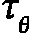

# 第九章：大型语言模型的高级应用

在前两章中，我们介绍了变换器架构，并学习了其最新的大规模版本，被称为**大型语言模型**（**LLMs**）。我们在**自然语言处理**（**NLP**）任务中讨论了它们。NLP 是变换器最初的应用领域，并且仍然是大型语言模型发展的前沿领域。然而，架构的成功使研究界开始探索变换器在其他领域的应用，如计算机视觉。

在本章中，我们将重点讨论以下内容。我们将讨论将变换器用作卷积网络（CNN，*第四章*）的替代品，用于图像分类和目标检测等任务。我们还将学习如何将它们用作图像生成模型，而不是像之前那样只用于文本。我们还将实现一个模型微调的示例——这是我们在*第八章*中未能完成的内容。最后，我们将实现一个基于大型语言模型驱动的新型应用。

在本章中，我们将覆盖以下主要主题：

+   使用视觉变换器进行图像分类

+   检测变换器

+   使用稳定扩散生成图像

+   微调变换器

+   利用 LangChain 发挥大型语言模型的力量

# 技术要求

我们将在本章中使用 Python、PyTorch、Hugging Face 的 Transformers 库（[`github.com/huggingface/transformers`](https://github.com/huggingface/transformers)）以及 LangChain 框架（[`www.langchain.com/`](https://www.langchain.com/)，[`github.com/langchain-ai/langchain`](https://github.com/langchain-ai/langchain)）来实现示例。如果你没有配置这些工具的环境，也不用担心——该示例可以在 Google Colab 上的 Jupyter Notebook 中找到。代码示例可以在本书的 GitHub 仓库中找到：[`github.com/PacktPublishing/Python-Deep-Learning-Third-Edition/tree/main/Chapter09`](https://github.com/PacktPublishing/Python-Deep-Learning-Third-Edition/tree/main/Chapter09)。

# 使用视觉变换器进行图像分类

**视觉变换器**（**ViT**，*一张图胜过 16x16 个词：用于大规模图像识别的变换器*，[`arxiv.org/abs/2010.11929`](https://arxiv.org/abs/2010.11929)）通过引入一种巧妙的图像处理技术，证明了注意力机制的适应性。使用变换器处理图像输入的一种方法是通过四个变量对每个像素进行编码——像素强度、行、列和通道位置。每个像素编码是一个简单的**神经网络**（**NN**）的输入，该网络输出一个维度的嵌入向量。我们可以将三维图像表示为这些嵌入向量的一维序列。它作为模型的输入，方式与令牌嵌入序列相同。每个像素将在注意力块中关注到所有其他像素。

这种方法在输入序列长度（上下文窗口）方面存在一些缺点。与一维文本序列不同，图像具有二维结构（颜色通道不会增加像素数量）。因此，随着图像尺寸的增大，输入序列的长度呈二次方增长。即使是一个小的 64×64 图像，也会导致输入序列的长度为 64*64=4,096。这样一来，一方面使得模型的计算量增加，另一方面，由于每个像素都要关注整个长序列，模型很难学习图像的结构。卷积神经网络（CNN）通过使用滤波器来解决这个问题，滤波器将单位的输入大小限制在其周围的区域内（感受野）。为了理解 ViT 是如何解决这个问题的，让我们从下面的图开始：


图 9.1 – 视觉变换器。灵感来源于 [`arxiv.org/abs/2010.11929`](https://arxiv.org/abs/2010.11929)

设输入图像的分辨率为*(H, W)*，通道数为`C`。然后，我们可以将输入图像表示为一个张量，。ViT 将图像分割成一系列二维方形图像块，![<mml:math xmlns:mml="http://www.w3.org/1998/Math/MathML" xmlns:m="http://schemas.openxmlformats.org/officeDocument/2006/math"><mml:msub><mml:mrow><mml:mi mathvariant="bold">x</mml:mi></mml:mrow><mml:mrow><mml:mi>p</mml:mi></mml:mrow></mml:msub><mml:mo>∈</mml:mo><mml:msup><mml:mrow><mml:mi mathvariant="double-struck">R</mml:mi></mml:mrow><mml:mrow><mml:mi>N</mml:mi><mml:mo>×</mml:mo><mml:msup><mml:mrow><mml:mi>P</mml:mi></mml:mrow><mml:mrow><mml:mn>2</mml:mn></mml:mrow></mml:msup><mml:mo>×</mml:mo><mml:mi>C</mml:mi></mml:mrow></mml:msup></mml:math>](img/847.png) (*图 9.1*)。这里，*(P, P)*是每个图像块的分辨率（*P=16*），而是图像块的数量（即输入序列的长度）。这些图像块的序列作为输入提供给模型，方式与 token 序列相同。

接下来，输入图像块将作为输入传递给线性投影，输出一个-维的**图像块嵌入**向量用于每个图像块。这些图像块嵌入形成输入序列。我们可以用以下公式总结图像块到嵌入的过程：

![<mml:math xmlns:mml="http://www.w3.org/1998/Math/MathML" xmlns:m="http://schemas.openxmlformats.org/officeDocument/2006/math" display="block"><mml:msub><mml:mrow><mml:mi mathvariant="bold">z</mml:mi></mml:mrow><mml:mrow><mml:mi>o</mml:mi></mml:mrow></mml:msub><mml:mo>=</mml:mo><mml:mfenced open="[" close="]" separators="|"><mml:mrow><mml:msub><mml:mrow><mml:mi mathvariant="bold">x</mml:mi></mml:mrow><mml:mrow><mml:mi>c</mml:mi><mml:mi>l</mml:mi><mml:mi>s</mml:mi></mml:mrow></mml:msub><mml:mo>;</mml:mo><mml:msubsup><mml:mrow><mml:mi mathvariant="bold">x</mml:mi></mml:mrow><mml:mrow><mml:mi>p</mml:mi></mml:mrow><mml:mrow><mml:mfenced separators="|"><mml:mrow><mml:mn>1</mml:mn></mml:mrow></mml:mfenced></mml:mrow></mml:msubsup><mml:mi>E</mml:mi><mml:mo>;</mml:mo><mml:msubsup><mml:mrow><mml:mi mathvariant="bold">x</mml:mi></mml:mrow><mml:mrow><mml:mi>p</mml:mi></mml:mrow><mml:mrow><mml:mfenced separators="|"><mml:mrow><mml:mn>2</mml:mn></mml:mrow></mml:mfenced></mml:mrow></mml:msubsup><mml:mi mathvariant="bold">E</mml:mi><mml:mo>;</mml:mo><mml:mo>…</mml:mo><mml:msubsup><mml:mrow><mml:mi mathvariant="bold">x</mml:mi></mml:mrow><mml:mrow><mml:mi>p</mml:mi></mml:mrow><mml:mrow><mml:mfenced separators="|"><mml:mrow><mml:mi>N</mml:mi></mml:mrow></mml:mfenced></mml:mrow></mml:msubsup><mml:mi mathvariant="bold">E</mml:mi></mml:mrow></mml:mfenced><mml:mo>+</mml:mo><mml:msub><mml:mrow><mml:mi mathvariant="bold">E</mml:mi></mml:mrow><mml:mrow><mml:mi>p</mml:mi><mml:mi>o</mml:mi><mml:mi>s</mml:mi></mml:mrow></mml:msub></mml:math>](img/852.png)

这里，![<mml:math xmlns:mml="http://www.w3.org/1998/Math/MathML" xmlns:m="http://schemas.openxmlformats.org/officeDocument/2006/math"><mml:mi mathvariant="bold">E</mml:mi><mml:mo>∈</mml:mo><mml:msup><mml:mrow><mml:mi mathvariant="double-struck">R</mml:mi></mml:mrow><mml:mrow><mml:mfenced separators="|"><mml:mrow><mml:msup><mml:mrow><mml:mi>P</mml:mi></mml:mrow><mml:mrow><mml:mn>2</mml:mn></mml:mrow></mml:msup><mml:mo>⋅</mml:mo><mml:mi>C</mml:mi></mml:mrow></mml:mfenced><mml:mo>×</mml:mo><mml:msub><mml:mrow><mml:mi>d</mml:mi></mml:mrow><mml:mrow><mml:mi>m</mml:mi><mml:mi>o</mml:mi><mml:mi>d</mml:mi><mml:mi>e</mml:mi><mml:mi>l</mml:mi></mml:mrow></mml:msub></mml:mrow></mml:msup></mml:math>](img/853.png) 是线性投影，和 ![<mml:math xmlns:mml="http://www.w3.org/1998/Math/MathML" xmlns:m="http://schemas.openxmlformats.org/officeDocument/2006/math"><mml:msub><mml:mrow><mml:mi mathvariant="bold">E</mml:mi></mml:mrow><mml:mrow><mml:mi>p</mml:mi><mml:mi>o</mml:mi><mml:mi>s</mml:mi></mml:mrow></mml:msub><mml:mo>∈</mml:mo><mml:msup><mml:mrow><mml:mi mathvariant="double-struck">R</mml:mi></mml:mrow><mml:mrow><mml:mfenced separators="|"><mml:mrow><mml:mi>N</mml:mi><mml:mo>+</mml:mo><mml:mn>1</mml:mn></mml:mrow></mml:mfenced><mml:mo>×</mml:mo><mml:msub><mml:mrow><mml:mi>d</mml:mi></mml:mrow><mml:mrow><mml:mi>m</mml:mi><mml:mi>o</mml:mi><mml:mi>d</mml:mi><mml:mi>e</mml:mi><mml:mi>l</mml:mi></mml:mrow></mml:msub></mml:mrow></mml:msup></mml:math>](img/854.png) 是静态位置编码（与原始变换器相同）。

一旦我们获得嵌入序列，ViT 会使用标准的仅编码器预归一化变换器进行处理，类似于 BERT（ *第七章*）。它有三种变体，如下所示：


图 9.2 – ViT 变体。基于 https://arxiv.org/abs/2010.11929

编码器架构使用无掩码的自注意力，这允许一个标记关注整个序列，而不仅仅是前面的标记。这是有道理的，因为图像像素之间的关系不像文本序列中的元素顺序那样，前后元素并不携带相同的意义。两种模型的相似之处不仅仅止于此。与 BERT 类似，输入序列以特殊的 `[CLS]` () 标记开始（用于分类任务）。模型对  标记的输出是整个图像的输出。通过这种方式， 标记关注整个输入序列（即整个图像）。或者，如果我们选择任何其他补丁的模型输出，我们将引入所选补丁与序列中其他部分之间的不平衡。

模仿 BERT，ViT 也有预训练和微调阶段。预训练使用大规模通用图像数据集（例如 ImageNet），而微调则是在较小的任务特定数据集上训练模型。

该模型以 **分类头** 结束，预训练阶段包含一个隐藏层，而微调阶段则没有隐藏层。

ViT 的一个问题是，当使用非常大的数据集进行预训练时，它的表现最好，例如使用 300M 标签图像的 JFT-300M 数据集（*Revisiting Unreasonable Effectiveness of Data in Deep Learning Era*，[`arxiv.org/abs/1707.02968`](https://arxiv.org/abs/1707.02968)）。这使得训练变得比可比的 CNN 更加计算密集。许多 ViT 的变体尝试解决这一挑战，并对原始模型提出其他改进。你可以在 *A Survey on Visual Transformer*（[`arxiv.org/abs/2012.12556`](https://arxiv.org/abs/2012.12556)）中找到更多信息，该文献定期更新领域的最新进展。

这样，我们来看看如何在实际中使用 ViT。

## 使用 ViT 和 Hugging Face Transformers

在本节中，我们将借助 Hugging Face Transformers 和其`pipeline`抽象实现一个 ViT 图像分类的基本示例，这一点我们在第*8 章*中有介绍。让我们开始：

1.  导入`pipeline`抽象：

    ```py
    from transformers import pipeline
    ```

1.  创建一个图像分类管道实例。该管道使用 ViT-Base 模型：

    ```py
    img_classification_pipeline = pipeline(
         task="image-classification",
         model="google/vit-base-patch16-224")
    ```

1.  使用来自维基百科的自行车图像运行实例：

    ```py
    img_classification_pipeline("https://upload.wikimedia.org/wikipedia/commons/thumb/4/41/Left_side_of_Flying_Pigeon.jpg/640px-Left_side_of_Flying_Pigeon.jpg")
    ```

    这段代码输出以下前五个类别的概率分布（这里只显示第一个类别）：

    ```py
    [{'score': 0.4616938531398773, 'label': 'tricycle,
         trike, velocipede'}]
    ```

    这个示例足够简单，但让我们深入分析 ViT 模型本身。我们可以使用`print(img_classification_pipeline.model)`命令来实现，输出如下：

    ```py
    ViTForImageClassification(
      (vit): ViTModel(
         (embeddings): ViTEmbeddings(
            (patch_embeddings): ViTPatchEmbeddings(
               (projection): Conv2d(3, 768,
                            kernel_size=(16, 16),
                            stride=(16, 16))
            )
            (dropout): Dropout(p=0.0)
         )
         (encoder): ViTEncoder(
            (layer): ModuleList(
               (0-11): 12 x ViTLayer(
                  (attention): ViTAttention(
                     (attention): ViTSelfAttention(
                        (query): Linear(in_f=768,
                                  out_f=768)
                        (key): Linear(in_f=768, out_f=768)
                        (value): Linear(in_f=768,
                                  out_f=768)
                        (dropout): Dropout(p=0.0)
                     )
                     (output): ViTSelfOutput(
                        (dense): Linear(in_f=768,
                                  out_f=768)
                        (dropout): Dropout(p=0.0)
                     )
                  )
                  (intermediate): ViTIntermediate(
                    (dense): Linear(in_f=768, out_f=3072)
                    (intermediate_act_fn):GELUActivation()
                  )
                  (output): ViTOutput(
                    (dense): Linear(in_f=3072, out_f=768)
                    (dropout): Dropout(p=0.0)
                  )
                  (layernorm_before): LayerNorm((768,))
                  (layernorm_after): LayerNorm((768,))
               )
            )
         )
         (layernorm): LayerNorm((768,))
      )
      (classifier): Linear(in_f=768, out_f=1000)
    )
    ```

    该模型处理 224×224 的输入图像。这里，`in_f`和`out_f`是`in_features`和`out_features`的缩写。与其他模型不同，ViT 在所有`Linear`层中使用偏置（`bias=True`输入参数未显示）。让我们按出现顺序讨论模型的组成部分：

    +   `ViTEmbeddings`：补丁嵌入块。它包含一个大小为 16×16 的 2D 卷积滤波器，步幅为 16，三个输入通道（每个颜色一个），以及 768 个输出通道 ()。在每个位置应用卷积滤波器，生成每个输入图像位置的一个 768 维的补丁嵌入。由于补丁形成了一个二维网格（与输入图像相同），所以输出会被展平为一维序列。该块还添加了位置编码信息，这些信息在其字符串表示中没有体现。所有 dropout 实例的丢弃概率为 0，因为该模型在推理模式下运行，而非训练模式。

    +   `ViTEncoder`：主编码器模型包含 12 个`ViTLayer`预归一化（`LayerNorm`）编码块实例。每个实例包含以下内容：

        +   `ViTAttention` 注意力块：`ViTSelfAttention` 多头注意力及其输出线性投影，`ViTSelfOutput`。所有的`ViTIntermediate`加上`GELUActivation`和`ViTOutput`。

    +   分类头（`classifier`）：在推理模式下，分类头只有一个`Linear`层，输出 1,000 个结果（因为该模型在 ImageNet 数据集上进行了微调）。

接下来，让我们看看使用 Transformer 进行目标检测是如何工作的。

# 理解 DEtection TRansformer

**DEtection TRansformer** (**DETR**, *端到端目标检测与 Transformer*, [`arxiv.org/abs/2005.12872`](https://arxiv.org/abs/2005.12872))引入了一种基于 Transformer 的创新目标检测算法。

快速回顾 YOLO 目标检测算法

我们在*第五章*中首次介绍了 YOLO。它有三个主要组件。第一个是骨干网络——即一个卷积神经网络（CNN）模型，用于从输入图像中提取特征。接下来是颈部——模型的中间部分，连接骨干网络和头部。最后，头部使用多步骤算法输出检测到的物体。更具体地，它将图像划分为一个网格，每个网格包含若干个具有不同形状的预定义锚框。模型预测这些锚框中是否包含物体以及物体边界框的坐标。许多框会重叠并预测相同的物体。模型通过交并比（IoU）和非极大值抑制（NMS）帮助筛选重叠的物体。

和 YOLO 一样，DetR 也从 CNN 骨干网络开始。然而，它用一个完整的后归一化变换器编码器-解码器替代了颈部和头部。这消除了需要手工设计组件（例如非极大值抑制过程或锚框）的需求。相反，模型输出一组边界框和类标签，用于表示检测到的物体。为了理解它是如何工作的，我们从下图开始，它展示了 DetR 的组件：


图 9.3 – DetR 架构。灵感来源于 https://arxiv.org/abs/2005.12872

首先，主干 CNN 从输入图像中提取特征，和 YOLO 中的操作相同。其输出是最后一个卷积层的特征图。原始输入图像是一个形状为![<mml:math xmlns:mml="http://www.w3.org/1998/Math/MathML" xmlns:m="http://schemas.openxmlformats.org/officeDocument/2006/math"><mml:msub><mml:mrow><mml:mi mathvariant="bold">x</mml:mi></mml:mrow><mml:mrow><mml:mi>i</mml:mi><mml:mi>m</mml:mi><mml:mi>g</mml:mi></mml:mrow></mml:msub><mml:mo>∈</mml:mo><mml:msup><mml:mrow><mml:mi mathvariant="double-struck">R</mml:mi></mml:mrow><mml:mrow><mml:msub><mml:mrow><mml:mi>C</mml:mi></mml:mrow><mml:mrow><mml:mn>0</mml:mn></mml:mrow></mml:msub><mml:mo>×</mml:mo><mml:msub><mml:mrow><mml:mi>H</mml:mi></mml:mrow><mml:mrow><mml:mn>0</mml:mn></mml:mrow></mml:msub><mml:mo>×</mml:mo><mml:msub><mml:mrow><mml:mi>W</mml:mi></mml:mrow><mml:mrow><mml:mn>0</mml:mn></mml:mrow></mml:msub></mml:mrow></mml:msup></mml:math>](img/861.png)的张量，其中是颜色通道的数量，大小的嵌入张量 ()。为了解决这个问题，模型应用了 1×1 瓶颈卷积，将通道数从 `C` 降采样到 ，然后进行展平操作。变换后的张量变为 ![<mml:math xmlns:mml="http://www.w3.org/1998/Math/MathML" xmlns:m="http://schemas.openxmlformats.org/officeDocument/2006/math"><mml:msub><mml:mrow><mml:mi mathvariant="bold">z</mml:mi></mml:mrow><mml:mrow><mml:mn>0</mml:mn></mml:mrow></mml:msub><mml:mo>∈</mml:mo><mml:msup><mml:mrow><mml:mi mathvariant="double-struck">R</mml:mi></mml:mrow><mml:mrow><mml:msub><mml:mrow><mml:mi>d</mml:mi></mml:mrow><mml:mrow><mml:mi>m</mml:mi><mml:mi>o</mml:mi><mml:mi>d</mml:mi><mml:mi>e</mml:mi><mml:mi>l</mml:mi></mml:mrow></mml:msub><mml:mo>×</mml:mo><mml:mi>H</mml:mi><mml:mo>⋅</mml:mo><mml:mi>W</mml:mi></mml:mrow></mml:msup></mml:math>](img/871.png)，我们可以将其作为变换器的输入序列使用。

接下来，让我们关注实际的变换器，其详细内容显示在下图中：


图 9.4 – DetR 变换器的详细结构。灵感来源于 [`arxiv.org/abs/2005.12872`](https://arxiv.org/abs/2005.12872)

编码器将输入序列映射到一系列连续的表示，就像原始编码器一样（*第七章*）。不同之处在于，模型在每个`Q`/`K`张量的所有注意力层中添加了固定的绝对位置编码，而原始变换器仅在初始输入张量中添加了静态位置编码。

解码器是更有趣的地方。首先，我们注意到，固定位置编码也参与了解码器的编码器-解码器注意力块。由于它们参与了编码器的所有自注意力块，我们将它们传递到编码器-解码器注意力层，以使得各部分公平竞争。

接下来，编码器将输入一个`N`个**物体查询**的序列，这些查询由张量表示，![<mml:math xmlns:mml="http://www.w3.org/1998/Math/MathML" xmlns:m="http://schemas.openxmlformats.org/officeDocument/2006/math"><mml:msub><mml:mrow><mml:mi mathvariant="bold">o</mml:mi><mml:mi mathvariant="bold">q</mml:mi></mml:mrow><mml:mrow><mml:mi mathvariant="bold-italic">i</mml:mi></mml:mrow></mml:msub><mml:mo>∈</mml:mo><mml:msup><mml:mrow><mml:mi mathvariant="double-struck">R</mml:mi></mml:mrow><mml:mrow><mml:mi>N</mml:mi><mml:mo>×</mml:mo><mml:msub><mml:mrow><mml:mi>d</mml:mi></mml:mrow><mml:mrow><mml:mi>m</mml:mi><mml:mi>o</mml:mi><mml:mi>d</mml:mi><mml:mi>e</mml:mi><mml:mi>l</mml:mi></mml:mrow></mml:msub></mml:mrow></mml:msup></mml:math>](img/872.png)。

我们可以将它们视为槽位，模型利用这些槽位来检测物体。每个输入物体查询的模型输出代表一个被检测物体的属性（边界框和类别）。拥有`N`个物体查询意味着模型最多可以检测`N`个物体。正因为如此，论文的作者提出使用`N`，其值显著大于图像中通常的物体数量。与原始的变换器不同，解码器的注意力在这里没有被掩盖，因此它可以并行检测所有物体，而不是按顺序进行检测。

在训练过程开始时，物体查询张量是随机初始化的。训练过程中会更新模型权重和查询张量——也就是说，模型在学习权重的同时也在学习物体查询。它们作为检测物体的学习型位置编码，并起到了与初始固定输入位置编码相同的作用。因此，我们将物体查询添加到编码器-解码器注意力层以及解码器块的自注意力层中，方式与将输入位置编码添加到编码器时相同。这种架构存在一个*bug*——第一个解码器块的第一个自注意力层将重复两次接收相同的物体查询作为输入，这使得该查询变得无用。实验证明，这不会降低模型的性能。为了简化实现，模型没有设计一个没有自注意力的独立第一个解码器块，而是直接使用了标准解码器块。

编码配置

模型可以处理固定编码和学习编码的多种配置：

+   只将两种类型的编码添加到输入数据；

+   将固定编码添加到输入数据，并将学习到的编码添加到输入和所有解码器注意力层；

+   将固定编码添加到数据和所有编码器注意力层，只将学习到的编码添加到解码器输入；

+   将两种类型的编码添加到输入数据以及编码器和解码器的每个注意力层中。

该模型在第四种配置下表现最佳，但为了简化起见，可以在第一种配置中实现。

物体查询使得不再强制施加诸如网格单元和锚框这样的几何限制（如在 YOLO 中）。相反，我们只指定检测的最大物体数量，并让模型发挥其魔力。学习到的查询通常会专注于图像的不同区域。然而，这归因于训练和训练数据集的特性，而不是手动设计的特征。

该模型以两个头部的组合结束：一个具有 ReLU 激活的三层感知机和一个独立的全连接（FC）层。该感知机被称为 FFN，它与变换器块中的 FFN 不同。它预测检测到的物体边界框的高度、宽度和相对于输入图像的标准化中心坐标。FC 层采用 softmax 激活，预测物体的类别。像 YOLO 一样，它包含一个额外的特殊背景类，表示在该位置没有检测到任何物体。拥有这个类别尤为必要，因为某些位置不可避免地会为空，`N` 远大于图像中的物体数量。

预测一组无限制的边界框给训练带来了挑战，因为将预测的边界框与真实框匹配并非易事。第一步是为每张图片的真实框添加虚拟条目，使得真实框的数量等于预测框的数量，即 `N`。接下来，训练使用预测框与真实框之间的 **二分匹配**。最后，算法监督每个预测框接近与其匹配的真实框。你可以查阅论文以获取有关训练的更多细节。

用于图像分割的 DetR

DetR 的作者扩展了该模型以用于图像分割。DetR 在检测和分割之间的关系类似于 Faster R-CNN 和 Mask R-CNN 之间的关系（见 *第五章*）。用于分割的 DetR 添加了一个第三个头部，通过上采样卷积实现。它并行生成每个检测物体的二值分割掩码。最终结果通过像素级的 argmax 合并所有掩码。

## 使用 Hugging Face Transformers 运行 DetR

在本节中，我们将借助 Hugging Face Transformers 和它的 `pipeline` 抽象，实施一个基本的 DetR 物体检测示例，我们在 *第八章* 中介绍了该抽象。这个示例遵循 ViT 模式，因此我们将包括完整的代码，而不做任何注释。代码如下：

```py
from transformers import pipeline
obj_detection_pipeline = pipeline(
     task="object-detection",
     model="facebook/detr-resnet-50")
obj_detection_pipeline("https://upload.wikimedia.org/wikipedia/commons/thumb/4/41/Left_side_of_Flying_Pigeon.jpg/640px-Left_side_of_Flying_Pigeon.jpg")
```

最后一次调用返回以下形式的检测到的物体列表：

```py
{'score': 0.997983455657959,
  'label': 'bicycle',
  'box': {'xmin': 16, 'ymin': 14, 'xmax': 623, 'ymax': 406}}
```

接下来，我们可以使用`print(obj_detection_pipeline.model)`命令查看模型定义。这里，`in_f`和`out_f`分别是`in_features`和`out_features`的缩写。DetR 在所有`Linear`层中使用偏置（`bias=True`输入参数未显示）。我们将省略主干网络的定义。

让我们按出现顺序讨论模型元素，从 1×1 瓶颈卷积开始（我们有 )：

```py
(input_projection): Conv2d(2048, 256,
                   kernel_size=(1, 1),
                   stride=(1, 1))
```

接下来，我们有对象查询嵌入（*N=100*）。正如我们所提到的，对象查询会在训练过程中与权重更新一起学习：

```py
(query_position_embeddings): Embedding(100, 256)
```

以下是带有六个后置-ln 编码器块、ReLU 激活函数和具有一个 2,048 维隐藏层的 FFN 的编码器。注意，位置编码未显示（解码器也同样适用）：

```py
(encoder): DetrEncoder(
  (layers): ModuleList(
     (0-5): 6 x DetrEncoderLayer(
        (self_attn): DetrAttention(
           (k_proj): Linear(in_f=256, out_f=256)
           (v_proj): Linear(in_f=256, out_f=256)
           (q_proj): Linear(in_f=256, out_f=256)
           (out_proj): Linear(in_f=256, out_f=256)
        )
        (self_attn_layer_norm): LayerNorm((256,))
        (activation_fn): ReLU()
        (fc1): Linear(in_f=256, out_f=2048)
        (fc2): Linear(in_f=2048, out_f=256)
        (final_layer_norm): LayerNorm((256,))
     )
  )
)
```

然后，我们有了解码器，带有六个后置-ln 解码器块，属性与编码器相同：

```py
(decoder): DetrDecoder(
  (layers): ModuleList(
     (0-5): 6 x DetrDecoderLayer(
        (self_attn): DetrAttention(
           (k_proj): Linear(in_f=256, out_f=256)
           (v_proj): Linear(in_f=256, out_f=256)
           (q_proj): Linear(in_f=256, out_f=256)
           (out_proj): Linear(in_f=256, out_f=256)
        )
        (activation_fn): ReLU()
        (self_attn_layer_norm): LayerNorm((256,))
        (encoder_attn): DetrAttention(
           (k_proj): Linear(in_f=256, out_f=256)
           (v_proj): Linear(in_f=256, out_f=256)
           (q_proj): Linear(in_f=256, out_f=256)
           (out_proj): Linear(in_f=256, out_f=256)
        )
        (encoder_attn_layer_norm): LayerNorm((256,))
        (fc1): Linear(in_f=256, out_f=2048)
        (fc2): Linear(in_f=2048, out_f=256)
        (final_layer_norm): LayerNorm((256,))
     )
  )
  (layernorm): LayerNorm((256,))
)
```

最后，我们得到了输出 FFN 和线性层。FFN 输出四个值（边界框坐标），而线性层可以检测 91 个类别和背景：

```py
(class_labels_classifier): Linear(in_f=256, out_f=92)
(bbox_predictor): DetrMLPPredictionHead(
  (layers): ModuleList(
     (0-1): 2 x Linear(in_f=256, out_f=256)
     (2): Linear(in_f=256, out_f=4)
  )
)
```

接下来，让我们看看如何使用变换器生成新图像。

# 使用稳定扩散生成图像

在本节中，我们将介绍**稳定扩散**（**SD**，*高分辨率图像合成与潜在扩散模型*，[`arxiv.org/abs/2112.10752`](https://arxiv.org/abs/2112.10752)，[`github.com/Stability-AI/stablediffusion`](https://github.com/Stability-AI/stablediffusion)）。这是一种生成模型，可以基于文本提示或其他类型的数据合成图像（在本节中，我们将重点讨论文本到图像的场景）。为了理解它的工作原理，让我们从以下图开始：


图 9.5 – 稳定扩散模型与训练。灵感来源于 [`arxiv.org/abs/2112.10752`](https://arxiv.org/abs/2112.10752)

SD 结合了自编码器（**AE**，*图 9.5 中的像素空间*部分），去噪扩散概率模型（**DDPM**或简写为**DM**，*图 9.5 中的潜在分布空间*部分，以及*第五章*），和变换器（*图 9.5 中的条件*部分）。在我们深入讨论这些组件之前，先概述它们在 SD 的训练和推理管道中的作用。训练涉及所有这些组件——AE 编码器、前向扩散、反向扩散（**U-Net**，*第五章*）、AE 解码器和条件。推理（从文本生成图像）仅涉及反向扩散、AE 解码器和条件。不要担心如果你没有完全理解刚才所读内容，我们将在接下来的部分详细讨论。我们将从 AE 开始，接着讨论条件变换器，并在讨论扩散过程时将它们结合起来。

## 自编码器

尽管我们在*第一章*中简要提到了自编码器（AE），但在这里我们将更详细地介绍这一架构，从以下图示开始：


图 9.6 – 一个 AE

自编码器（AE）是一个前馈神经网络，它试图重建其输入。换句话说，AE 的目标值（标签）`y`等于输入数据`x`。我们可以正式地说，它试图学习一个恒等函数，![<mml:math xmlns:mml="http://www.w3.org/1998/Math/MathML" xmlns:m="http://schemas.openxmlformats.org/officeDocument/2006/math"><mml:msub><mml:mrow><mml:mi>h</mml:mi></mml:mrow><mml:mrow><mml:mi mathvariant="bold">W</mml:mi><mml:mo>,</mml:mo><mml:msup><mml:mrow><mml:mi mathvariant="bold">W</mml:mi></mml:mrow><mml:mrow><mml:mi>'</mml:mi></mml:mrow></mml:msup></mml:mrow></mml:msub><mml:mfenced separators="|"><mml:mrow><mml:mi mathvariant="bold">x</mml:mi></mml:mrow></mml:mfenced><mml:mo>=</mml:mo><mml:mi mathvariant="bold">x</mml:mi></mml:math>](img/874.png)（一个重复其输入的函数）。在最基本的形式下，自编码器由隐藏层组成。

（或瓶颈）和输出层（`W`和`W`’是这些层的权重矩阵）。像 U-Net 一样，我们可以将自编码器看作是两个组件的虚拟组合：

+   **编码器**：它将输入数据映射到网络的内部潜在表示。为了简化起见，在这个例子中，编码器是一个单一的全连接瓶颈层。内部状态就是其激活张量`z`。编码器可以有多个隐藏层，包括卷积层（如 SD 中的情况）。在这种情况下，`z`是最后一层的激活。

+   **解码器**：它试图从网络的内部状态`z`重建输入。解码器也可以具有复杂的结构，通常与编码器相似。虽然 U-Net 试图将输入图像转换为其他领域的目标图像（例如，分割图），但自编码器仅仅试图重建其输入。

我们可以通过最小化一个损失函数来训练自编码器，这个损失函数被称为**重构误差**。它衡量原始输入与其重构之间的距离。

潜在张量`z`是整个自编码器的核心。关键在于瓶颈层的单元数少于输入/输出层的单元数。因为模型试图从较小的特征空间重构输入，我们迫使它只学习数据中最重要的特征。可以将这种紧凑的数据表示看作一种压缩形式（但不是无损的）。我们可以仅使用模型的编码器部分来生成下游任务所需的潜在张量。或者，我们可以仅使用解码器从生成的潜在张量合成新的图像。

在训练过程中，编码器将输入样本映射到潜在空间，在这里每个潜在属性都有一个离散的值。一个输入样本只能有一个潜在表示。因此，解码器只能用一种可能的方式来重构输入。换句话说，我们只能生成一个输入样本的单一重构。然而，我们希望生成基于文本提示的新图像，而不是重新创建原始图像。解决此任务的一种可能方法是**变分自编码器**（**VAE**）。VAE 可以用概率术语来描述潜在表示。我们将不再使用离散值，而是为每个潜在属性提供一个概率分布，从而使潜在空间变为连续的。我们可以修改潜在张量以影响生成图像的概率分布（即属性）。在 SD 中，DM 组件与条件文本提示相结合，充当这个修改器。

完成这个简短的绕道后，我们来讨论卷积编码器在 SD 中的作用（*像素空间*部分，见*图 9.5*）。在训练过程中，AE 编码器创建了一个压缩的初始潜在表示张量，，来自输入图像，。更具体地说，编码器将图像按因子进行下采样，*f = H/h = W/w*，其中  (`m`是通过经验实验选择的整数)。然后，整个扩散过程（前向和反向）使用压缩后的`z`，而不是原始图像`x`。只有当反向扩散结束时，AE 解码器才会将新生成的表示`z`上采样成最终生成的图像，。通过这种方式，更小的`z`允许使用更小、更高效的计算 U-Net，这对训练和推理都有好处。论文的作者将这种 AE 与扩散模型的结合称为**潜在扩散模型**。

AE 训练与 U-Net 训练是分开的。因此，我们可以先训练 AE，然后用它在不同的 U-Net 配置下进行多个下游任务。

## 条件变换器

条件变换器， (*图 9.5*)，生成所需图像的文本描述的潜在表示。SD 将此表示提供给 U-Net，以便它可以影响其输出。为了使这一点生效，文本的潜在表示必须与 U-Net 的图像潜在表示处于相同的语义（不仅仅是维度）空间中。为此，SD 的最新版本 2.1 使用 OpenCLIP 开源模型作为条件变换器（*可重复的对比语言-图像学习的规模定律*，https://arxiv.org/abs/2212.07143）。**CLIP** 代表 **对比语言-图像预训练**。这一技术由 OpenAI 提出（*从自然语言监督中学习可迁移的视觉模型*，https://arxiv.org/abs/2103.00020）。让我们从下面的图开始更详细地讨论：


图 9.7 – CLIP。灵感来源于 https://arxiv.org/abs/2103.00020

它有两个主要组成部分：

+   `[EOS]` 标记。该标记处的模型输出作为整个序列的嵌入向量。在 SD 的背景下，我们只关注文本编码器，CLIP 系统的所有其他组件仅在其训练时才是必要的。

+   **图像编码器**：这可以是 ViT 或 CNN（最常见的是 ResNet）。它以图像作为输入，输出其嵌入向量，`i`。与文本编码器类似，这也是模型最高层的激活值，而不是任务特定的头部。

为了使 CLIP 起作用，两个编码器的嵌入向量必须具有相同的大小，。如果有必要（例如，在 CNN 图像编码器的情况下），编码器的输出张量会被展平为一维向量。如果两个编码器的维度仍然不同，我们可以添加线性投影（FC 层）来使它们相等。

接下来，让我们专注于实际的预训练算法。训练集包含`N`个文本-图像对，其中每对的文本描述对应图像的内容。我们将所有文本表示输入文本编码器，将图像输入图像编码器，分别产生 和  的嵌入。然后，我们计算每两个嵌入向量之间的余弦相似度（共*N×N*个相似度测量）。在这些测量中，我们有`N`个正确匹配的文本-图像对（*图 9**.5*的表对角线）和*N×N-N*个不正确的对（表对角线之外的所有对）。训练更新两个编码器的权重，以使正确对的相似度分数最大化，不正确对的分数最小化。如果训练成功，我们将获得对于正确描述图像内容的文本提示的相似嵌入，并且在所有其他情况下具有不相似的嵌入。在 SD 训练期间，我们优化文本编码器以及 U-Net（但不包括完整的 CLIP 系统）。

现在我们知道如何生成语义上正确的文本嵌入，我们可以继续进行实际的扩散模型。

## 扩散模型

DM 是一种具有正向和反向阶段的生成模型。前向扩散从由 AE 编码器产生的潜在向量`z`开始（接受图像`x`作为输入）。然后，通过一系列`T`步骤逐渐向`z`添加随机高斯噪声，直到最终的（潜在的）表示，。

是纯噪声。前向扩散使用加速算法，在一个步骤中生成，而不是`T`步骤（*第五章*）。

反向扩散与此相反，从纯噪声开始。它逐渐通过在一系列`T`去噪步骤中去除少量噪声来恢复原始的潜在张量`z`。实际上，我们更关心反向扩散，它是基于潜在表示生成图像（前向扩散只参与训练）。它通常使用 U-Net 类型的 CNN 来实现（*图 9.5*，）。

它以噪声张量作为输入，并输出对添加到原始潜在张量`z`中的噪声的近似值（即仅噪声，而不是张量本身）。然后，我们从当前的 U-Net 输入中减去预测的噪声，，并将结果作为新的输入传递给 U-Net，。

在训练过程中，代价函数衡量预测噪声与实际噪声之间的差异，并在每次去噪步骤后相应地更新 U-Net 的权重。这个过程持续进行，直到（希望）仅剩下原始张量`z`。然后，AE 解码器使用它生成最终图像。

DM 的纯粹形式无法影响生成图像的属性（这被称为条件化），因为我们从随机噪声开始，导致生成的是随机图像。SD 允许我们做到这一点——一种方法可以将 U-Net 条件化，以根据特定的文本提示或其他数据类型生成图像。为了实现这一点，我们需要将条件化变换器的输出嵌入与去噪 U-Net 结合。假设我们有一个文本提示`[EOS]`标记，那么我们通过**交叉注意力**层将其输出映射到 U-Net 的中间层。在这一层中，键和值张量表示条件化变换器的输出，而查询张量表示 U-Net 的中间层（*图 9.5*）：

![<mml:math xmlns:mml="http://www.w3.org/1998/Math/MathML" xmlns:m="http://schemas.openxmlformats.org/officeDocument/2006/math" display="block"><mml:mi mathvariant="bold">Q</mml:mi><mml:mo>=</mml:mo><mml:msubsup><mml:mrow><mml:mi mathvariant="bold">W</mml:mi></mml:mrow><mml:mrow><mml:mi>Q</mml:mi></mml:mrow><mml:mrow><mml:mfenced separators="|"><mml:mrow><mml:mi>i</mml:mi></mml:mrow></mml:mfenced></mml:mrow></mml:msubsup><mml:mo>⋅</mml:mo><mml:msub><mml:mrow><mml:mi>φ</mml:mi></mml:mrow><mml:mrow><mml:mi>i</mml:mi></mml:mrow></mml:msub><mml:mfenced separators="|"><mml:mrow><mml:msub><mml:mrow><mml:mi mathvariant="bold">z</mml:mi></mml:mrow><mml:mrow><mml:mi>t</mml:mi></mml:mrow></mml:msub></mml:mrow></mml:mfenced></mml:math>](img/892.png)

![<mml:math xmlns:mml="http://www.w3.org/1998/Math/MathML" xmlns:m="http://schemas.openxmlformats.org/officeDocument/2006/math" display="block"><mml:mi mathvariant="bold">K</mml:mi><mml:mo>=</mml:mo><mml:msubsup><mml:mrow><mml:mi mathvariant="bold">W</mml:mi></mml:mrow><mml:mrow><mml:mi>K</mml:mi></mml:mrow><mml:mrow><mml:mfenced separators="|"><mml:mrow><mml:mi>i</mml:mi></mml:mrow></mml:mfenced></mml:mrow></mml:msubsup><mml:mo>⋅</mml:mo><mml:msub><mml:mrow><mml:mi>τ</mml:mi></mml:mrow><mml:mrow><mml:mi>θ</mml:mi></mml:mrow></mml:msub><mml:mfenced separators="|"><mml:mrow><mml:mi mathvariant="bold">y</mml:mi></mml:mrow></mml:mfenced></mml:math>](img/893.png)

![<mml:math xmlns:mml="http://www.w3.org/1998/Math/MathML" xmlns:m="http://schemas.openxmlformats.org/officeDocument/2006/math" display="block"><mml:mi mathvariant="bold">V</mml:mi><mml:mo>=</mml:mo><mml:msubsup><mml:mrow><mml:mi mathvariant="bold">W</mml:mi></mml:mrow><mml:mrow><mml:mi>V</mml:mi></mml:mrow><mml:mrow><mml:mfenced separators="|"><mml:mrow><mml:mi>i</mml:mi></mml:mrow></mml:mfenced></mml:mrow></mml:msubsup><mml:mo>⋅</mml:mo><mml:msub><mml:mrow><mml:mi>τ</mml:mi></mml:mrow><mml:mrow><mml:mi>θ</mml:mi></mml:mrow></mml:msub><mml:mfenced separators="|"><mml:mrow><mml:mi mathvariant="bold">y</mml:mi></mml:mrow></mml:mfenced></mml:math>](img/894.png)

在这里，`i` 是第 `i` 个中间 U-Net 层，![<mml:math xmlns:mml="http://www.w3.org/1998/Math/MathML" xmlns:m="http://schemas.openxmlformats.org/officeDocument/2006/math"><mml:msub><mml:mrow><mml:mi>φ</mml:mi></mml:mrow><mml:mrow><mml:mi>i</mml:mi></mml:mrow></mml:msub><mml:mfenced separators="|"><mml:mrow><mml:msub><mml:mrow><mml:mi mathvariant="bold">z</mml:mi></mml:mrow><mml:mrow><mml:mi>t</mml:mi></mml:mrow></mml:msub></mml:mrow></mml:mfenced><mml:mo>∈</mml:mo><mml:msup><mml:mrow><mml:mi mathvariant="double-struck">R</mml:mi></mml:mrow><mml:mrow><mml:mi>N</mml:mi><mml:mo>×</mml:mo><mml:msub><mml:mrow><mml:mi>d</mml:mi></mml:mrow><mml:mrow><mml:mi>i</mml:mi><mml:mo>,</mml:mo><mml:mi>ϵ</mml:mi></mml:mrow></mml:msub></mml:mrow></mml:msup></mml:math>](img/895.png) 是该层的展平激活值，且  是展平激活张量的大小。![<mml:math xmlns:mml="http://www.w3.org/1998/Math/MathML" xmlns:m="http://schemas.openxmlformats.org/officeDocument/2006/math"><mml:msubsup><mml:mrow><mml:mi mathvariant="bold">W</mml:mi></mml:mrow><mml:mrow><mml:mi>Q</mml:mi></mml:mrow><mml:mrow><mml:mfenced separators="|"><mml:mrow><mml:mi>i</mml:mi></mml:mrow></mml:mfenced></mml:mrow></mml:msubsup><mml:mo>∈</mml:mo><mml:msup><mml:mrow><mml:mi mathvariant="double-struck">R</mml:mi></mml:mrow><mml:mrow><mml:mi>d</mml:mi><mml:mo>×</mml:mo><mml:msub><mml:mrow><mml:mi>d</mml:mi></mml:mrow><mml:mrow><mml:mi>i</mml:mi><mml:mo>,</mml:mo><mml:mi>ϵ</mml:mi></mml:mrow></mml:msub></mml:mrow></mml:msup></mml:math>](img/897.png)，![<mml:math xmlns:mml="http://www.w3.org/1998/Math/MathML" xmlns:m="http://schemas.openxmlformats.org/officeDocument/2006/math"><mml:msubsup><mml:mrow><mml:mi mathvariant="bold">W</mml:mi></mml:mrow><mml:mrow><mml:mi>K</mml:mi></mml:mrow><mml:mrow><mml:mfenced separators="|"><mml:mrow><mml:mi>i</mml:mi></mml:mrow></mml:mfenced></mml:mrow></mml:msubsup><mml:mo>∈</mml:mo><mml:msup><mml:mrow><mml:mi mathvariant="double-struck">R</mml:mi></mml:mrow><mml:mrow><mml:mi>d</mml:mi><mml:mo>×</mml:mo><mml:msub><mml:mrow><mml:mi>d</mml:mi></mml:mrow><mml:mrow><mml:mi>τ</mml:mi></mml:mrow></mml:msub></mml:mrow></mml:msup></mml:math>](img/898.png)，以及 ![<mml:math xmlns:mml="http://www.w3.org/1998/Math/MathML" xmlns:m="http://schemas.openxmlformats.org/officeDocument/2006/math"><mml:msubsup><mml:mrow><mml:mi mathvariant="bold">W</mml:mi></mml:mrow><mml:mrow><mml:mi>V</mml:mi></mml:mrow><mml:mrow><mml:mfenced separators="|"><mml:mrow><mml:mi>i</mml:mi></mml:mrow></mml:mfenced></mml:mrow></mml:msubsup><mml:mo>∈</mml:mo><mml:msup><mml:mrow><mml:mi mathvariant="double-struck">R</mml:mi></mml:mrow><mml:mrow><mml:mi>d</mml:mi><mml:mo>×</mml:mo><mml:msub><mml:mrow><mml:mi>d</mml:mi></mml:mrow><mml:mrow><mml:mi>τ</mml:mi></mml:mrow></mml:msub></mml:mrow></mml:msup></mml:math>](img/899.png) 是可学习的投影矩阵，其中 `d` 是所选择的实际交叉注意嵌入的大小。对于每个带有交叉注意力的 `i` 中间 U-Net 层，我们有一组独特的三维矩阵。最简单的形式是，在中间 U-Net 层的输出之后添加一个或多个交叉注意力模块。这些模块可以具有残差连接，保留未修改的中间层输出并通过注意力向量进行增强。请注意，中间卷积层的输出有四个维度：`[batch, channel, height, width]`。然而，标准的注意力模块使用二维输入：`[batch, dim]`。一种解决方案是，在将其输入到注意力模块之前，先展平卷积输出。或者，我们可以保留通道维度，只展平高度和宽度：`[batch, channel, height*width]`。在这种情况下，我们可以将每个卷积通道的输出分配给一个注意力头。

注意

*图 9.5*有一个*开关*组件，它允许我们将文本提示表示与 U-Net 输入连接，而不是在中间层使用交叉注意力。这个用例适用于文本到图像以外的任务，这是本节的重点。

接下来，让我们看看如何实际使用 SD。

## 使用 Hugging Face Transformers 进行稳定扩散

在本节中，我们将使用 SD 生成一个基于文本提示的图像。除了 Transformers 库外，我们还需要**Diffusers**（https://github.com/huggingface/diffusers）—一个用于生成图像和音频的预训练扩散模型的库。请注意，Diffusers 的 SD 实现要求有 GPU。您可以在启用 GPU 的 Google Colab 笔记本中运行此示例。让我们开始：

1.  进行必要的导入：

    ```py
    import torch
    from diffusers import StableDiffusionPipeline
    ```

1.  使用 SD 版本 2.1 实例化 SD 管道（`sd_pipe`）。我们不使用前面例子中使用的主变换器`pipeline`抽象。相反，我们使用来自`diffusers`库的`StableDiffusionPipeline`。如果有可用的`cuda`设备（NVIDIA GPU），我们还将把模型移动到该设备：

    ```py
    sd_pipe = StableDiffusionPipeline.from_pretrained(
         "stabilityai/stable-diffusion-2-1",
         torch_dtype=torch.float16)
    sd_pipe.to('cuda')
    ```

1.  让我们运行`sd_pipe`进行 100 次去噪步骤，并使用以下文本提示：

    ```py
    prompt = \
      "High quality photo of a racing car on a track"
    image = sd_pipe(
         prompt,
         num_inference_steps=100).images[0]
    ```

    生成的`image`如下：


图 9.8 – SD 生成的图像

不幸的是，AE、U-Net 和条件变换器的描述很长，包含在此处不太实际。不过，它们可以在 Jupyter Notebook 中查看。尽管如此，我们仍然可以通过`print(sd_pipe)`命令看到整个 SD 管道的简要总结：

```py
StableDiffusionPipeline {
  "safety_checker": [null, null],
  "tokenizer": ["transformers", "CLIPTokenizer"],
  "text_encoder": ["transformers", "CLIPTextModel"],
  "unet": ["diffusers", "UNet2DConditionModel"],
  "vae": ["diffusers", "AutoencoderKL"],
  "scheduler": ["diffusers", "DDIMScheduler"]
}
```

这里，`transformers`和`diffusers`指的是给定组件的源包。

第一个组件是一个可选的`safety_checker`（未初始化），它可以识别**不适合工作环境**（**NSFW**）的图像。

接下来，我们有一个基于 BPE 的`CLIPTokenizer` `tokenizer`，它的词汇表大小约为 50,000 个词汇。它将文本提示进行标记化并传递给`CLIPTextModel`的`text_encoder`。Hugging Face 的`CLIPTextModel`复制了 OpenAI CLIP 变换器解码器（模型卡可以在 https://huggingface.co/openai/clip-vit-large-patch14 查阅）。

然后，我们有`UNet2DConditionModel`。U-Net 的卷积部分使用残差块（见*第四章*）。它有四个下采样块，下采样因子为 2（通过步长为 2 的卷积实现）。前三个块包括`text_encoder`交叉注意力层。然后，我们有一个单一的中间块，它保持输入大小，并包含一个残差层和一个交叉注意力子层。模型以四个跳跃连接的上采样块结束，结构上与下采样序列对称。最后三个块也包括交叉注意力层。模型使用**sigmoid 线性单元**（**SiLU**，见*第三章*）激活函数。

接下来，我们有卷积自编码器`AutoencoderKL`，包含四个下采样残差块，一个残差中间块（与 U-Net 中的相同），四个上采样残差块（与下采样序列对称），以及 SiLU 激活函数。

最后，让我们聚焦于`DDIMScheduler`的`scheduler`，它是`diffusers`库的一部分。这是多个可用调度器之一。在训练过程中，调度器会向样本添加噪声，以训练 DM。它定义了在推理期间如何根据 U-Net 的输出更新潜在张量。

Stable Diffusion XL

最近，Stability AI 发布了 Stable Diffusion XL（*SDXL：改进高分辨率图像合成的潜在扩散模型*，[`arxiv.org/abs/2307.01952`](https://arxiv.org/abs/2307.01952)）。SDXL 使用了三倍大的 U-Net。更大的尺寸源于更多的注意力块和更大的注意力上下文（新版本使用了两个不同文本编码器的连接输出）。它还利用了一个可选的**精炼模型**（**refiner**）——第二个 U-Net 与第一个处于相同的潜在空间，专注于高质量、高分辨率的数据。它将第一个 U-Net 的输出潜在表示`z`作为输入，并使用相同的条件文本提示。

至此，我们已完成对 SD 的介绍，以及计算机视觉中变压器的更大主题。接下来，让我们看看如何微调基于变压器的模型。

# 探索微调变压器

在本节中，我们将使用 PyTorch 微调一个预训练的变压器。更具体地，我们将微调一个`Trainer`类（[`huggingface.co/docs/transformers/main_classes/trainer`](https://huggingface.co/docs/transformers/main_classes/trainer)），它实现了基本的训练循环、模型评估、在多个 GPU/TPU 上的分布式训练、混合精度和其他训练特性。这与我们目前在 PyTorch 示例中所做的从头开始实现训练相对立。我们还需要**Datasets**（[`github.com/huggingface/datasets`](https://github.com/huggingface/datasets)）和**Evaluate**（[`github.com/huggingfahttps://github.com/huggingface/evaluate`](https://github.com/huggingfahttps://github.com/huggingface/evaluate)）包。让我们开始：

1.  加载数据集，该数据集被划分为`train`、`validation`和`test`部分：

    ```py
    from datasets import load_dataset
    dataset = load_dataset('rotten_tomatoes')
    ```

1.  加载 DistilBERT WordPiece 子词`tokenizer`：

    ```py
    from transformers import AutoTokenizer
    tokenizer = AutoTokenizer.from_pretrained('distilbert-base-uncased')
    ```

1.  使用`tokenizer`对数据集进行分词。此外，它将对每个样本进行填充或截断，直到符合模型所接受的最大长度。`batched=True`映射通过将数据合并成批次（而不是单个样本）来加速处理。`Tokenizers`库在批量处理时运行更快，因为它并行化了批次中所有示例的分词过程：

    ```py
    tok_dataset = dataset.map(
        lambda x: tokenizer(
            text=x['text'],
            padding='max_length',
            truncation=True),
        batched=True)
    ```

1.  加载变压器`model`：

    ```py
    from transformers import AutoModelForSequenceClassification
    model = AutoModelForSequenceClassification.from_pretrained(
        'distilbert-base-uncased')
    ```

    `AutoModelForSequenceClassification`类加载 DistilBERT 配置，用于二分类任务——该模型头部有一个隐藏层和一个带有两个单元的输出层。此配置适用于我们的任务，因为我们需要将电影评论分类为两类。

1.  初始化`Trainer`实例的`TrainingArguments`。我们将指定`output_dir`，作为模型预测和检查点的存储位置。我们还将每个周期运行一次评估：

    ```py
    from transformers import TrainingArguments
    training_args = TrainingArguments(
        output_dir='test_trainer',
        evaluation_strategy='epoch')
    ```

1.  初始化`accuracy`评估指标：

    ```py
    import evaluate
    accuracy = evaluate.load('accuracy')
    ```

1.  初始化`trainer`，包括训练和评估所需的所有组件：

    ```py
    from transformers import Trainer
    import numpy as np
    trainer = Trainer(
        model=model,
        train_dataset=tok_dataset['train'],
        eval_dataset=tok_dataset['test'],
        args=training_args,
        compute_metrics=
            lambda x: accuracy.compute(
                predictions=x[0],
                references=x[1]),
        preprocess_logits_for_metrics=
            lambda x, _: np.argmax(x.cpu(), axis=-1)
    )
    ```

    它接受模型、训练和评估数据集，以及`training_args`实例。`compute_metrics`函数将在每个周期后计算验证准确率。`preprocess_logits_for_metrics`会将经过独热编码的模型输出（`x₀`）转换为索引标签，以便与`compute_metrics`函数中的真实标签（`x₁`）格式匹配。

1.  最后，我们可以开始训练：

    ```py
    trainer.train()
    ```

    该模型将在三个训练周期内达到大约 85%的准确率。

接下来，让我们看看如何使用 LangChain 框架释放 LLM 的强大能力。

# 利用 LangChain 释放 LLM 的强大能力

LLM 是强大的工具，但它们也有一些局限性。其中之一是上下文窗口的长度。例如，Llama 2 的最大输入序列为 4,096 个令牌，按单词计数则更少。作为参考，本书大部分章节大约为 10,000 个单词。许多任务的长度会超出这个限制。另一个 LLM 的局限性是，它的所有知识都储存在训练时的模型权重中。它没有直接与外部数据源（如数据库或服务 API）交互的方式。因此，知识可能会过时或不足。**LangChain**框架可以帮助我们缓解这些问题。它通过以下模块实现：

+   **模型输入/输出**：该框架区分经典的 LLM 和聊天模型。在第一种情况下，我们可以通过一个简单的提示来激活模型，模型会生成一个响应。第二种情况则更具互动性——它假设人类和模型之间会有来回的交流。内部来说，两者都是 LLM，区别在于使用了不同的 API。无论模型类型如何，令牌序列都是输入数据的唯一方式。I/O 模块为不同的用例提供了辅助的提示模板。例如，聊天模板会维持一个明确的所有消息列表，而不是将它们合并为一个单一的序列。我们还提供了一个少量示例模板，它为输入查询提供了一个接口，可以在查询中包含一个或多个指令性输入/输出示例。

    该模块还可以解析模型输出（将令牌序列转换为单词）。例如，如果输出是一个 JSON 字符串，JSON 解析器可以将其转换为实际的 JSON 对象。

+   **检索**：这是用来获取外部数据并将其输入到模型序列中的功能。其最基本的功能是解析文件格式，例如 CSV 和 JSON。如果文档过大而无法适应上下文窗口大小，它还可以将文档拆分成更小的块。

向量数据库

LLM 和其他神经网络的主要输出（在任何任务特定头部之前）是嵌入向量，我们将这些向量用于下游任务，如分类或文本生成。该数据格式的通用性促使了向量特定数据库（或存储）的创建。如其名称所示，这些存储仅与向量一起使用，并支持快速的向量操作，例如对整个数据库执行不同的相似度度量。我们可以查询输入的嵌入向量与数据库中所有其他向量进行比较，找到最相似的向量。这个概念类似于 `Q`/`K`/`V` 注意力机制，但它是一种外部数据库形式，可以处理比内存注意力更多的数据集。

该检索模块与多个向量数据库集成。这样，我们就可以使用 LLM 生成并存储文档嵌入（文档作为输入序列）。随后，我们可以查询 LLM 为给定查询生成新的嵌入，并将此查询与数据库进行比较，找到最相似的匹配项。在这种情况下，LLM 的作用仅限于生成向量嵌入。

+   **链**：链是将多个 LangChain 组件组合起来，创建单一应用程序的机制。例如，我们可以创建一个链，它接收用户输入，使用特殊的提示模板格式化输入，将其传递给 LLM，并将 LLM 输出解析为 JSON。我们还可以分支链或组合多个链。

+   **记忆**：记忆保持输入的标记序列，贯穿整个步骤链或模型与外部世界的交互过程中，它可以动态地修改和扩展该序列。它还可以利用新兴的 LLM 能力来创建当前历史序列的简短摘要。这个简短版本会替代原始输入序列中的内容，用于未来的输入。这种压缩使我们能够更高效地利用上下文窗口，并存储更多信息。

+   **代理**：代理是可以采取与环境交互的行动的实体。在当前上下文中，LLM 作为代理的推理引擎，决定代理应该采取哪些行动以及按什么顺序执行。为了帮助完成这一任务，代理/LLM 可以使用特殊的功能，称为 **工具**。这些工具可以是通用实用程序（例如 API 调用）、其他链，甚至是代理。

+   **回调**：我们可以使用回调函数来插入 LLM 应用程序的不同点，这对于日志记录、监控或流式处理非常有用。

接下来，让我们通过一个示例加深对 LangChain 的理解。

## 实际应用 LangChain

在本节中，我们将使用 LangChain、LangChain Experimental（[`github.com/langchain-ai/langchain/tree/master/libs/experimental`](https://github.com/langchain-ai/langchain/tree/master/libs/experimental)）以及 OpenAI 的`gpt-3.5-turbo`模型来回答这个问题：*海洋最深处和地球最高峰的海拔总和是多少？仅使用公制单位*。为了让事情更有趣，我们不会让 LLM 一次生成一个词。相反，我们将要求它将解决方案拆分为步骤，并使用数据查找和计算来找到正确答案。

注意

此示例部分基于[`python.langchain.com/docs/modules/agents/agent_types/plan_and_execute`](https://python.langchain.com/docs/modules/agents/agent_types/plan_and_execute)。它需要访问 OpenAI API（[`platform.openai.com/`](https://platform.openai.com/)）和 SerpAPI（[`serpapi.com/`](https://serpapi.com/)）。

让我们开始：

1.  初始化 LangChain 的 API 包装器以使用`gpt-3.5-turbo`模型。`temperature`参数（在[0,1]范围内）决定模型如何选择下一个 token。例如，如果`temperature=0`，它将始终输出概率最高的 token。`temperature`越接近 1，模型选择低概率 token 的可能性就越大：

    ```py
    from langchain.chat_models import ChatOpenAI
    model = ChatOpenAI(temperature=0)
    ```

1.  定义将帮助我们解决此任务的工具。首先是搜索工具，它使用 SerpAPI 执行 Google 搜索。这允许 LLM 查询 Google，以获取我们问题中关于海洋最深处和最高山峰的海拔：

    ```py
    # Tools
    from langchain.agents.tools import Tool
    # Search tool
    from langchain import SerpAPIWrapper
    search = Tool(
        name='Search',
        func=SerpAPIWrapper().run,
        description='Google search tool')
    ```

1.  接下来是计算器工具，它将允许 LLM 计算海拔的总和。该工具使用一个特殊的少样本学习 LangChain `PromptTemplate`来查询 LLM 计算数学方程式：

    ```py
    from langchain import LLMMathChain
    llm_math_chain = LLMMathChain.from_llm(
        llm=model,
        verbose=True)
    calculator = Tool(
        name='Calculator',
        func=llm_math_chain.run,
        description='Calculator tool')
    ```

1.  初始化一个特殊的`PlanAndExecute` `agent`。它接受 LLM、我们刚才定义的工具，以及`planner`和`executor`代理作为参数：

    ```py
    from langchain_experimental.plan_and_execute import PlanAndExecute, load_agent_executor, load_chat_planner
    agent = PlanAndExecute(
        planner=load_chat_planner(
            llm=model),
        executor=load_agent_executor(
            llm=model,
            tools=[search, calculator],
            verbose=True),
        verbose=True)
    ```

    `planner`使用一个特殊的 LangChain 文本提示模板来查询 LLM 模型，将任务的解决方案拆分为子任务（步骤）。模型生成一个适合列表格式的字符串，`planner`解析并返回作为`executor`（本身是一个`agent`）执行的步骤列表。

1.  最后，我们可以运行`agent`：

    ```py
    agent.run('What is the sum of the elevations of the deepest section of the ocean and the highest peak on Earth? Use metric units only.')
    ```

    最终答案是`海洋最深处的深度（公制单位）为 19,783 米`。尽管文本描述有些不准确，但计算结果似乎是正确的。

让我们分析`planner`和`executor`在达到结果的过程中所采取的部分步骤。首先，`planner`接受我们的初始查询，并要求 LLM 将其拆分为以下步骤列表：

```py
1\. 'Find the depth of the deepest section of the ocean in metric units.'
2\. 'Find the elevation of the highest peak on Earth in metric units.'
3\. 'Add the depth of the deepest section of the ocean to the elevation of the highest peak on Earth.'
4\. 'Round the sum to an appropriate number of decimal places.'
5\. "Given the above steps taken, respond to the user's original question. \n"
```

接下来，`agent`遍历每个步骤，并指派`executor`执行它。`executor`有一个内部 LLM 规划器，它也可以将当前步骤拆分为子任务。除了步骤描述外，`executor`还使用一个特殊的文本提示，指示其 LLM`model`识别它可以用于每个步骤的`tools`（工具有名称）。例如，`executor`返回以下结果作为第一步增强版本的输出：

```py
'Action: {
    "action": "Search",
    "action_input": "depth of the deepest section of the ocean in metric units"
}'
```

`Search`代理的`action`表示在当前步骤之后执行的一个新的中间步骤。它将使用搜索工具通过`action_input`查询 Google。从这个角度来看，链条是动态的，因为一个步骤的输出可以导致额外的步骤被添加到链条中。我们将每个步骤的结果加入到未来步骤的输入序列中，LLM 通过不同的提示模板最终决定下一步的行动。

这就是我们对 LangChain 的介绍——展示了 LLM 的可能性。

# 总结

在本章中，我们讨论了多个话题。我们从计算机视觉领域的 LLM 开始：ViT 用于图像分类，DetR 用于目标检测，SD 用于文本到图像的生成。接着，我们学习了如何使用 Transformers 库对 LLM 进行微调。最后，我们使用 LangChain 实现了一个新型的 LLM 驱动应用。

在下一章，我们将脱离传统话题，深入探讨 MLOps 的实际应用。

# 第四部分：

开发

和深度神经网络的部署

在这一单章部分，我们将讨论一些有助于我们开发和部署神经网络模型的技术和工具。

本部分包含以下章节：

+   *第十章*，*机器学习运维（MLOps）*
