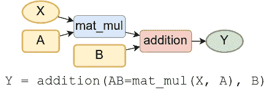
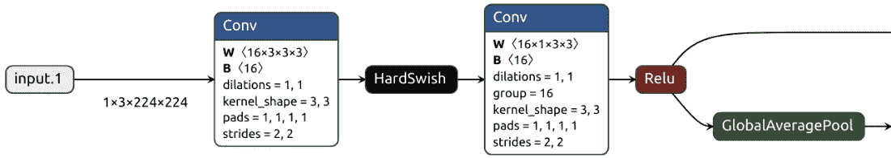
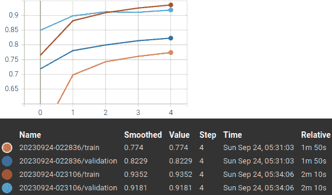
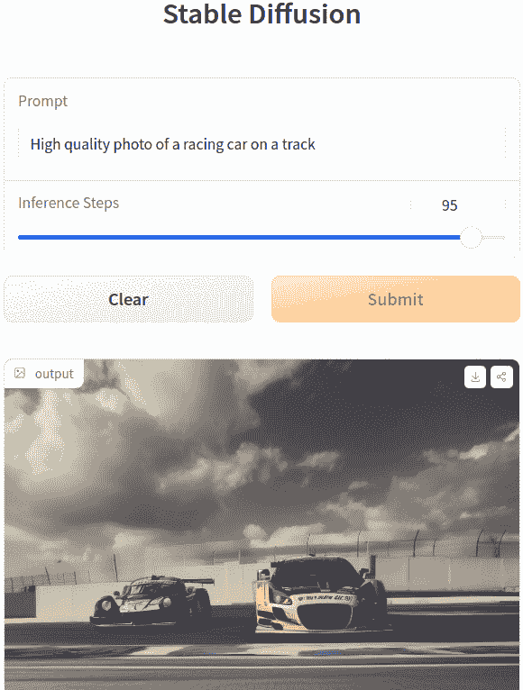

# 第十章：机器学习

运营（MLOps）

到目前为止，在本书中，我们专注于**神经网络（NNs）**的理论、各种 NN 架构以及我们可以解决的任务。这一章节有些不同，因为我们将专注于 NN 开发的一些实际方面。我们将深入探讨这个主题，因为 ML 模型（特别是 NNs）的开发和生产部署存在一些独特的挑战。我们可以将这个过程分为三个步骤：

1.  **训练数据集创建**：数据收集、清理、存储、转换和特征工程。

1.  **模型开发**：尝试不同的模型和训练算法，并评估它们。

1.  **部署**：在生产环境中部署训练好的模型，并监控其在计算和准确性方面的性能。

这个多步骤的复杂流程预设了解决 ML 任务时的一些挑战：

+   **多样化的软件工具包**：每个步骤都有多个竞争工具。

+   **模型开发很难**：每个训练实例都有大量的变量。这些可能包括 NN 架构的修改、训练超参数的变化（如学习率或动量）或不同的训练数据分布。此外，NNs 还有随机源，例如权重初始化或数据增强。因此，如果我们无法重现早期的结果，很难找出原因。即使代码中有错误，它可能不会导致易于检测的运行时异常。相反，它可能只是稍微降低模型的准确性。为了不丢失所有实验的记录，我们需要一个强大的跟踪和监控系统。

+   **复杂的部署和监控**：NNs 需要 GPU 和批处理组织的数据以达到最佳性能。这些要求可能与实时处理数据或逐样本处理的真实世界要求发生冲突。此外，用户数据的性质可能随时间变化，这可能导致**模型漂移**。

在本章中，我们将涵盖以下主要主题：

+   理解模型开发

+   探索模型部署

# 技术要求

我们将使用 Python、PyTorch、**TensorFlow（TF）**和**Hugging Face（HF）** Transformers 等工具实现本章中的示例。如果您还没有配置好这些工具的环境，不要担心——示例代码可以在 Google Colab 的 Jupyter Notebook 中找到。您可以在本书的 GitHub 存储库中找到这些代码示例：[`github.com/PacktPublishing/Python-Deep-Learning-Third-Edition/tree/main/Chapter10`](https://github.com/PacktPublishing/Python-Deep-Learning-Third-Edition/tree/main/Chapter10)。

# 理解模型开发

在本节中，我们将讨论各种工具，这些工具将帮助我们管理 ML 解决方案生命周期的模型开发阶段。让我们从最重要的问题开始——我们应该选择哪个 NN 框架？

## 选择一个 NN 框架

到目前为止，在本书中我们主要使用了 PyTorch 和 TensorFlow。我们可以将它们称为**基础**框架，因为它们是整个神经网络软件堆栈中最重要的组件。它们作为机器学习神经网络生态系统中其他组件的基础，比如 Keras 或 HF Transformers，这些组件可以使用它们作为后端（Keras 3.0 将支持多后端）。除了 TensorFlow，Google 还发布了 JAX（[`github.com/google/jax`](https://github.com/google/jax)），这是一个支持 GPU 加速的 NumPy 操作和 Autograd 的基础库。其他流行的库，如 NumPy、pandas 和 scikit-learn（[`scikit-learn.org`](https://scikit-learn.org)）超出了本书的范围，因为它们与神经网络没有直接关系。由于基础库的重要性，它们是我们工具包中的首选和最重要的选择。但如果我们从零开始启动一个项目，应该选择哪一个呢？

## PyTorch 与 TensorFlow 与 JAX

让我们来查看这些库在社区中的采用程度。我们的第一站是**Papers with Code** ([`paperswithcode.com/`](https://paperswithcode.com/))，它索引了机器学习论文、代码、数据集和结果。该网站还维护了按框架分组的论文实现趋势（[`paperswithcode.com/trends`](https://paperswithcode.com/trends)）。截至 2023 年 9 月，57%的新论文使用 PyTorch。TF 和 JAX 分别以 3%和 2%的比例位居第二和第三。这个趋势并不新鲜——PyTorch 于 2016 年发布，但它在 2019 年已经超过了 TF。这个特定的数据点表明，PyTorch 主导着前沿研究，而这些研究正是最新的论文。因此，如果你希望始终使用该领域最新和最优秀的技术，选择 PyTorch 是个不错的主意。接下来，我们来看一下托管在 HF 平台上的机器学习模型（[`huggingface.co/models`](https://huggingface.co/models)），我们也可以按项目框架进行筛选。在大约 335,000 个托管模型中，约 131,000 个使用 PyTorch，约 10,000 个使用 TF，约 9,000 个使用 JAX。再次，这一结果强烈支持 PyTorch。然而，这并不是完整的图景，因为这些结果仅适用于公开和开源项目。它们不一定能反映公司在生产环境中的使用情况。更具代表性的可能是 PyPI Stats（[`pypistats.org/`](https://pypistats.org/)），它提供了**Python 软件包索引**（**PyPi**，[`pypi.org/`](https://pypi.org/)）上 Python 包的下载汇总信息。这里的情况稍微复杂一些——PyTorch 在过去一个月（2023 年 8 月-9 月）有 11,348,753 次下载，而 TF 为 16,253,288 次，JAX 为 3,041,747 次。然而，我们应该对 PyPi Stats 持谨慎态度，因为许多自动化流程（例如持续集成）可能会使 PyPi 的下载次数膨胀，而这些并不代表真实世界的使用情况。此外，PyTorch 的下载页面建议通过 Conda（[`conda.io/`](https://conda.io/)）安装该库。月度统计数据显示，PyTorch 有 759,291 次下载，而 TF 为 154,504 次，JAX 为 6,260 次。因此，PyTorch 在这里也占据领先地位。总的来说，我的结论是，PyTorch 比 TF 更受欢迎，但这两者都在生产环境中使用。

我的建议是，如果你现在开始一个项目，可以选择 PyTorch，具体如何采纳这个建议可以根据你的实际情况来决定。正因如此，本书在讲解时相对于 TF 更多强调了 PyTorch。这个规则的一个例外是，如果你的项目运行在移动设备或边缘设备（[`en.wikipedia.org/wiki/Edge_device`](https://en.wikipedia.org/wiki/Edge_device)）上，并且计算能力有限。TF 通过 TF Lite 库（[`www.tensorflow.org/lite`](https://www.tensorflow.org/lite)）对这类设备提供了更好的支持。

但最终，你可以使用自己偏好的软件栈进行工作，然后将模型转换为其他库以进行部署。我们将在下一节中看到这如何实现。

## 开放神经网络交换格式

**开放神经网络交换格式**（**ONNX**，[`onnx.ai/`](https://onnx.ai/)）提供了一个用于基于神经网络（NN）和传统机器学习（ML）模型的开源格式（我们将在这里专注于神经网络）。它定义了一个可扩展的计算图模型、内置操作符和标准数据类型。换句话说，ONNX 提供了一个通用的神经网络表示格式，允许我们将一个库（例如 PyTorch）实现的模型转换为另一个库（如 TF）的模型，前提是源库和目标库都支持 ONNX。通过这种方式，你可以使用一个库来训练模型，然后在部署到生产环境时将其转换为另一个库。这也很有意义，因为 ONNX 关注推理模式，而不是训练（使用 ONNX 表示训练过程是实验模式）。

ONNX 通过计算`onnx`（`!pip install onnx`）Python 包来表示一个神经网络。我们开始吧：

1.  定义图表示的输入（`X`、`A`、`B`）和输出（`Y`）变量：

    ```py
    import numpy as np
    from onnx import TensorProto, numpy_helper
    from onnx.helper import make_tensor_value_info
    X = make_tensor_value_info(
        name='X',
        elem_type=TensorProto.FLOAT,
        shape=[None, None])
    Y = make_tensor_value_info(
        'Y', TensorProto.FLOAT, [None])
    A = numpy_helper.from_array(
        np.array([0.5, -0.6], dtype=np.float32),
        name='A')
    B = numpy_helper.from_array(
        np.array([0.4], dtype=np.float32),
        name='B')
    ```

    在这里，`make_tensor_value_info`声明了命名的图输入输出变量（`X`和`Y`），并为其定义了类型（`elem_type`）和`shape`。`shape=[None]`意味着任意形状，而`shape=[None, None]`意味着没有具体维度大小的二维张量。另一方面，`A`和`B`是函数参数（权重），我们用 NumPy 数组中的预定义值对它们进行初始化。

1.  定义图的操作：

    ```py
    from onnx.helper import make_node
    mat_mul = make_node(
        op_type='MatMul',
        inputs=['X', 'A'],
        outputs=['XA'])
    addition = make_node('Add', ['XA', 'B'], ['Y'])
    ```

    `mat_mul`表示输入矩阵`X`和`A`之间的矩阵乘法（`MatMul`），并将结果存储到输出变量`XA`中。`addition`将`mat_mul`的输出`XA`与偏置`B`相加。

ONNX 操作符

这个示例介绍了`MatMul`和`Add`的 ONNX 操作符。支持的操作符完整列表（请参见[`onnx.ai/onnx/operators/`](https://onnx.ai/onnx/operators/)）包括许多其他神经网络构建块，如激活函数、卷积、池化以及张量操作符（例如`concat`、`pad`、`reshape`和`flatten`）。此外，它还支持所谓的`if`操作符，根据布尔值执行一个子图或另一个子图。ONNX 本身并不实现这些操作符。相反，支持它的库（如 PyTorch）有自己的实现。反过来，如果你的库模型使用了 ONNX 不支持的操作符，ONNX 转换将会失败。

1.  现在我们已经具备了定义计算`graph`的条件：

    ```py
    from onnx.helper import make_graph
    graph = make_graph(
        nodes=[mat_mul, addition],
        name='Linear regression',
        inputs=[X],
        outputs=[Y],
        initializer=[A, B])
    ```

    我们可以在以下图中看到我们的计算图：



图 10.1 – 线性回归 ONNX 计算图

1.  使用`graph`来创建一个`onnx_model`实例。该模型允许你向图中添加额外的元数据，如文档字符串、版本、作者和许可证等：

    ```py
    from onnx.helper import make_model
    onnx_model = make_model(graph)
    onnx_model.doc_string = 'Test model'
    onnx_model.model_version = 1
    ```

1.  检查模型的一致性。这可以验证模型组件之间输入类型或形状是否匹配：

    ```py
    from onnx.checker import check_model
    check_model(onnx_model)
    print(onnx_model)
    ```

1.  最后，我们可以使用 `ReferenceEvaluator` 实例计算两个随机输入样本的模型输出：

    ```py
    from onnx.reference import ReferenceEvaluator
    sess = ReferenceEvaluator(onnx_model)
    print(sess.run(
        output_names=None,
        feed_inputs={'X': np.random.randn(2, 2).astype(np.float32)}))
    ```

    计算的结果是一个 NumPy 数组：

    ```py
    [array([-0.7511951,  1.0294889], dtype=float32)]
    ```

1.  ONNX 允许我们使用 **协议缓冲区** (**Protocol Buffers**，**protobuf**，[`protobuf.dev/`](https://protobuf.dev/)) 来序列化和反序列化模型结构及其权重。以下是操作方法：

    ```py
    with open('model.onnx', 'wb') as f:
        f.write(onnx_model.SerializeToString())
    from onnx import load
    with open('model.onnx', 'rb') as f:
        onnx_model = load(f)
    ```

现在我们已经介绍了 ONNX，接下来看看如何通过将 PyTorch 和 TF 模型导出到 ONNX 来实际应用它。

除了 `torch` 和 `tensorflow`，我们还需要 `torchvision`、`onnx` 和 `tf2onnx`（[`github.com/onnx/tensorflow-onnx`](https://github.com/onnx/tensorflow-onnx)，`!pip install tf2onnx`）包。我们先从 PyTorch 开始：

1.  加载一个预训练模型（`MobileNetV3`，参考 *第五章*）：

    ```py
    import torch
    from torchvision.models import mobilenet_v3_small, MobileNet_V3_Small_Weights
    torch_model = mobilenet_v3_small(
      weights=MobileNet_V3_Small_Weights.DEFAULT)
    ```

1.  然后，导出模型：

    ```py
    torch.onnx.export(
        model=torch_model,
        args=torch.randn(1, 3, 224, 224),
        f="torch_model.onnx",
        export_params=True)
    ```

    大多数参数不言而喻。`args=torch.randn(1, 3, 224, 224)` 指定了一个虚拟张量。这是必要的，因为序列化器可能会调用模型一次，以推断图结构和张量的大小。这个虚拟张量将作为调用的输入。然而，这也暴露了转换过程中的一个限制：如果模型包含动态计算图，转换器仅会转换当前调用路径。`export_params` 告诉导出器在导出模型结构时也包括模型的权重。

1.  使用 ONNX 加载导出的模型并检查其一致性（剧透：它可以正常工作）：

    ```py
    import onnx
    torch_model_onnx = onnx.load('torch_model.onnx')
    onnx.checker.check_model(torch_model_onnx)
    ```

接下来，我们也可以使用 TF 执行相同的操作。与 PyTorch 不同，TF 没有开箱即用的 ONNX 序列化支持。相反，我们将使用 `tf2onnx` 包：

1.  加载一个预训练的 `MobileNetV3` 模型：

    ```py
    import tensorflow as tf
    tf_model = tf.keras.applications.MobileNetV3Small(
      weights='imagenet',
      input_shape=(224, 224, 3),
    )
    ```

1.  使用 `tf2onnx` 序列化模型。它遵循与 PyTorch 相同的原理，包括虚拟输入张量（`input_signature`），这是调用模型时必需的：

    ```py
    import tf2onnx
    tf_model_onnx, _ = tf2onnx.convert.from_keras(
      model=tf_model,
      input_signature=[tf.TensorSpec([1, 224, 224, 3])])
    onnx.save(tf_model_onnx, 'tf_model.onnx')
    ```

我们再次可以使用 ONNX 加载模型，以验证其一致性。

接下来，我们可以使用 `torch_model.onnx` 或 `tf_model.onnx`。这是一种用于神经网络和其他机器学习模型的图形查看工具。它可以作为 **用户界面** (**UI**) 的 Web 版，或者作为独立应用程序存在。它支持 ONNX、TensorFlow Lite 和 PyTorch（实验性支持），以及其他一些库。例如，以下图显示了通过 Netron 可视化的初始**MobileNetV3**层（完整模型的可视化太大，无法在本章中显示）：



图 10.2 – MobileNetV3 ONNX 模型文件的 Netron 可视化

在这里，输入形状为 3×224×224，`W` 是卷积滤波器的形状，`B` 是偏置。我们在 *第四章* 中介绍了其余的卷积属性。

不幸的是，PyTorch 和 TF 都没有集成加载 ONNX 模型的功能。但是，已经有开源包允许我们实现这一点。其中有两个分别为 PyTorch 提供的 `onnx2torch` ([`github.com/ENOT-AutoDL/onnx2torch`](https://github.com/ENOT-AutoDL/onnx2torch)) 和为 TF 提供的 `onnx2tf` ([`github.com/PINTO0309/onnx2tf`](https://github.com/PINTO0309/onnx2tf))。

接下来，我们将重点介绍一款能够简化训练过程的工具。

## 介绍 TensorBoard

**TensorBoard**（**TB**，[`www.tensorflow.org/tensorboard/`](https://www.tensorflow.org/tensorboard/)，[`github.com/tensorflow/tensorboard`](https://github.com/tensorflow/tensorboard)）是一个 TF 补充的基于网页的工具，提供了机器学习实验的可视化和工具支持。它的一些功能如下：

+   指标（如损失和精度）跟踪和可视化

+   模型图可视化（类似 Netron）

+   显示权重、偏差或其他张量随时间变化的时间序列直方图

+   低维嵌入投影

TensorBoard 可以与 TF/Keras 和 PyTorch 一起使用，但它与 TF 的集成更好（毕竟是由 TF 团队开发的）。在这两种情况下，TensorBoard 在训练过程中并不会直接与模型通信。相反，训练过程会将其状态和当前进度存储在一个特殊的日志文件中。TensorBoard 跟踪该文件的变化，并自动更新其图形界面，展示最新信息。通过这种方式，它可以随着训练的进展实时可视化训练过程。此外，该文件还会存储整个训练历史，即使训练完成后，仍然可以展示这些数据。为了更好地理解其工作原理，我们将把 TensorBoard 添加到我们在 *第五章* 中介绍的迁移学习计算机视觉示例中。简要回顾一下，我们将从 ImageNet 预训练的 MobileNetV3 模型开始。接着，我们将使用两种迁移学习技术，**特征工程**和**微调**，来训练这些模型以对 CIFAR-10 数据集进行分类。TensorBoard 将可视化训练过程。

让我们从 Keras 示例开始。我们只会包括相关部分的代码，而不是完整的示例，因为我们在 *第五章* 中已经讨论过了。更具体地说，我们将专注于 `train_model(model, epochs=5)` 函数，该函数将预训练的 `model` 和训练的 `epochs` 数量作为参数。以下是该函数的主体（请注意，实际的实现有缩进）：

初始化 TensorBoard

本示例假设 TensorBoard 已经初始化并正在运行（尽管即使未安装，代码仍然可以正常工作）。我们不会包括 TensorBoard 的初始化代码，因为它取决于环境设置。但它在本示例的 Jupyter Notebook 中是有包含的。

按照以下步骤操作：

1.  首先，我们将使用 Adam 优化器、二元交叉熵损失函数以及精度跟踪来配置预训练 Keras 模型的训练：

    ```py
    model.compile(
        optimizer=tf.keras.optimizers.Adam(
            learning_rate=0.0001),
        loss='categorical_crossentropy',
        metrics=['accuracy'])
    ```

1.  接下来，我们将添加特殊的`tensorboard_callback`，它实现了 TB 连接：

    ```py
    tensorboard_callback = tf.keras.callbacks.TensorBoard(
        log_dir='logs/tb/' + datetime.datetime.now().strftime('%Y%m%d-%H%M%S'),
        update_freq='epoch',
        histogram_freq=1,
        write_graph=True,
        write_images=True,
        write_steps_per_second=True,
        profile_batch=0,
        embeddings_freq=0)
    ```

    回调参数如下：

    +   `log_dir`：这指示`tensorboard_callback`将日志文件写入一个唯一的时间戳文件夹，即`'logs/tb/' + datetime.datetime.now().strftime('%Y%m%d-%H%M%S')`，位于主文件夹`'logs/tb/'`下。TB 将同时选择`'logs/tb/'`下所有训练文件夹，并在其 UI 中显示它们作为唯一的训练实例。

    +   `update_freq=1`：每个周期更新日志文件。

    +   `histogram_freq=1`：每个周期计算一次权重直方图。

    +   `write_graph=True`：生成 NN 架构的图形可视化。

    +   `write_images=True`：将模型权重可视化为图像。

    +   `write_steps_per_second=True`：记录每秒训练步骤。

    +   `profile_batch=1`：对第一批次进行分析以采样其计算特性。

    +   `Embeddings_freq=0`：嵌入层将被可视化的频率（以周期为单位）（我们没有嵌入层，因此默认情况下禁用）。

1.  最后，我们将使用`model.fit`方法运行训练：

    ```py
    steps_per_epoch=metadata.splits['train'].num_examples // BATCH_SIZE
    validation_steps=metadata.splits['test'].num_examples // BATCH_SIZE
    model.fit(
        train_batches,
        epochs=epochs,
        validation_data=test_batches,
        callbacks=[tensorboard_callback],
        steps_per_epoch=steps_per_epoch,
        validation_steps=validation_steps)
    ```

    我们将`tensorboard_callback`添加到`model`的回调列表中。训练过程会通知每个回调不同的训练事件：训练开始、训练结束、测试开始、测试结束、周期开始、周期结束、批次开始和批次结束。反过来，`tensorboard_callback`根据其配置和当前事件更新日志文件。

    TB UI 显示了日志文件中的所有信息。虽然它过于复杂无法在此处包含，但我们仍然可以显示一个关于准确度的片段：



图 10.3 – TB UI 中的准确度

在这里，TB 显示了四个不同实验的准确度 - 特征工程的训练/测试和微调的训练/测试。

接下来，让我们看看 PyTorch 如何与 TB 集成。它提供了一个特殊的`torch.utils.tensorboard.SummaryWriter`类，它将条目直接写入事件日志文件，以供 TB 消费。它遵循与 Keras 相同的原则。`SummaryWriter`的高级 API 允许我们在`log_dir`中创建一个事件文件，并异步向其添加内容。与 Keras 不同的主要区别在于，我们负责添加内容，而不是由自动事件侦听器执行。让我们看看实际操作中是如何工作的。与 Keras 一样，我们将使用计算机视觉迁移学习示例来自*第五章*。我们只关注相关部分，但您可以在本书的 GitHub 存储库的 Jupyter 笔记本中查看完整示例。

首先，我们将初始化两个`SummaryWriter`实例，用于特征提取器的微调模式。无论我们在哪里执行它，只要在开始使用它们之前执行即可。与 Keras 一样，每个训练实例都有一个唯一的时间戳文件夹，位于`'logs/tb/'`下（我们仅显示一个初始化，因为它们都是相同的）：

```py
import datetime
from torch.utils.tensorboard import SummaryWriter
writer = SummaryWriter(
log_dir='logs/tb/' + datetime.datetime.now().strftime('%Y%m%d-%H%M%S'))
```

为了清晰起见，我们将包括初始化 MobileNetV3 预训练模型的代码：

```py
from torchvision.models import (
    MobileNet_V3_Small_Weights, mobilenet_v3_small)
model = mobilenet_v3_small(
    weights=MobileNet_V3_Small_Weights.IMAGENET1K_V1)
```

接下来，我们将进入训练（或测试）循环，其中 `train_loader`，`torch.utils.data.DataLoader` 的一个实例，生成 `inputs` 和 `labels` 的小批量数据：

```py
for i, (inputs, labels) in enumerate(data_loader):
    # Training loop goes here
```

在循环中，我们可以将模型图添加到日志文件中。它以模型和输入张量作为参数生成可视化（因此需要在训练循环中调用 `add_graph`）：

```py
writer.add_graph(model, inputs)
```

最后，在训练循环的末尾，我们将添加当前 `epoch` 的损失和准确率作为标量值：

```py
writer.add_scalar(
    tag='train/accuracy',
    scalar_value=total_acc,
    global_step=epoch)
writer.add_scalar(
    tag='train/loss',
    scalar_value=total_loss,
    global_step=epoch)
```

每个标量值都有一个唯一的 `tag`（除了代码中的两个标签外，我们还有 `tag='validation/loss'`）。请注意，`global_step`（等于 epoch）将 `scalar_value` 存储为同一 `tag` 下的一个序列。除了图形和标量外，`SummaryWriter` 还可以添加图像、张量、直方图和嵌入等内容。

本文结束了我们对 TB 的介绍。接下来，我们将学习如何为边缘设备开发神经网络模型。

## 使用 TF Lite 开发边缘设备的神经网络模型

TF Lite 是一个源自 TF 的工具集，使我们能够在移动设备、嵌入式设备和边缘设备上运行模型。其多功能性是 TF 在工业应用中受欢迎的原因之一（与 PyTorch 主导的研究应用领域相对）。TF Lite 的核心范式是模型在设备上运行，而不是传统的客户端-服务器架构，其中模型部署在远程、更强大的硬件上。这种组织方式有以下影响（包括正面和负面）：

+   **低延迟执行**：缺少服务器的往返连接显著减少了模型推理时间，使我们能够运行实时应用程序。

+   **隐私**：用户数据从不离开设备。

+   **互联网连接**：不需要互联网连接。

+   `.tflite` 文件扩展名。除了文件体积小，它还允许我们直接访问数据，而无需首先解析/解包它。

TF Lite 模型支持 TF Core 操作的子集，并允许我们定义自定义操作：

+   **低功耗**：这些设备通常使用电池供电。

+   **训练与推理的差异**：神经网络训练比推理需要更多的计算资源。因此，模型训练通常在比实际设备更强大的硬件上进行，而这些设备用于推理。

此外，TF Lite 具有以下关键特性：

+   支持多平台和多语言，包括 Android（Java）、iOS（Objective-C 和 Swift）设备、Web（JavaScript）以及其他环境的 Python。谷歌提供了一个名为 **MediaPipe Solutions** 的 TF Lite 封装 API ([`developers.google.com/mediapipe`](https://developers.google.com/mediapipe), [`github.com/google/mediapipe/`](https://github.com/google/mediapipe/))，它取代了之前的 TF Lite API。

+   性能优化。

+   它具有端到端的解决方案管道。TF Lite 主要面向实际应用，而非研究。因此，它包含了用于常见机器学习任务的不同管道，如图像分类、物体检测、文本分类和问答等。计算机视觉管道使用了修改版的 EfficientNet 或 MobileNet（*第四章*），自然语言处理管道则使用基于 BERT 的（*第七章*）模型。

那么，TF Lite 模型开发是如何工作的呢？首先，我们将通过以下方式选择一个模型：

+   一个已存在的预训练 `.tflite` 模型（[`tfhub.dev/s?deployment-format=lite`](https://tfhub.dev/s?deployment-format=lite)）。

+   使用 `.tflite` 模型和自定义训练数据集。Model Maker 仅适用于 Python。

+   将一个完整的 TF 模型转换为 `.tflite` 格式。

TFLite 模型元数据

`.tflite` 模型可能包含三个组件的可选元数据：

-- **可读部分**：为模型提供额外的信息。

-- **输入信息**：描述输入数据格式以及必要的预处理步骤。

-- **输出信息**：描述输出数据格式以及必要的后处理步骤。

最后两部分可以被代码生成器（例如，Android 代码生成器）利用，以在目标平台上创建现成的模型包装器。

接下来，我们来看如何使用 Model Maker 训练一个 `.tflite` 模型，然后用它来分类图像。我们只会展示相关的代码部分，但完整的示例可以在本书的 GitHub 仓库中的 Jupyter Notebook 中找到。让我们开始吧：

1.  首先，我们将创建训练和验证数据集：

    ```py
    from mediapipe_model_maker import image_classifier
    dataset = image_classifier.Dataset.from_folder(dataset_path)
    train_data, validation_data = dataset.split(0.9)
    ```

    在这里，`dataset_path` 是 Flowers 数据集的路径（[`www.tensorflow.org/datasets/catalog/tf_flowers`](https://www.tensorflow.org/datasets/catalog/tf_flowers)），该数据集包含了 3,670 张低分辨率的 RGB 花卉图片，分为五个类别（每个类别一个子文件夹）。`data.split(0.9)` 将数据集（`image_classifier.Dataset` 实例）拆分为 `train_data`（90%的图片）和 `validation_data`（10%的图片）两部分。

1.  接下来，我们将定义训练超参数——训练三轮，使用 mini-batch 大小为 16，并将训练好的模型导出到 `export_dir` 文件夹（也可以使用其他参数）：

    ```py
    hparams = image_classifier.HParams(
        export_dir='tflite_model',
        epochs=3,
        batch_size=16)
    ```

1.  然后，我们将定义模型参数（我们将使用 `EfficientNet`）：

    ```py
    options = image_classifier.ImageClassifierOptions(    supported_model=image_classifier.SupportedModels.EFFICIENTNET_LITE4,
        hparams=hparams)
    ```

1.  最后，我们将创建一个新模型并开始训练：

    ```py
    model = image_classifier.ImageClassifier.create(
        train_data=train_data,
        validation_data=validation_data,
        options=options,
    )
    ```

    这个模型在三轮训练中达到了大约 92% 的准确率。训练过程会创建一个与 TB 兼容的日志文件，因此我们可以通过 TB 跟踪进度（在 Jupyter Notebook 中可用）。

1.  接下来，我们将导出模型为 `.tflite` 格式，进入示例的下一个阶段：

    ```py
    model.export_model('model.tflite')
    ```

1.  现在我们有了一个训练好的模型，可以用它来分类图像。我们将使用 `MediaPipe` Python API（与 Model Maker 不同）：

    ```py
    import mediapipe as mp
    from mediapipe.tasks import python
    from mediapipe.tasks.python import vision
    generic_options = python.BaseOptions(
        model_asset_path='/content/tflite_model/model.tflite')
    cls_options = vision.ImageClassifierOptions(
        base_options=generic_options)
    classifier = vision.ImageClassifier.create_from_options(cls_options)
    ```

    这里，`classifier`是预训练模型，`generic_options`包含`.tflite`模型的文件路径，而`cls_options`包含特定于分类的选项（我们使用默认值）。

1.  我们将加载五张随机的花卉图像（每个花卉类别一张，如`labels`中所列），并将它们存储在一个名为`image_paths`的列表中（这里不显示）。我们将对每张图像进行分类，并将其预测标签与真实标签进行比较：

    ```py
    for image_path, label in zip(image_paths, labels):
      image = mp.Image.create_from_file(image_path)
      result = classifier.classify(image)
      top_1 = result.classifications[0].categories[0]
      print(f'Label: {label}; Prediction: {top_1.category_name}')
    ```

    可以预见，模型能够正确分类所有图像。

接下来，我们将学习如何使用混合精度计算来优化训练过程。

## 使用 PyTorch 进行混合精度训练

我们在*第八章*中讨论了 LLM 的混合精度训练。在这一节中，我们将展示如何在实践中使用 PyTorch 来实现它。我们将再次使用*第五章*中的转移学习 PyTorch 示例作为实现的基础。所有的代码修改都集中在`train_model`函数中。这里我们只包括`train_model`，但完整的示例可以在本书的 GitHub 仓库中的 Jupyter Notebook 中找到。以下是该函数定义的简化版本：

```py
def train_model(model, loss_fn, optimizer, data_loader):
    scaler = torch.cuda.amp.GradScaler()
    for i, (inputs, labels) in enumerate(data_loader):
        optimizer.zero_grad()
        with torch.autocast(
            device_type=device,
            dtype=torch.float16):
            # send the input/labels to the GPU
            inputs = inputs.to(device)
            labels = labels.to(device)
            # forward
            outputs = model(inputs)
            loss = loss_fn(outputs, labels)
        # backward with scaler
        scaler.scale(loss).backward()
        scaler.step(optimizer)
        scaler.update()
```

我们使用两种独立且不相关的机制来进行混合精度训练：

+   `torch.autocast`：它充当上下文管理器（或装饰器），允许代码的某个区域在混合精度下运行。`device_type`指定`autocast`应用的设备，`dtype`指定 CUDA 操作使用的数据类型。PyTorch 文档建议仅将前向传播和损失计算封装在`torch.autocast`中，反向传播操作会自动使用与前向传播相同的数据类型。

+   `torch.cuda.amp.GradScaler`：当前向传播使用`float16`精度操作时，反向传播也使用相同的精度进行梯度计算。然而，由于较低的精度，一些梯度值可能会变为零。为了防止这种情况，**梯度缩放**将神经网络的损失乘以一个缩放因子，并用缩放后的值执行反向传播。反向传播时，梯度流也会按相同的因子进行缩放。通过这种方式，整个反向传播过程使用较大的数值，以防止梯度被清零。在权重更新之前，该机制会*反缩放*梯度值，以确保权重更新时使用的是实际的梯度值。

这就是我们对模型开发工具的介绍。接下来，我们将讨论一些模型部署机制。

# 探索模型部署

在这一节中，我们将讨论两个基本的模型部署示例。这些示例将帮助你创建简单但功能完整的概念验证应用程序，用于你的实验。我们开始吧。

## 使用 Flask 部署神经网络模型

在第一个示例中，我们将结合使用 Google Colab 和`prompt`参数，生成图像，并将其作为结果返回。

根据其主页，Flask 是一个轻量级的`localhost`，但我们无法访问它。为了解决这个问题，我们需要`flask-ngrok`（[`ngrok.com/docs/using-ngrok-with/flask/`](https://ngrok.com/docs/using-ngrok-with/flask/)），它将使服务器暴露给外界（你需要一个免费的`ngrok`注册和认证令牌来运行这个示例）。

为了满足所有依赖项，我们需要安装`transformers`、`diffusers`、`accelerate`和`flask-ngrok`包。让我们开始吧：

1.  首先，我们将以与*第九章*中相同的方式初始化 SD HF 管道（`sd_pipe`）：

    ```py
    import torch
    from diffusers import StableDiffusionPipeline
    sd_pipe = StableDiffusionPipeline.from_pretrained(
        "stabilityai/stable-diffusion-2-1",
        torch_dtype=torch.float16)
    sd_pipe.to('cuda')
    ```

1.  接下来，我们将初始化我们的 Flask `app`：

    ```py
    from flask import Flask
    from flask_ngrok import run_with_ngrok
    app = Flask(__name__)
    run_with_ngrok(app)
    ```

    这里，`run_with_ngrok`表示应用将使用`ngrok`运行，但实际的`app`尚未启动（这将在本示例的最后进行）。由于我们无法访问 Colab 的`localhost`，`ngrok`将使我们能够通过测试客户端访问它。

1.  然后，我们将实现我们的`text-to-image`端点，它将处理作为 Web 请求传入的提示，并基于它们生成图像：

    ```py
    import io
    from flask import Flask, request, send_file, abort
    @app.route('/text-to-image', methods=['POST', 'GET'])
    def predict():
        if request.method in ('POST', 'GET'):
            prompt = request.get_json().get('prompt')
            if prompt and prompt.strip():
                image = sd_pipe(
                    prompt,
                    num_inference_steps=100).images[0]
                image_io = io.BytesIO()
                image.save(image_io, format='PNG')
                image_io.seek(0)
                return send_file(
                    image_io,
                    as_attachment=False,
                    mimetype='image/png'
                )
            else:
                abort(500, description='Invalid prompt')
    ```

    该端点的名称是`/text-to-image`，它将处理`POST`和`GET`请求（处理流程是相同的）。该函数将解析文本的`prompt`参数，并将其传递给`sd_pipe`以生成`image`参数（与*第九章*示例中的方式相同）。最后，`send_file`函数将把`image`的结果返回给客户端。

1.  我们现在可以通过`app.run()`命令启动 Flask 应用。它将初始化 Flask 开发服务器，使我们的端点准备好处理请求。此外，`ngrok`将通过[`RANDOM-SEQUENCE.ngrok.io/`](http://RANDOM-SEQUENCE.ngrok.io/)类型的 URL 将应用暴露给外界。

1.  我们可以使用这个 URL 发起对`text-to-image`端点的测试请求（这在 Colab 笔记本外进行）：

    ```py
    import requests
    response = requests.post(
        url='http://RANDOM-SEQUENCE.ngrok.io/text-to-image',
        json={'prompt': 'High quality photo of a racing car on a track'})
    ```

1.  我们可以使用以下代码来显示图像：

    ```py
    from PIL import Image
    import io
    image = Image.open(io.BytesIO(response.content))
    image.show()
    ```

这就结束了我们的 REST API 示例。接下来，我们将在 Web 环境中部署一个带有 UI 的模型。

## 使用 Gradio 构建机器学习 Web 应用

Gradio（[`www.gradio.app/`](https://www.gradio.app/)）是一个开源的 Python 库，允许我们为 ML 模型构建互动式 Web 演示。HF Spaces（[`huggingface.co/spaces`](https://huggingface.co/spaces)）支持托管 Gradio 应用。因此，我们可以在 HF 基础设施上构建一个 Gradio 应用，它不仅包括托管，还可以访问所有可用的 HF 模型（[`huggingface.co/models`](https://huggingface.co/models)）。

我们可以在 [`huggingface.co/new-space`](https://huggingface.co/new-space) 创建一个 HF 空间。这个空间有一个名字（它也将成为其 URL）、一个许可证和一个 SDK。在写作时，HF Spaces 支持基于 Streamlit 的（[`streamlit.io/`](https://streamlit.io/)）、基于 Gradio 的和静态实例。然而，你也可以部署自定义的 Docker 容器以获得更多灵活性。

每个新的 HF 空间都有一个关联的 Git 仓库。例如，本文示例的空间位于 [`huggingface.co/spaces/ivan-vasilev/gradio-demo`](https://huggingface.co/spaces/ivan-vasilev/gradio-demo)，这也是其相应 Git 仓库的 URL。基于 Gradio 的空间期望在其根目录中有一个名为 `app.py` 的 Python 模块（在我们的例子中，整个示例将驻留在 `app.py` 中）和一个 `requirements.txt` 文件。每次你推送更改到仓库时，应用程序将自动接收这些更改并重新启动。

注意

若要复制此示例，你需要一个 HF 账户。HF Spaces 提供不同的硬件等级。基本版是免费的，但此特定示例需要启用 GPU 的等级，这会按小时收费。因此，如果你想运行此示例，可以将其复制到自己的账户中并启用 GPU 等级。

Gradio 从一个名为 `gradio.Interface` 的中央高级类开始。其构造函数接受三个主要参数：

+   `fn`：主函数，将处理输入并返回输出。

+   `inputs`：一个或多个 Gradio 输入组件。这些可以是文本输入、文件上传或组合框等。你可以将组件指定为类实例或通过其字符串标签。输入的数量应与 `fn` 参数的数量匹配。

+   `outputs`：一个或多个 Gradio 组件，表示 `fn` 执行结果。输出的数量应与 `fn` 返回的值的数量匹配。

Gradio 将根据 `input` 和 `output` 参数自动实例化并排列 UI 组件。

接下来，我们将实现我们的示例。我们将使用与 *使用 Flask 部署神经网络模型* 部分相同的文本到图像的 SD 场景。为了避免重复，我们假设 `sd_pipe` 流水线已被初始化。现在开始：

1.  首先，我们将实现 `generate_image` 函数，该函数使用 `prompt` 在 `inf_steps` 步骤内合成一张图像：

    ```py
    def generate_image(
            prompt: str,
            inf_steps: int = 100):
        return sd_pipe(
            prompt=prompt,
            num_inference_steps=inf_steps).images[0]
    ```

1.  接下来，我们将初始化 `gradio.Interface` 类：

    ```py
    import gradio as gr
    interface = gr.Interface(
        fn=generate_image,
        inputs=[
            gr.components.Textbox(label='Prompt'),
            gr.components.Slider(
                minimum=0,
                maximum=100,
                label='Inference Steps')],
        outputs=gr.components.Image(),
        title='Stable Diffusion',
    )
    ```

    如我们所讨论的，`inputs` 和 `outputs` `gr.Interface` 参数与 `generate_image` 函数的输入/输出签名相匹配。

1.  最后，我们可以使用 `interface.launch()` 命令运行应用程序。以下是该应用程序响应式 UI 的样子：



图 10.4 – SD Gradio 应用程序的响应式 UI，托管在 HF Spaces 上。上方：输入组件；下方：生成的图像

这部分内容总结了我们对 Gradio 和模型部署的介绍。

# 总结

在这一章中，我们概述了机器学习开发生命周期的三个主要组成部分——训练数据集的创建、模型开发和模型部署。我们主要关注了后两者，从开发开始。首先，我们讨论了基础神经网络框架的流行。接着，我们聚焦于几个模型开发主题——ONNX 通用模型表示格式、TB 监控平台、TF Lite 移动开发库，以及混合精度的 PyTorch 训练。然后，我们讨论了两种基本的模型部署场景——作为 Flask 应用的 REST 服务和使用 Gradio 的交互式 Web 应用。

这章以及本书到此结束。希望你享受这段旅程！
