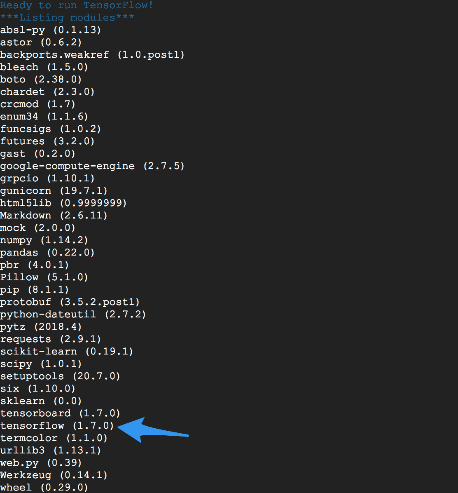

# 第一章：构建深度学习环境

欢迎加入应用 AI 深度学习团队，欢迎来到我们的第一个项目——*构建一个通用深度学习环境*！我们对本书中所整理的项目感到兴奋。通用工作环境的基础将帮助我们一起工作，并学习非常酷且强大的**深度学习**（**DL**）技术，例如**计算机视觉**（**CV**）和**自然语言处理**（**NLP**），这些技术将在你作为数据科学家的职业生涯中大有裨益。

本章将涵盖以下主题：

+   构建通用 DL 环境的组件

+   设置本地 DL 环境

+   在云端设置 DL 环境

+   使用云端部署 DL 应用程序

+   自动化设置过程，以减少错误并快速启动

# 构建通用的 DL 环境

本章的主要目标是标准化工具集，使其能够协同工作，并获得一致的准确结果。

在使用 DL 算法构建可扩展生产应用的过程中，拥有正确的设置是非常重要的，无论是在本地还是在云端，都必须确保端到端的流程能够顺利进行。因此，在本章中，我们将学习如何设置 DL 环境，并将用其来运行所有实验，最终将 AI 模型投入生产。

首先，我们将讨论构建、开发和部署深度学习（DL）模型所需的主要组件，然后介绍各种实现方法，最后查看一些帮助自动化整个过程的代码片段。

以下是构建 DL 应用程序所需的组件列表：

+   Ubuntu 16.04 或更高版本

+   Anaconda 包

+   Python 2.x/3.x

+   TensorFlow/Keras DL 包

+   支持 GPU 的 CUDA

+   Gunicorn 用于大规模部署

# 集中精力，开始编码吧！

我们将从设置本地 DL 环境开始。你做的大部分工作都可以在本地机器上完成。但在处理大数据集和复杂模型架构时，处理时间会显著变慢。这就是为什么我们还会在云端设置 DL 环境，因为这些复杂且重复的计算处理时间过长，否则就无法高效完成工作。

我们将按照上面的列表逐步进行，到最后（在一点自动化脚本的帮助下），你将完成所有设置！

# 本地 DL 环境设置

在本书中，我们将使用 Ubuntu 操作系统来运行所有实验，因为 Linux 有很好的社区支持，几乎所有的深度学习应用程序都可以轻松在 Linux 上设置。如果需要关于 Ubuntu 安装和设置的帮助，请参考[`tutorials.ubuntu.com/`](https://tutorials.ubuntu.com/)上的教程。此外，本书将使用 Python 2.7+ 的 Anaconda 包来编写代码、训练和测试。Anaconda 自带大量预安装的 Python 包，如 `numpy`、`pandas`、`sklearn` 等，这些包在各种数据科学项目中都非常常用。

为什么我们需要 Anaconda？难道不能使用原生 Python 吗？

Anaconda 是一个通用的捆绑包，包含 iPython Notebook、编辑器以及许多预安装的 Python 库，可以节省大量设置时间。使用 Anaconda，我们可以快速开始解决数据科学问题，而不是花时间配置环境。

但是，当然可以使用默认的 Python——完全取决于读者的选择，我们将在本章末尾学习如何通过脚本配置 `python env`。

# 下载并安装 Anaconda

Anaconda 是一个非常流行的数据科学平台，供使用 Python 构建机器学习和深度学习模型以及可部署应用程序的人们使用。Anaconda 市场团队在他们的 *什么是 Anaconda？* 页面上总结得最好，页面链接：[`www.anaconda.com/what-is-anaconda/`](https://www.anaconda.com/what-is-anaconda/)。要安装 Anaconda，请执行以下步骤：

1.  点击菜单中的 Anaconda，然后点击 Downloads 进入下载页面：[`www.anaconda.com/download/#linux`](https://www.anaconda.com/download/#linux)

1.  选择适合你平台的下载版本（Linux、OS X 或 Windows）：

    1.  选择 Python 3.6 版本*

    1.  选择图形化安装程序

1.  按照向导中的说明操作，10 到 20 分钟后，你的 Anaconda 环境（Python）将设置完成。

安装过程完成后，你可以使用以下命令检查终端中的 Python 版本：

```py
python -V
```

你应该能看到以下输出：

```py
Python 3.6 :: Anaconda,Inc. 
```

如果命令不起作用，或者返回错误，请查阅你平台的文档寻求帮助。

# 安装深度学习库

现在，让我们安装用于深度学习的 Python 库，具体来说是 TensorFlow 和 Keras。

什么是 TensorFlow？

TensorFlow 是由 Google 开发和维护的 Python 库。你可以使用 TensorFlow 在自定义模型和应用程序中实现许多强大的机器学习和深度学习架构。想了解更多，请访问：[`www.tensorflow.org/`](https://www.tensorflow.org/)

通过输入以下命令安装 TensorFlow 深度学习库（适用于所有操作系统，除了 Windows）：

```py
conda install -c conda-forge tensorflow
```

另外，你也可以选择使用 `pip` 安装，并根据你的平台安装指定版本的 TensorFlow，使用以下命令：

```py
pip install tensorflow==1.6
```

你可以在[`www.tensorflow.org/get_started/os_setup#anaconda_installation`](https://www.tensorflow.org/get_started/os_setup#anaconda_installation)找到 TensorFlow 的安装说明。

现在我们将使用以下命令安装`keras`：

```py
pip install keras
```

为了验证环境和包的版本，让我们编写以下脚本，该脚本将打印出每个库的版本号：

```py
# Import the tensorflow library
import tensorflow
# Import the keras library
import keras

print('tensorflow: %s' % tensorflow.__version__)
print('keras: %s' % keras.__version__)
```

将脚本保存为`dl_versions.py`。通过输入以下命令来运行脚本：

```py
python dl_version.py
```

你应该看到以下输出：

```py
tensorflow: 1.6.0
Using TensorFlow backend.
keras: 2.1.5
```

看！现在我们的 Python 开发环境已经准备好，可以开始在本地编写一些超棒的深度学习应用程序了。

# 在云端设置深度学习环境

到目前为止我们所执行的所有步骤在云端也同样适用，但为了使你的深度学习应用程序可服务和可扩展，还需要一些额外的模块来配置云虚拟机。因此，在设置服务器之前，请按照前一节的指示操作。

要在云端部署深度学习应用程序，你需要一台足够强大的服务器，能够同时训练模型并提供服务。随着深度学习领域的巨大进展，对云服务器的需求也急剧增加，市场上的选择也随之增多。以下是一些最佳选择：

+   Paperspace ([`www.paperspace.com/`](https://www.paperspace.com/))

+   FloydHub ([`www.floydhub.com`](https://www.floydhub.com))

+   Amazon Web Services ([`aws.amazon.com/`](https://aws.amazon.com/))

+   Google Cloud Platform ([`cloud.google.com/`](https://cloud.google.com/))

+   DigitalOcean ([`cloud.digitalocean.com/`](https://cloud.digitalocean.com/))

这些选项各有优缺点，最终的选择完全取决于你的使用场景和偏好，因此可以随意探索更多内容。本书中，我们将主要在**Google Compute Engine**（**GCE**）上构建和部署模型，而 GCE 是**Google Cloud Platform**（**GCP**）的一部分。按照本章中提到的步骤启动虚拟机服务器并开始操作。

Google 发布了一个内部笔记本平台，**Google Colab** ([`colab.research.google.com/`](https://colab.research.google.com/))，该平台预装了所有深度学习包和其他 Python 库。你可以在 Google Cloud 上编写所有机器学习/深度学习应用程序，并免费使用 GPU 进行 10 小时的计算。

# 云平台部署

本书的主要目的是帮助你构建和部署深度学习应用程序。在本节中，我们将讨论一些关键组件，这些组件是让你的应用程序可以服务成千上万的用户所必需的。

使应用程序可访问的最佳方式是将其作为 Web 服务暴露，使用 REST 或 SOAP API。为此，我们有许多 Python Web 框架可供选择，例如`web.py`、Flask、Bottle 等。这些框架使我们能够轻松构建 Web 服务并进行部署。

# 先决条件

你应该有一个 Google Cloud ([`cloud.google.com/`](https://cloud.google.com/)) 账户。Google 目前正在推广其平台，并提供 300 美元的信用和 12 个月的免费使用期。

# 设置 GCP

按照以下步骤设置你的 GCP：

1.  **创建新项目**：点击如下面截图所示的三个点，然后点击加号来创建一个新项目：


1.  **启动虚拟机实例**：点击屏幕左上角的三条线，选择计算选项，然后点击计算引擎。接着选择创建新实例。为虚拟机实例命名，并选择你的区域为 us-west2b。选择机器类型的大小。

    选择你的启动磁盘为 Ubuntu 16.04 LTS。在防火墙选项中，选择 HTTP 和 HTTPS 选项（确保它可以从外部访问）。若要选择 GPU 选项，可以点击自定义按钮，并找到 GPU 选项。你可以选择两种 NVIDIA GPU。勾选“允许 HTTP 流量”和“允许 HTTPS 流量”。

    现在点击“创建”。砰！你的新虚拟机正在准备中。

1.  **修改防火墙设置**：现在点击“网络”下的防火墙规则设置。在协议和端口下，我们需要选择一个端口来导出我们的 API。我们选择了 `tcp:8080` 作为我们的端口号。点击保存按钮。这将在虚拟机的防火墙中分配一个规则，以便从外部世界访问应用程序。

1.  **启动虚拟机**：现在启动你的虚拟机实例。当你看到绿色的对勾时，点击 SSH—这将打开一个命令窗口，你现在就进入了虚拟机。你也可以使用 `gcloud cli` 登录并访问你的虚拟机。

1.  然后按照我们设置本地环境时的相同步骤操作，或者继续阅读，了解如何创建一个自动化脚本来自动执行所有设置。

现在我们需要一个 Web 框架来将我们的 DL 应用程序写为 Web 服务——虽然有很多选择，但为了简化，我们将使用 `web.py` 和 Gunicorn 的组合。

如果你想知道如何根据内存消耗、CPU 使用率等因素选择适合的 Web 框架，可以查看 [`klen.github.io/py-frameworks-bench`](http://klen.github.io/py-frameworks-bench) 上的综合基准列表。

让我们使用以下命令来安装它们：

```py
pip install web.py
pip install gunicorn
```

现在我们准备将我们的 DL 解决方案部署为 Web 服务，并将其扩展到生产级别。

# 自动化设置过程

安装 Python 包和 DL 库可能是一个繁琐的过程，需要大量的时间和重复的工作。因此，为了简化这一过程，我们将创建一个 bash 脚本，使用单个命令即可安装所有内容。

以下是将安装和配置的组件列表：

+   Java 8

+   Bazel 用于构建

+   Python 及其相关依赖

+   TensorFlow

+   Keras

+   Git

+   解压

+   上述所有服务的依赖项（请查看脚本以获取详细信息）

你可以简单地将自动化脚本下载到服务器或本地，执行它，操作完成。以下是需要遵循的步骤：

1.  通过从仓库中克隆代码，将脚本保存到你的主目录：

```py
git clone https://github.com/PacktPublishing/Python-Deep-Learning-Projects 
```

1.  一旦你拥有完整仓库的副本，进入`Chapter01`文件夹，其中将包含一个名为`setupDeepLearning.sh`的脚本文件。我们将执行这个脚本来启动设置过程，但在执行之前，我们需要使用`chmod`命令使其具有可执行权限：

```py
cd Python-Deep-Learning-Projects/Chapter01/
chmod +x setupDeepLearning.sh
```

1.  完成此操作后，我们准备按照以下步骤执行它：

```py
./setupDeepLearning.sh
```

按照出现的任何指示进行操作（基本上，对所有内容选择`yes`并接受 Java 的许可）。安装所有内容大约需要 10 到 15 分钟。完成后，你将看到正在安装的 Python 包列表，如下截图所示：



列出的包包括 TensorFlow 和其他 Python 依赖项

还有其他几个选项，例如从 TensorFlow 和其他深度学习（DL）包获取 Docker 镜像，这可以为大规模和生产环境设置功能齐全的 DL 机器。你可以在[`www.docker.com/what-docker`](https://www.docker.com/what-docker)了解更多有关 Docker 的信息。此外，想要快速入门的用户，可以参考这个仓库中的指引，获取一个全功能的 DL Docker 镜像：[`github.com/floydhub/dl-docker`](https://github.com/floydhub/dl-docker)。

# 总结

在本章中，我们的工作是让团队在一个共同的环境中设置好标准化的工具集。我们计划通过利用 Gunicorn 和 CUDA 来部署我们的项目应用。这些项目将依赖于高度先进且高效的深度学习库，例如在 Python 2.x/3.x 中运行的 TensorFlow 和 Keras。我们将使用 Anaconda 包中的资源来编写代码，所有这些都将在 Ubuntu 16.04 或更高版本上运行。

现在，我们已准备好执行实验并将我们的深度学习模型部署到生产环境中！
